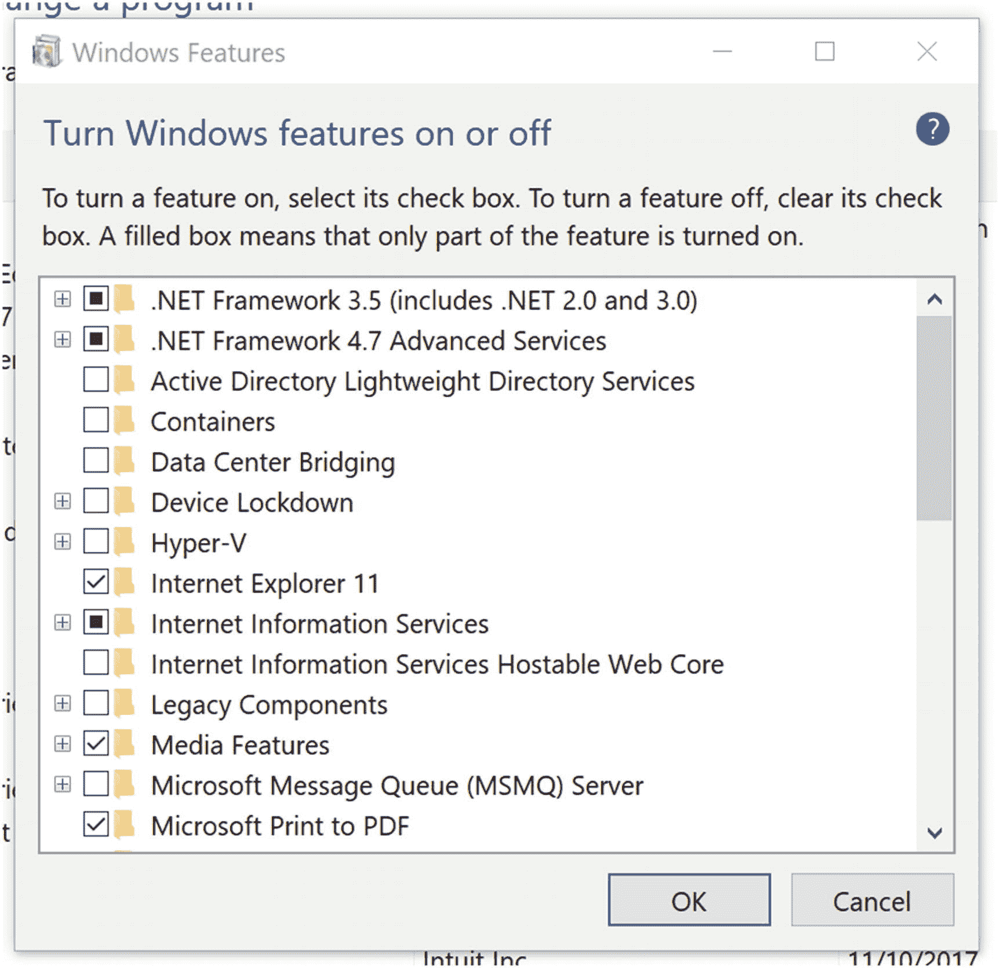
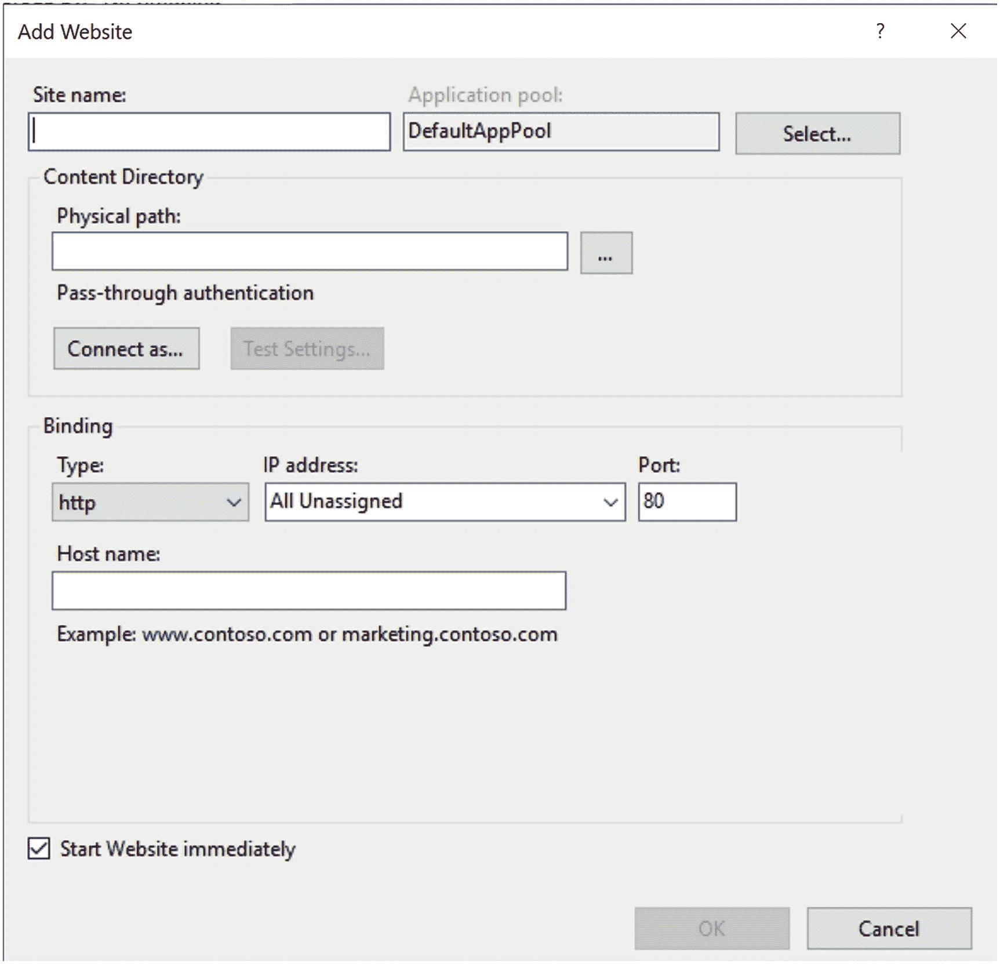
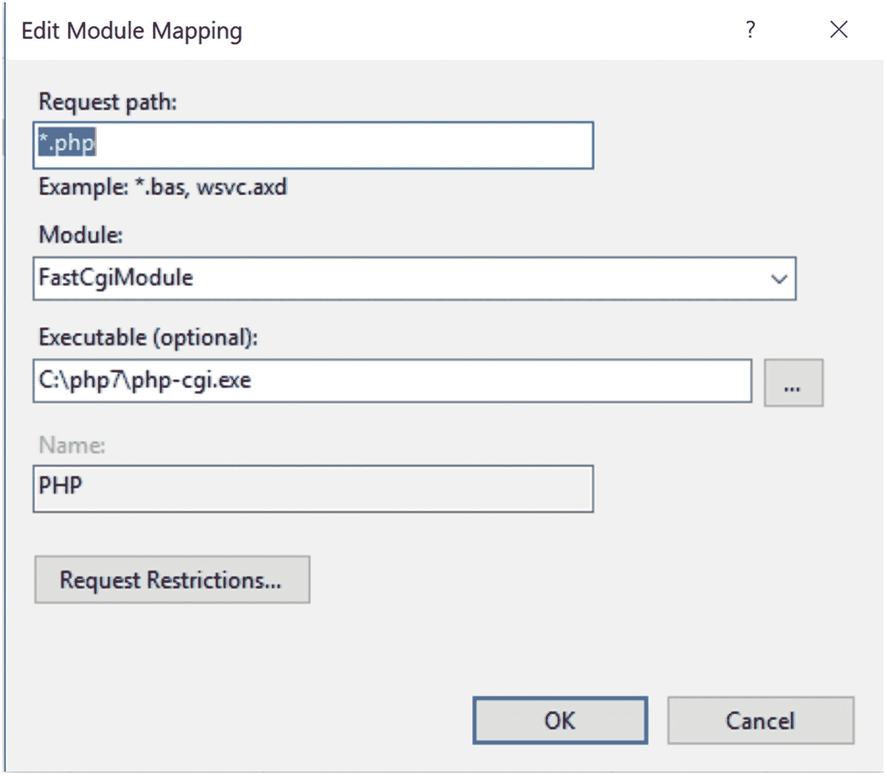
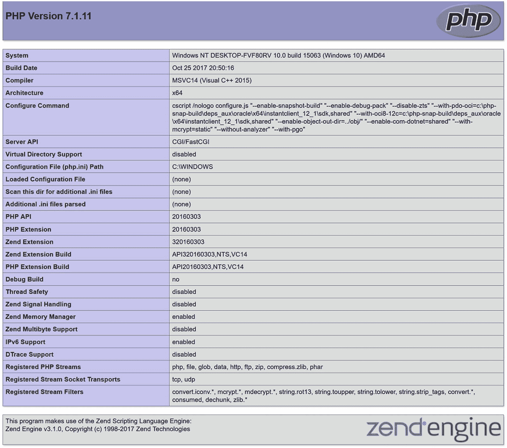

# 二、配置您的环境

PHP 的设计和创建是为了生成注入 HTML 文档的动态内容，或者生成由 web 服务器提供服务的完整 HTML 文档。web 服务器通常是连接到互联网的物理服务器，或者是数据中心中的虚拟或共享服务器。作为开发人员，您还需要一个本地环境，用于开发和测试您正在开发的 web 页面，然后再将它们部署到服务器上。因为 PHP 可以在许多系统上使用，并且支持大量的 web 服务器，所以不可能在一章中涵盖所有可能的组合，但是我们可以涵盖一些最常见的配置。

Apache ( [`https://httpd.apache.org`](https://httpd.apache.org) ) web 服务器已经统治 PHP 环境很长时间了，但是由于速度和内存使用的提高，新的服务器正在获得牵引力。增长最快的服务器之一是 Nginx ( [`https://www.nginx.org/`](https://www.nginx.org/) ) web 服务器。在基于 Windows 的系统上，也可以使用微软的互联网信息服务器(IIS) ( [`https://www.iis.net/`](https://www.iis.net/) )。这三款服务器的市场份额对比可以在这里找到: [`https://w3techs.com/technologies/comparison/ws-apache,ws-microsoftiis,ws-nginx`](https://w3techs.com/technologies/comparison/ws-apache,ws-microsoftiis,ws-nginx) 。

某种形式的 Linux 似乎是托管网站最喜欢的操作系统。但开发人员仍然主要使用 Windows 或 macOS 笔记本电脑/台式机进行开发；使用 Linux 作为开发平台的开发人员数量不多，但在不断增加。2017 年的堆栈溢出调查提供了支持这一说法的数字( [`https://insights.stackoverflow.com/survey/2017`](https://insights.stackoverflow.com/survey/2017) )，尽管这涵盖了 PHP 开发以外的内容。

如果你是一个项目的唯一开发者；您很可能可以在您的本地环境中做任何事情；但是如果您是团队的一员，您可能希望考虑一个共享的 web 服务器，您可以在那里开发/部署和测试您的代码，然后再将代码提交到生产服务器。让开发/测试服务器的配置与生产环境接近一致是一种很好的做法。这将有助于在新页面上线之前发现与系统配置相关的错误。

在设置 web 服务器时，至少有四种基本类型需要考虑:

*   拥有自己的硬件。您可以完全控制硬件的类型、CPU 的数量和类型、硬盘大小和内存等。您甚至可以联系 IT 部门来为您配置和管理服务器。这种类型的 pf 环境让您可以完全控制，但很可能会有很高的硬件购买初始成本和很高的互联网连接订阅成本。服务器可以托管在您自己的设施中，或者您可以在数据中心租用空间，也称为共置。

*   一种共享的主机环境，其中主机提供商配置硬件和软件，并为您提供一个用户帐户，该帐户可以访问共享主机上的单个虚拟 web 服务器。在大多数情况下，您将可以访问服务器上的单个目录，并且您对 PHP 的配置或您可以访问的特性没有任何影响。每台服务器将托管多个网站，资源共享可能会有问题，但这通常是最便宜的虚拟主机形式。

*   租赁但专用的硬件。数据中心将安装和配置硬件，并将其出租，允许用户完全访问硬件。

*   作为一个中间地带，你可以选择虚拟专用服务器(VPS ),托管公司利用一个强大的服务器群，可以同时托管多个操作系统。你将负责选择和配置操作系统，并安装所有的软件，你需要主持你的网站。你每月只需 10 美元就可以开始；参见( [`https://www.digitalocean.com`](https://www.digitalocean.com) 和 [`https://www.linode.com/`](https://www.linode.com/) 仅举几个例子)，有许多主机服务提供商在许多大洲都有数据中心，使得在接近预期用户的地方托管您的新网站成为可能。有了虚拟主机，随着网站流量的增长，升级到更多的 CPU、内存或硬盘空间也变得非常容易。无需购买新硬件，只需选择新计划并迁移服务器。这些主机提供商大多支持迁移，所有的配置都被复制，这样网站在短暂的停机后还能继续工作。

其他云公司也提供对托管环境和许多其他服务的访问。 [`https://aws.amazon.com/ec2/`](https://aws.amazon.com/ec2/) 和 [`https://azure.microsoft.com`](https://azure.microsoft.com) 就是其中的两个例子。

## 选择托管环境

发布网站从未如此简单。有无数基于云的托管选项，您可以按需付费，并且可以轻松升级到更强大的配置，而无需订购硬件、安装操作系统，然后安装所需的所有软件。

### 虚拟服务器

如今，最常见的基础架构是虚拟服务器。它就像一个普通的服务器一样工作。你首先去你喜欢的主机提供商(亚马逊 AWS，微软 Azure，谷歌云，数字海洋，Linode，和许多其他的)。第一步是创建一个账户，并提供一张信用卡进行支付。接下来选择服务器的大小(CPU、内存、磁盘空间和网络带宽)，然后选择数据中心，最后选择操作系统。几分钟后，您将能够使用 ssh 连接到主机。

### 平台即服务(PaaS)

如果您想跳过操作系统和 web 服务器软件堆栈的安装、配置和维护，您可以选择 PaaS 解决方案。这也是基于云的，但它更像传统的共享主机。服务提供商将安装和配置运行应用程序所需的一切，在本例中是 PHP。你所要做的就是把你的 PHP 代码上传到服务器上。这些服务由 Cloudways、Fortrabbit、Appfog、Engine Yard 等公司提供。

## 安装先决条件

配置环境的第一步通常从下载和安装 web 服务器开始。只要配置为在不同的 TCP 端口上运行，就可以在同一系统上安装多个 web 服务器。对于 http 和 https 协议，web 服务器的默认端口号是 80 和 443，但是您可以选择任何尚未使用的端口。在生产环境中，网站会与一个主机名( [`www.example.com`](http://www.example.com) )相关联。主机名与一个 IP 地址相关联(在本例中为 93.184.216.34)。多个主机名可以链接到同一个 IP 地址。这意味着网站托管在同一台服务器上。在开发环境中，您可能不需要完成主机名的配置。在这种情况下，您可以使用您的环境的 IP 地址和每个网站的新端口号。

### Windows 操作系统

在 Windows (10 和 8)上，我们从下载 PHP 的二进制包开始。这个步骤对于任何 web 服务器都是一样的。PHP 的当前版本可以在 [`https://windows.php.net/download/`](https://windows.php.net/download/) 找到，在那里你还可以找到其他有用的信息和链接。它有 x86 (32 位)和 x64 (64 位)两种版本。您应该选择与您的操作系统相匹配的版本。在 Windows 上，还有线程安全(TS)和非线程安全(NTS)版本可供选择。在本章中，我们将使用 NTS 版本，并使用 FastCGI 来集成 web 服务器。下载并解压 zip 存档文件。在本例中，我选择 c:\php7 作为将文件解压到的文件夹。

您可以通过打开一个终端窗口(CMD 或 PowerShel)并执行以下步骤来轻松测试 PHP:

```php
cd \php7
.\php -v

```

输出将如下所示:

```php
PHP 7.1.11 (cli) (built: Oct 25 2017 20:54:15) ( NTS MSVC14 (Visual C++ 2015) x64 )
Copyright (c) 1997-2017 The PHP Group
Zend Engine v3.1.0, Copyright (c) 1998-2017 Zend Technologies

```

这是一个使用 PHP 命令行(cli)版本的例子。稍后会详细介绍。

建议您在开发中使用与生产中相同的服务器。在下面几节中，我们将介绍如何安装和配置 IIS、Apache 和 Nginx web 服务器，以使用我们刚刚下载和安装的 PHP 二进制文件。

#### （同 ImmigrationInspectors 移民检查）

在 Windows 10(和 8)上安装 IIS 从控制面板开始。打开程序和功能部分，并单击左侧的打开或关闭 Windows 功能。这将打开一个弹出窗口，显示一长串可用功能，如图 [2-1](#Fig1) 所示。



图 2-1

*视窗* *功能*

如果未安装任何内容，Internet 信息服务旁边将不会有复选标记。单击复选框将选择安装选项。黑色方块表示没有安装 IIS 下的所有选项。如果扩展服务，您可以从许多选项中进行选择。为了使用 PHP，你必须选择如图 [2-2](#Fig2) 所示的 CGI 选项。


图 2-2

*IIS 选项*

选择选项并按“确定”后，Windows 将安装所有选定的功能，您将可以配置第一个网站。我已经创建了一个名为 c:\Web 的目录，我将在那里保存我的网站。在那个文件夹中，我创建了一个名为 site 的文件夹，并放了一个名为 phpinfo.php 的文件。这是一个非常基本的文件，如下所示:

```php
<?php
phpinfo();

```

`phpinfo()`函数是一个内置函数，可以用来显示配置细节、安装的模块和其他参数。像这样的文件不应该存在于生产系统中，因为它可能会给黑客提供攻击服务器所需的信息。

现在让我们继续配置 IIS 下的第一个网站。这从启动 IIS 管理器开始。只需在 Windows 搜索栏中键入 IIS，然后选择应用程序 Internet Information Server (IIS)管理器。

展开左侧的树以查看名为 Sites 的文件夹，并右键单击该文件夹以获得上下文菜单。这个菜单应该包括顶部的选项添加网站。选择此选项将打开一个弹出窗口，如图 [2-3](#Fig3) 所示。



图 2-3

添加网站

重要的字段是名称(测试)、物理路径(c:\Web\site)和端口号(8081)。当您添加这些值并单击“确定”时，网站将被创建。此时，网站只支持 HTML 和可能的 ASP 脚本，这取决于您安装的功能。为了启用 PHP 脚本，您必须添加一个处理程序。单击左侧面板中的测试网站，然后双击处理程序映射图标。这将显示现有处理程序的列表。现在右键单击 mappings 列表中的任意位置，并选择 Add Module Mapping 选项。这将弹出一个窗口，您可以在其中输入必要的参数，如图 [2-4](#Fig4) 所示。



图 2-4

*配置* *PHP 处理程序*

现在，您可以通过单击左侧面板中的 Test(我们给服务器起的名字),然后单击右侧面板中的 restart 链接来重启 web 服务器。要测试服务器，请打开您最喜欢的浏览器并键入`http://localhost:8081/phpinfo.php`。这将产生如图 [2-5](#Fig5) 所示的输出。



图 2-5

PHP 信息

输出很长，包含每个已安装扩展的部分。图 [2-5](#Fig5) 仅显示输出的第一页。

#### 街头流氓

转移到阿帕奇。有两种不同的方法来集成 PHP 和 Apache。如果你正在使用 PHP 的非线程安全版本，你将不得不像我们使用 IIS 一样使用 FastCGI。这是最容易操作的版本，推荐给初学者。如果您使用的是线程安全版本，那么您可以使用 Apache 模块，该模块将在 Apache 启动时加载 PHP 模块。长期以来，这一直是 PHP 首选的 web 服务器，Windows 二进制文件由 Apache Lounge 提供，而不是由 Apache Foundation 维护的网站( [`https://www.apachelounge.com/download/`](https://www.apachelounge.com/download/) )。建议使用与您的操作系统(x86 或 x64)匹配的最新副本和版本。下载文件是一个 zip 存档文件，其中包含一个名为 Apache24 的文件夹。只需将这个文件夹解压到 c:\Apache24。要使用 FastCGI 版本，您还必须从同一站点下载 mod_fcgid 归档文件，并将 mod_fcgid.so 复制到 c:\Apache24\modules。

导航到 c:\Apache24\conf 文件夹，在那里您将找到 httpd.conf，这是 Apache 的主要配置文件。在您最喜欢的编辑器中打开该文件，并将包含`Listen 80`的行更改为`Listen 8082`。您可以使用系统中尚未使用的任何端口号。我们对 IIS 使用 8081，为了让两台服务器安装在同一系统上，我们对 Apache 使用 8082 端口。

您还需要取消靠近虚拟主机文件底部的那一行的注释，并添加一行来包含 PHP 特定的配置。这可能看起来像`Include conf/extra/httpd-php.conf.`你将不得不创建文件`c:\Apache24\conf\extra\httpd-php.conf`与以下内容:

```php
#
LoadModule fcgid_module modules/mod_fcgid.so
FcgidInitialEnv PHPRC "c:/php7"
AddHandler fcgid-script .php
FcgidWrapper "c:/php7/php-cgi.exe" .php

```

如果您使用线程安全版本和 Apache PHP 模块，该文件应该如下所示:

```php
#
AddHandler application/x-httpd-php .php
AddType application/x-httpd-php .php .html
LoadModule php7_module "c:/php7ts/php7apache2_4.dll"
PHPIniDir "c:/php7ts"

```

注意，PHP 文件夹名为 php7ts。这是因为我的系统上安装了两个版本。您必须调整文件夹名称以匹配您系统上的安装。

无论哪种情况，您都需要为您的站点配置一个虚拟主机。在这种情况下，我们使用 c:\Web\site 中与 IIS 服务器相同的站点。https-vhosts.conf 文件应该如下所示:

```php
<VirtualHost *:8082>
    ServerAdmin webmaster@dummy-host.example.com
    DocumentRoot "c:/Web/site"
    ServerName dummy-host.example.com
    ServerAlias www.dummy-host.example.com
    ErrorLog "logs/dummy-host.example.com-error.log"
    CustomLog "logs/dummy-host.example.com-access.log" common
</VirtualHost>
<Directory "c:/Web/site" >
    Options FollowSymLinks Includes ExecCGI
    AllowOverride All
    Require all granted
</Directory>

```

`<Directory>`部分用于提供 Apache 访问来读取系统上的文件。

现在您已经完成了 web 服务器的配置，是时候启动它了。简单的方法是运行命令 c:\Apache24\bin\httpd。如果配置没有错误，服务器将启动，您可以打开浏览器并键入地址`http://localhost:8082/phpinfo.php`，它将显示类似于图 [2-5](#Fig5) 所示的信息页面。

如果你想让 Apache 作为一个 Windows 服务安装，你可以运行命令`c:\Apache24\bin\httpd -k install`，然后你可以使用`c:\Apache24\bin\httpd -k start`和`c:\Apache24\bin\httpd -k stop`与服务交互。

#### Nginx

web 服务器领域的新成员是 Nginx。这是一个轻量级的服务，可以与 Windows 上的 FastCGI 版本的 PHP 进行交互。正如我们稍后将展示的，它使用 Linux 上的 PHP-FPM 接口。前往 [`http://nginx.org/en/download.html`](http://nginx.org/en/download.html) 下载最新稳定版本。它是一个 zip 文件，可以解压到 c:\nginx-1.12.2(取决于当前的版本号)。在 Windows 上，为了使用 Nginx，应该已经运行了 php-cgi.exe 二进制文件。这可以通过从命令行运行命令`c:\php7\php-cgi.exe -b 127.0.0.1:9123`来完成。这将使命令行窗口保持打开。如果您想避免这种情况，可以下载一个实用程序，在隐藏窗口中运行该命令。该实用程序可以从 [`http://redmine.lighttpd.net/attachments/660/RunHiddenConsole.zip`](http://redmine.lighttpd.net/attachments/660/RunHiddenConsole.zip) 下载。如果您将可执行文件放在 nginx 文件夹中，启动命令将如下所示:

```php
c:\nginx-1.12.2\RunHiddenConsole.exe c:\php7\php-cgi.exe -b 127.0.0.1:9123

```

端口号 9123 是任意选择的。您可以使用与您的系统匹配的任何未使用的号码。您只需要确保在 nginx 配置文件中使用相同的编号。在您最喜欢的编辑器中打开 c:\ nginx-1 . 12 . 2 \ conf \ nginx . conf，将 server 部分中的 listen 行更新为 8083 而不是 80，并在 server 块中添加一个如下所示的部分:

```php
root c:/Web/site;

location ~ \.php$ {
    fastcgi_pass   127.0.0.1:9123;
    fastcgi_index  index.php;
    fastcgi_param  SCRIPT_FILENAME  $document_root$fastcgi_script_name;
    include        fastcgi_params;
}

```

现在，您可以从命令行使用命令`c:\nginx-1.12.2\nginx`启动 nginx 服务器。确保您位于 nginx-1.12.2 文件夹中。要测试服务器，请打开浏览器并转到`http://localhost:8083/phpinfo.php`。您将再次看到如图 [2-5](#Fig5) 所示的信息页面。

### 苹果

macOS 预装了 PHP。不幸的是，它通常是一个旧版本的 PHP，目前在 OS X 的最新版本 High Sierra 上是 5.6.30 和 7.1。最佳做法是使用 Mac OSX 可用的软件包管理器(MacPorts 或 Homebrew)之一来获得最新版本的 PHP。这些包管理器以一种易于在 OSX 上安装和使用的方式提供了一大套在 Linux 平台上可用的软件包。

在安装 Homebrew 之前，您需要下载并安装 Xcode。Xcode 是 app store 的免费应用。下载后，您必须从终端窗口运行该命令。

```php
xcode-select – install

```

为了使用自制软件( [`https://brew.sh/`](https://brew.sh/) )，你必须先安装一些基本的组件。这可以通过在终端中运行以下命令来实现:

```php
/usr/bin/ruby -e "$(curl -fsSL https://raw.githubusercontent.com/Homebrew/install/master/install)"

```

这将安装和配置 brew 系统。建议定期运行以下命令，以确保您拥有最新版本的安装包和 Homebrew 本身。

```php
$ brew update
$ brew upgrade

```

要开始安装 PHP，你必须运行几个命令，允许自制软件进入公式库。

```php
brew tap homebrew/dupes
brew tap homebrew/versions
brew tap homebrew/homebrew-php

```

现在您可以运行命令来安装 php 7.1

```php
brew install php71

```

要安装 nginx，运行以下命令

```php
brew install nginx

```

这将安装和配置 Nginx 在端口 8080 上运行，这允许它在没有超级用户访问(sudo)的情况下启动。

默认配置使用/usr/local/var/www 作为文档根目录。将包含以下内容的文件放在那里可以用来测试配置。

```php
<?php
phpinfo();

```

Nginx 的默认配置将 PHP 部分注释掉了。在您喜欢的编辑器中打开/usr/local/etc/nginx . nginx . conf，取消对以下部分的注释:

```php
location ~ \.php$ {
    root                 html;
    fastcgi_pass  127.0.0.1:9000
    fastcgi_index index.php;
    fastcgi_param SCRIPT_NAME $document_root$fastcgi_script_name
    include              fastcgi_params;
}

```

现在我们需要做的就是启动服务器。首先，我们启动 php-cgi 监听端口 9000，然后启动 nginx 服务器。

```php
# php-cgi -b 127.0.0.1:9000 &
# nginx

```

打开浏览器，在地址栏中键入 localhost:8080/phpinfo.php。这将显示类似于上面窗口部分中显示的图 [2-5](#Fig5) 的输出。

### Linux 操作系统

在基于 Linux 的操作系统上安装 PHP 通常从该系统上的包管理器开始。基于 Red Hat 的系统(CentOS、RHEL 或 Fedora)称为 yum。在其他系统上，它可能是 apt-get。Linux 发行版的维护者将构建包含 web 服务器、PHP、PHP 扩展和您可能需要的其他软件组件的包。它们中的许多甚至会提供依赖管理，所以当你试图安装一个软件包，而系统缺少一个或多个其他软件包时，它会根据系统的建议来安装这些软件包。

如果您刚刚安装了 CentOS 系统，可以使用下面的命令来安装 nginx 和 php:

```php
%> yum install nginx php71u-cli php71u-fpm

```

或者，如果您的首选发行版是基于 Debian/Ubunto 的，您将运行 apt-get 命令来安装类似的库。

```php
%> apt-get install nginx
%>apt-get install php-fpm

```

这将安装 Nginx web 服务器，PHP 的 web 服务器和命令行(CLI)，它将安装一个特殊的组件称为 FastCGI 进程管理器(FPM)。这是一个 the FastCGI 版本的包装器，允许对负载较重的站点进行更多的调优。

根据 Linux 发行版的不同，PHP 文件最终会出现在发行版维护者定义的目录结构中。配置文件最有可能以/etc 结尾。

### 来源

PHP 也有源代码发行版(或者你可以直接去 GitHub [`https://github.com/php/php-src`](https://github.com/php/php-src) )。如果你想改进 PHP 或者添加你自己的扩展，这是一条可行之路。它需要关于你正在工作的平台上的配置工具和编译器的知识，但是它也允许你在最新版本的 PHP 上运行，甚至是尚未发布的版本。

## 配置 PHP

当您的系统上安装了 web 服务器和 PHP 二进制文件后，您就可以开始配置 PHP 了。这是通过一个名为 php.ini 的文件来完成的。这个文件的位置取决于操作系统和您使用的 php 发行版。在 Windows 上，它将位于 c:\php7 中(或者您选择将 zip 文件解压缩到的文件夹的名称)；在 Mac 和 Linux 上，它可能在/etc(或/usr/local/etc)中。您可以在命令行上使用 phpinfo()函数或 php -I 来获取 php.ini 文件的位置。

php.ini 文件用于控制 php 的运行时配置。如果您自己编译 PHP，您也可以控制编译时配置。编译时配置用于定义要包含在二进制文件中的模块，选择线程安全或非线程安全选项等。运行时配置用于定义 PHP 运行的环境，有许多选项。完整的列表可以在 PHP 文档 [`https://php.net/manual/en/ini.list.php`](https://php.net/manual/en/ini.list.php) 中找到。

PHP 的基本包包含两个版本，分别叫做 php.ini-development 和 php.ini-production。这些文件针对开发和生产环境进行了优化。您必须将其中一个文件重命名为 php.ini，并可能重启 web 服务器来加载该文件。如果您使用软件包管理器安装，这通常会自动处理。您也可以从一个空文件启动自己的 php.ini 版本。这将使您完全控制内容，但要小心，因为这可能会遗漏重要的配置选项。如果您使用包管理器来获得 PHP 二进制文件，这些文件可能会有不同的名称，您可能会获得 Linux 发行版提供的 php.ini 版本。

根据 php 的调用方式(使用的 SAPI)，可以创建 php.ini 文件的特殊版本。如果您将 PHP 同时用作 web 服务器的一部分和命令行(cli)工具，这将非常有用。您可以创建一个名为 php-cli.ini 的文件。如果在使用命令行版本时该文件存在(在 php.ini 所在的同一目录中),将使用它来代替常规的 php.ini。只有在 php-cli.ini 不存在时才使用 php.ini 文件。可以为任何受支持的 SAPIs 创建 php.ini 版本。

php.ini 文件可以用来配置 php 行为的几乎任何方面。有关完整和最新的选项列表，请参见 [`https://php.net/manual/en/configuration.file.php`](https://php.net/manual/en/configuration.file.php) 和 [`https://php.net/manual/en/ini.php`](https://php.net/manual/en/ini.php) 。

某些配置选项可以在中被覆盖。或者通过使用 PHP 脚本中的`ini_set()`函数。如果您托管在一个共享环境中，并且没有权限编辑 php.ini 文件，那么您可以使用。您的 PHP 脚本所在的目录中的 htaccess。这将允许您覆盖 php.ini 中定义的一些值，但它会带来性能开销，因为每个请求都会对文件进行评估，尽管这只是中等流量到大流量级别的站点的问题。

每个配置选项都有四个不同的范围类别。每个类都定义了如何改变它们。

*   `PHP_INI_PERDIR`:可以在`php.ini`、`httpd.conf`或`.htaccess`文件中修改指令

*   `PHP_INI_SYSTEM`:指令可以在`php.ini`和`httpd.conf`文件中修改

*   `PHP_INI_USER`:可以在用户脚本中修改指令

*   `PHP_INI_ALL`:指令可以在任何地方修改

配置选项的文档包括类。

php.ini 文件是一个纯文本文件，包含节、注释以及成对的键和值。节是方括号中的名称，就像[PHP]。部分名称用于将配置选项分组到逻辑存储桶中。注释由一行第一个位置的分号(`;`)标识。每个配置选项都被写成 key = value，例如`engine = On`。

默认的 ini 文件包含一个 PHP 常规设置部分，然后是每个已安装模块的一个部分。常规 PHP 部分包含以下逻辑子部分:

*   关于 PHP . ini——文件和特性的描述

*   快速参考–生产和开发版本之间的差异

*   php.ini 选项–用户定义的 ini 文件

*   语言选项

*   多方面的

*   资源限制

*   错误处理和记录

*   数据处理

*   路径和目录

*   文件上传(在第 [15 章](15.html)中介绍)

*   Fopen 包装纸

*   动态扩展

### Apache httpd.conf 和。htaccess 文件

当 PHP 作为 Apache 模块运行时，您可以通过`httpd.conf`文件或`.htaccess`文件修改许多 PHP 指令。这是通过在指令/值赋值前添加以下关键字之一来实现的:

*   `php_value`:设置指定指令的值。

*   `php_flag`:设置指定布尔指令的值。

*   `php_admin_value`:设置指定指令的值。这与`php_value`不同，它不能在`.htaccess`文件中使用，也不能在虚拟主机或`.htaccess`中被覆盖。

*   `php_admin_flag`:设置指定指令的值。这与`php_value`不同，它不能在`.htaccess`文件中使用，也不能在虚拟主机或`.htaccess`中被覆盖。

例如，要禁用短标记指令并防止其他人覆盖它，请将下面一行添加到您的`httpd.conf`文件中:

```php
php_admin_flag short_open_tag Off

```

### 在执行脚本中

第三种，也是最本地化的，操作 PHP 配置变量的方法是通过 PHP 脚本本身的`ini_set()`函数。例如，假设您想修改 PHP 给定脚本的最大执行时间。只需将以下命令嵌入 PHP 脚本的顶部:

```php
<?php
ini_set('max_execution_time', '60');

```

### PHP 的配置指令

以下部分介绍了 PHP 的许多核心配置指令。除了一般定义之外，每个部分还包括配置指令的范围和默认值。因为您可能会花大部分时间在`php.ini`文件中处理这些变量，所以当这些指令出现在这个文件中时，它们就会被引入。

请注意，本节介绍的指令在很大程度上只与 PHP 的一般行为相关；本节不介绍与扩展相关的指令，也不介绍与本书后面重点关注的主题相关的指令，而是在相应的章节中介绍。

#### 语言选项

本节中的指令决定了该语言的一些最基本的行为。您肯定想花一些时间来熟悉这些配置的可能性。请注意，我只强调了一些最常用的指令。请花些时间仔细阅读您的`php.ini`文件，了解您还可以使用哪些指令。

##### 引擎= *开|关*

范围:`PHP_INI_ALL`；默认值:`On`

这是语言选项部分中的第一个选项，但是只有在将 PHP 作为 Apache 模块运行时才有用。在这种情况下，可以使用每个目录的设置来启用/禁用 PHP 解析器。一般来说，您希望保留这个选项以使 PHP 有用。

##### short_open_tag = *On | Off*

范围:`PHP_INI_PERDIR`；默认值:`On`

尽管这在默认情况下是打开的，但在 php.ini 的分布式版本中是关闭的(-生产和开发)。PHP 脚本组件包含在转义语法中。有四种不同的转义格式，其中最短的称为短开始标记，如下所示:

```php
<?
    echo "Some PHP statement";
?>

```

您可能认识到这种语法与 XML 是共享的，这在某些环境中可能会导致问题。因此，提供了一种禁用这种特定格式的方法。当`short_open_tag`使能(`On`)时，允许短标签；当残疾人(`Off`)时，他们不是。

##### 精度 *=整数*

范围:`PHP_INI_ALL`；默认值:`14`

PHP 支持多种数据类型，包括浮点数。`precision`参数指定浮点数表示中显示的有效位数。请注意，该值在 Win32 系统上设置为 12 位，在 Linux 上设置为 14 位。

##### output_buffering = *On | Off |整数*

范围:`PHP_INI_PERDIR;`默认值:`4096`

任何人，哪怕只有很少的 PHP 经验，都可能非常熟悉下面两条消息:

```php
"Cannot add header information – headers already sent"
"Oops, php_set_cookie called after header has been sent"

```

当脚本试图修改已经发送回请求用户的标题时，会出现这些消息。最常见的情况是，在一些输出已经被发送回浏览器之后，程序员试图向用户发送 cookie，这是不可能完成的，因为标题(用户看不到，但浏览器会使用)总是在该输出之前。PHP 4.0 版通过引入输出缓冲的概念为这个恼人的问题提供了一个解决方案。启用时，输出缓冲告诉 PHP 在脚本完成后立即发送所有输出。这样，对头部的任何后续更改都可以在整个脚本中进行，因为它还没有被发送。启用`output_buffering`指令打开输出缓冲。或者，您可以通过将输出缓冲区设置为您希望该缓冲区包含的最大字节数来限制输出缓冲区的大小(从而隐式启用输出缓冲)。

如果不打算使用输出缓冲，应该禁用该指令，因为它会稍微降低性能。当然，解决标题问题的最简单的方法就是尽可能在任何其他内容之前传递信息。

##### output_handler = *字符串*

范围:`PHP_INI_PERDIR`；默认值:`NULL`

这个有趣的指令告诉 PHP 在将所有输出返回给请求用户之前，通过一个内置的输出函数传递它。例如，假设您希望在将所有输出返回到浏览器之前对其进行压缩，这是所有主流 HTTP/1.1 兼容浏览器都支持的一个特性。你可以这样分配`output_handler`:

```php
output_handler = "ob_gzhandler"

```

`ob_gzhandler()`是 PHP 的压缩处理函数，位于 PHP 的输出控制库中。请记住，您不能同时将`output_handler`设置为`ob_gzhandler()`并启用`zlib.output_compression`(接下来讨论)。输出压缩通常由 web 服务器处理。在 PHP 中使用这个特性会导致一些 web 服务器出现问题。

##### zlib . output _ compression =*On | Off | integer*

范围:`PHP_INI_ALL`；默认值:`Off`

在输出返回到浏览器之前对其进行压缩可以节省带宽和时间。大多数现代浏览器都支持这一 HTTP/1.1 特性，并且可以安全地在大多数应用程序中使用。您可以通过将`zlib.output_compression`设置为`On`来启用自动输出压缩。此外，通过给`zlib.output_compression`分配一个整数值，您可以同时启用输出压缩和设置压缩缓冲区大小(以字节为单位)。

##### zlib . output _ handler =*string*

范围:`PHP_INI_ALL`；默认值:`NULL`

如果`zlib`库不可用，`zlib.output_handler`指定一个特定的压缩库。

##### implicit_flush = *On | Off*

范围:`PHP_INI_ALL`；默认值:`Off`

启用`implicit_flush`会导致在每次调用`print()`或`echo()`并完成每个嵌入的 HTML 块后，自动清除或刷新其内容的输出缓冲区。在服务器需要很长时间来编译结果或执行某些计算的情况下，这可能很有用。在这种情况下，您可以使用此功能向用户输出状态更新，而不是等待服务器完成该过程。使用此功能会对性能产生影响。我们总是建议在尽可能短的时间内生成所有输出并返回给用户。对于高流量的网站，你应该考虑毫秒。

##### serialize_precision = *整数*

范围:`PHP_INI_ALL`；默认值:`-1`

当 doubles 和 floats 被序列化时，`serialize_precision`指令决定了存储在浮点之后的位数。将此值设置为适当的值，可以确保在以后对数字进行非序列化时不会损失精度。

##### open _ base dir =字符串

范围:`PHP_INI_ALL`；默认值:`NULL`

很像 Apache 的`DocumentRoot`指令，PHP 的`open_basedir`指令可以建立一个基本目录，所有的文件操作都被限制在这个目录中。这可以防止用户进入服务器的其他受限区域。例如，假设所有 web 资料都位于目录/home/www 中。为了防止用户通过几个简单的 PHP 命令查看和潜在操纵像`/etc/passwd`这样的文件，可以考虑这样设置`open_basedir`:

```php
open_basedir = "/home/www/"

```

##### disable_functions = *字符串*

范围:`php.ini only`；默认值:`NULL`

在某些环境中，您可能希望完全禁止使用某些默认函数，例如`exec()`和`system()` `.`这些函数可以通过将它们分配给 disable_function `s`参数来禁用，如下所示:

```php
disable_functions = "exec, system";

```

##### disable_classes = *字符串*

范围:`php.ini only`；默认值:`NULL`

考虑到 PHP 对面向对象范式的接受所提供的能力，用不了多久你就可以使用大型类库了。但是，在这些库中可能有某些您不希望提供的类。您可以通过`disable_classes`指令来阻止这些类的使用。例如，如果您想禁用两个名为`vector`和`graph`的特定类，您可以使用以下命令:

```php
disable_classes = "vector, graph"

```

请注意，该指令的影响并不依赖于 safe_mode 指令。

##### ignore _ user _ abort =*Off | On*

范围:`PHP_INI_ALL`；默认值:`Off`

有多少次你浏览到一个特定的页面，只是为了在页面完全加载之前退出或关闭浏览器？通常这种行为是无害的。但是，如果服务器正在更新重要的用户配置文件信息，或者正在完成一项商业交易，该怎么办呢？启用`ignore_user_abort`会导致服务器忽略由用户或浏览器发起的中断导致的会话终止。

#### 多方面的

杂项类别由一个指令`expose_php`组成。

##### expose_php = *On | Off*

范围:`php.ini only`；默认值:`On`

潜在攻击者能够收集到的关于 web 服务器的每一点信息都会增加他成功破坏 web 服务器的机会。获取有关服务器特征的关键信息的一种简单方法是通过服务器签名。例如，默认情况下，Apache 将在每个响应头中广播以下信息:

```php
Apache/2.7.0 (Unix) PHP/7.2.0 PHP/7.2.0-dev Server at www.example.com Port 80

```

禁用`expose_php`会阻止 web 服务器签名(如果启用的话)广播 PHP 已安装的事实。尽管您需要采取其他步骤来确保足够的服务器保护，但还是强烈建议您隐藏服务器属性，尤其是如果您想获得服务器的 PCI 认证。

### 注意

您可以通过在`httpd.conf`文件中将`ServerSignature`设置为`Off`来禁用 Apache 对其服务器签名的广播。

#### 资源限制

尽管 PHP 的资源管理功能在版本 5 中得到了改进，在版本 7 中减少了资源的使用，但是您仍然必须小心确保脚本不会因为程序员或用户发起的操作而独占服务器资源。这种过度消耗普遍存在的三个特定领域是脚本执行时间、脚本输入处理时间和内存。每个都可以通过以下三个指令来控制。

##### max_execution_time = *整数*

范围:`PHP_INI_ALL`；默认值:`30`

`max_execution_time`参数设置了 PHP 脚本可以执行的时间上限，以秒为单位。将该参数设置为`0`会禁用任何最大限值。注意，由 PHP 命令执行的外部程序所消耗的任何时间，比如`exec()`和`system()`，都不计入这个限制。PHP 的许多内置流函数和数据库函数也是如此。

##### max_input_time = *整数*

范围:`PHP_INI_ALL`；默认值:`60`

`max_input_time`参数限制了 PHP 脚本解析请求数据的时间，以秒为单位。当你使用 PHP 的文件上传功能上传大文件时，这个参数尤其重要，这将在第 [15 章](15.html)中讨论。

##### 内存限制= *内存*

范围:`PHP_INI_ALL`；默认值:12 `8M`

`memory_limit`参数决定了可以分配给 PHP 脚本的最大内存量，以兆字节为单位。

#### 数据处理

本节介绍的参数影响 PHP 处理外部变量的方式，这些变量通过一些外部来源传递到脚本中。GET、POST、cookies、操作系统和服务器都可能提供外部数据。本节中的其他参数决定了 PHP 的默认字符集、PHP 的默认 MIME 类型，以及外部文件是否会自动添加到 PHP 的返回输出中。

##### arg _ separator . output =*string*

范围:`PHP_INI_ALL`；默认值:`&`

PHP 能够自动生成 URL，并使用标准的&符号来分隔输入变量。但是，如果您需要覆盖这个约定，您可以通过使用`arg_separator.output`指令来实现。

##### arg _ separator . input =*string*

范围:`PHP_INI_PERDIR`；默认值:`&`

&符号(`&`)是用于分隔通过 POST 或 GET 方法传入的输入变量的标准字符。虽然不太可能，但是如果您需要在您的 PHP 应用程序中覆盖这个约定，您可以通过使用`arg_separator.input`指令来实现。

##### 变量 _ 顺序= *字符串*

范围:`PHP_INI_PERDIR`；默认值:`EGPCS`

`variables_order`指令决定了`ENVIRONMENT`、`GET`、`POST`、`COOKIE`和`SERVER`变量的解析顺序。这些值的排序可能会导致意外的结果，因为后面的变量会覆盖过程中前面解析的变量。

##### register_argc_argv = *开|关*

范围:`PHP_INI_PERDIR`；默认值:`1`

通过 GET 方法传递变量信息类似于向可执行文件传递参数。许多语言根据`argc`和`argv`来处理这样的参数。`argc`是参数计数，`argv`是包含参数的索引数组。如果你想声明变量`$argc`和`$argv`并模仿这个功能，启用`register_argc_argv`。这个特性主要用于 PHP 的 CLI 版本。

##### post_max_size = *integerM*

范围:`PHP_INI_PERDIR`；默认值:`8M`

在请求之间传递数据的两种方法中，POST 更适合传输大量数据，比如通过 web 表单发送的数据。然而，出于安全和性能的原因，您可能希望对通过这种方法发送给 PHP 脚本的数据量设置一个上限；这可以通过使用`post_max_size`来完成。

##### auto _ prepend _ file =*string*

范围:`PHP_INI_PERDIR`；默认值:`NULL`

在执行 PHP 脚本之前创建页眉模板或包含代码库通常是使用`include()`或`require()`函数来完成的。通过给`auto_prepend_file`指令指定文件名和相应的路径，您可以自动化这个过程，并且放弃在脚本中包含这些函数。

##### auto_append_file = *字符串*

范围:`PHP_INI_PERDIR`；默认值:`NULL`

在 PHP 脚本执行后自动插入页脚模板通常是使用`include()`或`require()`函数完成的。通过将模板文件名和相应的路径分配给`auto_append_file`指令，您可以自动化这个过程，并放弃在脚本中包含这些函数。

##### default _ mime type =字符串

范围:`PHP_INI_ALL`；默认值:`text/html`

MIME 类型提供了一种对互联网上的文件类型进行分类的标准方法。您可以通过 PHP 应用程序提供这些文件类型中的任何一种，最常见的是 text/html。但是，如果您以其他方式使用 PHP，比如为移动应用程序生成 JSON 格式的 API 响应，那么您需要相应地调整 MIME 类型。您可以通过修改 default_mimetype 指令来实现这一点。

##### default_charset = *string*

范围:`PHP_INI_ALL`；默认值:`UTF-8`

PHP 在 Content-Type 头中输出一个字符编码。默认情况下，这被设置为 UTF-8。

#### 路径和目录

本节介绍决定 PHP 默认路径设置的指令。这些路径用于包含库和扩展，以及用于确定用户 web 目录和 web 文档根目录。

##### include_path = *string*

范围:`PHP_INI_ALL`；默认值:`.;/path/to/php/pear`

如果第三个参数设置为 true，则该参数设置的路径将作为函数使用的基本路径，如`include()` `, require()`和`fopen()`。您可以指定多个目录，用分号分隔每个目录，如下例所示:

```php
include_path=".:/usr/local/include/php;/home/php"

```

请注意，在 Windows 上，使用反斜线代替正斜线，并且驱动器号位于路径的前面:

```php
include_path=".;C:\php\includes"

```

##### doc_root = *字符串*

范围:`PHP_INI_SYSTEM`；默认值:`NULL`

这个参数决定了所有 PHP 脚本的默认服务。只有当它不为空时，才使用此参数。

##### user_dir = *字符串*

范围:`PHP_INI_SYSTEM`；默认值:`NULL`

`user_dir`指令指定了 PHP 使用`/~username`约定打开文件时使用的绝对目录。例如，当`user_dir`被设置为`/home/users`并且用户试图打开文件`~/gilmore/collections/books.txt`时，PHP 知道绝对路径是`/home/users/gilmore/collections/books.txt`。

##### 扩展目录= *字符串*

范围:`PHP_INI_SYSTEM`；默认值:/path/to/php(在 Windows 上，默认值是`ext`)

指令告诉 PHP 它的可加载扩展(模块)在哪里。默认情况下，这设置为。/，这意味着可加载的扩展与正在执行的脚本位于同一目录中。在 Windows 环境下，如果没有设置 extension_dir，则默认为`C:\PHP-INSTALLATION-DIRECTORY\ext\`。

#### Fopen 包装纸

本节包含五个与远程文件的访问和操作相关的指令。

##### allow_url_fopen = *On | Off*

范围:`PHP_INI_SYSTEM`；默认值:`On`

启用`allow_url_fopen`允许 PHP 将远程文件视为本地文件。启用后，如果文件具有正确的权限，PHP 脚本可以访问和修改驻留在远程服务器上的文件。

##### from = *字符串*

范围:`PHP_INI_ALL`；默认值:`""`

指令的标题可能会引起误解，因为它实际上决定了用于执行 FTP 连接的匿名用户的密码，而不是身份。因此，如果`from`这样设定:

```php
from = "jason@example.com"

```

当请求认证时，用户名`anonymous`和密码`jason@example.com`将被传递给服务器。

##### user_agent = *string*

范围:`PHP_INI_ALL`；默认值:`NULL`

PHP 总是发送一个内容头及其处理后的输出，包括一个用户代理属性。该指令确定该属性的值。

##### default_socket_timeout = *整数*

范围:`PHP_INI_ALL`；默认值:`60`

此指令确定基于套接字的流的超时值，以秒为单位。

##### auto _ detect _ line _ endings =*On | Off*

范围:`PHP_INI_ALL`；默认值:`0`

开发人员感到沮丧的一个永无止境的原因是行尾(EOL)字符，因为不同的操作系统使用不同的语法。启用`auto_detect_line_endings`决定了`fgets()`和`file()`读取的数据是使用 Macintosh、MS-DOS 还是 Linux 文件约定(\r、\r\n 还是\n)。当读取文件的第一行时，启用此选项会导致较小的性能损失。

#### 动态扩展

本节包含一个指令`extension`。

##### 扩展名= *字符串*

范围:`php.ini only`；默认值:`NULL`

扩展指令用于动态加载特定的模块。在 Win32 操作系统上，模块可能是这样加载的:

```php
extension = php_bz2.dll

```

在 Unix 上，它将这样加载:

```php
extension = php_bz2.so

```

请记住，在任一操作系统上，简单地取消注释或添加这一行并不一定会启用相关的扩展。您还需要确保扩展已经编译或安装，并且操作系统上安装了任何必要的软件或库。

## 选择编辑

PHP 脚本是文本文件，可以用任何文本编辑器创建，但是现代编辑器或集成开发环境(IDE)提供了许多对开发人员有益的特性。选择一个支持所有你喜欢的语言或者至少 PHP 和 JavaScript 的 IDE 应该是必须的。语法突出显示、代码完成、文档集成和版本控制系统等都是现代 ide 中可用的特性。有一些开源或免费的编辑器(Atom、Komodo Edit、Visual Studio Code)和大量的商业产品(PHPStorm、Sublime Text 等)。有些编辑器可以在多个平台上使用，但是在选择 IDE 的时候，很大程度上取决于开发人员的偏好，也许在某种程度上还取决于您所工作的组织的文化。

### PHPStorm

PHP Storm 是一个强大的编辑器，也许是目前最受欢迎的编辑器。由 JetBrains ( [`https://www.jetbrains.com/phpstorm/`](https://www.jetbrains.com/phpstorm/) )提供。它支持 PHP、SQL、CSS、HTML、JavaScript 的代码补全；集成到版本控制和数据库，以及 xdebug 等。它被认为是一个完整的、同类最佳的 IDE。

### 原子

Atom ( [`https://atom.io`](https://atom.io) )是一个高度可配置的开源编辑器，对黑客攻击/改进编辑器本身是开放的。默认下载包括对 PHP 的支持，但是您必须下载一个自动完成包。

### 崇高的文本

Sublime Text ( [`https://www.sublimetext.com/`](https://www.sublimetext.com/) )适用于 Windows、Mac OSX 和许多 Linux 发行版(CentOS、Ubuntu、Debian 和其他一些发行版)。它是按用户许可的，允许您在多个系统上安装它，只要在任何给定时间只有一个系统在使用。

### Visual Studio 代码

微软已经创建了 Visual Studio 的免费版本([https://code . Visual Studio . com/](https://code.visualstudio.com/))。它可以在 Windows、Mac OSX 和 Linux 系统上运行。它没有本地 PHP 支持，但是有一个商业插件。

### PHP 开发工具

PDT 项目( [`https://www.eclipse.org/pdt`](https://www.eclipse.org/pdt) )目前看起来势头不小。在 Zend Technologies ltd .([`https://www.zend.com`](https://www.zend.com))的支持下，并构建在开源 Eclipse 平台( [`https://www.eclipse.org`](https://www.eclipse.org) )(一个用于构建开发工具的广受欢迎的可扩展框架)之上，PDT 很可能成为业余爱好者和专业人士事实上的开源 PHP IDE 的领跑者。

### 注意

Eclipse 框架已经成为许多项目的基础，这些项目促进了关键的开发任务，例如数据建模、商业智能和报告、测试和性能监控，以及最显著的编写代码。虽然 Eclipse 最出名的是它的 Java IDE，但它也有用于 C、C++、Cobol 以及最近的 PHP 等语言的 IDE。

### Zend 工作室

ZendStudio 是当今所有商业和开源产品中最强大的 PHP IDE 之一。作为 Zend Technologies Ltd .的旗舰产品，Zend Studio 提供了企业 IDE 的所有功能，包括全面的代码完成、CVS、Subversion 和 git 集成、对 Docker 的支持、内部和远程调试、代码分析以及方便的代码部署过程。

除了能够执行 SQL 查询以及查看和管理数据库模式和数据之外，还提供了将代码与 MySQL、Oracle、PostgreSQL 和 SQLite 等流行数据库集成的工具。

Zend Studio ( [`https://www.zend.com/products/studio`](https://www.zend.com/products/studio) )可用于 Windows、Linux 和 Mac OS X 平台。

## 摘要

在这一章中，你学习了如何配置你的环境来支持 PHP 驱动的 web 应用程序的开发。特别关注 PHP 的许多运行时配置选项。最后，向您简要介绍了最常用的 PHP 编辑器和 ide，以及在搜索 web 托管提供商时需要注意的一些问题。

在下一章中，你将通过创建你的第一个 PHP 驱动的网页和学习该语言的基本特性来开始你对 PHP 语言的探索。根据其结论，您将能够创建简单但非常有用的脚本。这些材料为后续章节奠定了基础，在这些章节中，您将获得开始构建一些真正酷的应用程序所需的知识。