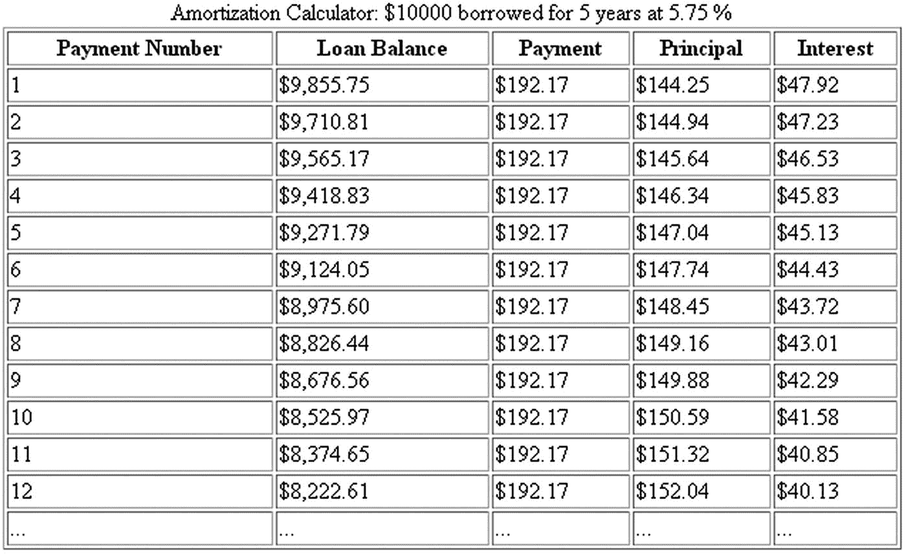

# 4.功能

计算机编程的存在是为了自动化对人类来说太困难或太乏味的任务，从抵押贷款支付计算到计算视频游戏中虚拟玩家发射的足球的轨迹。您经常会发现，这样的任务包含可以在其他地方重用的逻辑位，不仅在同一个应用程序中，而且在许多其他应用程序中。例如，一个电子商务应用程序可能需要在几个不同的页面上验证一个电子邮件地址，比如当一个新用户注册使用一个网站时，当某人想要添加一个产品评论时，或者当一个访问者注册一个时事通讯时。用于验证电子邮件地址的逻辑异常复杂，因此最好将代码保存在一个位置，而不是嵌入到多个页面中。

令人欣慰的是，将这些重复的过程包含在一段已命名的代码中，然后在必要时调用这个名字，这一概念长期以来一直是现代计算机语言的一个关键特征。这样一段代码被称为*函数*，如果它定义的流程需要在未来进行更改，它将为您提供单一参考点的便利，这极大地降低了编程错误的可能性和维护开销。幸运的是，PHP 语言自带了 1000 多个原生函数，但是创建自己的函数也很容易！在这一章中，你将学习所有关于 PHP 函数的知识，包括如何创建和调用它们，向它们传递输入，使用*类型提示*，向调用者返回单个和多个值，以及创建和包含函数库。

## 调用函数

标准 PHP 发行版内置了 1000 多个函数，其中许多函数您将在本书中看到。您可以简单地通过指定函数名来调用您想要的函数，假设该函数已经通过将库编译到已安装的发行版中或者通过`include()`或`require()`语句变得可用。例如，假设您想对数字 5 进行三次幂运算。你可以像这样调用 PHP 的`pow()`函数:

```php
<?php
    echo pow(5,3);
?>

```

如果您想将函数输出存储在一个变量中，您可以像这样分配它:

```php
<?php
    $value = pow(5,3); // returns 125
    echo $value;
?>

```

如果您想在一个更长的字符串中输出函数结果，您需要像这样连接它:

```php
echo "Five raised to the third power equals ".pow(5,3).".";

```

坦白地说，这种方法往往很混乱，所以我建议首先将函数输出赋给一个变量，然后将变量嵌入字符串，就像这样:

```php
$value = pow(5,3);
echo "Five raised to the third power equals {$value}.";

```

或者，你可以使用第三章中介绍的`printf()`:

```php
printf("Five raised to the third power equals %d.", pow(5,3));

```

在后三个示例中，将返回以下输出:

```php
Five raised to the third power equals 125.

```

### 尝试

PHP 的函数库非常庞大，因此您将花费大量时间阅读文档，以了解更多关于特定函数的输入参数和行为的信息。当您想要使用诸如 date()之类的函数时尤其如此，该函数支持近 40 种不同的用于定义日期格式的说明符。幸运的是，官方 PHP 站点提供了一个方便的快捷方式，可以通过名字快速访问函数；只需将函数名附加到域 [`https://www.php.net`](https://www.php.net) 上。因此，要访问 date()功能，请导航至 [`https://www.php.net/date`](https://www.php.net/date) 。

手动输入日期()后，花点时间考虑一下如何设置日期的格式。出于本练习的目的，让我们使用 date()以此格式返回日期:2017 年 11 月 2 日，星期四。浏览格式说明符列表以找到合适的组合。小写字母 l 定义了星期几的完整文本表示，大写字母 F 定义了月份的完整文本表示，小写字母 n 定义了月份中某一天的数字表示，最后大写字母 Y 定义了年份的四位数表示。因此，您将把`date()` call like 嵌入到启用 PHP 的页面中，如下所示:

```php
<?= date('l, F n, Y'); ?>

```

诚然，考虑到格式说明符的数量，函数`date()`有点反常；大多数 PHP 函数接受两个或三个参数，仅此而已。即便如此，你还是会发现快速导航到某个功能的能力非常方便。顺便说一下，它甚至适用于部分函数名！例如，假设您想将一个字符串全部转换为大写，但是不记得具体的函数名，只记得该名称包含字符串“upper”前往 [`https://www.php.net/upper`](https://www.php.net/upper) ，你会看到相关功能和其他文档条目的列表！

大多数现代的 ide 像 PHP Storm，Sublime Text，Eclipse 等等。，提供了一个自动完成功能，可以显示任何函数的参数列表。这既适用于内置的 PHP 函数，也适用于您从库中编写或包含的函数。你不必每次都阅读 PHP 手册来检查参数的顺序，但是如果你在寻找函数，这是一个方便的工具。

## 创建函数

尽管 PHP 种类繁多的函数库对任何试图避免重复编程的人来说都是一个巨大的好处，但最终您会想要封装一个标准发行版中没有的任务，这意味着您需要创建自定义函数甚至整个函数库。为此，您需要定义自己的函数。用伪代码编写的函数定义如下:

```php
function functionName(parameters)
{
    function body
}

```

虽然 PHP 对函数名没有太多限制(前提是不与现有的 PHP 函数冲突)，也没有格式约定，但一个常用的格式标准是 camel case 格式( [`https://en.wikipedia.org/wiki/CamelCase`](https://en.wikipedia.org/wiki/CamelCase) )，它规定函数名的第一个字母是小写的，任何后续复合词的第一个字母都是大写的。此外，为了提高代码的可读性，应该使用描述性的名称！

例如，假设您希望将当前日期嵌入到站点的多个位置，但是希望以后能够方便地在一个位置更新日期格式。创建一个名为`displayDate()`的函数，并在其中结合适当的格式说明符使用`date()`函数，如下所示:

```php
function displayDate()
{
    return date('l, F n, Y');
}

```

`return`语句正如其名称所暗示的那样，将相关的值返回给调用者。调用者是脚本中调用函数的位置，可能如下所示:

```php
<?= displayDate(); ?>

```

当函数执行时，日期将被确定并格式化(例如，2016 年 8 月 24 日，星期六)，结果返回给调用者。因为在这种情况下，您调用的是结合 PHP 的简短 echo 标记语法的`displayDate()`,当日期返回时，它将被直接嵌入到周围的页面中。

顺便说一下，您不需要输出函数结果。例如，您可以将结果赋给一个变量，如下所示:

```php
$date = displayDate();

```

### 返回多个值

从一个函数返回多个值通常很方便。例如，假设您想创建一个从数据库中检索用户数据(比如用户的姓名、电子邮件地址和电话号码)并将其返回给调用者的函数。`list()`构造提供了一种从数组中检索值的便捷方法，如下所示:

```php
<?php
    $colors = ["red","blue","green"];
    list($color1, $color2, $color3) = $colors;
?>

```

一旦`list()`构造执行完毕，`$color1`、`$color2`和`$color3`将分别被赋予`red`、`blue`和`green`。List()看起来像一个函数，但它实际上是一种语言结构，与用于右边计算并返回赋值的函数相比，它用在赋值运算符(=)的左边。

基于上一个例子中展示的概念，您可以想象如何使用`list()`从函数中返回三个先决条件值。

```php
<?php
    function retrieveUserProfile()
    {
        $user[] = "Jason Gilmore";
        $user[] = "jason@example.com";
        $user[] = "English";
        return $user;
    }

    list($name, $email, $language) = retrieveUserProfile();
    echo "Name: {$name}, email: {$email}, language: {$language}";
?>

```

执行该脚本将返回以下内容:

```php
Name: Jason Gilmore, email: jason@example.com, language: English

```

### 通过值传递参数

您会发现将数据传递给函数非常有用。例如，让我们创建一个函数，通过确定一件商品的销售税，然后将该金额加到价格上，来计算该商品的总成本。

```php
function calculateSalesTax($price, $tax)
{
    return $price + ($price * $tax);
}

```

该函数接受在计算中使用的两个参数，恰当地命名为`$price`和`$tax`。尽管这些参数是浮点型的，但是由于 PHP 的弱类型，没有什么可以阻止您传入任何数据类型的变量，但是结果可能不是您所期望的。此外，您可以根据需要定义尽可能少或尽可能多的参数；在这方面没有语言限制。

定义好之后，您就可以调用上一节中演示的函数了。例如，`calculateSalesTax()`函数可以这样调用:

```php
calculateSalesTax(15.00, .0675);

```

当然，您不必将静态值传递给函数。您也可以像这样传递变量:

```php
<?php
    $pricetag = 15.00;
    $salestax = .0675;
    $total = calculateSalesTax($pricetag, $salestax);
?>

```

当你以这种方式传递一个参数时，它被称为*通过值*传递。这意味着在函数范围内对这些值所做的任何更改都会在函数之外被忽略。本质上，解释器为每个变量创建了一个副本。如果您希望这些变化在函数范围之外得到反映，您可以通过引用传递参数*(T3)，这将在下面介绍。*

### 注意

与 C++等语言不同，PHP 不要求您在调用函数之前定义它，因为整个脚本在执行之前就被读入 PHP 解析引擎。一个例外是，如果函数是在包含文件中定义的，则必须在使用函数之前执行 include/require 语句。

### 默认参数值

可以将默认值分配给输入参数，如果没有提供其他值，默认值将自动分配给该参数。为了修改销售税示例，假设您的大部分销售发生在俄亥俄州的富兰克林县。然后，您可以将默认值 6.75%分配给`$tax`，如下所示:

```php
function calculateSalesTax($price, $tax=.0675)
{
   $total = $price + ($price * $tax);
   echo "Total cost: $total";
}

```

默认参数值必须出现在参数列表的末尾，并且必须是常量表达式；不能给非常数值赋值，如函数调用或变量。此外，请记住，你可以通过传递另一个税率来覆盖`$tax`；只有在没有第二个参数的情况下调用`calculateSalesTax()`时，才会使用 6.75%。

```php
$price = 15.47;
calculateSalesTax($price);

```

您可以将某些参数指定为可选的,方法是将它们放在列表的末尾，并赋予它们缺省值 nothing，如下所示:

```php
function calculateSalesTax($price, $tax=0)
{
    $total = $price + ($price * $tax);
    echo "Total cost: $total";
}

```

如果没有销售税，这允许您在没有第二个参数的情况下调用`calculateSalesTax()`。

```php
calculateSalesTax(42.9999);

```

它返回以下输出:

```php
Total cost: $42.9999

```

如果指定了多个可选参数，您可以有选择地选择传递哪些参数。考虑这个例子:

```php
function calculate($price, $price2=0, $price3=0)
{
    echo $price + $price2 + $price3; 

}

```

然后你可以调用`calculate()`，只传递`$price`和`$price2`，就像这样:

```php
calculate(10, 3);

```

这将返回以下值:

```php
13

```

### 使用类型声明

不可否认，当谈到类型提示这个话题时，我把车放在了课程的前面，因为在这一节中，我不得不引用一些还没有正式介绍的术语和概念。然而，为了完整起见，在这一章中包括这一节是有意义的；因此，如果你觉得这些令人困惑，在阅读完第 [7](07.html) 章的所有内容后，请随意标记本页并返回本部分。PHP 5 引入了一个称为*类型提示的新特性，后来被重命名为类型声明*，它让您能够强制参数成为对象、接口、可调用或数组。PHP 7.0 增加了对标量(数字和字符串)类型提示的支持。如果提供的参数不是所需的类型，将会出现致命错误。举个例子，假设您创建了一个名为`Customer`的类，并希望确保传递给名为`processPayPalPayment()`的函数的任何参数都是`Customer`类型的。您可以使用类型提示来实现这种限制，如下所示:

```php
function processPayPalPayment(Customer $customer) {
   // Process the customer's payment
}

```

PHP 7.0 还为返回值引入了类型提示，这是通过在参数列表的右括号后添加:<type>来实现的。</type>

```php
function processPayPalPayment(Customer $customer): bool {
   // Process the customer's payment

}

```

在上面的例子中，如果函数试图返回除 true 或 false 之外的任何值，就会引发致命错误。

### 递归函数

*递归函数*，或者调用自身的函数，为程序员提供了相当大的实用价值，用于将一个复杂的问题分解成一个简单的案例，重复这个案例直到问题解决。

实际上，每个介绍性的递归例子都涉及阶乘计算。让我们做一些更实际的事情，创建一个贷款支付计算器。具体来说，下面的示例使用递归来创建付款计划，告诉您偿还贷款所需的每期付款的本金和利息金额。清单 [4-1](#PC28) 中介绍了递归函数`amortizationTable()`。它接受四个参数作为输入:`$paymentNumber`，它标识付款号；`$periodicPayment`，携带每月总付款；`$balance`，表示剩余贷款余额；和`$monthlyInterest`，它决定了每月的利率百分比。这些项目在清单 [4-2](#PC29) 中列出的脚本中指定或确定。

```php
function amortizationTable($paymentNumber, $periodicPayment, $balance, $monthlyInterest)
{

    static $table = array();

    // Calculate payment interest
    $paymentInterest = round($balance * $monthlyInterest, 2);

    // Calculate payment principal
    $paymentPrincipal = round($periodicPayment - $paymentInterest, 2);

    // Deduct principal from remaining balance
    $newBalance = round($balance - $paymentPrincipal, 2);

    // If new balance < monthly payment, set to zero
    if ($newBalance < $paymentPrincipal) {
        $newBalance = 0;
    }

    $table[] = [$paymentNumber,
      number_format($newBalance, 2),
      number_format($periodicPayment, 2), 

      number_format($paymentPrincipal, 2),
      number_format($paymentInterest, 2)
    ];

// If balance not yet zero, recursively call amortizationTable()
    if ($newBalance > 0) {
         $paymentNumber++;
         amortizationTable($paymentNumber, $periodicPayment,
                            $newBalance, $monthlyInterest);
    }

    return $table;
}

Listing 4-1The Payment Calculator Function, amortizationTable()

```

在设置相关变量并执行一些初步计算后，清单 [4-2](#PC29) 调用`amortizationTable()`函数。因为这个函数递归地调用自己，所有摊销表的计算将在这个函数内部执行；一旦完成，控制权将返回给调用者。

请注意，functions return 语句返回的值被返回给调用它的函数的实例，而不是主脚本(除了第一次调用该函数之外)。

```php
<?php
   // Loan balance
   $balance = 10000.00;

   // Loan interest rate

   $interestRate = .0575;

   // Monthly interest rate
   $monthlyInterest = $interestRate / 12;

   // Term length of the loan, in years.
   $termLength = 5;

   // Number of payments per year.
   $paymentsPerYear = 12;

   // Payment iteration
   $paymentNumber = 1;

   // Determine total number payments
   $totalPayments = $termLength * $paymentsPerYear;

   // Determine interest component of periodic payment
   $intCalc = 1 + $interestRate / $paymentsPerYear;

   // Determine periodic payment
   $periodicPayment = $balance * pow($intCalc,$totalPayments) * ($intCalc - 1) /
                                    (pow($intCalc,$totalPayments) - 1); 

   // Round periodic payment to two decimals
   $periodicPayment = round($periodicPayment,2);

   $rows =  amortizationTable($paymentNumber, $periodicPayment, $balance, $monthlyInterest);

   // Create table
   echo "<table>";
   echo "<tr>
<th>Payment Number</th><th>Balance</th>
<th>Payment</th><th>Principal</th><th>Interest</th>

</tr>";

    foreach($rows as $row) {
        printf("<tr><td>%d</td>", $row[0]);
        printf("<td>$%s</td>", $row[1]);
        printf("<td>$%s</td>", $row[2]);
        printf("<td>$%s</td>", $row[3]);
        printf("<td>$%s</td></tr>", $row[4]);
    }

   // Close table
   echo "</table>";
?>

Listing 4-2A Payment Schedule Calculator Using Recursion

```

图 [4-1](#Fig1) 显示了示例输出，基于五年期固定贷款 10，000.00 美元的月供，利率为 5.75%。出于节省空间的原因，只列出了前 12 个支付迭代。



图 4-1

amortize.php 的输出示例

### 匿名函数

当用一个名字和一个参数列表声明一个函数时，可以从代码中定义它的任何地方调用它。在某些情况下，定义一个只能从特定位置调用的函数是有意义的。这通常用于回调函数，在回调函数中，由于调用另一个函数而调用一个特定的函数。这些函数被称为匿名函数或闭包。它们没有函数名。

闭包可以定义为变量的内容:

```php
$example = function() {
   echo "Closure";
};
$example();

```

注意函数定义后面的分号。当闭包被赋给一个变量时，可以通过使用变量后跟`()`来执行函数，如示例所示。这类似于定义一个命名函数，将函数的名称赋给一个变量，然后使用该变量执行函数，如下所示:

```php
function MyEcho() {
   echo "Closure";
};
$example = "MyEcho";
$example();

```

当涉及到函数外部变量的范围和访问时，闭包就像其他函数一样。为了提供对这些变量的访问，PHP 提供了关键字 use，如下例所示:

```php
$a = 15;
$example = function() {
  $a += 100;
  echo $a . "\n";
};
$example();
echo $a . "\n";

$example = function() use ($a) {
  $a += 100;
  echo $a . "\n";
};
$example();
echo $a . "\n";

$example = function() use (&$a) {
  $a += 100;
  echo $a . "\n";
};
$example();
echo $a . "\n";

```

在第一部分中，全局变量`$a`是不可访问的，导致它在第一个闭包内被赋值为 0。在第二部分中，`$a`可用于闭包，但全局值不受影响。在最后一节中，全局变量`$a`通过引用变得可用。这导致在执行闭包时全局值发生变化。

### 函数库

伟大的程序员都是懒惰的，懒惰的程序员都是从复用性的角度来考虑的。函数为重用代码提供了一个很好的方法，通常被集中组装到库中，然后在类似的应用程序中重复使用。PHP 库是通过将函数定义简单地聚集在一个文件中创建的，如下所示:

```php
<?php
   function localTax($grossIncome, $taxRate) {
      // function body here
   }
   function stateTax($grossIncome, $taxRate, $age) {
      // function body here
   }
   function medicare($grossIncome, $medicareRate) {
      // function body here
   }
?>

```

保存这个库，最好使用一个能清楚表明其用途的命名约定，比如`library.taxation.php`。但是，不要使用会导致 web 服务器传递未经解析的文件内容的扩展名将该文件保存在服务器文档根目录中。这样做为用户打开了从浏览器调用文件并检查代码的可能性，其中可能包含敏感数据。如果在完全控制硬盘和 web 服务器配置的服务器上部署代码，建议将包含文件存储在 web 根目录之外。这可以位于名为 include 或 libraries 的文件夹中。另一方面，如果您部署到一个共享的主机环境，您可能只能访问一个文件夹，即 web 根目录。在这种情况下，您的库和配置文件使用。php 扩展。如果它们被直接调用，这将确保它们通过 PHP 解释器传递。在这种情况下，它们将简单地生成一个空文档，尽管函数之外的任何代码都将被执行，并可能返回将成为输出一部分的内容。

你可以使用`include()`、`include_once()`、`require()`或`require_once()`将这个文件插入到脚本中，这些在第 [3](03.html) 章中都有介绍。(或者，您可以使用 PHP 的`auto_prepend`配置指令来自动执行文件插入任务。)例如，假设您将这个库命名为`library.taxation.php`，您可以将它包含到如下脚本中:

```php
<?php
    require_once("vendor/autoload.php");
    require_once("library.taxation.php");
    ...
?>

```

假设 vendor 文件夹在 web 根目录之外，这个脚本将使用配置好的`include_path`来查找目录和文件。这通常用于随 Composer 一起安装的库。一旦包含了这些函数，就可以根据需要调用这些库中的三个函数中的任何一个。

## 摘要

本章集中讨论了现代编程语言的一个基本构件:通过函数式编程的可重用性。您学习了如何创建和调用函数、在函数块之间传递信息、嵌套函数以及创建递归函数。最后，您学习了如何将函数聚合成库，并根据需要将它们包含到脚本中。

下一章介绍 PHP 的数组特性，涵盖该语言的大量数组管理和操作功能。