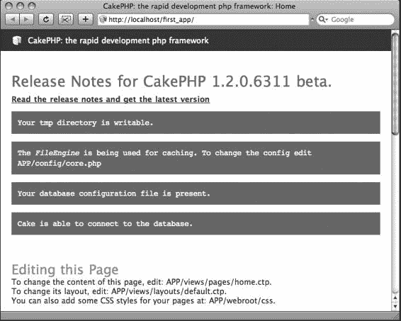

# 安装与运行 CakePHP

在本书中，你将开发一些 Cake 应用，我希望你是在自己的电脑上而非网页服务器上进行构建。因此，我所有的说明都将针对 `localhost` 环境，而非远程环境，尽管我在本章中讨论的设置步骤同样适用于远程安装。

## 简单入门：在 `localhost` 环境运行 Cake

在开始运行 Cake 之前，您需要先在 `localhost` 上准备好以下组件（关于安装这些组件的更多细节，请参见附录 A）：

- Apache 服务器（需启用 `mod_rewrite`）
- PHP 4.3.2 或更高版本
- MySQL（Cake 也支持 PostgreSQL、Microsoft SQL Server 2000、Firebird、IBM DB2、Oracle、SQLite、ODBC 和 ADOdb，但在本书中我将使用 MySQL，因为它是 Cake 的默认数据库引擎）

以上三者都可以通过例如 Apache Friends 的 XAMPP（[www.apachefriends.org](http://www.apachefriends.org)）或 Living-e 的 MAMP（[www.mamp.info](http://www.mamp.info)）等程序轻松安装。或者，您也可以选择手动在 Windows、Linux 和 Mac 操作系统上为每个组件配置自定义的 HTTP 服务器。在您的 Web 浏览器中，您应该能够通过在地址栏输入 `http://localhost` 来访问 `localhost` 上的根目录。

---

## 获取 Cake

第一步是从 [www.cakephp.org](http://www.cakephp.org) 下载 Cake 1.2 的最新稳定版本。

下载并解压 Cake 发布文件后，您会得到一个名为 `cake_1.2.x.xxxx` 之类的文件夹，其中包含几个子文件夹（见图 2-1）。

**图 2-1.** *Cake 主安装文件夹的内容*

`app` 文件夹是您应用程序中几乎所有操作发生的地方。它包含了所有的控制器、模型、视图、布局，以及所有其他 JavaScript、CSS、Flash、图像等文件。

当然，如果您查看 `app` 文件夹内部，您会注意到所有这些应用程序区域都被组织到了几个子文件夹中。

`cake` 文件夹包含了 Cake 的所有库和脚本。您可以用 Cake 的新版本替换此文件夹，它应该仍然能与应用程序一起工作。在其中，您会发现数十个包含 Cake 运行所需的所有类和脚本的独立 PHP 文件。

`docs` 文件夹保存了更改日志信息和其他自述文件。

您打算集成到应用程序中的任何其他非 Cake PHP 脚本都存储在最后一个文件夹 `vendors` 中。在本书的后面部分，您还将使用 `vendors` 来存储一些独立于 Cake 工作的精美 PHP 脚本。

---

## 启动 Cake

运行 Cake 实际上非常简单：将主 Cake 文件夹重命名为您希望在浏览器中调用的应用程序名称，然后将其放入您的 `localhost` 根目录。我将我的文件夹命名为 `first_app`，并已将其放在我的 `localhost` 根目录中。这个根目录的具体名称取决于您的 `localhost` 是如何配置的。它可能被命名为 `webroot`、`www` 或 `public_html`（这些是一些最常见的服务器根目录文件夹名称）。请务必确认您的 `localhost` 根目录位置，并将重命名后的 Cake 文件夹放入其中。通过在 Web 浏览器中输入 `http://localhost/first_app`，我看到了 Cake 的欢迎画面（见图 2-2）。

**图 2-2.** *Cake 欢迎画面*

如果您也看到了类似的画面，那么恭喜——Cake 现在正在运行。如果由于某种原因您看到了这个画面，但它没有显示任何图形或颜色，或者（更糟的是）画面完全是空白的，那么您可能遇到了以下错误之一。

**注意** 本章中讨论的许多内容将取决于您如何配置 Web 服务器。

访问本地主机时，请键入 `http://localhost:8888` 或其他地址，[确保用相应设置替换我的说明](http://localhost:8888)。在启动 Cake 之前，你应该熟悉本地主机的配置，特别是由于存在多种本地主机配置变体，此处不再赘述。

### 权限错误

可能缺少必要的文件权限。若出现此错误，你可能会看到空白屏幕或 403 错误。当服务器拒绝用户访问所请求的内容时，便会触发 403 HTTP 服务器错误。多种设置、文件权限或 PHP 配置错误都可能导致 403 错误。要解决此问题，请在命令行中使用 `chmod` 将 `first_app` 文件夹权限设置为 0755，或通过操作系统为用户授予读取、写入和执行权限，并为用户组授予读取和执行权限：`chmod -R 0755 /path/to/cakephp/folder`

刷新 `first_app` 的 URL；若看到如图 2-2 所示的截图，则问题已解决。

### 使用命令行界面

无论你使用的是 Windows、Mac OS 还是 Linux 系统，后续为了充分利用 Cake 的功能，都需要用到命令行。Mac 和 Linux 用户应能轻松运行命令行，因为该功能已内置于各自的操作系统中。与 Web 服务器设置类似，命令行也有多种配置方式，此处无法一一详述。请务必确保命令行能够正常运行标准 Unix 命令。Mac 用户应使用“终端”应用程序来运行命令。Linux 用户无疑对用于运行 shell 命令的 Linux 控制台很熟悉。Windows 用户可能需要安装命令行界面才能运行所有必要的 Unix 命令。[我推荐使用 Cygwin (www.cygwin.com) 或 MinGW (](http://www.cygwin.com)[www.mingw.org)](http://www.mingw.org) 在 Windows 环境下启动命令行。

### Apache AllowOverride 错误

当你能看到内容，但其显示效果与图 2-2 不符时，便会出现此错误：没有颜色、样式、布局和字体变化——只有白底黑字。即使继续学习本教程的后续部分，你也能看到 Cake 运行，但某些功能可能无法正常工作，或者在扩展 Cake 应用时（尤其是使用脚手架和样式时）可能会发现不一致的问题。修复此问题比权限错误稍微复杂一些，但难度并不大。

你需要在本地主机设置中找到 `httpd.conf` 文件。该文件通常存储在名为 `conf`、`bin`、`lib` 或 `var` 的文件夹中。你可以使用任何纯文本编辑器编辑 `httpd.conf` 文件。

在 `httpd.conf` 文件中搜索类似如下的代码块：

```
1 <Directory />
2 Options Indexes FollowSymLinks
3 AllowOverride None
4 </Directory>
```

别被第 1 行搞糊涂了。`Directory` 后的斜杠指向的是根文件夹。如果你需要将这些更改应用到特定的 Cake 应用文件夹，则添加 Cake 的路径而非根文件夹：

```
<Directory /path/to/cake>
```

将第 3 行从 `AllowOverride None` 改为 `AllowOverride All`，然后重启 Apache。如果启动 `first_app` URL 后看到正常的 Cake 欢迎屏幕（如图 2-2 所示），则问题已解决。


### 运行设置程序

每次在本地主机上安装 Cake 应用时，都需要遵循以下常规步骤：

1. 准备 `tmp` 文件夹。
2. 更改 `app/config/core.php` 中的 `Security.salt` 值。
3. 输入 MySQL 数据库连接设置。
4. 设计数据库架构（除非你使用的是现有架构）。

#### 准备 `tmp` 文件夹以供 Cake 读取和写入临时文件

`tmp` 文件夹位于应用程序文件夹中。默认情况下，其权限设置为 `0777`，但可能会更改为服务器权限默认值。Cake 的欢迎界面会告知您 `tmp` 文件夹是否可写。如果此条亮起绿色，则无需调整 `tmp` 文件夹。如果没有，请在命令行中运行以下命令来更改 `tmp` 及其包含文件的权限：

```
chmod -R 0777 tmp
```

然后刷新启动界面。它应会变为“您的 `tmp` 目录可写”（参见图 2-3）。

**图 2-3.** *Cake 会告知您 `tmp` 文件夹是否可写。*

#### 更改 `Security.salt` 值

当会话初始化时，服务器会使用会话 ID、数据库或 cookie 将一组请求组合在一起。无论采用何种方法，会话背后的理念是服务器可以与用户维护一个伪连接，即使通信可能会在此过程中中断。当您登录基于网页的电子邮件帐户或类似的网络服务时，就会遇到这种情况。站点应用程序知道您已登录，并保持该状态，直到您注销或经过一段不活动的时间。

幸运的是，Cake 使会话处理变得简单。但您需要确保其会话字符串是安全的。您不希望任何用户为了闯入您的应用程序而摆弄会话处理。

要为会话变量增加一些安全性，请打开 `app/config/core.php` 文件，找到第 153 行左右。您会看到一行类似这样的代码：`Configure::write('Security.salt', 'DYhG93b0qyJfIxfs2guVoUubWwvniR2G0FgaC9mi');` 这行代码是 Cake 写入定义的方式。Cake 的核心配置不使用 PHP 的 `define()` 函数，而是使用 `Configure::write()` 函数来更好地管理全局变量。在这里，Cake 核心使用 `Security.salt` 定义来创建哈希值和其他会话变量。

因为那串奇特的字符随 Cake 一起提供，所以每个使用 Cake 的人都有相同的会话字符串。让我们更改第二部分，即字符串，改为一些独特的内容。您可以继续填写任何大约 40 个字符的字母数字字符串，并将其粘贴在此处。我最终得到了这个：

```
Configure::write('Security.salt', 'mEayuDrXBhZkdiEJgFzPXvbcBrmKo9CdVGtKyPBr');
```

现在，当 Cake 需要运行任何非默认值的安全配置和哈希运算时，它就有了一个盐值。

### 输入 MySQL 连接设置

Cake 需要知道您的数据库位于何处才能保存和检索数据。您可以通过编辑 `app/config/database.php.default` 文件来完成此操作。您需要将文件重命名为 `database.php`（从末尾删除 `.default`），并在您选择的纯文本编辑器中编辑它。无论您的 `localhost` 如何设置，您都需要知道 Cake 连接数据库所需的 MySQL 登录名和密码。这通常设置为默认值，除非您配置了管理员帐户（例如，登录名和密码的默认值为 `root` 等）。在数据库配置中，会有一个位置供您输入登录名和密码值。清单 2-1 显示了数据库配置文件中的默认 `DATABASE_CONFIG` 类。

**清单 2-1.** *数据库配置文件*

```
class DATABASE_CONFIG {
  var $default = array(
   'driver' => 'mysql',
   'persistent' => false,
   'host' => 'localhost',
   'port'=>'',
   'login' => 'user',
   'password' => 'password',
   'database' => 'project_name',
   'schema'=>'',
   'prefix' => '',
   'encoding'=>''
  );
  var $test = array(
   'driver' => 'mysql',
   'persistent' => false,
   'host' => 'localhost',
   'port'=>'',
   'login' => 'user',
   'password' => 'password',
   'database' => 'project_name-test',
   'schema'=>'',
   'prefix' => ''
   'encoding'=>''
  );
}
```

在这个类 `DATABASE_CONFIG` 中，它将连接两个数据库：`default` 和 `test`。如果您不打算创建单独的测试数据库，可以删除第 13-21 行。

将您的数据库设置放入必要的行中，如清单 2-2 所示。

**清单 2-2.** *将 Localhost 设置添加到数据库配置中*

```
var $default = array(
 'driver' => 'mysql',
 'persistent' => false,
 'host' => 'localhost',
 'port'=>'',
 'login' => 'root',
 'password' => 'root',
 'database' => 'cake',
 'schema'=>'',
 'prefix' => '',
 'encoding'=>''
);
```

在本教程中，您正在创建一个通用的 Cake 应用程序。在本书的后面部分，您将根据正在构建的应用程序来命名数据库，但就目前而言，您只需创建一个名为 `cake` 的数据库。清单 2-2 中显示的设置将告诉 Cake 如何连接此数据库，但您还没完成……您需要创建数据库！

### 设计您的数据库架构

最好从一开始就知道数据库设计将如何工作。因此，花些时间至少对您首先构建的程序有一个大致的了解，然后构建一些表和字段来匹配该设计。第 4 章将引导您完成一个关于如何设计适合 Cake 应用程序的架构的详细教程。现在，只需记住，在安装新的 Cake 应用程序时，构建数据库结构是自然发生的。

这个应用程序非常简单，数据库中实际上没有任何内容。您只想将 Cake 连接到数据库。启动您选择的 MySQL 应用程序（我使用的是 CocoaMySQL），然后连接到 MySQL。创建一个名为 `cake` 的数据库。

现在，Cake 有了一个可以连接的实际数据库，您可以在浏览器中访问 `http://localhost/first_app`，它将显示一个新界面，如图 2-4 所示。



**图 2-4.** *一切准备就绪时的欢迎界面* Cake 现已安装并正常运行。是时候深入并开始构建 Web 应用程序了！

### 总结

安装一个新的 Cake 应用程序很简单，并且几乎不需要任何配置即可快速启动并运行。只需记住解压主要的 Cake 安装文件，并将生成的文件夹重命名为您想要为应用程序命名的任何名称。通过检查欢迎界面，您可以确定 Cake 是否正常运行，或者是否存在 `localhost` 错误。

纠正错误并不太难。只需正确设置权限或调整 Apache 服务器配置以处理 Cake，这些错误在大多数情况下就会消失。您的 Cake 应用程序将需要一些设置例程，例如准备 `tmp` 文件夹、更改核心配置中的 `Security.salt` 值以及将 Cake 连接到可用的数据库。完成这些例程后，您的应用程序就可以通过创建模型、视图和控制器来进行扩展。下一章将解释如何通过一个使用 Cake 内置脚手架功能的简单待办事项列表应用程序来向您的新应用程序添加功能。

## 第 3 章