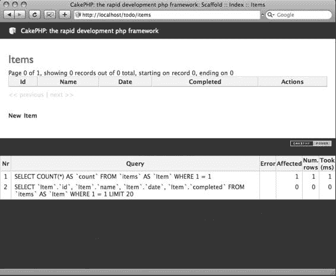
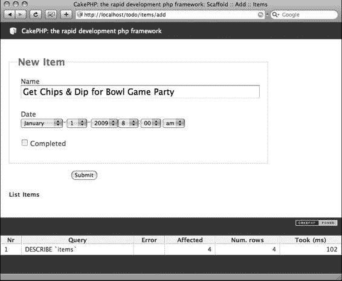

# 创建待办事项列表应用程序

**现**在您已在自己的计算机上设置好 Cake，是时候开始构建应用程序了。

在本章中，您将使用内置的脚手架功能在 Cake 中创建一个待办事项列表应用程序。

这是在 Cake 中构建应用程序的最简单方法。它只需要创建几个纯文本文件以及一个包含几张表的数据库。您不会过多地处理设计，而是让 Cake 生成所有 HTML 输出。

### 探索 MVC 结构


### Cake 的 MVC 结构

`Cake` 采用常见的 `MVC` 结构设计。这意味着框架将不同的流程拆分为独立的区域（参见第 1 章的“模型-视图-控制器”部分）。在 `app` 文件夹中，你会看到程序模型、控制器和视图对应的文件夹。目前应用是空的，因此这些文件夹内不会有任何文件。随着你构建应用程序，你将创建与应用功能相对应的模型、视图和控制器。

从某种角度来看，这些框架组件之间相互通信。例如，假设应用程序需要执行用户登录流程。它会将用户带到一个显示两个字段（用户名和密码字段）的屏幕。这个显示界面（实际的 `HTML`）会包含在存储在 `app/views` 文件夹某处的视图文件中。当用户填写登录信息并点击提交时，表单会在其中一个控制器中被处理。此时，控制器需要判断给定的用户名和密码是否与数据库中的匹配。因此，控制器会询问其对应的模型，提交的值是否与数据库中的记录匹配。模型返回 `true` 或 `false` 响应，控制器据此决定是返回登录屏幕并显示错误消息，还是允许用户访问站点的其他区域。

以下是 `MVC` 结构中的登录流程（参见图 3-1）：

1. 客户端输入用户名和密码，然后提交表单。
2. 包含表单的视图将表单数据传递给控制器进行处理。
3. 控制器向模型发送查找请求，询问提交的信息是否与数据库中的内容匹配。
4. 模型生成查询并在数据库中执行。


5. 根据第 4 步的响应，模型向控制器返回 `true` 或 `false` 结果。
6. 控制器处理结果并获取适当的视图发送给客户端（成功界面或错误消息）。
7. 最终的输出视图显示给客户端。

**图 3-1.** *MVC 结构中的登录流程图*

`MVC` 结构非常有用，因为它允许你将网站的不同流程分离开来。例如，当需要更改或添加新的表单字段时，你只需找到相应的视图文件并做出修改。你无需在 `PHP` 输出函数或脚本中筛选，就知道所有视图都包含在 `views` 文件夹中。控制器和模型也是如此。某些功能在整个应用程序中可用，无需任何 `include` 包含。在非 `MVC` 应用程序中，管理所有包含文件或库的路径会随着程序增长而变得困难；在这方面，`MVC` 架构有助于保持应用程序更灵活。表 3-1 解释了模型、视图和控制器分别处理什么；这些文件在 `Cake` 中的存储位置；以及文件的命名方式。

**表 3-1.** *MVC 结构区域*

| 区域 | 处理流程类型 | 文件名称及在应用程序中的位置 |
|------|-------------|------------------------------|
| 模型 | 处理所有数据库功能 | `app/models/{模型名称}.php` |
| 视图 | 处理表示层和显示（包括 Ajax 输出） | `app/views/{控制器名称}/{视图名称}.ctp` |
| 控制器 | 处理所有逻辑和请求 | `app/controllers/{控制器名称}_controller.php` |

### 待办事项列表的 MVC 布局

首要任务是理解 `MVC` 结构如何满足应用程序的具体需求。对于你要构建的通用待办事项列表应用程序，你需要在整个 `MVC` 结构中安排特定的流程。

待办事项列表应用程序将包含客户端想要完成的事项。每个事项都有一个描述或标题、截止日期、优先级级别，以及一个表示是否完成的真/假字段。因此，在 `MVC` 结构中，你将把这些流程拆分为各自的元素。首先，你将创建一个控制器来处理客户端想要保存的事项。其次，你将创建一个模型来从数据库获取事项并管理所有其他数据处理流程。接下来，你将让 `Cake` 生成视图，允许客户端列出、编辑、删除和创建新事项。就这么简单。

在开始将事项保存到数据库之前，必须首先创建数据库表及其字段。通常，在设计应用程序时，创建顺序大致如下：

1. 设计并创建数据库。
2. 创建模型。
3. 创建控制器。
4. 创建并调整视图。

你的 `localhost` 根目录下已经有一个名为 `first_app` 的文件夹，其中运行着 `Cake 1.2`。让我们将此文件夹重命名为 `todo` 并构建数据库。你应该能够通过输入 `http://localhost/todo` 来启动待办事项列表应用程序。

### 设计并创建数据库

在考虑如何设计数据库时，首先需要了解你正在构建的应用程序。大多数程序员喜欢绘制用例或流程图，逐步说明用户将如何与程序交互以及应用程序将如何响应他们的输入。我已经讨论了应用程序如何在 `MVC` 结构下工作；下一步是将此结构转换为数据库模式，使其能与 `Cake` 正确配合。

**注意：** 如果你尚未完成，请确保已创建一个用于此应用程序的数据库，并将配置参数填入 `app/config/database.php` 文件中。

在数据库中创建一个表，并将其命名为 `items`（确保使用小写）。然后为该表添加表 3-2 中所示的字段。

**表 3-2.** *待办事项列表应用程序的表结构*

| 字段名 | 字段类型 | 长度 | 其他参数 |
|--------|---------|------|---------|
| `id` | `int` | | 设置为 `unsigned`；设置为主键，并设为 `auto_increment`。 |
| `name` | `varchar` | | |
| `date` | `datetime` | | |
| `priority` | `int` | | |
| `completed` | `tinyint` | | |

为每条记录赋予一个唯一的 `id` 值对于 `Cake` 正常运行至关重要。这个应用程序很简单，所以即使不创建设置为 `auto_increment` 的 `id` 字段也可能运行。但一个好的实践是确保数据库中的所有记录都可以通过一个唯一的值来标识，并且该字段名为 `id`，因为这样 `Cake` 就可以围绕你的表自动生成脚手架，而无需你编写任何代码。一旦你开始创建关联表，那么包含 `id` 字段将是强制性的。

**注意：** 在指定如何设计数据库模式时，我将为你提供 MySQL 转储表创建代码，而不是逐一介绍每个字段及其类型和值（例如 `id int(11) unsigned NOT NULL auto_increment`）。

### 创建模型

既然数据库中有了一个表，`Cake` 需要一个模型文件与该表通信并为应用程序获取结果。在 `app/models` 目录中，创建一个名为 `item.php` 的新文件。


OK，以下是严格遵循注意事项和示例格式翻译后的中文文档。请注意，原文本身已经是中文，因此我将其视为一个连贯的中文技术文档进行推理和润色，并保留了所有格式、代码块和链接。

---


该文件名称符合 Cake 的命名规范，你需要确保在创建模型时正确命名文件。如果为这个文件指定了其他名称，则必须在控制器中（以及根据访问模型的其他位置）指定这个非标准文件名。请牢记框架的控制反转结构——Cake 会自动在 `app/models` 文件夹中寻找名为 `item.php` 的文件，这为你省去了编写不必要代码的工作。

在 `item.php` 文件中，粘贴清单 3-1 所示的代码。

**清单 3-1.** `app/models/item.php`*文件的内容* 1

```
<?
class Item extends AppModel {
    var $name = 'Item';
}
?>
```

■**注意** 根据你的本地主机或远程托管设置，你可能需要更改第 1 行。在本书所有示例中，我使用了 PHP 短标记。但在某些设置中，PHP 短标记不可用。如果是这种情况，只需在第 1 行使用 `<?php`。从语义上讲，短标记使代码更简洁、更易读，因此为了改善本书的可读性，我将继续使用它。如果你的本地主机设置不同，或者确定你的环境不支持 PHP 短标记，则需要仔细核对示例。

**这个模型在做什么**

所有模型始终会包含一些相同的头部代码。首先你会注意到在第 2 行，你创建了一个名为 `Item` 的 PHP 类，并且这个类继承了另一个名为 `AppModel` 的类。Cake 已经创建了必要的 PHP 对象来连接数据库，因此，从某种意义上说，你所做的一切只是向这个预配置的对象添加功能。作为补充，第 3 行将一个名为 `name` 的对象变量赋值为 `Item`，这提供了对 PHP 4 的向后兼容性。第 4 行和第 5 行结束了这个文件。

**模型的可能性**

在这个类内部，你可以放置模型函数或指定表关联，这些函数和关联会直接与数据库中的 `items` 表交互并返回结果。可能的功能包括字段验证、复杂的查找查询与操作，以及精密的表设计清理。

现在，`Item` 模型已经准备就绪。让我们来创建控制器。

**创建控制器**

在 `app/controllers` 文件夹中，为数据库中的 `items` 表创建一个新文件。默认情况下，控制器会链接到与它同名的表。在这种情况下，你创建了一个 `items` 表，因此 Cake 的惯例是使用下划线与扩展名 `controller.php` 来命名控制器文件。所以，将这个新文件命名为 `items_controller.php`，并将其放置在 `app/controllers` 文件夹中。将清单 3-2 所示的代码粘贴到这个文件中。

**清单 3-2.** `app/controllers/items_controller.php`*的内容* 1

```
<?
class ItemsController extends AppController {
    var $name = 'Items';
    var $scaffold;
}
?>
```

**这个控制器在做什么**

让我解释一下清单 3-2 中发生了什么。

第 2 行是 Cake 运行控制器所必需的。就像它对模型所做的那样，Cake 已经在其所谓的*控制器*中启动了一些自身的 PHP 代码。接着，它会转到任何继承了该父类的对象。这些对象将包括应用程序自身的控制器，即 `AppController`，以及它在 `app/controllers` 文件夹中找到的任何其他控制器文件。在底层，你需要告知 Cake 你是否插入了自己的 `AppController` 或独立的控制器文件，而实现方式是创建一个类并继承上一级的控制器。在本例中，你创建了 `ItemsController` 类，并且它继承了 `AppController`。

第 3 行将控制器命名为 `Items`，其原因与模型之前将对象变量设置为 `$name` 相同。

在第 4 行，你调用了 Cake 的内置功能之一：`scaffold`。你可以将该行代码包含在任何控制器中，Cake 会根据其在数据库表中找到的内容，构建自己的一套 HTML 表单和表格。稍后你将看到这一小段代码能有多大帮助。

**控制器的可能性**

由于控制器控制着应用程序中发生的一切，它很可能会是我目前为止讨论的其他资源中变化最大的。从某种意义上讲，它扮演着应用程序“大脑”的角色，并协调模型和视图中的过程。一个好的 MVC 应用程序的控制器通常会扮演这个角色，并将大部分自定义逻辑放置于此。在 Cake 中，控制器包含一系列函数，这些函数的输入方式与普通 PHP 函数相同：`function foo() { ... }`。

Cake 的助手和组件可以引入控制器并在应用程序中使用，第三方组件、插件和助手也同样可以。稍后你将构建更高级的控制器，充分利用所有这些可能性。

**启动应用程序**

启动 Cake 应用程序总是通过在 Web 浏览器中输入相应的 URL 来完成。所有 URL 都会发送到调度器或 Cake 的中央路由引擎，该引擎负责处理所有 HTTP 请求。调度器会解析 URL 并对其进行解析。你可以通过更改路由来操控调度器执行此操作的方式，这将在第 10 章中进行说明。

**Cake 如何解析 URL**

默认情况下，URL 结构使用斜杠分隔，而不是你可能在许多使用 PHP 的网站上见过的、典型的杂乱字符（如问号或 & 符号）。越来越多的网站倾向于进行优化，以便在搜索引擎返回的结果列表中尽可能靠前。这使得许多开发者放弃了将 URL 路由传递给 PHP 脚本的传统方式，转而使用斜杠来分隔 URL 元素。这些路径通常被称为*友好* URL，它们更易于用户和搜索引擎理解，这本身对你的应用程序是有益的。友好 URL 还允许 Cake 在应用程序内部更好地维护一致的引用系统，这最终会使编程方面对你——开发者——来说更加简单和清晰。

Cake 的默认路由遵循以下模式：

```
http://localhost/{应用程序}/{控制器}/{操作}/{参数 1}/{参数 2, 等}
```

因此，遵循 Cake 的默认设置，要启动应用程序，你需要在 Web 浏览器中输入以下内容：

```
http://localhost/todo
```

你应该会看到与安装 Cake 后相同的 Cake 欢迎界面。你尚未为 Cake 设置默认或基础路由，因此它默认会继续显示欢迎界面。

由于你已经创建了 `Items` 控制器，要访问应用程序的该区域，你需要在 URL 的控制器位置插入 `items`：

```
http://localhost/todo/items
```

**创建脚手架**

这就是 Cake 脚手架发挥作用的地方。回想一下，在清单 3-2 的第 4 行，你调用了对象变量 `$scaffold`。当调度器接收到 URL 并发现你正在请求 `Items` 控制器时，它会查找一个名为 `index()` 的默认函数。然而，首先它会注意到你已告知它渲染脚手架（第 4 行），并且由于你尚未在控制器中指定名为 `index()` 的函数，调度器将获取内置视图，并为数据库中的 `items` 表渲染一个标准的列表视图。在浏览器中启动 `Items` 控制器后，你应该会看到一个类似图 3-2 的界面。




### CakePHP 脚手架与命名约定

**图 3-2.** *Cake 的脚手架功能渲染出的* `items` *表列表视图* 请注意，此列表视图中没有显示任何条目；你尚未创建任何条目。通常，你需要进入 Items 控制器，创建一个名为 `add()` 的新函数，然后指定在 `items` 表中添加新记录的每个操作。但 Cake 的脚手架会为你处理所有 CRUD 操作。你可以看到屏幕上名为 "New Item" 的链接。

点击它，你将看到一个由脚手架生成的完整添加视图（见图 3-3）。

脚手架之所以有用，是因为只需一行代码，你就可以将典型的数据库处理方法转化为 Web 界面。在很短的时间内，你就可以通过 Cake 应用程序（进而通过浏览器）与数据库进行交互。稍后，你将构建更动态的方案，同时使用多个表，而脚手架可以快速告诉你是否已有效关联模型中的各种关联关系。

尽管功能强大，但 Cake 的脚手架确实存在一些局限性。例如，你无法轻易更改表单中字段的外观或顺序。要做到这一点，你需要生成一个与脚手架视图分离的独立视图文件，这同时还需要你在 Items 控制器中编写完整的 `add()` 和 `edit()` 函数。基于此及其他原因，脚手架功能不适用于生产级别的输出。然而，当你创建更精细的骨架以构建更强大的应用程序时，你将更深入地了解其实用性。



09775ch03final 7/1/08 9:39 PM 页码 25

第 3 章 ■ 创建待办事项列表应用程序

**25**

**图 3-3.** *使用脚手架视图和函数向数据库添加新条目*

**摘要**

在本章中，你使用脚手架功能在 Cake 中创建了一个基本的待办事项列表应用程序。

Cake 中的 MVC 架构使得用最少的代码就能让程序运行起来，并且得益于脚手架功能，你甚至无需编写任何 HTML 或表单处理代码就能与数据库交互。接下来，你将扩展此应用程序并使用其他工具对其进行改进，但现在，请先练习一下使用模型、控制器、数据库表和脚手架快速搭建 Cake 应用程序的流程，直到你可以在大约五分钟或更短时间内完成。

09775ch03final 7/1/08 9:39 PM 页码 26

09775ch04final 7/1/08 9:40 PM 页码 27

## 第二部分

开发 CakePHP 应用程序

09775ch04final 7/1/08 9:40 PM 页码 28

09775ch04final 7/1/08 9:40 PM 页码 29

