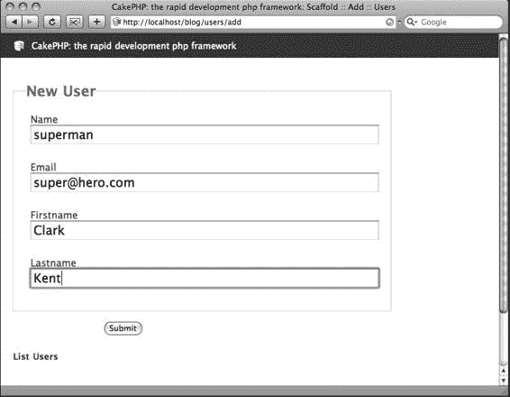
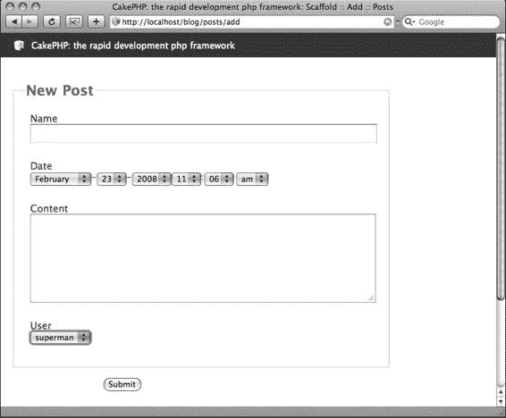
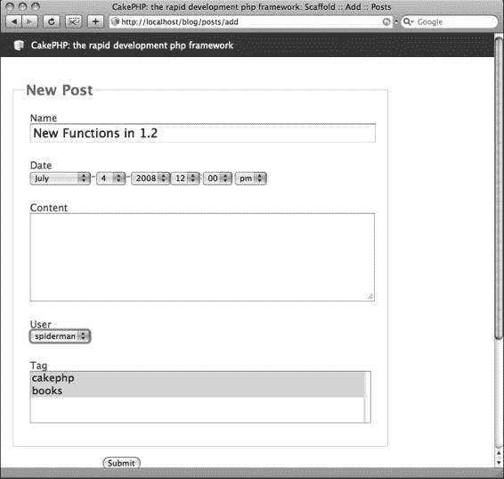
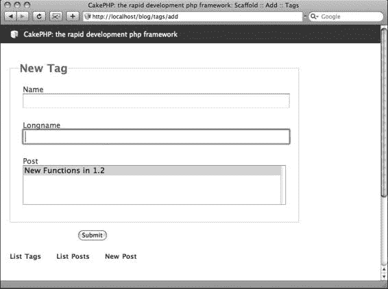

# 第 4 章

命名文件与设计数据库

在上一章中，我讨论了 Cake 如何围绕数据库结构封装一些标准的 Web 功能，以生成一个待办事项列表应用程序。尽管你可以更改应用程序中的某些内容以改善用户体验，但总体上，Cake 无需太多代码就能处理数据库中记录的新增、删除、编辑和查看等典型操作。这之所以成为可能，是因为 Cake 的一个重要方面：**约定**。因为你遵循了 Cake 的约定来命名和设置数据库表、创建模型和控制器文件、以及在浏览器中输入 URL 来运行应用程序，所以 Cake 能够将你的各种操作拼接起来，并在短时间内交付一个便捷的 Web 程序。

### 约定优于配置

Cake 的开发者在构建核心时遵循了"约定优于配置"的原则，这意味着他们不仅旨在提供一个充满特性和功能的框架，还意在开发一种构建 Web 应用程序的*整体方法论*。换句话说，他们的理念是，你*如何*开发 Web 程序与你*正在构建*什么同样重要。

例如，这就是 `app` 文件夹采用其现有结构的原因——提供约定，将 Web 应用程序的操作划分到更标准化的区域，并提供约定，指明应用程序的哪些部分提供哪些功能。你在使用 Cake 时学到的约定可以为你节省的时间，与 Cake 附带的有用工具所节省的时间一样多。

### 拦截 Cake

将"约定优于配置"这一理念可视化的一个有效方法是想象房屋的框架。其中没有家电、电线、墙壁、窗户或门；只有一个勾勒出房屋结构的木质框架。如果施工队在未经你输入的情况下突然组装房屋，他们会自然地将门放在某些区域，将窗户放在其他区域，并用特定的材料完成墙壁。

这就是 Cake 在应用程序启动时的组装方式。它有一套关于如何拼装应用程序的整体约定，并且知道框架的主要目标是生成一个基于 Web 的应用程序，因此它会自动以某种方式执行。例如，在处理控制器时，Cake 会渲染自己的脚手架或查找特定的视图文件，*除非*你拦截它并告知其执行其他操作。

09775ch04final 7/1/08 9:40 PM 页码 30

**30**

第 4 章 ■ 命名文件与设计数据库

其他框架，如 Zend 框架和 Struts，以不同的方式构建应用程序。想象一下，施工队给了你一本目录，里面列出了装修房屋的各种可能性，但最终，他们让你自己完成组装工作。某些框架为你提供了大量可在应用程序中使用的函数和工具，但将配置工作留给你自己。从某种意义上说，你可以在任何之前构建的 PHP 应用程序中使用这些框架，因为它们并不提供特定的约定；它们只是将典型的 Web 应用程序操作捆绑在一起的一个很好的集合。

从某种意义上说，Cake 是一个庞大的（相当空白的）PHP *对象*，你的工作就是在此对象中各处添加你的自定义部分。这个对象能够为你提供许多工具，就像房屋的诸多可能配置一样，但默认情况下这些工具很少被执行。当你用自己的类和函数扩展对象时，你便会使用到它们。

由于 Cake 开发者构建框架时所采用的约定，存在一种预期的方法来扩展 Cake 的对象。从数据库表的命名到编码大量操作，请牢记，每一次你坚持使用约定，都可以避免使用代码行来指定应用程序的不同部分位于何处以及应如何组装。

### 从数据库开始

Cake 中的约定始于数据库。如果你从设计应用程序将如何存储和处理数据开始，那么其余代码就能更容易地各就各位。然而，如果你搞错了，那么你几乎肯定会发现应用程序中的错误，这些错误需要调整以符合 Cake 的约定。在展示如何构建更复杂的 Cake 应用程序之前，我将花时间阐明 Cake 的 MVC 结构以及其他命名和数据库约定。

### MVC 默认行为

当 Cake 应用程序启动时，Cake 库中已经组装好的各种 PHP 对象会运行起来。MVC 结构的优势在于，模型、视图和控制器被专门设计用于特定操作。因此，一个模型，由于其本身是一个模型而非其他东西，会自动被期望执行一些数据库操作。

这些默认操作可能仅仅是占位符，也可能包含一些默认函数，这取决于框架在启动时如何运行。


### CakePHP 命名规范与 MVC 结构

`Cake` 会自动为 MVC 结构的每个部分组装对象。`Controller` 对象在被调用时会自动以特定方式运行，`Model` 对象也是如此。当你创建一个类对象的新实例并指定该实例是现有对象的扩展时，你就在 PHP 中扩展了对象。例如，你可以创建自己的 `AppController` 对象作为 `Controller` 类对象的扩展，如下所示：`class AppController extends Controller {`。

PHP 的语法要求你添加 `extends` 以及要扩展的类对象的名称，在本例中即 `Controller` 对象。因此，当 `AppController` 对象被调用时，`Controller` 对象中包含的所有内容也会被调用。

当 `Controller` 类对象被调用时，它会自动寻找 `Model` 和 `View` 来执行工作。你通过输入的 URL 具体选择要启动的 `Controller`，但你不能输入 URL 来仅调用 `Model` 或 `View`。`Cake` 的 `Dispatcher` 会将所有请求引导至 `Controller` 对象，因此你必须放置其他对象来拦截该对象在被调用时执行的默认操作。如果你输入了一个 URL，但 `Dispatcher` 找不到与该 URL 匹配的 `Controller` 对象，那么默认情况下 `Controller` 对象会设置为显示错误消息。了解这些默认行为以及知道在何处可以拦截它们并安装你自己的方法，正是 Cake 编程的核心。

例如，在 `Model` 中，每次将记录保存到数据库时，都会执行某些函数。你可以通过在此 `Model` 中插入带有自定义逻辑的 `beforeSave()` 函数来拦截此默认行为。这会拦截 `Model` 对象用于将记录插入数据库的默认 `save()` 函数，并允许你在保存前根据自定义参数检查数据。

当 `Dispatcher` 解析 URL 时，它会查找命名正确的文件，否则会返回错误。当 `Controller` action 运行时，`Controller` 对象会查找存储在相应区域中的特定视图文件，以便 `Controller` 正确执行。在整个 Cake 应用程序中，某些约定始终在起作用。从某种意义上说，本书的主要内容是阐述所有这些约定以及如何使用它们来生成 Web 应用程序。首先，我将描述如何命名文件以及如何在这些文件中适当地命名类对象。通过将文件放置在正确区域、使用正确名称并包含正确的类名，Cake 将知道你正在拦截其默认操作，并转而执行你的自定义对象。你从 Cake 默认对象扩展出去的对象越多，应用程序就越复杂。

### 命名约定

简而言之，如果你的文件命名不正确，Cake 将无法将应用程序的不同部分组合在一起，并会给出错误消息。站点的每个元素都必须遵循特定的命名约定，以便当 Cake 寻找所需资源时，它能够找到并运行它。

你可能在第 3 章中注意到了，你给模型和控制器文件赋予了特定的名称以使待办事项列表应用能够运行。我解释过，这些文件必须与数据库中的表匹配，并且在编写 PHP 代码时需要遵循一些典型的命名方案。如果你需要更复杂的命名方案来满足项目的需求，该怎么办？以下是 Cake 中文件命名的基本规则，以及如何将更复杂的名称整合到你的 Cake 应用程序中以满足自定义需求。

#### 命名控制器

每个控制器名称必须与数据库表名匹配。如果你决定创建名称与数据库表名不同的控制器，实际上不应创建控制器，而应使用组件（你将在第 11 章中了解更多关于组件的内容）。数据库表名和控制器名均为小写且使用复数形式。例如，一个购物车应用中包含订单记录的表应命名为 `orders`。控制器文件的名称与其匹配的表名一致，附加下划线和单词 `controller`，并且它是一个 PHP 文件，因此会带有 `.php` 扩展名。因此，订单控制器应命名为 `orders_controller.php`，并存储在 `app/controllers` 文件夹中。

在控制器文件中，你需要扩展应用启动时 Cake 已调用的 `AppController` 对象。为此，另一个重要的约定在起作用。清单 4-1 展示了如何在文件中命名控制器类以及如何扩展 `AppController` 对象。

**清单 4-1.** *控制器内部*

```
<?
class RecordsController extends AppController {
}
?>
```

请注意，在清单 4-1 的第 2 行，我通过启动一个新类并将其命名为 `RecordsController` 来扩展了 `AppController` 对象。类名始终需要与控制器文件名匹配，并使用驼峰式大小写¹并包含单词 `Controller`。例如，如果此控制器是针对 `orders` 表的，则第 2 行应包含类名 `OrdersController`，文件名则为 `orders_controller.php`。

如果你遵循此约定，Cake 将能够将请求分派到正确的控制器并运行正确的 action。

#### 命名模型

模型的命名类似于控制器，但它们代表与数据库表的一个实例的交互，因此它们采用单数形式，而不是复数形式。使用之前的购物车示例，`orders` 表对应的模型应命名为 `order.php`，并存储在 `app/models` 文件夹中。请注意，对于模型，你不需要在文件名后附加下划线加 `model`。

在清单 4-2 中，你可以看到模型 PHP 文件的起始代码结构与控制器文件中的类似；我创建了一个新的类对象，它扩展了 Cake 创建的 `AppModel` 对象，并根据模型名称使用单数的命名约定将其命名为 `Record`。在 `Order` 模型中，第 2 行将更改为名为 `Order` 的类，从而将其链接到 `orders` 数据库表。

**清单 4-2.** *模型内部*

```
<?
class Record extends AppModel {
}
?>
```

¹ 驼峰式大小写在 Cake 中经常用作类命名的约定。有时也称为中介大写，这是一种将单词或短语连接起来而不使用空格并将复合词中的单词首字母大写的做法。可以想象单词中像驼峰一样的凸起部分。

#### 命名视图

当控制器渲染视图时，Cake 会自动查找与 action 同名的文件。视图对应于控制器脚本中包含的 action，并存储在以控制器命名的文件夹中。创建用于作为控制器脚本输出的视图的第一步是在 `app/views` 中创建与控制器名称匹配的文件夹。

视图文件夹名称为小写且使用复数形式，与数据库表的命名约定相同。

对于 `orders_controller.php` 文件，你需要创建文件夹 `app/views/orders`。


### 控制器中视图文件与操作匹配

视图文件与控制器中的操作（action）相匹配，因此必须按相应规则命名。当调用控制器操作时，Cake 会自动按照特定命名方案搜索对应的视图。以 Orders 为例，假设希望用户在下单前能查看订单，那么你可以在 `orders_controller.php` 文件中创建一个名为 `review` 的操作。在该操作（即控制器脚本中的一个 PHP 函数）中，你可以按 MVC 结构将变量整合并发送至视图。Cake 会自动搜索名为 `app/views/orders/review.ctp` 的视图（`.ctp` 是所有 Cake 视图的通用扩展名，而非 `.html` 或 `.php`）。

表 4-1 详细列出了模型、控制器和视图文件的命名约定。请注意，视图文件以控制器中匹配的操作命名，而存放视图的文件夹名称则与控制器名称一致。

**注意**：Cake 早期版本使用 `.thtml` 作为视图文件扩展名，但在 CakePHP 1.2 中已改为 `.ctp`。如果你遇到旧版 Cake 应用，请务必将这些视图文件扩展名改为当前标准化的 `.ctp`。

### 表 4-1. `records` 数据库表的 MVC 元素及其命名约定

| 类型       | 文件名             | 扩展名 | 类名               | 存储目录              |
|------------|-------------------|--------|--------------------|-----------------------|
| 模型       | `record`          | `.php` | `Record`           | `app/models`          |
| 控制器     | `records_controller` | `.php` | `RecordsController` | `app/controllers`     |
| 视图       | `{与控制器中的操作  | `.ctp` |                    | `app/views/records`   |
|            | `名称匹配}`        |        |                    |                       |

### 名称中包含多个单词

你可能需要为包含多个单词的数据库表命名。简而言之，你可以通过下划线分隔每个单词来使用多个单词。例如，包含特殊订单的表应命名为 `special_orders`，而不是 `specialorders` 或 `specialOrders`。但为了让 Cake 连接到该表，控制器、模型和视图也必须遵循同样的规则。使用驼峰式命名法（Camel-case）的标题告诉 Cake 在运行控制器、模型和视图时应寻找什么。表 4-2 展示了与名为 `special_orders` 的数据库表的 `list` 操作相匹配的 MVC 元素的各种名称示例。

### 表 4-2. `special_orders` 数据库表的 MVC 元素名称

| 类型       | 文件名                          | 类名                      | 存储目录                   |
|------------|--------------------------------|---------------------------|----------------------------|
| 模型       | `special_order.php`            | `SpecialOrder`            | `app/models`               |
| 控制器     | `special_orders_controller.php` | `SpecialOrdersController` | `app/controllers`          |
| 视图       | `list.ctp`                     |                           | `app/views/special_orders` |

### 其他 Cake 资源的命名

作为“约定优于配置”的另一体现，Cake 以与模型、视图和控制器类似的方式划分其他重要资源。例如，如果多个控制器需要使用相同的操作，则可以创建一个*组件*。控制器可以像引用包含文件一样引用该组件，并像组件中的操作独立存在于控制器中一样运行它们。其他资源也以相同方式运作。

可供多个视图使用的视图文件存储在所谓的*元素*中，以此类推。每种资源都有其自身的命名约定。

稍后，你将充分利用这些资源。既然我正在讨论 Cake 中的命名约定，那么熟悉其他 Cake 资源的约定也是值得的。

#### 组件

组件文件包含可在所有控制器中使用的操作或函数。组件通常旨在提供实现主要目标的工具。例如，你可能希望组织一组管理应用程序所需发送的所有电子邮件的函数。各种控制器可能需要在不同地方运行邮件函数，因此与其将邮件处理过程写入各个控制器，不如将所有邮件功能集中存放在一个组件文件中。这样做可以有效地将所有邮件函数集中在一处，就像通过模型分离所有数据库函数一样。

组件可以完全自定义以满足你的需求。事实上，网络上其他 Cake 开发者提供了不断增长的第三方组件库，这有助于从其他项目中借鉴功能，从而减少你自己编写的代码量。

组件文件名可以是任何名称，但与模型、视图和控制器一样，名称中包含多个单词时，必须用下划线分隔，并在命名类对象时使用驼峰式命名法。

Cake 内置了一个邮件组件，但就前述示例而言，如果你要创建自己的邮件组件，可以将文件命名为 `email.php`，并将其放在 `app/controllers/components` 目录中。

在该文件中，你需要使用以下语法创建一个新的组件类：
```
class EmailComponent extends Object {
```
请注意，类对象的名称与控制器一样使用驼峰式命名法，并继承自 `Object` 类。稍后，你将组装一些自定义组件，用于更复杂的应用程序。

#### 辅助函数（Helpers）

辅助函数提供可在多个视图中使用的功能。想象一下，你在脚本中创建仅与最终输出相关的函数。你可以扩展这些函数，包含各种设置，使整个过程在整个应用程序中可重复使用。

以 HTML 链接为例。你可以手动在视图文件中编写链接：
```html
<a href="/blog/posts/view/55">阅读第 55 篇文章</a>
```
然而，你可能希望应用程序管理链接并动态生成路径。在这种情况下，编写静态 HTML 链接是行不通的。这时，编写辅助函数或使用 Cake 内置的辅助函数可以极大地节省时间和精力。辅助函数中的特定链接函数包含一组参数，这些参数可根据视图的具体属性（如要链接的文本和链接的目标地址）而变化。围绕路径编写 `<a>` 标签、配置与 Cake 系统兼容的路径以及输出可点击文本的过程是不变的，因此，每当需要编写链接时，都可以重复使用这一过程。使用 HTML 辅助函数（Cake 的默认辅助函数之一）可以实现这一点：
```php
<?php echo $html->link('阅读第 55 篇文章', '/posts/view/55');?>
```
现在，无论 Cake 应用程序存储在何处，由 `$html->link()` 函数创建的链接都不会出错，因为它们的路径由 Cake 检查并路由。如果你想修改所有链接的显示效果，只需进入辅助函数并重写该函数一次，而无需查找每个链接实例。

辅助函数以显著方式简化了 HTML 输出。想象一下，用一行字符串即可生成 HTML 表单的整套单选按钮或复选框，或用一行代码截断新闻文章。例如，Cake 的表单辅助函数可以将一个数组值（比如 `$data`）转换为可供使用并提交回控制器的单选按钮，只需一行代码：
```php
<?php echo $form->radio('data');?>
```


由于辅助函数专门用于视图中，它们被存储在 `app/views/helpers` 目录下。文件命名规范与组件相同，且扩展名为 `.php`。在命名辅助函数类对象时，使用以下语法：`class SpecialHelper extends Helper {`

与控制器和组件类似，辅助函数类的名称采用驼峰式命名，并包含单词 `Helper`，且该类是对象类 `Helper` 的扩展。例如，如果你要创建一个用于给客户发送邮件的自定义辅助函数，可以创建 `app/views/helpers/email.php` 文件，并将类命名为：

```php
class EmailHelper extends Helper {
```

### 元素（Elements）

元素包含可被多个视图文件调用的演示输出。元素中的任何内容都会根据其在视图标记中的调用位置显示在视图中。变量可以传递给元素，并像控制器向视图发送变量一样进行显示。

元素的命名方式与控制器操作和视图文件相同，并存储在 `app/views/elements` 目录下。例如，一个菜单栏可以维护在名为 `menu.ctp` 的元素中，并在任何视图中调用。这样，如果你需要更改菜单项或菜单中的链接，只需编辑 `menu.ctp` 文件，而无需更改应用程序中的每个视图。

辅助函数和元素的区别在于：辅助函数处理视图逻辑，而元素更像是视图中重复出现的 HTML 代码块。菜单栏可能需要的逻辑较少（可能只有几个变量），也不会包含一系列需要渲染的函数。作为一个元素，菜单栏会很合适，因为多个视图都需要使用它。然而，创建饼图或图表则需要多个步骤和更多逻辑，因此更适合作为辅助函数而非元素。

### 布局（Layouts）

许多网站在不同页面上保持相同的整体设计，只有特定区域根据页面内容变化。你可以创建一个布局文件供整个应用程序使用，或一次供一个控制器操作使用，而无需在每个视图文件中存储这种整体设计。

*布局*存储在 `app/views/layouts` 目录中，包含与视图和元素类似的演示输出。它们执行最少的逻辑，主要用于在变化的视图周围包裹 HTML。布局文件的文件名可以任意，但必须是小写字母，且扩展名为 `.ctp`。

### 行为（Behaviors）

在与数据库交互时，模型有时需要执行比简单的添加、更新或删除记录更复杂的过程。在某些应用程序中，删除一条记录可能需要同时对其他表和记录执行其他操作，以及处理其他数据库操作。Cake 通过*行为*来解决这个问题，行为是在执行模型函数时可由模型调用的类。

行为存储在 `app/models/behaviors` 目录下，其命名遵循与辅助函数文件和组件相同的规则。它们的扩展名必须为 `.php`。在文件中，行为类名称使用以下语法设置：`class SpecialBehavior extends ModelBehavior {`

通过使用行为来存储复杂或自定义的模型操作，可以使应用程序的模型更加一致。

### 数据源（DataSource）

在本书中，我主要使用 MySQL 作为数据库处理的选择，因为它通常与 PHP 捆绑在一起。然而，许多应用程序需要将数据存储在其他来源中。从 PostgreSQL 到自定义的数据库引擎，Cake 完全能够处理其他数据源。甚至创建 Web 服务以及与 Facebook 或 eBay 等企业 API 通信也可以在 Cake 中处理。这些类型的操作通过*数据源*来处理，换句话说，就是执行与为应用程序存储或提供数据的源进行通信的函数的文件。

数据源将数据的发送、检索、保存和删除操作抽象化给模型，这样无论处理数据的外部源是什么，模型的行为都基本相同。Cake 预装了以下数据源，因此如果你打算使用其中一种来处理应用程序的数据，则无需从头编写自己的数据源：

- MySQL
- PostgreSQL
- IBM DB2
- Microsoft SQL Server 2000
- Oracle 8
- SQLite
- ADOdb

在创建自定义数据源时，请确保文件名是小写字母，并追加 `_source.php`。例如，一个 XML 数据源可以命名为 `xml_source.php`，并放置在 `app/models/datasources` 目录下。在数据源文件中（此处为 XML 数据源）命名类对象时，使用以下语法：

```php
class XmlSource extends DataSource {
```

当从主数据库配置源之外的其他源检索或保存数据时，数据源可以处理所有来回的处理过程，这样模型函数就不必处理该数据源特有的连接或请求参数。

### 最佳实践

Cake 中的命名约定有特定规则，使得 Cake 能够用较少的代码组装应用程序的各种组件。在命名文件和数据库表时，请记住“能做并不意味着应该做”这句话。以下是在为应用程序元素决定名称时的一些最佳实践建议。

#### 避免文件名与 Cake 资源冲突

避免命名数据库中可能与 Cake 框架元素名称冲突的表。例如，将表命名为 `views` 或 `controllers`。其他可能冲突的名称包括 Cake 库中的类对象，如 `pages` 或 `files`。找一个合适的名称，使其具有类似含义，例如 `records` 或 `images`，或者使用下划线在标题中添加另一个单词，例如 `web_pages` 或 `plain_text_files`，这样就不会造成 Cake 调度器的混淆，也不会让其他可能使用你应用程序的开发者感到困惑。有时在 Cake 社区寻求帮助时，提供具体信息会很有用。如果你的名称与其他 Cake 对象重叠，可能会被要求澄清。

#### 使用路由而非控制器

一些开发者创建控制器仅用于处理逻辑，而不将其连接到数据库表。他们可能将控制器命名为 `cart` 或 `blog`，以创建应用程序的一个独立分支。或者，他们为了友好的 URL 而修改控制器的名称。在 Cake 中，控制器最适合与特定的数据库表建立关联。例如，你可能想要构建一个 URL 结构如下的博客：

[`localhost/blog/view/5/sep/2008`](http://localhost/blog/view/5/sep/2008)

那么，当数据库中没有名为 `view` 的表，且控制器必须与数据库表匹配时，这个 URL 如何实现呢？

你可以通过编辑 `app/config/`


`routes.php`文件。在这种情况下，最好先按照约定构建数据库，然后进入`routes.php`文件，创建一些指向相应控制器的 URL 别名。你可以在数据库中创建一个名为`posts`的表来存储所有博客文章，并在`posts_controller.php`文件中编写一个动作，从 URL 中提取日期并为检索到的文章渲染视图。然后，在`routes.php`中，你可以为所有以`/view`开头的 URL 字符串编写一个路由，使其指向`Posts`控制器并传递日期参数。如果现在这听起来不太明白，别担心——你将在第 10 章中更详细地了解 Cake 的路由可能性。只需确保在考虑如何命名数据库表以及相应的控制器和模型时，首先坚持约定。之后，你可以使用路由来确保 URL 的结构符合你的喜好。

### 以人为本命名动作

动作出现在控制器中，执行遵循 PHP 函数语法的一系列操作。它们还会与视图文件链接，将输出渲染到浏览器。了解动作名称在 URL 中如何显示，对于决定如何在控制器中命名函数非常重要。对于旨在用户友好且针对搜索引擎优化的网站，其动作名称可能比仅供应用程序内部使用的引用名称更重要。

命名控制器动作的一个好经验法则是：像要在电话中拼写出来一样命名。例如，包含大量非字母数字字符（如下划线和破折号）的电子邮件地址，在向他人拼写时会令人沮丧。简洁为上，尤其是当名称将出现在通过口头交流、纸质媒介或搜索引擎反复提及的 URL 中时。

### 谨慎使用 PHP 函数名作为动作名

另一个要点是，动作可能与 PHP 函数存在名称冲突。例如，将动作命名为`date`会与 PHP 的`date()`函数冲突。通常，你可以通过命名那些对动作要执行的通用逻辑具有专指性的动作来避免此问题。当该逻辑恰好与其它 PHP 函数中的逻辑类型相符时，实际上只需逐个尝试动作，看它是否与 PHP 冲突。许多 PHP 编辑程序会用不同的颜色高亮显示 PHP 函数，这也有助于在尝试动作名称时进行判断。

**40**

**设计不良的数据库**

雄心勃勃的 Web 应用程序无疑需要复杂的数据库设计。开发者常常试图将所有数据塞进一个字段，而不在表之间建立关联。或者，有些开发者不存储指向另一个表中记录的引用，而是编写脚本将信息写入文本字段。更糟的是，有些开发者在网站的 HTML 中编写静态列表，并根据列表在应用程序中出现的位置手动更改列表。这些方法不仅使应用程序代码的更新更加繁琐且可移植性差，而且不符合 Cake 快速开发方法的范式。设计不良的数据库会对 Cake 的快速开发特性产生不利影响，导致错误或死胡同，从而浪费时间，迫使你适应一个糟糕的数据库。

**为什么良好的数据库设计很重要**

Cake 的许多快速开发功能源于与数据库设计紧密相关的约定。良好的数据库设计不仅对脚手架功能或 Cake 控制台至关重要，它更是 Cake 数据处理的核心与基石。

不同类型数据之间的交互将影响在整个应用程序中使用这些数据所需的时间。理论上，数据库应将数据分为相互协作的类别，而不是由 MVC 结构将操作的角色分离到不同的区域。

Cake 的命名约定和模型函数依赖于数据库范式化的过程。范式化是一种设计关系型数据库表的技术，旨在最小化数据冗余并保护数据库免受结构性问题的影响。通过规范化数据库，你可以生成一个有效的模式，从而改进 Cake 应用程序，并避免可能导致数据处理错误的数据异常。

为了对比设计不良与良好的数据库设计，或者说，解释为什么数据库范式化如此重要，我将讨论一个社交网络应用程序的场景。对于为用户提供个人网页的网站，需要存储大量数据。一个设计不良的数据库会为每个用户的个人资料创建一个记录，并为个人资料中的每个项目设置一个字段：用户名、电子邮件地址、主页地址、喜爱的书籍 1、喜爱的书籍 2、图片、头像尺寸图片、标语、描述、朋友 1、朋友 2，等等。当通过 URL 获取用户个人资料时，一个糟糕的数据库不会有任何类型的唯一 ID，因此记录会通过用户名来提取。

这种场景是有问题的，因为字段数量是静态的。用户无法添加超过两本书或两个朋友，除非开发者手动添加更多字段。而且，随着开发者向应用程序添加更多功能，字段数量会迅速膨胀。大量的字段会使后端数据库维护变得令人沮丧。像`favorite_book_1`这样的字段名很笨拙，并且在处理数据时使得代码组织更加困难。此外，如果没有唯一标识符来区分个人资料记录，则存在用户名可能重复的可能性，从而破坏旨在获取用户个人资料的查询。理论上，如果没有记录的某种唯一标识符，该记录可能会永久丢失在数据库中而无法检索。

**40**

另一方面，一个良好的数据库设计会将不同类别的数据分离到不同的表中。会有一个`profiles`表，一个`books`表，以及一个`users`表。`users`表会存储一些基本信息，如用户名、密码以及电子邮件地址。当用户通过网站与他人互动时，他们可以选择其他用户作为朋友，并且不是将这种关联保存为`profiles`表中的一个字段，而是由另一个表来存储这些关联。一个个人资料可以通过在像用户朋友这样的单独表中存储关联，来显示`books`表中的任意数量的书籍。通过这种方式，数据库既存储了*关联*，也存储了单独的记录。这一点对于 Cake 开发很重要，因为它将数据分为不同的类别，并允许类别之间存在关联。Cake 将各种操作分离到不同区域的基本设计，允许在其各自的控制器、模型和视图中对这些表进行更紧密的控制。

### 特性蔓延与 Cake

在设计数据库之前，请考虑*特性蔓延*的现象。特性蔓延发生在项目进行过程中，项目贡献者意识到基于未完成项目中的现有特性，可以添加新特性。不久，贡献者最终会要求如此多的特性，以至于项目比最初复杂得多。


`Cake` 将有助于应对功能蔓延，因为它将特定功能划分到了专门的区域。然而，如果数据库本身不具备处理功能蔓延的能力，那么日后利用`Cake`的灵活性可能并不可行，甚至可能需要重写整个应用。关键在于设计数据库时，应使用**关联**而非为所有数据类别设置单独的字段。`Cake`能出色地处理关联，并会显著减少处理复杂数据结构所需的数据库查询量。

### 表关联

一个能很好展示`Cake`快速开发功能和表关联的优秀 Web 应用是博客。在这里，你将使用**脚手架**功能构建一个简单的博客应用来测试关联。之后，你将扩展这个博客以融入更强大的功能。掌握表关联及其在`Cake`中的工作方式，对于引入对复杂网站至关重要的高级功能必不可少。一个简单的博客应用程序将帮助我们以更简单的方式讨论表关联，并且如果你不熟悉表关联，它应该能帮助你更好地掌握`Cake`的使用。

在你的本地主机根目录下创建一个名为`blog`的新`Cake`应用。它应包含标准的`Cake 1.2`库和文件夹。在构建这个博客的过程中，请记住如何在浏览器中启动该应用。我会引用一个控制器，你可以通过在 URL 中使用正确的字符串调用它来执行，例如`http://localhost/blog/posts`。

### 数据库设计

在博客的数据库中创建三个表：`posts`、`comments`和`users`。清单 4-3 包含了用于在这些表中创建字段的 MySQL 查询。

**清单 4-3.** *SQL 表结构*

```sql
CREATE TABLE `posts` (
  `id` int(11) unsigned NOT NULL auto_increment,
  `name` varchar(255) default NULL,
  `date` datetime default NULL,
  `content` text,
  `user_id` int(11) default NULL,
  PRIMARY KEY (`id`)
);

CREATE TABLE `comments` (
  `id` int(11) unsigned NOT NULL auto_increment,
  `name` varchar(100) default NULL,
  `content` text,
  `post_id` int(11) default NULL,
  PRIMARY KEY (`id`)
);

CREATE TABLE `users` (
  `id` int(11) unsigned NOT NULL auto_increment,
  `name` varchar(100) default NULL,
  `email` varchar(150) default NULL,
  `firstname` varchar(60) default NULL,
  `lastname` varchar(60) default NULL,
  PRIMARY KEY (`id`)
);
```

`users`表将包含博客文章可用作者的运行列表。当创建一篇文章时，它将被分配一个来自`users`表的作者。请注意，在`posts`表中有一个名为`user_id`的字段。这将与`users`表中的`id`字段匹配，从而将作者链接到文章。同样，在`comments`表中，每条评论将以相同方式归属于一篇文章。在这种情况下，有一个名为`post_id`的字段，它将与`posts`表中的`id`字段匹配。

在模型中，你将明确指定这些关联，以便`Cake`能将它们组合在一起。更重要的是，你可以使用脚手架功能来测试你指定关联的程度。如前所述，`Cake`应用构建的一个主要理念是从`Cake`对象开始，然后逐步构建。通常，你会先设计数据库结构，在脚手架中测试它们的关联，然后用自己的代码来增强应用。

### 属于（Belongs To）

在关联表时，你需要告诉`Cake`每个表与其他表之间的关系类型。这个博客将在几个表中建立**“属于”**关系。首先，由于每篇博客文章都会有一个指定的作者，因此每篇博客文章“属于”一个用户。换句话说，`posts`表“属于”`users`表。你已经在`posts`表中放置了一个`user_id`字段，作为保存这种关系的方式。对于`posts`表中的每条记录，将通过分配`users`表中某个记录的 ID 到`user_id`来保存该记录。


## 第 4 章：文件命名与数据库设计

要将这些关系构建到模型中，首先需要在 `app/models/post.php` 中创建 `Post` 模型。代码清单 4-4 包含了该模型的代码，用于为其分配与 `User` 模型的“属于”关系。

**代码清单 4-4.** `Post` 模型

```
1 <?
2 class Post extends AppModel {
3   var $name = 'Post';
4   var $belongsTo = array('User');
5 }
6 ?>
```

代码清单 4-4 的第 4 行展示了如何在 Cake 中建立“属于”关系。你只需要将参与关系的模型数组赋值给当前模型即可。Cake 用于构建“属于”关系的类对象变量是 `var $belongsTo` 属性。

在任何 Cake 应用中，“属于”关系都是通过遵循第 4 行的代码来建立的。你可以通过将它们包含在数组语法中来添加关系。

#### `className` 参数

`$belongsTo` 设置中可能包含的一个键是 `className`。简单来说，`className` 就是当前模型所属的模型。在本例中，它会被设置为 `User`，即用户表模型的类名。如果你决定放弃 Cake 的模型命名约定，或者由于复杂原因需要给模型命名而不符合 Cake 标准约定，那么你就需要在此设置中指定该名称；否则，Cake 将无法自行关联该关联。

### `foreignKey` 参数

此键用于设置相关模型中的外键。此设置对于指定多个“属于”关系非常有用。

### `conditions` 参数

此键包含一个用于过滤相关模型记录的 SQL 字符串。通常，它包含针对某个字段的等于/不等于 SQL 语句（例如，`Post.published = 1`）。

### `fields` 参数

默认情况下，Cake 会返回关联表中的所有字段。在本例中，将获取与当前文章相关联的 `User` 记录的所有字段，并使 `Post` 模型可用。你可以通过使用 `fields` 键来限制这一点。

你可以通过将这些键作为数组分配给 `$belongsTo` 数组中的每个项来设置自己的值。代码清单 4-5 显示了带有所有键的 `Post`“属于”关系。

**代码清单 4-5.** 分配给 `Post::User` 关系的 BelongsTo 键

```
var $belongsTo = array(
  'User'=>array(
    'className'=>'User',
    'foreignKey'=>'user_id',
    'conditions'=>null,
    'fields'=>null
  )
);
```

### “拥有一个”

每个具有关联映射的关系都必须在两个方向上进行指定。换句话说，仅仅说明文章属于用户是不够的。你还必须在 `User` 模型中指定用户如何与其他表关联。在这种情况下，一个用户将“拥有多个”文章。

有三种可能的关系——“拥有一个”、“拥有多个”以及“拥有并属于多个”。我将首先讨论“拥有一个”关联。

这种关系正是一对一关系。在为用户分配配置文件的应用程序中，例如社交网络网站，会用到“拥有一个”关系。每个用户拥有一个配置文件，而一个配置文件只属于一个用户。

要建立“拥有一个”关系，你需要像之前在 `Post` 模型中对 `$belongsTo` 所做的那样设置 `$hasOne` 属性（参见代码清单 4-6）。

**代码清单 4-6.** 在 `User` 模型中设置“拥有一个”关系的 `$hasOne` 属性字符串

```
var $hasOne = array('Post');
```

#### `className` 参数

对于“拥有一个”关系，`className` 应始终设置为包含指向当前模型的 `belongsTo` 属性的模型。

#### `foreignKey`、`conditions` 和 `fields` 参数

这些与“属于”关系的 `foreignKey`、`conditions` 和 `fields` 参数类似。设置它们可以增加对“拥有一个”关系的更具体控制。

#### `dependent` 参数

在删除“拥有一个”关系中的记录时，你可能希望删除关联的两方。例如，当一个用户拥有一个配置文件且该用户被删除时，你可能希望关联的配置也被删除。在这种情况下，`dependent` 键允许你轻松实现这一点。默认情况下，它被设置为 `false`。将 `dependent` 设置为 `true`，则当通过关联模型执行删除操作时，将删除两个表中的记录。

在你正在构建的博客中，不需要使用“拥有一个”关系。我们将利用 Cake 中的另一个重要关系：“拥有多个”。

### “拥有多个”

你已经创建了 `Post` 模型；现在是时候创建 `User` 模型了。在 `app/models` 目录中创建 `User` 模型，并输入代码清单 4-7 中所示的代码。

**代码清单 4-7.** `User` 模型

```
1 <?
2 class User extends AppModel {
3   var $name = 'User';
4   var $hasMany = array('Post');
5 }
6 ?>
```

对于你的博客，每个用户将拥有多篇文章。即使一个用户只发布了一篇文章，你仍然希望该关系能够为每个用户保存多篇文章。通过告知 `User` 模型有多个文章记录与其关联，并通过在 `Post` 模型中用 `belongsTo` 属性完成关系，Cake 现在可以将两者链接在一起。

为了获得更多控制，你可能需要为“拥有多个”关系输入更多参数。

#### `className`、`foreignKey`、`conditions` 和 `fields` 参数

这些参数指定了与前面“属于”关系中所述相同的内容。

#### `dependent` 参数

此设置的行为类似于对“拥有一个”关系的描述。在“拥有多个”关系中，将 `dependent` 设置为 `true` 将递归工作。换句话说，如果你在 `User` 模型中将 `$hasMany` 属性设置为 `dependent=>true`，那么每当一个用户被删除时，该用户的所有文章也都会被删除。

#### `order` 参数

你可以通过在此参数中输入 SQL 语法来控制关联记录的排序顺序。例如，在 `User` 模型中，你可以将 `order` 设置为 `Post.datetime ASC`，它将按日期和时间升序对所有关联的文章进行排序。

#### `limit` 参数

某些数据库请求可能会返回大量关联记录。你可能希望限制返回的记录数量以减少服务器加载时间。你可以通过将此参数设置为一个值来实现，该值表示 Cake 将从数据库中获取的最大关联记录数。

#### `finderQuery` 参数

要生成更定制化的结果，你可以在 `finderQuery` 键中输入一个 SQL 字符串，当查询关联记录时将运行它。只有在你的应用程序需要高度数据库定制化时，你才真正需要使用此选项。大多数情况下，使用 Cake 内置的模型函数就能很好地工作。

“拥有多个”关系对于帮助设计有效的数据库极为有用。如果你打算在应用程序中为一系列将存储在数据库中的选项添加一个选择菜单，那么“拥有多个”关系可以帮助你做到这一点，而无需在 HTML 中编写静态列表。相反，你可以构建一个表来存储这些选项，并通过模型使用“拥有多个”关系来关联它们。然后，无论功能蔓延或从列表中添加/删除选项发生什么情况，你都可以放心，应用程序不会崩溃并且能够处理这些变化。它是基于数据库构建的，而不是基于静态表单，这意味着应用程序是动态的并且可以轻松更改。

### 测试关联


#### 使用脚手架测试数据库关联

测试数据库中关联关系的一种简单方法是使用脚手架功能。你已经创建了 `Post` 和 `User` 模型；现在让我们看看这些关联是否成立。你需要创建控制器来运行脚手架。

在 `app/controllers` 目录中创建 `posts_controller.php` 文件，并插入如代码清单 4-8 所示的代码。

**代码清单 4-8.** *文章控制器文件*

```
1 <?
2 class PostsController extends AppController {
3     var $name = 'Posts';
4     var $scaffold;
5 }
6 ?>
```

要测试 `User` 模型，你还需要围绕 `users` 表构建一个脚手架。

为此，请创建 `app/controllers/users_controller.php` 文件，并插入如代码清单 4-9 所示的代码。

**代码清单 4-9.** *用户控制器文件*

```
1 <?
2 class UsersController extends AppController {
3     var $name = 'Users';
4     var $scaffold;
5 }
6 ?>
```

让我们启动用户控制器并点击“添加”链接，向 `users` 表中添加几个测试用户。我的操作界面如图 4-1 所示；你的界面应该类似。



**图 4-1.** *使用 Cake 的脚手架向数据库添加测试用户*

现在数据库中有几个用户后，你就可以测试这些用户是否与 `posts` 表关联。启动文章控制器，点击“添加”以插入一篇新文章。如果关联正常工作，你应该看到一个下拉菜单，其中填充了 `users` 表中的关联记录；图 4-2 展示了这个菜单在“新建文章”界面中的显示效果。

如果关联未能正常工作，你看到的将是一个空白的输入文本框，而不是用户的下拉菜单。这表明 Cake 要求你用自定义变量数据填充 `user_id` 字段。请注意，当你保存文章时，文章控制器的列表界面会显示用户名而非 ID 号码。这进一步表明 Cake 正确地识别了关联关系。



**图 4-2.** *用户菜单中填充了来自* users *表的实际记录。*

#### 建立表关联的约定

如前所述，你可以手动设置关系的外键。换句话说，你可以随意命名存储关联 ID 的字段。然而，Cake 在处理表关联时确实有一些命名约定，这些约定允许你省略 `foreignKey` 参数和其他设置，从而减少构建关联所需的代码量。

我之前已经提到，数据库中的表名应采用复数形式。对于“一对一”或“一对多”关系，你需要添加一个字段来存储关联记录的 ID 值。该字段名称遵循一个命名约定：具体来说，它必须根据 ID 来源的模型名称来命名。你还必须在字段名称后附加下划线和 `id`，以便 Cake 将其识别为关联外键。请注意，当你创建 `posts` 表时，你遵循了这一约定来添加 `user_id` 字段。通过这样做，你可以在设置 `$belongsTo` 和 `$hasMany` 属性时省略 `foreignKey` 参数。由于表名和外键命名正确，Cake 自动找到了这些关联关系，并在脚手架中使其可用。无需编写任何特定代码。

#### “多对多”关联

Cake 能够识别的数据库表关系的最后一种关联是“多对多”关系。这种关系功能强大，但掌握起来也稍具难度。


#### Cake 中的多对多关系

你对"拥有并属于多个"关联（has and belongs to many）尝试得越多，在应用程序中使用它们就越得心应手。

总之，我已经用 `hasOne` 关联讨论了一对一的关系，而 `hasMany` 关联展示了 Cake 如何管理一对多关系。那么多对多关系呢？

许多网站使用标签来组织内容。许多博客并非为一篇文章分配一个类别，而是使用标签列表，这些标签可以多次分配给多篇文章，反之亦然。这就是文章与标签之间的多对多关系。一篇文章可以拥有多个标签，每个标签也可以属于多篇文章。

从结构上看，数据库只有通过一个保存这些关联的第三张表才能处理多对多关系。在文章与标签的例子中，需要创建一张名为 `posts_tags` 的第三张表。这张表只包含两个字段：`post_id` 和 `tag_id`。通过使用第三张表，你可以保持所需的灵活性，从而列出应用程序需要保存的所有关系；两个方向上的关联数量都没有限制，因为第三张表可以不断保存更多记录。

可以想象，Cake 在管理这种关联时节省了大量时间。与 `$hasOne` 和 `$hasMany` 属性类似，你可以通过在模型中添加 `$hasAndBelongsToMany` 属性来创建"拥有并属于多个"关联。

你也可以在脚手架中测试"拥有并属于多个"关联。与为一对多关系显示选择菜单不同，Cake 的脚手架会渲染一个多选菜单。这样，你就可以用测试"拥有多个"关系相同的方式来测试这种关联。

#### 在博客中应用并测试这种关系

让我们为博客应用程序添加一个"拥有并属于多个"关系。为此，你需要在数据库中创建一张新表。请参见清单 4-10 中创建 `tags` 表的 SQL 语法。

**清单 4-10.** *`tags` 表*

```sql
CREATE TABLE `tags` (
  `id` int(11) unsigned NOT NULL auto_increment,
  `name` varchar(100) default NULL,
  `longname` varchar(255) default NULL,
  PRIMARY KEY (`id`)
);
```

这张 `tags` 表将保存分类标签，以便更好地组织你的博客文章。`name` 字段将是一个字母数字字段，用于通过 URL 访问标签。`longname` 字段将存储分类的显示标题，用于链接和页面标题。

由于 `tags` 表将通过"拥有并属于多个"关系与文章关联，你必须创建另一张表来保存这些关联。这张表的名称将遵循 Cake 的命名规范。对于"拥有并属于多个"关系的表，名称必须按字母顺序排列，每个关联表的名称之间用下划线分隔。在表中，你提供外键和关联外键作为字段，字段命名遵循与一对多关系相同的规范。在本例中，字段名将按字母顺序排列，先是 `post_id`，然后是 `tag_id`。使用清单 4-11 创建新的 `posts_tags` 表。

**清单 4-11.** *`posts_tags` 表*

```sql
CREATE TABLE `posts_tags` (
  `id` int(11) unsigned NOT NULL auto_increment,
  `post_id` int(11) unsigned default NULL,
  `tag_id` int(11) unsigned default NULL,
  PRIMARY KEY (`id`)
);
```

`Tag` 模型尚不存在，因此接下来请创建 `app/models/tag.php` 文件。将清单 4-12 粘贴到新的 `Tag` 模型文件中。

**清单 4-12.** *`Tag` 模型*

```php
<?php
class Tag extends AppModel {
  var $name = 'Tag';
  var $hasAndBelongsToMany = array('Post');
}
?>
```

接下来，你还必须在 `Post` 模型中建立关联。调整该模型以反映"拥有并属于多个"关系，如清单 4-13 所示。

**清单 4-13.** *设置了 `$hasAndBelongsToMany` 属性的 `Post` 模型*

```php
<?php
```


2 class `Post` extends `AppModel` {

3 var `$name` = 'Post';

4 var `$belongsTo` = array('User');

5 var `$hasAndBelongsToMany` = array('Tag');

6 }

7 ?>
最后，创建包含脚手架的`Tags`控制器，以便您可以添加标签来测试“多对多”关系。清单 4-14 包含了新的`Tags`控制器文件的代码。



**50**

**第四章 ■ 文件命名和数据库设计**

**清单 4-14.** *Tags 控制器*

```
1 <?
2 class TagsController extends AppController {
3 var $name = 'Tags';
4 var $scaffold;
5 }
6 ?>
```

运行`Tags`控制器以添加一些占位标签用于测试。添加多个标签以使测试更有效（因为您正在测试的关系是多对多）。至此，“多对多”关系的所有准备工作已完成。启动`Posts`的`Add`操作来创建一篇新文章，您应该会看到一个从`tags`表中提取了标签名称的多选区域，如图 4-3 所示。

**图 4-3.** *测试标签和文章之间的“多对多”关系*



**51**

**第四章 ■ 文件命名和数据库设计**

名称正确显示的多选框表明 Cake 已有效识别了该关系，并正在从`tags`表中拉取适当的数据。

为测试反向关系，创建几篇文章，然后访问`Tags`的`Add`操作。您应该会看到一个同样带有多选框的视图，其中高亮显示了关联的文章，如图 4-4 所示。

**图 4-4.** *在 Tags Add 视图中，文章数据以多选框形式显示*

在脚手架视图中，标签和文章都展示了它们之间的关系。这些模型彼此之间能正确协作，因此您现在可以开始操作视图以改进应用程序的设计、流程和功能。为了更好地控制“多对多”关系，可以使用以下参数。

---

**`className` 参数**

此名称对应于关联的模型。在`Posts`::`Tags`示例中，`Post`模型需要将`className`设置为`Tag`。

**`joinTable` 参数**

还记得您是如何创建第三个表来存放文章和标签的所有关联的吗？这被称为*连接表*，可以通过`joinTable`参数手动设置。对于博客应用，您应该将其设置为`posts_tags`，名称来源于表名，而非模型名。

**`foreignKey` 和 `associationForeignKey` 参数**

当前模型在连接表中的键是`associationForeignKey`，在本例中，对于`Post`模型而言是`post_id`。`foreignKey`参数用于另一个模型，也就是说，对于`Post`模型它是`tag_id`。当您需要在单个模型中指定多个“多对多”关系时，请设置这些参数。

**`conditions`、`fields`、`order` 和 `limit` 参数**

这些参数的行为与其他所有关联相同。使用这些参数可以设置手动 SQL 条件、限制返回的字段、设置返回结果的排序顺序，以及限制返回的最大记录数。

---

**超越脚手架**

理解基本的安装流程、命名约定以及利用表关联实现良好的数据库组织，将提升您的开发效率，并帮助您更快地启动项目。然而，每个应用程序在部署准备就绪之前都需要脱离脚手架。实际上，脚手架功能真正的用途正如我在本章所介绍的：无需编写任何 HTML 代码即可测试表关联，并在深入编写网站程序之前，为尝试一些应用思路提供基本结构。


