# 第五章：在控制台中创建简单视图与烘焙

到目前为止，你实际上只使用了脚手架功能。虽然脚手架可以帮助测试关联并让数据库与 Cake 良好配合，但它无法让你对设计进行太多控制，而且脚手架也无法超越简单的 CRUD 操作。要想进入单个表单元素或更改列表视图显示结果的方式，你必须手动创建并编辑视图本身。

幸运的是，Cake 附带了一些实用的控制台脚本，可以帮助你生成这些视图，并执行其他重要的开发任务。在本章中，我将介绍`Bake`脚本，它的运行方式本质上与脚手架相似，会分析数据库，但随后会提供可供编辑的代码。从那里开始，你可以加入自定义逻辑，并添加超越简单 CRUD 操作的改进型操作。首先，让我们为你博客应用的视图做一些小的调整。

**注意**：本书中我将使用的所有视图文件都将使用`echo()`函数的 PHP 简写语法。你的服务器设置可能支持也可能不支持这种方法。如果不支持，请务必使用较长的字符串`<?php echo();?>`来代替我使用的简写`<?= ;?>`。由于`echo`命令在视图文件中非常常见，Cake 确实提供了一个便捷的`echo`函数来减少字符输入。如果你更喜欢 Cake 的便捷函数，可以使用`e()`进行输出，使用`pr()`代替`print_r()`函数。或者，你也可以与你的托管服务商沟通，使 PHP 简写标签可用，并继续按照示例代码进行编写。

## 布局介绍

请记住，Cake 框架遵循 MVC 方法：模型（Models）、视图（Views）和控制器（Controllers）。到目前为止，你已经熟悉了模型和控制器。将视图从其中分离出来，是为了更方便地处理输出。Cake 将所有视图组织在 `app/views` 文件夹中。

`views` 文件夹包含以下目录：

*   `elements`

*   `errors`

*   `helpers`

*   `layouts`

*   `pages`

*   `scaffolds`

`layouts` 文件夹包含用于包裹应用程序的任何全局布局文件。你可以通过创建自己的默认布局，来替换 Cake 为脚手架、错误页面以及任何其他视图提供的默认布局。将名为 `default.ctp` 的文件放入 `layouts` 文件夹中，会告知 Cake 应用此布局，而不是它自己的默认脚手架布局。由于这是一个布局文件，所有外围的 HTML 代码都将应用于所有输出。

## 编写 `default.ctp` 文件

创建 `app/views/layouts/default.ctp`，并在其中放入你自己的 HTML/CSS 代码。

清单 5-1 展示了一个基本（且单调）的 HTML 布局，用以演示布局的工作方式。

**清单 5-1.** *一个简单的默认布局*

```
<html>
<head>
<title>我的 Cake 博客应用程序</title>
<?=$html->css(‘styles’);?>
</head>
<body>
<div id="container">
<div id="content">
<?=$content_for_layout;?>
</div>
</div>
</body>
</html>
```

其中大部分是基本的 HTML 代码，它们会在浏览器窗口中显示一个名为“我的 Cake 博客应用程序”的标题，但除此之外没有其他作用。清单 5-1 的第 4 行是一段 Cake 辅助函数代码，它会自动引入名为 `styles.css` 的 CSS 文件（你稍后将创建这个文件）。

清单 5-1 的第 9 行是 Cake 中任何布局文件的关键所在。它是一个字符串，告诉 Cake 将所有的视图内容放在何处。当你启动任何未指定其他布局文件的控制器时，默认情况下，Cake 现在会将 `$content_for_layout` 替换为你通过控制器、模型和视图生成的任何输出。

## 为布局创建样式表

公共文件，或者你向普通网络用户提供的文件，如图片、JavaScript 文件和样式表，都存储在 `app/webroot` 文件夹中。默认情况下，此文件夹包含 CSS 文件、脚本、图片和其他公共资源的占位符。在生产环境中，`app/webroot` 通常会作为文档根目录。无论如何，Cake 在链接到样式表、图片、JavaScript 文件或其他公共资源文件时，都会在内部引用此目录。

清单 5-1 的第 4 行是 Cake 辅助函数代码，它会为你生成一些 HTML 代码，此处是一个指向 CSS 文件的链接。这一行从 HTML 辅助函数中调用了 `css()` 函数，该函数是 Cake 核心库的一部分，并将参数 `styles` 传递给该函数。HTML 辅助函数的 `css()` 函数知道要在 `app/webroot/css` 文件夹中查找 `styles.css` 文件，并会为布局生成 `<link rel="stylesheet" type="text/css" href="/css/styles.css" />` 标签。

通过使用 HTML 辅助函数来构建此链接，不仅减少了手动输入的代码量，而且还能确保无论你在何处运行 Cake 应用程序，该链接都不会因服务器设置不一致而失效。Cake 还提供了更多辅助函数。使用它们可以显著减少应用程序中的代码量，尤其是在视图和布局中。

到目前为止，`app/webroot/css` 目录中还没有 `styles.css` 文件。创建该文件，但将其保留为空。你应该会看到一个相当简单的博客应用程序视图（见图 5-1）。

**图 5-1.** *空白的样式表和简单的默认布局取代了脚手架布局和样式。*

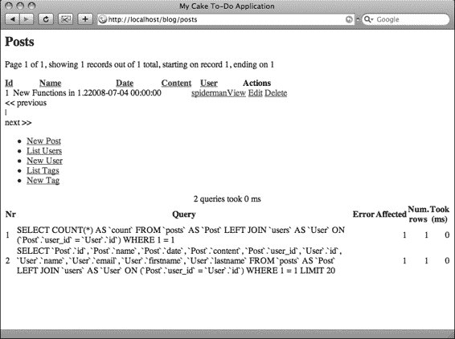

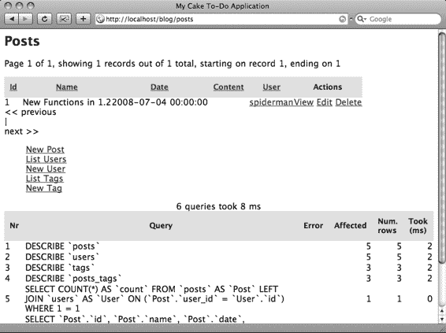

挺枯燥的吧？只需编辑 `app/webroot/css/styles.css` 文件，就能让界面生动起来。在该文件中粘贴清单 5-2 所示的代码，或执行类似操作即可。

**清单 5-2：** *默认布局的示例 CSS 代码*

```
* { font-family: "Lucida Grande",Lucida,sans-serif; }

th {
  font-size: 14px;
  font-weight: bold;
  background-color: #e1e1e1;
  border-bottom: 1px solid #ccc;
  padding: 10px;
}

div.actions ul {
  list-style-type: none;
}
```

刷新 Posts 控制器，显示界面中会出现一些新样式（见图 5-2）。

**图 5-2：** *所有视图均反映了新样式。*

可以看到，通过将自定义样式放入默认布局，您可以完全编辑应用程序输出内容的周边设计。只要遵循默认布局，任何被渲染的视图都会使用相同的样式表，因此无需重复定义样式或设计。

返回 `app/views/layouts/default.ctp` 文件，将第 4 行修改为以下内容：

```
<?=$html->css('cake.generic');?>
```

刷新 Posts 控制器屏幕后，您会注意到 Cake 的样式已生效，但不再包含脚手架默认的标题等内容。通过这些样式更改，脚手架仍在生成各个 CRUD 操作视图，但此时已不再使用 Cake 的内置布局。

## 创建独立视图

如果想直接操控视图该怎么办？例如，您想移除页面顶部显示"Posts"的标题，替换为"Blog Posts"。这正是独立视图发挥作用的地方。

没错，脚手架是一项便利功能，能让代码测试快速且无痛——尤其是当您只想操作数据库来确认其是否正常工作时。但它无法读取您的想法，只能生成一些通用视图。若要增减应用程序的输出内容，就需要手动构建相应输出。别担心——通过使用框架，这一过程同样会变得轻松许多。

## 向控制器添加操作

若要脱离脚手架，可以删除控制器中的 `$scaffold` 属性，或者通过添加自定义操作来拦截脚手架。脚手架操作的具体名称分别为 `index()`、`add()`、`edit()`、`view()` 和 `delete()`。若在控制器中插入同名的操作，该操作就会取代对应的脚手架功能。因此，保留 `$scaffold` 属性以处理您不想编码的 CRUD 操作，然后为您想要自定义的操作生成相应方法。

第一个要添加的、也是最简单的操作是 Index 操作。该操作只需要从数据库中获取所有文章，并将其传递给视图。随后视图将以列表形式显示所有文章。将清单 5-3 插入 Posts 控制器的 `$scaffold` 属性之后。

**清单 5-3：** *Posts 控制器中的 Index 操作*

```
function index() {
  $this->set('posts',$this->Post->find('all'));
}
```

将操作写入控制器仅完成了一半流程。如果此时启动 `Posts` 控制器，会显示错误消息——因为控制器会查找视图文件，而目前尚无 `Index` 操作的视图可用。下一步是按照 Cake 的约定创建对应的操作视图。文件需放置在 `app/views/posts` 目录中，并以操作名称命名。创建必要的 `posts` 文件夹，将 `index.ctp` 文件放入其中。然后将清单 5-4 中的视图代码粘贴到该文件中。

**清单 5-4：** `app/views/posts` 文件夹中的 Index 视图

```
<h2>Blog Posts</h2>
<table cellpadding="0" cellspacing="0">
<tr>
  <th>ID</th>
  <th>Name</th>
  <th>Date</th>
  <th>Content</th>
  <th>User</th>
  <th>Actions</th>
</tr>
<? foreach($posts as $post): ?>
```

```html
<tr>

<td><?=$post['Post']['id'];?></td>

<td><?=$post['Post']['name'];?></td>

<td><?=$post['Post']['date'];?></td>

<td><?=$post['Post']['content'];?></td>

<td><?=$post['User']['name'];?></td>

<td class="actions">

<?=$html->link('View','/posts/view/'.$post['Post']['id']);?> <?=$html->link('Edit','/posts/edit/'.$post['Post']['id']);?> <?=$html->link('Delete','/posts/delete/'.$post['Post']['id'],null,'Are you sure you want to delete #'.$post['Post']['id']);?>

</td>

</tr>

<? endforeach;?>

</table>

<div class="actions">

<ul><li><?=$html->link('New Post','/posts/add');?></li></ul>

</div>
```

本质上，你所做的是重新创建了脚手架视图（假设你仍在使用 `cake.generic.css` 文件而非自己的样式文件）。但现在代码就在你面前，你可以随意修改它的任何方面，并根据自己的需求进行定制。请注意，在清单 5-4 的第 1 行，我将 `<h2>` 标签的内容改为“博客文章”。在清单 5-3 中，`Index` 操作执行了一个模型函数，该函数提取所有帖子记录并将其分配给一个变量供视图使用。在清单 5-3 的第 7 行，`set()` 函数是 Cake 的一个函数，用于为视图变量赋值。本例中，该变量将被命名为 `posts`，并包含来自 `Post` 模型中 `find()` 函数的结果。

在清单 5-4 的第 11 行，视图文件使用了控制器中的 `set()` 函数。在视图中，`posts` 现在是一个名为 `$posts` 的标准 PHP 变量。第 11 行开始对该数组变量进行循环，这相当于遍历从数据库查询中获取的每条记录。视图只是将每个记录的内容取出并显示在表格单元格中。每次迭代都会生成一个新的表格行，直到到达 `$posts` 变量中的最后一条记录。

启动 `Posts` 控制器中的 `Index` 操作，你应该会看到与脚手架视图几乎相同的屏幕（见图 5-3）。

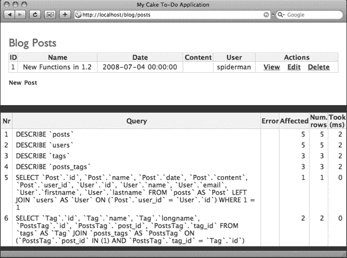

**第 5 章 ■ 创建简单视图与控制台烘焙**

**图 5-3.** 由手动代码（而非脚手架代码）渲染的 Index 操作视图。

此例的主要区别在于，你可以访问显示代码和操作的逻辑，因为你已在控制器和视图文件中手动提供了代码。创建这些代码并不困难，主要是因为 `Index` 操作只需要一行代码来运行数据库查询并将结果提供给视图。其他的 CRUD 操作需要更复杂的操作，并且需要在控制器和视图中编写更多的代码行。幸运的是，Cake 可以在控制台中帮助生成这些代码。

### 使用 Bake 创建视图

我已经向你展示了如何手动创建索引视图。但实际上，你应该能够避免手动输入这些基本的 CRUD 函数。Cake 内置了一个名为 Bake 脚本的便捷控制台脚本（`bake.php` 脚本，位于 `cake/console/libs` 文件夹中）。它不仅会为你节省大量生成构建这些视图所需代码的时间，还会向你展示一些基本的 Cake 代码，帮助你理解 Cake 如何使用模型、视图和控制器。

#### 配置控制台配置文件以运行 Bake

无论你的 localhost 设置如何，你都需要一种运行控制台来执行 Bake 的方法。大多数 Linux 系统都内置了控制台，Mac OS X 则自带了终端应用程序，因此如果你在这些环境中运行，无需安装任何额外软件即可运行 shell 脚本。对于 PC 用户，你可能需要安装支持在控制台中运行 PHP 的额外软件，例如 Cygwin [(www.cygwin.com)](http://www.cygwin.com) 或 MinGW ([www.mingw.org](http://www.mingw.org))。让 Bake 在控制台中正常工作的主要要求是：shell 可以运行 PHP，并且可以运行你 Cake 应用程序使用的同一数据库引擎。

许多用户使用诸如 XAMPP、LAMP 或 MAMP 之类的辅助程序——这些个人 Web 服务器应用程序将 Web 服务器设置简化到最低限度。尽管这些程序基本上只需点击一个按钮就能启动 localhost，但它们确实让 Bake 正常运行变得稍微有点棘手。通常，操作系统和 Web 服务器环境都有 shell 应用程序，在运行控制台时可能会相互冲突。无论你的设置如何，你可能都需要调整 shell 的配置文件才能使 Bake 正常工作。

在 Mac OS X 和一些 Linux 版本中，命令行控制台在执行命令时会使用一个名为 `.profile` 的文件（该文件通常在操作系统中不可见）。幸运的是，你可以添加一些自定义的环境设置，告诉控制台在执行 Bake 命令时应该去哪里。

你可以通过多种方式打开 `.profile` 文件。你可以使用以下命令在控制台中编辑 `.profile`：

```
vi .profile
```

然而，如果你和我一样，可能更希望在简单的纯文本编辑器中编辑此文件。你需要找到该配置文件才能在你的编辑器中打开它，但保存后，无论你的 localhost 设置如何，Bake 都应该能正常运行。

配置文件需要添加清单 5-5 中的行才能使 Bake 正常工作。

**清单 5-5.** 通过在配置文件中输入别名，你可以在命令行中访问 Bake

```
alias cake="php ~/Sites/blog/cake/console/cake.php"
```

如果你不熟悉控制台配置文件别名，可能需要解释一下清单 5-4。首先，定义了一个新别名，本例中别名为 `cake`。现在，无论何时在控制台命令行中键入“cake”，它都将执行引号内的内容。这里的顺序很重要：第一串字符串是当键入别名时要执行的 shell 应用程序的路径，第二串字符串是由 shell 应用程序启动的文件的路径。本例中，当在控制台中键入“cake”时，shell 将运行其原生的 PHP shell 应用程序。它还会告诉 PHP 启动 `cake/console/cake.php` 文件。

你在此处输入的别名可能需要根据你的设置进行调整，特别是当你运行诸如 XAMPP 之类的 Web 服务器应用程序时。请确保 PHP 的路径指向运行你 Cake 应用程序的 PHP 应用程序。对于个人 Web 服务器用户来说，这很可能是 `xampp/php/php5/phpcli.exe` 文件或类似 `xampp/xamppfiles/bin/php` 的路径。无论如何，它必须与你的 localhost 根目录使用的命令行 PHP 应用程序是同一个。

此外，Cake 控制台脚本的路径会根据你的应用程序在 localhost 上的存储位置而变化。这里的一个好经验是使这两个路径成为绝对路径，这样无论你在什么环境下使用控制台，它都能访问正确的应用程序和脚本。

#### 启动 Bake

在正确配置配置文件后，只需在命令行中输入以下内容即可启动 Bake：

```
$ cake bake
```

当 Bake 正确启动时，会发生两件事之一：它会询问你想要烘焙什么，或者它会询问你想将新的 Cake 应用程序复制到哪里。如果是后一种情况，你需要指定博客应用程序的路径，以使 Bake 能与你现有的项目正常工作。为此，在启动 Bake 时，请使用 `-app` 参数指定应用程序 App 目录的路径。请确保包含末尾的斜杠（参见清单 5-6）。

■**注意** 如果你在 Windows 系统中运行控制台，可能需要使用文件名 `cake.bat` 而非终端命令 `cake` 来引用 Cake 命令。这取决于你如何设置控制台，以及任何第三方控制台应用程序的配置方式。

**清单 5-6.** *使用* `-app` *参数指定 Bake 的应用程序路径*

`$ cake bake -app ~/Sites/blog/app/`

当你看到 Bake 欢迎屏幕（见图 5-4）时，即可判断 Bake 是否在你的应用程序中正常工作。

**图 5-4.** *Bake 欢迎屏幕*

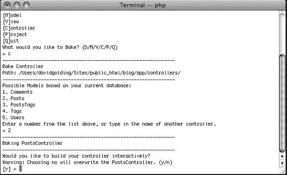

09775ch05final 7/1/08 9:42 PM 第 64 页

**64**

第 5 章 ■ 在控制台中创建简单视图并使用 Bake 生成代码

**使用 Bake 生成 CRUD 视图**

欢迎屏幕首先询问需要生成什么内容。Bake 可以处理多种应用程序资源的创建：

- 数据库配置

- 模型

- 视图

- 控制器

- 项目

选择数据库配置或项目将生成一个新的 `app/config/database.php` 文件或一个新的 Cake 应用程序项目。多数情况下，你会使用 Bake 来帮助创建模型、视图和控制器。你已在 Posts 控制器中创建了 Index 操作，以逐步了解手动创建操作和视图的过程。使用 Bake，你将用一个 Bake 生成的控制器覆盖 Posts 控制器，然后生成 CRUD 视图。

**首先生成控制器**

在控制台中输入 `C` 选择 Bake 中的控制器。Bake 会提示你指定从哪个模型生成，或使用 Bake 脚本动态写入新控制器（见图 5-5）。从 Posts 控制器开始，输入对应的数字（2）。

**图 5-5.** *要生成控制器，必须指定基于哪个模型构建。*

09775ch05final 7/1/08 9:42 PM 第 65 页

**65**

第 5 章 ■ 在控制台中创建简单视图并使用 Bake 生成代码

Bake 提供交互式生成控制器的选项。在交互模式下，Bake 会引导你完成构建控制器的每一步。每一步你都可以修改设置以满足需求。跳过交互模式将生成默认控制器，并覆盖与 Bake 生成文件同名的任何控制器。进入交互模式生成控制器，并指定以下设置：

- 是否使用脚手架？[否]

- 是否包含一些基本类方法（`index()`、`add()`、`view()`、`edit()`）？[是]

- 是否创建用于管理路由的方法？[否]

- 是否希望此控制器使用除 `HtmlHelper` 和 `FormHelper` 之外的其他辅助器？[否]

- 是否希望此控制器使用任何组件？[否]

- 是否使用会话？[是]

Bake 会询问你创建的 Posts 控制器是否看起来正确；如果在此过程中输入了错误参数，这是一个重新开始的机会。当你继续时，由于你已经创建了一个 Posts 控制器，Bake 会询问你是否要覆盖现有的 Posts 控制器。指定“是”。最后，Bake 会询问你是否要生成单元测试文件；指定“否”。

就是这样。Posts 控制器现在将包含基本类方法的业务逻辑（见清单 5-7）。

**清单 5-7.** *Bake 生成的 Posts 控制器*

```php
<?php

class PostsController extends AppController {

var $name = 'Posts';

var $helpers = array('Html', 'Form');

function index() {

$this->Post->recursive = 0;

$this->set('posts', $this->paginate());

}

function view($id = null) {

if (!$id) {

$this->Session->setFlash(__('无效的帖子。', true));

$this->redirect(array('action'=>'index'));

}

$this->set('post', $this->Post->read(null, $id));

}
```

09775ch05final 7/1/08 9:42 PM 第 66 页

**66**

第 5 章 ■ 在控制台中创建简单视图并使用 Bake 生成代码

```php
function add() {

if (!empty($this->data)) {

$this->Post->create();

if ($this->Post->save($this->data)) {
```

```php
$this->Session->setFlash(__('文章已保存', true));
$this->redirect(array('action'=>'index'));
} else {
    $this->Session->setFlash(__('文章保存失败，请重试。', true));
}

$tags = $this->Post->Tag->find('list');
$users = $this->Post->User->find('list');
$this->set(compact('tags', 'users'));
}

function edit($id = null) {
    if (!$id && empty($this->data)) {
        $this->Session->setFlash(__('无效文章', true));
        $this->redirect(array('action'=>'index'));
    }
    if (!empty($this->data)) {
        if ($this->Post->save($this->data)) {
            $this->Session->setFlash(__('文章已保存', true));
            $this->redirect(array('action'=>'index'));
        } else {
            $this->Session->setFlash(__('文章保存失败，请重试。', true));
        }
    }
    if (empty($this->data)) {
        $this->data = $this->Post->read(null, $id);
    }
    $tags = $this->Post->Tag->find('list');
    $users = $this->Post->User->find('list');
    $this->set(compact('tags','users'));
}

function delete($id = null) {
    if (!$id) {
        $this->Session->setFlash(__('文章 ID 无效', true));
        $this->redirect(array('action'=>'index'));
    }
    if ($this->Post->del($id)) {
        $this->Session->setFlash(__('文章已删除', true));
        $this->redirect(array('action'=>'index'));
    }
}
?>
```

### 第二步：烘焙视图

控制器烘焙完成后，Bake 会返回欢迎界面。您可以立即开始烘焙其他资源，由于现在控制器已支持 CRUD 操作，因此可以烘焙视图了。

选择 View 来烘焙视图，并选择 Posts 控制器作为构建对象。与之前烘焙控制器时一样，进入交互模式并指定以下设置：

- 是否要为此控制器创建一些脚手架视图（index, add, view, edit）？[是]

- 是否要为管理员路由创建视图？[否]

系统会再次询问是否覆盖 `app/views/posts/index.ctp` 文件。选择是，Bake 会提示视图脚手架构建完成（见图 5-6）。

启动 Posts 控制器，一切看起来应与调用 `$scaffold` 属性时的脚手架完全一致。Bake 提供了相同的视图和功能，但您现在可以在控制器和视图中对其进行编辑了。

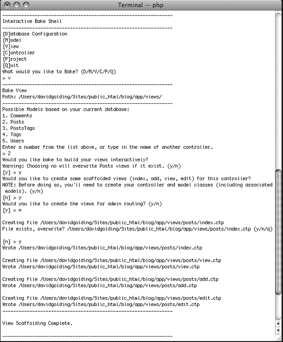

图 5-6. *基于 Posts 控制器烘焙视图的完整流程*

### 编辑烘焙后的视图

编辑视图是一项简单的任务。打开 `app/views/posts` 文件夹，您会看到以下烘焙生成的视图：

- `add.ctp`

- `edit.ctp`

- `index.ctp`

- `view.ctp`

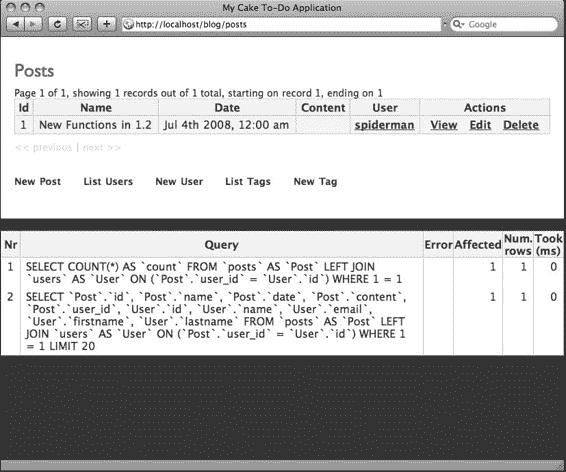

打开`index.ctp`文件，您会发现该视图中所有独特的HTML代码。将文件中的第2行改为以下内容，Index操作页面的标题将变为“博客文章”：

```
<h2><? __('博客文章');?></h2>
```

您可以对该文件进行任意添加或删除，以更改Index操作视图，而不会影响其他操作。例如，日期的显示格式对用户不友好。您可以通过在视图文件中编辑，将此日期字符串格式化为更易读的形式。在`app/views/posts/index.ctp`文件中大约第34行，是日期字符串：

```
<?php echo $post['Post']['date']; ?>
```

使用PHP的`date()`和`strtotime()`函数可以让这个变量显示得更好。将第34行改为类似下面的内容：

```
<?=date('m 月 j 日 Y 年, g:i a',strtotime($post['Post']['date']));?>
```

之后，Index操作视图中的日期显示会更加易读（见图5-7）。

图5-7. *Index操作视图中的每条文章列表都包含更友好的日期字段。*

### 考虑国际化

您可能已经注意到，烘焙生成的视图中的一些文本字符串被包裹在PHP函数`__()`中。简单来说，这个函数是Cake为国际化网站轻松动态修改视图而提供的方法。Cake可以将此函数包裹的内容本地化为用户的语言，但需要在应用程序的控制器和配置文件中进行其他设置。如果您的应用程序不需要国际化或本地化，则可以避免使用`__()`函数。

### 使用命令加速烘焙

一些基本命令可以使烘焙Cake资源更加便捷。只需在控制台中输入`cake bake`命令后跟上您需要烘焙的资源即可。示例如下：

```
$ cake bake controller
$ cake bake model
$ cake bake view
$ cake bake project
```

如果您想跳过交互模式直接生成文件，还可以输入资源的名称：

```
$ cake bake controller tags
$ cake bake model comment
```

如果您的Cake控制台安装要求您指定`-app`参数以便Bake访问您的工作应用文件夹，请务必包含它：

```
$ cake bake controller tags -app /serverroot/blog/app/
```

### 自定义视图

Bake脚本缩短了启动时间，让您可以快速获得脚手架视图。通过调整烘焙后的视图文件，您可以在其中添加自定义的元素和表单。本章中，您仅修改了Index操作视图，并学习了如何操作Bake脚本。第6章将详细讨论烘焙后的控制器和视图中的每一行代码，以及如何创建更高级的网页。您将分析其他的CRUD操作以及Cake如何与用户表单提交交互。Cake自带的Form和HTML辅助函数将使您能够更有效地管理表单字段和提交，所需代码比典型的PHP应用程序更少。

在继续之前，请按照本章的“烘焙更多资源”练习，使用其他表来练习Bake。

### 烘焙更多资源

在本章中，您烘焙了Posts控制器和一些脚手架视图。通过为tags和comments表生成控制器、模型和视图来掌握Bake。请务必尝试其他Bake命令以提高开发速度，并探索数据库配置和项目功能。

### 总结

Cake中的布局是包裹应用程序的文件。当您创建默认布局文件时，您就拦截了Cake用于脚手架、错误页面和其他视图的默认布局。各个视图文件将在布局中`$content_for_layout`变量被回显的位置渲染，从而使您能够为多个视图创建共同的界面。

让应用程序快速启动的最快方法之一是使用Cake的脚手架和Bake功能。通过设置控制台与Bake配合使用，您可以使用简单的shell命令（有时仅需一行文本）生成自定义的操作和视图。正确使用Bake可以提供基本代码，让您能够通过Web界面创建、编辑、列出和查看数据库记录，从而加速开发。第6章将更深入地研究烘焙元素内部的工作原理，并解释如何在Cake中自定义视图。

## 第6章：自定义视图

使用Bake生成视图和控制器操作可以快速启动应用程序开发。然而，最终你需要更定制化的代码来完善应用程序的功能集。为了让应用程序提供丰富的功能，用户不可避免地会以点击链接和HTML元素、提交表单数据或执行其他交互的形式进行一定程度的操作。当用户与应用程序交互时，他们会发出请求，这些请求会依次经过控制器和视图进行处理。本章将深入探讨这些请求序列，并介绍Cake中那些让你能更精细地控制用户体验的特性。

### 处理用户交互

一般来说，用户与Cake应用程序交互会产生三种类型的请求序列：

* 简单的页面请求序列
* 表单提交序列
* 异步（Ajax）请求序列

视图及其与控制器和模型的交互方式会根据程序的具体流程而变化。当你需要在Bake或脚手架生成的视图之外进行自定义时，必须牢记你正在构建的流程类型。

### 一个简单的页面请求

打开`app/controllers/posts_controller.php`文件，滚动到View操作。代码应该类似于清单6-1。

**清单6-1.** *Posts控制器中的View操作*

```
function view($id = null) {
    if (!$id) {
        $this->Session->setFlash(__('无效的文章。', true));
        $this->redirect(array('action'=>'index'));
    }
    $this->set('post', $this->Post->read(null, $id));
}
```

通常情况下——即便不是总是如此——请求流程会先分发到控制器。在这里，View操作由控制器处理，当流程终止时，会调用相应的视图文件。该操作的第一步是接收用户提供的任何参数。由于这是一个简单的页面请求序列，用户仅需提供一个或两个与数据库中某条记录匹配的变量——没有表单数据，没有复杂的逻辑测试，最多只包含几个参数。清单6-1中的第1行通过函数变量`$id`接收用户提供的参数。此变量默认值为`null`，但根据应用程序的需求，它完全可以改为一个数组或设定一个默认值。

在此操作中，会执行一个简单的逻辑测试：如果用户没有提供要从数据库中提取的文章的唯一ID，则返回错误；否则，读取匹配的记录并将其内容作为变量传递给视图。这个测试在第2到第6行执行。

如果用户没有将ID值作为参数提供，则执行第3行。该行使用了Cake的Session组件，这是一个包含多个用于管理和处理会话的函数的组件类。Session组件不是显示一个呈现错误消息的Flash页面，而是向视图发送一段文本字符串，该字符串将在布局（layout）或单独的视图文件中显示。在这种情况下，该操作使用了Session组件的`setFlash()`函数。要发送的错误字符串设置为“无效的文章”。在`app/views/layouts/default.ctp`文件中，你必须包含`Session->setFlash()`函数的另一端，它将接收该错误字符串并显示它。

打开默认布局，在`<body>`元素内的某处插入清单6-2中的代码行。

**清单6-2.** *显示Session Flash消息*

```
<? $session->flash();?>
```

现在，当识别到错误时，清单 6-1 中的第 4 行会将用户重定向到 Posts 控制器中的 Index 操作。因为你在默认布局中包含了 Session 组件，第 3 行中指定的错误消息将会在页面中显示出来。

清单 6-1 中的第 6 行使用 `set()` 函数将数据库中的信息传递给视图。该行还包含了一个模型函数 `read()`，它会查找与用户提供的 ID 相对应的记录并提取其数据。通过将这个模型函数赋值给 `set()` 函数中的视图变量 `post`，记录中的所有内容都可以在视图中使用。

简单的页面请求通常就像这个 View 操作一样工作。第一步是从用户的链接或 URL 中获取参数，并使其在操作中可用。第二步是检查提供的参数，如果参数为空，则提供错误消息。第三步是获取与请求相对应的数据项，并将它们传递给视图。现在，对于简单的页面请求，控制器的逻辑已经正常工作，你可以开始自定义视图了。

这个请求序列包含的内容远比我之前解释的代码要多得多。例如，该操作可以对参数执行更复杂的检查，或同时处理多个参数，运行多个数据库查询，然后将结果转发给视图。在某些情况下，你可能希望该操作不与视图交互，而是将数据转发给另一个操作。在这些情况下，Cake 的行为就像一个典型的 PHP 脚本，只是在为用户生成显示内容时有所不同。使用 Cake 的函数和组件（就像 Bake 使用 Session 组件那样）来代替你自己编写的函数或代码，但通常控制器会像一个通用的 PHP 脚本一样运行。

### 表单提交序列

处理用户表单数据比简单的页面请求序列更进了一步。在这种场景下，将按顺序发生以下几件事：

1. 控制器操作被调用，并判断用户是否提交了任何表单数据。
2. 如果没有表单数据，控制器则指示视图显示表单。如果是在编辑现有记录，控制器可能会执行数据库查找，以便在后续视图中预填充字段。
3. 用户填写表单并将其提交给控制器。
4. 这一次，控制器在请求中找到了表单数据并处理这些数据。根据操作结果的不同，会渲染另一个视图，通常是一个反馈页面，提示用户提交成功或失败。

要理解 Cake 流程的内部机制，请打开 `app/controllers/posts_controller.php`，滚动到 Add 操作。代码应该类似于清单 6-3。

**清单 6-3.** *Posts 控制器中的 Add 操作*

```php
function add() {

    if (!empty($this->data)) {

        $this->Post->create();

        if ($this->Post->save($this->data)) {

            $this->Session->setFlash(__('文章已保存', true));

            $this->redirect(array('action'=>'index'));

        } else {

            $this->Session->setFlash(__('文章无法保存，请重试。', true));

        }

    }

    $tags = $this->Post->Tag->find('list');

    $users = $this->Post->User->find('list');

    $this->set(compact('tags', 'users'));

}
```

Add 操作的行为与上述概要一致：在清单 6-3 的第 2 行，它通过一个简单的逻辑测试检查是否有用户表单数据，如果有，则将数据保存到数据库；否则，向用户返回错误并渲染 Add 视图。

#### `$this->data`

Cake 会为你处理表单数据，并遵循约定。提交给控制器的所有表单字段都会自动格式化为一个数组，其命名约定决定了数据在数组中的存储位置。表单将始终按照 MVC 结构进行解析和组织。例如，观察清单 6-4。

**清单 6-4.** *一个简单的表单*

```php
<?=$form->create('Posts');?>

<?=$form->input('name');?>

<?=$form->input('content',array('type'=>'textarea','rows'=>4,'cols'=>40));?>

<?=$form->end('提交');?>
```

虽然尚未讨论，但清单 6-4 使用了 `Form` 辅助器，后续将更广泛地使用它。简而言之，`Form` 辅助器会在视图中运行函数，决定如何显示一段 HTML 代码。`Form` 辅助器中的 `input()` 函数非常有用，因为它接受提供的名称（对应数据库中的字段）并渲染一个 HTML `<input type="text"/>` 元素，该元素包含所有适当的名称和值，以便 Cake 自动解析数据。如果你查看浏览器的页面源代码，此视图将输出以下内容：

```html
<form method="post" action="/blog/posts/add">

<input type="text" name="data[Post][name]" id="PostName"/>

<textarea name="data[Post]" cols="40" rows="4" id="PostContent"></textarea>

<input type="submit" value="Submit"/>

</form>
```

当用户填写表单并提交时，Cake 将表单数据放入 `$this->data` 数组中，如下所示：

```
Array (

    [Post] => Array (

        [name] => Title Entered in the Name Field

         => All the content provided in the <textarea> field.

    )

)
```

当处理关联模型时，`$this->data` 还可能包含这些字段。对于 `Post` 模型，您已经为博客构建了文章和标签之间的关联。如果操作正确，表单将把关联字段一并传递给 `$this->data`，结果如下：

```
Array (

    [Post] => Array (

        [name] => Title Entered in the Name Field

         => All the content provided in the <textarea> field.

    )

    [Tag] => Array (

        [Tag] => Array (

            [0] => 1

            [1] => 56

        )

    )

)
```

在 `$this->data['Tag']['Tag']` 数组中，每个选中项的 ID 作为数组中的独立元素存在，因为 `Tag` 模型与 `Post` 模型是“拥有并属于多个”（hasAndBelongsToMany）的关系。

用户表单提交可能会迅速变得更加复杂。同样在文章的添加操作中，还有一个日期时间字段。处理日期和时间可能会相当繁琐；区分月份、天数、分钟和小时可能是一场噩梦，因为每个单位都有其特定的数值范围（例如，一个月可能有 30 天，另一个月有 31 天，而二月每四年在 28 天和 29 天之间变化）。

与 `Form` 辅助器结合使用时，`$this->data` 可以大幅减少处理日期和时间的代码。如果在视图中正确使用 `Form` 辅助器，Cake 会解析包含日期和时间的表单，并将其放入 `$this->data` 数组中，如下所示：

```
Array (

    [Post] => Array (

        [date] => Array (

            [month] => 07

            [day] => 04

            [year] => 2008

            [hour] => 12

            [min] => 00

            [meridian] => pm

        )

    )

)
```

无论是在视图中还是控制器中，都可以像操作任何 PHP 数组一样，从 `$this->data` 中提取用户提交的数据。例如，通过检查 `$this->data['Post']['date']['year']` 的值可以轻松获取年份。或者，通过调用 `$this->data['Post']['date']['meridian']` 的值来获取上午/下午标识。考虑到在视图中，所有必要的日期和时间字段只需一行代码即可提供，Cake 中的日期和时间处理就更加吸引人了：

```php
<?=$form->input('date');?>
```

# 第 6 章 自定义视图

回到清单 6-3 的第 2 行，添加操作通过检查`$this->data`数组来判断用户是否提交了表单：如果数组为空，则用户未提交任何内容；如果不为空，则表示表单已提交，操作必须处理这些数据。

清单 6-3 的第 3-6 行在`$this->data`测试通过后，将数据保存到数据库。其余的操作行为类似简单的页面请求。如果未提供数据，操作会从`Tag`和`User`模型中提取一些关联数据，并将其传递给视图。

### 保存表单

当`$this->data`按照 Cake 的约定（主要通过视图中实现`Form`辅助器来管理）进行格式化时，保存数据非常简单。Cake 通过使用模型的`create()`和`save()`函数来执行保存操作。

**注意** *模型函数*（无论是在模型类中编写的函数，还是存储在模型文件中的自定义函数）与其他函数（例如控制器动作）之间的区别在于，它们始终通过模型执行。这意味着，要启动一个模型函数，必须始终通过模型类来执行。在本例中，`Post`模型保存数据，因此模型函数的名称为`$this->Post->save()`，而不仅仅是`$this->save()`。其他模型函数（如`read()`和`find()`）也将始终通过指定的模型以类似方式运行。因此，语法为`$this`后跟模型，后跟函数，函数的参数放在括号中。

`create()`函数在表中插入一条新记录。由于此模型函数来自指定的模型，它将插入到该模型中。在清单 6-3 的第 3 行，`create()`函数是从`Post`模型调用的，因此新行将插入到`posts`表中。在`create()`函数之后立即运行`save()`函数将把传递给保存的任何内容传播到新行中。清单 6-3 中的第 4 行发送了预先格式化的`$this->data`数组。`save()`函数已经构建为可以解析并保存该数组，因此无需其他数据处理。

简而言之，添加新记录的第一步是使用`create()`模型函数创建新行，第二步是通过`save()`模型函数传递`$this->data`来保存它。烘焙的`Add`动作不仅通过检查过程中的错误来保存数据。您可以通过在`beforeSave()`模型动作中输入逻辑来拦截`save`函数。如果此动作返回`false`，则在控制器中（例如清单 6-3 中的第 4 行），`save()`模型函数也会返回`false`。然后，控制器可以使用`Session`组件显示错误消息，或执行其他操作来响应模型中失败的保存。

通过设置模型 ID 变量来保存特定 ID 的表单数据，如下例所示：

```php
$this->Post->id = $id;
$this->Post->save($this->data);
```

这通常仅在更新记录时需要。创建新记录时，请使用`create()`模型函数。

### 为编辑或更新填充表单字段

表单提交序列还可能包括编辑数据库中的记录或之前保存的数据。在这种情况下，控制器需要比`Add`动作包含更多的操作。打开`app/controllers/posts_controller.php`文件并滚动到`Edit`动作。它应包含类似于清单 6-5 的代码。

**清单 6-5.** Posts 控制器中的 Edit 动作

```php
function edit($id = null) {
    if (!$id && empty($this->data)) {
        $this->Session->setFlash(__('无效的文章 ID', true));
        $this->redirect(array('action'=>'index'));
    }
    if (!empty($this->data)) {
        if ($this->Post->save($this->data)) {
            $this->Session->setFlash(__('文章已保存', true));
            $this->redirect(array('action'=>'index'));
        } else {
            $this->Session->setFlash(__('文章无法保存，请重试。', true));
        }
    }
    if (empty($this->data)) {
        $this->data = $this->Post->read(null, $id);
    }
    $tags = $this->Post->Tag->find('list');
    $users = $this->Post->User->find('list');
    $this->set(compact('tags','users'));
}
```

这个动作大致是`Add`和`View`动作的组合。编辑既需要一个简单的页面请求（要编辑的记录或数据源），也需要一个表单提交过程，这些都包含在烘焙的`Edit`动作中。该动作执行三个逻辑测试。

第一，用户是否只提供了一个记录 ID？第二，用户是否提供了任何表单数据？第三，用户是否既未提供表单提交也未提供记录 ID？这些测试可以在三段代码中找到，分别是第 2-5 行、第 6-13 行和第 14-16 行。

注意，在第 15 行，`$this->data`等于`read()`模型动作的结果。换句话说，`read()`函数的结果遵循与控制器中表单提交相同的格式化规则。无论方向如何——是从数据库读取记录并在视图中提供，还是将表单数据从视图发送到控制器——Cake 都会以相同的方式格式化数组。

### 异步序列

当用户通过网页发出请求，而服务器无需退出或刷新当前页面即可响应时，就会发生异步过程。换句话说，从用户的角度来看，请求由服务器在后台处理，不会干扰当前显示。通常，服务器只会更新特定的 HTML 元素，而不是整个网页。近年来，随着企业级网站更好地利用 JavaScript 和 XML，异步 HTTP 请求变得越来越流行。大多数开发人员将任何异步服务器响应称为*Ajax*操作，尽管 Ajax 最初是“异步 JavaScript 和 XML”的缩写。

最近，出现了几个开源 Ajax 框架，使异步操作更易于管理。Cake 附带了一个`Ajax`助手，旨在促进异步用户序列。使用此类工具，无需重新加载整个网页即可与服务器交互，从未如此简单。简单的页面请求和表单提交序列可以在 Cake 中异步工作，但必须使用 JavaScript 方法来实现正确的 HTTP 响应。

要使 Ajax 正常工作，必须通过 JavaScript 操纵浏览器的默认行为。例如，当单击链接或表单按钮时，浏览器会自动同步发送 HTTP 请求，并等待服务器返回新的网页。此行为被 JavaScript 抑制；此示例中的表单按钮使用 JavaScript 发送 HTTP 请求，而无需浏览器刷新或等待新页面。JavaScript 还负责接收服务器的响应，并确定在何处显示用户请求的结果。由于 Ajax 依赖于 JavaScript，因此 Cake 中的异步序列始于视图文件。

在视图中，发送或接收 Ajax 请求的任何 HTML 元素都必须包含正确的 JavaScript 代码。如果使用 Ajax 框架，布局通常会包含指向该框架库的链接。例如，Ajax 链接可能使用`onClick` HTML 属性，并包含遵循该框架方法的 JavaScript 代码，而不是使用同步的`href`属性。无论 Ajax 框架如何准备和处理异步过程，其使用的 URL 通常都会遵循 Cake 使用的模式。在视图文件中，Ajax 表单或链接因此将指向控制器，就像同步表单和链接一样。

然而，控制器确实需要执行略微不同的操作才能使 Ajax 在 Cake 中工作。假设所有 JavaScript 都已就位，可以向 Cake 控制器发送异步请求。从这个意义上说，控制器的行为将与以典型方式发出请求时相同。但默认情况下，Cake 会根据正在运行的动作渲染相应的视图文件。`render()`函数可以拦截默认的视图渲染，并告诉 Cake 它必须异步运行。

只需将`render()`函数放在动作中，通常在此处允许控制器终止并输出视图。确保在函数中包含`ajax`参数，以便 Cake 知道异步渲染视图：

```php
$this->render('add','ajax');
```

稍后，我们将介绍更高级的 Ajax 方法，这些方法需要在视图中进行大量编辑。目前，只需了解异步序列是 Cake 中的一个可选方案，并且其处理方式与其他两种响应几乎相同。

### 编写单个视图文件

有了控制器逻辑后，接下来，各个视图文件必须正确处理用户交互序列。打开 `app/views/posts/view.ctp` 文件。滚动到第 1–30 行；它们应该看起来像清单 6-6 中的代码。

**清单 6-6.** *视图操作视图文件，第 1–30 行*

```php
<div class="posts view">
<h2><?php __('Post');?></h2>
```

<dl><?php $i = 0; $class = ' class="altrow"';?>

<dt<?php if ($i % 2 == 0) echo $class;?>><?php __('Id'); ?></dt>

<dd<?php if ($i++ % 2 == 0) echo $class;?>>

<?php echo $post['Post']['id']; ?>

&nbsp;

</dd>

<dt<?php if ($i % 2 == 0) echo $class;?>><?php __('Name'); ?></dt>

<dd<?php if ($i++ % 2 == 0) echo $class;?>>

<?php echo $post['Post']['name']; ?>

&nbsp;

</dd>

<dt<?php if ($i % 2 == 0) echo $class;?>><?php __('Date'); ?></dt>

<dd<?php if ($i++ % 2 == 0) echo $class;?>>

<?php echo $post['Post']['date']; ?>

&nbsp;

</dd>

<dt<?php if ($i % 2 == 0) echo $class;?>><?php __('Content'); ?></dt>

<dd<?php if ($i++ % 2 == 0) echo $class;?>>

<?php echo $post['Post']['content']; ?>

&nbsp;

</dd>

<dt<?php if ($i % 2 == 0) echo $class;?>><?php __('User'); ?></dt>

<dd<?php if ($i++ % 2 == 0) echo $class;?>>

<?php echo $html->link($post['User']['name'],

array('controller'=>'users', 'action'=>'view', $post['User']['id'])); ?>

&nbsp;

</dd>

</dl>

</div>

```

简而言之，视图操作是一个简单的页面请求。用户请求显示特定记录，而此视图文件正是为了以有组织的方式完成此任务。这些行中渲染的大部分是 HTML。第 1 行创建一个新的 `<div>` 元素，第 30 行将其关闭。然而，这里有一些重要的 Cake 操作在起作用，它们与控制器提供的数据相对应。回顾清单 6-1 的第 6 行，视图操作执行了一个 `read()` 模型函数，并使用 `set()` 函数将结果赋值给一个名为 `post` 的变量。该变量现在在视图文件中以 `$post` 的形式可用，并且可以根据你的需要在整个视图中显示。

Bake 为你提供了一系列环绕着 `$post` 变量实例的 HTML 标签，这些标签用于清晰地显示返回记录的内容。请注意，`$post` 的格式类似于 `$this->data`。它包含一个以模型名为键的数组，每个键对应一个包含其各自表中字段的嵌套数组。注意第 26 行如何显示关联模型的数据。在本例中，帖子与用户相关联，当控制器执行 `read()` 函数时，它注意到了这种关联，并同时提供了相关的记录。所有这些数据都可在 `$post` 数组中找到。

#### 使用调试函数

你经常需要查看这些数据数组的内容。Cake 的 `debug()` 函数提供了一个详细且格式清晰的指定数组视图。在此视图文件中，插入以下使用 `debug()` 函数的行：

```php
<? debug($post);?>
```

当你刷新视图操作时，你应该会看到一个亮黄色的框，其中打印出了 `$post` 变量的内容（参见图 6-1）。

**图 6-1.** *`debug()` 函数显示 `$post` 变量的内容*

每个模型在数组中以其名称作为键，并附加了相关的记录。Cake 不仅提供了用户请求的帖子记录内容，还提供了来自关联模型的记录。假设你想通过帖子标题来显示分配给此博客帖子的用户名。你可以通过对正确的数组、键和值执行 `echo()` 函数来实现：

```php
<h2><?=$post['User']['firstname'].' '.$post['User']['lastname'];?></h2>
```

`debug()` 函数能帮助你在开发过程中弄清楚视图中到底在传递什么。它可以用于任何数组。当然，也可以使用其他数组显示函数，例如 PHP 原生的 `print_r()` 函数或 Cake 的便捷函数 `pr()`。

#### 从头开始自定义视图文件

Bake 为这个简单的页面请求提供了一个极好的起点。让我们从头开始简化视图，使其对网站访问者更具可读性。在你的博客应用程序中，这个视图将像其他博客或新闻网站一样，是一个简单的故事展示。你不需要显示诸如 ID 或作者 ID 之类的字段，尽管这些字段可能对构建指向其他操作或控制器的链接有用。

编辑 `app/views/posts/view.ctp` 文件，删除 Bake 生成的代码，并插入清单 6-7 中的代码。

**清单 6-7.** *简化后的视图*

```php
<h1><?=$post['Post']['name'];?></h1>

<p>作者: <?=$post['User']['firstname'];?> <?=$post['User']['lastname'];?></p>

<p>发布日期: <?=$post['Post']['date'];?></p>

<hr/>

<p><?=$post['Post']['content'];?></p>
```

清单 6-7 的代码非常简单，但从小处着手有助于你在后续开发中包含其他有用的功能。第 1 行将帖子标题显示为 `<h1>` 元素。第 2–3 行在单独的 `<p>` 标签中显示关联用户的姓名以及帖子日期。最后，第 5 行显示帖子的文本内容。`$post` 变量仍然包含你可以使用的其他数组数据，但视图中只调用了几个字段。

#### HTML 助手

假设你希望帖子标题本身就是一个链接，以保持整个应用程序的一致性。在这种情况下，可以使用内置的 HTML 助手来为你生成适当的链接。将视图文件中的第 1 行改为清单 6-8 中的内容。

**清单 6-8.** *HTML 助手及其 `link()` 函数*

```php
<?=$html->link('<h1>'.$post['Post']['name'].'</h1>','/posts/view/'.$post['Post']['id'],null,null,false);?>
```

`link()` 函数中的每个参数都像其他 PHP 函数参数一样用逗号分隔。当需要时，你可以通过数组将自定义变量和设置传递给助手函数，它会返回一些 HTML 用于显示。你不需要使用每个参数，因此在这些情况下可以传入一个 `null` 值。在清单 6-8 中，你首先通过调用 `$html` 对象来调用 HTML 助手中的 `link()` 函数。对于这个特定的助手，它的大多数函数都需要你执行一个 `echo()` 函数，这里你使用了简写操作符 `<?=` 而不是完整拼写出该函数。函数中的最后一个参数对应于 `link()` 函数的转义特性。在这种情况下，你将其设置为 `false`，以便该函数忽略将大于号和小于号转义为 HTML 实体。

HTML 助手的 `link()` 函数的第一个参数是要显示的文本。第二个参数是 URL（遵循应用程序的路由），它将被放入链接中。请注意，你使用了 `$post` 变量来提供标题和当前 ID，以使此链接可操作并与用户的请求相对应。

### 自定义视图

对于简单的页面请求，除了显示所传递数组的内容之外，通常不需要更多操作。然而，表单提交流程则需要更详细的处理。如前所述，Cake 提供了辅助此工作的助手函数。

### 自定义 HTML 表单

列表 6-4 描述了一个基础的 Cake 表单，它使用 `Form` 助手来渲染表单元素。

如何自定义这些功能，需要你对 `Form` 助手的工作方式有一致的理解和认识。

打开 `app/views/posts/add.ctp` 文件。其内容应与列表 6-9 中的烘焙代码一致。

**列表 6-9.** *Posts 添加视图文件的烘焙内容*

```
<div class="posts form">

<?php echo $form->create('Post');?>

<fieldset>

<legend><?php __('Add Post');?></legend>

<?php

echo $form->input('name');

echo $form->input('date');

echo $form->input('content');

echo $form->input('user_id');

echo $form->input('Tag');

?>

</fieldset>

<?php echo $form->end('Submit');?>

</div>
```

<div class="actions">

<ul>

<li><?php echo $html->link(__('List Posts', true), array('action'=>'index'));?></li>

<li><?php echo $html->link(__('List Users', true), array('controller'=> 'users', 'action'=>'index')); ?></li>

<li><?php echo $html->link(__('New User', true), array('controller'=> 'users', 'action'=>'add')); ?></li>

<li><?php echo $html->link(__('List Tags', true), array('controller'=> 'tags', 'action'=>'index')); ?></li>

<li><?php echo $html->link(__('New Tag', true), array('controller'=>'tags', 'action'=>'add')); ?></li>

</ul>

</div>

第 15–23 行包含了指向各种操作的链接，这些链接都使用了 `HTML` 助手的 `link()` 函数。第 2–13 行包含了表单及其字段，这些字段使操作得以实现。当应用程序在视图和控制器之间来回通信时，`Form` 助手会拦截所有被传递的数据，并分析每一条数据以决定它在表单中应该如何显示。只要 `$this->data` 与 Cake 的默认构造保持一致，`Form` 助手就能保持同步。有时，应用程序的设计可能需要一些额外的设置才能使 `Form` 助手正常工作，但大多数情况下，它与 `$this->data` 协作得非常好，并能为你省去很多麻烦。告别那个老旧的 PHP `$_POST` 数组吧！

就像我们对 `View` 视图所做的那样，让我们从头重新构建 `Add` 视图。用列表 6-10 中的内容替换 `app/views/posts/add.ctp` 文件的内容。

**列表 6-10.** *Add 操作的极简代码*

```
<div class="posts form">

<?=$form->create('Post');?>

<fieldset>

<legend>Add Post</legend>

<?

e($form->input('name'));

e($form->input('date'));

e($form->input('content'));

e($form->input('User'));

e($form->input('Tag'));

?>

</fieldset>

<?=$form->end('Submit');?>

</div>
```

这段代码与 Bake 提供的代码类似，但它使用了 `e()` 便捷函数（与 `echo()` 相同），并去掉了操作链接。请注意，每个字段都使用了 `input()` 函数，并且 `Form` 助手会自动识别每个字段中包含的数据类型。对于关联模型，提供了模型名称（例如 `User` 和 `Tag`），`Form` 助手会假定该字段是一个关联关系，并基于此关系进行构建。这样，你会自动获得一个用于用户的单选下拉菜单和一个用于标签的多选下拉菜单。

要自定义表单元素，必须使用 `Form` 助手函数中提供的选项。一个例子是向 `input()` 函数添加一些参数。目前，`Tag` 输入元素是一个多选下拉菜单，其中包含 `$this->data` 数组中的标签列表。如果将其更改为多个复选框，通常需要编写多行 HTML 标签来渲染每个单独的复选框。使用 `Form` 助手，你可以通过一行代码来自定义表单以处理多个复选框（见列表 6-11）。

**列表 6-11.** *Form 助手的 `input()` 函数渲染多个复选框而非多选下拉菜单*

```
echo $form->input('Tag',array('type'=>'select','multiple'=>'checkbox'));
```

`input()` 函数的第一个参数是模型名或当前模型的字段名。第二个参数是一个数组，包含多个作为键的选项及其具体的设置值作为值。注意，你已告诉 `Form` 助手使用 `$this->data` 数组中 `Tag` 键所存放的数据来渲染一个输入元素，并且该元素必须是 select 类型，但其多选选项应使用复选框而非默认样式。刷新 `Add` 操作，你应该会看到表单简化了，并带有自定义的复选框。无论 HTML 元素的类型如何，Cake 都会以相同的方式格式化数据，并且由于控制器已设置为保存从视图接收到的数据，因此 `Add` 操作会继续正常工作。

### 使用其他助手

Cake 预装了多个助手：

- Ajax
- Cache
- Form
- HTML
- JavaScript
- Number
- Paginator
- RSS
- Session
- Text
- Time
- XML

每个助手都包含多个函数，用于简化数据处理和内容显示。每个助手都将遵循相同的基本语法——在视图中作为一个变量可用的对象，加上其函数及其在括号中提供的参数。互联网上也有第三方助手可用，其中许多来自 Cake 的官方 Bakery (`http://bakery.cakephp.org`)。要使助手可用，除了 `HTML` 和 `Form` 助手之外，你必须在控制器中指定正在使用该助手。这通过使用相应助手的类名填充助手设置数组来实现：`var $helpers = array('Ajax','Session','Time');`

通过将这行字符串放置在调用 `var $name` 和 `var $scaffold` 属性的位置附近，Cake 能够启动一个助手类对象的新实例，并使其在视图中可用。使用更多助手会为你增添定制方案的更多可能性。你对 Cake 的助手越熟悉，在自定义视图时拥有的选项就越多。

### 可读的日期和时间

尝试使用 `Time` 助手来练习在视图中使用助手。记得先在控制器中设置 `$helpers` 属性以包含 `Time` 助手。然后在 Posts 的 `View` 视图中，使用 `nice()` 函数使 `$post['Post']['date']` 值更具可读性。提示：你需要将变量传递给该函数才能使其正常工作。

### 总结

用户通常通过以下三种方式之一与你的 Cake 应用程序交互：发出一个简单的页面请求、提交某种表单、或异步发送页面或表单请求（也称为 Ajax 过程）。控制器和视图在 Cake 中协同工作来处理这些类型的序列。当自定义用户将与之交互的视图时，你也将在控制器中工作，以提供处理用户请求所需的逻辑。控制器将使用诸如 `set()` 和 `render()` 之类的函数来调用视图，并为其提供必要的参数和变量。标准化的数组（如 `$this->data`）使得处理用户表单数据变得更加容易，因为控制器会解析视图中渲染的数据，并通过模型运行它。本章解释了 Cake 如何格式化 `$this->data`，以及它与 `Form` 助手的交互。接下来将扩展控制器和模型的功能——第 7 章将描述如何自定义控制器和模型以执行更复杂的操作。

# 使用控制器和模型

### CakePHP 中的单次操作

CakePHP 中的单次操作通常会调用多个 MVC 元素，并同时在这些元素中运作。例如，在上一章中，你使用了 `Form` 辅助程序来接收来自控制器和模型获取的数据，并将用户表单数据发送给控制器进行处理。更改控制器中的内容会影响 `Form` 辅助程序的行为，这在操作 `$this->data` 等变量时尤为明显。

当我在本章讨论开发控制器和模型的更高级方法时，请记住，可能需要对视图进行修改，才能使操作或自定义功能正常工作。例如，管理会话是一个集成度很高的过程，你可能需要在视图（创建登录屏幕和显示会话状态）、控制器（执行会话逻辑以确定会话的各个方面）和模型（将会话数据保存到数据库中）上花费同等的精力。换句话说，要将整个会话操作集成到应用程序中，意味着需要共同编辑和测试控制器中的操作、模型函数以及视图。

### 构建一个功能丰富的博客

框架的经典教程通常是构建一个博客。在 CakePHP 的官方网站上，有一整套博客应用程序教程。然而，你需要的是对*发生了什么*进行透彻的解释，而不仅仅是*如何*构建程序的逐步指南。因此，本教程与其他教程的不同之处在于，我将系统地解释该应用程序中的每一行代码。你应该掌握的是这些概念，而不仅仅是步骤。掌握了这些概念，你就能深入理解 CakePHP 提供的许多功能，并学会如何将它们整合到你自己的定制应用程序中。

你一直在处理的博客程序已经让你探索了 CakePHP 提供的脚手架、Bake 和辅助程序功能。为了让博客更加强大，你需要同时处理模型、视图和控制器。既然你已经了解了各种起点和关键概念，那么是时候更详细地讨论应用程序构建了。让我们从控制器和模型开始，它们是任何 CakePHP 应用程序的命脉。

你将构建的功能丰富的博客将包含以下高级特性：

-   文章通过一个 wiki 处理器运行，将内容转换为 HTML 元素
-   读者评论及社区投票功能
-   创建包含日期友好型 URL 的路由
-   一个管理区域，网站管理员可以在此添加文章
-   多作者的用户管理
-   用于动态组织帖子的分类排序
-   一个全站菜单系统，用于浏览分类和文章

诸如此类的功能实现起来不会太困难，但会充分利用所有的控制器、模型和视图。在本教程中，你将逐个实现这些功能，并将它们构建到应用程序中。在此过程中，我将继续解释在 CakePHP 中进行开发的重要概念。首先，我将讨论一般性的控制器操作，然后展示如何构建一些自定义操作。

### 处理操作

你已经在 CakePHP 中构建并使用了操作。在接下来的功能丰富的博客应用程序中，你将构建一系列操作，每个操作对应网站中的一个特定功能。开发操作的规则遵循典型的 PHP 函数模式。

在清单 7-1 中，我创建了一个名为 `foo` 的基本控制器操作。请注意，它遵循了 PHP 中典型的函数语法。然而，控制器操作的行为与典型的 PHP 函数有些不同。例如，当该操作被 CakePHP 启动时，它会自动渲染一个相应的视图或产生一个错误。只有当该操作被应用程序中的另一个操作调用时，它才能在不显示视图的情况下返回一个值。

**清单 7-1.** *一个基本的控制器操作*

```
function foo($bar = null) {
    $this->set('output',$bar);
}
```

#### 在操作中使用变量

传递的函数变量可以通过在操作的括号中命名和设置变量来初始化并接收默认值。这些变量在整个操作中都是可用的。

然而，全局变量（供控制器中所有操作使用）可以在控制器类中作为类属性创建：

```
var $myVar = 'Variable value';
```

现在，在任何控制器操作中，我都可以通过在 `$myVar` 属性前加上 `$this->` 来使用它：

```
function foo($bar = null) {
    $bar = $this->myVar;
    $this->set('output',$bar);
}
```

在创建自己的类属性时，请确保它们不会与 `$scaffold` 或 `$helpers` 等其他 CakePHP 属性冲突。

其他局部变量可以像在其他 PHP 脚本中一样在操作中调用：

```
function foo() {
    $bar = 'hello world';
    $this->set('output',$bar);
}
```

### 请求操作

在你的 `Posts` 控制器中，假设你需要从 `Tags` 控制器获取一个标签列表。按照惯例，你通过模型来执行此操作，特别是当你试图完成某种数据库查询时。但为了说明控制器操作之间如何相互通信，让我们通过控制器而不是模型来运行这个查询。

在 `Posts` 控制器的某个操作中，我可以使用 `set()` 和 `requestAction()` 函数将标签列表传递给视图，如下所示：

```
$this->set('tags',$this->requestAction('/tags/getList'));
```

`requestAction()` 函数指向 `Tags` 控制器的 `getList()` 操作，该操作尚未创建。为了使 `Posts` 控制器视图中的 `$tags` 变量能够被数据格式化，`Tags` 控制器中的 `getList()` 操作需要返回一些数据，*而不是*指向视图（默认情况下它会这样做）。如果你在 `getList()` 操作中省略了返回值，那么 `Tags` 控制器默认会尝试渲染 `app/views/tags` 目录中名为 `getlist.ctp` 的视图。

因此，为了使此功能正常工作，`getList()` 操作需要类似以下这样：

```
function getList() {
    return $this->Tag->find('list');
}
```

有时，确实无法绕过使用 `requestAction()` 函数。但在大多数情况下，你应该能够使用组件、模型或其他元素来导航你的代码。当需要启动另一个操作及其视图和其他所有内容时，请使用 `redirect()` 函数而不是 `requestAction()`。请求操作（与重定向相对）用于在另一个控制器中执行逻辑并将其结果拉取到当前控制器，而不是简单地在应用程序的其他地方启动另一个操作。简而言之，`redirect()` 函数会触发另一个浏览器请求并更改 URL，而 `requestAction()` 则在内部工作以启动特定的操作。

### 回调操作在控制器中的工作方式

控制器回调使得在启动操作之前或之后执行逻辑成为可能。例如，假设你在 `Posts` 控制器中启动了 `View` 操作。在控制器执行 `View` 操作之前，会检查某些回调中是否有任何内容。通过将代码放置在这些回调操作中，你可以在操作执行之前、执行之后或视图渲染之前，为任何及所有操作执行某些逻辑。假设你想限制对 `View` 操作的访问；你可以在一个回调操作中实现这一点。

`beforeFilter`

`beforeFilter()` 回调动作在每个动作执行之前被调用。它的定义方式与其他动作相同，即作为一个 PHP 函数，并会中断所请求动作中的控制器逻辑处理。为了阻止用户访问网站的特定区域，`beforeFilter()` 动作可以检查会话中的信息。

清单 7-2 中的这个特定回调示例确保对于 `view` 动作，用户必须已登录；否则，它会将用户重定向到登录动作（关于这些可能性的更多内容将在后文讨论）。这只是使用回调中断启动控制器中动作的一个例子。

**清单 7-2.** `beforeFilter()` 回调动作

```php
function beforeFilter() {
    if ($this->action == 'view') {
        if (!$this->Session->check('User')) {
            $this->redirect('/users/login');
        }
    }
}
```

#### `afterFilter`

与 `beforeFilter()` 回调动作类似，`afterFilter()` 在每个动作被调用后执行逻辑。

#### `beforeRender`

这个回调动作在所请求动作的逻辑执行完毕之后、所有动作的视图输出渲染之前执行。与 `beforeFilter()` 和 `afterFilter()` 一样，可以通过使用 `$this->action` 变量使 `beforeRender()` 仅应用于特定动作。

### 为博客定制控制器

目前，`Posts` 控制器已包含由 `Bake` 提供的典型 CRUD 动作。

用户在应用中看到的第一个界面将是此控制器的 `index` 动作（清单 7-3）。我们来定制这个界面，使其列出五篇博客文章及其内容和作者信息。首先，你需要查看 `index()` 动作，并让它执行使 `Index` 视图正确显示所需的逻辑。

**清单 7-3.** `Posts` 控制器中的 `index` 动作

```php
function index() {
    $this->Post->recursive = 0;
    $this->set('posts', $this->paginate());
}
```

### `recursive` 属性

清单 7-3 的第 2 行将 `Post` 模型的 `recursive` 属性设置为 `0`。这个属性影响 Cake 从表中获取数据的方式。请记住，文章与标签和用户是关联的。当 `Post` 模型执行查询以从数据库中获取文章时，它也会从 `tags` 和 `users` 表中获取关联的记录。`recursive` 属性告诉模型在获取这些关联记录时应该探查多远。如果用户与另一个表有关联，并且 `recursive` 属性被设置为大于 `1` 的值，那么模型将不仅获取关联的用户记录，还会获取它们关联的表的记录。

在 `index` 动作中，`recursive` 属性被设置为 `0`，这意味着除了初始层级的关联之外，Cake 将忽略其他记录。表 7-1 列出了可能的 `recursive` 值及其结果。

**表 7-1.** 可能的 `recursive` 值

| 值   | 结果                                                         |
| ---- | ------------------------------------------------------------ |
| –1   | 仅返回当前模型，忽略所有关联                                 |
| 0    | 返回当前模型及其所有者                                       |
| 1    | 返回当前模型及其所有者，以及它们关联的模型                   |
| 2    | 返回当前模型、其所有者、它们关联的模型，以及任何关联的模型的关联模型 |

#### 分页

清单 7-3 的第 3 行使用了 `paginate()` 控制器函数。这使得 `Paginator` 助手能够简化列排序和多页数据的处理。本质上，`paginate()` 函数执行了一个 `find()` 模型函数，但同时会分析结果并将一些重要的分页参数传递给视图。然后，在视图中，`Paginator` 助手利用这些参数构建多页视图和列排序。如果在控制器中没有运行 `paginate()` 函数，`Paginator` 助手会在视图中中断。如果分页是应用的一个重要元素，那就保留这里的 `paginate()` 函数。然而，对于这个博客，我将从视图中移除 `Paginator` 助手，因此 `paginate()` 函数也可以从 `index` 动作中移除。

### `find()` 函数

实际上，你可以通过使用 `find()` 函数代替 `paginate()` 来精简 `index` 动作的代码，如清单 7-4 所示。

**清单 7-4.** 修改后的 `index` 动作

```php
function index() {
    $this->set('posts', $this->Post->find('all'));
}
```

请注意，第 2 行通过 `Post` 模型执行了模型函数 `find()`。这个函数是 Cake 中最强大的功能之一。它允许你执行一系列重要的数据库查询，而无需构建任何 SQL 字符串。事实上，如果你将数据源切换为 SQL 之外的其他类型，`find()` 函数仍然可以以该数据源的语法执行数据查询。`find()` 动作的参数不仅仅包含查询字符串。使用这个函数，你可以对结果进行排序、限制返回的行数、设置 `recursive` 值等等。

`find()` 函数的参数如表格 7-2 所示。一个使用了所有参数的 `find()` 操作看起来是这样的：

```php
$this->Post->find('all', array(
    'conditions' => array('User.id' => 1),
    'fields' => 'Post.name',
    'order' => 'Post.id ASC',
    'limit' => 10,
    'recursive' => 0
));
```

在这个例子中，`Post`模型将执行一个查询，搜索所有与 ID 等于 1 的用户相关联的文章。它还会仅返回`name`字段，并按照文章 ID 的升序对结果数组进行排序。返回的数组最多包含十个结果，并且查询会从这十篇文章的第一批中获取数据。最后，`recursive`值被设置为`0`，强制查询仅提供`Post`模型数据及其所有者模型。

**表 7-2.** `find()`模型函数中可用的参数

| 名称         | 默认值    | 详细信息                                                     |
| ------------ | --------- | ------------------------------------------------------------ |
| `type`       | `'first'` | 可以是`all`、`first`或`list`；决定要执行的查找操作类型       |
| `conditions` | `null`    | 包含查找条件的数组，以键值对形式                             |
| `fields`     | `null`    | 指定从哪些字段检索数据的数组                                 |
| `order`      | `null`    | 排序条件；用于指定按哪个字段对结果集排序；字段名后必须跟上`ASC`或`DESC` |
| `page`       | `null`    | 用于分页数据的页码                                           |
| `limit`      | `null`    | 每页要计算的结果数量限制                                     |
| `offset`     | `null`    | SQL 偏移值                                                    |
| `recursive`  |           | 关联模型的递归值；可以被`recursive`属性覆盖                  |

这个例子展示了在`find()`函数中标注参数的一种方式。简单来说，函数中的参数被存储在一个数组中，并跟随要执行的查找操作类型。另一种列出`find()`中参数的方式是这样的：`find( type[string], parameters[array] )`

换句话说，所有的`find`参数都存储在`parameters`数组中，而查找的类型（`all`、`first`或`list`）则通过`type`传入。

当不指定查找操作的类型时，`find()`默认会执行`first`类型。当你只需要获取结果集中的第一条记录，并且希望指定更复杂的条件时，可以使用另一种省略`type`参数的标注方法。在这种情况下，每个参数都直接写在`find()`的括号中，而不是像之前解释的那样放在`parameters`数组中。`find()`函数将按以下方式接受设置：

```php
find( conditions[array], fields[mixed], order[string], recursive[int] )
```

如果我想获取整个表中的第一篇文章，但按日期排序，我可以这样使用`find()`：

```php
$this->Post->find(null, null, 'date DESC');
```

### 操作查询条件

在`find()`函数中操作这些参数，并使用这两种表示查询条件的方式，可以执行更复杂的数据库查询，并将数据集精确裁剪到所需结果。这省去了遍历数据的麻烦，只需提供一个包含特定条件的数组，模型就会返回已格式化好的数据集，供控制器和视图处理。

### 设置查询条件

查询条件格式化为数组形式。键对应要搜索的字段，值表示要在该字段中查找的值。请注意，查询条件中提供的字段结构与典型的 SQL 查询字符串不同。关联模型（此处为`User`）后跟句点和字段名，告诉`find()`函数通过关联模型（而不是`Post`模型）执行查询。换句话说，即在关联表中搜索名为`id`且值为`1`的字段。

使用数组作为查询条件可能是构建查询的更高效方式。默认情况下，查询将搜索与数组中输入的值相等的字段。

要搜索值不等于某个特定值的字段，只需在表达式前添加`<>`：

```php
$this->Post->find('all',array('conditions'=>array('User.id'=>'<> 1')));
```

Cake 会解析其他 SQL 表达式，包括`LIKE`、`BETWEEN`和`REGEX`，但必须在运算符和值之间留一个空格。可以通过将字段名括在 SQL 的`DATE()`参数中来搜索日期或日期时间字段。

### 设置多个条件

Cake 支持多个条件。通过使用数组来格式化条件，可以轻松管理多个搜索：

```php
$this->Post->find('all',array('conditions'=>array('User.id'=>1,'DATE(Post.date)'=>'CURDATE()')));
```

将条件合并到单个查询中的默认方式是使用`AND`布尔运算符。换句话说，上一个示例将告诉模型查找所有用户 ID 为`1`*且*发布日期为今天的帖子。

假设你需要使用`OR`运算符执行多条件查询。你可以通过将条件数组设置为键为`or`的数组的值来实现，如下所示：

```php
$this->Post->find('all',array('conditions'=>array(
  'or'=>array(
    'User.id'=>1,'DATE(Post.date)'=>'CURDATE()'
  )
)));
```

在此示例中，所有有效的 SQL 布尔运算都可以替代`OR`。其中包括`AND`、`OR`、`NOT`或`XOR`。

你也可以让 Cake 搜索一个字段中的多个值。只需将一个包含所有可能搜索值的数组附加到字段键即可：

```php
$this->Post->find('all',array('conditions'=>array('User.id'=>array(1,2,5,10))));
```

### 显示最新帖子

随着`posts`表的增长，`Index`操作中当前`find()`函数返回的结果也会增加。为确保服务器负载不受影响，并且由于你只需要最新的五篇帖子，你可以自定义查询条件，只返回五条记录，而不是（可能）数百条。

最简单的方法是将`limit`设置为`5`，并按创建日期降序`order`结果：

```php
$this->Post->find('all',array('order'=>'date DESC','limit'=>5,'recursive'=>0));
```

现在，`find()`函数将获取所有`Post`记录及其所有者（此处为与帖子关联的`User`记录），按`date`字段排序（最新的在前），并将结果限制为五条。

示例数据库在`ID`字段中设置了`auto_increment`，这意味着`ID`字段不仅通过唯一值标识记录，还告诉我们创建的先后顺序。因为理论上管理员可以操作`date`字段，但不能操作`ID`字段，所以在某些情况下按`ID`排序可能比按`date`排序更有价值。不过，这由客户端或开发者自行决定。在本博客中，我们将相信分配给帖子的日期将决定该帖子在网站上的出现时间。

将新条件插入到清单 7-4 第 2 行的`find()`函数中，并用结果代码替换`Index`操作。

### 调整索引视图

`Index`视图也需要调整，即使只是为了将管理操作从用户可及范围内移除。

进入`app/views/posts/index.ctp`文件并插入以下代码，也可以使用您自己的自定义视图代码，以更具故事性的形式显示内容：

```php
<? foreach($posts as $post): ?>

<div class="story">

  <?=$html->link('<h1>'.$post['Post']['name'].'</h1>','/posts/view/'.$post['Post']['id'],null,null,false);?>

  <p>

    发布于 <?=date('Y 年 n 月 j 日, g:i a',strtotime($post['Post']['date']));?>

  </p>

  <p>

    <b>作者：<?=$post['User']['firstname'];?> <?=$post['User']['lastname'];?></b>

  </p>

  <br/>

  <p><?=$post['Post']['content'];?></p>

</div>

<? endforeach; ?>
```

### 查看操作

你刚刚完成的练习使用户可以点击索引视图中每篇帖子的标题，这将把他们带到该帖子的`View`操作。`View`操作应已包含清单 7-5 中所示的烘焙代码。

**清单 7-5.** 帖子控制器中的查看操作

```php
function view($id = null) {
  if (!$id) {
    $this->Session->setFlash(__('无效帖子。', true));
    $this->redirect(array('action'=>'index'));
  }
  $this->set('post', $this->Post->read(null, $id));
}
```

清单 7-5 的第 6 行展示了`read()`函数的用法。这与我已讨论过的`find()`函数类似，但它确实有一些独特之处，对于简单的页面请求特别有用。

#### `read()` 函数

简而言之，`read()`函数读取特定记录的内容。它与`find()`的不同之处在于它不包含`recursive`参数。有关`read()`模型函数中可用的参数，请参见表 7-3。

**表 7-3.** `read()`模型函数中可用的参数（按顺序）

| 名称   | 类型  | 默认值    | 说明                                                     |
| ------ | ----- | --------- | -------------------------------------------------------- |
| fields | Mixed | `null`    | 单个字段名的字符串值或字段名数组                         |
| id     | 整数 | `null`    | 要读取的记录的 ID                                        |

`View`操作对`read()`函数的使用非常适合当前任务；保持原样即可。清单 7-5 的第 3–4 行包含了通过`Session`组件设置错误消息以及发生错误时重定向用户的函数。

#### `setFlash()` 函数

在第六章中，我讨论了`setFlash()`函数，但仅限于基本术语。该函数的作用不仅仅是显示错误消息。表 7-4 列出了其参数。

**表 7-4.** Session 组件中`setFlash()`函数可用的参数（按顺序）

| 名称    | 类型   | 默认值     | 说明                                                         |
| ------- | ------ | ---------- | ------------------------------------------------------------ |
| message | 字符串 | `null`     | 在布局的`$session->flash()`函数中可用的消息               |
| layout  | 字符串 | `default`  | 放置 flash 消息的布局；这可以将显示 flash 的`<div>`容器元素从默认切换为另一个自定义布局 |
| params  | 数组   | `null`     | 作为视图变量传递给布局的参数                                 |
| key     | 字符串 | `flash`    | 一种区分多种 flash 消息类型的方式，用于多个 flash 消息       |

默认情况下，布局中的`$session->flash()`函数在收到来自`setFlash()`函数的 flash 消息后，会将消息显示在标准化的 HTML 字符串内。

```html
<div id="flashMessage" class="message">Invalid post.</div>
```

要自定义围绕 flash 消息的 HTML，你可以在`app/views/layouts`文件夹中添加一个新的布局文件，并在`setFlash()`函数中设置`layout`参数。例如，你可以在`layouts`目录中创建一个名为`flash.ctp`的自定义 flash 布局，其中包含以下单行代码：

```php
<div class="error_message"><?=$content_for_layout;?></div>
```

然后，在`setFlash()`函数中，你可以像这样传递新的布局参数：`$this->Session->setFlash('Invalid Post.','flash');`

当显示 flash 消息时，它*不会*替换视图的整个布局。新 flash 布局文件的全部内容将被放置在布局中`$session->flash()`函数出现的位置。然后，在`flash.ctp`文件中`$content_for_layout`出现的位置，将插入 flash 消息。设置`layout`参数允许完全自定义 flash 消息的显示方式，但这需要创建一个单独的布局文件来容纳那个自定义的 HTML。

如果由于某种原因，flash 需要包含关于错误的更多细节，你可以通过将变量作为数组添加到函数的第三个参数中来传递给布局：

`$this->Session->setFlash('Invalid post.','flash',array('story'=>$id));`

在`app/views/layouts/flash.ctp`文件中，通过之前的`setFlash()`函数传递的变量将作为`$story`可用，其行为类似于通过控制器的`set()`函数在视图文件中传递的变量。

`setFlash()`中的`key`参数使得可以在布局的不同区域显示 flash 消息。例如，`app/views/layouts/default.ctp`文件可以包含两个由`key`区分的`flash()`函数：

```php
<div id="top">
<? $session->flash('top');?>
</div>

<div id="bottom">
<? $session->flash('bottom');?>
</div>
```

现在，当控制器使用`setFlash()`触发 flash 消息时，你可以指定希望消息出现的位置。像这样在 flash 消息中使用`key`：`$this->Session->setFlash('Invalid post.',null,null,'bottom');`，会告诉 Session 组件将该消息与参数设置为`bottom`的`flash()`函数匹配。

清单 7-5 的第 3 行只需要在发生错误时显示一个基本的 flash 消息，所以我不会向`setFlash()`函数添加任何更多参数。但是，你当然可以让消息表达任何你想要的内容。只需将第一个参数更改为你自己的错误消息即可。

### `redirect()` 函数

清单 7-5 的第 4 行在发生错误时重定向用户。你可以通过使用控制器的`redirect()`函数来实现这一点。`redirect()`的可用参数列在表 7-5 中。

**表 7-5.** `redirect()`控制器函数中可用的参数（按顺序）

| 名称 | 类型 | 默认值 | 说明 |
| :--- | :--- | :--- | :--- |
| `url` | Mixed | `null` | 指向应用程序中另一个站点或位置的字符串或数组。 |
| `status` | Integer | `null` | 如果需要，HTTP 状态码（例如，404 或 500 错误代码）。 |
| `exit` | Boolean | `true` | 如果为`true`，重定向后将调用 PHP `exit()`函数。 |

■**注意** 如果此函数中的`exit`参数设置为`false`，Cake 将继续执行重定向后控制器中的代码。只有当`exit`参数设置为`true`（意味着调用了 PHP `exit()`函数，从而终止脚本执行）时，重定向后所有其他进程才会停止。这可能会产生意想不到的后果，因为用户的浏览器将请求一个新页面，但旧的脚本可能继续运行。

`redirect()`函数的`url`参数可以设置为一个数组。注意在清单 7-5 的第 4 行中，数组的键和值对应于 Cake 应用程序中的位置。此函数中可用的键与 Cake 的路由器参数相对应。例如，数组`array('controller'=>'users','action'=>'index')`会将用户重定向到 Users 控制器的 Index 操作。

`url`参数也可以使用单个字符串。这些字符串遵循与 Web 浏览器中访问 Cake 应用程序区域时使用的相同 URL 结构。前面数组中显示的相同路径可以格式化为如下字符串：`'/users/index'`

其他 Cake 函数可以帮助处理`url`参数。其中一个例子是`referer()`函数。通过在`url`参数中放置`$this->referer()`，Cake 将重定向到当前操作的引用页面。

`status`参数允许你传递一个 HTTP 状态码作为服务器响应的一部分。服务器最常见的错误响应之一是 404 Not Found 错误。有时你可能希望将`redirect()`函数用于未解析的 URL。在这些情况下，在`status`参数中使用整数 404，允许应用程序像典型的 404 服务器响应一样响应错误。所有 HTTP 状态码都是可用的。

在清单 7-5 的第 4 行中，你假定用户从 Index 操作访问 View 操作，因此如果发生错误，你会将他们重定向回此操作。

### 自定义文章显示

出于调整 Index 视图的相同原因，你需要调整 View 视图。你可能还想微调此视图以使文章更易于阅读。之前，你简化了这个视图。在这个练习中，尝试用自己的设计来装饰 View 视图。确保故事可读且布局良好。你甚至可以尝试使用`app/webroot/css`文件夹并添加你自己的样式。以下是一些起始的最小代码，属于`app/views/posts/view.ctp`文件：

```
<?=$html->link('<h1>'.$post['Post']['name'].'</h1>','/posts/view/'.$post['Post']➥
['id'],null,null,false);?>

<p>Author: <?=$post['User']['firstname'];?> <?=$post['User']['lastname'];?></p>

<p>Date Published: <?=$post['Post']['date'];?></p>

<hr/>

<p><?=$post['Post']['content'];?></p>
```

### 为博客创建模型

Posts 控制器中的 Add 和 Edit 操作使用重要的模型函数。你可以通过向模型中添加新函数来扩展这些操作与 Post 及相关模型的交互。在第 6 章中，你自定义了一些 CRUD 视图并学习了提交表单。现在你将查看模型函数并扩展它们。你将首先查看 Posts 控制器中的 Add 和 Edit 操作，检查它们的逻辑，并了解它们如何与扩展 Post 模型相关联。

### Add 操作

Index 和 View 操作通过简单的数据库查询与模型交互。然而，要使 Add 操作正常工作，需要向模型发送数据。通过使用回调函数，如控制器的`beforeFilter()`和`afterFilter()`函数，你可以拦截数据库保存、运行数据验证检查等。让我们首先检查控制器中的 Add 操作。打开`app/controllers/posts_controller.php`文件，滚动到 Add 操作（参见清单 7-6）。

**清单 7-6.** *Posts 控制器中的 Add 操作*

```
function add() {

 if (!empty($this->data)) {

 $this->Post->create();

 if ($this->Post->save($this->data)) {

 $this->Session->setFlash(__('The Post has been saved', true));

 $this->redirect(array('action'=>'index'));

 } else {

 $this->Session->setFlash(__('The Post could not be saved. Please, try again.',true));

 }

}

$tags = $this->Post->Tag->find('list');

$users = $this->Post->User->find('list');

$this->set(compact('tags', 'users'));

}
```

# 自定义控制器与模型

本操作中的大部分逻辑与本章“自定义博客控制器”部分讨论的命令类似。不同之处在于它使用了模型函数。在第 6 章中，我简要讨论了`save()`函数，现在我将更详细地解释这个模型函数。

## `save()`函数

如前所述，`save()`函数接受一个格式化数组（通常是自动格式化的`$this->data`数组），并将其值保存到数据库中匹配的字段中。

该函数还提供了一些其他参数，用于数据验证和指定数据将保存到哪些字段（请参见表 7-6）。

**表 7-6.** `save()`模型函数中可用的参数（按顺序）

| 名称 | 类型 | 默认值 | 说明 |
|------|------|--------|------|
| `data` | `Array` | `null` | 要保存到数据库的数据，按字段和值进行键控 |
| `validate` | `Boolean` | `true` | 触发在相应模型中指定的数据验证 |
| `fieldList` | `Array` | `null` | 允许写入数据的字段列表 |

`save()`函数根据保存的成功与否返回`true`或`false`。

例如，当数据验证发生并未通过测试（如模型中指定的那样）时，模型将返回`false`。在控制器中，可以指定诸如闪存消息或对失败验证做出反应等其他方法。

请注意，清单 7-6 中的第 4 行已经用于处理`save()`函数的返回结果。换句话说，如果`save()`函数返回`true`，第 4 行会触发第 5-6 行的执行。要运行验证测试，你不必使用控制器（实际上，你应该避免使用控制器），你可以在模型内部单独运行验证。

### 数据验证

Web 开发中最繁琐的任务之一可能就是对用户提交的表单进行数据验证测试。这项任务如此繁琐的一个原因是，当你给用户一个开放式字段时，他们真的可以向应用程序提交任何内容。

应用程序如何知道如何处理用户可能提供的无数文本变体？与其陷入关于正则表达式的冗长而艰苦的讨论中，Cake 让你用更少的技术术语来解决这个问题。

为用户提交的表单（如添加操作）设置数据验证的第一步是打开模型并开始定义验证规则。转到`app/models/post.php`文件。

它应该看起来像清单 7-7 中的代码。

**清单 7-7.** Post 模型

```php
<?php
```

class Post extends AppModel {

    var $name = 'Post';

    var $belongsTo = array('User');

    var $hasAndBelongsToMany = array('Tag');

}

?>

```

你已经构建了与`User`和`Tag`模型的关联。通过在 5 行和 6 行之间插入一个新行，开始构建你的验证规则。

```php

var $validate = array();

```

到目前为止，`$validate`属性数组中还没有输入任何规则。要创建验证规则，只需将数组键控为对应于字段及其规则。如果在保存过程中任何规则未满足，模型将向控制器返回错误并退出保存过程。

`posts`表将接收`name`、`date`和`content`字段的数据，并将接收关联的`User`模型的 ID。你可以通过为每个字段提供一个键并在`$validate`数组中提供一个规则来验证为这些字段提供的数据类型。在这里，数据库中的字段类型将帮助你确定要存储的数据类型。`name`字段是一个标准的`varchar`字段，因此你可能希望验证此处存储的唯一字符是字母数字。只需将以下字符串添加到`$validate`数组中：`var $validate = array('name'=>'alphaNumeric');`


其他所有字段也可以沿用这种方法，根据其字段类型设置对应的验证规则，如下所示：

```

var $validate = array(

    'name'=>'alphaNumeric',

    'date'=>'date',

    'content'=>null

);

```

### 使用多重验证

还存在更多验证可能性。你可能需要检查所提供字符串的长度，或者所使用的符号，甚至可能需要对单个字段应用多条规则。模型只需为每个字段扩展一个自己的数组，就能容纳更多选项。该数组中的每一项都将包含一个键，该键对应一个可用选项及其验证值。

### 必填字段

要设置某个字段为必填，请使用`required`布尔选项：

```

var $validate = array('name'=>array('required'=>true));

```

在这个例子中，如果用户为`name`提交了一个空值，那么模型在验证阶段就会失败。因此，控制器中的`save()`函数将返回`false`，告知控制器没有任何内容保存到数据库中。

关于这个参数，还有一点很重要：如果在数据数组中找不到该字段的索引，它也会持续判断验证失败。例如，`$this->data`是一个包含键和值的数组，这些键和值将被保存，如果待验证的字段名没有对应的键存在，`required`也会导致验证失败。

你可能以这样一种方式构建了数据库：某个字段可能需要保持为空，但如果数据数组中缺少该键，又不想触发验证失败响应。要实现这一点，请使用`allowEmpty`参数。通过将此参数设置为`false`，你基本上是在说“不允许此字段包含空字符，例如空格、制表符等”。需要注意的是，只有在数据数组中存在该字段对应的键时，`allowEmpty`参数才会在验证时被调用。

### 在验证时设置错误消息

你可以自定义验证失败时的错误消息，供控制器使用和/或在视图中显示。通过`message`键来实现：

```

var $validate = array(

    'name'=>array(

        'rule'=>'alphaNumeric',

        'message'=>'帖子标题只能包含字母数字字符'

    )

);

```

要在视图中显示此错误消息，请确保包含表单辅助器的`error()`函数：

```

<?=$form->input('name');

<?=$form->error('name');

```

### 创建还是更新？

保存数据有两种可能：创建新记录或更新现有记录。有时你可能只需要在更新过程中进行验证，而在创建新记录时不需要，反之亦然。要区分需要验证的保存类型，请使用`on`参数：

```

var $validate = array(

    'name'=>array(

        'rule'=>'alphaNumeric',

        'message'=>'帖子标题只能包含字母数字字符',

        'on'=>'create'

    )

);

```

`on`键的可用选项是`create`和`update`。

### 使用内置验证规则

有几个内置的验证规则，可以将某些数据检查过程简化为单个参数。表 7-7 列出了可用的规则。

**表 7-7.** *内置规则*

| **值** | **规则** | **示例** |
| --------- | -------- | ----------- |
| `alphaNumeric` | 字段必须仅包含字母和数字 | `'rule'=>'alphaNumeric'` |
| `between` | 字段长度必须在提供的值之间 | `'rule'=>array('between',10,20)` |
| `blank` | 字段必须为空或仅包含空白字符 | `'rule'=>'blank'` |
| `cc` | 字段必须是有效的信用卡号 | `'rule'=>array('cc','fast')` |
| `comparison` | 字段的数值与提供的值进行比较 | `'rule'=>array('comparison','>=',21)` |
| `date` | 字段必须包含有效的日期字符串 | `'rule'=>'date'` |
| `decimal` | 字段必须是有效的十进制数 | `'rule'=>'decimal'` |
| `email` | 字段必须是有效的电子邮件地址 | `'rule'=>'email'` |
| `equalTo` | 字段必须等于提供的值 | `'rule'=>array('equalTo','www')` |
| `extension` | 字段必须包含所提供的文件扩展名后缀 | `'rule'=>array('extension','jpg')` |
| `ip` | 字段必须是有效的 IPv4 地址 | `'rule'=>'ip'` |
| `minLength` | | |


# 验证规则

`Field` 的长度必须至少为

`'rule'=>array('minLength',12)`

提供的值

`maxLength`

`Field` 的长度必须小于

`'rule'=>array('maxLength',30)`

提供的值

`money`

`Field` 必须包含有效的货币

`'rule'=>array('money','left')`

金额

`numeric`

`Field` 必须是一个有效的数字

`'rule'=>'numeric'`

`phone`

`Field` 必须是一个有效的电话号码

`'rule'=>array('phone',null,'us')`

`postal`

`Field` 必须是有效的邮政编码

`'rule'=>array('postal',null,'uk')`

`range`

`Field` 必须在提供的值之间

`'rule'=>array('range',0,100)`

`ssn`

`Field` 必须是一个有效的社会安全

`'rule'=>array('ssn',null,'us')`

号码

`url`

`Field` 必须是一个有效的网址

`'rule'=>'url'`

除了这些验证规则，您还可以选择指定自己的正则表达式来微调验证。例如，如果您的网站需要验证美国、加拿大和英国以外国家的邮政编码，您可以根据该国的邮政编码规则提供自己的正则表达式。其中一些表达式可以输入到参数数组中（例如 `postal`），但所有自定义验证都可以通过 `custom` 参数指定：

`'rule'=>array('custom','/[a-z0-9]{12,}$/i')`

### 使用多规则

每个字段可以有多个验证规则。只需遵循数组语法来扩展字段的规则，以包含多个规则。对于每个规则，您可以使用前面讨论过的验证参数。清单 7-8 展示了您的 `Post` 模型，其中包含各种验证设置。

**清单 7-8.** `Post` *模型的多种验证规则*

```

var $validate = array(

'name'=>array(

'alphaNumeric'=>array(

'rule'=>'alphaNumeric',

'required'=>true,

'message'=>'标题不能包含任何符号'

),

'maxLength'=>array(

'rule'=>array('maxLength',80),

'message'=>'标题不得超过 80 个字符'

)

),

'date'=>array(

'rule'=>'date',

'required'=>true,

'message'=>'您必须提供一个有效的日期'

),


'content'=>array(
    'required'=>true
)
);

```

请注意，在清单 7-8 的第 3 行和第 8 行，为 `name` 字段分配了单独的规则。在此数组中使用多个规则而不是创建一个涵盖两条规则的自定义正则表达式的好处是，您传递给浏览器的错误消息可以特定于验证失败的原因。使用多个规则还允许您利用 Cake 的内置规则并节省时间。

现在，请将清单 7-8 添加到 `Post` 模型中，放在模型关联之后。现在，表单提交过程包含了模型中的验证处理。您本可以在控制器中运行一些繁琐的验证逻辑，但这将超出 Cake 的 MVC 架构。通过在模型中进行数据验证，您可以访问更简洁的函数和方法。

### 视图中的错误消息

为了让用户看到清单 7-8 中第 6、10 和 16 行使用的错误消息，您需要使用 `Form` 助手准备视图。通过在 `app/views/posts/add.ctp` 和 `edit.ctp` 视图中使用 `error()` 函数来创建错误消息占位符。确保提供的参数与给定字段匹配，例如 `name` 字段对应 `$form->error('name')`。

### 编写自定义模型函数

假设您想输入一个 URL，该 URL 不仅可以通过 ID 获取一篇文章，还可以获取给定年份的所有文章。这种类型的过程可能需要几行逻辑来运行查询，具体取决于用户提供的 URL。Cake 的初学者经常试图在控制器中执行此逻辑，导致整个应用程序中出现庞大的控制器。由于这是一个专门处理数据的过程，您应该在模型中运行此函数。

打开 `Post` 模型，并在刚刚添加的数据验证属性之后插入清单 7-9。

**清单 7-9.** `Post` 模型中的自定义 `findByYear()` 函数

```
function findByYear($year=null) {
    $date = $year.'-01-01 00:00:00';
    $end_date = $year.'-12-31 23:59:59';
    return $this->find('all',array('conditions'=>array('DATE(Post.date)'=>' >'.$date,'DATE(Post.date)'=>'<'.$end_date)));
}
```

在控制器中，您将使用此函数，以便传递用户提供的 `$year` 变量。清单 7-9 的第 2–3 行初始化了该年的开始和结束日期变量，这些变量将与数据库中的日期时间字段匹配。第 4 行执行查询并搜索所有其日期字段匹配 `$date` 和 `$end_date` 之间范围的记录。它还使用 `return` 将结果传递回控制器。

此函数由模型持有，但模型本身不会执行该函数。控制器将执行它。因此，在 `Posts` 控制器中，插入一个名为 `read()` 的新操作。使用清单 7-10 来包含您刚刚创建的模型函数。

**清单 7-10.** Posts 控制器中的 Read 操作

```
function read($year=null) {
    if (!$year) {
        $this->Session->setFlash('请提供年份');
        $this->redirect(array('action'=>'index'));
    }
    $this->set('posts',$this->Post->findByYear($year));
}
```

此逻辑大部分取自 `View` 操作，并使用 `Session` 组件和 `redirect()` 函数对 URL 中传递的 `$year` 变量进行错误测试。第 6 行是您自定义模型函数的关键。请注意，该函数的调用方式类似于 `find()` 函数，只是它匹配您添加到 `Post` 模型的自定义函数。函数返回的结果通过使用 `set()` 函数直接传递给视图。

现在，要测试您的新函数，您需要创建 `Read` 视图文件。创建此文件，并添加 `debug()` 函数来查看 `$posts` 变量的内容。通过在 URL 中提供年份来启动该操作，如下所示：

[`localhost/posts/read/2008`](http://localhost/posts/read/2008)

您的结果应包含一个数组，类似于清单 7-11。

**清单 7-11.** `findByYear()` 函数返回的单条记录数组

```
Array
(
    [0] => Array
        (
            [Post] => Array
                (
                    [id] => 1
                    [name] => 1.2 版本中的新功能
                    [date] => 2008-01-01 00:00:00
                     => 暂无内容。
                    [user_id] => 1
                )

            [User] => Array
                (
                    [id] => 1
                    [name] => spiderman
                    [email] => spidey@hero.com
                    [firstname] => 彼得
                    [lastname] => 帕克
                )

            [Tag] => Array
                (
                    [0] => Array
                        (
                            [id] => 1
                            [name] => cakephp
                            [longname] => CakePHP 框架
                            [PostsTag] => Array
                                (
                                    [id] => 1
                                    [post_id] => 1
                                    [tag_id] => 1
                                )

                        )

                )

        )

)
```

数据库中每个包含与给定年份匹配的日期值的记录现在都将出现在此视图中。您在这里完成了几个重要的事情。首先，您严格遵守了约定，将扩展逻辑放在 `Post` 模型的自定义函数中，而不是使用控制器。您还在正确的位置使用了变量，允许用户在 URL 中指定任何年份。应用程序可以动态处理提供的任何值，如果需要，您甚至可以在不影响控制器或视图的情况下扩展函数以对有效年份进行测试。

### 裁剪结果

想象你对一个存储了数千条记录的大型数据库运行了与上一节相同的查询。所有关联的模型都会被拉入数组中，导致处理过程变得极其庞大。在早期阶段，你通常只处理少量的测试数据，因此不会注意到自定义代码可能给服务器带来的负载。但是，如果你在访问量极大的网站上部署这个应用呢？在搜索所有关联时，该应用很可能会使服务器过载。出于这个原因，Cake 提供了一些函数，可以通过动态解除关联来帮助精简结果。

#### `unbindModel()` 函数

在代码清单 7-11 中，返回了多行代码来描述数组中的关联模型。请记住，这仅仅是一条记录。所有这些行不仅会乘以返回的记录数，还会乘以分配给每条记录的关联标签数量。

存在加载冗余数据的可能性，尤其是在对“多对多”关联执行查询时。

模型函数 `unbindModel()` 允许你临时解除 `Post` 模型与 `Tag` 模型之间的“多对多”关系。在 `Post` 模型的 `findByYear()` 函数中，你可以在执行数据库查询之前运行此函数，结果将发生显著变化。代码清单 7-12 展示了如何将此函数插入到 `findByYear()` 函数中。

**代码清单 7-12.** 使用 `unbindModel()` 函数精简结果并减轻服务器负载

```
function findByYear($year=null) {
    $date = $year.'-01-01 00:00:00';
    $end_date = $year.'-12-31 23:59:59';
    $this->unbindModel(array('hasAndBelongsToMany'=>array('Tag'))); 5
    return $this->find('all',array('conditions'=>array('DATE(Post.date)'=>➥
        '>'.$date,'DATE(Post.date)'=>'<'.$end_date)));
}
```

代码清单 7-12 中的第 4 行展示了如何使用 `unbindModel()` 函数来解除 `hasAndBelongsToMany` 关联。此函数的一个重要方面是它只运行一次；换句话说，一旦第 5 行执行了 `find()` 查询，该关联将在所有后续的模型函数中恢复。

现在重新加载 Read 动作并查看生成的数组：

```
Array
(
    [0] => Array
        (
            [Post] => Array
                (
                    [id] => 1
                    [name] => New Functions in 1.2
                    [date] => 2008-01-01 00:00:00
                     => No content yet.
                    [user_id] => 1
                )

            [User] => Array
                (
                    [id] => 1
                    [name] => spiderman
                    [email] => spidey@hero.com
                    [firstname] => Peter
                    [lastname] => Parker
                )

        )

)
```


*在查询运行时*，整个 Tag 关联被排除在外，这意味着服务器减少了检索所有 Tag 模型关联记录所需的负载。你获得了一个更精简的数组，只包含所需内容，这呼应了 Cake 的哲学：应该减轻负担，而非增加负担。

`unbindModel()` 函数接受两个数组：一个包含所有要解除的关联，另一个用于指定模型本身。请注意，代码清单 7-12 的第 4 行有一个包含“多对多”关系的数组，并且此关系被分配了一个包含所有可能具有该关联的模型的数组。你可以通过扩展数组来指定要从当前模型中解除绑定的一个或多个模型。

#### `bindModel()` 函数

正如 `unbindModel()` 函数可以帮助你动态解除关联一样，`bindModel()` 也允许你动态添加关联。同样，此函数仅对一次查询生效，然后不再影响后续的其他模型函数。

此函数遵循与 `unbindModel()` 函数相同的语法，并包含两个数组：一个用于要绑定到当前模型的关联，另一个用于要分配给该关联的模型。

```php
$this->bindModel(array('hasMany'=>array('Tag')));
```

### Read 视图

目前，Read 视图只包含 `debug()` 函数来显示 `$posts` 数组的内容。

使用 Cake 的 HTML 助手以及其他自定义 HTML，创建一个视图来包裹此数组。

### 总结

MVC 结构对某些人来说可能有些棘手，但你应该能轻松掌握 Cake 对此类架构的运用。你探索了如何向模型和控制器添加自定义函数以扩展应用，并了解了由生成的（baked）动作和视图带来的逻辑。在接下来的章节中，你将深入挖掘并利用你的博客应用做出一些成果。在此过程中，你将引入其他有用的内置助手，并且在第 3 部分中，你将使用其他可自定义的领域来增强应用的威力。如果你认为自己已经掌握了在模型、视图和控制器中工作的要领，那么恭喜你——你已经克服了学习 Cake 过程中最困难的部分。

# 实现 Ajax 特性

近年来，Ajax 已成为热门网站处理请求的一种更常见的方法。简而言之，Ajax 使用户无需等待页面加载或刷新即可与网站进行交互。通过以这种方式处理 HTTP 请求，网站的行为更像一个桌面应用程序。那些曾被认为在 Web 浏览器中不可能实现的方法，不仅改变了互联网的格局，也正在扭转软件开发的趋势。许多开发者称这种现象为“Web 2.0”的兴起。然而，构建一个丰富的 Web 2.0 应用程序并非易事，通常需要大量的 JavaScript。

借助 Cake 的帮助，你可以轻松地将常见的 Ajax 流程引入到应用程序中，并且所需的 JavaScript 量将被最小化。

在本章中，你将使用 Ajax 助手为你功能强大的博客应用构建一个评论部分。用户将能够添加评论，并对其他用户的评论进行点赞或点踩，所有这些操作都无需等待页面重新加载或刷新。在此过程中，我将提及 Ajax 助手的各种可能性，并介绍一些超出该助手范围的 Ajax 方法。本章不会深入探讨 Ajax 提供的所有可能性（因为这本身就足以写成一本书），但会解释 Ajax 如何在 Cake 应用中工作，并为你打开通往其他更复杂方法的大门，你可以自行尝试。

让我们首先探讨 Ajax 的工作原理，然后使用它来改进你的博客。

### Ajax 的工作原理

在第 6 章中，我讨论了异步序列以及 Cake 如何使用 `render()` 函数在不加载整个页面的情况下拉取视图。在你的博客应用中，你将使用 Ajax 以这种方式管理评论提交，这意味着用户提交评论后，他们将看到评论立即发布到页面上。换句话说，评论表单将消失，评论文本将出现在任何先前发布的评论下方，而页面上的其他所有内容都将保持不变。图 8-1 展示了 Ajax 如何在后台工作以将评论添加到特定帖子。


**图 8-1.** *异步提交评论的 Ajax 流程*

此图看起来与 Cake 中的典型流程几乎相同。但它有几个重要方面不同：

1. 在此步骤中，当表单提交给控制器时，是使用 Ajax 助手完成的。这意味着表单数据由 JavaScript 函数收集，并传递给控制器，而不会改变浏览器的状态。

**2.** 控制器像处理典型响应一样处理表单数据。它将数据发送至模型保存，并检查无效数据。

**3.** 模型将数据保存至数据库，并返回成功响应。

**4.** 控制器并未正常显示视图，而是使用 `render()` 函数将输出作为 Ajax 响应传递。视图文件被正常获取，但其内容会被渲染到等待中的 HTML 元素内。换句话说，Ajax 辅助函数会监测响应，并将返回的任何内容放入指定的 HTML 元素内（例如 `<div>` 或 `<span>` 元素）。

**5.** 视图被发送回客户端，借助 JavaScript，它会在页面内显示，而不会像普通 HTTP 响应那样替换整个页面。

在博客应用中，用户会在几个表单字段中输入数据，然后点击“提交”。表单将在后台被传递，因为 Ajax 辅助函数会拦截 HTTP 请求，并借助 JavaScript 完成所有服务器端处理，而无需刷新页面。你将在网页内部渲染视图，而不是替换页面，因为你将告知 Ajax 辅助函数在服务器响应后更新页面的哪个位置。这个区域将是整个评论区，让你能够动态地将用户的评论添加到帖子其余评论中，而无需刷新浏览器。

### 使用 Ajax 框架

就像 Cake 有助于减少运行脚本所需的 PHP 代码量一样，一些 Ajax 框架也能减少执行 Ajax 方法所需的 JavaScript 代码量。这些框架很有价值，因为处理 Ajax 可能极其复杂。最好利用开源 Ajax 框架，而不是翻开那本 500 页的 JavaScript 入门书。

一些最流行的 Ajax 框架包括：

-   Prototype（[www.prototypejs.org](http://www.prototypejs.org)）
-   jQuery（[www.jquery.com](http://www.jquery.com)）
-   Adobe Spry（[`labs.adobe.com/technologies/spry`](http://labs.adobe.com/technologies/spry)）
-   MooTools（[www.mootools.net](http://www.mootools.net)）

这些框架都可以在 Cake 中使用，但 Ajax 辅助函数目前仅支持 Prototype。稍后，我将使用 jQuery 在 Cake 中运行一些 Ajax 方法，但那样做将不会用到 Ajax 辅助函数。

### 使用 Ajax 辅助函数

Cake 标准配备了 Ajax 辅助函数——这是一套精巧的方法，用于简化你在视图中输入的代码，使 Ajax 请求能够正常运行。与其他辅助函数一样，它拥有超过十几个有用的函数（见表 8-1），调用这些函数通常可以将一个流程简化为单个字符串。

**表 8-1.** Ajax 辅助函数中的函数

| 函数 | 描述 |
| --- | --- |
| `afterRender()` | 在视图渲染后包含代码块 |
| `autoComplete()` | 创建一个自动完成的文本字段 |
| `div()` | 创建一个用于 Ajax 更新的 `<div>` 元素 |
| `divEnd()` | 关闭一个 Ajax 化的 `<div>` 元素 |
| `drag()` | 创建一个可拖拽的元素；需要 Scriptaculous 动画库 |
| `drop()` | 创建一个可放置的元素；需要 Scriptaculous |
| `dropRemote()` | 创建一个区域，当可拖拽元素被放置到其上时触发 Ajax 响应 |
| `editor()` | 创建一个编辑器控件，当用户触发时，该控件会替换原有元素；需要 Scriptaculous |
| `form()` | 创建一个表单元素，提交时在后台运行 |
| `isAjax()` | 如果当前请求是 Prototype 更新，则返回 true |
| `link()` | 创建一个链接以运行 Ajax 调用 |
| `observeField()` | 当被观察的字段发生变化时触发 Ajax 响应 |
| `observeForm()` | 观察表单，并在其发生变化时触发 Ajax 响应 |
| `remoteFunction()` | 创建要运行的 Ajax 函数，通常与 `link()` 事件结合使用 |
| `remoteTimer()` | 在指定的时间间隔触发 Ajax 响应 |
| `slider()` | 创建一个滑块控件；需要 Scriptaculous |
| `sortable()` | 使列表或其他对象可排序；需要 Scriptaculous |
| `submit()` | （原文中缺少函数描述） |

### Ajax 表单提交

渲染一个触发 Ajax 表单提交的提交按钮。

与所有其他助手一样，`Ajax` 助手必须通过在 `$helpers` 数组中将其作为值包含来在控制器中初始化：

```php
var $helpers = array('Html','Form','Ajax');
```

然后，在视图中，通过使用 `$ajax` 对象调用 `Ajax` 助手函数。例如：

```php
$ajax->submit();
```

当然，根据所使用的函数，会向该函数传递参数。

```php
$ajax->submit('Submit',array('url'=>'/comments/add','update'=>'comments_add'));
```

### 准备 Ajax 助手

在使用 `Ajax` 助手之前，必须执行对该助手来说独一无二的一两个重要步骤。因为它依赖于 `Prototype`，必须确保在每个页面中包含了 `Prototype` JavaScript 文件。还需要使这些脚本对所有可能使用 `Ajax` 助手的视图可访问。

#### 安装 Prototype

从 [www.prototypejs.org/download](http://www.prototypejs.org/download) 下载最新版本的 `Prototype`。你应该会得到一个类似 `prototype-1.x.x.x.js` 的 JavaScript 文件。将此文件放在 `app/webroot/js` 文件夹中。现在整个应用程序都可以访问它了。要完成 `Prototype` 的安装，需要编辑默认布局。在 `app/views/layouts/default.ctp` 文件的 `<head>` 标签之间某处，包含以下行：

```php
$javascript->link(array('prototype'));
```

这里，你正在使用 `JavaScript` 助手生成指向该 JavaScript 文件的链接。这些链接在网页中呈现为类似这样的内容以包含该脚本：

```html
<script type="text/javascript" src="/js/prototype.js"></script>
```

当然，`JavaScript` 助手会自动生成指向 JavaScript 文件的正确 URL。

#### 在应用程序控制器文件中包含 JavaScript 助手

如果你刷新了应用程序，可能会注意到以下错误：`Undefined variable: javascript [APP/views/layouts/default.ctp, line 5]`。

只要助手未正确初始化，就会发生此错误。在这种情况下，你正尝试在布局文件中使用一个助手，并且由于默认布局旨在被所有控制器调用，因此你将需要在所有控制器中初始化 `JavaScript` 助手。

有一种方法可以避免逐个进入每个控制器。通过创建你自己的 `App` 控制器文件，你可以将供所有控制器使用的函数放置在其中，从而减少冗余代码。然而，要做到这一点，需要使用一些约定，以便 Cake 能够识别 `App` 控制器。

`App` 控制器的位置是 `app/app_controller.php`。像其他控制器一样，该文件必须包含适当的 PHP 代码来创建一个新的 `App` 控制器对象实例：

```php
<?php
class AppController extends Controller {
}
?>
```

#### 使助手对整个应用程序可用

在 `App` 控制器中，你也可以包含任何可能在任何或所有控制器中使用的助手。这就像在单个控制器中一样，通过在 `var $helpers` 属性数组中分配一个助手列表来完成。

为了你的博客应用，让我们继续包含你将需要使用到的所有助手。将以下行插入到新的 `App` 控制器的第 3 行：`var $helpers = array('Html','Form','Ajax','Javascript');`。

默认布局文件中的 `$javascript->link()` 函数现在应该可以正常工作了。

通常，当在布局中使用助手时，你应该使用 `App` 控制器来包含这些助手；这将使你不必在每个控制器中都进行助手的包含操作。

### 向博客添加评论

在你能够使用 `Ajax` 助手处理用户评论之前，你需要创建数据库表来存储评论。在数据库中创建一个名为 `comments` 的新表，并创建如清单 8-1 所示的字段。

**清单 8-1.** 用于创建 `comments` 表的 SQL

```sql
CREATE TABLE `comments` (
  `id` int(11) unsigned NOT NULL auto_increment,
  `name` varchar(255) default NULL,
  `content` text,
  `post_id` int(11) unsigned,
  PRIMARY KEY (`id`)
);
```

接下来，使用清单 8-2 中的代码创建 `Comment` 模型。

**清单 8-2.** `Comment` 模型

```php
<?php
class Comment extends AppModel {
    var $name = 'Comment';
    var $belongsTo = array('Post');
}
?>
```

注意，此模型具有与 `Post` 模型的 `belongsTo` 关联。要绑定此关联，你将需要编辑 `Post` 模型以包含“has many”关系。打开 `Post` 模型，并插入以下行以完成关联：`var $hasMany = array('Comment');`。

为了稳妥起见，在 `app/controllers/comments_controller.php` 中创建 `Comments` 控制器，并粘贴清单 8-3 中的代码。

**清单 8-3.** Comments 控制器

```php
<?php
class CommentsController extends AppController {
    var $name = 'Comments';
}
?>
```

现在 `Comments` 控制器以及匹配的表和模型已准备好，可以在应用程序中使用了。现在，你可以通过在 `Posts` 视图和控制器中插入一些 `Ajax` 助手代码，将评论功能整合到博客中。

### 在视图中集成 Ajax

使用 `Ajax` 助手要求 `Prototype` 框架被包含在网页中。你已经通过将 `Prototype` 脚本安装在 `app/webroot/js` 文件夹中，并提供在 `app/views/layouts/default.ctp` 文件中指向该文件的链接完成了此操作。你还已在 `App` 控制器中使该助手可用。现在，将 Ajax 集成到将要使用该助手的单个视图中就变得容易了。

#### 显示评论

请记住，Ajax 输出将被插入到你选择的 HTML 元素中。你在视图中用于处理此输出的任何元素都是所有操作发生的地方。`<div>` 和 `<span>` 元素分别适用于任何通用的块级或内联内容。让我们创建一个 `<div>` 来处理 `Posts` 视图中所有评论的 Ajax 输出。

打开 `app/views/posts/view.ctp`，在文件底部创建 `<div>` 作为 Ajax 处理的目标。

在清单 8-4 中，我在第 9 行为评论的迭代以及用于提交新评论的 Ajax 表单预留了空间。为了拉取相关联的评论并使其在此处可用，你将需要编辑 `Posts` 控制器中的 `View` 操作。

**清单 8-4.** 向 Posts 视图添加评论部分

```html
6
<hr/>
<h2>评论</h2>
<div id="comments">
</div>
```

清单 8-5 几乎与之前相同，只是我调整了第 6 行之后的几行。第 7 行获取请求的文章记录，第 8 行获取与当前文章相关联的评论。第 9 行使用 `set()` 函数将这些变量传递给视图。

**清单 8-5.** 调整后的 View 操作，为视图提供相关联的评论

```php
1
function view($id = null) {
    if (!$id) {
        $this->Session->setFlash('不合法的文章');
        $this->redirect(array('action'=>'index'));
    }
    $post = $this->Post->read(null,$id);
    $comments = $this->Post->Comment->find('all',array('conditions'=>array(
        'Post.id'=>$id)));
    $this->set(compact('post','comments'));
10 }
```

回到清单 8-4 的第 9 行，你现在可以插入一个循环来显示 `$comments` 数组的内容（参见清单 8-6）。

**清单 8-6.** Posts 视图中的评论循环

```php
<?php foreach($comments as $comment): ?>
10 <div class="comment">
    <p><b><?=$comment['Comment']['name'];?></b></p>
12 <p><?=$comment['Comment']['content'];?></p>
13
</div>
<?php endforeach;?>
```

该循环遵循清单 8-5 第 8 行中 `find()` 结果的传统结构。

注意 `listing 8-6` 处数组的格式包含了 `Comment` 键，对应 `Comment` 模型名称以及 `name` 和 `content` 键，与表中的字段匹配。我还在第 10 行和第 13 行实例化了一个 `<div>` 元素，以便使用 CSS 进行更好的显示设计。

在数据库中创建一些测试评论，然后刷新此文章页面。您应该会看到类似图 8-2 的界面。

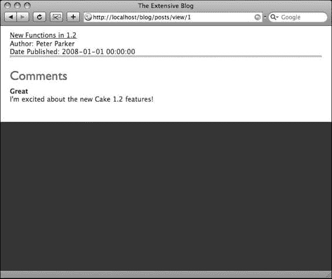

**120**

**第 8 章 ■ 实现 AJAX 特性**

**图 8-2.** *评论现在显示在文章视图中*

### 使用 Ajax 表单

现在，在 `app/views/posts/view.ctp` 文件的第 14 行之后，您可以包含一个用于添加评论的表单。在这样做时，您将使用 `Ajax` 助手，以便当用户提交评论时，它能够更新 `<div id="comments">` 元素，而无需刷新整个屏幕。

为了将 Ajax 功能融入此视图，请将清单 8-7 中显示的 Ajax 表单插入视图文件。

**清单 8-7.** *添加评论表单*

```
15 <?=$ajax->form('/comments/add','post',array('update'=>'comments'));?> 

16 <?=$form->input('Comment.name');?>

   <?=$form->input('Comment.content');?>

18 <?=$form->input('Comment.post_id',array('type'=>'hidden','value'=>➥

   $post['Post']['id']));?>

19 <?=$form->end('Add Comment');?>
```

**121**

清单 8-7 中的第 15 行为您完成了所有 Ajax 魔法。请注意，您在 `$ajax->form()` 函数中提供的参数告诉它首先将表单数据发送到 `Comments` 控制器中的 `Add` 操作。

第二个参数指定发送表单数据时使用的方法。当前设置为 `post`，但如果需要，可以更改为 `get`。

第三个参数是选项数组，包含对应于函数中可能功能的键和值。在这里，您将值 `comments` 分配给了键 `update`。

这意味着 `$ajax->form()` 将更新 ID 为 `comments` 的 `<div>` 元素。您已经在视图文件的第 8 行创建了 `<div id="comments">`。

第 16-19 行的工作方式类似于典型的 Cake 表单元素；它们使用 `Form` 助手来创建与 `comments` 表中字段相对应的字段。请注意，我在字段名称中包含了模型名称（`Comment.`），以指定这些字段是 `Comment` 模型的一部分，而不是当前的 `Post` 模型。

第 16-19 行中唯一棘手的事情是在第 18 行如何将当前文章 ID 传递给 `Comments` 控制器。简单来说，您创建了一个隐藏的表单元素，其名称与 `comments` 表中的 `post_id` 字段相同，并将其值赋为 `$post['Post']['id']` 变量中的内容。

就是这样！当用户访问博客中的一篇文章时，他们将看到先前提交的评论列表，以及一组用于提交自己评论的表单字段。当用户点击“添加评论”时，表单将在后台提交。

此时，唯一的问题是——`Comments` 控制器尚未准备好处理提交的表单。下一步是通过调整 `Add` 操作将 Ajax 功能融入此控制器中。

### 将 Ajax 融入控制器

当前的 `Comments` 控制器仅包含 `$name` 属性。让我们为其添加 `Add` 操作，但要考虑到 Ajax（请参见清单 8-8）。

**清单 8-8.** *Comments 控制器中的 Add 操作*

```
function add() {

    if (!empty($this->data)) {

        $this->Comment->create();

        if ($this->Comment->save($this->data)) {

            $comments = $this->Comment->find('all',array('conditions'=>➥

                array('post_id'=>$this->data['Comment']['post_id']),'recursive'=>-1));

            $this->set(compact('comments'));

            $this->render('add_success','ajax');

        } else {

            $this->render('add_failure','ajax');

        }

    }

}
```

**122**

**第 8 章 ■ 实现 AJAX 特性**

清单 8-8 的第 1-4 行与生成的 `Add` 操作完全相同：它们检查在已解析的 `$this->data` 数组中是否提供了数据，如果提供了数据，则会在数据库中创建一条新记录，并在模型中运行 `save()` 函数将数据插入新的数据库记录，然后检查模型返回的成功结果。当保存成功时，执行第 5-7 行；仅当保存失败时，才调用第 9 行。（如果需要，您可以在模型中运行数据验证，控制器将准备好处理结果。）

因此，假设提供的评论成功保存，那么您将希望获取数据库中的所有评论（包括新添加的那条），并将它们显示在 `<div id="comments">` 元素中。因此，您必须运行一个数据库查询来拉取评论，并将其传递给视图。第 5 行使用 `find()` 函数执行此操作；它拉取所有 `post_id` 等于您在清单 8-7 第 18 行创建的隐藏表单元素中提供的值的评论。我还将 `recursive` 值设置为 `-1`，以便结果数组中的每条评论不包含关联文章的完整内容；您只需要评论本身，而不需要它们的关联。第 6 行将 `find()` 函数的结果传递给视图。

### 为 Ajax 进行渲染

在控制器中使 Ajax 工作的秘诀无非是使用 `render()` 函数来绕过 Cake 应用程序 MVC 结构中典型的视图渲染机制。在清单 8-8 的第 7 行中，您使用了 `render()` 函数，并带有第二个参数来指定输出是 Ajax 类型。通过包含此参数，您指示 Cake 禁用它自身的视图机制，并仅将视图的输出（而不是布局）发送给等待的 JavaScript 事件。您必须在 `app/views/comments` 文件夹中创建一个相应的视图文件，供控制器使用并显示回 `Posts` 视图中的 `<div id="comments">` 元素。

创建 `app/views/comments/add_success.ctp` 文件。此文件将被渲染以完成 Ajax 表单提交，因此它也需要像 `app/views/posts/view.ctp` 文件一样遍历 `$comments` 数组。将清单 8-9 粘贴到 `add_success.ctp` 文件中。

**清单 8-9.** *`add_success.ctp` 文件*

```
<? foreach ($comments as $comment): ?>

<div class="comment">

    <p><b><?=$comment['Comment']['name'];?></b></p>

    <p><?=$comment['Comment']['content'];?></p>

</div>

<? endforeach;?>
```

现在，您应该能够在不重新加载页面的情况下向文章添加评论，如图 8-3 所示。

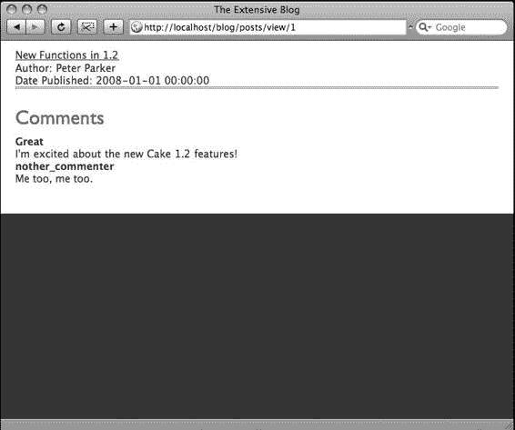

**123**

**图 8-3.** *文章评论以异步方式显示*

清单 8-8 的第 9 行调用了另一个视图文件，以防表单提交过程中发生错误。为满足此需求，请创建 `app/views/comments/app_failure.ctp`，并插入某种错误消息：

```
<p><b>抱歉，您的评论无法添加到此文章。请稍后重试。</b></p>
```

您也可以包含表单，以便用户希望立即重试。在这种情况下，代码将与清单 8-7 相同。

### 使用其他 Ajax 助手函数

有时您可能需要使用不同的方法来通过 Ajax 提交表单。或者，根据任务的不同，您可能甚至不需要提交表单，而是通过 Ajax 执行另一个过程。有许多其他的 Ajax 助手方法可以满足这些需求。

### `submit()`函数

在清单 8-7 中，你使用`$ajax->form()`函数创建了一个 Ajax 表单。使用 Ajax 提交表单的另一种方式是采用`$ajax->submit()`函数。此方法的工作方式与`form()`函数几乎完全相同，唯一的区别在于视图中由提交按钮（而非观察表单的 change 事件）触发 Ajax 过程。

清单 8-7 中有两行需要修改：表单标签本身以及提交按钮。

清单 8-10 展示了如何将这些标签从清单 8-7 中的形式修改为使用`$ajax->submit()`函数。

**清单 8-10.** 使用`$ajax->submit()`函数在后台提交表单

```
15 <?=$form->create('Comment',array('action'=>'add','onSubmit'=>'return false;'));?>
16 <?=$form->input('Comment.name');?>
    <?=$form->input('Comment.content');?>
18 <?=$form->input('Comment.post_id',array('type'=>'hidden','value'=>$post['Post']['id']));?>
19 <?=$ajax->submit('Add Comment',array('url'=>'/comments/add','update'=>'comments'));?>
</form>
```

请注意，清单 8-10 的第 15 行已从`$ajax->form()`函数改为`$form->create()`函数。你在选项数组中添加了`onSubmit`键，并将值`return false;`传递给该属性。这可以防止表单在发生表单事件时发送同步 HTTP 请求。

除第 19–20 行外，其余内容与之前相同。`$ajax->submit()`函数与`$ajax->form()`函数类似，它也使用选项数组来传递一些重要参数。这些参数指定了表单的提交目标（`url`参数）以及接收 Ajax 响应的 HTML 元素（`update`参数）。第 20 行仅用于关闭表单标签。

当以这种方式使用时，可以实现相同的 Ajax 过程，但使用的是`$ajax->submit()`函数。某些自定义的 JavaScript 函数可能会中断表单的观察事件，在这些情况下，使用`$ajax->submit()`函数可以避免这些冲突。

使用`$ajax->submit()`函数而非`$ajax->form()`函数的其他优势包括：可以在一个表单内使用多个 Ajax 事件。例如，使用`$ajax->form()`函数时，某些 Ajax 调用（如自动填充）可能会触发 JavaScript 事件观察。当在一个表单中使用多个 Ajax 调用时，`$ajax->submit()`函数通常能绕过`$ajax->form()`可能产生的冲突。

### `link()`函数

许多 Ajax 方法不需要任何表单数据。最简单的 Ajax 调用是仅向脚本发送一个参数并在后台返回响应。这类 Ajax 过程可以通过`$ajax->link()`函数来管理。你可以通过为每条评论创建社区投票机制，将此函数集成到博客中。

首先，使用以下 SQL 在`comments`表中添加`votes`字段：

```sql
ALTER TABLE `comments` ADD `votes` int(11) DEFAULT '0' ;
```

然后，你会在每个评论框内添加一个 Ajax 链接。点击该链接时，要么给`votes`的值加 1，要么减 1。新的总数将被发送回浏览器，并更新到评论框中。

### 复制一些辅助 CSS

投票链接的样式需要在应用程序当前使用的 CSS 文件中进行设计。如果没有一些 CSS 辅助，该工具看起来会令人困惑，并且会影响对`$ajax->link()`函数的理解。因此，我们添加一些 CSS 来改进设计。如果你愿意，可以使用清单 8-11 中提供的一些样式。

**清单 8-11.** 投票工具的 CSS 标记

```css
.comment {
    border: 1px solid #ccc;
    border-width: 1px 0px 0px 0;
    clear: both;
    width: 500px;
}
.comment p {
    float: left;
    clear: left;
}
.vote {
    width: 50px;
    height: 20px;
    background-color: #fffdc3;
    text-align: center;
    font-size: 16px;
    font-weight: bold;
    padding: 15px 0 15px 0;
    float: right;
}
.cast_vote {
    height: 50px;
    float: right;
}
.cast_vote ul {
    list-style-type: none;
}
.cast_vote ul li {
    font-size: 9px;
    margin: 5px 0 5px 0;
}
```

如果你希望根据自己的风格调整这个设计，请随意。但清单 8-11 中的 CSS 至少能帮助你了解投票功能中各个元素的工作方式。

### 在视图中使用 `link()` 函数

接下来，在 `app/views/posts/view.ctp` 文件的 `<div class="comment">` 元素内部，你需要添加一些代码来显示投票链接和总票数。从第 11 行开始，插入清单 8-12 中所示的行。

**清单 8-12.** 用于显示投票链接和总票数的视图代码

```
11 <div id="vote_<?=$comment['Comment']['id'];?>">
12
<div class="cast_vote">
13 <ul>
14 <?=$ajax->link('<li>up</li>','/comments/vote/up/'.$comment['Comment']['id'],array('update'=>'vote_'.$comment['Comment']['id']),null,false);?>
15 <?=$ajax->link('<li>down</li>','/comments/vote/down/'.$comment['Comment']['id'],array('update'=>'vote_'.$comment['Comment']['id']),null,false);?>
16 </ul>
</div>
<div class="vote"><?=$comment['Comment']['votes'];?></div>
19
</div>
```

清单 8-12 的第 11 行将评论的唯一 ID 附加到 `vote_` 后面，以便为你提供一个唯一标识的 `<div>` 元素进行更新。添加评论表单已经会执行一些 Ajax 操作，因此为了避免更新元素时发生任何冲突，我确保了每个评论的 ID 都是唯一的。

清单 8-12 中的大部分标记都是为了组织该功能的设计，使其对用户可访问，并且可以根据你自身网站的设计进行修改。但第 14 和 15 行包含了 `$ajax->link()` 函数。它的行为类似于烘焙视图中使用的 `$html->link()` 函数，第一个参数是要显示的文本，第二个参数是 `href` 属性。`href` 被设置为你尚未创建的控制器动作 `Up` 或 `Down`，并通过 URL 传递接收投票的评论 ID。当点击此链接时，CakePHP 不会执行标准的 HTTP 链接请求，而是提供一些 Prototype 函数来在后台执行请求并接收响应。请注意，在此函数的选项数组中，你将 `update` 元素设置为与第 11 行相同的值：`vote_` 后接评论的唯一 ID。

### 在控制器和模型中创建投票动作

清单 8-12 第 14-15 行引用的 `Vote` 动作尚不存在；让我们在 `Comments` 控制器中创建它。这个动作将相当简单：在 `comments` 表的 `votes` 字段中加 1 或减 1，并将总票数返回给视图。当然，这个动作将使用 `render()` 函数以 Ajax 模式渲染视图。

使用清单 8-13 将 `Vote` 动作添加到 `Comments` 控制器。

**清单 8-13.** *Comments 控制器中的投票动作*

```php
function vote($type=null,$id=null) {
  if ($id) {
    $votes = $this->Comment->vote($type,$id);
    $this->set(compact('votes'));
    $this->render('votes','ajax');
  }
}
```

回想一下，CakePHP 的一个最佳实践是尽可能让模型比控制器“更胖”；也就是说，如果可能的话，应该将代码添加到模型而不是控制器。我在清单 8-13 的第 3 行运用了这一原则，创建了自己的模型函数 `vote()`，并将清单 8-12 第 14-15 行 `$ajax->link()` 函数中提供的参数传递给它。此函数将完成所有与数据库相关的操作，以获取票数并更新评论的票数。它需要知道是投赞成票还是反对票，以及要更新哪条评论，这些信息已通过控制器变量 `$type` 和 `$id` 传递。

清单 8-14 包含了模型函数 `vote()`，它将执行数据库操作以实现投票。将其添加到 `Comment` 模型中，放在其他属性和关联之后。

**清单 8-14.** *Comment 模型中的 `vote()` 模型函数*

```php
function vote($type=null,$id=null) {
  if (!$id) {
    return "-";
  } else {
    $votes = $this->read(null,$id);
    $votes = ($type == 'up' ? $votes['Comment']['votes']+1 : $votes['Comment']['votes']-1);
    $this->id = $id;
    $this->saveField('votes',$votes);
    return $votes;
  }
}
```

清单 8-14 的第 5 行从数据库中提取指定评论 ID 的票数。第 6 行根据投票类型对总数进行加 1 或减 1。第 7-8 行使用 `saveField()` 函数将结果保存到数据库。此函数允许你仅更新行中的一个字段（或列），而无需为更常见的 `save()` 函数格式化整个 `$this->data` 数组。当然，你需要告诉模型要更新哪条记录，这在第 7 行通过设置 `id` 属性完成。最后，在第 9 行，新的总数被返回给控制器以在视图中显示。

### 创建 Votes 视图

最后一步是创建视图，供控制器动作在清单 8-13 的第 5 行渲染。这非常简单：它只需要在 `Posts` 视图中使用的同一个 `<div>` 元素内显示传递的值。清单 8-15 包含了 `app/views/comments/votes.ctp` 文件的代码。

**清单 8-15.** *使用 Votes 视图显示新的总数*

```php
<div class="vote"><?=$votes;?></div>
```

继续刷新 `Posts` 视图，并点击 Ajax 链接对评论进行投票。总票数应在后台自动更改，无需重新加载页面，而且这一切都没有通过提交表单实现，如图 8-4 所示。使用 `$ajax->link()` 函数可以轻松地执行类似的异步任务，这种方式通常对用户来说更简单、更有趣。而且它肯定比手动编写所有实现此功能的 JavaScript 要好。

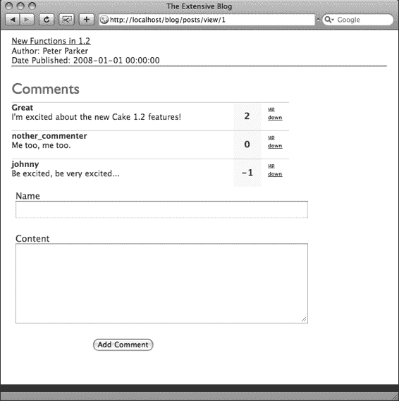

**图 8-4.** *评论部分的 Ajax 投票现在可以工作了。*

### 使用 Ajax 助手做更多事情

你还只是触及了 Ajax 助手所开启可能性的表面。如表 8-1 所示，Ajax 助手包含的功能远不止 `form()`、`submit()` 和 `link()` 函数。诚然，这些函数很有用，因为它们允许你讨论在 Cake 应用程序中使用 Ajax 的主要概念。那么，使用带有动画框架的 Ajax 呢？或者构建花哨的 Web 2.0 功能，比如拖放式购物车或调整 HTML 元素大小的滑块工具？在考虑如何将 Ajax 引入你的 Cake 应用程序时，请记住这些基本步骤。

**将 JavaScript 与选项数组一起传递**

在各种助手函数中查找选项数组，即使在非 Ajax 助手中引入更复杂或定制化的 JavaScript 函数时也是如此。通过使用此数组，你可以将 JavaScript 函数传递给你希望与更复杂的 Ajax 方法一起工作的助手所渲染的 HTML 元素。例如，如果我想编写自己的 JavaScript 函数，我可以像这样使用选项数组调用该函数：

```php
$form->input('OK',array('type'=>'button','onSubmit'=>'alert(\'Hello World\');'));
```

我不仅传递了参数来说明助手应渲染哪种类型的表单输入字段（在本例中是一个 HTML 按钮），还通过指定 HTML 属性 `onSubmit` 并赋予其值，将 JavaScript 的 `alert()` 函数分配给了该元素。

使用 `options` 数组通常比直接使用原始 HTML 更有效。通常，这些辅助函数能提供统一的链接系统或显示机制，从而减少维护应用程序一致性带来的麻烦。此外，习惯辅助函数字符串的视觉和流程后，观感上会更美观，尤其是当你更偏爱 PHP 语法而非 HTML 标记时。坚持使用辅助函数（即使是自定义的 JavaScript 和 Ajax 调用）最重要的原因，可能是为了防止你的应用程序变成“胶带拼凑体”。换句话说，你在 Cake 框架中工作，而该框架足够强大，可以减少你的代码量。开发者们常常为了正确处理复杂流程，而满足于使用权宜之计或已被弃用的方法。不要忽视 Cake 辅助函数对你开发流程的贡献。你会发现，它们提供的功能远超你的预期，能帮你攻克难关。

### Prototype 还是 jQuery

近几个月来，jQuery 框架在流行度和功能性上都有了显著提升。许多 Cake 开发者一直呼吁 Cake 围绕这个框架而非 Prototype 进行重写。在撰写本文时，有传言称 jQuery 最终将取代 `Ajax` 辅助函数中的 Prototype。无论情况如何，`Ajax` 辅助函数注定会以相同的方式继续工作；你可能只需要在 `app/webroot/js` 文件夹中安装一个不同的库即可。

无论 Cake 未来方向如何，这两个框架都提供了一些每个认真的 Ajax 开发者都需要考虑的重要特性。再次强调，你可以通过在各种辅助函数中使用 `options` 数组来调用它们的功能。例如，使用 jQuery 的表单插件，我可以使用 `Form` 辅助函数上传文件：

```php
<?=$form->button('Upload',array('onClick'=>'$(\'#storyEditForm\').ajaxSubmit({
target: \'#storyTextUpload\',url: " .$html->url('/stories/text').'\'}); return
false;'));?>
```

这个函数显然比这里展示的要复杂得多，但此示例确实说明了如何将 jQuery 函数分配给 `$form->button()` 函数中的 `onClick` 事件。只要我的控制器在 Ajax 模式下使用 `render()` 函数，Cake 就能像往常一样通过 MVC 结构运行其逻辑，同时还能使用 `Ajax` 辅助函数之外的 Ajax 库。

### 使用 jQuery 上传文件

我们不可能探索 Cake 中所有可用的 Ajax 方法。然而，Web 应用程序最常见的需求之一是某种文件上传。这个任务可能相当繁琐，尤其是当你想要使用 Ajax 管理文件上传时。由于序列化 HTML 表单的方式，许多 Ajax 框架不支持文件输入元素。JavaScript 无法将文件内容放入字符串中，而这正是许多框架提交表单数据的方式。幸运的是，jQuery 的 Form 插件可以处理文件上传，使得将上传功能与 Ajax 集成成为可能。

由于 jQuery 目前不是默认 `Ajax` 辅助函数的一部分，为你的博客添加文件上传功能将演示如何将非 Prototype 框架集成到 Cake 中。

#### 安装 jQuery 和 Form 插件

请记住，你必须手动安装需要调用的 JavaScript 库。下载最新版本的 jQuery 以及 Form 插件。以下链接应能帮助你找到这些文件：

*   jQuery：[`docs.jquery.com/Downloading_jQuery`](http://docs.jquery.com/Downloading_jQuery)
*   Form 插件：[`jqueryjs.googlecode.com/svn/trunk/plugins/form/`](http://jqueryjs.googlecode.com/svn/trunk/plugins/form) `jquery.form.js`

接下来，你必须将必要的文件放入 `app/webroot/js` 目录，并让它们在默认布局中可用。麻烦在于，jQuery 可能会与你用来提供评论投票和提交功能的 Prototype 发生冲突，所以让我们在默认布局中添加一些逻辑，以检测当前正在运行的是 `Posts Add` 操作还是其他操作。

打开默认布局文件（`app/views/layouts/default.ctp`），并将引用 Prototype 的 JavaScript 辅助函数行替换为以下代码：

```php
<?=($this->params['controller'] == 'posts' && $this->params['action'] == 'add' ? $javascript->link(array('jquery.js','jquery.form.js')) : $javascript->link('prototype'));?>
```

现在，当执行“Posts Add”操作时，jQuery 将被初始化，而不是 Prototype。但 Prototype 仍将是所有其他操作的默认脚本，从而避免与评论区冲突。

### 创建 Posts Add 操作

假设博客作者已在纯文本文件中写好了一篇文章，并希望将其上传到博客。让我们创建一个文件上传机制，该机制可以分析纯文本文件，并将其内容插入到“Posts Add”操作的“Content”字段中，从而简化新文章的创建过程。

打开 `app/views/posts/add.ctp` 文件（该文件应该已经通过烘焙生成），并将其内容替换为列表 8-16。

**列表 8-16.** *添加操作中的文件上传功能*

```php
<div class="posts form">

<?=$form->create('Post',array('name'=>'postAddForm','id'=>'postAddForm','type'=>'file'));?>

<fieldset>

<legend>Add Post</legend>

<?=$form->input('name');?>

<?=$form->input('date');?>

<?=$form->input('content');?>

<div id="postTextUpload">

<?=$form->input('content', array('label'=>'Content ','rows'=>'15','cols'=>'75'));?>

<?=$form->input('upload_text',array('label'=>'Upload Text File ','type'=>'file'));?>

<?=$form->button('Upload Text',array('onClick'=>'$(\'#postAddForm\').ajaxSubmit({target: \'#postTextUpload\', url: \"'.$html->url('/posts/text').'\'});return false;'));?>

</div>

<?=$form->input('User');?>

<?=$form->input('Tag',array('type'=>'select','multiple'=>'checkbox'));?>

</fieldset>

<?=$form->end('Submit');?>

</div>
```

列表 8-15 的第 2 行将表单的 ID 设置为 `postAddForm`，jQuery 将需要此 ID 来收集表单数据。此行还将 `type` 属性设置为 `file`，以便表单包含 `enctype="multipart/form-data"` 属性，确保表单提交正常工作。

请注意，我从第 8 行开始，用一个 `<div>` 元素包裹了“Content”字段，这样在文件上传后，我可以用已填充内容的字段替换当前字段。

第 10 行包含了实际的文件输入字段。使用 Form 辅助函数时，只需指定 `input` 的 `type` 等于 `file`，即可渲染一个文件输入字段。

第 11 行是所有 Ajax 发生的地方。通过将 `onClick` 属性设置为一个包含所有必要代码的 jQuery 格式字符串，Form 辅助函数将能够渲染一个按钮，该按钮包含通过 jQuery 执行 Ajax 方法所需的 JavaScript。此语法遵循 jQuery Form 插件中使用的表单提交方法。

### 创建 Posts Controller Text 操作

当用户选择了文件并点击“Upload Text”按钮时，jQuery 会将整个表单提交到 Posts 控制器中的 `text` 操作，这得益于你在 `onClick` 事件中编写的 URL 参数。

因此，在 `app/controllers/posts_controller.php` 文件中，你需要包含列表 8-17 中所示的函数。

**列表 8-17.** *Posts 控制器中的 Text 操作*

```php
function text() {

    if (!$this->data['Post']['upload_text']) {

        $this->set('error','You must select a text (.txt) file before you can upload.');

        $this->render('text','ajax');

    } else {

        App::import('Core','File');

        $file =& new File($this->data['Post']['upload_text']['tmp_name']);

        if ($this->data['Post']['upload_text']['type'] != 'text/plain') {

            $this->set('error','You may only upload text (.txt) files.');

            $this->render('text','ajax');

        } else {

            $data = h($file->read());

            $file->close();

            $this->set('text',$data);

            $this->render('text','ajax');

        }

    }

}
```

列表 8-17 的第 2 行检查`upload_file`字段中是否有任何内容。文件上传仍然会被 Cake 自动解析，这比使用 PHP 的`$_FILES`数组更安全。

为了简化文件处理，Cake 核心包含了一系列`File`类函数。但是，要在控制器中使用这些函数，由于它们不是组件类、辅助函数或其他 Cake 元素，你必须实例化一个新的`File`类；这在第 6 行通过`App::import()`函数完成。在第 7 行，`File`实用程序被赋值给`$file`作为一个类对象；现在，在整个操作中，`$file`对象将为你提供 Cake 的核心`File`函数。此外，`$file`对象将代表上传的文件本身，因此当你需要操作上传时，将数据保存到服务器会容易得多。

第 8 行检查文件是否为正确的 MIME 类型（纯文本文件为“text/plain”）。第 12-15 行处理文件本身。现在，在此操作中，你只需要检索文件的内容，并将其在“Contents”字段中提供。因此，第 12 行读取文件并将内容放入`$data`变量。第 13 行关闭文件，第 14-15 行使`$data`变量在`app/views/posts/text.ctp`视图文件中可用。第 15 行负责以 Ajax 模式渲染视图，从而避免触发 Cake 的同步渲染引擎。

剩下的工作就是用一个新的、已填充内容的字段替换“Content”字段；这在“Text”视图文件中完成，你尚未创建该文件。

### 编写 Text 视图

创建`app/views/posts/text.ctp`文件，并将列表 8-18 粘贴到其中。

**列表 8-18.** *Text 视图文件*

```php
<? if (!empty($error)): ?>

<p><?=$error;?></p>

<?=$form->input('Post.content', array('label'=>'Content','rows'=>'15','cols'=>'75'));?>

<? else: ?>

<p>Upload successful</p>

<?=$form->input('Post.content',array('label'=>'Current Text ','value'=>$text,'rows'=>'15','cols'=>'75'));?>

<? endif;?>

<?=$form->input('Post.upload_text',array('label'=>'Upload Text File ', 'type'=>'file'));?>

<?=$form->button('Upload Text',array('onClick'=>'$(\'#postAddForm\').ajaxSubmit({target: \'#postTextUpload\',url: \"'.$html->url('/posts/text').'\"}); return false;'));?>
```

列表 8-16 模仿了“Posts Add”视图，只是它添加了一个错误检查（并显示错误消息），并将文件上传内容（从控制器中的`$text`数组获得）提供给“Content”字段。

现在，你应该能够上传纯文本文件的内容，并使其在“Add”操作中立即可用，而无需重新加载页面。得益于 jQuery 及其 Form 插件，你可以通过 Ajax 实现这一点。不幸的是，Ajax 辅助函数尚不支持 jQuery 函数或文件上传，因此你必须在`onClick`属性中提供 JavaScript 函数来实现此功能。

### 更多 Ajax 功能

Ajax 的世界在不断扩展。一些开源项目已经将以前昂贵或复杂的库提供给了大众。随着 Ajax 方法的不断改进，你可以放心，Cake 的架构将始终对 Ajax 保持开放，并允许将这些方法引入你的 Cake 应用程序中。将`onClick`和其他 DOM 事件硬编码到代码中，无疑扩展了 Cake 应用程序的能力，但通过练习使用其他 Ajax 辅助函数，你可以用 Cake 处理大多数常见的 Ajax 流程。

### 总结

在本章中，我们讨论了 Cake 如何通过其内置的 Ajax 辅助函数简化 Ajax 方法。

# 辅助函数

在前面的章节中，你利用 Cake 内置的一些辅助函数显著提升并加速了典型 Web 应用某些流程的开发。借助 Ajax 辅助函数，你为博客评论的提交和投票流程增添了一些视觉效果。Form 辅助函数简化了数据处理和表单提交，而 HTML 辅助函数则减少了你在视图中手写的标记量，并管理整个网站的链接以防止断裂。在本章中，你将深入探索内置辅助函数，甚至亲手构建几个自己的辅助函数。首先，我会简要讨论如何安装辅助函数。

### 安装辅助函数

你之前已经使用过一些内置辅助函数，并通过在控制器或 App 控制器的 `var $helpers` 数组中输入它们的名称使其对应用可用。当安装第三方辅助函数或创建自己的辅助函数时，必须按照以下步骤确保其正常工作：

1.  每个辅助函数文件都应放在 `app/views/helpers` 目录下。
2.  在 App 控制器或可能调用该辅助函数的特定控制器的 `var $helpers` 数组中包含该辅助函数的类名。
3.  在视图中使用辅助函数时，请确保正确调用辅助函数的类对象（即使用 `$ajax` 变量调用 Ajax 辅助函数对象）。不要在视图中创建可能与可用辅助函数对象冲突的局部变量。

在第 8 章中，你创建了 App 控制器文件，使一些辅助函数对整个应用可用。当应用中大部分控制器都使用一组辅助函数时，这通常是一种良好实践，因为这样可以在一处使用一行代码，而不必在不同位置逐一列出辅助函数的包含语句。你可能会问，为什么默认不在 App 控制器中包含所有内置辅助函数，从而省去这个额外步骤呢？答案是，这样做会损害应用的加载性能。更好的做法是使用 App 控制器来指定所有或大多数控制器最常用的辅助函数，而不是从一开始就包含所有函数，拖慢应用速度。

例如，如果应用中只有一个控制器使用 Time 辅助函数，那么最好仅在该控制器中包含此辅助函数。像 HTML、Form 和 Ajax 这样的辅助函数最好在 App 控制器中调用，因为它们在整个应用中通用。当在 App 控制器中调用一个辅助函数时，该辅助函数对象会被创建并加载到服务器内存中，供应用执行的每个动作使用。如果为整个站点调用过多的辅助函数，内存消耗会迅速增加。

由于 PHP 代码在每次被访问时都需要解析和编译，因此任何能减少代码量的措施都有助于提升网站性能。只在需要的地方使用代码，也有助于问题排查。在 App 控制器中包含过多的辅助函数会加剧服务器负载，并可能需要调整 PHP 设置或使用 PHP 运行时加速器。

### 使用 Cake 的内置辅助函数

Cake 最具吸引力的特性之一就是其丰富的辅助函数集合。诸如渲染 RSS 源、管理表单提交、截断和高亮文本以及执行 Ajax 方法等任务，都因辅助函数而得以简化。Cake 提供了大量针对 Web 的函数，可以为你节省大量时间，避免头疼；了解 Cake 内置辅助函数提供了哪些功能，是构建高级 Cake 应用的关键。

> **注意** 为了避免用冗长的解释性表格充斥本章，我选择采用更接近“词典”的方式来解释辅助函数及其功能。每个函数都有一组自己的参数，通过在视图中填充这些参数来调用。每个参数之间用逗号分隔，并在方括号内注明参数指定的数据类型。在每个描述下方，我列出了每个参数的默认值。将参数留空，或在其位置输入 `null`，意味着函数执行时将使用该参数的默认值。

#### 是否要解释每个辅助函数？

本章很快就会变得非常乏味。列出所有可能的辅助函数会形成一个非常长的列表，而且或多或少会将本章变成 API 文档。（如果你想要 API 文档，那么完全可以查看 Cake 的在线 API [在 `http://api.cakephp.org`](http://api.cakephp.org)。它保持更新，并包含每个函数对应源码的资源链接。）我将详细解释这些函数，而不是重印 API 文档。事实是，某些辅助函数使用频率如此之高，以至于对大多数开发者来说，忽略对 Cake 内置辅助函数的详细考察会阻碍你真正利用 Cake 所提供功能的进步。因此，我将仅详细讲解 HTML 和 Form 辅助函数，因为即使是最基本的 Cake 应用，它们对于任何操作都是必不可少的。

不要害怕自己尝试这些函数；大多数时候，它们非常直接，而且由于它们不操作你的数据库，你无法对应用造成永久性损害。通常你使用的辅助函数越多，节省的时间就越多，所以值得练习。Cake 新手开发人员常犯的一个错误是，不了解辅助函数，因此他们转而构建自己的过程或自定义辅助函数来执行那些已经在辅助函数中标准化的任务。（我当然也犯过这个错误——我曾写过一整个控制台脚本来自动化构建视图，后来才意识到 Cake 自带了 Bake！）

接下来让我们进入 HTML 和 Form 辅助函数。由于你之前已经使用过它们，所以应该已经熟悉了；但它们提供的功能远不止到目前为止提到的那些。

#### 使用 HTML 辅助函数

你一定已经使用过 HTML 辅助器，这或许是最容易掌握的一个。使用 HTML 辅助器有以下优势：

- 通常，坚持使用辅助器可以减少在视图中必须输入的 HTML 标记数量。
- 通过向辅助器传递变量，可以动态管理 HTML 输出，而无需手动操作。你不必再为那些 HTML 辅助器已提供的常见任务编写自己的方法。
- 我是否过分强调了管理链接的优势？让我再说一遍：这个辅助器能让你免于在更改域名、更改 URL 方案或迁移到不同托管商时，逐一排查并测试所有可能存在的链接失效问题而引发的头痛。这一点再怎么强调也不为过——尤其是对新手网页开发者而言，最大的挑战之一就是让应用具备可移植性。
- 对某些用户来说，阅读 PHP 比阅读 HTML 更容易。至少，那些偏爱 PHP 语法胜过 HTML 标记的人会发现，HTML 辅助器是编写视图的更好方法。

在视图中，通过使用 `$html` 对象来调用 HTML 辅助器。它是 Cake 应用中默认包含的两个辅助器之一，无需在控制器中使用 `var $helpers` 数组声明。然而，一旦你在应用中添加了更多辅助器，最好在 `var $helpers` 数组中明确写出 HTML 辅助器；这样，无论未来应用运行在哪个 Cake 版本上，该辅助器都能被正确调用。一个更详细的 `$helpers` 属性也能确保项目中的其他开发者明确知道视图中使用了哪些辅助器。

> **注意**：HTML 辅助器在 `var $helpers` 数组中的指定方式与其他所有辅助器一样，需要使用首字母大写的驼峰式写法。这意味着使用 `var $helpers = array('HTML');`（全大写）将无法正常工作；必须像这样使用 `Html`：`var $helpers = array('Html');`。

在接下来的章节中，我将介绍大部分 HTML 辅助器函数及其用法。当你在应用中有机会使用它们时，请务必保持代码的一致性；你当然可以直接手写 HTML，但这可能会绕开使用 HTML 辅助器的一些优势。

---

### `charset`

该函数用于输出 HTML `<meta>` 标签，指定页面的字符集。通常，该函数在布局文件中使用。

**`charset( charset[string])`**

- `charset` = null：要在 `<meta>` 标签中使用的字符集

例如，以下代码：

```php
<?=$html->charset('UTF-16');?>
```

将输出：

```html
<meta http-equiv="Content-Type" content="text/html; charset=UTF-16"/>
```

默认字符集可以在`app/config/core.php`文件中指定。请按照标准的 HTML 字符集规范，更改第 47 行附近的`App.encoding`设置。（供参考：已注册字符集值的列表可从万维网联盟 [www.w3.org/International/O-charset-lang.html](http://www.w3.org/International/O-charset-lang.html) 获取。）`App.encoding`的值默认设置为`UTF-8`。

---

### `css`

该函数用于输出引入样式表的标签。通常，CSS 文件存储在`app/webroot/css`目录下，并通过本节描述的`css`函数来引用。根据参数中指定的值，该函数会返回一个`<link>`或`<style>`标签。

**`css( path[mixed], rel[string], attributes[array], inline[bool])`**

- `path`：样式表的名称（不包含`.css`扩展名），或者一个包含`app/webroot/css`目录下多个样式表名称的数组。
- `rel` = `'stylesheet'`：`rel`属性；如果设置为`import`，则该函数将返回`<style>`标签中的`@import`链接，而不是`<link rel='stylesheet'>`标签。
- `attributes`：包含要添加到`<link>`或`<style>`标签中的任何 HTML 属性；以键值对形式组织，键为属性名，值为要赋给该属性的值。

`inline = true`: 如果设置为`false`，结果将被放置在页面的`<head>`元素中；否则，函数将输出内联内容。

使用`attributes`数组，你可以为打印或屏幕输出指定样式表，如下所示：

`<?=$html->css('cake.generic.print',null,array('media'=>'print'));?>`

或者这样：

`<?=$html->css('cake.generic.screen',null,array('media'=>'screen'));?>`

可以通过在`path`参数中传入数组来调用多个样式表：

`<?=$html->css(array('reset','type','layout'));?>`

`CSS`函数通常用于布局中，但也可以在单个视图文件中调用。

### `div`

此函数返回一个格式化的`<div>`标签。其用法相当直接和基础，因为`<div>`标签旨在作为 HTML 样式和布局的包装器，或作为 JavaScript 操作的占位符。

**`div( class[string], text[string], attributes[array], escape[bool] )`**

- `class` = null: 标签的`class`属性名称。
- `text` = null: 显示在`<div>`元素内部的文本。
- `attributes`: 包含要包含在标签中的任何 HTML 属性；以属性名称为键，属性值为值的数组形式组织。
- `escape` = false: 如果设置为`true`，`text`参数的内容将进行 HTML 转义。

假设我想创建一个独特设计的标签或页面元素，以`<div>`元素显示。`$html->div()`函数可以这样使用：

`<?=$html->div('tab','Home');?>`

输出如下：

```html
<div class="tab">Home</div>
```

如果传递的变量包含了`<div>`标签的内容，我可以使用比纯 HTML 标记稍少的代码来轻松显示该变量。`div()`函数如下所示：

`<?=$html->div('story',$story['Story']['contents']);?>`

它比以下代码少用了几个字符：

`<div class="story"><?=$story['Story']['contents'];?></div>`

此函数通常用作显示`<div>`标签的便捷包装器，并允许你坚持使用 PHP 而不是 HTML（如果你愿意）。

### `docType`

与`$html->charset()`函数类似，此函数主要用在布局中，以避免输入冗长的符合标准的 HTML 文档类型字符串。

**`docType( type[string] )`**

- `type` = 'xhtml-strict': 要用于`docType`声明的文档类型。有关可在`type`参数中使用的可能文档类型，请参见表 9-1。

**表 9-1.** *可与 `$html->docType()` 函数一起使用的可能文档类型*

| 参数值           | 文档类型                 |
|------------------|--------------------------|
| `html4-strict`   | HTML 4.0 Strict          |
| `html4-trans`    | HTML 4.0 Transitional    |
| `html4-frame`    | HTML 4.0 Frameset        |
| `xhtml-strict`   | XHTML 1.0 Strict         |
| `xhtml-trans`    | XHTML 1.0 Transitional   |
| `xhtml-frame`    | XHTML 1.0 Frameset       |
| `xhtml11`        | XHTML 1.1                |

通过在布局文件中输入以下内容：

`<?=$html->docType('xhtml-strict');?>`

文档类型声明将生成为以下字符串：

```html
<!DOCTYPE html PUBLIC "-//W3C//DTD XHTML 1.0 Strict//EN" "http://www.w3.org/TR/xhtml1/DTD/xhtml1-strict.dtd">
```

### `image`

管理图像对于复杂的网站来说可能是一项繁琐的任务。`$html->image()`函数通过简化图像标签的渲染和使用标准化的内部路径方案来引用文件，从而帮助进行图形管理。此函数动态输出一个``标签。

**`image( path[string], attributes[array] )`**

- `path`: 图像文件的路径
- `attributes`: 一个键值对数组，对应于要包含在``标签中的 HTML 属性

图像文件的路径可以通过以下三种方式之一构建。首先，如果只输入文件名，此函数将自动输出相对于`app/webroot/img`目录的路径。例如，要显示文件`app/webroot/img/title.jpg`，只需在`path`参数中输入文件名`title.jpg`即可。

`<?=$html->image('title.jpg');?>`

其次，如果输入一个外部图片文件的完整链接，`$html->image()` 函数将直接引用该文件，而不进行任何路径处理。例如，位于 `www.mydomain.com/images/title.jpg` 的图片可以通过以下方式调用此函数：

```php
<?=$html->image('www.mydomain.com/images/title.jpg');?>
```

最后，路径可以通过以斜杠开头，使其相对于 `app/webroot` 目录：

```php
<?=$html->image('/img/gallery/title.jpg');?>
```

与其他辅助函数类似，可以通过属性数组向此函数传递 HTML 属性。例如，以下代码：

```php
<?=$html->image('title.jpg',array('alt'=>'我的主页','class'=>'title'));?>
```

会输出以下内容：

```html

```

## link

使用`$html->link()`函数有助于维护一致的链接，同时也是通用`<a>`标签的便捷封装。此函数输出一个`<a>`锚点标签。

`link( 标题[string], 链接地址[mixed], 属性[array], 确认消息[string], 转义标题[bool] )`

- **标题**：要链接的内容；可以包含 HTML 标签，但必须将`escapeTitle`参数设置为 false 才能正确显示。
- **链接地址** = null：如果是数组，则会使链接指向控制器和动作；如果是相对于 Cake 的路径，则会被解析为内部链接；如果是绝对 URL，则会原样传递。
- **属性**：用于传递要包含在标签中的 HTML 属性的参数。
- **确认消息** = false：设置后，该消息将显示在 JavaScript 警告对话框中；如果用户继续操作，则激活链接。
- **转义标题** = true：默认情况下，任何符号都会被转义以符合 HTML 规范；当设置为 false 时，`title`中提供的字符串将按原样传递。

此函数相当简单：提供要链接的内容，并告诉 Cake 在点击时将用户发送到哪里。我在展示如何烘焙一些视图时，已经讨论过如何使用`$html->link()`函数创建基本的内联链接。这些链接非常简单——将字符串 "添加一篇文章" 链接到 Posts 的添加动作，可以使用以下代码：

```php
<?=$html->link('添加一篇文章','/posts/add');?>
```

09775ch09final 7/1/08 9:49 PM Page 144

**144**

第 9 章 ■ 辅助函数

但你也可以使用另一种方法来生成相同的链接，即在`url`参数中输入一个数组，如下所示：

```php
<?=$html->link('添加一篇文章',array('controller'=>'posts','action'=>'add'));?>
```

当然，在`url`参数中输入绝对 URL 会将用户引导到站外：

```php
<?=$html->link('查看面包房','http://bakery.cakephp.org');?>
```

你可以通过在`confirmMessage`参数中输入字符串，来包含一个显示为 JavaScript 警告对话框的确认消息。例如，假设你想在从数据库中删除记录之前提醒用户。你可以通过在`$html->link()`函数中输入确认消息来实现：

```php
<?=$html->link('删除','/posts/delete/'.$post['Post']['id'],null,'您确定要删除这篇文章吗？');?>
```

当点击时，会弹出一个对话框询问用户 "您确定要删除这篇文章吗？" 如果用户点击 "继续"，那么链接将被激活。

你可以通过将`escapeTitle`参数设置为 false，在此函数中包含 HTML 标签。甚至其他输出 HTML 的辅助函数也可以包含在`title`参数中，如下所示：

```php
<?=$html->link($html->image('title.jpg'),'/',null,null,false);?>
```

## meta

`$html->meta()`输出`<meta>`标签，可用于指定网站描述或其他`<meta>`标签。它还可以输出用于 RSS 源和网站图标的`<link>`标签。

`meta( 类型[string], 链接地址[mixed], 属性[array], 内联[bool] )`

- **类型** = null：要生成的`<meta>`标签的类型；可以设置为任何字符串，但也提供了一些内置字符串（`rss`、`atom`、`icon`、`keywords`和`description`）。

### `$html->nestedList()`

`$html->nestedList()`将一个数组显示为嵌套列表，这在调试时非常有用。

#### 参数说明

`nestedList( list[array], attributes[array], itemAttributes[array], tag[string] )`

- `list`: 要列表化的元素
- `attributes`: 传递给列表标签的 HTML 属性
- `itemAttributes = null`: 传递给单个项（`<li>`）标签的 HTML 属性
- `tag = 'ul'`: 要使用的列表标签类型，有序或无序列表（通过输入`ol`或`ul`对应`<ol>`或`<ul>`标签）

#### 行为描述

对于传入`list`参数中的每个数组和嵌套数组，都会调用一个新的列表标签（例如，对于无序列表，会返回一个新的`<ul>`标签，其内容为用`<li>`标签解析的嵌套数组）。数组可以包含任意多的层级。

例如，假设`$posts`变量包含以下数组内容：

```php
$posts = array(
    'Post 1'=>array(
        'Jan 1, 2008',
        'No Author'),
    'Post 2'=>array(
        'Jan 2, 2008',
        'Administrator')
);
```

#### 示例输出

将上述数组放入`$html->nestedList()`函数的`list`参数中，将返回以下 HTML：

```html
<ul>
<li>Post 1
    <ul>
    <li>Jan 1, 2008</li>
    <li>No Author</li>
    </ul>
</li>
<li>Post 2
    <ul>
    <li>Jan 2, 2008</li>
    <li>Administrator</li>
    </ul>
</li>
</ul>
```

#### 适用场景

该函数与通过`find('list')`或`generateList()`模型函数从数据库拉取的列表配合使用效果良好。

---

### `$html->para()`

简单来说，这是一个用于在文本块外包裹段落标签（`<p>`）的便捷函数。它有助于简化可能包含非字母数字字符的内容的 HTML 转义。

#### 参数说明

`para( class[string], text[string], attributes[array], escape[bool] )`

- `class`: `<p>`标签的 CSS 类名
- `text`: 出现在`<p>`元素内部的内容
- `attributes`: 要传递并在标签中显示的 HTML 属性
- `escape = false`: 设置为`true`时，内容将被 HTML 转义

#### 示例

以下测试字符串：

```php
<?=$html->para(null,'This is a test for the $html->para() function',null,true);?>
```

通过`$html->para()`函数运行后将返回：

```html
<p>This is a test for the $html-&gt;para() function</p>
```

---

### `$html->style()`

`$html->style()`函数是一个便捷封装器，用于将样式插入到 HTML 元素中。例如，某个特定元素可能需要使用`style`属性为其分配一些内联样式。此函数允许您在 PHP 中指定这些样式，而不是在 CSS 中。

#### 参数说明

`style( data[array], inline[bool] )`

- `data`: 以数组形式组织的 CSS 设置
- `inline = true`: 如果设置为`false`，每个 CSS 元素将由硬回车分隔；如果为`true`，CSS 将作为一个字符串返回。

#### 应用示例

Cake 应用可能使用数据库来管理 CSS 样式。CSS 表的模型可以获取样式并将其作为数组提供给视图使用。为了简化对这个数组的解析，`$html->style()`函数可以节省一些时间。假设我有一些 CSS 存储为如下数组：

```php
$styles = array(
    'p_bold'=>array(
        'font-size'=>'1.0 em',
        'font-weight'=>'bold'
    ),
    'p_italic'=>array(
        'font-style'=>'italic'
    )
);
```

然后，通过使用`$html->styles()`函数，我只需一个函数就能减少这些样式的获取。结合`$html->para()`函数，并假设视图中可以使用`$styles`变量，注意`styles()`函数如何便捷地处理动态 CSS：

```php
<?=$html->para(null,'段落文本',array('style'=>$html->styles($styles['p_bold'])));?>
```

此行将返回以下 HTML：

```html
<p style="font-size:1.0em; font-weight:bold">段落文本</p>
```

该函数还可以简化通过数据库驱动样式的元素循环。

只需按照前面的示例确保样式数组中的键格式正确即可。

### `tableHeaders` 和 `tableCells`

这些函数用于显示表格。此外，表格显示的常见功能是交替行。

`$html->tableCells()`函数可以自动将 CSS 类或 HTML 属性附加到奇数行和偶数行，而不是构建用于交替表格行的 PHP 公式。与其他便捷封装类似，`$html->tableHeaders()`和`$html->tableCells()`函数使在 HTML 中显示动态内容的管理变得更加容易。

**`tableHeaders( names[数组], trAttributes[数组], thAttributes[数组] )`**

- `names`：表格列名的数组
- `trAttributes = null`：要传递给`<tr>`标签的 HTML 属性
- `thAttributes = null`：要传递给`<th>`标签的 HTML 属性

**`tableCells( data[数组], oddTrAttributes[数组], evenTrAttributes[数组], useCount[布尔值] )`**

- `data`：以行和列排列的表格数据数组
- `oddTrAttributes = null`：要传递给奇数行的 HTML 属性
- `evenTrAttributes = null`：要传递给偶数行的 HTML 属性
- `useCount = false`：如果为 true，则将类名`column-`加上行号添加到`<tr>`元素

`$html->tableHeaders()`函数仅渲染表格内的标题行。请务必手动以 HTML 形式输入`<table>`元素标签，并将这些表格函数包含在此元素内。返回的 HTML 包含`<th>`和`<tr>`标签，因此要向其传递 HTML 属性，请分别使用`trAttributes`和`thAttributes`参数。以下代码行：

```php
<?=$html->tableHeaders(array('1','2'),array('class'=>'row'),array('class'=>'header'));?>
```

将返回以下内容：

```html
<tr class="row"><th class="header">1</th> <th class="header">2</th></tr>
```

`$html->tableHeaders()`函数的`names`数组仅由名称本身格式化，不含任何嵌套数组。但是，`$html->tableCells()`函数的`data`数组必须包含按每行列组织的嵌套数组。例如，以下数组是为在`$html->tableCells()`函数中使用而格式化的：

```php
$cells = array(
    'row1'=>array(
        '列 1','列 2','列 3'
    ),
    'row2'=>array(
        '列 1','列 2','列 3'
    )
);
```

行键中包含的实际文本（例如`row1`和`row2`）不会在 HTML 输出中显示：

```html
<tr>
    <td>列 1</td>
    <td>列 2</td>
    <td>列 3</td>
</tr>
<tr>
    <td>列 1</td>
    <td>列 2</td>
    <td>列 3</td>
</tr>
```

### `addCrumb` 和 `getCrumbs`

`$html->addCrumb()`和`$html->getCrumbs()`函数用于渲染面包屑导航（例如，首页->关于->邮寄地址）。这些函数管理一个面包屑数组，并使其在每个视图中可用。`$html->addCrumb()`函数向面包屑数组添加一个链接，`$html->getCrumbs()`函数则获取并显示该数组。

**`addCrumb( 名称[字符串], 链接[混合类型], 属性[数组] )`**

- `name`：要显示的文本
- `link = null`：可以以数组形式键值（例如，`array('controller'=>'posts','action'=>'add')`）或以字符串形式输入（例如，`'/posts/add'`）；如果留空，则文本周围不会渲染链接
- `attributes`：要传递给面包屑的`<a>`标签的 HTML 属性

例如，使用此函数将网站首页添加到面包屑数组中非常简单。

```php
<?=$html->addCrumb('首页','/');?>
```

要显示面包屑导航，您必须使用`$html->getCrumbs()`函数。

`$html->getCrumbs()`函数存在一些参数，用于更好地控制这些链接的渲染方式。

**`getCrumbs( separator[string], startText[string] )`**

- `separator` = `'&raquo;'`：当存在多个面包屑时，显示在它们之间的文本。
- `startText` = `false`：面包屑轨迹中的第一个面包屑；如果设置为`false`，则数组中的第一个面包屑将首先显示。

如果您想显示在前一个`$html->addCrumb()`函数示例中添加到面包屑数组的主页链接，您可以像这样使用`$html->getCrumbs()`：

```php
<?=$html->getCrumbs();?>
```

当 Cake 应用命名为`blog`时，这将渲染以下内容：

```html
<a href="/blog/">首页</a>
```

当然，该链接会根据应用的特定服务器设置而改变。

### 在默认布局中使用 HTML 助手

目前，您的博客应用在其默认布局中并未大量使用 HTML 助手。

为了充分利用这些函数，让我们改造默认布局以包含更多函数。

在`app/views/default.ctp`中，将其内容替换为清单 9-1。

**清单 9-1.** *在默认布局中使用 HTML 助手*

```php
<?=$html->docType('xhtml-strict');?>
<head>
<title>广泛博客</title>
<?=$html->charset('UTF-8');?>
<?=$html->meta('图标');?>
<?=$html->css('cake.generic');?>
<?=($this->params['controller'] == 'posts' && $this->params['action'] == 'add' ? $javascript->link(array('jquery.js')) : $javascript->link('prototype'));?>
</head>
<body>
<?=$html->div(null,$session->flash().$html->div(null,$content_for_layout,array('id'=>'内容')),array('id'=>'容器'));?>
</body>
</html>
```

在默认布局中找到使用 HTML 助手的方法，使您能够用 PHP 替换大量 HTML。通过使用`$html->docType()`和`$html->charset()`函数，您已经绕过了所有符合标准的声明编码，同时使布局能够适应未来可能的标准变更。此外，`$html->div()`函数允许您将布局内容包裹在与`app/webroot/css/cake.generic.css`样式表匹配的`<div>`标签中，并将其缩减为一行代码。

在各个视图中，您可以重复此过程，并寻找使用 HTML 助手来替换手工编码标记为 PHP 的方法。

## 使用表单助手

就像 HTML 助手对于简化视图中 HTML 标记的使用至关重要一样，表单助手对于表单处理也是不可或缺的。事实上，避免使用这个助手可能需要比学习其功能更多的精力。

在详细检查表单助手函数之前，有几个要点需要解释。首先，某些函数旨在显示已处理表单的结果。从某种意义上说，这些函数充当一种接收器，在页面中并非立即可见。其他函数则负责格式化数据并将其发送给模型使用。接收器和供应函数都必须遵循模型命名约定才能正常工作。例如，`模型.字段名`用于告诉`$form->input()`函数将用户输入数据存储在数据库中的哪个字段和哪个表中。每当在函数中调用字段参数或字段数组时，请务必正确命名这些字段。为确保助手能够将数据发送到正确的模型，请包含驼峰式命名的模型名称，后跟一个句点，再后跟字段名称：

`<?=$form->error('Post.content');?>`

当您确定控制器不会与多个模型发生冲突时，通常可以只指定字段的名称：

`<?=$form->error('内容');?>`

> **注意** 较早版本的 Cake 遵循此约定，使用 HTML 助手指定模型和字段时使用斜杠代替句点，例如 `Model/fieldname`。如果您确实遇到较早的 Cake 应用程序，请务必将正斜杠替换为句点，以与 Cake 1.2 保持一致。请使用表单助手（而非 HTML 助手）来渲染所有表单元素。

其次，大多数表单元素将以相同的方式使用 `options` 或 `attributes` 参数。由于表单元素在 JavaScript、Ajax 和其他交互功能方面可能比其他 HTML 元素更复杂，因此它们可能需要传递更具体的选项。您可以通过正确键控 `options` 或 `attributes` 数组，完全自定义要在表单元素中传递的 HTML 属性。确保键与属性名称匹配，其值包含正确的值。以下代码行：

`<?=$form->submit('提交',array('onSubmit'=>'return false;'));?>`

将返回一个包含 `onSubmit` 属性的提交按钮，如下所示：

`<input type="submit" value="提交" onSubmit="return false;" />`

任何属性都可以通过 `options` 和 `attributes` 数组传递。

> **注意** 由于大多数表单助手函数的 `options` 和 `attributes` 参数基本一致，我将不为每个函数详细描述它们。在特定选项或属性影响函数输出的地方，我会在描述中强调该选项。

记住这些要点，让我们来看看表单助手的主要函数。它们中的大多数只有在包含在`<form>`元素内时才能正常工作，该元素通常使用下面列出的`$form->create()`函数创建。

### `create`

`$form->create()`函数简化了`<form>`标签的渲染。此函数还管理 `action` HTML 属性，并将表单指向正确的模型。

**`create( model[string], options[array] )`**

- `model` = `null`: 表单数据应发送到的模型。
- `options`: 除了 HTML 属性外，此数组还可以包含一些特定选项——`type`、`action`、`url` 和 `default`。

当为控制器和模型要处理的新表单创建时，此函数确保`<form>`标签指向正确的 URL 并适当发送数据。例如，您可以通过在 `options` 数组中指定 `type` 选项来选择 `post` 或 `get` 方法来处理用户数据。或者，对于处理文件上传的表单，通过将 `type` 选项指定为 `file`，必要的 `enctype` 属性会自动正确格式化。`model` 参数确保表单数据被发送到适当的模型，而无需担心 URL 或其他应用程序路径。可能的表单类型包括 `delete`、`file`、`get`、`post` 和 `put`。

当您需要指定提交表单时要调用的操作时，只需将 `action` 选项设置为该操作的 Cake 相对路径。此操作必须在当前控制器中才能正常工作。

要将表单发送到当前控制器之外的操作，请使用 `url` 选项。这可以是一个指定控制器和操作的数组，也可以是指向该操作的 Cake 相对路径。

要抑制表单的默认行为，请将 `default` 选项设置为 `false`。当设置为 `false` 时，`default` 选项会告知表单不要提交。这可以允许进行 Ajax 处理或对表单数据进行其他自定义行为。默认情况下，`default` 选项设置为 `true`，这意味着表单将像正常的 HTTP 请求一样运行。

如果我要添加一个将数据提交到另一个模型的表单，我可以像这样使用`$form->create()`函数进行设置：

`<?=$form->create('Post',array('url'=>'/tags/add'));?>`

在这个例子中，此表单的提交将被发送到 `Tags` 控制器的 `添加` 操作。通常，表单只包含当前模型的名称。需要注意的一点是，您可以通过 `options` 参数传递 HTML 属性。

`<?=$form->create('Post',array('id'=>'add','class'=>'form'));?>`

然而，`$form->end()`函数可以方便地将提交按钮（通常是表单中最后一个显示的元素）和结束标签`</form>`合并为一个字符串。

### `end`

**`end( options[mixed] )`**

`options`：当作为字符串输入时，此参数将渲染为提交按钮的值；如果作为数组，则向提交元素传递 HTML 属性。

如果使用`options`数组来传递 HTML 属性，请使用`label`选项来设置提交按钮的值：

`<?=$form->end(array('label'=>'Submit Form','id'=>'submit_btn'));?>`

此行将返回以下输出：

`<input type="submit" value="Submit Form" id="submit_btn" />`

`</form>`

与`$form->create()`函数配合使用时，此函数用于闭合表单；一个最基本的表单可以简化为两行代码：

`<?=$form->create('Post');?>`

`<?=$form->end('Submit');?>`

### `secure`

为了防止跨站请求伪造（CSRF）攻击，许多开发者使用哈希插入技术。简而言之，`$form->secure()`函数通过生成一个包含基于表单中其他字段的哈希值的隐藏表单字段，来辅助哈希插入。

**`secure( fields[array] )`**

`fields`：用于生成哈希值的字段列表

`fields`参数是函数正确运行所必需的。在格式化数组时，请确保按模型和字段名称进行排列：

`<?=$form->secure(array('Post'=>array('id','name'));?>`

这将输出包含服务器端生成哈希值的隐藏输入元素：

```
<fieldset style="display:none;">

<input type="hidden" name="data[_Token][fields]" value="1932368593ef664fc975581e92e2df1490401570" id="TokenFields1314770757" />

</fieldset>
```

隐藏输入元素的值将根据`app/config/core.php`文件中设置的`Security.salt`值以及函数自身的随机化算法而变化。该哈希值可以在`$this->data`数组中的`['_Token']['fields']`键下获取。

## label

此函数渲染一个`<label>`元素并将其包裹在指定的输入字段周围。`$form->input()`函数在渲染输入字段时会自动调用此函数（可以在该函数的选项中禁用）。

### `label( field[string], text[string], attributes[array] )`

*   `field`：要包裹`<label>`HTML 元素的字段
*   `text = null`：标签的文本

要更改标签的类名或提供其他 HTML 属性设置，只需在`attributes`数组中输入这些自定义设置：

`<?=$form->input('Post.name','Title of Post',array('class'=>'post_label'));?>`

## input

### `input( field[string], options[array] )`

也许没有其他辅助函数能像`$form->input()`函数这样多功能。此工具既可以用于接收数据，也可以用于发送数据；在接收数据时，它会在表单元素中显示其内容；在发送数据时，它会处理所有表单字段和命名约定，以便控制器和模型能够自动解析用户的数据。每个表单输入元素也由该函数渲染。当数据验证错误或消息被发送回视图时，该函数也会渲染这些消息并高亮显示该字段（如果需要）。坚持使用此函数，许多典型的表单结构可以被简化为更少的代码（通常只有一行）。

### 自动魔法

对于输入的字段，`$form->input()`函数会解释该字段，并根据找到的数据类型自动渲染表单元素。大多数情况下，尤其是在简单表单中，只需要字段名称：

`<?=$form->input('content');?>`

在这个例子中，函数会识别出数据库表中的匹配字段是一个文本字段，因此会渲染一个`<textarea>`元素及其与模型配合所需的必要参数。表 9-2 展示了`$form->input()`函数如何检查数据库字段类型以及它将返回什么给浏览器。

**表 9-2.** `$form->input()` 函数对数据库字段结构的自动魔法响应

| 字段类型                    | 返回                                |
| --------------------------- | ----------------------------------- |
| Boolean                     | 复选框输入元素                      |
| Date                        | 日、月、年选择菜单                  |
| Datetime                    | 日、月、年、小时、分钟和子午线选择菜单 |
| String (例如 `varchar`)     | 文本框输入元素                      |
| Text                        | 文本域元素                          |
| Time                        | 小时、分钟和子午线选择菜单          |
| Timestamp                   | 日、月、年、小时、分钟和子午线选择菜单 |
| Tinyint(1)                  | 复选框                              |
| 名为 `password`, `passwd`, 或 `psword` 的字符串或文本字段 | 密码框                              |

通过遵循表 9-2，您可以构建能被 Form 辅助器自动识别的数据库结构。将字段类型设为`tinyint`并赋予其长度为 1，将免去您告诉`$form->input()`函数该字段是布尔值且应渲染为复选框的麻烦。当然，如果应用程序的特殊需求要求其他行为，您也可以指定具体细节。例如，假设您希望在不更改数据库结构的情况下强制用户提交字符串而不是段落文本。您需要添加一些选项来覆盖`$form->input()`函数的自动魔法行为。

### Type 选项

`type`选项允许您显式选择表单元素的类型。例如，您可以显示一个文本框而不是`<textarea>`：

`<?=$form->input('content',array('type'=>'text'));?>`

要回到`<textarea>`元素，您可以在`type`选项中输入它（或者让默认行为为您执行此操作）：

`<?=$form->input('content',array('type'=>'textarea'));?>`

表 9-3 列出了可与`type`参数一起使用的选项。当这些选项别名化另一个 Form 辅助函数时，该函数的相同选项可以在`$form->input()`函数的`options`数组中使用，并产生相同的效果。

**表 9-3.** 可在`options`数组的`type`参数中使用的选项

| 选项       | 描述                                                         |
| ---------- | ------------------------------------------------------------ |
| checkbox   | `$form->checkbox()`函数的别名                                  |
| date       | 渲染按月份、日和年顺序排列的选择菜单                         |
| datetime   | `$form->dateTime()`函数的别名                                  |
| file       | `$form->file()`函数的别名                                      |
| hidden     | `$form->hidden()`函数的别名                                    |
| password   | `$form->password()`函数的别名                                  |
| radio      | `$form->radio()`函数的别名                                     |
| select     | `$form->select()`函数的别名                                    |
| text       | `$form->text()`函数的别名                                      |
| textarea   | `$form->textarea()`函数的别名                                  |
| time       | 渲染按小时、分钟和子午线顺序排列的选择菜单                   |

### 其他选项

大量其他选项允许实现更多自定义和功能。根据函数的上下文，许多这些选项可以在其他表单输入元素函数中使用。表 9-4 列出了这些选项以及它们如何被使用的一般描述。

**表 9-4.** 在许多 Form 辅助函数的`options`参数中使用的选项

| 选项               | 描述                                                         |
| ------------------ | ------------------------------------------------------------ |
| before[string]     | 注入到函数输出中的标记；位于标签元素之前。                   |
| between[string]    | 注入的标记，位于标签和字段元素之间。                         |
| after[string]      | 注入的标记，出现在字段之后。                                 |
| options[array]     | 手动指定用于`select`元素或单选框组的选项；可以以简单的值数组或键值对形式提供；键渲染在`value`属性中，值显示在元素中。 |
| multiple[mixed]    | 设置为`true`时，显示允许多选的菜单；设置为`checkbox`时，`select`类型渲染为复选框而不是多选菜单。 |
| maxLength[int]     | 设置 HTML 的`maxLength`属性。                                  |
| div[bool] = true   |                                                              |

# 技术文档格式

## 第 9 章：辅助函数

### 表 9-4. 表单输入元素选项

**选项：** `id[string]`
**说明：** 将 ID 属性设置为所提供的值。

**选项：** `error[string]`
**说明：** 设置后，验证错误时将显示此处的文本；留空则允许显示默认消息。

**选项：** `selected[string]`
**说明：** 在渲染基于选择的输入元素时，要选中的项目对应的值。

**选项：** `rows[int]`
**说明：** 用于调整 `<textarea>` 元素尺寸的行数。

**选项：** `cols[int]`
**说明：** 用于调整 `<textarea>` 元素尺寸的列数。

**选项：** `empty[mixed]`
**说明：** 设置为 `true` 时，提交时该字段将强制保持为空；与选择菜单一起使用时，可以提供要显示为空选项的字符串（例如，“请选择一个...”）。

**选项：** `timeFormat[string]`
**说明：** 时间相关字段的选择菜单格式；唯一选项是 `12`、`24`、`none`。

**选项：** `dateFormat[string]`
**说明：** 与 `timeFormat` 选项类似；可能的值仅有 `DMY`、`MDY`、`YMD` 和 `none`。

**选项：** `label[mixed]`
**说明：** 作为字符串时，产生的文本将显示为标签；设置为 `false` 时，禁用标签元素。

**选项：** `(continued)`
**说明：** 设置为 `false` 时，禁用包装用的 `<div>` 标签。

如果你能巧妙地组合使用这些可用选项，你会发现没有任何场景是 `$form->input()` 函数无法处理的。

有时你可能需要直接使用表单元素函数，而不是在 `$form->input()` 函数中指定类型。或者，你可能更愿意使用特定于所渲染字段类型的函数来组织视图。无论哪种情况，Form 辅助函数都提供了特定于元素的函数，其行为与 `$form->input()` 函数完全相同。

其他 Form 辅助函数则用于处理其他任务，例如显示错误或将日期时间元素拆分为独立的菜单。表 9-5 列出了这些函数及其参数。

### 表 9-5. 表单输入元素函数

**函数名称和参数**

- `button( title[string], options[array] )`
- `checkbox( field[string], options[array] )`
- `file( field[string], options[array] )`
- `hidden( field[string], options[array] )`
- `password( field[string], options[array] )`
- `radio( field[string], options[array], attributes[array] )`
- `submit( caption[string], options[array] )`
- `select( field[string], options[array], selected[mixed], attributes[array], showEmpty[mixed] )`
- `text( field[string], options[array] )`
- `textarea( field[string], options[array] )`
- `dateTime( field[string], dateFormat[string], timeFormat[string], selected[string], attributes[array], showEmpty[mixed] )`
- `day( field[string], selected[string], attributes[array], showEmpty[mixed] )`
- `month( field[string], selected[string], attributes[array], showEmpty[mixed] )`
- `year( field[string], minYear[int], maxYear[int], selected[string], attributes[array], showEmpty[mixed] )`
- `hour( field[string], format[bool], selected[string], attributes[array], showEmpty[mixed] )`
- `minute( field[string], selected[string], attributes[array], showEmpty[mixed] )`
- `meridian( field[string], selected[string], attributes[array], showEmpty[mixed] )`
- `error( field[string], message[string], options[array] )`

### 使用其他内置辅助函数

尽管 HTML 和 Form 辅助函数非常有用，但它们并非 Cake 所提供的唯一辅助函数。

Cake 1.2 包含了一些其他辅助函数，这些函数扩展了你的应用程序可用的功能。关于每个辅助函数当前功能集的列表，请参考 Cake 1.2 API ([`api.cakephp.org`](http://api.cakephp.org))。在这里，我将只解释每个辅助函数并概述其功能。

#### Ajax 辅助函数

在第 8 章中，你使用了 Ajax 辅助函数来创建一个评论投票系统。我解释过，它的许多函数需要 Prototype JavaScript 框架才能在视图中正常运行。请确保正确安装该框架，以便充分利用此辅助函数。Ajax 辅助函数不仅可以简化 Prototype 的使用，还可以让动画效果更容易应用。（有关 Ajax 辅助函数更深入的说明，请参阅第 8 章；要查看 Ajax 函数列表，请参考表 8-1。）

#### JavaScript 辅助函数

此辅助函数主要用于简化 JavaScript 代码的编写。一个你已经引用过的常见函数是 `$javascript->link()` 函数，它作为自动化工具在视图中创建 `<script>` 标签。此辅助函数的其他用途包括 JavaScript 对象和事件函数，这些函数提供一些常用的 JavaScript 功能和代码。此辅助函数和 Ajax 辅助函数都可以简化新兴的 Ajax 技术并实现高级的 JavaScript 方法。

要在应用程序中包含此辅助函数，请使用以下代码：

```php
```


`var $helpers = array('Javascript');`

JavaScript 辅助函数带有表 9-6 中列出的函数。

#### 表 9-6. JavaScript 辅助函数中的函数

**函数** | **说明**
--- | ---
`$javascript->afterRender()` | 渲染后的回调；将缓存的事件写入视图或临时文件
`$javascript->blockEnd()` | 结束一段 JavaScript 代码块
`$javascript->cacheEvents()` | 缓存使用 `event()` 函数创建的 JavaScript 事件
`$javascript->codeBlock()` | 使用 `<script>` 标签包裹 JavaScript 代码
`$javascript->escapeScript()` | 转义 JavaScript 代码段中的回车符、单引号或双引号
`$javascript->escapeString()` | 转义字符串以使其兼容 JavaScript
`$javascript->event()` | 与 Prototype 框架一起使用，将事件附加到元素上
`$javascript->getCache()` | 获取当前的 JavaScript 缓存；也可以清除 JavaScript 缓存
`$javascript->includeScript()` | 在一个单一的 `<script>` 标签内包含一个脚本
`$javascript->link()` | 链接 JavaScript 文件以供网页使用
`$javascript->object()` | 从数组创建一个 JSON 对象
`$javascript->writeEvents()` | 写入缓存的 JavaScript 事件

#### Number 辅助函数

这是一个处理数字格式的简单辅助函数。从货币格式到使内存文件大小易读，Number 辅助函数将一些常见任务浓缩到一些方便的函数中。如果你的应用程序必须处理多种数字格式，或者需要显示文件大小，那么请尝试使用表 9-7 中列出的一些函数。要在应用程序中包含此辅助函数，请使用以下代码：

```php
var $helpers = array('Number');
```

#### 表 9-7. Number 辅助函数

**函数** | **说明**
--- | ---
`$number->currency()` | 将浮点整数格式化为货币格式
`$number->format()` | 根据提供的设置格式化浮点整数
`$number->precision()` | 根据指定的精度值格式化数字
`$number->toPercentage()` | 将数字转换为百分比
`$number->toReadableSize()` | 将字节数转换为可读的大小格式（例如 KB 或 MB）

#### Paginator 辅助函数

此辅助函数与 Pagination 组件配合使用，以将数据分页或按指定参数对数据进行排序。Paginator 辅助函数在视图中工作，以操作提供的数据显示，满足应用程序的定制需求。换句话说，当在控制器中使用 Pagination 组件时（在 Bake 中为控制器创建标准操作时就是这种情况），发送到视图的数据就是*已分页*的数据。要遍历数据页面，请使用 Paginator 辅助函数。表 9-8 列出了允许你自定义如何在视图中显示分页数据的函数。

要在应用程序中包含此辅助函数，请使用以下代码：

```php
var $helpers = array('Paginator');
```


#### 表 9-8. Paginator 辅助函数

**函数** | **说明**
--- | ---
_(待记录的附加函数)_ | _(相应的说明)_

`$paginator->counter()`
返回当前分页结果集的计数器字符串

`$paginator->current()`
返回分页结果集的当前页码

`$paginator->defaultModel()`
返回分页集的默认模型

`$paginator->first()`
返回分页结果中首页的页码或首页数字集

`$paginator->hasNext()`
如果提供的分页结果集不是最后一页，返回 `true`

`$paginator->hasPage()`
检查指定页码在分页结果中是否有对应的结果集

`$paginator->hasPrev()`
如果提供的分页结果集不是第一页，返回 `true`

`$paginator->last()`
返回分页结果中末页的页码或末页数字集

`$paginator->link()`
创建带有分页参数的链接

`$paginator->next()`
创建指向下一组分页结果的链接

`$paginator->numbers()`
返回当前页码两侧的数字集，以便更直接访问其他结果

`$paginator->options()`
设置所有分页链接的默认选项

`$paginator->params()`
返回指定模型结果集的当前页码

`$paginator->prev()`
创建指向上一组分页结果的链接

`$paginator->sort()`
为结果集中的某列创建排序链接

`$paginator->sortDir()`
返回给定结果集的排序方向

`$paginator->sortKey()`
返回给定结果集的排序键

`$paginator->url()`
创建用于访问结果集其他页面的分页 URL

### RSS 助手

RSS 助手用于创建符合标准的 RSS 订阅源。RSS 助手函数列表参见表 9-9。若要在应用中包含此助手，请使用：`var $helpers = array('Rss');`

**表 9-9.** *RSS 助手函数*

| 函数 | 描述 |
| --- | --- |
| `$rss->channel()` | 返回 `<channel>` 元素 |
| `$rss->document()` | 返回包含在 `<rss>` 标签中的 RSS 文档 |
| `$rss->item()` | 将数组转换为 RSS 元素 |
| `$rss->items()` | 使用可选回调函数转换数据数组；将数组映射为一组 RSS 标签 |
| `$rss->time()` | 将任意格式的指定时间戳转换为 RSS 时间规范 |

### Session 助手

Session 助手显示由其组件和控制器提供的会话信息。它能显示闪存消息、错误，并通过表 9-10 列出的便捷函数读取会话数据。若要在应用中包含此助手，请使用：`var $helpers = array('Session');`

**表 9-10.** *Session 助手函数*

| 函数 | 描述 |
| --- | --- |
| `$session->activate()` | 如果 `app/config/core.php` 文件中的 `Session.start` 属性设置为 `false`，则启用会话处理 |
| `$session->check()` | 如果设置了会话键，返回 `true` |
| `$session->error()` | 返回会话中遇到的最后一个错误 |
| `$session->flash()` | 渲染通过 Session 组件的 `setFlash()` 函数设置的消息 |
| `$session->id()` | 返回会话 ID |
| `$session->read()` | 返回给定会话键中存储的所有值 |
| `$session->valid()` | 返回会话键在视图中是否可用 |
| `$session->write()` | 覆盖 Session 组件的 `write()` 函数；不应在视图中使用，但可在其他助手函数中调用 |

### Text 助手

处理文本时，诸如截断和高亮等任务可能需要复杂的正则表达式或繁琐的 PHP 操作。Text 助手将一些常见的 Web 文本处理方法浓缩为助手函数。Text 助手函数列表参见表 9-11。

若要在应用中包含此助手，请使用：`var $helpers = array('Text');`

**表 9-11.** *Text 助手函数*

| 函数 | 描述 |
| --- | --- |
| `$text->autoLink()` | 将所有链接和电子邮件地址转换为 HTML 链接 |
| `$text->autoLinkEmails()` | 为给定文本提供电子邮件链接 |
| `$text->autoLinkUrls()` | 查找以 `http://` 或 `ftp://` 开头的文本，并为其包裹链接标签 |
| `$text->excerpt()` | |
| `$text->highlight()` | 高亮显示给定文本字符串 |
| `$text->stripLinks()` | 从文本中移除链接 |
| `$text->toList()` | 将数组格式化为以逗号分隔的可读列表 |
| `$text->trim()` | `truncate()` 的别名 |
| `$text->truncate()` | 将文本截断至指定长度 |

### 时间助手

处理日期和时间字符串时的各种变化可能会让人头疼——一分钟有 60 秒，一小时有 60 分钟，一天有 24 小时，一周有 7 天……你懂的。那些用于比较时间或自动处理日期任务的方法很容易变得混乱或复杂。如果再加上将日期存入数据库，难度还会进一步提升。幸好有了时间助手，一些常见的日期时间方法管理起来就轻松多了。从处理 SQL 查询字符串到呈现格式精美的日期，这个助手对于任何依赖时间元素的 Cake 应用都非常有用。时间助手函数列表请参见表 9-12。要在应用中包含这个助手，请使用以下代码：

```php
var $helpers = array('Time');
```

### 表 9-12. 时间助手函数

| 函数 | 描述 |
|----------|-------------|
| `$time->dayAsSql()` | 返回部分 SQL 字符串，用于搜索同一天内两个时间点之间的记录 |
| `$time->daysAsSql()` | 返回部分 SQL 字符串，用于搜索两个日期之间的记录 |
| `$time->format()` | 返回格式化的日期字符串；转换有效的 `strtotime()` 字符串或 Unix 时间戳 |
| `$time->fromString()` | 根据给定的有效 `strtotime()` 字符串或整数返回 Unix 时间戳 |
| `$time->gmt()` | 将给定的 Unix 时间戳或有效的 `strtotime()` 字符串转换为格林威治标准时间 |
| `$time->isThisMonth()` | 如果给定的日期时间字符串在本月内，则返回 true |
| `$time->isThisWeek()` | 如果给定的日期时间字符串在本周内，则返回 true |
| `$time->isThisYear()` | 如果给定的日期时间字符串在今年内，则返回 true |
| `$time->isToday()` | 如果给定的日期时间字符串是今天，则返回 true |
| `$time->isTomorrow()` | 如果给定的日期时间字符串是明天，则返回 true |
| `$time->nice()` | 将日期时间字符串格式化为可读的字符串 |
| `$time->niceShort()` | 类似于 `nice()`，但会将字符串压缩到更少的单词和数字 |
| `$time->relativeTime()` | `timeAgoInWords()` 的别名；也可用于计算未来日期 |
| `$time->timeAgoInWords()` | 比较给定日期时间字符串与当前时间的差异；用过去时态表达差异（例如，三天前） |
| `$time->toAtom()` | 格式化日期字符串，用于 Atom 订阅源 |
| `$time->toQuarter()` | 返回给定日期所在的季度 |
| `$time->toRSS()` | 格式化日期字符串，用于 RSS 订阅源 |
| `$time->toUnix()` | `strtotime()` 函数的便利封装 |
| `$time->wasWithinLast()` | 如果给定日期在指定时间间隔内，则返回 true |
| `$time->wasYesterday()` | 如果给定的日期时间字符串代表昨天，则返回 true |

## XML 助手

作为一种数据存储文件格式，XML 近年来获得了显著的 popularity。一些开发者因其灵活性和易用性而更青睐它而非数据库引擎。无论您如何使用 XML，这个助手都可以简化一些典型的 XML 处理流程。XML 助手函数列表请参见表 9-13。要在应用中包含这个助手，请使用以下代码：

```php
var $helpers = array('Xml');
```

### 表 9-13. XML 助手函数

| 函数 | 描述 |
|----------|-------------|
| `$xml->elem()` | 创建一个 XML 元素 |
| `$xml->header()` | 生成一个 XML 文档头部 |
| `$xml->serialize()` | 将模型结果集或 Cake 格式化的数组转换为 XML |

## 创建自定义助手

创建最佳 Web 应用的一个关键是要确保程序的前端清晰且组织良好。在这方面，助手是无价的。HTML 和表单助手大大缩短了生成有效表单或 HTML 显示所需的时间。

想象一下能够编写自己定制的助手函数的可能性。Cake 不仅允许创建自定义助手，而且使其创建过程变得简单。当然，助手的全部功能可以通过更出色的代码进行扩展，而且您可以找到由最优秀的 Cake 开发者设计的各种第三方助手。

本节将探讨如何创建自定义助手以及如何使用其他助手中的函数。您将为您的博客应用构建一个助手，其中包含专为博客本身设计的一些特定方法。首先，让我们来构建 App 助手。

### 使用 App 助手

与控制器和模型一样，Cake 用于处理助手的 `Helper` 对象可以为整个应用提供一个全局助手。这被称为 App 助手，它存储在应用的 `app/app_helper.php` 文件中。创建此文件，并将清单 9-2 的内容复制进去。

**清单 9-2.** `app/app_helper.php` *文件的内容*

```php
<?

class AppHelper extends Helper {

}

?>
```

请注意，在清单 9-2 的第 2 行中，App 助手是 `Helper` 对象的扩展。

现在，无论您在此助手中放置什么函数，您创建的任何助手都可以访问它们。目前，我将 `AppHelper` 类留空，但稍后我会用它来构建一些功能，使其适应您的自定义需求。

### 创建助手文件

自定义或第三方助手文件存储在 `app/views/helpers` 文件夹中，其命名方式与元素类似——即助手的名称后跟 `.php` 扩展名。在文件内部，助手的类以助手名称和单词 *Helper* 组合成一个驼峰式单词的形式指定：

```php
class CustomHelper extends AppHelper {
```

此助手将扩展 App 助手对象，因此您也需要包含该扩展。任何您希望助手内所有函数都能访问的对象变量，都可以像任何类对象一样指定：

```php
var $variable = true;
```

各个函数的创建方式与典型的 PHP 函数相同：

```php
function myHelperFunction() { }
```

大多数情况下，助手函数将由视图调用。因此，您需要使用 `return` 命令返回一个值供视图使用：

```php
return '<p>测试助手函数</p>';
```

安装此助手的方式与我已经讨论过的其他内置助手相同。在视图中，助手的调用方式为：按照文件名和类对象声明中指定的名称，将其作为对象调用：

```php
$custom->myHelperFunction();
```

### 使用外部助手函数

您可能希望扩展 Cake 内置助手函数的功能，组合几个函数的过程，或者在您自己的自定义助手中使用某个函数中已定义的过程。为此，只需通过在控制器中引用的方式，填充 `$helpers` 数组来指定要使用的助手：

```php
var $helpers = array('Html','Ajax');
```

然后，在助手文件中，根据需要，使用 `$this->Helper` 来调用外部助手函数：

```php
$this->Html->link('使用外部函数','/');
```

### 为您的博客创建一个助手

让我们为您的博客构建一些自定义函数。第一个函数将简化带有 Ajax 投票链接的评论的显示。为此，您首先需要创建助手本身。创建一个名为 `app/views/helpers/blog.php` 的新文件。在其中，按如下方式创建新的 `BlogHelper` 类：

```php
<?

class BlogHelper extends AppHelper {

}

?>
```

#### 包含 Ajax 助手

回想一下，您已经在 `app/views/`

### `posts/view.ctp` 文件

若要将视图中的评论区缩减为一行，可以将其整合到 `$blog->comments()` 函数中。但请注意，Ajax 辅助程序已用于投票链接。为了使该辅助程序的功能在 Blog 辅助程序中可用，在创建 `$blog->comments()` 函数之前，需要先引入 Ajax 辅助程序。请将以下代码插入 `app/views/helpers/blog.php` 文件的第 3 行：

```php
var $helpers = array('Ajax');
```

#### 编写 Comments 函数

现在 Blog 辅助程序文件已准备就绪，接下来创建 `$blog->comments()` 函数（参见代码清单 9-3）。将 `app/views/posts/view.ctp` 文件的第 9–23 行（评论区循环）复制并粘贴到此函数中，并对其进行少量处理作为起点；然后，为此函数添加一些参数和功能，使其在需要时可移植到网站的其他区域。

**代码清单 9-3.** *Blog 辅助程序中的* `$blog->comments()` *函数*

```php
1 function comments($comments=null) {
2   if (!empty($comments)) {
3     $out = null;
4     foreach($comments as $comment) {
5       $out .= '<div class="comment">
```

在代码清单 9-3 中，我基本上将 Posts 视图中的循环转换为由辅助程序函数返回的内容。通过使用 `$out` 变量，我可以遍历 `$comments` 变量，并将所有迭代结果捕获到此数组中。然后在第 19 行，`$out` 的最终输出会返回给视图。请注意，在第 19 行中我使用了 `output()` 函数。这是一个用于处理最终输出的基本返回函数；可以在其他子类中重写，以进行后处理。如果未经后处理方法影响，它将按原样返回传递的变量。

第 21 行使用 `trigger_error()` 函数，如果未向辅助程序函数传递任何评论，则会传递一个错误。此行将类本身（作为 `$this`）传递，用于调试消息。

现在您已经创建了 `$blog->comments()` 函数，让我们在视图中使用它。在 App 控制器中，将 Blog 辅助程序加载到 `$helpers` 数组中：

```php
var $helpers = array('Html','Form','Ajax','Javascript','Blog');
```

接下来，在 `app/views/posts/view.ctp` 文件中，将第 9–23 行的评论循环替换为一行：

```php
<?=$blog->comments($comments);?>
```

刷新 Posts 视图，应该不会看到任何变化；这很好，说明辅助程序工作正常。

#### 比较辅助程序与元素

当前的 `$blog->comments()` 函数与元素并无太大区别；它本质上是接收一个变量并围绕它创建一些视图标记，必要时可在多个视图中使用。不过，应该注意辅助程序与元素之间的一个根本区别。就目前而言，`$blog->comments()` 函数实际上应该放在一个元素中，而不是辅助程序中，原因如下：

- 元素提供无需太多逻辑即可在多个视图中使用的显示标记；辅助程序通常包含更多的逻辑测试和方法。
- 辅助程序通常适用于任何类型的应用程序，而元素则更特定于其所属的应用程序。
- 元素不应包含多个用于操作显示的选项，这更像辅助函数的功能。

尽管有这些建议，但将一系列视图函数集中在一个辅助文件中，可能比将其拆分为多个元素更为有效。将当前的 `$blog->comments()` 函数从元素迁移到辅助函数，需要扩展该函数以采用更多动态方法。目前，`$blog->comments()` 相当静态，因此下一步是扩展它，使其包含更多逻辑和选项。通过这样做，你可以让该函数在多种场景下都能使用，而这可能是编写辅助函数的最佳理由。

#### 扩展评论函数

向辅助函数传递选项这一方面，让你能够扩展函数以包含更多自定义的可能性。特别是对于 `$blog->comments()` 函数，有几个特性可以定制以便在整个应用中使用。首先，投票链接可能需要根据你使用该函数的方式而改变。其次，投票链接本身可能需要因不同区域的不同内容而变化。第三，更新元素也可能需要根据网站的不同区域进行调整。查看内置辅助函数可以发现，通常使用参数来实现这些自定义。那么，让我们扩展 `$blog->comments()` 函数以包含更多参数。从某种意义上说，这就是构建自定义辅助函数的工作——允许在应用程序中针对各种用途执行特定操作。

在 `$blog->comments()` 函数中，你将允许使用一个包含以下参数的选项数组：

- `link`：用于向上和向下投票的投票链接；可选，用于覆盖 `upLink` 和 `downLink` 参数
- `upLink`：仅用于向上投票的投票链接
- `downLink`：仅用于向下投票的投票链接
- `text`：投票链接的内容；可选，用于覆盖 `upText` 和 `downText` 参数
- `upText = 'up'`：仅用于向上投票链接的内容
- `downText = 'down'`：仅用于向下投票链接的内容
- `update = 'vote_'+评论 ID`：用于接收 Ajax 响应的 HTML 元素的 ID

要在函数中构建这些选项，请参阅代码清单 9-4。

**代码清单 9-4.** `$blog->comments()` 函数中的选项数组

```php
1 function comments($comments=null,$options=array()) {
2   if (!empty($comments)) {
3     $out = null;
5     if (isset($options['link'])) {
6       $up = $down = $options['link'];
7     }
9     if (isset($options['upLink'])) {
10      $up = $options['upLink'];
11    }
13    if (isset($options['downLink'])) {
14      $down = $options['downLink'];
15    }
17    if (isset($options['text'])) {
18      $upText = $downText = $options['text'];
19    } else {
20      $upText = 'up';
21      $downText = 'down';
22    }
24    if (isset($options['upText'])) {
25      $upText = $options['upText'];
26    }
28    if (isset($options['downText'])) {
29      $downText = $options['downText'];
30    }
32    if (isset($options['update'])) {
33      $update = $options['update'];
34    }
36    foreach($comments as $comment) {
37      if (empty($update) || !isset($options['update'])) {
38        $update = 'vote_'.$comment['Comment']['id'];
39      }
40      $out .= '<div class="comment">
41        <div id="vote_'.$comment['Comment']['id'].'">
42          <div class="cast_vote">
43            <ul>';
44      $out .= $this->voteUpLink($comment['Comment']['id'],array(
'upLink' => $up,'text' => $upText,'update' => $update));
45      $out .= $this->voteDownLink($comment['Comment']['id'],array(
```

## 第 9 章：辅助函数

清单 9-4 的第 9 至 39 行均为逻辑测试，用于检查`options`数组中的值。如果存在值，则将这些行中的变量传递至评论渲染时使用的参数中。若这些值不存在，则会生成一些重要的默认值。

请注意第 44-45 行引用了`$blog->voteUpLink()`和`$blog->voteDownLink()`函数。我构建这些函数的目的，是从`$blog->comments()`函数中剥离生成投票链接的方法。目前尚不确定是否会在其他视图或辅助函数中使用这些方法。但无论如何，将这些操作独立于`$blog->comments()`函数之外或许是明智之举，因此我们将在完成本函数后构建这些新函数。创建这些新函数的方法请参见清单 9-5 和 9-6。

**清单 9-5.** *`$blog->voteUpLink()`函数*

```php
1 function voteUpLink($id=null,$options=array()) {
2     if (isset($options['text'])) {
3         $text = $options['text'];
4     } else {
5         $text = 'up';
6     }
8     if (isset($options['update'])) {
9         $update = $options['update'];
10     } else {
11         $update = 'vote_'.$id;
12     }
14     $up = $options['upLink'].$id;
15     return $this->output($this->Ajax->link($text,$up,array('update'=>➥
$update),null,false));
16 }
```

**清单 9-6.** *`$blog->voteDownLink()`函数*

```php
1 function voteDownLink($id=null,$options=array()) {
2     if (isset($options['text'])) {
3         $text = $options['text'];
4     } else {
5         $text = 'down';
6     }
8     if (isset($options['update'])) {
9         $update = $options['update'];
10     } else {
11         $update = 'vote_'.$id;
12     }
14     $down = $options['downLink'].$id;
15     return $this->output($this->Ajax->link($text,$down,array('update'=>➥
$update),null,false));
16 }
```

同样，在这些函数中，清单 9-4 和 9-5 的第 2-14 行负责管理`options`数组。第 15 行返回用于对评论进行赞/踩投票的 Ajax 链接。由于博客辅助函数的三个功能均支持选项设置，您现在可以在任何需要显示评论并提供 Ajax 评论投票的地方使用这些函数。

既然已将`options`数组集成到辅助函数中，就必须修改 Posts 视图中的函数调用方式。为使`$blog->comments()`函数能在应用中正常工作，需要指定`upLink`和`downLink`参数。请将`app/views/posts/view.ctp`文件的第 9 行替换为以下内容：

```php
<?=$blog->comments($comments,array('upText'=>'<li>up</li>','downText'=>'<li>down➥
</li>','upLink'=>'/comments/vote/up/','downLink'=>'/comments/vote/down/'));?>
```

刷新 Posts 视图后，您会发现评论显示效果完全相同——只不过现在所有评论都由自定义的博客辅助函数管理（见图 9-1）。

**图 9-1.** *由`$blog->comments()`函数显示的评论区域*

### 自定义辅助函数变量

您已创建了包含特定操作函数的自定义辅助函数。但如何自定义内置辅助函数使用的变量呢？假设您希望执行 HTML 辅助函数中已有的操作，但需要改变其输出显示效果。与其为适应自定义输出而构建完全不同的辅助函数，不如直接修改 HTML 辅助函数使用的变量，然后调用所需函数。

回想一下，您已在`app/`目录下创建了 App 辅助文件。在这里，您可以截获任何辅助函数使用的全局变量并插入自定义代码。打开`cake/libs/view/helpers/html.php`文件阅读原始 HTML 辅助函数代码。向下滚动至第 47 行查看`$tags`数组（如清单 9-7 所示）。

**清单 9-7.** *HTML 辅助函数的`$tags`数组*

```php
47 var $tags = array(
48–96 …
97     'error' => '<div%s>%s</div>'
98 );
```

我特意跳过了清单 9-7 的第 48-96 行，因为整个数组都重复着相同的思路。HTML 辅助函数使用此数组构建返回的 HTML 标签。修改其中任意键值对都会改变整个 HTML 辅助函数的输出。换句话说，无论 HTML 辅助函数在哪个函数中显示错误标签，您都可以用自定义内容替换第 97 行的值，所有错误标签都会随之改变。

修改`$tags`数组最直接的方法是在 App 辅助函数中创建自己的数组。但您必须指定 HTML 辅助函数使用的*所有*标签，这会导致 App 辅助函数与 HTML 辅助函数之间的重复。为减少影响`$tags`数组所需提供的数据量，您可以使用 Helper 对象的`loadConfig()`函数配合`__construct()`函数。

在 App 辅助函数中插入清单 9-8 的内容。

**清单 9-8.** *App 辅助函数中的`__construct()`函数*

```php
1 function __construct() {
2     parent::__construct();
3     $this->loadConfig();
4 }
```

当任何辅助函数被包含到控制器中时，此函数将被调用。第 2 行确保优先执行 Helper 对象的所有默认构造。然后在第 3 行包含了`loadConfig()`函数。默认情况下，该函数会在`app/config`文件夹中搜索`tags.php`文件，并将其内容与`$tags`数组合并。您可以通过在函数中包含文件名来指定要合并的文件：`$this->loadConfig('blog');`。

在上述示例中，App 辅助函数会搜索`app/config/blog.php`文件并将其内容与`$tags`数组合并。

在现有 App 辅助函数的基础上，您仍需创建`app/config/tags.php`文件并编写`$tags`数组，以使`__construct()`函数正常运行。创建此文件并插入清单 9-9 的内容。

**清单 9-9.** *用于 App 辅助函数的`$tags`数组*

```php
<?
$tags = array(
    'button' => '<div class="button"><input type="%s" %s/></div>'
);
?>
```

清单 9-9 为辅助函数中使用的所有输入按钮包裹了`<div>`元素（默认无此元素）。您可以扩展此数组，添加尚未指定的新标签或生成自定义元素。在`$blog->comments()`函数中，您确实使用了一些标签（即`<li>`标签）来生成投票链接。在自定义的`tags.php`文件中，您可以插入一个名为`vote`的标签，包含创建默认标签所需的所有标记，这样辅助函数就无需在自身文件中编写标记。重写`app/config/tags.php`文件中的`$tags`数组，包含清单 9-10 的内容。

**清单 9-10.** *包含投票标签的`$tags`数组*

```php
<?

$tags = array(

    'vote' => '<li>%s</li>'

);

?>
```

要在博客辅助函数中使用此标签，请转到`$blog->voteUpLink()`函数。在函数返回输出的最后一行，将`$text`变量替换为`$tags['vote']`的值。为与`$tags`数组的组织方式保持一致，您需要使用 PHP 的`sprintf()`函数将`%s`字符替换为`$text`的内容（见清单 9-11）。

**清单 9-11.** *用投票标签替换`$text`参数*

```php
return $this->output($this->Ajax->link(sprintf($this->tags['vote'],$text) … );
```

再次强调，刷新 Posts 视图时最终输出不应有任何变化。但通过将这些选项和变量集成到博客辅助函数中，您为后续的定制化提供了更多可能。现在，无需深入辅助函数本身的代码，只需编辑配置文件（`tags.php`）即可调整显示效果。在构建自定义辅助函数时请牢记这一点。您永远不知道这些函数最终会用在何处，尤其是在通过互联网分发或将它们引入其他 Cake 应用时。

通过让辅助器更多特性能在配置文件等区域中编辑，或在视图中通过参数自定义，可以使其更具可移植性，最终也更为实用。

### 投票标签

清单 9-11 展示了如何用来自`tags.php`文件的投票标签替换`$blog->voteUpLink()`函数中的`$text`参数。在此练习中，请对`$blog->voteDownLink()`函数执行相同操作。你也可以寻找其他方式，为`$blog->comments()`函数生成其他标签。请参考 PHP 手册中关于`sprintf()`函数的说明，以扩展你自定义标签的功能。

### 总结

本章探讨了 Cake 的内置辅助器。大多数 Cake 应用程序中使用的两个辅助器是 HTML 辅助器和表单辅助器。它们共同简化了 HTML 渲染和表单处理。得益于表单辅助器，传递用户表单提交变得简单，并为控制器和模型提供了处理数据的标准化方法。Cake 中还有其他几个可用的辅助器。本章概述了这些辅助器及其包含的功能。很多时候，你需要创建自己的自定义辅助器。我展示了如何为你的博客应用程序编写一个辅助器，用于渲染视图的评论。

通过使用这个辅助器，你可以将视图中的代码量减少到几个字符串。

自定义辅助器变量是扩展辅助器功能的一种方式。本章还解释了如何提供一组输出变量，使辅助器更具可移植性。在第 10 章中，你将转向 Cake 的路由，并研究如何为你的应用程序自定义 URL 结构。

# 第 10 章

## 路由

在开箱即用的情况下，Cake 会拦截所有 URL，并将它们映射到相应的控制器和操作。这是框架的一个出色特性，可加快应用程序开发速度。与在 URL 中使用长字符串传递变量，或创建数十个独立脚本处理应用程序中每个函数不同，Cake 的路由系统管理所有请求，正如你在前几章看到的那样。但是，如何自定义路由方案呢？或者，如果你想生成非 HTML 文件，例如 PDF、RSS 源或某种 XML 输出呢？还有搜索引擎优化怎么办？出于这些目的，Cake 的路由功能将消除映射 URL、处理动态请求以及自定义应用程序路径和 URL 结构带来的麻烦。

几乎所有主要的路由操作都将在`app/config/routes.php`文件中进行。所有路由及其配置都存储在此文件中，并使用特定的语法。一些默认路由（用于处理主要 URL）已写入`routes.php`文件。默认情况下，Cake 会解析斜杠之间列出的传递值，并推导出指向控制器和操作的路径，以及将参数传递给这些操作。通过使用魔术变量、参数、扩展名、参数和其他特性，你可以完全操控路由以适应你的应用程序，同时仍然保持 MVC 结构。

**注意** 请记住，`routes.php`页面是级联的，这意味着路由的顺序很重要。如果 Cake 通过一个路由解析了 URL，它将立即在此结束，而不会继续检查页面下方的其他路由。虽然这通常不会影响整个应用程序，但如果你在处理同一控制器或操作中的更复杂路由时，它可能会产生影响。

### 基本路由

正如你在默认的`routes.php`配置文件中看到的，基本路由通过`Router::connect()`函数调用，该函数带有一个路径以及一个存储路由参数的数组：

`Router::connect('/', array('controller' => 'pages', 'action' => 'display', 'home'));`

上一行是应用程序的基本路由。它将 URL 元素连接到 Pages 控制器的 Display 操作，并发送值`home`作为可在操作中使用的参数。通过指定另一个控制器和操作，你可以更改基本路由，从而使默认首页不再是 Pages 控制器的 Display 操作。

`Router::connect()`函数中的第一个值是路由引擎接收到的路径。如果路径验证通过，则将调用参数数组，用户将被带到数组中指定的任何位置。看待此路径的另一种方式是将其视为一个 if-then 语句；如果输入的 URL 没有参数，只有基本 URL，则将值`home`传递给 Pages 控制器中的 Display 操作。你可以手动指定值，或使用占位符来接受该 URL 参数的所有可能值：

`Router::connect('/articles/*', array('controller'=>'posts','action'=>'index'));`

上一行显示了一种连接到博客应用程序中 Posts 控制器的新方法。通过在路径中使用星号，你本质上是在告诉路由器接受并传递它在单词`articles`之后找到的任何内容。与基本路径示例一样，该路径将被像 if-then 语句一样测试：如果提供的 URL 以单词`articles`开头，则将 URL 中的后续内容传递给 Posts 控制器。默认情况下，将调用 Index 操作。你基本上为 Posts 控制器构造了一个别名。

现在，如果你愿意，你可以将所有指向 Posts 控制器的链接输入为指向 Articles 控制器。

### 参数

传统上，在 PHP 中为请求变量赋值是通过使用参数构建序列化字符串来完成的：

`http://localhost/script.php?variable=value&another_var=another_val`

在前面的代码中，字符串中的参数是`variable`和`another_var`。当控制器操作与各种参数和可能的参数组合交互时，可能有必要以不同于 Cake 默认路由模式的方式构造 URL 字符串。

路由器中的参数以冒号后跟一个值的形式出现在 URL 中：

`http://localhost/blog/posts/view/id:5/set:2`

在前面的代码中，参数是`id`和`set`，它们的值分别是`5`和`2`。通常，这个例子最好在视图中不带参数进行管理，即只使用值。但是，当操作使用诸如 Paginator 之类的组件时，可能需要传递参数以使组件正常工作。例如，对于 Paginator，正常的 Cake URL 默认指向数据集的第一页。但是通过向字符串添加参数，Paginator 能够检索数据集的另一页：

`http://localhost/blog/posts/index/page:2/sort:id/direction:asc`

传递的参数包含在`passedArgs`数组中。前面的字符串将像这样存储值：

```php
$this->passedArgs = Array(

    'page'=>2,

    'sort'=>'id',

    'direction'=>'asc'

);
```

# 路由（Routes）

## 传递参数（Passed Arguments）

参数作为键值对传递到此数组中的控制器，除非在 `routes.php` 配置文件中被绕过。

参数的一个重要用途是作为 Cake 向操作传递变量的方式。请注意，因为路由器已在 URL 字符串中找到了参数，所以它不会将它们作为变量传递给操作。

`localhost/blog/posts/view/5/comments:false`

上述 URL 中，第二个参数（`comments:false`）不会像第一个参数那样被传递给动作（action）：

```php
function view($id=null) {
    $displayComments = $this->passedArgs['comments'];
    ...
}
```

典型的动作参数与传递参数（passed arguments）之间的这种区别，在控制器中构建方法时会产生影响。动作可以在没有任何传递参数的情况下正常执行，根据动作的具体需求，这可能是一个重要的选项。

## 反向路由（Reverse Routing）

Web 应用程序已开始倾向于使用友好的 URL，而非复杂的 URL 字符串。例如，`www.site.com/cart/item/race_car` 就比 `www.site.com/index.php?page=cart&item=race_car` 更好。这种做法不仅是为了搜索引擎优化或让应用程序对用户更友好，也是为了便于对应用的整体路由进行简单修改。试想，如果一个 Web 应用程序构建在 GET 变量之上，那么要彻底改造其整个路由结构将非常困难。在维护旧 URL 的同时实现新 URL，将面临许多新问题。

这在很大程度上取决于应用程序本身，但通常需要添加一些额外的函数来实现 URL 的反向解析。

## 查找（Lookups）

默认情况下，URL 查找是单向地通过路由器进行的，这意味着当点击一个链接时，路由器会执行查找，并映射出相应的控制器、动作和参数。输入 `/posts/view/17` 将导致路由器查找 `Posts` 控制器的 `View` 动作在应用程序中的位置，并将参数传递给它。但是，反向查找又如何呢？假设你想要编写一个链接，并让路由器查找如何构造这个链接。这就是反向查找，即逆向查找。

## 在路由器中重写 URL

在博客应用程序中，假设将来某个时候你需要停止在 URL 中使用 `Posts` 控制器名称。这意味着需要遍历整个应用程序，将所有指向 `Posts` 控制器的链接实例更改为新的路由。这显然会拖慢开发进度，并使站点结构更难更改。或者，你可以使用 Cake 的反向路由机制来重写所有指向 `Posts` 控制器的 URL。

## 详细链接（Verbose Linking）

要反向生成路由，首先必须使用详细方法来编写链接。在 `$html->link()` 函数中，不再写入路径字符串，而是像这样将一些 URL 参数包含在一个数组中：

```php
$html->link('View Post', array('controller'=>'posts', 'action'=>'view', $post['Post']['id']));
```

这个数组并不会告诉函数 URL 路径是什么，而是提供了动态构建路径所需的必要参数。虽然使用这种数组确实会需要在组合链接时输入更多字符，但它允许你通过一个地方（即 `routes.php` 配置文件）来使用路由器拦截整个应用程序中的所有链接，而无需回头逐个查找需要更改的链接。

要完成反向路由，你只需要在 `routes.php` 配置文件中输入一条新的连接字符串来更改路由：

```php
Router::connect('/articles/*', array('controller'=>'posts', 'action'=>'view'));
```

如果在 `$html->link()` 函数中不使用详细数组，路由器仍会尝试访问 `Posts` 控制器，并且 URL 中仍会出现 *posts* 一词。然而，既然你已经指定了希望用 *articles* 一词来链接到 `Posts` 控制器，路由器就会为你构建应用程序中的路径。只要链接同时调用了 `Posts` 控制器和 `View` 动作，路由器就会用 *articles* 替换路径中的相应部分。例如，通常指向以下位置的链接：

`/posts/view/25`

请求将被路由器动态地指向这里：

`/articles/25`

请记住，要使反向路由在整个应用程序中正常工作，您需要始终如一地使用详细链接。

## 管理路由

许多应用程序需要某种管理区域，以便通过用户界面管理网站功能。创建完全不同的控制器来管理这些管理功能会违反 Cake 的约定。但在构建应用程序时，如何区分前端用户和站点管理员呢？路由器可以为您动态管理管理路由，这意味着您可以使某些操作仅对管理员可用，而 URL 仍遵循 Cake 的标准结构。

与其像这样构建自己的控制器来管理管理员操作：`posts_admin_controller.php`

不如将以下所有链接指向 `Posts` 控制器：

`http://localhost/blog/admin/posts`

首先，您必须选择一个管理前缀，然后相应地命名您的操作和视图文件。

### 选择管理前缀

管理前缀可以是您喜欢的任意一个单词。大多数人使用 `admin`（如之前的示例），但您也可以将其设为 `webmaster` 或 `superuser`。管理路由必须在核心配置中启用，并且前缀也必须在那里提供。打开 `app/config/core.php` 文件，向下滚动到管理路由首选项：

```php
Configure::write('Routing.admin', 'admin');
```

在第 69 行附近，您会看到该首选项被注释掉了；取消注释以激活管理路由。请注意，默认情况下，前缀设置为 `admin`。您可以在此处输入任何符合标准 HTTP URL 语法的字符串作为前缀。路由器会将该前缀映射到相应的管理操作。

### 链接管理操作和视图

一旦在核心配置中定义了前缀，您就可以开始创建管理员操作。这些操作可以出现在任何控制器中；它们只需要以包含前缀的方式命名。假设您希望将 `Posts` 控制器中的 `Edit` 和 `Add` 操作改为通过管理路由访问。您需要将控制器中的操作分别重命名为 `admin_edit` 和 `admin_add`。

前缀通过下划线附加到操作名称上。因此，如果前缀在核心配置中被定义为 `superuser`，那么这些 `Edit` 和 `Add` 操作需要将 `superuser` 前缀添加到名称中：

```php
function superuser_edit($id=null) { …
```

当某些操作被改为通过管理路由访问时，这些操作的视图也需要重命名。视图文件需要与对应的操作链接起来。因此，`admin_edit` 操作需要将其视图文件命名为 `admin_edit.ctp`。

这些管理操作在 URL 中不是通过下划线调用的。例如，执行 `Admin Edit` 操作不是通过键入：

`http://localhost/blog/posts/admin_edit/16`

而是通过在控制器名称前使用管理前缀：

`http://localhost/blog/admin/posts/edit/16`

若要限制这些管理路由，必须构建一个身份验证系统来检查用户与数据库的匹配情况并授予其权限。至少通过这种路由机制，您可以创建必要的路径来区分管理员和前端用户。

### 生成管理路由

`Bake` 脚本自动化了构建管理路由的过程。在使用 `Bake` 创建控制器或视图并启用“交互式构建”功能时，您可以输入选项来构建带有管理路由的操作和视图。换句话说，只需在 `Bake` 询问您是否需要管理路由时告知它管理前缀是什么，它不仅会构建典型的 CRUD 操作和视图，还会在操作名称和视图文件中添加管理前缀。

# 第 10 章 ■ 路由

## 路由参数

您可能需要指定 URL 中的哪些部分对应控制器中的参数。通过路由参数，您可以告知路由器如何解析 URL。以 `Posts` 控制器为例。您可能希望只有当 URL 中指定了此控制器时，才调用特定路由。但那些不使用控制器名称、仅为特定动作调用的路由又该如何处理呢？在这种情况下，您需要为控制器指定一个路由参数；换句话说，路由器需要知道路径中的第一个参数代表控制器，而其他参数则代表其他元素。例如，如果您想影响所有控制器的 `View` 动作，可以按如下方式输入路由：

```php
Router::connect('/:controller/view',array('action'=>'read'));
```

```
这里，每当调用`View`动作时，它都会指向`Read`动作。您已使用路由参数`:controller`告知路由器路径的第一部分代表要映射的控制器。

路由参数可以是任何内容，只要它们是单个单词、前面带有冒号，并且在参数数组中定义即可。它们可以通过神奇变量或正则表达式进行检查，以激活路由。路由参数不必用斜杠分隔。由于路由器可以检测到路由参数，因此可以使用斜杠、破折号、冒号和 & 符号等符号来分隔参数。

### 神奇变量

那么如何通过路由引擎传递变量呢？您可以通过神奇变量部分实现这一点。这些变量包括常见的动作名称、日期元素和 ID 编号。

换句话说，如果需要，路由器会自动检测 URL 中的月份和年份，并决定将这些类型的请求映射到哪里。

例如，大多数博客应用程序都按日期管理其文章。为此，您需要在`Router::connect()`函数中使用神奇变量：

```
Router::connect('/:controller/:month-:day-:year', array('action'=>'view',array('month'=>$Month,'day'=>$Day,'year'=>$Year)));
```

您可以看到，在路径中，您输入了一些占位符——具体来说，在每组斜杠之间都有一个控制器、月份、日期和年份占位符。这些就是“神奇变量”，它们总是以冒号开头。换句话说，您已经在 URL 中定义了插槽并为其命名。第一个插槽将包含控制器名称，第二个将包含月份值，依此类推。路由器将对照参数数组中使用的神奇变量检查这些插槽，如果匹配，则会将它们传递给指定控制器的`View`动作。

在 URL 中替代神奇变量插槽输入的值会通过`$this->params`数组传递给动作。在前面的示例中，给定的月份可以通过数组中的如下方式获取：

```
$this->params['month']
```

依此类推。可以在控制器和视图中检查或调用`$this->params`数组。

可用的神奇变量包括以下内容：

- `$Action`
- `$Day`
- `$Month`
- `$Year`
- `$ID`

每个变量都会自动判断提供的值是否有效。例如，`$Action`神奇变量会检查常见的动作名称，如`View`、`Delete`、`Edit`等。`$Year`神奇变量会检查典型的年份值，而`$ID`会检查有效的整数。

在博客应用程序中使用此路由时，以下 URL：

```
http://localhost/blog/posts/12-24-2008
```

会将`$this->params`数组格式化为：

```
$this->params = Array(
    'month' => 12,
    'day' => 24,
    'year' => 2008,
    …
);
```

### 自定义表达式

将正则表达式与路由参数结合使用，可以在映射路由之前执行自定义逻辑测试。这些表达式在与使用神奇变量相同的数组中指定。

```
Router::connect('/:controller/:id/:month-:day-:year',array('action'=>'view'),
array('month'=>$Month,'day'=>$Day,'year'=>$Year,'id'=>'[\d]+'));
```

此处 ID 通过路由中的`:id`路由参数和`parameters`数组中的正则表达式定义进行测试。如果 ID 槽位包含通过正则表达式测试`[\d]+`的值（且其他槽位也通过测试），则该路由将被映射。如果 ID 槽位未包含有效整数，则路由将被绕过，路由器将移至`routes.php`配置文件中的下一个定义。

### 通行键

到目前为止，通过非默认方法的路由传递的 URL 中的任何值都被放置在`$this->params`数组中；参数则被放置在`$this->passedArgs`数组中。但是，如何映射值以便它们作为典型参数传递到操作中呢？通行键允许您实现这一点。在映射数组（包含控制器和操作定义）中，添加`Pass`键并分配一个数组。然后，在数组中提供与您使用的路由参数相对应的值。例如，带有参数`title`和`id`的路由可以使其值像普通的 Cake 参数一样出现在操作中，如下所示：

```
Router::connect('/posts/:title/:id', array('controller'=>'posts', 'action'=>'view', 'pass'=>array('title','id')));
```

路由器现在会将`:title`和`:id`槽中包含的值传递到函数定义中的操作：

`function view($title=null, $id=null) { …`

这很有益，因为它可以节省时间；您无需通过`$this->params`数组来处理传递的值。

### 解析扩展名非 `.php` 的文件

到目前为止，您仅将路由映射到了 Cake 中的控制器和操作。像 RSS 或 XML 文件等其他文件类型呢？由于 Cake 的`.htaccess`文件的构建方式，当服务器上直接引用且存在这些文件时，服务器将提供这些文件。因此，您可以编写诸如 RSS 供稿、PDF 文件或 XML 文件等静态文件，并将这些文件放置在`app/webroot`目录中，通过在 URL 中输入文件名即可直接访问。但路由器也可以解析扩展名，这使得使用 Cake 动态创建和呈现非 HTML 文件类型成为可能。

### 流程

理解路由器解析扩展名的过程对于构建正确的路由配置和其他 Cake 元素至关重要。首先，您需要告诉路由器注意指向特定扩展名的任何 URL。假设您想为博客应用动态构建一个 RSS 供稿。那么您需要使用`Router::parseExtensions()`函数，以便路由器检测何时在 URL 中调用了`.rss`扩展名：`Router::parseExtensions('rss');`

接下来，您需要告诉 Cake 此扩展名是什么 MIME 类型。一些扩展名默认情况下已被识别，但其他扩展名需要被定义。对于 RSS 扩展名，Cake 不需要定义 MIME 类型，但为了了解如何操作，请打开 App 控制器并添加以下行：

```
var $components = array('RequestHandler');

function beforeFilter() {
    $this->RequestHandler->setContent('rss', 'application/rss+xml');
}
```

现在，Cake 可以以正确的 MIME 类型定义响应浏览器和 HTTP 请求。但最后一步是创建布局，将标准文件内容包裹在视图周围。一旦布局被正确定义，控制器就可以包含在视图中输出 RSS 而不是 HTML 的操作，浏览器会将路由识别为文件，即使 Cake 正在动态创建它。

### 创建 RSS 供稿

了解了路由器解析 RSS 扩展名的流程后，让我们为博客构建一个 RSS 供稿。首先，在`routes.php`配置文件的顶部附近编写解析扩展名函数：

`Router::parseExtensions('rss');`

接下来，在 App 控制器中运行`RequestHandler`组件，以通过控制器过滤 HTTP 请求。清单 10-1 包含了 App 控制器的全部内容。请注意，它使用了`beforeFilter()`函数，以便在每个控制器操作被调用之前运行`RequestHandler`组件的`setContent()`函数。

**清单 10-1.** *使用了 RequestHandler 组件的 App 控制器*

```
<?

class AppController extends Controller {
    var $helpers = array('Html', 'Form', 'Ajax', 'Javascript', 'Blog');
    var $components = array('RequestHandler');

    function beforeFilter() {
        $this->RequestHandler->setContent('rss', 'application/rss+xml');
    }
}

?>
```

现在路由器和App控制器能够处理包含RSS文件扩展名的HTTP请求，您只需要创建必要的布局和视图来生成供稿。

### 扩展名布局

对于RSS扩展名，路由器将查找`app/layouts/rss`目录以找到默认的RSS布局。创建`default.ctp`布局文件，并将其放置在此目录中。将清单10-2的内容粘贴到此新文件中。

**清单10-2.** `app/layouts/rss/default.ctp`的文件内容

```
<?=$rss->document(null, $content_for_layout);?>
```

借助内置的`$rss->document()`函数，您无需担心了解标准RSS文件的格式。如果您使用的文件类型未包含在Cake的辅助函数中，您将需要自行提供正确的头部信息；当然，这取决于所讨论文件类型的适当语法和规范。

### 控制器操作

现在，您需要做的就是创建一个操作，作为被解析扩展名的文件名。对于博客，您将按如下方式访问RSS供稿：

`http://localhost/blog/posts/feed.rss`

因此，让我们在Posts控制器中创建`Feed`操作（见清单10-3）。您不应在函数定义中附加扩展名。此操作将类似于`Index`操作，您只需要提供供稿中最新的五篇文章。

**清单10-3.** Posts控制器中的Feed操作

```
function feed() {
    $this->set('posts', $this->Post->feed());
}
```

注意，清单10-3的第2行引用了一个名为`feed()`的模型函数。由于RSS输出需要一个格式化为特定语法键和值的数组，您应让模型来处理数据。在Post模型中，粘贴清单10-4中所示的`feed()`函数。

**清单10-4.** Post模型中的Feed函数

```
function feed() {
    $posts = $this->find('all', array('order'=>'date DESC', 'limit'=>5));
    $out = array();
    foreach ($posts as $post) {
        foreach ($post as $key=>$val) {
            if ($key == 'Post') {
                $out[$val['id']]['pubDate'] = date('D, d M Y H:i:s +O', strtotime($val['date']));
                $out[$val['id']]['title'] = $val['name'];
                $out[$val['id']]['description'] = $val['content'];
                $out[$val['id']]['content'] = $val['content'];
            }
        }
    }
    return $out;
}
```

清单10-4的第2行检索了最新的五篇文章，并将它们放入`$posts`数组中。函数的其余部分遍历此数组，并只提取您希望在供稿中出现的部分。注意第7–10行如何以RSS供稿中将要出现的实际标签名称来命名输出数组中的键。这是因为一旦您编写了Feed视图，您将使用RSS辅助函数来渲染标签。RSS辅助函数需要数组以此方式格式化，以便为每个标签获取正确的数据。

现在数据已正确处理，布局也能正常工作，您只剩下Feed视图了。

### Feed视图

最后，创建与操作匹配的Feed视图（见清单10-5）。它将需要使用RSS辅助函数。

用于渲染各种标签的辅助程序，请务必在`PostsController`或`AppController`中包含该辅助程序（关于在控制器中包含辅助程序的更多信息，请参阅第9章）。

请注意，`Feed`视图文件存储在`Posts`视图文件夹中名为`rss`的子文件夹内。

**代码清单10-5.** `app/views/posts/rss/feed.ctp`文件内容

```
<?=$rss->channel(null,array('title'=>'深度博客','description'=>'我的博客',➥
'language'=>'zh-cn'));?>
<? foreach($posts as $post): ?>
<?=$rss->item(null,$post);?>
<? endforeach;?>
</channel>
```

这里的`RSS`辅助程序会自动处理频道和条目标签的构建。

您已经传入了在`Post`模型中已正确格式化的`$post`数组，现在整个过程已完成。在任何新闻聚合器中打开这个新的Feed，或者使用您的浏览器订阅该Feed。由于路由解析了扩展名且控制器正确处理了请求，您最终会得到一个有效的`RSS` Feed，而不是一个HTML页面。

### 自定义路由练习

本章探讨了在Cake中构建自定义路由的一些方法。在此练习中，请构建一条路由，使其能够按日期和ID显示博客文章。提供正确的路由配置只是问题的一半；请务必重建`View`操作以正确执行查找。同时，构建管理路由以处理博客文章的编辑和添加。如果可以通过访问`http://localhost/blog/admin/posts/edit/{id}`来编辑文章，而不是使用编辑和添加的标准路径，则说明您已正确完成练习。

### 总结

通过编辑Cake的路由配置文件，重写应用程序的URL变得容易得多。您不仅可以通过`app/config/routes.php`文件使URL更友好，甚至可以设置反向路由，即由分发器动态映射的路由；只需在创建链接时使用详细链接语法，Cake便会自动为您指定的所有控制器和操作更改所有URL字符串。路由器还包含一个管理路由功能，您可以通过该功能为任何操作名称和视图文件附加前缀，Cake会将包含该前缀的URL映射到这些文件。这对于区分仅管理员可访问的CRUD操作和普通用户可用的操作非常有用。对于生成非HTML文件输出的应用程序，分发器可以解析扩展名。例如，在本章中，我描述了如何使用Cake生成一个`.rss`文件的RSS Feed。当输入包含`.rss`扩展名的URL时，路由器会检测到此扩展名并相应地映射请求。现在您已了解如何在Cake中自定义URL和其他路径，是时候探索更多Cake的高级功能了。在第11章中，我将介绍组件和工具，它们可以显著增强您的Cake应用程序并减少多项与网络相关的任务。

---

## 第11章：组件和工具

Cake使用辅助程序来扩展视图的功能。通过将多个视图功能放置在辅助程序中，不仅能使视图保持简洁，还能让应用程序更好地组织。除了保持有序和维持应用程序的一致性外，并没有精确的方法来规定如何在辅助程序中组织功能。辅助程序之于视图，就如同组件和工具之于控制器。在某种程度上，您可以将组件视为“控制器的辅助程序”。

### 为什么要使用组件？

但您可能会问，既然已经有`AppController`，为什么还要有组件呢？难道`AppController`不应该包含所有被多个控制器使用的功能吗？既是也不是。`AppController`确实保存了更通用的操作，或是多个控制器都会使用的操作。与其使用`requestAction()`函数让一个控制器访问另一个控制器中的函数，不如直接将函数放在`AppController`中，并使其能够在整个应用程序中被多个控制器调用。

您可以把`AppController`中的操作看作布局中的显示元素；即那些您希望在所有视图中可见的视图部分。多个视图应该放在布局中，类似地，跨控制器使用的操作应该放在`AppController`中。然而，视图仍然有用于*特定*显示输出任务的辅助程序。例如，`$html->link()`辅助函数只能用于视图，因为它生成HTML输出；但由于它会在多个视图中重复使用，因此将此函数放在辅助程序文件中而不是布局或控制器中才合理。在Cake应用程序中，组件服务于类似的目的，它们包含控制器或多个控制器可以使用的特定功能。

例如，考虑Cake中的内置组件。其中一些包括`Auth`、`Session`和`RequestHandler`组件。它们的功能都专门用于帮助控制器执行与其特定方法相关的操作；认证组件中的操作都与帮助控制器管理用户认证过程等有关。从某种意义上说，辅助程序是*可移植的视图函数*，因为它们可以被分发并引入任何Cake应用程序，并以特定方式工作，以增强和简化视图可能需要的流程。类似地，组件是*可移植的控制器函数*，它们服务于特定目的，并且可以被分发到任何Cake应用程序中的任何控制器。

### 使用组件

所有组件都存储在`app/controllers/components`目录中，并通过`$components`数组像辅助程序一样被引入到控制器中。与其他参数一样，组件必须使用驼峰式命名，并在数组中用逗号分隔。内置组件和自定义组件都必须包含在`$components`数组中才能在控制器中工作，并且像辅助程序一样，`AppController`可以包含供任何或所有控制器使用的组件。请参见代码清单11-1。

**代码清单11-1.** *使用$components数组在控制器中包含组件*
```
var $components = array('Session','RequestHandler');
```

一旦组件被包含在控制器中，控制器就可以通过`$this`标识符来引用其函数。请记住，像使用模型一样指定组件：`$this`后跟组件的驼峰式名称以及正在使用的函数。代码清单11-2。

**代码清单11-2.** *在控制器中运行组件函数*
```
$user = $this->Session->read('User');
```

组件并非设计为直接与数据库交互，因此组件除了返回供控制器使用的变量、字符串或数组外，不会做更多事情。如果需要数据库调用，使用该组件的控制器应该通过模型运行这些调用，并将必要的数据提供给组件。这并不意味着组件仅限于逻辑测试或重新格式化转发的数据；像`Session`和`Cookie`组件一样，这里的函数可以写入外部文件或处理图像等等。

除了允许使用自定义组件外，Cake还附带了许多内置组件和工具。在构建您自己的组件之前，让我们先看看Cake提供了什么，并探讨这些组件函数如何改进应用程序。

### 使用内置组件

与辅助函数类似，Cake拥有丰富的组件函数，可以更轻松地在控制器中运行处理流程。事实上，有些组件旨在与辅助函数协同工作，例如`Session`组件。在控制器中运行某些函数，可以更轻松地组织和格式化转发给视图的数据，以供`Session`辅助函数使用。

了解内置组件能为你的控制器做些什么，将避免你“重复造轮子”，并帮助你利用一些出色的功能，这些功能正是Cake成为如此有吸引力的框架的原因。

在接下来的每个组件描述中，我会对该组件的功能进行基本概述，并列出它的一些函数。未来，这些组件可能会增加更多函数，有时第三方组件也会对其进行扩展。Cake的核心组件存储在`cake/libs/controller/components`文件夹中；如果你想查看代码本身，请参考该文件夹中的组件文件。

#### 身份验证

`Auth`组件有助于管理应用程序的用户身份验证。很多时候，你可能希望站点的某些区域对普通用户进行保护。`Auth`组件使登录查看站点某个区域等常见过程变得更加简单。与其他组件一样，它需要被包含在`$components`数组中，才能在控制器中使用：
```
var $components = array('Auth');
```

```
使用`Auth`组件，你可以对应用程序的不同区域（例如模型、控制器或其他对象）要求身份验证。`Auth`还提供了自动化登录过程以及自动将用户重定向到站点可访问区域的方法。

`Auth`组件需要包含存储用户信息的数据库表才能正常工作。

### 设置用户表

默认情况下，`Auth`会查找名为`users`的表，其中包含名为`username`和`password`的字段。当然，你可以通过在运行时之前向组件输入自定义参数来更改这些默认参数。无论如何，数据库中需要存在一个表来存储所有用户及其密码。`users`表不必只存储`username`和`password`字段；它还可以包含角色、权限、电子邮件等。你需要告诉`Auth`如何使用这些类型的元数据。

`users`表已经内置于你的博客应用程序中。因为`Auth`组件会对所有密码进行哈希处理，所以你需要确保`password`字段有足够的空间来存储哈希值。还记得核心配置中的`Security.salt`值吗？`Auth`组件会使用这个salt值来生成哈希值，因此在这个偏好设置中使用更复杂的字符串将提高密码的安全性。

准备好存储用户名和密码的`users`表后，你就可以在博客应用程序中实现`Auth`组件了。首先，让我们在`Posts`控制器中初始化一些参数。

### 初始化变量

需要设置几个参数才能使`Auth`正常工作。你可以在需要授权才能允许用户访问的控制器中，通过在其`beforeFilter()`控制器方法中设置变量来指定这些参数。在这种情况下，你将需要阻止博客中某些编辑和删除操作，除非是已登录用户。在`Posts`控制器中，你需要告诉`Auth`组件哪些操作是允许的，以及在成功登录后将用户重定向到哪里。清单 11-3 包含了`Posts`控制器的`beforeFilter()`方法。

**清单 11-3.** *`beforeFilter()`方法中的一些 Auth 参数*

```
function beforeFilter() {

    $this->Auth->loginAction = array('controller'=>'users','action'=>'login');

    $this->Auth->allow('index','view');

    $this->Auth->redirectLogin = array('controller'=>'posts','action'=>'add');

}
```

注意在清单 11-3 中，每个类变量都像典型的 PHP 变量一样被设置。在第 3 行，我使用了`allow`函数来告诉`Auth`组件哪些操作不需要身份验证即可访问。你不需要指定`login`和`logout`操作；否则会干扰`Auth`组件；它会自动假定这些功能对所有人都是可访问的。

现在，`Auth`组件已在控制器中被调用，并且`beforeFilter()`方法为`Auth`设置了一些参数；`Auth`将根据你指定的内容检查每个操作。如果请求的操作不被允许，`Auth`将要求用户登录才能访问，这在清单 11-3 的第 2 行中指定。在这种情况下，用户将被重定向到`Users`控制器中的`Login`操作（该操作尚未创建）。如果用户请求`Posts`控制器中的`Index`和`View`操作，则不会运行`Auth`。

下一步是在`Users`控制器中创建`Login`操作。由于`Auth`组件几乎完成了所有工作，你只需要创建包含用户名和密码字段的视图即可。

### 哈希密码

因为`Auth`组件要求存储的密码必须是哈希过的，所以设置用户密码可能有些棘手。使用`Auth`的`password()`函数，你可以传入一个字符串，`Auth`将返回哈希值。同样的哈希过程将应用于用户作为密码提交的任何内容，并与数据库中的内容进行比较，因此你需要存储用户密码的哈希版本，而不是明文版本。

我使用以下行包含了一个密码生成器：

```
$this->set('password',$this->Auth->password($this->data['User']['password']));
```

当然，在视图中，我需要提供一个包含名为`password`的输入字段的表单才能使其工作，以及一个用于显示`Auth->password()`返回值的视图。如果站点其他地方的某个表单视图创建了新用户帐户，则在保存密码时必须使用`Auth->password()`函数。

### 登录

只要用于渲染登录表单的视图命名得当（即其名称与`beforeFilter()`函数中设置的参数相对应），`Auth`组件就会自动检查`$this->data`数组中的用户名和密码，并使用`userModel`和`fields`设置来验证它。清单 11-4 显示了`Users Login`操作的视图文件。

**清单 11-4.** *`app/views/users/login.ctp`文件*

```
<h1>Log In</h1>

<? if ($session->check('Message.auth')) $session->flash('auth');?>

<?=$form->create('User',array('action'=>'login'));?>

<?=$form->input('username');?>

<?=$form->input('password',array('type'=>'password'));?>

<?=$form->end('Login');?>
```

足够简单——`Login`视图包含一个表单，用于渲染`username`和`password`的输入字段，并将其提交到`Login`操作。如果有任何错误（例如不匹配），它们将在第 2 行使用`flash`函数显示。

要完成登录过程，你只需要准备好`Users`控制器。清单 11-5 显示了包含`login`函数的`Users`控制器的内容。

**清单 11-5.** *`Users`控制器中的`Auth`组件*

```
<?

class UsersController extends AppController {

    var $name = 'Users';

    var $components = array('Auth');

    function beforeFilter() {

        $this->Auth->allow('*');

    }

    function login() {

    }

}

?>
```

你可以看到`Login`方法是空的。这是因为`Auth`组件为你处理了一切；你只需要指定该操作，以便 Cake 正确地渲染`Login`视图。第 7 行显示了在`Auth->allow()`函数中使用星号。这告诉`Auth`组件允许当前控制器中的所有操作。

### 确保用户控制器正常工作

在`Users`控制器成功集成`Auth`组件并提供了`Login`操作和视图后，`Auth`现在可以为`Posts`控制器管理认证了。尝试编辑一篇文章，你会注意到`Auth`组件要求你先登录。

### 退出登录

让用户退出登录比登录更加简单。只需在`Users`控制器中添加`Auth->logout()`函数即可，如清单 11-6 所示。

**清单 11-6.** *用户控制器中的退出操作*

```
function logout() {

    $this->redirect($this->Auth->logout());

}
```

现在，每当用户请求`http://localhost/blog/users/logout`时，`Auth`组件就会将其退出登录，并删除会话。用户需要重新登录才能访问被限制的操作。

### 检查用户角色

`Auth`组件可以检查用户的角色，以判断其是否为管理员。为此，你需要在`users`表中再添加一个字段：`role`。请参见清单 11-7。

**清单 11-7.** *在`users`表中添加`role`字段的 SQL 查询语句*

```
ALTER TABLE users ADD `role` varchar(50) DEFAULT 'user'
```

由于`Auth`组件默认不检查用户角色，你需要运行自己的登录流程。首先，在`Posts`控制器中，你必须告诉`Auth`组件不要执行其默认逻辑：

```
$this->Auth->authorize = 'controller';
```

这行代码本质上告诉`Auth`在当前控制器中查找名为`isAuthorized()`的操作。在这个函数中，你将运行自己的授权逻辑；如果它返回`true`，则用户被授权，以此类推。现在让我们创建`isAuthorized()`函数来检查用户角色。请参见清单 11-8。

**清单 11-8.** *`Posts`控制器中的`isAuthorized()`函数*

```php
function isAuthorized() {

    if ($this->Auth->user('role') == 'admin') {

        return true;

    } else {

        return false;

    }

}
```

第 2 行执行检查。通过使用`Auth->user()`函数并传入值`role`，你告诉`Auth`查找名为`role`的字段，并检查它是否包含`admin`。如果用户在`users`表中没有被赋予`admin`角色，那么他将无权访问除`Index`和`View`操作之外的任何内容。

同样的检查也可以在模型中而不是控制器中完成。不要将`Auth->authorize`设置为`controller`，而是将其设置为`model`。然后在模型中而不是控制器中运行`isAuthorized()`函数。该函数需要包含`$user`、`$controller`和`$action`参数才能在模型中工作（参见清单 11-9）。

**清单 11-9.** *`Post`模型中的`isAuthorized()`函数*

```php
function isAuthorized($user, $controller, $action) {

    if ($user['User']['role'] == 'admin') {

        return true;

    } else {

        return false;

    }

}
```

`$user`数组将包含`Auth`组件检索到的用户名和密码匹配的用户记录，因此第 2 行使用此数组而不是`Auth->user()`函数。检查用户角色的两种方法都有效；遵循模型大于控制器的约定意味着大多数情况下你会在模型中检查用户角色。

##### 使用其他 Auth 参数和函数

以下是可以与`Auth`组件一起使用的其他参数列表。它们用于定制`Auth`管理用户登录、会话和认证的方式。

- **`deny( actions )`**
  `actions`：用逗号分隔的操作列表，访问这些操作需要认证，否则将被拒绝

- **`hashPasswords( data[array] )`**
  `data`：接收数组中名为`password`的键所赋的值，并返回其哈希后的等价形式

- **`$userModel = 'User';`**
  用于自定义存储用户的表名。默认设置为`User`。
  请确保使用模型名称，而不是表名（例如，`bloggers`表在此应设置为`Blogger`）。

- **`$fields = array('username'=>'username','password'=>'password');`**
  此数组可以更改，以反映用户名字段和密码字段的自定义名称。

- **`$loginAction = array('admin'=>false,'controller'=>'users','action'=>'login');`**
  将此数组中的键设置为其他控制器或操作，可以告诉`Auth`在哪里运行`Login`操作。可以通过将`admin`设置为`true`来使用管理员路由（参见第 10 章）及其后续操作。

- **`$loginRedirect = array('controller'=>'users','action'=>'index');`**
  此参数告诉`Auth`在成功登录后将用户重定向到哪里。

- **`$loginError = 'Login failed. Invalid username or password.';`**
  登录出错时显示的错误消息可以在此处自定义。

- **`$autoRedirect = true;`**
  如果你将此参数设置为`false`，`Auth`组件在用户认证后将不会自动重定向。在成功认证后，可以在`Login`操作中运行其他检查，例如写入信息、检查 Cookie 内容或检查其他会话变量。

- **`$ajaxLogin = null;`**
  在进行基于 Ajax 的登录时，将此首选项设置为登录失败时应显示的视图文件。

##### 会话

`Session`组件处理读取、写入、启动和销毁会话的各种方法。

一些设置可以被操作，以更改 Cake 在核心配置中保存会话的方式。核心配置文件中的`Session.save`参数包含三种可选值：`php`、`cake`和`database`。默认情况下，此值设置为`php`，这意味着会话将根据主机当前的 PHP 设置进行保存。将其设置为`cake`将告诉 Cake 将会话信息写入`app/tmp`文件夹中的临时文件。第三种选项`database`要求数据库中有一个表，该表具有相应的字段，Cake 可以在其中保存会话信息。生成此表所需的 SQL 语句可以在`app/config/sql/session.sql`文件中找到。只需在你的数据库中运行此文件，就会创建一个名为`cake_sessions`的默认表，其中包含存储会话数据所需的所有字段。`Session`组件将使用的其他会话设置遵循`Session.save`的首选项，并且相当直观。

##### 读取和写入会话变量

使用`Session`组件在会话中读取和写入变量非常简单。在控制器中，当然在实例化`Session`组件之后，你可以通过使用`create()`函数指定一个会话名称来创建一个新会话：

```php
$this->Session->create('User');
```

现在，在应用程序的任何地方，都可以通过使用`read()`函数读取此会话：

```php
$user = $this->Session->read('User');
```

此函数将生成一个遵循典型 Cake 数组结构的数组，允许你通过调用键来提取任何你想存储在会话中的内容：

```php
$password = $user['password'];
```

写入会话同样简单。使用`write()`函数，提供会话名称和值即可：

```php
$this->Session->write('User', $locale);
```

##### 删除和销毁会话

`delete()`和`destroy()`函数允许你停止存储会话信息或完全终止一个会话。使用`delete()`时，提供你想要移除的会话键的名称。这不会完全销毁整个会话，而只会删除与提供的键关联的数据。

另一方面，`destroy()`函数会移除当前用户的所有会话；它等同于 PHP 的`session_destroy()`函数。

#### Cookie

# Cookie 组件

编写 `Cookie` 时，`Cookie` 组件简化了这一过程。与 `Session` 组件非常相似，`Cookie` 组件在用户的系统上创建新的 cookie，检查 cookie，并对其进行读写操作。为了确保 `Cookie` 组件正常工作，请在设置该组件时提供必要的参数。

## 设置 Cookie 组件

运行此组件需要三个变量：`cookieName`、`cookieKey` 和 `cookieDomain`。它们分别告诉 `Cookie` 组件：

-   cookie 的名称
-   用于加密写入 cookie 信息的字符串
-   有权访问该 cookie 的域名

其他 `Cookie` 组件首选项包括：

-   `cookiePath`：服务器上存储 cookie 的路径；默认设置为整个域名
-   `cookieSecure`：一个布尔值，默认为 `false`；告诉组件是否通过安全连接保存 cookie
-   `cookieTime`：cookie 过期前的秒数；默认值为 `0`，这意味着关闭浏览器时 cookie 将过期

这些设置在控制器中作为类属性被调用，如下所示：

```php
var $cookieName = 'super_duper_cookie';

var $cookieKey = '$%sdkj29KA9Ne@@uxlqW';

var $cookieDomain = 'www.domain_name.com';

var $cookieTime = 5400;
```

## 写入 Cookie

使用 `write()` 函数将信息存储在 cookie 中非常简单，并且与 `Session->write()` 函数类似。函数中的第一个值是 cookie 的键，第二个值包含要写入的值。请记住，该值将使用 `cookieKey` 首选项进行加密。

```php
$this->Cookie->write('User',$user_agent);
```

## 读取 Cookie  

就像 `Session` 组件一样，使用 `read()` 函数读取 cookie：`$user = $this->Cookie->read('User');`。只要 cookie 尚未过期，该信息就应该可用。  

## 删除 Cookie  

使用 `del()` 函数删除 cookie。提供要删除的 cookie 的名称，组件将为您删除该 cookie：  

```php
$this->Cookie->del('User');
```

# 电子邮件组件  

网站最常见的任务之一是向用户发送自动电子邮件。无论是电子商务网站还是用于传播信息的营销工具，自动电子邮件在网络上都有广泛的应用。但它们实现起来可能很繁琐，尤其是在使用 PHP 的 `mail()` 函数处理 HTTP 标头时。`Email` 组件提供了一种在您的 Cake 应用程序中使用布局和视图发送电子邮件的方法，而不是在脚本或控制器中编写长长的电子邮件文本字符串。  

## 设置电子邮件布局  

`Email` 组件区分 HTML 和纯文本电子邮件。要为每种类型创建布局，您必须在 `app/views/layouts/email` 目录中创建文件夹。HTML 布局存储在名为 `html` 的文件夹中，纯文本布局存储在 `text` 文件夹中。  

在每个文件夹中，创建一个 `default.ctp` 文件，其中包含围绕 `$content_for_layout` 变量的必要布局标记。例如，HTML 布局可能包含以下内容：  

```html
<!DOCTYPE XHTML PUBLIC "-//W3C//DTD XHTML 1.0 strict//EN">

<html>

<body>

<?=$content_for_layout; ?>

</body>

</html>
```

纯文本布局可能只需要 `$content_for_layout` 变量本身。  

## 发送电子邮件  

在发送电子邮件的控制器操作中，为 `Email` 组件提供一些设置，然后运行 `send()` 函数来发送电子邮件。可用的设置包括：  

-   `$to`  
-   `$cc`  
-   `$bcc`  
-   `$replyTo`  
-   `$from`  
-   `$sendAs`  
-   `$subject`  

您会注意到，这些参数不言自明，对应于典型的电子邮件设置。`$sendAs` 设置告诉 `Email` 组件如何发送电子邮件，可以是 `html` 或 `text`。  

假设您想在某个控制器的 `email()` 操作中发送一条基本消息。它可能如下所示：  

```php
function email() {

    $this->Email->to = 'foo@bar.com';

    $this->Email->cc = 'another@email.com';

    $this->Email->replyTo = 'me@sender.com';

    $this->Email->from = 'do-not-reply@domain.com';

    $this->Email->subject = 'Basic Email Greeting';

    $this->Email->send('Glad to see you');

}
```

在 `send()` 函数中传递的文本是要发送的电子邮件的正文。  

## 使用电子邮件消息模板  

创建电子邮件模板并通过它发送内容，而不是在控制器中提供内容，这很简单。制作存储在带键文件夹中的元素以创建电子邮件模板。  

例如，一个基本的纯文本模板将存储在 `app/views/elements/email/text/hello.ctp` 文件中，并且可能包含以下内容：  

```
Hello! This message is from <?=$sender;?>.
```

然后，在 `email()` 函数中，如果需要，您可以设置 `$sender` 变量：  

```php
function email() {

    $this->Email->to = 'foo@bar.com';

    $this->Email->cc = 'another@email.com';

    $this->Email->replyTo = 'me@sender.com';

    $this->Email->from = 'do-not-reply@domain.com';

    $this->Email->subject = 'Basic Email Greeting';

    $this->set('sender','Me, Myself, and I');

    $this->Email->template = 'hello';

    $this->Email->send();

}
```

请注意，通过使用 `set()` 函数，您可以向模板文件中的 `$sender` 变量传递一个值。您还告诉了 `Email` 组件在发送消息时要使用哪个模板；在这种情况下，您需要将模板文件命名为 `hello.ctp`。  

HTML 模板可以像 Cake 中的其他视图一样工作，并且可以引用网站上存储的图像；请记住对任何图形使用绝对 URL，因为用户的电子邮件客户端在打开电子邮件时将无法获取相对路径。  

# 其他组件  

Cake 的内置组件无疑减少了运行常见 Web 应用程序方法所需的代码量。它不仅包括前面讨论的组件，还包括其他更高级的组件：ACL（代表“访问控制列表”）、`RequestHandler` 和 `Security` 组件。  

## ACL 组件  

构建 Web 应用程序最复杂的方法之一是对多用户进行访问控制。`Auth` 组件负责处理简单的身份验证，但如果您想为用户及其访问级别设置多个层级呢？或者，更好的是，动态更改用户在整个站点中的权限呢？这种更复杂的为分配用户区域系统需要访问控制列表，该列表概述了谁有权访问站点中哪些区域的树或矩阵。`ACL` 组件通过一系列函数和方法简化了这种类型的用户管理。  

## RequestHandler 组件  

该组件有助于管理 HTTP 请求和获取更多客户端信息。诸如 SSL 检测、读取 HTTP 请求的类型以及使用唯一的 MIME 类型进行响应等功能，使 `RequestHandler` 拥有强大的能力，能让您的 Web 应用程序对多种类型的用户可访问。例如，可以使用 `RequestHandler` 管理 Web 服务，这允许其他 Web 站点访问信息并与您的应用程序通信。`RequestHandler` 还可以将信息输出为 `text/html` 之外的 MIME 类型，这使您的应用程序甚至可以在非浏览器的客户端应用程序中工作。  

## Security 组件  

`Security` 组件提供了加强 Web 应用程序安全性并避免漏洞的方法。与 `Auth` 组件配合使用时，`Security` 可以提供额外的机制来检查用户身份验证，并能根据用户与应用程序的交互方式显示更复杂的错误信息。你可以要求特定操作仅在 SSL 安全请求下执行，或通过此组件对字符串进行哈希处理。通过坚持使用安全的方法构建应用程序，并运行 `Security` 组件来保护网站，你可以更有效地阻止未经授权的入侵或其他攻击。  

### 工具类  

如前所述，组件服务于控制器根据自身动作和流程可能需要的特定目的或功能。组件自身使用或在 Cake 核心库中使用的其他类函数，可以执行更多可在控制器或自定义组件中使用的功能。这些函数存放在工具类中，并通过 `App::import()` 函数在应用程序的任何位置访问。Cake 中提供了几个内置工具类，但假设不会分发第三方工具，因为这些类深藏在核心库内部，且原则上不应对应用程序进行修改。若要创建自己的工具类，你需要创建第三方供应商文件，并通过 `App::import()` 将它们引入应用程序（详见第 12 章，了解 Cake 供应商的概念及如何在 Cake 应用程序中安装它们）。通常，只有当你尝试将第三方软件整合到应用程序中时，才需要自行编写工具类；否则，解决方案通常在于构建 Cake 的资源文件之一，如辅助器或组件。  

#### 配置  

`Configure` 工具负责存储全局变量。这类变量通常存储在核心配置文件中，并可在整个 Cake 应用程序中访问。  

##### 读取和写入全局变量  

正如你在核心配置文件中看到的，常量或全局变量通过 `Configure::write()` 函数设置。第一个参数是变量名，第二个参数是赋予的值。  

```php
Configure::write('Site.title','My Favorite Web Site');
```

要读取这些全局变量，只需像这样使用`Configure::read()`函数：`$title = Configure::read('Site.title');`

`Configure::read()`函数可以在控制器、模型或视图中调用。

#### 文件与文件夹

`File`和`Folder`工具在服务器上读写文件或列出文件夹内容文件名时特别有用。它们还可用于设置文件夹和文件权限，或删除文件和文件夹。与`Configure`工具不同，`File`和`Folder`工具必须通过`App::import()`函数导入到使用它们的控制器或模型中，并通过实例化一个新的类对象来使用。

要使`File`和`Folder`工具正常工作，必须提供服务器上文件或文件夹的路径。如清单 11-10 所示，你可以对代表文件的这个对象执行多项操作。以下各节列出了其中一些操作。

**清单 11-10.** *导入工具并实例化类对象*

```
App::import('Core','File');

$file =& new File('path/to/file');
```

##### 读取文件

`read()`函数提取文件内容：

```
$contents = $file->read();
```

##### 创建新文件

如果为实际不存在的文件实例化了`File`对象，你可以使用`create()`函数在服务器上创建一个新的空白文件：

```
$file->create();
```

##### 写入文件

`write()`函数将内容写入文件。

`$file->write($filedata);`

`write()` 函数默认使用 PHP 的 `w` 模式。`w` 模式会覆盖文件中原有的内容。PHP 中 `fwrite()` 函数使用的其他模式可以作为第二个参数提供。例如，参数 `a` 允许将内容附加到文件中：

```php
$file->write($filedata, 'a');
```

### 更改文件和文件夹权限

使用 `Folder` 工具，您可以在文件和文件夹上运行 `chmod` 命令。`Folder` 工具的实例化方式与 `File` 工具相同：

```php
App::import('Core', 'Folder');

$folder =& new Folder();
```

可以通过 `chmod()` 函数更改新的 `$folder` 对象的权限：`$folder->chmod('/path/to/folder', 0777);`

也可以使用其他权限值。`chmod()` 函数还可以通过 `recursive` 参数递归应用权限。该函数的最后一个特性是 `exceptions` 参数；如果有任何文件或文件夹不应接收这些权限，可以通过在数组中指定它们的名称来跳过它们。

```php
$folder->chmod('/path/to/folder', 0777, true, array('nested_1', 'nested_3'));
```

### 读取文件夹内容

当 `Folder` 工具被实例化时，可以提供一个路径：

```php
$folder =& new Folder('/path/to/folder');
```

该工具可以通过使用 `read()` 函数返回一个包含此文件夹内容的数组：

```php
$folder->read();
```

### 读取文件夹树状结构

要获取嵌套目录或包含每个目录中文件的树的数组，只需像这样使用 `tree()` 函数：

```php
$folder->tree();
```

### 复制、创建和删除文件夹

您可以使用 `Folder::copy()` 函数将文件夹的内容复制到服务器上的另一个区域。请注意，此函数需要一个包含某些参数的数组：

```php
$folder->copy(array('to' => '/path/to/new/folder'));
```

当然，`$folder` 对象代表当前文件夹。

创建新文件夹的方式与 `File` 工具类似，使用 `Folder::create()` 函数。第二个参数设置新文件夹的权限值：

```php
$folder->create('/path/for/new/folder', 0755);
```

删除文件夹也很容易。只需运行 `delete()` 函数，如果权限允许，Cake 将删除该目录：

```php
$folder->delete('/folder/to/be/deleted');
```

### 计算文件夹大小

要查找当前文件夹的文件大小（以字节为单位），只需运行 `dirsize()` 函数：

```php
$folder->dirsize();
```

### 在文件夹中查找文件

按文件名搜索文件可能很棘手，但使用 `Folder` 工具则不然。要在文件夹中搜索，只需向 `find()` 函数提供一个正则表达式，它将返回当前目录中所有匹配文件的数组：

```php
$results = $folder->find('title(.*).pdf');
```

### HTTP Socket

在运行 HTTP 请求或构造标头时，`HTTP Socket` 工具就派上用场了。与其他工具一样（掌握这个要领了吗？），它通过 `App::import()` 在控制器或模型中导入。

```php
App::import('Core', 'HttpSocket');

$http =& new HttpSocket();
```

#### 发起 HTTP 请求

`HTTP Socket` 工具最有用的特性之一是其请求处理。不要与 `RequestHandler` 组件混淆，`HTTP Socket` 可以执行 HTTP 请求的细节工作，例如 GET 和 POST。

要使用 `HTTP Socket` 工具运行 POST，首先创建一个包含 POST 变量的数组。数组中的键对应于 HTML 输入元素的 `name` 属性，值则匹配 `value` 属性。

```php
$post = array('username' => 'cakeuser', 'password' => 'somehashedpassword');
```

然后，使用 `HttpSocket::post()` 函数，将该数组传递到特定的 URL：

```php
$result = $http->post('http://domain.com/', $post);
```

成功的 POST 将返回 `true`；失败的 POST 将返回 `false`。

GET 方法也可通过 HTTP Socket 工具执行。序列化的 GET 名称和值组通常附加到 URL 字符串上，因此在使用 `HttpSocket::get()` 函数时，你可以将 GET 查询作为第二个参数提供。GET 响应的内容会返回给变量，因此如果服务器返回了一些 HTML、错误信息或 HTTP 标头，它们都将以返回字符串的形式出现。

`$response = $http->get('http://domain.com/');`

要抓取其他网站的页面或执行其他 HTTP 请求，请使用 `HttpSocket::request()` 函数。该函数将执行一个 HTTP 请求，并返回原始的服务器响应，无论它是一个网页还是其他文本。

`$response = $http->request('http://domain.com/web_page.html');`

### 使用其他 HTTP Socket 函数

HTTP Socket 工具中的其他函数包括 `buildHeader()`、`buildRequestLine()`、`buildUri()`、`decodeBody()`、`delete()`、`parseHeader()`、`parseUri()`、`put()` 等。在考虑如何为你的网站执行 HTTP 请求或 socket 方法时，请查阅此工具，它很可能包含有用的函数，能最大限度地减少你需要编写的代码量。

### 本地化与国际化

对于拥有国际受众的网站来说，翻译网站内容可能比较困难。近年来，一些重要的本地化（L10n）和国际化（I18n）标准已在 Web 及其他软件系统中得到实施。Cake 利用 L10n 和 I18n 的标准和方法，并通过各自的工具来实现。

> **注意** `L10n` 和 `I18n` 中的“10”和“18”分别代表单词 *localization* 和 *internationalization* 首尾字母之间的字母数量。（开发者经常使用这些术语，以至于拼写出完整单词耗时过长。）Cake 的工具类使用这些缩写形式命名，而非全称，因此本地化工具类在核心中被命名为 `L10n`，而非 Localization。

### 使用区域设置文件

要本地化一个网站，或者说，使网站内容符合访问者的语言、数字系统、货币及其他标准，请使用 `L10n` 工具。例如，如果西班牙的用户需要使用该应用程序，你可能需要将一些重要的标题、按钮、链接及其他字符串翻译成西班牙语。为此，你必须首先为 `L10n` 设置西班牙语地区或地区文件，以便在翻译中使用。

地区文件存储在 `app/locale` 目录中，并按语言或地区命名的子文件夹进行组织。`L10n` 使用的名称和字符串符合 ISO 639–2 标准（更多信息，请咨询作为该标准官方注册机构的美国国会图书馆：[`www.loc.gov/standards/iso639-2/`](http://www.loc.gov/standards/iso639-2)）。地区文件使用 `.po` 文件扩展名，并按地区组织。

默认情况下，Cake 包含了英语区域文件夹 `app/locale/eng`。在它里面，你会看到另一个子文件夹 `LC_MESSAGES`，其中包含用于翻译字符串和消息的地区文件。对于你想要本地化的每种语言，创建一个 `default.po` 文件并将其存储在其区域文件夹中。例如，对于西班牙语，你不仅需要为 `app/locale/eng/LC_MESSAGES` 目录创建 `default.po` 文件，还需要为 `app/locale/spa/LC_MESSAGES` 文件夹创建一个。下一步是在这些区域文件中写入你想要翻译的字符串。

### 翻译字符串

通过使用两个键：`msgid` 和 `msgstr`，翻译字符串变得非常简单。在 `default.po` 区域文件中，为每一行提供其中一个键及其关联值。例如，在英语区域文件中，你可以包含清单 11-11 的内容。

**清单 11-11.** *英语区域文件内容示例*

```
msgid "home"
msgstr "Welcome to Our Site"

msgid "contact"
msgstr "Contact Us"

msgid "login"
msgstr "Log In"

msgid "logout"
msgstr "Log Out"
```

只要其他语言区域包含相同的 `msgid` 值，L10n 工具就可以根据区域设置获取对应的 `msgstr` 值。默认区域设置在核心配置的 `Config.language` 中定义。该值默认设为英语，但可以更改为任何区域。当 L10n 查找 `msgid` 键时，它会首先访问 `Config.language` 设置中指定的区域。

对应的西班牙语区域设置如下所示：

```
msgid "home"
msgstr "Bienvenidos a Nuestro Sitio"

msgid "contact"
msgstr "Contactarnos"

msgid "login"
msgstr "Ingresar"

msgid "logout"
msgstr "Salir"
```

### 本地化内容

一旦区域文件就位，本地化内容就很简单了。首先，像其他工具一样实例化 `L10n` 工具类：

```
App::import('Core','L10n');
$l10n =& new L10n();
```

然后，运行 `L10n::get()` 函数来告知控制器本地化时应使用哪个区域。

现在，便利函数 `__()` 中包含的所有内容都将在区域文件中进行查找。

```
$l10n->get('spa');
__('home');
```

前面的几行代码将输出 `msgid` 值为 `home` 所对应的 `msgstr`。如果你想将返回的本地化字符串作为原始数据传递而不回显，请将 `escape` 参数设置为 `true`：

```
$form->error('Post.title',__('postTitleError',true));
```

### 数据清洗

`Sanitize` 工具包含用于清理数据和文本的函数。使用 `Sanitize` 工具可以去除空白、HTML 标签以及对脚本和样式表的引用，还可以对 SQL 文本进行转义。

请记住，首先使用 `App::import()` 实例化 `Sanitize` 工具，并将其作为类对象分配给控制器或模型使用：

```
App::import('Core','Sanitize');
$sanitize =& new Sanitize();
```

`Sanitize` 可以通过 `stripTags()` 函数从文本块中去除 HTML 标签：`$this->set('output',$sanitize->stripTags($output,array('<p>','<em>','<div>')));` 其他函数包括 `clean()`、`escape()`、`html()`、`stripImages()`、`stripScripts()` 和 `stripWhitespace()`。如果你需要清理数据、文本或 SQL 查询，请查阅 `Sanitize` 工具。

### 第三方组件

Cake 内置的组件和工具在扩展控制器和模型的功能方面非常有帮助。通过 Cake 的开源服务 CakeForge（[www.cakeforge.org](http://www.cakeforge.org)）和 Bakery（[`bakery.cakephp.org`](http://bakery.cakephp.org)），还可以在线获得更多组件。

这些第三方组件涵盖了各种功能，可以减少你需要编写的代码量。运行组件时，请务必遵循开发者提供的说明，这些说明通常假定你知道如何安装组件（在之前的“使用组件”部分已介绍过）。Bakery 上可用的第三方组件包括 Twitter、Image Resizer、LastRSS、SMS Text、Authorize.net AIM Integration 和 Yahoo! Weather。

在尝试自己编写冗长的控制器流程之前，先搜索一下组件，可能会获得极佳的结果。

### 创建自定义组件

创建你自己的自定义组件很简单，并遵循前面章节展示的模式。所有组件都存储在 `app/controllers/components` 目录中，并遵循 Cake 的命名方案。如果你想安装自己的工具，则需要将它们作为供应商文件安装，因为工具存储在 Cake 核心中。

基本组件文件的文件名与其类名匹配。与控制器类一样，这些文件名采用驼峰式命名并带有 `.php` 扩展名。请参见列表 11-12。

**列表 11-12.** *存储在`components`目录下的基本组件文件，命名为* `blog.php`

```
<?php
class BlogComponent extends Object {
}
?>
```

```
该组件包含类似控制器的函数。由于这些函数由非组件（即控制器）调用，它们将运行 `return()` 函数来发送输出。这些函数也可以带有参数。

### 使用初始化函数和 Startup 函数

要在调用控制器的函数之前（例如控制器中的 `beforeFilter()` 函数）运行逻辑，请使用 `initialize()` 函数。此函数可以包含在处理组件函数之前运行的任何逻辑。

有时组件函数需要访问其父控制器，即当前正在调用它的控制器。像 `$this->data` 和 `$this->params` 这样的属性，以及控制器当前正在使用的任何其他属性，都可以被拉取到组件中。通过使用 `startup()` 函数，你可以向组件提供控制器对象，从而让任何组件函数都能访问其父控制器。请参见列表 11-13。

**列表 11-13.** 组件中的 `startup()` 函数

```php
function startup(&$controller) {
    $this->data = $controller->data;
}
```

如列表 11-13 所示，控制器中 `$this` 对象下的任何内容都作为 `$controller` 提供给组件。你可以设置一个组件类变量来包含控制器对象：

```php
var $controller = null;
```

然后使用 `startup()` 函数实例化控制器对象。这样，控制器中的所有函数都可以使用 `$this->controller` 来访问父控制器中的任何内容。

```php
function startup(&$controller) {
    $this->controller = $controller;
}
```

现在，在一个占位函数中，你可以从父控制器中拉取参数并在组件中使用它们：

```php
function test() {
    $params = $this->controller->params;
    $data = $params['data'];
    return $data;
}
```

#### 编写供应商文件而非组件

请记住，组件背后的理念是共享跨控制器的可移植函数代码。理论上，你应该能够分发任何组件，并且它应该适用于任何 Cake 应用，无论该应用是如何设计的。如果代码不符合 CakePHP 框架或 MVC 模型，那么你应该创建供应商文件，而不是组件。通过遵守这一标准，你可以确保其他 Cake 开发者能够从你的工作中受益，反之亦然。

与助手一样，组件旨在减少控制器中多余的代码。

当控制器开始看起来比模型更臃肿时，你通常需要寻找方法将更多代码迁移到模型中。当代码在多个控制器之间共享时，你可能需要考虑将该逻辑放入组件中，并使代码比在特定控制器或 Cake 应用中更具可移植性。从长远来看，你的网站将组织得更好、更整洁、更轻量——这些总是值得多花一步功夫的好理由。

### 总结

#### 组件

组件对控制器的扩展，就像辅助器对视图的扩展一样。它们为控制器提供了一组特定于某种整体方案的功能和方法，并且其设计考虑了可移植性。换句话说，如果你正确地构建了组件，就应该能够分发它们，供任何 Cake 应用程序使用。在本章中，我讨论了如何在控制器中包含一个组件类，以及如何使用它的功能。你使用 `Auth` 组件在你的博客应用程序中编写了一些用户身份验证方法，以更好地保护网站的区域，并限制普通用户的访问。本章还解释了如何将 Cake 的实用工具类集成到你的应用程序中。其中许多类压缩了执行某些典型 Web 任务（如读写文件和文件夹）所需的时间和代码。我概述了一些其他的实用工具类，并讨论了供应商文件、实用工具和组件之间的一些重要区别。在第 12 章中，我将更详细地介绍供应商以及如何在你的 Cake 项目中使用它们。

# 供应商

使用 Cake 的好处之一是它构建于 PHP 之上，而 PHP 是 Web 开发中最流行的语言之一。来自全球各地的数千名开发者积极地为可用的 PHP 类和脚本库做出贡献，这使得使用 PHP 具有优势。然而，选择框架的 PHP 开发者面临的一个主要问题是，如何移植现有项目，或者如何在框架中使用他们花费大量时间开发的自己的类。

PHP 使用 `include()` 和 `require()` 函数来引用外部脚本或多个文件。为什么不直接运行其中一个来实现外部脚本呢？再次强调，Cake 的“约定优于配置”原则适用。Cake 不仅关心提供快捷方式和自动化典型的 Web 函数，还关心命名和排列各种应用程序资源的方式。Cake 建议，与其随意包含文件，不如将任何第三方脚本或非 Cake 对象组织为供应商。

### 使用供应商

简单来说，*供应商* 是某种类型的非 Cake 脚本。例如，假设你想包含一个你在互联网上找到的、能简化生成 CAPTCHA 图片的、炫酷的 PHP 类脚本。你可以假设该开发者在构建该脚本时并没有特别考虑 CakePHP，因此它的函数和类的结构不适合在 Cake 中工作。没问题——你只需将该脚本作为供应商引入应用程序。

第一步是将 PHP 脚本放入 `app/vendors` 文件夹。通过这样做，你可以让 Cake 应用程序使用该脚本，同时将所有供应商文件集中在一个地方。

你不需要重命名文件以符合 Cake 的约定。

接下来，在你想要使用该脚本的控制器、模型或视图中包含该文件的内容。你可以使用 `App::import()` 函数来实现这一点（参见列表 12-1）。

**列表 12-1.** 包含一个供应商

```php
<?php
App::import('Vendor','some_captcha_script.php');
```

请注意，在列表 12-1 中，第一个参数是 `Vendor`；这告诉 Cake 导入一个供应商文件。此外，我包含了标准的 PHP 起始行 `<?php`，以强调此函数被调用的位置：在任何类声明之前。因此，如果列表 12-1 出现在 `Posts` 控制器中，那么 `App::import()` 函数将出现在类声明之前：

```php
<?php
App::import('Vendor','some_captcha_script.php');
class PostsController extends AppController { …
```

最后，你可以像使用 `include()` 函数引入的脚本一样，通过简单地调用其函数或类，在控制器或视图中使用供应商的内容（参见列表 12-2）。

**列表 12-2.** 在控制器中使用供应商函数的示例

```php
<?php
App::import('Vendor','some_captcha_script.php');
class PostsController extends AppController {
    function index() {
        $captcha = new someCaptchaClass();
        $captcha_image = $captcha->generateImage();
        $this->set(compact('captcha','captcha_image'));
    }
}
?>
```

请记住，列表 12-2 是一个基础示例，需要在视图中做更多工作才能正常运行。但你可以看到供应商在第 2 行被导入，其类对象在第 5-6 行被引入到控制器中。

在没有类对象的情况下使用供应商函数也同样简单。假设 `some_captcha_script.php` 的内容只包含一个函数：

```php
function cleanAmpersands($text=null) {
    return str_replace('&','&amp;',$text);
}
```

然后，在操作方法中，像在普通的 PHP 脚本中一样使用该函数：

```php
function view($id=null) {
    $post = $this->Post->read(null,$id);
    $text = cleanAmpersands($post['Post']['contents']);
    $this->set(compact('post','text'));
}
```

通过供应商系统引用外部脚本非常有用，尤其是当你想要使用那些并非构造成 Cake 函数的现有脚本时。使用 `App::import()` 函数可以使这项任务变得简单，保持供应商的组织性，并管理到供应商文件的路径。

### 处理文件名

`App::import()` 函数不仅仅用于包含供应商。其他 Cake 核心类对象也可以使用此函数引入到控制器或视图中。正因为如此，`App::import()` 会执行一些默认方法，这些方法会影响你指定要包含在应用程序中的供应商文件的方式。只要指定的名称全部小写并且与文件名完全匹配，Cake 就会根据名称自动包含供应商文件。这意味着你必须使用全小写字母来指定供应商。如果文件名是大写、首字母大写、驼峰式大小写或任何非全小写的形式，则供应商不会被自动包含，并且需要提供更多参数。

`App::import('Vendor','Title');` //不会引入文件 `Title.php`

如果供应商文件在某个文件夹中或包含任何大写字母，则你必须使用参数数组手动指定文件名。要将 `Title.php` 引入控制器，你必须在参数数组中传递文件名，或者重命名文件本身：

`App::import('Vendor','title',array('file'=>'Title.php'));`

### 处理嵌套文件夹

假设你要导入到应用程序中的供应商有一个内部文件夹结构，为了使其正常工作，需要保留该结构。只要提供的路径格式正确，`App::import()` 函数也可以处理这些文件夹中的供应商。请记住，所有路径都相对于 `app/vendors` 目录。

`App::import('Vendor','title',array('file'=>'my_vendors/title.php'));`

上面这行代码将包含 `app/vendors/my_vendors/title.php` 文件，供应用程序使用。

### 不对第三方脚本做任何假设

关于供应商，有一点很重要：Cake 对供应商*不做任何假设*。这样做首先会与在 Cake 应用程序中使用供应商的初衷相矛盾。换句话说，你在 Cake 应用程序中使用供应商的主要原因，可能是利用 Cake 本身无法处理的某个特性、方法或任务。因此，如果你将一个执行 Cake 无法理解方法的第三方脚本引入 Cake，那么你必须接受，如果出现问题，Cake 无法提供帮助。

### 在 CakePHP 中引入和使用第三方库

简而言之，引入第三方库是一种机制，让您能够灵活地将外部资源引入应用程序，而不受框架限制；但作为一个框架，Cake 无法代为管理第三方库的局限性。因此，Cake 提供的用于支持第三方库的函数和方法，实际上仅限于将其引入应用程序。从那里开始，要让第三方库正常工作，就需要理解该库本身的具体构造，以及它如何与 Cake 交互。

此外，不能期望命名约定、设计模式以及 MVC 结构能延伸到第三方库中。如果您需要执行控制器逻辑，就应该在控制器或组件中编写代码，而不是在第三方库中。我曾与一位初学 Cake 的开发者交流过，他试图通过将所有内容编写为第三方库文件，并只引入一两个 Cake 资源，来绕过学习 Cake 的函数和结构。这不仅首先就违背了使用 Cake 的目的，而且还导致在调试第三方库文件上浪费更多时间。

如果您想要分发一个用 Cake 构建的资源，您可能希望保持其原样，而不是将其作为第三方库发布。换句话说，如果您编写的是一个辅助类，那么就将其作为辅助类提供给其他开发者；他们能更好地理解您编写该脚本的意图，更重要的是，他们会知道如何在自己的应用程序中使用它。第三方库最适合用于那些独立于 CakePHP 开发、并在各种应用中广泛使用的库或其他脚本。

### 单向脚本

关于第三方库的另一个重要点是，Cake 以单向方式支持它们。第三方库文件本身不能使用 Cake 的辅助函数、类对象或其他资源。尝试将诸如 Ajax 辅助之类的功能引入第三方库，会遇到更多问题，并且需要大量改造才能实现。与此相关的问题是显而易见的；强制第三方库改变其行为，会抵消使用 Cake 的便利性。关于第三方库可以谈很多，仅仅是因为经常有 Cake 新手会从“包含文件”的角度思考，而不是反过来。所以，请记住——Cake 可以使用第三方库的功能，但第三方库不能使用 Cake 的功能。第三方库的数据是单向流动的，而不是双向的。

### 安装第三方脚本

既然我已经介绍了引入第三方库的基础知识，那么让我们在您的博客应用程序中使用一个第三方脚本。与其从头构建一个维基引擎，不如选择众多开源文本解析引擎之一：Textile。

首先，获取一份 Textile 的副本，可从 [`textile.thresholdstate.com`](http://textile.thresholdstate.com) 获取。

在本教程中，我将使用 2.0 版本。下载并解压文件后，您会找到名为 `classTextile.php` 的主引擎文件。将此文件放入博客应用程序的 `app/vendors` 文件夹中。

#### 引入 Textile

通过使用 `App::import()` 函数来引入第三方库（参见清单 12-3），使 `Posts` 控制器能够使用 `classTextile.php` 文件的内容。请确保将这一行放置在 `Posts` 控制器类实例化行之前。由于文件名并非全小写，您必须在参数数组中指定文件名。

**清单 12-3.** *将 Textile 作为第三方库引入*

```php
<?

App::import('Vendor','textile',array('file'=>'classTextile.php'));

class PostsController extends AppController {

…
```

现在 Textile 已被引入 `Posts` 控制器中，视图就可以使用它的函数来解析文章内容了。在控制器中引入的第三方库将在视图中可用，因此您无需在控制器中添加其他内容。现在，由于一切都依赖于第三方库本身，并且 Cake 无法为第三方脚本提供约定，因此这个过程可能需要根据所使用的第三方库而改变。当任何类型的文本需要按照维基风格的解析器在浏览器中渲染时，Textile 就派上用场了。因此，这个第三方库实际上会在视图渲染数据库提供的内容时在视图中执行。

#### 实例化并运行 Textile

在 `app/views/posts/view.ctp` 文件中，通过插入清单 12-4 到第 1 行，来启动一个新的 `Textile` 类实例。

**清单 12-4.** *启动一个新的 Textile 类*

```php
<? $textile = new Textile();?>
```

得益于 `Posts` 控制器和清单 12-4，`classTextile.php` 中的类对象函数现在可以在视图中使用了。Textile 提供了 `TextileThis()` 函数，用于通过其引擎过滤最终文本，并解析其独有的维基风格命令。

第 6 行现在包含了通过 `$post['Post']['content']` 变量传递来的文章内容。让我们通过用以下行替换第 6 行，来通过 Textile 的 `TextileThis()` 函数运行这个变量：

```php
<?=$textile->TextileThis($post['Post']['content']);?>
```

#### 使用 Textile 撰写文章

现在 Textile 已经在您的应用程序中运行了，您可以在撰写博客文章时使用它的语法，轻松添加一些文本格式化的点缀。由于 Textile 作用于最终输出，您无需在其他“添加”或“编辑”操作中做任何修改；只需在输入文本时遵循其语法，一切就应该能正确显示。

要测试您的 Textile 实现，可以尝试在博客文章中添加一些使用 Textile 维基命令的内容。例如，在单词周围加下划线会得到用 `<em>` 标签包裹该单词的结果，等等。

### 在 CakePHP 中使用其他框架

使用 PHP 框架时，最复杂的方面之一可能是如何将其集成到运行着多个框架的大型企业级应用程序中。您可能熟悉一些其他的 Web 框架；您甚至可能在尝试 Cake 之前就实验过几个。如何将另一个框架与 Cake 结合使用的问题，有时是所有关注点中最重要的。

由于不能假定这些框架与 Cake 完全兼容，因此核心中并未安排或包含使用它们的约定。要将它们引入应用程序，您必须逐个项目地处理；每个框架自身的工作方式都截然不同，并且肯定需要一套独特的参数和方法才能与 Cake 协同工作。

#### Zend Framework

最流行的 PHP 框架之一是 Zend Framework（[`framework.zend.com`](http://framework.zend.com)）。您可能需要利用它的函数来构建 Web 应用程序。为此，您必须在 Cake 应用程序中将 Zend Framework（简称 Zend 或 ZF）作为第三方库来使用。

**ZEND 还是 ZF？**

在提及 Zend Framework 时有一些细微差别。创建该框架的*公司*叫 Zend，而该*框架*的官方名称是 Zend Framework。在其网站和其他地方，为了避免与公司名称混淆，该框架通常简称为 ZF。然而在本节中，我倾向于避免使用缩写，所以我将坚持使用 Zend 来同时指代公司和框架。请注意，当您在网络上查阅 Zend Framework 的资料时，可能需要比仅使用公司名称更具体一些。

幸运的是，对于 Cake 开发者来说，Zend 更像是一组库（按照 Zend 开发者的习惯，称之为**组件**）而非一个 MVC 框架。它的每个组件都可以通过包含（`include`）的方式引入到独立的 PHP 应用程序中。如前所述，将这些组件作为供应商（`vendor`）使用，可以让您将 Zend 集成到 Cake 应用中。每个组件都有自己特定的安装步骤，您需要查阅 Zend 的支持网站和文档来了解这些步骤。但在 Cake 中安装 Zend 组件的一般步骤将在以下各节中说明。首先，让我们看看您的博客应用程序中是否可以使用 Zend 提供的任何功能。

### 在评论添加操作中屏蔽垃圾信息

Zend 的竞争优势之一是其 Web 服务库。从 1.5 版本开始，Zend 提供了以下 Web 服务组件：

-   `Akismet`
-   `Amazon`
-   `Audioscrobbler` (Last.fm)
-   `Del.icio.us`
-   `Flickr`
-   `Nirvanix`
-   `Simpy`
-   `SlideShare`
-   `StrikeIron`
-   `Technorati`
-   `Yahoo!`

您可以将博客发展出各种功能，从在 Amazon 上自动检查标题到从 Flickr 获取图片。但是，最直接且可能是博客最重要的基本功能是垃圾信息检查。由于博客提供了一个用户可以输入自己评论的场所，因此您的博客就有可能被垃圾信息轰炸，尤其是在博客变得广为人知之后。多亏了 Zend，`Akismet` Web 服务组件已经可用，所有繁重的工作都已经为您完成了。

关键在于让它能在您的 Cake 应用程序中运行。

在对 Zend 提供的 `Akismet` 组件进行一些了解后，您会发现需要一个 API 密钥（这是使用任何类型的 Web 服务的常见要求），该密钥由 Akismet 提供（[www.akismet.com](http://www.akismet.com)）。请务必获取此 API 密钥；否则，`Akismet` 组件将无法正常运行。（有关 `Akismet` 组件的更多信息，请访问 [`framework.zend.com/manual/en/zend.service.akismet.html`](http://framework.zend.com/manual/en/zend.service.akismet.html)。）下载 Zend Framework 库并解压其内容。您应该会找到一个名为 `Zend` 的文件夹，其中包含该框架的所有组件。如果您的服务器上已经在运行 Zend，请记下相对于 `app/vendors` 文件夹的路径。否则，将 `Zend` 文件夹放在 `app/vendors` 目录中。如同 `Textile` 的安装一样，在评论添加操作中编写 `App::import()` 函数来引入 Zend `Akismet` 组件（列表 12-5）。

**列表 12-5.** *在* `app/controllers/comments_controller.php` *文件中导入 `Akismet` 组件*

```php
function add() {

    App::import('Vendor','akismet',array('file'=>'Zend/Service/Akismet.php'));

}
```

此时，您需要偏离典型的 Cake 协议，因为您现在处理的是 Zend。在列表 12-5 的第 6 行，您通过引用 `Zend/Service/Akismet.php` 文件引入了 `Akismet` 组件。但是，当此脚本在评论控制器中被调用时，存在一个问题：它会运行相对于 `Zend` 目录的自身包含。这需要更改，以避免与 Cake 的路径发生冲突。打开 `Zend/Service/Akismet.php` 文件，并在任何包含函数之前插入一个新的 `include_path` 定义来解决此问题：

```php
ini_set('include_path', dirname(dirname(dirname(__FILE__))));
```

现在，您可以开始在控制器中使用 `Akismet` 组件了。接下来，通过在评论添加操作中调用 `Zend_Service_Akismet` 类来实例化一个新对象：

```php
$akismet = new Zend_Service_Akismet('************','http://localhost/blog');
```

请注意，要开始一个新的 `Akismet` 对象，您必须在第一个参数中提供 API 密钥，在第二个参数中提供博客的 URI。密钥（您应该已从 Akismet 获得）通常是一个 12 位的字母数字字符串。

# 09775ch12final 7/1/08 9:52 PM 第 214 页

**214**

## 第 12 章 ■ 供应商

由于你修改了 INI 设置以使 `include_path` 参数适用于 Zend，你需要返回并覆盖此例外情况。在第 7 行之后，插入原始的 `include_path` 定义（该定义存储在 `app/webroot/index.php` 文件中）：

```php
ini_set('include_path',CAKE_CORE_INCLUDE_PATH.PATH_SEPARATOR.ROOT.DS.➥

APP_DIR.DS.PATH_SEPARATOR.ini_get('include_path'));
```

为了让 Akismet 执行垃圾邮件检查，它需要几个重要的变量：

- 用户的 IP 地址
- 用户代理
- 评论类型（例如，博客或联系方式）
- 评论作者姓名
- 评论内容

其他变量也可以一并传递，包括作者的电子邮件、作者的网站 URL、固定链接位置等。你能传递给 Akismet 的变量越多，它在过滤垃圾邮件方面的效果就越好。让我们通过将这些变量赋值给 `$this->data` 数组来指定它们（参见列表 12-6）。然后，运行 Akismet 组件的 `isSpam()` 函数来执行垃圾邮件检查。

**列表 12-6.** *评论添加操作中的 Akismet 组件其余部分*

```php
if (!empty($this->data)) {

    $this->data['akismet'] = array(

        'user_ip' => $_SERVER['REMOTE_ADDR'],

        'user_agent' => $_SERVER['HTTP_USER_AGENT'],

        'comment_type' => 'blog',

        'comment_author' => $this->data['Comment']['name'],

        'comment_content' => $this->data['Comment']['content']

    );

    if ($akismet->isSpam($this->data['akismet'])) {
```


第 10-16 行包含了正确格式化数组所需的键和值，该数组将被发送到 Akismet 组件进行处理。请注意，这些键遵循 Zend 的 Akismet 网页上记录的参数。然后，在第 18 行，你将整个`$this->data['akismet']`数组传递给`$akismet->isSpam()`函数，并检查返回值是否为`true`。第 19 行（当 Akismet 判定提交内容为垃圾邮件时被调用）会在 comments 文件夹中渲染一个新视图（`app/views/posts/add_spam.ctp`）。第 20 行退出控制器。

就这些！现在你可以通过粘贴一些明显的垃圾邮件消息来测试垃圾邮件检查功能，它应该会返回`add_spam.ctp`视图。与其为 Cake 构建自己的 Akismet 组件，不如利用 Zend 的 Akismet 库，它结合了

09775ch12final 7/1/08 9:52 PM 第 215 页

## 第 12 章 ■ 供应商

**215**

两者的最佳优势：Cake 的 MVC 与成熟框架结构，以及 Zend 强大的 Web 服务组件。

> **提示** 根据你的服务器配置，你在让 Zend 组件正确实例化类时可能会遇到一些问题。一个常见的错误是“无法访问受保护的属性”（`cannot access protected property`），这通常是由于开启了 PHP 缓存引擎或加速器。在关闭缓存引擎或 PHP 加速器之前，请务必检查你的配置详情，但测试此问题的一个好方法是来回切换该设置。其他问题可能是由于与 Zend 的冲突引起的；请查看 Zend 的建议来解决该错误。

### 将文章输出为 PDF 文件

Zend 还附带了一个强大的 PDF 组件，这对你的博客应用会很有用。让我们创建一个操作，将文章内容输出为 PDF。

在 Posts 控制器中，插入列表 12-7 所示的操作。

**列表 12-7.** *Posts 控制器中的 PDF 操作*

```
function pdf($id = null) {

    if (!$id) {

        $this->redirect(array('action'=>'index'),null,true);

    }

    $text = $this->Post->read(null,$id);

    App::import('Vendor','pdf',array('file'=>'Zend/Pdf.php'));

    $pdf =& new Zend_Pdf();

    ini_set('include_path', CAKE_CORE_INCLUDE_PATH.PATH_SEPARATOR.ROOT.DS.➥

    APP_DIR.DS.PATH_SEPARATOR.ini_get('include_path'));

    $page = $pdf->newPage(Zend_Pdf_Page::SIZE_LETTER);

    $pdf->pages[] = $page;

    $page->setFont(Zend_Pdf_Font::fontWithName(Zend_Pdf_Font::FONT_➥

    HELVETICA), 12);

    $text = wordwrap($text['Post']['content'], 80, "\n", false);

    $token = strtok($text, "\n");

    $y = 740;

    while ($token != false) {

        if ($y < 60) {

            $pdf->pages[] = ($page = $pdf->newPage(Zend_Pdf_Page::SIZE_LETTER));

            $y = 740;

        } else {

            $page->drawText($token, 40, $y);

            $y -= 15;

        }

        $token = strtok("\n");

    }

    $data = $pdf->render();

    header("Content-Disposition: inline; file name=blog_post.pdf");

    header("Content-type: application/x-pdf");

    echo $data;

    exit();

}
```

请注意清单 12-7 是如何使用 PDF 组件的。在第 8 行，该组件以供应商身份被导入，然后第 9 行实例化了一个新的 PDF 类对象。第 10 行将 include 路径设置恢复为默认的 Cake 路径（因为我们稍后将更改 include 路径以在 Zend 中工作）。第 12–33 行遵循了使用 PDF 组件创建 PDF 文件的通用模式。

如需有关使用 PDF 组件的更详细帮助，请查阅在线文档（[`framework.zend.com/manual/en/zend.pdf.html`](http://framework.zend.com/manual/en/zend.pdf.html)）。简而言之，你可以创建一个新的 PDF 文件并向该文件写入新页面。由于在 PDF 文件中文本行是“绘制”出来的，而不是“键入”的，因此你必须手动换行。这在第 15–27 行中实现。第 29–32 行使用 PDF 特定的 HTTP 头部将格式化数据发送到浏览器，然后第 33 行退出，以防止 Cake 渲染任何视图。

该脚本目前还不能工作，除非（与 Akismet 组件一样）你更改 Zend 的`include_path`设置使其正确运行。打开`app/vendors/Zend/Pdf.php`文件，并在顶部附近、任何 include 语句之前放置以下代码行：

```
ini_set('include_path', dirname(dirname(__FILE__)));
```

一切准备就绪。启动 PDF 动作，一个基本的 PDF 文件应该会自动渲染。
你可能想在 Posts 视图中添加一个链接以输出为 PDF 文件：

```
<?=$html->link('保存为 PDF','/posts/pdf/'.$post['Post']['id']);?>
```


### 其他 Zend 组件

Zend 框架中还包含许多其他强大的组件。除了某些使 Zend 能在 MVC 环境中工作的组件之外，你应该能够将各种组件引入 Cake 应用程序。在本练习中，请尝试使用一些 Cake 中尚未提供的独特组件（如 Lucene、Translate 或 Validate），将它们作为供应商引入 Cake 应用程序。请记得修复 Zend 的包含路径以使其正常工作，并彻底测试这些组件，因为它们属于第三方元素。

### 总结

当必须在 Cake 应用程序中使用第三方脚本时，最好使用 `App::import()` 方法将它们作为供应商引入。一旦脚本可用，就可以在应用程序中直接调用其函数和对象。当然，由于供应商在 Cake 中以单向方式工作，如何进一步实现供应商将取决于供应商自身的方法。在本章中，我们讨论了使用 Zend 框架中的组件来执行 Akismet 垃圾邮件检查以及 PDF 文件渲染。其他 Web 服务组件也可使用类似方法在 Cake 中使用。在第 13 章中，我们将探讨插件——这些资源允许你创建一种可以在多个 Cake 应用程序中分发的小型应用程序。

# 插件

在某些情况下，开发人员可能希望在多个其他应用程序中使用同一个 Cake 应用程序。有时，另一个 Cake 应用程序可能对你的项目很有用，但由于其独立的结构（控制器、模型等可能与当前项目的命名空间冲突），可能难以集成。插件是作为主 Cake 应用程序内部的小型应用程序运行的元素。它们包含自己的模型、视图和控制器，并且使得在其他应用程序中重用整个应用程序成为可能。

Cake 没有内置的插件。因此，只有第三方应用程序可以在现有的 Cake 应用程序中使用。当然，你可以构建自己的插件以满足需求，但请注意，插件可以在多个在线位置找到。The Bakery ([`bakery.cakephp.org`](http://bakery.cakephp.org)) 和 CakeForge ([`www.cakeforge.org`](http://www.cakeforge.org)) 托管着插件以及其他的 Cake 应用程序、组件、助手等。The Bakery 还托管着解释开发人员如何编写其插件的文章——这对于学习高级 CakePHP 方法会很有帮助。

第三方插件可以节省时间。因为它们遵循 MVC 结构，所以它们能比单独的组件或助手完成更多工作。一个插件可能包含自己的模型，因此能以组件或助手无法做到的方式与数据库交互。通常情况下，在应用程序中运行一个复杂方法就像将插件放入 `app/plugins` 目录并在应用程序中调整一些设置使其运行一样简单。

### 安装第三方插件

由于插件设计上的特点，安装起来相当简单。简而言之，它们是自包含的文件夹，可以放入 `app/plugins` 目录，并在模型、视图或控制器中引用。它们的编写应使其几乎不需要配置。

有时，插件可能需要设置一个数据库表才能正常工作，或者可能需要你在核心配置中指定一些全局变量或设置。无论哪种情况，插件通常都会附带其自己的安装说明，这些说明应该相当容易遵循。我将展示如何在你的博客应用程序中安装一个由 Pseudocoder 编写的 Ajax 聊天室插件，以演示具体操作。

首先，你必须获取插件代码。Pseudocoder 的 Ajax Chat 插件可在以下网址获取：[`sandbox2.pseudocoder.com/demo/chat`](http://sandbox2.pseudocoder.com/demo/chat)。你最终会得到一个压缩文件，其中包含一个文件夹，内部有一些模型、视图和控制器文件。

你应该注意到，此插件要求应用程序中运行 Prototype JavaScript 库。我已经完成了在默认布局中安装 Prototype，因此你无需为了此插件运行而更改布局中的任何内容。不过，你仍可能需要仔细检查 Prototype 是否在应用程序中正确运行。打开 `app/views/layouts/default.ctp` 文件，查找 Prototype 的引入行：

```php
<?=$javascript->link('prototype.js');?>
```

同时确保 `prototype.js` 文件位于 `app/webroot/js` 文件夹中。有了这两个设置，Ajax Chat 插件就准备就绪，可以安装了。

将下载文件的内容放入 `app/plugins` 文件夹。Ajax Chat 插件还使用其自己的数据库表，因此你将需要运行 SQL 查询来生成相应的表和字段。Pseudocoder 在其网页上提供了此 SQL，你在下载插件时可能已经注意到了。为了节省你的时间，清单 13-1 包含了构建该表所需的 SQL。在应用程序中运行插件之前，请确保在 MySQL 中创建了 `chats` 表；否则，将会出现错误。

**清单 13-1.** Ajax Chat 插件将使用的 `chats` 表

```sql
CREATE TABLE `chats` (
  `id` int(10) unsigned NOT NULL auto_increment,
  `key` varchar(45) NOT NULL default '',
  `handle` varchar(20) NOT NULL default '',
  `text` text NOT NULL,
  `ip_address` varchar(12) NOT NULL default '',
  `created` datetime NOT NULL default '0000-00-00 00:00:00',
  PRIMARY KEY (`id`),
  KEY `KEY_IDX` (`key`)
);
```

该插件现已安装完毕，可供你的 Cake 应用程序使用。要使用它，根据插件的方法，你将需要在控制器或模型中调用其操作等。

这个特定的插件通过在视图中调用其辅助函数来运行。由于插件不仅需要辅助函数才能工作，还包含了必要的控制器和模型，但由于插件设计方式，你甚至不会注意到这些。

让我们在你的应用程序中构建一个聊天动作。在 `Posts` 控制器中，创建 `chat()` 动作，并使其视图正常工作（`app/views/posts/chat.ctp`）。访问此动作时，视图应显示一个空白页面，可能顶部带有一个标题，因此动作本身无需更多内容。

`Ajax Chat` 插件需要自己的辅助函数，该辅助函数必须像其他任何辅助函数一样对控制器可用，因此请将其与 `Ajax` 辅助函数一起包含在 `helpers` 数组中：`var $helpers = array('Ajax','chat/AjaxChat');`

最后一步是在视图中用一个简单的命令调用 `Ajax Chat` 辅助函数：`$ajaxChat->generate('chatroom');`

现在，当你在 `Posts` 控制器中启动 `Chat` 动作时，`Ajax Chat` 插件应自动在页面上启动一个 Ajax 聊天室。毫不夸张地说，仅凭几行代码和一个 SQL 查询，你就能在自己的博客中启动一个迷你应用。

### 创建自定义插件

无论你是将 Cake 插件作为项目的附加组件使用，还是希望通过分发自己的迷你应用为 Cake 社区做贡献，你都需要在此基础上对插件进行自定义。要开始编写自定义插件，请创建一个以插件全小写名称命名的文件夹。所有控制器、模型和视图都将存储在此文件夹内。所有插件都需要两个额外的文件：`{plugin}_app_controller.php` 和 `{plugin}_app_model.php` 文件，其中 `{plugin}` 是插件的全小写名称。这些文件将包含允许 Cake 使用插件其余资源的类名和扩展名，因此正确命名这些文件对于插件正常运行至关重要。

基础插件将包含一个 `App` 控制器；一个 `App` 模型；以及用于控制器、模型和视图的文件夹。其组织结构模仿了 Cake 应用程序的整体结构，因此任何插件辅助函数都将存储在插件的 `views/helpers` 目录中，依此类推（请参见代码清单 13-2）。务必将 `{plugin}` 替换为插件名称。

**代码清单 13-2.** 基础插件文件结构

```
{plugin root}/
{plugin}_app_controller.php
{plugin}_app_model.php
controllers/
{controller name}_controller.php
models/
views/
```

#### 插件元素的命名约定

代码清单 13-2 展示了插件根目录内的基础文件结构。插件元素的命名约定与其他 Cake 资源的标准命名约定略有不同。表 13-1 说明了如何命名插件元素。

**表 13-1.** *插件元素的命名约定*

| **类型** | **文件名** | **类** | **继承自** | **示例** |
| --- | --- | --- | --- | --- |
| App 控制器 | `{plugin}_app_controller.php` | `PluginAppController` | `AppController` | `CalendarAppController` 继承自 `AppController` |
| App 模型 | `{plugin}_app_model.php` | `PluginAppModel` | `AppModel` | `CalendarAppModel` 继承自 `AppModel` |
| 控制器 | 同应用程序标准 | 同应用程序标准 | `PluginAppController` | `EventsController` 继承自 `CalendarAppController` |
| 模型 | 同应用程序标准 | 同应用程序标准 | `PluginAppModel` | `Event` 继承自 `CalendarAppModel` |
| 辅助函数 | 同应用程序标准 | 同应用程序标准 | `Helper` | `CalendarHelper` 继承自 `Helper` |
| 组件 | 同应用程序标准 | 同应用程序标准 | `Object` | `CalendarComponent` 继承自 `Object` |
| 行为 | 同应用程序标准 | 同应用程序标准 | `ModelBehavior` | `MonthBehavior` 继承自 `ModelBehavior` |
| 数据源 | 同应用程序标准 | 同应用程序标准 | `DataSource` | `CalSource` 继承自 `DataSource` |

### 插件命名约定与用法

插件中的独立视图文件无需更改命名约定。换言之，它们的命名方式与标准 Cake 视图文件相同。例如，Events 视图将存储在 `app/plugins/calendar/views/events` 文件夹中。插件中的独立视图随后根据操作命名：如 `index.ctp` 等。

插件中不仅部分文件名需要进行调整才能正常工作，文件中的类名也需要调整。为避免插件与周围的 Cake 应用文件名和类名冲突，必须对命名约定和语法进行适当调整。

例如，类名不再命名为 `AppController`，而是需要在前面加上插件名称。名为 Calendar 的插件，其类名应按照插件名称命名。举例来说，App 控制器将命名为 `CalendarAppController`，App 模型将命名为 `CalendarAppModel`。插件使用的其他元素，其类名应根据元素类型进行相应调整。

控制器和模型分别继承插件的 App 控制器和 App 模型（参见清单 13-3）。因此，在实例化插件类时，类名必须体现这种继承关系。

**清单 13-3.** *插件控制器继承 App 控制器示例*

```php
<?

class EventsController extends CalendarAppController {

    var $name = 'Events';

    var $uses = array('Event');

}

?>
```

请注意，清单 13-3 的第 4 行显示插件控制器使用 `$uses` 类属性来指定对应的模型。虽然 Cake 应该能自动选择相应的模型和视图，但持续设置 `$uses` 数组将使插件更具可移植性，并降低插件控制器与周围应用命名空间冲突的风险。

与插件控制器类似，插件模型继承 App 模型，并且其命名语法已调整以适配插件（参见清单 13-4）。

**清单 13-4.** *插件模型继承 App 模型示例*

```php
<?

class EventModel extends CalendarAppModel {

    var $name = 'Event';

}

?>
```

辅助器、组件、行为和数据源也可以作为插件的一部分使用。它们的命名约定通常保持不变，与作为 Cake 应用元素而非插件元素时相同。有关如何命名其他插件类以及它们继承哪些对象的信息，请参考表 13-1。

### 运行插件操作

插件安装到 Cake 应用后，可以通过在 URL 中添加插件名称以及操作和参数来访问其操作。清单 13-3 中使用的 Events 控制器可通过以下 URL 在博客应用中调用：

`http://localhost/blog/calendar/events`

当然，操作和参数也可以跟随其后：

`http://localhost/blog/calendar/events/view/01/2009`

周围的 Cake 应用中的控制器可以使用 `requestAction()` 函数来运行插件的控制器操作：

```php
$events = $this->requestAction(array('controller'=>'CalendarEvents','action'=>'getEvents'));
```

### 使用插件布局

默认情况下，插件将使用周围应用中 `app/views/layouts` 目录下的默认布局。指定存储在插件中的布局很简单：只需在操作或控制器中使用 `$layout` 类变量即可。确保在布局设置中添加插件名称。清单 13-5 给出了如何执行此操作的示例。

**清单 13-5.** *在插件控制器中使用插件布局*

```php
<?

class EventsController extends CalendarAppController {

    var $name = 'Events';

    var $layout = 'Calendar.default';

}

?>
```

现在我已经介绍了插件及其创建方法，让我们为博客应用程序构建一个插件。这个日历插件将非常简单：博客作者会在数据库中存储不同的事件，用户则能够访问一个显示月份并包含每个事件链接的页面。为了使这个插件具有可移植性，我将从通用角度来编写它。换句话说，我在编写插件时不会特意考虑博客应用，尽管最终该插件会被部署在博客中。

### 设置文件和文件夹

请记住，日历插件需要`controllers`、`models`和`views`文件夹，以及`App`控制器和`App`模型才能正常运行。在这些文件中，需要调整语法，使其作为插件而非 Cake 应用程序元素来工作。

创建插件根文件夹，并根据插件名称将其命名为`calendar`。在此文件夹中，创建所有基本文件和文件夹：

```
calendar/
calendar_app_controller.php
calendar_app_model.php
controllers/
events_controller.php
models/
calendar_event.php
views/
events/
```

在`calendar_app_controller.php`文件中，务必包含正确的类名：

```php
<?

class CalendarAppController extends AppController {

}

?>
```

App 模型也需要正确命名：

```php
<?

class CalendarAppModel extends AppModel {

}

?>
```

如果没有 App 控制器和 App 模型，Cake 将无法连接到插件的控制器、模型和视图。通过在插件的 App 控制器和 App 模型文件中命名类，我确保了 Cake 知道如何使用该插件，以及插件各个元素将被如何调用。

插件的其余部分将像编写基本 Cake 应用程序一样进行。当然，您必须记住根据插件语法来命名自定义的控制器、模型和视图。

### 创建事件表

日历插件需要存储数据，因此让我们在数据库中构建一个`events`表。

清单 13-6 包含创建该表所需的 SQL 语句。

**清单 13-6.** *日历插件的* `events` *表*

```sql
CREATE TABLE `calendar_events` (

`id` int(11) unsigned NOT NULL auto_increment,

`name` varchar(255) NULL,

`date` datetime NULL,

`details` text NULL,

PRIMARY KEY (`id`)

);
```

# 第 13 章 插件

请注意，该表仅存储事件的日期时间以及一些详细信息。`name`字段将包含用户点击以查看事件更多详细信息的文本。为了防止记录重复，该表包含一个设置为`auto_increment`的 ID 字段。

接下来，通过创建插件模型将该表与插件连接起来。

### 创建事件模型

`calendar_events`表需要一个模型来进行连接。由于表名包含下划线，模型名需要使用驼峰式命名。创建一个名为`calendar_event.php`的文件，并将其保存在`app/plugins/calendar/models`目录中。然后将清单 13-7 的内容粘贴到该文件中。

**清单 13-7.** `CalendarEvent` 模型

```php
<?

class CalendarEvent extends CalendarAppModel {

var $name = 'CalendarEvent';

var $uses = array('CalendarEvents');

}

?>
```

请注意，第 2 行中此模型扩展了插件的 App 模型，而非外部应用程序的 App 模型。第 3 行为模型分配了名称，第 4 行将`$uses`数组设置为`CalendarEvents`，这确保了模型能够正确连接到`calendar_events`表。最后，创建将运行该插件的控制器。

### 创建事件控制器

`Events`控制器将包含日历插件的所有操作，因为插件本身相当基础。要使此控制器在插件内部工作，您必须扩展日历 App 控制器，并提供执行插件逻辑的操作。清单 13-8 包含了`Events`控制器的初始内容。请将这些代码写入一个名为`app/plugins/calendar/controllers/events_controller.php`的新文件中。

### 清单 13-8. 日历事件控制器的初始内容

```php
<?

class EventsController extends CalendarAppController {

    var $name = 'Events';

    var $uses = array('CalendarEvent');

}

?>
```

要启动这个新插件控制器，请输入以下 URL：

`localhost/blog/calendar/events`

你应该会看到一个错误页面，要求你在控制器中创建一些操作。此时，你应该考虑一下插件应该如何工作。默认操作`Index`将向用户显示当前月份的事件日历。`Add`操作将允许网站管理员将事件写入数据库，而`Edit`操作将提供对之前保存的事件的访问。`View`操作将包含月份和年份，而不是 ID 号，因此此操作需要通过模型运行一些更复杂的查找查询。每个操作都需要用于显示结果的视图。

### 构建添加和编辑操作

首先从`Events`控制器开始，让我们构建允许向数据库添加和编辑事件的操作。这些操作将遵循`Bake`脚本使用的标准方法。清单 13-9 展示了为使这些操作正常工作，需要在`Events`控制器中添加的内容。

**清单 13-9.** Events 控制器中的添加和编辑操作

```php
function add() {

    if (!empty($this->data)) {

        $this->CalendarEvent->create();

        if ($this->CalendarEvent->save($this->data)) {

            $this->Session->setFlash(__('The Calendar Event has been saved'

                , true));

            $this->redirect(array('action'=>'index'));

        } else {

            $this->Session->setFlash(__('The Calendar Event could not be '

                'saved. Please, try again.', true));

        }

    }

}

function edit($id=null) {

    if (!$id && empty($this->data)) {

        $this->Session->setFlash(__('Invalid Calendar Event', true));

        $this->redirect(array('action'=>'index'));

    }

    if (!empty($this->data)) {

        if ($this->CalendarEvent->save($this->data)) {

            $this->Session->setFlash(__('The Calendar Event has been saved'

                , true));

            $this->redirect(array('action'=>'index'));

        } else {

            $this->Session->setFlash(__('The Calendar Event could not be'

                'saved. Please, try again.', true));

        }

    }

    if (empty($this->data)) {

        $this->data = $this->CalendarEvent->read(null, $id);

    }

}
```

当然，这些操作需要相应的视图才能正常运行。这些视图也将遵循`Bake`使用的标准方法。清单 13-10 展示了`Add`操作的代码，清单 13-11 提供了`Edit`操作的代码。将这些视图保存到`app/plugins/calendar/views/events`目录中，分别命名为`add.ctp`和`edit.ctp`。

**清单 13-10.** `app/plugins/calendar/views/events/add.ctp` 的内容

```php
<div class="calendar_events form">

    <?=$form->create('CalendarEvent',array('url'=>'/calendar/events/add'));?>

    <fieldset>

        <legend>添加日历事件</legend>

        <?=$form->input('name');?>

        <?=$form->input('date');?>

        <?=$form->input('details');?>

    </fieldset>

    <?=$form->end('提交');?>

</div>
```

**清单 13-11.** `app/plugins/calendar/views/events/edit.ctp` 的内容

```php
<div class="calendar_events form">

    <?=$form->create('CalendarEvent',array('url'=>'/calendar/events/edit'));?>

    <fieldset>

        <legend>编辑日历事件</legend>

        <?=$form->input('id',array('type'=>'hidden'));?>

        <?=$form->input('name');?>

        <?=$form->input('date');?>

        <?=$form->input('details');?>

    </fieldset>

    <?=$form->end('提交');?>

</div>
```

**227**

注意，在清单 13-9 和 13-10 中，`Form`帮助器的`URL`选项被设置为`Calendar`插件的`Events`控制器的路径。这不仅使插件能够正常工作，还使插件更具可移植性。通过在创建表单时指定路径，插件将指向自身，而不会意外搜索周围`Cake`应用程序中的控制器或模型来保存表单数据。

启动`Add`和`Edit`操作以确保它们运行正常。此外，向数据库中添加一些测试事件，以便在构建`Index`和`View`操作时使用。你应该会看到类似于图 13-1 的屏幕。

**图 13-1.** *编辑已保存的事件。注意，这里应用的是博客应用程序中的默认布局，而不是 Calendar 插件中的布局。*

**228**

### 构建索引操作

通常，`Index`操作是最容易构建的，因为它通常显示数据库中的记录列表。然而，这个插件需要显示某种形式的日历。由于日历年份的不一致性，生成日历比简单地遍历记录列表要复杂得多。`Index`操作必须创建一个表，表中的行对应月份中的每周，并显示每周的每一天；同时，该操作必须查找给定日期的所有事件，并将其插入到单元格中。不仅是`Index`操作，`View`操作也会生成日历。由于视图中涉及大量计算，这听起来是构建帮助器函数的绝佳时机。

#### 日历帮助器

在`app/plugins/calendar/views`目录中，创建一个名为`helpers`的新文件夹，并在其中创建一个名为`calendar.php`的新文件。该文件将包含几个自定义的帮助器函数，这些函数主要根据传递给它的参数渲染月份视图。在`Index`和`View`操作中，我们将设置这些参数，然后将它们传递给这个帮助器，而不是在每个视图文件中渲染日历。因为我打算在视图中执行逻辑，所以最好通过使用帮助器而不是元素来组织`Calendar`插件。请记住，帮助器用于在视图中执行逻辑，而元素用于制作基本显示或**视图模板**，供多个视图使用。

渲染月份将分为两步。首先，帮助器函数将遍历月份中的每周，其次，遍历每周。根据月份和年份的不同，月份的第一天会有所变化，因此帮助器必须创建一些变量来确定月份的第一天是星期几，然后还要确定周末。在`Calendar`帮助器中，我们首先插入清单 13-12 中所示的代码。

**清单 13-12.** *初始化一些变量，供* `app/plugins/calendar/views/helpers/calendar.php` *帮助器使用*

```php
<?

class CalendarHelper extends Helper {

    var $helpers = array('Html');

    function render($events=array(), $month=null, $year=null) {

        //初始化此函数的变量

        $firstdate = mktime(0, 0, 0, $month, 1, $year);

        $lastdate = mktime(0, 0, 0, $month+1, 0, $year);

        $firstday = strftime("%a", $firstdate);

        $day = 1;

        $days_array = array(

            1=>'周日', 2=>'周一', 3=>'周二', 4=>'周三', 5=>'周四', 6=>'周五', 7=>'周六',

            8=>'周日', 9=>'周一', 10=>'周二', 11=>'周三', 12=>'周四', 13=>'周五', 14=>'周六',

            15=>'周日', 16=>'周一', 17=>'周二', 18=>'周三', 19=>'周四', 20=>'周五', 21=>'周六',

            22=>'周日', 23=>'周一', 24=>'周二', 25=>'周三', 26=>'周四', 27=>'周五', 28=>'周六',

            29=>'周日', 30=>'周一', 31=>'周二', 32=>'周三', 33=>'周四', 34=>'周五', 35=>'周六',

            36=>'周日', 37=>'周一', 38=>'周二', 39=>'周三', 40=>'周四', 41=>'周五', 42=>'周六'

        );
```

**229-230**

`Listing 13-12` 中的第 7 行使用 `mktime()` 函数将一个 Unix 时间戳赋值给变量 `$firstdate`。注意，变量 `$month` 和 `$year` 用于将时间戳作为月份和年份值传递。这里也使用了该月的第一天。该月的最后一天也设置为一个时间戳，并赋值给 `$lastdate`。这一步稍微复杂一些：本质上，`mktime()` 被告知提供下个月第零天的时间戳，这相当于当前月份的最后一天。由于每个月的天数不同，这比尝试指定每个月要方便得多（例如，二月的最后一天是 28 号，闰年除外；三月的最后一天是 30 号；但四月的最后一天是 31 号，以此类推）。现在，有了指定月份的第一天和最后一天的时间戳，辅助函数可以遍历天数的差异，并为每一天创建一个表格单元格。

一周中各天的布局不会改变；换句话说，对应星期日的单元格将始终是其所在行的第一个单元格，每一行代表一周。关键在于让月份中的日期（这些日期会随月份和年份变化）出现在正确的星期几上。第 11–18 行是 `$days_array` 数组，它是一个静态的星期几集合，将按在日历中出现的顺序排列。该数组用于确保辅助函数在遍历月份中的天数时，能在与表格单元格相同的时间点在周末处中断。

第 10 行包含变量 `$day`，此处将其设置为 `1`。该值代表迭代中的当前日期。每次为月份中的某一天渲染一个表格单元格时，都会调用 `$day` 变量来显示该日期；然后该值将递增 `1` 以表示下一天，以此类推。

第 9 行是让迭代从正确的星期几开始的关键。它使用 `strftime()` 函数获取时间戳 `$firstdate` 所在星期几的三字母表示。稍后，该值将与 `$days_array` 的值进行比较，以确保第一个日期被放置在正确的单元格中。

##### 渲染月份的第一周

让我们将 `Listing 13-13` 放入 `Calendar` 辅助函数中，开始迭代。

**Listing 13-13.** *开始月份表格并遍历月份的第一周*

```php
19 $out = '<table class="calendar" cellspacing="0">';

20 $out .= $this->Html->tableHeaders(array('Sun','Mon','Tue','Wed','Thu',

'Fri','Sat'));

21 /*** WEEK ONE ***/

$out .= '<tr>';

for ($i=1; $i<=7; $i++) {

    if ($day<=1 && $firstday != $days_array[$i]) {

        $out .= '<td>&nbsp;</td>';

    } else {

        $out .= '<td>'.$day.'<br/>';

        $out .= $this->events($month,$day,$year,$events);

        $out .= '</td>';

        $day++;

    }

}

$out .= '</tr>';
```

在整个函数的其余部分中，变量`$out`将被分配所有要在视图中渲染的输出数据。注意，`Listing 13-13`中的第19行实例化了这个变量，并且之后每次使用`$out`时，新值都会追加到其现有内容之后。第19行开始一个新的表格，第20行使用`HTML`辅助函数来编写表格的标题单元格。注意，这些标题单元格包含文本，用于告知用户哪一列代表一周中的哪一天。

第22–33行是遍历第一周的第一次迭代。注意，这次迭代以一个表格行元素（`<tr>`）开始，并以结束该行的闭合标签结束。第23行开始一个循环，用于处理该行中的每个单元格，`1`代表第一个单元格（即星期日），`7`代表最后一个单元格（即星期六）。第24行检查月份第一天落在哪里。如果`$day`小于或等于`1`（换句话说，如果在迭代的这个点上，`$day`被设置为该月的第一个日期），并且`$firstday`时间戳不等于当前日期（由`$days_array`指定），那么该元素将显示一个空白单元格。否则，它将创建一个表格单元格，其中显示值`$day`以及存储在数据库中当天的事件。这样的单元格由第27–30行创建。当显示一天时，下一天将成为`$day`的新值，因此第30行将`$day`增加`1`。

注意，第28行使用了一个辅助函数`$calendar->events()`，该函数尚未创建。这个函数将遍历`$events`数组，该数组将是`Events`控制器的结果。这些结果来自在数据库中为关联事件执行`find`请求，并在`Listing 13-12`的第5行传递给辅助函数。对于该数组中与`Listing 13-13`中第一周迭代的当前日、月、年相匹配的每个事件，`$calendar->events()`函数将返回并在当前日期单元格中显示。由于遍历`$events`数组的这个操作会在其他周重复，最好将其编写为另一个辅助函数，而不是重复编写相同的操作。稍后我们将构建`$calendar->events()`函数。目前，`$out`变量被设置为向视图传递一个新表格，其中包含表示该月第一周的一行以及在该周数据库中查找到的任何事件。

##### 渲染第二周和第三周

与渲染月份的第一周类似，现在让我们用`Listing 13-14`将第二周和第三周添加到辅助函数中。

**Listing 13-14.** *Calendar 辅助函数中的第二周和第三周*
```
/*** WEEK TWO ***/

$out .= '<tr>';

37 for ($i=8; $i<=14; $i++) {

    $out .= '<td>'.$day.'<br/>';

    $out .= $this->events($month,$day,$year,$events);

    $out .= '</td>';

    $day++;

}

$out .= '</tr>';

/*** WEEK THREE ***/

$out .= '<tr>';

47 for ($i=15; $i<=21; $i++) {

    $out .= '<td>'.$day.'<br/>';

    $out .= $this->events($month,$day,$year,$events);

    $out .= '</td>';

    $day++;

}

$out .= '</tr>';
```

因为第二周和第三周的每个单元格都必须包含一个日期（换句话说，没有月份在这些周有起始日期或结束日期），所以无需检查`$day`的当前值。`$i`的值上一次由第一周的循环设置，因此第二周的循环以`8`到`14`之间的值开始。第二周和第三周的其余部分与第一周循环中发生的事情非常相似。

##### 渲染第四周

根据年份不同，有些月份可能在第四周结束。因此，对于第四周，检查结束日期是必要的。请参阅`Listing 13-15`了解第四周的循环，并将其粘贴到辅助函数中。

**Listing 13-15.** *第四周*
```
/*** WEEK FOUR ***/

$out .= '<tr>';

57 for ($i=22; $i<=28; $i++) {

    if (strftime("%d",$lastdate) < $day) {

        $out .= '<td>&nbsp;</td>';

    } else {

        $out .= '<td>'.$day.'<br/>';

        $out .= $this->events($month,$day,$year,$events);

        $out .= '</td>';

        $day++;

    }

}

$out .= '</tr>';
```

第四周与其他周类似，除了`Listing 13-15`的第58–59行。第58行检查保存在`$lastdate`中的时间戳是否小于`$day`的值。如果是，它将输出一个空白单元格（第59行）。

##### 渲染第五周和第六周

##### 日历辅助方法实现细节

并非所有月份都有第五周，但部分月份确实存在。在极少数情况下，某些月份会出现第六行，因此辅助方法至少需要兼容这种情况。请注意，清单13-16包含了第五周和第六周的循环代码，这些循环与之前的循环几乎相同。它们的区别在于需要检查当前月份是否包含第五周或第六周，若不包含则跳过循环。

**清单13-16.** *第五周与第六周*
```
/*** WEEK FIVE ***/

if ($day < strftime("%d",$lastdate)) { /* 检查是否存在第五行 */

$out .= '<tr>';

for ($i=29; $i<=35; $i++) {

73 if (strftime("%d",$lastdate) < $day) {

$out .= '<td>&nbsp;</td>';

} else {

$out .= '<td>'.$day.'<br/>';

$out .= $this->events($month,$day,$year,$events);

78 $out .= '</td>';

$day++;

80 }

}

$out .= '</tr>';

}

85 /*** WEEK SIX ***/

if ($day < strftime("%d",$lastdate)) { /* 检查是否存在第六行 */

$out .= '<tr>';

for ($i=22; $i<=28; $i++) {

89 if (strftime("%d",$lastdate) < $day) {

$out .= '<td>&nbsp;</td>';

} else {

$out .= '<td>'.$day.'<br/>';

$out .= $this->events($month,$day,$year,$events);

94 $out .= '</td>';

$day++;

96 }

}

$out .= '</tr>';

}
```

09775ch13final 7/1/08 9:58 PM Page 234

**234**

第13章 ■ 插件

##### 渲染事件详情

请注意，清单13-6中用于创建日历事件表的SQL包含一个名为`details`的字段。这样当日历中出现事件时，用户可以点击该事件以查看更多详情。到目前为止，`$calendar->render()`函数已经负责渲染日历并显示指定月份每一天的匹配事件。

但是，每个事件保存的详情信息必须由辅助方法提供——这部分代码尚未编写。接下来，由于函数中已完成了每周的迭代，我们将关闭月份表格；然后使用清单13-17输出每个事件的`details`字段内容。

**清单13-17.** *渲染事件详情*
```
$out .= '</table>';

/*** RENDER EVENT DETAILS ***/

104 if (isset($this->Details)) {

foreach ($this->Details as $id=>$detail) {

106 $out .= '<div id="event_details_'.$id.'" style="display: none➥

;" class="_cal_event_detail">';

107 $out .= '<b>'.$detail['name'].'</b>'; 108 $out .= '<p>'.date('g:i a',strtotime($detail['date'])).'</p>'; 109

$out .= '<p>'.$detail['details'].'</p>';

110 $out .= '</div>';

}

}
```

清单 13-17 使用了一个尚未定义的类属性——`$this->Details`。这是因为之前用于从`$events`数组中获取匹配事件的`$calendar->events()`函数，也会提取任何匹配记录的`details`字段内容，并将其存入`$this->Details`数组。清单 13-17 随后遍历`details`数组，并在日历之后为每组详情输出一个`<div>`元素。请注意，第 106 行将唯一的`$id`值赋给`<div>`元素的 ID，并使用`style`属性隐藏整个元素。稍后，在日历中每个事件提供的链接里，你将使用这个`$id`值来显示对应的隐藏`<div>`，从而在点击时展示事件详情。

循环的剩余部分将`details`数组的内容处理为视图可读的格式。

`$calendar->render()`函数最后需要输出`$out`变量的内容。清单 13-18 展示了如何关闭这个函数。

**清单 13-18.** *关闭* `$calendar->render()` *函数*

```php
return $this->output($out);

}
```

在设置`$calendar->events()`函数之前，必须在辅助方法类中定义类变量`$Details`。向上滚动到代码顶部，在`$helpers`数组定义后插入以下代码行：

```php
var $Details = array();
```

现在，当`$calendar->render()`函数调用`$calendar->events()`函数时，后者会将每个事件的`details`字段内容填充到`$Details`数组中。日历辅助方法的最后一步是构建`$calendar->events()`函数。

### 构建事件函数

当`$calendar->render()`函数遍历指定月份的各个周时，它会调用另一个函数从`$events`数组中获取匹配的事件。清单 13-19 展示了这个函数；请将其粘贴到日历辅助方法中，位于`$calendar->render()`函数之后。

**清单 13-19.** *`$calendar->events()` *函数*

```php
function events($month=null, $day=null, $year=null, $events=array()) {

$stamp = mktime(0,0,0,$month,$day,$year);

$out = '<ul>';

foreach($events as $event) {

$event_stamp = strtotime($event['date']);

$event_stamp = mktime(0,0,0,date('m',$event_stamp),date('d',$event_stamp),date('Y',$event_stamp));

if ($event_stamp == $stamp) {

$out .= '<a href="#" onClick="$(\'event_details_'.$event['id'].'\').style.display = \'inline\';">';

$out .= '<li>'.$event['name'].'</li></a>';

$this->Details[$event['id']] = $event;

}

}

$out .= '</ul>';

return $this->output($out);

}
```

该函数接收一个预先格式化的`$events`数组，并检测其中是否有值与提供的`$month`、`$day`和`$year`匹配。当函数找到匹配的事件时，它会将该事件的`details`字段内容复制到类数组`$Details`中，从而使日历辅助方法中的任何函数都能访问这些详情。这些详情会在清单 13-17 的第 104–112 行在视图中显示。该函数还会生成一个 HTML 列表元素，并将该列表返回给它的父函数（目前只有`$calendar->render()`函数）。由于它当前被`$calendar->render()`函数使用，当视图和索引视图渲染月份时，这些事件列表将会出现在月份表格的日期单元格内。

请注意，代码创建了两个时间戳来检测匹配事件：`$stamp`和`$event_stamp`。`$event_stamp`表示每个事件的`date`值；如果这个值与给定的`$month`、`$day`和`$year`值的时间戳匹配，那么函数会将事件添加到列表中，并将其详情添加到`$Details`数组中。实际的`$events`数组遍历发生在第 119–127 行。还记得`$calendar->render()`函数是如何生成隐藏的`<div>`元素来显示事件详情的吗？没错，第 123 行包含了必要的 JavaScript 代码，用于让事件链接显示对应的隐藏`<div>`元素。根据个人喜好，你可以将其改为包含滚动展开等动画效果，但至少第 123 行展示了辅助方法如何向用户提供所请求的详情。现在只需完成索引动作和视图即可。

### 完成索引动作

由于日历辅助方法已能渲染带有事件、链接和详情的日历，索引动作现在可以准备从数据库请求事件，并通过视图中的日历辅助方法传递它们。清单 13-20 展示了`app/plugins/calendar/controllers/events_controller.php`文件中的索引动作。

**清单 13-20.** *事件控制器中的索引动作*

```php
function index() {

$events = Set::extract($this->CalendarEvent->find('all',array('conditions'=>array('MONTH(CalendarEvent.date)'=>date('m'),'YEAR(CalendarEvent.date)'=>date('Y')))),'{n}.CalendarEvent');

$this->set(compact('events'));

}
```

清单 13-20 的第 2 行可能看起来有些令人困惑，但实际上它只是模型的一个典型`find`请求。它使用`Set::extract()`函数为辅助函数清理数组。我选择用此来演示一种清理数组的方法。回顾一下，Cake 会自动将模型结果格式化成遵循特定结构的数组。为了简化`$calendar->events()`函数中的代码，你可以使用`Set::extract`从`find()`函数的结果中移除`CalendarEvent`键。例如，如果`find`返回了两个事件，默认情况下结果数组的格式化方式如下：

```php
$events = Array(
    [0] => Array(
            [CalendarEvent]=> Array(
                    [id] => 1
                    [name] => Test Event 1
                    [date] => 2008-12-25 01:00:01
                    [details] => Merry Christmas
            )
    ),
    [1] => Array(
            [CalendarEvent] => Array(
                    [id] => 2
                    [name] => Test Event 2
                    [date] => 2009-01-01 01:00:00
                    [details] => And a happy new year
            )
    )
);
```

如果你使用以下命令将这个相同的结果集传递给`Set::extract()`：`$events = Set::extract($events,'{n}.CalendarEvent');`
那么结果数组的格式化方式将如下所示：

```php
$events = Array(
    [0] => Array(
            [id] => 1
            [name] => Test Event 1
            [date] => 2008-12-25 01:01:00
            [details] => Merry Christmas
    ),
    [1] => Array(
            [id] => 2
```

简而言之，`Set::extract()` 通过重新格式化数组来清理数组。在 Calendar 插件中，这种调用 `Set::extract()` 的方法使得遍历 `$events` 数组更加容易。最重要的是，请注意 `Set::extract()` 在你的 Cake 应用或插件中是可用的，并且可以帮助清理嵌套数组。或者，在许多情况下，你将需要编写自己的循环来筛选嵌套数组。

第 2 行还使用了一些 SQL 语法来搜索 `date` 字段。请注意，此查询搜索与当前月份和年份匹配的事件。通过在字段名周围包裹 `MONTH()`，Cake 知道要为日期时间字段运行正确的 SQL 查询。换句话说，通过提供一个代表当前月份的整数，模型将搜索数据库中与 `date` 字段中月份匹配的数据，而无需提供完整的日期时间字符串。同样，包裹 `YEAR()` 也能找到 `date` 字段中正确的年份。结果集将仅限于那些在本月本月发生的事件。

第 3 行将结果作为 `$events` 数组发送到视图中。在 `app/plugins/calendar/views/events/index.ctp` 文件中，你现在可以使用 `$calendar->render()` 函数，通过一行代码获取此数组并将其内容放入日历中。首先，通过在控制器顶部附近的 `$helpers` 类数组中包含 Calendar 插件，确保 Events 控制器可以访问它：

```php
var $helpers = array('Calendar');
```

接下来，创建 `app/plugins/calendar/views/events/index.ctp` 文件，并粘贴清单 13-21。

**清单 13-21.** *索引视图的内容*

```php
<h2><?=date('M').' '.date('Y');?></h2>

<?=$calendar->render($events,date('m'),date('Y'));?>
```

在浏览器中启动事件的 Index 操作，你应该会看到一个渲染好的日历，其中包含你可能为该月保存的任何测试事件（参见图 13-2）。请记住，此日历显示在*外部应用*的布局中，而不是它自己的布局中。因此，如果你想更改日历的样式，你将需要编辑应用程序的样式，而不是插件的样式。当然，你可以构建一个带有自己样式的插件布局，但这可能会在你分发插件时妨碍其他应用程序的视图。最好坚持使用外部应用程序的布局和样式表，而不是强制插件必须看起来像某种样子，而不管其父应用程序如何。

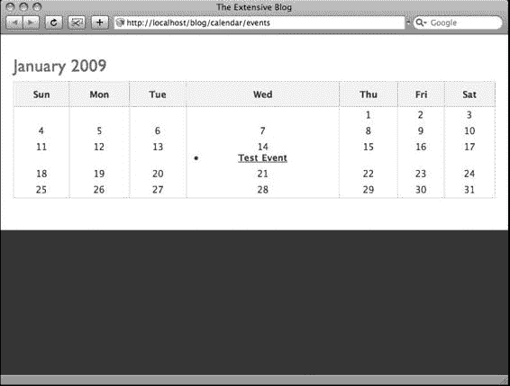

**图 13-2.** *结合 Index 操作视图工作的* `$calendar->render()` *函数*

### 构建 View 操作

构建 View 操作的大部分工作已在构建 Index 操作时完成。此操作与 Index 操作的不同之处在于，它基于传递的月份和年份值来构建其日历。围绕 Calendar Events 数据库的结果集格式化日历的相同过程也会在 View 操作中发生，因此 `$calendar->render()` 函数被同样地引用。清单 13-22 包含要添加到 `app/plugins/calendar/controllers/events_controller.php` 文件中的 View 操作。

**清单 13-22.** *Events 控制器的 View 操作*

```php
function view($month=null,$year=null) {

    if (!$month || !$year || !is_numeric($month) || !is_numeric($year)) {

        $month = date('m');

        $year = date('Y');

    }

    if ($month > 12 || $month < 1) {

        $month = date('m');

    }

    $events = Set::extract($this->CalendarEvent->find('all',array(

        'conditions'=>array('MONTH(CalendarEvent.date)'=>$month,'YEAR(CalendarEvent.

        date)'=>$year))),'{n}.CalendarEvent');

    $this->set(compact('events','month','year'));

}
```

请注意，第 1 行包含了来自 URL 的传递参数，这些参数代表月份和年份。第 2-5 行检查这些值是否存在；如果不存在，则默认为当前月份和年份。第 6 行确保提供的月份值在 1 到 12 之间；如果不是，则将 `$month` 设置为当前月份。第 9 行与清单 13-20 的第 2 行相同，只是它使用了 `$month` 和 `$year` 而不是当前的月份和年份。第 7 行也与清单 13-20 的第 3 行不同，因为它将 `$month` 和 `$year` 传递给了视图。

相应的视图也将与 Index 视图类似。创建 `app/plugins/calendar/views/events/view.ctp` 文件，并粘贴清单 13-23。这将完成插件，并允许父应用程序通过请求插件操作或将链接指向插件来提供日历视图。

**清单 13-23.** *View 操作的视图*

```php
<h2><?=date('M',mktime(0,0,0,$month,1,$year)).' '.$year;?></h2>

<?=$calendar->render($events,$month,$year);?>
```

通过提供月份和年份作为参数来启动`View`操作，并检查测试事件是否出现在正确的日期。你应该能够为月份和年份输入任何整数，插件将根据这些值渲染一个日历（参见图 13-3）。

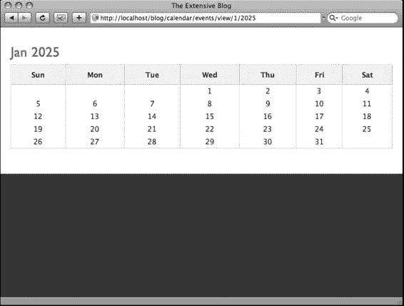

**图 13-3.** *Calendar 插件使用`View`操作为 2025 年 1 月渲染的日历*

### 总结

插件就像是微型的 Cake 应用程序，你可以将其引入任何其他 Cake 应用程序中。它们作为第三方资源（如 Pseudocoder 的 Ajax Chat 插件）非常有用，但也适用于可能需要在多个 Cake 项目中使用相同流程的内部应用程序。我解释了如何通过编写 Calendar 插件来构建自定义插件，该插件基于事件数据库表为任何 Cake 应用程序渲染日历。此插件使用控制器、模型、视图和辅助函数来创建一个简单的日历视图，并且可以扩展其他 Cake 应用程序以处理日历流程。下一章将讨论如何扩展 Web 应用程序开发中最具挑战性但也最高效的方面之一：数据处理。通过使用行为和`DataSource`，你将能够将你的 Cake 应用程序连接到新的数据源，并更高效地处理数据。

## 第 14 章

# DataSource 与行为

### CakePHP 的 MVC 扩展资源

**Cake** 的核心资源严格遵循 MVC 范式，这意味着所有输出由视图（`view`）配置，所有数据处理由模型（`model`）管理，所有业务逻辑由控制器（`controller`）处理。然而，你已经了解到模型、视图和控制器是如何相互协作来作为一个应用程序运行的。视图不能在没有控制器提供所需变量的情况下单独运行，控制器也不能在没有模型帮助的情况下处理其逻辑，依此类推。这些资源相互协作的程度取决于应用程序所采用的独特流程。由于 MVC 元素几乎同时协同工作，你可能操纵某个元素去执行另一个元素的工作。例如，模型可以创建输出字符串（如 HTML 标签和表单字段）并传递给视图。这在短期内可能有效，但如果你后来分发这个应用程序，其他 Cake 开发者将很难与之协作。要保持 Cake 应用程序的可移植性，需要尽可能严格遵循 MVC 结构。

但是，仅有模型、视图和控制器文件会带来一个潜在问题：这些文件可能会变得臃肿，这意味着应用程序越复杂，这些资源的组织就可能越混乱。诚然，所有数据处理都限制在模型中，但如果你想处理多个数据源（例如一个 XML 文件和两个不同的数据库系统）呢？在这种情况下，模型需要包含大量的连接函数，更不用说查找、读取、删除以及其他必要的数据处理方法了。不久之后，MVC 结构就会开始失去其关键优势之一：轻量级组织，尤其是在应用程序较为复杂的情况下。

为了解决模型、视图和控制器文件过于庞大的问题，Cake 开发者们在框架中内置了*扩展* MVC 结构的资源。我在之前的章节中已经讨论过其中一些扩展，例如助手（`helper`）和组件（`component`）。通过扩展 MVC 结构，模型操作被保留在模型中，视图和控制器操作也各归其位——但模型、视图和控制器文件不会因重复出现在整个程序中的函数和数据而变得过重。

正如基本应用程序流程（如处理数据和向用户提供输出）通过使用模型、视图和控制器进行分离一样，更复杂的流程（如生成动态视图）也与其各自的资源进行了分离。换句话说，助手和组件分别为处理视图和控制器提供了*第二层*支持。表 14-1 展示了 Cake 中扩展 MVC 布局的资源。

**表 14-1.** *Cake 扩展 MVC 布局的资源*

| **主层资源** | **后台层资源** |
| --- | --- |
| 模型（`Model`） | 行为（`Behavior`）；数据源（`DataSource`） |
| 视图（`View`） | 助手（`Helper`） |
| 控制器（`Controller`） | 组件（`Component`） |

通过使用助手，你可以避免单个视图变得过于臃肿，并使详细的输出流程可供应用程序中的其他视图使用。助手函数在后台层处理，或者在视图渲染时处理。组件通过分离出执行详细操作的一系列函数，为控制器提供类似的服务。图 14-1 展示了助手如何扩展视图。

**图 14-1.** *助手通过容纳更复杂的函数来扩展视图，这些函数否则会使视图变得混乱。*

这是具体流程：

1.  视图调用`$html->link()`函数来渲染一个链接，并为助手提供变量参数。
2.  `link()`函数处理传递的参数并组合成最终输出，供视图使用。
3.  HTML 助手将最终的`<a>`元素及其所有文本和属性发送回视图。

图 14-1 中的示例展示了如何通过将生成链接的重复性任务放入助手中来精简视图。换句话说，Cake 不是将`$html->link()`函数的流程放入视图，而是将其保存在一个位置，从而使其可被整个应用程序访问，同时最小化视图文件中的代码量。本章将解释如何使用两种资源来扩展后台层的模型，就像助手和组件扩展视图和控制器一样。

### 使用数据源和行为扩展模型

第一种资源是*数据源（`DataSource`）*。¹ 这些资源在后台连接额外的数据源并向模型提供数据。通过使用数据源，你可以让模型正常工作，而不必用连接、查找、读取和其他数据处理操作来填充它。模型可以引用数据源函数，而不是自己执行额外的连接。

第二种扩展模型的资源是*行为（`Behavior`）*。这些是允许模型使用的数据以不同方式“表现”的类。简而言之，一些数据处理方法超越了表关联和简单回调；例如，它们可能在数据保存时对数据执行多个任务。当需要在数据库中同时执行多次更新时，就会调用行为。稍后，我将描述如何使用一些 Cake 内建的行为为博客应用程序的标签应用树结构。

由于扩展模型通常是资源中最复杂的部分，本章可能会包含一些学习 Cake 时最难掌握的概念。

只需记住该资源的总体目标以及它最初出现在 Cake 中的原因。你的应用程序可能不需要为模型添加自定义行为，或者使用除典型 MySQL 设置之外的其他数据源，但了解这些资源能做什么以及它们在 Cake 中如何工作，几乎肯定会在某些时候派上用场。

### 使用数据源

到目前为止，本书只使用了 MySQL 来处理数据，但肯定还有其他方式为应用程序存储数据。例如 PostgreSQL、Sybase、Oracle 和 Microsoft SQL Server 都是一些最流行的数据库系统，如果项目需要，让 Cake 与它们协作可能很重要。幸运的是，Cake 提供了一些内建的数据源，允许应用程序连接到这些其他系统。

数据源不仅有助于处理其他数据库引擎，还可以进行自定义以处理其他数据格式。可以通过数据源实现读取 XML、CSV 或其他格式。应用程序也可以通过数据源使用其他服务器系统，如 LDAP 或 IMAP。许多 Web 应用程序使用某种 Web 服务 API 来与不使用 HTML 的客户端程序协作。结合 Cake 应用程序和客户端软件的能力也可以通过数据源实现。

数据源的主要目标是处理模型的所有连接方法，并为模型提供便捷函数，以尽可能减少模型中的代码量。不过，这些便捷函数与数据源的通信有关，而不仅仅是任何模型类型的流程。换句话说，你希望模型能够坚持使用数据源进行通信，而不是自行处理所有连接细节。

¹ 在 Cake 中定义数据源可能比较棘手。通常，*datasource*（小写）是任何提供或保存数据的来源。因此，MySQL 是一个数据源，XML 文件或从 LDAP 获取数据也是数据源。

服务器。Cake 连接这些数据源（`datasource`）的方式是通过一个名为 `DataSource` 的资源文件，这与数据源本身并非同一概念。为了在本章中保持一致性，我将使用驼峰式拼写的 `DataSource` 来指代 Cake 的资源文件，而使用小写单词 `datasource` 来指代实际的数据源。简而言之，在 Cake 中，你使用 `DataSources` 来连接诸如 MySQL、XML 文件和 LDAP 服务器等数据源。


将其传递给 `read()` 函数，而不是必须按照当前数据源可能要求的某种独特方式，逐步执行读取记录的操作。模型应尽可能避免为适应特定数据源而更改其现有方法。

例如，图 14-2 展示了 MySQL `DataSource` 如何扩展模型，以使模型无需自行构造必要的 SQL 查询字符串并执行数据库连接方法。

**图 14-2.** *MySQL `DataSource` 为模型拼接连接字符串和数据库查询。*

过程如下：

1. 模型运行其某个函数，该函数被发送至 `DataSource`；在此例中，调用了 `find()`，并发送了 `$value` 的内容。
2. `DataSource` 根据数据源的语言拼接查询字符串，连接至数据源并执行查询；在此例中，MySQL `DataSource` 执行类似 `"SELECT * FROM table WHERE field=$value"` 的查询。
3. 数据源返回结果集；此处，MySQL `DataSource` 执行一些 `mysql_fetch_array()` 函数，并遍历来自数据库的结果集以获取最终结果。
4. 获得最终结果后，`DataSource` 格式化该结果集以供模型使用。这通常会是某种类型的数组。
5. 格式化后的数组或结果集被发送回模型。模型随后将其数据用于自身用途。

### 使用内置 DataSources

Cake 的内置 `DataSources` 仅支持关系型数据库系统。由于它们充当模型与数据库之间的层，模型内不会调用额外的 `DataSource` 函数。要从一个 `DataSource` 切换到另一个，只需调整数据库配置文件即可。

更改应用程序主 `DataSource` 的第一步是设置 `app/config/database.php` 中的 `driver` 参数。打开此文件，你将找到 `DATABASE_CONFIG` 类；它应包含最初搭建博客应用时使用的原始设置（见清单 14-1）。

**清单 14-1.** *`app/config/database.php` 中的 `DATABASE_CONFIG` 类*

```


1 class `DATABASE_CONFIG` {

2   var `$default` = array(

3     'driver' => 'mysql',

4     'persistent' => false,

5     'host' => 'localhost',

6     'port' => '',

7     'login' => 'root',

8     'password' => 'root',

9     'database' => 'blog',

10    'schema' => '',

11    'prefix' => '',

12    'encoding' => ''

13   );

14 }

```

清单 14-1 的第 2 至 13 行包含 `$default` 变量，它告知 Cake 连接到默认数据源的位置。博客应用当前通过内置的 MySQL `DataSource` 连接到 MySQL。这在第 3 行通过 `driver` 参数设置。通过将其更改为其他驱动，Cake 将使用新的对应 `DataSource` 来替代 MySQL。表 14-2 列出了可用的驱动选项，你可以根据想要连接的 `DataSource` 使用。

**表 14-2.** `DATABASE_CONFIG` 类可用的驱动选项

| 驱动参数 | 数据源 | 最低 PHP 版本要求 |
|-----------|--------|---------------------|
| `db2` | IBM DB2、Cloudscape 和 Apache Derby | PHP 4 |
| `mssql` | Microsoft SQL Server 2000 及更高版本 | PHP 4 |
| `mysql` | MySQL 4 和 5 | PHP 4 |
| `mysqli` | MySQL 4 和 5 改进接口 | PHP 5 |
| `oracle` | Oracle 8 及更高版本 | PHP 4 |
| `postgres` | PostgreSQL 7 及更高版本 | PHP 4 |
| `sqlite` | SQLite | PHP 5 |

#### `adodb-[驱动名称]`

`ADOdb` 接口封装

PHP 4

#### `pear-[驱动名称]`

`PEAR::DB` 封装

PHP 4

要了解这些数据源如何与其各自的系统协作，可以打开文件本身进行查看。`cake/libs/model/datasources/dbo` 文件夹存储了当你将 `driver` 参数更改为表 14-2 中列出的某个值时 Cake 所使用的数据源文件。

如果你将 `driver` 设置为该目录中未存储的其他值，则需要手动提供数据源代码才能使 Cake 正常工作。在构建自定义数据源时（我将在本章中介绍），参考这些内置数据源有时会很有帮助。它们提供了很好的示例，展示了如何保留模型层；无论使用何种数据源，所有模型的行为都是一致的。

### 构建自定义数据源

编写自定义数据源比在 Cake 中编写其他资源需要多费一些功夫。你可能已经习惯了创建 Cake 文件的常规流程：首先，在适当的位置创建一个具有适当文件名的文件；其次，在文件中输入正确的类名；最后，在文件中添加自定义方法和函数。然而，对于数据源来说，还需要额外完成一些任务才能让它们在应用程序中正常工作。

你需要在应用程序的数据库配置文件中定义数据源：`app/config/database.php`。然后，你需要在调用数据源的模型中定义它。

为了引导你编写自定义数据源，让我们为博客应用程序构建一个 XML 数据源。该数据源将打开一个格式化的 XML 文件，其中包含博客故事，并将文件内容准备好以便导入数据库。在一个更具雄心（理论层面）的项目中，这个过程可以扩展为保存博客的所有信息；你可以完全绕过数据库，将所有内容写入 XML 文件。不过在这里，数据源将保持简单，仅支持简单的更新。例如，你可能希望使用外部编辑器撰写博客文章，而不是通过 Web 浏览器直接写入数据库。你可以在文字处理器中将文章导出为 XML 文件，然后使用本章中的 XML 数据源将其导入博客。无论如何，构建 XML 数据源至少可以演示如何扩展模型的能力以及如何首次自定义数据源。

#### 创建数据源文件

数据源存储在 `app/models/datasources` 文件夹中，文件名使用小写字母，并以 `_source.php` 结尾。如果要为数据源指定包含多个单词的名称，请务必在文件名中使用下划线作为分隔符。

创建 XML 数据源文件，并打开进行编辑：`app/models/datasources/xml_source.php`。该数据源必须设置为一个类对象，继承自 `DataSource` 对象。将清单 14-2 的内容复制到新的 `app/models/datasources/xml_source.php` 文件中。

**清单 14-2.** XML 数据源类

```
<?

class XmlSource extends DataSource {

    var $description = 'XML DataSource';

}

?>
```

清单 14-2 的第 3 行包含了 `$description` 变量。使用此变量为数据源提供一行描述。

#### 从最小骨架开始

数据源与其他资源的不同之处在于，它们需要包含几个函数，即使这些函数不包含任何逻辑。缺少这个基本函数的“骨架”，模型类将会遇到错误。在 `xml_source.php` 文件的第 3 行之后，粘贴清单 14-3，其中包含必要的数据源函数。

**清单 14-3.** 数据源文件的主骨架

```
function __construct($config=null) {

    parent::__construct($config);

    $this->connected = $this->connect();

    return $config;

}
```

```php
function __destruct() {

    $this->connected = $this->close();

    parent::__destruct();

}
```

```php
function connect() { }

function close() { }

function read() { }

function query() { }

function describe() { }

function column() { }

function isConnected() { }

function showLog() { }
```


由于`DataSource`与模型协同工作，模型可能会调用这些函数中的每一个。尽管清单 14-3 第 16–30 行列出的函数尚未包含任何逻辑或参数，但将它们录入`DataSource`可防止模型调用不存在的函数。诚然，当模型调用`read()`或`query()`时，它会收到一个`null`响应，但这至少不会潜在地导致`Warning: Function does not exist`错误。稍后，您将根据需要扩展这些骨架函数。

然而，有两个函数不仅作为骨架的一部分存在，而且对于`DataSource`的正常工作至关重要：`__construct()`和`__destruct()`。这两个函数在清单 14-3 中写为第 5–14 行。它们可以包含更多代码，但目前仅包含让`DataSource`工作的最基本内容。当`DataSource`对象被实例化时，Cake 需要将来自`app/config/database.php`的参数传递给该对象。从某种意义上说，Cake 通过`__construct()`函数和`$config`变量“绑定”了`DataSource`。如果`__construct()`没有与`$config`配合工作，Cake 将无法正确建立绑定，从而模型将无法与`DataSource`“通信”。稍后您将在`database.php`中配置`$config`变量，但此刻`__construct()`函数必须包含基本代码来处理`DataSource`配置，Cake 稍后将使用该配置。

清单 14-3 的第 6 行和第 13 行调用了父对象，将其作为绑定过程的一部分。请注意，父对象的构造函数和析构函数传递了`$config`变量。通过以这种方式使用这些函数，您可以确保 Cake 核心配置中的设置不会与任何现有的`DataSource`参数冲突。换句话说，Cake 会将正确的设置与正确的`DataSource`关联起来。

`__construct()`和`__destruct()`都使用了其他函数——分别是`connect()`和`close()`——这些函数目前还没有执行任何连接或断开操作。这里之所以如此，是因为连接到数据源的实际方法特定于数据源本身。在此示例中，`connect()`稍后将打开 XML 文件，并根据查找和打开文件的效果返回`true`或`false`结果。如果，例如，此`DataSource`连接到数据库，则情况可能会改变——连接方法将完全不同，因此需要为`connect()`提供一组不同的指令，以便它能够建立连接并返回响应。

第 7 行的对象变量`$connected`被模型引用，以确定`DataSource`的状态。当为`true`时，`$connected`告诉模型`DataSource`工作正常。稍后，析构函数会将`$connected`设置为`false`，这将是针对`DataSource`调用的最后一个方法。`__construct()`、`__destruct()`和`$connect`对象变量共同建立与数据源的连接、指示连接状态并终止连接。

### 设置包含数据源的数据库配置

如前所述，仅仅创建`DataSource`文件并包含最小的骨架函数并不会自动将`DataSource`包含到应用程序中。与助手类似，`DataSource`必须通过在应用程序其他位置添加代码来包含才能正常工作。

尽管在控制器中包含助手，但`DataSource`不同，它们被包含在`app/config/database.php`的`DATABASE_CONFIG`类中。

将清单 14-4 中的数组粘贴到`app/config/database.php`中`$default`数组之后，以提供必要的`DataSource`配置。

**清单 14-4.** *`$xml` 配置数组*

```php
var $xml = array(
    'datasource' => 'Xml',
    'file' => 'data.xml'
);
```

清单 14-4 的第 1 行实例化了一个名为`$xml`的新对象变量。您可以根据需要随意命名，但请记住将第 2 行的数据源参数链接到`DataSource`的名称。我已将 XML `DataSource`类命名为`XmlSource`（见清单 14-2 的第 2 行），因此`Xml`是需要设置在`datasource`参数中的值。`$xml`数组的其余部分包含您想要传递给`DataSource`的任何键和值。清单 14-3 中的第 5 行和第 6 行使用了`$config`变量；这将与来自`database.php`的匹配数组相同，在本例中即`$xml`数组。此`DataSource`需要连接到 XML 文件`data.xml`。稍后，您将提供此文件为`app/webroot/files/data.xml`。通过在数据库配置文件中指定此参数，我遵循了 Cake 应用程序中的一致性；所有数据源连接都在一个地方定义，即`database.php`文件。现在`database.php`文件包含了 XML `DataSource`的配置设置，模型便能够与`DataSource`协同工作了。

### 在模型中使用数据源

在`DataSource`和模型开始协同工作之前，需要完成几个关键的设置流程：

1.  `DataSource`文件必须被正确命名并放置在`app/models/datasources`文件夹中。
2.  `DataSource`类必须被正确命名并设置为继承`DataSource`对象。
3.  `DataSource`文件必须至少包含清单 14-3 中概述的最小函数集。
4.  数据库配置文件必须在一个对象数组中定义`DataSource`。
5.  在模型中，`setDataSource()`函数必须引用同一个对象数组。
6.  在模型中，`DataSource`对象必须通过`getDataSource()`函数实例化。

至此，您已完成设置`DataSource`的第 1–4 步。请注意，第 5 步和第 6 步在模型中完成。让我们打开`app/models/post.php`文件，让 XML `DataSource`在那里工作。

清单 14-5 包含了要放置在`post.php`文件中的`xmlFindAll()`函数。此函数使用 XML `DataSource`返回`data.xml`文件中的一个值数组。

**清单 14-5.** *`Post` 模型中的 `xmlFindAll()` 函数*

```php
function xmlFindAll() {
    $this->setDataSource('xml');
    $xml = $this->getDataSource();
    return $xml->findAll();
}
```

# 当控制器调用 `xmlFindAll()` 函数时，模型会返回一组值供控制器和视图使用。请注意，此模型函数并不包含稍后将在 `DataSource` 中出现的全部连接代码。这能使模型保持精简，专注于处理数据，而非管理所有与数据源的连接。

## 读取 XML 文件

现在设置例程已完成，模型已准备好开始使用 `DataSource` 函数，你可以让 `DataSource` 开始工作了。目前，`findAll()` 函数尚未执行任何操作。在其能够读取数据之前，清单 14-3 中第 16 行的 `connect()` 函数必须连接到 XML 文件并获取其内容以供 `DataSource` 使用。将 `connect()` 替换为清单 14-6 的内容，以便为 `DataSource` 提供必要的连接方法。

**清单 14-6.** *改进后的 XML DataSource 中的* `connect()` *函数* 16

```php
function connect() {

17 App::import('Core','File');

18 $this->FileUtil =& new File(WWW_ROOT.'files/'.$this->config['file']); 19 $this->File = $file->read();

if (!$this->File) {

21 return false;

22 } else {

return true;

}

25 }
```

在整个 `DataSource` 文件中，定义在 `app/config/database.php` 中的配置数组将通过对象变量 `$config` 可用。不要将此变量与清单 14-3 中 `__construct()` 函数使用的 `$config` 变量混淆。实际上，构造方法的结果——或者说，`__construct()` 函数的返回值——会被赋值给 `DataSource` 的标准对象变量 `$config`。这意味着在 `DataSource` 的其余任何地方（`__construct()` 函数除外），构造函数返回的配置值都可以通过 `$this->config` 访问。恰好 `__construct()` 会执行必要的方法，从 `app/config/database.php` 获取 `$xml` 数组，并将其作为 `$this->config` 返回供 `DataSource` 使用。清单 14-6 中的 `connect()` 函数使用 `$this->config` 来检索数据源的文件名。请注意，第 18 行在 `File` 工具中调用此文件名。利用 `WWW_ROOT` 全局变量，第 18 行还包含了相对于 Cake 的文件路径。在这种情况下，该文件需要以 `app/webroot/files/data.xml` 的形式存储在 Cake 文件系统中。当然，`$this->config['file']` 对应于清单 14-4 第 3 行定义的 `$xml['file']`。

得益于 `File` 工具类，读取 `app/webroot/files/data.xml` 的内容变得轻而易举。第 18 行获取文件本身，并将其作为 `File` 工具类对象的一部分进行赋值。然后，在第 19 行，使用 `File` 工具类的 `read()` 函数来读取文件内容，并将其赋值给一个名为 `$File` 的类变量。你可能已经注意到这个变量尚未定义；通过在清单 14-2 第 3 行（或当前 XML `DataSource` 文件的第 3 行）所示的 `$description` 类变量下方插入以下字符串来定义：`var $File = null;`

将文件内容赋值给对象变量而非标准变量，对于确保 `DataSource` 中的所有其他函数都能访问此文件至关重要。基于同样的原因，生成的 `File` 工具对象也应可供 `DataSource` 的其余部分使用。这一点通过第 18 行将新的 `File` 对象赋值给实例变量 `$FileUtil` 来实现。同样，这个变量也需要在类中正确定义。请在 `$File` 定义附近插入此定义：`var $FileUtil = null;`

稍后，`__destruct()` 和 `close()` 函数会关闭 `data.xml` 文件，以尽量降低应用程序对服务器的负载。这些函数需要 `File` 工具对象，由于我已将其赋值给 `$FileUtil` 实例变量，因此该对象在 `connect()` 函数外部是可访问的。

`connect()` 函数通过向 `DataSource` 的其余部分提供 `data.xml` 的文件内容，基本上执行了连接方法。该函数剩下的工作就是向构造函数返回 `true` 或 `false` 结果。第 20–24 行检查 `$File` 变量中是否有任何内容并返回结果。现在 `data.xml` 文件已打开，其内容可供 `DataSource` 的其余部分使用，你可以着手处理模型调用的 `findAll()` 函数了。

## 断开与 XML 文件的连接

为了确保万无一失，`DataSource` 应包含一个用于断开与数据源连接的方法。清单 14-3 中定义的 `__destruct()` 函数已经执行了此操作，只是它调用的 `close()` 函数目前尚为空。将 `close()` 函数（现在应位于 `app/models/datasources/xml_source.php` 文件的第 29 行）替换为清单 14-7 的内容。

**清单 14-7.** *改进后的* `close()` *函数*

```php
function close() {

if ($this->FileUtil->close()) {

31 return false;

32 } else {

return true;

}

35 }
```

此函数的结果可能看起来有些反常，仅仅是因为 `false` 结果通常意味着方法执行失败。在这种情况下，返回 `false` 会将 `$connected` 类变量设置为适当的值；它告诉模型连接状态已断开，即零。

清单 14-7 的第 30 行使用 `File` 工具类的 `close()` 函数来关闭 `data.xml` 文件。简而言之，如果关闭成功，那么 `close()` 函数剩下的工作就是向析构函数报告 `false`，这在第 31 行完成。

## 解析 XML 文件

在 `DataSource` 解析 XML 文件之前，我们先给它一些数据来操作。将类似清单 14-8 的内容粘贴到 `app/webroot/files/data.xml` 文件中。请注意，清单 14-8 的格式为 XML 1.0 标准标签，这些标签以数据库中当前 posts 表中的字段命名。

**清单 14-8.** *需添加到* `data.xml` *文件中的内容*

```xml
<?xml version="1.0" encoding="UTF-8"?>

<blog>

<post>

<id></id>

<name>用 XML 编写文章轻而易举</name>

<date>2008-11-08 12:00:01</date>

<content>在 Cake 中使用 XML 工具类配合 Set::reverse() 函数使得解析 XML 变得简单。</content>

<user_id>1</user_id>

</post>

<post>

<id></id>

<name>更多 XML 文章，也不难</name>

<date>2008-11-08 12:00:02</date>

<content>在 Cake 中使用 XML 工具类配合 Set::extract() 函数使得解析 XML 变得简单。</content>

<user_id>1</user_id>
```

除了清单 14-8 第 1 行的 XML 规范字符串外，此处使用的标签按层级结构组织，类似于 posts 表：`<blog>` 标签以数据库名称命名；`<post>` 用于 posts 表中的每一行；`<id>` 对应 ID 字段，依此类推，一直到 `<user_id>`。一旦这些标签被 `findAll()` 函数解析，就会像默认的 MySQL `DataSource` 传递来自数据库的结果集一样，将一个数组传递给模型。

当前，在连接到 `data.xml` 文件时，清单 14-8 中的相同内容被赋值给了 `$File`。`read()` 函数需要做的就是解析这些 XML 标签，并相应地为模型格式化数组。清单 14-9 包含了解析 XML 的 `findAll()` 函数。将其粘贴到 XML `DataSource` 文件中。

**清单 14-9.** `findAll()` 函数

```
function findAll() {
    App::import('Core','Xml');
    $xml = Set::reverse(new Xml($this->File));
    return Set::extract($xml,'Post');
}
```

### XML 数据源与行为

得益于 `XML` 工具类（该工具类在第 14-9 清单第 38 行被导入到函数中），解析所有 XML 标签变得容易得多。例如，第 39 行根据 `$File` 的内容创建了一个新的 `XML` 工具类对象，而 `$File` 当前包含 `data.xml` 文件的内容。通过这个对象，`DataSource` 可以使用 `XML` 工具函数，例如计算特定标签的子节点数量、从 XML 数据中提取名称和值等。减少遍历所有标签和节点循环次数的一个便捷方法是使用 `Set` 工具类，第 39 行和第 40 行就使用了它。

`Set` 工具包含几个用于处理数据结果集的函数。Cake 的核心库在构建构成 `$this->data` 和 `$this->params` 的数组时使用了这个工具，这在前面章节中我们探讨 `Form` 助手和管理表单提交时已被证明非常有用。使用 `Set` 不仅减少了构建 Cake 友好数据数组所需的操作次数，还可以与 `XML` 工具一起使用，从 XML 文件中拼接出一个与模型中使用的标准数组相匹配的数据数组。

在第 39 行，`Set::reverse()` 与一个新的 `XML` 工具类对象实例一起使用，从 XML 标签创建出一个 Cake 友好的数组。这里使用 `Set::reverse()` 函数是因为它可以将对象转换为数组。

该数组的结构会因 XML 文件中的层级关系而变化，甚至可能因为 `$this->File` 中出现 `<post>` 标签的数量不同而不一致。为了确保数组应用相同的结构，第 40 行使用了 `Set::extract()` 函数。简而言之，`Set::extract()` 获取由第 39 行 `Set::reverse()` 格式化的 `$xml` 数组，并查找名为 `Post` 的数组键。然后，它提取每个嵌套数组，并根据结果构建一个新数组。最后，这个数组通过 `return` 命令转发给模型。

如果你想对这个 XML 文件进行更复杂的操作，可以更深入地探索 `XML` 工具并使用更多它的函数。例如，为标签分配属性可以扩展 XML 文件以包含更多类型的数据，更不用说通过使用其他标签（如 `<user>` 或 `<tag>` 来匹配当前数据库中的 `users` 和 `tags` 表）在文件内建立更多关联了。目前，`XML DataSource` 解析 `data.xml` 文件以供控制器和视图使用。剩下的工作就是显示数据并使其可供用户访问。

### 查看数据

`XML DataSource` 和模型现在工作正常。在控制器和视图中查看 `data.xml` 中的 XML 数据，就像从数据库中获取数据一样简单。

在 `app/controllers/posts_controller.php` 的 `Posts` 控制器的 `Index` 操作中，使用 `Post` 模型中的 `xmlFindAll()` 函数对新数据源执行“查找所有”查询，插入以下代码行：

```
$this->set('xml',$this->Post->xmlFindAll());
```

解析后的 XML 现在可以在 `Index` 视图中作为 `$xml` 使用。使用 `debug()` 函数查看其内容。你应该会得到以下结果：

```
Array
(
    [0] => Array
        (
            [Post] => Array
                (
                    [name] => Writing Posts in XML is a Snap
                    [date] => 2008-11-08 12:00:01
                     => Using the XML utility class in Cake with the
Set::reverse() function makes parsing XML easy.
                    [user_id] => 1
                )
        )

    [1] => Array
        (
            [Post] => Array
                (
                    [name] => More XML Posts, Not so Bad
                    [date] => 2008-11-08 12:00:02
                     => Using the XML utility class in Cake with the
Set::extract() function makes parsing XML easy.
                    [user_id] => 1
                )
        )
)
```

# 第 14 章 数据源与行为

这个数组看起来就像你在 Cake 中习惯使用的数组一样。在 `Index` 视图中，你可以通过运行一个类似于当前 `$posts` 变量循环的循环，将这些结果添加到列表中。当然，在 `app/webroot/files/data.xml` 文件中，我将 `<id>` 标签留空了；你必须手动设置它们，或者在 `DataSource` 中构建一个 `auto_increment` 方法，为 XML 文件中的每个帖子提供唯一的 ID。

数据源不仅可以连接外部文件，还可以用于从任何地方提取数据，例如网络服务、电子邮件或某些遗留系统。

本教程探讨了将 XML 作为外部数据源的使用，并演示了以这种方式扩展模型实际上如何改进代码并在整个框架中保持更好的秩序。其他开发者开发的第三方数据源已经可以在线获取；你可能想尝试安装一个，以此作为在 Cake 应用程序中使用数据源的练习。

## 使用行为

扩展模型的另一种方式是使用行为。行为为模型提供“规则”，就像你可以在邮件程序中为收件邮件设置规则一样。例如，你可能希望模型在更新数据库中的记录时，能即时对数据执行多种计算，不仅更新一条记录或几个关联记录，而是跨数据库执行一系列更新。使用行为，而不是在模型中构建所有必要的函数来管理这种更新，可以将重复性任务保留在单独的资源文件中，并通过允许多个模型访问更复杂的过程而不使其负担过重，从而使模型更加通用。Cake 内置了四种行为：`ACL`、`Containable`、`Translate` 和 `Tree`。在本章中，我将解释如何使用 `Tree` 行为来改进博客对帖子的分类方式。创建自定义行为实际上比创建你自己的数据源更简单；理解内置行为的工作原理将使创建你自己的行为变得更加容易。

### 使用 Tree 行为对博客文章进行分类

博客应用程序使用 `tags` 表来管理可应用于帖子的多个标签。

如果你想创建标签的层级结构，或者某种“树状”数据结构呢？一个标签可以成为另一个标签的“父级”，一系列标签可以被指定为某个标签的“子级”。然后，一旦标签被分配给帖子，通过点击父级标签，该父标签及其子标签的所有相关帖子都将被列出给用户。这种处理层级数据的方法比构建多个关系数据库来管理层级关系更有效。幸运的是，Cake 提供了 `Tree` 行为，它可以动态维护一棵数据树。

#### 向 Tags 表插入所需字段

使用 `Tree` 行为要求与该行为关联的数据库表按特定方式组织。在这种情况下，`tags` 表需要包含一些额外的字段，以便 `Tree` 行为保存其自身参数。无论你在哪里使用 `Tree` 行为，请记住提供以下三个字段：

- `parent_id`
- `lft`
- `rght`

左字段和右字段，即 `lft` 和 `rght`，由 `Tree` 行为用于组织节点在树中的位置。`parent_id` 字段链接到表中作为当前记录父节点的记录的 ID。目前，`tags` 表不包含这些字段。为了准备让博客使用 `Tree` 行为，请按照清单 14-10 中的规范替换 `tags` 表。

**清单 14-10.** *包含 Tree 行为所需字段的 Tags 表*

```sql
CREATE TABLE `tags` (
  `id` int(11) unsigned NOT NULL auto_increment,
  `parent_id` int(11) unsigned default NULL,
  `lft` int(11) unsigned default NULL,
  `rght` int(11) unsigned default NULL,
  `name` varchar(255) default NULL,
  PRIMARY KEY (`id`)
);
```

请注意，清单 14-10 没有使用 `lft` 和 `rght` 作为 `left` 和 `right` 字段的默认值；这些字段可以设置为你选择的任何名称，这里我选择了 `left` 和 `right`。稍后，在模型中调用 `Tree` 行为时，我将指定这些字段名称。

### 烘焙新的标签控制器和视图

现在 `tags` 表已经包含了 `Tree` 行为正常运行所需的字段，接下来需要重新生成 `Tags` 控制器和视图。使用 `Bake` 创建一个新的控制器——确保*不要*使用管理路由、脚手架、附加组件或附加帮助器；*务必*确保使用会话并创建基本视图方法（`index`、`edit`、`add`、`view`）。新的 `Tags` 控制器应包含如清单 14-11 所示的代码，或非常相似的代码。

**清单 14-11.** *烘焙的 Tags 控制器*

```php
<?php
class TagsController extends AppController {
    var $name = 'Tags';
    var $helpers = array('Html', 'Form');

    function index() {
        $this->Tag->recursive = 0;
        $this->set('tags', $this->paginate());
    }

    function view($id = null) {
        if (!$id) {
            $this->Session->setFlash(__('Invalid Tag.', true));
            $this->redirect(array('action'=>'index'));
        }
        $this->set('tag',$this->Tag->read(null,$id));
    }

    function add() {
        if (!empty($this->data)) {
            $this->Tag->create();
            if ($this->Tag->save($this->data)) {
                $this->Session->setFlash(__('The Tag has been saved', true));
                $this->redirect(array('action'=>'index'));
            } else {
                $this->Session->setFlash(__('The Tag could not be saved. Please, try again.', true));
            }
        }
        $posts = $this->Tag->Post->find('list');
        $this->set(compact('posts'));
    }

    function edit($id = null) {
        if (!$id && empty($this->data)) {
            $this->Session->setFlash(__('Invalid Tag', true));
            $this->redirect(array('action'=>'index'));
        }
        if (!empty($this->data)) {
            if ($this->Tag->save($this->data)) {
                $this->Session->setFlash(__('The Tag has been saved', true));
                $this->redirect(array('action'=>'index'));
            } else {
                $this->Session->setFlash(__('The Tag could not be saved. Please, try again.', true));
            }
        }
        if (empty($this->data)) {
            $this->data = $this->Tag->read(null, $id);
        }
        $posts = $this->Tag->Post->find('list');
        $this->set(compact('posts'));
    }

    function delete($id = null) {
        if (!$id) {
            $this->Session->setFlash(__('Invalid id for Tag', true));
```

接下来，使用 Bake 为 Tags 控制器创建 Action 视图。最终应该会得到 `app/views/tags` 文件夹，其中包含 `add.ctp`、`edit.ctp`、`index.ctp` 和 `view.ctp` 文件。Tags 控制器和视图正常工作后，博客就拥有了添加、编辑和删除标签的基本界面。Tag 模型已经内置了“多对多”关系，因此标签也可以与特定的博客文章关联。这就是 Tree 行为将要发挥作用的地方——与其在应用程序中构建一个让用户点击标签并获取相关文章列表的机制，不如使用 Tree 行为。这样，当用户点击一个标签时，不仅会获得关联文章的列表，还会获得关联标签的文章列表。

### 在模型中使用 Tree 行为

数据库已准备好处理 Tree 行为，并且使用烘焙的控制器和视图后，现在可以在模型中调用该行为了。这是通过模型中的 `$actsAs` 属性完成的。

打开 `app/models/tag.php`，在 `$hasAndBelongsToMany` 属性附近插入 `$actsAs` 属性。`$actsAs` 中设置的值对应所使用的行为；在本例中，`$actsAs` 设置为 `Tree`。输入 `$actsAs` 属性后，您的 Tag 模型应如清单 14-12 所示。

**清单 14-12.** *包含 Tree 行为的 Tag 模型*

```php
<?php
class Tag extends AppModel {
    var $name = 'Tag';
    var $actsAs = array('Tree'=>array(
        'left'=>'left',
        'right'=>'right'
    ));
    var $hasAndBelongsToMany = array('Post');
}
?>
```

清单 14-12 中的第 5 行和第 6 行展示了我如何指定 `left` 和 `right` 字段名称。由于我没有使用默认名称 `lft` 和 `rght`，因此必须在第 4 行为 `Tree` 分配一个数组，并包含第 5-6 行所示的 `left` 和 `right` 参数。分配给这些参数的值对应 `tags` 表中 `left` 和 `right` 字段的字段名称，在本例中分别为 `left` 和 `right`。

要将多个行为附加到模型，只需扩展 `$actsAs` 数组。例如，如果我想将一个自定义行为以及 Tree 行为附加到 Tag 模型，我会输入如下内容：

```php
var $actsAs = array('Tree','MyBehavior');
```

数组中的每个行为名称还可以包含一组参数，如清单 14-12 所示；只需为每个行为名称分配一个数组作为值：

```php
var $actsAs = array(
    'Tree'=>array(
        'left'=>'left',
        'right'=>'right'
    ),
    'MyBehavior'=>array(
        'recursive'=>1
    )
);
```

现在 `$actsAs` 属性已设置为 `Tree`，并且参数数组中已设置好 `left` 和 `right` 字段的适当字段名称后，模型中无需再做其他操作。所有 Tree 行为的函数都可以在控制器或模型中访问，这是下一步组织标签层次结构的任务。

### 调整视图

当 Bake 生成 Tags 视图时，它们包含了行为字段（`parent_id`、`left` 和 `right`）。如果这些字段保留在表单提交中，可能会与 Tree 行为冲突，因此务必将它们从视图中移除。在每个烘焙视图中找到调用行为字段之一的 Form 帮助器函数，并将其从文件中删除。最终应该只保留 `name` 字段，在某些情况下保留 `id` 字段。

接下来，为了让标签具有父节点，Add 和 Edit 视图必须提供选择父 ID 的方式。为此，在 Add 和 Edit 视图中放置一个包含标签列表的选择菜单。要使此菜单正常工作，首先必须在控制器中生成标签列表，然后在视图中使用 Form 帮助器渲染选择菜单。打开 `app/controllers/tags_controller.php`，并在 Add 和 Edit 操作中添加以下代码行：

```php
$tags = $this->Tag->find('list');
```

现在标签列表作为 `$tags` 数组可用，通过重写 `set()` 函数将变量传递给视图，以同时包含 `$posts` 和 `$tags`：

```php
$this->set(compact('posts','tags'));
```

在 Add 和 Edit 视图中，使用 Form 帮助器提供选择菜单。请记住，它需要一些额外的参数才能与控制器正确配合。清单 14-13 包含了渲染选择菜单的 `$form->input()` 函数。将清单 14-13 添加到 `app/views/tags/add.ctp` 和 `app/views/tags/edit.ctp` 中，替换原先 Bake 生成的 `parent_id` 表单输入字段。

**清单 14-13.** *Add 和 Edit 视图中的 parent_id 选择菜单*

```php
echo $form->input('parent_id',array(
    'label'=>'Parent Tag',
    'type'=>'select',
    'options'=>$tags,
    'empty'=>'- No Parent Tag -'
));
```

请注意，在清单 14-13 的第 1 行，传递给 Form 帮助器的字段名称是 `parent_id`，对应于 `tags` 表中的父 ID 字段。清单 14-13 的其余部分包含参数，告诉 Form 帮助器渲染选择菜单（第 3 行）。

使用类型参数（`type`），通过控制器传递的 `$tags` 数组作为菜单选项（第 4 行的 `options` 参数），设置第一个且为 `NULL` 的菜单选项为“- No Parent Tag -”（第 5 行的 `empty` 参数），并为菜单指定标签“Parent Tag”以替代默认标签（第 2 行的 `label` 参数）。

为了测试标签添加和编辑视图，我们先向 `tags` 表添加一些类别。为方便起见，我在表 14-3 中列出了以下名称及其对应的 ID；当然，你也可以输入任何你希望的值。

**表 14-3.** *用于测试控制器、视图以及最终树形行为的一些示例标签*

| **ID** | **Name** |
| --- | --- |
| 1 | CakePHP |
| 2 | PHP |
| 3 | Programming |
| 4 | Web |
| 5 | Frameworks |

表 14-3 展示的标签可以轻松地组织成一个数据树。例如，“CakePHP”作为子节点关联到“PHP”；“PHP”是“Programming”的子节点，“Web”和“Frameworks”也是如此。树形行为（Tree behavior）将允许你相应地给每个标签分配父标签。

然而，在此之前，你必须确保 `$this->data` 数组包含了正确的父级 ID 名称和值，以便模型能正确地传递选择菜单的结果。如果 `$this->data['parent_id']` 一开始没有设置，那么所有标签都将没有父级，树形行为也就无法按你的期望管理数据。因此，在编辑（Edit）动作中，使用 `debug()` 函数来显示 `$this->data` 的内容，如下所示：

```php
<?php debug($this->data); ?>
```

接下来，通过输入一个与某个标签匹配的 URL（例如 `http://localhost/blog/tags/edit/1`）在编辑视图中打开一个标签记录。你应该能看到 `debug()` 函数显示的 `$this->data`，如清单 14-14 所示。

**清单 14-14.** *添加了 `parent_id` 字段和选择菜单后的 `$this->data` 内容*

```php
Array
(
    [Tag] => Array
        (
            [id] => 1
            [parent_id] => 2
            [left] =>
            [right] =>
```


```php
[name] => CakePHP

    [Post] => Array
        (
            [0] => Array
                (
                    [id] => 1
                    [name] => New Cake 1.2 Functions
                    [date] => 2008-01-01 01:01:01
                     => Some snazzy new functions are now available in 1.2 that you should check out!
                    [user_id] => 1
                    [PostsTag] => Array
                        (
                            [id] =>
                            [post_id] => 1
                            [tag_id] => 1
                        )
                )
        )
)
```

注意，由于`Post`和`Tag`模型中已经设置了`hasAndBelongsToMany`关联，关联的文章会出现在`$this->data['Post']`数组中（清单 14-14 的第 11-27 行）。如果当前标签关联了更多文章，这个数组会更大，但清单 14-14 至少展示了`$this->data`将如何包含这些关联记录。

然而，我在此数组中寻找的不是关联的文章，而是`parent_id`字段。既然我已经从“Parent Tag”选择菜单中选了一个父节点并保存了标签，`$this->data`显示该值已正确保存；清单 14-14 的第 6 行显示，当前记录的`parent_id`字段已保存 ID 值为`2`。

现在“Parent Tag”选择菜单在编辑视图中已正常工作，并能将选中的值保存到`parent_id`字段中。将同样的表单辅助器（`Form` helper）代码粘贴到添加（Add）视图文件中：

```php
echo $form->input('parent_id', array('label'=>'Parent Tag', 'type'=>'select', 'options'=>$tags, 'empty'=>'- No Parent Tag -'));
```

#### 当查看标签时获取所有关联文章

添加和编辑视图现在支持分配父标签，模型将其保存在`parent_id`字段中。由于模型表现得像一个数据树（参见清单 14-12），树形行为会自动分析`tags`表以及每个标签的父节点 ID 值，然后分配`left`值和`right`值。在创建和编辑标签时，你现在可以从现有标签列表中选择每个标签的父级，剩下的工作都由树形行为完成。剩下的唯一任务是在用户请求某个标签时，使用树形辅助器（`Tree` helper）来检索关联的文章。

使用`children()`函数来执行查找请求，获取提供的标签 ID 及其所有关联标签。根据我们提供的参数不同，`children()`不仅可以返回这些标签的列表，还可以返回它们所有关联的文章。将`app/controllers/tags_controller.php`中的当前查看（View）动作替换为清单 14-15。

**清单 14-15.** *包含* `children()` *函数的查看动作*

```php
function view($id = null) {
    if (!$id) {
        $this->Session->setFlash(__('Invalid Tag.', true));
        $this->redirect(array('action'=>'index'));
    }
    $children = $this->Tag->children($id, null, null, null, null, null, 1);
    $tag = $this->Tag->read(null, $id);
    $this->set(compact('children', 'tag', 'list'));
}
```

注意清单 14-15 的第 6 行，树形行为的函数`children()`是如何像其他模型函数一样被使用的。如果`Tag`模型中没有将`$actsAs`属性设置为`Tree`，那么这一行将会出错；或者至少模型会在`app/models/tag.php`中寻找一个名为`children()`的自定义函数。但是，由于树形行为已被应用到当前的`Tag`模型上，它的所有函数都可以通过引用模型在控制器中访问，如清单 14-15 的第 6 行所示。

让我解释一下`children()`函数。这个函数是树形行为执行之前描述的查找请求，返回给定记录的子节点的方式。

`children( &$model, id[mixed], direct[bool], fields[mixed], order[string], limit[int], page[int], recursive[int] )`

*   `id`: 父节点记录的 ID。
*   `direct = false`: 是否仅返回直接子节点，还是返回所有子节点。设置为`true`时，仅返回直接的子节点，不返回子节点的子节点；设置为`false`时，将返回当前父节点的任何及所有子节点。
*   `fields = null`: 可以是单个字段名字符串或字段名数组；用于限制查找查询返回的字段。
*   `order = null`: SQL 排序条件，例如 `name DESC`；默认为树中的顺序。
*   `limit = null`: 用于计算每页数据项的数量；以 SQL `LIMIT`子句形式输入。
*   `page = 1`: 页码；用于访问分页数据。
*   `recursive = -1`: 当获取关联记录时，用于指定返回的深度层级；对应于在模型函数（如`find()`和`read()`）中使用的`recursive`参数。

在清单 14-15 的第 6 行，`children()`函数使用了`id`和`recursive`参数调用。通过为中间的其他参数输入`null`值，我指示树形行为在其他方面使用默认值。如果不改变`recursive`参数，该函数只会向控制器提供一个子标签的数组，而不是这些标签及其关联文章的数组。所以，你可以看到第 6 行将`recursive`值设置为`1`，而不是默认的`-1`。

标签控制器现在向视图提供了一个包含相关标签及其关联文章的数组。让我们在`app/views/tags/view.ctp`文件中遍历这个数组，以显示文章。在此文件的某处（大约在第 16 行），插入清单 14-16，其中包含了这个循环并为每个关联文章显示一个 HTML 链接。

**清单 14-16.** *在视图中将每个相关文章显示为链接* 1

```php
<? if (isset($children)): ?>
<? foreach($children as $child): ?>
<? foreach($child['Post'] as $post): ?>
<?=$html->link($post['name'],array('controller'=>'posts','action'=>➥
'view','id'=>$post['id']));?>
<? endforeach;?>
<? endforeach;?>
<? endif;?>
```


你可以看到，清单 14-16 是一个遍历由控制器传递的`$children`数组的循环（如清单 14-15 所示）。由于我只关心显示与给定标签相关的所有文章，因此我遍历了每个标签记录中包含的每篇文章，所以第 2 行和第 3 行都包含一个`foreach()`函数。第 1 行和第 7 行是一种先测试`$children`变量中是否存在任何内容的方法。使用第 4 行的 HTML 辅助函数，我可以为每篇文章渲染一个链接，该链接经过反向路由并包含文章的名称。要调整每篇文章的显示方式，只需重新设计第 4 行以满足你自己的样式；在流程的这一点上，文章记录的全部内容都可以通过`$post`获取。

就这样！得益于`Tree`行为及其`children()`函数，所有相关的文章，包括那些由相关子标签所关联的文章，都显示在此视图中。将同样的过程应用于博客的其他区域，用户可以更快速地访问分类文章。并且，由于`Tree`行为在管理层级结构，管理员的工作量也减少了，他们只需在“标签添加”和“标签编辑”视图中设置父 ID 值即可。`Tree`行为还让我不必编写自己的一套函数来查找子节点及其关联文章。

### 使用 Tree 行为的其他函数

与`children()`函数类似，`Tree`行为的其他函数可以通过引用模型，在模型或控制器中调用。在控制器中，通过输入模型名称并调用所需的`Tree`行为函数来实现，*而不要*输入行为名称：

```
$this->Model->children($id); // 这种方式可行

$this->Model->Tree->children($id); // 这种方式不可行
```

在模型中，模型名称被省略，就像引用其他模型函数一样，例如：

```
$this->children($id); // 这种方式可行

$this->Tree->children($id); // 这种方式不可行

$this->Model->children($id); // 这种方式也不可行
```

#### `childCount`

`childCount()` 函数返回给定父 ID 的子节点数量。

`childCount( &$model, id[mixed], direct[bool] )`

当 `id` 设置为 `false` 时，将读取所有顶层节点；否则，仅将提供的 ID 节点作为父节点读取；当 `direct` 设置为 `true` 时，仅统计直接子节点。

#### `generateTreeList`

此函数是一个便捷方法，用于返回一个层级数组，该数组可用于制作 HTML 选择框或面包屑导航。

`generateTreeList( &$model, conditions[mixed], keyPath[string], valuePath[string], spacer[string], recursive[int] )`

- `conditions` = null：作为字符串或数组的 SQL 条件（类似于在 `find()` 模型函数中使用的条件）
- `keyPath` = null：指向键的字符串路径，例如 `{n}.Tag.name`
- `valuePath` = null：指向值的字符串路径；类似于 `keyPath`
- `spacer` = '_'：对于每个处于父节点之下的层级节点，该字符将放置在返回的列表项之前；例如，父节点的孙节点在其名称前会返回两个分隔符
- `recursive` = -1：返回数据的递归值

#### `moveUp` 和 `moveDown`

要在不更改父节点的情况下重新排序给定节点，请使用 `moveUp()` 和 `moveDown()` 函数。

`moveUp( &$model, id[int], number[mixed] )`
`moveDown( &$model, id[int], number[mixed] )`

这些函数会根据 `number` 中设置的值，移动节点 `id`，换句话说，动态调整左值和右值字段。如果 `number` 设置为 `true`，则 `moveUp()` 会将节点设置到最顶或第一个位置；`moveDown()` 会将节点设置到最后一个位置。

#### `getParentNode` 和 `getPath`

要获取给定子节点的父节点，请使用 `getParentNode()`。只需为给定节点提供一个 ID，此函数就会找到其父节点并返回其内容。要检索到给定节点的路径，请提供记录的 ID，`getPath()` 将返回一个从最顶层节点到当前节点的数组。此函数对于显示面包屑链接非常方便。

#### `recover`、`removeFromTree`、`setParent`、`setup` 和 `verify`

恢复损坏的树（即由 `Tree` 行为重新对齐左值和右值字段）通过 `recover()` 函数完成。调用 `recover()` 时无需传递值；只需确保相关数据库表在 `$actsAs` 属性中正确设置即可。

要从树中移除一个节点，请使用 `removeFromTree()`。只需提供节点 ID，此函数就会从树中移除该节点，并将其所有剩余子节点重新向上提升一级父级。

通常，如本章所述，只要 `parent_id` 在视图中正确设置并通过 `$this->data` 传递给模型，`Tree` 行为会自动分配父节点。然而，`setParent()` 函数作为一个向后兼容的方法，可用于手动分配父节点。使用时，`setParent()` 将提供的 ID 值作为其第一个参数，并将匹配的记录分配为当前正在保存的记录的父节点。此函数应在模型执行保存操作时使用。

要在某个动作或模型函数中手动调整 `$actsAs` 中使用的设置，请使用 `setup()` 函数。第一个参数必须是一个与 `$actsAs` 属性结构相同的数组；换句话说，按照格式化 `$actsAs` 属性的方式设置一个数组，并将其传递给 `setup()`。然后，在调用行为时，新设置将应用于模型。

要测试模型是否拥有一个有效的树，请使用 `verify()` 函数。这里不需要任何参数。只需在模型或控制器中调用此函数，如果模型拥有有效的树，它将返回 `true` 值。

### 使用 ACL 和 Translate 行为

到目前为止，我已经详细解释了 `Tree` 行为，以演示如何在你的 Cake 应用程序中使用行为。只需添加一行代码（具体来说，就是设置 `$actsAs` 属性），你就可以扩展模型以使其表现不同。`Tree` 行为会动态调整标签，使其包含它们之间的关联，你无需在模型中再编写任何函数来维护数据树（当然，除非你想增强该树以包含更多方法和结构）。但是，你可以在相对较短的时间内为你的数据库添加基本的树结构。

其他行为的工作方式类似，这意味着它们为模型执行类似的任务，使得移动数据更加容易。不幸的是，另外两个内置行为，即 `ACL` 和 `Translate`，比 `Tree` 行为复杂得多。（`Containable` 行为易于使用，但我稍后会对此行为进行更详细的说明。）管理访问控制列表（`ACL` 的全称）的本质是在应用程序中建立用户控制的最复杂任务之一。深入研究此行为对许多开发者来说肯定有用，但这也会超出本书的范围。我仅在此提请你注意，并鼓励你，如果你的应用程序需要为各种用户组和单个用户建立详细的层级结构，请查看这个内置行为。

### 翻译行为

`Translate` 行为也涉及更复杂的方法来将其集成到应用程序中。本行为的教程超出了本书的总体范围，因为它需要掌握另一种语言（以及英语）的知识。因此，请记住，如果您的项目需要复杂的数据映射来更改语言设置，那么 `Translate` 行为是您以动态方式使用这些方法的最佳选择。简而言之，`Translate` 可以动态地映射字段名、路由等。

### 使用 Containable 行为

通过向模型提供特定的查找条件，您可以有效地搜索数据库，并精确过滤掉结果集中不需要的内容。您不仅可以避免编写和循环复杂的查询，坚持使用 Cake 的模型函数，还可以使用规范化的数据库，并扩展您的应用程序以适应更复杂的模式。但面对所有这些可能性，您可能会注意到，构建能够与数据库协作并精确提供所需内容的查找条件，本身也可能变得困难。或者更糟的是，您可能会发现自己编写了复杂的循环或辅助函数来在视图中过滤数据，尤其是在处理复杂的多对多关联时。

最好让模型向控制器和视图提供精确的数据片段，但当使用复杂的关联时，必须采用额外的查找方法。这就是 `Containable` 行为发挥作用的地方——它对关联模型和记录应用过滤方法，使您在检索关联数据时能够更加具体。

与所有其他行为一样，`Containable` 必须包含在 `$actsAs` 属性中。为了说明 `Containable` 的工作方式，考虑一下我们博客应用程序中一些表的排列方式：文章拥有多条评论，标签与文章是多对多关系，用户拥有多篇文章。现在，考虑这样一个场景：假设您想从 `Post` 模型基于特定的评论作者获取一篇文章。`Containable` 使此操作变得简单。

在控制器中，您可以输入以下内容：

```php
$this->Post->find('all', array('contain'=>'Comment.name = "Superman"'));
```

这个字符串将返回所有包含评论且评论的 `name` 值为 `Superman` 的文章。

`Containable` 还可以“包含”关联模型，这意味着您可以将结果集限制为特定模型，而无需使用 `unbindModel()` 或更改递归参数。

例如，如果您想检索数据库中的所有文章，但只包含关联的评论（不包含关联的标签），`Containable` 可以通过以下方式简化该操作：

```php
$this->Post->find('all',array('contain'=>'Comment'));
```

如果没有 `Containable`，您需要使用 `unbindModel()` 来产生相同的结果，如下所示：

```php
$this->Post->undbindModel(array('hasAndBelongsToMany'=>'Tag'));

$this->Post->find('all');
```

`Containable` 还可以在关联的结果集中返回特定字段。例如，您可能只想要文章作者的姓名，而不需要用户表中的其他字段（例如密码和角色）。使用以下代码：

```php
$this->Post->find('all',array('contain'=>'User.username'));
```

仍会为您提供每篇文章的关联用户，但只包含 `username` 和 `id` 字段。以这种方式使用 `Containable` 返回的一篇文章的示例数组如下所示：

```php
Array
(
    [Post] => Array
    (
        [id] => 1
        [name] => 示例文章标题
```


注意，`User`数组中只返回了`id`和`username`。使用`Containable`，您可以为模型执行的查找操作应用更具体的规则，并显著减少在应用程序中传递的数据量，更不用说在控制器或视图中处理结果集所需的工作量了。

### 附加和分离行为

在处理数据时，任何应用程序都可能被信息淹没。不仅在 Web 开发中，在一般的编程中，管理内存和 CPU 负载对于保持程序以最佳性能运行至关重要。在 Web 开发中，任何可以减少服务器负载的措施都能改善用户体验，尤其是考虑到速度是用户与网站交互的一个因素。模型通过使用详细的查找条件、递归设置及其`bindModel()`和`unbindModel()`函数，来减少从数据源拉取的数据量。类似地，模型可以通过有效地附加或分离行为来减轻其服务器的负载。附加和分离行为还有其他原因，通常围绕着精简应用程序，无论是为了减少服务器负载还是清理代码。模型内置了一些函数来管理它对行为的使用程度以及使用哪些行为。

#### 分离和禁用行为

有两种方法可以减少模型对行为的使用：让模型“关闭”某个行为的所有回调，或者让模型完全停止采用指定的行为。`disable()`和`detach()`函数分别执行这些任务。只需提供一个包含每个行为名称的数组，这些行为将被禁用或从当前模型中分离。唯一的注意事项是这些函数通过`Behaviors`类调用：

```
$this->Tag->Behaviors->detach(array('Tree'));
```

因此，要完全从当前模型中移除某个行为，请使用`detach()`函数；要限制行为将发送给模型的回调响应，请使用`disable()`函数。当使用了`disable()`时，模型函数可能仍然可以使用该行为的函数。只需记住，自动回调过程（例如将记录保存到数据库时）将不会运行；这些过程必须在模型中手动调用。

#### 附加和启用行为

与`detach()`和`disable()`一样，您可以手动告诉模型何时何地使用特定行为。使用`enable()`，您可以告诉模型允许该行为在回调期间开始工作。这意味着模型在执行回调方法（如保存到数据库或从数据库删除文件）时，将自动咨询该行为。

`attach()`函数用于启动行为。此处的设置与`$actsAs`数组中的设置一样传递。只需像设置`$actsAs`属性那样格式化一个数组，并将其作为此函数的第一个参数。

要测试特定行为是已启用还是已禁用（不一定是已附加或已分离），请使用`enabled()`函数。该函数接受一个行为名称，并检查该行为在模型中是否已启用。`enabled()`函数将返回`true`或`false`值，指示指定的行为是否已启用。

### 编写自定义行为

按照惯例，行为用于扩展模型，因此它们不应包含通常出现在控制器或组件中的任何逻辑。以下是一个简单的清单，用于判断特定任务或一组任务是否应由行为执行：

-   该任务是否涉及为模型处理数据？
-   该任务是否不仅仅执行数据验证？
-   该任务在获取数据时是否执行了多个查询？
-   该任务是否适用于现有数据（换句话说，它无需执行本应由`DataSource`管理的连接方法）？
-   该任务是否涉及基本的保存、读取、更新或删除方法之外的操作（换句话说，在处理单条数据记录时是否需要进行多次更新等）？

如果你对以上所有问题的回答都是“是”，并且找不到与任务匹配的内置或第三方行为，那么你应该编写一个自定义行为。与`DataSources`不同，行为不需要特定的框架才能工作。它们只需要按照约定命名、存储在正确的目录中，并在模型中被适当调用。模型使用行为函数的方式与控制器使用组件函数的方式非常相似。然而，通过在行为中编写某些回调函数，当父模型执行自身的保存、更新或删除操作时，可以触发特定的处理流程。

### 设置行为文件

与 Cake 中的其他资源（现在你可能已经习惯创建它们）一样，行为遵循特定的约定。首先，文件名遵循与模型相同的命名约定：使用小写名称，多个单词之间用下划线分隔，并带有`.php`扩展名。其次，文件必须存储在`app/models/behaviors`目录中。

最后，行为必须具有正确的类名；请参见清单 14-17 中一个基本行为的示例。

**清单 14-17.** 基本行为文件示例

```
<?php
class UpdateBehavior extends ModelBehavior {
    function setup(&$model, $config=array()) {
    }
}
?>
```

请注意，行为类继承了`ModelBehavior`并包含了`setup()`函数。该函数在行为被实例化时作为启动函数被调用。通过使用`&$model`参数，父模型对象在该函数中是可访问的，这意味着在`setup()`函数中，父模型的所有属性和函数都可以通过`$model`调用。例如，`setup()`函数中的`$model->data`将包含当前模型的`$this->data`数组。在行为中执行数据方法，如保存到数据库或运行查询，可以通过使用标准的模型函数来完成，如下所示：

```
$rows = $model->find('all',array('conditions'=>array('id'=>$config['id'])));
```

### 在行为中通过 ConnectionManager 使用 DataSources

如果你的自定义行为必须使用`$model`类对象中可用的`DataSource`之外的`DataSource`，那么你必须使用`ConnectionManager`工具来创建一个`DataSource`对象。清单 14-18 演示了执行此操作的最简单方法。

**清单 14-18.** 使用 ConnectionManager 工具在行为中实例化 DataSource

```
$db =& ConnectionManager::getDataSource($model->useDbConfig);
```

请注意，清单 14-18 使用了父模型对象；这仅在使用了`ConnectionManager`的行为函数将其第一个参数设置为`&$model`时才能实现。

通过清单 14-18，`$db`成为要在行为中使用的`DataSource`对象。就像模型使用`DataSource`一样，行为现在可以直接与`DataSource`一起工作。例如，该行为可以通过以下方式调用本章前面构建的 XML `DataSource`：

```
$xml =& ConnectionManager::getDataSource($model->useDbConfig['xml']);
```


```
然后使用`$xml->findAll()`函数执行查找全部的操作。

### 在行为中执行回调

你可能已经注意到，`Tree`行为在模型保存标签时执行了一些函数。通过在保存标签时简单地为模型提供一个`parent_id`值，`Tree`行为会自动为记录分配一个父级值并对树进行排序。这些类型的自动方法是在行为中使用某些回调函数时执行的。换句话说，对于父模型将要执行的所有保存操作，该行为都会执行相应的回调。

`09775ch14final 7/1/08 9:57 PM Page 270`

**270**

## 第 14 章 ■ 数据源与行为

`beforeSave()`回调函数，只要该行为被附加到模型并启用即可。你可以通过使用表 14-4 中列出的回调函数，让行为自动为模型执行任何逻辑。请记住，在回调函数中可以通过`&$model`访问父模型。

**表 14-4.** *行为中的回调函数*

**函数名称**
**调用时机**

`afterDelete(&$model)`
在模型成功删除一条或一组记录之后。

`afterFind(&$model, $results, $primary)`
在模型执行查找之后；可用于修改`find()`返回的结果。如果模型是通过关联模型被查询的，则`$primary`将被设置为`false`。

`afterSave(&$model, $created)`
在模型成功保存一条或一组记录之后；如果是新条目被保存，则`$created`被设置为`true`。

`beforeDelete(&$model, $cascade)`
在模型删除记录之前；如果`$cascade`被设置为`true`，则依赖于当前记录的其他记录也会被删除。

`beforeFind(&$model, $query)`
在模型执行查找之前；`$query`是一个包含查找条件的数组。

`beforeSave(&$model)`
在模型保存一条或一组记录之前。

`beforeValidate(&$model)`
在模型验证数据之前。

### 编写行为函数时需牢记的要点

构建行为很简单，尽管它们可以像任何其他 Cake 资源一样复杂。通常，它们只包含一些函数和若干属性（或类变量），用于简化模型的数据处理。这些函数的作用类似于辅助函数，最终会返回一组值、一个数组或一个布尔值。只有当使用`ConnectionManager`连接到`DataSource`或编写了特定的回调函数时，行为才会直接与数据源交互。其他时候，行为的作用是容纳那些否则会拖慢模型的处理过程。

### 总结

按照惯例，模型处理所有数据，而控制器处理应用程序的所有逻辑。为了更好地扩展模型，Cake 包含了两种资源来分离重复性功能：数据源和行为。通过数据源，你可以在一个底层抽象层中为模型提供所有连接和查询过程，并允许相同的查找、更新、保存和删除方法出现在模型中，而无需更改其中的代码。

在本章中，我解释了如何构建一个简单的 XML 数据源，该数据源会自动打开一个 XML 文件、解析 XML，并将每条记录显示为一篇博客文章。通过行为，你可以为模型提供更复杂的数据处理方法，或者那些可以同时发生而不会拖慢模型的方法。通过使用内置的 Tree 行为来更好地组织标签，博客应用现在拥有了更高效的分类层级结构。用户也能从你使用 Tree 行为中受益；当点击一个分类时，用户不仅能看到直接与该标签关联的文章列表，还能看到所有与子标签关联的文章。Containable 行为用于“包含”关联模型，或者说，以特定方式限制结果集，从而精确提供你想要的数据值，它同样允许你扩展模型的功能。我展示了一些在你的应用中使用 Containable 的简单方法。

编写自定义行为允许你将这些类型的模型函数封装在一种扩展中，从而使你的应用程序更加精简。现在，你已经使用了 Cake 的所有资源文件并在 MVC 结构中工作过，剩下的就是收尾博客应用了。

`09775ch14final 7/1/08 9:57 PM Page 271`

`09775ch14final 7/1/08 9:57 PM Page 272`

`09775ch15final 7/1/08 9:56 PM Page 273`

## 第 15 章

## 收尾应用

**到**此为止，你已经全面探索了在 Cake 中进行开发的基础知识。以博客应用作为你的第一个进阶项目，你构建了控制器、模型和视图等自定义资源；并通过组件、行为、数据源和辅助函数等其他资源扩展了这些资源。但你可能已经意识到，当前的博客应用还不能投入生产（你还不能将其提供给任何真实用户使用）。

博客应用目前已经具备主要方法，允许你将文章、标签和用户添加到数据库中，还有其他方法可以为访客提供评论和阅读文章的方式。要让应用进入生产环境，只需你处理一些收尾工作。

在本章中，我将讲解在收尾一个 Cake 应用并使其准备部署时需要考虑的最终例程。我不会逐行讲解代码，但会引导你完成一些常见任务，为你的 Cake 项目画上点睛之笔。请将这里概述的例程视为有助于你练习的练习。

### 设计首页

到目前为止，我一直通过指定直接 URL 来引导你进入应用的各个区域。例如，在告诉你编辑某个动作时，我会用完整 URL 写出该动作的路径（如`http://localhost/blog/posts/view/1`）。你需要创建一个包含所有这些 URL 的首页，或者至少一个列出如何导航到你已构建到博客中的所有功能的页面。许多初学者在构建应用功能之前就从首页开始，这可能会导致访客的起点混乱。撇开设计考虑不谈，Cake 凭借其架构和约定，提倡尽可能使用动态方法来生成网站内容。你可以利用你已经构建到博客应用中的内容来创建链接，将用户引导到网站的其他所有区域。

第一步是创建一个起点。然后，你提供内容和导航，引导用户从该点到达下一个界面。你有两个选项来创建这个起点（即首页）：你可以使用 Cake 内置的 Pages 控制器，或者选择一个动作作为起点，例如 Posts Index 动作。

#### 使用 Pages 控制器生成单一视图

应用中那些不一定执行任何逻辑，或者组合了来自多个控制器的各种方法的部分（如首页），可能只需要一个视图。对于你的博客应用，首页只需要包含几篇链接到其完整故事视图的文章，以及你在第 14 章中使用 Tree 行为构建的分类链接。我通常会在 Posts Index 动作的基础上添加这些内容（稍后我会描述），因为我希望首页上显示一些文章。但如果我不想在首页上显示任何文章，或者首页只是一个包含几个指向网站主要区域链接的简单页面呢？在这种情况下，用静态 HTML 编写一个简单的视图可能会更容易。

Pages 控制器是开箱即用的；它是渲染 Cake 欢迎界面的方法。请注意，在`app/config/routes.php`中，默认首页被列为顶部路由：

```
Router::connect('/', array('controller' => 'pages', 'action' => 'display', 'home'));
```

你会从我们在第 10 章的讨论中认出，这个路由将基础路径（`'/'`）连接到了`Pages`控制器的`Display`动作。它还向该动作传递了参数`home`，从而渲染了 Cake 的默认主页，也就是欢迎界面。将`home`改为其他值，或者在`app/views/pages`目录下创建一个名为`home.ctp`的视图文件，会使这个基础路由指向你自己的自定义视图。`Pages`控制器已内置于核心中，因此你无需手动创建`app/controllers/pages_controller.php`文件。只需传递你想要渲染的视图名称，并创建相应的视图文件（使用`.ctp`扩展名），`Pages`控制器就会自动为你渲染该视图。

一旦你创建了自己的`home.ctp`文件或自定义文件，你应该能够访问`http://localhost/blog`，并且该视图将被显示。只需在此视图文件中添加指向`Posts`的`Index`动作以及网站其他区域的链接，用户就能顺畅地浏览博客。在网站的其他地方，你可以通过使用基础路径或更详细的链接（例如：`$html->link('示例链接',array('controller'=>'pages','action'=>'display','home'));`）来指向这个主页。

### 使某个动作成为起始点

要使`Posts`的`Index`动作成为主页，只需更改`app/config/routes.php`中的基础路由。一种实现方式是使用以下路由：

```
Router::connect('/', array('controller' => 'posts', 'action' => 'index'));
```

现在，当用户访问主页时，将渲染`Posts`的`Index`视图，而非 Cake 的欢迎界面。然后，在`app/views/posts/index.ctp`文件中，你可以提供所有导航来访问网站的其他区域。使用现有动作作为应用程序的起始点，其好处在于整合各种方法所需的逻辑已经就绪。创建诸如分类链接之类的动态内容成为可能，因为控制器和模型已经在努力获取这些数据。我更喜欢用这种方法来构建主页，但过去也因项目特定原因使用过其他方法。然而，最重要的是，你要提供一个主页或起始点，该起始点能轻松提供必要的导航，并动态地展示来自整个应用程序的内容。大多数情况下，你不想手动更新主页，因此，尽可能让应用程序为你完成这项工作，效果会更好。

### 生成动态导航

更复杂的导航可能需要在应用程序中创建某种菜单系统。该博客已具备处理分类和渲染文章的能力。创建一个在每个视图中都能渲染的菜单很容易。（显示菜单是使用元素（element）而非布局（layout）或助手（helper）的好时机。）

你可以像我创建的**清单 15-1**那样创建一个菜单元素，并在整个网站的各个视图中调用它。注意，我已检查了`Session`组件以查看用户是否登录，并相应地更改了可供用户使用的链接。当然，登录过程需要构建，最好配合`Auth`组件，但这个元素在根据用户会话状态调整界面以提供链接方面确实表现良好。

**清单 15-1.** *`app/views/elements/menu.ctp`元素*

```html
```

<div class="menu">

<ul>

<?=$html->link('<li>首页</li>','/',null,null,false);?>

<?=$html->link('<li>文章</li>',array('controller'=>'posts','action'=>'index'),null,null,false);?>

<?=$html->link('<li>标签</li>',array('controller'=>'tags','action'=>'index'),null,null,false);?>

<? if (!$session->check('User')): ?>

<?=$html->link('<li>登录</li>',array('controller'=>'users','action'=>'login'),null,null,false);?>

<? else: ?>

<?=$html->link('<li>添加文章</li>',array('controller'=>'posts','action'=>'admin_add'),null,null,false);?>

<?=$html->link('<li>编辑文章</li>',array('controller'=>'posts','action'=>'admin_index'),null,null,false);?>

<?=$html->link('<li>登出</li>',array('controller'=>'users','action'=>'logout'),null,null,false);?>

<? endif;?>

</ul>

</div>

```
记得在视图中使用 `$this->element()` 视图函数来调用你的菜单元素：

$this->element('menu');
```

### 自定义整体设计

在准备将应用程序投入生产环境以及在此过程中改进现有方法时，你很可能需要更改视图的设计，通常需要逐个进行。完成应用程序时的一个重要步骤是检查每个视图并与网站进行交互。然后根据需要调整设计。

在本书中，我尽可能地使用了 Cake 内置的样式表和 HTML 标记。你无疑会希望更改设计以适应自己的需求。大多数时候，你会在构建应用程序时使用 CSS 和 HTML 来调整设计。对于你的博客应用程序来说，现在正是应用你自己的 CSS 和图形来设计的好时机。也许你会想聘请一位图形设计师来完成这部分工作。

在任何 Cake 项目中，审查设计并尽可能改进是完成应用程序时的一项重要常规工作。有时你会在此阶段创建新的布局、视图、元素和助手，以更好地分离显示元素并保持代码结构的一致性。请记住，尽可能确保可重复的设计元素保存在代码中的单一位置。这就是被称为 DRY 的编程原则——不要重复自己。通过这种方式，你可以为将来可能需要做的任何调整提前考虑，从而节省时间。

### 调试应用程序

希望你的 Cake 应用程序在构建时没有引入太多错误。尽管如此，完成应用程序时的一个重要步骤是再次检查是否有任何错误。当通过浏览器在控制器中调用动作时，测试更深层的资源（如模型、组件、数据源和行为）可能会比较棘手。Cake 附带了一个有用的测试套件，允许你使用样本数据对模型和组件运行测试。你需要正确设置 `app/config/database.php` 文件以连接到测试数据库，然后通过 Cake 称之为 *fixtures* 的工具来运行单元测试。但是，使用样本数据执行单元测试最终可以减少你花费在确保应用程序模型无错误上的时间，特别是当你构建大量自定义模型函数时。在探索如何更好地使用 Cake 时，请查阅在线 Cake 社区以获取运行测试套件的详细信息。许多功能仍在开发中，一些有前景的方法计划在后续版本中发布。（Mariano Iglesias 在 `http://bakery.cakephp.org/articles/view/testing-models-with-cakephp-1-2-test-suite` 上撰写了一篇关于使用内置测试套件进行模型测试的优秀教程，这将帮助你开始使用 fixtures；你可以在 `http://bakery.cakephp.org/tags/view/test` 查看其他关于测试套件的文章。）

### 在远程主机上运行应用程序

一旦您的应用程序准备好在 Web 上使用，最后的例行工作就是将项目从本地主机环境迁移到远程主机。如果远程主机与本地主机具有相同的设置，您应该能够将父应用程序文件夹“原样”上传到远程目录，并且它应该可以正常运行。您需要运行某种类型的 MySQL 转储文件来镜像远程和本地主机数据库。

为了确保应用程序的安全，您应该将 Cake 库和 `app` 文件夹放置在远程服务器上文档根目录之外。这要求您对应用程序的文件夹结构进行一些调整，并更改几个全局变量。

可以在服务器上移动的三个主要文件夹是 `cake`、`app` 和 `webroot`。

更改应用程序文件夹结构时，主要注意事项是 `webroot` 文件夹必须位于公共目录或文档根目录中。假设我的远程主机设置了一个根目录（位于文档根目录之外），并将 `www` 作为文档根目录，而域名指向 `[user/home/www](http://www.To)`。为了更好地保护应用程序，我将 Cake 库和 `app` 文件夹放在 `user/home` 中，并将 `webroot` 从 `app` 文件夹中取出，放在 `[user/home/www](http://www.Cake)` 中。Cake 可以处理这种结构，但我必须在 `user/home/www/webroot/index.php` 中更改一些变量，才能使其正确编译。

我打开 `webroot/index.php` 文件，滚动到看到三个全局常量的位置：`ROOT`、`APP_DIR` 和 `CAKE_CORE_INCLUDE_PATH`。表 15-1 显示了在当前的文件夹结构下，远程主机上每个常量应被分配的路径。

**表 15-1.** *远程设置的路径*

| 常量 | 服务器路径 |
| :--- | :--- |
| `ROOT` | `/user/home` |
| `APP_DIR` | `www` |
| `CAKE_CORE_INCLUDE_PATH` | `user/home` |

Cake 使用 `DS` 作为目录分隔符。因此，我根据表 15-1 将这些常量重新分配到它们的新路径，最终得到清单 15-2 所示的内容。（通常，此文件中会有一些注释行；我已将其从清单中省略。）

**清单 15-2.** *修改* `webroot/index.php` *文件以在远程主机上工作*

```
if (!defined('ROOT')) {

    define('ROOT', DS.'user'.DS.'home');

}

if (!defined('APP_DIR')) {

    define('APP_DIR', 'www');

}

if (!defined('CAKE_CORE_INCLUDE_PATH')) {

    define('CAKE_CORE_INCLUDE_PATH', DS.'user'.DS.'home');

}
```

### 总结

本章解释了在完成 Cake 项目时需要考虑的一些重要例行事务。请记住在 `app/config/routes.php` 中提供起点，并在整个应用程序中创建导航方法，以改善用户对博客以及任何其他 Cake 应用程序的体验。同时，不要忘记彻底检查代码中的错误，并根据您的方法修改视图的设计。在将应用程序部署到远程主机时，请确保将 Cake 库放置在文档根目录之外，并相应调整 `webroot/index.php` 文件。

# 附录 A
## 安装问题

设置开发环境的最佳方法是在您的计算机上配置一个本地主机服务器。让我解释一下这意味着什么。当您访问一个网站时，您正在通过互联网连接向另一台计算机发送和请求信息。该服务器可以在大量可能的配置中通信和处理信息。例如，当您购买一台计算机时，您可以选择购买 Mac 或 Windows 机器。或者，如果您愿意，可以运行 Linux、Unix 甚至 DOS。

所有这些可能性意味着，对于作为用户的您来说，体验将取决于您选择的操作系统。但假设您想打印一份文档。那么，无论操作系统或该操作系统如何打印内容，一旦文档被打印出来，计算机拥有何种配置就无关紧要了；对于文档的读者来说都是一样的。

互联网与这个例子非常相似。处理请求并生成输出的另一端计算机/服务器几乎可以运行任何东西。但最终的输出将是某种网页或某种网络输出。对于作为开发人员的您来说，配置将至关重要。事实上，它会影响您创建和提供网站所做的一切。

### 在本地主机环境中开发

当您设置本地主机时，您实际上是在自己的计算机上设置一个服务器。

您将启动一个像 Firefox 或 Safari 这样的网页浏览器，并输入类似 `http://localhost` 的内容来访问服务器，就像网站在线时用户所做的那样。实际上，您是在欺骗计算机，让它认为自己在与一个 web 服务器通信，而实际上它是在与自己对话。

#### 先使用本地主机，最后使用远程主机

只要您本地主机上的配置与托管网站的远程 web 服务器上的配置相同，您就可以在自己的计算机上进行开发。

一旦网站运行良好，您将把根目录或应用程序的整个内容移动到服务器，然后就完成了。如果您做得正确，该网站应该在远程服务器上也能同样运行。

#### 为什么完全在远程上开发不好

如果您绕过了本地主机的设置，您将被迫完全在远程进行开发。我认为这没问题，前提是以下事情不会困扰您：

- 运行持续的 FTP 会话
- 每次想要测试代码最细微的更改时都需要上传
- 由于互联网连接超时导致程序执行中断
- 用户偶然发现您半成品的程序
- 购买测试域名以防止用户偶然发现您半成品的程序
- 消耗您自己的带宽（对于一些托管计划来说可能已经很紧张）

### 设置本地主机

无论您的计算机运行什么操作系统，安装本地主机环境都很简单。如果您使用的是 Mac，我建议安装 Living-e 的 MAMP。如果您使用的是基于 Windows 的 PC，请安装 XAMPP。

通常，创建本地主机设置需要通过命令行界面安装各种服务器程序，这需要对 PHP、MySQL、Apache、ProFTPd 和其他服务器技术有很好的理解。而 MAMP 和 XAMPP 的作用是简化这些复杂的服务器设置，这样您基本上只需运行一个安装程序，设置就完成了。

#### 在 Mac 上设置

Mac OS X 已经内置了本地主机设置。但是，如果您想运行 MySQL 并将 PHP 升级到 5.0 或更高版本，您需要手动安装每个元素，这可能会有点繁琐。运行 MAMP 可能会为您节省大量时间。以下部分概述了操作方法。

**第 1 步：下载软件**

访问 `http://www.mamp.info`，在主页上找到 MAMP 下载链接。它会询问您是否需要 MAMP Pro，如果需要，请支付 49 美元下载它。否则，下载最新免费版本的 MAMP。

**第 2 步：打开磁盘映像并安装 MAMP 文件夹**

这一步非常简单。它会要求您将一个文件夹拖放到“应用程序”文件夹中。这是本地主机设置正常工作所必需的。请确保您没有使用任何子文件夹或将 MAMP 文件夹重命名为其他任何名称。如果您不喜欢这样做，您可能需要考虑更复杂的本地主机设置方法。

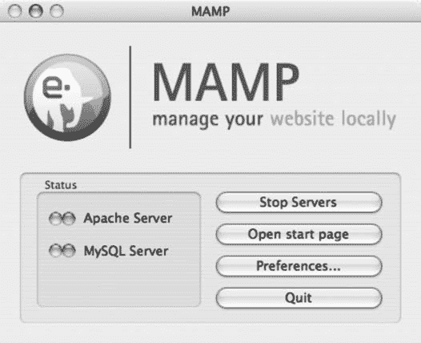

## 附录 A：安装问题

##### 第三步：运行 MAMP 应用程序

您随时可以通过运行 `/Applications/MAMP/MAMP` 应用程序来管理您的本地主机设置。主屏幕如图 A-1 所示。

**图 A-1.** *MAMP 主应用程序屏幕*

点击**启动服务器**后，该程序将维持本地主机环境。您现在可以开始执行 PHP 代码，但需要知道在硬盘上何处访问本地主机。

##### 第四步：配置本地主机根文件夹

默认情况下，`/Applications/MAMP/htdocs` 文件夹中的任何文件都可在本地主机环境中访问。总体来说这也不算太差，但我个人更倾向于将网站放在 `Applications` 文件夹之外。更改此设置只需进入 MAMP 应用程序的偏好设置区域即可。

点击**偏好设置**打开偏好设置区域。点击 **Apache** 选项卡，您会找到一个名为**文档根目录**的字段。其内容应为 `/applications/mamp/htdocs` 或类似路径。点击**选择**将文档根目录更改为其他位置。在此示例中，我将选择 `~/Sites/` 文件夹（如果我的 Mac OS X 用户名是 `dave`，则路径将显示为 `/Users/dave/Sites`）。从现在开始，放置在 `Sites` 文件夹中的任何文件夹或文件都将由 MAMP 本地主机设置执行，而非 Mac OS X 的默认 Web 共享。

##### 第五步：更改本地主机端口

现在仍留在偏好设置区域，点击**端口**选项卡。其中列出了 **Apache 端口**和 **MySQL 端口**。默认情况下，这些字段的值分别设置为 `8888` 和 `8889`。为了更好地模拟典型的远程 Web 服务器，应更改这些端口。在 Apache 端口字段中输入 `80`，在 MySQL 端口字段中输入 `3306`。（您也可以点击**设置为默认 Apache 和 MySQL 端口**按钮。）

由于端口按此方式配置，您现在可以在想要执行脚本和文件时，打开 Safari 并输入 `http://localhost` 来替代 `http://localhost:8888`。此外，在配置需与 MySQL 协同工作的程序时，您只需在服务器设置中输入 `localhost` 即可，无需输入 `localhost:8888`。

##### 第六步：让本地主机更易管理

在 Mac 上搭建本地主机环境，没有比这更简单的方法了。但 MAMP 应用程序的一个缺陷是：必须保持运行，本地主机环境才能工作。因此，如果退出 MAMP，您将无法再通过本地主机运行 PHP 代码。幸运的是，Living-e 提供了一个 Dashboard 小工具，它能执行与 MAMP 应用程序完全相同的操作来保持本地主机活跃。只需启动 `Mamp Control.wdgt` 文件，然后点击**启动服务器**即可激活本地主机。此后它将在后台通过 Dashboard 运行。

---

# 在 Windows 上设置

Windows XP Pro 内置了微软的 Web 服务器，称为 Internet 信息服务 (IIS)。安装 IIS 非常简单。然而，大多数 PHP 和 MySQL 场景更容易通过 Apache Friends 提供的集成式本地主机安装程序 XAMPP 来处理。以下各节概述了在 PC 上安装和配置 XAMPP 的步骤。

##### 第一步：下载软件

您可以从 Apache Friends 网站下载 XAMPP。截至本书出版时，直接链接如下：

[`www.apachefriends.org/en/xampp-windows.html`](http://www.apachefriends.org/en/xampp-windows.html)

您可以下载安装程序应用程序、ZIP 文件或自解压的 7-ZIP 存档。最简单的选项是直接运行安装程序应用程序。因此，向下滚动到页面的下载区域，点击**安装程序**。下载将立即开始。

##### 第二步：运行安装程序

该程序将引导您完成 XAMPP 的安装。它会询问 XAMPP 的目标文件夹，默认位置为 `c:\xampp`。我建议坚持使用此配置，因为您很可能希望 XAMPP 能够访问 C 驱动器的任何区域。点击**下一步**，在下一个屏幕上，将服务部分复选框留空。最后，点击末尾的**安装**按钮。它将解压所有必要文件，并在 `c:\xampp` 文件夹中为您提供一个方便的本地主机环境。

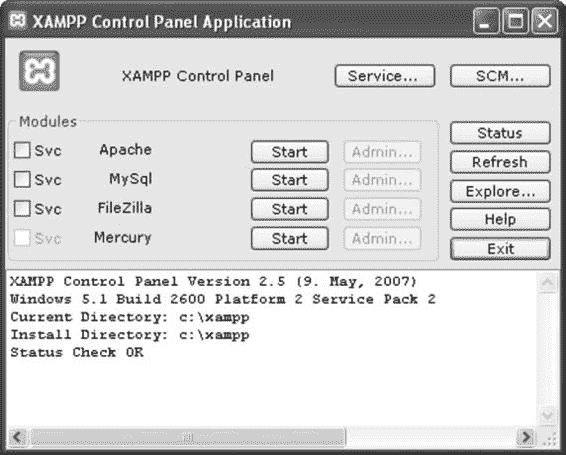

##### 第三步：打开 XAMPP 控制面板

安装完成后，您将进入 XAMPP 控制面板。将来可以通过点击桌面上的快捷方式图标或进入**开始 / Apache Friends / XAMPP / XAMPP 控制面板**来访问此面板。屏幕如图 A-2 所示。

**图 A-2.** *XAMPP 控制面板屏幕*

点击**启动**按钮可启动重要的 Web 服务器服务，如 Apache、MySQL 等。使用**启动**按钮启动 Apache 和 MySQL，然后打开您的 Web 浏览器。在 URL 字段中输入 `http://localhost`。您将进入 XAMPP 欢迎屏幕。

##### 第四步：保护本地主机

遗憾的是，XAMPP 并未预先安装更安全的本地主机环境。在某些方面这可能是件好事，但目前最不想要的就是危及网络或计算机的安全。如果您认为其他用户访问您的本地主机几乎无需担心（这实际上仅在工作环境中，当其他同事使用同一子网或网络时才可能发生），那么您可以跳过此步骤。如果其他用户有任何可能访问您的本地主机，那么您可能只需花点时间让 XAMPP 更安全。在 XAMPP 启动网页的左侧有一个**安全**链接。点击它，会弹出安全信息页面。大多数项目（如果不是全部）将被标记为“不安全”。让我们让它们全部亮起绿灯。

主表下方有一个名为 `http://localhost/security/xamppsecurity.php` 的链接，点击后会进入一些字段，这些字段允许您保护本地主机。更改 MySQL root 密码，然后点击**更改密码**。在 MySQL root 密码字段下方还有另一组字段，用于保护 XAMPP 目录（`.htaccess`）。在那里输入用户名和密码。对于这两项，请确保不要将密码保存在纯文本文件中。

从现在开始，您需要登录才能访问 XAMPP 控制页面。重启 Apache 和 MySQL 以传播您已创建的设置。

---

### 运行 MySQL

用于设置和运行 MySQL 的最强大的基于 Web 的工具是 PHPMyAdmin，它是另一个随 MAMP 和 XAMPP 安装的开源应用程序。两个本地主机环境的启动屏幕都包含指向 PHPMyAdmin 的链接。这是在 MySQL 中开始工作的最快方式，因为我们已经安装了一个本地主机环境，该程序已预先配置好并随时可用。许多开发者更喜欢 PHPMyAdmin 而非其他基于桌面的 MySQL 应用程序，因为它基于 Web 且免费，而且说实话，它是一款出色的应用程序。我本人更喜欢基于桌面的应用程序，因为它们速度快，而且可以避免屏幕刷新，而 PHPMyAdmin 因为是 Web 应用程序，所以无法避免屏幕刷新。

## 在哪里可以找到其他 MySQL 工具

如果您希望使用桌面应用程序来管理数据库，可以在以下各节中找到一些列出的工具。它们可能需要额外的配置才能与您的本地主机环境配合使用。我将列出它们，然后解释一些使其正常工作的必要设置。

##### CocoaMySQL

# 在 Mac 上，运行 MySQL 最简单的免费软件可能是 `CocoaMySQL`。

访问 [`cocoamysql.sourceforge.net`](http://cocoamysql.sourceforge.net) 即可获取该软件。

##### MySQL Query Browser

在 Mac 和 PC 上，`MySQL Query Browser` 是一款可靠易用的免费应用程序，可让你通过图形界面操作 MySQL（请访问 [`dev.mysql.com/downloads/gui-tools`](http://dev.mysql.com/downloads/gui-tools)）。

##### HeidiSQL

此软件与 Mac 上的 `CocoaMySQL` 非常相似，但专为 Windows 构建。在某些方面，其布局比 `MySQL Query Browser` 更易于导航，并且入门所需的 MySQL 技能较少。它同样是开源的，因此尝试一下也无妨（请访问 [www.heidisql.com](http://www.heidisql.com)）。

#### 运行 MySQL 时的典型设置

无论你决定使用哪个应用程序，每个程序在连接到 MySQL 之前都需要一些参数。以下部分重点介绍了让你成功连接所需的常见参数。

##### 主机

这几乎总是 `localhost`，即使你正在设置要在远程服务器上运行的脚本也是如此。如果你尝试访问远程数据库，它可能是该站点的域名，但你需要从虚拟主机提供商处获取详细信息。按照前面概述的配置，只需输入 `localhost`。如果这不起作用，只需确定你计算机的 IP 地址，该地址通常默认为 `127.0.0.1`。

##### 用户和密码

MySQL 支持多个用户和组来管理和维护数据库。登录到你的应用程序并访问必要的区域以添加或更改帐户后，即可添加或更改这些内容。在此示例中，除非你输入了不同的内容，否则用户名和密码都将为 `root`。有时，网络主机可能会为你设置共享主机帐户；在这些情况下，你可能需要为用户名添加前缀，例如 `cake_`。

##### Socket

当 MySQL 运行时，应用程序和 PHP 的连接点称为 *socket*。其默认路径是 `/var/mysql/mysql.sock`，但使用这些快速简便的本地主机设置配置时，此路径将无效。如果你知道 MySQL socket 存储在其默认位置（如大多数主机设置一样），则可以将此设置留空。在本地主机上，你必须指定路径。在 PC 上，如果你按照教程操作，默认设置即可正确连接。在 Mac 上，如有必要，表 A-1 中包含了路径字符串。

**表 A-1.** *将应用程序连接到 MySQL Socket 的路径字符串*

| **Web 服务器软件** | **路径** |
|-------------------|----------|
| Mac OS X Server | `/` |
| MAMP | `/applications/mamp/tmp/mysql/mysql.sock` |
| XAMPP | `/applications/xampp/xamppfiles/var/mysql/mysql.sock` |

##### 端口

MySQL 的默认端口是 `3306`。仅当应用程序要求你输入或你以某种方式将端口号更改为其他值时，才需输入此端口。

# CakePHP 与其他框架的比较

为了让您大致了解 Cake 的表现，本附录将其与其他一些流行的 Web 框架进行了比较。

### PHP 框架

目前，最流行的 PHP 框架包括：

- CakePHP ([www.cakephp.org](http://www.cakephp.org))
- CodeIgniter ([www.codeigniter.com](http://www.codeigniter.com))
- Symfony ([www.symfony-project.org](http://www.symfony-project.org))
- Zend Framework ([`framework.zend.com`](http://framework.zend.com))

这些框架都是用 PHP 语言构建的，但它们的方法和库有所不同。这里也可以列出其他框架（与其他语言相比，PHP 拥有大量且不断增长的框架数量），但我将只关注这四个。毫无疑问，其他框架将会出现，但我预计这些框架将继续成为 PHP 框架市场中最主要的参与者。有关其中一些框架基本信息的比较，请参见表 B-1。

**表 B-1.** *基本信息*

| **框架** | **官方支持组织** | **最新版本¹** |
|-----------|-----------------|---------------|
| CakePHP | Cake 软件基金会 | 1.2 rc1 |
| CodeIgniter | EllisLab | 1.6.2 |
| Symfony | Sensio Labs | 1.1 rc2 |
| Zend Framework | Zend Technologies | 1.5.2 |

¹截至本书写作时。

## 使用各种框架

这些框架均已作为开源项目发布，这意味着大量的开发工作依赖于社区支持。跟踪错误、编写支持文档以及提供通用支持都是需要像您这样的开发者参与的任务。很多时候，无论您选择哪个框架，您都会去在线社区寻求帮助。社区的规模以及可用的在线资源可能会影响您使用该框架的体验。

在以下部分中，我将讨论每个框架在线社区当前的一些特性，以及它们如何帮助用户开发软件。我还将描述使用各种框架时的一些基本观察，并将每个框架与 Cake 进行比较。我认识到关于每个框架还有很多可以讨论的内容，但我的目标是向您概述与 Cake 相关的用户体验，而不是对所有框架进行详尽比较。您将对从一个框架迁移到 Cake 的感觉以及在考虑将 Cake 作为主要开发框架时从何处入手有一个大致了解。

#### CakePHP

在本书中，我提到了一些可以参与 Cake 社区的主要网站。表 B-2 列出了这些网站以及获取更多 CakePHP 信息的其他网站。

**表 B-2.** *CakePHP 社区网站*

| **URL** | **详情** |
|---------|---------|
| [www.cakephp.org](http://www.cakephp.org) | CakePHP 首页 |
| [`bakery.cakephp.org`](http://bakery.cakephp.org) | The Bakery；包含关于 CakePHP 的文章、代码和其他公告 |
| [`groups.google.com/group/cake-php`](http://groups.google.com/group/cake-php) | 讨论组；包含数千个关于该框架的讨论，是解答问题的绝佳资源 |
| [www.cakeforge.org](http://www.cakeforge.org) | 开源 CakePHP 项目的仓库；下载第三方 Cake 应用程序和插件的绝佳资源 |
| [`trac.cakephp.org`](http://trac.cakephp.org) | Cake 的支持网站和跟踪系统；在这里，您可以查看和提交与 Cake 版本相关的工单 |
| [`live.cakephp.org`](http://live.cakephp.org) | The Show；一个围绕 CakePHP 所有内容的实时互联网广播播客 |
| irc://irc.freenode.net/cakephp | 用于讨论 CakePHP 的主要 IRC 聊天室 |

表 B-2 中列出的网站和聊天室活动频繁；迄今为止，Cake 已被下载超过 68 万次，并且仍然是最常被搜索的 Web 框架之一。该讨论组拥有近 9000 名活跃成员，并拥有超过 54,000 条已审核讨论主题的存档。在任何时候，IRC 聊天室通常都有 100 到 200 名访客。

社区中的重复内容被控制在最低限度，因此当您提问或请求支持时，可能会被引导到某个已经讨论过相同主题的帖子或博客。您还会感受到社区中的完美主义倾向。我的意思是：管理 Cake 开发的 Cake 软件基金会本可以在开发框架时走捷径。与其他框架相比，Cake 本可以被认定为 3.0 或 4.0 版本，但它目前仍处于 1.2 版本。这主要是因为它在真正收紧框架，而不是为了快速实现大量方法而仓促开发。这种策略的结果是，Cake 确实比原本更加稳健、成熟且编写得更好，并且您可以信赖它在引入更多高级方法时仍能保持这种稳健性。我绝不是在贬低其内置方法的庞大数量（这足以媲美任何其他框架的函数）；我只是想指出，Cake 的一个关键优势在于其架构，或者换句话说，其方法论——该方法经过精心设计和测试。

也许 Cake 最具竞争力的特性是其用于数据处理`find()`方法。在本书中，我解释了如何使用`find()`模型函数轻松获取数据库记录，而无需编写 SQL 或其他数据源查询。通过有效设置查询条件和其他参数，您可以减少循环和匹配的工作量，因为模型能干净地返回结果集。不幸的是，`CodeIgniter`附带的数据库辅助函数仍要求您编写大部分 SQL 查询。`Symfony`则在模型层使用相当复杂的条件语法来设置查询条件，这仅仅是比 PHP 的数据库函数略有改进。而`Zend Framework`几乎完全依赖您的 SQL 语法知识来使用其数据库适配器类。由于`Cake`的`find()`方法是独立于数据源设计的，它们不必遵循特定的查询语言，这使得通过模型执行查询变得容易得多。

**CodeIgniter**

`CodeIgniter`的社区相比`CakePHP`较小，但拥有良好的在线支持网络。其用户指南（[www.codeigniter.com/user_guide](http://www.codeigniter.com/user_guide)）设计精良，目录导航布局清晰。`Cake`使用的许多概念也被`CodeIgniter`采用，例如`MVC`结构、辅助器、路由、脚手架和缓存。其支持网络非常出色，论坛拥有超过 66,000 个主题和 400,000 篇帖子。然而，那里的许多主题不像`Cake`的讨论组那样直接与代码开发问题相关。从某种意义上说，`CodeIgniter`的论坛和维基更像是`Cake`的讨论组、`Bakery`和`CakeForge`的结合体。基于`CodeIgniter`构建的网站数量少于`Cake`，但`CodeIgniter`起步良好，未来可能会成为一个更流行的框架。

2. 根据其他框架使用 Google 趋势历史工具（[www.google.com/trends](http://www.google.com/trends)）的比较结果。在 PHP 框架中，`CakePHP`的搜索量最高。

`09775appBfinal 7/1/08 9:35 PM Page 292`

**292**

附录 B ■CakePHP 如何与其他框架比较

启动`CodeIgniter`应用程序所需的时间少于设置`Cake`应用程序；然而，`Cake`预装的一些配置方法在`CodeIgniter`中并未提供。例如，要设置路由使其像在`Cake`中那样工作，您需要手动编写一个`.htaccess`文件，以便通过类似的路由引擎传递路径。默认情况下，`CodeIgniter`比`Cake`更轻量级，这是其主要卖点之一。

然而，随着您扩展`CodeIgniter`应用程序，您可能需要在某些地方执行额外的步骤，才能获得与`Cake`相同的功能。

`CodeIgniter`中的`MVC`结构与`Cake`类似。因此，创建模型、视图和控制器的总体流程与您在构建`Cake`应用程序时学到的几乎相同。除了在应用程序中传递数据和命名约定方面的一些细微差异外，运行`CodeIgniter`的体验与`Cake`大体相同。然而，`Cake`的胜出之处在于其强大的核心类、辅助器、路由和数据处理方法。

`Cake`中的可用资源和内置功能更加强大，坦率地说，也更具内聚性。换句话说，当`Cake`开发者完全沉浸于`CodeIgniter`时，可能会感觉自己退了一步，尽管他们无疑会觉得自己身处熟悉的环境。这并不是说`CodeIgniter`不是一个优秀的框架；只是它在将方法分配到资源方面不如`Cake`高效。简而言之，`Cake`的范式更侧重于使模型“臃肿”并分散各种方法；而`CodeIgniter`则导致控制器非常庞大。

**Symfony**

`Symfony`很早就进入了 PHP 框架领域，并一直保持流行。其社区也很庞大，拥有开发者群组、论坛、聊天室、维基等资源。这些在线群组和网站的主要链接都可以在 Symfony 的社区页面（[www.symfony-project.com/community](http://www.symfony-project.com/community)）上找到。

`Symfony`在方法上与`CakePHP`有很大不同。在本书中，我展示了如何通过重命名文件夹并将其放置在服务器或本地主机上来创建一个`Cake`项目。在`Symfony`中，您需要学习通过`Symfony`控制台脚本运行重要命令，就像使用`Bake`一样。您可以通过下载打包文件并配置其文件以在服务器上运行，来手动安装`Symfony`；或者您可以使用`PEAR`让安装脚本处理大部分工作。我发现让`Symfony`正确运行通常比`Cake`需要更多时间，仅仅因为要让服务器和控制台都能与整个框架正常协作，需要执行许多步骤。但是，一旦这些配置完成，启动一个新的`Symfony`应用程序就简单到只需输入一行命令。

成功启动一个`Symfony`应用程序后，您需要使用命令行初始化数据源连接，并执行其他设置任务。生成脚手架也是在控制台中完成的，但最终结果与`Cake`的脚手架类似。构建模型主要通过基于`YAML`的配置结合`symfony`控制台脚本来完成。如果您更喜欢用`YAML`而不是`JSON`或`XML`来配置数据库模式，那么`Symfony`可能很适合您。`Cake`在这方面确实无法比拟，因为它连接数据源的方法不涉及命令行（尽管您可以使用`Bake`编写`database.php`配置文件并构建模型）。

`09775appBfinal 7/1/08 9:35 PM Page 293`

附录 B ■CakePHP 如何与其他框架比较

**293**

在扩展`Symfony`应用程序以容纳更多方法时，许多使`Cake`有效的相同概念也被使用了。从`Cake`转向`Symfony`的学习曲线更陡峭，主要因为`Symfony`提供的优势通常在于其命令行界面。然而，`Symfony`用户应该不会觉得学习`Cake`有多么困难。可能需要一些时间来习惯在控制台中运行较少的命令，但总的来说，您构建`Cake`应用程序所需的步骤不应比构建`Symfony`应用程序更多。

**Zend Framework**

### Zend Framework 与 CakePHP 对比分析

Zend Framework 可以说是为 PHP 构建的第一个框架。其企业赞助商 Zend Technologies 与 PHP 语言本身有着悠久的历史；其创始人包括 PHP 的两位原始作者 Andi Gutmans 和 Zeev Suraski。PHP 之所以成为最流行的 Web 编程语言之一，很大程度上始于 Zend Technologies 及其对语言的贡献。正因如此，Zend Framework 早期就取得了成功，并继续在 PHP 框架市场中扮演重要角色。

就社区支持而言，Zend Framework 可能拥有所有 PHP 框架中最大的在线追随者群体。其文档广泛且详尽，非官方博客和论坛使得几乎任何问题都能获得在线支持。提交到核心的代码都经过严格的测试方法，这使得 Zend Framework 成为一个极其健壮的框架。然而，Zend Framework 更像是一个大型的库集合，而非轻量级的 MVC 框架。例如，其主要库文件夹大小接近 16MB，是 Cake 库大小的三倍多。启动 Zend Framework 需要更多的自定义和配置，而 Cake 则采用了"约定优于配置"的范式。你几乎可以在任何 PHP 项目中使用 Zend Framework（我在第 12 章中演示了如何在 Cake 中使用 Zend 库），但代价是你必须编写或配置大量 Cake 通过其调度方法自动完成的工作。

Zend Framework 不像 Cake、CodeIgniter 和 Symfony 那样有单一开发范式，这吸引了许多开发人员。因此，像 MVC 这样的模式在 Zend Framework 中是可行的，但这需要你手动编写配置方法，而这些方法在 Cake 和其他框架中是自动内置的。在框架如何减少扩展所需代码量方面，Cake 无疑领先于 Zend Framework。学习 Zend Framework 通常比学习 Cake 更耗时，主要是因为框架的设计。对于初学者来说，启动 Zend Framework 的 MVC 变体通常比 Symfony 更困难，更不用说 Cake 了。

诚然，在大多数 PHP 圈子中，Zend Framework 比 Cake 更为人知；可以说它是团队中的老将。但 Cake 正证明自己更像一颗冉冉升起的新星，移动更快且战略上更稳健。鉴于 Cake 有效实现了 MVC 结构及其结构设计，它很可能会继续吸引前 Zend Framework 开发人员，并保持 PHP 框架领域的顶尖地位。

`09775appBfinal 7/1/08 9:35 PM Page 294`

`09775idxfinal.qxd 7/1/08 9:54 PM Page 295`

## 索引

## **符号与数字**

`add()` scaffolded, 59

`$actsAs` property, 257–258, 266

admin, linking with admin views, 179

`: (冒号)`

App controller and, 187

arguments and, 176

`beforeFilter()`, 189–190

magic variables and, 180

callback, 92

route parameters and, 180

`Comments Add`, blocking spam in,

`$components` array, 188

212–215

`.ctp` file extension, 33

`delete()` scaffolded, 59

`<div>` element, 118

Edit, 78–79, 100, 226–228

`$html->link()` function, 35

`edit()` scaffolded, 59

`$post` variable, `debug()` function

Events controller

displaying contents of, 82

Add and Edit, 226–228

`.profile` file, 62

Index, 228–238

`$rss->document()` 函数, 183

`View`, 238–239](#index_split_005.html#p260)

`.rss` 文件扩展名, 182](#index_split_003.html#p204)

`Feed`, 184](#index_split_003.html#p206)

`$scaffold` 属性, 59

`getList()`, 91](#index_split_001.html#p113)

`<span>` 元素, 118](#index_split_002.html#p140)

`index()` 脚手架生成的, 59](#index_split_001.html#p81)

`$this->data`, 75–77](#index_split_001.html#p97)

`Login`, 190–191](#index_split_003.html#p212)

`$this` 标识符, 188

`Logout`, 191](#index_split_003.html#p213)

`$this->params` 数组, 180–181](#index_split_003.html#p202)

命名, 38](#index_split_000.html#p60)

`.thtml` 文件扩展名, 33](#index_split_000.html#p55)

概述, 90](#index_split_001.html#p112)

`_` (下划线) 字符, 33](#index_split_000.html#p55)

插件, 运行, 223](#index_split_004.html#p245)

`__()` 函数, 70](#index_split_001.html#p92)

## 文章控制器

`$xml` 配置数组, 248](#index_split_005.html#p270)

`beforeFilter()`, 189](#index_split_003.html#p211)

403 HTTP 服务器错误, 11](#index_split_000.html#p33)

`Chat`, 220](#index_split_004.html#p242)

`Edit`, 78–79, 100](#index_split_001.html#p100)

### A

`PDF`, 215–216](#index_split_004.html#p237)

访问控制列表, 管理, 265](#index_split_005.html#p287)

## 文章索引, 首页

`ACL` 行为, 265](#index_split_005.html#p287)

应用程序, 使用创建, 274](#index_split_005.html#p296)

`ACL` 组件, 198](#index_split_004.html#p220)

`Read`, 107](#index_split_002.html#p129)

## 操作参数, 传递的参数

请求, 91](#index_split_001.html#p113)

与...比较, 177](#index_split_003.html#p199)

`Text`, 132–133](#index_split_002.html#p154)

## 操作

变量, 在...中使用, 90](#index_split_001.html#p112)

*另见* 索引操作; 视图操作

`View`, 与 `children()` 函数一起使用, 261](#index_split_005.html#p283)

## 添加

`Vote`, 127–128](#index_split_002.html#p149)

`Comments` 控制器, 121–122](#index_split_002.html#p143)

激活管理员路由, 179](#index_split_003.html#p201)

`Events` 控制器, 226–228](#index_split_004.html#p248)

`$actsAs` 属性, 257–258, 266](#index_split_005.html#p279)

文件上传功能, 131–132](#index_split_002.html#p153)

`Posts` 控制器, 75, 100–101](#index_split_001.html#p97)

**295**

09775idxfinal.qxd 7/1/08 9:54 PM 第 296 页

**296**

## 索 引

## 添加操作

`JavaScript` 助手, 包含在 `App` 中

`Comments` 控制器, 121–122](#index_split_002.html#p143)

控制器文件, 116](#index_split_002.html#p138)

`Events` 控制器, 226–228](#index_split_004.html#p248)

使助手可用于整个

`Posts` 控制器

应用程序, 117](#index_split_002.html#p139)

文件上传功能, 131–132](#index_split_002.html#p153)

`submit()` 函数, 124](#index_split_002.html#p146)

概述, 75, 100–101](#index_split_001.html#p97)

`Ajax` 操作, 79](#index_split_001.html#p101)

`save()` 函数, 101–102](#index_split_002.html#p123)

## `ajaxLogin` 参数 (`Auth` 组件),

`添加评论` 表单, 120–121](#index_split_002.html#p142)

194

## 添加链接 (`Users` 控制器), 45](#index_split_000.html#p67)

## `Akismet` 组件 (`Zend Framework`),

## 添加视图, 调整与测试, 259](#index_split_005.html#p281)

213–215

`add()` 脚手架生成的操作, 59](#index_split_001.html#p81)

## 别名, 控制台配置文件, 62](#index_split_001.html#p84)

## `addCrumbs` 函数 (`HTML` 助手),

## `Apache` `AllowOverride` 启动时错误, 12](#index_split_000.html#p34)

148–149

## Apache Friends, XAMPP, 9](#index_split_000.html#p31)

## `add_success.ctp` 文件, 122](#index_split_002.html#p144)

## API 文档, 在线, 138](#index_split_002.html#p160)

## 管理员路由, 178–179](#index_split_003.html#p200)

## 应用控制器文件

`afterFilter()` 回调操作, 92](#index_split_001.html#p114)

操作与, 187](#index_split_003.html#p209)

`Ajax Chat` 插件 (`Pseudocoder`), 安装

组件与，187

`Ajax`框架

- 在`Ajax`中包含 JavaScript 辅助函数，116
- 异步序列与，113–114
- 扩展插件控制器，222
- 框架，114
- 用途，137

用于`jQuery`框架

`app`文件夹

- 安装，131
- 内容，10
- 概述，130
- MVC 结构与，17
- 使用`app`上传文件，131–134
- 结构，29
- 概述，5, 113, 134

用于博客的`App`辅助函数

`Ajax`辅助函数

- `Ajax`辅助函数，包含，164

`添加评论`表单，120–121

`BlogHelper`类，创建，164

`App`辅助函数用于博客与，164

`comments`函数

`Comments`控制器

- 创建，164–166
- `添加`操作，121–122
- 扩展，166–171
- `render()`函数，122–123
- 放置位置，166
- 显示评论，118–119
- `__construct()`函数，171
- 函数，115–116
- 创建，163

`link()`函数

`Helper`文件，创建，163

- 复制 CSS，125–126
- 指定外部辅助函数，164
- 概述，124
- `tags`数组，172
- 在视图中，126

`App`模型

- `Vote`操作，127–128
- `Calendar`插件，224
- `Votes`视图，128
- 扩展插件模型，223
- `options`数组，传递 JavaScript，

`app/config/core.php`文件，全局变量

- 130
- 与，13
- 概述，80, 129, 157

`app/config/database.php.default`文件，

`Prototype`框架

- 编辑，14–15
- 安装，116

`app/config/routes.php`文件，175–176

`AppController`对象，扩展，32

- 注销，191

`app/controllers/components`目录，

- 参数，193–194
- 188
- 参数，设置，189–190

`App::import()`函数

- `password()`函数，190
- 文件名与，209
- 使用`App::import()`包含供应商，207–208
- 嵌套文件夹与，209
- 认证。*参见* `Auth`组件

`Automagic`对输入函数的响应

`app/layouts/rss/default.ctp`文件，183

- (`Form`辅助函数)，154

应用程序

`autoRedirect`参数（`Auth`组件），194

- *另请参阅* 特定应用程序
- 更改文件夹结构以保护安全，277
- 调试，276

**B**

`Bake`

- 设计，创建顺序，19
- 首页
- 管理路由与，179
- 自定义设计，276
- 命令，70
- 设计，273–274
- 自定义视图，70
- 生成动态导航，275

## 索引

### A

`AppModel`类, 21

### 功能

- `attach()`函数, 268
- `attributes`参数, 和表单元素, 150

### B

`Bakery`网站, 219

### 烘焙

- 控制器, 64–67
- 视图, 67

### C

`CodeIgniter`中, 292

### 控制器

- 烘焙, 64–67
- 生成 CRUD 视图
- 启动, 63

### D

### 默认视图

- `default.ctp`文件, 56–59

### E

### 编辑

- 烘焙视图, 68

### F

### 函数

- `disable()`和`detach()`, 267
- `enable()`和`attach()`, 268
- `enabled()`, 268
- 命名, 36
- 概述, 243
- 编写, 270

### H

### “has one”关系, 43

### I

### 个人视图

- 创建, 59–61

### L

### 启动

- 在`Symfony`中, 292
- 概述, 61

### O

### 概述

- 22–23
- 5

### R

### 路由

- 和参数, 176–177

### RSS feed

- 控制器动作, 184
- 创建, 183
- 扩展布局, 183
- Feed 视图, 185

### S

### Symfony 中

- 启动, 292

### T

### 标签

- 在`Tag`模型中使用, 257–258
- 标签表, 255
- 标签视图, 调整, 259–261
- 烘焙`Tags`控制器和视图, 256–257
- 获取相关文章, 261–263
- 函数, 263–265
- 插入字段到标签表, 255–256

### 测试

- 关联, 45–46

### Tree 行为

- 概述, 61

### U

### 上传文件

- 使用 jQuery 和`Form`插件, 131–134

### V

### 视图

- 创建, 59–61
- 概述, 61
- 烘焙, 67

### W

### 编写函数, 270

## 文件路径

- `app/models/post.php`文件, 102
- `app/plugins`目录, 219
- `app/views/helpers`目录, 137
- `app/views/layouts/flash.ctp`文件, 98
- `app/views/posts/rss/feed.ctp`文件, 185
- `app/views/users/login.ctp`文件, 190
- `app/webroot`文件夹, 56

### 其他

### Auth 组件

- 检查用户角色, 192–193
- 登录, 190–191
- `beforeFilter()`控制器动作, 和`Auth`组件, 188, 189–190

### 行为

- ACL 和`Translate`, 265
- 内置, 255
- `Containable`, 265–267
- 自定义, 创建, 268
- 文件, 设置, 268–269
- 在行为中执行回调, 269–270
- 在行为中使用`DataSource`, 269

### 回调

- `beforeFilter()`回调动作, 92
- `beforeRender()`回调动作, 92
- `beforeSave()`函数, 31

### 数组

- `$components`, 188
- `$xml`配置, 248

### 参数

- `associationForeignKey`参数（“has and belongs to many”关系）, 52

### 概述

- 40

### 输出文章为 PDF 文件, 215–216

## 页码

- 62–63
- 09775idxfinal.qxd 7/1/08 9:54 PM Page 298
- 298

# 概述, 55

# 使用, 255

# 使用 Textile 撰写文章, 211

# 使用, 254

# `BlogHelper` 类, 164–165

# “属于”关系, 41–42

# 内置行为, 255

# `bindModel()` 函数, 110](#index_split_002.html#p132)

# 内置组件

# 博客应用示例

# `ACL`, 198

*另请参阅* 博客的 App Helper；评论

# `Auth`

# 博客的章节；`Post` 模型；`Posts`

# 检查用户角色, 192–193

# 控制器；应用于 `Tree` 行为

# 登录, 190–191

# 分类博客文章；`XML`

# 博客应用的 `DataSource`

# 控制器

# `Auth` 组件和, 189

# “属于”关系, 41–42

# `password()` 函数, 190](#index_split_003.html#p212)

# 在评论添加中屏蔽垃圾信息

# 设置用户表, 189

# 动作, 212–215

# `Cookie`, 195–196

# `Calendar` 插件

# `Email`, 196–198

# `Event` 模型, 225

# 概述, 188

# `Events` 控制器, 225–239

# `RequestHandler`, 198

# events 表, 225

# `Security`, 198

# 文件和文件夹，设置, 224

# `Session`

# 控制器动作

# 删除和销毁会话, 195

# 回调, 92

# 辅助函数和, 188

# 请求, 91

# 读写会话变量,

# 变量, 在...中使用, 90

# 194

# 控制器和模型，概述, 89

# 内置 `DataSources`，使用,

# 约定, 47

# 244–245

# 数据库设计, 40–41

# 内置辅助函数

# 解释, 89

# `Ajax`

# “拥有并属于多个”关系,

# 评论添加表单, 120–121

# 48–52

# 博客的 `App` 辅助函数和, 164

# “拥有多个”关系, 44–45

# `Comments` 控制器, 121–123

# 09775idxfinal.qxd 7/1/08 9:54 PM Page 299

# ■索引

# **299**

# 显示评论, 118–119

# ■**C**

# 函数, 115–116

# cake 文件夹, 内容, 10

# `$html->link()` 函数, 124–128

# Cake Software 基金会, 291](#index_split_006.html#p313)

# options 数组，传递 JavaScript

# `cake/libs/controller/components` 文件夹,

# 与...一起使用, 130

# 188

# 概述, 80, 129, 157

# `cake/libs/model/datasources/dbo` 文件夹,

# `Prototype` 框架, 116–117

# 245

# `submit()` 函数, 124

# `CakePHP`

# `Form`

# 优势, 2–3

# `create` 函数, 151–152

# 社区, 6, 290

# `end` 函数, 152

# 约定方面, 29–30

# `input` 函数, 153–157

# CRUD 操作与 Bake 脚本, 5

# `label` 函数, 153

# 可自定义元素, 6

# 概述, 150–151

# 特性, 6, 291

## 索引

`secur[e`函数，152–153
`helper code`，5
HTML `scaffolding abilities`，5
`addCr[umbs`函数，148–149
Calendar helper（日历辅助器）
`[charset`函数，140
事件详情，`render[ing`，234
`[css`函数，140–141
`ev[ents`函数，235
`[div`函数，141
`render[ing`当月第一周，230–231
`docT[ype`函数，141–142
`over[view of`，229–230
`getCr[umbs`函数，148–149
`render[ing`第四周，232
`[image`函数，142–143
`render[ing`第五周和第六周，233
`[link`函数，143–144
`rendering`第二周和第三周，231–232
`[meta`函数，144
`[nestedList`函数，145
`over[view of`，139
`para [function`，146
Calender plugin（日历插件）
`Ev[ent model`，225
`[style`函数，146–147
Events controller（事件控制器）
`tableC[ells`函数，147–148
添加和编辑操作，226–228
`tableH[eaders`函数，147–148
`tags array`，171
`I[ndex`操作，228–238
`over[view of`，225–226
`V[iew`操作，238–239
`events table`，225
`files and folders`，`setting up`，224
`JavaScr[ipt`，157–158
`Number`，158
`callback actions`，92
`over[view of`，138–139
`callbacks`，`performing in behaviors`，269–270
`Paginator`，158–159
`RSS`，159
`calling helper class object`，137
`S[ession`，160
`[charset function (HTML helper)`，140
Chat action（Posts `contr[oller)`，220
`T[ext`，160
检查用户角色，以及 Auth `[component`，192–193
`Time`，161–162
`childCount() function (Tr[ee behavior)`，263
`children() function (Tree behavior)`，261–263
`
09775idxfinal.qxd 7/1/08 9:54 PM Page 300
[**300**]`
■索 引
`chmod() function (F[older utility)`，200
`link()`函数
类
`cop[ying CSS`，125–126
*另请参阅* 实用工具
`over[view of`，124
`AppM[odel`，21
`in View`，126
`BlogHelper`，164–165
`V[ote action`，127–128
`DATABASE_C[ONFIG`，14–15, 244, 248
`Votes view`，128
`File utility`，199–200, 250
`[submit()`函数，124
`I[tem`，21
`creating`用于存储评论的数据表，117–118
`ItemsController`，22
`Set utility`，253
`comments table`，40, 117
`className`参数
`community for CakePHP`，6, 290
“`belongs to`”关系，42
组件（components）

# “has and belongs to many” 关系

*另请参阅* Auth 组件

51

应用控制器和，187

“has one” 关系，43

作为扩展 MVC 结构，241–242

`close()` 函数，251

## 内置

CocoaMySQL，286

ACL，198

## 代码

Auth，189–194

*另请参阅* 列表

Cookie，195–196

辅助器，5

Email，196–198

示例中的 PHP 简写，21

概述，188

CodeIgniter 框架，291–292

`RequestHandler`，198

## 冒号 (`:`)

安全性，198

参数和，176

Session，188, 194–195

魔术变量和，180

控制器和，34, 187

路由参数和，180

## 自定义，创建，205–206

使用命令行界面，12

命名，34

命令行工具，`Bake` 脚本，5

用途，187

命令，`Bake`，70

第三方，204

## 评论模型

创建，117

使用，188

编写供应商文件替代，206

`vote()` 模型函数，127

Zend 框架，216

## 评论添加操作，阻止垃圾评论

`$components` 数组，188

`find()` 函数的条件，95–96

## 评论控制器

添加操作，121–122

创建，118

“belongs to” 关系，42

“has and belongs to many” 关系，52

`render()` 函数，122–123

投票操作，127–128

“has one” 关系，43

`comments()` 函数（`BlogHelper` 类），164–165

## 配置实用工具

199

`Configure::write()` 函数，13

## 博客的评论部分

添加评论表单，120–121

Ajax 和，113–114

#### 配置控制台配置文件以运行 Bake

62–63

冲突的命名，37–38

评论控制器，121–123

`connect()` 函数，250–251

显示评论，118–119

09775idxfinal.qxd 2008 年 7 月 1 日 下午 9:54 第 301 页

■索引

**301**

## `ConnectionManager` 实用工具，实例化

## CRUD 视图，使用 Bake 生成

在行为中使用数据源，269

控制器，烘焙，64–67

控制台配置文件别名，62

视图，烘焙，67

`__construct()` 函数，和数据源，247

`css()` 函数，57, 140–141

`.ctp` 文件扩展名，33

`Containable` 行为，265–267

内容，本地化，204

自定义行为，268–270

自定义组件，205–206

`Controller` 对象，默认行为，30

## 自定义数据源

创建，246

## 数据库配置，设置

## 索引

### C

- `controller`；`Posts` 控制器；`Users` 控制器
  - 248–249
  - 从 XML 文件断开连接，251
    - 操作
    - 解析 XML 文件，252–253
  - 回调，92
  - 请求，91
  - 骨架，从...开始，247–248
  - 变量，在...中使用，90
  - 在模型中使用，249–250
  - 向...添加操作，59–61
  - 查看数据，253–254
- 烘焙，64–67
- XML 数据源文件，创建，246
- 组件和，34，187
- 自定义表达式，和路由
  - 表单辅助函数和，89
  - 参数，181
- 命名，31–32
- 自定义辅助函数，创建
  - 页面，273–274
  - 博客的应用辅助函数，163–171
  - 标签，49, 256–257
  - 概述，162
- 为待办事项列表应用创建
- 编写自定义模型函数，106–109
  - 21–22
- 自定义插件，221–223。*另请参阅*
  - 使用路由，而非，38
- 日历插件
  - 在其中使用供应商内容，208
- 自定义
  - 实用工具和，187
- 烘焙视图，70
- 便捷函数
  - CakePHP，6
  - 数据源和，243
- 应用主页设计
  - `e()`，85
  - 276
  - `pr()`，83
- 辅助函数变量，171–173
- Cake 的约定特性，29–30。*另请参阅*
  - 从头开始创建视图文件
  - 命名约定
- HTML 表单，84–86
- Cookie 组件，195–196
- HTML 辅助函数，83–84
- `copy()` 函数（文件夹实用工具），201
- Cygwin 命令行界面，12, 62
- `create()` 函数
  - 文件实用工具，200

### D

- 数据，验证
  - 表单辅助函数，151–152
  - 内置规则，104–105
  - `create()` 模型函数，77–78
  - 使用多个规则，105–106
- 跨站请求伪造 (CSRF) 攻击
  - Post 模型和，102–104
  - 防止，152
- 数据库模式，设计，15–16
- CRUD 操作，和 CakePHP，5
- 数据库表。*请参阅* 表
  - 302
- 数据库
  - 设计数据库
    - *另请参阅* 设计数据库
    - 特性蔓延和，40
    - 规范化，39
    - 良好设计的重要性，39–40
    - 为待办事项列表应用
    - 概述，39
    - 向其中添加新项，24
    - 表关联
    - 设计与创建，19–20
- `DATABASE_CONFIG` 类，14–15, 244, 248
- 数据源
  - 约定，47
  - 内置数据源，使用，244–245
  - 自定义
  - 创建，246
- 数据库配置，设置
- “属于”关系，41–42
- “拥有并属于多个”关系，48–52
- “拥有多个”关系，44–45
- “拥有一个”关系，43

## 索引

- `tables`，40–41 40–41，248–249
- `testing`，45–46 45–46

### D

- `DataSource`，和`__destruct()`函数，骨架，从...开始，247–248 247–248，247，在模型中使用，249–250
- `detach()`函数，267 267，查看数据，253–254
- `dirsize()`函数（文件夹工具），201 201
- `disable()`函数，267 267
- `disconnecting`，从 XML 文件断开连接，251 251，用于待办事项应用程序，19–20
- `displaying`
  - 评论，118–119 118–119，使用，243–244
  - 菜单，275 275
- `date()`函数，69 69，最新文章
- `debug()`函数，82–83, 253, 260 82–83, 253, 260
- `debugging`，调试应用程序，276 276
- `default layout`，在其中使用 HTML 辅助函数，149–150，投票链接和总票数
- `default ports`，用于 MySQL，287 287，`<div>`元素，118
- `default.ctp`文件，56–59 56–59
- `delete()`函数（文件夹工具），201 201
- `delete()`，脚手架动作，59 59
- `deleting`
  - cookie，196 196
  - 文件夹，201 201
  - 会话，195 195
- `deny`参数（认证组件），193 193
- `dependent`参数，“has many”关系，44 44，“has one”关系，43 43
- `designing`
  - 应用程序，创建顺序，19 19
  - 数据库模式，15–16 15–16
  - 应用程序主页，273–274 273–274
- `div`函数（HTML 辅助函数），141 141
- `docs`文件夹，内容，10 10
- `docType`函数（HTML 辅助函数），141–142 141–142
- `Don’t Repeat Yourself (DRY)` 编程原则，276 276
- `downloading`
  - Cake，10 10
  - Textile，210 210
- `driver`选项，和 DataSources，245 245

### E

- `e()`便捷函数，85 85
- `echo()`函数，55 55
- `Edit` 动作
  - 事件控制器，226–228 226–228
  - 文章控制器，78–79, 100 78–79, 100
  - 编辑视图，调整和测试，259 259
- `edit()`，脚手架动作，59 59
- `editing`
  - 烘焙视图，68 68
  - 表单字段，78–79 78–79
  - 已保存事件，228 228

### F

- `FCKeditor`，作为插件，6 6
- `feature`，功能蔓延，40 40
- `Feed` 动作（文章控制器），184 184
- `Feed` 函数（文章模型），184 184
- `Feed` 视图，185 185
- `fields`，插入到标签表，255–256 255–256
- `fields` 参数，命名，36

Auth 组件, 193

元素函数，输入函数

“属于”关系, 42

(表单助手), 156–157

“拥有并属于多个”关系，元素 52

<div>, 118

“拥有一个”关系, 43

助手与, 166 的比较

文件扩展名
- 命名, 35–36](#index_split_000.html#p57
- `.ctp`, 33
- `.rss`, 182
- `.thtml`, 33](#index_split_000.html#p55

<span>, 118

使用除 `.php` 以外的扩展名解析文件

Email 组件
- 布局, 设置, 196
- 处理过程, 182](#index_split_003.html#p204
- 发送, 196–197](#index_split_004.html#p218
- 创建 RSS 提要, 183–185](#index_split_003.html#p205
- 创建模板, 197–198](#index_split_004.html#p219
- `email()` 函数（Email 组件）, 197–198

供应商的文件名, 209

`enable()` 函数, 268](#index_split_005.html#p290

`enabled()` 函数, 268](#index_split_005.html#p290

文件工具
- `create()` 函数, 200](#index_split_004.html#p222
- 概述, 199](#index_split_004.html#p221
- `read()` 函数, 200, 250](#index_split_004.html#p222
- `write()` 函数, 200](#index_split_004.html#p222

错误消息
- 验证数据时的设置, 103](#index_split_002.html#p125
- 在视图中, 106

文件
- *另请参阅* App 控制器文件；文件扩展名；单个视图文件
- `add_success.ctp`, 122
- `app/config/core.php`, 13
- `app/config/database.php.default`, 14–15
- `app/config/routes.php`, 175–176
- `app/layouts/rss/default.ctp`, 183
- `app/models/post.php`, 102
- `app/views/layouts/flash.ctp`, 98
- `app/views/posts/rss/feed.ctp`, 185
- `app/views/users/login.ctp`, 190
- 用于 Calendar 插件, 224](#index_split_004.html#p246
- 用于自定义插件, 221
- `default.ctp`, 56–59
- `httpd.conf`, 12](#index_split_000.html#p34
- `include`, 18
- `index.ctp`, 69
- `items.php`, 20
- `items_controller.php`, 21–22
- 命名约定, 20
- 以 PDF 格式输出文章, 215–216
- `.profile`, 62

用于 Calendar 插件的 Event 模型, 225](#index_split_004.html#p247

用于 Calendar 插件的 Events 控制器
- Add 和 Edit 操作, 226–228
- Index 操作, 228–238](#index_split_004.html#p250
- 概述, 225–226](#index_split_004.html#p247
- View 操作, 238–239](#index_split_005.html#p260

`events()` 函数，Calendar 助手, 235

用于 Calendar 插件的 events 表, 225](#index_split_004.html#p247

自定义表达式和路由参数, 181

扩展
- 评论函数, 166–171](#index_split_003.html#p188
- 模型, 243](#index_split_005.html#p265
- MVC 结构, 241–242
- `app/webroot`, 56, 277](#index_split_001.html#p78
- `cake`, 10
- `cake/libs/controller/components`, 188
- `cake/libs/model/datasources/dbo`, 245
- 用于 Calendar 插件, 224](#index_split_004.html#p246
- 用于自定义插件, 221
- `public`, 56](#index_split_001.html#p78

`routes.php`, 175

`docs`, 10

使用 jQuery 上传

`layouts`, 56

嵌套的，以及 vendors, 209

`tmp`，准备，13

vendors，10

vendor，编写而非组件

视图，18, 55

206

webroot, 56, 277

XML，从中断开连接，251

`foreignKey` 参数

过滤方法，以及 Containable

“属于”关系, 42

行为, 265–267

“拥有并属于多个”关系

`find()` 函数

52

`Folder` 工具, 201

“拥有一个”关系, 43

Posts 控制器中的索引操作

表单元素，以及选项或属性

条件设置，95–96

参数，150

显示最新帖子, 96

`Form` 助手

`Calendar` 插件 Events 控制器及

`find()` 模型函数，291

227

控制器与，89

`findAll()` 函数，252

创建函数，151–152

`findByYear()` 函数，106](#index_split_002.html#p128)

结束函数，152

`finderQuery` 参数，“拥有多个”

`input` 函数

关系, 45

自动响应, 154

fixtures, 276

元素函数，156–157

将文件夹结构更改为安全

`options` 参数, 155–156

应用程序，277

`Folder` 工具

`type` 选项，154–155

`chmod()` 函数，200

`label` 函数，153

`copy()` 函数，201

概述，35, 76, 84–86, 150–151

`create()` 函数，201

安全函数，152–153

`delete()` 函数，201

表单提交序列

`dirsize()` 函数，201

编辑或更新记录，78–79

`find()` 函数，201

保存表单, 77–78

概述，199

`$this->data` 助手，75–77

`read()` 函数，200

表单

`tree()` 函数，201

添加评论, 120–121

HTML，自定义，84–86

保存，77–78

简单，76

09775idxfinal.qxd 7/1/08 9:54 PM Page 305

■索 引

**305**

403 HTTP 服务器错误, 11

`css()`, 57, 140–141

框架

自定义模型，编写，106–109

优势，1

`DataSource`，`__construct()` 与

Ajax, 5, 113–114, 130–134

`__destruct()`, 247](#index_split_005.html#p269)

CakePHP 作为, 1

`date()`, 69

CodeIgniter, 291–292

`debug()`, 82–83, 253, 260

比较，289–293

`delete()`，`Folder` 工具, 201


`implementing with Cake`，211

`dirsize()`，文件夹工具，201

`Symfony`，292

`div`，HTML 辅助函数，141

`Z`结束，30，212–216，293

`docType`，HTML 辅助函数，141–142

`friendly URLs`，23，177

`echo()`，55

函数

`email()`，197–198

*另请参阅* 辅助函数

`end`，表单辅助函数，152

`addCrumbs`，HTML 辅助函数，148–149

`F`eed，184

Ajax 辅助函数，115–116，124–128

`find()`

`App::import()`

条件，设置，95–96

文件名和，209

显示最新文章，96

在使用供应商时包含，207–208

文件夹工具，201

嵌套文件夹和，209

概述，93

`attach()`，268

参数，94–95

`beforeSav``e()`，31

`find()` 模型，291

行为

`findAll()`，252

`disable()` 和 `detach()`，267

`findByY``ear()`，106

`enable()` 和 `attach()`，268

表单辅助函数，`input()`，76，85

`enabled()`，268

`$html->link()`，35

`bindM``odel()`，110

图像，HTML 辅助函数，142–143

日历辅助函数

`include()`，4，208

`ev``ents()`，235

`initializ``e()`，205–206

`r``ender()`，234

用于国际化，70

日历插件，`r``ender()`，237–238

`isAuthoriz``ed()`，192

回调，在行为中，270

`isS``pam()`，214

字符集，HTML 辅助函数，140

JavaScript 辅助函数，157

`chmod()`，文件夹工具，200

标签，表单辅助函数，153

`close()`，251

`link()`

`comments()`，BlogHelper 类，164–165

Ajax 辅助函数，124–128

`Configure::wr``ite()`，13

HTML 辅助函数，143–144

`connect()`，250–251

概述，83

用于控制器，22

反向路由和，178

便捷性，83，85，243

`loadC``onfig()`，171

`copy()`，文件夹工具，201

meta，HTML 辅助函数，144

`create()`

`mktime()`，230

文件工具，200

`nestedList`，HTML 辅助函数，145

文件夹工具，201

数字辅助函数，158

表单辅助函数，151–152

`paginate()`，93

`cr``eate()` 模型，77–78

分页辅助函数，158–159

`09775idxfinal.qxd 7/1/08 9:54 PM Page 306`

**306**

■索 引

para，HTML 辅助函数，146

`tree()`，文件夹工具，201

`password()`，身份验证组件，190

`unbindM``odel()`，109–110

PHP，名称，38

`__()`，70

`read()`

`v``ote()` 模型，127


## 索引

### A

- `File utility`，第 200、250 页
- `voteDownLink()`，第 169 页
- `Folder utility`，第 200 页
- `voteUpLink()`，第 168 页
- `Posts 控制器中的 View 操作`，第 97 页
- `write()`，`File utility`，第 200 页
- `read()` 模型，第 81 页
- `writing`
- `receiver`，第 150 页
- `行为函数`，第 270 页
- `redirect()`，第 99–100 页
- `自定义模型函数`，第 106–109 页
- `render()`，第 80、122–123、234、237 页
- `XML 助手`，第 162 页
- `requestAction()`，第 91 页
- `xmlFindAll()`，第 249 页
- `Router::connect()`，第 175–176 页
- `Router::parseExtensions()`，第 182 页

### B

- `$rss->document()`，第 183 页
- `generateTreeList()` 函数（`Tree 行为`），第 264 页
- `RSS 助手`，第 159 页
- `save()`，第 31、101–102 页
- `generating`
- `save()` 模型，第 77–78 页
- `使用 Bake 生成 CRUD 视图`，第 64–67 页
- `secure`，`Form 助手`，第 152–153 页
- `首页动态导航`，第 275 页
- `send()`，第 196–197 页
- `getCrumbs` 函数（`HTML 助手`），第 148–149 页
- `Session 助手`，第 160 页
- `Set::extract()`，第 236–237、253 页
- `getList()` 操作，第 91 页
- `setFlash()`，第 74、98–99 页
- `getParentNode()` 和 `getPath()` 函数（`Tree 行为`），第 264 页
- `Set::reverse()`，第 253 页
- `startup()`，第 205–206 页
- `全局变量`，第 199 页
- `strftime()`，第 230 页
- `Gutmans`、`Andi`，第 293 页
- `strtotime()`，第 69 页
- `style`，`HTML 助手`，第 146–147 页

### H

- `submit()`，第 124 页
- “has and belongs to many” 关系（`应用与测试`，第 48–51 页；`参数`，第 51–52 页）
- `tableCells`，`HTML 助手`，第 147–148 页
- `tableHeaders`，`HTML 助手`，第 147–148 页
- “has many” 关系，第 44–45 页
- “has one” 关系，第 43 页
- `text 助手`，第 160 页
- `Time 助手`，第 161–162 页
- `hash 插入技术`，第 152 页
- `Tree 行为`
  - `childCount()`，第 263 页
  - `children()`，第 261–263 页
  - `generateTreeList()`，第 264 页
  - `getParentNode()` 和 `getPath()`，第 264 页
  - `moveUp` 和 `moveDown`，第 264 页
  - `概述`，第 263、265 页
  - `recover()`，第 264 页
  - `removeFromTree()`，第 264 页
  - `setParent()`，第 265 页
  - `setup()`，第 265 页
  - `verify()`，第 265 页
- `hashed 密码`，与 `Auth 组件`，第 190 页
- `hashPasswords` 参数（`Auth 组件`），第 193 页
- `HeidiSQL`，第 286 页
- `助手代码`，第 5 页
- `助手`（另请参阅 `Ajax 助手`）
  - `内置`，第 138–139 页
  - `Calendar`
    - `事件详情`，`渲染`，第 234 页
    - `events 函数`，第 235 页
    - `月首周`，`渲染`，第 230–231 页
    - `命名`，第 35 页
    - `Number`，第 158 页
    - `整体概览`，第 229–230 页
    - `整体概览`，第 86–87 页
    - `第四周`，`渲染`，第 232 页
    - `Paginator 类`，第 158–159 页
    - `第五周和第六周`，`渲染`，第 233 页
    - `RSS`，第 159 页
    - `第二周和第三周`，`渲染`，第 231–232 页
    - `Session`，第 160 页
    - `指定外部辅助函数`，第 164 页
    - `创建自定义`
    - `语法`，第 86 页
    - `博客的 App 辅助函数`，第 163–171 页
    - `文本`，第 160 页
    - `整体概览`，第 162 页
    - `第三方`，第 86 页
    - `自定义变量`，第 171–173 页
    - `$this->data`，第 75–77 页
    - `与元素对比`，第 36 页，第 166 页
    - `时间`，第 161–162 页
    - `作为扩展 MVC 结构`，第 241–242 页
    - `视图与`，第 187 页
    - `表单`
    - `XML`，第 162 页
    - `日历插件`，`事件控制器`
    - `应用程序首页`
    - `与`，第 227 页
    - `自定义设计`，第 276 页
    - `控制器与`，第 89 页
    - `设计`
    - `创建函数`，第 151–152 页
    - `使用 Pages 控制器`，第 273–274 页
    - `结束函数`，第 152 页
    - `使用 Posts 索引操作`，第 274 页
    - `输入函数`，第 153–157 页
    - `动态导航`，`生成`，第 275 页
    - `标签函数`，第 153 页
    - `自定义 HTML 表单`，第 84–86 页
    - `整体概览`，第 35 页，第 76 页，第 84–86 页，第 150–151 页
    - `HTML 辅助函数`
    - `安全函数`，第 152–153 页
    - `添加面包屑函数`，第 148–149 页
    - `HTML`
    - `字符集函数`，第 140 页
    - `添加面包屑函数`，第 148–149 页
    - `CSS 函数`，第 140–141 页
    - `字符集函数`，第 140 页
    - `DIV 函数`，第 141 页
    - `CSS 函数`，第 140–141 页
    - `文档类型函数`，第 141–142 页
    - `DIV 函数`，第 141 页
    - `获取面包屑函数`，第 148–149 页
    - `文档类型函数`，第 141–142 页
    - `图片函数`，第 142–143 页
    - `获取面包屑函数`，第 148–149 页
    - `链接函数`，第 143–144 页
    - `图片函数`，第 142–143 页
    - `元数据函数`，第 144 页
    - `链接函数`，第 143–144 页
    - `嵌套列表函数`，第 145 页
    - `元数据函数`，第 144 页
    - `整体概览`，第 83–84 页，第 139 页
    - `嵌套列表函数`，第 145 页
    - `段落函数`，第 146 页
    - `整体概览`，第 83–84 页，第 139 页
    - `样式函数`，第 146–147 页
    - `段落函数`，第 146 页
    - `表格单元格函数`，第 147–148 页
    - `样式函数`，第 146–147 页
    - `表格表头函数`，第 147–148 页
    - `表格单元格函数`，第 147–148 页
    - `标签数组`，第 171 页
    - `表格表头函数`，第 147–148 页
    - `在默认布局中使用`，第 149–150 页
    - `标签数组`，第 171 页
    - `$html->link() 函数`，第 35 页
    - `在默认布局中使用`，第 149–150 页
    - `HTTP Socket 工具`，第 201–202 页
    - `安装`，第 137–138 页
    - `httpd.conf 文件`，与 `Apache AllowOverride`
    - `JavaScript`，第 116 页，第 157–158 页
    - `错误`，第 12 页

### I

- `overview`（概述），第 76、85、153 页
- 记录的 `id` 值，第 20 页
- `type` 选项，第 154–155 页
- 伊格莱西亚斯，马里亚诺，第 276 页
- 向标签表中`inserting`（插入）字段，第 255–256 页
- `image` 函数（`HTML` 辅助器），第 142–143 页

## installing（安装）

- `include` 文件，以及 `MVC` 结构，第 18 页
- `helpers`（辅助器），第 137–138 页
- `include()` 函数，第 4、208 页
- `jQuery` 和 `Form` 插件，第 131 页

## including（包含）

- `Textile`，第 210–211 页
- `vendors`（供应商文件），第 207–208 页

## localhost server（本地服务器）

- 在计算机上进行配置，第 281–282 页
- 在 Mac OS X 上进行设置，第 282–284 页
- 在 Windows 上进行设置，第 284–286 页

## MySQL，运行

- 设置，第 287 页
- 工具，第 286 页

## Index action（索引动作）

- `Events` 控制器
- `Calendar` 辅助器，第 229–235 页
- 完成，第 236–238 页
- 概述，第 228 页
- 用于 Ajax 的 `Prototype` 框架，第 116 页
- `Posts` 控制器，`find()` 函数
  - 设置 `conditions`（条件），第 95–96 页
  - 显示最新文章，第 96 页
  - 概述，第 93 页
  - `parameters`（参数），第 94–95 页
- 框架
  - 列出，第 92 页
  - `paginate()` 函数，第 93 页
  - `recursive` 属性，第 93 页

## Index action view（索引动作视图）

- 创建，第 59 页
- 启动，第 60 页
- 其中的文章列表，第 69 页
- `index()` 脚手架动作，第 59 页

## 调整索引视图，第 96 页

- `index.ctp` 文件，第 69 页

## 独立视图文件

- 为控制器添加动作，第 59–61 页
- 创建，第 59 页
- 从头开始自定义
  - HTML 表单，第 84–86 页
  - `HTML` 辅助器，第 83–84 页
  - 编写
    - `debug()` 函数，第 82–83 页
    - 概述，第 80–82 页
- `initialize()` 函数，创建自定义组件，第 205–206 页
- 初始化 Ajax 辅助器，第 116 页
- `input()` 函数（`Form` 辅助器）
  - 自动响应，第 154 页
  - 元素函数，第 156–157 页

## internalization（内部化/国际化）

- 相关函数，第 70 页
- 工具的标准，第 202 页

## 控制反转，第 1 页

- `isAuthorized()` 函数，第 192 页
- `isSpam()` 函数（`Akismet` 组件），第 214 页
- `Item` 类，第 21 页
- 创建 `Item` 模型，第 20–21 页
- `item.php` 文件的代码，第 20 页
- items 表与脚手架功能，第 23–24 页
- `ItemsController` 类，第 22 页
- 创建 `items_controller.php` 文件，第 21–22 页

### J

- `JavaScript`，通过选项数组传递（`Ajax` 辅助器），第 130 页
- `JavaScript` 辅助器
  - 在 `App` 控制器文件中包含，第 116 页
  - 概述，第 157–158 页
- `joinTable` 参数（“多对多”关系），第 51 页
- `jQuery` 框架用于 Ajax，第 130–131 页

### L

- `element` 函数，第 156–157 页
- `label` 函数（`Form` 辅助器），第 153 页
- `options` 参数，第 155–156 页
- 语言，切换，第 2 页

## 启动

- `app/layouts/rss/default.ctp` 文件，第 183 页
- `Bake`，第 63 页
- `app/models/item.php` 文件，第 20 页

## Cake

- `app/plugins/calendar/views/events/`
- `Apache AllowOverride` 错误，第 12 页
- `add.ctp` 文件，第 227 页
- 概述，第 10–11 页
- `app/plugins/calendar/views/events/`
- 权限错误，第 11 页
- `edit.ctp` 文件，第 227 页
- 待办事项列表应用程序，第 22–23 页

## `app/views/elements/menu.ctp`

### 布局

- 元素，第 275 页
- `default.ctp` 文件，第 56–59 页
- `app/views/posts/rss/feed.ctp` 文件，第 185 页
- 命名，第 36 页
- `app/views/users/login.ctp` 文件，第 190 页
- 插件，使用，第 223 页

## `Auth` 组件

### `layouts` 文件夹，内容，第 56 页

- `beforeFilter()` 动作中的参数，第 189 页
- `limit` 参数
- “has and belongs to many” 关系，第 52 页
- 在 `Users` 控制器中，第 191 页
- “has many” 关系，第 44 页
- `Posts Add View` 的 `Baked` 内容文件，第 84 页

## `link()` 函数

- 基本组件文件，第 205 页

## `Ajax` 助手

- `beforeFilter()` 回调动作，第 92 页
- 复制 CSS，第 125–126 页
- 行为文件示例，第 268 页
- 概述，第 124 页
- “belongs to” 关系，第 42 页
- 在 `View` 中，第 126 页

## `Calendar` 助手

- `Vote` 动作，第 127–128 页
- 关闭 `render()` 函数，第 234 页
- `Votes` 视图，第 128 页
- 事件详情，第 234 页

## `HTML` 助手，第 143–144 页

- `events` 函数，第 235 页
- 概述，第 83 页
- 月份第一周，第 230 页
- 反向路由，第 178 页
- 初始化变量，第 229 页
- 链接管理员操作和视图，第 179 页
- 第四周，第 232 页
- 使用 `HTML` 助手管理链接，第 139 页
- 第五周和第六周，第 233 页
- Linux，和命令行界面，第 12 页
- 第二周和第三周，第 231 页

## 列表

### `Calendar` 插件，`Index` 视图内容，第 237 页

### `Add` 动作

- 文件上传功能，第 131 页
- `CalendarEvent` 模型，第 225 页
- `Posts` 控制器，第 101 页
- `chats` 表（用于 `Ajax Chat` 插件），第 220 页

### `Add Comments` 表单，第 120 页

- `close()` 函数，第 251 页

### `Add` 视图，从头重建，第 85 页

### `Comment` 模型

- 创建，第 117 页
- `Ajax` 助手的 `submit()` 函数，第 124 页
- `vote()` 模型函数，第 127 页

### `Akismet` 组件

- 在 `Comments` 的 `Add` 动作中，第 214 页
- `Add` 动作，第 121 页
- 导入，第 213 页
- 创建，第 118 页

### `App` 助手

- 创建，第 163 页
- `tags` 数组，第 172 页

# `comments()` 函数

- `app/controllers/items_controller.php`
- `BlogHelper` 类，164–165
- `file`，21
- `options` 数组，167–168

#### 组件

- `Index view`，创建，59
- 在控制器中包含 `model`，命名，32
- `$components` 数组，188
- 在控制器的 `Add` 和 `Edit` 操作中的 `parent_id` 选择菜单，188
- `views`，259
- `startup()` 函数，205
- `插件控制器` 扩展 `App` `ConnectionManager` 工具，控制器，222
- 在 `插件文件结构` 中`实例化 DataSource`，221
- `behavior` 使用，269
- `插件布局`，在 `插件控制器` 中使用，`控制器动作`，基础，90 223
- `controller class`，命名，32
- `插件模型` 扩展 `App model`，223

## 文章模型

- 默认布局的 `CSS 代码`，58
- 投票工具的 `CSS 标记`，125
- 其中的 `自定义 findByYear()` 函数，106
- `data.xml` 文件，要添加的内容，252
- `Feed` 函数，184
- “has and belongs to many” 关系，49
- `isAuthorized()` 函数，192
- 概述，102
- `validation rules` 规则，105

## 数据库配置文件

- 添加 `localhost` 设置到，15
- 代码，14
- `DATABASE_CONFIG` 类，244

## DataSource 文件

- 主框架，247

## 文章控制器

- `Add 动作`，75
- 烘焙，65–67
- `Edit 动作`，78–79
- 英文语言文件内容，203
- `Feed 动作`，184
- `Index 动作`，添加，59
- `isAuthorized()` 函数，192
- `PDF 动作`，215–216
- `Read 动作`，107
- `Text 动作`，132
- `View 动作`，73
- `View 动作的视图`，239

## 事件控制器

- `添加和编辑动作`，226
- `Index 动作`，236
- `初始内容`，225
- `View 动作`，238

## 文章视图

- 将 `评论` 部分添加到，118
- 其中的 `评论循环`，119
- `form`，简单，76
- `PostsController` 文件，45
- `posts_tags` 表，创建，49

### 其他

- “has many” 关系，分配，44
- “has one” 关系，分配，43
- `.profile` 文件，编辑，62
- `HTML 助手` `link()` 函数，83
- 将 `text` 参数替换为 `投票标签`，172
- `tags` 数组，171
- 从 `findByYear()` 函数返回的数组，107
- 在默认布局中使用，149
- `HTML 布局`，56
- `SQL 表结构`，40

## 索引

### A

- `Auth` 组件与，第 190–191 页
- `loginAction` 参数（`Auth` 组件），第 193 页
- `loginError` 参数（`Auth` 组件），第 194 页
- `loginRedirect` 参数（`Auth` 组件），第 193 页
- `Logout` 操作（`Users` 控制器），第 191 页

### C

- `Comments` 视图，为其提供关联评论，第 119 页
- `controller`（`Posts`），其中的 `View` 操作，第 97 页
- `controller`（`Tags`），第 311 页
- `cr[eating]`（创建），第 49 页

### D

- `Data`（`$this->data`），其内容，第 260 页

### F

- `findAll()` 函数（`xmlFindAll()`），第 249 页
- `function`（`meta()`），第 144 页
- `function`（`mktime()`），第 230 页
- `function`（`unbindModel()`），第 109 页
- `function`（`voteDownLink()`），第 169 页
- `function`（`voteUpLink()`），第 168 页

### H

- `hasAndBelongsToMany` 关联关系，第 257 页
- `helper`（`HTML`），使用其管理链接，第 139 页
- `host`（`localhost`），在其上运行 Cake，第 9–12 页

### I

- `importing` 工具与实例化类，第 211 页
- `Posts` 控制器中的 `Index` 操作，第 199 页
- `initial`（初始），第 92 页

### L

- `L10n` 工具，第 202–203 页
- `links`（链接）与 `HTML` 助手，第 139 页
- `Living-e`（`MAMP`），第 9 页
- `loadConfig()` 函数，第 171 页
- `localhost` 环境，在其上运行 Cake
  - 下载，第 10 页
  - 启动，第 10–11 页
  - 概述，第 9 页
  - 故障排除，第 11–12 页
- `localhost` 服务器，在计算机上配置，第 281–282 页
  - 为 Mac OS 设置，第 282–284 页
- `loginAction` 参数（`Auth` 组件），第 193 页
- `loginError` 参数（`Auth` 组件），第 194 页
- `loginRedirect` 参数（`Auth` 组件），第 193 页
- `Logout` 操作（`Users` 控制器），第 191 页

### M

- `Mac OS` 命令行界面与，第 12 页
- `MAMP` 主应用程序屏幕，第 283 页
- `managing`（管理）访问控制列表，第 265 页
- `MVC` 结构与，第 17 页

### P

- `Posts` 控制器
  - `Index` 操作在，第 199 页
  - `View` 操作在，第 97 页

### R

- `remote host`（远程主机），修改 `webroot/index.php` 文件以适配，第 277 页
- `revised`（修订），第 93 页
- `users` 表中的 `role` 字段，第 192 页

### T

- `Tags` 控制器，第 311 页
- `tags` 表
  - 创建，第 48 页
  - 包含必填字段，第 255 页
- `Textile` 类，启动新的，第 211 页
- `Textile` 作为供应商，包含，第 210 页
- `Text` 视图，第 133 页
- `Tree` 行为，第 257 页

### U

- `unbindModel()` 函数，第 109 页
- `Users` 控制器
  - `Logout` 操作，第 191 页
  - `Login` 操作，第 190–191 页

### V

- `vendors`（供应商）
  - 包含，第 207 页
  - 将 `Textile` 作为供应商包含，第 210 页
  - 在控制器中使用，第 208 页
- `View` 操作
  - 调整后，为 `Comments` 提供关联评论，第 119 页
  - 与 `children()` 函数结合，第 261 页
  - 在 `Posts` 控制器中，第 97 页
  - 视图文件，第 80 页
- `View` 代码，用于显示投票链接和总票数，第 126 页
  - 视图，简化版，第 83 页
- `Votes` 视图，创建，第 128 页
- `voteDownLink()` 函数，第 169 页
- `voteUpLink()` 函数，第 168 页

### W

- `webroot/index.php` 文件，为远程主机修改，第 277 页
- `web sites`（网站）内容，第 204 页
  - 本地化，第 203 页

### X

- `$xml` 配置数组，第 248 页
- `XML` 数据源，第 246 页，第 250 页
- `xmlFindAll()` 函数，第 249 页

# 模型函数

- 在 Mac OS X 上，第 282–284 页
- `create()` 函数，第 77–78 页
- 在 Windows 系统上，第 284–286 页
- `read()` 函数，第 81 页
- 实用程序的本地化标准，第 202 页
- `save()` 函数，第 77–78 页
- `Model` 对象的默认行为，第 30 页

### N

模型-视图-控制器 (MVC) 结构
*另见* 数据源；帖子模型
- 优点，第 18 页
- Cake 区域，第 18 页
- CodeIgniter，第 292 页
- 默认行为，第 30–31 页
- 扩展，第 241–242 页
- 登录过程，第 17 页
- 概述，第 3–5、17、241 页
- 待办事项列表应用，第 19 页

命名约定
- 最佳实践，第 37–38 页
- 控制器，第 31–32 页
- 文件，第 20 页
- 模型，第 32–33 页
- 多词名称，第 33 页

首页导航的生成
- 动态导航，第 275 页
- 为待办事项列表应用创建导航，第 20–21 页

- `moveUp` 和 `moveDown()` 函数（树形行为），第 264 页
- `nestedList()` 函数（HTML 辅助函数），第 145 页

嵌套文件夹与供应商，第 209 页
新增项目界面，第 24 页
新增帖子界面，第 45 页
多词名称，第 33 页
使用多重规则验证数据，第 105–106 页
数据库规范化，第 39 页
数字辅助函数，第 158 页

### O

- `on` 参数与数据验证，第 104 页
- “一对多”（“拥有多个”）关系，第 44–45 页
- “一对一”（“拥有一个”）关系，第 43 页

在线社区
- CakePHP，第 6、290 页
- Symfony，第 292 页

作为开源项目的 PHP 框架，第 290 页
选项数组
- Ajax 辅助函数，传递 JavaScript，第 130 页
- `BlogHelper` 类的 `comments()` 函数，第 166–168 页

选项参数
MySQL
- 连接设置，输入，第 14–15 页
- 运行设置，第 287 页
- 工具，第 286 页

MySQL 数据源，扩展模型，第 244 页
MySQL 查询浏览器，第 286 页

## 索引

### A

- `form` 元素及，150
- `input` 函数（`Form` 辅助器），155–156

### O

- `order` 参数
- 远程设置路径，277

### P

- 页面请求，简单
- `paginate()` 函数，`Posts` 控制器中的 `Index` 操作，93
- `Paginator` 辅助器，158–159
- `para` 函数（`HTML` 辅助器），146
- 参数
  - *另请参阅具体参数*
  - `Auth` 组件，189–190，193–194
  - `find()` 函数，94–95
  - `form` 元素及，150
  - 与之相比的传递参数，177
  - `read()` 函数，97
  - `redirect()` 函数，99
  - 路由，180–181
  - `save()` 函数，101
  - 分离，180
  - `setFlash()` 函数，98
- 解析
  - 处理扩展名不为 `.php` 的文件的过程，182
  - XML 文件，252–253
- `Pass` 键，及路由参数，181
- `passedArgs` 数组，176
- 传递
  - 使用选项数组的 JavaScript（`Ajax` 辅助器），130
  - 通过路由引擎传递变量，180–181
- `password` 函数()，`Auth` 组件，190
- 连接应用程序到 `MySQL` 套接字的路径字符串，287
- PDF 文件，将文章输出为 PDF，215–216
- 性能问题，及 `App` 控制器
  - 文件及，137
- 权限，使用 `Folder` 工具更改，200
  - 启动时错误，11
- 从头自定义视图文件，83–84
- `debug()` 函数及，82–83
- `View` 操作及，73–75，80，82
- `PHP` 对象，扩展，30
- `Pages` 控制器，为应用程序创建主页，273–274
- `PHP` 框架。*请参阅* 框架
- PHP 函数名称，38
- PHP 语言，优势，2–3
- PHP 脚本，典型流程，3
- PHP 速记写法
  - `echo()` 函数，55
  - 在代码示例中，21
- `PHPMyAdmin`，286
- 插件
  - `Ajax Chat`，219–220
  - `Calendar`
    - `Event` 模型，225
    - `Events` 控制器，225–239
    - 事件表，225
    - 文件和文件夹，设置，224
  - 自定义
    - 创建，221
    - 布局，使用，223
    - 元素的命名约定，221–223
    - 运行操作，223
  - 描述，219
  - `FCKeditor`，6
  - 相关资源，219
  - `RSS feed`，创建，183–185
  - 第三方，219–220
- 端口，`MySQL` 的默认端口，287
- `Post` 模型
  - `Feed` 函数，184
  - `isAuthorized()` 函数，192
  - 验证数据
    - 内置规则，104–105
    - 使用多条规则，105–106
    - 使用多重验证，103
  - 概述，102–103
  - 关于参数，104
  - 必填字段，103
  - 设置错误信息（`setting error messages`），103
  - 为[ ]编写自定义函数（`writing custom functions for`），106–109
- `Pseudocode`r Ajax Chat 插件（`Pseudocoder Ajax Chat plugin`），219–220
- `xmlFindAll()`函数（`xmlFindAll() function`），249
- 公共文件（`public files`），56
- `$post`变量，`debug()`函数
  - 显示其内容（`displaying contents of`），82

### Q

- Posts 控制器（`Posts controller`）
  - 修剪查询结果（`query results, trimming`）
  - Add 动作（`Add action`）
    - `bindModel()`函数（`bindModel() function`），110
    - 文件上传功能（`file upload feature`），131–132
    - `unbindModel()`函数（`unbindModel() function`），109–110
  - 概述（`overview of`），75, 100–101
  - `save()`函数（`save() function`），101–102

### R

- 烘烤（`baking`），65–67
- Read 动作（Posts 控制器）(`Read action (Posts controller)`), 107
  - 关闭视图烘烤（`baking views off`），67
- `read()`函数
  - `beforeFilter()`动作（`beforeFilter() action`），189
  - File 工具（`File utility`），200, 250
  - Chat 动作（`Chat action`），220
  - Folder 工具（`Folder utility`），200
  - Edit 动作（`Edit action`），78–79, 100
  - Posts 控制器中的 View 动作（`View action in Posts controller`），97
  - Feed 动作（`Feed action`），184
- `read()`模型函数（`read() model function`），81
- Index 动作（`Index action`）
  - 读取
    - 添加（`adding`），59
    - Cookie，196
    - `find()`函数（`find() function`），93–96
    - 全局变量（`global variables`），199
    - 列表（`listing`），92
    - 会话变量（`session variables`），194
    - `paginate()`函数（`paginate() function`），93
    - XML 文件（`XML files`），250–251
- `recursive`属性（`recursive attribute`），93
- 接收器函数（`receiver functions`），150
- `isAuthorized()`函数（`isAuthorized() function`），192
- 最近的文章，使用`find()`函数显示
  - PDF 动作（`PDF action`），215–216
  - 函数（`function`），96
  - Read 动作（`Read action`），107
- 记录（`records`），`id`值，20
  - `Router::connect()`函数和，176
- `recover()`函数（Tree 行为）(`recover() function (Tree behavior)`), 264
  - Text 动作（`Text action`），132–133
- `recursive`属性（Posts 控制器中的 Index 动作）(`recursive attribute (Index action in Posts controller)`), 93
  - 与`children()`函数一起使用（`with children() function`），271
- `redirect()`函数（Posts 控制器中的 View 动作）(`redirect() function (View action in Posts controller)`)
  - 概述（`overview of`），73, 97
  - 控制器（`controller`），99–100
  - `read()`函数（`read() function`），97
- 冗余与 MVC（`redundancy and MVC`），4
- `redirect()`函数（`redirect() function`），99–100
- 在远程主机上运行应用程序（`remote host, running application on`），277–278
  - `setFlash()`函数（`setFlash() function`），98–99
- Posts Index 动作，为应用程序创建主页（`Posts Index action, creating home page for application with`），274
- 博客的文章表，创建（`posts table for blog, creating`），40
- `render()`函数
  - `pr()`便利函数（`pr() convenience function`），83
  - Calendar 助手（`Calendar helper`），234
  - `.profile`文件（`.profile file`），62
  - Calendar 插件（`Calendar plugin`），237
- 用于 Ajax 的 Prototype 框架（`Prototype framework for Ajax`）
  - Comments 控制器（`Comments controller`），122–123
  - Ajax 助手和（`Ajax helper and`），114
  - 概述（`overview of`），80
  - 安装（`installing`），116
- 请求处理，HTTP Socket 工具（`request handling, HTTP Socket utility`），201–202
- `requestAction()`函数（`requestAction() function`），91
- `RequestHandler`组件（`RequestHandler component`），198
  - JavaScript 助手，包含在 App 控制器文件中（`JavaScript helper, including in App controller file`），116
  - 使助手对整个应用程序可用（`making helpers available for whole application`），117
- `requesting controller actions`，91
- `Prototype JavaScript library`，以及 `Ajax Chat`
- `required fields`，当验证数据时，103
- `plugin`，219
- `resolving URLs`，23

## 索引

### R

- `resources`，命名
  - `plugin actions`，223
  - `behaviors`，36
  - `Textile`，211
  - `components`，34
- `running Cake`
  - `datasources`，36
  - `database schema`，设计，15–16
  - `elements`，35–36
- 在 `localhost` 环境上
  - `helpers`，35
  - `downloading`，10
  - `layouts`，36
  - `launching`，10–11
- 扩展 MVC 结构的资源
  - `overview of`，9
  - 241–242. *另请参阅* behaviors；`DataSources`
- MySQL 连接设置
  - `entering`，14–15
- `reverse routing`
  - `URL lookups and`，177
  - `setup routines`，13–14
  - `verbose linking`，178
- `role` 字段，添加到 `users` 表，192

### S

- `Router::connect()` 函数，175–176
- `Sanitize utility`，204
- `Router::parseExtensions()` 函数，182
- `sav()` 函数，31，101–102
- `routes`，使用，而不是 `controllers`，38
- `sav()` 模型函数，77–78
- `routes.php` 文件，175
- `saving forms`，77–78
- `routing`
  - `$scaffold` 属性，59
  - `admin`，178–179
  - `scaffolded actions`，59–61
  - `app/config/routes.php` 文件，175–176
  - `scaffolding`
  - `arguments and`，176–177
  - `creating` 用于待办事项列表应用，23–24
  - `overview of`，175
  - `overview of`，5–6
  - `parameters`，180–181
- `scaffolding` 功能
  - `moving beyond`，52
  - `testing associations with`，45–46
- `.php` 扩展名之外的文件解析
  - `process of`，182
- RSS 订阅源
  - `creating`，183–185
  - `reverse`
  - `URL lookups and`，177
  - `verbose linking`，178
- `Secur` 组件，198
- `Security.salt` 值，更改，13–14
- `$rss->document()` 函数，183
- `send()` 函数（Email 组件）
  - `RSS feed`，196–197
  - `controller action`，184
  - `creating`，185
  - `separating parameters`，180
- Session 组件
  - `deleting and destroying sessions`，195
  - `extension layouts`，183
  - `helpers and`，188
  - `Feed view`，185
  - `.rss file extension`，182
  - `reading and writing session variables`
  - `session handling`，添加安全性，13
  - `Session helper`，160
  - *另请参阅* `running Cake`
  - `application on remote host`，277–278
  - `MySQL`
- `Set utility class`，253
- `Set::extract()`函数，236–237，253
- `setFlash()`函数，74，98–99
- `Set::reverse()`函数，253
- `setParent()`函数（Tree 行为），265
- `setup()`函数（Tree 行为），265
- `socket`，287
- `<span>`元素，118
- `startup()`函数，创建自定义组件，205–206
- `status`参数（用于`redirect()`参数），100
- 存储全局变量，199
- `strftime()`函数，230
- 字符串，翻译，203
- `strtotime()`函数，69
- Struts，与 Cake 比较，30
- `style`函数（HTML 辅助器），146–147
- 样式表，创建，56–59
- `submit()`函数（Ajax 辅助器），124
- 供应函数，150
- Suraski，Zeev，293
- Symfony 框架，292

**T**

表关联
- 属于关系，41–42
- 约定，47
- 数据库设计，40–41
- “has and belongs to many”关系，48–52
- “has many”关系，44–45
- “has one”关系，43
- 测试，45–46

待办事项列表应用的
- 表结构，19
- 控制器，创建，21–22
- 数据库，设计与创建，19–20
- 启动，22–23

- `tableCells`函数（HTML 辅助器），147–148
- `tableHeaders`函数（HTML 辅助器），148
- 标记（Tag）
  - 模型，49，257–258
  - 添加视图，51
  - 数组
    - 应用辅助器，172
    - HTML 辅助器，171
  - 控制器，烘焙，256–257
  - 博客应用的表，48，255–256
  - 视图，调整，259–261
- 测试套件，276
- 测试
  - “has and belongs to many”关系（标签和帖子），50
  - 表关联，45–46
  - 单元测试，276
  - 视图，259
- Text 动作（Posts 控制器），文件上传功能，132–133
- Text 辅助器，160
- Text 视图，133–134
- Textile，210–211
- 第三方组件，204
- 第三方插件，219–220
- `$this->data`辅助器，75–77
- `$this`标识符，188
- `$this->params`数组，180–181
- `.thtml`文件扩展名，33
- Time 辅助器，161–162
- `tmp`文件夹，准备，13
- 设置
  - 对于`Set::extract()`，287
  - 工具，286
- 帖子，40
- `posts_tags`，49
- `slashes`，URLs 和，23
- 标签，48，255–256
- 用户，40，189，192
- 在 Comments Add 动作中阻止垃圾邮件，212–215
- Tags Add 视图，51
- `tags`数组
  - App 辅助器，172
  - HTML 辅助器，171
- Tags 控制器，烘焙，256–257
- 博客应用的`tags`表，48，255–256
- Tags 视图，调整，259–261
- 单位测试，276
- 视图，259

## 索引

### A

- `Add link`（添加链接），45
- `Auth component`（身份验证组件）和用户表，189

### B

- `Bake`（烘焙）实用工具。*参见* `Bake`；实用工具
- “烘焙标签控制器和视图”，256–257
- 博客文章，使用“树形行为”和“用户控制器”进行分类

### C

- `chats`（聊天），220
- 评论，40，117
- `Configure`（配置）实用工具，199
- `ConnectionManager`（连接管理器）实用工具，269
- 控制器和`Auth component`（身份验证组件），189
- `create()`函数
  - `File`（文件）实用工具，200
  - `Folder`（文件夹）实用工具，201

### D

- `delete()`函数（`Folder`），201
- `dirsize()`函数（`Folder`），201

### E

- 事件，225

### F

- `File`（文件）实用工具
  - `create()`函数，200
  - `read()`函数，200
  - `write()`函数，200
- `find()`函数（`Folder`），201
- `Folder`（文件夹）实用工具
  - `chmod()`函数，200
  - `copy()`函数，201
  - `create()`函数，201
  - `delete()`函数，201
  - `dirsize()`函数，201
  - `find()`函数，201
  - 概述，199
  - `read()`函数，200
  - `tree()`函数，201
- 表单辅助器，`input()`函数的`type`选项，154–155

### H

- `HTTP Socket`，201–202

### I

- `__()`函数，70
- HTTP Socket 的国际化标准，202
- 项目，23–24

### L

- `L10n`概述，202
- `L10n`，字符串翻译，203
- `Login action`（登录操作），190–191
- `Logout action`（注销操作），191

### M

- `MVC`结构，19

### P

- `Posts Add action`（文章添加操作），创建，131–132
- `Posts Text action`（文章文本操作），创建，132–133
- `Text view`（文本视图），创建，133–134

### R

- `read()`函数
  - `File`（文件）实用工具，200
  - `Folder`（文件夹）实用工具，200
- `redirect()`函数，其 URL 参数，100
- “解析 URL”，23

### S

- `Sanitize`（清理）实用工具，204
- 脚手架，创建，23–24

### T

- `tag`（标签），查看时获取关联文章，261–263
- `Tags controller`（标签控制器），烘焙，256–257
- 标签表，在其中插入字段，255–256
- `Tags views`（标签视图），调整，259–261
- 表，为博客创建`users`用户表，40
- `Text view`（文本视图），创建，133–134
- `Translate behavior`（翻译行为），265
- 字符串翻译，203
- `Tree behavior`（树形行为），用于对博客文章分类，256–257
- `tree()`函数（`Folder` 实用工具），201
- 修剪查询结果，109–110
- 启动故障排除，11–12
- `input()`函数的`type`选项（表单辅助器），154–155

### U

- `unbindModel()`函数，109–110
- 下划线（`_`）字符，33
- 单向脚本，210
- 单元测试，优势，276
- 更新表单字段，78–79
- 使用 jQuery 上传文件
  - `Posts Add action`（文章添加操作），创建，131–132
  - `Posts Text action`（文章文本操作），创建，132–133
  - `Text view`（文本视图），创建，133–134
- `URL lookups`（URL 查找），177
- 友好的 URL，177
- 用户交互
  - 异步序列，79–80
  - 编辑或更新记录的表单提交序列，78–79
  - 保存表单的表单提交序列，77–78
- 用户表
  - 添加`role`字段，192
  - 和`Auth component`（身份验证组件），189
- `Users controller`（用户控制器），用于对博客文章分类，256–257
- 实用工具
  - `Configure`（配置），199
  - `ConnectionManager`（连接管理器），269
  - 函数，263–265
  - `Sanitize`（清理），204

### W

- 网站，本地化，203
- `write()`函数（`File`），200

# 索引内容

- `$this->data` 辅助函数，75–77
- 概述，73

**V**

- 简单页面请求，73–75

## 验证数据

- 帖子模型与用户角色检查，以及 Auth 内置规则，104–105
- 组件，192–193
- 使用多条规则，105–106
- `userModel` 参数（Auth 组件），使用多重验证，103
- 193
- `on` 参数，104
- 概述，102–103
- `default.ctp` 文件，56, 59
- 必填字段，103
- 编辑，调整与测试，259
- 设置错误消息，103
- 元素与，35
- `$helpers` 数组，139
- 其中的错误消息，106

## 变量

- 订阅源，185
- 全局，199
- 辅助函数与，35, 187
- 辅助函数，自定义，171–173
- 索引，调整，96
- 魔术变量与路由参数，180–181
- 索引操作，59–60, 69
- 会话，读写，194
- 单个变量，创建，59–61
- 在控制器操作中使用，90
- 命名，33

## 供应商文件

- 代替组件编写，206
- 概述，55
- 简化版，83

## 供应商

- 关于供应商的假设，209–210
- 描述，207
- 文件名，209
- 包含，207–208
- 安装，210–211
- 嵌套文件夹与，209
- 单向脚本与，210
- `vendors` 文件夹，内容，10

## 用户交互

- 异步序列，79–80
- 表单提交序列，75–79
- 简单页面请求，73–75
- 在其中使用供应商内容，208

## 视图

- 调整，100
- 标签，调整，259–261
- 文本，133–134
- 投票，128
- 详细链接，178

## 编写单个文件

- 从零开始自定义，83–84
- 自定义 HTML 表单，84–86
- 使用 `children()` 函数，261
- `debug()` 函数，82–83
- 事件控制器，238–239
- 概述，80–82

## 帖子控制器

- 概述，73, 97
- `read()` 函数，97
- `redirect()` 函数，99–100
- `setFlash()` 函数，98–99
- `view()` 脚手架操作，59

## 视图文件夹

- 目录，55
- MVC 结构与，18

## 投票操作（评论控制器）

- 127–128
- `vote()` 模型函数，127
- `voteDownLink()` 函数，169
- `voteUpLink()` 函数，168

## 视图的查看

- 调整，100
- 在 `data.xml` 中查看 XML 数据，253–254

## 投票视图

- 128

## 视图

- `verify()` 函数（树形行为），265

# 文档大纲

### A

- `A[dd]`，调整与测试，259
- `admin`，与管理操作关联，179

### B

- `Bake`
- `Bakery`，219
- 自定义，70

### C

- `Cake PHP`社区，290
- `CodeIgniter`用户指南，291
- Windows 命令行界面，启动，63
- 命令，70
- 配置控制台配置文件以运行，62–63
- 自定义烘焙视图，68

### D

- 数据库配置，设置，248–249
- `debug()` 函数，82–83

### E

- 编辑烘焙视图，68

### F

- 特性，293
- 文件，创建，246
- 创始人，293

### G

- 使用生成 CRUD 视图，64–67
- 全局变量，199

### I

- 交互操作，113
- `inter[acting with]`，113

### L

- 本地主机设置，284–286
- 本地化，203

### M

- `MAMP`（Living-e），9
- `MySQL` 工具，286

### P

- 解析 XML 文件，252–253
- `PDF` 组件，215–216
- `PHP` 框架，289
- 使用 `Textile` 处理文章，211
- `Pseudocoder`，219

### R

- 读取 XML 文件，250–251
- `$xml` 配置数组，248
- `xml[F]indAll()` 函数，249

### S

- 会话变量，194
- 骨架，从...开始，247–248
- `Symfony` 社区，292

### T

- `Textile`，210
- 第三方助手，86
- `[tmp` 文件夹及], 13

### U

- 在模型中使用，249–250

### V

- 供应商文件替代组件，206
- 查看数据，253–254

### W

- `W[eb 2.0]`，113
- Web 服务库，212–215
- 网站：Ajax 框架，114
- `webroot` 文件夹，56，277
- 欢迎界面：Bake，63
- 欢迎界面：检查，10
- 欢迎界面：使用现有数据库，15
- Windows：命令行界面，12
- `write()` 函数（`File` 工具），200
- 编写：行为函数，270
- 编写：自定义模型函数，106–109
- 编写：单独视图文件：从头开始自定义，83–84
- 编写：单独视图文件：自定义 HTML 表单，84–86
- 编写：单独视图文件：概述，80–82
- 写入：cookie，195

### X

- `XAMPP`（Apache Friends），9
- `XAMPP` 控制面板界面（Windows），285
- 博客应用的 `XML` 数据源：构建，246
- `XML` 助手，162

### Z

- `Zend` 框架：与 Cake 对比，30
- `Zend` 框架：社区支持，293

**优惠有效期至 01/09。**

## 目录

*   前言
*   内容概览
*   目录
*   关于作者
*   关于技术审校
*   致谢
*   引言
    *   从新手到专家
    *   为什么选择 Cake？
        *   它是 PHP！
        *   快速开发
        *   模型-视图-控制器
        *   CRUD 操作与 Bake 脚本
        *   脚手架
        *   辅助器
        *   可定制元素
        *   庞大的社区
        *   更多特性
    *   小结
*   安装与运行 CakePHP
    *   简单起步：在本地主机环境中运行 Cake
        *   获取 Cake
        *   启动 Cake
            *   权限错误
            *   Apache AllowOverride 错误
    *   运行设置例程
        *   准备`tmp`文件夹以供 Cake 读写临时文件
        *   修改`Security.salt`值
        *   输入 MySQL 连接设置
        *   设计你的数据库模式
    *   小结
*   创建待办事项列表应用
    *   探索 MVC 结构
        *   待办事项列表的 MVC 布局
    *   设计与创建数据库
    *   创建模型
        *   该模型中发生了什么
        *   模型的可能性
    *   创建控制器
        *   该控制器中发生了什么
        *   控制器的可能性
    *   启动应用
        *   Cake 如何解析 URL
    *   创建脚手架
    *   小结
*   命名文件与设计数据库
    *   约定优于配置
        *   拦截 Cake
        *   从数据库开始
    *   MVC 默认行为
    *   命名约定
        *   命名控制器
        *   命名模型
        *   命名视图
        *   名称中包含多个单词
        *   命名其他 Cake 资源
            *   组件
            *   辅助器
            *   元素
            *   布局
            *   行为
            *   数据源
        *   最佳实践
            *   避免文件名与 Cake 资源冲突
            *   使用路由而非控制器
            *   为人们命名操作，而非为代码命名
            *   谨慎使用 PHP 函数名作为操作名
    *   设计不良的数据库
        *   为何良好的数据库设计至关重要
        *   特性蔓延与 Cake
    *   表关联
        *   数据库设计
        *   "属于"
            *   `className`参数
            *   `foreignKey`参数
            *   `conditions`参数
            *   `fields`参数
        *   "有一个"
            *   `className`参数
            *   `foreignKey`、`conditions`和`fields`参数
            *   `dependent`参数
        *   "有多个"
            *   `className`、`foreignKey`、`conditions`和`fields`参数
            *   `dependent`参数
            *   `order`参数
            *   `limit`参数
            *   `finderQuery`参数
        *   测试关联
        *   建立表关联的约定
        *   "拥有并属于多个"
            *   Cake 中的多对多关系
            *   在博客中应用并测试此关系
            *   `className`参数
            *   `joinTable`参数
            *   `foreignKey`和`associationForeignKey`参数
            *   `conditions`、`fields`、`order`和`limit`参数
    *   超越脚手架
    *   小结
*   创建简单视图与在控制台中烘焙
    *   布局介绍
        *   编写`default.ctp`文件
            *   为布局创建样式表
    *   创建单个视图
        *   向控制器添加操作
    *   使用 Bake 创建视图
        *   配置控制台的配置文件以运行 Bake
        *   启动 Bake
        *   使用 Bake 生成 CRUD 视图
            *   首先烘焙控制器
            *   其次烘焙视图
    *   编辑烘焙后的视图
        *   考虑国际化
    *   使用命令加快烘焙速度
    *   自定义视图
    *   小结
*   自定义视图
    *   处理用户交互
        *   简单的页面请求
        *   表单提交序列
            *   `$this->data`
            *   保存表单
        *   为编辑或更新填充表单字段
        *   异步序列
*   编写独立视图文件
    *   使用调试功能
    *   从零开始自定义视图文件
        *   HTML 辅助函数
    *   自定义 HTML 表单
    *   使用其他辅助函数
    *   总结
*   使用控制器和模型
    *   构建一个功能丰富的博客
    *   使用操作
        *   在操作中使用变量
        *   请求操作
        *   回调操作在控制器中的工作方式
            *   `beforeFilter`
            *   `afterFilter`
            *   `beforeRender`
    *   为博客自定义控制器
        *   `Recursive`
        *   `Pagination`
        *   `find()` 函数
            *   设置查询条件
            *   设置多重条件
        *   显示最新文章
        *   视图操作
        *   `read()` 函数
        *   `setFlash()` 函数
        *   `redirect()` 函数
    *   为博客创建模型
        *   添加操作
        *   `save()` 函数
        *   数据验证
            *   使用多重验证
            *   必填字段
            *   验证时设置错误消息
            *   创建还是更新？
            *   使用内置验证规则
            *   使用多重规则
    *   编写自定义模型函数
    *   精简结果
        *   `unbindModel()` 函数
        *   `bindModel()` 函数
    *   总结
*   实现 Ajax 功能
    *   Ajax 的工作原理
        *   使用 Ajax 框架
        *   使用 Ajax 辅助函数
    *   准备 Ajax 辅助函数
        *   安装 Prototype
        *   在应用控制器文件中包含 JavaScript 辅助函数
        *   让辅助函数在整个应用中可用
    *   为博客添加评论
    *   在视图中集成 Ajax
        *   显示评论
        *   使用 Ajax 表单
    *   在控制器中集成 Ajax
        *   为 Ajax 进行渲染
    *   使用其他 Ajax 辅助函数
        *   `submit()` 函数
        *   `link()` 函数
            *   复制部分辅助 CSS
    *   在视图中使用 `link()` 函数
    *   在控制器和模型中创建投票操作
    *   创建投票视图
    *   更深入地使用 Ajax 辅助函数
        *   通过选项数组传递 JavaScript
        *   Prototype 与 jQuery 的对比
    *   使用 jQuery 上传文件
        *   安装 jQuery 和表单插件
        *   创建文章添加操作
        *   创建文章控制器文本操作
        *   编写文本视图
    *   更多 Ajax 功能
    *   总结
*   辅助函数
    *   安装辅助函数
    *   使用 Cake 的内置辅助函数
        *   解释每个辅助函数？
        *   使用 HTML 辅助函数
            *   `charset`
            *   `css`
            *   `div`
            *   `docType`
            *   `image`
            *   `link`
            *   `meta`
            *   `nestedList`
            *   `para`
            *   `style`
            *   `tableHeaders` 和 `tableCells`
            *   `addCrumb` 和 `getCrumbs`
        *   在默认布局中使用 HTML 辅助函数
        *   使用表单辅助函数
            *   `create`
            *   `end`
            *   `secure`
            *   `label`
            *   `input`
    *   使用其他内置辅助函数
        *   Ajax 辅助函数
        *   JavaScript 辅助函数
        *   数字辅助函数
        *   分页辅助函数
        *   RSS 辅助函数
        *   Session 辅助函数
        *   文本辅助函数
        *   时间辅助函数
        *   XML 辅助函数
    *   创建自定义辅助函数
        *   使用应用辅助函数
        *   创建辅助函数文件
        *   使用外部辅助函数
        *   为你的博客创建一个辅助函数
            *   包含 Ajax 辅助函数
            *   编写评论函数
            *   比较辅助函数和元素
            *   扩展评论函数
    *   自定义辅助函数变量
    *   总结
*   路由
    *   基本路由
    *   参数
    *   反向路由
        *   查找
        *   在路由器中重写 URL
    *   详细链接（Verbose Linking）
    *   管理路由（Admin Routing）
        *   选择管理前缀
        *   链接管理操作与视图
        *   烘焙管理路由
    *   路由参数
        *   魔法变量
        *   自定义表达式
        *   通行密钥
    *   解析除 .php 外的其他扩展名文件
        *   处理流程
        *   创建 RSS 订阅源
            *   扩展布局
            *   控制器操作
            *   订阅源视图
    *   总结
*   组件与工具类
    *   为何使用组件？
        *   使用组件
    *   使用内置组件
        *   身份验证
            *   设置用户表
            *   初始化变量
            *   登录
            *   注销
            *   检查用户角色
            *   使用其他认证参数与函数
        *   会话
            *   读写会话变量
            *   删除与销毁会话
        *   Cookie
            *   设置 Cookie 组件
            *   写入 Cookie
            *   读取 Cookie
            *   删除 Cookie
        *   电子邮件
            *   设置电子邮件布局
            *   发送电子邮件
            *   使用模板发送电子邮件消息
        *   其他组件
            *   ACL
            *   RequestHandler
            *   Security
    *   工具类
        *   Configure
            *   读写全局变量
        *   File 与 Folder
            *   读取文件
            *   创建新文件
            *   写入文件
            *   修改文件与文件夹权限
            *   读取文件夹内容
            *   读取文件夹树形结构
            *   复制、创建与删除文件夹
            *   计算文件夹大小
            *   在文件夹中查找文件
        *   HTTP Socket
            *   发起 HTTP 请求
            *   使用其他 HTTP Socket 函数
        *   本地化与国际化
            *   处理区域文件
            *   翻译字符串
            *   本地化内容
        *   Sanitize
    *   第三方组件
    *   创建自定义组件
        *   使用 Initialize 和 Startup 函数
        *   编写供应商文件替代组件
    *   总结
*   供应商文件
    *   使用供应商文件
        *   处理文件名
        *   处理嵌套文件夹
    *   不对第三方脚本做任何假设
        *   单向脚本
    *   安装第三方脚本
        *   引入 Textile
        *   实例化并运行 Textile
        *   使用 Textile 编写文章
    *   在 CakePHP 中集成其他框架
        *   Zend Framework
            *   在评论添加操作中屏蔽垃圾信息
            *   将文章输出为 PDF 文件
    *   总结
*   插件
    *   安装第三方插件
    *   创建自定义插件
        *   插件元素的命名约定
        *   运行插件操作
        *   使用插件布局
    *   日历插件
        *   设置文件与文件夹
        *   创建事件表
        *   创建事件模型
        *   创建事件控制器
            *   构建添加与编辑操作
            *   构建索引操作
            *   构建查看操作
    *   总结
*   数据源与行为
    *   通过数据源和行为扩展模型
    *   使用数据源
        *   使用内置数据源
        *   构建自定义数据源
            *   创建数据源文件
            *   从最小骨架开始
            *   设置包含数据源的数据库配置
            *   在模型中使用数据源
            *   读取 XML 文件
            *   断开与 XML 文件的连接
            *   解析 XML 文件
            *   查看数据
    *   使用行为
        *   使用树形行为对博客文章进行分类
            *   向标签表插入必填字段
            *   烘焙新的标签控制器与视图
            *   在模型中使用树形行为
            *   调整视图
            *   查看标签时获取所有相关文章
        *   使用其他树形行为函数
            *   `childCount`
            *   `generateTreeList`
            *   `moveUp` 和 `moveDown`
            *   `getParentNode` 和 `getPath`
            *   `recover`, `removeFromTree`, `setParent`, `setup` 以及 `verify`
        *   使用 ACL 与翻译行为
        *   使用 Containable 行为
        *   附加和分离行为
            *   分离和禁用行为
            *   附加和启用行为
        *   编写自定义行为
            *   设置行为文件
            *   通过 `ConnectionManager` 在行为中使用数据源
            *   在行为中执行回调
            *   编写行为函数时的注意事项
        *   总结
*   完成应用程序
    *   设计首页
        *   使用 Pages 控制器创建单一视图
        *   将某个操作设为起始点
    *   生成动态导航
    *   自定义整体设计
    *   调试应用程序
    *   在远程主机上运行应用程序
    *   总结
*   安装问题
    *   在本地主机环境中开发
        *   采用本地优先、远程最后的原则
        *   为什么完全在远程开发不可取
    *   设置本地主机环境
        *   在 Mac 上设置
            *   第一步：下载软件
            *   第二步：打开磁盘映像并安装 MAMP 文件夹
            *   第三步：运行 MAMP 应用程序
            *   第四步：配置本地主机根文件夹
            *   第五步：更改本地主机端口
            *   第六步：让本地主机更易于管理
        *   在 Windows 上设置
            *   第一步：下载软件
            *   第二步：运行安装程序
            *   第三步：打开 XAMPP 控制面板
            *   第四步：保护本地主机
    *   运行 MySQL
        *   何处找到其他 MySQL 工具
            *   CocoaMySQL
            *   MySQL Query Browser
            *   HeidiSQL
        *   运行 MySQL 时的典型设置
            *   主机
            *   用户和密码
            *   套接字
            *   端口
*   CakePHP 与其他框架的比较
    *   PHP 框架
    *   使用不同框架
        *   CakePHP
        *   CodeIgniter
        *   Symfony
        *   Zend Framework
*   索引