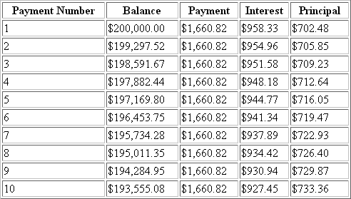

# 第 3 章 ■ PHP 基础

**53**

■**注意** PHP 也支持由多个维度组成的数组，通常被称为*多维数组*。

这个概念将在第 5 章中介绍。

## 对象

PHP 支持的另一种复合数据类型是对象。对象是面向对象编程范式的核心概念。如果你是面向对象编程的新手，别担心，因为第 6 章和第 7 章会对此进行完整的介绍。

与 PHP 语言中包含的其他数据类型不同，对象必须显式声明。这种对对象特性和行为的声明是在被称为*类*的结构中进行的。以下是类声明及后续对象实例化的一般示例：

```php
class appliance {
   private $power;

   function setPower($status) {
      $this->power = $status;
   }
}

...

$blender = new appliance;
```

类定义为一个数据结构创建了若干属性和函数，在此例中，数据结构名为`appliance`。到目前为止，`appliance`的功能还不太完善。它只有一个属性：`power`。这个属性可以通过使用`setPower()`方法进行修改。

然而，请记住，类定义是一个模板，其本身无法被操作。相反，对象是基于这个模板创建的。这是通过`new`关键字实现的。因此，在上述列表的最后一行，创建了一个名为`blender`的`appliance`类的对象。然后可以通过使用`setPower()`方法来设置`blender`对象的`power`属性：

```php
$blender->setPower("on");
```

对 PHP 面向对象开发模型的改进是 PHP 5 的一个亮点。第 6 章和第 7 章将深入介绍这一重要特性。

## 特殊数据类型

特殊数据类型包括那些满足某种特定用途的类型，这使得无法将它们归入任何其他类别。*资源*和*空值*数据类型就属于这一类。

### 资源

PHP 常用于与某些外部数据源交互：数据库、文件和网络流都属此类。通常，这种交互通过*句柄*进行，句柄在成功建立与资源的连接时被命名。这些句柄保持为该资源的主要引用点，直到通信完成，此时句柄被销毁。这些句柄属于资源数据类型。

并非所有函数都返回资源；只有那些负责将资源绑定到 PHP 脚本中变量的函数才会这样做。这类函数的例子包括`fopen()`、`mysqli_connect()`和`pdf_new()`。例如，在下面的示例中，`$link`是资源类型：

```php
$fh = fopen("/home/jason/books.txt", "r");
```

资源类型的变量实际上并不保存值；相反，它们保存一个指向已打开资源连接的指针。事实上，如果你尝试输出其内容，你会看到一个指向资源 ID 编号的引用。

### 空值

*空值*，意为“无”，长期以来一直是一个让初学者感到困惑的概念。空值既不是空白，也不是零；它意味着没有值，或者什么也没有。在 PHP 中，如果一个值满足以下条件，则被视为空值：

- 它没有被设置为任何预定义的值。
- 它被明确赋值为 `Null`。
- 它已通过函数 `unset()` 被擦除。

空值数据类型只识别一个值，`Null`：

```php
<?php
$default = Null;
?>
```

## 类型转换

### 强制变量以不同类型运行

强制变量以非其原始预期类型的方式运行称为*类型转换*。通过将变量转换为另一种类型，可以将其作为不同类型进行求值。这通过在待转换变量前放置目标类型来实现。可以通过在变量前插入表 3-2 中所示的某个转换操作符来进行类型转换。

**表 3-2.** *类型转换操作符*

| 转换操作符 | 转换结果 |
|----------------|------------|
| `(array)` | 数组 |
| `(bool)` 或 `(boolean)` | 布尔型 |
| `(int)` 或 `(integer)` | 整型 |
| `(object)` | 对象 |
| `(real)` 或 `(double)` 或 `(float)` | 浮点型 |
| `(string)` | 字符串 |

让我们来看几个示例。假设你想将一个整数转换为双精度浮点数：

```php
$variable1 = 13;
$variable2 = (double) $variable1; // $variable2 被赋值为 13.0
```

尽管 `$variable1` 最初包含整数值 13，但双精度浮点数转换临时将其类型转换为双精度浮点数（相应地，13 变为 13.0）。这个值随后被赋给了 `$variable2`。

现在考虑相反的情况。将 `double` 类型的值转换为 `integer` 类型会产生你可能意想不到的效果：

```php
$variable1 = 4.7;
$variable2 = 5;
$variable3 = (int) $variable1 + $variable2; // $variable3 = 9
```

小数点部分被从双精度浮点数中截断。注意，无论小数部分的值是多少，双精度浮点数每次都会被向下取整。

你也可以将一种数据类型转换为数组的一个元素。被转换的值直接成为数组的第一个元素：

```php
$variable1 = 1114;
$array1 = (array) $variable1;
print $array1[0]; // 输出值 1114
```

请注意，这不应被视为向数组添加元素的标准做法，因为这似乎只适用于新创建数组的第一个成员。如果对一个已有的数组进行此转换，该数组将被清空，只留下新转换的值放在第一个位置。

如果将字符串数据类型转换为整数类型会发生什么？让我们来看看：

```php
$sentence = "This is a sentence";
echo (int) $sentence; // 返回 0
```

这不太实用。那么相反的过程呢，将整数转换为字符串？

鉴于 PHP 的松散类型设计，它会直接返回未经修改的整数值。然而，正如你将在下一节中看到的，PHP 有时会主动进行类型转换，以最适合特定情况的需求。

最后一个示例：任何数据类型都可以被转换为对象。结果是该变量成为对象的一个属性，该属性名为 `scalar`：

```php
$model = "Toyota";
$new_obj = (object) $model;
```

然后可以按如下方式引用该值：

```php
print $new_obj->scalar; // 返回 "Toyota"
```

### 类型转换（自动）

由于 PHP 对类型定义的宽松态度，变量有时会根据其被引用时的环境自动转换为最合适的类型。考虑以下代码片段：

```php
<?php
$total = 5;
$count = "15";
$total += $count; // $total = 20;
?>
```

结果是预期的；`$total` 被赋值为 20，为此将 `$count` 变量从字符串转换为整数。下面是另一个示例：

```php
<?php
$total = "45 fire engines";
$incoming = 10;
$total = $incoming + $total; // $total = 55
?>
```

因为原始的 `$total` 字符串以整数值开头，所以在计算中使用了这个值。然而，如果它以非数值表示的内容开头，则该值为零。再考虑一个示例：

```php
<?php
$total = "1.0";
if ($total) echo "The total count is positive";
?>
```

在这个示例中，为了评估 `if` 语句，一个字符串被转换为布尔类型。

这确实是 PHP 编程中的常见做法，你会经常看到，如果你喜欢精简的代码，它会非常有用。

考虑最后一个特别有趣的示例。如果在数学计算中使用的字符串包含 `.`、`e` 或 `E`，它将被作为浮点数处理：

```php
<?php
$val1 = "1.2e3";
$val2 = 2;
echo $val1 * $val2; // 输出 2400
?>
```

## 类型相关函数

有几个函数可用于验证和转换数据类型，本节将介绍这些函数。

### `settype()`

```php
boolean settype (mixed *var*, string *type*)
```

`settype()` 函数将由 `var` 指定的变量转换为由 `type` 指定的类型。

有七种可能的类型值可用：`array`、`boolean`、`float`、`integer`、`null`、`object` 和 `string`。如果转换成功，返回 `TRUE`；否则返回 `FALSE`。

### `gettype()`

```php
string gettype (mixed *var*)
```

`gettype()` 函数返回由 `var` 指定的变量的类型。总共有八种可能的返回值：`array`、`boolean`、`double`、`integer`、`object`、`resource`、`string` 和 `unknown type`。

### 类型标识函数

有许多函数可用于确定变量的类型，包括`is_array()`、`is_bool()`、`is_float()`、`is_integer()`、`is_null()`、`is_numeric()`、`is_object()`、`is_resource()`、`is_scalar()`和`is_string()`。由于所有这些函数都遵循相同的命名约定、参数和返回值，这里将它们合并为一个通用形式进行介绍。

### `is_name()`

```
boolean is_name (mixed *var*)
```

所有这些函数都被归入一个标题下，因为每个函数最终完成的任务是相同的。每个函数都用于判断由`var`指定的变量是否满足由函数名指定的特定条件。如果`var`确实是那种类型，则返回`TRUE`；否则返回`FALSE`。示例如下：

```php
<?php
$item = 43;
echo "变量 \$item 是数组类型：".is_array($item)."<br />";
echo "变量 \$item 是整数类型：".is_integer($item)."<br />";
echo "变量 \$item 是数值：".is_numeric($item)."<br />";
?>
```

这段代码返回以下内容：

```
变量 $item 是数组类型：
变量 $item 是整数类型：1
变量 $item 是数值：1
```

请注意，在结果为假的情况下，不会返回任何内容。你可能还对`$item`前面的反斜杠感到好奇。鉴于美元符号标识变量的特殊用途，如果你希望将其输出到屏幕，必须有一种方法告诉解释器将其视为普通字符。使用反斜杠转义美元符号可以实现这一点。

### 标识符

*标识符*是应用于变量、函数和各种其他用户定义对象的通用术语。PHP标识符必须遵守以下几个属性：

- 标识符可以由一个或多个字符组成，并且必须以字母或下划线开头。此外，标识符只能由字母、数字、下划线字符以及其他ASCII码127到255的字符组成。考虑几个示例：

| 有效 | 无效 |
| :--- | :--- |
| `my_function` | `This&that` |
| `Size` | `!counter` |
| `_someword` | `4ward` |

- 标识符是区分大小写的。因此，名为`$recipe`的变量与名为`$Recipe`、`$rEciPe`或`$recipE`的变量是不同的。

- 标识符可以是任意长度。这很有优势，因为它使程序员能够通过标识符名称准确地描述其用途。

- 标识符名称不能与PHP的任何预定义关键字相同。你可以在PHP手册附录中找到一个完整的关键字列表。

尽管本章的众多示例中已多次使用变量，但相关概念尚未正式介绍。本节将从定义入手，正式阐述这一概念。简而言之，*变量*是一种可以在不同时间存储不同值的符号。例如，假设你创建了一个基于网络的数学计算器，用户自然希望输入自己选定的数值，因此程序必须能够动态存储这些值并执行相应计算。与此同时，程序员需要一种友好的方式来引用应用程序中的这些数值容器。变量正好满足了这两项需求。

鉴于这一编程概念的重要性，明智的做法是预先明确变量声明与操作的基本规则。本节将详细探讨这些规则。

**注意**：变量是一个命名内存位置，用于包含数据，并可在程序执行过程中被操作。

#### 变量声明

变量总是以美元符号`$`开头，后跟变量名。变量名遵循与标识符相同的命名规则。即，变量名可以字母或下划线开头，并由字母、下划线、数字或其他ASCII字符（范围从127到255）组成。以下均为有效变量：

`$color`

`$operating_system`

`$_some_variable`

`$model`

请注意变量名是区分大小写的。例如，以下变量之间毫无关联：

`$color`

`$Color`

`$COLOR`

有趣的是，与Perl不同，PHP中的变量无需显式声明，可以同时声明并赋值。然而，能这样做并不意味着*应该*这样做。良好的编程实践要求所有变量应在使用前声明，最好附上注释。

声明变量后，便可开始为其赋值。变量赋值有两种方法：按值赋值和按引用赋值。接下来将介绍这两种方法。

#### 按值赋值

按值赋值只是将赋值表达式的值复制给被赋值的变量。这是最常见的赋值类型。下面是一些示例：

```php
$color = "red";
$number = 12;
$age = 12;
$sum = 12 + "15"; /* $sum = 27 */
```

请记住，每个变量都拥有赋值表达式的副本。例如，`$number`和`$age`各自拥有值12的独立副本。如果你希望两个变量指向同一个值的副本，则需要按引用赋值，接下来将介绍。

#### 按引用赋值

PHP 4引入了按引用赋值的能力，这实质上意味着你可以创建一个变量，使其引用与另一个变量相同的内容。因此，对引用特定变量内容的任何变量所做的更改，都将反映在所有引用该内容的其他变量上。通过在等号后附加一个与号（`&`）即可按引用赋值。来看一个例子：

```php
<?php
$value1 = "Hello";
$value2 =& $value1; /* $value1 和 $value2 都等于 "Hello"。 */
$value2 = "Goodbye"; /* $value1 和 $value2 都等于 "Goodbye"。 */
?>
```

另一种引用赋值的语法也得到支持，即将与号附加到被引用变量的前面。以下示例遵循这种新语法：

```php
<?php
$value1 = "Hello";
$value2 = &$value1; /* $value1 和 $value2 都等于 "Hello"。 */
$value2 = "Goodbye"; /* $value1 和 $value2 都等于 "Goodbye"。 */
?>
```

引用在函数参数、返回值以及面向对象编程中也扮演着重要角色。第4章和第6章将分别介绍这些特性。

### 变量作用域

无论你如何声明变量（按值或按引用），都可以在PHP脚本的任何位置声明变量。然而，声明的位置极大地影响了变量的可访问范围。这个可访问域被称为变量的*作用域*。

PHP变量可以是四种作用域类型之一：

- 局部变量
- 函数参数
- 全局变量
- 静态变量

#### 局部变量

在函数中声明的变量被视为*局部*变量。也就是说，它只能在那个函数中被引用。函数外部的任何赋值都将被视为与函数内部的变量完全不同的变量。请注意，当退出声明了局部变量的函数时，该变量及其对应的值将被销毁。

局部变量很有用，因为它们消除了意外副作用（可能由有意或无意修改的全局可访问变量引起）的可能性。

请看以下代码清单：

```php
$x = 4;
function assignx () {
    $x = 0;
    print "\$x inside function is $x. <br>";
}
assignx();
print "\$x outside of function is $x. <br>";
```

执行此代码清单的结果是：

```
$x inside function is 0.
$x outside of function is 4.
```

如你所见，输出了两个不同的`$x`值。这是因为位于`assignx()`函数内部的`$x`是局部的。修改局部变量`$x`的值不会影响函数外部的任何值。同样，修改函数外部的`$x`也不会影响`assignx()`中包含的任何变量。

#### 函数参数

与许多其他编程语言一样，在PHP中，任何接受参数的函数都必须在函数头中声明这些参数。尽管这些参数接受来自函数外部的值，但一旦函数退出，它们便不再可访问。

**注意**：本部分仅适用于按值传递的参数，不适用于按引用传递的参数。按引用传递的参数确实会受到函数内部对参数所做的任何更改的影响。如果你不明白这意味着什么，不用担心，因为第4章会详细讨论这个主题。

函数参数在函数名之后、括号之内声明。它们的声明方式与典型变量非常相似：

```php
// 将值乘以 10 并返回给调用者
function x10 ($value) {
    $value = $value * 10;
    return $value;
}
```

请记住，虽然你可以在声明参数的函数中访问和操作任何函数参数，但当函数执行结束时，该参数将被销毁。

### 全局变量

与局部变量相反，全局变量可以在程序的任何部分访问。然而，要修改全局变量，必须在要修改它的函数中将其显式声明为全局变量。实现这一点很方便，只需将关键字`GLOBAL`放在应被识别为全局的变量之前即可。将此关键字放在已存在的变量之前，会告诉PHP使用该名称的变量。来看一个例子：

```php
$somevar = 15;
function addit() {
    GLOBAL $somevar;
    $somevar++;
    print "Somevar is $somevar";
}
addit();
```

显示的`$somevar`值将是 16。然而，如果省略这行`GLOBAL $somevar;`，变量`$somevar`将被赋值为 1，因为此时`$somevar`在`addit()`函数内被视为局部变量。这个局部声明会被隐式设置为 0，然后递增 1，从而显示值 1。

##### 声明全局变量的另一种方法

声明全局变量的另一种方法是使用 PHP 的`$GLOBALS`数组，下一节将正式介绍它。重新审视前面的示例，你可以使用该数组将变量`$somevar`声明为全局变量：

```php
$somevar = 15;

function addit() {
    $GLOBALS["somevar"]++;
}

addit();
print "Somevar is ".$GLOBALS["somevar"];
```

这将返回以下结果：

```
Somevar is 16
```

无论你选择哪种方法将变量转换为全局作用域，都要注意，由于使用不慎可能导致意外结果，全局作用域长期以来一直是程序员苦恼的根源。因此，尽管全局变量可能非常有用，但在使用时务必谨慎。

##### 静态变量

要讨论的最后一种变量作用域类型称为*静态*。与在函数退出时被销毁的函数参数声明的变量不同，静态变量在函数退出时不会丢失其值，并且如果函数再次被调用，它仍会保留该值。你只需在变量名前面加上关键字`STATIC`，即可将变量声明为静态：

```php
STATIC $somevar;
```

来看一个示例：

```php
function keep_track() {
    STATIC $count = 0;
    $count++;
    print $count;
    print "<br>";
}

keep_track();
keep_track();
keep_track();
```

你认为这段脚本的结果会是什么？如果变量`$count`没有被指定为静态（因此`$count`是一个局部变量），结果将如下所示：

```
1
2
3
```

然而，因为`$count`是静态的，所以每次函数执行时都会保留其之前的值。因此，结果是：

```
1
2
3
```

静态作用域对于递归函数特别有用。*递归函数*是一种强大的编程概念，函数会重复调用自身，直到满足特定条件为止。递归函数将在第 4 章中详细讨论。

#### PHP 的超全局变量

PHP 提供了许多有用的预定义变量，这些变量在执行脚本中的任何位置都可访问，并为你提供大量与环境相关的特定信息。你可以筛选这些变量来检索有关当前用户会话、用户操作环境、本地操作环境等详细信息。其中一些变量由 PHP 创建，而许多其他变量的可用性和值则特定于操作系统和 Web 服务器。因此，与其试图整理所有可能的预定义变量及其可能值的完整列表，不如使用以下代码输出与任何给定 Web 服务器以及脚本执行环境相关的所有预定义变量：

```php
foreach ($_SERVER as $var => $value) {
    echo "$var => $value <br />";
}
```

这将返回一个类似于下面的变量列表。请花点时间仔细阅读这段代码在 Windows 服务器上执行时生成的列表。在后续的示例中，你会再次看到其中一些变量。

```
HTTP_ACCEPT => */*
HTTP_ACCEPT_LANGUAGE => en-us
HTTP_ACCEPT_ENCODING => gzip, deflate
HTTP_USER_AGENT => Mozilla/4.0 (compatible; MSIE 6.0; Windows NT 5.1;) HTTP_HOST => localhost
HTTP_CONNECTION => Keep-Alive
PATH => C:\Perl\bin\;C:\WINDOWS\system32;C:\WINDOWS;
SystemRoot => C:\WINDOWS
COMSPEC => C:\WINDOWS\system32\cmd.exe
PATHEXT => .COM;.EXE;.BAT;.CMD;.VBS;.VBE;.JS;.JSE;.WSF;.WSH
WINDIR => C:\WINDOWS
SERVER_SIGNATURE => Apache/2.0.54 (Win32) PHP/5.1.b2 Server at localhost Port 80
SERVER_SOFTWARE => Apache/2.0.54 (Win32) PHP/5.1.0b2
SERVER_NAME => localhost
SERVER_ADDR => 127.0.0.1
SERVER_PORT => 80
REMOTE_ADDR => 127.0.0.1
DOCUMENT_ROOT => C:/Apache2/htdocs
SERVER_ADMIN => wj@wjgilmore.com
SCRIPT_FILENAME => C:/Apache2/htdocs/pmnp/3/globals.php
REMOTE_PORT => 1393
GATEWAY_INTERFACE => CGI/1.1
SERVER_PROTOCOL => HTTP/1.1
REQUEST_METHOD => GET
QUERY_STRING =>
REQUEST_URI => /pmnp/3/globals.php
SCRIPT_NAME => /pmnp/3/globals.php
PHP_SELF => /pmnp/3/globals.php
```

正如你所看到的，有相当多的信息可用——有些有用，有些则没那么有用。

你可以像对待常规变量一样，简单地显示这些变量中的某一个。例如，使用以下代码显示用户的 IP 地址：

```php
print "Hi! Your IP address is: $_SERVER['REMOTE_ADDR']";
```

这将返回一个数字 IP 地址，例如`192.0.34.166`。

你还可以获取有关用户浏览器和操作系统的信息。考虑下面这个单行代码：

```php
print "Your browser is: $_SERVER['HTTP_USER_AGENT']";
```

这将返回类似于下面的信息：

```
Your browser is: Mozilla/4.0 (compatible; MSIE 6.0; Windows NT 5.1; .NET CLR 1.0.3705)
```

此示例仅展示了 PHP 的九个预定义变量数组之一。本节的其余部分将专门介绍每个数组的用途和内容。

> **注意：** 要使用预定义变量数组，必须在`php.ini`文件中启用配置参数`track_vars`。从 PHP 4.03 开始，`track_vars`始终处于启用状态。

##### `$_SERVER`

`$_SERVER`超全局变量包含由 Web 服务器创建的信息，并提供有关服务器和客户端配置以及当前请求环境的大量信息。

尽管`$_SERVER`中变量的值和数量因服务器而异，但你通常可以找到 CGI 1.1 规范中定义的变量（可在国家超级计算应用中心网站 http://hoohoo.ncsa.uiuc.edu/cgi/env.html 获取）。你很可能会发现所有这些变量在你的应用程序中都非常有用，其中一些包括：

- `$_SERVER['HTTP_REFERER']`：将用户引荐到当前位置的页面的 URL。

- `$_SERVER['REMOTE_ADDR']`：客户端的 IP 地址。

- `$_SERVER['REQUEST_URI']`：URL 的路径部分。例如，如果 URL 是`http://www.example.com/blog/apache/index.html`，那么 URI 就是`/blog/apache/index.html`。

- `$_SERVER['HTTP_USER_AGENT']`：客户端的用户代理，通常提供有关操作系统和浏览器的信息。

##### `$_GET`

`$_GET`超全局变量包含与使用`GET`方法传递的任何参数相关的信息。如果请求了 URL`http://www.example.com/index.html?cat=apache&id=157`，你可以通过使用`$_GET`超全局变量访问以下变量：

- `$_GET['cat'] = "apache"`

- `$_GET['id'] = "157"`

默认情况下，`$_GET`超全局变量是访问通过`GET`方法传递的变量的唯一方式。你不能像这样引用`GET`变量：`$cat`、`$id`。关于为什么这是访问`GET`信息的推荐方法，请参见第 21 章。

##### `$_POST`

`$_POST`超全局变量包含与使用`POST`方法传递的任何参数相关的信息。考虑以下用于收集订阅者信息的表单：

```html
<form action="subscribe.php" method="post">
    <p>
        电子邮件地址：<br />
        <input type="text" name="email" size="20" maxlength="50" value="" />
    </p>
    <p>
        密码：<br />
        <input type="password" name="pswd" size="20" maxlength="15" value="" />
    </p>
    <p>
        <input type="submit" name="subscribe" value="订阅！" />
    </p>
</form>
```

目标脚本`subscribe.php`将提供以下`POST`变量：

- `$_POST['email'] = "jason@example.com"`
- `$_POST['pswd'] = "rainyday"`
- `$_POST['subscribe'] = "订阅！"`

与`$_GET`类似，默认情况下，`$_POST`超全局变量是访问`POST`变量的唯一方式。你不能像这样引用`POST`变量：`$email`、`$pswd`、`$subscribe`。

##### `$_COOKIE`

`$_COOKIE`超全局变量存储通过 HTTP Cookie 传递到脚本中的信息。

此类 Cookie 通常由先前执行的 PHP 脚本通过 PHP 函数`setcookie()`设置。例如，假设你使用`setcookie()`存储一个名为`example.com`、值为`ab2213`的 Cookie。稍后你可以通过调用`$_COOKIE["example.com"]`来检索该值。

第 18 章将详细介绍 PHP 的 Cookie 处理功能。

##### `$_FILES`

超全局变量`$_FILES`包含通过 POST 方法上传到服务器的数据信息。此超全局变量与其他变量略有不同，它是一个包含五个元素的二维数组。第一个下标指表单中文件上传元素的名称；第二个下标是五个预定义下标之一，用于描述上传文件的特定属性：

- `$_FILES['upload-name']['name']`：从客户端上传到服务器的文件名称。
- `$_FILES['upload-name']['type']`：上传文件的 MIME 类型。是否赋值此变量取决于浏览器的能力。
- `$_FILES['upload-name']['size']`：上传文件的字节大小。
- `$_FILES['upload-name']['tmp_name']`：上传后，在文件移动到最终位置之前，会分配一个临时名称。
- `$_FILES['upload-name']['error']`：上传状态码。尽管名称如此，即使在成功的情况下，此变量也会有值。共有五种可能的值：
  - `UPLOAD_ERR_OK`：文件上传成功。
  - `UPLOAD_ERR_INI_SIZE`：文件大小超过了`upload_max_filesize`指令设定的最大值。
  - `UPLOAD_ERR_FORM_SIZE`：文件大小超过了可选的隐藏表单域参数`MAX_FILE_SIZE`设定的最大值。
  - `UPLOAD_ERR_PARTIAL`：文件仅部分上传。
  - `UPLOAD_ERR_NO_FILE`：上传表单提示中未指定文件。

第 15 章专门全面介绍 PHP 的文件上传功能。

##### `$_ENV`

超全局变量`$_ENV`提供有关 PHP 解析器底层服务器环境的信息。此数组中的一些变量包括：

- `$_ENV['HOSTNAME']`：服务器主机名
- `$_ENV['SHELL']`：系统 shell

##### `$_REQUEST`

超全局变量`$_REQUEST`是一种包罗万象的变量，它记录通过任何输入方法（特别是 GET、POST 和 Cookie）传递给脚本的变量。这些变量的顺序不取决于它们在发送脚本中出现的顺序，而是取决于`variables_order`配置指令指定的顺序。尽管这可能很有诱惑力，但不要使用此超全局变量来处理变量，因为它不安全。请参阅第 21 章了解说明。

##### `$_SESSION`

超全局变量`$_SESSION`包含所有会话变量的信息。注册会话信息可以方便你在整个网站中引用它，而无需通过 GET 或 POST 显式传递数据。第 18 章专门介绍 PHP 强大的会话处理功能。

##### `$GLOBALS`

超全局变量数组`$GLOBALS`可以被视为超全局超集，它包含全局范围内所有变量的全面列表。你可以通过执行以下代码来查看`$GLOBALS`中所有变量的转储：

```
print '<pre>';
print_r($GLOBALS);
print '</pre>';
```

#### 可变变量

有时，你可能想使用一个其内容本身可以被动态视为变量的变量。考虑这个典型的变量赋值：

`$recipe = "spaghetti";`

有趣的是，你可以通过在原变量名前再添加一个美元符号并再次赋值，将值`spaghetti`当作一个变量来使用：`$$recipe = "& meatballs";`

这实际上将`& meatballs`赋值给了一个名为`spaghetti`的变量。

因此，以下两段代码产生相同的结果：

```
print $recipe $spaghetti;
print $recipe ${$recipe};
```

两者的结果都是字符串`spaghetti & meatballs`。

#### 第 3 章 PHP 基础

#### 常量

**常量**是在程序执行期间不能被修改的值。常量在处理那些确实不需要修改的值时特别有用，例如圆周率（3.141592）或一英里的英尺数（5,280）。一旦定义了常量，就不能在程序的任何其他位置更改（或重新定义）它。常量使用`define()`函数定义。

##### `define()`

```php
boolean define(string $name, mixed $value [, bool $case_insensitive])
```

`define()`函数定义一个常量，由`$name`指定其名称，并将`$value`赋值给它。如果可选的参数`$case_insensitive`被包含并赋值为`TRUE`，则后续对该常量的引用将不区分大小写。考虑以下示例，其中定义了数学常量`PI`：

```php
define("PI", 3.141592);
```

该常量随后在以下代码中使用：

```php
print "The value of pi is ".PI.".<br />";
$pi2 = 2 * PI;
print "Pi doubled equals $pi2.";
```

这段代码产生以下结果：

```
The value of pi is 3.141592.
Pi doubled equals 6.283184.
```

关于上述代码需要注意几点。第一，常量引用不以美元符号`$`开头。第二，一旦定义了常量，就不能重新定义或取消定义它（例如，`2 * PI`）；如果你需要基于常量生成一个值，则该值必须存储在另一个变量中。最后，常量是全局的；它们可以在脚本中的任何位置被引用。

#### 表达式

**表达式**是表示程序中特定操作的一种短语。所有表达式至少包含一个操作数和一个或多个运算符。以下是一些示例：

```php
$a = 5;                  // 将整数值 5 赋给变量 $a
$a = "5";                // 将字符串值 "5" 赋给变量 $a
$sum = 50 + $some_int;   // 将 50 + $some_int 的和赋给 $sum
$wine = "Zinfandel";     // 将 "Zinfandel" 赋给变量 $wine
$inventory++;            // 将变量 $inventory 递增 1
```

#### 操作数

操作数是表达式的输入。你可能已经熟悉操作数的操作和使用，不仅通过日常的数学计算，还通过先前的编程经验。以下是一些操作数的示例：

```php
$a++;                             // $a 是操作数
$sum = $val1 + $val2;            // $sum、$val1 和 $val2 是操作数
```

### 运算符

**运算符**是指定表达式中特定操作的符号。许多运算符你可能已经熟悉。但无论如何，你应该记住，PHP 的自动类型转换会根据放置在两个操作数之间的运算符类型来转换类型，这在其他编程语言中并非总是如此。

运算符的优先级和结合性是编程语言的重要特性。这两个概念将在本节中介绍。表 3-3 包含了所有运算符的完整列表，按从最高到最低的优先级顺序排列。

**表 3-3.** 运算符优先级、结合性和目的

| 运算符 | 结合性 | 目的 |
|--------|--------|------|
| `new` | 无 | 对象实例化 |
| `( )` | 无 | 表达式分组 |
| `[ ]` | 右 | 索引包围 |
| `! ~ ++ --` | 右 | 布尔非、位非、递增、递减 |
| `@` | 右 | 错误抑制 |
| `/ * %` | 左 | 除法、乘法、取模 |
| `+ - .` | 左 | 加法、减法、连接 |
| `<< >>` | 左 | 左移、右移（位运算） |
| `< <= > >=` | 无 | 小于、小于等于、大于、大于等于 |
| `== != === <>` | 无 | 等于、不等于、全等、不等于 |
| `& ^ \|` | 左 | 位与、位异或、位或 |
| `&& \|\|` | 左 | 布尔与、布尔或 |
| `?:` | 右 | 三元运算符 |
| `= += *= /= .= %= &= \|= ^= <<= >>=` | 右 | 赋值运算符 |
| `AND XOR OR` | 左 | 布尔与、布尔异或、布尔或 |
| `,` | 左 | 表达式分隔；示例：`$days = array(1=>"Monday", 2=>"Tuesday")` |

[www.it-ebooks.info](http://www.it-ebooks.info/)

**70**

第 3 章 PHP 基础

#### 运算符优先级

*运算符优先级*是运算符的一种特性，它决定了运算符计算其周围操作数的顺序。PHP 遵循小学数学中使用的标准优先级规则。考虑以下示例：

`$total_cost = $cost + $cost * 0.06;`

这等同于以下写法：

`$total_cost = $cost + ($cost * 0.06);`

因为乘法运算符的优先级高于加法运算符。

##### 运算符结合性

运算符的*结合性*特性指定了在执行过程中，相同优先级（即具有相同的优先级值，如表 3-3 所示）的运算如何被计算。结合性可以按两个方向进行：从左到右或从右到左。从左到右的结合性意味着构成表达式的各种运算从左到右进行求值。考虑以下示例：

`$value = 3 * 4 * 5 * 7 * 2;`

前面的示例等同于：

`$value = ((((3 * 4) * 5) * 7) * 2);`

该表达式的结果是 840，因为乘法（`*`）运算符是左结合的。

相反，从右到左的结合性会从右到左计算相同优先级的运算符：

`$c = 5;`

`print $value = $a = $b = $c;`

前面的示例等同于：

`$c = 5;`

`$value = ($a = ($b = $c));`

当此表达式被求值时，变量 `$value`、`$a`、`$b` 和 `$c` 都将包含值 5，因为赋值运算符（`=`）具有从右到左的结合性。

##### 算术运算符

表 3-4 中列出的算术运算符执行各种数学运算，并且可能会在你编写的许多 PHP 程序中频繁使用。幸运的是，它们易于使用。

**表 3-4.** *算术运算符*

| 示例 | 标签 | 结果 |
|------|------|------|
| `$a + $b` | 加法 | `$a` 与 `$b` 的和 |
| `$a - $b` | 减法 | `$a` 与 `$b` 的差 |
| `$a * $b` | 乘法 | `$a` 与 `$b` 的积 |
| `$a / $b` | 除法 | `$a` 与 `$b` 的商 |
| `$a % $b` | 取模 | `$a` 除以 `$b` 的余数 |

顺便提一下，PHP 提供了大量预定义的数学函数，能够执行进制转换、计算对数、平方根、几何值等。请查阅手册以获取这些函数的最新列表。

##### 赋值运算符

*赋值运算符*将数据值赋给变量。最简单的赋值运算符形式仅分配某个值，而其他运算符（称为*快捷赋值运算符*）在执行赋值之前会先执行其他操作。表 3-5 列出了使用此类运算符的示例。

**表 3-5.** *赋值运算符*

| 示例 | 标签 | 结果 |
|------|------|------|
| `$a = 5` | 赋值 | `$a` 等于 5 |
| `$a += 5` | 加法赋值 | `$a` 等于 `$a` 加 5 |
| `$a *= 5` | 乘法赋值 | `$a` 等于 `$a` 乘以 5 |
| `$a /= 5` | 除法赋值 | `$a` 等于 `$a` 除以 5 |
| `$a .= 5` | 连接赋值 | `$a` 等于 `$a` 与 5 连接后的结果 |

#### 字符串运算符

PHP 的*字符串运算符*（见表 3-6）提供了一种连接字符串的便捷方式。这类运算符有两个，包括连接运算符（`.`）和上一节讨论的连接赋值运算符（`.=`）。

> **注意** *连接*的意思是将两个或多个对象组合成一个单一实体。

**表 3-6.** *字符串运算符*

| 示例 | 标签 | 结果 |
|------|------|------|
| `$a = "abc"."def";` | 连接 | `$a` 被赋值为字符串 "abcdef" |
| `$a .= "ghijkl";` | 连接赋值 | `$a` 等于其当前值与 "ghijkl" 连接的结果 |

以下是一个涉及字符串运算符的示例：

```
// $a contains the string value "Spaghetti & Meatballs"; 
$a = "Spaghetti" . "& Meatballs";
$a .= " are delicious";
// $a contains the value "Spaghetti & Meatballs are delicious."
```

这两个连接运算符远非 PHP 字符串处理能力的全部。请阅读第 9 章以全面了解此功能。

##### 递增和递减运算符

##### 自增与自减运算符

表 3-7 中列出的*自增*（`++`）和*自减*（`--`）运算符在代码清晰性方面提供了一些小便利，提供了一种简写方式，让你能将变量的当前值加 1 或减 1。

**表 3-7.** *自增与自减运算符*

| **示例** | **名称** | **结果** |
|----------|----------|----------|
| `++$a`, `$a++` | 自增 | 将 `$a` 增加 1 |
| `--$a`, `$a--` | 自减 | 将 `$a` 减少 1 |

这些运算符可以放在变量的任一侧，放置的位置会带来略微不同的效果。请看以下示例的结果：

```
$inv = 15;  /* 为 $inv 赋值整数值 15。 */
$oldInv = $inv--;  /* 将 $inv 的值赋给 $oldInv，然后对 $inv 进行自减。 */
$origInv = ++$inv;  /* 对 $inv 进行自增，然后将 $inv 的新值赋给 $origInv。 */
```

如你所见，自增和自减运算符的使用顺序对变量的值有重要影响。将运算符放在操作数之前称为前置自增和前置自减操作，而将运算符放在操作数之后称为后置自增和后置自减操作。

#### 逻辑运算符

与算术运算符非常相似，*逻辑运算符*（见表 3-8）很可能在你的许多 PHP 应用程序中扮演重要角色，它提供了一种基于多个变量的值进行决策的方式。逻辑运算符使得控制程序流程成为可能，并经常与控制结构（如 `if` 条件语句，以及 `while` 和 `for` 循环）一起使用。

**表 3-8.** *逻辑运算符*

| **示例** | **名称** | **结果** |
|----------|----------|----------|
| `$a && $b` | 与 | 如果 `$a` 和 `$b` 都为真，则结果为真 |
| `$a AND $b` | 与 | 如果 `$a` 和 `$b` 都为真，则结果为真 |
| `$a \|\| $b` | 或 | 如果 `$a` 或 `$b` 中至少一个为真，则结果为真 |
| `$a OR $b` | 或 | 如果 `$a` 或 `$b` 中至少一个为真，则结果为真 |
| `!$a` | 非 | 如果 `$a` 不为真，则结果为真 |
| `NOT $a` | 非 | 如果 `$a` 不为真，则结果为真 |
| `$a XOR $b` | 异或 | 如果只有 `$a` 为真或只有 `$b` 为真，则结果为真 |

逻辑运算符也常用于提供其他操作结果的相关信息，特别是那些返回值的操作：

```
`file_exists("filename.txt") OR print "File does not exist!";`

将会发生以下两种结果之一：

- 文件 `filename.txt` 存在

- 输出字符串“File does not exist!”

##### 相等运算符

相等运算符（见表 3-9）用于比较两个值，测试它们是否等价。

**表 3-9.** 相等运算符

| **示例** | **名称** | **结果** |
|----------|----------|----------|
| `$a == $b` | 等于 | 如果 `$a` 和 `$b` 等价，则结果为真 |
| `$a != $b` | 不等于 | 如果 `$a` 不等于 `$b`，则结果为真 |
| `$a === $b` | 全等 | 如果 `$a` 和 `$b` 等价，并且 `$a` 和 `$b` 类型相同，则结果为真 |

即使是经验丰富的程序员，也常犯一个错误，即试图只用一个等号来测试相等性（例如，`$a = $b`）。请记住，这将导致 `$b` 的内容被赋值给 `$a`，而不会产生预期的结果。

#### 比较运算符

比较运算符（见表 3-10）与逻辑运算符类似，提供了一种通过检查两个或多个变量的比较值来引导程序流程的方法。

**表 3-10.** 比较运算符

| **示例** | **名称** | **结果** |
|----------|----------|----------|
| `$a < $b` | 小于 | 如果 `$a` 小于 `$b`，则结果为真 |
| `$a > $b` | 大于 | 如果 `$a` 大于 `$b`，则结果为真 |
| `$a <= $b` | 小于或等于 | 如果 `$a` 小于或等于 `$b`，则结果为真 |
| `$a >= $b` | 大于或等于 | 如果 `$a` 大于或等于 `$b`，则结果为真 |
| `($a == 12) ? 5 : -1` | 三元 | 如果 `$a` 等于 12，返回值为 5；否则返回值为 -1 |

请注意，比较运算符应仅用于比较数值。虽然你可能倾向于使用这些运算符来比较字符串，但如果这样做，很可能无法得到预期的结果。有一组预定义函数专门用于比较字符串值，这些内容将在第 9 章中详细讨论。

##### 位运算符

位运算符在构成整数值的各个位上检查和操作整数值（因此得名）。要完全理解这一概念，你至少需要对十进制整数的二进制表示有初步的了解。表 3-11 列出了一些十进制整数及其对应的二进制表示。

**表 3-11.** 二进制表示

| **十进制整数** | **二进制表示** |
|-----------------|----------------|
| 1,452,012       |                |

表 3-12 中列出的位运算符是某些逻辑运算符的变体，但其结果可能截然不同。

**表 3-12.** 位运算符

| **示例** | **标签** | **结果** |
|------------|------------|--------------------------------------|
| `$a & $b` | And（与） | 将`$a`和`$b`中包含的每个位进行与操作 |
| `$a \| $b` | Or（或） | 将`$a`和`$b`中包含的每个位进行或操作 |
| `$a ^ $b` | Xor（异或） | 将`$a`和`$b`中包含的每个位进行异或操作 |
| `~ $b` | Not（非） | 对`$b`中的每个位取反 |
| `$a << $b` | 左移 | `$a`将接收`$b`左移两位后的值 |
| `$a >> $b` | 右移 | `$a`将接收`$b`右移两位后的值 |

如果你有兴趣进一步了解二进制编码、位运算符及其重要性，请查阅 Randall Hyde 的大型在线参考资料《汇编语言编程艺术》，网址为 http://webster.cs.ucr.edu/。它很可能是网络上最好的资源之一。

---

#### 字符串插值

为了在处理字符串值时给开发者提供最大的灵活性，PHP 提供了字面解释和解释执行两种方式。例如，考虑以下字符串：`The $animal jumped over the wall.\n`

你可能认为`$animal`是一个变量，而`\n`是一个换行符，因此两者都应被相应地解释。然而，如果你想原样输出这个字符串，或者希望换行符被渲染，但变量以字面形式显示（`$animal`），或者反过来，该怎么办呢？所有这些变体在 PHP 中都是可能的，具体取决于字符串的引用方式以及某些关键字符是否通过预定义序列被转义。这些主题是本节的重点。

##### 双引号

在大多数 PHP 脚本中，用双引号括起来的字符串是最常用的，因为它们提供了最大的灵活性。这是因为变量和转义序列都会被相应地解析。请考虑以下示例：

```php
<?php
$sport = "boxing";
echo "Jason's favorite sport is $sport.";
?>
```

此示例返回：

```
Jason's favorite sport is boxing.
```

转义序列也会被解析。请考虑这个示例：

```php
<?php
$output = "This is one line.\nAnd this is another line.";
echo $output;
?>
```

在浏览器源代码中，这会返回以下内容：

```
This is one line.
And this is another line.
```

值得重申的是，这个输出结果是在浏览器源代码中，而不是在浏览器窗口中。浏览器窗口会忽略这种形式的换行符。但是，如果你查看源代码，你会发现输出实际上显示在两行上。如果将数据输出到文本文件中，也遵循同样的原理。

除了换行符，PHP 还识别许多特殊的转义序列，所有这些序列都列在表 3-13 中。

**表 3-13.** 已识别的转义序列

| **序列** | **描述** |
|--------------------|--------------|
| `\n` | 换行符 |
| `\r` | 回车符 |
| `\t` | 水平制表符 |
| `\\` | 反斜杠 |
| `\$` | 美元符号 |
| `\"` | 双引号 |
| `\[0-7]{1,3}` | 八进制表示法 |
| `\x[0-9A-Fa-f]{1,2}` | 十六进制表示法 |

##### 单引号

当字符串需要完全按声明解释时，使用单引号括起字符串非常有用。这意味着在解析字符串时，变量和转义序列都不会被解释。例如，考虑以下单引号字符串：`echo 'This string will $print exactly as it\'s \n declared.';`

这会输出：

```
This string will $print exactly as it's \n declared.
```

请注意，“it’s”中的单引号已被转义。如果省略反斜杠转义字符，将会导致语法错误，除非启用了 `magic_quotes_gpc` 配置指令。再考虑另一个示例：

```php
echo 'This is another string.\\';
```

这会输出：

```
This is another string.\
```

在这个示例中，出现在字符串末尾的反斜杠本身必须被转义；否则 PHP 解析器会认为后面的单引号是要被转义的。然而，如果反斜杠出现在字符串中的任何其他位置，则无需转义。

##### Heredoc

Heredoc 语法提供了一种输出大量文本的便捷方式。它不使用双引号或单引号来界定字符串，而是使用两个相同的标识符。示例如下：
```

```php
<?php
$website = "http://www.romatermini.it";
echo <<<EXCERPT
<p>Rome's central train station, known as <a href = "$website">Roma Termini</a>, was built in 1867\. Because it had fallen into severe disrepair in the late 20th century, the government knew that considerable resources were required to rehabilitate the station prior to the 50-year <i>Giubileo</i>.</p>
EXCERPT;
?>
```

关于这个示例，有几点值得注意：

- 在本例中，开始和结束标识符`EXCERPT`必须相同。你可以选择任何你喜欢的标识符，但它们必须完全匹配。唯一的限制是标识符必须仅由字母数字字符和下划线组成，并且不能以数字或下划线开头。

- 开始标识符必须以三个左尖括号 `<<<` 开头。

- Heredoc 语法遵循与双引号括起来的字符串相同的解析规则。也就是说，变量和转义序列都会被解析。唯一的区别是双引号不需要被转义。

- 结束标识符必须位于一行的最开头。它前面不能有空格或任何其他无关字符。这通常是用户中反复出现的混淆点，因此请特别注意确保你的 heredoc 字符串符合这个烦人的要求。此外，开始或结束标识符后面有任何空格都会产生语法错误。

当你需要处理大量内容但不想处理转义引号的麻烦时，Heredoc 语法特别有用。

---

### 控制结构

*控制结构*决定了应用程序中的代码流，定义了执行特性，例如特定代码语句是否执行以及执行多少次，以及代码块何时放弃执行控制。这些结构还提供了一种简单的方法，可以将全新的代码段（通过文件包含语句）引入到当前正在执行的脚本中。在本节中，你将学习 PHP 语言中所有可用的此类控制结构。

### 执行控制语句

`return` 和 `declare` 语句分别提供了精细控制特定代码块开始和结束时间的方法。

#### `declare()`

```
declare (directive) statement
```

`declare()` 语句用于确定指定代码块的执行频率。目前只支持一个指令：*tick*。PHP 将 tick 定义为 PHP 解析器执行一定数量的底层语句时发生的事件。你可能会使用 tick 进行基准测试、调试、简单的多任务处理，或者任何需要控制底层语句执行的其他任务。

### PHP 基础

事件在函数内部定义，并通过 `register_tick_function()` 函数注册为 tick 事件。随后可以通过 `unregister_tick_function()` 函数注销该事件。接下来将介绍这两个函数。事件频率通过设置 `declare` 函数的指令来指定，例如：`ticks=N`，其中 `N` 是两次事件调用之间低级语句的执行次数。

#### `register_tick_function()`

`void register_tick_function (callback *function* [, mixed *arg*])` `register_tick_function()` 函数将 `function` 指定的函数注册为 tick 事件。

#### `unregister_tick_function()`

`void unregister_tick_function (string *function*)` `unregister_tick_function()` 函数注销之前由 `function` 指定的已注册函数。

#### `return()`

`return()` 语句通常用于函数体内，将结果返回给函数调用者。如果在全局作用域中调用 `return()`，脚本会立即终止执行。

如果是在通过 `include()` 或 `require()` 包含的脚本中调用，则控制权会返回给文件调用者。将其参数括在圆括号中是可选的。示例如下：

```
function cubed($value) {
    return $value * $value * value;
}
```

调用此函数将向调用者返回以下结果：`$answer = cubed(3); // $answer = 27`

### 条件语句

条件语句使计算机程序能够根据各种输入做出相应响应，利用逻辑根据输入值区分不同条件。这一功能对计算机软件的创建如此基础，以至于所有主流编程语言（包括 PHP）都包含多种条件语句，这并不令人意外。

#### `if`

`if` 条件语句是任何主流编程语言中最常见的结构之一，为条件性代码执行提供了便捷的方式。其语法如下：

```
if (expression) {
    statement
}
```

举例来说，假设当用户猜出一个预设的秘密数字时，你想显示一条祝贺信息：

```php
<?php
$secretNumber = 453;
if ($_POST['guess'] == $secretNumber) {
    echo "<p>Congratulations!</p>";
}
?>
```

当条件体仅包含单个语句时，懒人可以选择省略花括号。以下是上一个示例的修改版：

```php
<?php
$secretNumber = 453;
if ($_POST['guess'] == $secretNumber) echo"<p>Congratulations!</p>";
?>
```

**注意：** `if`、`while`、`for`、`foreach` 和 `switch` 控制结构提供了可选的替代括起语法。这涉及将左花括号替换为冒号（`:`），并将右花括号分别替换为 `endif;`、`endwhile;`、`endfor;`、`endforeach;` 和 `endswitch;`。虽然已有关于在将来版本中弃用此语法的讨论，但在可预见的未来，它很可能仍然有效。

#### `else`

上一个示例的问题在于，只有正确猜出秘密数字的用户才能看到输出。其他用户则被完全冷落，这大概是因为他们缺乏心灵感应能力。如果无论结果如何，你都想提供定制化的响应呢？要做到这一点，你需要一种方式来处理那些不满足 `if` 条件要求的用户，而 `else` 语句正好提供了这一功能。

以下是上一个示例的修改版，这次在两种情况下都提供了响应：

```php
<?php
$secretNumber = 453;
if ($_POST['guess'] == $secretNumber) {
    echo "<p>Congratulations!!</p>";
} else {
    echo "<p>Sorry!</p>";
}
?>
```

与 `if` 一样，如果只包含单个代码语句，`else` 语句的花括号也可以省略。

#### `elseif`

`if-else`组合在“二选一”的情况下表现良好，即只有两种可能结果的情况。但如果有多种可能的结果呢？你需要一种方法来考虑每种可能的结果，这可以通过`elseif`语句实现。让我们再次修改秘密数字示例，这次在用户猜测的数字与秘密数字相对接近（相差 10 以内）时给出提示：

```php
<?php

$secretNumber = 453;

$_POST['guess'] = 442;

if ($_POST['guess'] == $secretNumber) {

echo "<p>Congratulations!</p>";

} elseif (abs ($_POST['guess'] - $secretNumber) < 10) {

echo "<p>You're getting close!</p>";

} else {

echo "<p>Sorry!</p>";

}

?>
```

[www.it-ebooks.info](http://www.it-ebooks.info/)

与所有条件语句一样，`elseif`在仅包含单条语句时支持省略花括号。

#### `switch`

你可以将`switch`语句视为`if-else`组合的一种变体，常用于需要将变量与大量值进行比较的场景：

```php
<?php

switch($category) {

case "news":

print "<p>What's happening around the World</p>"; break;

case "weather":

print "<p>Your weekly forecast</p>";

break;

case "sports":

print "<p>Latest sports highlights</p>";

break;

default:

print "<p>Welcome to my Web site</p>";

}

?>
```

注意每个`case`块末尾的`break`语句。如果缺少`break`语句，所有后续的`case`块都会执行，直到遇到`break`语句为止。为了说明这种行为，假设前面示例中的`break`语句都被移除，并且`$category`的值为`weather`，你会得到以下输出：

```
Your weekly forecast
Latest sports highlights
Welcome to my Web site
```

##### 循环语句

尽管实现方式各不相同，但循环语句是每种主流编程语言中的基本组成部分。这并不令人意外，因为循环机制为完成编程中的常见任务提供了一种简单的方法：重复执行一系列指令，直到满足特定条件。PHP 提供了多种这样的机制，如果你熟悉其他编程语言，这些对你来说应该不会陌生。

`while`

`while`语句指定一个条件，只有在该条件满足时，其内嵌代码的执行才会终止。其语法为：

```php
while ( *expression*) {

*statements*

}
```

在以下示例中，`$count`初始化为 1。然后对`$count`的值进行平方运算并输出。接着`$count`变量递增 1，循环重复执行，直到`$count`的值达到 5。

```php
<?php

$count = 1;

while ($count < 5) {

echo "$count squared = ".pow($count,2). "<br />"; $count++;

}

?>
```

输出如下：

```
1 squared = 1
2 squared = 4
3 squared = 9
4 squared = 16
```

与所有其他控制结构一样，`while`语句中也可以嵌入多个条件表达式。例如，下面的`while`块会一直执行，直到到达文件末尾或已读取并输出了 5 行：

```php
<?php

$linecount = 1;

$fh = fopen("sports.txt","r");

while (!feof($fh) && $linecount<=5) {

$line = fgets($fh, 4096);

echo $line. "<br />";

$linecount++;

}

?>
```

基于这些条件，无论`sports.txt`文件有多大，最多只会输出 5 行内容。

`do...while`

`do...while`循环条件是`while`的一种变体，但它在代码块执行完毕后才检查循环条件，而不是在开始时检查。其语法为：

```php
do {

*statements*

} while ( *expression*);
```

`while`和`do...while`功能相似；唯一真正的区别是，`while`语句中嵌入的代码可能永远不会执行，而`do...while`语句中嵌入的代码至少会执行一次。考虑以下示例：

```php
<?php

$count = 11;

do {
```

```php
echo "$count squared = ".pow($count,2). "<br />";

} while ($count < 10);

?>
```

其结果是：

```
11 squared = 121
```

尽管 11 超出了 `while` 条件的边界，但内嵌代码仍会执行一次，因为条件判断要到循环结束时才进行！

###### `for`

`for` 语句提供的循环机制比 `while` 稍显复杂。其语法如下：

```
for (expression1; expression2; expression3) {
    statements
}
```

在使用 PHP 的 `for` 循环时，有几条规则需要牢记：

-   第一个表达式 `expression1` 默认在循环的第一次迭代时求值。

-   第二个表达式 `expression2` 在每次迭代开始时求值。该表达式决定循环是否继续。

-   第三个表达式 `expression3` 在每次循环结束时求值。

-   任何表达式都可以为空，其用途由嵌入在 `for` 代码块中的逻辑来替代。

牢记这些规则后，请考虑以下示例，它们都显示了部分公里/英里换算表：

```php
// 示例一
for ($kilometers = 1; $kilometers <= 5; $kilometers++) {
    echo "$kilometers kilometers = ".$kilometers*0.62140. " miles. <br />";
}
```

```php
// 示例二
for ($kilometers = 1; ; $kilometers++) {
    if ($kilometers > 5) break;
    echo "$kilometers kilometers = ".$kilometers*0.62140. " miles. <br />";
}
```

```php
// 示例三
$kilometers = 1;
for (;;) {
    // 如果 $kilometers > 5，则跳出 for 循环。
    if ($kilometers > 5) break;
    echo "$kilometers kilometers = ".$kilometers*0.62140. " miles. <br />";
    $kilometers++;
}
```

三个示例的结果如下：

```
1 kilometers = 0.6214 miles
2 kilometers = 1.2428 miles
3 kilometers = 1.8642 miles
4 kilometers = 2.4856 miles
5 kilometers = 3.107 miles
```

##### `foreach`

`foreach` 循环结构语法擅长遍历数组，从数组中提取每个键/值对，直到所有项目都被检索完毕，或满足某个内部条件。它有两种语法变体，每种都附带一个示例。

第一种语法变体从数组中提取每个值，每次迭代都将指针移向末尾。其语法如下：

```
foreach (array_expr as $value) {
    statement
}
```

来看一个示例。假设你想输出一个链接数组：

```php
<?php
$links = array("www.apress.com","www.php.net","www.apache.org");
echo "<b>在线资源</b>:<br />";
foreach($links as $link) {
    echo "<a href=\"http://$link\">$link</a><br />";
}
?>
```

这将产生如下结果：

```
在线资源:<br />
<a href="http://www.apache.org">Apache 官方网站</a><br />
<a href="http://www.apress.com">Apress 公司网站</a><br />
<a href="http://www.php.net">PHP 官方网站</a><br />
```

第二种变体非常适合同时处理数组的键和值。语法如下：

```
foreach (array_expr as $key => $value) {
    statement
}
```

修改前面的示例，假设 `$links` 数组同时包含链接和对应的链接标题：

```php
$links = array("Apache 官方网站" => "www.apache.org",
               "Apress 公司网站" => "www.apress.com",
               "PHP 官方网站" => "www.php.net");
```

每个数组项包含一个键和对应的值。`foreach` 语句可以轻松地从数组中提取每个键/值对，如下所示：

```php
echo "<b>在线资源</b>:<br />";
foreach($links as $title => $link) {
    echo "<a href=\"http://$link\">$title</a><br />";
}
```

结果将是每个链接嵌入在其对应的标题下，如下所示：

```
在线资源:<br />
<a href="http://www.apache.org">Apache 官方网站</a><br />
<a href="http://www.apress.com">Apress 公司网站</a><br />
<a href="http://www.php.net">PHP 官方网站</a><br />
```

关于这种键/值检索方法，还有许多其他变体，所有这些都将在第 5 章中介绍。

###### `break`

遇到 `break` 语句将立即结束 `do...while`、`for`、`foreach`、`switch` 或 `while` 代码块的执行。例如，如果伪随机地碰到了一个素数，以下 `for` 循环将会终止：

```php
<?php
$primes = array(2,3,5,7,11,13,17,19,23,29,31,37,41,43,47);

for($count = 1; $count++; $count < 1000) {
    $randomNumber = rand(1,50);
    if (in_array($randomNumber,$primes)) {
        break;
    } else {
        echo "<p>Non-prime number encountered: $randomNumber</p>";
    }
}
?>
```

示例输出如下：

```
Non-prime number encountered: 48
Non-prime number encountered: 42
Prime number encountered: 17
```

###### `continue`

`continue` 语句会导致当前循环迭代的执行结束，并开始下一次迭代。例如，如果发现 `$usernames[$x]` 的值为 “missing”，以下 `while` 循环体将重新开始执行：

```php
<?php
$usernames = array("grace","doris","gary","nate","missing","tom"); 
for ($x=0; $x < count($usernames); $x++) {
    if ($usernames[$x] == "missing") continue;
    echo "Staff member: $usernames[$x] <br />";
}
?>
```

这将产生以下输出：

```
Staff member: grace
Staff member: doris
Staff member: gary
Staff member: nate
Staff member: tom
```

##### 文件包含语句

高效的程序员总是从确保代码的可重用性和模块化角度思考问题。实现这一目标最普遍的方法是将功能组件隔离到单独的文件中，然后根据需要重新组合这些文件。PHP 提供了四个语句来将此类文件包含到应用程序中，本节将对它们逐一介绍。

###### `include()`

`include ( /*path/to/filename*/ )`

`include()` 语句会对一个文件进行求值并将其包含到调用它的位置。包含文件的效果等同于将指定文件中的数据复制到该语句出现的位置。与 `print` 和 `echo` 语句一样，在使用 `include()` 时可以省略括号。例如，如果你想要包含一系列预定义的函数和配置变量，可以将它们放在一个单独的文件（例如，名为 `init.php`）中，然后在每个 PHP 脚本的顶部包含该文件，如下所示：

```php
<?php
include "/usr/local/lib/php/wjgilmore/init.php";
/* 脚本在此处继续执行 */
?>
```

你还可以有条件地执行 `include()` 语句。例如，如果 `include()` 语句放在一个 `if` 语句中，那么只有当包含它的 `if` 语句求值为 `true` 时，该文件才会被包含。在条件语句中使用 `include()` 的一个特殊之处在于，它必须被包含在语句块的花括号中，或者包含在可选的语句封装结构中。考虑以下两段代码片段的语法差异。第一个代码片段由于缺少正确的块封装，展示了条件 `include()` 语句的错误用法：

```php
<?php
if (expression)
    include ('filename');
else
    include ('another_filename');
?>
```

下一个代码片段通过使用花括号正确地封装了代码块，展示了条件 `include()` 语句的正确用法：

```php
<?php
if (expression) {
    include ('filename');
} else {
    include ('another_filename');
}
?>
```

关于 `include()` 语句的一个常见误解是，认为被包含的代码会嵌入到 PHP 执行块中，因此不需要 PHP 转义标签。然而，事实并非如此；必须始终包含定界符。因此，你不能仅仅将一个 PHP 命令放在一个文件中，就期望它能被正确解析，如下所示：`print "this is an invalid include file";`

相反，任何 PHP 语句都必须用正确的转义标签括起来，如下所示：

```php
<?php
print "this is an invalid include file";
?>
```

> **提示** 被包含文件中的任何代码都将继承其调用者所在位置的变量作用域。

有趣的是，所有 `include()` 语句都支持包含位于远程服务器上的文件，方法是在 `include()` 的参数前面加上一个受支持的 URL。如果所在服务器启用了 PHP，则可以通过传递必要的键/值对（如同在 GET 请求中所做的那样）来解析被包含文件中的任何变量，如下所示：

```php
include "http://www.wjgilmore.com/index.html?background=blue";
```

要实现远程文件的包含，必须满足两个要求。首先，必须启用 `allow_url_fopen` 配置指令。其次，必须支持 URL 封装器。后一个要求将在第 16 章中进一步详细讨论。

###### `include_once()`

`include_once ( *filename* )`

`include_once()` 函数与 `include()` 具有相同的目的，区别在于它首先会验证该文件是否已经被包含过。如果是，`include_once()` 将不会执行。否则，它将按需包含该文件。除了这个区别之外，`include_once()` 的工作方式与 `include()` 完全相同。与在条件语句中封装 `include()` 相关的特殊之处同样适用于 `include_once()`。

###### `require()`

`require ( *filename* )`

在大多数情况下，`require()` 的工作方式与 `include()` 类似，都是将一个模板包含到调用 `require()` 的文件中。`require()` 和 `include()` 有两个重要的区别。第一，无论 `require()` 位于何处，该文件都将被包含到出现 `require()` 结构的脚本中。例如，如果 `require()` 被放在一个求值为 `false` 的 `if` 语句中，该文件仍然会被包含！

> **提示** 只有当 `allow_url_fopen` 被启用（默认情况下是启用的）时，才可以在 `require()` 中使用 URL。

第二个重要的区别是，如果 `require()` 失败，脚本执行将会停止，而在 `include()` 失败的情况下，脚本可能会继续执行。`require()` 语句失败的一个可能原因是目标路径引用不正确。

###### `require_once()`

`require_once ( *insertion_file* )`

随着你网站的规模增长，你可能会发现重复地包含某些文件。虽然这并不总是一个问题，但有时你不希望被包含文件中的变量被后续对同一文件的包含所覆盖。另一个出现的问题是，如果包含文件中存在函数，可能会导致函数名冲突。你可以使用 `require_once()` 函数解决这些问题。`require_once()` 函数确保包含文件在你的脚本中只被包含一次。一旦遇到 `require_once()`，任何后续尝试包含同一文件的操作都将被忽略。除了 `require_once()` 的验证过程外，该函数的所有其他方面都与 `require()` 相同。

### 小结

虽然这里介绍的内容不像后续章节那么引人入胜，但它对你成为成功的 PHP 程序员来说是极其宝贵的，因为所有后续功能都建立在这些构建块之上。这一点很快就会变得显而易见。下一章将致力于介绍函数的构建和调用，函数是旨在执行特定任务的可重用代码块。这部分内容将引领你走上开始构建模块化、可重用 PHP 应用程序的道路。

---

第 4 章  

■ ■ ■  

函数

### 函数的艺术

即使是简单的应用程序，也可能存在重复性的过程。对于非平凡的应用程序，这种重复是必然的。例如，在电子商务应用中，你可能需要多次查询客户的个人资料信息：登录时、结账时以及验证送货地址时。然而，在整个应用程序中重复资料查询过程不仅容易出错，而且维护起来也是一场噩梦。如果客户的个人资料中添加了一个新字段会怎样？你可能需要逐一检查应用程序的每个页面，按需修改查询，这个过程很可能会引入错误。

幸运的是，将这些重复性过程封装到一个命名的代码段中，并在需要时调用这个名称的概念，长期以来一直是任何优秀计算机语言的关键组成部分。这些代码段被称为`函数`，它们为你提供了便利：如果封装的流程在未来需要更改，只需要修改一个地方，这大大减少了编程错误和维护开销的可能性。在本章中，你将学习关于 PHP 函数的所有知识，包括如何创建和调用它们、传递输入、向调用者返回单个和多个值，以及创建和包含函数库。此外，你还会学习到`递归`和`可变`函数。

### 调用函数

标准 PHP 发行版内置了超过 1000 个标准函数，其中许多你将在本书中看到。你可以简单地通过指定函数名来调用你想要的函数，前提是该函数已经通过库编译到已安装的发行版中，或者通过`include()`或`require()`语句使其可用。

例如，假设你想计算 5 的 3 次方。你可以像这样调用 PHP 的`pow()`函数：

```php
<?php

$value = pow(5,3); // 返回 125

echo $value;

?>
```

如果你只想输出函数的结果，可以省略将值赋给变量的步骤，像这样：

```php
<?php

echo pow(5,3);

?>
```

如果你想在一个更大的字符串中输出函数的结果，你需要像这样连接它：

```php
echo "Five raised to the third power equals ".pow(5,3).".";
```

### 创建函数

尽管 PHP 庞大的函数库集合对于任何希望避免重新发明轮子的程序员来说都是一个巨大的福音，但迟早你会需要超越标准发行版所提供的功能，这意味着你需要创建自定义函数，甚至整个函数库。为此，你需要使用预定义的语法模式来定义一个函数，如下所示：

```
function function_name (parameters) {
    function-body
}
```

例如，考虑下面的`generate_footer()`函数，它输出一个页面页脚：

```php
function generate_footer() {
    echo "<p>Copyright &copy; 2006 W. Jason Gilmore</p>";
}
```

一旦定义完成，你就可以像调用其他任何函数一样调用它。例如：

```php
<?php
generate_footer();
?>
```

这将产生以下结果：

```
<p>Copyright &copy; 2005 W. Jason Gilmore</p>
```

### 按值传递参数

你经常会发现向函数传递数据很有用。例如，让我们创建一个函数，通过计算销售税并将其加到价格上来计算商品的总成本：

```php
function salestax($price,$tax) {
    $total = $price + ($price * $tax);
    echo "Total cost: $total";
}
```

这个函数接受两个参数，恰当地命名为`$price`和`$tax`，它们用于计算。尽管这些参数本应是浮点数，但由于 PHP 的弱类型，没有什么能阻止你传递任何数据类型的变量，但结果可能并不理想。

-   `[91]`

-   `[www.it-ebooks.info](http://www.it-ebooks.info/)`

-   `[92]`

-   `第 4 章 函数`

-   `[93]`

### PHP 中的函数

正如你所预期的那样。此外，你可以根据需要定义任意数量（少则几个，多则几十个）的参数；在这方面没有任何语言层面的限制。

一旦你定义了函数，就可以像上一节所展示的那样调用它。例如，`salestax()` 函数可以像这样被调用：`salestax(15.00,.075);`。

当然，你并不局限于向函数传递静态值。你也可以像这样传递变量：

```php
<?php

$pricetag = 15.00;

$salestax = .075;

salestax($pricetag, $salestax);

?>
```

当你以这种方式传递参数时，这被称为*按值传递*。这意味着，在函数作用域内对这些值所做的任何更改，在函数外部都会被忽略。如果你希望这些更改能在函数作用域之外生效，可以通过*按引用传递*参数来实现，这将在下面介绍。

**注意** 请注意，你并不一定需要在调用函数之前先定义它，因为 PHP 会在执行前将整个脚本读入引擎。因此，你实际上可以在 `salestax()` 被定义之前就调用它，尽管不推荐这种随意的做法。

### 按引用传递参数

有时，你可能希望函数内部对参数的修改能够在函数作用域之外生效。按引用传递参数可以满足这一需求。

按引用传递参数是通过在参数前面加上一个 & 符号来实现的。示例如下：

```php
<?php

$cost = 20.00;

$tax = 0.05;

function calculate_cost(&$cost, $tax)

{

// 修改 $cost 变量

$cost = $cost + ($cost * $tax);

// 对 $tax 变量进行一些随机更改

$tax += 4;

}

calculate_cost($cost,$tax);

echo "税率为: ". $tax*100."<br />";

echo "成本为: $". $cost."<br />";

?>
```

结果如下：

```
税率为 5%
成本为 $21
```

请注意，尽管 `$cost` 已经改变，但 `$tax` 的值保持不变。

### 默认参数值

可以为输入参数分配默认值，如果在调用时没有提供其他值，则会自动使用该默认值。以调整销售税计算为例，假设你的大部分销售业务都发生在伟大的俄亥俄州的富兰克林县。那么你可以将 `$tax` 的默认值设置为 5.75%，如下所示：

```php
function salestax($price,$tax=.0575) {

$total = $price + ($price * $tax);

echo "总成本: $total";

}
```

请记住，你仍然可以向 `$tax` 传递其他税率；只有当你像这样调用 `salestax()` 时，才会使用 5.75% 的默认值：

```php
$price = 15.47;

salestax($price);
```

请注意，默认参数值必须是常量表达式；你不能分配非常量值，例如函数调用或其他变量。

### 可选参数

你可以将某些参数指定为*可选*参数，方法是将它们放在参数列表的末尾，并为其分配一个空值作为默认值，如下所示：

```php
function salestax($price,$tax="") {

$total = $price + ($price * $tax);

echo "总成本: $total";

}
```

这样，如果没有销售税，你就可以在调用 `salestax()` 时不传入第二个参数：`salestax(42.00);`

这将返回以下结果：

```
总成本: $42.00
```

如果指定了多个可选参数，你可以有选择地决定传入哪些参数。考虑这个例子：

```php
function calculate($price,$price2="",$price3="") {

echo $price + $price2 + $price3;

}
```

然后你可以像这样调用 `calculate()`，只传入 `$price` 和 `$price3`：`calculate(10,"",3);`

这将返回以下值：

```
13
```

### 从函数返回值

通常，仅仅依赖函数去执行某些操作是不够的；脚本的结果可能依赖于函数的计算结果，或者依赖于函数执行所导致的数据变化。然而，变量作用域会阻止信息轻易地从函数体传递回它的调用者，那么我们如何做到这一点呢？你可以通过 `return` 关键字将数据传回给调用者。

`return()`

`return()`语句将任何后续值返回给函数调用者，并在过程中将程序控制权返回给调用者的作用域。如果在全局作用域中调用`return()`，则脚本执行终止。再次修改`salestax()`函数，假设您不想在计算后立即将销售总额输出给用户，而是希望将值返回给调用块：

```
function salestax($price,$tax=.0575) {
   $total = $price + ($price * $tax);
   return $total;
}
```

或者，您也可以直接返回计算结果，而不将其赋值给`$total`，如下所示：

```
function salestax($price,$tax=.0575) {
   return $price + ($price * $tax);
}
```

以下是如何调用此函数的示例：

```
<?php
   $price = 6.50;
   $total = salestax($price);
?>
```

[www.it-ebooks.info](http://www.it-ebooks.info/)

**96**

# 第 4 章 ■ 函数

## 返回多个值

从一个函数返回多个值通常非常方便。例如，假设您想创建一个从数据库检索用户数据的函数，比如用户的姓名、电子邮件地址和电话号码，并将其返回给调用者。借助一个非常有用的语言结构`list()`，实现这一点比您想象的要容易得多。

`list()`结构提供了一种从数组中检索值的便捷方式，如下所示：

```php
<?php
   $colors = array("red","blue","green");
   list($red,$blue,$green) = $colors;
   // $red="red", $blue="blue", $green="green"
?>
```

基于此示例，您可以想象如何使用`list()`从一个函数返回这三个必要的值：

```php
<?php
   function retrieve_user_profile() {
      $user[] = "Jason";
      $user[] = "jason@example.com";
      $user[] = "English";
      return $user;
   }
   list($name,$email,$language) = retrieve_user_profile();
   echo "Name: $name, email: $email, preferred language: $language";
?>
```

执行此脚本返回：

`Name: Jason, email: jason@example.com, preferred language: English`

这个概念很有用，并且将在本书中反复使用。

## 嵌套函数

PHP 支持*嵌套函数*的实践，即在函数内部定义和调用函数。例如，一个美元兑英镑的转换函数`convert_pound()`可以在`salestax()`函数内部完整定义和调用，如下所示：

```php
function salestax($price,$tax) {
   function convert_pound($dollars, $conversion=1.6) {
      return $dollars * $conversion;
   }
   $total = $price + ($price * $tax);
   echo "Total cost in dollars: $total. Cost in British pounds: "
        .convert_pound($total);
}
```

[www.it-ebooks.info](http://www.it-ebooks.info/)

**97**

注意，PHP 不限制嵌套函数的作用域。例如，您仍然可以在`salestax()`之外调用`convert_pound()`，如下所示：

```php
salestax(15.00,.075);
echo convert_pound(15);
```

## 递归函数

*递归函数*，即调用自身的函数，为程序员提供了相当大的实用价值，用于将一个原本复杂的问题分解为一个简单的情况，并重复该情况直到问题解决。

几乎每个递归入门示例都涉及阶乘计算。无聊。

让我们做一些更实用的事情，创建一个贷款还款计算器。具体来说，以下示例使用递归创建还款计划表，告诉您偿还贷款所需的每期还款中的本金和利息金额。递归函数`amortizationTable()`在清单 4-1 中介绍。它接受四个参数：`$paymentNum`，标识还款期数；`$periodicPayment`，承载每月的总还款额；`$balance`，指示剩余贷款余额；以及`$monthlyInterest`，确定月利率百分比。这些项在清单 4-2（名为`mortgage.php`）的脚本中指定或确定。

**清单 4-1.** *还款计算器函数 `amortizationTable()`*

```php
function amortizationTable($paymentNum, $periodicPayment, $balance, $monthlyInterest) {
   $paymentInterest = round($balance * $monthlyInterest,2);
   $paymentPrincipal = round($periodicPayment - $paymentInterest,2);
   $newBalance = round($balance - $paymentPrincipal,2);
   print "<tr>
            <td>$paymentNum</td>
            <td>\$".number_format($balance,2)."</td>
            <td>\$".number_format($periodicPayment,2)."</td>
            <td>\$".number_format($paymentInterest,2)."</td>
            <td>\$".number_format($paymentPrincipal,2)."</td>
          </tr>";
   # 如果余额不为零，则递归调用 amortizationTable()
   if ($newBalance > 0) {
      $paymentNum++;
      amortizationTable($paymentNum, $periodicPayment, $newBalance,
                         $monthlyInterest);
   } else {
      exit;
   }
} #end amortizationTable()
```

设置相关变量并执行一些初步计算后，清单 4-2 调用`amortizationTable()`函数。由于此函数递归调用自身，所有还款表计算将在该函数内部执行；完成后，控制权返回给调用者。

[www.it-ebooks.info](http://www.it-ebooks.info/)

**98**

**清单 4-2.** *使用递归的还款计划计算器 (`mortgage.php`)*

```php
<?php
   # 贷款余额
   $balance = 200000.00;
   # 贷款利率
   $interestRate = .0575;
   # 月利率
   $monthlyInterest = .0575 / 12;
   # 贷款期限，以年为单位
   $termLength = 30;
   # 每年还款次数
   $paymentsPerYear = 12;
   # 还款迭代
   $paymentNumber = 1;
   # 执行初步计算
   $totalPayments = $termLength * $paymentsPerYear;
   $intCalc = 1 + $interestRate / $paymentsPerYear;
   $periodicPayment = $balance * pow($intCalc,$totalPayments) * ($intCalc - 1) /
                      (pow($intCalc,$totalPayments) - 1);
   $periodicPayment = round($periodicPayment,2);
   # 创建表格
   echo "<table width='50%' align='center' border='1'>";
   print "<tr>
            <th>还款编号</th><th>余额</th>
            <th>还款额</th><th>利息</th><th>本金</th>
          </tr>";
   # 调用递归函数
   amortizationTable($paymentNumber, $periodicPayment, $balance, $monthlyInterest);
?>
```

## 关闭表格

```php
print "</table>";
?>
```

图 4-1 展示了示例输出，该输出基于一笔 20 万美元、利率 6.25%的 30 年期固定贷款每月还款额。由于篇幅限制，仅列出了前 10 次还款的迭代结果。



**图 4-1.** `mortgage.php` 的*示例输出*

采用递归策略通常能显著节省代码量并提高可重用性。尽管递归函数并非总是最优解，但它们通常是对任何语言功能集的一个有益补充。

## 可变函数

PHP 最具吸引力的特性之一是其语法的清晰性。然而，有时采用更抽象的编程路径可以消除大量的编码开销。

例如，考虑一个场景，其中创建了几个数据检索函数：`retrieveUser()`、`retrieveNews()`和`retrieveWeather()`，每个函数的名字都暗示了其用途。为了触发给定的函数，你可以使用一个 URL 参数和一个`if`条件语句，如下所示：

```php
<?php

if ($trigger == "retrieveUser") {

retrieveUser($rowid);

} else if ($trigger == "retrieveNews") {

retrieveNews($rowid);

} else if ($trigger == "retrieveWeather") {

retrieveWeather($rowid);

}

?>
```

这段代码允许你传递如下所示的 URL：

`http://www.example.com/content/index.php?trigger=retrieveUser&rowid=5`

然后，`index.php`文件将使用`$trigger`来决定应该执行哪个函数。

虽然这样做没问题，但很繁琐，特别是当需要大量检索函数时。另一种实现相同目标的更简短方法是通过可变函数。*可变函数*是其名称在执行前也会被评估的函数，这意味着其确切名称直到执行时才知道。可变函数以美元符号开头，就像常规变量一样，如下所示：

`$function();`

使用可变函数，让我们重新审视前面的例子：

```php
<?php

$trigger($rowid);

?>
```

尽管可变函数有时很方便，但请记住，它们确实存在某些安全风险。最值得注意的是，攻击者可以通过修改用于声明函数名称的变量，来执行 PHP 功能集中的任何函数。例如，考虑将前面例子中的`$trigger`变量修改为包含值`exec`，并将`$rowid`变量修改为包含`rm -rf /`的后果。PHP 的`exec()`命令会愉快地尝试在系统级别执行其参数。命令`rm -rf /`将尝试递归删除所有文件，从根目录开始。结果可能是灾难性的。因此，一如既往，请务必净化所有用户信息；你永远不知道接下来会尝试什么。

#### 函数库

优秀的程序员很懒，懒惰的程序员会从可重用性的角度思考。函数构成了这类努力的核心，并且经常被集体组装成*库*，然后在类似的应用程序中反复重用。PHP 库是通过在一个文件中简单聚合函数定义来创建的，如下所示：

```php
<?php

function local_tax($grossIncome, $taxRate) {

// 函数体在此

}

function state_tax($grossIncome, $taxRate) {

// 函数体在此

}

function medicare($grossIncome, $medicareRate) {

// 函数体在此

}

?>
```

保存这个库，最好使用能明确表明其用途的命名约定，例如`taxes.library.php`。然后，你可以使用`include()`、`include_once()`、`require()`或`require_once()`将此函数插入到脚本中，这些函数均在第三章中介绍过。（或者，你也可以使用 PHP 的`auto_prepend`配置指令来自动化文件插入任务。）例如，假设你将此库命名为`taxation.library.php`，你可以像这样将其包含到一个脚本中：

```php
<?php

require_once("taxation.library.php");

...

?>
```

一旦包含，就可以根据需要调用此库中的三个函数中的任何一个。

### 总结

本章重点介绍了现代编程语言的基本构建块之一：通过函数式编程实现可重用性。你学习了如何创建和调用函数、向函数块传递信息以及从函数块接收信息、嵌套函数，以及创建递归函数和可变函数。最后，你学习了如何将函数聚合为库，并根据需要将其包含到脚本中。

下一章将介绍 PHP 的数组功能，涵盖该语言丰富的管理能力，并介绍 PHP 5 新的数组处理特性。

---

## 第 5 章：数组

程序员花费大量时间处理相关数据集。数据集的一些例子包括：公司所有员工的姓名；所有美国总统及其对应的出生日期；以及 1900 年至 1975 年之间的年份。事实上，处理数据集非常普遍，以至于在所有主流编程语言中，用于在代码内部管理这些分组的方法都是一个常见特性。这种方法通常以复合数据类型*数组*为核心，它提供了一种存储、操作、排序和检索数据集的理想方式。PHP 的解决方案也不例外，它支持数组数据类型，并附带一系列用于数组操作的行为和函数。在本章中，你将全面了解 PHP 支持的基于数组的特性和函数。

本章介绍许多用于处理数组的函数。本章不按字母顺序排列，而是根据你将如何使用它们来完成以下任务来呈现它们：

- 输出数组

- 创建数组

- 测试是否为数组

- 添加和删除数组元素

- 定位数组元素

- 遍历数组

- 确定数组大小和元素唯一性

- 排序数组

- 合并、切片、拼接和剖析数组

当您以后需要参考本章来寻找某个未来问题的可行解决方案时，按类别呈现这些函数将比按字母顺序列出有用得多。但在开始这个概述之前，让我们花点时间正式定义数组，并回顾一下 PHP 如何看待这个重要数据类型的一些基本概念。

### 什么是数组？

*数组*传统上被定义为一组具有某些共同特征的项目，例如相似性（汽车型号、棒球队、水果类型等）和类型（例如都是字符串或整数），并且每个项目都通过一个特殊的标识符（称为*键*）来区分。前一句使用了“传统上”这个词，因为你可以忽略这个定义，将完全不相关的实体组合在一个数组结构中。PHP 更进一步，放弃了项目甚至需要共享相同数据类型的要求。例如，一个数组可能包含诸如州名、邮政编码、考试分数或扑克牌花色等项目。

每个实体由两部分组成：前面提到的*键*和*值*。键作为查找工具，用于检索其对应的*值*。这些键可以是*数值的*或*关联的*。数值键除了表示值在数组中的位置外，与值本身没有实际关联。例如，该数组可以由按字母顺序排序的州名列表组成，键 0 代表"Alabama"，键 49 代表"Wyoming"。使用 PHP 语法，这可能如下所示：

```php
$states = array (0 => "Alabama", "1" => "Alaska"..."49" => "Wyoming");
```

使用数值索引，你可以像这样引用第一个州：`$states[0]`

> **注意：** PHP 的数值索引数组从位置 0 开始，而不是 1。

或者，关联键除了数组位置之外，还与值存在某种关系。当数值索引值不合逻辑时，关联映射数组特别方便。例如，你可能想创建一个将州缩写映射到其名称的数组，如下所示：OH/Ohio，PA/Pennsylvania，和 NY/New York。使用 PHP 语法，这可能如下所示：

```php
$states = array ("OH" => "Ohio", "PA" => "Pennsylvania", "NY" => "New York")
```

然后你可以像这样引用"Ohio"：

`$states["OH"]`

仅由原子实体组成的数组被称为是*一维的*。也可以创建数组的数组，称为*多维数组*。例如，你可以使用多维数组来存储美国州信息。使用 PHP 语法，它可能如下所示：

```php
$states = array (

"Ohio" => array ("population" => "11,353,140", "capital" => "Columbus"),

"Nebraska" => array("population" => "1,711,263", "capital" => "Omaha")

)
```

然后你可以像这样引用俄亥俄州的人口：

`$states["Ohio"]["population"]`

这将返回以下值：

`11,353,140`

除了提供创建和填充数组的方法外，该语言还必须提供遍历它的方法。正如你将在本章中学到的，PHP 提供了许多遍历数组的方法。无论你使用哪种方法，请记住，所有方法都依赖于一个称为*数组指针*的核心特性。数组指针就像一个书签，告诉你当前正在检查的数组的位置。你不会直接操作数组指针，而是会使用内置的语言特性或函数来遍历数组。不过，理解这个基本概念还是很有用的。

### 输出数组

虽然在知道如何在 PHP 中创建数组之前学习如何输出数组可能不一定有意义，但`print_r()`函数在本章以及整个开发过程中使用如此频繁，以至于它值得在本章中首先提及。

**`print_r()`**

`boolean print_r(mixed *variable* [, boolean *return*])`

`print_r()`函数接受任何变量作为输入，并将其内容发送到标准输出，成功时返回`TRUE`，否则返回`FALSE`。就其本身而言，这并不特别令人兴奋，但考虑到它在显示之前会将数组（以及对象）的内容组织成一种非常易读的格式。例如，假设你想查看一个包含州及其对应州首府的关联数组的内容。你可以像这样调用`print_r()`：

`print_r($states);`

这将返回以下内容：

`Array ( [Ohio] => Columbus [Iowa] => Des Moines [Arizona] => Phoenix )`

可选参数`return`修改函数的行为，使其将输出返回给调用者，而不是将其发送到标准输出。因此，如果你想返回前面`$states`数组的内容，只需将`return`设置为`TRUE`：

`$stateCapitals = print_r($states, TRUE);`

本章将反复使用此函数，作为显示当前示例结果的一种简单方法。

> **提示：** `print_r()` 函数不是输出数组的唯一方法，但它提供了一种方便的方法。你可以自由地使用循环条件（例如 `while` 或 `for`）来输出数组；事实上，使用这类循环是实现许多应用程序特性所必需的。我们将在本章及后续章节中反复讨论这种方法。

### 创建数组

与许多其他语言中发现的数组实现不同，PHP 不要求在创建时为数组分配大小。实际上，由于它是一种松散类型的语言，PHP 甚至不要求你在使用数组之前声明它。尽管缺乏限制，PHP 提供了正式和非正式的数组声明方法。每种方法都有其优点，并且都值得学习。本节将介绍这两种方法，从非正式类型开始。

PHP 数组的单个元素通过在方括号之间指定元素来引用。由于数组没有大小限制，你可以通过简单引用来创建数组，如下所示：

```php
$state[0] = "Delaware";
```

然后你可以像这样显示数组`$state`的第一个元素：

`echo $state[0];`

然后，你可以通过将每个新值映射到数组索引来添加其他值，如下所示：

```php
$state[1] = "Pennsylvania";

$state[2] = "New Jersey";

...

$state[49] = "Hawaii";
```

有趣的是，如果你假设索引值是数值且递增的，你可以在创建时省略索引值：

```php
$state[] = "Pennsylvania";

$state[] = "New Jersey";

...

$state[] = "Hawaii";
```

以这种方式创建关联数组同样简单，只是始终需要关联索引引用。以下示例创建了一个将美国州名与其加入联邦的日期匹配的数组：

```php
$state["Delaware"] = "December 7, 1787";

$state["Pennsylvania"] = "December 12, 1787";

$state["New Jersey"] = "December 18, 1787";

...

$state["Hawaii"] = "August 21, 1959";
```

接下来要讨论的 `array()` 函数，在功能上相同，但是一种稍微正式一些的创建数组的方法。

**`array()`**

`array array([ *item1* [, *item2* ... [, *itemN*]]])`

`array()` 函数接受零个或多个项作为输入，并返回一个由这些输入元素组成的数组。以下是使用 `array()` 创建索引数组的示例：

```php
$languages = array ("English", "Gaelic", "Spanish");

// $languages[0] = "English", $languages[1] = "Gaelic", $languages[2] = "Spanish"
```

你也可以使用 `array()` 创建关联数组，如下所示：

```php
$languages = array ("Spain" => "Spanish",

"Ireland" => "Gaelic",

"United States" => "English");

// $languages["Spain"] = "Spanish"

// $languages["Ireland"] = "Gaelic"

// $languages["United States"] = "English"
```

**`list()`**

`void list(mixed...)`

`list()` 函数类似于 `array()`，但它用于通过一次操作从数组中提取的值进行同时变量赋值。当您从数据库或文件中提取信息时，这种结构特别有用。例如，假设您想格式化并输出从文本文件中读取的信息。文件的每一行都包含用户信息，包括姓名、职业和最喜欢的颜色，每个项目由竖线分隔。一行典型的内容类似于以下内容：

`Nino Sanzi|Professional Golfer|green`

使用 `list()`，一个简单的循环可以读取每一行，将每条数据分配给一个变量，并根据需要格式化和显示数据。以下是你如何使用 `list()` 同时进行多个变量赋值：

```php
// 当未到达文件末尾时，获取下一行

while ($line = fgets ($user_file, 4096)) {

// 使用 explode() 分隔每条数据。

list ($name, $occupation, $color) = explode ("|", $line);

// 格式化并输出数据

print "Name: $name <br />";

print "Occupation: $occupation <br />";

print "Favorite color: $color <br />";

}
```

每一行将依次被读取并格式化，类似于这样：

```
Name: Nino Sanzi

Occupation: Professional Golfer

Favorite Color: green
```

回顾这个例子，`list()` 依赖于函数 `explode()` 将每行分割成三个元素，`explode()` 通过使用竖线作为元素分隔符来实现这一点。（`explode()` 函数将在第 9 章正式介绍。）这些元素随后被分配给 `$name`、`$occupation` 和 `$color`。此时，剩下的就是为浏览器显示进行格式化了。

**`range()`**

`array range(int *low*, int *high* [,int *step*])`

`range()` 函数提供了一种简单的方法来快速创建和填充一个由低整数值和高整数值范围组成的数组。将返回包含此范围内所有整数值的数组。

例如，假设你需要一个包含骰子所有可能点数的数组：

`$die = range(0,6);`

// 等同于指定 `$die = array(0,1,2,3,4,5,6)`

可选的 `step` 参数提供了一种方便的方法来确定范围成员之间的增量。例如，如果你想要一个包含 0 到 20 之间所有偶数的数组，你可以使用步长值 2：

```php
$even = range(0,20,2);

// $even = array(0,2,4,6,8,10,12,14,16,18,20);
```

`range()` 函数也可用于字符序列。例如，假设你想创建一个包含字母 A 到 F 的数组：

```php
$letters = range("A","F");

// $letters = array("A,","B","C","D","E","F");
```

### 测试是否为数组

当你将数组整合到应用程序中时，有时需要知道某个特定变量是否是数组。可以使用一个内置函数 `is_array()` 来完成此任务。

**`is_array()`**

`boolean is_array(mixed *variable*)`

`is_array()` 函数确定 `variable` 是否是数组，如果是则返回 `TRUE`，否则返回 `FALSE`。请注意，即使是一个只包含单个值的数组仍然会被视为一个数组。示例如下：

```php
$states = array("Florida");

$state = "Ohio";

echo "\$states is an array: ".is_array($states)."<br />";

echo "\$state is an array: ".is_array($state)."<br />";
```

以下是结果：

```
$states is an array: 1

$state is an array:
```

### 添加和删除数组元素

PHP 提供了许多用于增加和减少数组大小的函数。其中一些函数是为了方便希望模拟各种队列实现（FIFO、LIFO 等）的程序员而提供的，这从其名称（`push`、`pop`、`shift` 和 `unshift`）中可以看出。本节将介绍这些函数并提供几个使用示例。

> **注意：** 传统的队列是一种数据结构，其中的元素按照它们进入的顺序被移除，这称为先进先出（FIFO）。相比之下，栈是一种数据结构，其中的元素按照与进入顺序相反的顺序被移除，这称为后进先出（LIFO）。

**`$arrayname[]`**

这不是一个函数，而是一个语言特性。你可以简单地通过执行赋值来添加数组元素，如下所示：


`$states["Ohio"] = "March 1, 1803";`

对于数值索引，你可以像这样附加一个新元素：

`$state[] = "Ohio";`

然而，有时你需要更复杂的方法来添加数组元素（以及删除数组元素，这是以描述添加元素的方式所不具备的特性）。这些函数将在本节余下部分介绍。

### `array_push()`

`int array_push(array *target_array*, mixed *variable* [, mixed *variable*...])`

`array_push()` 函数将 `variable` 添加到 `target_array` 的末尾，成功时返回 `TRUE`，否则返回 `FALSE`。你可以通过将这些变量作为输入参数传递给函数，同时将多个变量推入数组。示例如下：

```php
$states = array("Ohio","New York");

array_push($states,"California","Texas");

// $states = array("Ohio","New York","California","Texas");
```

### `array_pop()`

`mixed array_pop(array *target_array*)`

`array_pop()` 函数返回 `target_array` 中的最后一个元素，并在完成后重置数组指针。示例如下：

```php
$states = array("Ohio","New York","California","Texas");

$state = array_pop($states); // $state = "Texas"
```

### `array_shift()`

`mixed array_shift(array *target_array*)`

`array_shift()` 函数类似于 `array_pop()`，不同之处在于它返回在 `target_array` 中找到的第一个数组项，而不是最后一个。因此，如果使用了数值键，所有对应的值都将向下移动，而使用关联键的数组则不会受到影响。示例如下：

```php
$states = array("Ohio","New York","California","Texas");

$state = array_shift($states);

// $states = array("New York","California","Texas")

// $state = "Ohio"
```

与 `array_pop()` 一样，`array_shift()` 也会在完成后重置指针。

### `array_unshift()`

`int array_unshift(array *target_array*, mixed *variable* [, mixed *variable*...])`

`array_unshift()` 函数类似于 `array_push()`，不同之处在于它将元素添加到数组的前面而不是末尾。所有预先存在的数值键都会被修改以反映它们在数组中的新位置，但关联键不受影响。示例如下：

```php
$states = array("Ohio","New York");

array_unshift($states,"California","Texas");

// $states = array("California","Texas","Ohio","New York");
```

### `array_pad()`

`array array_pad(array *target*, integer *length*, mixed *pad_value*)`

`array_pad()` 函数修改 `target` 数组，将其大小增加到 `length` 指定的长度。这是通过使用 `pad_value` 指定的值填充数组来实现的。如果 `pad_value` 为正数，数组将在右侧（末尾）填充；如果为负数，则数组将在左侧（开头）填充。如果 `length` 等于或小于当前目标大小，则不执行任何操作。示例如下：

```php
$states = array("Alaska","Hawaii");

$states = array_pad($states,4,"New colony?");

$states = array("Alaska","Hawaii","New colony?","New colony?");
```

## 定位数组元素

在当今信息驱动的社会中，有效筛选数据的能力至关重要。本节介绍几个函数，它们使您能够筛选数组，从而有效地定位感兴趣的项目。

### `in_array()`

`boolean in_array(mixed *needle*, array *haystack* [,boolean *strict*])`

`in_array()` 函数在 `haystack` 数组中搜索 `needle`，如果找到则返回 `TRUE`，否则返回 `FALSE`。可选的第三个参数 `strict` 强制 `in_array()` 也考虑类型。示例如下：

```php
$grades = array(100,94.7,67,89,100);

if (in_array("100",$grades)) echo "Sally studied for the test!";

if (in_array("100",$grades,1)) echo "Joe studied for the test!";
```

这将返回：

`Sally studied for the test!`

这个字符串只输出了一次，因为第二次测试要求数据类型匹配。因为第二次测试将一个整数与一个字符串进行比较，所以测试失败了。

### `array_keys()`

`array array_keys(array *target_array* [, mixed *search_value*])`

`array_keys()` 函数返回一个由数组 `target_array` 中所有键组成的数组。如果包含了可选的 `search_value` 参数，则仅返回与该值匹配的键。示例如下：

```php
$state["Delaware"] = "December 7, 1787";

$state["Pennsylvania"] = "December 12, 1787";

$state["New Jersey"] = "December 18, 1787";

$keys = array_keys($state);

print_r($keys);

// Array ( [0] => Delaware [1] => Pennsylvania [2] => New Jersey )
```

### `array_key_exists()`

`boolean array_key_exists(mixed *key*, array *target_array*)`

函数 `array_key_exists()` 如果在数组 `target_array` 中找到提供的键，则返回 `TRUE`，否则返回 `FALSE`。示例如下：

```php
$state["Delaware"] = "December 7, 1787";

$state["Pennsylvania"] = "December 12, 1787";

$state["Ohio"] = "March 1, 1803";

if (array_key_exists("Ohio", $state)) echo "Ohio joined the Union on $state[Ohio]";
```

结果是：

`Ohio joined the Union on March 1, 1803`

### `array_values()`

`array array_values(array *target_array*)`

`array_values()` 函数返回位于数组 `target_array` 中的所有值，自动为返回的数组提供数值索引。例如：

```php
$population = array("Ohio" => "11,421,267", "Iowa" => "2,936,760");

$popvalues = array_values($population);

print_r($popvalues);

// Array ( [0] => 11,421,267 [1] => 2,936,760 )
```

### `array_search()`

`mixed array_search(mixed *needle*, array *haystack* [, boolean *strict*])`

`array_search()` 函数在数组 `haystack` 中搜索值 `needle`，如果找到则返回其键，否则返回 `FALSE`。例如：


```php
$state["Ohio"] = "March 1";

$state["Delaware"] = "December 7";

$state["Pennsylvania"] = "December 12";

$founded = array_search("December 7", $state);

if ($founded) echo "The state $founded was founded on $state[$founded]";
```

### 遍历数组

遍历数组并检索各种键、值或两者兼有的需求很常见，因此 PHP 提供了许多适合此需求的函数也就不足为奇了。其中许多函数具有双重功能，既检索当前指针位置处的键或值，又将指针移动到下一个合适的位置。本节将介绍这些函数。

**`key()`**

`mixed key(array *input_array*)`

`key()` 函数返回位于 `input_array` 当前指针位置处的键元素。考虑以下示例：

```php
$capitals = array("Ohio" => "Columbus", "Iowa" => "Des Moines",

"Arizona" => "Phoenix");

echo "<p>Can you name the capitals of these states?</p>";

while($key = key($capitals)) {

echo $key."<br />";

next($capitals);

}
```

这将返回：

```
Ohio

Iowa

Arizona
```

请注意，`key()` 不会在每次调用时都推进指针。相反，您需要使用 `next()` 函数，其唯一目的就是完成此任务。该函数将在本节后面正式介绍。

**`reset()`**

`mixed reset(array *input_array*)`

`reset()` 函数用于将 `input_array` 指针设置回数组的开头。当您需要在脚本中多次查看或操作数组，或者排序完成时，通常会使用此函数。

**`each()`**

`array each(array *input_array*)`

`each()` 函数从 `input_array` 返回当前的键/值对，并将指针向前移动一个位置。返回的数组由四个键组成，键 `0` 和 `key` 包含键名，键 `1` 和 `value` 包含相应的数据。如果在执行 `each()` 之前指针位于数组的末尾，则返回 `FALSE`。

**`current()`**

`mixed current(array *target_array*)`

`current()` 函数返回位于 `target_array` 当前指针位置处的数组值。请注意，与 `next()`、`prev()` 和 `end()` 函数不同，`current()` 不会移动指针。示例如下：

```php
$fruits = array("apple", "orange", "banana");

$fruit = current($fruits); // 返回 "apple"

$fruit = next($fruits); // 返回 "orange"

$fruit = prev($fruits); // 返回 "apple"
```

**`end()`**

`mixed end(array *target_array*)`

`end()` 函数将指针移动到 `target_array` 的最后一个位置，并返回最后一个元素。示例如下：

```php
$fruits = array("apple", "orange", "banana");

$fruit = current($fruits); // 返回 "apple"

$fruit = end($fruits); // 返回 "banana"
```

**`next()`**

`mixed next(array *target_array*)`

`next()` 函数返回紧接在当前数组指针位置之后的那个位置上的数组值。示例如下：

```php
$fruits = array("apple", "orange", "banana");

$fruit = next($fruits); // 返回 "orange"

$fruit = next($fruits); // 返回 "banana"
```

**`prev()`**

`mixed prev(array *target_array*)`

`prev()` 函数返回位于当前指针位置之前位置的数组值，如果指针位于数组的第一个位置，则返回 `FALSE`。

**`array_walk()`**

`boolean array_walk(array *input_array*, callback *function* [, mixed *userdata*])`

`array_walk()` 函数会将 `input_array` 的每个元素传递给用户自定义函数。当您需要基于每个数组元素执行特定操作时，这非常有用。请注意，如果您打算实际修改数组的键/值对，则需要将每个键/值作为引用传递给函数。

用户自定义函数必须接受两个参数作为输入：第一个参数代表数组的当前值，第二个参数代表当前键。如果在对 `array_walk()` 的调用中存在可选的 `userdata` 参数，则其值将作为第三个参数传递给用户自定义函数。

您可能正在挠头，想知道这个函数怎么可能有用。也许最有效的例子之一涉及对用户提交的表单数据进行合理性检查。假设要求用户提供六个他认为最能描述其所在州的关键词。该表单的源代码可能如清单 5-1 所示。

**清单 5-1.** *在表单中使用数组*

```php
<form action="submitdata.php" method="post">

<p>

请提供最多六个您认为最能描述您所在州的关键词：

</p>

<p>关键词 1：<br />

<input type="text" name="keyword[]" size="20" maxlength="20" value="" /></p>

<p>关键词 2：<br />

<input type="text" name="keyword[]" size="20" maxlength="20" value="" /></p>

<p>关键词 3：<br />

<input type="text" name="keyword[]" size="20" maxlength="20" value="" /></p>

<p>关键词 4：<br />

<input type="text" name="keyword[]" size="20" maxlength="20" value="" /></p>

<p>关键词 5：<br />

<input type="text" name="keyword[]" size="20" maxlength="20" value="" /></p>

<p>关键词 6：<br />

<input type="text" name="keyword[]" size="20" maxlength="20" value="" /></p>

<p><input type="submit" value="提交！"></p>

</form>
```

然后，此表单信息被发送到某个脚本，在表单中称为 `submitdata.php`。此脚本应净化用户数据，然后将其插入数据库以供日后查看。使用 `array_walk()`，您可以轻松地使用存储在表单验证类中的函数来净化关键词：

```php
<?php

function sanitize_data(&$value, $key) {

$value = strip_tags($value);

}

array_walk($_POST['keyword'],"sanitize_data");

?>
```

结果是数组中的每个值都通过了 `strip_tags()` 函数的处理，导致任何 HTML 和 PHP 标签都被从值中删除。当然，还需要进行额外的输入检查，但这足以说明 `array_walk()` 的实用性。

> **注意：** 如果您不熟悉 PHP 的表单处理能力，请参阅第 12 章。

**`array_reverse()`**

`array array_reverse(array *target* [, boolean *preserve_keys*])`

`array_reverse()` 函数反转 `target` 数组的元素顺序。如果可选的 `preserve_keys` 参数设置为 `TRUE`，则键映射保持不变。否则，每个重新排列后的新值将承担先前位于该位置的值的键：

```php
$states = array("Delaware","Pennsylvania","New Jersey");

print_r(array_reverse($states));

// Array ( [0] => New Jersey [1] => Pennsylvania [2] => Delaware )
```

将此行为与启用 `preserve_keys` 所产生的行为进行对比：

```php
$states = array("Delaware","Pennsylvania","New Jersey");

print_r(array_reverse($states,1));

// Array ( [2] => New Jersey [1] => Pennsylvania [0] => Delaware )
```

具有关联键的数组不受 `preserve_keys` 的影响；在这种情况下，键映射总是被保留。

### `array_flip()`

`array array_flip(array *target_array*)`

`array_flip()` 函数反转数组 `target_array` 中键及其对应值的角色。示例如下：

```php
$state = array("Delaware","Pennsylvania","New Jersey");

$state = array_flip($state);

print_r($state);

// Array ( [Delaware] => 0 [Pennsylvania] => 1 [New Jersey] => 2 )
```

### 确定数组大小和元素唯一性

有几个函数可用于确定数组值的总数和唯一值的数量。本节将介绍这些函数。

#### `count()`

`integer count(array *input_array* [, int *mode*])`

`count()` 函数返回在 `input_array` 中找到的值的总数。如果启用了可选的 `mode` 参数（设置为 1），将递归计算数组，此功能在计算多维数组的所有元素时很有用。第一个例子计算 `$garden` 数组中找到的蔬菜总数：

```php
$garden = array("cabbage", "peppers", "turnips", "carrots");

echo count($garden);
```

这将返回：`4`

下一个例子计算 `$locations` 中的标量值和数组：

```php
$locations = array("Italy","Amsterdam",array("Boston","Des Moines"),"Miami");

echo count($locations,1);
```

这将返回：`5`

您可能对这个结果感到困惑，因为数组中似乎只有五个元素。容纳 "Boston" 和 "Des Moines" 的数组实体被计为一个项目，就像其内容被计数一样。

> **注意：** `sizeof()` 函数是 `count()` 的一个别名。它们在功能上是相同的。

#### `array_count_values()`

`array array_count_values(array *input_array*)`

`array_count_values()` 函数返回一个由关联键/值对组成的数组。每个键代表在 `input_array` 中找到的一个值，其对应的值表示该键（作为值）在 `input_array` 中出现的频率。示例如下：

```php
$states = array("Ohio","Iowa","Arizona","Iowa","Ohio");

$stateFrequency = array_count_values($states);

print_r($stateFrequency);
```

这将返回：

`Array ( [Ohio] => 2 [Iowa] => 2 [Arizona] => 1 )`

#### `array_unique()`

`array array_unique(array *input_array*)`

`array_unique()` 函数移除在 `input_array` 中找到的所有重复值，返回一个仅由唯一值组成的数组。示例如下：

```php
$states = array("Ohio","Iowa","Arizona","Iowa","Ohio");

$uniqueStates = array_unique($states);

print_r($uniqueStates);
```

这将返回：

`Array ( [0] => Ohio [1] => Iowa [2] => Arizona )`

### 排序数组

毫无疑问，数据排序是计算机科学的核心主题。任何上过入门级编程课程的人都非常了解诸如*冒泡*、*堆*、*希尔*和*快速*等排序算法。在每日编程任务中，这个主题如此频繁地出现，以至于对数据进行排序的过程就像创建 `if` 条件语句或 `while` 循环一样普遍。PHP 通过提供大量有用的函数来简化这个过程，这些函数能够以多种方式对数组进行排序。本节将介绍这些函数。

> **提示：** 默认情况下，PHP 的排序函数按照英语语言指定的规则进行排序。如果您需要用另一种语言（例如法语或德语）进行排序，则需要通过使用 `setlocale()` 函数设置您的区域设置来修改此默认行为。

#### `sort()`

`void sort(array *target_array* [, int *sort_flags*])`

`sort()` 函数对 `target_array` 进行排序。

### 定义一个基础的 `Employee` 类

```php
class Employee {
    private $name;
    
    # 为私有成员 $name 定义设置器
    function setName($name) {
        if ($name == "") echo "姓名不能为空！";
        else $this->name = $name;
    }
    
    # 为私有成员 $name 定义获取器
    function getName() {
        return "我的名字是 ".$this->name."<br />";
    }
}
```

### 定义一个继承自 `Employee` 的 `Executive` 类

```php
class Executive extends Employee {
    # 定义一个 Employee 独有的方法
    function pillageCompany() {
        echo "我正在变卖公司资产来为我的游艇买单！";
    }
}
```

### 创建一个新的 `Executive` 对象

```php
$exec = new Executive();
### 调用在 Employee 类中定义的 setName() 方法
$exec->setName("Richard");
```

[www.it-ebooks.info](http://www.it-ebooks.info/)

第 7 章 ■ 高级面向对象特性

**163**

```php
### 调用 getName() 方法
echo $exec->getName();
### 调用 pillageCompany() 方法
$exec->pillageCompany();
```

返回结果如下：

```
我的名字是 Richard.
我正在变卖公司资产来为我的游艇买单！
```

由于所有员工都有姓名，`Executive` 类继承自 `Employee` 类，省去了你重新创建 `name` 成员及其对应获取器和设置器的麻烦。这样你就可以专注于那些高管独有的特性，在本例中是一个名为 `pillageCompany()` 的方法。这个方法只对 `Executive` 类型的对象可用，对 `Employee` 类或其他任何类不可用，除非我们创建了一个继承自 `Executive` 的类。下面的示例演示了这一概念，创建了一个名为 `CEO` 的类，它继承自 `Executive`：

```php
<?php
class Employee {
    ...
}
class Executive extends Employee {
    ...
}
class CEO extends Executive {
    function getFacelift() {
        echo "nip nip tuck tuck";
    }
}

$ceo = new CEO();
$ceo->setName("Bernie");
$ceo->pillageCompany();
$ceo->getFacelift();
?>
```

因为 `Executive` 继承自 `Employee`，所以 `CEO` 类型的对象也拥有所有适用于 `Executive` 的成员和方法。


[www.it-ebooks.info](http://www.it-ebooks.info/)

**164**

第 7 章 ■ 高级面向对象特性

### 继承与构造函数

一个与类继承相关的常见问题涉及到构造函数的使用。当子类被实例化时，父类的构造函数会执行吗？如果会，子类也有自己的构造函数时会发生什么？它是在父构造函数之外执行，还是会覆盖它？本节将解答此类问题。

如果父类提供了一个构造函数，那么当子类被实例化时，只要子类没有自己的构造函数，父类的构造函数就会执行。例如，假设 `Employee` 类提供了这个构造函数：

```php
function __construct($name) {
    $this->setName($name);
}
```

然后你实例化 `CEO` 类并获取 `name` 成员：

```php
$ceo = new CEO("Dennis");
echo $ceo->getName();
```

这将输出以下内容：

```
我的名字是 Dennis
```

然而，如果子类也有构造函数，那么无论父类是否有构造函数，当子类被实例化时，子类的构造函数都会执行。例如，假设除了 `Employee` 类包含前面描述的构造函数外，`CEO` 类还包含这个构造函数：

```php
function __construct() {
    echo "<p>CEO 对象已创建！</p>";
}
```

然后你实例化 `CEO` 类：

```php
$ceo = new CEO("Dennis");
echo $ceo->getName();
```

这次将输出以下内容，因为 `CEO` 的构造函数覆盖了 `Employee` 的构造函数：

```
CEO 对象已创建！
我的名字是
```

到了获取 `name` 成员时，你会发现它是空的，因为在 `Employee` 构造函数中执行的 `setName()` 方法从未被触发。当然，你很可能希望父构造函数也能被触发。别担心，有一个简单的解决方法。像这样修改 `CEO` 的构造函数：

[www.it-ebooks.info](http://www.it-ebooks.info/)

第 7 章 ■ 高级面向对象特性

**165**

```php
function __construct($name) {
    parent::__construct($name);
    echo "<p>CEO 对象已创建！</p>";
}
```

再次以同样的方式实例化 `CEO` 类并执行 `getName()`，这次你会看到不同的结果：

```
CEO 对象已创建！
我的名字是 Dennis
```

你应该理解，当遇到 `parent::__construct()` 时，PHP 会开始沿着父类层级向上搜索合适的构造函数。由于在 `Executive` 中没有找到，它会继续向上搜索到 `Employee` 类，并在那里找到了合适的构造函数。如果 PHP 在 `Executive` 类中找到了构造函数，那么该构造函数会被触发。如果你希望 `Employee` 和 `Executive` 的构造函数都触发，那么你需要将 `parent::__construct()` 的调用放在 `Executive` 的构造函数中。

你还可以通过另一种方式引用父级构造函数。例如，假设在创建新的 `CEO` 对象时，`Employee` 和 `Executive` 这两个构造函数都应该执行。正如上一章所述，可以在 `CEO` 构造函数中显式引用这些构造函数，如下所示：

```php
function __construct($name) {
    Employee::__construct($name);
    Executive::__construct();
    echo "<p>CEO 对象已创建！</p>";
}
```

### 接口

一个*接口*为实现特定服务定义了一个通用规范，声明了所需的函数和常量，但并未精确指定必须如何实现。

之所以不提供实现细节，是因为不同的实体可能需要以不同的方式来实现已发布的方法定义。关键在于建立一套必须实现的通用准则，从而满足接口的实现要求。

**注意：** 接口内部不定义类成员！这完全留给实现类自行处理。

以“侵占公司”这一概念为例。根据执行这项“脏活”的人不同，完成此任务的方式也多种多样。例如，一个普通员工可能会用办公信用卡购买鞋子和电影票，并将这些开支记为“办公费用”，而一名高管则可能强迫其助理通过在线会计系统将资金重新分配到他的瑞士银行账户。这两位员工都致力于完成任务，但各自采用了不同的方式。在这种情况下，接口的目标是为侵占公司定义一套准则，然后要求相应的类去实现该接口。例如，该接口可能只包含两个方法：

- `emptyBankAccount()`

- `burnDocuments()`

然后你可以要求 `Employee` 和 `Executive` 类来实现这些功能。在本节中，你将学习如何完成这一操作。不过，首先请花点时间了解 PHP 5 是如何实现接口的。在 PHP 中，创建接口的方法如下：

```php
interface IinterfaceName
{
    CONST 1;
    ...
    CONST N;
    function methodName1();
    ...
    function methodNameN();
}
```

**提示：** 通常的做法是，在接口名称前加上字母 `I`，以方便识别。

当一个类通过 `implements` 关键字*实现*该接口时，契约即告完成。所有方法都必须被实现，或者实现类必须被声明为抽象（下一节将介绍此概念），否则将出现类似以下的致命错误：

```
Fatal error: Class Executive contains 1 abstract methods and must therefore be declared abstract (pillageCompany::emptyBankAccount) in /www/htdocs/pmnp/7/executive.php on line 30
```

以下为实现上述接口的通用语法：

```php
class className implements interfaceName
{
    function methodName1()
    {
        /* methodName1() 的实现 */
    }
    ....
    function methodNameN()
    {
        /* methodNameN() 的实现 */
    }
}
```

### 实现单一接口

本节通过创建并实现一个名为 `IPillage` 的接口来演示 PHP 接口实现的工作示例，该接口用于侵占公司：

```php
interface IPillage
{
    function emptyBankAccount();
    function burnDocuments();
}
```

随后，该接口被 `Executive` 类所实现：

```php
class Executive extends Employee implements IPillage
{
    private $totalStockOptions;

    function emptyBankAccount()
    {
        echo "致电首席财务官，要求将资金转移到瑞士银行账户。";
    }

    function burnDocuments()
    {
        echo "将办公套件付之一炬。";
    }
}
```

由于侵占行为应在公司各个层级进行，我们也可以通过 `Assistant` 类来实现相同的接口：

```php
class Assistant extends Employee implements IPillage
{
    function takeMemo() {
        echo "记笔记……";
    }

    function emptyBankAccount() {
        echo "用公司信用卡疯狂购物。";
    }

    function burnDocuments() {
        echo "在垃圾桶里点小火。";
    }
}
```

如你所见，接口特别有用，因为它们虽然定义了实现某些行为所需的方法数量和名称，但也承认了不同类可能需要不同的方式来执行这些方法。在本例中，`Assistant` 类通过在垃圾桶里点火来销毁文件，而 `Executive` 类则通过更激进的手段（在办公室里放火）来完成同样的任务。

#### 实现多个接口

当然，如果允许外部承包商掠夺公司，这就不公平了；毕竟，公司是建立在我们全职员工的辛勤劳动之上的。也就是说，我们如何才能既让员工既能完成工作又能掠夺公司，同时又将承包商限制在所需任务上呢？解决方案是将这些任务分解成几个子任务，然后根据需要实现多个接口。PHP 5 提供了这样的功能。考虑以下示例：


```php
<?php

interface IEmployee {...}
interface IDeveloper {...}
interface IPillage {...}

class Employee implements IEmployee, IDeveloper, iPillage {
    …
}

class Contractor implements IEmployee, IDeveloper {
    …
}

?>
```

如你所见，员工可以使用全部三个接口（`IEmployee`、`IDeveloper` 和 `IPillage`），而承包商只能使用 `IEmployee` 和 `IDeveloper`。

### 抽象类

抽象类是一个实际上不应该被实例化的类，而是作为基类供其他类继承。例如，考虑一个名为 `Media` 的类，它旨在体现各种出版材料（如报纸、书籍和 CD）的共同特征。由于 `Media` 类不代表现实实体，而是一系列相似实体的通用表示，因此你永远不想直接实例化它。为了确保这一点，该类被声明为抽象类。然后，各种派生出的 `Media` 类继承这个抽象类，确保子类之间的一致性，因为抽象类中定义的所有方法都必须在子类中实现。

通过在定义前加上关键字 `abstract` 来声明一个抽象类，如下所示：

```php
abstract class classname
{
    // 在此插入属性定义
    // 在此插入方法定义
}
```

尝试实例化抽象类会导致以下错误信息：

`Fatal error: Cannot instantiate abstract class staff in /www/book/chapter06/class.inc.php.`

抽象类确保了统一性，因为任何派生自抽象类的类都必须实现该类中定义的所有抽象方法。如果尝试省略抽象类中定义的任何抽象方法的实现，都会导致致命错误。

#### 抽象类还是接口？

什么时候应该使用接口而不是抽象类，反之亦然？这可能会让人相当困惑，并且经常是一个争论激烈的问题。不过，有几个因素可以帮助你在这方面做出决定：

-   如果你打算创建一个将由许多紧密相关的对象采用的模型，请使用抽象类。如果你打算创建随后将被许多不相关的对象使用的功能，请使用接口。

-   如果你的对象必须从多个来源继承行为，请使用接口。PHP 类可以继承多个接口，但不能扩展多个抽象类。

-   如果你知道所有类将共享一个公共的行为实现，请使用抽象类并在其中实现该行为。你无法在接口中实现行为。

### 反射

本章和前几章中用作示例的类仅用于演示目的，因此足够简单，大多数特性和行为一眼就能看清。然而，现实世界中的应用程序通常需要更复杂的代码。例如，一个应用程序包含几十个类，每个类包含众多成员和复杂方法，这并不罕见。

虽然在编辑器中打开代码有助于审查，但如果你只想检索所有可用类的列表，或特定类的所有方法或成员呢？或者你可能想知道某个特定方法的作用域（`abstract`、`private`、`protected`、`public` 或 `static`）。翻阅代码来进行这样的判断很快就会变得繁琐。

检查一个对象以了解更多关于它的信息，这个过程被称为*自省*，而实际执行该过程则称为*反射*。自 PHP 5 起，PHP 提供了一个反射 API，它不仅能够查询类和方法的属性，还能查询函数、接口和扩展。本节介绍如何将反射应用于类和方法的审查。

> **提示：** PHP 手册提供了更多关于 PHP 反射 API 其他可用功能的信息。请参阅 [`www.php.net/oop5.reflection`](http://www.php.net/oop5.reflection) 了解更多详情。

就类和方法自省而言，PHP 反射 API 包含四个类：`ReflectionClass`、`ReflectionMethod`、`ReflectionParameter` 和 `ReflectionProperty`。以下各节将依次介绍每个类。

#### 编写 ReflectionClass 类

`ReflectionClass` 类用于了解一个类的所有信息。它能够判断该类是否是某个特定父类的子类、检索类方法和成员的列表、验证该类是否是 `final` 类等等。以下清单展示了 `ReflectionClass` 类的内容。虽然逐一介绍该类可用的 30 多个方法并不实际，但这些方法名对于其用途来说是相当不言自明的。清单后附有一个示例。

**清单 7-4.** *ReflectionClass 类*

```php
class ReflectionClass implements Reflector
{
    final private __clone()
    public object __construct(string name)
    public string __toString()
    public static string export()
    public mixed getConstant(string name)
    public array getConstants()
    public ReflectionMethod getConstructor()
    public array getDefaultProperties()
    public string getDocComment()
    public int getEndLine()
    public string getExtensionName()
    public string getFileName()
    public ReflectionClass[] getInterfaces()
    public ReflectionMethod[] getMethods()
    public ReflectionMethod getMethod(string name)
    public int getModifiers()
    public string getName()
    public ReflectionClass getParentClass()
    public ReflectionProperty[] getProperties()
    public ReflectionProperty getProperty(string name)
    public int getStartLine()
    public array getStaticProperties()
}
```

##### 以下三种方法引入自 PHP 5.1

- `public bool hasConstant(string name)`

- `public bool hasMethod(string name)`

- `public bool hasProperty(string name)`

- `public bool implementsInterface(string name)`

- `public bool isAbstract()`

- `public bool isFinal()`

- `public bool isInstance(stdclass object)`

- `public bool isInstantiable()`

- `public bool isInterface()`

- `public bool isInternal()`

- `public bool isSubclassOf(ReflectionClass class)`

- `public bool isIterateable()`

- `public bool isUserDefined()`

- `public stdclass newInstance(mixed* args)`

- `public ReflectionExtension getExtension()`

- `}`

为了演示 `ReflectionClass` 的实际应用，我们用它对清单 7-1 中首次创建的 `corporatedrone` 类进行检视：

```php
<?php

$class = new ReflectionClass("corporatedrone");

##### 检索并输出类方法

$methods = $class->getMethods();

echo "类方法：<br />";

foreach($methods as $method)

    echo $method->getName()."<br />";

?>
```

[www.it-ebooks.info](http://www.it-ebooks.info/)

**172**

第 7 章 ■ 高级面向对象特性

###### 该类是抽象的还是最终的？

```php
$isAbstract = $class->isAbstract() ? "是" : "否"; $isFinal = $class->isFinal() ? "是" : "否"; echo "<br />";

echo "类 ".$class->getName()." 是否是抽象的：".$isAbstract."<br />"; echo "类 ".$class->getName()." 是否是最终的：".$isFinal."<br />";

?>
```

执行此示例将返回以下输出：

```
类方法：

setEmployeeID

getEmployeeID

setTiecolor

getTiecolor

类 corporatedrone 是否是抽象的：否

类 corporatedrone 是否是最终的：否
```

#### 编写 `ReflectionMethod` 类

`ReflectionMethod` 类用于深入了解某个特定的类方法。清单 7-5 展示了 `ReflectionMethod` 类的内容。紧随清单之后的示例演示了该类的一些功能。

**清单 7-5.** `ReflectionMethod` 类

```php
class ReflectionMethod extends ReflectionFunction

{

public __construct(mixed class, string name)

public string __toString()

public static string export()

public int getModifiers()

public ReflectionClass getDeclaringClass()

public mixed invoke(stdclass object, mixed* args)

public mixed invokeArgs(stdclass object, array args)

public bool isAbstract()

public bool isConstructor()

public bool isDestructor()

public bool isFinal()

public bool isPrivate()

public bool isProtected()

public bool isPublic()

public bool isStatic()

##### ReflectionMethod 继承自 ReflectionFunction

# （本书未涵盖），因此以下方法

##### 对其可用。

final private __clone()

public string getName()

public bool isInternal()

public bool isUserDefined()

public string getDocComment()

public int getEndLine()

public string getFileName()

public int getNumberOfRequiredParameters()

public int getNumberOfParameters()

public ReflectionParameter[] getParameters()

public int getStartLine()

public array getStaticVariables()

public bool returnsReference()

}
```

[www.it-ebooks.info](http://www.it-ebooks.info/)

第 7 章 ■ 高级面向对象特性

**173**

让我们使用 `ReflectionMethod` 类来深入了解 `corporatedrone` 类（见清单 7-1）中定义的 `setTieColor()` 方法：

```php
<?php

$method = new ReflectionMethod("corporatedrone", "setTieColor"); $isPublic = $method->isPublic() ? "是" : "否"; printf ("%s 是否为公共方法：%s <br />", $method->getName(), $isPublic); printf ("参数总数：%d", $method->getNumberofParameters());

?>
```

执行此示例将产生以下输出：

```
setTiecolor 是否为公共方法：是

参数总数：1
```

[www.it-ebooks.info](http://www.it-ebooks.info/)

**174**

第 7 章 ■ 高级面向对象特性

#### 编写 `ReflectionParameter` 类

`ReflectionParameter` 类用于深入了解某个方法的参数。清单 7-6 展示了 `ReflectionParameter` 类的内容。紧随清单之后的示例演示了该类的一些功能。

**清单 7-6.** `ReflectionParameter` 类

```php
class ReflectionParameter implements Reflector

{

final private __clone()

public object __construct(string name)

public string __toString()

public bool allowsNull()

public static string export()

public ReflectionClass getClass()

public mixed getDefaultValue() # 引入自 PHP 5.1.0

public string getName()

public bool isDefaultValueAvailable() # 引入自 PHP 5.1.0

public bool isOptional() # 引入自 PHP 5.1.0

public bool isPassedByReference()

}
```

让我们使用 `ReflectionParameter` 类来深入了解 `setTieColor()` 方法的输入参数（该方法位于清单 7-1 的 `corporatedrone` 类中）：

```php
<?php

$method = new ReflectionMethod("corporatedrone", "setTieColor"); $parameters = $method->getParameters();

foreach ($parameters as $parameter) echo $parameter->getName()."<br />";

?>
```

执行此示例将返回以下内容：

```
tiecolor
```

> **注意** 目前还无法直接深入了解某个特定方法或函数的参数。唯一的办法是像前面示例那样遍历所有参数。当然，扩展此类以提供这种功能是相当容易的。

[www.it-ebooks.info](http://www.it-ebooks.info/)

第 7 章 ■ 高级面向对象特性

**175**

#### 编写 `ReflectionProperty` 类

`ReflectionProperty` 类用于深入了解某个特定类的属性。清单 7-7 展示了 `ReflectionProperty` 类的内容。紧随清单之后的示例演示了该类的一些功能。

**清单 7-7.** `ReflectionProperty` 类

```php
class ReflectionProperty implements Reflector

{

final private __clone()

public __construct(mixed class, string name)

public string __toString()

public static string export()

public ReflectionClass getDeclaringClass()

public string getDocComment() # 引入自 PHP 5.1.0

public int getModifiers()

public string getName()

public mixed getValue(stdclass object)

public bool isPublic()

public bool isPrivate()

public bool isProtected()

public bool isStatic()

public bool isDefault()

public void setValue(stdclass object, mixed value)

}
```

让我们使用`ReflectionProperty`类来深入了解`corporatedrone`类的属性（`corporatedrone`类位于清单 7-1 中）：

```php
<?php

$method = new ReflectionClass("corporatedrone");

$properties = $method->getProperties();

foreach ($properties as $property) echo $property->getName()."<br />";

?>
```

此示例将返回以下输出：

```
employeeid

tiecolor
```

[www.it-ebooks.info](http://www.it-ebooks.info/)

**176**

第 7 章 ■ 高级面向对象特性

#### 其他反射应用

##### 虽然反射很有用……

虽然反射在前述章节描述的那些场景中十分有用，但你可能不知道它还能应用于多种任务，包括测试代码、生成文档以及执行其他职责。例如，以下两个 PEAR 包就依赖反射 API 来完成各自的任务：

*   **PHPDoc**：用于根据源代码中嵌入的注释自动生成代码文档（参见`http://www.pear.php.net/package/PHPDoc`）

*   **PHPUnit2**：用于执行单元测试的测试框架（参见`http://www.pear.php.net/package/PHPUnit2`）

建议研究这些包的内容，了解它们巧妙利用反射来执行有用任务的强大方式。

### 本章小结

本章和上一章向你介绍了 PHP 面向对象特性的全部内容，无论是旧特性还是新特性。尽管 PHP 开发团队谨慎地确保用户不会被强制使用这些特性，但 PHP 在与这一重要开发范式协同运作方面的改进和增强，代表了该语言的一次巨大飞跃。如果你是一名有经验的面向对象程序员，希望这两章内容能让你为这些期盼已久的新功能而展露笑颜。如果你是 OOP 新手，这些材料将帮助你更好地理解许多关键的 OOP 概念，并激励你进行更多的实验和研究。

下一章将介绍 PHP 5 中另一个新的、无疑也是期待已久的特性：异常处理。

`www.it-ebooks.info`

第 8 章

■ ■ ■