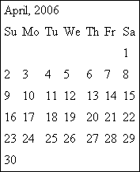

# 第 12 章 ■ 日期和时间

使用`strtotime()`函数以及它所支持的 GNU 日期输入格式，这类计算几乎只受限于你的想象力。

### 创建日历

Calendar 包包含 12 个类，能够自动执行大量与时间相关的任务。以下列表仅列举了运用这个强大包的一些实用方式：

-   以你选择的格式渲染任意范围（最常见的是小时、天、周、月和年）的日历。
-   以类似 Gnome Calendar 和 Windows 日期与时间属性界面的方式浏览日历。
-   验证任何日期。例如，你可以使用 Calendar 来判断 2019 年 4 月 1 日是否为星期一（确实是）。
-   扩展 Calendar 的功能以处理各种其他任务，例如日期分析。

在本节中，你将了解 Calendar 最重要的功能，随后会通过几个示例向你展示如何实际实现其中一些有趣的特性。但在你开始利用这个强大的包之前，需要先安装它。尽管你在第 11 章已经了解了 PEAR 包的安装过程，但为了那些还不完全熟悉安装过程的读者，接下来会再次说明必要的步骤。

#### 安装 Calendar

要充分利用 Calendar 的所有功能，你还需要安装 Date 包。在接下来的 Calendar 安装过程中，我们会一并处理这两个包：

```
%>pear install Date
正在下载 Date-1.4.3.tgz ...
开始下载 Date-1.4.3.tgz (42,048 字节)
............完成: 42,048 字节
安装成功: Date 1.4.3
```

```
%>pear install -f Calendar
警告: Calendar 状态为 'beta'，其稳定性低于 'stable' 状态
正在下载 Calendar-0.5.2.tgz ...
开始下载 Calendar-0.5.2.tgz (60,164 字节)
..............完成: 60,164 字节
可选依赖:
建议安装 'Date' 包以利用某些功能。
安装成功: Calendar 0.5.2
%>
```

在安装 Calendar 时使用了 `-f` 标志，因为截至撰写本文时，Calendar 仍是一个 beta 版本。到本书出版时，Calendar 可能已经正式稳定，这意味着你不需要再包含这个标志。关于 PEAR 和 install 命令的完整介绍，请参见第 11 章。

[www.it-ebooks.info](http://www.it-ebooks.info/)

#### Calendar 基础

Calendar 是一个相当大的包，包含 12 个公共类，分为四个不同的组：

-   **日期类**：用于管理六个日期组件：年、月、日、时、分、秒。每个组件都有一个单独的类：分别是 `Calendar_Year`、`Calendar_Month`、`Calendar_Day`、`Calendar_Hour`、`Calendar_Minute` 和 `Calendar_Second`。
-   **表格日期类**：用于构建基于月和周网格的日历。有三个类可用：`Calendar_Month_Weekdays`、`Calendar_Month_Weeks` 和 `Calendar_Week`。这些类分别用于构建每日和每周格式的月度表格日历，以及每周七天格式的周度表格日历。
-   **验证类**：用于验证日期。这两个类是 `Calendar_Validator`（用于验证日期的任何组件，并可由任何子类调用）和 `Calendar_Validation_Error`（在日期有问题时提供额外的报告级别，并提供了几种分解日期值的方法）。
-   **装饰器类**：用于扩展其他子类的功能，而无需实际扩展它们。例如，假设你想用一些功能来扩展 Calendar 的功能，用于分析任意月份中落在 17 日的星期六的数量。装饰器是实现该功能的理想方式。提供了几个装饰器供参考和使用，包括 `Calendar_Decorator`、`Calendar_Decorator_Uri`、`Calendar_Decorator_Textual` 和 `Calendar_Decorator_Wrapper`。为了专注于讨论最常用的功能，此处不讨论 Calendar 的装饰器内部细节；你可以研究随 Calendar 安装的装饰器，以获得关于如何创建自己的装饰器的思路。

所有这四个类都是 Calendar 的子类，这意味着 Calendar 类的所有方法对每个子类都可用。有关这个超类及其四个子类方法的完整摘要，请参见 [`pear.php.net/package/Calendar`](http://pear.php.net/package/Calendar)。

#### 创建月度日历

如今，基于网格的月度日历似乎是最常见的网站功能之一，特别是考虑到博客等基于时间的内容的流行。然而从头开始创建一个这样的日历可能出乎意料地困难。幸运的是，Calendar 为你处理了所有繁琐的工作，只需几行代码就能创建一个网格日历。例如，假设我们想为当前月份和年份创建一个日历，如图 12-1 所示。

创建这个日历的代码出奇地简单，如列表 12-1 所示。

代码之后是对关键行的解释，为方便起见，引用了它们的行号。

[www.it-ebooks.info](http://www.itebooks.info/)



**图 12-1.** *2006 年 4 月的一个网格日历*

**列表 12-1.** *创建一个月度日历*

```php
01 <?php
02 require_once 'Calendar/Month/Weekdays.php';
04 $month = new Calendar_Month_Weekdays(2006, 4, 0);
06 $month->build();
08 echo "<table cellspacing='5'>\n";
09 echo "<tr><td class='monthname' colspan='7'>April, 2006</td></tr>";
10 echo "<tr><td>Su</td><td>Mo</td><td>Tu</td><td>We</td>
11 <td>Th</td><td>Fr</td><td>Sa</td></tr>";
12 while ($day = $month->fetch()) {
13     if ($day->isFirst()) {
14         echo "<tr>";
15     }
17     if ($day->isEmpty()) {
18         echo "<td>&nbsp;</td>";
19     } else {
20         echo '<td>'.$day->thisDay()."</td>";
21     }
23     if ($day->isLast()) {
24         echo "</tr>";
25     }
26 }
28 echo "</table>";
29 ?>
```

-   **第 02 行：** 因为我们想要构建一个表示月份的网格日历，所以需要 `Calendar_Month_Weekdays` 类。第 02 行使该类对脚本可用。
-   **第 04 行：** 实例化 `Calendar_Month_Weekdays` 类，并将日期设置为 2006 年 4 月。日历应按照从星期日到星期六的布局排列，因此第三个参数设置为 0，这代表星期日的数字偏移量（1 代表星期一，2 代表星期二，依此类推）。
-   **第 06 行：** `build()` 方法生成一个包含该月所有日期的数组。
-   **第 12 行：** 开始一个 `while` 循环，负责遍历该月的每一天。
-   **第 13–15 行：** 如果 `$Day` 是一周的第一天，则输出一个 `<tr>` 标签。
-   **第 17–21 行：** 如果 `$Day` 为空，则输出一个空单元格。否则，输出日期数字。
-   **第 23–25 行：** 如果 `$Day` 是一周的最后一天，则输出一个 `</tr>` 标签。

非常简单，不是吗？创建周度和日度日历的操作原理非常相似。只需选择合适的类，并根据需要调整格式即可。

### 验证日期和时间


