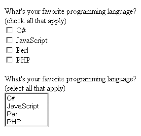
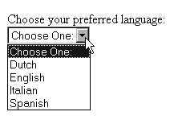

# 将表单数据传递给函数的过程

将表单数据传递给函数的过程与传递任何其他变量的过程完全相同；你只需将提交的表单数据作为函数参数传递即可。假设你希望在前一个示例中引入一些服务器端验证，使用自定义函数来检查电子邮件地址的语法有效性。清单 13-1 展示了修改后的脚本。

**清单 13-1.** *在函数中验证表单数据*

```php
<?php

// Function used to check email syntax

function validate_email($email)

{

// Create the syntactical validation regular expression

$regexp = "^([_a-z0-9-]+)(\.[_a-z0-9-]+)*@([a-z0-9-]+)

(\.[a-z0-9-]+)*(\.[a-z]{2,6})$";

// Validate the syntax

if (eregi($regexp, $email)) return 1;

else return 0;

}

// Has the form been submitted?

if (isset($_POST['submit']))

{

echo "Hi ".$_POST['name']."!<br />";

if (validate_email($_POST['email']))

echo "The address ".$_POST['email']." is valid!"; else

echo "The address <strong>".$_POST['email']."</strong> is invalid!";

}

?>

<form action="subscribe.php" method="post">

<p>

Name:<br />

<input type="text" name="name" size="20" maxlength="40" value="" />

</p>

<p>

Email Address:<br />

<input type="text" name="email" size="20" maxlength="40" value="" />

</p>

<input type="submit" name = "submit" value="Go!" />

</form>
```

[www.it-ebooks.info](http://www.it-ebooks.info/)



第 13 章 ■ 表单与导航提示

**307**

#### 处理多值表单组件

多值表单组件（如复选框和多选下拉框）极大地增强了基于 Web 的数据收集能力，因为它们允许用户为同一个表单项目同时选择多个值。例如，考虑一个用于评估用户计算机相关兴趣的表单。具体来说，你希望用户指出她感兴趣的编程语言。使用复选框或多选下拉框，这个表单项目可能类似于图 13-1 所示。

用于呈现复选框的 HTML 代码如下：

```html
<input type="checkbox" name="languages" value="csharp" />C#<br />
<input type="checkbox" name="languages" value="jscript" />JavaScript<br />
<input type="checkbox" name="languages" value="perl" />Perl<br />
<input type="checkbox" name="languages" value="php" />PHP<br />
```

**图 13-1.** *使用两种不同表单项目表示相同数据*

多选下拉框的 HTML 可能如下所示：

```html
<select name="languages" multiple="multiple">
<option value="csharp">C#</option>
<option value="jscript">JavaScript</option>
<option value="perl">Perl</option>
<option value="php">PHP</option>
</select>
```

由于这些组件是多值的，表单处理器必须能够识别单个表单变量可能被赋予多个值。在前面的示例中，请注意两者都使用名称 `languages` 来引用多个语言条目。PHP 如何处理这个问题？也许并不令人意外，它将其视为一个数组。为了让 PHP 能够识别单个表单变量可能被赋予多个值（即将其视为数组），你需要对表单项目名称进行一个小修改，在其后附加一对方括号。因此，名称将从 `languages` 变为 `languages[]`。重命名后，PHP 将像处理任何其他数组一样处理提交的变量。考虑一个完整的示例，位于文件 `multiplevaluesexample.php` 中：

[www.it-ebooks.info](http://www.it-ebooks.info/)

**308**

第 13 章 ■ 表单与导航提示

```php
<?php

if (isset($_POST['submit']))

{

echo "You like the following languages:<br />";

foreach($_POST['languages'] AS $language) echo "$language<br />";

}

?>

<form action="multiplevalueexample.php" method="post"> What's your favorite programming language?<br /> (check all that apply):<br />

<input type="checkbox" name="languages[]" value="csharp" />C#<br />

<input type="checkbox" name="languages[]" value="jscript" />JavaScript<br />

<input type="checkbox" name="languages[]" value="perl" />Perl<br />

<input type="checkbox" name="languages[]" value="php" />PHP<br />

<input type="submit" name="submit" value="Go!" />

</form>
```

如果用户选择了 `C#` 和 `PHP` 语言，她将看到以下输出：

```
You like the following languages:
csharp
php
```

#### 使用 PHP 生成表单

当然，许多基于 Web 的表单需要比简单地组合几个字段更多的工作。复选框、单选按钮和下拉框等元素都非常有用，并且可以显著增加表单的实用性。然而，你通常希望根据从某些动态源（例如数据库）检索到的数据来设置这些项目的值。PHP 使得此类任务变得非常简单，正如本节所解释的那样。

假设你的网站提供了一个注册表单，其中要求用户选择其首选语言等信息。该语言将作为未来电子邮件通信的默认语言。然而，语言的选择取决于你的支持团队的语言能力，而这些记录由人力资源部门维护。因此，为了不提供过时的可用语言列表，你将用于此表单项目的下拉列表直接链接到 HR 部门使用的语言表。此外，由于你知道下拉列表的每个元素包含三个项目（一个标识列表本身的名称，以及每个列表项的一个值和一个名称），你可以创建一个抽象此任务的函数。这个函数，创造性地命名为 `create_dropdown()`，接受四个输入参数：

- `$identifier`：分配给下拉列表的名称，决定了如何引用提交的变量。
- `$pairs`：一个关联数组，包含用于创建选择菜单条目的键值对。

[www.it-ebooks.info](http://www.it-ebooks.info/)

第 13 章 ■ 表单与导航提示

**309**

- `$firstentry`：作为下拉列表的视觉提示，并放置在第一个位置。
- `$multiple`：此下拉列表是否允许多选？如果是，传入 `multiple`；如果否，则不传参（此参数为可选参数）。

函数如下：

```php
function create_dropdown($identifier,$pairs,$firstentry,$multiple="")

{

// Start the dropdown list with the <select> element and title $dropdown = "<select name=\"$identifier\" multiple=\"$multiple\">"; $dropdown .= "<option name=\"\">$firstentry</option>";

// Create the dropdown elements

foreach($pairs AS $value => $name)

{

$dropdown .= "<option name=\"$value\">$name</option>";

}

// Conclude the dropdown and return it

echo "</select>";

return $dropdown;

}
```

以下代码片段使用了该函数，并利用 PostgreSQL 数据库存储表单信息：

```php
<?php

// Connect to the db server and select a database

$conn=pg_connect("host=localhost dbname=corporate

user=website password=secret")

or die(pg_last_error($conn));

// Retrieve the language table data

$query = "SELECT id,name FROM language ORDER BY name";

$result = pg_query($conn, $query);

// Create an associative array based on the table data

while($row = pg_fetch_array($result))

{

$value = $row["id"];

$name = $row["name"];

$pairs["$value"] = $name;

}

echo "Choose your preferred language: <br />";

echo create_dropdown("language",$pairs,"Choose One:");

?>
```

[www.it-ebooks.info](http://www.it-ebooks.info/)



**310**

第 13 章 ■ 表单与导航提示

图 13-2 展示了检索值后表单的呈现效果。

**图 13-2.** *一个由 PHP 生成的表单元素*

#### 自动选择表单数据


