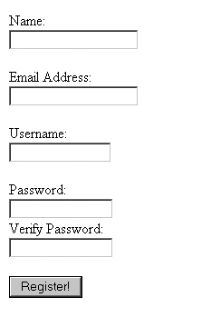

# 清单 14-10

`清单 14-10`提供了注册代码。为了节省篇幅，我们省略了注册表单的 HTML 代码，因为你现在应该已经对这种语法相当熟悉了。如图 14-2 所示的这个表单存储在名为`registration.html`的文件中，并通过`file_get_contents()`函数显示。

[www.it-ebooks.info](http://www.it-ebooks.info/)



**338**

第 14 章 ■ 身份验证

**图 14-2.** *注册表单*

用户提供必要的输入并提交表单数据。随后脚本会确认密码和密码验证字符串是否匹配，如果不匹配则显示错误信息。

如果密码验证通过，则会建立与 PostgreSQL 服务器的连接，并执行相应的插入查询。

**清单 14-10.** *用户注册（registration.php）*

```php
<?php

/*
用户是否提交了数据？
如果没有，则显示注册表单。
*/

if (! isset($_POST['submitbutton'])) {

echo file_get_contents("/templates/registration.html");

/* 表单数据已提交。 */

} else {

$conn=pg_connect("host=localhost dbname=corporate
user=corpweb password=secret")
or die(pg_last_error($conn));

/* 确保密码与密码验证器匹配。 */

if ($_POST['pswd'] != $_POST['pswdagain']) {

echo "<p>密码不匹配。请返回并重试。</p>";

/* 密码匹配，尝试将信息插入到 userauth 表中。 */

} else {

try {

$query = "INSERT INTO userauth (commonname, email, username, pswd) VALUES ('$_POST[name]', '$_POST[email]',
'$_POST[username]', md5('$_POST[pswd]'));
$result = pg_query($query);

if (! $result) {

throw new Exception(
"遇到注册问题！"
);

} else {

echo "<p>注册成功！</p>";
}

} catch(Exception $e) {

echo "<p>".$e->getMessage()."</p>";
} #endCatch
}
}
?>
```

这里提供的注册脚本仅用于演示目的；如果你希望在关键任务应用程序中使用此类脚本，则需要包含额外的错误检查机制。以下只是需要验证的几项内容：

• 所有字段均已填写。
• 电子邮件地址有效。这一点很重要，因为电子邮件地址很可能是密码恢复等事宜的主要沟通途径（下一节将讨论此主题）。
• 密码和密码验证字符串匹配（上述示例已完成）。
• 数据库中尚不存在该用户。
• 没有潜在恶意代码被插入到字段中。此问题将在第 21 章详细讨论。
• 密码长度足够且密码语法正确。仅由字母或数字组成的较短密码，在遭遇持续尝试时，更有可能被破解。

##### 使用 CrackLib 库测试密码可猜测性

由于害怕忘记密码，用户往往会选择容易记住的内容，例如他们狗狗的名字、母亲的 maiden name（娘家姓），甚至自己的名字或年龄。讽刺的是，这种做法通常并不能帮助用户记住密码，更糟糕的是，它为攻击者提供了一条侵入本应受限制系统的捷径，要么通过研究用户背景并尝试各种密码直到找到正确的，要么通过暴力破解反复尝试来识别密码。

无论哪种情况，密码通常都会被破解，因为用户选择了一个易于猜测的密码，这不仅可能导致用户个人数据泄露，还可能危及系统本身。

通过将无约束的密码创建过程转变为自动化的密码审批程序，可以相当简单地降低引入此类易猜测密码的可能性。PHP 通过 Alec Muffett（http://www.crypticide.org/users/alecm/）创建的 CrackLib 库为此提供了绝佳的手段。CrackLib 旨在通过设定某些基准来测试密码的强度，从而判断其可猜测性，这些基准包括：

• **长度：** 密码必须长于四个字符。
• **大小写：** 密码不能全是小写字母。
• **区分度：** 密码必须包含足够的字符差异。此外，密码不能为空。
• **常见性：** 密码不能基于字典中的单词。此外，密码不能基于字典中单词的反写。本小节将稍后进一步讨论字典。
• **标准编号：** 由于 CrackLib 的作者是英国人，他认为检查类似于国家保险号码（NI 号码）的模式是个好主意。NI 号码在英国用于税务目的，类似于美国使用的社会安全号码（SSN）。巧合的是，这两个号码都是九位字符，如果用户愚蠢到使用如此敏感的身份标识作为密码，该机制可以有效阻止其使用。

###### 安装 PHP 的 CrackLib 扩展

要使用 CrackLib 扩展，首先需要下载并安装 CrackLib 库，可从 http://www.crypticide.org/users/alecm/ 获取。如果你运行的是 Linux/Unix 变体，它可能已经安装，因为 CrackLib 通常与这些操作系统捆绑在一起。完整的安装说明可在 CrackLib tar 包中的 README 文件中找到。

PHP 的 CrackLib 扩展自 5.0.0 版本起已从 PHP 中分离，并移至 PHP 扩展社区库（PECL），这是一个 PHP 扩展的存储库。因此，要使用 CrackLib，你需要从 PECL 下载并安装 crack 扩展。本书不涵盖 PECL 的内容，因此如果你想利用 CrackLib，请查阅 PECL 网站 http://pecl.php.net 上的扩展安装说明。

安装 CrackLib 后，你需要确保`php.ini`中的`crack.default_dictionary`指令指向一个密码字典。这类字典在互联网上比比皆是，搜索一下就能找到许多结果。本小节稍后你将了解更多关于各类可供使用字典的信息。

###### 使用 CrackLib 扩展

使用 PHP 的 CrackLib 扩展相当简单。清单 14-11 提供了一个完整的使用示例。

**清单 14-11.** *使用 PHP 的 CrackLib 扩展*

```php
<?php

$pswd = "567hejk39";

/* 打开字典。请注意字典文件名不包含扩展名。 */

$dictionary = crack_opendict('/usr/lib/cracklib_dict');

// 检查密码的可猜测性
$check = crack_check($dictionary, $pswd);

// 获取结果
echo crack_getlastmessage();

// 关闭字典
crack_closedict($dictionary);
?>
```

在这个特定示例中，`crack_getlastmessage()`返回字符串“strong password”，因为由`$pswd`表示的密码足够难以猜测。然而，如果密码较弱，可能会返回多种不同的消息之一。表 14-1 提供了一些其他密码，以及将它们传递给`crack_check()`后的结果。

**表 14-1.** *密码候选及 `crack_check()` 函数的响应*

| **密码** | **响应** |
|--------------|--------------|
| `mary` | 太短 |
| `it’s WAY too short` | 过于简单/系统化 |
| `street` | 未包含足够的**不同**字符 |

通过编写简短的条件语句，你可以基于 CrackLib 返回的信息创建用户友好、详细的响应。当然，如果响应是“strong password”（强密码），


你可以允许用户选择的密码生效。

##### 字典

`Listing 14-11`使用了`cracklib_dict.pwd`字典，该字典由 CrackLib 在安装过程中生成。注意，在示例中，引用该文件时未包含扩展名`.pwd`。这似乎是 PHP 引用此文件时的一个特有问题，未来可能会发生变化，使得扩展名也成为必需。

你也可以自由使用其他字典，互联网上有大量免费字典可用。此外，你几乎可以找到针对每种口语的字典。牛津大学的 FTP 站点（`ftp.ox.ac.uk`）上有一个特别完整的字典仓库。除了大量语言字典外，该站点还提供许多有趣的专业字典，包括一个包含许多《星际迷航》剧情摘要关键词的字典。无论如何，无论你决定使用哪个字典，只需将其位置分配给`crack.default_dictionary`指令，或通过`crack_opencict()`打开它。

##### 一次性 URL 与密码恢复

就像太阳升起一样确定，你的应用用户总会忘记密码。我们所有人都曾因忘记此类信息而感到内疚，而这并不完全是我们的错。花点时间列出你经常使用的所有登录组合；我猜你至少有 12 种组合。

电子邮件、工作站、服务器、银行账户、公用事业、在线购物、证券和抵押贷款经纪……如今我们几乎用密码管理一切。由于你的应用显然会为用户列表再添加一对登录信息，因此当用户忘记密码时，应提供一个简单、自动化的机制来检索或重置密码。根据登录所保护材料的敏感性，检索密码可能需要打电话或通过邮政服务发送密码。一如既往，在设计可能被入侵者利用的机制时要谨慎。本节探讨一种此类机制，称为一次性 URL。

一次性 URL 通常提供给用户，以确保在没有其他认证机制可用时，或用户认为认证对于手头任务过于繁琐时的唯一性。例如，假设你维护一份新闻通讯订阅者列表，并想知道哪些订阅者以及有多少订阅者在实际阅读每月的每一期。

仅仅将新闻通讯嵌入电子邮件中是不够的，因为你永远不知道有多少订阅者只是从收件箱中删除邮件而不看内容。相反，你可以为他们提供一个指向新闻通讯的一次性 URL，其中一个可能如下所示：

`http://www.example.com/newsletter/0503.php?id=9b758e7f08a2165d664c2684fddbcde2`

为了准确知道哪些用户对该期新闻通讯感兴趣，每个用户都被分配了一个类似上述 URL 中所示的唯一 ID 参数，并存储在某个订阅者表中。这些值通常是伪随机的，使用 PHP 的`md5()`和`uniqid()`函数生成，如下所示：

```
$id = md5(uniqid(rand(),1));
```

订阅者表可能类似于以下内容：

```sql
CREATE TABLE subscriber (
    rowid serial,
    email varchar(55) not null,
    uniqueid varchar(32) not null,
    readNewsletter char,
    CONSTRAINT subscriber_id PRIMARY KEY(rowid)
);
```

当用户点击此链接进入新闻通讯时，在显示新闻通讯之前可能会执行一个类似于以下内容的函数：

```php
function read_newsletter($id) {
    $query = "UPDATE subscriber SET readNewsletter='Y' WHERE uniqueid='$id'";
    return pg_query($query);
}
```


结果就是，你将确切知晓有多少订阅者对这份简报感兴趣，因为他们都主动点击了链接。

同样的概念也可以应用于密码恢复。为了说明如何实现，请考虑修改后的 `userauth` 表，如代码清单 14-12 所示。

**代码清单 14-12.** *修改后的 `userauth` 表*

```
create table userauth (

rowid serial,

commonname varchar(35) not null,

username varchar(8) not null,

pswd varchar(32) not null,

uniqueidentifier varchar(32) not null,

CONSTRAINT userauth_id PRIMARY KEY(rowid)

);
```

假设该表中的某个用户忘记了密码，于是他点击了登录提示附近常见的“忘记密码？”链接。用户会进入一个页面，要求他输入电子邮件地址。输入地址并提交表单后，会执行一个类似于代码清单 14-13 所示的脚本。

**代码清单 14-13.** *一次性 URL 生成器*

```
<?php

// 创建唯一标识符

$id = md5(uniqid(rand(),1));

// 将用户的唯一标识符字段设置为唯一 ID

$query = "UPDATE userauth SET uniqueidentifier='$id' WHERE email=$_POST[email]"; $result = pg_query($query);

$email = <<< email

亲爱的用户，

请点击以下链接重置您的密码：

http://www.example.com/users/lostpassword.php?id=$id

email;

[www.it-ebooks.info](http://www.it-ebooks.info/)

**344**

第 14 章 认证

// 通过电子邮件向用户发送密码重置选项

mail($_POST['email'],"密码恢复","$email","发件人：services@example.com"); echo "<p>重置密码的说明已发送至 $_POST[email]</p>";

?>
```

当用户收到这封电子邮件并点击链接后，他会被引导至代码清单 14-14 中所示的脚本 `lostpassword.php`。

**代码清单 14-14.** *重置用户密码*

```
<?php

// 创建一个长度为五个字符的伪随机密码

$pswd = substr(md5(uniqid(rand(),1),5));

// 使用新密码更新 userauth 表

$query = "UPDATE userauth SET pswd='$pswd' WHERE uniqueidentifier=$_GET[id]"; $result = pg_query($query);

// 向用户显示新密码

echo "<p>您的密码已重置为 $pswd。请登录并将密码更改为您喜欢的密码。</p>";

?>
```

当然，这只是众多恢复机制中的一种。例如，你可以使用类似的脚本为用户提供一个重置自己密码的表单。

### 本章小结

本章介绍了 PHP 的认证功能，这些特性几乎肯定会被整合到你未来的许多应用程序中。除了讨论围绕该功能的基本概念外，我们还研究了几种常见的认证方法，包括：针对硬编码值的认证、基于文件的认证、基于数据库的认证、基于 IP 的认证，以及使用 PEAR 的 HTTP 认证功能。我们还探讨了如何通过 PHP 的 CrackLib 扩展来降低密码的可猜测性。最后，我们讨论了使用一次性 URL 进行密码恢复的方法。

下一章将讨论另一组常用的 PHP 功能——通过浏览器处理文件上传。

[www.it-ebooks.info](http://www.it-ebooks.info/)

