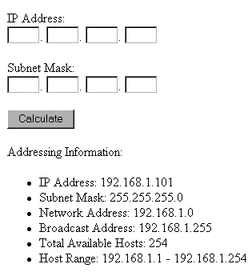

# 第 16 章 ■ 网络编程

**清单 16-2** *子网转换器*

```
<form action="netaddr.php" method="post">

<p>

IP 地址：<br />

<input type="text" name="ip[]" size="3" maxlength="3" value="" />.

<input type="text" name="ip[]" size="3" maxlength="3" value="" />.

<input type="text" name="ip[]" size="3" maxlength="3" value="" />.

<input type="text" name="ip[]" size="3" maxlength="3" value="" />

</p>

<p>

子网掩码：<br />

<input type="text" name="sm[]" size="3" maxlength="3" value="" />.

<input type="text" name="sm[]" size="3" maxlength="3" value="" />.

<input type="text" name="sm[]" size="3" maxlength="3" value="" />.

<input type="text" name="sm[]" size="3" maxlength="3" value="" />

</p>

<input type="submit" name="submit" value="计算" />

</form>

<?php

if (isset($_POST['submit']))

{

    // 连接 IP 表单组件并转换为 IPv4 格式

    $ip = implode('.',$_POST['ip']);

    $ip = ip2long($ip);

    // 连接子网掩码表单组件并转换为 IPv4 格式

    $netmask = implode('.',$_POST['nm']);

    $netmask = ip2long($netmask);

    // 计算网络地址

    $na = ($ip & $netmask);

    // 计算广播地址

    $ba = $na | (~$netmask);

    // 将地址转换回点分十进制表示并显示

    echo "寻址信息：<br />";

    echo "<ul>";

    echo "<li>IP 地址：". long2ip($ip)."</li>";

    echo "<li>子网掩码：". long2ip($netmask)."</li>";

    echo "<li>网络地址：". long2ip($na)."</li>";

    echo "<li>广播地址：". long2ip($ba)."</li>";

    echo "<li>可用主机总数：".($ba - $na - 1)."</li>";

    echo "<li>主机范围：". long2ip($na + 1)." - ".
```

[www.it-ebooks.info](http://www.it-ebooks.info/)



**397**

```
long2ip($ba - 1)."</li>";

    echo "</ul>";

}

?>
```

我们来看一个例子。如果输入 IP 地址为 `192.168.1.101`，子网掩码为 `255.255.255.0`，你将看到如图 16-3 所示的输出。

**图 16-3** *计算网络寻址*

### 测试用户带宽

尽管当今网站中普遍使用了各种带宽密集型媒体，但请记住，并非所有用户都能享受高速网络连接。你可以通过 PHP 自动测试用户的网络速度：向用户发送相对大量的数据，然后记录完成传输所需的时间。

创建将要传输给用户的数据文件。实际上，该文件可以是任何内容，因为用户永远不会真正看到它。建议通过生成大量文本并写入文件的方式来创建它。例如，以下脚本将生成一个大约 1500KB 大小的文本文件：

```
<?php

// 创建一个新文件，命名为"textfile.txt"

$fh = fopen("textfile.txt","w");

// 重复向文件写入单词"bandwidth"

for ($x=0;$x<170400;$x++) fwrite($fh,"bandwidth");

// 关闭文件

fclose($fh);

?>
```

现在我们来编写计算网络速度的脚本。该脚本如清单 16-3 所示。

[www.it-ebooks.info](http://www.it-ebooks.info/)

**398**

**清单 16-3** *计算网络带宽*

```
<?php

// 获取要发送给用户的数据

$data = file_get_contents("textfile.txt");

// 确定数据的总大小（以千字节为单位）

$fsize = filesize("textfile.txt") / 1024;

// 定义开始时间

$start = time();

// 将数据发送给用户

echo "<!-- $data -->";

// 定义结束时间

$stop = time();

// 计算发送数据所用的时间

$duration = $stop - $start;

// 用文件大小除以传输所用的秒数

$speed = round($fsize / $duration,2);

// 以千字节每分钟显示计算出的速度

echo "您的网络速度：$speed KB/秒。";

?>
```

执行此脚本会产生类似以下内容的输出：

```
Your network speed: 249.61 KB/sec.
```

### 本章小结


