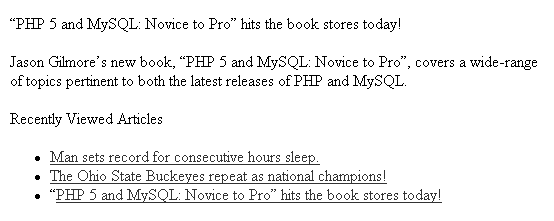
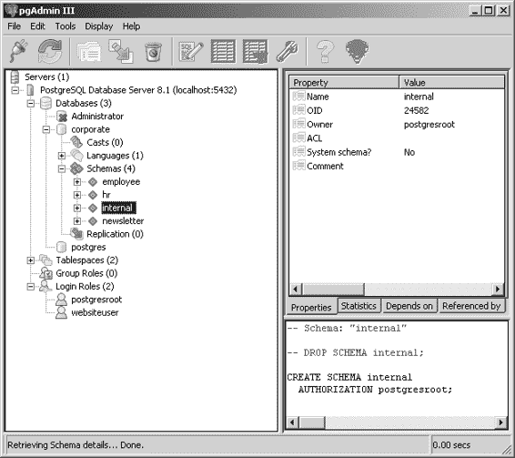
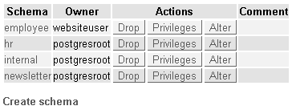
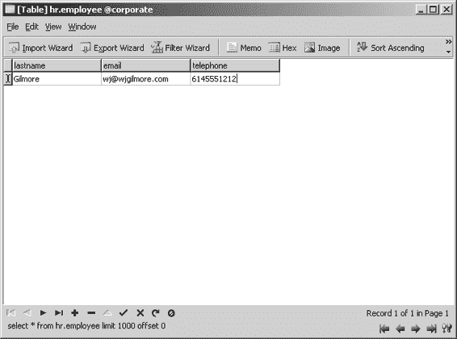

# 第 17 章 PHP 与 LDAP

#### 检索 LDAP 数据

由于 LDAP 是一种针对读取优化的协议，因此在任何实现中提供大量有用的数据搜索和检索函数都是合理的。确实，PHP 提供了许多用于检索目录信息的函数。本节将对这些函数进行说明。

##### `ldap_search()`

```
resource ldap_search (resource $link_id, string $base_dn, string $filter
                     [, array $attributes [, int $attributes_only [, int $size_limit
                     [, int $time_limit [, int $deref]]]]])
```

`ldap_search()` 函数是你在创建支持 LDAP 的 PHP 应用程序时几乎肯定会经常使用的函数，因为它是在指定目录（由 `base_dn` 表示）中基于特定过滤器（由 `filter` 表示）进行搜索的主要手段。成功搜索会返回一个结果集，该结果集可被其他函数（将在本节后续介绍）解析；失败的搜索则返回 `FALSE`。考虑以下示例，其中使用 `ldap_search()` 检索所有名字以字母 A 开头的用户：

```
$results = ldap_search($ldapconn, $dn, "givenName=A*");
```

有若干可选参数可调整搜索行为。第一个参数 `attributes` 允许你精确指定结果集中每个条目应返回哪些属性。因此，例如，如果你需要每个用户的名字、姓氏和电子邮件地址，可以将这些属性包含在 `attributes` 列表中：

```
$results = ldap_search($ldapconn, $dn, "givenName=A*", "givenName,surname,mail");
```

请注意，如果未显式指定 `attributes` 参数，则每个条目将返回所有属性，如果你不会用到所有这些属性，这将是低效的。因此，使用此参数通常是一个好主意。

如果可选参数 `attributes_only` 被启用（设置为 `1`），则仅检索属性类型。如果你只对了解特定属性在给定条目中是否可用，而不关心实际值，则可以使用此参数。

如果此参数被禁用（设置为 `0`）或省略，则属性类型及其对应的值都会被检索。

下一个可选参数 `size_limit` 可以限制检索到的条目数量。如果此参数被禁用（设置为 `0`）或省略，则对检索数量不设限制。以下示例检索名字以 A 开头的前五个用户的属性类型和对应值：

```
$results = ldap_search($ldapconn, $dn, "givenName=A*", 0, 5);
```

启用下一个可选参数 `time_limit` 会对搜索时间设置限制，以秒为单位。省略或禁用此参数（设置为 `0`）则没有设置时间限制，尽管 LDAP 服务器配置中通常（也经常）会设置这样的限制。下一个示例执行与上一个示例相同的搜索，但将搜索时间限制为 30 秒：

```
$results = ldap_search($ldapconn, $dn, "givenName=A*", 0, 5, 30);
```

[www.it-ebooks.info](http://www.it-ebooks.info/)

##### `ldap_read()`

```
resource ldap_read (resource $link_id, string $base_dn, string $filter
                   [, array $attributes [, int $attributes_only [, int $size_limit
                   [, int $time_limit [, int $deref]]]]])
```

当你需要搜索特定条目，并且可以通过由 `base_dn` 参数指定的特定 DN 来标识该条目时，应使用 `ldap_read()` 函数。因此，例如，要仅检索一个特定用户条目的详细信息，可以执行以下操作：

```php
<?php
/* 连接到 LDAP 服务器并绑定.... */
$dn = "CN=Jason Gilmore, OU=People, OU=staff, DC=ad, DC=example, DC=com";
```


```php
$results = ldap_read($ldapconn, $dn,
    '(objectclass=person)', array("givenName", "sn"));
$entry = ldap_get_entries($ldapconn, $sr);

echo "名字：".$entry[0]["givenname"][0]."<br />";
echo "姓氏：".$entry[0]["sn"][0]."<br />";
ldap_unbind($ldapconn);
?>
```

这将返回以下内容：

- 名字：Jason
- 姓氏：Gilmore

##### `ldap_list()`

`resource ldap_list (resource *link_id*, string *base_dn*, string *filter* [, array *attributes* [, int *attributes_only* [, int *size_limit* [, int *time_limit* [int *deref*]]]]]])`

`ldap_list()` 函数与 `ldap_search()` 相同，区别仅在于搜索仅限于由 `base_dn` 指定的 DN 的下一级。有关输入参数的说明，请参阅 `ldap_search()` 的讨论。

#### 处理条目值

大多数情况下，你可能会花费大量时间解析结果条目，以获取其中的核心内容——值。有几个函数可以简化这一过程，本节将逐一介绍它们。

[www.it-ebooks.info](http://www.it-ebooks.info/)

##### `ldap_get_values()`

`array ldap_get_values (resource *link_id*, resource *result_entry_id*, string *attribute*)`

你通常需要检查 `ldap_search()` 返回的每行结果集。一种方法是使用 `ldap_get_values()` 函数，它可以从条目 `result_entry_id` 中获取属性的值数组，如下例所示：

```php
<?php

/* 连接到 LDAP 服务器并绑定... */

$dn = "CN=Jason Gilmore, OU=People, OU=staff, DC=ad, DC=example, DC=com";
$results = ldap_read($ldapconn, $dn, '(objectclass=person)',
    array("givenName", "sn", "mail"));

$firstname = ldap_get_values($ldapconn, $results, "givenname");
$lastname = ldap_get_values($ldapconn, $results, "sn");
$mail = ldap_get_values($ldapconn, $results, "mail");

echo "名字：".$firstname[0]."<br />";
echo "姓氏：".$lastname[0]."<br />";
echo "电子邮件地址：";

$x=0;
while ($x < $mail["count"]) {
    echo $mail[$x]. " ";
    $x++;
}

?>
```

这会返回：

- 名字：Jason
- 姓氏：Gilmore
- 电子邮件地址：gilmore@example.edu wj@example.com wjgilmore@example.net

请注意，无论对应的属性是单值还是多值，都必须以数组元素的形式引用这些值。

##### `ldap_get_values_len()`

`array ldap_get_values_len (resource *link_id*, resource *result_entry_id*, string *attribute*)`

可以将二进制数据存储在 LDAP 目录中——例如，员工的 JPEG 图像或研究生的 PDF 简历。由于二进制数据的处理方式与其非二进制对应数据不同，因此在从数据存储中检索时必须使用一个特殊函数 `ldap_get_values_len()`。不过，以这种方式存储二进制数据并不常见，因此这里不再举例说明。

[www.it-ebooks.info](http://www.it-ebooks.info/)

#### 统计检索条目数

了解一次搜索检索到的条目数量通常很有用。PHP 提供了一个用于此目的的函数 `ldap_count_entries()`。此外，你还可以通过本章中其他函数的介绍，了解多种隐式实现相同功能的方法。

##### `ldap_count_entries()`

`int ldap_count_entries (resource *link_id*, resource *result_id*)`

`ldap_count_entries()` 函数返回由 `result_id` 指定的搜索结果中的条目数。例如：

```php
$results = ldap_search($ldapconn, $dn, "sn=G*");
$count = ldap_count_entries($ldapconn, $results);
echo "<p>检索到的条目总数：$count</p>";
```

这会返回：

```
检索到的条目总数：45
```

#### 检索属性

你通常需要了解搜索返回的属性信息。本节将介绍几个用于此目的的函数。

##### `ldap_first_attribute()`

`string ldap_first_attribute (resource *link_id*, resource *result_entry_id*, int *&pointer_id*)`
```


`ldap_first_attribute()` 函数的工作方式与 `ldap_first_entry()` 非常相似，不同之处在于它旨在获取由 `result_entry_id` 标识的结果条目中的第一个属性。关于此函数的一个容易混淆的点是 `pointer_id` 参数，它通过引用传递给此函数。尽管它是一个输入参数，但 `ldap_first_attribute()` 实际上会使用此参数来设置一个指针，如果你希望获取该条目的其他属性及其对应值，后续 `ldap_next_attribute()` 会使用该指针。示例如下：

```php
$results = ldap_search($ldapconn, $dn, "sn=G*", array(telephoneNumber, mail));
$entry = ldap_first_entry($ldapconn, $results);

$fAttr = ldap_first_attribute($ldapconn, $entry, $pointer);

echo $fAttr;
```

这将返回：

```
mail
```

##### `ldap_next_attribute()`

`string ldap_next_attribute (resource $link_id, resource $result_entry_id, int &$pointer_id)`

`ldap_next_attribute()` 函数用于检索由 `result_entry_id` 指定的条目中的属性。

通过使用由先前调用 `ldap_first_attribute()` 创建并通过引用传递给此函数的指针 `pointer_id`，重复调用此函数将依次检索条目中的每个属性。考虑以下示例：

```php
$results = ldap_search($ldapconn, $dn, "sn=G*",
  array(telephoneNumber, userPrincipalName, mail));
$entry = ldap_first_entry($ldapconn, $results);
$attr = ldap_first_attribute($ldapconn, $entry, $ber);
while ($attr = ldap_next_attribute($ldapconn, $entry, &$ber))
  echo $attr."<br />";
```

这将返回：

```
telephoneNumber
userPrincipalName
mail
```

##### `ldap_get_attributes()`

`array ldap_get_attributes (resource $link_id, resource $result_entry_id)`

`ldap_get_attributes()` 函数返回一个多维数组，其中包含由 `result_entry_id` 指定的条目中的属性及其对应的值。此函数非常有用，因为它让你能够方便地通过引用对应属性来检索特定值。此外，它还提供其他有用的信息：

- `$attrs["count"]`：该条目中属性的总数
- `$attrs[0]`：检索到的条目中的第一个属性
- `$attrs[n]`：检索到的条目中的第 *n* 个属性
- `$attrs["attribute"]["count"]`：分配给检索条目中属性 `attribute` 的值的数量
- `$attrs["attribute"][0]`：分配给检索条目中属性 `attribute` 的第一个值
- `$attrs["attribute"][n]`：分配给检索条目中属性 `attribute` 的第 *n* + 1 个值

考虑一个示例。假设你执行以下搜索：

```php
$results = ldap_search($ldapconn, $dn, "sn=G*", array(telephoneNumber, mail));
```

然后你调用 `ldap_first_entry()` 来指定结果集的初始指针：

```php
$entry = ldap_first_entry($ldapconn, $results);
```

最后，你调用 `ldap_get_attributes()`，并传入 `$entry`，以获取属性及其对应值的数组：

```php
$attrs = ldap_get_attributes($ldapconn, $entry);
```

然后，你可以像这样引用第一个条目的 `mail` 值：

```php
$emailAddress = $attrs["mail"][0]
```

你也可以像这样遍历所有属性：

```php
while ($x < $attrs["count"]) {
  echo $attrs[$x].": ".$attrs[$x][0]."<br />";
  $x++;
}
```

这将返回：

```
(614) 555-4567: jason@example.com
```

当然，你不太可能只想要第一个条目的属性和值。你可以通过额外的循环块和 `ldap_next_entry()` 函数轻松遍历所有检索到的条目。为了演示这一点，我们扩展上一个示例：

```php
$dn = "OU=People,OU=facstf,DC=ad,DC=example,DC=com";
$attributes = array("sn","telephonenumber");
$filter = "memberof=CN=staff,OU=Groups,DC=ad,DC=example,DC=com";
$result = ldap_search($ad, $dn, $filter, $attributes);

$entry = ldap_first_entry($ad, $result);
while($entry) {
  $attrs = ldap_get_attributes($ad, $entry);
```


```php
for ($i=0; $i<$attrs["count"]; $i++)
{
    $attrName = $attrs[$i];
    $values = ldap_get_values($ad, $entry, $attrName);
    for ($j=0; $j < $values["count"]; $j++)
    {
        echo "$attrName: ".$values[$j]."<br />";
    }
}
$entry = ldap_next_entry($ad, $entry);
}
```

[www.it-ebooks.info](http://www.it-ebooks.info/)

**410**

第 17 章 ■ PHP 与 LDAP

上述代码返回以下结果：

```
sn: Gilmore
telephonenumber: 415-555-9999
telephonenumber: 415-555-9876
sn: Reyes
telephonenumber: 212-555-1234
sn: Heston
telephonenumber: 412-555-3434
telephonenumber: 210-555-9855
```

`ldap_get_dn()`

`string ldap_get_dn (resource $link_id, resource $result_entry_id)` `ldap_get_dn()` 函数返回由 `result_entry_id` 标识的结果条目的 DN。

请看以下示例：

```php
<?php
/* ... 连接到 LDAP 服务器并绑定到目录。 */
$dn = "OU=People,OU=staff,DC=ad,DC=example,DC=com";
/* 搜索目录 */
$results = ldap_search($ldapconn, $dn, "sn=G*");
/* 获取结果集的第一个条目。 */
$fe = ldap_first_entry($ldapconn, $results);
/* 输出第一个条目的 DN。 */
echo "DN: ".ldap_get_dn($ldapconn, $fe);
?>
```

上述代码返回：

```
DN: CN=Jason Gilmore,OU=People,OU=staff,DC=ad,DC=example,DC=com
```

**排序与比较 LDAP 条目**

处理 LDAP 数据时，对检索到的条目进行排序和比较通常是必要任务。PHP 的两个 LDAP 函数能很好地完成这两项工作，本节将对它们分别进行介绍。

[www.it-ebooks.info](http://www.it-ebooks.info/)

第 17 章 ■ PHP 与 LDAP

**411**

`ldap_sort()`

`boolean ldap_sort (resource $link_id, resource $result, string $sort_filter)` 极为实用的 `ldap_sort()` 函数可以根据返回结果中的任意属性对结果集进行排序。排序是通过简单地比较每个条目的字符串值，并按升序重新排列来完成的。示例如下：

```php
<?php
/* 连接并绑定 */
$results = ldap_search($ldapconn, $dn, "sn=G*", array("givenname", "sn"));
ldap_sort($ldapconn, $results, "givenName");
$entries = ldap_get_entries($ldapconn, $results);
$count = $entries["count"];
for($i=0; $i<$count; $i++) {
    echo $entries[$i]["givenname"][0]." ".$entries[$i]["sn"][0]."<br />";
}
ldap_unbind($ldapconn);
?>
```

上述代码返回：

```
Jason Gilmore
John Gilmore
Robert Gilmore
```

> **注意** 当你尝试对多值属性进行排序时，此函数可能会产生不可预测的结果。

`ldap_compare()`

`boolean ldap_compare (resource $link_id, string $dn, string $attribute, string $value)` `ldap_compare()` 函数提供了一种简便的方法，用于将特定值与存储在由 `dn` 指定的给定 DN 中的属性值进行比较。比较成功时该函数返回 `TRUE`，否则返回 `FALSE`。

[www.it-ebooks.info](http://www.it-ebooks.info/)

**412**

第 17 章 ■ PHP 与 LDAP

例如，如果你想将输入的主要家庭电话号码与目录服务器中存储的某个用户的电话号码进行比较，可以执行以下代码：

```php
<?php
/* 连接并绑定 */
$dn = "CN=Jason Gilmore, OU=People, OU=staff, DC=ad, DC=example, DC=com";
$phone = "614 555-1234";
if (ldap_compare($ldapconn, $dn, "homePhone", $phone)) {
    echo "<p>您的电话号码是最新的</p>";
} else {
    echo "<p>输入的电话号码与我们的记录不匹配。
          也许您最近搬家了？</p>";
}
?>
```

**处理条目**

可以将 LDAP 条目视为类似于数据库行，由属性和对应的值组成。有几个函数可用于从结果集中提取此类条目，本节将对此进行介绍。

`ldap_first_entry()`

`resource ldap_first_entry (resource $link_id, resource $result_id)` `ldap_first_entry()` 函数检索由 `result_id` 指定的结果集中找到的第一个条目。检索后，可以将其传递给能够解析条目的函数，如 `ldap_get_values()` 或 `ldap_get_attributes()`。以下示例显示第一个用户的指定姓名和姓氏：

```php
<?php
/* ... 连接到 LDAP 服务器并绑定到目录。 */
$dn = "OU=People,OU=staff,DC=ad,DC=example,DC=com";
/* 搜索目录 */
$results = ldap_search($ldapconn, $dn, "sn=G*");
/* 检索第一个条目。 */
$firstEntry = ldap_first_entry($ldapconn, $results);
/* 检索指定姓名和姓氏。 */
$gn = ldap_get_values($ldapconn, $firstEntry, "givenname");
$sn = ldap_get_values($ldapconn, $firstEntry, "sn");
echo "用户的名称为 $gn $sn。";
?>
```

[www.it-ebooks.info](http://www.it-ebooks.info/)

第 17 章 ■ PHP 与 LDAP

**413**

上述代码返回：

```
用户的名称为 Jason Gilmore。
```

请注意，`ldap_get_values()` 返回的是一个数组，而不是单个值，即使数组中只找到一个项目也是如此。

`ldap_first_entry()` 还有另一个重要功能：它为 `ldap_next_entry()` 播种了初始结果集指针。这个问题将在下一节讨论。

`ldap_next_entry()`

`resource ldap_next_entry (resource $link_id, resource $result_entry_id)` `ldap_next_entry()` 函数对于遍历结果集非常有用，因为每次成功调用都会返回下一个条目，直到检索完所有条目。需要注意的是，在脚本中第一次调用 `ldap_next_entry()` 之前，必须先调用 `ldap_first_entry()`，因为 `result_entry_id` 来源于后者。以下示例是对前一个示例的修改，这次返回结果集中每个条目的名字和姓氏：

```php
<?php
/* ... 连接到 LDAP 服务器并绑定到目录。 */
$dn = "OU=People,OU=staff,DC=ad,DC=example,DC=com";
/* 搜索目录 */
$results = ldap_search($ldapconn, $dn, "sn=G*");
/* 检索第一个条目。 */
$entry = ldap_first_entry($ldapconn, $results);
while ($entry) {
    /* 检索指定姓名和姓氏。 */
    $gn = ldap_get_values($ldapconn, $entry, "givenname");
    $sn = ldap_get_values($ldapconn, $entry, "sn");
    echo "用户的名称为 $gn[0] $sn[0]<br />";
    $entry = ldap_next_entry($ldapconn, $entry);
}
?>
```

上述代码返回以下结果：

```
用户的名称为 Jason Gilmore
用户的名称为 Davie Grimes
用户的名称为 Johnny Groovin
```

[www.it-ebooks.info](http://www.it-ebooks.info/)

第 17 章 ■ PHP 与 LDAP

**414**

`ldap_get_entries()`

`array ldap_get_entries (resource $link_id, resource $result_id)` `ldap_get_entries()` 函数提供了一种将结果集的所有成员放入多维数组的简便方法。以下列表说明了可以从该数组中获取的多种信息：

- `$return_value["count"]`：检索到的条目总数
- `$return_value[n]["dn"]`：结果集中第 *n* 个条目的 DN
- `$return_value[n]["count"]`：结果集中第 *n* 个条目可用的属性总数
- `$return_value[n]["attribute"]["count"]`：与第 *n* 个条目的属性关联的项目数
- `$return_value[n]["attribute"][m]`：第 *n* 个条目属性的第 *m* 个值
- `$return_value[n][m]`：位于第 *n* 个条目第 *m* 个位置的属性

请看一个示例：

```php
<?php
/* ... 连接到 LDAP 服务器并绑定到目录。 */
/* 搜索目录 */
$results = ldap_search($ldapconn, $dn, "sn=G*");
/* 创建属性和相应条目的数组。 */
$entries = ldap_get_entries($ldapconn, $results);
/* 找到了多少条目？ */
$count = $entries["count"];
/* 输出每个已定位用户的姓氏。 */
for($i=0; $i<$count; $i++) echo $entries[$i]["sn"][0]."<br />";
/* 关闭连接。 */
ldap_unbind($ldapconn);
?>
```

上述代码返回：

```
Gilmore
Gosney
Grinch
```

[www.it-ebooks.info](http://www.it-ebooks.info/)

第 17 章 ■ PHP 与 LDAP

**415**

请特别注意上述示例中引用多维数组的方式：

`$entries[$i]["sn"][0]`


这意味着请求的是第 *i* 个元素的 `sn` 属性中的第一项（PHP 的数组索引始终从零开始）。如果你处理的是多值属性，例如 `url`，则需要遍历 `url` 数组中的每个元素。对前面的脚本进行如下修改，即可轻松实现：

```
for($i=0;$i<$count;$i++) {
    $entry = $entries[$i];
    $attrCount = $entries[$i]["sn"]["count"];
    for($j=0;$j<$attrCount;$j++) {
        echo $entries[$i]["sn"][j]."<br />";
    }
}
```

#### 释放内存

尽管 PHP 在每个脚本执行结束时都会自动释放其消耗的所有内存，但有时确实需要在完成前显式管理内存。对于 LDAP 而言，如果在单次脚本调用中创建了大量大型结果集，则可能需要进行此类内存管理。PHP 提供了一个用于释放 LDAP 内存的函数，其说明如下。

`ldap_free_result()`

`boolean ldap_free_result (resource $result_id)`

要释放结果集占用的内存，请使用 `ldap_free_result()`，示例如下：

```
<?php
/* 连接并绑定到 LDAP 服务器... */
$results = ldap_search($ldapconn, $dn, "sn=G*");
/* 对结果集进行处理。 */
ldap_free_result($results);
/* 或许执行其他搜索... */
ldap_unbind($ldapconn);
?>
```

#### 插入 LDAP 数据

向目录中插入数据如同检索数据一样简单。本节将介绍 PHP 的两个 LDAP 插入函数。

`ldap_add()`

`boolean ldap_add (resource $link_id, string $dn, array $entry)`

你可以使用 `ldap_add()` 函数向 LDAP 目录添加新条目。`dn` 参数指定目录 DN，`entry` 参数是一个数组，指定要添加到目录的条目。示例如下：

```
<?php
/* 连接并绑定到 LDAP 服务器... */
$dn = "OU=People,OU=staff,DC=ad,DC=example,DC=com";
$entry["displayName"] = "Julius Caesar";
$entry["company"] = "Roman Empire";
$entry["mail"] = "imperatore@example.com";
ldap_add($ldapconn, $dn, $entry) or die("Could not add new entry!");
ldap_unbind($ldapconn);
?>
```

很简单吧？但如何添加一个具有多个值的属性呢？从逻辑上讲，你会使用一个索引数组：

```
$entry["displayName"] = "Julius Caesar";
$entry["company"] = "Roman Empire";
$entry["mail"][0] = "imperatore@example.com";
$entry["mail"][1] = "caesar@example.com";
ldap_add($ldapconn, $dn, $entry) or die("Could not add new entry!");
```

**注意：** 不要忘记，绑定用户必须拥有向目录添加用户权限。

`ldap_mod_add()`

`boolean ldap_mod_add (resource $link_id, string $dn, array $entry)`

`ldap_mod_add()` 函数用于向现有条目添加其他值，成功时返回 TRUE，失败时返回 FALSE。回顾前面的例子，假设用户 Julius Caesar 请求添加另一个电子邮件地址。由于 `mail` 属性是多值的，你可以利用 PHP 内置的数组扩展能力来扩展值数组：

```
$dn = "CN=Julius Caesar, OU=People,OU=staff,DC=ad,DC=example,DC=com";
$entry["mail"][] = "ides@example.com";
ldap_mod_add($ldapconn, $dn, $entry)
    or die("Can't add entry attribute value!");
```

请注意，此处的 `$dn` 已更改，因为你需要明确引用 Julius Caesar 的目录条目。

假设 Julius 现在想要将他的头衔添加到目录中。由于 `title` 属性是单值的，可以这样添加：

```
$dn = "CN=Julius Caesar,OU=People,OU=staff,DC=ad,DC=example,DC=com";
$entry["title"] = "Pontifex Maximus";
ldap_mod_add($ldapconn, $dn, $entry) or die("Can't add entry attribute value!");
```

#### 更新 LDAP 数据

尽管 LDAP 数据旨在保持高度静态，但有时仍需进行更改。PHP 提供了两个函数来执行此类修改：`ldap_modify()` 用于在属性级别进行更改，`ldap_rename()` 用于在对象级别进行更改。本节将对两者进行介绍。

`ldap_modify()`

`boolean ldap_modify (resource $link_id, string $dn, array $entry)`

`ldap_modify()` 函数用于修改现有目录条目的属性，成功时返回 TRUE，失败时返回 FALSE。使用此函数，你可以同时修改一个或多个属性。请考虑一个示例：

```
$dn = "CN=Julius Caesar, OU=People,OU=staff,DC=ad,DC=example,DC=com";
$attrs = array("Company" => "Roman Empire", "Title" => "Pontifex Maximus");
ldap_modify($ldapconn, $dn, $attrs);
```

**注意：** `ldap_mod_replace()` 函数是 `ldap_modify()` 的别名。

`ldap_rename()`

`boolean ldap_rename (resource $link_id, string $dn, string $new_rdn, string $new_parent, boolean $delete_old_rdn)`

`ldap_rename()` 函数用于将现有条目 `dn` 重命名为 `new_rdn`。`new_parent` 参数指定重命名后条目的父对象。如果将参数 `delete_old_rdn` 设置为 TRUE，则旧条目将被删除；否则，它将以重命名条目的非可区分值形式保留在目录中。

#### 删除 LDAP 数据

尽管不常见，但偶尔也需要从目录中移除数据。删除可以在两个层面上进行——移除整个对象，或移除与对象关联的属性。有两个函数可用于执行这些任务，分别是 `ldap_delete()` 和 `ldap_mod_del()`。本节将对两者进行介绍。

`ldap_delete()`

`boolean ldap_delete (resource $link_id, string $dn)`

`ldap_delete()` 函数从 LDAP 目录中移除整个条目（由 `dn` 指定），成功时返回 TRUE，失败时返回 FALSE。示例如下：

```
$dn = "CN=Julius Caesar, OU=People,OU=staff,DC=ad,DC=example,DC=com";
ldap_delete($ldapconn, $dn) or die("Could not delete entry!");
```

完全移除一个目录对象的情况很少见；你可能更希望移除对象属性，而不是整个对象。这个任务可以通过接下来介绍的 `ldap_mod_del()` 函数来完成。

`ldap_mod_del()`

`boolean ldap_mod_del (resource $link_id, string $dn, array $entry)`

`ldap_mod_del()` 函数移除实体的值，而不是整个对象。这一限制意味着它比 `ldap_delete()` 使用得更频繁，因为属性需要被移除的可能性远大于整个对象。在以下示例中，用户 Julius Caesar 的 `company` 属性被删除：

```
$dn = "CN=Julius Caesar, OU=People,OU=staff,DC=ad,DC=example,DC=com";
ldap_mod_delete($ldapconn, $dn, array("company"));
```

在以下示例中，多值属性 `mail` 的所有条目都被移除：

```
$dn = "CN=Julius Caesar, OU=People,OU=staff,DC=ad,DC=example,DC=com";
$attrs["mail"] = array();
ldap_mod_delete($ldapconn, $dn, $attrs);
```

若要从多值属性中仅移除单个值，你必须明确指定该值，如下所示：

```
$dn = "CN=Julius Caesar, OU=People,OU=staff,DC=ad,DC=example,DC=com";
$attrs["mail"] = "imperatore@example.com";
ldap_mod_delete($ldapconn, $dn, $attrs);
```

#### 配置函数

有两个函数可用于与 PHP 的 LDAP 配置选项交互：`ldap_set_option()`，用于设置选项，以及 `ldap_get_option()`，用于检索选项。本节将对每个函数进行介绍。然而，在介绍这些函数之前，让我们先花点时间回顾一下可用的配置选项。

#### 配置选项

以下配置选项可用于调整 LDAP 的行为：


###### 注意

LDAP 使用别名的概念来帮助在目录结构随时间变化时维护其命名空间。别名看起来与其他条目一样，但该条目实际上是指向另一个 DN 的指针，而不是指向条目本身。然而，由于在某些情况下搜索目录别名可能导致性能下降，您可能希望控制是否搜索或“解引用”这些别名。您可以通过 `LDAP_OPT_DEREF` 选项来实现。

- `LDAP_OPT_DEREF`: 决定在搜索过程中如何处理别名。此设置可以被 `ldap_search()`、`ldap_read()` 和 `ldap_list()` 参数中可选的 `deref` 参数覆盖。有四种设置可用：
  - `LDAP_DEREF_ALWAYS`: 应始终解引用别名。
  - `LDAP_DEREF_FINDING`: 在确定基础对象时应解引用别名，但在搜索过程中不解引用。
  - `LDAP_DEREF_NEVER`: 不应解引用别名。
  - `LDAP_DEREF_SEARCHING`: 在搜索过程中应解引用别名，但在确定基础对象时不解引用。
- `LDAP_OPT_ERROR`: 设置为当前会话中最近发生的 LDAP 错误。
- `LDAP_OPT_ERROR_STRING`: 设置为上一条 LDAP 错误消息。
- `LDAP_OPT_HOST_NAME`: 确定 LDAP 服务器的主机名。
- `LDAP_OPT_MATCHED_DN`: 设置为最近发生 LDAP 错误的 DN 值。
- `LDAP_OPT_PROTOCOL_VERSION`: 确定在与 LDAP 服务器通信时应使用的 LDAP 协议版本。
- `LDAP_OPT_REFERRALS`: 确定是否自动跟踪返回的引用。
- `LDAP_OPT_RESTART`: 确定如果在操作完成前发生错误，是否自动重启 LDAP I/O 操作。
- `LDAP_OPT_SIZELIMIT`: 限制从搜索中返回的条目数量。
- `LDAP_OPT_TIMELIMIT`: 限制分配给搜索的秒数。
- `LDAP_OPT_CLIENT_CONTROLS`: 指定影响 LDAP API 行为的一系列客户端控件。
- `LDAP_OPT_SERVER_CONTROLS`: 告诉 LDAP 服务器在每个请求中返回特定的控件列表。

##### `ldap_get_option()`

`boolean ldap_get_option (resource link_id, int option, mixed return_value)`

`ldap_get_option()` 函数提供了一种返回 PHP LDAP 配置选项的简单方法。参数 `option` 指定了参数的名称，而 `return_value` 决定了存放选项值的变量名。成功时返回 `TRUE`，错误时返回 `FALSE`。例如，以下代码演示了如何检索 LDAP 协议版本：

```
ldap_get_option($ldapconn, LDAP_OPT_PROTOCOL_VERSION, $value);
echo $value;
```

这将返回以下内容，代表 LDAPv3：3。

##### `ldap_set_option()`

`boolean ldap_set_option (resource link_id, int option, mixed new_value)`

`ldap_set_option()` 函数用于配置 PHP 的 LDAP 配置选项。以下示例将 LDAP 协议版本设置为版本 3：

```
ldap_set_option($ldapconn, LDAP_OPT_PROTOCOL_VERSION, 3);
```

#### 字符编码

在较旧和较新的 LDAP 实现之间传输数据时，您需要将数据的字符集从 LDAPv2 服务器中使用的较旧 T.61 字符集“升级”到 LDAPv3 服务器中使用的较新 ISO 8859 字符集，反之亦然。有两个函数可用于完成此操作，接下来将进行介绍。

##### `ldap_8859_to_t61()`

`string ldap_8859_to_t61 (string value)`

`ldap_8859_to_t61()` 函数用于从 8859 字符集转换到 T.61 字符集。这在不同的 LDAP 服务器实现之间传输数据时非常有用，因为通常采用不同的默认字符集。

##### `ldap_t61_to_8859()`

`string ldap_t61_to_8859 (string value)`

`ldap_t61_to_8859()` 函数用于从 T.61 字符集转换到 8859 字符集。这在不同的 LDAP 服务器实现之间传输数据时非常有用，因为通常采用不同的默认字符集。

#### 使用可分辨名称

有时深入了解您正在操作对象的可分辨名称（DN）是很有用的。有多个函数可用于此目的，本节将逐一介绍。

##### `ldap_dn2ufn()`

`string ldap_dn2ufn (string dn)`

`ldap_dn2ufn()` 函数将由 `dn` 指定的 DN 转换为更用户友好的格式。以下示例可以很好地说明这一点：

```php
<?php
/* 指定 DN */
$dn = "OU=People,OU=staff,DC=ad,DC=example,DC=com";
/* 将 DN 转换为用户友好格式 */
echo ldap_dn2ufn($dn);
?>
```

这将返回：`People, staff, ad, example, com`。

##### `ldap_explode_dn()`

`array ldap_explode_dn (string dn, int only_values)`

`ldap_explode_dn()` 函数的工作方式与 `ldap_dn2ufn()` 非常相似，只是 `dn` 的每个组件都以数组而非字符串形式返回。如果 `only_values` 参数设置为 0，则属性和相应的值都包含在数组元素中；如果设置为 1，则仅返回值。请看以下示例：

```php
<?php
$dn = "OU=People,OU=staff,DC=ad,DC=example,DC=com";
$dnComponents = ldap_explode_dn($dn, 0);
foreach($dnComponents as $component)
    echo $component."<br />";
?>
```

这将返回以下内容：

```
OU=People
OU=staff
DC=ad
DC=example
DC=com
```

输出的第一行是数组大小，由 count 键指示。

##### 错误处理

尽管我们都希望自己的编程逻辑和代码万无一失，但情况很少如此。话虽如此，您应该使用本节中介绍的函数，因为它们不仅有助于确定错误的原因，而且还能在错误发生（由于不适当或不正确的用户操作而非编程错误导致）时，为最终用户提供他们所需的相关信息。

##### `ldap_err2str()`

`string ldap_err2str (int errno)`

`ldap_err2str()` 函数将 LDAP 的标准错误编号之一转换为其对应的字符串表示。例如，错误整数 3 代表超时限制错误。因此，执行以下函数会生成一条相应的消息：

```
echo ldap_err2str (3);
```

这将返回：`Time limit exceeded`。

请记住，这些错误字符串可能略有不同，因此如果您有兴趣提供更用户友好的消息，请始终基于错误编号进行转换，而不是基于错误字符串。

##### `ldap_errno()`

`int ldap_errno (resource link_id)`

LDAP 规范提供了在与目录服务器交互期间可能生成的标准化错误代码列表。如果您想自定义 `ldap_error()` 和 `ldap_err2str()` 提供的原本简要的消息，或者想记录这些代码（例如，在数据库中），您可以使用 `ldap_errno()` 来检索此代码。

##### `ldap_error()`

`string ldap_error (resource link_id)`

`ldap_error()` 函数检索由 `link_id` 指定的 LDAP 连接期间生成的最后一条错误消息。虽然所有可能错误代码的列表太长，无法在本章中全部列出，但这里介绍几个，以便您了解可用的内容：

- `LDAP_TIMELIMIT_EXCEEDED`: 超出了预定义的 LDAP 执行时间限制。
- `LDAP_INVALID_CREDENTIALS`: 提供的绑定凭据无效。
- `LDAP_INSUFFICIENT_ACCESS`: 用户权限不足，无法执行请求的操作。


它们谈不上用户友好，对吧？如果你想向用户提供更详细的回应，就需要设置合适的翻译逻辑。然而，由于基于字符串的错误消息可能会被修改或本地化，为了便于移植，最好始终根据错误编号而不是错误字符串来进行翻译。有关检索这些错误编号的更多信息，请参阅 `ldap_errno()` 的讨论。

**概述**

能够通过 PHP 与 LDAP 等强大的第三方技术进行交互，是程序员喜欢使用这门语言的主要原因之一。PHP 的 LDAP 支持使得创建与目录服务器协同工作的基于 Web 的应用程序变得非常容易，并且有可能为你的用户社区带来许多增值效益。

下一章将介绍 PHP 最引人注目的功能之一：会话处理。你将学习如何扮演“老大哥”，在用户浏览你的应用程序时跟踪他们的偏好、操作和想法。好吧，或许还不是他们的想法，但也许我们可以为未来的版本申请这个功能。

[www.it-ebooks.info](http://www.it-ebooks.info/)

# 第 18 章：会话处理程序

在过去的几年里，标准的 Web 开发实践已经发生了显著的变化。最值得注意的是，跟踪用户特定偏好和数据的做法——曾被视为一种只有最雄心勃勃的开发者才会兴奋的“哎呀”技巧——已经从新奇演变为必要。如今，对于大多数企业应用程序来说，放弃使用 HTTP 会话更多的是例外而非常态。因此，无论你是完全初涉 Web 开发领域，还是尚未考虑这一关键功能，本章都适合你。

本章介绍会话处理，这是 PHP 最有趣的特性之一。  
自 4.0 版本发布以来，会话处理一直是该语言最酷、最受讨论的特性之一，但正如你即将了解到的，它却出奇地易于使用。

本章将介绍围绕会话处理的一系列主题，包括其定义、PHP 配置要求以及实现概念。此外，还将在一定程度上详细演示该功能的默认会话管理特性。此外，你将学习如何使用 PostgreSQL 数据库作为后端，创建和定义自己的自定义管理插件。

### 什么是会话处理？

超文本传输协议（HTTP）定义了用于通过万维网传输文本、图形、视频和所有其他数据的规则。它是一种*无状态*协议，意味着每个请求在处理时都不了解任何之前或之后的请求。尽管这种简单的实现方式在很大程度上促成了 HTTP 的普及，但这一特定的缺点长期以来一直是开发者心中挥之不去的痛——他们希望创建能够根据用户特定行为和偏好进行调整的复杂 Web 应用程序。为了解决这个问题，将信息片段存储在客户端计算机上（通常称为*cookie*）的做法迅速获得了认可，为这一难题提供了一些缓解。

然而，cookie 大小的限制、允许的 cookie 数量以及围绕其实现的各种不便之处，促使开发者设计了另一种解决方案：*会话处理*。

会话处理本质上是对这种无状态问题的一种巧妙变通。它通过为每个网站访问者分配一个唯一标识属性（称为会话 ID，即 SID），然后将该 SID 与任意数量的其他数据片段关联起来（无论是每月访问次数、喜欢的背景颜色还是中间名——任何你想到的）来实现。用关系数据库的术语来说，你可以将 SID 视为将所有其他用户属性联系在一起的**主键**。但是，鉴于 HTTP 的无状态特性，SID 如何持续与用户关联呢？这可以通过两种不同的方式实现，这两种方式都将在接下来的章节中介绍。选择实现哪种方式完全取决于你。

#### Cookie

一种用于管理用户信息的巧妙方法实际上建立在最初使用 cookie 的方法之上。当用户访问网站时，服务器将有关用户的信息（例如其偏好）存储在 cookie 中，并将其发送到浏览器，浏览器会保存它。当用户请求另一个页面时，服务器会检索用户信息并使用它，例如，来个性化该页面。但是，并非将用户偏好存储在 cookie 中，而是将 SID 存储在 cookie 中。当客户端在网站中导航时，SID 会在需要时被检索出来，并且与该 SID 关联的各种数据项会被提供以供在页面中使用。此外，由于即使在会话结束后 cookie 仍可保留在客户端上，因此在后续会话期间可以再次读取它，这意味着即使在长时间不活动的情况下也能保持持久性。但是，请记住，由于 cookie 的接受最终由客户端控制，你必须为这种可能性做好准备：用户可能已在浏览器中禁用 cookie 支持，或者已从机器上清除 cookie。

#### URL 重写

用于 SID 传播的第二种方法简单地涉及将 SID 附加到请求页面中的每个本地 URL。当用户点击这些本地链接之一时，这会导致自动的 SID 传播。这种方法称为 *URL 重写*，它消除了如果客户端禁用 cookie 你的网站会话处理功能可能失效的可能性。

然而，这种方法也有其缺点。首先，URL 重写不允许会话之间的持久性，因为一旦用户离开你的网站，自动将 SID 附加到 URL 的过程就不会继续。其次，没有什么可以阻止用户将该 URL 复制到电子邮件中并发送给另一个用户；只要会话未过期，该会话将在接收者的工作站上继续。想象一下，如果两个用户同时使用同一个会话进行导航，或者链接接收者本不该看到该会话揭示的数据，可能会造成怎样的混乱。出于这些原因，推荐使用基于 cookie 的方法。然而，最终还是要由你自己权衡各种因素并做出决定。

#### 会话处理过程

由于 PHP 可以被配置为几乎无需程序员干预就能自主控制整个会话处理过程，你可能会认为这些繁琐的细节有些无关紧要。然而，默认过程存在如此多的潜在变化，以至于花一点时间来更好地理解这个过程将非常值得。


# 会话处理器

### 会话初始化

启用会话的页面执行的第一项任务是判断是否存在有效会话，还是需要创建一个新会话。如果不存在有效会话，则会生成一个会话，并通过前文所述的一种 SID 传播方式将其与用户关联。通过查找请求 URL 或 cookie 中的 SID 即可定位现有会话。因此，如果会话名称为`sessionid`并且附加在 URL 中，你可以通过以下变量获取该值：

`$_GET['sessionid']`

如果它存储在 cookie 中，则可以这样获取：

`$_COOKIE['sessionid']`

每次页面请求都会检索这个 SID。检索到后，可以开始将信息与该 SID 关联，或检索此前关联的 SID 数据。例如，假设用户正在浏览网站上的多篇新闻文章。可以将文章标识符映射到用户的 SID，从而编译用户已阅读的文章列表，并在用户继续导航时显示该列表。在接下来的章节中，你将学习如何存储和检索这些会话信息。

> **提示**：你也可以通过`$_REQUEST`超全局变量获取 cookie 信息。例如，`$_REQUEST['sessionid']`将检索 SID，就像`$_GET['sessionid']`或`$_COOKIE['sessionid']`在各自场景中的效果一样。但为清晰起见，建议使用最能匹配变量来源的超全局变量。

此过程持续进行，直到用户结束会话，无论是通过关闭浏览器还是导航到外部网站。如果使用 cookie，并且 cookie 的过期时间设置为未来的某个日期，则用户在过期前返回网站时，会话可以像从未离开一样继续。如果使用 URL 重写，会话将彻底结束，用户下次访问网站时必须重新开始新会话。

在接下来的章节中，你将了解负责执行此过程的配置指令和函数。

### 配置指令

有 25 个会话配置指令负责决定 PHP 会话处理功能的行为。由于其中许多指令在决定这一行为中起着重要作用，你应该花些时间来熟悉这些指令及其可能的设置。本节将介绍其中最相关的指令。

#### `session.save_handler`（`files`、`mm`、`sqlite`、`user`）

**作用域**：`PHP_INI_ALL`；**默认值**：`files`

`session.save_handler`指令决定会话信息的存储方式。数据可以通过四种方式存储：平面文件（`files`）、共享内存（`mm`）、使用 SQLite 数据库（`sqlite`），或通过用户自定义函数（`user`）。虽然默认设置`files`对许多网站来说已经足够，但请注意，会话存储文件的数量可能达到数千甚至数十万个。共享内存选项是其中速度最快的，但也是最不稳定的，因为数据存储在 RAM 中。`sqlite`选项利用新的 SQLite 扩展，通过这个轻量级数据库透明地管理会话信息（更多关于 SQLite 的信息，请参见第 22 章）。第四个选项虽然配置最复杂，但也是最灵活、最强大的，因为可以创建自定义处理器将信息存储到开发者期望的任何介质中。本章稍后将介绍如何使用此选项将会话数据存储在 PostgreSQL 数据库中。

#### `session.save_path`（`string`）

**作用域**：`PHP_INI_ALL`；**默认值**：`/tmp`

如果将`session.save_handler`设置为`files`存储选项，则`session.save_path`指令必须指向存储目录。请注意，不应将其设置为位于服务器文档根目录内的目录，因为信息可能轻易通过浏览器受到威胁。此外，该目录必须可由服务器守护进程写入。

出于效率考虑，你可以使用语法`*N*;/path`定义`session.save_path`，其中`*N*`是一个整数，表示存储会话数据的子目录层级深度。如果`session.save_handler`设置为`files`，并且你的网站处理大量会话，这将非常有用，因为它会使存储更高效，因为会话文件将分散到各个目录中，而不是存储在单个庞大的目录中。如果你决定利用此功能，请注意 PHP 不会自动为你创建这些目录。如果你使用基于 Unix 的操作系统，请确保执行`ext/session`目录中的`mod_files.sh`脚本。如果你使用 Windows，则不支持此 shell 脚本，不过使用 VBScript 编写一个兼容的脚本应该相当简单。

#### `session.use_cookies`（`0|1`）

**作用域**：`PHP_INI_ALL`；**默认值**：`1`

如果你希望用户在多次访问网站时保持会话，则应使用 cookie，以便处理器能够记住 SID 并继续使用已保存的会话。如果用户数据仅在单次网站访问期间使用，那么 URL 重写就足够了。将此指令设置为`1`会使用 cookie 进行 SID 传播；设置为`0`则使用 URL 重写。

请注意，当启用`session.use_cookies`时，无需显式调用设置 cookie 的函数（例如，通过 PHP 的`set_cookie()`），因为会话库会自动处理。如果你选择 cookie 作为跟踪用户 SID 的方法，则还需要考虑其他几个指令，每个指令将在后续条目中介绍。

#### `session.use_only_cookies`（`0|1`）

**作用域**：`PHP_INI_ALL`；**默认值**：`0`

此指令确保仅使用 cookie 来维护 SID，忽略任何通过 URL 传递 SID 进行攻击的尝试。将此指令设置为`1`会使得 PHP 仅使用 cookie，设置为`0`则同时允许 cookie 和 URL 重写。

#### `session.name`（`string`）

**作用域**：`PHP_INI_ALL`；**默认值**：`PHPSESSID`

`session.name`指令决定 cookie 的名称。默认值可以更改为更适合你应用的名称，也可以通过本章后面介绍的`session_name()`函数根据需要进行修改。

#### `session.auto_start`（`0|1`）

**作用域**：`PHP_INI_ALL`；**默认值**：`0`

会话可以通过调用`session_start()`函数显式启动，也可以通过将此指令设置为`1`自动启动。如果你计划在整个网站中使用会话，请考虑启用此指令。否则，在需要时调用`session_start()`函数。

启用此指令的一个缺点是，它禁止你在会话中存储对象，因为需要在启动会话之前加载类定义，以便重新创建对象。由于`session.auto_start`会阻止这种情况发生，因此如果你想在会话中管理对象，则需要禁用此功能。

#### `session.cookie_lifetime`（`integer`）

**作用域**：`PHP_INI_ALL`；**默认值**：`0`

`session.cookie_lifetime`指令决定会话 cookie 的有效期。此数字以秒为单位，因此如果 cookie 应存活 1 小时，则此指令应设置为`3600`。如果此指令设置为`0`，则 cookie 将一直存活到浏览器重启。

#### `session.cookie_path`（`string`）

**作用域**：`PHP_INI_ALL`；**默认值**：`/`


#### `session.cookie_path`

- 作用域：`PHP_INI_ALL`；默认值：`/`

指令 `session.cookie_path` 决定了 Cookie 被视为有效的路径。该路径下的所有子目录中的 Cookie 也同样有效。例如，如果设置为 `/`，则 Cookie 对整个网站都有效。将其设置为 `/books` 则会使 Cookie 仅当从 `http://www.example.com/books/` 路径内调用时才有效。

#### `session.cookie_domain`（字符串）

- 作用域：`PHP_INI_ALL`；默认值：空

指令 `session.cookie_domain` 决定了 Cookie 有效的域名。该指令是必要的，因为它可以防止其他域读取你的 Cookie。以下示例说明了其用法：

```
session.cookie_domain = www.example.com
```

如果你希望会话在网站的子域（例如 `customers.example.com`、`intranet.example.com` 和 `www2.example.com`）中可用，请按如下方式设置此指令：`session.cookie_domain = .example.com`

---

#### `session.serialize_handler`（字符串）

- 作用域：`PHP_INI_ALL`；默认值：`php`

此指令定义了用于序列化和反序列化数据的回调处理器。默认情况下，由一个名为 `php` 的内部处理器处理。PHP 还支持第二个序列化处理器，即 Web 开发数据交换（WDDX），通过编译支持 WDDX 的 PHP 即可使用。在绝大多数情况下，使用默认处理器即可正常工作。

---

#### `session.gc_probability`（整数）

- 作用域：`PHP_INI_ALL`；默认值：`1`

此指令定义了用于计算垃圾回收程序调用频率的概率比率的分子部分。分母部分分配给下一节介绍的指令 `session.gc_divisor`。

---

#### `session.gc_divisor`（整数）

- 作用域：`PHP_INI_ALL`；默认值：`100`

此指令定义了用于计算垃圾回收程序调用频率的概率比率的分母部分。分子部分分配给前面介绍的指令 `session.gc_probability`。

---

#### `session.referer_check`（字符串）

- 作用域：`PHP_INI_ALL`；默认值：空

使用 URL 重写作为传播会话 ID 的方式，可能导致特定会话状态被多人通过复制和传播 URL 看到。此指令通过指定一个子字符串（每个来源地址都要与之验证）来降低这种可能性。如果来源地址不包含此子字符串，则 SID 将失效。

---

#### `session.entropy_file`（字符串）

- 作用域：`PHP_INI_ALL`；默认值：空

计算机科学领域的人都很清楚，看似随机的东西往往并不随机。对于那些对 PHP 内置的 SID 生成过程持怀疑态度的人，可以使用此指令指向一个额外的熵源，该熵源将被纳入生成过程。在 Unix 系统上，此源通常是 `/dev/random` 或 `/dev/urandom`。在 Windows 系统上，安装 Cygwin（`http://www.cygwin.com/`）将提供类似于 `random` 或 `urandom` 的功能。

---

#### `session.entropy_length`（整数）

- 作用域：`PHP_INI_ALL`；默认值：`0`

此指令决定了从 `session.entropy_file` 指定的文件中读取的字节数。如果 `session.entropy_file` 为空，则忽略此指令，并使用标准的 SID 生成方案。

---

#### `session.cache_limiter`（字符串）

- 作用域：`PHP_INI_ALL`；默认值：`nocache`

此指令决定了会话页面是否被缓存，以及如何缓存。可用的值有五个：

- **`none`**：此设置会禁用向启用会话的页面发送任何缓存控制标头。
- **`nocache`**：这是默认设置。此设置确保在提供可能缓存的版本之前，每个请求都会先发送到原始服务器。


• `private`：将缓存文档标记为私有意味着该文档仅供原始用户使用，不会与其他用户共享。

• `private_no_expire`：这是 `private` 标记的一个变体，结果是不向浏览器发送文档过期日期。添加此标记是为了解决各种浏览器在处理指令设置为 `private` 时发送的 `Expire` 头时产生的混乱问题。

• `public`：此设置将所有文档视为可缓存，即使原始文档请求需要身份验证也是如此。

`session.cache_expire` (整数)

作用域：`PHP_INI_ALL`；默认值：`180`

此指令决定了在创建新页面之前，缓存的会话页面可供使用的秒数。如果 `session.cache_limiter` 设置为 `nocache`，此指令将被忽略。

`session.use_trans_sid` (0|1)

作用域：`PHP_INI_SYSTEM | PHP_INI_PERDIR`；默认值：`0`

如果禁用了 `session.use_cookies`，则必须将用户的唯一 SID 附加到 URL 以确保 ID 传播。这可以通过手动将变量 `$SID` 附加到每个 URL 的末尾来显式处理，也可以通过启用此指令自动处理。毫不奇怪，如果你承诺使用 URL 重写，则应启用此指令以消除重写过程中人为错误的可能性。

`session.hash_function` (0|1)

作用域：`PHP_INI_ALL`；默认值：`0`

SID 可以使用两种众所周知的算法之一创建：MD5 或 SHA1。这两种算法生成的 SID 分别由 128 位和 160 位组成。将此指令设置为 `0` 会使用 MD5，而设置为 `1` 则会使用 SHA1。

[www.it-ebooks.info](http://www.it-ebooks.info/)

**432**

第 18 章 ■ 会话处理程序

`session.hash_bits_per_character` (整数)

作用域：`PHP_INI_ALL`；默认值：`4`

生成后，SID 会从其原生的二进制格式转换为某种可读的字符串格式。转换器需要知道每个字符由 4、5 或 6 位组成，并查看 `session.hash_bits_per_character` 来获取答案。例如，将此指令设置为 `4` 将生成一个 32 个字符的字符串，由字符 `0` 到 `9` 和 `a` 到 `f` 组合而成。将其设置为 `5` 会生成一个 26 个字符的字符串，由字符 `0` 到 `9` 和 `a` 到 `v` 组成。最后，将其设置为 `6` 会生成一个 22 个字符的字符串，由字符 `0` 到 `9`、`a` 到 `z`、`A` 到 `Z`、“-”和“,”组成。以下是分别使用 4、5 和 6 位的示例 SID：

```
d9b24a2a1863780e996e5d750ea9e9d2
fine57lneqkvvqmele7h0h05m1
rb68n-8b7Log62RrP4SKx1
```

`session.gc_maxlifetime` (整数)

作用域：`PHP_INI_ALL`；默认值：`1440`

此指令决定了会话被视为有效的持续时间（以秒为单位）。一旦达到此限制，会话信息将被销毁，从而允许回收系统资源。默认情况下，它被设置为不寻常的值 `1440`，即 `24` 分钟。

`url_rewriter.tags` (字符串)

作用域：`PHP_INI_ALL`；默认值：`a=href,area=href,frame=src,input=src,form=fakeentry`

当启用了 `session.use_trans_sid` 时，SID 会在将文档发送到客户端之前自动附加到请求文档中的 HTML 标签上。然而，许多这些标签在发起服务器请求中并不起作用（与超链接或表单标签不同）；你可以使用 `url_rewriter.tags` 来确切地告诉服务器 SID 应该附加到哪些标签上。

例如：

```
url_rewriter.tags a=href, frame=src, form=, fieldset=
```

**关键概念**

本节介绍许多关键的会话处理任务，并沿途介绍相关的会话函数。其中一些任务包括会话的创建和销毁、SID 的指定和检索以及会话变量的存储和检索。此介绍为下一节奠定了基础，下一节将提供几个实用的会话处理示例。

**启动会话**


# 会话处理器

请记住，`HTTP` 既不知道用户的过去状态，也不了解其未来情况。因此，你需要在每次请求时显式地启动并随后恢复会话。这两项任务都可通过 `session_start()` 函数完成。

### `session_start()`

`boolean session_start()`

`session_start()` 函数会根据能否找到会话标识符（SID）来创建新会话或继续当前会话。只需像这样调用 `session_start()` 即可启动会话：`session_start();`

请注意，无论结果如何，`session_start()` 函数都会报告成功。因此，在这种情况下使用任何异常处理都将徒劳无功。

> **注意：** 你可以通过启用配置指令 `session.auto_start` 来完全省略该函数的执行。但请记住，这将对每个启用 PHP 的页面启动或恢复会话。

### 销毁会话

虽然你可以配置 PHP 的会话处理指令，使其基于过期时间或概率自动销毁会话，但有时手动取消会话也很有用。例如，你可能希望让用户手动退出你的网站。当用户点击相应链接时，你可以从内存中清除会话变量，甚至通过 `session_unset()` 和 `session_destroy()` 函数分别将会话从存储中彻底清除。本节将介绍这两个函数。

#### `session_unset()`

`void session_unset()`

`session_unset()` 函数会擦除当前会话中存储的所有会话变量，从而将会话有效重置为刚创建时的状态（没有注册任何会话变量）。请注意，这并不会将会话从存储机制中完全移除。如果你想彻底销毁会话，需要使用 `session_destroy()` 函数。

#### `session_destroy()`

`boolean session_destroy()`

`session_destroy()` 函数通过将会话从存储机制中完全移除来使当前会话失效。请记住，这*不会*销毁用户浏览器上的任何 Cookie。但是，如果你不希望会话结束后继续使用 Cookie，只需在 `php.ini` 文件中将 `session.cookie_lifetime` 设置为 0（默认值）即可。

### 检索和设置会话 ID

请记住，会话标识符（SID）将会话数据与特定用户绑定。虽然 PHP 会自动创建和传播 SID，但有时你可能希望手动检索和设置此 SID。`session_id()` 函数能够完成这两项任务。

#### `session_id()`

`string session_id ([string sid])`

`session_id()` 函数既可以设置也可以获取 SID。如果未传入参数，该函数会返回当前 SID。如果包含了可选的 `sid` 参数，当前 SID 将被替换为该值。示例如下：

```php
<?php
session_start();
echo "你的会话识别号码是 ".session_id();
?>
```

这将输出类似以下的内容：

```
你的会话识别号码是 967d992a949114ee9832f1c11cafc640
```

### 创建和删除会话变量

过去，通常通过 `session_register()` 和 `session_unregister()` 函数分别创建和删除会话变量。然而，如今推荐的方法是将这些变量像其他变量一样进行设置和删除，只不过需要在 `$_SESSION` 超全局变量的上下文中引用它们。例如，假设你想设置一个名为 `username` 的会话变量：

```php
<?php
session_start();
$_SESSION['username'] = "jason";
echo "你的用户名是 ".$_SESSION['username'].".";
?>
```

这将返回以下内容：

```
你的用户名是 jason.
```

要删除该变量，可以使用 `unset()` 函数。


# 第 18 章 会话处理器

[www.it-ebooks.info](http://www.it-ebooks.info/)

```php
<?php
session_start();
$_SESSION['username'] = "jason";
echo "Your username is: ".$_SESSION['username'].".<br />";
unset($_SESSION['username']);
echo "Username now set to: ".$_SESSION['username'].".";
?>
```

返回结果：

`Your username is: jason.`  
`Username now set to: .`

### 编码和解码会话数据

无论使用何种存储介质，PHP 都将会话数据存储为一种标准化格式，即单个字符串。例如，一个包含两个变量（`username`和`loggedon`）的会话内容如下所示：

`username|s:5:"jason";loggedon|s:20:"Feb 16 2006 22:32:29";`

每个会话变量引用由分号分隔，并由三个部分组成：名称、长度和值。通用语法如下：  
*name*`|s:`*length*`:"`*value*`";`

幸运的是，PHP 会自动处理会话的编码和解码。然而，有时你可能希望手动执行这些任务。有两个函数可用于此目的：`session_encode()`和`session_decode()`。

#### session_encode()

`boolean session_encode()`

`session_encode()`函数提供了一种特别便捷的方法，用于手动将所有会话变量编码为单个字符串。然后你可以将此字符串插入数据库，稍后检索出来，并最终使用`session_decode()`进行解码。

清单 18-1 提供了一个使用示例。假设用户计算机上存储了一个包含该用户唯一 ID 的 cookie。当用户请求包含清单 18-1 的页面时，从 cookie 中检索用户 ID，并将此值赋为 SID。创建某些会话变量并赋值，然后使用`session_encode()`对所有信息进行编码，以便插入到 PostgreSQL 数据库中。

[www.it-ebooks.info](http://www.it-ebooks.info/)

**清单 18-1.** *使用`session_encode()`为数据存储到 PostgreSQL 数据库做准备*

```php
<?php
// 启动会话并创建几个会话变量
session_start();

// 设置变量。例如，这些变量可以通过 HTML 表单设置。
$_SESSION['username'] = "jason";
$_SESSION['loggedon'] = date("M d Y H:i:s");

// 将所有会话数据编码为单个字符串并返回结果
$sessionVars = session_encode();
echo $sessionVars;
?>
```

返回结果如下：

`username|s:5:"jason";loggedon|s:20:"Feb 16 2006 22:32:29";`

请记住，`session_encode()`会编码该用户可用的所有会话变量，而不仅仅是执行`session_encode()`的特定脚本中注册的变量。

#### session_decode()

`boolean session_decode (string session_data)`

编码后的会话数据可以使用`session_decode()`进行解码。输入参数`session_data`表示会话变量的编码字符串。该函数将解码这些变量，将其恢复为原始格式，并在成功时返回`TRUE`，失败时返回`FALSE`。

例如，假设一些会话数据（包括每个 SID 以及变量`$_SESSION['username']`和`$_SESSION['loggedon']`）存储在 PostgreSQL 数据库中。在以下脚本中，从表中检索该数据并进行解码：

```php
<?php
// 启动会话并获取会话 ID
session_start();
$sid = session_id();

$conn = pg_connect("host=localhost dbname=corporate
                     user=website password=secret")
    or die(pg_last_error($conn));

// 检索用户数据
$query = "SELECT data FROM usersession WHERE sid='$sid'";
$result = pg_query($conn, $query);

$sessionVars = pg_fetch_result($result, 0, 'data');
session_decode($sessionVars);

echo "User ".$_SESSION['username']." logged on at ".$_SESSION['loggedon'].".";
?>
```

返回结果：

`User jason logged on at Feb 16 2006 22:55:22.`

[www.it-ebooks.info](http://www.it-ebooks.info/)


# 重要说明

请牢记，这并不是在非标准介质中存储数据的优选方法！

实际上，你可以自定义会话处理器，并将这些处理器直接接入 PHP 的 API。本章后续部分将演示如何实现这一操作。

### 实用的会话处理示例

现在你已经熟悉了实现会话处理的基本函数，可以准备研究一些实际案例了。第一个示例展示了如何创建自动验证注册老用户的机制。第二个示例演示了如何利用会话变量为用户提供最近浏览文档的索引。这两个示例都非常常见，考虑到它们显而易见实用性，这并不令人意外。真正让人惊讶的是，实现它们竟是如此简单。

**注意：** 如果你不熟悉 PostgreSQL 服务器，并对以下示例中的语法感到困惑，建议先复习第 30 章的内容。

### 自动登录

当用户登录后（通常通过提供能唯一标识该用户的用户名和密码组合），通常希望能让用户稍后返回网站时无需重复此过程。利用会话、几个会话变量以及一张 PostgreSQL 表，可以轻松实现这一功能。虽然实现此功能的方法有很多，但检查现有的会话变量（即 `$username`）就足够了。如果该变量存在，用户可以直接进入网站；如果不存在，则显示登录表单。

**注意：** 默认情况下，`session.cookie_lifetime` 配置指令设置为 `0`，这意味着如果浏览器重启，Cookie 将不会持久保存。因此，你应该将该值改为适当的秒数，以使会话能够持续一段时间。

[www.it-ebooks.info](http://www.it-ebooks.info/)

**438**

第 18 章 ■ 会话处理器

清单 18-2 给出了本例中名为 `users` 的 PostgreSQL 表。该表仅包含与用户配置文件相关的一些信息；在实际场景中，你可能需要扩展此表以更好地满足应用程序需求。

**清单 18-2.** *users 表*

```sql
CREATE table users (

userid serial,

name varchar(25) NOT NULL,

username varchar(15) NOT NULL,

pswd varchar(15) NOT NULL,

CONSTRAINT users_pk PRIMARY KEY(userid)

);
```

清单 18-3 包含了在未找到有效会话时向用户显示登录表单的代码片段。

**清单 18-3.** *登录表单 (login.html)*

```html
<p>
<form method="post" action="<?php echo $_SERVER['PHP_SELF']; ?>"> 
用户名：<br /><input type="text" name="username" size="10" /><br /> 
密码：<br /><input type="password" name="pswd" SIZE="10" /><br />
<input type="submit" value="登录" />
</form>
</p>
```

最后，清单 18-4 包含了用于执行自动登录过程的代码。

**清单 18-4.** *使用会话验证登录信息*

```php
<?php
session_start();

// 之前是否已启动会话？
if (! isset($_SESSION['name'])) {

    // 如果没有之前的会话，用户是否已提交表单？
    if (isset($_POST['username']))
    {
        $username = $_POST['username'];
        $pswd = $_POST['pswd'];

        // 连接到 PostgreSQL 数据库
        $conn=pg_connect("host=localhost dbname=corporate
        user=website password=secret")
        or die(pg_last_error($conn));

        // 在 users 表中查找该用户。
        $query = "SELECT name FROM users
        WHERE username='$username' AND pswd='$pswd'";

        $result = pg_query($conn, $query);

        // 如果找到该用户，则赋值一些会话变量。
        if (pg_num_rows($result) == 1)
        {
            $_SESSION['name'] = pg_fetch_result($result,0,'name');
            $_SESSION['username'] = pg_fetch_result($result,0,'username');
            echo "您已登录。欢迎稍后再次访问。";
        }

        // 如果用户之前未登录，则显示登录表单
    } else {
```


```php
include "login.html";
}
// 用户已返回，显示欢迎提示。
} else {
$name = $_SESSION['name'];
echo "欢迎回来，$name！";
}
?>
```

在如今这个时代，用户需要记住从查收邮件、续借图书馆书籍到查看银行账户等各类在线服务的用户名和密码，如果情况允许时提供自动登录功能，无疑会受到用户的欢迎。

### **最近浏览文档索引**

您是否有过这样的经历：返回某个网站时，却想不起那个非常棒的 PHP 教程具体在哪里，而且您之前忘了把它加入书签？如果网站能记住您阅读过哪些文章，并在您需要时提供一份列表，那该多好啊？

本示例将演示这种功能。

解决方案出人意料地简单且有效。要记住某位用户阅读过哪些文档，您需要为每位用户和每个文档分配唯一标识符。对于用户来说，`SID` 可以满足此要求。文档的标识方式可以完全由您自行决定，但为了本示例的演示，我们仅使用文章的标题和 URL，并假设这些信息来源于名为 `articles` 的数据库表（如清单 18-5 所示）。唯一需要完成的任务是将文章标识符存储在会话变量中，如清单 18-6 所示。

**清单 18-5.**  *articles 表*

```sql
create table articles (
  articleid SERIAL,
  title varchar(50) NOT NULL,
  content text NOT NULL,
  CONSTRAINT articles_pk PRIMARY KEY(articleid)
);
```

[www.it-ebooks.info](http://www.it-ebooks.info/)



**440**  
第 18 章 ■ 会话处理器

**清单 18-6.**  *文章聚合器*

```php
<?php
// 启动会话
session_start();

// 获取请求的文章 ID
$articleid = $_GET['articleid'];

// 连接到服务器并选择数据库
$conn=pg_connect("host=localhost dbname=corporate
                 user=website password=secret")
    or die(pg_last_error($conn));

// 创建并执行查询
$query = "SELECT title, content FROM articles WHERE articleid='$articleid'";
$result = pg_query($conn, $query);

// 检索查询结果
list($title,$content) = pg_fetch_row($result, 0);

// 将文章标题和链接添加到列表
$articlelink = "<a href='article.php?articleid=$articleid'>$title</a>";
if (! in_array($articlelink, $_SESSION['articles']))
    $_SESSION['articles'][] = "$articlelink";

// 输出请求的文章列表
echo "<p>$title</p><p>$content</p>";
echo "<p>最近浏览的文章</p>";
echo "<ul>";
foreach($_SESSION['articles'] as $doc)
    echo "<li>$doc</li>";
echo "</ul>";
?>
```

示例输出如图 18-1 所示。

**图 18-1.**  *追踪用户浏览过的文档*

[www.it-ebooks.info](http://www.it-ebooks.info/)

**441**  
第 18 章 ■ 会话处理器

### **创建自定义会话处理器**

在三种存储方法中，用户定义的会话处理器提供了最大的灵活性。

但要正确实现自定义会话处理器，无论选择哪种处理方法，都必须遵循一些实现规则。首先，必须定义以下列表中的六个函数，每个函数都满足 PHP 会话处理功能的一个必要组件。此外，无论您的具体实现是否使用了某个参数，都必须遵循该函数的参数定义。本节概述了这六个函数的用途和结构，并介绍了 `session_set_save_handler()` 函数——该函数用于神奇地将 PHP 的会话处理器行为转变为由您的自定义处理器函数定义的行为。最后，本节通过一个基于 PostgreSQL 的处理器实现演示了这一强大功能。您可以将该库立即集成到自己的应用程序中，将 PostgreSQL 表作为会话信息的主要存储位置。


• `session_open()`( `$session_save_path`, `$session_name`): 该函数初始化可能在整个会话过程中使用的任何元素。两个输入参数 `$session_save_path` 和 `$session_name` 指代 `php.ini` 文件中的配置指令。在后续示例中，将使用 PHP 的 `get_cfg_var()` 函数来检索这些配置值。

• `session_close()`: 该函数的运作方式与典型的处理函数非常相似，会关闭由 `session_open()` 初始化的所有已打开资源。如您所见，此函数没有输入参数。请记住，这并不会销毁会话。

那是 `session_destroy()` 的工作，该函数在本列表末尾介绍。

• `session_read()`( `$sessionID`): 该函数从存储介质中读取会话数据。

输入参数 `$sessionID` 指代用于标识与此特定客户端对应存储数据的 SID。

• `session_write()`( `$sessionID`, `$value`): 该函数将会话数据写入存储介质。输入参数 `$sessionID` 是变量名称，输入参数 `$value` 是会话数据。

• `session_destroy()`( `$sessionID`): 该函数很可能是您在脚本中调用的最后一个函数。它会销毁会话以及所有相关的会话变量。输入参数 `$sessionID` 指代当前打开会话中的 SID。

• `session_garbage_collect()`( `$lifetime`): 该函数有效删除所有已过期的会话。输入参数 `$lifetime` 指代 `php.ini` 文件中的会话配置指令 `session.gc_maxlifetime`。

#### 将自定义会话函数集成到 PHP 的逻辑中

在定义了六个自定义处理函数后，必须将它们集成到 PHP 的会话处理逻辑中。这是通过将它们的名称传递给 `session_set_save_handler()` 函数来完成的。请记住，这些名称可以是您选择的任何内容，但它们必须接受上一节中指定的数量正确和类型正确的参数，并且必须按以下顺序传递给 `session_set_save_handler()` 函数：open、close、read、write、destroy 和 garbage collect。下面是一个演示如何调用此函数的示例：

```
session_set_save_handler("session_open", "session_close", "session_read",
                         "session_write", "session_destroy",
                         "session_garbage_collect");
```

下一节将向您展示如何创建在 PostgreSQL 数据库中管理会话信息的处理程序。定义完成后，您将看到如何使用 `session_set_save_handler()` 将自定义处理函数集成到 PHP 的会话逻辑中。

#### 基于 PostgreSQL 的自定义会话处理程序

在部署基于 PostgreSQL 的处理程序之前，必须完成两项任务：
1. 创建一个用于存储会话数据的数据库和表。
2. 创建六个自定义处理函数。

清单 18-7 提供了 PostgreSQL 表 `sessioninfo`。出于本示例的目的，假设此表位于数据库 `sessions` 中，尽管您可以将此表放在任何想要的位置。

**清单 18-7.** *PostgreSQL 会话存储表*

```
CREATE TABLE sessioninfo (
   SID CHAR(32) NOT NULL,
   expiration INT NOT NULL,
   value TEXT NOT NULL,
   CONSTRAINT sessioninfo_pk PRIMARY KEY(SID)
);
```

清单 18-8 提供了自定义的 PostgreSQL 会话函数。请注意，它定义了每个必需的处理程序，确保将适当数量的参数传递给每个处理程序，无论这些参数是否实际在函数中使用。

**清单 18-8.** *PostgreSQL 会话存储处理程序*

```php
<?php

/*
 * pg_session_open()
 * 打开一个持久的服务器连接并选择数据库。
 */

function pg_session_open($session_path, $session_name) {
   $conn=pg_connect("host=localhost dbname=corporate
                     user=website password=secret");
} // end pg_session_open()

?>
```


```php
/*
 * pg_session_close()
 *
 * 实际上不做任何事，因为服务器连接是持久的。
 * 请记住，尽管此函数在此特定实现中不做任何操作，
 * 但必须定义它。
 */
function pg_session_close() {
    return 1;
} // end pg_session_close()

/*
 * pg_session_select()
 *
 * 从数据库中读取会话数据
 */
function pg_session_select($SID) {
    $query = "SELECT value FROM sessioninfo
              WHERE SID = '$SID' AND
              expiration > ". time();
    $result = pg_query($query);
    if (pg_num_rows($result)) {
        $row = pg_fetch_assoc($result);
        $value = $row['value'];
        return $value;
    } else {
        return "";
    }
} // end pg_session_select()

/*
 * pg_session_write()
 *
 * 此函数将会话数据写入数据库。
 * 如果该 SID 已存在，则更新现有数据。
 */
function pg_session_write($SID, $value) {
    $lifetime = get_cfg_var("session.gc_maxlifetime");
    $expiration = time() + $lifetime;
    $query = "INSERT INTO sessioninfo
              VALUES('$SID', '$expiration', '$value')";
    $result = pg_query($query);
    if (! $result) {
        $query = "UPDATE sessioninfo SET
                  expiration = '$expiration',
                  value = '$value' WHERE
                  SID = '$SID' AND expiration >". time();
        $result = pg_query($query);
    }
} // end pg_session_write()

/*
 * pg_session_destroy()
 *
 * 删除具有输入 SID 的所有会话信息（仅一行）
 */
function pg_session_destroy($SID) {
    $query = "DELETE FROM sessioninfo
              WHERE SID = '$SID'";
    $result = pg_query($conn, $query);
} // end pg_session_destroy()

/*
 * pg_session_garbage_collect()
 *
 * 删除所有已过期的会话。
 */
function pg_session_garbage_collect($lifetime) {
    $query = "DELETE FROM sessioninfo
              WHERE sess_expiration < ". time() - $lifetime;
    $result = pg_query($query);
    return pg_affected_rows($result);
} // end pg_session_garbage_collect()
```

一旦定义了这些函数，就可以通过调用 `session_set_save_handler()` 将它们绑定到 PHP 的处理逻辑中。应将以下代码追加到清单 18-8 中定义的函数库末尾：

```php
session_set_save_handler("pg_session_open", "pg_session_close",
                         "pg_session_select",
                         "pg_session_write",
                         "pg_session_destroy",
                         "pg_session_garbage_collect");
```

要测试自定义处理器的实现，请使用以下脚本启动一个会话并注册一个会话变量：

```php
<?php
INCLUDE "pgsessionhandlers.php";
session_start();
$_SESSION['name'] = "Jason";
?>
```

执行此脚本后，使用 `psql` 客户端查看 `sessioninfo` 表的内容：

```sql
corporate=# select * from sessioninfo;
+---------------------------------------+-------------------+-------------------+
| SID                                   | expiration        | value             |
+---------------------------------------+-------------------+-------------------+
| f3c57873f2f0654fe7d09e15a0554f08      | 1068488659        | name|s:5:"Jason"; |
+---------------------------------------+-------------------+-------------------+
1 row in set (0.00 sec)
```

正如预期，已经插入了一行，将 `SID` 映射到会话变量 `"Jason"`。此信息设置为在创建后 1440 秒过期；该值是通过计算当前 Unix 纪元后的秒数，并加上 1440 得出的。请注意，虽然 1440 是 `php.ini` 文件中定义的默认过期设置，但你可以自由地将此值更改为任何你认为合适的值。

请注意，这并不是实现这些与 PostgreSQL 相关的过程的唯一方式。你可以根据自己的需要自由修改这个函数库。

### 总结

本章涵盖了 PHP 会话处理能力的全部范围。除了用于将这些功能集成到应用程序中的最常用函数外，你还了解了许多用于定义此行为的配置指令。


# 章节以实际案例收尾

本章以一个关于 PHP 用户自定义会话处理器的实际案例作为结尾，展示了如何将 PostgreSQL 数据表转换为会话存储介质。

下一章将探讨另一个高级但非常实用的主题：模板化。将逻辑与表现分离是一个应当持续讨论的话题；将两者混为一谈几乎注定会让应用程序的维护成为一场旷日持久的噩梦。然而在 Web 应用开发中，真正实现这种分离似乎是一项罕见成就。但情况本不必如此！

[www.it-ebooks.info](http://www.it-ebooks.info/)

## 第 19 章：使用 Smarty 进行模板化

**无**论我们当时拥有怎样的编程经验背景，绝大多数人的 Web 开发生涯都是从同一个起点开始的：发布一个简单的网页。而且这过程简直轻而易举。只需在文件中添加一些文本，保存为`.html`扩展名，然后上传到 Web 服务器即可。很快，你开始在页面中加入 GIF 动画、JavaScript，以及（可能后来才引入的）像 PHP 这样强大的脚本语言。你的网站开始膨胀，从最初的 5 页，扩展到 15 页，再到 50 页。它似乎呈指数级增长。然后，那个你一直心知肚明却总是设法回避的决定性时刻来临了：是时候重新设计网站了。

不幸的是，或许是出于将网站打造成最酷、信息最丰富的冲动所带来的亢奋情绪，你忘记了编程的基本原则之一：始终努力将表现层与逻辑层分离。未能做到这一点，不仅会增加仅仅因修改界面就引入应用程序错误的风险，而且基本上也断绝了让设计师在不成为程序员的情况下独立维护应用程序“外观与感觉”的可能性。

听起来很熟悉吗？

尽管几乎所有人都曾面临过类似处境，但同样值得注意的是，许多真正尝试实现这一关键编程原则的人，往往只取得了不同程度的成功。无论应用程序的目标平台是什么，设计一套既能管理统一的表现界面，同时又能处理围绕应用程序功能集的、往往极其复杂代码的方法，一直都是一项艰巨的任务。那么，你是否应该就此认命，任由逻辑与表现纠缠不清呢？当然不！

尽管没有完美的方案，但确实有许多现成的解决方案能够将网站的表现方面与逻辑几乎完全分离开来。这些解决方案被称为*模板引擎*，它们极大地消除了因缺乏层分离而带来的巨大困难。本章将介绍这一主题在 PHP 中的应用，并特别聚焦于目前最流行的 PHP 专用模板解决方案之一：*Smarty*。

### 什么是模板引擎？

正如开篇所言，无论你是否实际部署过模板引擎方案，你很可能对以这种方式分离应用逻辑与表现逻辑的好处至少有所了解。尽管如此，正式定义使用模板引擎可能带来的具体好处仍是颇有裨益的。

简而言之，模板引擎旨在将应用的业务逻辑与其表现逻辑分离开来。这样做有诸多好处，其中最重要的两点是：

-   你可以使用单一的代码库为多种输出渠道生成数据：打印、网页、电子表格、基于电子邮件的报告等。替代方案是为每个输出渠道复制并修改代码，这将导致大量代码冗余并大大降低可维护性。
-   应用设计师（负责创建和维护界面的人员）可以几乎独立于应用开发者工作，因为应用的表现层面和逻辑层面并非紧密纠缠在一起。

此外，由于大多数模板引擎使用的表现逻辑通常比应用程序所用的编程语言语法更简单，因此设计师无需速成该语言也能完成工作。

但模板引擎究竟是如何实现这种分离的呢？有趣的是，大多数实现方式的运作方式与编程语言非常相似，它们为执行与界面相关的各种任务提供了定义明确的语法和指令集。这种*表现语言*被嵌入一系列*模板*中，每个模板都包含了应用程序的表现层面，并用于格式化并输出由应用程序逻辑组件提供的数据。一个定义明确的*分隔符*标明了提供的数据和表现逻辑在模板中的放置位置。清单 19-1 展示了一个此类模板的通用示例。该示例基于 Smarty 模板引擎的语法，而 Smarty 正是本章的最终焦点。不过，所有流行的模板引擎都遵循类似的结构，因此即使你已经选择了其他解决方案，你仍然会发现这些内容很有用处。

**清单 19-1.** *一个典型的模板 (index.tpl)*

```
<html>
<head>
<title>{$pagetitle}</title>
</head>
<body>
{if $name eq "Kirk"}
<p>欢迎回来，舰长！</p>
{else}
<p>小子，擦干净甲板！</p>
{/if}
</body>
</html>
```

关于这个例子，有一些重要事项需要注意。首先，由花括号（`{}`）表示的分隔符，充当了向模板引擎发出的信号，指示引擎应检查分隔符之间的数据并可能采取某些操作。最常见的情况是，该操作仅仅是放置某个特定的变量值。例如，HTML 标题标签内的`$pagetitle`变量指明了由逻辑层传入的这个值应被放置的位置。在页面下方，分隔符再次被用于标识引擎将要解析的`if`条件语句的开始和结束。如果`$name`变量被设置为`"Kirk"`，则会显示一条特殊信息；否则，将显示一条默认信息。

由于包括 Smarty 在内的大多数模板引擎解决方案提供的功能远不止简单插入变量值，因此模板引擎框架必须能够执行许多对设计师和开发者来说最终都是隐藏的任务。毫不奇怪，这最好通过面向对象编程来实现，在这种编程范式中，此类任务可以被封装起来。（关于 PHP 面向对象能力的介绍，请参见第 6 章和第 7 章。）清单 19-2 提供了一个示例，展示了如何将 Smarty 与逻辑层结合使用，来准备并渲染清单 19-1 中所示的`index.tpl`模板。目前，无需担心这个`Smarty`类位于何处；这一点很快会介绍到。相反，请特别关注各层完全分离这一事实，并尝试理解本例中是如何实现这一点的。

**清单 19-2.** *一个典型的 Smarty 模板*

```php
<?php
// 引用 Smarty 类库。
require("Smarty.class.php");

// 创建 Smarty 类的一个新实例。
$smarty = new Smarty;

// 分配几个页面变量。
$smarty->assign("pagetitle","欢迎来到星舰。");
$smarty->assign("name","Kirk");

// 渲染并显示模板。
$smarty->display("index.tpl");
?>
```


如你所见，所有繁琐的实现细节都对开发者和设计师完全隐藏。既然你已经产生了兴趣，接下来我们正式介绍 `Smarty`。

### 认识 Smarty

从其主页位置可推断，`Smarty` (http://smarty.php.net/) 是 PHP 的"非官方官方"模板引擎。`Smarty` 由 Andrei Zmievski 和 Monte Orte 共同开发，可能是最流行且最强大的 PHP 模板引擎。由于它在 GNU 宽通用公共许可证 (LGPL, http://www.gnu.org/copyleft/lesser.html) 下发布，`Smarty` 用户在修改和重新分发该软件时享有极大的灵活性，更不用说免费使用了。

除了宽松的许可协议外，`Smarty` 还提供了一系列强大的功能，本章将重点讨论其中许多功能。以下列出几个突出特性：

- **强大的表现逻辑**：`Smarty` 提供了能够条件求值和迭代处理数据的结构。虽然它本身是一门独立的语言，但其语法使得设计师无需编程知识也能快速上手。
- **模板编译**：为了消除高昂的渲染开销，`Smarty` 默认将其模板转换为等效的 PHP 脚本，从而在后续调用时实现更快速的渲染。`Smarty` 还足够智能，能在模板内容发生变化时重新编译。
- **缓存**：`Smarty` 还提供了一个可选的模板缓存功能。缓存与编译不同，启用缓存会阻止相应逻辑的执行，而不仅仅是渲染缓存内容。例如，你可以为缓存文档设置一个生存时间（比如五分钟），在此期间可以跳过与该模板相关的数据库查询。
- **高度可配置和可扩展**：`Smarty` 的面向对象架构允许你修改和扩展其默认行为。此外，可配置性从一开始就是设计目标之一，通过内置方法和属性为用户定制 `Smarty` 行为提供了极大的灵活性。
- **安全性**：`Smarty` 提供了多项功能，旨在保护服务器和应用程序数据免受设计师有意或无意的潜在破坏。

请记住，所有流行的模板解决方案都遵循相同的核心实现原则。就像编程语言一样，一旦你学会了一种，通常就能更容易地掌握另一种。因此，即使你已决定不使用 `Smarty`，也欢迎继续阅读。本章学到的概念几乎肯定适用于任何其他类似解决方案。此外，本章的目的并非照搬 `Smarty` 的详尽手册，而是突出 `Smarty` 的关键特性，为你提供一个关于该解决方案的快速入门指南，同时重点介绍通用的模板概念。

### 安装 Smarty

安装 `Smarty` 相当简单。首先，访问 http://smarty.php.net/ 下载最新的稳定版本。然后按照以下说明开始使用 `Smarty`：

1. 将 `Smarty` 解压并归档到 Web 文档根目录之外的某个位置。

   理想情况下，这个位置应与你放置其他 PHP 库的位置相同，以便后续包含到特定应用程序中。例如，在 Unix 上，该位置可能是：

   `/usr/local/lib/php5/includes/smarty/`

   在 Windows 上，该位置可能是：

   `C:\php5\includes\smarty\`

2. 由于你需要将 `Smarty` 类库包含到应用程序中，请确保通过 `include_path` 配置指令让 PHP 可以访问到这个位置。具体来说，这个类文件是 `Smarty.class.php`，位于 `Smarty` 目录中的 `libs/` 下。假设上述位置，在 Unix 上你应该这样设置指令：

   `include_path = ".;/usr/local/lib/php5/includes/smarty/libs"`

   在 Windows 上，应设置为：

   `include_path = ".;c:\php5\includes\smarty\libs"`

   当然，你很可能希望将此路径附加到已分配给 `include_path` 的其他路径后，因为你可能以相同方式将各种库集成到应用程序中。请记住，在对 PHP 配置文件进行任何更改后，需要重启 Web 服务器。另外，请注意还有其他方法可以实现确保应用程序能引用 `Smarty` 库的最终目标。例如，你可以直接提供类库的完整绝对路径。另一种解决方案是设置一个名为 `SMARTY_DIR` 的预定义常量，指向 `Smarty` 类库目录，然后用该常量作为类库名称的前缀。因此，如果你的特定配置导致无法修改 `php.ini` 文件，请记住这不一定妨碍你使用 `Smarty`。

3. 通过创建四个用于存储 `Smarty` 模板和配置文件的目录来完成该过程：

   - `templates`: 存放所有网站模板。你将在下一节了解更多关于这些模板结构的信息。
   - `configs`: 存放你可能为此特定网站使用的任何特殊 `Smarty` 配置文件。这些文件的具体用途将在后面章节介绍。
   - `templates_c`: 存放由 `Smarty` 编译的所有模板。除了创建此目录外，你还需要更改其权限，以便 Web 服务器用户（通常是 `nobody`）可以写入。
   - `cache`: 如果启用了缓存功能，则存放由 `Smarty` 缓存的所有模板。

   虽然 `Smarty` 默认假设这些目录与实例化 `Smarty` 类的脚本位于同一目录，但建议你将这些目录放置在 Web 服务器文档根目录之外的某个位置。你可以分别使用 `Smarty` 的 `$template_dir`、`$compile_dir`、`$config_dir` 和 `$cache_dir` 类成员来更改默认行为。例如，你可以像这样修改它们的位置：

```php
<?php
// 引用 Smarty 类库。
require("Smarty.class.php");

// 创建 Smarty 类的新实例。
$smarty = new Smarty;

$smarty->template_dir="/usr/local/lib/php5/smarty/template_dir/";
$smarty->compile_dir="/usr/local/lib/php5/smarty/compile_dir/";
$smarty->config_dir="/usr/local/lib/php5/smarty/config_dir/";
$smarty->cache_dir="/usr/local/lib/php5/smarty/cache_dir/";
?>
```

完成这三个步骤后，你就可以开始使用 `Smarty` 了。为了激发你对这个出色模板引擎的兴趣，让我们从一个简单的使用示例开始，然后深入探讨一些更有趣且更实用的功能。当然，后续讨论中将贯穿相关的应用实例。

### 使用 Smarty

使用 `Smarty` 就像使用任何其他类库一样。首先，你只需要让它对执行脚本可用。通过 `require()` 语句即可轻松实现：`require("Smarty.class.php");`

完成这一步后，你就可以实例化 `Smarty` 类：

```php
$smarty = new Smarty;
```


现在，你只需了解这些，就能开始利用它的各项功能。我们先从一个简单的例子开始。代码清单 19-3 展示了一个简单的设计模板。请注意，模板中有两个变量：`$title` 和 `$name`。两者都被括在花括号中，这是 Smarty 的默认分隔符。这些分隔符告诉 Smarty 需要对括起来的内容进行处理。在这个例子中，唯一的操作就是用通过应用逻辑（如代码清单 19-4 所示）传入的相应值来替换这些变量。不过，你很快就会了解到，Smarty 还能执行许多其他任务，例如执行表示逻辑和修改文本格式。

**代码清单 19-3.** *一个简单的 Smarty 设计模板* (`templates/index.tpl`)

```html
<html>
<head>
<title>{$title}</title>
</head>
<body bgcolor="#ffffff" text="#000000" link="#0000ff"
vlink="#800080" alink="#ff0000">
<p>
Hi, {$name}. Welcome to the wonderful world of Smarty.
</p>
</body>
</html>
```

另请注意，除非通过修改 `$template_dir` 另行指定，Smarty 期望此模板位于 `templates` 目录中。

代码清单 19-4 提供了相应的应用逻辑，它将适当的变量值传递给 Smarty 模板。

**代码清单 19-4.** *`index.tpl` 模板的应用逻辑* (`index.php`)

```php
<?php
require("Smarty.class.php");
$smarty = new Smarty;

// 分配两个 Smarty 变量
$smarty->assign("name", "Jason Gilmore");
$smarty->assign("title", "Smarty Rocks!");

// 检索并输出模板
$smarty->display("index.tpl");
?>
```

最终输出如图 19-1 所示。

**图 19-1.** *代码清单 19-4 的输出*

这个基础示例展示了 Smarty 将 Web 应用的逻辑层和表示层完全分离的能力。然而，这只是 Smarty 全部功能集的一小部分。在继续讨论其他主题之前，有必要正式介绍一下前面例子中用于检索和渲染 Smarty 模板的 `display()` 方法。

#### `display()`

`void display (string *template* [, string *cache_id* [, string *compile_id*]])`

此方法在基于 Smarty 的脚本中无处不在，因为它负责检索并显示由 `template` 引用的模板。可选参数 `cache_id` 指定缓存标识符的名称，该主题将在后面的“缓存”一节中讨论。另一个可选参数 `compile_id` 用于当你想要维护同一页面的多个缓存时。多个缓存的介绍也在后面的“为每个模板创建多个缓存”一节中。由于本章中你会反复遇到这个方法，因此无需额外举例说明。

### Smarty 的表示逻辑

像 Smarty 这样的模板引擎的批评者常常抱怨引擎的功能集中融入了一定程度的逻辑。毕竟，其理念是彻底分离表示层和逻辑层，对吧？尽管这确实是其理念，但它并不总是最实际的解决方案。例如，如果不允许某种迭代逻辑，你如何以特定格式输出 PostgreSQL 的结果集？你实际上做不到，至少不提出某种相当笨拙的解决方案是不行的。认识到这个难题后，Smarty 的开发者在引擎中融入了一些相当简单但非常有效的应用逻辑。这似乎取得了理想的平衡，因为网站设计者通常不是程序员（反之亦然！）。

在本节中，你将全面了解 Smarty 令人印象深刻的表示功能：变量修饰符、控制结构和语句。首先，简要说明一下注释。

#### 注释


# Smarty 注释与变量修饰符

注释在本章余下部分中会按需使用。因此，从介绍 Smarty 的注释语法开始似乎是合理的。注释被包含在定界符 `{*` 和 `*}` 中，可以是单行或多行。一个有效的 Smarty 注释如下：

```
{* Some programming note *}
```

#### 变量修饰符

如第 9 章所述，PHP 提供了数量惊人的函数，几乎能够以各种可以想象的方式操作文本。然而，你很可能希望在表示层中使用这些功能——例如，确保文章作者的名和姓在文章描述中首字母大写。认识到这一需求，Smarty 开发者将许多此类表示特定的功能整合到了该库中。本节将介绍其中许多有趣的功能。

在开始概述之前，有必要先介绍 Smarty 稍显非传统的变量修饰符语法。虽然定界符用于指示请求输出变量，但任何在输出前需要修改的变量值后都会跟一个竖线，然后是修饰符命令，如下所示：

```
{$var| *modifier*}
```

你会在本节中反复看到这种语法。

##### `capitalize`

`capitalize` 函数将变量中找到的所有单词的首字母大写。示例如下：

```php
$smarty = new Smarty;
$smarty->assign("title", "snow expected in northeast");
$smarty->display("article.tpl");
```

`article.tpl` 模板包含：

```
{$title|capitalize}
```

返回结果如下：

```
Snow Expected In Northeast
```

##### `count_words`

`count_words` 函数计算变量中单词的总数。示例如下：

```php
$smarty = new Smarty;
$smarty->assign("title", "Snow Expected in Northeast.");
$smarty->assign("body", "More than 12 inches of snow is expected to accumulate overnight in New York.");
$smarty->display("article.tpl");
```

`article.tpl` 模板包含：

```
<strong>{$title}</strong> ({$body|count_words} words)<br />
<p>{$body}</p>
```

返回结果如下：

```
<strong>Snow Expected in Northeast</strong> (10 words)<br />
<p>More than 12 inches of snow is expected to accumulate overnight in New York.</p>
```

##### `date_format`

`date_format` 函数是 PHP 的 `strftime()` 函数的封装，能够将由 `strftime()` 解析的任何日期/时间格式的字符串转换为某种特殊格式。由于格式化标志已在手册和第 12 章中说明，此处不再重复。直接来看一个使用示例：

```php
$smarty = new Smarty;
$smarty->assign("title","Snow Expected in Northeast");
$smarty->assign("filed","1072125525");
$smarty->display("article.tpl");
```

`article.tpl` 模板包含：

```
<strong>{$title}</strong><br />
Submitted on: {$filed,"%B %e, %Y"}
```

返回结果如下：

```
<strong>Snow Expected in Northeast</strong><br />
Submitted on: December 22, 2005
```

##### `default`

`default` 函数提供了一种简便的方法，如果应用层未返回特定变量的值，则可以为其指定默认值。例如：

```php
$smarty = new Smarty;
$smarty->assign("title","Snow Expected in Northeast");
$smarty->display("article.tpl");
```

`article.tpl` 模板包含：

```
<strong>{$title}</strong><br />
Author: {$author|default:"Anonymous" }
```

返回结果如下：

```
<strong>Snow Expected in Northeast</strong><br />
Author: Anonymous
```

##### `strip_tags`

`strip_tags` 函数从变量字符串中移除任何标记标签。例如：

```php
$smarty = new Smarty;
$smarty->assign("title","Snow <strong>Expected</strong> in Northeast");
$smarty->display("article.tpl");
```

`article.tpl` 模板包含：

```
<strong>{$title|strip_tags}</strong>
```

返回结果如下：

```
Snow Expected in Northeast
```


# 东北地区预计将迎来降雪

##### `truncate`

`truncate`函数可将变量字符串截断为指定字符数。虽然默认值为 80 个字符，但你可以通过提供输入参数进行更改（如示例所示）。你还可以选择指定一个字符串，该字符串将被附加到新截断字符串的末尾，例如省略号（`...`）。此外，你可以指定截断是在达到指定字符限制时立即执行，还是需要考虑单词边界（`TRUE` 表示在确切限制处截断，`FALSE` 表示在最近的下一个单词边界处截断）。例如：

```
$summaries = array(
  "Snow expected in the Northeast over the weekend.",
  "Sunny and warm weather expected in Hawaii.",
  "Softball-sized hail reported in Wisconsin."
);

$smarty = new Smarty;

$smarty->assign("summaries", $summaries);

$smarty->display("article.tpl");
```

`article.tpl` 模板包含：

```
{foreach from=$summaries item=$summary}
  {$summary|truncate:20:"..."|false}<br />
{/foreach}
```

这将返回：

```
Snow expected in the...<br />
Sunny and warm weather...<br />
Softball-sized hail...<br />
```

##### 控制结构

Smarty 提供了几种控制结构，能够根据条件和对传入数据进行迭代求值。本节将介绍这些结构。

##### `if-elseif-else`

Smarty 的 `if` 语句的运作方式与 PHP 语言中的同类语句非常相似。与 PHP 一样，有许多条件限定符可用，全部列示如下：

```
eq
gt
gte
ge
lt
lte
le
ne
neq
is even
is not even
is odd
is not odd
div by
even by
not
mod
odd by
==
!=
>
<
<=
>=
```

一个简单的示例如下：

```
{* 假设 $dayofweek = 6。*}
{if $dayofweek > 5}
  <p>周末太棒了！</p>
{/if}
```

考虑另一个示例。假设你想根据月份插入特定消息。以下示例同时使用了条件限定符以及 `if`、`elseif` 和 `else` 语句来完成此任务：

```
{if $month < 4}
  夏天快来了！
{elseif $month ge 4 && $month <= 9}
  今天外面好热！
{else}
  呜……真冷！
{/if}
```

请注意，将条件语句括在圆括号内是可选的，尽管在标准 PHP 代码中是必需的。

##### `foreach`

`foreach` 标签的运作方式与 PHP 语言中的命令非常相似。不过，你很快就会看到，其语法却大相径庭。有四个参数可用，其中两个是必需的：

- `from`：此必需参数指定目标数组的名称。
- `item`：此必需参数确定当前元素的名称。
- `key`：此可选参数确定当前键的名称。
- `name`：此可选参数确定节的名称。该名称是任意的，应设置为你认为能描述该部分用途的任何名称。

考虑一个示例。假设你想循环遍历一周中的几天：

```
require("Smarty.class.php");

$smarty = new Smarty;

$daysofweek = array("Mon.","Tues.","Weds.","Thurs.","Fri.","Sat.","Sun.");
$smarty->assign("daysofweek", $daysofweek);

$smarty->display("daysofweek.tpl");
```

`daysofweek.tpl` 文件包含：

```
{foreach from=$daysofweek item=day}
  {$day}<br />
{/foreach}
```

这将返回以下内容：

```
Mon.
Tues.
Weds.
Thurs.
Fri.
Sat.
Sun.
```

你可以使用 `key` 属性来遍历关联数组。考虑此示例：

```
require("Smarty.class.php");

$smarty = new Smarty;

$states = array("OH" => "Ohio", "CA" => "California", "NY" => "New York");
$smarty->assign("states",$states);

$smarty->display("states.tpl");
```

`states.tpl` 模板包含：

```
{foreach key=key item=item from=$states }
  {$key}: {$item}<br />
{/foreach}
```

这将返回：

```
OH: Ohio
CA: California
NY: New York
```


虽然 `foreach` 语句确实很实用，但你绝对应该花点时间学习一下功能类似但更强大的 `section` 语句，该语句将在后文介绍。

##### `foreachelse`

`foreachelse` 标签与 `foreach` 配合使用，其工作方式类似于字符串处理的 `default` 标签，当数组为空时，它会输出一些替代内容。下面是一个使用了 `foreachelse` 的模板示例：

```
{foreach key=key item=item from=$titles}
{$key}: $item}<br />
{foreachelse}
<p>未找到符合您查询条件的州。</p>
{/foreach}
```

请注意，`foreachelse` 本身没有闭合标签；相反，它内嵌在 `foreach` 中，就像 `elseif` 内嵌在 `if` 语句中一样。

##### `section`

`section` 函数的工作方式类似于增强版的 `for`/`foreach` 语句，用于遍历并输出数据数组，但语法有显著不同。这里所说的“增强版”是指它除了提供与 `for`/`foreach` 结构相同的循环功能外，还拥有许多额外的选项，让你能对循环的执行过程进行更精细的控制。这些选项通过函数参数启用。接下来将逐一介绍每个可用选项（参数），并附上几个示例。

有两个必需参数：

-   `name`：确定该 section 的名称。此名称可任意指定，建议设置为能够描述该 section 用途的名称。
-   `loop`：设置循环的迭代次数。此参数应设置为与数组变量相同的名称。

此外还有几个可选参数：

-   `start`：确定迭代开始的索引位置。例如，如果数组包含五个值，且 `start` 设置为 `3`，则迭代将从数组的索引偏移量 3 开始。如果提供的是负数，则起始位置将通过从数组末尾减去该数值来确定。
-   `step`：确定遍历数组的步长值。默认情况下，此值为 `1`。例如，将 `step` 设置为 `3` 将导致迭代在数组索引 0、3、6、9 等处进行。将 `step` 设置为负值将导致迭代从数组末尾开始，并向反方向进行。
-   `max`：确定循环迭代的最大次数。
-   `show`：确定是否实际显示该 section。此参数可用于调试目的，部署时可将其设置为 `FALSE`。

来看两个例子。第一个例子是对简单索引数组进行迭代：

```
require("Smarty.class.php");
$smarty = new Smarty;
$titles = array(
    "A Programmer's Introduction to PHP 4.0",
    "Beginning Python",
    "Pro Perl"
);
$smarty->assign("titles", $titles);
$smarty->display("titles.tpl");
```

`titles.tpl` 模板包含：

```
{section name=book loop=$titles}
{$titles[book]}<br />
{/section}
```

这将返回：

```
A Programmer's Introduction to PHP 4.0<br />
Beginning Python<br />
Pro Perl<br />
```

请注意这里略显奇怪的语法：`section` 的名称必须以类似于数组索引值的方式来引用。另外，注意 `$titles` 变量名身兼两职，既用作循环指示器的引用，又用作实际变量的引用。

现在考虑一个使用关联数组的例子：

```
require("Smarty.class.php");
$smarty = new Smarty;

// 创建数组
$titles[] = array(
    "title" => "A Programmer's Introduction to PHP 4.0",
    "author" => "Jason Gilmore",
    "published" => "2001"
);
$titles[] = array(
    "title" => "Beginning Python",
    "author" => "Magnus Lie Hetland",
    "published" => "2005"
);

$smarty->assign("titles", $titles);
$smarty->display("section2.tpl");
```

`section2.tpl` 模板包含：

```
{section name=book loop=$titles}
<p>标题: {$titles[book].title}<br />
作者: {$titles[book].author}<br />
```


发布时间：`{$titles[book].published}`

`{/section}`

结果如下：

标题：A Programmer's Introduction to PHP 4.0  
作者：Jason Gilmore  
发布时间：2001

标题：Beginning Python  
作者：Magnus Lie Hetland  
发布时间：2005

##### `sectionelse`

`sectionelse` 函数与 `section` 配合使用，其作用与字符串中的 `default` 函数类似，当数组为空时生成一些替代输出。下面是一个使用 `sectionelse` 的模板示例：

```
{section name=book loop=$titles}
{$titles[book]}<br />
{sectionelse}
<p>未找到与您的查询匹配的条目。</p>
{/section}
```

请注意，`sectionelse` 不使用闭合标签；而是嵌入在 `section` 内部，就像 `elseif` 嵌入在 `if` 语句中一样。

##### 语句

Smarty 提供了几种用于执行特殊任务的语句。本节将介绍其中几种语句。

###### `include`

`include` 语句的作用与 PHP 中同名语句非常相似，区别在于它专门用于将其他模板包含到当前模板中。例如，假设您想要将 `header.tpl` 和 `footer.tpl` 两个文件包含到 Smarty 模板中：

```
{include file="/usr/local/lib/pmnp/19/header.tpl"}
{* 在此处执行其他 Smarty 语句 *}
{include file="/usr/local/lib/pmnp/19/footer.tpl"}
```

该语句还提供了另外两个功能。首先，您可以传入可选的 `assign` 属性，这将导致被包含文件的内容被赋值给一个以 `assign` 提供的名称命名的变量。例如：

```
{include file="/usr/local/lib/pmnp/19/header.tpl" assign="header"}
```

`header.tpl` 的内容不会直接输出，而是被赋值给变量 `$header`。

第二个功能允许您向被包含的文件传递各种属性。例如，假设您想要向 `header.tpl` 文件传递 `title="My home page"` 属性：

```
{include file="/usr/local/lib/pmnp/19/header.tpl" title="My home page"}
```

请记住，以这种方式传递的任何属性仅在被包含文件的作用域内可用，在模板中的其他任何地方均不可用。

> **注意** `fetch` 语句实现了与 `include` 相同的功能，即将文件嵌入到模板中，但存在两点差异。首先，除了检索本地文件外，`fetch` 还可以通过 HTTP 和 FTP 协议检索文件。其次，`fetch` 在检索文件时无法选择分配属性。

###### `insert`

`insert` 标签与 `include` 标签功能相同，但它的目的是包含不应被缓存的数据。例如，您可能会使用此函数来插入经常更新的数据，如股票报价、天气预报或在短时间内可能发生变化的任何其他内容。它还接受几个参数，其中一个是必需的，另外三个是可选的：

- `name`：此必需参数决定了插入函数的名称。
- `assign`：当您希望将输出赋值给变量而不是直接发送到输出时，可以使用此可选参数。
- `script`：此可选参数可以指向一个 PHP 脚本，该脚本将在文件被包含之前立即执行。如果输出文件的内容特别依赖于脚本执行的特定操作，您可能会用到此参数。例如，您可以执行一个 PHP 脚本，该脚本会返回某些默认股票报价，以便放入不可缓存输出中。
- `var`：此可选参数用于传入各种其他参数，供被插入的模板使用。您可以以这种方式传入多个参数。

`name` 参数的特殊之处在于，它用于为插入语句要插入的内容指定一种命名空间。当遇到 `insert` 标签时，Smarty 会尝试调用一个名为 `insert_name()` 的用户自定义 PHP 函数，并将 `insert` 标签中通过 `var` 参数包含的任何变量传递给该函数。该函数返回的任何输出都将替换 `insert` 标签的位置。

考虑一个例子。假设您想在模板的某个位置插入一系列特定尺寸的横幅广告之一。您可以首先创建一个负责从数据库中检索横幅 ID 编号的函数：

```php
function insert_banner($height,$width) {
    $query = "SELECT id FROM banner WHERE height='$height' AND width='$width' ORDER BY RAND() LIMIT 0,1";
    $result = pg($query);
    return pg_fetch_result($result, 0, 0);
}
```

然后，可以像这样将横幅插入到模板中：

```

```

一旦遇到该标签，Smarty 将引用任何可用的名为 `insert_banner()` 的用户自定义 PHP 函数，并向其传递两个参数，即 `height` 和 `width`。

> **注意** 出于实用性考虑，前面的示例使用了一些基本的 PostgreSQL 语法。目前只需注意，此示例查询数据库并检索一个随机的广告标识符。如果您不熟悉 PostgreSQL 语法，想了解 `pg_` 函数的含义，请参阅第 30 章。

###### `literal`

`literal` 标签向 Smarty 发出信号，指示其标签内嵌入的任何数据都应原样输出，而不进行解释。它最常用于将 JavaScript 和 CSS 嵌入到模板中，而无需担心与 Smarty 指定的分隔符（默认为花括号）发生冲突。

考虑以下将一些 CSS 标记嵌入模板的示例：

```
<html>
<head>
<title>欢迎, {$user}</title>
{literal}
<style type="text/css">
p {
    margin: 5px;
}
</style>
{/literal}
</head>
...
```

如果忽略将 CSS 信息包含在 `literal` 标签内，将会导致 Smarty 生成解析错误，因为它会尝试理解 CSS 标记中的花括号（假设默认的花括号分隔符未被修改）。

###### `php`

您可以使用 `php` 函数将 PHP 代码嵌入模板。`{php}{/php}` 标签内的任何代码都将由 PHP 引擎处理。一个使用此函数的模板示例如下：

```
欢迎访问我的网站。<br />
{php}echo date("F j, Y"){/php}
```

结果是：

```
欢迎访问我的网站。<br />
2005 年 12 月 23 日
```

> **注意** 还存在另一个与 `php` 类似的函数，名为 `include_php`。您可以使用此函数将一个包含 PHP 代码的独立脚本包含到模板中，从而实现更清晰的分离。此函数还有其他几个可用选项；有关详细信息，请查阅 Smarty 手册。

### 创建配置文件

长期以来，开发人员一直使用配置文件作为存储决定应用程序行为和操作的数据的手段。例如，`php.ini` 文件负责确定 PHP 的大量行为。使用 Smarty，模板设计人员也可以利用配置文件的功能。例如，设计人员可以使用配置文件来存储页面标题、用户消息以及您认为值得集中存储的任何其他项目。

下面是一个示例配置文件（名为 `app.config`）：


好的，遵照您的要求，我已将提供的英文文本翻译为符合标准 Markdown 格式的中文。


#### 全局变量

`appName` = "PMNP 新闻服务"

`copyright` = "版权所有 2005 PMNP 新闻服务公司"

## [聚合]

`title` = "近期新闻"

`warning` = """版权警告。此信息仅供个人使用。"""

## [详情]

`title` = "深入观察..."

被方括号括起来的项称为*节*。任何位于节之外的项都被视为全局项。这些项应在定义任何节之前先定义好。下一部分将展示如何使用 `config_load` 函数加载配置文件，并解释如何在模板中引用配置变量。最后，请注意 `warning` 变量的数据被包裹在三引号内。如果字符串需要跨越文件的多行，则必须使用此语法。

**注意** 当然，Smarty 的配置文件并非旨在取代层叠样式表 (CSS)。请将 CSS 用于所有特定于网站设计的事务（如背景颜色、字体等），而将 Smarty 配置文件用于 CSS 不支持的事务，例如页面标题指定。

#### `config_load`

配置文件存储在 `configs` 目录中，并使用 Smarty 函数 `config_load` 加载。以下是如何加载示例配置文件 `app.config` 的方法：

```
{config_load file="app.config"}
```

但请记住，此调用仅加载配置文件的全局变量。

如果你想加载一个特定的节，你需要使用 `section` 属性来指定它。因此，例如，你可以使用以下语法加载 `app.config` 的“聚合”节：

```
{config_load file="app.config" section="Aggregation"}
```

这里还介绍了另外两个可选的属性：

*   **`scope`**：决定加载的配置变量的作用域。默认情况下，此属性设置为 `local`，这意味着变量仅对本地模板可用。其他可能的设置包括 `parent` 和 `global`。将 `scope` 设置为 `parent` 会使变量对本地模板和调用模板都可用。将 `scope` 设置为 `global` 会使变量对所有模板可用。
*   **`section`**：指定要加载的配置文件的特定节。因此，如果你只对某个特定节感兴趣，可以考虑只加载该节而不是整个文件。

#### 引用配置变量

从配置文件派生的变量的引用方式与其他变量略有不同。实际上，它们可以使用几种不同的语法变体来引用，所有变体将在以下部分中介绍。

##### 井号标记

你可以通过在变量前加上井号标记 (`#`) 来在 Smarty 模板中引用配置变量。例如：

```
{#title}
```

##### Smarty 的 `$smarty.config` 变量

如果你希望使用稍微更正式的语法来引用配置变量，可以使用 Smarty 的 `$smarty.config` 变量。例如：

```
{$smarty.config.title}
```

##### `get_config_vars()` 方法

`array get_config_vars([string *变量名*])`

`get_config_vars()` 方法返回一个数组，该数组包含所有已加载的配置变量的值。如果你只对单个变量值感兴趣，可以将该变量作为 `变量名` 传入。例如，如果你只对上述 `app.config` 配置文件中“聚合”节里的 `$title` 变量感兴趣，则应首先使用 `config_load` 函数加载该节：

```
{config_load file="app.config" section="Aggregation"}
```

然后，你可以在模板的 PHP 启用部分调用 `get_config_vars()`，如下所示：

```
$title = $smarty->get_config_vars("title");
```

当然，无论你选择哪种配置参数检索语法，都不要忘记先使用 `config_load` 函数加载配置文件。

### 结合 Smarty 使用 CSS

熟悉 CSS 的人可能很快会担心 Smarty 和 CSS 之间的语法冲突，因为两者都依赖于花括号（`{}`）。简单地将 CSS 标签嵌入到 HTML 文档的头部会导致“无法识别的标签”错误：

```html
<html>
<head>
<title>{$title}</title>
<style type="text/css">
p {
margin: 2px;
}
</style>
</head>
...
```

不必担心，因为有以下三种替代解决方案：

*   **使用 `link` 标签从另一个文件中引入样式信息：**

```html
<html>
<head>
<title>{$title}</title>
<link rel="stylesheet" type="text/css" href="default.css" />
</head>
...
```
*   **使用 Smarty 的 `literal` 标签包裹样式表信息。** 这些标签告诉 Smarty 不要尝试解析标签内的任何内容：

```html
<literal>
<style type="text/css">
p {
margin: 2px;
}
</literal>
```
*   **将 Smarty 的默认分隔符更改为其他字符。** 你可以通过设置 `left_delimiter` 和 `right_delimiter` 属性来实现：

```php
<?php
require("Smarty.class.php");
$smarty = new Smarty;
$smarty->left_delimiter = '{{{';
$smarty->right_delimiter = '{{{';
...
?>
```

尽管三种解决方案都能解决问题，但第一种可能是最方便的，因为将 CSS 放在单独的文件中本身就是常见做法。此外，此解决方案不需要你修改 Smarty 的一个关键默认设置（分隔符）。

### 缓存

强大的应用程序通常需要大量的开销，这通常是由于代价高昂的数据检索和处理操作造成的。对于 Web 应用程序，由于 HTTP 协议是无状态的，这个问题更加复杂。因此，对于每个页面请求，无论数据是否保持不变，都会重复执行相同的操作。通过将应用程序部署在全球最大的网络上，这个问题进一步加剧。在这样的环境中，关于如何使 Web 应用程序更高效地运行已经做了大量工作，这并不奇怪。一个特别强大的解决方案也是最合乎逻辑的方案之一：将动态页面转换为静态版本，仅在页面内容发生变化或按照定期计划重新构建。Smarty 提供了这样一个特性，通常称为*页面缓存*。本节将介绍此功能，并附上一些使用示例。

**注意** 缓存与编译有两个方面的不同。首先，虽然编译通过将模板转换为 PHP 脚本来减少开销，但检索逻辑层数据的操作始终会被执行。缓存则减少了两个层面的开销，既消除了重复执行逻辑层命令的需要，又将模板内容转换为静态版本。其次，编译是默认启用的，而缓存必须由开发人员显式打开。

如果要使用缓存，需要先通过设置 Smarty 的 `caching` 属性来启用它，如下所示：

```php
<?php
require("Smarty.class.php");
$smarty = new Smarty;
$smarty->caching = 1;
$smarty->display("news.tpl");
?>
```

一旦启用，对 `display()` 和 `fetch()` 方法的调用会将目标模板的内容保存在由 `$cache_dir` 属性指定的模板中。

#### 处理缓存生命周期

缓存页面的有效期（以秒为单位）由 `$cache_lifetime` 属性指定，其默认设置为 3,600 秒，即 1 小时。因此，如果你想修改此设置，可以像这样设置：

```php
<?php
require("Smarty.class.php");
$smarty = new Smarty;
$smarty->caching = 1;
// 将缓存生命周期设置为 30 分钟。
$smarty->cache_lifetime = 1800;
$smarty->display("news.tpl");
?>
```

在此对象生命周期内随后被调用和缓存的任何模板都将采用该生命周期。

覆盖先前设置的缓存生命周期也很有用，这允许你基于每个模板来控制缓存生命周期。你可以通过将 `$caching` 属性设置为 2 来实现，如下所示：

```php
<?php
require("Smarty.class.php");
$smarty = new Smarty;
$smarty->caching = 2;
// 将缓存生命周期设置为 20 分钟。
$smarty->cache_lifetime = 1200;
$smarty->display("news.tpl");
?>
```

在这种情况下，`news.tpl` 模板的生存时间将被设置为 20 分钟，覆盖先前设置的任何全局生命周期值。

#### 使用 `is_cached()` 消除处理开销

如本章前面所述，缓存模板还可以消除处理开销，而这种开销在缓存禁用（仅启用编译）时总会产生。但是，这并非默认启用。要启用它，你需要将处理指令包含在 `if` 条件语句中，并评估 `is_cached()` 方法，如下所示：

```php
<?php
require("Smarty.class.php");
$smarty = new Smarty;
$smarty->caching = 1;
if (!$smarty->is_cached("news.tpl")) {
$pg = pg_connect("host=localhost user=jason password=secret dbname=corporate");
$query = "SELECT rowid, title, author, summary FROM news";
...
}
$smarty->display("news.tpl");
?>
```

在这个例子中，将首先验证 `news.tpl` 模板是否有效。如果有效，则将跳过代价高昂的数据库访问。否则，将执行数据库访问。

**注意** 出于实用性考虑，前面的示例使用了一些基本的 PostgreSQL 语法。现在，你只需要理解这个示例查询了数据库并检索了一个随机广告标识符。如果你不熟悉 PostgreSQL 语法并想知道 `pg_` 函数的含义，请参阅第 30 章。

#### 为每个模板创建多个缓存

任何给定的 Smarty 模板都可能用于为整个系列的教程、新闻项、博客条目等提供通用接口。因为相同的模板用于呈现任意数量的不同项目，那么如何为模板的多个实例设置缓存呢？答案实际上比你想象的要简单。Smarty 的开发人员实际上已经为你解决了这个问题，他们允许你通过 `display()` 方法为每个缓存的模板实例分配一个唯一标识符。例如，假设你想缓存用于呈现职业拳击手传记的模板的每个实例：

```php
<?php
require("Smarty.class.php");
require("boxer.class.php");
$smarty = new Smarty;
$smarty->caching = 1;
try {
// 如果模板尚未缓存，则检索相应的信息。
if (!is_cached("boxerbio.tpl", $_GET['boxerid'])) {
$bx = new boxer();
if (! $bx->retrieveBoxer($_GET['boxerid']) )
throw new Exception("Boxer not found.");
// 创建适当的 Smarty 变量
$smarty->assign("name", $bx->getName());
$smarty->assign("bio", $bx->getBio());
}
/* 呈现模板，将其缓存并分配由 $_GET['boxerid'] 表示的名称。
* 如果已经缓存，则检索该缓存的模板。
*/
$smarty->display("boxerbio.tpl", $_GET['boxerid']);
} catch (Exception $e) {
echo $e->getMessage();
}
?>
```

特别要注意这行代码：

```
$smarty->display("boxerbio.tpl", $_GET['boxerid']);
```

这行代码在脚本中起到了双重作用，既检索了名为 `$_GET["boxerid"]` 的 `boxerbio.tpl` 的缓存版本，也在此名称下缓存了该特定模板的呈现结果（如果尚不存在）。通过这种方式工作，你可以轻松地缓存给定模板的任意数量的版本。

#### 关于缓存的一些总结

模板缓存确实会极大地提高应用程序的性能，如果你已决定将 Smarty 集成到项目中，则应该认真考虑使用它。但是，由于大多数强大的 Web 应用程序的力量源于其动态特性，因此你需要权衡这些性能提升，同时考虑缓存的页面随时间推移的相关性。在本节中，你学习了如何基于每个页面管理缓存生命周期，并根据特定缓存的有效性执行逻辑层的一部分。请务必在每个模板中都考虑这些特性。

### 总结

Smarty 是针对开发人员经常面临的棘手问题的一个强大解决方案。即使你不选择它作为模板引擎，希望本章提出的概念至少能让你相信某种模板解决方案是必要的。

下一章，我们将继续有趣的旅程，将注意力转向 PHP 在近年来冲击 IT 行业的新生力量之一：Web 服务中的应用。你将学习几个有趣的 Web 服务特性，有些内置于 PHP 中，其他的则可通过第三方扩展获得。

## 第 20 章

## Web 服务

如今，似乎每隔几个月，我们就会听到某种新技术即将把每个人带入个人乌托邦的消息。你知道，那个所有劳动都由高度智能的机器完成、软件自我编写、我们只需躺在沙滩上由机器人喂葡萄的地方？最近，被统称为“Web 服务”的一系列技术被誉为这一期待已久的承诺的守护者。尽管 Web 服务是否能不负众望尚无定论，但该领域正在取得一些非常有趣的进展，这些进展极大地改变了我们在新网络世界中看待软件和数据的方式。本章讨论了 Web 服务技术中一些更实用的实现，并向你展示如何使用 PHP *立即*开始将它们整合到你的 Web 应用程序开发策略中。

为了避免将本章变成一本书，接下来的讨论并非旨在对 Web 服务的通用概念进行深入的介绍。专门用一节来讨论这个问题既说不清楚，实际上可能弊大于利。如需全面介绍，请查阅许多专门讨论此主题的优质印刷和在线资源。

尽管如此，即使你之前没有 Web 服务的经验或知识，希望你也能发现本章的讨论相当容易理解。这里的目的是通过大量实践演示来展示 Web 服务的实用性，使用两个优秀的 PHP 驱动的第三方类库：Magpie 和 NuSOAP。还介绍了 SOAP 和 SimpleXML 扩展，两者都是 PHP 5 的新特性。具体来说，将讨论以下主题：

*   **为什么需要 Web 服务？**：对于新手来说，本节将非常简要地介绍 Web 服务背后所有工作的原因，以及它们将如何改变应用程序开发的格局。
*   **真正简单的聚合（RSS）**：万维网的创始人们几乎没有意识到他们在这一领域的成就将导致人类历史上最伟大的技术飞跃之一。然而，该媒介的巨大流行导致原始机制的能力以创造者从未预料的方式被拉伸。因此，出现了通过 Web 发布信息的新方法，并开始像它们的前身一样对我们检索和查看数据的方式产生巨大影响。其中一项技术被称为真正简单的聚合（RSS）。本节介绍 RSS，并演示如何使用一个名为 Magpie 的优秀工具将 RSS 提要整合到你的开发技能中。
*   **SimpleXML**：SimpleXML 扩展是 PHP 5 版本的新特性，它提供了一种新颖且非常实用的 XML 解析方法。本节将介绍这一新特性，并提供几个实际示例来展示其强大且直观的功能。
*   **SOAP**：SOAP 协议在 Web 服务的实现中扮演着极其重要的角色。本节将讨论其优势，并为运行低于版本 5 的 PHP 的读者提供对最出色的 PHP 附加组件之一 NuSOAP 的深入研究。在本节中，你将学习如何创建基于 PHP 的 Web 服务客户端和服务器，以及如何将 PHP Web 服务与 C# 客户端集成。对于运行 PHP 5 或更高版本的读者，本节还将介绍 PHP 5 中新增的 SOAP 扩展。

**注意** 本章中的几个示例引用了 URL `http://www.example.com/`。在测试这些示例时，你需要将此 URL 更改为服务器上 Web 服务文件的相应位置。

### 为什么需要 Web 服务？

*计算机科学*这个词肯定是一个矛盾修饰法，因为对于我们这些身处一线的人来说，毫无疑问，我们日常的艰辛工作往往更偏向工匠而非科学家。这在历史上软件的设计方式中显而易见。尽管典型的开发人员通常遵循一套松散定义的实践和工具，就像艺术家通常使用特定的媒介和风格一样，但他倾向于以他认为最合适的方式创建软件。因此，许多程序虽然彼此相似，但很少遵循科学家在进行类似实验时可能采用的同一套严格原则，这并不奇怪。由于拒绝遵循普遍接受的编程原则，导致了众多缺陷，软件在可维护性、可扩展性、可伸缩性，以及可能最引人注目的互操作性方面付出了代价。

鉴于互联网为世界各地的企业打开了巨大的合作机会，互操作性问题在过去几年中变得更加突出。然而，充分利用在线业务伙伴关系通常（如果不是总是）涉及某种程度的系统集成。这就是问题所在：如果系统设计者从未考虑过有一天他们可能需要将他们的应用程序与另一个应用程序紧密集成，他们又如何能够真正充分利用互联网？的确，从这一新电子时代开始，这几乎就是一个备受讨论的话题。

Web 服务技术是当今解决互操作性问题最有希望的方案。与其提供对 Web 服务定义的另一种解释，不如引用 W3C 的“Web 服务架构”文档（当前为工作草案 `http://www.w3.org/TR/ws-arch/`）中提供的出色解释：

> *Web 服务是一种旨在通过网络支持可互操作的机器对机器交互的软件系统。它具有以机器可处理格式（特别是 WSDL）描述的接口。其他系统通过使用 SOAP 消息（通常使用带有 XML 序列化的 HTTP 并结合其他 Web 相关标准）按照其描述规定的方式与 Web 服务进行交互。*

其中一些术语对于新手来说可能是陌生的；不用担心，因为它们将在本章后面介绍。重要的是要记住，Web 服务为企业开启了无限的可能性，以下是一些例子：

*   **软件即服务**：想象一下构建一个电子商务应用程序，该应用程序需要一种在不同汇率之间进行货币转换的方法。但是，与其自行设计某种方法来从美联储网站（`http://www.federalreserve.gov/releases/`）自动抓取每日发布的汇率，不如接入其（假设的）用于检索这些值的 Web 服务。结果是代码更易读，并且由于网页表示层变化而出错的可能性大大降低。
*   **显著减轻企业应用集成 (EAI) 的痛苦**：开发人员目前被迫花费大量时间拼凑一次性的解决方案来集成不同的应用程序。相比之下，连接两个启用 Web 服务的应用程序的过程是高度标准化且可重用的，无论使用何种语言。
*   **一次编写，到处复用**：因为 Web 服务为暴露的应用程序方法提供了与平台无关的接口，它们可以同时被运行在不同操作系统上的应用程序使用。例如，在电子商务服务器上运行的 Web 服务可用于让 CEO 通过基于 Windows 的应用程序以及通过 Linux 服务器上运行的、每天向供应商发送电子邮件的 Perl 脚本随时了解库存数字。
*   **无处不在的访问**：由于 Web 服务通常通过 HTTP 协议传输，因此可以绕过防火墙，因为端口 80（和用于 HTTPS 的 443）的流量几乎总是允许的。尽管目前关于这样做是否明智的争论仍在进行，但就目前而言，它确实是解决防火墙穿透这一难题的一个有吸引力的解决方案。

这些能力对开发人员来说非常诱人。信不信由你，正如本章所展示的那样，你现在就可以开始利用 Web 服务。最终，只有一个指标将决定 Web 服务的成功：接受度。有趣的是，一些全球性公司已经通过为其宝贵的数据存储提供 Web 服务应用程序编程接口 (API) 而引起了不小的轰动。其中最引人注目的包括在线超级商店 Amazon.com（`http://www.amazon.com/`）、著名的 Google 搜索引擎（`http://www.google.com/`）和 Microsoft（`http://www.microsoft.com/`）提供的服务，它们通过免费提供的基于标准的 Web 服务激发了编程行业的想象力。自各自发布以来，这三个实现都激发了全世界程序员的想象力，他们通过将设计良好的 Web 服务架构与海量数据连接起来，获得了宝贵的经验。鉴于这些高调部署，不难想象其他公司也会很快跟进。

在本章后面，我们将探讨 Google Web 服务 API。但是，如果你不想等待，我们邀请你花些时间来了解更多关于所有三个 API 的信息：

*   `http://www.amazon.com/webservices/`
*   `http://www.google.com/apis/`
*   `http://msdn.microsoft.com/mappoint/`

### 真正简单的聚合

鉴于 Web 服务的整个概念很大程度上源于这样一种观念：由 XML 和 HTTP 驱动的应用程序将被用于驱动下一代企业对企业应用程序，因此第一个广泛实施的 Web 服务技术发生在最终用户层面是颇具讽刺意味的。*真正简单的聚合 (RSS)*解决了 Web 开发人员和 Web 用户多年来面临的许多问题。

在最终用户层面，我们都能体会到日常上网浏览仪式所消耗的大量时间。大多数人都有一些定期访问的网站，在某些情况下，每天甚至访问多次。对于每个网站，过程几乎都是相同的：访问 URL，在广告的海洋中穿行，导航到感兴趣的版块，最后真正阅读新闻故事。重复这个过程多次，不知不觉中，相当多的时间就过去了。此外，考虑到这个高度繁琐的过程，很容易数日忽视某个特定的信息资源，从而可能错过一些感兴趣的内容。简而言之，如果让人类来处理这个过程，肯定会出问题。

开发人员面临一系列完全不同的问题。曾几何时，吸引用户访问你的网站需要花费大量资金用于黄金时段的商业广告和杂志版面，并举办奢华的假日聚会。然后新奇感消失了（钱也花光了），负责网站的人被迫为他们的网站访问者提供一些实质性的内容。此外，他们必须在带宽限制、涌现的各种网络设备以及越来越挑剔（且时间紧迫）的用户等限制下做到这一点。于是，RSS 应运而生。

RSS 提供了一种形式化的方法，用于将网站的内容封装在基于 XML 的结构中，称为*提要*。它基于这样一个前提：大多数网站信息共享相似的格式，无论主题如何。例如，尽管体育、天气和戏剧是截然不同的话题，但在每个主题下发布的新闻条目将共享非常相似的结构，包括标题、作者、发布日期、URL 和描述。一个典型的 RSS 提要包含了所有这些属性，通常还有更多，强制遵循一种与表示无关的格式，这种格式反过来可以被最终用户以任何可接受的方式检索、解析和格式化，而无需实际访问提供聚合的网站。只需提供提要的 URL，用户就可以将其与他喜欢的其他提要一起存储到一个能够检索和解析该提要的工具中，使用户可以随意处理这些信息。通过这种方式工作，你可以使用 RSS 提要进行以下操作：

*   使用独立的 RSS 聚合器应用程序浏览呈现的提要。流行的聚合器示例包括 RSS Bandit（`http://www.rssbandit.org/`）、Straw（`http://www.nongnu.org/straw/`）和 SharpReader（`http://www.sharpreader.net/`）。SharpReader 应用程序的截图如图 20-1 所示。
*   订阅众多基于 Web 的 RSS 聚合器中的任何一个，并通过 Web 浏览器查看提要。流行的在线聚合器示例包括 Feedster（`http://www.feedster.com/`）、NewsIsFree（`http://www.newsisfree.com/`）和 Bloglines（`http://www.bloglines.com/`）。
*   检索并重新发布聚合后的提要，作为第三方 Web 应用程序或服务的一部分。Moreover Technologies（`http://www.moreover.com/`）就是此类服务的绝佳示例。另一个常见的用途是简单地将呈现的提要合并到你自己的网站中，借此机会为你的读者提供额外的第三方内容。在本节稍后的部分，你将学习如何使用 Magpie RSS 类库实现这一点。

#### RSS 语法

如果你不熟悉 RSS 提要的一般语法，清单 20-1 提供了一个示例，该示例将用作后续脚本的输入。虽然对 RSS 语法细节的讨论超出了本书的范围，但你仍然会发现其结构和标签非常直观（毕竟，这就是为什么它被称为“真正简单的聚合”）。

**清单 20-1.** *一个示例 RSS 提要 (blog.xml)*

```xml
<?xml version="1.0" encoding="iso-8859-1"?>
<rss version="2.0">
<channel>
<title>Jason Gilmore</title>
<link>http://blogs.apress.com/</link>
<item>
<title>俄亥俄 LinuxFest 2005</title>
<link>http://blogs.apress.com/?p=639#more-639</link>
<description>一年一度的俄亥俄 LinuxFest 2005 大会即将来临，将于 2005 年 10 月 1 日在哥伦布会议中心举行...</description>
</item>
<item>
<title>检索地图位置坐标</title>
<link>http://blogs.apress.com/?p=634#more-634</link>
<description>在为 Developer.com 撰写的三部分系列文章的第一部分中，你学习了如何利用 Google 令人惊叹的地图 API...</description>
</item>
<item>
<title>《Pro PHP 安全》出版</title>
<link>http://blogs.apress.com/?p=626#more-626</link>
<description>Web 最大的优势，可访问性，也被证明是其在安全性方面最大的弱点...</description>
</item>
</channel>
</rss>
```

请注意，此示例有所简化，因为 RSS 2.0 文件中还有许多其他元素，如更新周期、语言和创建者。但是，对于本章示例的目的，移除那些对教学影响不大的组件是有意义的。要查看完整提要的示例，请参阅 `http://blogs.apress.com/wp-rss.php`。

既然你对 RSS 的目的和优势有了更多了解，接下来你将学习如何使用 PHP 将 RSS 整合到你自己的开发策略中。尽管有为 PHP 语言编写的众多 RSS 工具，但有一个工具尤其为检索、解析和显示提要提供了惊人的有效解决方案：MagpieRSS。

#### MagpieRSS

MagpieRSS（简称 Magpie）是由 Kellan Elliott-McCrea 用 PHP 编写的一个强大的 RSS 解析器。它可以从 `http://magpierss.sourceforge.net/` 免费下载，并根据 GPL 许可证分发。Magpie 为开发人员提供了一种非常实用且简单的方法来检索和呈现 RSS 提要，你很快就能看到。此外，Magpie 为用户提供了许多很酷的功能，包括：

*   **简单性**：Magpie 以最少的开发人员努力完成工作。例如，只需输入几行代码即可开始检索、解析 RSS 提要并将其转换为易于阅读的格式。
*   **非验证性**：如果提要格式良好，Magpie 将成功解析它。这意味着它支持各种 RSS 版本中的标签集，以及你自己的自定义标签。
*   **带宽友好**：默认情况下，Magpie 将提要内容缓存 60 分钟，从而减少了不必要的带宽使用。你可以自由修改默认设置，以适应基于每个提要的缓存偏好（稍后将演示）。如果在缓存过期后请求检索，Magpie 将仅在其已更改时才检索该提要（通过检查 Web 服务器提供的 `Last-modified` 和 `ETag` 头）。此外，Magpie 在支持时还能识别 HTTP 的 GZIP 内容协商能力。

##### 安装 Magpie

与大多数 PHP 类一样，安装 Magpie 就像将相关文件放在一个稍后可以从 PHP 脚本引用的目录中一样简单。操作步骤如下：

1.  从 `http://magpierss.sourceforge.net/` 下载 Magpie。
2.  将包内容解压缩到一个方便从 PHP 脚本包含的位置。例如，考虑将第三方类放在位于 `PHP_INSTALL_DIR/includes/` 目录下的一个命名恰当的目录中。请注意，你可以通过将 Magpie 目录的位置添加到 `php.ini` 文件中的 `include_path` 指令来避免键入 Magpie 目录完整路径的麻烦。
3.  在你的脚本中包含 Magpie 类 (`rss_fetch.inc`)：`require('magpie/rssfetch.php');`

就是这样！你已经准备好开始使用 Magpie 了。

##### Magpie 如何解析提要

Magpie 通过将提要放入一个包含四个字段的对象中来解析它：`channel`、`image`、`items` 和 `textinput`。其中，`channel` 是关联数组的数组，而其余三个是关联数组。以下脚本检索 `blog.xml` 提要，并使用 `print_r()` 语句输出它：

```php
<?php
require("magpie/rss_fetch.inc");
$url = "http://localhost/book/20/blog.xml";
$rss = fetch_rss($url);
print_r($rss);
?>
```

这将返回以下输出（为了可读性，只包含一个项目）：

```
MagpieRSS Object (
[parser] => Resource id #9
[current_item] => Array ( )
[items] => Array (
[0] => Array (
[title] => Ohio LinuxFest 2005
[link] => http://blogs.apress.com/?p=639#more-639</
[description] => The annual Ohio LinuxFest 2005 conference is rapidly approaching, taking place at the Columbus Convention Center on October 1, 2005...
[summary] => The annual Ohio LinuxFest 2005 conference is rapidly approaching, taking place at the Columbus Convention Center on October 1, 2005...
)
[1] => Array (
[title] => Retrieving Map Location Coordinates
[link] => http://blogs.apress.com/?p=634#more-634
[description] => In the first installment of a three-part series for Developer.com, you learned how to take advantage of Google's amazing mapping API...
[summary] => In the first installment of a three-part series for Developer.com, you learned how to take advantage of Google's amazing mapping API...
)
[2] => Array (
[title] => Pro PHP Security Published
[link] => http://blogs.apress.com/?p=626#more-626
[description] => The Web's greatest advantage, accessibility, has also proved to be its greatest detriment in terms of security...
[summary] => The Web's greatest advantage, accessibility, has also proved to be its greatest detriment in terms of security... )
)
[channel] => Array (
[title] => Jason Gilmore
[link] => http://blogs.apress.com/
[tagline] =>
)
[textinput] => Array ( )
[image] => Array ( )
[feed_type] => RSS
[feed_version] => 2.0
[encoding] => ISO-8859-1
[_source_encoding] =>
[ERROR] =>
[WARNING] =>
[_CONTENT_CONSTRUCTS] => Array (
[0] => content [1] => summary [2] => info [3] => title
[4] => tagline [5] => copyright )
[_KNOWN_ENCODINGS] => Array (
[0] => UTF-8
[1] => US-ASCII
[2] => ISO-8859-1 )
[stack] => Array ( )
[inchannel] => [initem] => [incontent] => [intextinput] =>
[inimage] => [current_field] => [current_namespace] =>
[last_modified] => Mon, 26 Sep 2005 19:43:48 GMT
[etag] => "50e4-413-fa6a7a9f"
)
```

请注意 `items` 数组中每个元素中四个对象属性的存在。虽然 `summary` 和 `description` 属性看似冗余，但因为 Magpie 同时支持 RSS 和另一种名为 Atom 的聚合格式（`http://www.intertwingly.net/wiki/pie/FrontPage`），而后者使用 `Summary` 属性而不是 `Description`，所以此信息被复制。当使用即将介绍的 Magpie 方法检索 RSS 值时，这种冗余既不会显现出来，也没有关联。在 `items` 之后是 `channel` 数组，它包含与提要整体相关的信息，包括提要标题、域以及在示例提要中未显示的其他属性。最后，提供了与提要技术方面相关的信息，包括编码类型、上次修改日期和 RSS 版本。当然，对于大多数用户来说，只有 `items` 和 `channel` 数组中的信息是令人感兴趣的，所以不必过于担心那些不太熟悉的属性。

以下示例演示了如何从该对象中提取数据并以各种方式呈现。

##### 检索 RSS 提要

基于你对 Magpie 解析行为的了解，呈现提要组件应该很简单。清单 20-2 演示了在标准浏览器中呈现检索到的提要是多么容易。

**清单 20-2.** *使用 Magpie 呈现 RSS 提要*

```php
<?php
require("magpie/rss_fetch.inc");
// RSS 提要位置？
$url = "http://localhost/book/20/blog.xml";
// 检索提要
$rss = fetch_rss($url);
// 为浏览器格式化提要
$feedTitle = $rss->channel['title'];
echo "来自 <strong>$feedTitle</strong> 的最新消息";
foreach ($rss->items as $item) {
$link = $item['link'];
$title = $item['title'];
// 并非所有项目都必须有描述，所以检查一下。
$description = isset($item['description']) ? $item['description'] : "";
echo "<p><a href=\"$link\">$title</a><br />$description</p>";
}
?>
```

请注意，Magpie 完成了解析 RSS 文档的所有繁重工作，将数据放入易于引用的数组中。

##### 聚合提要

当然，你很可能想要聚合多个提要并设计某种方法来同时查看它们。为此，你可以简单地修改清单 20-2，传入一个提要数组。还可以添加一点 CSS 来缩小输出所需的空间。清单 20-3 显示了呈现版本。

**清单 20-3.** *使用 Magpie 聚合多个提要*

```php
<style><!--
p { font: 11px arial,sans-serif; margin-top: 2px;}
//-->
</style>
<?php
require("magpie/rss_fetch.inc");
// 编译提要数组
$feeds = array(
"http://localhost/book/20/blog.xml",
"http://news.com.com/2547-1_3-0-5.xml",
"http://slashdot.org/slashdot.rdf");
// 遍历每个提要
foreach ($feeds as $feed) {
// 检索提要
$rss = fetch_rss($feed);
// 为浏览器格式化提要
$feedTitle = $rss->channel['title'];
echo "<p><strong>$feedTitle</strong><br />";
foreach ($rss->items as $item) {
$link = $item['link'];
$title = $item['title'];
$description = isset($item['description']) ? $item['description'].
"<br />" : "";
echo "<a href=\"$link\">$title</a><br />$description";
}
echo "</p>";
}
?>
```

##### 限制显示的标题数量

一些网站开发人员对 RSS 非常热衷，以至于他们在发布的提要中倾倒了相当多的信息。


#### 设置提示符

`\set PROMPT1 '%n@%m::%``date +%H:%M:%S`> '`


#### 设置历史文件的位置

`\set HISTFILE ~/pgsql/.psql_history`

[www.it-ebooks.info](http://www.it-ebooks.info/)

第 27 章 ■ PostgreSQL 客户端众多

**617**

### 深入了解支持的 SQL 命令

登录服务器后，执行 `\h` 可查看所有可用命令。在撰写本文时，共有 109 条命令。要查看所有命令，请执行以下操作：
`corporate=> \h`

这会生成以下输出：

```
Available help:

ABORT CREATE LANGUAGE DROP VIEW

ALTER AGGREGATE CREATE OPERATOR CLASS END

ALTER CONVERSION CREATE OPERATOR EXECUTE

ALTER DATABASE CREATE ROLE EXPLAIN

ALTER DOMAIN CREATE RULE FETCH

ALTER FUNCTION CREATE SCHEMA GRANT

ALTER GROUP CREATE SEQUENCE INSERT

ALTER INDEX CREATE TABLE LISTEN

ALTER LANGUAGE CREATE TABLE AS LOAD

ALTER OPERATOR CLASS CREATE TABLESPACE LOCK

ALTER OPERATOR CREATE TRIGGER MOVE

ALTER ROLE CREATE TYPE NOTIFY

ALTER SCHEMA CREATE USER PREPARE

ALTER SEQUENCE CREATE VIEW PREPARE TRANSACTION

ALTER TABLE DEALLOCATE REINDEX

ALTER TABLESPACE DECLARE RELEASE SAVEPOINT

ALTER TRIGGER DELETE RESET

ALTER TYPE DROP AGGREGATE REVOKE

ALTER USER DROP CAST ROLLBACK

ANALYZE DROP CONVERSION ROLLBACK PREPARED

BEGIN DROP DATABASE ROLLBACK TO SAVEPOINT

CHECKPOINT DROP DOMAIN SAVEPOINT

CLOSE DROP FUNCTION SELECT

CLUSTER DROP GROUP SELECT INTO

COMMENT DROP INDEX SET

COMMIT DROP LANGUAGE SET CONSTRAINTS

COMMIT PREPARED DROP OPERATOR CLASS SET ROLE

COPY DROP OPERATOR SET SESSION AUTHORIZATION

CREATE AGGREGATE DROP ROLE SET TRANSACTION

CREATE CAST DROP RULE SHOW

CREATE CONSTRAINT TRIGGER DROP SCHEMA START TRANSACTION

CREATE CONVERSION DROP SEQUENCE TRUNCATE

CREATE DATABASE DROP TABLE UNLISTEN

CREATE DOMAIN DROP TABLESPACE UPDATE

CREATE FUNCTION DROP TRIGGER VACUUM

CREATE GROUP DROP TYPE

CREATE INDEX DROP USER
```

[www.it-ebooks.info](http://www.it-ebooks.info/)

**618**

第 27 章 ■ PostgreSQL 客户端众多

要了解特定命令的更多信息，请再次执行 `\h`，但这次将命令作为参数传递。例如，要了解 `INSERT` 命令的更多信息，请执行以下操作：
`corporate=> \h INSERT`

这会生成以下输出：

```
Command: INSERT
Description: create new rows in a table
Syntax:
INSERT INTO table [ ( column [, ...] ) ]
{ DEFAULT VALUES | VALUES ( { expression | DEFAULT } [, ...] ) | query }
```

因此，`\h` 不仅有助于确定 `psql` 中有哪些命令可用，还有助于回忆特定命令所需的语法。

#### 执行查询

连接到 PostgreSQL 服务器后，您可以自由执行任何支持的查询。例如，要检索所有公司员工的列表，请执行一个 `SELECT` 查询，如下所示：
`corporate=>SELECT lastname, email, telephone FROM employee ORDER by lastname;`
执行 `DELETE` 查询的工作原理相同：

`corporate=> DELETE FROM hr.employee WHERE lastname='Gilmore';`

如果您想执行单个查询，可以在调用 `psql` 时执行此操作，如下所示：

`%>psql -d corporate -U hrstaff -c "SELECT lastname, email, telephone FROM employee ORDER by lastname"`

一旦显示相应的查询结果，`psql` 将退出并返回到命令行。

为了自动化，您可以使用 `-o` 选项将查询输出转储到文件：

`%>psql -d corporate -U hrstaff -c "SELECT lastname, email, telephone FROM employee ORDER by lastname" -o "/dataimport/employeeinfo.txt"`

> **注意** 在下一章中，您将学习如何执行常见的管理任务，例如管理用户以及创建和删除数据库和模式。

#### 修改 psql 提示符

由于在命令行中缺乏视觉提示，很容易忘记当前使用的是哪个数据库，甚至如果您同时处理多个数据库服务器，可能会忘记登录的是哪台服务器。但是，您可以通过修改 `psql` 提示符来自动显示各种信息项来避免任何此类混淆。例如，如果您希望提示符包含服务器主机名、您登录的用户名以及当前数据库的名称，请设置 `PROMPT1` 变量，如下所示：
`corporate=> \set PROMPT1 '%n@%m::%/> '`

设置后，提示符将包含用户名、服务器主机名和当前选择的数据库，如下例所示：

`corporate@apress::test>`

还有另外两个提示变量，即 `PROMPT2` 和 `PROMPT3`。`PROMPT2` 存储多行语句后续行的提示符。`PROMPT3` 表示在输入传递给 `COPY` 命令的数据时使用的提示符。所有三个变量都使用相同的替换序列来决定渲染后的提示符外观。表 27-3 列出了许多最常见的序列。

**表 27-3.** *常见提示符替换序列*

| 序列 | 描述 |
|----------|------------|
| `%~` | 当前选择的数据库名称。或者，也可以使用 `%/` 序列。 |
| `%#` | 如果当前用户是超级用户，则显示井号。否则，显示大于号（`>`）。 |
| `%>` | 服务器端口号。 |
| `` %`命令` `` | 由 `命令` 表示的命令的输出。例如，您可能（在 Unix 系统上）将其设置为 `` %`date +%H:%M:%S` ``，以便在每个提示符上包含当前时间。 |
| `%m` | 服务器主机名。 |
| `%n` | 当前连接的用户名。 |

#### 控制命令历史记录

三个变量控制 `psql` 的命令历史记录功能：

- `HISTCONTROL`：此变量决定是否忽略某些行。如果设置为 `ignoredups`，则直接跟在第一行之后重复输入的任何行将不会记录。如果设置为 `ignorespace`，则以空格开头的任何行将被忽略。如果设置为 `ignoreboth`，则同时强制执行 `ignoredups` 和 `ignorespace`。
- `HISTFILE`：默认情况下，用户的历史记录信息存储在 `~/.psql_history` 中。但是，您可以将其更改为任何您喜欢的位置，例如 `~/pgsql/.psql_history`。在 Windows 上，开头的句点将被省略（`psql_history`）。
- `HISTSIZE`：默认情况下，历史记录文件中存储最近 500 行。使用 `HISTSIZE`，您可以将其更改为任何您喜欢的大小。

[www.it-ebooks.info](http://www.it-ebooks.info/)



**620**

第 27 章 ■ PostgreSQL 客户端众多

### 基于 GUI 的客户端

尽管像 `psql` 这样的基于命令行的客户端提供了惊人的效率，但其实用性是以必须记住大量通常复杂的命令为代价的。记忆过程不仅乏味，而且可能需要大量输入（尽管使用 Tab 补全功能可以大大减少输入量）。为了使常见的数据库管理任务更易于接受，PostgreSQL 开发者和第三方供应商早已提供了基于 GUI 的解决方案。本节将介绍几种最流行的产品。

#### pgAdmin III

`pgAdmin III` 是一个功能强大的、基于客户端的管理工具，能够管理 PostgreSQL 服务器的几乎每个方面，包括各种 PostgreSQL 配置文件、数据及数据结构、用户和组。图 27-1 显示了您在查看公司数据库模式时可能会遇到的界面。

**图 27-1.** *查看公司数据库的内部表模式*

##### 可用性

根据开源 Artistic 许可证许可，`pgAdmin III` 可以免费下载、使用、分发和修改，前提是遵守 Artistic 许可证的条款。对于大多数

[www.it-ebooks.info](http://www.it-ebooks.info/)



第 27 章 ■ PostgreSQL 客户端众多

**621**

用户而言，他们只关心使用；在这种情况下，您可以免费将 `pgAdmin III` 用于个人和商业用途。

如果您想在基于 Unix 的平台上使用 `pgAdmin III`，首先需要从 pgAdmin 网站 (http://www.pgadmin.org/) 或 PostgreSQL FTP 服务器 (http://www.postgresql.org/ftp/) 的相应目录下载它。除了提供源代码外，还为 Fedora Core 4、FreeBSD、Mandriva Linux、OS X 和 Slackware 提供了二进制文件，无论您使用何种平台，都能保证使用 `pgAdmin III`。如果您使用 Windows，`pgAdmin III` 会与 PostgreSQL 服务器下载包捆绑安装；因此，对于该平台，无需特殊的安装步骤。

#### phpPgAdmin

使用基于 Web 的管理界面管理数据库非常有用，因为它不仅使您能够从任何连接到 Internet 的计算机登录，而且还使您能够轻松地使用 SSL 保护连接。此外，并非所有托管提供商都允许用户登录命令行界面，也不允许远程连接到除少数明确定义的端口之外的任何端口，这使得客户端应用程序无法轻松使用。

基于所有这些原因，您可能需要考虑安装一个基于 Web 的 PostgreSQL 管理器。虽然有几种此类产品，但最著名的是 `phpPgAdmin`，它是一个完全用 PHP 编写的、基于 Web 的开源 PostgreSQL 管理应用程序。

以非常流行的 `phpMyAdmin` (http://www.phpmyadmin.net/) 应用程序（用于管理 MySQL 数据库）为模型，`phpPgAdmin` 自 2002 年以来一直处于积极开发中，目前由一个七人团队协作开发。它支持人们期望此类应用程序应具有的所有功能，包括管理用户和数据库、生成报表和查看服务器统计信息、导入和导出数据等。

例如，图 27-2 描绘了查看示例公司数据库中的模式时您将遇到的界面。

**图 27-2.** *查看公司数据库的模式*

> **注意** `phpPgAdmin` 需要 PHP 4.1 或更高版本，并支持 PostgreSQL 7.0 及更高版本。

##### 可用性

`phpPgAdmin` 在 GNU GPL 许可证下可免费下载和使用。要安装 `phpPgAdmin`，请转到 `phpPgAdmin` 网站 (http://phppgadmin.sourceforge.net/) 并下载最新的稳定版本。它使用三种不同格式压缩，`bz2`、`gz` 和 `zip`，

[www.it-ebooks.info](http://www.it-ebooks.info/)

**622**

第 27 章 ■ PostgreSQL 客户端众多

因此请下载最适合您平台的版本，并将其解压缩到 Web 服务器文档根目录中适当的位置。

接下来，打开位于此新解压目录（在撰写本文时名为 `phpPgAdmin`）中的 `conf/config.inc.php-dist` 文件，并将其保存为同一目录中的 `config.inc.php`。打开 Web 浏览器，导航到 `phpPgAdmin` 主目录——例如，`http://www.example.com/phpPgAdmin/index.php`。您将看到一个欢迎屏幕，提示您输入用户名、密码、语言选择以及目标服务器（前提是在 `config.inc.php` 文件中定义了多个服务器；请打开此文件了解更多详细信息）。

该界面会提示您输入用户名和密码，这些信息指向 PostgreSQL 服务器中创建的某个帐户。出于安全原因，您无法在没有密码的情况下登录，也不能使用用户名 `administrator`、`pgsql`、`postgresql` 或 `root` 登录，因为这假定您尝试使用超级用户帐户登录，因此可能以未加密格式传输密码。由于 `config.inc.php` 文件可以通过 `$conf['servers']` 配置数组存储任意数量 PostgreSQL 服务器的信息，因此您可以使用“服务器”下拉列表框选择要连接的服务器。您还可以更改界面的语言。在撰写本文时，`phpPgAdmin` 支持 26 种不同的语言，包括英语、西班牙语、意大利语和罗马尼亚语等。

如果您已经尝试登录，可能会惊讶地发现，即使输入了错误或空白的密码，您也会被允许登录。这不是 `phpPgAdmin` 的缺陷，而是 PostgreSQL 使用基于信任的身份验证的默认配置的副产品！请参阅第 29 章，了解有关如何修改此功能的更多信息。

#### Navicat

`Navicat` 是一个商业化的 PostgreSQL 数据库管理客户端应用程序，通过一个相当简洁的界面提供了一系列用户友好的工具。经过几年的积极开发，`Navicat` 为用户提供了一个功能丰富且稳定的解决方案，用于管理数据库服务器的各个方面。`Navicat` 提供了许多引人注目的功能：

- 一个提供轻松访问 10 种不同管理功能的界面，包括备份、连接、数据同步、报表、计划任务、存储过程、结构同步、表、用户和视图。
- 全面的用户管理功能，包括独特的基于树的权限管理界面，允许您快速添加和删除数据库、表和列的权限。
- 一个成熟、功能齐全的界面，用于创建和管理视图。
- 大多数工具都提供了一种通过手动输入命令（就像通过 `psql` 客户端那样）来管理数据库的方法，以及一个通过点击界面完成相同任务的向导。

图 27-3 展示了 `Navicat` 的数据查看界面。

[www.it-ebooks.info](http://www.it-ebooks.info/)



第 27 章 ■ PostgreSQL 客户端众多

**623**

**图 27-3.** *查看 corporate.hr.employee 的内容*

##### 可用性

`Navicat` 是 PremiumSoft CyberTech Ltd. 的产品，可从 `http://www.navicat.com/` 下载。与之前讨论的解决方案不同，`Navicat` 不是免费的，并且在撰写本文时，企业版、标准版和教育版的售价分别为 129 美元、79 美元和 75 美元。您可以下载功能齐全的 30 天评估版。提供适用于 Microsoft Windows、Mac OS X 和 Linux 平台的二进制软件包。

### 总结

您需要一个实用的工具来有效管理您的 PostgreSQL 服务器。无论您特定情况或偏好需要命令行界面还是图形界面，本章都向您展示了您拥有丰富的选择。下一章讨论 PostgreSQL 如何组织其数据层次结构，介绍集群、数据库、模式和表的概念。您还将了解 PostgreSQL 支持的用于表示各种数据的多种数据类型、表属性如何影响表的运行方式，以及如何强制数据完整性。

[www.it-ebooks.info](http://www.it-ebooks.info/)

第 28 章

■ ■ ■

从数据库到数据类型

> **花**时间正确设计项目的数据模型是其成功的关键。忽视这一点不仅会对存储需求产生严重影响，还会影响应用程序的性能、可维护性和数据完整性。在本章中，您将更深入地了解 PostgreSQL 内部对象层次结构的许多方面。学完本章后，您将熟悉以下主题：
>
> - PostgreSQL 层次结构各个级别之间的区别，包括集群、数据库、模式和表。
> - PostgreSQL 支持的数据类型的用途和范围。为了方便参考，这些数据类型分为四类：日期和时间、数值、文本和布尔值。
> - PostgreSQL 的表属性，这些属性用于进一步修改表及其列的行为。
> - 如何使用高级概念，例如约束和域，来进一步强制数据完整性。

### 使用数据库

虽然大多数人认为数据库是一个单一的实体，但事实是，单个 PostgreSQL 安装可以同时处理许多独特的数据库。这些数据库的集合在技术上称为*集群*。在本节中，我们将介绍如何在集群内操作数据库。

#### 默认数据库

默认情况下，PostgreSQL 集群附带两个模板数据库，`template0` 和 `template1`。这些数据库包含在系统上创建新数据库所需的所有基本信息。当您最初连接到新的 PostgreSQL 安装时，您需要连接到 `template1` 数据库，并使用它来创建新数据库。如果您需要将某些模式对象或扩展加载到 PostgreSQL 中，并希望将来所有数据库都能访问它们，您可以将它们加载到 `template1` 数据库中。`template0` 数据库主要用作备份，以防您意外修改了 `template1` 数据库且无法纠正。

**625**

[www.it-ebooks.info](http://www.it-ebooks.info/)

**626**

第 28 章 ■ 从数据库到数据类型

#### 创建数据库

有两种常见的方法来创建数据库。最简单的方法可能是在 `psql` 客户端中使用 `CREATE DATABASE` 命令：

```
template1=# **CREATE DATABASE company**;
CREATE DATABASE
```

您也可以通过 `createdb` 命令行工具创建数据库：

```
]$ **createdb company**
CREATE DATABASE
]$
```

导致数据库创建失败的常见问题包括权限不足或不正确，或者尝试创建已存在的数据库。

#### 连接到数据库

创建数据库后，您可以使用 `\c` `psql` 命令连接到它：

```
template1=# **\c company**
You are now connected to database "company".
company=#
```

或者，您可以在通过 `psql` 客户端登录时，通过在命令行上传递其名称直接连接到该数据库，如下所示：

```
]$ **psql company**
```

在这两种情况下，执行每个命令后，您都将立即可用数据库表和数据库。

#### 删除数据库

删除数据库的方式与创建数据库非常相似。您可以在 `psql` 客户端中使用 `DROP DATABASE` 命令删除它：

```
company=# **DROP DATABASE company;**
ERROR: cannot drop the currently open database
```

您应该注意，不能删除当前正在被访问的数据库。如果您连接到的数据库是您要删除的数据库，则必须先连接到另一个数据库，然后 `DROP` 命令才能生效：

```
company=# \c template1
You are now connected to database "template1".
template1=# **DROP DATABASE company;**
DROP DATABASE
template1=#
```

或者，您可以使用 `dropdb` 命令行工具删除它：

[www.it-ebooks.info](http://www.it-ebooks.info/)

第 28 章 ■ 从数据库到数据类型

**627**

```
]$ **dropdb company**
DROP DATABASE
]$
```

#### 修改现有数据库

您还可以通过使用 `ALTER DATABASE` 命令来修改数据库的某些方面。一个这样的例子是重命名现有数据库：

```
template1=# ALTER DATABASE company RENAME TO testing;
ALTER DATABASE
template1=#
```

与 `DROP DATABASE` 命令一样，您不能重命名具有任何活动连接的数据库。尽管您可以修改数据库的其他属性，但自版本 7.3 添加以来，`ALTER DATABASE` 命令在每个版本中都包含不同的选项，并且在 8.1 中也会有额外的更改，因此我们将参考您特定版本的文档以获取完整的选项列表。

> **提示** 您可能已经注意到，本文通常对所有大写字母文本用于 SQL 关键字，例如 `ALTER`、`DATABASE` 和 `RENAME`。这不是强制性的；您可以使用小写命令完成本书中的所有示例。但是，使用全大写是比较常见的做法，并且如果遵循此约定，您的代码将更具可读性。

### 使用模式

模式包含在一个单一数据库内的表、视图、函数和其他类型对象的集合。与多个数据库不同，数据库内的多个模式旨在允许任何用户轻松访问数据库中任何模式内的任何对象，只要他们拥有适当的权限。您可能想要使用模式的一些原因包括：

- 将数据库对象组织成逻辑组，以便于管理
- 允许多个用户在一个数据库内工作而互不干扰
- 将第三方应用程序放入单独的模式中，以免与数据库中现有对象的名称冲突

本节讨论的命令将帮助您开始使用模式。

#### 创建模式

您可以使用 `CREATE SCHEMA` 命令来创建新模式：

```
CREATE SCHEMA rob;
```

[www.it-ebooks.info](http://www.it-ebooks.info/)

**628**

第 28 章 ■ 从数据库到数据类型

#### 修改模式

您可以通过使用 `ALTER SCHEMA` 命令来更改模式的名称：

```
ALTER SCHEMA rob RENAME TO robert;
```

#### 删除模式

通过 `DROP SCHEMA` 命令删除模式。默认情况下，您不能删除包含任何对象的模式。您可以通过使用 `CASCADE` 或 `RESTRICT` 关键字来控制此行为：

```
DROP SCHEMA robert CASCADE;
```

#### 模式搜索路径

一旦您开始在数据库中添加模式，当您必须使用完全限定的*模式名*.*表名* 表示法来引用每个对象时，您很快就会意识到使用多个模式可能会很麻烦。为了解决这个问题，PostgreSQL 支持模式搜索路径设置，类似于大多数操作系统中用于可执行文件和库的搜索路径。为了让操作系统找到可执行文件或库，您首先必须通过提供可能包含感兴趣项目的目录列表来告诉它在哪里查找。然后，您必须将项目放入这些目录之一。这同样适用于 PostgreSQL 搜索路径。

当您使用非限定名称引用一个表时，PostgreSQL 会搜索搜索路径中列出的模式，直到找到匹配的表。您可以使用以下命令查看当前的搜索路径：

```
rob=# show search_path;
```

运行此命令将显示搜索路径：

```
search_path
--------------
$user,public
(1 row)
```

默认搜索路径相当于一个与当前用户同名的模式，然后是 `public` 模式，这是为所有数据库创建的默认模式。您可以通过发出 `set` 命令来更改搜索路径，如下所示：

```
set search_path="$user",public,mynewschema;
```

这会将模式 `mynewschema` 添加到搜索路径中，并允许非限定地引用任何表、视图或其他系统对象。考虑以下命令，该命令列出搜索路径中的所有 `customer` 表：

```
company=# \dt *.customer
```

如您所见，结果中包含了新模式：

[www.it-ebooks.info](http://www.it-ebooks.info/)

第 28 章 ■ 从数据库到数据类型

**629**

```
List of relations
 Schema | Name | Type | Owner
-------------+----------+-------+-------
mynewschema | customer | table | rob
public | customer | table | rob
(2 rows)
```

此示例显示 `company` 数据库中有两个名为 `customer` 的表。第一个表位于我们创建的名为 `mynewschema` 的模式中，第二个表位于名为 `public` 的默认模式中。请记住，`public` 模式是自动为您创建的，并且默认情况下，除非您另行指定，否则所有表都将在该模式内创建。

### 使用表

本节演示如何在 PostgreSQL 中创建、列出、查看、删除和修改表。

#### 创建表

使用 `CREATE TABLE` 语句创建表。该语句有大量的选项和子句可用，但在一个非正式的介绍中全部引入似乎不太实际。相反，我们将在未来的章节中根据需要介绍该语句的各种功能。本节旨在演示一般用法。例如，让我们为 `company` 数据库创建一个 `employee` 表：

```
company=# CREATE TABLE employee (
company(# empid SERIAL UNIQUE NOT NULL,
company(# firstname VARCHAR(40) NOT NULL,
company(# lastname VARCHAR(40) NOT NULL,
company(# email VARCHAR(80) NOT NULL,
company(# phone VARCHAR(25) NOT NULL,
company(# PRIMARY KEY(empid)
company(# );
NOTICE: CREATE TABLE will create implicit sequence "employee_empid_seq"
for serial column "employee.empid"
NOTICE: CREATE TABLE / PRIMARY KEY will create implicit index "employee_pkey"
for table "employee"
CREATE TABLE
```

您总是可以返回并在表创建后修改其结构。在本章后面的“修改表结构”部分，将演示如何通过 `ALTER TABLE` 语句完成此操作。您会注意到，创建此表会产生一些关于序列和索引等内容的通知。现在不必担心这些——`SERIAL`、`UNIQUE`、`NOT NULL` 等的含义将在本章后面描述。

[www.it-ebooks.info](http://www.it-ebooks.info/)

**630**

第 28 章 ■ 从数据库到数据类型

> **提示** 在声明 PostgreSQL 表时，您可以选择任何您喜欢的命名约定。但是，您应该选择一种格式并坚持下去（例如，全部小写且为单数）。经验表明，由于从未商定一致的格式，而不得不不断查找确切格式的表名是非常烦人的。

正如您在之前关于模式的讨论中读到的，您也可以在不属于默认模式的模式中创建表。要做到这一点，只需在表名前加上所需的模式名，如下所示：*模式名*.*表名*。

#### 复制表

基于现有表创建新表是一项简单的任务。以下查询生成 `employee` 表的副本，并将其命名为 `employee2`：

```
CREATE TABLE employee2 AS SELECT * FROM employee;
```

新表 `employee2` 将被添加到数据库中。请注意，虽然新表可能看起来是 `employee` 表的完全副本，但它不会包含原始表中可能存在的任何默认值、触发器或约束（这些将在本章后面以及第 34 章中更详细地介绍）。

有时您可能只对基于现有表中的几列来创建表感兴趣。您只需在 `CREATE SELECT` 语句中指定这些列即可：

```
CREATE TABLE employee3 AS SELECT firstname,lastname FROM employee;
```

#### 创建临时表

有时创建生命周期仅与当前会话一样长的表很有用。例如，您可能需要对一个特别大的表的子集执行几个查询。与其反复对整个表运行这些查询，不如先为该子集创建一个临时表，然后针对较小的临时表运行查询。这是通过将 `TEMPORARY` 关键字（或仅 `TEMP`）与 `CREATE TABLE` 语句结合使用来实现的：

```
CREATE TEMPORARY TABLE emp_temp AS SELECT firstname,lastname FROM employee;
```

临时表的创建方式与任何其他表相同，只不过它们存储在临时模式中，通常类似于 `pg_temp_1`。这种临时模式的处理由数据库自动完成，并且对最终用户而言大部分是透明的。

默认情况下，临时表持续到当前用户会话结束；也就是说，直到您断开与数据库的连接。然而，有时让临时表仅持续到当前事务结束是很有用的。（我们将在第 36 章中更详细地介绍事务；现在，您可以将其视为一组由 `BEGIN` 和 `COMMIT` 关键字指定的分组操作。）您可以通过使用 `ON COMMIT DROP` 语法来实现这一点：

[www.it-ebooks.info](http://www.it-ebooks.info/)

第 28 章 ■ 从数据库到数据类型

**631**

```
CREATE TEMPORARY TABLE emp_temp2 (
firstname VARCHAR(25) NOT NULL,
lastname VARCHAR(25) NOT NULL,
email VARCHAR(45) NOT NULL
) ON COMMIT DROP ;
```

请记住，只有在 `BEGIN` 和 `COMMIT` 命令内使用时才有用；否则，该表一创建就会被静默删除。

> **注意** 在 PostgreSQL 中，需要拥有 `TEMPORARY` 权限才能创建临时表。有关 PostgreSQL 权限系统的更多详细信息，请参见第 29 章。

#### 查看数据库的可用表

您可以使用 `\dt` 命令查看数据库可用的表的列表：

```
company=# \dt
```

运行此命令的结果如下所示：

```
List of relations
Schema | Name | Type | Owner
--------+----------+-------+-------
public | employee | table | rob
(1 row)
```

#### 查看表结构

您可以使用 `\d` 命令以及表名来查看表结构：

```
company=# \d employee
```

这会生成类似于以下内容的结果：

```
Table "public.employee"
Column | Type | Modifiers
-----------+-----------------------+-----------------
empid | integer | not null
firstname | character varying(25) | not null
lastname | character varying(25) | not null
email | character varying(45) | not null
phone | character varying(10) | not null
Indexes:
"employee_pkey" PRIMARY KEY, btree (empid)
```

[www.it-ebooks.info](http://www.it-ebooks.info/)

**632**

第 28 章 ■ 从数据库到数据类型

#### 删除表

删除（或丢弃）表通过 `DROP TABLE` 语句完成。其语法如下：

```
DROP TABLE *表名* [, *表名*...] [ CASCADE | RESTRICT ]
```

例如，您可以按如下方式删除您的 `employee` 表：

```
DROP TABLE employee;
```

您也可以同时删除之前示例中创建的 `employee2` 和 `employee3` 表，如下所示：

```
DROP TABLE employee2 employee3;
```

默认情况下，删除表会移除指定表存在的任何约束、索引、规则和触发器。但是，要删除被另一个表中的外键（有关更多信息，请参见本章后面的“REFERENCES”部分）或视图引用的表，您必须指定 `CASCADE` 参数，该参数会完全移除任何依赖的视图。但是，它只移除其他表中的外键约束，而不是完全删除这些表。

### 修改表结构

您会发现自己经常修订和改进表结构，尤其是在开发的早期阶段。但是，您不必每次想要进行更改时都经历删除和重新创建表的麻烦。相反，您可以使用 `ALTER` 语句修改表的结构。使用此语句，您可以根据需要删除、修改和添加列。与 `CREATE TABLE` 一样，`ALTER TABLE` 语句提供了大量的子句、关键字和选项。您可以自己查阅 PostgreSQL 手册以了解详细信息。本节提供几个旨在帮助您快速入门的示例。

让我们从添加一列开始。假设您想要在 `employee` 表中跟踪每个员工的出生日期：

```
ALTER TABLE employee ADD COLUMN birthday TIMESTAMPTZ;
```

哎呀！您忘记了 `NOT NULL` 子句。您可以按如下方式修改新列：

```
ALTER TABLE employee ALTER COLUMN birthday SET NOT NULL;
```

大多数人不知道自己出生的具体时间，因此将数据类型更改为 `DATE` 会更合适。在早期版本的 PostgreSQL 中，这意味着要经历创建新列、更新它、删除旧列、然后重命名新列的麻烦。幸运的是，从 PostgreSQL 8.0 开始，您现在可以使用 `ALTER TYPE` 命令简单地完成此操作：

```
ALTER TABLE employee ALTER COLUMN birthday TYPE DATE;
```

当然，既然它是一个日期列，也许最好将该列的名称改为 `birthdate`。这可以通过 `RENAME` 命令完成：

```
ALTER TABLE employee RENAME COLUMN birthday TO birthdate;
```

[www.it-ebooks.info](http://www.it-ebooks.info/)

第 28 章 ■ 从数据库到数据类型

**633**

最后，在所有这些操作之后，您决定确实没有必要跟踪员工的出生日期。继续删除该列：

```
ALTER TABLE employee DROP COLUMN birthdate;
```

### 使用序列

序列是为输入到表中而创建的用于分配唯一编号的特殊数据库对象。序列通常用于生成主键值，尤其是在需要同时进行多个插入但需要保持键唯一性的情况下。现在让我们看看如何使用序列。

#### 创建序列

创建序列的语法如下：

```
CREATE [ TEMPORARY | TEMP ] SEQUENCE *名称*
[ INCREMENT [ BY ] *增量* ]
[ MINVALUE *最小值* | NO MINVALUE ]
[ MAXVALUE *最大值* | NO MAXVALUE ]
[ START [ WITH ] *起始值* ] [ CACHE *缓存* ] [ [ NO ] CYCLE ]
```

`TEMPORARY` 和 `TEMP` 关键字指示该序列应仅针对现有会话创建，然后在会话退出时删除。默认情况下，序列每次递增 1，但您可以通过使用可选的 `INCREMENT BY` 关键字来更改此设置。`MINVALUE` 和 `MAXVALUE` 关键字按预期工作，为序列提供要生成的最小值和最大值。默认值分别为 1 和 2⁶³（大约 9 百万万亿）– 1。`START WITH` 关键字允许您指定序列除了 1 之外的初始起始数字。

`CACHE` 选项允许您指定要预先分配并存储在内存中以便更快访问的序列值的数量。最后，`CYCLE` 和 `NO CYCLE` 选项控制序列在达到 `MAXVALUE` 后是应回绕到起始值，还是应抛出错误，该


### 允许本地系统用户通过 Unix 域套接字以任意用户名连接至任意数据库

# 类型  数据库    用户  CIDR-地址  认证方式
`local all all trust`

### 实现与上述相同的权限，但针对本地环回 TCP/IP 连接（即 localhost）

# 类型  数据库    用户  CIDR-地址  认证方式
`host all all 127.0.0.1/32 trust`

# 允许 IP 地址为 192.168.76.x 的任意客户端，在提供密码的前提下，
# 以用户 "reports" 连接至 "warehouse" 数据库

# 类型  数据库      用户      CIDR-地址        认证方式
`host warehouse reports 192.168.76.0/24 password`

# 允许来自主机 192.168.21.12 的用户 "rob"，在密码正确的前提下，
# 连接至数据库 "template1"

# 类型  数据库    用户  CIDR-地址      认证方式
`host all rob 192.168.21.12/32 md5`

# 允许来自互联网任意 IP 地址的连接，以连接至
# bpsimple 或 bpfinal 数据库，前提是用户能通过
# ident 校验，证明其身份为 rick 或 neil

# 类型  数据库            用户         CIDR-地址  认证方式
`host bpsimple,bpfinal rick,neil 0.0.0.0/0 ident`

### pg_class 表

用户通过 `pg_hba.conf` 文件完成身份验证后，连接的下一步是判断该用户是否被授权执行给定查询。这一职责主要依赖于 `pg_class` 表中存储的信息。`pg_class` 表包含了关于 PostgreSQL 数据库中大多数“类表”对象（包括表、视图和索引）的广泛信息，但就数据库安全而言，该表的关键列名为 `relacl`，可将其理解为“关系访问控制列表”。`relacl` 列初看有些难以理解，但其信息稍加指引便可推断出来。`relacl` 列的数据类型是 `aclitems` 数组，这与你可能见过的其他列截然不同。

一个典型的 `relacl` 条目可能如下所示：

```
phppg=# SELECT relname, relacl FROM pg_class WHERE relname='pg_class'; relname | relacl
----------+----------
pg_class | {=r/postgres}
(1 row)
```

这意味着用户 `postgres` 已将对 `pg_class` 表的读取权限授予了 PUBLIC。但这有点超前了，让我们花点时间来分解一下用户可以使用的不同权限类型及其对应的条目。

你在 `relacl` 列中会看到的属性列表包括以下项目：

* `a`：代表“追加”（append），表示 INSERT 权限。
* `r`：代表“读取”（read），表示 SELECT 权限。
* `w`：代表“写入”（write），表示 UPDATE 权限。
* `d`：代表“删除”（delete），表示 DELETE 权限。
* `R`：代表“规则”（rule），允许用户在给定关系上创建或删除规则。
* `x`：表示 REFERENCES 权限。拥有此权限的用户可以创建引用相关关系的其他表的外键。
* `t`：表示 TRIGGER（触发器）权限。拥有此权限的用户可以在给定关系上创建和删除触发器。

`relacl` 列中的条目由一个或多个上述属性组成，前面加上用户信息，构成一个完整的权限条目。如果用户部分留空，则列出的权限授予 PUBLIC（即所有用户）。在 PostgreSQL 的后续版本中，这些条目后面会跟一个 `/username` 部分，表示谁授予了该条目中的权限。让我们看几个例子：

第一个示例演示了用户 `rob` 拥有 SELECT、INSERT 和 UPDATE 权限，由用户 `dylan` 授予：

```
rob=raU/dylan
```

下一个示例演示了 PUBLIC 拥有 SELECT 权限，由 Postgres 超级用户授予：

```
=r/postgres
```

最后，这个示例演示了用户 `dylan` 拥有全部权限，由用户 `dylan` 授予；以及 PUBLIC 拥有 INSERT 和 UPDATE 权限，由用户 `dylan` 授予：

```
{dylan=arwdRxt/dylan,=aw/dylan}
```

**注意：** 对象的拥有者默认拥有全部权限。但这些权限默认不会在 `relacl` 列中显示。只有当它们被某人明确授予后才会变得可见。

### 用户与权限管理

尽管可以像读取 PostgreSQL 中任何其他表一样从 `pg_class` 表读取权限信息，但出于操作目的，你不会希望构造繁琐的数组来更新这些值。相反，PostgreSQL 支持若干 SQL 命令，你可以用它们来添加、更新和删除用户、组以及这些用户可能需要的各种权限。

#### 使用 PostgreSQL 用户

PostgreSQL 提供了几个 SQL 级别的命令来创建用户和组，从而定义他们在数据库系统中的角色：`CREATE USER`、`ALTER USER` 和 `DROP USER` 用于操作用户，`CREATE GROUP`、`ALTER GROUP` 和 `DROP GROUP` 用于操作组。


```markdown

