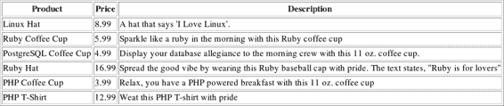
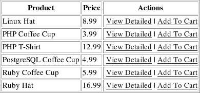
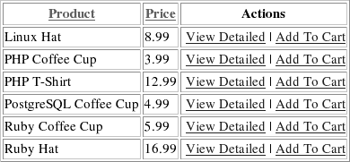
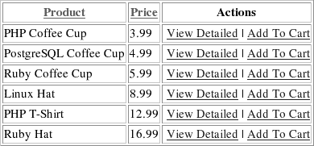
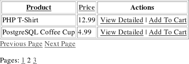

# 第 29 章 保护 PostgreSQL

## 添加新用户

向 PostgreSQL 添加新用户是通过`CREATE USER`命令实现的。`CREATE USER`命令的语法如下：

```
CREATE USER username
[ WITH SYSID uid
| CREATEDB | NOCREATEDB
| CREATEUSER | NOCREATEUSER
| IN GROUP groupname [, ...]
| [ ENCRYPTED | UNENCRYPTED ] PASSWORD 'password'
| VALID UNTIL 'abstime' ]
```

建议的做法是将`SYSID`字段留空，这样它会自动生成。`CREATEDB`字段对应于允许用户在数据库中创建、添加和删除数据库；默认情况下，用户没有此权限。指定`CREATEUSER`选项将把用户创建为管理级帐户，允许他们添加和删除系统中的其他用户；同样，默认情况下不授予此权限。您还可以通过`IN GROUP`参数将用户添加到数据库中可能存在的任何组中。当然，通常情况下，您还需要为每个用户存储密码。最后，`VALID UNTIL`子句允许您指定一个时间，届时帐户将自动过期并禁止进一步登录。

例如，我们可以创建以下用户`howard`，他有权创建新数据库，并且可以在年底前登录：

```
CREATE USER howard WITH PASSWORD 'T3rc35' CREATEDB VALID
UNTIL '2005-12-31';
```

## 操作用户

要修改用户的属性，我们使用`ALTER USER`命令。其语法如下：

```
ALTER USER username
[ WITH
CREATEDB | NOCREATEDB
| CREATEUSER | NOCREATEUSER
| [ ENCRYPTED | UNENCRYPTED ] PASSWORD 'password'
| VALID UNTIL 'abstime'
```

`ALTER USER`命令的参数遵循与`CREATE USER`命令相同的定义。例如，如果我们想修改之前的用户以移除创建数据库的权限，命令如下：

```
ALTER USER howard NOCREATEDB;
```

有时您可能需要更改用户名，此时提供了另一种语法：

```
ALTER USER name RENAME TO newname
```

## 删除用户

要删除用户，我们使用`DROP USER`命令。其语法非常简单：

```
DROP USER username
```

`DROP USER`命令将从集群中的所有数据库中删除该用户。

如果该用户拥有一个数据库，则会引发错误，用户将不会被删除。不过，对于数据库内的其他对象，情况并非如此。删除用户将保留数据库内的任何此类对象。但是，如果您将来需要以某种需要您成为对象所有者的方式操作该对象，则可能会遇到权限问题。

## 使用 PostgreSQL 组

虽然 PostgreSQL 的用户系统很灵活，但在处理大量用户和权限时，它并不总是最方便的系统。为了简化此任务，PostgreSQL 还提供了一种组系统，类似于许多操作系统中使用的组概念。使用组，您可以将多个用户分配到一个组中，在组级别设置权限，然后一次性为所有用户操作这些权限。

### 添加组

向 PostgreSQL 添加新组是通过`CREATE GROUP`命令实现的，语法如下：

```
CREATE GROUP groupname
[ WITH ]
SYSID gid
| USER username [, ...]
```

与`CREATE USER`命令一样，建议的做法是将`SYSID`选项留空以便自动生成。可选的`USER`字段可以包含一个或多个用户。例如，如果我们想为具有完全访问权限的用户创建一个组，命令如下：

```
CREATE GROUP fullaccess WITH USER howard, rob;
```

### 操作组

在创建组时，并不总是能够将所有用户都添加到组中。我们可能不确定哪些用户需要成为组的成员，并且随着时间的推移，在创建组之后，新用户将被添加到数据库中。与此相反，随着数据库的发展，我们肯定也需要从组中移除用户。为了完成这些任务，我们使用`ALTER GROUP`命令：

```
ALTER GROUP groupname ADD USER username [, ...]
ALTER GROUP groupname DROP USER username [, ...]
```

还有一种用于重命名组的`ALTER GROUP`命令形式：

```
ALTER GROUP groupname RENAME TO newgroupname
```

在所有情况下，这些`ALTER GROUP`命令只能由数据库超级用户执行。

### 删除组

要删除组，我们使用`DROP GROUP`命令：

```
DROP GROUP groupname
```

`DROP GROUP`命令删除指定的组，但组中包含的任何用户都将保留。

> **注意：** PostgreSQL 8.1 将引入基于 SQL 标准大纲的角色支持。角色支持将进一步扩展`USER`和`GROUP`功能集，并有望成为 PostgreSQL 工具集的一个强大补充。在某些场景中，使用角色将优于当前的用户和组功能；然而，当前的用户和组功能将继续保留，因此不必担心需要立即适应一套全新的命令。不过，一旦 8.1 发布，您可能想查阅在线文档。

## GRANT 和 REVOKE 命令

在系统中创建用户后，添加或移除权限的任务需要使用`GRANT`和`REVOKE`命令。由于权限是在对象级别设置的，因此可以为数据库中的每个用户提供细粒度的控制。在本节中，我们将详细查看`GRANT`和`REVOKE`命令，并介绍一些演示其用法的示例。

### GRANT

当您需要向一个用户或一组用户授予新权限时，使用`GRANT`命令。权限分配是基于每个对象进行的，根据对象和权限的不同，使用的语法略有不同，但在所有情况下都遵循相同的基本结构：

```
GRANT privilege [, ...] ON object [, ...] TO
{PUBLIC | GROUP groupname | username } [ WITH GRANT OPTION ]
```

`privilege`可以是一个或多个适用于该对象的权限。同样，`object`可以是一个或多个要授予权限的同类对象。关键字`PUBLIC`表示所有用户都将被授予这些权限。默认情况下，只有对象所有者和超级用户才能授予对象的权限；然而，`WITH GRANT OPTION`会传递这些权限，以便被授权者可以根据需要将这些权限授予其他人。

为了更好地了解这些命令是如何组合在一起的，让我们看几个例子。在第一个例子中，我们想向用户`howard`添加对`salaries`表的`SELECT`权限：

```
GRANT SELECT ON salaries TO howard;
```

这非常简单。对于一个更复杂的例子，假设我们想向`howard`和`robert`添加对`books`和`games`表的`SELECT`和`INSERT`权限，并允许他们将那些权限授予其他人：

```
GRANT SELECT,INSERT ON books, games TO howard, robert WITH GRANT OPTION;
```

### REVOKE

从用户处移除权限是`REVOKE`命令的任务。其语法与`GRANT`命令类似：

```
REVOKE privilege [, ...] ON object [, ...] FROM
{PUBLIC | GROUP groupname | username }
```

例如，如果我们想禁止`howard`对`salaries`表的任何使用，我们将使用以下命令：

```
REVOKE ALL ON salaries FROM howard;
```

### 进行大规模更改

## 确保 PostgreSQL 连接安全

客户端与 PostgreSQL 服务器之间传输的数据与任何其他典型网络流量类似，都可能被恶意第三方拦截甚至篡改。有时这并非大问题，因为数据库服务器和客户端通常位于同一内部网络中，甚至许多人会部署在同一台机器上。然而，如果项目需求需要通过不安全信道传输数据，现在您可以选择使用 PostgreSQL 的内置安全功能，通过 SSL 加密连接。

要使用基于 SSL 的连接，您首先需要完成以下操作：

- 安装 OpenSSL 库，可从 `http://www.openssl.org/` 下载。
- 使用 `--with-openssl` 标志编译 PostgreSQL。

要验证您的 PostgreSQL 安装是否已集成 OpenSSL，可以使用 `pg_config` 命令行工具：

```
[postgres@ridley postgres]$ pg_config --configure

'—prefix=/var/lib/pgsql-8.0.x' '—with-openssl'
```

完成这些先决条件后，您需要创建或购买服务器和客户端证书。完成这些任务的具体流程超出了本书范围，但您可以在互联网上获取相关信息，花些时间搜索一下，就能找到大量资源。

### 配置选项

当您的服务器已构建 SSL 支持后，PostgreSQL 可以监听 SSL 连接。要启用此功能，您需要在`postgresql.conf`文件中将`ssl`选项设置为`true`，然后重启服务器。默认情况下，服务器将是否使用 SSL 连接的决定权交给客户端，这可能符合也可能不符合您的偏好。您可以通过`pg_hba.conf`文件中的以下主机连接类型来更改此行为：

- `host`：这是默认连接类型。它允许 SSL 和非 SSL 连接，并将连接方式的选择权留给客户端。由于某些客户端可能会静默地回退到非 SSL 连接，如果您需要强制使用 SSL 连接，可能不希望使用此类型。
- `hostssl`：指定为`hostssl`连接类型的连接将要求使用 SSL 进行连接，非 SSL 连接尝试将被拒绝，即使所有其他凭据都允许连接。如果您计划使用 SSL，这很可能是您想要的连接类型。
- `hostnossl`：要求连接必须来自非基于 SSL 的客户端。通过 SSL 进行的连接将被拒绝，即使所有其他凭据都允许连接。

### 常见问题解答

由于 SSL 功能并未广泛使用，其用法仍存在一些困惑。本节通过回答关于此主题的一些最常见问题，尝试提供一些澄清。

**我将 PostgreSQL 仅用作 Web 应用的后端，并使用 HTTPS 加密进出网站的流量。我是否需要加密到 PostgreSQL 服务器的连接？**

这取决于数据库服务器是否与 Web 服务器位于同一台机器上。如果是这种情况，那么只有当您认为机器本身不安全时，加密才可能有益。如果数据库位于单独的服务器上，数据从 Web 服务器到数据库服务器可能会以未加密方式传输，因此需要加密。关于加密的使用没有固定规则。只有在仔细权衡安全性和性能因素后，您才能得出结论。

**我了解到使用 SSL 加密网页会降低性能。对于加密 PostgreSQL 流量是否同样如此？**

是的，您的应用程序会遭受性能损失，因为每个数据包在进出 PostgreSQL 服务器时都必须加密。性能损失的程度取决于多个变量，包括 CPU 速度和带宽容量。

**我如何知道流量确实被加密了？**

确保 PostgreSQL 流量已加密的最简单方法是配置一个要求 SSL 连接的用户帐户，然后尝试通过提供该用户的凭据和有效的 SSL 证书连接到启用了 SSL 的 PostgreSQL 服务器。如果出现问题，您将在尝试连接时收到`FATAL`错误。

**PostgreSQL 使用哪个端口进行基于 SSL 的流量？**

无论您是以加密还是非加密方式通信，端口号都保持不变。默认情况下，该端口是端口 5432。

### 总结

未经授权的数据库入侵可能会抹去数月的工作成果，并抹杀不可估量的价值。因此，尽管本章涵盖的主题通常缺乏诸如创建数据库连接或修改表结构等其他操作的魅力，但花时间彻底理解它们的重要性不容低估。我们强烈建议您花足够的时间理解 PostgreSQL 的安全特性，因为它们应该在您所有基于 PostgreSQL 的应用中常规出现。

在下一章中，我们将介绍 PHP 的 PostgreSQL 库，向您展示如何通过 PHP 脚本操作 PostgreSQL 数据库数据。

# PHP 的 PostgreSQL 功能

本章介绍 PHP 的 PostgreSQL 扩展，该扩展自版本 3 起在标准 PHP 发行版中可用。通过介绍该扩展的许多最重要函数并提供大量使用示例，本章向您展示如何在 PHP 应用中连接到 PostgreSQL 数据库服务器，检索、插入、更新和删除数据，并执行对任何数据库驱动应用都重要的管理操作。

### 先决条件

在您开始从 PHP 应用中利用 PostgreSQL 之前，您需要启用扩展，该扩展默认未启用。此外，您应该花点时间熟悉 PostgreSQL 特定的`php.ini`指令。本节将涵盖这两个主题。

#### 启用 PHP 的 PostgreSQL 扩展

要在 Unix 上使用 PHP 的 PostgreSQL 扩展，您需要使用`--with-pgsql`选项配置 PHP。PHP 假定 PostgreSQL 安装在`/usr/local/pgsql`目录中，因此如果您将其安装在不同位置（例如`/home/jason/pgsql`），则需要将此路径附加到选项后，如下所示：

```
--with-pgsql=/home/jason/pgsql
```

在 Windows 上，您需要打开`php.ini`文件并取消注释以下行，保存文件，然后重启 Apache：

```
;extension=php_pgsql.dll
```

在任何操作系统上，您可以通过将以下代码放入一个文件（例如命名为`phpinfo.php`），将其保存在文档根目录中的方便位置，并加载到浏览器中来验证 PHP 的 PostgreSQL 支持是否已启用：

```php
<?php
phpinfo();
?>
```

向下滚动，你应该会看到如图 30-1 所示的表格。

**图 30-1.** *验证 PHP 的 PostgreSQL 支持*

接下来，我们将研究图 30-1 中显示的 PHP 配置指令的作用。

#### PHP 的 PostgreSQL 配置指令

与几乎所有其他 PHP 扩展一样，有几个指令可用于调整 PostgreSQL 与 PHP 相关的行为。这些指令位于`php.ini`文件中，本节将按照它们在该文件中出现的顺序进行介绍。

##### `pgsql.allow_persistent`

该指令决定是否允许持久连接。默认情况下，此功能是启用的。

有关持久连接影响的更多信息，请参阅后面的侧边栏“持久连接与非持久连接”。

##### `pgsql.auto_reset_persistent`

由于意外事件（如事务失败），持久连接有时可能会成为孤儿（因此尽管不可用，但仍持续运行）。随着时间的推移，这可能会导致连接问题，因为孤儿连接的总数会消耗一部分甚至全部可用的并发服务器连接。要监视并销毁这些失控的连接，请启用`pgsql.auto_reset_persistent`指令，该指令默认是禁用的。请记住，启用此指令会导致轻微的性能下降。

##### `pgsql.max_persistent`

该指令设置了可以同时存在的持久连接的最大数量。当设置为`–1`（默认值）时，对持久连接的数量不设限制。

##### `pgsql.max_links`

该指令设置了可以同时存在的连接的最大数量。当设置为`–1`（默认值）时，对持久和非持久连接的总数不设限制。

##### `pgsql.ignore_notice`

PostgreSQL 会定期提供各种用户可能认为有用的信息。例如，如果你没有在创建表时明确指定，PostgreSQL 会自动为主键创建索引。虽然这对表性能肯定有益，但有必要通知用户这一操作，因此 PostgreSQL 会使用一种称为“通知”的消息来告知你。

默认情况下，只要 PHP 已配置为这样做（请参阅 PHP 的`error_reporting`、`display_errors`和`log_errors`指令），PHP 就会记录并可能显示 PostgreSQL 返回的任何通知。你可以通过将`pgsql.ignore_notice`设置为`1`来禁用此行为。

##### `pgsql.log_notice`

如果禁用了`pgsql.ignore_notice`指令，你可以将错误消息记录到`error_log`指令指定的日志文件中。

### 示例数据

当概念附带一组连贯的示例时，学习新主题往往会更容易。下面名为`product`的表格将用于后续章节中的所有相关示例。

```sql
CREATE TABLE product (
    productid SERIAL,
    productcode VARCHAR(8) NOT NULL UNIQUE,
    name TEXT NOT NULL,
    price NUMERIC(5,2) NOT NULL,
    description TEXT NOT NULL,
    PRIMARY KEY(productid)
);
```

### PHP 的 PostgreSQL 命令

PHP 的 PostgreSQL 扩展提供了执行所有可想象任务所需的所有功能。本节将介绍许多关键函数，向你展示如何使用它们连接数据库服务器、选择数据库、查询和检索数据，以及执行各种其他重要任务。

#### 建立和关闭连接

在与 PostgreSQL 服务器交互之前，你需要成功连接到它并选择一个数据库，同时传递任何必要的凭据。同样，当你完成数据库的使用后，应关闭连接以回收系统资源。本节将向你展示如何建立新连接、选择数据库以及随后关闭连接。

##### `pg_connect()`

```
resource pg_connect(string *connection_string* [, int *connect_type*])
```

PHP 对应的 MySQL 和 MS SQL 连接函数要求将每个连接参数作为单独的参数传入，而 PostgreSQL 则要求将这些参数作为单个字符串提交，该字符串由 `connection_string` 表示。此字符串中可识别多个参数，包括：

- `connect_timeout`：继续等待连接响应的秒数。指定零值或不指定值将导致函数无限期等待。
- `dbname`：你想要连接的数据库名称。
- `host`：由主机名定义的服务器位置，例如 `www.example.com`、`ecommerce` 或 `localhost`。
- `hostaddr`：由 IP 地址定义的服务器位置，例如 `192.168.1.104`。
- `options`：要发送到服务器的任何其他命令行选项。
- `password`：连接用户的密码。
- `port`：服务器运行的端口。默认情况下，这是 `5432`；因此，仅当目标服务器在另一个端口上运行时，才需要指定此参数。
- `service`：如果你负责管理多个服务器，或者只是想将连接变量存储在一个位置，则可以使用此参数指定一个服务名称。此服务名称映射到 `pg_service.conf` 文件中存储的一组相应变量。
- `sslmode`：当 PostgreSQL 在构建时配置了 SSL 支持时，它支持安全连接。你可以通过将 `pg_connect` 与此选项一起使用，分别使用值 `allow`、`disable` 和 `require` 来允许、禁用甚至要求安全连接。默认值 `prefer` 会先尝试通过 SSL 连接，如果第一次尝试失败，则再通过非 SSL 连接。
- `user`：连接用户。

例如，要使用分配了密码 `secret` 的用户 `jason` 连接到名为 `corporate` 的本地主机数据库，将使用以下命令：

```
$pg = pg_connect("host=localhost user=jason password=secret dbname=corporate");
```

因为 PostgreSQL 默认会池化其连接以节省系统资源，如果在同一脚本中，后续的连接请求使用了与已打开连接相同的参数，PostgreSQL 会使用现有连接而不是打开一个新连接。你可以通过可选的 `connect_type` 参数并传入值 `PGSQL_CONNECT_FORCE_NEW` 来覆盖此行为。

[www.it-ebooks.info](http://www.it-ebooks.info/)

第 30 章 ■ PHP 的 PostgreSQL 功能

**669**

##### `pg_pconnect()`

```
resource pg_connect(string *connection_string* [, int *connect_type*])
```

`pg_pconnect()` 函数在各方面与 `pg_connect()` 完全相同，支持前面描述的所有参数，唯一的区别是使用它会导致连接在*脚本执行完毕后*仍然保持打开状态。如果之后尝试使用与原始连接相同的连接参数打开一个新连接，那么该持久连接将被重用。

要利用此函数，你需要启用 `pgsql.allow_persistent` 指令（默认已启用）。还请花点时间了解 `pgsql.max_links` 和 `pgsql.max_persistence` 指令，这两个指令都在前面的“PHP 的 PostgreSQL 配置指令”部分中介绍过。

#### 持久连接与非持久连接？

对于是否应使用持久连接还是非持久连接，似乎总有无尽的困惑。大多数用户倾向于使用持久连接，因为他们认为使用持久连接会带来某些功能上的提升。但关键在于，你必须明白，除了因可复用特性带来的更高效率之外，使用持久连接并没有任何额外的好处。由于可以省去创建新连接的步骤（在高流量环境下，这一步骤会反复发生），因此选择持久连接能够节省开销。

因此，虽然使用持久连接通常是个好主意，但仍需谨慎使用。

如果你的 PostgreSQL 数据库由网络托管服务商管理，请务必确认所允许的最大数据库连接数（由 `postgresql.conf` 文件中的 `max_connections` 指令定义）未超过所允许的最大持久连接数（由 `php.ini` 文件中的 `pgsql.max_persistence` 指令定义）。如果确实如此，那么当出现 `max_connections` + *N* 个并发连接请求的情况时，将有 *N* 个请求会失败。如果程序错误导致连接未关闭，这个问题会进一步恶化，最终迫使你重启 Web 服务器来清除这些失控的连接。

##### 将连接信息存储在单独的文件中

当然，在每个脚本的顶部直接嵌入连接调用代码并不合理。毕竟，如果你需要更改密码，或者想在另一个使用略有不同数据库名称的服务器上安装应用程序，该怎么办呢？为了避免不必要的维护麻烦，请将这些调用（以及任何其他全局信息）放在一个配置文件中，然后通过 `require` 语句将该文件包含到每个相关的脚本中。

例如，一个示例配置文件 (`config.inc.php`) 可能如下所示：

```
<?php

// 数据库主机
$db_host = "localhost";

// 数据库用户
$db_user = "jason";

// 数据库密码
$db_pswd = "secret";

// 数据库名称
$db_name = "corporate";

// 其他站点级配置参数
$admin_email = "administrator@example.com";
$default_lang = "english";

// 前期任务
// 连接数据库
$pg = pg_connect("host=$db_host user=$db_user
password=$db_pswd dbname=$db_name")
or die("无法连接到数据库。");

?>
```

接下来，你可以根据需要将此文件嵌入到你的脚本中：

```
<?php

require_once("config/config.inc.php");

... 继续构建页面和进行与数据库相关的任务

?>
```

请注意，此配置文件以 `.php` 扩展名结尾！这可以防止任何用户通过在浏览器中调用它来查看其内容。例如，假设此文件命名为 `config.inc` 而非 `config.inc.php`，并且位于文档根目录下的 `config` 目录中。用户可以像这样调用该文件并查看其内容：`http://www.example.com/config/config.inc`

然而，调用具有 `.php` 扩展名的同一文件将导致该文件首先被传递给 PHP 引擎并进行解析。由于该文件中没有输出任何内容，用户将只会看到一个空白页面。

或者，如果你具有 Apache 的 `httpd.conf` 文件的管理访问权限，或者能够使用 `.htaccess` 文件，你可以通过使用 `<Files>` 指令来完全阻止 Apache 提供某些扩展名的服务，如下所示：

```
<Files ~ "\.inc$">
Order allow, deny
Deny from all
Satisfy All
</Files>
```

设置完成后，任何在文档根目录内尝试检索以 `.inc` 结尾的文件的操作都将产生一个“Forbidden”错误。

##### `pg_close()`

```
boolean pg_close([resource $connection])
```

虽然脚本执行期间打开的数据库连接会在脚本完成后自动关闭，但严谨的编程实践始终鼓励在不再需要这些资源时显式关闭。一个典型的示例如下：

```php
<?php

$pg = pg_connect("host=localhost user=jason password=secret dbname=corporate") or die("无法连接到数据库。");

echo "此处执行数据库操作。"; pg_close();

?>
```

如果同时打开了多个连接（例如连接到不同的数据库），你可以在不再需要某个连接的服务时将其关闭。例如：

```php
<?php
```


$pg = pg_connect("host=localhost user=jason password=secret dbname=corporate"); $pg2 = pg_connect("host=example.com user=jason password=secret dbname=store"); echo "执行一些数据库操作。<br />";

// $pg2 使用完毕，关闭连接

pg_close($pg2);

echo "执行其他数据库操作。";

// 关闭 $pg 连接

pg_close($pg);

?>

```

请注意，此函数对持久连接没有影响，因为持久连接即使在脚本执行完成后也保持打开状态。更多信息请参阅前文的侧边栏“持久连接还是非持久连接？”。

### 查询

在本节中，你将学习如何执行多项与查询相关的任务，包括执行查询、获取查询资源，以及检索和解析结果。

#### 查询执行

与数据库的任何交互都通过查询进行。本节将展示如何构造查询并将其发送到数据库执行。

**`pg_query()`**

`resource pg_query([resource $connection,] string $query)`

`pg_query()` 函数负责将查询发送到所选数据库，成功时返回结果资源，失败时返回 `FALSE`。例如，你可以像这样检索 `product` 表中产品和对应价格的结果集：

```php
$query = "SELECT name, price FROM product ORDER BY name";
$result = pg_query($query);
```

如果打开了多个连接，你可以使用 `connection` 参数指定查询发往哪个连接。

虽然 `pg_query()` 确实执行了查询，但如果没有其他几个函数的协助，你无法对结果进行任何操作。执行 `SELECT` 语句时，你通常会使用 `pg_fetch_row()`、`pg_fetch_array()`、`pg_fetch_object()` 或 `pg_num_rows()`；而执行 `INSERT`、`UPDATE` 或 `DELETE` 语句时，你通常会使用 `pg_affected_rows()`。所有这些函数都将在本章后面介绍。

你也可以向 `pg_query()` 传递多条语句进行执行。每条语句之间用分号隔开。例如，假设你的电子商务网站上的产品种类正在增加，你需要调整几个类别的名称：

```php
$query = "UPDATE category SET title='footwear' WHERE title='sneakers'";
$query .= "; UPDATE category SET title='gourmet' WHERE title='coffee'";
$query .= "; UPDATE category SET title='appliances' WHERE title='refrigerators'";
$result = pg_query($query);
```

请记住，向 `pg_query()` 传递多条语句不一定是好主意，因为无法获取所有查询是否按预期执行的信息。

**`pg_send_query()`**

`boolean pg_send_query ([resource $connection,] string $query)`

`pg_send_query()` 函数的操作与 `pg_query()` 非常相似，都是将查询发送到数据库执行。然而，它在两个重要方面有所不同：

- 查询以异步方式发送，这意味着即使发送的查询尚未执行完毕，脚本也会继续执行。
- 可以向数据库发送多个查询，并且可以根据需要使用 `pg_get_result()` 检索每个查询的结果。

注意：您不应在服务器正在执行另一查询时使用`pg_send_query()`执行多个查询。您可以通过`pg_connection_busy()`函数判断服务器是否正忙于执行另一查询。示例如下：

[www.it-ebooks.info](http://www.it-ebooks.info/)

```
$pg = pg_connect("host=localhost user=jason password=secret dbname=corporate") or die("无法连接到 PostgreSQL 服务器：");
$query = "SELECT name FROM hr.product ORDER BY name";
$query .= "; SELECT name FROM category ORDER BY name";
if (!pg_connection_busy($pg)) {
    pg_send_query($pg, $query);
}
$result1 = pg_get_result($pg);
echo "产品总数：" . pg_num_rows($result1) . " <br />";
$result2 = pg_get_result($pg);
echo "类别总数：" . pg_num_rows($result2) . " <br />";
```

上述代码会输出类似以下内容：

```
Total product count: 54
Total category count: 7
```

### 检索状态与错误信息

特别是在应用程序开发阶段，您会希望方便地输出各种状态消息和错误信息。此外，在应用程序的生命周期中，您可能还需要记录日志，甚至通过电子邮件即时获知任何错误。

本节将介绍几个可用于这些目的的函数。

#### `pg_connection_status()`

```php
int pg_connection_status(resource $connection)
```

`pg_connection_status()`函数根据指定`$connection`的数据库连接返回两种可能值之一：`PGSQL_CONNECTION_OK`或`PGSQL_CONNECTION_BAD`。

示例如下：

```php
$pg = pg_connect("host=localhost user=jason password=secret dbname=corporate");
if (pg_connection_status($pg) == "PG_CONNECTION_BAD") {
    die("连接到数据库时出现问题。");
}
```

[www.it-ebooks.info](http://www.it-ebooks.info/)

当然，由于`pg_connect()`在失败时会返回`FALSE`，您也可以像这样判断连接是否成功：

```php
$pg = pg_connect("host=localhost user=jason password=secret dbname=corporate");
if (!$pg) {
    die("连接到数据库时出现问题。");
}
```

请注意，如果启用了 PHP 的错误报告机制并且信息输出到屏幕（请参见 PHP 指令`error_reporting`和`display_errors`），则还会有其他信息输出到屏幕。

#### `pg_last_notice()`

```php
string pg_last_notice(resource $connection)
```

`pg_last_notice()`函数返回由`$connection`参数指定的连接最近发出的通知。

#### `pg_result_status()`

```php
pg_result_status(resource $result [, int $type])
```


`pg_result_status()`函数返回有关`$result`状态的信息。返回的信息类型取决于分配的`$type`值，支持以下两种类型：

- `PGSQL_STATUS_LONG`：使`pg_result_status()`返回结果的数值状态。这是默认值。
- `PGSQL_STATUS_STRING`：返回所执行查询的类型。例如，如果查询是标准的`SELECT`语句，则返回单词`SELECT`。

如果将`PGSQL_STATUS_LONG`分配给`$type`，则会返回八种可能值之一。请注意，返回的是这些值的数值表示形式，因此您需要设计一种方法将数值转换为对应的状态响应：

- `PGSQL_BAD_RESPONSE`：无法理解服务器的响应。数值为 5。
- `PGSQL_COMMAND_OK`：不涉及返回数据的查询已正确执行。数值为 1。
- `PGSQL_COPY_IN`：已开始向服务器复制数据。数值为 4。
- `PGSQL_COPY_OUT`：已开始从服务器复制数据。数值为 3。
- `PGSQL_EMPTY_QUERY`：发送到服务器的查询不包含任何数据。数值为 0。

[www.it-ebooks.info](http://www.it-ebooks.info/)

# 第 3 章：PHP 的 PostgreSQL 功能

**675**

- `PGSQL_FATAL_ERROR`：发生致命错误，例如无法成功连接到数据库服务器。数值为 7。
- `PGSQL_NONFATAL_ERROR`：发生非致命错误（具体来说是通知或警告），例如尝试删除一个不存在的表。数值为 6。
- `PGSQL_TUPLES_OK`：涉及数据检索的查询已正确执行。数值为 2。

例如，以下代码判断正在执行的查询类型，并返回有关响应状态的信息：

```php
$query = "SELECT productid, name, price FROM product ORDER BY name";
$result = pg_query($query);

echo "Query Type: ".pg_result_status($result, PGSQL_STATUS_STRING)."<br />";
echo "Query Status: ".pg_result_status($result, PGSQL_STATUS_LONG)."<br />";
```

这将返回以下内容：

```
Query Type: SELECT

Query Status: 2
```

#### `pg_last_error()`

`string pg_last_error([resource $connection])`

`pg_last_error()` 函数返回由可选参数 `$connection` 指定的连接所产生的最新错误消息。如果未提供 `$connection`，则将使用最近建立的连接。例如，尝试删除一个不存在的表会产生错误，如下所示：

```php
$res = pg_query("DROP TABLE nonexistenttable");

echo pg_last_error();
```

执行此示例将产生：

```
ERROR: table "nonexistenttable" does not exist
```

#### `pg_result_error()`

`string pg_result_error(resource $result)`

`pg_result_error()` 函数返回最近归因于由 `$result` 指定的资源的错误。例如：

```php
$query = "SELECT * FROM productt ORDER BY name";

$done = pg_send_query($pg, $query);

$result = pg_get_result($pg);

echo pg_result_error($result);
```

由于查询中 `product` 表拼写错误，将出现以下错误：

```
ERROR: relation "productt" does not exist
```

请注意，此函数与之前介绍的 `pg_last_error()` 函数不同，因为 `pg_result_error()` 特定于归因于特定资源的最后一个错误，而 `pg_last_error()` 则特定于脚本执行期间发生的最后一个错误，与资源无关。正因如此，必须使用 `pg_send_query()` 和 `pg_get_result()` 函数来获取失败的查询结果。请注意，将 `pg_query()` 与 `pg_result_error()` 结合使用不会产生任何信息，无论查询是否失败！

虽然 `pg_result_error()` 很有用，但 `pg_result_error_field()` 函数提供了更详细的问题摘要。接下来将介绍此函数。

#### `pg_result_error_field()`

`string pg_result_error_field(resource $result, int $fieldcode)`

仅在与 PostgreSQL 7.4 及更高版本结合使用时可用，`pg_result_error_field()` 函数返回与 `$result` 指定的资源相关的错误信息。返回的错误信息特定于 `$fieldcode` 定义的值。

支持十二个 `$fieldcode` 值，包括：

- `PGSQL_DIAG_CONTEXT`：包含与错误相关的内部生成信息的跟踪。
- `PGSQL_DIAG_INTERNAL_POSITION`：自 PostgreSQL 8.0 版本起可用，包含由 PostgreSQL 而非客户端生成失败命令的光标位置。
- `PGSQL_DIAG_INTERNAL_QUERY`：自 PostgreSQL 8.0 版本起可用，指定由 PostgreSQL 而非客户端生成的失败命令的文本。
- `PGSQL_DIAG_MESSAGE_DETAIL`：有时提供有关错误发生原因的额外信息，对 `PGSQL_DIAG_MESSAGE_PRIMARY` 中存储的信息进行补充。
- `PGSQL_DIAG_MESSAGE_HINT`：有时提供关于用户如何解决该错误的一些解释。
- `PGSQL_DIAG_MESSAGE_PRIMARY`：提供用户友好但简洁的错误描述。

**676**

- `PGSQL_DIAG_SEVERITY`：指定错误的严重级别，可以是以下值之一：`DEBUG`、`ERROR`、`FATAL`、`INFO`、`LOG`、`NOTICE`、`PANIC` 或 `WARNING`。
- `PGSQL_DIAG_SOURCE_FILE`：指定发生错误的文件名。
- `PGSQL_DIAG_SOURCE_FUNCTION`：指定产生错误的 PostgreSQL 函数名。
- `PGSQL_DIAG_SOURCE_LINE`：指定发生错误的文件行号。
- `PGSQL_DIAG_SQLSTATE`：包含 `SQLSTATE` 字符串。自 PostgreSQL 7.4 版本起提供，`SQLSTATE` 消息由五个字符的字符串组成，代表各种数据库服务器警告和错误。请参阅在线 PostgreSQL 文档，获取完整代码及其对应含义的列表。
- `PGSQL_DIAG_STATEMENT_POSITION`：包含查询语句中错误发生位置的游标位置。

基于前面的示例，可以仅报告文件名、错误消息以及错误所在行，如下所示：

```php
<?php

$pg = pg_connect("host=localhost user=webuser password=secret dbname=corporate");

$query = "SELECT * FROM productt ORDER BY name";

pg_send_query($pg, $query);

$result = pg_get_result($pg);

echo "PostgreSQL has returned an error: <br />";

echo "File: ".pg_result_error_field($result, PGSQL_DIAG_SOURCE_FILE)."<br />";

echo "Line: ".pg_result_error_field($result, PGSQL_DIAG_SOURCE_LINE)."<br />";

echo "Message: ".pg_result_error_field($result, PGSQL_DIAG_MESSAGE_PRIMARY)."<br />";

?>
```

这将返回以下输出：

```
PostgreSQL has returned an error:

File: namespace.c

Line: 200

Message: relation "productt" does not exist
```

#### `pg_set_error_verbosity()`

`int pg_set_error_verbosity([resource connection,] int verbosity)`

自 PostgreSQL 7.4 版本起可用，`pg_set_error_verbosity()` 函数决定 `pg_last_error()` 和 `pg_result_error()` 函数返回的信息量。支持三种详细级别：

• `PGSQL_ERRORS_DEFAULT`：返回错误信息，包括位置、主要文本、严重级别、附加详情、上下文字段以及提示。

• `PGSQL_ERRORS_TERSE`：返回错误信息，包括位置、主要文本和严重级别。

• `PGSQL_ERRORS_VERBOSE`：返回所有可用的错误信息。

### 回收查询内存

尤其是在同一脚本中执行多个大型查询时，你需要在查询数据不再需要时回收内存。本节介绍的 `pg_free_result()` 函数可帮你完成此任务。

#### `pg_free_result()`

`boolean pg_free_result(resource result)`

`pg_free_result()` 函数销毁由 `result` 指定的结果集，并将该结果集使用的所有内存返还给操作系统。由于每个脚本执行完成后，查询数据会被销毁，系统资源也会被回收，因此除非脚本执行期间消耗了大量资源，否则无需执行此函数。

### 检索与显示数据

一旦查询执行完毕且结果集准备就绪，就该解析检索到的行。你可以使用多个函数来检索组成每一行的字段；选择哪一个很大程度上取决于个人偏好，因为只是引用字段的方法不同。本节将介绍每个函数并提供示例。

#### `pg_fetch_array()`

`mixed pg_fetch_array(resource result [, int row [, int resulttype]])`

`pg_fetch_array()` 函数实际上是 `pg_fetch_row()` 的增强版，它允许你从行偏移量 `row` 开始（使用 `NULL` 表示从第一行开始），将结果集的每一行作为关联数组、数字索引数组或两者兼具来进行检索。

默认情况下，它会同时获取两个数组；你可以通过将以下某个值作为参数传递给 `resulttype` 来修改这一默认行为:

- `PGSQL_ASSOC`: 以关联数组的形式返回行，其中键由字段名表示，值由字段内容表示。
- `PGSQL_NUM`: 以数字索引数组的形式返回行，排序顺序由数组中指定的字段名顺序决定。如果使用了星号（表示查询要获取所有字段），则排序顺序将与表定义中的字段顺序一致。指定此选项将导致 `pg_fetch_array()` 的运行方式与 `pg_fetch_row()` 相同。
- `PGSQL_BOTH`: 同时以关联数组和数字索引数组的形式返回行。因此，每个字段既可以按索引偏移量引用，也可以按字段名引用。这是默认模式。

例如，假设你想仅使用关联索引来获取结果集：

```php
<?php
$pg = pg_connect("host=localhost user=webuser password=secret dbname=corporate");
if (!$pg) {
    echo "连接数据库时出现问题。"; die();
}
$query = "SELECT productcode, name FROM product ORDER BY name";
$result = pg_query($query);
while ($row = pg_fetch_array($result, NULL, PGSQL_ASSOC))
{
    $name = $row['name'];
    $productcode = $row['productcode'];
    echo "$name ($productcode) <br />";
}
?>
```

如果你想仅通过数字索引来获取结果集，你需要对上述示例的相关部分进行如下修改：

```php
<?php
...
while ($row = pg_fetch_array($result, NULL, PGSQL_NUM))
{
    $name = $row[1];
    $productcode = $row[0];
    echo "$name ($productcode) <br />";
}
?>
```

在这两种情况下，输出结果都是相同的，生成的内容如下：

```
AquaSmooth Toothpaste (TY232278)
HeadsFree Shampoo (PO988932)
Painless Aftershave (ZP457321)
WhiskerWrecker Razors (KL334899)
```

#### `pg_fetch_assoc()`

`array pg_fetch_assoc(resource $result [, int $row])`

此函数的运行方式与传入 `PGSQL_ASSOC` 作为结果参数时的 `pg_fetch_array()` 完全相同。

#### `pg_fetch_object()`

`mixed pg_fetch_object(resource $result [, int $row])`

`mixed pg_fetch_object(resource $result [, string $name [, array $params]])`

此函数的运行方式与 `pg_fetch_array()` 相同，区别在于它返回的是一个对象而不是数组。此外，结果类型始终设置为 `PGSQL_ASSOC`。以下是对 `pg_fetch_array()` 介绍中第一个示例的相关部分进行的修改：

```php
while ($row = pg_fetch_object($result))
{
    $name = $row->name;
    $productcode = $row->productcode;
    echo "$name ($productcode) <br />";
}
```

假设使用相同的数据，则此示例的输出与 `pg_fetch_array()` 示例的输出相同。

注意，`pg_fetch_object()` 的第二个原型提供了不同的参数。自 PHP 5.0 起可用，你可以使用此变体实例化一个名为 `name` 的可选类。你还可以通过 `params` 参数选择性地向 `name` 类的构造函数传递多个参数。

#### `pg_fetch_row()`

`mixed pg_fetch_row(resource $result [, int $row])`

此函数从 `result` 中获取整行数据，并将值放入一个索引数组中。

乍一看，这似乎并不比 `pg_fetch_array()` 提供特别显著的优势；毕竟，你仍然需要遍历数组，取出每个值并为它分配一个合适的变量名，对吧？虽然你可以这样做，但你会发现将此函数与 `list()` 结合使用会特别有趣。（`list()` 函数在第 5 章中介绍过。）考虑以下示例：

```php
<?php
...
$query = "SELECT productcode, name FROM product ORDER BY name";
$result = pg_query($query);
while (list($productcode, $name) = pg_fetch_row($result))
{
    echo "$name ($productcode) <br />";
}
...
?>
```

#### 使用`list()`函数和`while`循环

使用`list()`函数和`while`循环，可以在遇到每一行时将字段值赋给变量，无需执行将数组值赋给变量的额外步骤。假设涉及相同数据，此示例的输出与`pg_fetch_array()`示例的输出相同。

### 选中的行数和受影响的行数

检索或修改数据时，通常需要知道选中或修改了多少行。有两个函数可以执行这些任务：`pg_num_rows()`和`pg_affected_rows()`。本节将介绍这两个函数。

#### `pg_num_rows()`

`integer pg_num_rows(resource $result)`

`pg_num_rows()`函数返回资源`$result`中找到的总行数，如果发生错误则返回`-1`。例如：

```php
$query = "SELECT productid, name, price FROM product ORDER BY price"; 
$result = pg_query($query);
if ($result) {
    echo "Total products in database: ".pg_num_rows($result);
}
```

这将返回以下内容：

```

Total products in database: 34

#### `pg_affected_rows()`

`integer pg_affected_rows(resource $result)`

`pg_affected_rows()`函数返回受`DELETE`、`INSERT`或`UPDATE`查询影响的总行数，从资源`$result`中获取此数字。例如：

```php
$query = "UPDATE product SET price = '29.99' WHERE price = '24.99'";
$result = pg_query($query);
if ($result) {
    echo "Total products updated: ".pg_rows_affected($result);
}
```

这将返回：

```
Total products updated: 7
```

### 插入、修改和删除数据

一般来说，插入、修改和删除数据的过程与检索数据并无不同。你需要创建查询，并使用`pg_query()`等函数执行它。唯一的区别在于，你可以获取受查询影响的行数，而不是了解检索到的行数。例如，以下查询将更新`product`表，将当前价格为`24.99`的产品的价格提高到`29.99`：

```php
$query = "UPDATE product SET price = '29.99' WHERE price = '24.99'"; 
$result = pg_query($query);
```

当然，就像检索数据需要选择权限一样，你需要相应的权限来插入、修改和删除数据。有关配置这些权限的更多信息，请参见第 29 章。

然而，还有一些值得讨论的额外相关扩展功能。本节将介绍这些功能。

> **注意**：在撰写本文时，本节介绍的三个函数`pg_insert()`、`pg_update()`和`pg_delete()`被视为实验性功能。我们建议您使用上述技术（编写查询并使用`pg_query()`执行）直到这些函数可用于生产环境。

#### 插入数据

通过`pg_insert()`函数，可以使用一种稍微方便的方法来插入新数据行，该函数会根据关联数据数组自动构建插入查询。接下来介绍此函数。

##### `pg_insert()`

`mixed pg_insert(resource $conn, string $table, array $assoc_array [, int $options])`

`pg_insert()`函数将`$assoc_array`中的值插入到`$table`指定的表中。毫不奇怪，`$assoc_array`中的值数量应与`$table`中的列数相等。支持多个选项，如果传递这些选项，将导致`pg_convert()`对提供的值执行某些操作：

- `PGSQL_DML_NO_CONV`：包含此值将跳过`pg_convert()`的执行。
- `PGSQL_DML_STRING`：如果传递此值，`pg_insert()`将返回用于插入的查询字符串，而不是表示成功的布尔值。

还有其他选项，但在撰写本文时它们相当新且仅部分实现，因此我们在此不提及。如果您有兴趣了解这些新选项的完成情况，请参阅 PHP 文档。

> **注意**：`pg_convert()`函数将传递给它的数组值转换为 PostgreSQL 数据库支持的值。例如，它会按要求转义引号。此函数实际上将数组与表定义进行比较，确保根据表支持的内容转换值。有关更多信息，请参见 PHP 手册。

以下示例使用此函数向`product`表插入新产品：

```php
$pg = pg_connect("host=localhost user=webuser password=secret dbname=corporate");
$row = array(
    "productid"=>"", 
    "productcode" => "MNJD8892",
    "name"=>"Savage Beast Cologne", 
    "price"=>"49.95",
    "description"=>"Unleash your inner animal with this sweet smelling musk"
);
$result = pg_insert($pg, "product", $row);
```

#### 批量插入

虽然`INSERT`语句在插入一行或几行时很好用，但如何插入来自电子表格或制表符分隔文本文件的大量数据呢？当然可以编写脚本来读取文件中的每一行并将值传递给`INSERT`语句，但这并非必要；由于这是一个常见的流程，因此有两个函数提供了一种便捷的机制：`pg_copy_to()`和`pg_copy_from()`。本节将介绍这两个函数。

##### `pg_copy_to()`

`array pg_copy_to(resource $conn, string $table [, string $delim [, string $null_as]])`

`pg_copy_to()`函数将`$table`的内容复制到一个数组中。参数`$delim`确定用于分隔行中各列的定界符，默认情况下使用制表符`\t`。参数`$null_as`指定如何表示`NULL`值，默认情况下使用`\N`。例如，一个典型的返回行如下所示：

```
1\tTY232278\tAquaSmooth Toothpaste\t2.25\tVelvety smooth AquaSmooth
```

以下代码输出`product`表中的产品（输出格式化为可读性），使用竖线分隔各列：

```php
$products = pg_copy_to($pg, "product", "|");
print_r($products);
```

这将输出以下内容：

```
Array
(
    [0] => 1|TY232278|AquaSmooth Toothpaste|2.25|Velvety smooth AquaSmooth
    [1] => 2|PO988932|HeadsFree Shampoo|3.99|Go hands free with HeadsFree
    [2] => 3|ZP457321|Painless Aftershave|4.50|Leave the pain to real men
    [3] => 4|KL334899|WhiskerWrecker Razors|4.17|Say goodbye to rough skin
)
```

##### `pg_copy_from()`

`boolean pg_copy_from(resource $conn, string $table, array $row [, string $delim [, string $null_as]])`

`pg_copy_from()`函数将`$row`数组中的数据插入到`$table`指定的表中。参数`$delim`确定用于分隔行中各列的定界符，默认情况下使用制表符`\t`。参数`$null_as`指定如何表示`NULL`值，默认情况下使用`\N`。示例如下：

```php
$row = array(
    "1|TYC89098|Toothy Toothpaste|3.99|Whiter Teeth Now",
    "2|ZZO93839|Dainty Deodorant|5.99|Refreshing Smell"
);
pg_copy_from($pg, "product", $row, "|");
```

#### 修改数据

就像使用`pg_insert()`可以减轻数据插入的繁琐一样，使用`pg_update()`可以减轻更新表的繁琐。接下来介绍此函数。

##### `pg_update()`

`mixed pg_update(resource $conn, string $table, array $data, array $conditions [, int $options])`

`pg_update()`函数根据`conditions`数组指定的条件修改`table`表中的行，使用`data`指定的键和对应值更新行。例如，让我们使用此函数更新标题为“Savage Beast Cologne”的产品价格，使用`productcode`列作为判定键：

```php
$keys = array("productcode" => "MNJD8892");
$newvalues = array("price" => "42.99");

$result = pg_update($pg, "product", $newvalues, $keys);
```

可选的`options`参数修改此函数的行为，接受与`pg_insert()`介绍中定义的相同参数。

[www.it-ebooks.info](http://www.it-ebooks.info/)

#### 删除数据

使用`pg_insert()`插入数据和`pg_update()`更新数据减轻了一些繁琐工作后，可以继续使用下面介绍的`pg_delete()`函数来删除数据。

##### `pg_delete()`

`mixed pg_delete(resource conn, string *table*, array *assoc_array* [, int *options*])`

`pg_delete()`函数删除`table`中列值等于`assoc_array`数组中找到的值的行。`pg_delete()`函数支持与`pg_insert()`介绍中首次描述的相同选项。例如，让我们使用此函数删除在演示`pg_insert()`时插入的“Savage Beast Cologne”产品，使用`productcode`列作为判定键：

```php
$keys = array("productcode" => "MNJD8892");
$result = pg_delete($pg, "product", $keys);
```

可选的`options`参数修改此函数的行为，接受与`pg_insert()`介绍中定义的相同参数。

### 预处理语句

常见的做法是重复执行一个查询，每次迭代使用不同的参数。然而，使用传统的`pg_query()`函数和循环机制来实现会带来开销成本（由于反复解析几乎相同的查询以验证其有效性）和编码便利性的损失（因为每次迭代都需要使用新值重新配置查询）。为了减少重复执行查询带来的开销，可以使用一种称为*预处理语句*的特性，以显著更低的开销成本和更少的代码行数完成相同的任务。

#### `pg_prepare()`

`resource pg_prepare(resource *conn*, string *stmt*, string *query*)`
`resource pg_prepare(resource *conn*, string *query*)`

从 PHP 5.1 开始可用，并由 PostgreSQL 7.4 及更高版本支持，`pg_prepare()`创建一个要由`pg_execute()`或`pg_send_execute()`执行的预处理语句。预处理语句可能如下所示：

```php
$query = "INSERT INTO product (productcode, name, price, description) VALUES($1, $2, $3, $4)";
```

注意使用占位符（`$1`，`$2`，`$3`，`$4`）来表示稍后执行语句时将传递的值。毫不奇怪，占位符的数量必须与列的数量匹配。下面在`pg_execute()`的介绍中提供了一个涉及此函数的完整示例。

[www.it-ebooks.info](http://www.it-ebooks.info/)

#### `pg_execute()`

`resource pg_execute(resource *conn*, string *stmt*, array *params*)`
`resource pg_execute(strint *stmt*, array *params*)`

`pg_execute()`函数将由`pg_prepare()`准备的语句发送到数据库执行。示例如下：

```php
$pg = pg_connect("host=localhost user=jason password=secret dbname=corporate") or die("无法连接到 PostgreSQL 服务器：");

// 创建查询和相应的占位符
$query = "INSERT INTO product (productcode, name, price, description) VALUES($1, $2, $3, $4)";

// 准备语句
$result = pg_prepare($pg, "prodinsert", $query) or die("无法准备");

// 执行预处理语句
pg_execute($pg, "prodinsert", array("CJD18183", "AquaSmooth Toothpaste",
"2.25", "丝滑般的 AquaSmooth"));
```

注意，通过`pg_execute()`传递的参数必须以数组形式传递。

此外，参数数量必须与`pg_prepare()`中声明的占位符数量匹配。

#### `pg_send_execute()`

`boolean pg_send_execute(resource *conn*, string *stmt*, array *params*)`

仅支持 PostgreSQL 7.4 及更高版本和 PHP 5.1.0 及更高版本，`pg_send_execute()`函数使用`params`指定的参数执行`stmt`指定的语句。除了不等待结果返回外，其行为与`pg_execute()`完全相同。

#### `pg_send_query_params()`

`boolean pg_send_query_params(resource *conn*, string *query*, array *params*)`

仅支持 PostgreSQL 7.4 及更高版本，`pg_send_query_params()`函数与`pg_send_query()`完全相同，只是它提交命令和参数而不等待结果。此外，与`pg_send_query()`不同，它一次只接受一个查询。

请记住，与`pg_send_query()`一样，你需要使用`pg_get_result()`来检索每个查询结果。

[www.it-ebooks.info](http://www.it-ebooks.info/)

## 第 30 章 PHP 的 PostgreSQL 函数功能

**687**

### Information Schema

虽然有大量 PHP 函数可用于了解表结构的更多信息，例如字段名、大小和数据类型（仅举几例：`pg_field_name()`、`pg_field_size()`和`pg_field_type()`），但存在一种更直观且标准的方法来检索这些信息。自 PostgreSQL 7.4 版本起可用，称为 *information schema*（信息模式），该模式在每个数据库中均可用，描述了构成该数据库的所有对象。采用这种标准化方法将有助于确保你的代码在迁移到其他兼容数据库时具有可移植性。此外，你可以使用标准的 `SELECT` 查询来检索这些数据。例如，要了解构成 `product` 表的列，可以执行：

```sql
SELECT column_name FROM information_schema.columns WHERE table_name= 'product';
```

这将返回以下输出：

```
column_name
-----------
productid
productcode
description
name
price
```

你可以进一步检索每列的数据类型：

```sql
SELECT column_name, data_type FROM information_schema.columns
WHERE table_name= 'product';
```

这将产生以下结果：

```
column_name | data_type
-------------+-------------------
productid   | integer
productcode | character
description | character varying
```


name        | character varying

price       | numeric

```

[www.it-ebooks.info](http://www.it-ebooks.info/)

**688**

## 第 30 章 PHP 的 PostgreSQL 函数功能

这只是使用 information schema 可能实现的功能示例。你还可以使用它来了解集群上的所有数据库、用户、用户权限、视图等等。有关此模式中可用内容的完整说明，请参阅 PostgreSQL 文档。

将其应用于 PHP，你可以执行相应的查询，并使用你选择的`pg_fetch_*`函数解析结果。例如：

```php
<?php

...

$tablename = "product";

$query = "SELECT column_name, data_type FROM information_schema.columns WHERE table_name= '$tablename'";

$result = pg_query($query);

echo "<b>$tablename</b> table structure: <br />";

while($row = pg_fetch_row($result)) {

    $column = $row[0];

    $datatype = $row[1];

    echo "$column: $datatype <br />";

}

?>
```

这将返回以下内容：

**product** table structure:
productid: integer
productcode: character
description: character varying
name: character varying
price: numeric

### 总结

本章介绍了 PHP 的 PostgreSQL 扩展，并通过大量示例展示了其功能。随着你构建 PHP 和 PostgreSQL 驱动应用程序的经验积累，你一定会对其中的许多函数变得相当熟悉。

下一章将向你展示如何使用自定义数据库类更有效地管理 PostgreSQL 查询。

[www.it-ebooks.info](http://www.it-ebooks.info/)

---

## 第 31 章 实用数据库查询

上一章介绍了 PHP 的 PostgreSQL 扩展，并演示了涉及数据选择的基本查询。本章将以此基础知识为基础，演示许多你在使用 PHP 语言构建数据库驱动的 Web 应用程序时必然会反复用到的概念。具体来说，你将学习如何实现以下概念：

- **PostgreSQL 数据库类**：使用类来管理数据库查询不仅能使应用程序代码更简洁，还能让你在需要时快速、轻松地扩展和修改查询功能。本章将介绍一个 PostgreSQL 数据库类的实现，并提供几个入门示例，以便你熟悉其行为。
- **表格输出**：以易于阅读的格式列出查询结果，是你在构建数据库驱动应用程序时最常实现的任务之一。本章将向你展示如何使用 HTML 表格创建这些列表，并演示如何将每个结果行链接到相应的详细信息视图。
- **对表格输出进行排序**：通常，查询结果会按默认方式排序，例如按产品名称排序。但如果用户希望使用其他条件（如价格）重新排序结果呢？你将学习如何提供表格排序机制，使用户能够按任何列进行搜索。
- **分页结果**：数据库表通常包含数百甚至数千条结果。当检索到大量结果集时，将这些结果分散到多个页面上，并为用户提供在这些页面之间来回导航的机制通常是合理的。本章将向你展示一种简单易行的方法。

本章的目的并非暗示完成这些任务只有唯一的方法；相反，目的是为你提供一些关于如何实现这些功能的通用见解。如果你在读完本章后脑海中涌现出如何基于这些想法进行构建的想法，那么本章的目标就达到了。

### 示例数据

本章中的示例使用了上一章创建的 `product` 表，为方便起见，在此重新列出：

```sql
CREATE TABLE product (

    productid SERIAL,

    productcode VARCHAR(8) NOT NULL UNIQUE,

    name TEXT NOT NULL,

    price NUMERIC(5,2) NOT NULL,

    description TEXT NOT NULL,

    PRIMARY KEY(productid)

);
```

### 创建 PostgreSQL 数据库类

尽管我们在第 30 章中介绍了 PHP 的 PostgreSQL 库，但你可能不希望直接在脚本中引用这些函数。相反，你应该将它们封装在一个类中，然后使用该类与数据库进行交互。清单 31-1 提供了此类中应具备的基础功能。

**清单 31-1.** *一个 PostgreSQL 数据层类（`pgsql.class.php`）*

```php
<?php

class pgsql {

    private $linkid;      // PostgreSQL 链接标识符

    private $host;        // PostgreSQL 服务器主机

    private $user;        // PostgreSQL 用户

    private $passwd;      // PostgreSQL 密码

    private $db;          // PostgreSQL 数据库

    private $result;      // 查询结果

    private $querycount;  // 已执行的总查询数

    /* 类构造函数。初始化 $host、$user、$passwd

       和 $db 字段。 */

    function __construct($host, $db, $user, $passwd) {

        $this->host = $host;

        $this->user = $user;

        $this->passwd = $passwd;

        $this->db = $db;

    }

    /* 连接到 PostgreSQL 数据库 */

    function connect() {

        try {

            $this->linkid = @pg_connect("host=$this->host dbname=$this->db user=$this->user password=$this->passwd");

            if (! $this->linkid)

                throw new Exception("无法连接到 PostgreSQL 服务器。");

        }

        catch (Exception $e) {

            die($e->getMessage());

        }

    }

    /* 执行数据库查询。 */

    function query($query) {

        try {

            $this->result = @pg_query($this->linkid, $query);

            if (!$this->result) {

                throw new Exception("数据库查询失败。");

            }

        } catch (Exception $e) {

            echo $e->getMessage();

        }

        $this->querycount++;

        return $this->result;

    }

    /* 确定查询影响的总行数。 */

    function affectedRows() {

        $count = @pg_affected_rows($this->linkid);

        return $count;

    }

    /* 确定查询返回的总行数 */

    function numRows() {

        $count = @pg_num_rows($this->result);

        return $count;

    }

    /* 将查询结果行作为对象返回。 */

    function fetchObject() {

        $row = @pg_fetch_object($this->result);

        return $row;

    }

    /* 将查询结果行作为索引数组返回。 */

    function fetchRow() {

        $row = @pg_fetch_row($this->result);

        return $row;

    }

    /* 将查询结果行作为关联数组返回。 */

    function fetchArray() {

        $row = @pg_fetch_array($this->result);

        return $row;

    }

}
```


[www.it-ebooks.info](http://www.it-ebooks.info/)

**692**

# 第 31 章 ■ 实用数据库查询

```php
/* 返回该对象生命周期内执行的查询总数。

并非必需，但很有趣。 */

function numQueries() {

    return $this->querycount;

}

}

?>
```

在本书的这个阶段，清单 31-1 中的代码应该很容易理解，因此其注释内容较少。不过，你需要特别注意与异常输出相关的一点。为了简化问题，我们使用了 `die()` 语句来输出连接数据库服务器时产生的异常；相比之下，失败的查询将不会导致程序致命终止。根据你的具体需求，这种实现方式可能并非完全合适，但对于本书的目的来说，它应该运行良好。本节剩余部分将介绍几个示例，每个示例都旨在让你更熟悉如何使用`PostgreSQL`类。

## 为什么要使用 PostgreSQL 数据库类？

如果你不熟悉面向对象编程，可能仍然不相信应该采用基于类的方案，并且可能考虑将 PostgreSQL 函数直接嵌入到应用程序代码中。为了消除这些疑虑，本节通过两个示例说明了基于类策略的优势。两个示例都实现了对 `company` 数据库进行查询以获取特定产品名称和价格的简单任务。不过，第一个示例（如下所示）通过直接从应用程序代码中调用 PostgreSQL 函数来实现，而第二个示例则使用了上一节清单 31-1 中所示的 PostgreSQL 类库。

```php
<?php

/* 连接到数据库服务器 */
$linkid = @pg_pconnect("host=localhost dbname=company user=rob password=secret") or
    die("无法连接到 PostgreSQL 服务器。");

/* 执行查询 */
$result = @pg_query("SELECT name,price FROM product ORDER BY
    productid") or die("数据库查询失败。");

/* 输出结果 */
while($row = pg_fetch_object($result))
    echo "$row->name (\$$row->price)<br />";

?>
```

下一个示例使用了 PostgreSQL 类：

```php
<?php

include "pgsql.class.php";

/* 创建一个新的 pgsql 对象 */
$pgsqldb = new pgsql("localhost","company","rob","secret");

/* 连接到数据库服务器并选择一个数据库 */
[www.it-ebooks.info](http://www.it-ebooks.info/)

第 31 章 ■ 实用数据库查询

**693**

$pgsqldb->connect();

/* 执行查询 */
$pgsqldb->query("SELECT name, price FROM product ORDER BY productid");

/* 输出结果 */
while ($row = $pgsqldb->fetchObject())
    echo "$row->name (\$$row->price)<br />";

?>
```

两个示例都会输出类似如下的内容：

```
PHP T-Shirt ($12.99)
PostgreSQL Coffee Cup ($4.99)
```

以下列表总结了使用面向对象方法相比直接从应用程序代码中调用 PostgreSQL 函数的诸多优势：

-   代码更简洁。将逻辑、数据查询和错误信息交织在一起会导致代码混乱。

-   由于数据库访问代码被封装在类中，更改数据库类型变得轻而易举。

- 将错误信息封装在类中，便于修改和国际化。

- 对 PostgreSQL API 的任何更改都可以通过该类轻松实现。想象一下，如果手动修改散布在 50 个应用程序脚本中的 PostgreSQL 函数调用，将会多么麻烦！这并非理论上的争论；PHP 的 PostgreSQL API 在 PHP 4.2 版本中就曾发生过变化，那些大量直接使用 PostgreSQL 函数的开发者被迫处理了这个问题。

### 执行简单查询

在深入探讨关于 PostgreSQL 数据库类更复杂的话题之前，先介绍几个入门示例会有所帮助。首先，下面的示例展示了如何连接到数据库服务器并使用简单查询检索一些数据：

```php
<?php

include "pgsql.class.php";

/* Create new pgsql object */

$pgsqldb = new pgsql("localhost","company","rob","secret");

/* Connect to the database server and select a database */

$pgsqldb->connect();

/* Query the database */

$pgsqldb->query("SELECT name, price FROM product

WHERE productcode = 'tshirt01'");

/* Retrieve the query result as an object */

$row = $pgsqldb->fetchObject();

/* Output the data */

echo "$row->name (\$$row->price)";

?>
```

此示例返回：

`PHP T-Shirt ($12.99)`

### 检索多行

现在来看一个稍微复杂的示例。以下脚本检索`product`表中的所有行，并按名称排序：

```php
<?php

include "pgsql.class.php";

/* Create new pgsql object */

$pgsqldb = new pgsql("localhost","company","rob","secret");

/* Connect to the database server and select a database */

$pgsqldb->connect();

/* Query the database */

$pgsqldb->query("SELECT name, price FROM product ORDER BY name");

/* Output the data */

while ($row = $pgsqldb->fetchObject())

echo "$row->name (\$$row->price)<br />";

?>
```

返回结果如下：

`Linux Hat ($8.99)`

`PHP Coffee Cup ($3.99)`

`Ruby Hat ($16.99)`

### 计数查询

本节展示了扩展数据类功能是多么容易，这也是以这种方式嵌入 PostgreSQL 功能的优势之一（其他优势已在前面“为何使用 PostgreSQL 数据库类？”一节中列出）。`numQueries()` 方法出现在示例 31-1 的末尾，它检索私有字段 `$querycount` 的值。每次执行查询时，该字段都会递增，从而允许您跟踪一个对象生命周期内执行的总查询次数。以下示例执行两个查询，然后输出查询次数：

```php
<?php

include "pgsql.class.php";

// Create a new pgsql object

$pgsqldb = new pgsql("localhost","company","rob","secret");

// Connect to the database server and select a database

$pgsqldb->connect();

// Execute a few queries

$query = "SELECT name, price FROM product ORDER BY name"; $pgsqldb->query($query);

$query2 = "SELECT name, price FROM product

WHERE productcode='tshirt01'";

$pgsqldb->query($query2);

// Output the total number of queries executed.

echo "Total number of queries executed: ".$pgsqldb->numQueries();

?>
```

该示例返回以下内容：

`Total number of queries executed: 2`

### 表格输出

以连贯、用户友好的方式查看检索到的数据库数据是 Web 应用程序成功的关键。HTML 表格多年来一直被用来满足这种对统一性的需求，无论其效果如何。由于此功能如此常见，将其封装在一个函数中，并在需要以这种方式格式化数据库结果时调用该函数，是很有意义的。本节演示了一种实现方法。


为了排版上的便利，我们将以方法的形式创建此函数，并将其添加到`PostgreSQL data class`中。为了实现此方法，我们还需要添加另外两个辅助方法：一个用于确定结果集中的字段数量，另一个用于确定每个字段的名称：

```php
/* Return the number of fields in a result set */

function numberFields() {

$count = @pg_num_fields($this->result);

return $count;

}
```

[www.it-ebooks.info](http://www.it-ebooks.info/)

**696**

第 31 章 ■ 实用数据库查询

```php
/* Return a field name given an integer offset. */

function fieldName($offset){

$field = @pg_field_name($this->result, $offset);

return $field;

}
```

我们将结合`PostgreSQL data class`中的其他方法来使用这些方法，创建一个简单便捷的`getResultAsTable()`方法，用于输出表格封装的结果。此方法特别有用，原因有二：首先，它能自动将字段名称转换为表头；其次，它能自动适应查询结果中的字段数量。这是一种适用于此类格式化的“一刀切”解决方案。该方法如代码清单 31-2 所示。

**代码清单 31-2.** *`getResultAsTable()`方法*

```php
function getResultAsTable() {

if ($this->numrows() > 0) {

// Start the table

$resultHTML = "<table border='1'>\n<tr>\n";

// Output the table headers

$fieldCount = $this->numberFields();

for ($i=0; $i < $fieldCount; $i++){

$rowName = $this->fieldName($i);

$resultHTML .= "<th>$rowName</th>";

} // end for

// Close the row

$resultHTML .= "</tr>\n";

// Output the table data

while ($row = $this->fetchRow()){

$resultHTML .= "<tr>\n";

for ($i = 0; $i < $fieldCount; $i++)

$resultHTML .= "<td>".htmlentities($row[$i])."</td>"; $resultHTML .= "</tr>\n";

}

// Close the table

$resultHTML .= "</table>";

}

else {

$resultHTML = "<p>No Results Found</p>";

}

return $resultHTML;

}
```

使用`getResultAsTable()`非常简单，如下面的代码片段所示：

[www.it-ebooks.info](http://www.it-ebooks.info/)





第 31 章 ■ 实用数据库查询

**697**

```php
<?php

include "pgsql.class.php";

$pgsqldb = new pgsql("localhost","company","rob","secret"); $pgsqldb->connect();

// Execute the query

$pgsqldb->query('SELECT name as "Product",

price as "Price",

description as "Description" FROM product');

// Return the result as a table

echo $pgsqldb->getResultAsTable();

?>
```

示例输出如图 31-1 所示。

**图 31-1.** *创建表格格式的结果*

### 链接到详情视图

通常，用户不仅希望查看结果，还想进行更多操作。例如，用户可能想深入了解结果中某特定产品的详细信息，或者将产品添加到购物车。提供此类功能的界面如图 31-2 所示。

**图 31-2.** *在表格输出中提供可操作选项*

目前，`getResultsAsTable()`方法不支持为每行附带可操作选项。本节将展示如何修改代码以提供此功能。然而，在深入代码细节之前，有几个初步要点需要说明。

[www.it-ebooks.info](http://www.it-ebooks.info/)

**698**

第 31 章 ■ 实用数据库查询

首先，我们希望能够传入不同用途和数量的操作。也就是说，我们将以字符串形式将操作传递给函数。然而，由于这些操作将被包含在每行的末尾，在行被渲染之前，我们并不知道要附加到每个操作上的主键是什么。这一点至关重要，因为目标脚本需要知道目标项是哪一个。因此，在格式化输出行时，必须对预定义的字符串进行运行时替换。我们将使用`VALUE`字符串来实现此目的。以下是示例操作字符串：

```php
$actions = '<a href="viewdetail.php?productid=VALUE">查看详情</a> |

<a href="addtocart.php?productid=VALUE">Add to Cart</a>';
```

当然，这也意味着查询中必须包含一个标识键。产品表的主键是`productid`。此外，此键应放在查询的首位，因为脚本需要知道用哪个字段值来替换`VALUE`。

最后，由于你可能不希望`productid`出现在格式化后的表格中，用于输出表头和数据的计数器需要自增 1。

更新后的`getResultAsTable()`方法如下。为方便阅读，已更改或新增的行以粗体显示。

```php
function getResultAsTable($actions){

if ($this->numrows() > 0) {

// Start the table

$resultHTML = "<table border='1'>\n<tr>\n";

// Output the table header

$fieldCount = $this->numberFields();

for ($i=1; $i < $fieldCount; $i++) {

$rowName = $this->fieldName($i);

$resultHTML .= "<th>$rowName</th>\n";

} // end for

$resultHTML .= "<th>Actions</th></tr>\n";

// Output the table data

while ($row = $this->fetchRow()) {

$resultHTML .= "<tr>\n";

for ($i=1; $i < $fieldCount; $i++)

$resultHTML .= "<td>".htmlentities($row[$i])."</td>\n";

// Replace VALUE with the correct primary key

$action = str_replace("VALUE", $row[0], $actions);

// Add the action cell to the end of the row

$resultHTML .= "<td nowrap>&nbsp;$action</td>\n</tr>\n";

} // end while

// Close the table

$resultHTML .= "</table>\n";

} else {

$resultHTML = "No results found";

}

return $resultHTML;

}
```

执行此方法的过程与原始版本几乎相同。关键区别在于，这次你可以选择包含操作：

```
<?php

include "pgsql.class.php";

$pgsqldb = new pgsql("localhost","company","rob","secret"); $pgsqldb->connect();

// Query the database

$pgsqldb->query('SELECT productid, name as "Product", price as "Price" FROM product ORDER BY name');

$actions='<a href="viewdetail.php?productid=VALUE">View Detailed</a> |

<a href="addtocart.php?productid=VALUE">Add To Cart</a>'; echo $pgsqldb->getResultAsTable($actions);

?>
```

执行此代码将生成与图 31-2 类似的输出。

#### 排序输出

在显示输出时，使用对用户最有帮助的条件对信息进行排序是合理的。例如，如果用户想要查看产品表中所有产品的列表，按产品名称的字母升序排列是有意义的。然而，有些用户可能希望按其他条件（例如价格）对信息进行排序。通常，这种机制是通过链接列表标题（例如前面示例中使用的表格标题）来实现的。点击这些链接中的任何一个，都会以该标题作为排序条件对表格数据进行排序。本节演示了这一概念，再次修改了最新版本的`getResultsAsTable()`方法。但只需修改一行，具体是：`$resultHTML .= "<th>$rowName</th>";`

此行被替换为以下内容：

```
$sqlPosition = $i+1;

$resultHTML .= "<th>

<a href=\"".$_SERVER['PHP_SELF']."?sort=$rowName\">$rowName</a>

</th>";
```

...

执行代码看起来与之前示例中使用的代码非常相似，不同之处在于现在必须在查询中插入一个动态的`SORT`子句。使用第三章中介绍的三元运算符来判断用户是否点击了某个标题链接：`$sort = (isset($_GET['sort'])) ? $_GET['sort'] : "name";` 如果通过 URL 传递了`sort`参数，则该值将成为排序条件。否则，默认使用`name`。

```
$pgsqldb->query("SELECT productid, name as Product,

price as Price FROM product ORDER BY $sort ASC");
```

完整的执行代码如下：

```php
<?php

include "pgsql.class.php";

$pgsqldb = new pgsql("localhost","company","rob","secret");
$pgsqldb->connect();

// 确定提交的排序请求类型
// 默认按名称排序
$sort = (isset($_GET['sort'])) ? $_GET['sort'] : 'name';

// 查询数据库
$pgsqldb->query("SELECT productid, name as \"Product\", price as \"Price\" FROM product ORDER BY $sort ASC");
$actions = '<a href="viewdetail.php?productid=VALUE">查看详情</a> | <a href="addtocart.php?productid=VALUE">加入购物车</a>';
echo $pgsqldb->getResultAsTable($actions);
?>
```

> **注意** 此示例为追求简洁而牺牲了安全性。若应用于真实场景，不应将`$sort`变量直接赋值给 SQL 语句，而应对传入值进行某种完整性检查，以确保用户没有试图发送恶意数据。在查看后续示例以及编写自己的代码时，请牢记这一点。

首次加载脚本时，输出结果按名称排序。示例输出如图 31-3 所示。





**第 31 章 实用数据库查询**

**701**

**图 31-3.** *按默认名称排序的产品表输出*

点击“价格（Price）”表头会重新排序输出。排序后的输出如图 31-4 所示。

**图 31-4.** *按价格排序的产品表输出*

### 创建分页输出

如果你浏览过任何电子商务网站或搜索引擎，应该对将输出内容分页显示的概念并不陌生。这一功能不仅有助于提升可读性，还能进一步优化页面加载速度。你可能会惊讶地发现，为自己的网站添加这一功能其实非常简单。本节将演示如何实现。

这一功能部分依赖于两条 SQL 子句：`LIMIT`和`OFFSET`。`LIMIT`子句用于指定返回的行数，`OFFSET`子句则指定开始计数的起始点。通常格式如下：

`LIMIT 行数 OFFSET 起始点`

例如，如果希望将查询结果限制为仅前五行，可以构造如下查询：

```sql
SELECT name, price FROM product ORDER BY name ASC LIMIT 5;
```

如果意图从第一行开始，则等同于：

```sql
SELECT name, price FROM product ORDER BY name ASC LIMIT 5 OFFSET 0;
```

然而，若要从结果集的第六行开始，则需要构造如下查询：

```sql
SELECT name, price FROM product ORDER BY name ASC LIMIT 5 OFFSET 5;
```

**702**

由于这种语法非常便捷，只需确定三个变量即可创建在结果集中分页的机制：

- **每页条目数**：完全由你决定。或者，你也可以轻松地让用户自定义此变量。该值会传入`LIMIT`子句的`number_rows`部分。

- **行偏移量**：该值取决于当前加载的页面。此值通过 URL 传递，以便传入`OFFSET`子句。你将在后续代码中看到如何计算该值。

- **结果集的总行数**：这是必须知道的信息，因为该值用于判断页面是否需要包含“下一页”链接。

有趣的是，无需对 PostgreSQL 数据库类进行任何修改。由于这个概念似乎经常引起混淆，我们将先查看代码，然后在代码清单 31-3 中查看完整的示例。第一部分是任何使用 PostgreSQL 数据类的脚本的标准写法：

```php
<?php
include "pgsqldb.class.php";
$pgsqldb = new pgsql("localhost","company","rob","secret");
$pgsqldb->connect();
```

然后指定每个分页结果中应显示的最大条目数：

```php
$pagesize = 2;
```

接下来，通过三元运算符判断`$_GET['recordstart']`参数是否已通过 URL 传递。该参数决定了结果集应从哪个偏移量开始。如果该参数存在，则将其赋值给`$recordstart`；否则，将`$recordstart`设置为 0：

```php
$recordstart = (isset($_GET['recordstart'])) ? $_GET['recordstart'] : 0;
```

接着，执行数据库查询并显示数据。请注意，记录偏移量设置为`$recordstart`，要检索的条目数设置为`$pagesize`：

```php
$pgsqldb->query("SELECT name, price FROM product ORDER BY name LIMIT $pagesize OFFSET $recordset");

// 输出结果集
$actions = '<a href="viewdetail.php?productid=VALUE">查看详情</a> | <a href="addtocart.php?productid=VALUE">加入购物车</a>';
echo $pgsqldb->getResultAsTable($actions);
```

接下来，我们需要确定可用的总行数，方法是从原始查询中移除`LIMIT`和`OFFSET`子句。不过，为了优化查询，我们使用`count(*)`函数，而不是检索完整的结果集：

**703**

```php
$pgsqldb->query("SELECT count(*) FROM product");
$row = $pgsqldb->fetchObject();
$totalrows = $row->count;
```

最后，创建“上一页”和“下一页”链接。仅当记录偏移量`$recordstart`大于 0 时，才创建“上一页”链接。仅当还有剩余记录需要检索时（即`$recordstart + $pagesize`必须小于`$totalrows`），才创建“下一页”链接。

```php
// 创建“上一页”链接
if ($recordstart > 0) {
    $prev = $recordstart - $pagesize;
    $url = $_SERVER['PHP_SELF']."?recordstart=$prev";
    echo "<a href=\"$url\">上一页</a> ";
}

// 创建“下一页”链接
if ($totalrows > ($recordstart + $pagesize) {
    $next = $recordstart + $pagesize;
    $url = $_SERVER['PHP_SELF']."?recordstart=$next";
    echo "<a href=\"$url\">下一页</a>";
}
```

示例输出如图 31-5 所示。完整的代码清单见代码清单 31-3。

**图 31-5.** *创建分页结果（每页两条结果）*

#### 代码清单 31-3. 对数据库结果进行分页

```php
<?php
include "pgsql.class.php";
$pgsqldb = new pgsql("localhost","company","rob","secret");
$pgsqldb->connect();

// 设置每页条目数
$pagesize = 2;

// 我们的记录偏移量是多少？
$recordstart = (isset($_GET['recordstart'])) ? $_GET['recordstart'] : 0;

// 执行 SELECT 查询，包含 LIMIT 和 OFFSET 子句
$pgsqldb->query("SELECT productid, name as \"Product\", price as \"Price\" FROM product ORDER BY name LIMIT $pagesize OFFSET $recordstart");

// 输出结果集
$actions = '<a href="viewdetail.php?productid=VALUE">查看详情</a> | <a href="addtocart.php?productid=VALUE">加入购物车</a>';
echo $pgsqldb->getResultAsTable($actions);

// 确定是否还有更多行可用
$pgsqldb->query("SELECT count(*) FROM product");
$row = $pgsqldb->fetchObject();
$totalrows = $row->count;

// 创建“上一页”链接
if ($recordstart > 0) {
    $prev = $recordstart - $pagesize;
    $url = $_SERVER['PHP_SELF']."?recordstart=$prev";
    echo "<a href=\"$url\">上一页</a> ";
}

// 创建“下一页”链接
if ($totalrows > ($recordstart + $pagesize) {
    $next = $recordstart + $pagesize;
    $url = $_SERVER['PHP_SELF']."?recordstart=$next";
    echo "<a href=\"$url\">下一页</a>";
}
?>
```

**704**

**列出页码**

如果结果有多页，用户可能希望以非线性顺序进行浏览。例如，用户可能选择从第一页跳到第三页，再到第六页，然后又回到第一页。幸运的是，为用户提供链接形式的页码列表非常容易。在清单 31-3 的基础上，首先确定总页数，并将该值赋给 `$totalpages`。通过将总结果行数除以所选页面大小来确定总页数，并使用 `ceil()` 函数向上取整：`$totalpages = ceil($totalrows / $pagesize);`

接下来，确定当前页码，并将其赋给 `$currentpage`。通过将当前记录偏移量（`$recordstart`）除以所选页面大小（`$pagesize`），然后加 1（因为 `LIMIT` 的偏移量从 0 开始）来确定当前页码：`$currentpage = ($recordstart / $pagesize ) + 1;`

然后，创建一个名为 `pageLinks()` 的函数，并向其传递以下四个参数：

- `$totalpages`：总页数，存储在 `$totalpages` 变量中。

- `$currentpage`：当前页，存储在 `$currentpage` 变量中。

- `$pagesize`：所选页面大小，存储在 `$pagesize` 变量中。

- `$parameter`：用于通过 URL 传递记录偏移量的参数名称。

到目前为止，一直使用 `$recordstart`，因此在下面的示例中也将沿用该变量。

`pageLinks()` 函数如下：

```
function pageLinks($totalpages, $currentpage, $pagesize, $parameter) {

    // 从第一页开始
    $page = 1;

    // 从记录 0 开始
    $recordstart = 0;

    // 初始化页面链接
    $pageLinks = '';

    while ($page <= $totalpages) {

        // 如果不是当前页，则生成链接
        if ($page != $currentpage) {
            $pageLinks .= "<a href=\"".$_SERVER['PHP_SELF'].
                "?$parameter=$recordstart\">$page</a> ";
        // 如果是当前页，仅显示页码
        } else {
            $pageLinks .= "$page ";
        }

        // 移动到下一个记录边界
        $recordstart += $pagesize;
        $page++;
    }

    return $pageLinks;
}
```

最后，按如下方式调用该函数：

```
echo "<p>Pages: ".
    pageLinks($totalpages, $currentpage, $pagesize, "recordstart").
    "</p>";
```

页面列表的示例输出（结合本章介绍的其他组件）如图 31-6 所示。



**图 31-6.** *生成带编号的页面结果列表*

### 总结

本章深入探讨了在开发数据驱动应用时会遇到的一些最常见通用任务。本章首先提供了一个 PostgreSQL 数据类，并给出了一些涉及该类的基本使用示例。接下来，你学习了一种便捷且简单的方法，以表格形式输出数据结果，然后学习了如何为每个输出数据行添加可操作选项。基于这些内容，你了解了如何根据给定表字段对输出结果进行排序。最后，你学习了如何将查询结果分布到多个页面，并创建链接形式的页码列表，使用户能够以非线性方式浏览结果。

下一章将介绍 PostgreSQL 对视图和规则的实现，这些功能有助于你实现和维护完整的数据模型。