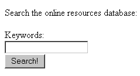

# 使用全文索引

既然你已经创建了全文索引，是时候实际应用它了。与创建全文索引类似，针对全文索引的查询也略有不同。查询的基本格式涉及使用 `@@` 运算符，该运算符用于比较一侧的 `tsvector` 类型和另一侧的 `tsquery` 类型。这听起来比实际复杂，因此让我们看一个示例以更好地理解：

```
phppg=# SELECT name,description FROM webresource
phppg-# WHERE description_fti_idx @@ 'postgresql'::tsquery;
 name       | description
-------------------+---------------------------------
 Planet PostgreSQL | PostgreSQL community bloggers
(1 row)
```

这会返回一行，匹配我们对 `PostgreSQL` 的搜索。然而，如果你仔细看，会注意到实际上搜索的是单词 `"postgresql"`，但描述中包含的是单词 `"PostgreSQL"`。这样能生效的原因是 `tsearch2` 实际上并不存储描述；相反，它存储了描述中值的修改文本和词干。这些内容是根据你设置索引时对表执行的 `UPDATE` 语句填充的。由于这可能会使查询变得有点困难，`tsearch2` 提供了 `to_tsquery()` 函数用于查询：

```
phppg=# SELECT name,description FROM webresource
phppg-# WHERE description_fti_idx @@ to_tsquery('apache');
 name       | description
-------------+--------------------------------------------
 Apache Site | Great apache site, contains Apache 2 manual
 Apache Week | Offers a dedicated Apache 2 section
(2 rows)
```

如你所见，此函数匹配了两条包含对 `"apache"` 引用的记录。

`tsearch2` 还允许你访问许多其他函数，用于构建非常强大的应用程序。涵盖所有这些函数超出了本书的范围，但我们来看一下两个更常用的函数：`headline()` 和 `rank()`。调用这些函数可能看起来有点复杂，所以让我们直接看一些示例代码。为了更好地查看结果，我们将使用 psql 的扩展输出格式（使用 `\x`）：

```
phppg=# SELECT name,rank(description_fti_idx,tsq),
phppg-# headline(description,tsq)
phppg-# FROM webresource, to_tsquery('apache') tsq
phppg-# WHERE description_fti_idx @@ tsq
phppg-# ORDER BY rank(description_fti_idx,tsq) DESC;
-[ RECORD 1 ]-------------------------------------------------------
name     | Apache Site
rank     | 0.0759909
headline | Great <b>Apache</b> site, contains <b>Apache</b> 2 manual
-[ RECORD 2 ]-------------------------------------------------------
name     | Apache Week
rank     | 0.0607927
headline | Offers a dedicated <b>Apache</b> 2 section
```

注意，你从 `rank()` 函数返回了一个排名，以及 `description` 字段的文本表示，用 `<b>`（粗体）HTML 标签突出显示了搜索词。

#### 停用词

如前所述，PostgreSQL 默认会忽略某些单词。这些单词被称为 *停用词*，即应被忽略的单词。此列表包含在操作系统的一个文件中；你可以通过查询 `tsearch2` 配置表之一来找到该文件：

```
phppg=# SELECT dict_initoption FROM pg_ts_dict WHERE dict_name = 'en_stem';
 dict_initoption
-------------------
 contrib/english.stop
(1 row)
```

此文件的格式是每个条目占一行。要添加或删除停用词，只需用任何文本编辑器打开此文件，手动添加或删除单词，确保每个添加或删除的单词独占一行。

### 索引最佳实践

以下列表提供了一些提示，在将索引纳入数据库开发策略时应牢记：

-   仅索引那些在 `WHERE`、`ORDER BY` 或 `JOIN` 子句中需要的列。过多地索引列只会导致不必要的硬盘空间消耗，并且在修改表信息时可能会降低性能。
-   PostgreSQL 不会在索引中存储 `NULL` 值。这意味着，对于会返回表中所有行的 `ORDER BY` 或 `JOIN` 语句，PostgreSQL 将不会使用索引，因为它无法在索引中找到所有行。解决此问题的最简单方法是在你打算索引的列上指定 `NOT NULL` 约束。（有关添加 `NOT NULL` 约束的详细信息，请参考第 28 章。）如果无法做到这一点，你也可以在 SQL 查询中添加限定符 `WHERE column IS NOT NULL`，以使 PostgreSQL 使用该索引。
-   如果你创建了多列索引，例如 `(firstname,lastname)`，则无需再为 `firstname` 单独创建索引，因为 PostgreSQL 能够搜索多列索引的第一列。但是，请注意，这只适用于第一列，针对其他列（例如 `(lastname)`）的搜索将无法使用该索引。
-   `EXPLAIN` 和 `EXPLAIN ANALYZE` 命令可帮助你确定 PostgreSQL 将如何执行查询，显示表的连接方式和顺序。这对于确定如何编写优化的查询以及是否应添加索引非常有用。有关 `EXPLAIN` 和 `EXPLAIN ANALYZE` 命令的更多信息，请查阅 PostgreSQL 手册。

### 基于表单的搜索

使用超链接轻松深入浏览网站是使 Web 成为如此流行媒介的行为之一。随着网站和 Web 规模呈指数级增长，基于用户提供的关键字执行搜索的能力已从便利演变为必需。在本节中，我们将提供几个示例，展示如何轻松构建基于 Web 的搜索界面来搜索 PostgreSQL 数据库。为实现这些示例，我们将继续使用第 31 章首次介绍的 PostgreSQL 数据类中的许多方法。

#### 执行简单搜索

许多有效的搜索界面都包含一个简单的文本字段。例如，假设你想让人力资源部门能够按姓氏查找员工联系信息。为实现此任务，查询将检查 `employee` 表中的 `lastname` 列。示例界面如图 35-1 所示。

**图 35-1.** *一个简单的搜索界面*

清单 35-1 实现了此界面，将请求的姓氏传递到搜索查询中。如果返回的行数大于零，则输出每一行；否则，提供相应的提示信息。

**清单 35-1.** *搜索员工表（simplesearch.php）*

```php
<p>
搜索员工数据库：<br />
<form action="simplesearch.php" method="post">
  姓氏：<br />
  <input type="text" name="lastname" size="20" maxlength="40" value="" /><br />
  <input type="submit" value="搜索！" />
</form>
</p>

<?php
/* 如果表单已提交且提供了姓氏 */
if (isset($_POST['lastname'])){
  include "pgsql.class.php";

  // 连接到服务器并选择数据库
  $pgsqldb = new pgsql("localhost","company","rob","secret");
  $pgsqldb->connect();

  /* 将提交的变量赋给一个方便的变量名 */
  $lastname = $_POST['lastname'];

  /* 查询员工表 */
  $pgsqldb->query("SELECT firstname, lastname, email FROM employee WHERE lastname='$lastname'");

  /* 如果找到记录，则输出每条记录的 firstname、lastname 和 email */
  if ($pgsqldb->numrows() > 0){
    while ($row = $pgsqldb->fetchobject()) {
```


```php
echo "$row->lastname, $row->firstname, ($row->email)<br />";
}
}
else {
echo "No Results found.";
}
}
?>
```

因此，在搜索界面输入 `Treat` 会返回类似如下的结果：

Treat, Robert (treat@example.com)

### 扩展搜索功能

**图 35-2.** *修改后的搜索表单*

清单 35-2 展示了实现这些扩展功能所需的代码。

**清单 35-2.** *扩展搜索功能（searchextended.php）*

```php
<p>
Search the employee database:<br />
<form action="searchextended.php" method="post">
Keyword:<br />
<input type="text" name="keyword" size="20" maxlength="40" value="" /><br />
Field:<br />
<select name="field">
<option value="">Choose field:</option>
<option value="lastname">Last Name</option>
<option value="email">E-mail Address</option>
</select>
[www.it-ebooks.info](http://www.it-ebooks.info/)
**762**
C H A P T E R 3 5 ■ I N D E X E S A N D S E A R C H I N G
<input type="submit" value="Search!" />
</form>
</p>
<?php
/* If the form has been submitted with a supplied keyword */
if (isset($_POST['field'])){
include "pgsql.class.php";
/* Connect to server and select database */
$pgsqldb = new pgsql("localhost","company","rob","secret");
$pgsqldb->connect();
/* Set the posted variables to a convenient name */
$keyword = $_POST['keyword'];
$field = $_POST['field'];
/* Create the query */
if ($field == "lastname") {
$pgsqldb->query("SELECT firstname, lastname, email FROM
employee WHERE lastname='$keyword'");
}
elseif ($field == "email") {
$pgsqldb->query("SELECT firstname, lastname, email FROM
employee WHERE email='$keyword'");
}
/* If records are found, output the firstname, lastname, and
email of each record */
if ($pgsqldb->numrows() > 0){
while ($row = $pgsqldb->fetchobject()) {
echo "$row->lastname, $row->firstname, ($row->email)<br />";
}
}
else {
echo "No Results found.";
}
}
?>
```

因此，将字段设置为 `E-mail Address` 并输入 `treat@example.com` 作为关键字，会返回类似如下的结果：

Treat, Robert (treat@example.com)

[www.it-ebooks.info](http://www.it-ebooks.info/)



第 35 章 ■ 索引与搜索

**763**

当然，在这两个示例中，你还需要添加额外的控制措施来净化数据，并确保当用户输入无效信息时，能向其提供详细的响应。

尽管如此，基本的搜索流程应该是显而易见的。

### 执行全文搜索

执行全文搜索与执行其他选择查询在本质上并无不同——只是查询语句看起来有所不同，这一细节对用户而言是隐藏的。让我们实现图 35-3 中所示的搜索界面，以演示如何搜索 webresource 表的 description 字段。

**图 35-3.** *一个全文搜索界面*

清单 35-3 展示了实现这些全文搜索功能所需的代码。

**清单 35-3.** *实现全文搜索*

```php
<p>
Search the online resource database:<br />
<form action="fulltextsearch.php" method="post">
Keywords:<br />
<input type="text" name="keywords" size="20" maxlength="40" value="" /><br />
<input type="submit" value="Search!" />
</form>
</p>
<?php
/* If the form has been submitted with a supplied keyword */
if (isset($_POST['keywords'])){
include "pgsql.class.php";
/* Connect to server and select database */
$pgsqldb = new pgsql("localhost","company","rob","secret");
$pgsqldb->connect();
/* Set the posted variable to a convenient name */
$keywords = $_POST['keywords'];
[www.it-ebooks.info](http://www.it-ebooks.info/)
**764**
第 35 章 ■ 索引与搜索
/* Multiple keywords need to be separated by | rather
than spaces */
$searchTerms = str_replace(' ','|',$keywords);
/* Create the query */
$pgsqldb->query("SELECT name, url FROM webresource WHERE
description_fti_idx @@ to_tsquery('default', '$searchTerms')");
/* Output any retrieved rows or display appropriate message */
if ($pgsqldb->numrows() > 0){
while ($row = $pgsqldb->fetchobject()) {
```

```php
echo "<a href=\"$row->url\">$row->name</a><br />";
}
}
else {
echo "未找到结果。";
}
}
?>
```

如果您使用该字段搜索关键词“Apache PHP”，它将返回以下结果列表，每个条目都是一个指向指定网站的链接：  
Apache 站点  
PHP：超文本预处理器  
Apache 周刊  

当然，与前面的示例一样，您需要添加额外的代码来处理数据清理。您可能还想修改查询，以利用 `tsearch2` 中的排名函数，并对结果进行相应排序——我们将这些任务留给读者作为练习。

### 总结

表索引是优化查询的可靠方法。在本章中，我们介绍了这一主题，并向您展示了如何创建主键索引、唯一索引、普通索引和全文索引，其中后者使用了 `tsearch2` 模块。接着，我们演示了如何轻松创建支持 PHP 的搜索界面，用于查询 PostgreSQL 表。

在下一章中，我们将介绍 PostgreSQL 的事务特性，并向您展示如何通过扩展第 31 章首次介绍的 PostgreSQL 数据类，将事务整合到您的 Web 应用程序中。

[www.it-ebooks.info](http://www.it-ebooks.info/)

第 36 章  
■ ■ ■  
事务

**本**章介绍 PostgreSQL 的事务能力，并演示如何通过 PostgreSQL 客户端和 PHP 脚本执行事务。通过本章的学习，您将全面了解事务的概念、PostgreSQL 如何实现事务，以及如何在 PHP 应用程序中使用事务。首先，我们正式定义事务。

### 什么是事务？

*事务*是一组被视为单个单元的有序数据库操作。  
如果组中的所有操作都成功，则该事务被视为成功；如果哪怕只有一个操作失败，则该事务被视为失败。如果所有操作都成功完成，该事务将被*提交*，其更改将对所有其他数据库进程可见。如果某个操作失败，该事务将被*回滚*，组成该事务的所有操作的效果都将被撤销。在事务执行期间发生的任何更改，仅对该事务所属的进程可见，并且这种状态将一直持续到更改被实际提交。这可以防止其他线程可能使用那些因回滚而即将失效的数据，从而导致数据完整性受损。

事务能力是企业数据库的关键组成部分，因为许多业务流程都包含多个步骤。以客户尝试在线购物为例。在结账时，客户的购物车将与现有库存进行比对，以确保有货。接着，客户必须提供账单和收货信息，此时系统将检查信用卡是否有足够的可用资金并进行扣款。然后，产品库存将相应减少，发货部门将收到待处理订单的通知。如果其中任何一步失败，则不应执行其他任何步骤。试想一下，客户发现信用卡已被扣款，但产品却因库存不足而从未送达时的沮丧。同样，作为在线卖家，如果信用卡无效或提供的收货信息不足，您也不会想减少库存甚至发货。

事务由其遵循的四个原则定义，这些原则体现在 ACID 这个缩写词中：

- **原子性（Atomicity）：** 事务的所有步骤必须成功完成；否则，任何一个步骤都不会被提交。
- **一致性（Consistency）：** 事务的所有步骤必须成功完成；否则，所有数据将恢复到事务开始前的状态。
- **隔离性（Isolation）：** 任何尚未完成的事务所执行的步骤必须与系统隔离，直到该事务被认定为完成。
- **持久性（Durability）：** 所有已提交的数据必须由系统以某种方式保存，以便在系统发生故障时，数据能够成功恢复到有效状态。

随着您在本章中进一步了解 PostgreSQL 的事务支持，您将理解必须遵循这些原则以确保数据库完整性。

### PostgreSQL 的事务能力

PostgreSQL 通过一种称为多版本并发控制（MVCC）的方法来支持事务。这意味着，当一个事务正在进行时，它会看到自己独立于底层数据实际状态的数据库快照。这可以防止任何给定事务看到其他事务可能已启动但尚未提交的部分数据更改。这一原则被称为*事务隔离*。

#### 事务隔离

SQL 标准规定了三个属性，用于确定事物处于四种隔离级别中的哪一种。这三个属性如下：

- **脏读（Dirty reads）：** 一个事务可以读取另一个未提交的并发事务所写入的数据。
- **不可重复读（Nonrepeatable reads）：** 一个事务重新读取之前已读取过的数据，并看到了另一个并发事务已提交的数据。
- **幻读（Phantom reads）：** 一个事务重新执行返回一组数据的查询，并发现满足条件的数据因另一个最近提交的事务而发生了变化。

这三个条件决定了一个事务的隔离级别，可以是表 36-1 中列出的四个级别之一。

**表 36-1.** *SQL 标准事务隔离级别*

| 事务隔离级别 | 脏读 | 不可重复读 | 幻读 |
|----------------------------|-------------|--------------------|---------------|
| 读未提交（Read Uncommitted） | 允许 | 允许 | 允许 |
| 读已提交（Read Committed） | 不允许 | 允许 | 允许 |
| 可重复读（Repeatable Read） | 不允许 | 不允许 | 允许 |
| 可串行化（Serializable） | 不允许 | 不允许 | 不允许 |

PostgreSQL 允许您请求任何事务隔离级别。然而，在内部，该级别将被设置为以下两个级别之一：`read committed` 或 `serializable`。虽然这似乎有悖直觉，但这是 SQL 标准所允许的，该标准只要求数据库强制执行那些*不允许*的事务属性，而允许可选地强制执行那些*允许*的事务属性。例如，如果您请求 `repeatable read` 模式，标准只要求您禁止脏读和不可重复读，但实际上并不要求允许幻读。因此，`serializable` 事务模式符合 `repeatable read` 模式的要求，即使它与定义不完全匹配。正因为如此，您应该知道，当您请求 `read uncommitted` 时，您实际得到的是 `read committed`；而您请求 `repeatable read` 时，您实际得到的是 `serializable`。

您还应该知道，默认情况下，当您不请求特定隔离级别时，您会得到 `read committed` 隔离级别。这两个级别的主要区别在于，在 `read committed` 模式下，`SELECT` 查询会看到在给定事务内发生更改的已提交数据；但在 `serializable` 模式下，`SELECT` 语句始终看到事务开始时的数据。这意味着连续的 `SELECT` 语句在 `read committed` 模式下可能看到不同的数据，但在 `serializable` 模式下始终看到相同的数据。

### 示例项目


我们将通过在线跳蚤市场的一些相关组件为例，说明本章迄今为止讨论的主题。为了准备这些示例，我们将在名为`company`的数据库中创建两个表：`participant`和`trunk`。每个表的用途及其结构也会一同呈现。创建表之后，我们还会添加一些示例数据，这些数据将在以下章节中提供。

#### `participant` 表

此表存储每位跳蚤市场参与者的信息，包括他们的姓名、电子邮件地址和可用现金：

```sql
CREATE TABLE participant (
  participantid SERIAL,
  name TEXT NOT NULL,
  email TEXT NOT NULL,
  cash NUMERIC(5,2) NOT NULL,
  PRIMARY KEY (participantid)
);
```

#### `trunk` 表

此表存储参与者拥有的每件物品的信息，包括所有者、名称、描述和价格：

```sql
CREATE TABLE trunk (
  trunkid SERIAL,
  participantid INTEGER NOT NULL REFERENCES participant(participantid),
  name TEXT NOT NULL,
  price NUMERIC(5,2) NOT NULL,
  description TEXT NOT NULL,
  PRIMARY KEY (trunkid)
);
```

[www.it-ebooks.info](http://www.it-ebooks.info/)

768 第 36 章 ■ 事 务

#### 添加一些示例数据

接下来，向两个表中添加几行数据。为了简化操作，我们添加两位参与者：Robert 和 Howard，以及他们各自货箱中的几件物品：

```sql
INSERT INTO participant (name,email,cash) VALUES
  ('Robert','robert@example.com','100.00');

INSERT INTO participant (name,email,cash) VALUES
  ('Howard','howard@example.com','150.00');

INSERT INTO trunk (participantid,name,price,description) VALUES
  (1,'Linux CD','1.00','光盘上完整的操作系统');

INSERT INTO trunk (participantid,name,price,description) VALUES
  (2,'Abacus','12.99','算力不足？用算盘吧！');

INSERT INTO trunk (participantid,name,price,description) VALUES
  (2,'Magazines','6.00','一摞计算机杂志');
```

### 一个简单示例

为了更好地了解事务的具体行为，本节将通过命令行运行一个简单的事务示例。该示例演示了两位跳蚤市场参与者如何完成用现金交换物品的过程。在查看代码之前，请先花一点时间阅读伪代码：

1. 参与者 Robert 请求一件物品，比如参与者 Howard 虚拟货箱中的算盘。
2. 参与者 Robert 将 12.99 美元的现金转入参与者 Howard 的账户。其效果是，这笔金额从 Robert 的账户中扣除，并等额记入 Howard 的账户。
3. 算盘的所有权转移给参与者 Robert。

如您所见，流程中的每一步对于事务的整体成功都至关重要，以确保我们的数据不会因为某一步的失败而损坏。尽管在真实场景中还有其他步骤（例如确保购买方有足够的资金），但本示例中简化了流程，以便将重点集中在主要议题上。

您可以通过发出`START TRANSACTION`命令来启动事务：

```sql
company=# START TRANSACTION;
START TRANSACTION
```

> **注意：** `BEGIN`命令是`START TRANSACTION`的别名。虽然两者完成的任务相同，但建议使用后者，因为它符合 SQL 规范。

[www.it-ebooks.info](http://www.it-ebooks.info/)

第 36 章 ■ 事 务

769

接下来，从 Robert 的账户中扣除 12.99 美元：

```sql
company=# UPDATE participant SET cash=cash-12.99 WHERE participantid=1;
UPDATE 1
```

然后，向 Howard 的账户存入 12.99 美元：

```sql
company=# UPDATE participant SET cash=cash+12.99 WHERE participantid=2;
UPDATE 1
```

接着，将算盘的所有权转移给 Robert：

```sql
company=# UPDATE trunk SET participantid=1 WHERE name='Abacus' AND
company-# participantid=2;
UPDATE 1
```

此时，我们已经完成了最初设定的使事务完整的目标，因此，或许现在是利用另一个 PostgreSQL 功能——保存点——的好时机。


■ **注意** 保存点功能最早在 PostgreSQL 8.0.0 中引入，因此如果你运行的是更早的版本，将无法执行以下命令。

保存点就像事务中的书签，让你能够在事务中设置一个点，以便在后续事务出现错误时回滚到该点。现在让我们创建一个保存点：

```
company=# SAVEPOINT savepoint1;
SAVEPOINT
```

创建保存点后，我们可以继续执行语句。假设我们想验证对 participant 表所做的更改，但出于本例的目的，我们假设在查询时因拼写错误而打错了表名：

```
company=# SELECT * FROM particapant;
错误: 关系 "particapant" 不存在
```

如果在没有设置保存点的情况下执行此查询，整个事务将因事务块内的这个错误而不得不回滚。即使我们纠正了错误，也能发现 PostgreSQL 不会允许我们继续执行当前事务：

```
company=# SELECT * FROM participant;
错误: 当前事务已中止，在事务块结束前命令被忽略
```

■ **注意** 在 PostgreSQL 8.0.0 之前的版本中，此时你将不得不回滚整个事务。

然而，由于我们已创建了保存点，我们可以回滚到该保存点，这将使事务恢复到导致错误之前的状态：

```
company=# ROLLBACK TO savepoint1;
ROLLBACK
```

■ **注意** 拼写错误问题曾相当令人烦恼，因此在 PostgreSQL 8.1 中，`psql` 客户端将提供一个 `\reseterror` 选项，它会在出错时自动设置保存点并回滚到该点。

现在我们可以像什么都没发生一样在事务中查询了。我们来快速检查一下 participant 表，确保现金金额已正确扣除和增加：

```
company=# SELECT * FROM participant;
```

返回结果如下：

```
participantid | name | email | cash
---------------+--------+--------------------+--------
1 | Robert | robert@example.com | 87.01
2 | Howard | howard@example.com | 162.99
(2 行)
```

也花点时间检查一下 trunk 表；你会看到算盘的所有权确实发生了变化。但请注意，由于 PostgreSQL 遵循 ACID 原则，此更改目前仅对执行事务的当前连接可见。

为了说明这一点，启动第二个 `psql` 客户端，同样登录到 `company` 数据库。检查 `participant` 表。你会看到每位参与者的现金值保持不变。这是 ACID 测试中隔离性的体现。在你使用 `COMMIT` 提交更改之前，事务过程中所做的任何更改对其他连接都是不可见的。

尽管更新操作确实正确执行了，但假设有一个或多个更新失败。返回第一个客户端窗口，通过执行 `ROLLBACK` 命令来撤销更改：

```
company=# ROLLBACK;
ROLLBACK
```

现在，再次执行 `SELECT` 命令：

```
company=# SELECT * FROM participant;
```

返回结果如下：

```
participantid | name | email | cash
---------------+--------+--------------------+--------
1 | Robert | robert@example.com | 100.00
2 | Howard | howard@example.com | 150.00
(2 行)
```

请注意，每位参与者的现金持有量已重置为初始值。检查 trunk 表也会发现算盘的所有权并未改变。尝试重新执行上述过程，这次使用 `COMMIT` 命令而不是回滚来提交更改。一旦事务被提交，再次返回第二个客户端并查看表；你会看到提交的更改会立即可用。


**注意** 在发出`COMMIT`或`ROLLBACK`命令之前，事务序列中的任何数据更改都不会生效。这意味着如果 PostgreSQL 服务器在你提交更改之前崩溃，这些更改将不会生效，并且你需要重新开始事务序列才能使这些更改发生。

在稍后的章节中，我们将使用 PHP 脚本重新创建这一过程。

### 事务使用技巧

以下是使用事务时需要记住的一些技巧：

-   仅在确保整个流程必须成功执行时使用事务。例如，将产品添加到购物车的过程至关重要；而浏览所有可用产品则不是。
-   PostgreSQL 允许你回滚数据定义语言语句；即任何用于创建、修改或删除数据库对象（包括表、索引、触发器、函数、视图等）的语句。
-   事务不能嵌套。在`COMMIT`或`ROLLBACK`之前发出多个`START TRANSACTION`命令将不会产生任何效果。相反，你应该使用保存点来实现嵌套事务提供的功能。

### 使用 PHP 构建事务型应用程序

将 PostgreSQL 的事务功能集成到你的 PHP 应用程序中其实并非难事；你只需要记住在适当的时间开始事务，然后在相关操作完成后提交或回滚事务即可。

本节演示了在 PHP 中执行事务的一般方法。学完本节后，你应该能够非常熟悉将此重要功能集成到你的应用程序中所需的一般流程。

当然，你应该继续使用我们最初在第 34 章创建的 PostgreSQL 类。因此，首先在你的 PostgreSQL 类中添加以下五个额外的方法：`begintransaction()`、`commit()`、`rollback()`、`setsavepoint()` 和 `rollbacktosavepoint()`。到现在为止，每个方法的目的都应该是显而易见的。

```php
function begintransaction() {
    $this->query('START TRANSACTION');
}

function commit() {
    $this->query('COMMIT');
}

function rollback() {
    $this->query('ROLLBACK');
}

function setsavepoint($savepointname) {
    $this->query("SAVEPOINT $savepointname");
}

function rollbacktosavepoint($savepointname) {
    $this->query("ROLLBACK TO SAVEPOINT $savepointname");
}
```

由于这些命令通常不会导致错误，为了简化示例代码，我们将省略异常处理。

#### 谨防 `pg_query()`

`pg_query()` 函数的行为方式可能不像你想象的那么直观。不完全理解其行为可能会对你的事务逻辑造成严重破坏。

这种混淆可能源于 `pg_query()` 判断成功与失败的方式。当调用 `pg_query()` 时，任何成功执行的查询都会返回一个资源标识符。这看起来很简单，但你必须记住，仅仅因为查询成功执行并不意味着有任何实质性的改变发生。例如，假设你执行以下代码：

```php
$query = "UPDATE participant SET name = 'Treat' WHERE name = 'Rob'";
echo pg_query($query);
```

根据你在本章开头插入的测试信息，此查询不会更新任何行，因为没有名为“Rob”的参与者。然而，`pg_query()` 仍然会很乐意返回一个资源标识符，就像它做了某事一样，因为查询本身是有效的。这在处理事务时可能是一个大问题，因为你需要确切地知道预期的结果是否已经发生。为了正确处理事务，你需要同时检查查询是否已正确执行以及是否有行受到影响。你可以使用第 30 章首次介绍的 `pg_affected_rows()` 函数来实现这一点。例如，你可以重写此代码来确定查询是否有效以及是否有行受到影响：

```php
$query = "UPDATE participant SET name = 'Treat' WHERE name = 'Rob'";
$result = pg_query($query);
if ($result AND pg_affected_rows($result) == 1)
    echo "TRUE";
else
    echo "FALSE";
```

这将返回 `FALSE`。这个概念对于将 PostgreSQL 数据库事务与 PHP 结合使用至关重要，因此它将被纳入以下示例中。

#### 重温交换市场

在这个示例中，你将使用 PHP 重新创建之前演示的交换市场场景。为了将不相关的细节控制在最低限度，页面将显示一个产品，并为用户提供一种将商品添加到购物车的方式；它可能看起来像这样：

```html
<p>
    <strong>算盘</strong><br />
    所有者：霍华德<br />
    价格：$12.99<br />
    计算能力不足？来一个算盘吧！<br />
    <form action="purchase.php" method="post">
        <input type="hidden" name="itemid" value="1" />
        <br />
        <input type="submit" value="购买！" />
    </form>
</p>
```

如你所料，此页面中显示的数据可以很容易地从 `participant` 和 `trunk` 表中提取。在浏览器中渲染后，此页面将如图 36-1 所示。

**图 36-1.** *典型的产品展示*

点击“购买！”按钮会将用户带到 `purchase.php` 脚本。这里传递了一个变量，即 `$_POST['itemid']`。通过将此变量与一些用于检索参与者和后备箱商品主键的假设类方法结合使用，你可以使用 PostgreSQL 事务将产品添加到数据库，并相应地扣除和贷记参与者的账户，如清单 36-1 所示。

**清单 36-1.** *使用 purchase.php 交换商品*

```php
<?php
session_start();
include "pgsql.class.php";

// 使用某个虚构的类（用于将会话 ID 映射回特定用户）检索参与者的主键
// 该类引用某种用户会话表
$participant = new participant();
$buyerid = $participant->getparticipantkey();

// 为 POST 提交的商品 ID 赋予一个友好的变量名
$itemid = $_POST['itemid'];

// 使用某个虚构的商品类检索商品卖家及其价格
$item = new item();
$sellerid = $item->getitemowner($itemid);
$price = $item->getprice($itemid);

// 实例化 pgsql 类
$pgsqldb = new pgsql("localhost","company","webuser","secret");

// 连接 PostgreSQL 数据库
$pgsqldb->connect();

// 假设事务操作都会成功
$transactionsuccess = TRUE;

// 开始事务
$pgsqldb->begintransaction();

// 从买家账户扣款
$query = "UPDATE participant SET cash=cash-$price WHERE participantid=$buyerid";
$result = $pgsqldb->query($query);
if (!$result OR $result->affectedrows() != 1)
    $transactionsuccess = FALSE;

// 向卖家账户入账
$query = "UPDATE participant SET cash=cash+$price WHERE participantid=$sellerid";
$result = $pgsqldb->query($query);
if (!$result OR $result->affectedrows() != 1)
    $transactionsuccess = FALSE;

// 更新后备箱商品的所有权
$query = "UPDATE trunk SET participantid=$buyerid WHERE trunkid=$itemid";
$result = $pgsqldb->query($query);
if (!$result OR $result->affectedrows() != 1)
    $transactionsuccess = FALSE;

// 如果 $transactionstatus 为真，则提交事务
// 否则回滚所有更改
if ($transactionsuccess) {
    $pgsqldb->commit();
    echo "交换成功！恭喜！";
} else {
    $pgsqldb->rollback();
    echo "交换出现问题！:-(";
}
?>
```


好的，遵照您的要求，以下是英文原文的中文翻译。


如您所见，在事务的每一步执行后，都会检查查询的状态和受影响的行数。如果在任何时候其中一项失败，`$transactionsuccess` 就会被设置为 `FALSE`，并且在脚本结束时所有步骤都会被回滚。当然，您可以优化这个脚本，使每个查询以锁步方式启动，即只有在确定前一个查询已正确执行后，才进行下一个查询，但这个练习留给您自己去完成。

### 总结

在建模业务过程时，数据库事务非常有用，因为它们有助于确保组织中最有价值的资产——其信息的完整性。

如果谨慎使用，数据库事务在构建数据库驱动的应用程序时是一笔巨大的财富。

在下一章，也就是最后一章中，我们不仅将演示使用 PostgreSQL 的内置工具来导入和导出大量数据是多么容易，我们还将看看如何使用简单的 PHP 脚本来做一些很酷的事情，比如格式化基于表单的信息，以便通过电子表格应用程序（如 Microsoft Excel）进行查看。

[www.it-ebooks.info](http://www.it-ebooks.info/)

