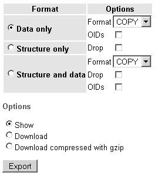

# 第 37 章 导入和导出数据

如果你使用`COPY FROM`将 CSV 文件读入表，并且声明了`HEADER`子句，第一行将被忽略。

某些数据可能由单引号或双引号分隔，这些引号在 PostgreSQL 中具有特殊意义，因此你需要留意它们，以确保正确处理。你可以使用`QUOTE`子句指定此字符，默认设置为双引号。然后，可以使用`ESCAPE`子句标识的字符对指定的引号字符进行转义，该子句默认也使用双引号。

如果你从表中导出数据并使用`FORCE NOT NULL`，则假定没有值为空；如果遇到任何空值，它将被插入为空字符串。

如果你向表中导入数据并使用`FORCE QUOTE`，则所有非空值都将被引用，要么使用默认的双引号，要么使用声明`QUOTE`子句时指定的任何值。

### 从 PHP 脚本调用 COPY

虽然前面描述的`COPY`命令对开发人员和数据库管理员很有用，但最终用户肯定需要更直观的解决方案。为满足此需求，PHP 的 PostgreSQL 扩展提供了`pg_copy_from()`和`pg_copy_to()`函数（在第 30 章介绍过）。这两个函数的功能分别与前面介绍的`COPY FROM`和`COPY TO`命令相同，不同之处在于它们可以轻松地从你的 Web 应用程序中执行。

在本节中，我们将考虑一个实际示例，使用`pg_copy_to()`将数据从 PostgreSQL 表复制到文本文件。

### 将数据从表复制到文本文件

假设你想创建一个界面，允许管理人员创建包含员工联系信息的 CSV 文件。这些文件按日期保存到共享驱动器上的某个文件夹中。实现此功能的代码见清单 37-1。

**清单 37-1.** 将员工数据保存到 CSV 文件（`saveemployeedata.php`）

```php
<?php

$pg = pg_connect("host=localhost user=jason password=secret dbname=corporate") or die("Could not connect to db server.");

// Copy the employee table data to an array

$array = pg_copy_to($pg, "employee", ",");

// Retrieve current date for file-naming purposes

$date = date("Ymd");

// Open the file

$fh = fopen("/home/reports/share/employees-$date.csv", "w");

// Collapse the array to a newline-delimited set of rows

$contents = implode("\n", $array);

// Write $contents to the file

fwrite($fh, $contents);

// Close the file

fclose($fh);

?>
```

脚本执行后，打开新创建的文件，你会看到类似如下的输出：

```
1,JG1000011,Jason Gilmore,jason@example.com
2,RT435234,Robert Treat,rob@example.com
3,GS998909,Greg Sabino Mullane,greg@example.com
4,MW777983,Matt Wade,matt@example.com
```

现在尝试在电子表格程序（如 Microsoft Excel 或 OpenOffice.org Calc）中打开它！

你还可以在输出数组内容之前，先向 CSV 文件写入一行标题，轻松添加表头，如下所示：

```php
fwrite($fh, "Employee ID,Name,Email\n");
```

### 使用 phpPgAdmin 导入和导出数据

如果你正在寻找一个方便且功能强大的管理工具，能够从任何有 Web 浏览器的地方访问，phpPgAdmin（http://www.phppgadmin.net/）是目前最强大的解决方案。phpPgAdmin 首次在第 27 章介绍，它不仅可以轻松管理你的数据库，还能以多种格式导入和导出数据。

> **注意** 目前，此 phpPgAdmin 功能在 Windows 上不受支持。

要导出数据，请导航到目标表，然后单击页面右上角的“Export”链接。这样做会打开如图 37-2 所示的界面。




