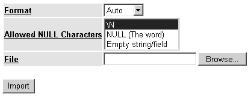

# 784

## 第 37 章：导入和导出数据

**图 37-2.** *phpPgAdmin 的导出界面*

如您所见，可以通过三种方式导出数据：

- **仅表数据**：如果您只想导出数据，可以六种不同格式进行导出，包括 `COPY`、`CSV`、`SQL`、`Tabbed`、`XHTML` 和 `XML`。
- **仅表结构**：如果您只想导出表结构，则会导出用于创建表的 `SQL` 语法。勾选相应的 `Drop` 复选框，会在输出文件的顶部插入 `DROP` 表命令，以便在重新创建之前删除任何已存在的同名表。
- **数据和结构两者**：如果您想同时导出表结构和表数据，可以选择以 `COPY` 和 `SQL` 两种格式进行导出。勾选相应的 `Drop` 复选框，会在输出文件的顶部插入 `DROP` 表命令，以便在重新创建之前删除任何已存在的同名表。

请注意，在所有情况下，您都可以将信息输出到浏览器或下载它。

选择下载会将信息保存到扩展名为 `.sql` 的文件中，然后提示您将其下载到本地计算机。

导入数据通过导航到目标表并点击 `Import` 菜单项来完成。执行此操作将会看到图 37-3 所示的界面。

**图 37-3.** *phpPgAdmin 的导入界面*

支持四种格式的导入文件：`Auto`、`CSV`、`Tabbed` 和 `XML`。每种格式的用途应该很明显，除了 `Auto` 模式。选择 `Auto` 会使 `phpPgAdmin` 通过检查文件扩展名（有效的扩展名是 `.csv`、`.tab` 和 `.xml`）来选择其他三种格式之一。此外，如果在文件中发现任何空字符，您可以指定它们是使用序列 `\N`、单词 `NULL` 还是空字符串来表示。

[www.it-ebooks.info](http://www.it-ebooks.info/)

### 小结

如本章所学，您有几种选择可以将数据导入到您的 PostgreSQL 数据库以及从中导出数据。您可以通过命令行手动操作，或者通过使用 `COPY` 命令编写脚本实现。或者，您可以通过使用 PHP 的 `pg_copy_to()` 和 `pg_copy_from()` 函数将这些功能整合到 Web 应用程序中。此外，您也可以依赖像 `phpPgAdmin` 这样的应用程序来简化此过程。

本书到此结束。我们希望您阅读本书的乐趣能与我们编写本书的过程一样多。祝您好运！

[www.it-ebooks.info](http://www.it-ebooks.info/)

---

## 索引

### 数字和符号

- `actor` 参数
- `.NET Framework SDK`，512
- `SoapClient` 构造函数，503
- `?` 命令，`psql`，613
- `SoapServer` 构造函数，508
- `@@` 运算符
- `addDays` 方法，294
- 使用全文索引，PostgreSQL，757
- `addFunction` 方法
- `401 (未授权访问)` 消息
- 创建 SOAP 服务器，509
- 硬编码认证，329
- 添加数据
- HTTP 认证，325
- `ldap_mod_add` 函数，416
- 发送给用户，327
- 添加条目
- `404 (文件未找到)` 消息，321
- `ldap_add` 函数，416
- `addition (+)` 运算符，71

### A

- `A (IPv4 地址记录)` 记录类型，DNS，360
- `addl_headers` 参数
- `mail` 函数，368
- `A6 (IPv6 地址)` 记录类型，DNS，360
- `addl_headers` 参数，`mail()`
- `AAAA (IPv6 地址记录)` 记录类型，DNS，360
- 发送带有额外标头的电子邮件，369
- 抽象类，OOP，168–169
- `addl_params` 参数
- 抽象类或接口，169
- `mail` 函数，368
- 描述，157
- `addMonths` 方法，295
- 继承，168
- `Addresses` 选项
- 实例化，168
- 安装 PostgreSQL，587
- `abstract` 关键字，169
- `addslashes` 函数，34
- 抽象方法，146
- `AddType` 指令
- 带重音的语言
- 在 Linux/Unix 上安装 PHP，13
- 本地化格式，280
- 在 Windows 上安装 PHP，15
- `AcceptPathInfo` 指令
- `addWeeks` 方法，296
- 配置 Apache 回看特性，316
- `addYears` 方法，297
- 访问权限系统，PostgreSQL，651–662
- `adl` 属性，消息，379
- 可访问性，475

管理

`accessors`

第 140 页

`PostgreSQL`

第 593–610 页

`getter`（`_get`）方法，第 142 页

`Administrator Account`选项

`Account Domain/Name`参数

安装`PostgreSQL`，第 587 页

安装`PostgreSQL`，第 586 页

`affectedRows`函数，`PostgreSQL`，第 691 页

`ACID`测试，事务，第 765 页

第 787 页

[www.it-ebooks.info](http://www.it-ebooks.info/)

第 788 页

■索引

`Afilias Inc`

配合`VACUUM`运行，第 603 页

`PostgreSQL`用户，第 576 页

`AND`（`&&`）运算符，第 73 页

`AFTER`触发器，`PostgreSQL`，第 740、741 页

`answered`属性，消息，第 379、383 页

聚合函数，`PostgreSQL`，第 724 页

`ANY`记录类型，`DNS`，第 360 页

聚合函数，`SQLite`

`Apache`

创建，第 551–553 页

下载，第 9–10 页

`sqlite_create_aggregate`函数，第 552 页

`Apache`手册，第 18 页

聚合器，`RSS`

二进制发行版，第 10 页

`MagpieRSS`，第 483 页

选择`Apache`版本，第 10 页

流行聚合器，第 476 页

源代码发行版，第 10 页

`ALIAS`类型

隐藏配置细节，第 520–521 页

`PL/pgSQL`函数，第 731、735 页

安装

别名，`LDAP`，第 419 页

在`Linux/Unix`上，第 11–13 页

对齐说明符

在`Windows`上，第 13–16 页

`printf`语句，第 49 页

问题，第 18 页

`allow_call_time_pass_reference`

讨论范围，第 11 页

参数，第 25 页

回溯特性，第 314 页

`allow_url_fopen`参数，第 38、88 页

配置，第 315–316 页

`:alnum:`字符类，第 194 页

重写特性，第 315 页

`:alpha:`字符类，第 194 页

`SSL`支持，第 10 页

`ALTER DATABASE`命令，第 627 页

测试安装，第 16–17 页

`ALTER DOMAIN`命令，第 646 页

`APPDATA`

`ALTER GROUP`命令，第 659 页

将配置信息存储在

`ALTER SCHEMA`命令，第 628 页

启动文件中，第 616 页

`ALTER SEQUENCE`命令，第 633 页

`Archive_Tar`包，`PEAR`，第 260 页

`ALTER TABLE`命令，第 632 页

`arg_separator.input`参数，第 33 页

`ALTER TABLESPACE`命令，第 602 页

`arg_separator.output`参数，第 32 页

`ALTER TRIGGER`命令，第 740 页

参数

`ALTER TYPE`命令，第 645 页

*另请参阅* `parameters`

`ALTER USER`命令，第 658 页

默认参数值，第 94 页

`always_populate_raw_post_data`

`escapeshellarg`函数，第 526 页

参数，第 36 页

可选参数，第 94 页

`amortizationTable`函数，第 97 页

按引用传递参数，第 93 页

`ampersand`（`&`）

按值传递参数，第 92 页

将特殊字符转换为

`PL/pgSQL`函数，第 731 页

`HTML`，第 212 页

`register_argc_argv`指令，第 34 页

`ANALYZE`命令，`PostgreSQL`，第 603 页

算术运算符，第 70 页

`autovacuum`参数，第 604 页

数组数据类型，`PHP`，第 52 页

[www.it-ebooks.info](http://www.it-ebooks.info/)

■索引

第 789 页

数组函数

`ksort`，第 122 页

`array`，第 107 页

`list`，第 107 页

`array_chunk`，第 130 页

`natcasesort`，第 120 页

`array_combine`，第 124 页

`natsort`，第 119 页

`array_count_values`，第 117 页

`next`，第 114 页

`array_diff`，第 128 页

`prev`，第 114 页

`array_diff_assoc`，第 128 页

`print_r`，第 105 页

`array_flip`，第 116、213 页

`range`，第 108 页

`array_intersect`，第 127 页

`reset`，第 113 页

`array_intersect_assoc`，第 127 页

`rsort`，第 120 页

`array_key_exists`，第 112 页

`shuffle`，第 129 页

`array_keys`，第 111 页

`sizeof`，第 117 页

`array_merge`，第 125 页

`sort`，第 118 页

`array_merge_recursive`，第 125 页

`usort`，第 123 页

`array_multisort`，第 121 页

数组

`array_pad`，第 110 页

添加和移除元素，第 109–111 页

`array_pop`，第 110 页

添加元素，第 109 页

`array_push`，第 109 页

在数组末尾，第 109 页

`array_rand`，第 129 页

在数组前端，第 110 页

`array_reverse`，第 116 页

将数组长度增加到指定大小，第 110 页

`array_search`，第 112 页

数组指针，第 105 页

`array_shift`，第 110 页

关联键，第 104 页

`array_slice`，第 125、484 页

将数组拆分为更小的数组，第 130 页

`array_splice`，第 126 页

统计数组中值的数量，第 116 页

`array_sum`，第 130 页

统计值出现的次数，第 117 页

`array_unique`，第 118 页

创建数组，第 106–108 页

`array_unshift`，第 110 页

从结构化数据创建，第 107 页

`array_values`，第 112 页

数值范围，第 108 页

`array_walk`，第 114 页

描述，第 104 页

`arsort`，第 122 页

键，第 104 页

`asort`，第 120 页

定位数组元素，第 111–112 页

`count`，第 116 页

操作数组，第 124–129 页

`current`，第 113 页

将数组追加到一起，第 125 页

`each`，第 113 页

将键数组与值数组结合，第 124 页

`end`，第 114 页

移除并返回数组的一部分，第 126 页

`in_array`，第 111 页

返回数组中的公共键值对，第 127 页

`is_array`，第 108 页

返回数组中不公共的键值对，第 128 页

`key`，第 113 页

返回数组的一部分，第 125 页

`krsort`，第 123 页

返回数组中的公共值，第 127 页

返回数组中不公共的值，第 128 页

多维数组，第 104 页

数值键，第 104 页

一维数组，第 104 页

大小，第 116–117 页

排序，第 118–124 页

按`ASCII`值排序，第 118 页

按键（而非值）排序，第 122 页

按用户自定义函数排序，第 123 页

不区分大小写排序，第 120 页

按其他语言排序，第 118 页

