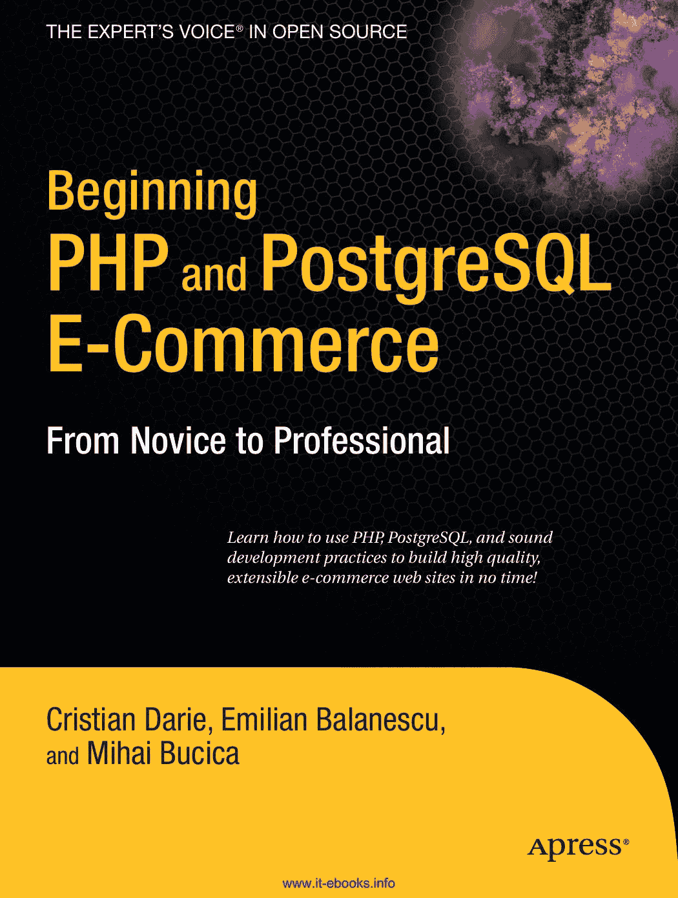

# PHP 与 PostgreSQL 电子商务入门：从新手到专家

青色 黄色 品红 黑色 潘通 123 CV

专业人士所著专业书籍®

开源领域权威之声®

**附赠电子书**

亲爱的读者，

PHP 语言与 PostgreSQL 数据库长久以来为新手和经验丰富的程序员提供了实用性与强大功能的理想结合。

本书将向您展示如何利用这一强大组合来构建功能完备的电子商务网站。通过引导您完成整个设计与构建流程，您将创建一个专业开发的应用程序，能够以有序的方式持续集成新功能。

随着每一章的深入，您将学习如何开发并部署一套完整的在线产品目录，其中包含购物车、结账机制、产品搜索、产品推荐、管理功能、客户账户、订单管理系统等。

您还将学习如何通过集成多种流行的支付服务（包括 PayPal、DataCash 和 Authorize.net）来处理电子支付。

在添加每个新功能的过程中，您将遇到新的挑战和理论概念，本书均会详细解释。在此过程中，您将深入理解所编写的每一行代码，从而使您能够利用 PHP 和 PostgreSQL 高效且快速地构建自己强大而灵活的网站。

祝您阅读愉快！

*克里斯蒂安、埃米利安和米哈伊*

---

## APRESS 出版路线图

- PHP 5 对象、模式与实践

- PHP 与 PostgreSQL 8 入门

- 高级 PHP

- PostgreSQL 入门与精通

- 必备 PHP 工具：模块、扩展与加速器

**附赠电子书**

有关 10 美元电子书版本的详细信息，请参见最后一页

**源代码在线**

[www.apress.com](http://www.apress.com/)

**定价：49.99 美元**

分类：PHP

用户级别：初学者至中级

[www.it-ebooks.info](http://www.it-ebooks.info/)

*此印刷内容仅供参考——尺寸与颜色不精确* *书脊厚度 = 1.205 英寸 640 页*

`648XFM.qxd` 2006 年 11 月 22 日 下午 4:43 第 i 页

## PHP 与 PostgreSQL 电子商务入门：从新手到专家

**版权所有 © 2006 克里斯蒂安·达里埃、埃米利安·巴勒内斯库、米哈伊·布西卡**

保留所有权利。未经版权所有者及出版商事先书面许可，不得以任何形式或通过任何方式（包括电子或机械手段，如影印、录制，或任何信息存储与检索系统）复制或传播本作品的任何部分。

ISBN-13（平装）：978-1-59059-648-7

ISBN-10（平装）：1-59059-648-X

在美国印刷及装订 9 8 7 6 5 4 3 2 1

本书中可能出现商标名称。我们不在每次出现商标名称时使用商标符号，仅以编辑方式使用这些名称，以利于商标所有者，并无侵犯商标之意。

首席编辑：杰森·吉尔摩

技术审阅：格雷格·萨巴诺·穆兰

编辑委员会：史蒂夫·安格林、尤安·白金汉、加里·康奈尔、杰森·吉尔摩、乔纳森·根尼克、乔纳森·哈塞尔、詹姆斯·赫德尔斯顿、克里斯·米尔斯、马修·穆迪、多米尼克·谢克沙夫特、吉姆·萨姆瑟、凯尔·托马斯、马特·韦德

项目经理：凯莉·约翰斯顿

文字编辑经理：妮可·弗洛雷斯

文字编辑：朱莉·麦克纳米

助理制作总监：卡丽·布鲁克斯-科波尼

制作编辑：洛里·布林

排版员：吉娜·雷克瑟罗德

校对员：艾普丽尔·埃迪

索引编制员：约翰·科林

插画师：艾普丽尔·米尔恩

封面设计师：库尔特·克拉梅斯

生产总监：汤姆·德博尔斯基

本书通过 Springer-Verlag New York, Inc. 在全球图书贸易中发行，地址：233 Spring Street, 6th Floor, New York, NY 10013。电话：1-800-SPRINGER，传真：201-348-4505，电子邮件：`orders-ny@springer-sbm.com`，或访问 `http://www.springeronline.com`。

如需翻译相关信息，请直接联系 Apress，地址：2560 Ninth Street, Suite 219, Berkeley, CA 94710。电话：510-549-5930，传真：510-549-5939，电子邮件：`info@apress.com`，或访问 `http://www.apress.com`。

本书中的信息按“原样”提供，不提供任何担保。尽管在编写本书时已采取一切预防措施，但作者和 Apress 均不对因本书所含信息直接或间接造成的任何损失或损害承担任何责任。

本书的源代码可在 `http://www.apress.com` 网站的 Source Code/Download 部分获取。

`www.it-ebooks.info`

`648XFM.qxd` 11/22/06 4:43 PM 第 iii 页