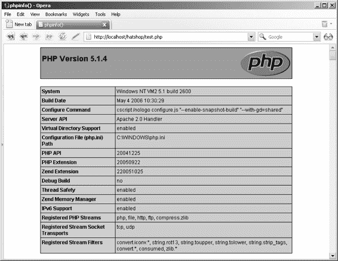

# PHP 社区及其替代方案

- PHP 社区非常活跃，许多有用的辅助库或现有库的新版本正在不断开发中（例如你可以在 `PEAR` 仓库或 [`www.phpclasses.org`](http://www.phpclasses.org) 找到的库），并且新功能也频繁添加。

- PHP 在各种 Web 服务器和操作系统（类 Unix 平台、Windows、Mac OS X）上表现非常出色。

然而，PHP 并非唯一用于创建动态网页的服务器端脚本语言。其最流行的竞争者包括 `JSP`（Java Server Pages）、`Perl`、`ColdFusion` 和 `ASP.NET`。这些技术之间存在许多差异，但也存在一些根本性的相似之处。例如，使用这些技术编写的页面都由基础 HTML（绘制页面的静态部分，即模板）和生成动态部分的代码组成。

> **注意：** 你或许想了解一下 *Beginning ASP.NET 2.0 E-Commerce in C# 2005*（Apress，2005），该书讲解了如何使用 `ASP.NET 2.0`、`C#` 和 `SQL Server 2005` 构建电子商务网站。

## 使用 Smarty 分离布局与代码

由于 PHP 简单且易于上手，人们往往容易在没有恰当设计对长远有益的架构和框架的情况下就直接开始编码。

更糟糕的是，构建 PHP 页面直截了当的方法就是将 PHP 指令与 HTML 混合在一起，因为 PHP 默认并没有提供一种明显的技术来将 PHP 代码与 HTML 布局信息分离。

将 PHP 逻辑与 HTML 混合有两个重要的缺点：

- 这种技术常常导致代码冗长、复杂且难以管理。你可能见过那些长度惊人的源文件，PHP 和 HTML 混乱地混合在一起，难以阅读，一周后就无法理解了。

- 这些混合文件是设计师和程序员共同工作的对象，这不必要地增加了协作的复杂性。这也增加了设计师在进行界面美化修改时无意中引入代码逻辑错误的几率。

这类问题促使了模板引擎的发展，它们提供了将表现逻辑与静态 HTML 布局分离的框架。`Smarty`（[`smarty.php.net`](http://smarty.php.net)）是 PHP 中最流行、最强大的模板引擎。其主要目的是为你提供一种简单的方法来分离应用逻辑（PHP 代码）和表现代码（HTML）。

这种分离使得程序员和模板设计师可以独立地在同一个应用程序上工作。程序员可以更改 PHP 逻辑而无需修改模板文件，设计师也可以更改模板而无需关心使其运行起来的代码是如何工作的。

图 2-4 展示了 Smarty 设计模板文件与其 Smarty 插件文件之间的关系。

### Smarty 组件化模板

**Smarty 设计模板**

（包含 HTML 和 Smarty 标签的 `.tpl` 文件）

- 在模板中使用的赋值变量：

  - （`$variable1`）

  - （`$variable2`）

  - ...

  - （`$variableN`）

**Smarty 插件文件**

（包含表现层逻辑的 `.php` 文件）

**图 2-4.** *Smarty 组件化模板*

Smarty 设计模板（一个包含 HTML 布局以及 Smarty 特定标签和代码的 `.tpl` 文件）及其 Smarty 插件文件（一个包含模板相关代码的 `.php` 文件）共同构成了一个 **Smarty 组件化模板**。你将在构建电子商务网站的过程中了解更多关于 Smarty 工作的原理。如需全面的 Smarty 教程，请阅读 *Smarty PHP Template Programming and Applications*（Packt，2006）。

> **注意：** 向 Web 应用的架构中添加 Smarty 或其他模板引擎会增加一些初始编码工作，并且也意味着有一个学习曲线。然而，你仍然应该尝试一下，因为使用这种现代开发技术所带来的优势在后续过程中会证明是非常显著的。

### 有哪些替代方案？

Smarty 并非 PHP 可用的唯一模板引擎。其他流行的模板引擎包括：

- `Yapter`（[`yapter.sourceforge.net/`](http://yapter.sourceforge.net/)）

- `EasyTemplate`（[`www.onlinetools.org/tools/easytemplate/index.php`](http://www.onlinetools.org/tools/easytemplate/index.php)）

- `phpLib`（[`phplib.sourceforge.net/`](http://phplib.sourceforge.net/)）

- `TemplatePower`（[`templatepower.codocad.com/`](http://templatepower.codocad.com/)）

尽管所有模板引擎都遵循相同的基本原则，但我们选择在本书的 PHP 电子商务项目中使用 Smarty，因为它具有良好的性能表现、强大的功能（如模板编译和缓存）以及在业界的广泛认可。

## 使用 PostgreSQL 存储网站数据

访问者在浏览网站时看到的大部分数据都将从关系型数据库中检索。关系型数据库管理系统（`RDBMS`）是一种复杂的软件程序，其目的是尽可能快速、可靠地存储、管理和检索数据。对于 HatShop 网站来说，它将存储所有关于产品、部门、用户、购物车等的数据。

有许多 `RDBMS` 可供你与 PHP 配合使用，包括 `PostgreSQL`、`MySQL`、`Oracle` 等。PostgreSQL 可以说是世界上最先进的开源数据库，它是一个免费、快速且可靠的数据库。另一个重要的优势是，许多网站托管提供商都提供对 PostgreSQL 数据库的访问，这让你刚创建好的电子商务网站上线时更加轻松。在开发 HatShop 电子商务网站时，我们将使用 PostgreSQL 作为后端数据库。

用于与关系型数据库通信的语言是 SQL（结构化查询语言）。然而，每个数据库引擎都识别该语言的特定方言。如果你决定使用不同于 PostgreSQL 的 `RDBMS`，你可能需要更新某些 SQL 查询。

### 与 PostgreSQL 交互

你通过编写一个 SQL 查询，将其发送给数据库引擎，并检索结果，来与数据库服务器对话。SQL 查询可以涉及网站数据或其数据结构的任何内容，例如“给我部门列表”、“删除产品编号 223”、“创建一个数据表”或“在目录中搜索黄色帽子”。

无论 SQL 查询内容是什么，我们都需要一种方式将其发送给 PostgreSQL。PostgreSQL 附带了一个简单的、基于文本的界面（名为 `"psql"`），它允许执行 SQL 查询并获取结果。命令行界面使用起来不是特别方便，但功能齐全。不过，也有其他替代方案。

一些免费的第三方数据库管理工具允许你通过易于使用的图形界面来操作数据结构和执行 SQL 查询。在本书中，我们将向你展示如何使用 `pgAdmin III`，这是随 PostgreSQL 一起提供的管理工具。

除了需要通过直接界面与 PostgreSQL 引擎交互外，你还需要学习如何通过 PHP 代码以编程方式访问 PostgreSQL。这个需求是显而易见的，因为电子商务网站在为访问者构建页面时，需要查询数据库来检索目录信息（部门、类别、产品等）。

至于通过 PHP 代码查询 PostgreSQL 数据库，你将要使用的工具是 `PDO`（PHP 数据对象）。

### 使用 PDO 实现数据库集成

**`PDO`（PHP 数据对象）** 是一个原生的数据访问抽象库，随 PHP 5.1 一起提供

PDO 作为 PHP 5.0 的 PECL 扩展提供。（PECL 是一个 PHP 扩展仓库，位于 `http://pecl.php.net/`。）官方 PDO 手册及其安装说明（也可在附录 A 中找到）位于 `http://php.net/pdo`。

PDO 提供了一种统一的方式来访问各种数据源。使用 PDO 可以提高应用程序的可移植性和灵活性，因为如果后端数据库发生变化，对数据访问代码的影响可以降到最低（在许多情况下，只需更改新数据库的连接字符串）。

熟悉 PDO 数据访问抽象层后，你可以在其他可能需要不同数据库解决方案的项目中使用相同的编程技术。

为了演示使用旧版 PHP 函数和 PDO 访问数据库之间的区别，让我们快速浏览两个简短的 PHP 代码片段。

**注意** 如果你不熟悉这些代码的工作原理，不必担心——我们将在后续章节中更详细地分析所有内容。

以下示例展示了使用 PHP 原生（特定于 PostgreSQL）函数进行数据库访问：

```php
// 连接到 PostgreSQL

$link = pg_connect('host=localhost dbname=hatshop' .

'user=' . $username . ' password=' . $password)

or die('无法连接：' . pg_last_error($link));

// 执行 SQL 查询

$queryString = 'SELECT * FROM product';

$result = pg_query($link, $queryString)

or die('查询失败：' . pg_last_error($link));

// 关闭连接

pg_close($link);
```

接下来，展示相同的操作，但这次使用 PDO：

```php
try

{

// 创建新的 PDO 实例

$database_handler =

new PDO('pgsql:host=localhost;dbname=hatshop',

$username, $password);

// 准备 SQL 查询

$statement_handler =

$database_handler->prepare('SELECT * FROM product');

// 执行 SQL 查询

$statement_handler->execute();

// 获取结果

$result = $statement_handler->fetchAll();

// 清除 PDO 对象实例

$database_handler = null;

}

catch (PDOException $e)

{

/* 如果出现问题，我们捕获对象抛出的异常，打印消息并停止脚本执行 */

print '错误！ <br />' . $e->getMessage() . '<br />'; exit;

}
```

使用 PDO 的代码版本更长，但它包含强大的错误处理机制和*预处理语句*（可保护你免受注入攻击）。如果这些概念听起来很陌生，请再次等待后续章节，届时我们将让 PDO 投入使用，你将在那里了解更多相关信息。

另外，使用 PDO 时，例如，如果你决定使用 MySQL 而非 PostgreSQL，则无需更改数据访问代码。另一方面，第一个使用特定于 PostgreSQL 函数的代码片段则需要完全更改（使用 `mysql_connect` 和 `mysql_query` 替代 `pg_connect` 和 `pg_query`，依此类推）。此外，一些特定于 MySQL 的函数具有不同于类似 PostgreSQL 函数的参数。

使用数据库抽象层（如 PDO）时，在更改数据库后端时，你可能只需更改连接字符串。请注意，这里我们仅讨论与数据库交互的 PHP 代码。在实践中，如果数据库引擎支持不同的 SQL 方言，你可能还需要更新一些 SQL 查询。

**注意** 为了使 SQL 查询尽可能可移植，请使其语法尽可能接近 SQL-92 标准。你将在第 3 章了解更多关于 SQL 的细节。

## PostgreSQL 与三层架构

至此，很明显 PostgreSQL 与数据层有关。但是，如果你之前没有使用过数据库，可能不太清楚 PostgreSQL 不仅仅是一个简单的数据存储。除了内部存储的实际数据外，PostgreSQL 还能够以存储过程的形式存储逻辑、维护表关系、确保遵守各种数据完整性规则等。

你可以通过 SQL（结构化查询语言）与 PostgreSQL 通信，这是一种用于与数据库交互的语言。SQL 用于向数据库传输指令，例如“发送给我最后 10 个订单”或“删除产品 #123”。

尽管可以在 PHP 代码中编写 SQL 语句然后提交执行，但这通常是一种*不良实践*，因为它会带来安全性、一致性和性能方面的损失。在我们的解决方案中，我们将使用**数据库函数**存储所有数据层逻辑。

本书中的代码设计为与 PostgreSQL 8.1（撰写本文时最新的稳定版本）兼容。PostgreSQL 由电子商务软件项目中的数据存储组成，如图 2-5 所示。

**图 2-5.** *你将用于开发 HatShop 的技术*

## 选择命名和编码标准

尽管编码和命名标准起初可能看起来不那么重要，但绝对不应被忽视。不遵循代码规则集几乎总是会导致代码难以阅读、理解和维护。另一方面，当你遵循一致的编码方式时，几乎可以说你的代码已经完成了一半的文档工作，这对项目的可维护性是一项重要贡献，尤其是在多人同时参与同一项目时。

**提示** 一些公司有自己的编码和命名标准政策，而在其他情况下，你可以灵活地使用自己的偏好。无论哪种情况，黄金法则是保持编码方式的一致性。注释你的代码是提高代码长期可维护性的另一个好习惯。

命名约定涉及项目中的许多元素，这仅仅是因为项目中几乎所有的元素都有名称：项目本身、文件、类、变量、方法、方法参数、数据库表、数据库列等等。在命名所有这些元素时如果没有一些纪律，一周的编码之后你将完全看不懂自己写过的东西。

在开发 HatShop 时，我们遵循了一套在 PHP 开发者中流行的命名约定。以下代码中总结了一些最重要的规则：

```php
class WarZone

{

public $mSomeSoldier;

private $_mSomeOtherSoldier;

function SearchAndDestroy($someEnemy, $someOtherEnemy)

{

$master_of_war = 'Soldier';

$this->mSomeSoldier = $someEnemy;

$this->_mSomeOtherSoldier = $someOtherEnemy;

}

}
```

- 类名和方法名应使用帕斯卡命名法（每个单词首字母大写），例如 `WarZone` 或 `IsDataValid`。

- 公有类属性名称遵循与类名相同的规则，但应前缀字符 `m`。因此，有效的公有属性名称如下所示：`$mSomeSoldier`。

- 私有类属性名称遵循与公有类属性名称相同的规则，但额外加以下划线前缀，例如 `$_mSomeOtherSoldier`。

-   方法参数名应使用驼峰命名法（首字母小写，后续每个单词首字母大写），例如 `$someEnemy`、`$someOtherEnemy`。

-   变量名应使用小写字母，并用下划线分隔单词，例如 `$master_of_war`。

-   数据库对象采用与变量名相同的命名惯例（如 `department_id` 列）。

-   尝试使用固定数量的空格（比如四个）缩进每一级代码。

（由于物理空间限制，本书的代码使用两个空格缩进。）需要做出的决策之一是对字符串是否使用引号。JavaScript、HTML 和 PHP 都允许使用单引号和双引号。对于本书的代码，我们将在 HTML 和 JavaScript 代码中使用双引号，在 PHP 中使用单引号。

虽然对于 JavaScript 来说，这纯粹是个人喜好问题（只要保持一致，你可以使用单引号），但在 PHP 中，单引号的处理速度更快、更安全，并且更不容易引发编程错误。更多关于 PHP 字符串的信息，请访问 `http://php.net/types.string`。在 `http://www.sitepoint.com/print/quick-php-tips` 和 `http://www.jeroenmulder.com/weblog/2005/04/php_single_and_double_quotes.php` 可以找到两篇关于 PHP 字符串的有用文章。

## 启动 HatShop 项目

到目前为止，我们一直在讨论与即将创建的应用程序相关的理论。这很有趣，但将所学知识付诸实践会更加有趣。

启动引擎！

## 安装所需软件

本书中的代码已在以下环境中测试通过：

-   PHP 5.1

-   Apache 2.2

-   PostgreSQL 8.1

**注意** 代码很可能与上述软件的更新版本兼容，但无法与早于 PHP 5 的 PHP 版本一起使用。

只要项目兼容 PHP 5.1（参见 `http://www.php.net/manual/en/installation.php`），它也应该适用于其他 Web 服务器。然而，Apache 是绝大多数 PHP 项目首选的 Web 服务器。

有关 PHP、Apache 和 PostgreSQL 的详细安装说明，请参见附录 A。

[www.it-ebooks.info](http://www.it-ebooks.info/)

## 获取代码编辑器

如果你还没有心仪的代码编辑器，在编写第一行代码之前，你需要安装一个。有许多免费的编辑器可用，商业编辑器的清单甚至更长。这取决于个人喜好和预算。你可以在 `http://www.php-editors.com` 找到一份 PHP 编辑器列表。以下是一些比较受欢迎的编辑器：

-   Zend Studio (`http://www.zend.com/products/zend_studio`) 可能是用于开发 PHP Web 应用程序最强大的 IDE（集成开发环境）。

-   `phpEclipse` (`http://www.phpeclipse.net`) 是一个日益流行的 PHP Web 应用开发环境。Zend 是 Eclipse 基金会的成员。

-   `Emacs` (`http://www.gnu.org/software/emacs/`)，正如其官网所定义，是一个“可扩展、可定制、自我记录、实时显示的编辑器”。`Emacs` 是一款非常强大、免费且跨平台的编辑器。

-   `SciTe` (`http://scintilla.sourceforge.net/SciTEDownload.html`) 是一款免费且跨平台的编辑器。

-   `PSPad` (`http://www.pspad.com/`) 是一款在 Windows 开发者中很流行的免费编辑器。该编辑器能够为许多现有文件格式进行语法高亮显示。附加插件可以集成 CSS 编辑功能和拼写检查功能。

-   `PHP Designer 2006` (`http://www.mpsoftware.dk`) 是一款 Windows 编辑器，包含一个集成的调试器。

## 准备 `hatshop` 虚拟文件夹

使用开源、跨平台技术的一个优势是你可以选择用于开发的操作系统。你应该能够在 Windows、Unix、Linux、Mac 以及其他系统上开发和运行 HatShop。然而，这也意味着你可能需要费些心思来搭建初始环境，特别是如果你是个新手的话。

在搭建项目虚拟文件夹时，一些细节因操作系统而异（主要是因为文件路径不同），因此我们将在接下来的页面中分别为 Windows 和 Unix 系统进行说明。不过，主要步骤是相同的：

1.  在文件系统中创建一个名为 `hatshop`（我们使用小写字母命名文件夹）的文件夹，该文件夹将存放 HatShop 项目的文件（例如 PHP 代码、图片文件等）。

2.  编辑 Apache 的配置文件（`httpd.conf`），创建一个名为 `hatshop` 的虚拟文件夹，指向之前创建的物理文件夹 `hatshop`。这样，当在 Web 浏览器中访问 `http://localhost/hatshop` 时，将加载物理文件夹 `hatshop` 中的项目。此功能在 Apache 中通过别名实现，别名通过 `httpd.conf` 配置文件进行配置。别名条目的语法如下：

```
Alias 虚拟文件夹名 真实文件夹名
```

**提示** `httpd.conf` 配置文件文档齐全，但你也可以查阅 Apache 2 文档，地址是 `http://httpd.apache.org/docs-2.0/`。

如果你在 Windows 系统上工作，请按照下面的练习步骤操作。Unix 系统的步骤将在本练习之后介绍。

### 练习：在 Windows 上准备 `hatshop` 虚拟文件夹

1.  创建一个名为 `hatshop` 的新文件夹，用于存放你在本书中完成的所有工作。你可能会发现将其创建在根目录（`C:\`）下最方便，但由于我们将在项目中使用相对路径，你也可以自由选择任何位置。

2.  Apache 用来处理客户端请求的默认位置通常是 `C:\Program Files\Apache Software Foundation\ApacheX.Y\htdocs`。该位置由 Apache 配置文件中的 `DocumentRoot` 指令定义，该文件位于 `APACHE_BASE/conf/httpd.conf`（其中 `APACHE_BASE` 是 Apache 的安装文件夹）。

    因为我们想要使用自己的文件夹而不是 `DocumentRoot` 提到的默认文件夹，所以需要创建一个名为 `hatshop` 的虚拟文件夹，指向你在步骤 1 中创建的物理文件夹 `hatshop`。

    打开 Apache 配置文件（`httpd.conf`），并添加以下几行：

```apacheconf
<IfModule alias_module>
# ...
Alias /hatshop/ "C:/hatshop/"
Alias /hatshop "C:/hatshop"
</IfModule>

<Directory "C:/hatshop">
Allow from all
</Directory>
```

添加这些行并重启 Apache 网络服务器后，对 `http://localhost/hatshop` 或 `http://localhost/hatshop/` 的请求将执行 `hatshop` 文件夹（如果存在）中的应用程序。

3.  在 `hatshop` 文件夹中创建一个名为 `test.php` 的文件，内容如下：

```php
<?php phpinfo(); ?>
```

4.  重启 Apache 网络服务器，然后在网页浏览器中加载 `http://localhost/hatshop/test.php`（如果 Apache 在 8080 端口运行，则加载 `http://localhost:8080/hatshop/test.php`）。

[www.it-ebooks.info](http://www.it-ebooks.info/)

第 2 章 ■ 奠定基础

### 练习：在 Unix 系统上准备 `hatshop` 虚拟文件夹

1.  创建一个名为 `hatshop` 的新文件夹，它将用于本书中的所有工作。你可能会发现将其创建在用户主目录中最简单（此时 `hatshop` 文件夹的完整路径类似于 `/home/username/hatshop`），但由于我们在项目中使用相对路径，也可以随意将其创建在任何位置。

2.  Apache 用于服务客户端请求的默认位置通常是类似 `/usr/local/apache2/htdocs/` 的路径。此位置由 Apache 配置文件中的 `DocumentRoot` 指令定义，该配置文件的完整路径通常是 `/usr/local/apache/conf/httpd.conf`。因为我们想使用自己的文件夹而不是 `DocumentRoot` 所指的默认文件夹，需要创建一个名为 `hatshop` 的虚拟文件夹，指向你在步骤 1 中创建的物理文件夹 `hatshop`。打开 Apache 配置文件（`httpd.conf`），找到 `Aliases` 部分，并添加以下行：

```apacheconf
<IfModule alias_module>
# ...
Alias /hatshop/ "/home/username/hatshop/"
Alias /hatshop "/home/username/hatshop"
</IfModule>

<Directory "/home/username/hatshop">
Allow from all
</Directory>
```

添加这些行后，对 `http://localhost/hatshop` 或 `http://localhost/hatshop/` 的请求将执行 `hatshop` 文件夹（如果存在）中的应用程序。

3.  在 `hatshop` 文件夹中创建一个名为 `test.php` 的文件，内容如下：

```php
<?php phpinfo(); ?>
```

4.  重启 Apache 网络服务器，然后在网页浏览器中加载 `http://localhost/hatshop/test.php`（如果 Apache 在 8080 端口运行，则加载 `http://localhost:8080/hatshop/test.php`）。

### 工作原理：虚拟文件夹

构建 HatShop 电子商务网站的第一步虽然很小，但很重要，因为它可以让你测试 Apache、PHP 和 `hatshop` 别名是否正常工作。如果运行测试页面时遇到问题，请确保你已正确遵循附录 A 中的安装步骤。

无论你使用的是 Windows 还是类 Unix 系统，在网页浏览器中加载 `test.php` 都应该会显示由 `phpinfo` 函数返回的 PHP 信息，如图 2-6 所示。

[www.it-ebooks.info](http://www.it-ebooks.info/)



**图 2-6.** *测试 PHP 和* `hatshop` *虚拟文件夹*

你还确保了 `hatshop` 目录及其所有内容可以被网络服务器正常访问。

### 安装 Smarty

安装 Smarty 只需将 Smarty PHP 类复制到你的项目文件夹中。许多网络托管公司会为你提供这些类，但出于两个原因，最好自己进行安装：

-   尽可能让你的项目独立于服务器设置，这总是更好的选择。

-   即使托管系统安装了 Smarty，该公司的版本也可能随时间发生变化，也许在没有通知的情况下，这可能会影响你网站的功能。

[www.it-ebooks.info](http://www.it-ebooks.info/)

在以下练习中，你将把 Smarty 安装到 `hatshop` 文件夹的一个名为 `libs` 的子文件夹中。无论你使用什么操作系统，这些步骤都应同样有效。

**练习：安装 Smarty**

**1.** 在`hatshop`文件夹内创建一个名为`libs`的文件夹，然后在`libs`文件夹内创建一个名为`smarty`的文件夹。

**2.** 从`http://smarty.php.net/download.php`下载最新版本的 Smarty，并下载最新的稳定版本。该压缩包是一个`.tar.gz`文件。要在 Windows 下解压，你需要一个诸如 WinZip (`http://www.winzip.com`) 或 WinRar (`http://www.rarlabs.com`) 的程序。解压该压缩包，并将压缩包中`Smarty-2.X.Y/libs`目录的内容复制到你之前创建的文件夹（`hatshop/libs/smarty`）中。你只需复制所提到的`libs`文件夹的内容，无需其他。

**3.** 为了正常运行，Smarty 需要三个你需要创建的文件夹：`templates`、`templates_c`和`configs`。在`hatshop`目录内创建一个名为`presentation`的文件夹，并在该文件夹中创建两个名为`templates`和`templates_c`的文件夹。`presentation`文件夹将包含所有展示文件。

**4.** 在`hatshop`文件夹内创建一个名为`include`的文件夹。它将包含应用程序的所有配置文件。在此文件夹内创建一个名为`configs`的文件夹。

**5.** 如果你使用的是 Unix 操作系统，你还需要设置一些安全选项。你需要确保 Apache 对`templates_c`目录有写权限，Smarty 引擎需要在该目录保存其编译后的模板文件（稍后你将了解更多相关信息）。如果你在 Unix 系统下构建项目，应执行以下命令，以确保你的 Apache 服务器能够访问你的项目文件，并对`templates_c`目录拥有写权限：

执行`chmod a+w /home/username/hatshop/presentation/templates_c`。

**注意** 在 Unix 系统上按此处所示设置权限，允许任何拥有你 Unix 机器 shell 帐户的用户查看文件夹中任何文件的源代码，包括 PHP 代码和其他数据（其中可能包含敏感信息，例如数据库密码、用于加密/解密信用卡信息的密钥等）。要微调安全设置，请咨询系统管理员。

**工作原理：Smarty 安装**

在此练习中，你创建了 Smarty 使用的这三个文件夹：

- `templates`文件夹将包含网站 (`*.tpl`文件) 的 Smarty 模板。
- `templates_c`文件夹将包含编译后的 Smarty 模板；这些文件由 Smarty 引擎自动生成。
- `configs`文件夹将包含模板可能需要的配置文件。

[www.it-ebooks.info](http://www.it-ebooks.info/)

648XCH02.qxd 11/8/06 9:33 AM Page 34

**34**

第 2 章 ■ 奠定基础

添加这些文件夹后，你的文件夹结构应如下所示：

```
hatshop/
  include/
    configs/
    libs/
    smarty/
      internals/
      plugins/
  presentation/
    templates/
    templates_c/
```

**实现网站骨架**

网站的视觉设计通常在与客户讨论后确定，并与专业的网页设计师合作完成。或者，你也可以从许多以合理价格提供此类服务的公司购买网站模板。

这是一本编程书，所以我们不会关注网页设计问题。我们将实现一个简单、友好且可用的设计，它允许轻松定制（如果你需要在我们正在创建的设计之上应用你的布局），并且能让你专注于网站的技术细节。

HatShop 中的所有页面，包括首页，都将具有如图 2-7 所示的结构。

虽然产品目录的详细结构将在下一章介绍，但目前我们知道需要在网站的每个页面上显示一个主要部门列表。

当访问者点击某个部门时，该部门的类别列表将出现在部门列表下方。该网站还有一个搜索框，允许访问者执行产品搜索。在页面顶部，网站页眉将出现在访问者浏览的任何页面上。

[www.it-ebooks.info](http://www.it-ebooks.info/)

648XCH02.qxd 11/8/06 9:33 AM Page 35

第 2 章 ■ 奠定基础

**35**

```
部门列表
此处为网站页眉

类别列表
（针对所选部门）

此处为网站内容
搜索框
```

此单元格应根据访问者浏览的网站页面不同而包含不同的内容。

**图 2-7.** HatShop 网页结构

为了尽可能简单地实现此结构，我们将使用 Smarty 组件化模板（或简单的 Smarty 设计模板）来创建页面中如图 2-8 所示的各个部分。

如图 2-8 所示，你将创建一个名为`departments_list`的 Smarty 组件化模板和一个名为`header.tpl`的简单 Smarty 设计模板文件，这将有助于你填充首页。

使用 Smarty 模板来实现不同的功能片段，提供了本章前面讨论过的优点。将不同、不相关的功能片段在逻辑上彼此分离，使你能灵活地独立修改它们，甚至在其他页面中重用它们，而无需再次编写它们的代码。同时，更改父网页中作为 Smarty 模板实现的功能的位置也变得极其容易。

[www.it-ebooks.info](http://www.it-ebooks.info/)

648XCH02.qxd 11/8/06 9:33 AM Page 36

**36**

第 2 章 ■ 奠定基础

```
header
（Smarty 设计模板）

departments_list
（Smarty 组件化模板）

部门列表
此处为网站页眉

categories_list
（Smarty 组件化模板）

类别列表
（针对所选部门）
```