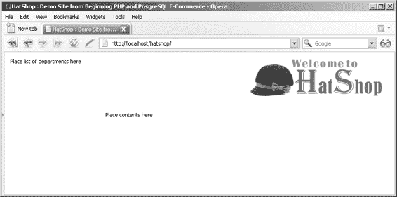

# 搜索框

此单元格应根据访问者浏览的站点页面显示不同的内容。

**图 2-8.** *使用 Smarty 生成内容*

■ **注意** 我们将 **Smarty 组件化模板** 定义为 **Smarty 设计模板**（`.tpl` 文件）及其关联的 **Smarty 插件文件**（包含表示层逻辑的 `.php` 文件）的组合。对于不需要关联 `.php` 代码文件的简单页面（例如页眉），我们仅使用 Smarty 设计模板文件。你将在第 3 章中了解 Smarty 插件，更多信息请访问 http://smarty.php.net/manual/en/plugins.php。

部门列表、搜索框和站点页眉是站点每个页面都会出现的元素。类别列表仅在访问者从列表中选择部门时才会显示。网站中最动态的部分是内容单元格，它会随着访问者在站点中的浏览而改变，并根据访问者请求的站点位置自我更新。实现该单元格有两种主要方式：使用根据位置自行更改的组件化模板，或根据正在浏览的位置使用不同的组件化模板来填充该单元格。没有固定法则来决定使用哪种方法，因为这主要取决于项目的具体需求。对于 HatShop，你将创建多个组件化模板来填充该位置。

[www.it-ebooks.info](http://www.it-ebooks.info/)

648XCH02.qxd 11/8/06 9:33 AM Page 37

第 2 章 ■ 布局基础

**37**

在本章剩余部分，你将：

- 创建主网页和页眉模板。
- 在 HatShop 中实现错误处理系统的基础。
- 创建 HatShop 数据库。

## 构建第一个页面

HatShop 的主页面将由文件 `index.php` 和 `index.tpl` 生成。

你将编写 `index.tpl` Smarty 模板，并为站点的三个主要部分（页眉、部门列表表格和页面内容单元格）设置占位符。在以下练习中实现主页面，我们将在随后的“工作原理”部分讨论细节。

### 练习：实现第一个页面及其页眉

1. 在 `hatshop` 文件夹内创建一个名为 `images` 的新文件夹。

2. 将随书源代码/下载文件（你可以在图书详情页面 http://www.apress.com 或 http://www.cristiandarie.ro 找到）中的 `images_folder/images` 文件夹内容复制到你刚刚创建的 `hatshop/images` 文件夹。

3. 在 `hatshop/include/configs` 文件夹（由 Smarty 模板引擎使用）中创建一个名为 `site.conf` 的文件，并添加以下行：

   ```
   site_title = "HatShop : Demo Site for Beginning PHP and PosgreSQL E-Commerce"
   ```

4. 在 `hatshop/presentation/templates` 中创建一个名为 `index.tpl` 的文件，并添加以下代码：

   ```
   {* smarty *}
   {config_load file="site.conf"}
   <!DOCTYPE html PUBLIC "-//W3C//DTD XHTML 1.1//EN"
   "http://www.w3.org/TR/xhtml11/DTD/xhtml11.dtd">
   <html>
   <head>
   <title>{#site_title#}</title>
   <link href="hatshop.css" type="text/css" rel="stylesheet" />
   </head>
   <body>
   <div>
   <div class="left_box">
   Place list of departments here
   </div>
   {include file="header.tpl"}
   <div id="content">
   Place contents here
   [www.it-ebooks.info](http://www.it-ebooks.info/)
   648XCH02.qxd 11/8/06 9:33 AM Page 38
   **38**
   第 2 章 ■ 布局基础
   </div>
   </div>
   </body>
   </html>
   ```

5. 在 `hatshop/presentation/templates` 中创建一个名为 `header.tpl` 的模板文件，并添加以下内容：

   ```
   <div id="header">
   <a href="index.php">
   
   </a>
   </div>
   ```

6. 在项目根目录（`hatshop`）创建一个名为 `hatshop.css` 的文件，并编写以下代码：

   ```
   body
   {
   font-family: tahoma, verdana, arial;
   font-size: 11px;
   margin: 0px;
   padding: 5px;
   text-align: center;
   }
   body div
   {
   margin: 0px;
   padding: 5px;
   text-align: left;
   }
   ```


```css
.left_box {
  margin: 0px 15px 15px 0px;
  padding: 2px;
  width: 170px;
}

img {
  border: 0;
}

#header {
  left: 194px;
  margin: 0px;
  padding: 0px;
  position: absolute;
  text-align: right;
  top: 10px;
  width: 570px;
}

#content {
  left: 194px;
  margin: 0px;
  padding: 0px 0px 10px 10px;
  position: absolute;
  top: 110px;
  width: 558px;
}
```

**7.** 在 `hatshop/include` 文件夹中添加一个名为 `config.php` 的文件，内容如下：

```php
<?php
// SITE_ROOT 包含 hatshop 文件夹的完整路径
define('SITE_ROOT', dirname(dirname(__FILE__)));

// 应用目录
define('PRESENTATION_DIR', SITE_ROOT . '/presentation/');
define('BUSINESS_DIR', SITE_ROOT . '/business/');

// 配置 Smarty 模板引擎所需的设置
define('SMARTY_DIR', SITE_ROOT . '/libs/smarty/');
define('TEMPLATE_DIR', PRESENTATION_DIR . '/templates');
define('COMPILE_DIR', PRESENTATION_DIR . '/templates_c');
define('CONFIG_DIR', SITE_ROOT . '/include/configs');
?>
```

在继续之前，我们先来看看这里发生了什么。`dirname(__FILE__)` 返回当前文件的父目录；自然地，`dirname(dirname(__FILE__))` 返回当前文件所在目录的父目录。这样，我们的 `SITE_ROOT` 常量将被设置为 `hatshop` 的完整路径。借助 `SITE_ROOT` 常量，我们设置了 Smarty 文件夹的绝对路径。

**8.** 在 `hatshop/include` 文件夹中创建一个名为 `app_top.php` 的文件，并向其中添加以下内容：

```php
<?php
// 包含工具文件
require_once 'include/config.php';

// 加载页面模板
require_once PRESENTATION_DIR . 'page.php';
?>
```

该文件（`app_top.php`）将被包含在主网页的顶部，以执行必要的初始化操作。

**9.** 在 `hatshop/presentation` 文件夹中创建一个名为 `page.php` 的文件，并向其中添加以下内容：

```php
<?php
// 引用 Smarty 库
require_once SMARTY_DIR . 'Smarty.class.php';

/* 扩展 Smarty 的类，用于处理和显示 Smarty 文件 */
class Page extends Smarty
{
    // 类构造函数
    public function __construct()
    {
        // 调用 Smarty 的构造函数
        parent::Smarty();

        // 更改默认模板目录
        $this->template_dir = TEMPLATE_DIR;
        $this->compile_dir = COMPILE_DIR;
        $this->config_dir = CONFIG_DIR;
    }
}
?>
```

在 `page.php` 中，你通过一个名为 `Page` 的包装类扩展了 `Smarty` 类，该类更改了 Smarty 的默认行为。`Page` 类在其构造函数中配置了你之前创建的 Smarty 文件夹。

> **提示：** 如前所述，Smarty 需要三个文件夹才能运行：`templates`、`templates_c` 和 `configs`。在 `Page` 类的构造函数中，我们为应用程序设置了独立的一套目录。如果你想开启缓存，那么 Smarty 还需要一个名为 `cache` 的目录。我们不会为 HatShop 使用 Smarty 缓存，但你可以在 http://smarty.php.net/manual/en/caching.php 的 Smarty 手册中了解更多详细信息。

**10.** 将 `index.php` 文件添加到 `hatshop` 文件夹中。该文件的作用是通过使用你之前创建的 `Page` 类来加载 `index.tpl` 模板。以下是 `index.php` 的代码：

```php
<?php
// 加载 Smarty 库和配置文件
require_once 'include/app_top.php';

// 加载 Smarty 模板文件
$page = new Page();

// 显示页面
$page->display('index.tpl');
?>
```

**11.** 现在是时候看看这个成果的输出效果了。在你喜爱的浏览器中加载 `http://localhost/hatshop/`，并欣赏如图 2-9 所示的结果。



**图 2-9.** *运行 HatShop*

### 工作原理：HatShop 的第一页


