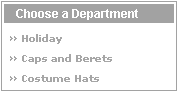

# 第 3 章 ■ 创建产品目录：第一部分

在部门列表下，你现在可以看到属于所选部门的类别列表。在屏幕右侧，你可以看到所选部门的名称、描述及其特色产品。我们决定只在部门页面列出特色产品，部分原因是完整列表会太长。特色产品列表上方的文字是所选部门的描述，这意味着你需要在数据库中为每个部门同时存储名称和描述。

在此页面中，当从类别列表中选择特定类别时，会列出其所有产品，同时更新标题和描述文本。

在任何产品列表中点击产品图片，将进入产品详情页面，如图 3-3 所示。

**图 3-3.** *访问万圣节帽子类别*  
当选择一个类别时，其所有产品都会被列出——你不再看到特色产品。注意描述文本也会发生变化。这次显示的是所选类别的描述。

## 本章路线图

如你所见，产品目录虽然不算复杂，但需要涵盖的部分较多。在本章中，你只需创建部门列表（参见图 3-4）。

[www.it-ebooks.info](http://www.it-ebooks.info/)

648XCH03.qxd 11/8/06 9:44 AM Page 61

第 3 章 ■ 创建产品目录：第一部分 **61**

**图 3-4.** *部门列表*

部门列表将是网站中第一个动态生成的数据（部门名称将从数据库中提取）。

本章中，你将仅实现网站的部门列表部分。在理解部门列表背后的运作机制后，你将在第 4 章快速实现产品目录的其他组件。

在第 2 章中，我们讨论了实现 Web 应用时将使用的三层架构。站点的产品目录部分也不例外，其组件（包括部门列表）将分布在三个逻辑层中。

图 3-5 预览了为实现功能完整的部门列表，你将在每层创建的内容。

## Web 服务器
### 表示层
- `Smarty` 组件化模板：
  - `departments_list.tpl`（Smarty 设计模板）
  - `function.load_departments_list.php`（Smarty 函数插件及`DepartmentsList`辅助类）

### 业务层
- PHP 代码：
  - `catalog.php`（包含`Catalog`类及其`GetDepartments`方法）
  - `database_handler.php`（包含`DatabaseHandler`类）
  - `error_handler.php`（包含`ErrorHandler`类）

## PostgreSQL 服务器
### 数据层
- PostgreSQL 函数：`catalog_get_departments_list()`
- 数据：`Department`（PostgreSQL 数据表）
- 数据存储

**图 3-5.** *部门列表的组件*

到目前为止，你仅在第二章中简单接触了表示层和业务层。现在，在构建目录时，你终于将接触到最后一层，并进一步使用`hatshop`数据库。（取决于询问对象，数据存储可能被视为也可能不被视为三层架构的组成部分。）

[www.it-ebooks.info](http://www.it-ebooks.info/)

648XCH03.qxd 11/8/06 9:44 AM Page 62

**62** 第 3 章 ■ 创建产品目录：第一部分

以下是实现动态生成部门列表的主要步骤。请注意，你将先从数据库开始，逐步推进到表示层：

1.  在数据库中创建`department`表。该表将存储商店部门的相关数据。在添加此表之前，你将学习关系数据库的基本概念。

2.  编写一个名为`catalog_get_departments_list`的 PostgreSQL 函数，该函数从`department`表中返回部门的 ID 和名称。PHP 脚本将调用此函数为访客生成部门列表。PostgreSQL 函数在逻辑上位于应用程序的数据层。在此步骤中，你将学习如何使用 SQL 与关系数据库通信。

3.  创建`DatabaseHandler`类，它将作为执行常见数据库交互操作的辅助类。`DatabaseHandler`是一些 PDO 函数的包装类，并包含处理数据库相关错误的一致错误处理技术。

4.  创建部门列表的业务层组件（`Catalog`类及其`GetDepartments`方法）。你将了解如何通过`DatabaseHandler`辅助类与数据库通信以检索必要数据。

5.  实现`departments_list` Smarty 模板及其 Smarty 插件函数，它们基于底层为访客生成美观的部门列表。Smarty 插件函数文件还将包含一个名为`DepartmentsList`的辅助类。

那么，让我们从创建`department`表开始吧。

## 存储目录信息

绝大多数 Web 应用程序（电子商务网站也不例外）都围绕其管理的数据运行。分析和理解你需要存储和处理的数据，是成功完成项目的关键步骤。

此类应用程序的典型数据存储方案是关系数据库。但这并非强制要求——你可以自由创建自己的数据访问层，并采用任何所需的数据结构来支持应用程序。

> **注：** 在某些特定情况下，将数据存储在纯文本文件或 XML 文件中可能比数据库更可取，但这些解决方案通常不适用于 HatShop 这类应用程序，因此本书将不涉及它们。不过，了解这些选项总是有益的。

虽然本书并非关于数据库或关系数据库设计的专著，但你将学到理解产品目录并使其运行所需的全部知识。

[www.it-ebooks.info](http://www.it-ebooks.info/)

648XCH03.qxd 11/8/06 9:44 AM Page 63

第 3 章 ■ 创建产品目录：第一部分 **63**

本质上，关系数据库由**数据表**及表之间的**关系**组成。由于本章只涉及单个数据表，我们将仅讨论适用于作为独立数据库项的表的数据库理论。在下一章，当你添加其他表时，我们将通过分析表之间的关系以及 PostgreSQL 如何处理这些关系，更深入地探讨关系数据库背后的理论。

> **注：** 在实际开发中，你可能会从一开始就设计整个数据库（或至少与所构建功能相关的所有表）。在本书中，我们选择将开发分两章进行，以保持理论与实践的更好平衡。

那么，让我们从一些理论开始，之后你将创建`department`数据表及其他必要组件：

### 理解数据表

本节提供快速的数据库课程，涵盖设计简单数据表所需的基本信息。我们将简要讨论构成数据库表的主要部分：

-   主键
-   PostgreSQL 数据类型
-   `UNIQUE`列
-   `NOT NULL`列和默认值
-   序列列和序列
-   索引

> **注：** 如果你对 PostgreSQL 已有足够经验，可以跳过本节，直接进入“创建`department`表”部分。

数据表由列和行组成。列也称为**字段**，行有时也称为**记录**。

