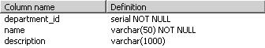

# 创建产品目录：第一部分

由于本章仅涉及部门列表，你只需要创建一个数据表：部门表。该表将存储部门数据，也是你将用到的最简单的表之一。

借助 `pgAdmin III` 等工具，只要*确切*知道数据库将存储何种数据，就能轻松在其中创建数据表。设计表时，必须考虑应包含哪些字段，以及这些字段应使用哪些数据类型。除了字段的数据类型，还有一些其他属性需要考虑，你将在后续页面中了解这些属性。

要确定部门表需要哪些字段，请先写下该表中应存储的几个记录示例。回顾之前的图示可知，关于部门需要存储的信息并不多——只有每个部门的名称和描述。包含部门数据的表可能如图 3-6 所示（在讨论理论后，你将稍后在数据库中实现该表）。

**图 3-6.** *来自* `department` *表的数据*

根据这样的表，可以提取名称来填充网页左上角的列表，而描述则可用作特色产品列表的标题。

## 主键

在关系数据库中操作数据表的方式，与通常在纸面上操作略有不同。关系数据库的一个基本要求是：表中的每一行数据都必须是*唯一可标识的*。这很合理，因为你通常将记录保存到数据库，以便日后检索；但如果表中的每一行没有唯一标识符，就无法始终做到这一点。例如，假设你向图 3-6 所示的部门表中添加另一条记录，使其变成图 3-7 所示的样子。

**图 3-7.** *两个同名的部门*

查看此表，然后找出"Costume Hats"部门的描述。没错，我们遇到了问题——有两个同名为"Costume Hats"的部门（名称不唯一）。如果你使用 `name` 列查询该表，就会得到两个结果。

为了解决这个问题，你需要使用**主键**，它允许你从众多行中唯一标识特定的一行。从技术上讲，主键本身并不是一个列。相反，`PRIMARY KEY` 是一个**约束**，当应用于某列时，能保证该列在整个表中具有唯一值。

> **注意** 对字段应用 `PRIMARY KEY` 约束，默认还会在该字段上创建一个唯一索引。索引是能够提升许多数据库操作性能的对象，能显著加快你的 Web 应用（你将在本章后面的"索引"部分了解更多相关内容）。

约束是应用于数据表的规则，构成了数据库**数据完整性**规则的一部分。数据库会自行维护其完整性，并确保这些规则不被破坏。例如，如果你试图为具有 `PRIMARY KEY` 约束的列添加两个相同的值，数据库会拒绝该操作并生成错误。本章稍后我们将进行一些实验来演示这一点。

> **注意** 主键不是列，而是应用于该列的约束；但为了方便起见，从现在起，当提到主键时，我们实际上指的是应用了 `PRIMARY KEY` 约束的列。

回到示例，将 `name` 列设置为部门表的主键可以解决这个问题，因为这样就不允许有两个同名的部门。如果 `name` 是部门表的主键，那么按特定名称搜索产品时，若名称存在，将始终只得到一个结果；若不存在具有该名称的记录，则没有结果。

> **提示** 这是常识，但必须指出：主键列绝不允许 `NULL` 值。

另一种替代方案（通常是更优方案）是，在表中增加一个额外的列（称为 ID 列）来充当主键。有了 ID 列，部门表将如图 3-8 所示。

**图 3-8.** *添加* `ID` *列作为* `department` *表的主键*

主键列被命名为 `department_id`。我们将在所有创建的数据表中使用这种命名约定来命名主键列。

创建单独的数字主键列比使用 `name`（或其他现有列）作为主键更好，主要有两个原因：

- **性能**：数据库引擎处理数字值的排序和搜索操作比处理字符串快得多。当涉及多个需要频繁关联的相关表时，这一点尤为重要（你将在第 4 章了解更多相关内容）。
- **部门名称变更**：如果你需要依赖稳定的 ID 值，创建一个人工键就能解决问题，因为你几乎不可能想要更改 ID。

在图 3-8 中，主键由单个列组成，但这并非强制要求。如果主键设置在多个列上，那么这些主键列（作为一个整体）能保证唯一性，但构成主键的单个列在表中可以重复。在第 4 章中，你将看到一个多值主键的示例。目前，只需知道存在这种情况即可。

## 唯一列

`UNIQUE` 是另一种可以应用于表列的约束。此约束与 `PRIMARY KEY` 约束类似，都不允许列中存在重复数据。然而，它们仍有区别。虽然每个表只能有一个 `PRIMARY KEY` 约束，但你可以拥有任意多个 `UNIQUE` 约束。

当你已经有一个主键，但仍有某些列（或列组）需要保持唯一值时，具有 `UNIQUE` 约束的列会非常有用。如果你希望禁止部门名称重复，可以将 `name` 设置为部门表中的唯一列。

本书不会使用 `UNIQUE` 约束，但在此提及是为了内容的完整性。我们决定允许存在相同的部门名称，因为只有站点管理员才拥有修改或更改部门数据的权限。

关于 `UNIQUE` 约束，你需要记住以下几点：

- `UNIQUE` 约束禁止字段中存在相同的值。
- 一个数据表中可以有多个 `UNIQUE` 字段。
- `UNIQUE` 字段允许接受 `NULL` 值，在这种情况下，它可以接受任意数量的 `NULL` 值。
- 在 `UNIQUE` 和 `PRIMARY KEY` 列上会自动创建索引。

## 列与数据类型

表中的每一列都有特定的数据类型。查看之前图 3-8 中的部门表，`department_id` 是数字数据类型，而 `name` 和 `description` 则包含文本。


考虑 PostgreSQL 服务器支持的多种数据类型非常重要，这样你才能就如何创建表做出正确决策。**表 3-1** 并非 PostgreSQL 数据类型的详尽列表，但它侧重于你在项目中可能遇到的主要类型。请参阅 PostgreSQL 文档（`http://www.postgresql.org/docs/current/interactive/datatype.html`）以获取更详细的列表。

[www.it-ebooks.info](http://www.it-ebooks.info/)

`648XCH03.qxd` `11/8/06` `9:45 AM` `Page 67`

**第 3 章 ■ 创建产品目录：第一部分** **67**

■**提示** 如需了解更多关于 PostgreSQL 或 PHP（包括 PostgreSQL 数据类型）的任何具体细节，你始终可以参考 W. Jason Gilmore 的《Beginning PHP and PostgreSQL 8: From Novice to Professional》（Apress, 2006），这是一本极好的参考书。

为保持表格简洁，在“数据类型”标题下，我们列出了本项目中使用到的类型，而相似的数据类型则在“描述与备注”标题下加以说明。你无需记住整个列表，但应对哪些数据类型可用有所了解。

**表 3-1.** *用于 HatShop 的 PostgreSQL 服务器数据类型*

| **数据类型** | **大小（字节）** | **描述与备注** |
| --- | --- | --- |
| `integer` | 4 字节 | 有符号 4 字节整数，存储范围从 `-2,147,483,648` 到 `2,147,483,647`。你也可以使用别名 `int` 和 `int4` 来指代它。相关类型有 `bigint`（8 字节）和 `smallint`（2 字节）。 |
| `numeric` | 可变 | 以精确精度存储数字。`(precision, scale)` 中的 `precision`（精度）指定数字可以包含的总位数（包括小数点右边的位数）。`scale`（小数位数）指定数字小数部分的位数。整数的 `scale` 为 `0`。PostgreSQL 文档以数字 `23.5141` 为例，其 `precision` 为 6，`scale` 为 4。你将使用 `numeric` 类型来存储货币信息，因为它具有精确精度。 |
| `timestamp` | 8 字节 | 存储从公元前 4713 年到公元 5874897 年的日期和时间数据。 |
| `character` | 可变 | 存储固定长度的字符数据。比最大值短的字符串会用空格补充，而更长的字符串则会被截断。在比较这种类型的值时，尾随空格不会被考虑在内。该数据类型常用的别名是 `char`。 |
| `character varying` | 可变 | 存储可变长度的字符数据。该数据类型常用的别名是 `varchar`。你设置的维度（dimension）代表它能接受的最大字符串长度（更长的字符串会被截断）。 |
| `text` | 无限 | 存储长度无限的字符串。PostgreSQL 文档指出，`text` 和 `character varying` 字符串数据类型之间没有性能差异。 |
| `serial` | 4 字节 | 这不是一个“真正的”数据类型，而是一种用于定义自动编号整数列的约定，类似于 MySQL 中的 `AUTO_INCREMENT` 或 SQL Server 中的 `IDENTITY`。在 PostgreSQL 7.3 或更高版本中，`serial` 并不意味着 `UNIQUE`，如果你希望该列存储唯一值，则必须（且应该）明确指定这一点。`serial` 的变体是 `bigserial` 类型，它在 `bigint` 之上实现了自动编号功能。 |

[www.it-ebooks.info](http://www.it-ebooks.info/)



`648XCH03.qxd` `11/8/06` `9:45 AM` `Page 68`

**68**

**第 3 章 ■ 创建产品目录：第一部分** 请记住，数据类型名称不区分大小写，因此根据你使用的数据库控制台程序，你可能会看到它们以不同的大写形式出现。

现在让我们回到 `department` 表，并确定使用哪些数据类型。别担心数据库中还没有这个表；你稍后会创建它。**图 3-9** 展示了 `department` 表在 pgAdmin III 中的设计。`department_id` 是 `serial` 数据类型，而 `name` 和 `description` 是 `varchar` 数据类型。

**图 3-9.** *设计* department *表* 对于 `character varying`，相关的维度——例如 `character varying(50)`——


`represents the maximum length of the stored strings.` 我们选择为部门名称分配 `50` 个字符，为描述分配 `1,000` 个字符。如表中所示，整型记录始终占用 `4` 个字节。

## 非空列与默认值

针对表中的每一列，你可以指定它是否允许为 `NULL`。`NULL` 最佳且最简洁的定义是“未定义”。例如，在你的 `department` 表中，只有 `department_id` 和 `name` 是真正必需的，而 `description` 是可选的——也就是说，你可以在不提供描述的情况下添加一个新部门。如果你添加新数据行时未给允许为空的列提供值，系统会自动为它们填入 `NULL`。

对于字符数据尤其需要注意，`NULL` 值与“空”值之间存在微妙的区别。如果你添加一个产品，并将其描述设置为空字符串，这实际上意味着你为该描述设置了值；它是一个空字符串，而不是一个未定义（`NULL`）的值。

主键字段绝不允许 `NULL` 值。对于其他列，你可以自行决定哪些字段是必需的，哪些是可选的。

在某些情况下，与其允许 `NULL` 值，你更倾向于指定默认值。这样一来，如果在创建新行时未指定该值，则会自动填入默认值。默认值可以是字面值（例如 `salary` 列的 `0` 或 `description` 列的 `"unknown"`）、系统值或函数。

## 序列列与序列

序列列是“自动编号”列。当一列被声明为序列列时，PostgreSQL 会在向表中插入新记录时自动为该列提供值。通常，如果 `max` 是该列在当前表中的最大值，则下一个生成的值为 `max+1`。通过这种方式，生成的值始终是唯一的，这使得它们在与 `PRIMARY KEY` 约束一起使用时特别有用。你已经知道，主键用于唯一标识表中每一行的列。如果你将主键列同时设置为序列列，PostgreSQL 服务器在添加新行时会自动为该列填入值（换句话说，它生成新的 ID），从而确保这些值是唯一的。

序列列使用 `serial` 数据类型定义。此数据类型并非“真正”的数据类型，而是一种表示法，它会自动在 `integer` 数据类型之上定义一个 `SEQUENCE` 结构。

以下 SQL 代码创建了一个名为 `department` 的表，其中包含一个序列列，该列同时也是主键：

```sql
CREATE TABLE department
(
department_id SERIAL NOT NULL,
name VARCHAR(50) NOT NULL,
description VARCHAR(1000),
CONSTRAINT pk_department_id PRIMARY KEY (department_id)
);
```

这实际上是以下代码的简写形式：

```sql
CREATE SEQUENCE department_department_id_seq;
CREATE TABLE department
(
department_id INTEGER NOT NULL DEFAULT nextval('department_department_id_seq'),
name VARCHAR(50) NOT NULL,
description VARCHAR(1000),
CONSTRAINT pk_department PRIMARY KEY (department_id)
);
```

设置序列列时，PostgreSQL 服务器为该列提供的第一个值是 `1`，但你可以在向表中添加数据之前，通过类似下面的 SQL 语句来更改它：

```sql
ALTER SEQUENCE department_department_id_seq RESTART WITH 123;
```

这样一来，你的 PostgreSQL 服务器将从 `123` 开始生成值。现在你明白了，图 3-9 中 `department_id` 显示的默认值就是使用序列来为该列生成新值的。

有关 `serial` 数据类型的更多详细信息，请参见其官方文档：[`www.postgresql.org/docs/current/interactive/datatype.html#DATATYPE-SERIAL`](http://www.postgresql.org/docs/current/interactive/datatype.html#DATATYPE-SERIAL)。更新序列的文档可见：[`www.postgresql.org/docs/current/interactive/sql-altersequence.html`](http://www.postgresql.org/docs/current/interactive/sql-altersequence.html)。


