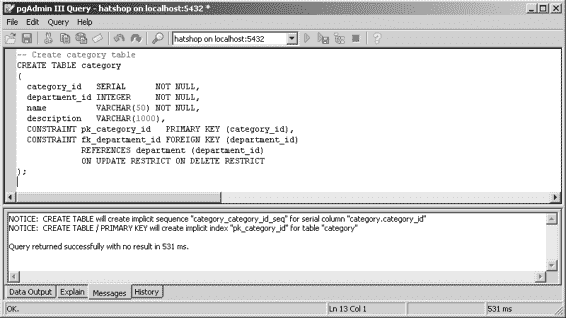

# 外键（Foreign Key）

**外键**是一个列或列的组合，用于强制两个表之间的数据链接（通常表示一对多关系）。外键既用作确保数据完整性的一种方法，也用于建立表之间的关系。

为了强制数据库完整性，外键与其他类型的约束一样，会应用某些限制。与将限制应用于单个表的`PRIMARY KEY`和`UNIQUE`约束不同，`FOREIGN KEY`约束将限制应用于引用表和被引用表。例如，如果通过`FOREIGN KEY`约束强制`department`和`category`表之间的一对多关系，数据库将把此关系作为其完整性的一部分包含在内。它不允许您向不存在的部门添加类别，也不允许您删除存在属于它的类别的部门。

[www.it-ebooks.info](http://www.it-ebooks.info/)

`648XCH04.qxd 10/31/06 10:01 PM Page 113`

**第 4 章 ■ 创建产品目录：第二部分 113**

您现在了解了外键的一般理论。在以下练习中，您将通过创建并填充以下表来实践您所学到的关于表关系的新理论：

- `category`
- `product`
- `product_category`

## 添加类别

创建`category`表的过程与您在第二章中创建的`department`表基本相同。`category`表将有四个字段，如表 4-1 所述。

**表 4-1.** *设计* `category` *表*

| **字段名** | **数据类型** | **描述** |
|------------|--------------|--------------------------------------------------------------------------------------------------|
| `category_id` | `SERIAL` | 一个表示类别唯一 ID 的整数。它是表的主键。 |
| `department_id` | `INTEGER` | 一个表示类别所属部门的整数。不允许为`NULL`。 |
| `name` | `VARCHAR(50)` | 存储类别名称。不允许为`NULL`。 |
| `description` | `VARCHAR(1000)` | 存储类别描述。允许为`NULL`。 |

有两种方法可以创建`category`表并填充它。要么从 Apress 网站（http://www.apress.com/）的源代码/下载部分执行 SQL 脚本，要么按照以下练习中的步骤操作。

### 练习：创建`category`表

1. 启动 pgAdmin III，并连接到`hatshop`数据库。
2. 选择 **工具 ➤ 查询工具**。
3. 输入以下代码：

   ```sql
   -- 创建 category 表
   CREATE TABLE category
   (
       category_id SERIAL NOT NULL,
       department_id INTEGER NOT NULL,
       name VARCHAR(50) NOT NULL,
       description VARCHAR(1000),
       CONSTRAINT pk_category_id PRIMARY KEY (category_id),
       CONSTRAINT fk_department_id FOREIGN KEY (department_id) REFERENCES department (department_id)
       ON UPDATE RESTRICT ON DELETE RESTRICT
   );
   ```

   [www.it-ebooks.info](http://www.it-ebooks.info/)

   

   `648XCH04.qxd 10/31/06 10:01 PM Page 114`

   **114 第 4 章 ■ 创建产品目录：第二部分**

4. 通过选择 **查询 ➤ 执行** 或按 F5 键执行查询。结果如图 4-5 所示。

   **图 4-5.** *使用 pgAdmin III 创建* `category` *表*

   > **提示** 执行此命令时，数据库将自动创建一个名为`category_category_id_seq`的序列，该序列将为`category_id`字段生成值。此外，您从第三章中了解到，将在主键列上创建一个索引。

## 工作原理：一对多关系

好的，您已经创建并强制了`category`和`department`表之间的关系。但它是如何工作的，以及它如何影响您的操作？让我们研究一下如何实现这种关系。

在`category`表中，除了主键以及通常的`category_id`、`name`和`description`列之外，您还添加了一个`department_id`列。此列存储类别所属部门的 ID。因为`category`表中的`department_id`字段不允许`NULL`，所以您必须为每个类别提供一个部门。此外，由于外键关系，数据库不允许您指定一个不存在的部门。

外键的行为由用于创建它的命令决定，在我们的例子中：

```sql
CONSTRAINT fk_department_id FOREIGN KEY (department_id) REFERENCES department (department_id)
ON UPDATE RESTRICT ON DELETE RESTRICT
```

可以指示约束对更新和删除操作采取不同的行为。在这里，两种情况下的行为都是`RESTRICT`。让我们看看替代方案：

[www.it-ebooks.info](http://www.it-ebooks.info/)

`648XCH04.qxd 10/31/06 10:01 PM Page 115`

**第 4 章 ■ 创建产品目录：第二部分 115**

- **`RESTRICT`（类似于`NO ACTION`）：** 这可能是最重要的选项。它告诉 PostgreSQL 确保涉及关系中的表的数据库操作不会破坏该关系。当设置此选项时，PostgreSQL 不允许您向不存在的部门添加类别，也不允许您删除具有相关类别的部门。
- **`CASCADE`**：执行自动数据更改以维护数据完整性。例如，更改现有部门的 ID 将导致更改传播到`category`表，以保持类别-部门关联的完整性。这样，即使您更改了部门的 ID，其类别仍将属于它。此选项很危险，因为当删除一个部门时，PostgreSQL 会自动删除该部门的所有相关类别。这是一个敏感的选项，请非常小心。您不会在 HatShop 项目中使用它。
- **`SET NULL`**：当父表被更新或删除时，将外键字段设置为`NULL`。
- **`SET DEFAULT`**：当父表被更新或删除时，将外键字段设置为其默认值。

在一对多关系（以及隐式的`FOREIGN KEY`约束）中，您链接来自两个不同表的两个列。其中一个列是主键，它定义了关系的“一”方。在我们的例子中，`department_id`是`department`表的主键，因此`department`是连接到多个`category`的那一方。主键必须位于“一”方以确保其唯一性——如果无法确保部门 ID 是唯一的，则类别无法链接到部门。您必须确保没有两个部门具有相同的 ID；否则，这种关系就没有太大意义。

您可以在 http://techdocs.postgresql.org/techdocs/hackingreferentialintegrity.php 找到一篇关于 PostgreSQL 参照完整性的非常好的文章。

现在您已经创建了`category`表，可以用一些数据填充它。我们还将尝试添加会破坏您在`department`和`category`表之间建立的关系的数据。

我们将添加到`category`表的示例数据如表 4-2 所示。

**表 4-2.** *设计* `category` *表*

| `category_id` | `department_id` | `name` | `description` |
|----------------|-----------------|---------------------------------|-----------------------------------------------------------|
| 1 | 1 | Christmas Hats | Enjoy browsing our collection of Christmas hats! |
| 2 | 1 | Halloween Hats | Find the hat you’ll wear this Halloween! |
| 3 | 1 | St. Patrick’s Day Hats | Try one of these beautiful hats on St. Patrick’s Day! |
| 4 | 2 | Berets | An amazing collection of berets from all around the world! |
| 5 | 2 | Driving Caps | Be an original driver! Buy a driver’s hat today! |
| 6 | 2 | Theatrical Hats | Going to a costume party? Try one of these hats to complete your costume! |
| 7 | 3 | Military Hats | This collection contains the most realistic replicas of military hats! |

[www.it-ebooks.info](http://www.it-ebooks.info/)

`648XCH04.qxd 10/31/06 10:01 PM Page 116`

**116 第 4 章 ■ 创建产品目录：第二部分**

### 练习：添加类别


1.  启动 `pgAdmin`，并连接到 `hatshop` 数据库。

2.  选择 `Tools` ➤ `Query Tool`。

3.  输入以下代码：

```sql
-- Populate category table

INSERT INTO category (category_id, department_id, name, description) VALUES (1, 1, 'Christmas Hats',

'Enjoy browsing our collection of Christmas hats!');

INSERT INTO category (category_id, department_id, name, description) VALUES (2, 1, 'Halloween Hats',

'Find the hat you''ll wear this Halloween!');

INSERT INTO category (category_id, department_id, name, description) VALUES (3, 1, 'St. Patrick''s Day Hats',

'Try one of these beautiful hats on St. Patrick''s Day!'); INSERT INTO category (category_id, department_id, name, description) VALUES (4, 2, 'Berets',

'An amazing collection of berets from all around the world!'); INSERT INTO category (category_id, department_id, name, description) VALUES (5, 2, 'Driving Caps',

'Be an original driver! Buy a driver''s hat today!');

INSERT INTO category (category_id, department_id, name, description) VALUES (6, 3, 'Theatrical Hats',

'Going to a costume party? Try one of these hats to complete your costume!'); INSERT INTO category (category_id, department_id, name, description) VALUES (7, 3, 'Military Hats',

'This collection contains the most realistic replicas of military hats!');

-- Update the sequence

ALTER SEQUENCE category_category_id_seq RESTART WITH 8;
```

**注意**：在创建类别的 SQL 代码中，我们选择不依赖数据库自动生成的`category_id`值，以确保您最终拥有的 ID 与我们假设您拥有的 ID 相同。这将在稍后为产品 ID 分配特定类别 ID 时非常重要。

当手动指定本应由序列生成的值时，您还需要更新序列，如前面的代码片段所示。如果您计划添加新类别，请确保在执行 SQL INSERT 语句之前该表为空。您可以使用以下命令删除`category`表的内容：

```sql
DELETE FROM category;
```

4.  通过选择 `Query` ➤ `Execute` 或按 `F5` 来执行查询。结果如图 4-6 所示。

**图 4-6.** *添加示例类别*

5.  现在，尝试通过向不存在的部门（例如，将`DepartmentID`设置为 500）添加类别来破坏数据库完整性。尝试使用 `pgAdmin III` 执行以下 SQL 命令：
```sql
INSERT INTO category (department_id, name, description) VALUES (500, 'New category', 'Executing this command should throw an error.');
```

6.  如果一切顺利，数据库应拒绝添加新记录，并抛出如图 4-7 所示的错误。

**图 4-7.** *外键约束生效*

**工作原理：填充类别表**

鉴于您已知需要插入的数据，向表中添加数据应该是一项简单的任务。如前所述，您可以在 Apress 网站（`http://www.apress.com`）的源代码/下载部分找到本书代码中的 SQL 脚本。

请注意我们如何转义类别描述中的特殊字符，例如单引号，这些字符需要成对出现，以便 PostgreSQL 知道将其解释为要添加到描述中的引号，而不是字符串终止字符。

当手动向字段添加值，而这些字段的值本应由序列生成时，您需要手动更新序列，因为序列是独立的数据库对象，如果未用于生成数据，则不会自动更新。如果不更改序列，它可能会生成已添加到数据库中的值，导致部分或全部 INSERT 命令抛出错误。

### 添加产品

现在，您将重复之前的步骤，但这次创建一个更复杂的表：`product`。`product`表具有表 4-3 所示的字段。

**表 4-3.** *设计* product *表*

| 字段名 | 数据类型 | 描述 |
| :--- | :--- | :--- |
| `product_id` | `SERIAL` | 代表类别唯一 ID 的整数。它是表的主键。 |
| `name` | `VARCHAR(50)` | 存储产品名称。不允许为 NULL。 |
| `description` | `VARCHAR(1000)` | 存储类别描述。允许为 NULL。 |
| `price` | `NUMERIC(10,2)` | 存储产品价格。 |
| `discounted_price` | `NUMERIC(10,2)` | 存储打折后的产品价格。如果产品当前没有折扣，则存储 0.00。 |
| `image` | `VARCHAR(150)` | 存储产品图片文件的名称（或完整路径），该图片在产品详情页显示。您可以将图片直接存储在表中，但在大多数情况下，将图片文件存储在文件系统中，仅将其名称存储在数据库中要高效得多。如果您有一个高流量的网站，您甚至可能需要将图片文件放在单独的物理位置（例如，另一个硬盘）以提高站点性能。 |
| `thumbnail` | `VARCHAR(150)` | 存储产品缩略图图片的名称。在浏览目录的产品列表中显示此图片。 |
| `display` | `INTEGER` | 存储一个值，指定该产品应在目录的哪些区域显示。可能的值有 0（默认；产品仅在其所属类别的页面显示）、1（产品也在目录首页突出显示）、2（产品也在其所属部门页面突出显示）和 3（产品同时在首页和部门页面突出显示）。借助此字段，站点管理员可以在特定时间突出显示一组访问者特别感兴趣的产品。例如，在万圣节前夕，您可能希望万圣节帽子在网站首页显著显示。此外，如果您想推广有折扣的产品，此功能正是您所需要的。 |

请按照练习的步骤在您的数据库中创建`product`表。

### 练习：创建产品表

1.  启动 `pgAdmin III`，并连接到 `hatshop` 数据库。

2.  选择 `Tools` ➤ `Query tool`。

3.  输入以下代码：

```sql
-- Create product table

CREATE TABLE product

(

product_id SERIAL NOT NULL,

name VARCHAR(50) NOT NULL,

description VARCHAR(1000) NOT NULL,

price NUMERIC(10, 2) NOT NULL,

discounted_price NUMERIC(10, 2) NOT NULL DEFAULT 0.00,

image VARCHAR(150),

thumbnail VARCHAR(150),

display SMALLINT NOT NULL DEFAULT 0,

CONSTRAINT pk_product PRIMARY KEY (product_id)

);
```

4.  通过选择 `Query` ➤ `Execute` 或按 `F5` 来执行查询。

**注意**：执行此命令时，数据库将自动创建一个名为`product_product_id_seq`的序列，该序列将生成`product_id`字段的值。此外，还将为主键列创建一个索引。

5.  现在，让我们用产品填充该表。由于产品数量众多，请使用源代码/下载部分（`http://www.apress.com`）提供的`populate_product.sql`脚本。


