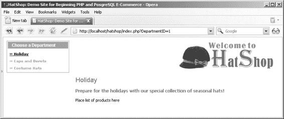
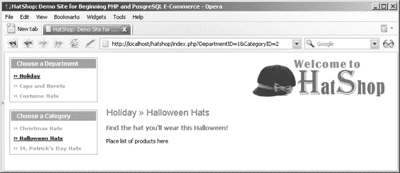
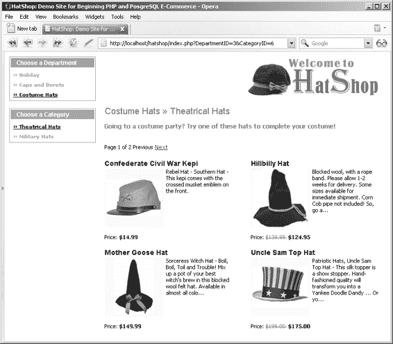
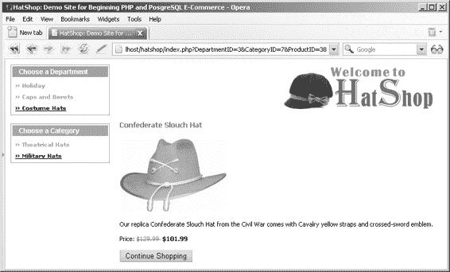

# 创建产品目录：第二部分

## 关联产品与类别

`product_category` 表是链接表，用于实现 `product` 和 `category` 之间的多对多关系。它包含两个字段：`product_id` 和 `category_id`，这两个字段共同构成该表的主键。

请按照练习中的步骤创建并填充该表。

### 练习：创建 `product_category` 表

1. 启动 pgAdmin III，并连接到 `hatshop` 数据库。
2. 选择 **工具 ➤ 查询工具**。
3. 输入以下代码：

```sql
-- 创建 product_category 表

CREATE TABLE product_category
(
  product_id INTEGER NOT NULL,
  category_id INTEGER NOT NULL,
  CONSTRAINT pk_product_id_category_id PRIMARY KEY (product_id, category_id),
  CONSTRAINT fk_product_id FOREIGN KEY (product_id) REFERENCES product (product_id)
    ON UPDATE RESTRICT ON DELETE RESTRICT,
  CONSTRAINT fk_category_id FOREIGN KEY (category_id) REFERENCES category (category_id)
    ON UPDATE RESTRICT ON DELETE RESTRICT
);
```

4. 选择 **查询 ➤ 执行** 或按 F5 键来执行查询。
5. 用数据填充该表。由于数据行数较多，请使用源代码/下载部分 (http://www.apress.com) 提供的 `populate_product_category.sql` 脚本。

### 工作原理：多对多关系

多对多关系是通过添加第三个表（称为连接表，此处命名为 `product_category`）来创建的。该表包含 (`product_id`, `category_id`) 对，表中的每条记录都将一个特定产品与一个特定类别关联起来。因此，如果在 `product_category` 中看到诸如 `(1,4)` 的记录，就能知道 ID 为 1 的产品属于 ID 为 4 的类别。

这种多对多关系通过两个 **FOREIGN KEY（外键）** 约束在物理层面得到强制执行——一个约束将 `product` 表链接到 `product_category` 表，另一个约束将 `product_category` 表链接到 `category` 表。用通俗的话来说，这意味着“一个产品可以与多个产品-类别条目关联，而每个这样的条目又与一个类别关联”。外键确保出现在 `product_category` 表中的产品和类别确实存在于数据库中，并且如果某个产品关联了类别，则不允许删除该产品，反之亦然。

这也是你第一次设置由多个列组成的主键。`product_category` 的主键由它的两个字段构成：`product_id` 和 `category_id`。这意味着表中不允许出现两个完全相同的 (`product_id`, `category_id`) 对。然而，只要在唯一的 (`product_id`, `category_id`) 对中，`product_id` 或 `category_id` 出现多次是完全合法的。这很合理，因为你不想在 `product_category` 表中有两条完全相同的记录。一个产品可以关联一个特定的类别，也可以不关联；但它不能多次关联同一个类别。

起初，关于表关系的所有理论可能会让人感到有些困惑，直到你习惯为止。为了更清晰地理解这种关系，你可以使用数据库关系图来直观地了解。

### 使用数据库关系图

许多工具允许你以可视化的方式构建数据库结构，在数据库中物理实现它们，并生成必要的 SQL 脚本。虽然本书不会介绍任何特定的工具，但了解它们的存在是件好事。你可以在 http://www.databaseanswers.com/modelling_tools.htm 找到最常用工具的列表。

数据库关系图也具有实现表之间关系的能力。例如，如果你已经在四个表之间实现了关系，那么数据库关系图看起来会像图 4-8 那样。

**图 4-8.** *使用数据库关系图查看表和关系*

在关系图中，每个表的主键都用 **PK** 标记表示。外键用 **FK** 标记（因为一个表中可能有多个外键，所以会进行编号）。两个表之间的箭头指向关系中“一”的那一端所对应的表。

## 查询新数据

现在，你的数据库拥有大量信息，正等待有人来读取。然而，新的元素也带来了一系列需要学习的新知识。

对于本章而言，数据层逻辑比前一章稍微复杂一些，因为它必须回答诸如“给我卡通类别中第二页的产品”或“给我 X 部门正在促销的产品”之类的查询。在继续编写实现此逻辑的存储过程之前，让我们先了解以下理论知识：

- 检索简短的产品描述
- 连接数据表
- 实现分页

让我们逐一处理这些任务。

### 获取简短描述

在浏览商品目录时，访客看到的产品列表中，我们不会显示完整的产品描述，而只显示其中的一部分。在 HatShop 中，我们将显示每个产品描述的前 150 个字符，并在其后附加“...”。

在 PostgreSQL 中，你可以使用 `substring` 函数从字符串中提取子串。以下 SELECT 命令返回产品描述被截断为 30 个字符并附加“...”的结果：

```sql
SELECT name,
       substring(description, 1, 30) || '...' AS description
FROM product
ORDER BY name;
```

由 `(substring(description, 1, 30) || '...')` 表达式生成的新列没有名称，因此我们使用 `AS` 关键字为其创建了一个别名。根据你当前的数据，该查询将返回类似以下内容的结果：

| name               | description                            |
|--------------------|----------------------------------------|
| 454 黑色海盗帽      | 我们的羊毛毡海盗帽...                 |
| 9 绿色疯帽子高顶礼帽 | 我们的每顶疯帽子帽...                 |
| 黑色巴斯克贝雷帽     | 这是我们久经考验的男...               |
| 黑色清教徒帽        | Haentze Hatcrafters 一直...          |
| 黑色巫师帽          | 这顶酷炫的 Merlin 风格巫师...        |
| ...                | ...                                    |

### 连接数据表

由于你的数据存储在多个表中，通常并非所需的所有信息都只在一个表中。看看下面的列表，它包含了来自 `department` 表和 `category` 表的数据：

| 部门名称            | 类别名称              |
|----------------------|------------------------|
| 假日                 | 圣诞帽                |
| 假日                 | 万圣节帽              |
| 假日                 | 圣帕特里克节帽        |
| 帽子和贝雷帽         | 贝雷帽                |
| 帽子和贝雷帽         | 驾驶帽                |
| 戏服帽               | 戏剧帽                |
| 戏服帽               | 军帽                  |

在其他情况下，你需要的所有信息都在一个表中，但你需要根据另一个表中的信息对其施加条件。使用到目前为止所学的简单查询是无法得到这种结果集的。需要基于多个表中的数据获得结果集，这很好地表明你可能需要使用**表连接**。


当提取属于某个类别的产品时，SQL 查询与提取属于某个部门的产品并不相同。这是因为产品和类别之间通过 `product_category` 关联表进行链接。

要获取某类别中的产品列表，首先需要查看 `product_category` 表，找出所有 `(product_id, category_id)` 配对，其中 `category_id` 是你要查找的类别 ID。该列表包含了该类别中产品的 ID。利用这些 ID，你就能生成所需的产品列表。虽然这听起来相当复杂，但仅用一条 SQL 查询就能完成。SQL 的真正强大之处在于，它能通过简单的查询对大量数据执行复杂操作。

你将通过分析 `product` 和 `product_category` 表，以及分析如何获取属于特定类别的产品列表，来学习如何实现表连接。

在 SQL 中，使用 `JOIN` 子句来连接表。将一个表与另一个表连接后，会合并这些表的列（而不是行）。连接两个表时，必须有一个用于连接的共同列。

假设你想获取 `category_id = 5` 类别中的所有产品。

连接 `product` 和 `product_category` 表的查询如下：

```sql
SELECT product_category.product_id,
product_category.category_id,
product.name
FROM product_category
INNER JOIN product
ON product.product_id = product_category.product_id
ORDER BY product.product_id;
```

结果大致如下（为节省篇幅，列表未包含所有返回的行和列）：

```
product_id category_id name
----------- ----------- --------------------------------------------------
1           1           Christmas Candy Hat
2           1           Hanukah Hat
3           1           Springy Santa Hat
4           1           Plush Santa Hat
5           1           Red Santa Cowboy Hat
6           1           Santa Jester Hat
7           1           Santa's Elf Hat
8           2           Chauffeur Hat
8           5           Chauffeur Hat
...
```

结果表由连接表中按 `product_id` 列同步的请求字段组成，该列被指定为连接列。你可以看到，存在于多个类别中的产品会多次列出，每个所属类别一次，但在我们过滤结果以仅获取特定类别的产品后，这个问题就会消失。

请注意，在 `SELECT` 子句中，列名前缀了表名。如果列存在于参与连接的多个表中（例如本例中的 `product_id`），则这是必需的。对于其他列，是否用表名作为前缀是可选的，但为了避免混淆，最好还是加上。

仅返回属于类别 5 的产品的查询是：

```sql
SELECT product.product_id, product.name
FROM product_category
INNER JOIN product
ON product.product_id = product_category.product_id
WHERE product_category.category_id = 5;
```

结果是：

```
product_id Name
----------- --------------------------------------------------
8          Chauffeur Hat
27         Bond-Leather Driver
28         Moleskin Driver
29         Herringbone English Driver
```

最后值得讨论的一点是**别名**的使用。别名不一定与表连接相关，但在连接表时它们会变得特别有用（有时是必需的），并且它们会为涉及的表分配不同（通常更短）的名称。当表与自身连接时，别名是必需的，此时你需要为其不同实例分配不同的别名来区分它们。以下查询返回与前一个查询相同的产品，但使用了别名：

```sql
SELECT p.product_id, p.name
```


`FROM product_category pc`

`INNER JOIN product p`

`ON p.product_id = pc.product_id`

`WHERE pc.category_id = 5;`

**逐页显示产品**

如果某些网页部分需要列出大量产品，让访问者能够以每页预定义（或由访问者配置）的产品数量逐页浏览，会非常实用。

根据在架构中执行分页的层级不同，主要有三种实现分页的方式：

**在数据层分页：** 在此情况下，数据库仅返回表示层所需的该页产品。

**在业务层分页：** 业务层从数据库请求完整的产品页面，执行过滤，然后仅向表示层返回需要显示的该页产品。

**在表示层分页：** 在此场景中，表示层接收完整的产品列表，并提取出需要向访问者显示的该页产品。

在业务层和表示层进行分页存在潜在的性能问题，尤其是在处理大型结果集时，因为它们意味着需要将不必要的大量数据从数据库传输到表示层。额外的数据还需要存储在服务器内存中，不必要地消耗服务器资源。

在我们的网站中，我们将在数据层实现分页，这不仅因为其性能更佳，还因为它能让您学习一些在开发网站时会发现很有用的数据库编程技巧。

要在数据层实现分页，我们需要找到如何构建一个`SELECT`查询，该查询只从更大的记录集中返回一部分记录（产品），而每种数据库语言似乎都有不同的实现方式。要在 PostgreSQL 中实现此功能，您需要将`LIMIT`和`OFFSET`关键字与`SELECT`语句结合使用：

- `OFFSET`指定从原始行集中跳过多少条记录。因此，如果您想检索一个每页显示四个产品的产品目录中的第二页产品，则需要指定`OFFSET 4`。没有偏移量的查询等同于`OFFSET 0`的查询。
- `LIMIT`指定要返回的最大行数。

使用`OFFSET`和`LIMIT`时，强烈建议同时使用`ORDER BY`。没有此子句，PostgreSQL 无法保证结果返回的顺序，因此，理论上，对某个特定产品页面的不同请求可能会返回不同的结果。以下 SQL 查询告诉 PostgreSQL 从按字母顺序排序的产品列表中返回第 15、16、17、18 和 19 行：

```
SELECT name
FROM product
ORDER BY name
LIMIT 5
OFFSET 14;
```

在当前数据库下，您应获得以下产品：
```
name
Confederate Civil War Kepi
Confederate Slouch Hat
Cotton Beret
Green MadHatter Hat
Hanukah Hat
```

您将使用`LIMIT`和`OFFSET`关键字来指定在检索产品列表时感兴趣的记录范围。有关更多详细信息，您可以随时参考官方文档：[`www.postgresql.org/docs/current/interactive/queries-limit.html`](http://www.postgresql.org/docs/current/interactive/queries-limit.html)。

**编写新的数据库函数**

现在，您将实现从数据库返回数据的数据层函数。首先，您将实现检索部门和类别信息的 PostgreSQL 函数：

- `catalog_get_department_details`
- `catalog_get_categories_list`
- `catalog_get_category_details`

之后，您将编写处理产品的函数。实际上只有四个函数用于请求产品，但您还将实现三个辅助函数（`catalog_count_products_in_category`、`catalog_count_products_on_department`和`catalog_count_products_on_catalog`）来协助实现分页功能。


你需要实现的方法完整列表如下：

- `catalog_count_products_in_category`
- `catalog_get_products_in_category`
- `catalog_count_products_on_department`
- `catalog_get_products_on_department`
- `catalog_count_products_on_catalog`
- `catalog_get_products_on_catalog`
- `catalog_get_product_details`

在接下来的章节中，你将看到每个函数的代码及其返回类型。我们不会通过单独的练习来创建这些函数。请使用 `pgAdmin III` 将它们添加到你的数据库中。

### `catalog_get_department_details`

`catalog_get_category_details` 函数根据接收到的部门 ID 返回其名称和描述。当用户在商品目录中选择一个部门时，需要查询数据库以找出该特定部门的名称和描述。

返回数据被封装为一个 `department_details` 类型的对象。以下是创建 `catalog_get_department_details` 函数和 `department_details` 类型的 SQL 代码：

```sql
-- Create department_details type
CREATE TYPE department_details AS
(
  name VARCHAR(50),
  description VARCHAR(1000)
);

-- Create catalog_get_department_details function
CREATE FUNCTION catalog_get_department_details(INTEGER)
  RETURNS department_details
  LANGUAGE plpgsql AS $$
DECLARE
  inDepartmentId ALIAS FOR $1;
  outDepartmentDetailsRow department_details;
BEGIN
  SELECT INTO outDepartmentDetailsRow
    name, description
  FROM department
  WHERE department_id = inDepartmentId;
  RETURN outDepartmentDetailsRow;
END;
$$;
```

`WHERE` 子句（`WHERE department_id = inDepartmentId`）用于请求特定部门的详细信息。

### `catalog_get_categories_list`

当访问者选择一个部门时，必须显示属于该部门的类别。这些类别将由 `catalog_get_categories_list` 函数检索，该函数返回特定部门中的类别列表。该函数需要知道要检索类别的部门 ID。返回类型为 `category_list`。

```sql
-- Create category_list type
CREATE TYPE category_list AS
(
  category_id INTEGER,
  name VARCHAR(50)
);

-- Create catalog_get_categories_list function
CREATE FUNCTION catalog_get_categories_list(INTEGER)
  RETURNS SETOF category_list
  LANGUAGE plpgsql AS $$
DECLARE
  inDepartmentId ALIAS FOR $1;
  outCategoryListRow category_list;
BEGIN
  FOR outCategoryListRow IN
    SELECT category_id, name
    FROM category
    WHERE department_id = inDepartmentId
    ORDER BY category_id
  LOOP
    RETURN NEXT outCategoryListRow;
  END LOOP;
END;
$$;
```

### `catalog_get_category_details`

当访问者选择一个特定的类别时，我们需要显示其名称和描述。

```sql
-- Create category_details type
CREATE TYPE category_details AS
(
  name VARCHAR(50),
  description VARCHAR(1000)
);

-- Create catalog_get_category_details function
CREATE FUNCTION catalog_get_category_details(INTEGER)
  RETURNS category_details
  LANGUAGE plpgsql AS $$
DECLARE
  inCategoryId ALIAS FOR $1;
  outCategoryDetailsRow category_details;
BEGIN
  SELECT INTO outCategoryDetailsRow
    name, description
  FROM category
  WHERE category_id = inCategoryId;
  RETURN outCategoryDetailsRow;
END;
$$;
```

### `catalog_count_products_in_category`

此函数返回一个类别中的产品数量。当需要对产品列表进行分页时，该数据是必需的，因为我们需要能够计算一个类别中有多少页产品。

```sql
-- Create catalog_count_products_in_category function
```


```sql
CREATE FUNCTION catalog_count_products_in_category(INTEGER) RETURNS INTEGER LANGUAGE plpgsql AS $$

DECLARE
inCategoryId ALIAS FOR $1;
outCategoriesCount INTEGER;

BEGIN
SELECT INTO outCategoriesCount
count(*)
FROM product p
INNER JOIN product_category pc
ON p.product_id = pc.product_id
WHERE pc.category_id = inCategoryId;
RETURN outCategoriesCount;

END;

$$;
```

`catalog_get_products_in_category` 函数返回属于特定类别的产品。要获取产品列表，需要像本章前面所述的那样连接 `product` 和 `product_category` 表，同时还会对产品描述进行截断处理。

该函数接收四个参数：

- `inCategoryID`：表示我们为其返回产品的类别 ID。
- `inShortProductDescriptionLength`：表示产品描述允许的最大长度。如果描述超过此值，将被截断，并在末尾添加“...”。请注意，这仅在显示产品列表时使用；在产品详情页面，描述不会被截断。
- `inProductsPerPage`：表示我们网站上每个目录页面可显示的最大产品数量。如果类别中的产品总数大于此数值，则仅返回包含 `inProductsPerPage` 个产品的一页。
- `inStartItem`：表示要返回的第一个产品的索引。当使用分页且每页显示 4 个产品时，如果访问者访问第二页产品，`inStartItem` 将为 5，`inProductsPerPage` 将为 4。使用这些值，`catalog_get_products_in_category` 函数将返回从第五个到第九个的产品。

```
-- 创建 product_list 类型
CREATE TYPE product_list AS
(
    product_id INTEGER,
    name VARCHAR(50),
    description VARCHAR(1000),
    price NUMERIC(10, 2),
    discounted_price NUMERIC(10, 2),
    thumbnail VARCHAR(150)
);

-- 创建 catalog_get_products_in_category 函数
CREATE FUNCTION catalog_get_products_in_category(
    INTEGER, INTEGER, INTEGER, INTEGER)
RETURNS SETOF product_list LANGUAGE plpgsql AS $$
DECLARE
    inCategoryId ALIAS FOR $1;
    inShortProductDescriptionLength ALIAS FOR $2;
    inProductsPerPage ALIAS FOR $3;
    inStartItem ALIAS FOR $4;
    outProductListRow product_list;
BEGIN
    FOR outProductListRow IN
        SELECT p.product_id, p.name, p.description, p.price, p.discounted_price, p.thumbnail
        FROM product p
        INNER JOIN product_category pc
            ON p.product_id = pc.product_id
        WHERE pc.category_id = inCategoryId
        ORDER BY p.product_id
        LIMIT inProductsPerPage
        OFFSET inStartItem
    LOOP
        IF char_length(outProductListRow.description) >
           inShortProductDescriptionLength THEN
            outProductListRow.description :=
                substring(outProductListRow.description, 1,
                inShortProductDescriptionLength) || '...';
        END IF;
        RETURN NEXT outProductListRow;
    END LOOP;
END;
$$;
```

`catalog_count_products_on_department` 函数计算在指定部门页面上显示的产品数量。请注意，部门的页面上不会列出该部门的所有产品，而仅列出 `display` 值为 2（部门促销产品）或 3（部门及目录促销产品）的产品。

```
-- 创建 catalog_count_products_on_department 函数
CREATE FUNCTION catalog_count_products_on_department(INTEGER)
RETURNS INTEGER LANGUAGE plpgsql AS $$
DECLARE
    inDepartmentId ALIAS FOR $1;
    outProductsOnDepartmentCount INTEGER;
BEGIN
    SELECT DISTINCT INTO outProductsOnDepartmentCount
        count(*)
    FROM product p
    INNER JOIN product_category pc
        ON p.product_id = pc.product_id
    INNER JOIN category c
        ON pc.category_id = c.category_id
    WHERE (p.display = 2 OR p.display = 3)
        AND c.department_id = inDepartmentId;
    RETURN outProductsOnDepartmentCount;
END;
$$;
```


SQL 代码与即将讨论的`catalog_get_products_on_department`中的代码几乎相同。

**`catalog_get_products_on_department`**

当访客选择一个特定部门时，除了需要列出其名称、描述和类别列表（你之前已为这些任务编写了必要代码）外，你还希望显示该部门的特色产品列表。

`catalog_get_products_on_department`返回所有属于特定部门且显示设置（`display`）为 2（部门促销产品）或 3（部门及目录促销产品）的产品。

在`catalog_get_products_in_category`中，你需要进行表连接来找出属于特定类别的产品。现在你需要为部门执行此操作，任务稍显复杂，因为你无法直接知道哪些产品属于每个部门。

你已经知道如何查找属于特定部门的类别（在`catalog_get_categories_list`中完成），也已知如何获取属于特定类别的产品（在`catalog_get_products_in_category`中完成）。通过组合这些信息，你可以生成部门中的产品列表。为此，你需要进行两次表连接。

[www.it-ebooks.info](http://www.it-ebooks.info/)

648XCH04.qxd 10/31/06 10:01 PM Page 132

**132**  第四章 ■ 创建产品目录：第二部分

你还需要使用`DISTINCT`子句来过滤结果，避免多次获取相同的记录。当某个产品属于多个类别，且这些类别位于同一部门时，就可能出现这种情况。在这种情况下，除非使用`DISTINCT`过滤结果，否则每个匹配的类别都会返回相同的产品。

```sql
-- 创建 catalog_get_products_on_department 函数

CREATE FUNCTION catalog_get_products_on_department(

INTEGER, INTEGER, INTEGER, INTEGER)

RETURNS SETOF product_list LANGUAGE plpgsql AS $$

DECLARE

inDepartmentId ALIAS FOR $1;

inShortProductDescriptionLength ALIAS FOR $2;

inProductsPerPage ALIAS FOR $3;

inStartItem ALIAS FOR $4;

outProductListRow product_list;

BEGIN

FOR outProductListRow IN

SELECT DISTINCT p.product_id, p.name, p.description, p.price, p.discounted_price, p.thumbnail

FROM product p

INNER JOIN product_category pc

ON p.product_id = pc.product_id

INNER JOIN category c

ON pc.category_id = c.category_id

WHERE (p.display = 2 OR p.display = 3)

AND c.department_id = inDepartmentId

ORDER BY p.product_id

LIMIT inProductsPerPage

OFFSET inStartItem

LOOP

IF char_length(outProductListRow.description) >

inShortProductDescriptionLength THEN

outProductListRow.description :=

substring(outProductListRow.description, 1,

inShortProductDescriptionLength) || '...';

END IF;

RETURN NEXT outProductListRow;

END LOOP;

END;

$$;
```

■**提示** 如果表连接的工作方式看起来过于复杂，请尝试按照前面图 4-8 所示的图表进行操作。

[www.it-ebooks.info](http://www.it-ebooks.info/)

648XCH04.qxd 10/31/06 10:01 PM Page 133

第四章 ■ 创建产品目录：第二部分 **133**

**`catalog_count_products_on_catalog`**

`catalog_count_products_on_catalog`目录返回要在目录首页显示的产品数量。这些产品的`display`字段值为 1（产品在首页推广）或 3（产品在首页和部门页面推广）。

```sql
-- 创建 catalog_count_products_on_catalog 函数

CREATE FUNCTION catalog_count_products_on_catalog()

RETURNS INTEGER LANGUAGE plpgsql AS $$

DECLARE

outProductsOnCatalogCount INTEGER;

BEGIN

SELECT INTO outProductsOnCatalogCount

count(*)

FROM product

WHERE display = 1 OR display = 3;

RETURN outProductsOnCatalogCount;

END;

$$;
```

**`catalog_get_products_on_catalog`**


`catalog_get_products_on_catalog`函数返回要在商品目录首页上显示的商品。这些商品的`display`字段值为`1`（商品在首页推广）或`3`（商品在首页和部门页面推广）。商品描述会在指定字符数处截断。分页功能的实现方式与之前两个返回商品列表的函数相同。

```sql
-- Create catalog_get_products_on_catalog function

CREATE FUNCTION catalog_get_products_on_catalog(INTEGER, INTEGER, INTEGER) RETURNS SETOF product_list LANGUAGE plpgsql AS $$

DECLARE

inShortProductDescriptionLength ALIAS FOR $1;

inProductsPerPage ALIAS FOR $2;

inStartItem ALIAS FOR $3;

outProductListRow product_list;

BEGIN

FOR outProductListRow IN

SELECT product_id, name, description, price,

discounted_price, thumbnail

FROM product

WHERE display = 1 OR display = 3

ORDER BY product_id

LIMIT inProductsPerPage

OFFSET inStartItem

LOOP

IF char_length(outProductListRow.description) >

inShortProductDescriptionLength THEN

outProductListRow.description :=

substring(outProductListRow.description, 1,

inShortProductDescriptionLength) || '...';

END IF;

RETURN NEXT outProductListRow;

END LOOP;

END;

$$;
```

`catalog_get_product_details`
---

`catalog_get_product_details`函数返回商品的详细信息，该函数被调用以获取将在商品详情页上显示的数据。

```sql
-- Create product_details type

CREATE TYPE product_details AS

(

product_id INTEGER,

name VARCHAR(50),

description VARCHAR(1000),

price NUMERIC(10, 2),

discounted_price NUMERIC(10, 2),

image VARCHAR(150)

);

-- Create catalog_get_product_details function

CREATE FUNCTION catalog_get_product_details(INTEGER)

RETURNS product_details LANGUAGE plpgsql AS $$

DECLARE

inProductId ALIAS FOR $1;

outProductDetailsRow product_details;

BEGIN

SELECT INTO outProductDetailsRow

product_id, name, description,

price, discounted_price, image

FROM product

WHERE product_id = inProductId;

RETURN outProductDetailsRow;

END;

$$;
```

好了，到此为止，你的数据存储已经准备好保存和处理商品目录信息。现在是时候进入下一步：实现商品目录的业务逻辑层。

**完成业务逻辑层代码**

在业务逻辑层中，你将添加一些新的方法，这些方法将调用之前在数据逻辑层创建的方法。请记住，你在第 3 章已经开始处理`Catalog`类（位于`business/catalog.php`文件中）。你将在这里添加的新方法有：

- `GetDepartmentDetails`
- `GetCategoriesInDepartment`
- `GetCategoryDetails`
- `HowManyPages`
- `GetProductsInCategory`
- `GetProductsOnDepartment`
- `GetProductsOnCatalog`
- `GetProductDetails`

**定义商品列表常量并激活会话**

在编写业务逻辑层方法之前，让我们先更新`include/config.php`文件，添加`SHORT_PRODUCT_DESCRIPTION_LENGTH`和`PRODUCTS_PER_PAGE`常量。通过指定商品描述的长度和每页显示的商品数量，这些常量让你可以轻松定义站点的行为。

```php
...
// Server HTTP port (can omit if the default 80 is used) 
define('HTTP_SERVER_PORT', '8080');

/* Name of the virtual directory the site runs in, for example:
'/hatshop/' if the site runs at http://www.example.com/hatshop/
'/' if the site runs at http://www.example.com/ */
define('VIRTUAL_LOCATION', '/hatshop/');

// We enable and enforce SSL when this is set to anything else than 'no'
define('USE_SSL', 'yes');

// Configure product lists display options
define('SHORT_PRODUCT_DESCRIPTION_LENGTH', 150);
define('PRODUCTS_PER_PAGE', 4);

?>
```


然后，修改`include/app_top.php`，在文件中添加以下代码行：

```
<?php

// 激活会话
session_start();

// 包含工具文件
require_once 'include/config.php';
require_once BUSINESS_DIR . 'error_handler.php';

...
```

[www.it-ebooks.info](http://www.it-ebooks.info/)

`SHORT_PRODUCT_DESCRIPTION_LENGTH`常量指定了在产品列表显示时，产品描述中应出现的字符数量。完整描述会在产品详情页面显示，该页面将在本章末尾实现。

`PRODUCTS_PER_PAGE`指定了任何目录页面中能够显示的最大产品数量。如果访问者的选择包含超过`PRODUCTS_PER_PAGE`个产品，产品列表将被拆分为多个子页面，可通过导航控件访问。

我们还启用了 PHP 会话，这将有助于在翻阅产品页面时提高性能。

> **注意**：会话处理是 PHP 的一项出色功能，它允许你跟踪特定访问者的变量。当访问者浏览目录时，其会话变量由 Web 服务器持久化，并与唯一的访问者标识符关联（该标识符默认以**cookie**形式存储在访问者的浏览器中）。访问者的会话对象存储了（名称, 值）对，这些数据保存在服务器端，并在整个访问者会话期间可访问。在本章中，我们将利用会话功能来提升性能。在实现分页功能时，在请求产品列表之前，先向数据库查询将要返回的产品总数，以便向访问者显示共有多少页产品可用。该数字将保存在访问者的会话中，这样在访问者浏览产品列表的各页时，数据库就不会被多次查询——后续调用时，该数字将直接从会话中读取（此功能在你稍后将实现的`HowManyPages`方法中实现）。在本章中，你还会使用会话来实现在产品详情页中的“继续购物”按钮。

让我们逐一讲解每个业务层方法。所有这些方法都需要添加到`Catalog`类中，该类位于你在第 3 章开始编写的`business/catalog.php`文件中。

**`GetDepartmentDetails`**

当点击某个部门以显示其名称和描述时，会从表示层调用`GetDepartmentDetails`。表示层传递所选部门的 ID，你需要返回该部门的名称和描述。

```
// 获取指定部门的完整详细信息
public static function GetDepartmentDetails($departmentId)
{
    // 构建 SQL 查询
    $sql = 'SELECT *
            FROM catalog_get_department_details(:department_id);';
    
    // 构建参数数组
    $params = array (':department_id' => $departmentId);
    
    // 使用 PDO 特定功能准备语句
    $result = DatabaseHandler::Prepare($sql);
    
    // 执行查询并返回结果
    return DatabaseHandler::GetRow($result, $params);
}
```

**`GetCategoriesInDepartment`**

`GetCategoriesInDepartment`方法用于获取属于某个部门的类别列表。将此方法添加到`Catalog`类中：

```
// 获取属于某个部门的类别列表
public static function GetCategoriesInDepartment($departmentId)
{
    // 构建 SQL 查询
    $sql = 'SELECT *
            FROM catalog_get_categories_list(:department_id);';
    
    // 构建参数数组
    $params = array (':department_id' => $departmentId);
    
    ...


```php
// 使用 PDO 特定功能准备语句
$result = DatabaseHandler::Prepare($sql);

// 执行查询并返回结果
return DatabaseHandler::GetAll($result, $params);
```

## GetCategoryDetails

当点击某个分类以显示其名称和描述时，会从表示层调用 `GetCategoryDetails`。表示层会传入所选分类的 ID，你需要返回该分类的名称和描述。

```php
// 检索指定分类的完整详细信息
public static function GetCategoryDetails($categoryId)
{
    // 构建 SQL 查询
    $sql = 'SELECT *
            FROM catalog_get_category_details(:category_id);';

    // 构建参数数组
    $params = array (':category_id' => $categoryId);

    // 使用 PDO 特定功能准备语句
    $result = DatabaseHandler::Prepare($sql);

    // 执行查询并返回结果
    return DatabaseHandler::GetRow($result, $params);
}
```

## HowManyPages

如你所知，我们的产品目录每页会显示固定数量的产品。当某个目录页包含的产品数量超过设定值时，我们会显示导航控件，让浏览者可以在产品的子页面间前后翻页。你可以在第 3 章的图 3-2 中看到这些导航控件，或者在本章后面的图 4-11 中看到。

在显示导航控件时，你需要计算指定目录页的产品子页面数量；为此，我们创建了 `HowManyPages` 辅助方法。

该方法接收一个用于统计目录页产品总数的 SELECT 查询（`$countSql`）作为参数，并返回子页面数量。实现方式很简单：将产品总数除以每个子页面显示的产品数量；后者的数值可通过 `include/config.php` 中的 `PRODUCTS_PER_PAGE` 常量进行配置。

为提升浏览者在子页面间前后翻页时的性能，我们在首次计算出子页面数量后，将其保存到浏览者的会话中。这样，在单次访问同一目录页时，作为参数传入的 SQL 查询就无需重复执行。

该方法会被其他数据层方法（`GetProductsInCategory`、`GetProductsOnDepartment`、`GetProductsOnCatalog`）调用，我们接下来会介绍这些方法。

将 `HowManyPages` 添加到 `Catalog` 类中。

```php
/* 计算通过 $countSql 查询返回的产品数量能够填充多少页 */
private static function HowManyPages($countSql, $countSqlParams)
{
    // 为 SQL 查询创建哈希值
    $queryHashCode = md5($countSql . var_export($countSqlParams, true));

    // 验证缓存中是否已有查询结果
    if (isset ($_SESSION['last_count_hash']) &&
        isset ($_SESSION['how_many_pages']) &&
        $_SESSION['last_count_hash'] === $queryHashCode)
    {
        // 检索缓存的值
        $how_many_pages = $_SESSION['how_many_pages'];
    }
    else
    {
        // 执行查询
        $prepared = DatabaseHandler::Prepare($countSql);
        $items_count = DatabaseHandler::GetOne($prepared, $countSqlParams);

        // 计算页数
        $how_many_pages = ceil($items_count / PRODUCTS_PER_PAGE);

        // 将查询及其计数结果保存到会话中
        $_SESSION['last_count_hash'] = $queryHashCode;
        $_SESSION['how_many_pages'] = $how_many_pages;
    }

    // 返回页数
    return $how_many_pages;
}
```

我们来分析一下这个函数如何执行其任务。

该方法是私有的，因为你不会从其他类中访问它——它是 `Catalog` 中其他方法的辅助方法。

该方法会验证前一次调用是否针对相同的 SELECT 查询。如果是，则返回前一次调用缓存的结果。这个小技巧可以提升浏览者在同一产品列表的子页面间浏览时的性能，因为数据库中的实际计数只执行一次。

```php
// 为 SQL 查询创建哈希值
$queryHashCode = md5($countSql . var_export($countSqlParams, true));

// 验证缓存中是否已有查询结果
if (isset ($_SESSION['last_count_hash']) &&
    isset ($_SESSION['how_many_pages']) &&
    $_SESSION['last_count_hash'] === $queryHashCode)
{
    // 检索缓存的值
    $how_many_pages = $_SESSION['how_many_pages'];
}
```

与所接收查询和参数关联的页数，会保存在当前浏览者会话中名为 `how_many_pages` 的变量里。如果不满足条件，即查询结果未被缓存，我们会计算页数并将其保存到会话中：

```php
else
{
    // 执行查询
    $prepared = DatabaseHandler::Prepare($countSql);
    $items_count = DatabaseHandler::GetOne($prepared, $countSqlParams);

    // 计算页数
    $how_many_pages = ceil($items_count / PRODUCTS_PER_PAGE);

    // 将查询及其计数结果保存到会话中
    $_SESSION['last_count_hash'] = $queryHashCode;
    $_SESSION['how_many_pages'] = $how_many_pages;
}
```

最后，无论页数是从会话中获取还是由数据库计算得出，都会返回给调用函数：

```php
// 返回页数
return $how_many_pages;
```

## GetProductsInCategory

`GetProductsInCategory` 返回属于特定分类的产品列表。将以下方法添加到 `business/catalog.php` 中的 `Catalog` 类中：

```php
// 检索属于某个分类的产品列表
public static function GetProductsInCategory(
    $categoryId, $pageNo, &$rHowManyPages)
{
    // 返回分类中产品数量的查询
    $sql = 'SELECT catalog_count_products_in_category(:category_id);';
    $params = array (':category_id' => $categoryId);

    // 计算显示产品所需的页数
    $rHowManyPages = Catalog::HowManyPages($sql, $params);

    // 计算起始项
    $start_item = ($pageNo - 1) * PRODUCTS_PER_PAGE;

    // 检索产品列表
    $sql = 'SELECT *
            FROM catalog_get_products_in_category(
                :category_id, :short_product_description_length,
                :products_per_page, :start_item);';
    $params = array (
        ':category_id' => $categoryId,
        ':short_product_description_length' => SHORT_PRODUCT_DESCRIPTION_LENGTH,
        ':products_per_page' => PRODUCTS_PER_PAGE,
        ':start_item' => $start_item);

    $result = DatabaseHandler::Prepare($sql);

    // 执行查询并返回结果
    return DatabaseHandler::GetAll($result, $params);
}
```

该函数有两个用途：

- 计算产品的子页面数量，并通过 `&$rHowManyPages` 参数返回该数值。为此，会使用你之前添加的 `HowManyPages` 方法。用于获取产品总数的 SQL 查询，会调用你之前添加到数据库的 `catalog_count_products_in_category` 数据库函数。
- 返回指定分类中的产品列表。


■**注意** 函数参数前的与符号（`&`）表示该参数通过引用传递。当变量通过引用传递时，传递的是变量的别名，而不是创建该值的新副本。这样，当变量通过引用传递且被调用函数更改其值时，其新值也会反映在调用函数中。通过引用传递是接收被调用函数返回值的另一种方法，当需要从被调用函数获取多个返回值时尤其有用。`CreateSubpageQuery` 通过其返回值返回 `SELECT` 查询的文本，并通过通过引用传递的 `$rHowManyPages` 参数返回子页面总数。

[www.it-ebooks.info](http://www.it-ebooks.info/)

648XCH04.qxd 10/31/06 10:01 PM Page 141

第 4 章 ■ 创建产品目录：第二部分 **141**

## GetProductsOnDepartment

`GetProductsOnDepartment` 函数返回特定部门推荐的产品列表。当顾客访问某个部门的主页时，必须显示该部门的推荐产品。将其放入 `Catalog` 类中。

```
// 检索部门页面的产品列表
public static function GetProductsOnDepartmentDisplay(
  $departmentId, $pageNo, &$rHowManyPages)
{
  // 查询返回部门页面中的产品数量
  $sql = 'SELECT catalog_count_products_on_department(:department_id);';
  $params = array (':department_id' => $departmentId);

  // 计算显示产品所需的页数
  $rHowManyPages = Catalog::HowManyPages($sql, $params);

  // 计算起始项
  $start_item = ($pageNo - 1) * PRODUCTS_PER_PAGE;

  // 检索产品列表
  $sql = 'SELECT *
          FROM catalog_get_products_on_department(
            :department_id, :short_product_description_length,
            :products_per_page, :start_item);';
  $params = array (
    ':department_id' => $departmentId,
    ':short_product_description_length' => SHORT_PRODUCT_DESCRIPTION_LENGTH,
    ':products_per_page' => PRODUCTS_PER_PAGE,
    ':start_item' => $start_item);
  $result = DatabaseHandler::Prepare($sql);

  // 执行查询并返回结果
  return DatabaseHandler::GetAll($result, $params);
}
```

## GetProductsOnCatalog

`GetProductsOnCatalog` 函数返回目录首页上推荐的产品列表。它放在 `Catalog` 类中。

```
// 检索目录显示的产品列表
public static function GetProductsOnCatalogDisplay($pageNo, &$rHowManyPages)
{
  // 查询返回目录首页的产品数量
  $sql = 'SELECT catalog_count_products_on_catalog();';

  // 计算显示产品所需的页数
  $rHowManyPages = Catalog::HowManyPages($sql, null);

  // 计算起始项
  $start_item = ($pageNo - 1) * PRODUCTS_PER_PAGE;
```

[www.it-ebooks.info](http://www.it-ebooks.info/)

648XCH04.qxd 10/31/06 10:01 PM Page 142

**142** 第 4 章 ■ 创建产品目录：第二部分

```
  // 检索产品列表
  $sql = 'SELECT *
          FROM catalog_get_products_on_catalog(
            :short_product_description_length,
            :products_per_page, :start_item);';
  $params = array (
    ':short_product_description_length' => SHORT_PRODUCT_DESCRIPTION_LENGTH,
    ':products_per_page' => PRODUCTS_PER_PAGE,
    ':start_item' => $start_item);
  $result = DatabaseHandler::Prepare($sql);

  // 执行查询并返回结果
  return DatabaseHandler::GetAll($result, $params);
}
```

## GetProductDetails

将 `GetProductDetails` 方法添加到 `Catalog` 类中：

```
// 检索完整的产品详情
public static function GetProductDetails($productId)
{
  // 构建 SQL 查询
  $sql = 'SELECT *
          FROM catalog_get_product_details(:product_id);';

  // 构建参数数组
  $params = array (':product_id' => $productId);

  // 使用 PDO 特定功能准备语句
  $result = DatabaseHandler::Prepare($sql);

  // 执行查询并返回结果
  return DatabaseHandler::GetRow($result, $params);
}
```

## 实现表示层


# 信不信由你

信不信由你，到目前为止，本教程中产品目录的数据层和业务层已经全部完成。你只需在表示层中使用它们的功能即可。在本节最后部分，你将创建几个 Smarty 模板，并将其集成到现有项目中。

运行 HatShop 项目（或在浏览器中打开 `http://localhost/hatshop`），再次查看访客点击某个部门时会发生什么。页面加载后，点击其中一个部门。主页面（`index.php`）会重新加载，但此时地址栏末尾会附带一个查询字符串：

`http://localhost/hatshop/index.php?DepartmentID=1`

[www.it-ebooks.info](http://www.it-ebooks.info/)



利用 `DepartmentID` 这个参数，你可以获取所选部门的任何信息，例如名称、描述、产品列表等。在接下来的几节中，你将创建用于显示与所选部门关联的类别列表，以及用于显示所选部门、类别或主网页的产品的控件。

## 显示部门和类别详情

负责显示特定部门内容的组件化模板名为 `department`，你将在接下来的练习中创建它。首先创建组件化模板，然后修改 `index.php` 和 `templates/index.tpl`，使其在查询字符串中包含 `DepartmentID` 时加载该模板。完成此练习后，点击列表中的某个部门时，你应该会看到类似图 4-9 的页面。

**图 4-9.** *选择“假日”部门*

## 练习：显示部门详情

**1.** 在 `hatshop.css` 文件中添加以下两个样式。它们将用于显示部门的标题和描述：

```css
.title
{
  color: #ff0000;
  font-family: arial, tahoma, verdana;
  font-size: 18px;
  margin: 0px;
}

.description
{
  color: #0583b5;
  font-size: 12px;
  font-weight: bold;
  margin: 0px;
}
```

**2.** 在 `presentation/templates` 文件夹中创建一个名为 `blank.tpl` 的新模板文件，内容如下：

```
{* Smarty 空白页面 *}
```

没错，这是一个空白的 Smarty 模板文件，只包含一条注释。稍后会用到它。请确保将此注释添加到文件中；否则，如果文件为空，尝试使用该模板时会报错。

**3.** 在 `presentation/templates` 文件夹中创建一个名为 `department.tpl` 的新模板文件，并添加以下代码：

```
{* department.tpl *}
{load_department assign="department"}
<p class="title">{$department->mNameLabel}</p>
<br />
<p class="description">{$department->mDescriptionLabel}</p>
<br />
此处放置产品列表
```

两个变量 `$department->mNameLabel` 和 `$department->mDescriptionLabel` 包含了所选部门的名称和描述，它们由模板插件文件 `function.load_department.php` 填充。

**4.** 现在为 `department.tpl` 创建模板插件文件。创建 `presentation/smarty_plugins/function.load_department.php` 文件，并添加以下代码：

```php
<?php
// 插件文件内的插件函数必须命名为：smarty_type_name
function smarty_function_load_department($params, $smarty)
{
  // 创建 Department 对象
  $department = new Department();
  $department->init();

  // 分配模板变量
  $smarty->assign($params['assign'], $department);
}

// 用于处理部门详情检索的类
class Department
{
  // Smarty 模板的公共变量
  public $mDescriptionLabel;
  public $mNameLabel;

  // 私有成员
  private $_mDepartmentId;
  private $_mCategoryId;
}
```


# 类构造函数

```php
public function __construct()
{
    // 我们需要在查询字符串中获取 DepartmentID
    if (isset($_GET['DepartmentID']))
        $this->_mDepartmentId = (int)$_GET['DepartmentID'];
    else
        trigger_error('DepartmentID 未设置');

    /* 如果查询字符串中包含 CategoryID，则保存该值
       （将其转换为整数以防范无效数值） */
    if (isset($_GET['CategoryID']))
        $this->_mCategoryId = (int)$_GET['CategoryID'];
}
```

```php
public function init()
{
    // 如果访问的是部门页面……
    $details = Catalog::GetDepartmentDetails($this->_mDepartmentId);
    $this->mNameLabel = $details['name'];
    $this->mDescriptionLabel = $details['description'];

    // 如果访问的是分类页面……
    if (isset($this->_mCategoryId))
    {
        $details = Catalog::GetCategoryDetails($this->_mCategoryId);
        $this->mNameLabel = $this->mNameLabel . ' » ' . $details['name'];
        $this->mDescriptionLabel = $details['description'];
    }
}
```

## 步骤 5：修改 `index.php`

现在我们来修改 `index.tpl` 和 `index.php`，以便当查询字符串中出现 `DepartmentID` 时，加载新创建的组件化模板。如果访问者正在浏览某个部门，请将 `pageContentsCell` 变量设置为刚刚创建的组件化模板。

按如下所示修改 `index.php`：

```php
<?php
// 加载 Smarty 库和配置文件
require_once 'include/app_top.php';

// 加载 Smarty 模板文件
$page = new Page();

// 定义页面内容的模板文件
$pageContentsCell = 'blank.tpl';

// 如果访问部门页面，则加载部门详情
if (isset($_GET['DepartmentID']))
{
    $pageContentsCell = 'department.tpl';
}

// 将模板文件分配给页面内容单元
$page->assign('pageContentsCell', $pageContentsCell);

// 显示页面
$page->display('index.tpl');

// 加载 app_bottom 以关闭数据库连接
require_once 'include/app_bottom.php';
?>
```

## 步骤 6：修改 `index.tpl`

打开 `presentation/templates/index.tpl`，将文本 `Place contents here` 替换为：

```
{include file="$pageContentsCell"}
```

## 步骤 7：测试网站

在浏览器中加载你的网站，并选择一个部门，确保一切按预期工作。

## 工作原理：部门组件化模板

既然最重要的功能已经在数据层和业务层实现，那么实现可视化部分就变得很简单了。

在添加 CSS 样式并创建空白模板文件后，你创建了 Smarty 模板文件 `department.tpl`，其中包含用于显示部门数据的 HTML 布局。该模板文件被加载到 `index.tpl` 的页面内容单元中，位于页眉下方：

```
{include file="header.tpl"}
<div id="content">
{include file="$pageContentsCell"}
</div>
```

`$pageContentsCell` 变量在 `index.php` 中根据查询字符串参数赋值。目前，如果在查询字符串中找到 `DepartmentID` 参数，页面内容单元会被填充为你刚刚编写的 `department.tpl` 模板文件。否则（例如在首页时），则使用空白模板文件（你将在创建首页内容单元的模板时更改此设置）。以下是 `index.php` 中为 `$pageContentsCell` 赋值的代码：

```php
// 定义页面内容的模板文件
$pageContentsCell = 'blank.tpl';

// 如果访问部门页面，则加载部门详情
if (isset($_GET['DepartmentID']))
{
    $pageContentsCell = 'department.tpl';
}

// 将模板文件分配给页面内容单元
$page->assign('pageContentsCell', $pageContentsCell);
```

关于 `department.tpl`，第一个值得注意的有趣之处在于它加载 `load_department` 函数插件的方式。

```
{* department.tpl *}
{load_department assign="department"}
```


这样，您就可以从模板文件（`department.tpl`）中访问 `Department` 类的实例（我们稍后会讨论）及其公共成员（`mNameLabel` 和 `mDescriptionLabel`），具体代码如下：

```
<p class="title">{$department->mNameLabel}</p>
```

```
<p class="description">{$department->mDescriptionLabel}</p>
```

在此处放置产品列表

接下来，我们需要了解模板插件文件（`function.load_department.php`）是如何获取部门名称和描述的。该文件以一个标准架构中的插件函数开头。它创建了一个 `Department` 实例（`Department` 类随后定义），通过调用其 `init()` 方法进行初始化，然后将 `assign` 插件参数与之前创建的 `Department` 实例关联起来。

```
// 插件文件中的插件函数必须命名为：smarty_type_name
function smarty_function_load_department($params, $smarty)
{
  // 创建 Department 对象
  $department = new Department();
  $department->init();

  // 分配模板变量
  $smarty->assign($params['assign'], $department);
}
```

接着，我们来看 `Department` 类。`Department` 的两个公共成员就是您从 Smarty 模板中访问的那些变量（部门名称和描述）。该类的主要作用就是填充这些成员，以便为访客生成输出内容：

```
// 负责获取部门详情
class Department
{
  // 用于 Smarty 模板的公共变量
  public $mDescriptionLabel;
  public $mNameLabel;
```

还有两个私有成员用于内部用途。`$_mDepartmentId` 和 `$_mCategoryId` 将存储 `DepartmentID` 和 `CategoryID` 查询字符串参数的值：

```
  // 私有成员
  private $_mDepartmentId;
  private $_mCategoryId;
```

接下来是构造函数。在任何面向对象的语言中，类的构造函数会在类被实例化时执行，用于执行各种初始化过程。在我们的案例中，`Department` 的构造函数会将 `DepartmentID` 和 `CategoryID` 查询字符串参数读取到私有类成员 `_mDepartmentId` 和 `_mCategoryId` 中。之所以需要这些参数，是因为如果查询字符串中确实存在 `CategoryID`，那么您还需要显示类别的名称和描述，而不是部门的描述。

```
  // 类构造函数
  public function __construct()
  {
    // 查询字符串中需要包含 DepartmentID
    if (isset ($_GET['DepartmentID']))
      $this->_mDepartmentId = (int)$_GET['DepartmentID'];
    else
      trigger_error('DepartmentID not set');

    /* 如果查询字符串中包含 CategoryID，则将其保存
       （将其转换为整数以防范无效值） */
    if (isset ($_GET['CategoryID']))
      $this->_mCategoryId = (int)$_GET['CategoryID'];
  }
```

该类的真正功能隐藏在 `init()` 方法中，在我们的设计中，该方法会在构造函数之后立即执行。该方法会用业务层的信息来填充公共成员 `mNameLabel` 和 `mDescriptionLabel`。业务层 `Catalog` 类的 `GetDepartmentDetails` 方法用于检索部门的详细信息；如有必要，还会调用 `GetCategoryDetails` 方法来检索类别的详细信息。（即使是在访问某个类别时，也需要检索部门详情，因为页面标题会同时包含部门名称和类别名称。）

```
  public function init()
  {
    // 如果正在访问某个部门……
    $details = Catalog::GetDepartmentDetails($this->_mDepartmentId);
    $this->mNameLabel = $details['name'];
    $this->mDescriptionLabel = $details['description'];

    // 如果正在访问某个类别……
    if (isset ($this->_mCategoryId))
    {
      $details = Catalog::GetCategoryDetails($this->_mCategoryId);
      $this->mNameLabel =
```


`$this->mNameLabel` . ' » ' . `$details['name']`; `$this->mDescriptionLabel` = `$details['description']`;

[www.it-ebooks.info](http://www.it-ebooks.info/)

`648XCH04.qxd` `10/31/06` `10:01 PM` 第 149 页

## 第 4 章 ■ 创建产品目录：第二部分 149

### 显示分类列表

当访客选择一个部门时，必须显示该部门所属的分类。为此，你将实现一个名为`categories_list`的新 Smarty 模板。

`categories_list`与组件化的`department_list`模板非常相似。它包含一个用于遍历分类数据数组（分类名称和分类 ID）的模板节。该模板节将包含指向`index.php`的链接，但这次它们的查询字符串还将包含一个`CategoryID`，表示某个分类已被点击，如下所示：`http://localhost/hatshop/index.php?DepartmentID=1&CategoryID=2`

以下练习中的步骤与`departments_list`组件化模板（在第 3 章末尾创建）的步骤非常相似，因此这次我们将加快进度。

### 练习：创建组件化模板`categories_list`

**1.** 首先，通过添加以下样式更新`hatshop.css`，这些样式将用于显示分类：

```
#categories_box
{
  border: 1px solid #ef8d0e;
}
#categories_box p
{
  background: #ef8d0e;
}
```

**2.** 为组件化模板`categories_list`创建 Smarty 模板。在`presentation/templates/categories_list.tpl`中编写以下代码行：

```
{* categories_list.tpl *}
{load_categories_list assign="categories_list"}
{* 开始分类列表 *}
<div class="left_box" id="categories_box">
  <p>选择一个分类</p>
  <ol>
    {section name=i loop=$categories_list->mCategories}
      {assign var=selected_c value=""}
      {if ($categories_list->mCategorySelected ==
        $categories_list->mCategories[i].category_id)}
        {assign var=selected_c value="class=\"selected\""}
      {/if}
      <li>
        <a {$selected_c}
          href="{$categories_list->mCategories[i].link|prepare_link:"http"}">
          » {$categories_list->mCategories[i].name}
        </a>
      </li>
    {/section}
  </ol>
</div>
{* 结束分类列表 *}
```

**3.** 创建`presentation/smarty_plugins/function.load_categories_list.php`文件，并向其中添加以下代码：

```php
<?php
// 插件文件中的插件函数必须命名为：smarty_type_name
function smarty_function_load_categories_list($params, $smarty)
{
  // 创建 CategoriesList 对象
  $categories_list = new CategoriesList();
  $categories_list->init();
  // 分配模板变量
  $smarty->assign($params['assign'], $categories_list);
}
// 管理分类列表
class CategoriesList
{
  // Smarty 模板的公共变量
  public $mCategorySelected = 0;
  public $mDepartmentSelected = 0;
  public $mCategories;
  // 构造函数读取查询字符串参数
  public function __construct()
  {
    if (isset ($_GET['DepartmentID']))
      $this->mDepartmentSelected = (int)$_GET['DepartmentID'];
    else
      trigger_error('DepartmentID 未设置');
    if (isset ($_GET['CategoryID']))
      $this->mCategorySelected = (int)$_GET['CategoryID'];
  }
  public function init()
  {
    $this->mCategories =
      Catalog::GetCategoriesInDepartment($this->mDepartmentSelected);
    // 为分类页面构建链接
    for ($i = 0; $i < count($this->mCategories); $i++)
      $this->mCategories[$i]['link'] =
        'index.php?DepartmentID=' . $this->mDepartmentSelected .
        '&CategoryID=' . $this->mCategories[$i]['category_id'];
  }
}
?>
```

**4.** 像这样修改`index.php`：

```php
<?php
// 加载 Smarty 库和配置文件
require_once 'include/app_top.php';
// 加载 Smarty 模板文件
$page = new Page();
// 为页面内容定义模板文件
$pageContentsCell = 'blank.tpl';
// 为分类单元格定义模板文件
```


`$categoriesCell = 'blank.tpl';`

```php
// 如果正在浏览某部门，则加载部门详情
if (isset ($_GET['DepartmentID']))
{
  $pageContentsCell = 'department.tpl';
  $categoriesCell = 'categories_list.tpl';
}

// 将模板文件分配给页面内容单元格
$page->assign('pageContentsCell', $pageContentsCell);
$page->assign('categoriesCell', $categoriesCell);

// 显示页面
$page->display('index.tpl');

// 加载用于关闭数据库连接的 app_bottom
require_once 'include/app_bottom.php';
?>
```

**5.** 现在，在 `presentation/templates/index.tpl` 的部门列表下方，引入`categories_list`组件化模板：

```smarty
{include file="departments_list.tpl"}
{include file="$categoriesCell"}
```

**6.** 在网页浏览器中加载 HatShop。页面加载后，点击其中一个部门。你会看到分类列表出现在指定的位置（见图 4-10）。

[www.it-ebooks.info](http://www.it-ebooks.info/)



**图 4-10.** *选择“节日”部门*

### 工作原理：`categories_list` 组件化模板

`categories_list` 组件化模板的工作原理与 `departments_list` 类似。`CategoriesList` 类（位于 `function.load_categories_list.php` 插件文件中）有三个可从模板文件（`categories_list.tpl`）访问的公共成员：

```php
// Smarty 模板的公共变量
public $mCategorySelected = 0;
public $mDepartmentSelected = 0;
public $mCategories;
```

`$mCategorySelected` 保存被选中的分类，该分类必须使用与列表中其他分类不同的样式来显示。`$mDepartmentSelected` 也是如此。`$mCategories` 是你需要填充到分类列表中的分类清单。该清单是通过调用业务层获取的。

分类列表中的链接通过 `prepare_link` Smarty 修饰符进行处理，以确保所有字符都被转换为对应的 HTML 实体（例如 `&` 被转换为 `&amp;` 等），并生成正确的绝对链接，正如你在第 3 章中学到的那样。

```smarty
<a {$selected_c}
   href="{$categories_list->mCategories[i].link|prepare_link:"http"}">
  » {$categories_list->mCategories[i].name}
</a>
```

[www.it-ebooks.info](http://www.it-ebooks.info/)



### 显示产品列表

无论是在主网页上还是在浏览某个分类时，都应该显示一些产品，而不是“在这里放置产品列表”的文本。这里你将创建 `products_list` 组件化模板，它能够显示包含产品详细信息的列表。当有大量产品需要浏览时，会显示导航链接（见图 4-11）。

**图 4-11.** *带分页功能的* `products_list` *组件化模板*

该组件化模板将用于网站内的多个位置。在主页面，它会显示目录中的产品（请记住，即那些 `display` 字段设置为 1 或 3 的产品）。当访客选择某个特定部门时，`products_list` 组件化模板会显示该部门的特色产品。最后，当访客点击某个分类时，该组件化模板会显示该分类下的所有产品。由于数据库的实现方式，你可以将产品在其所属的部门中设定为特色产品，但不在主页上展示，反之亦然。如果某个产品属于多个部门，它将会在每个所属部门的主页上显示。

[www.it-ebooks.info](http://www.it-ebooks.info/)


## 第 4 章：创建产品目录：第二部分

组件化模板在分析查询字符串后决定显示哪些产品。如果查询字符串中同时包含 `DepartmentID` 和 `CategoryID` 参数，则表示应列出该类别下的产品。如果仅包含 `DepartmentID`，则访问者正在浏览某个部门，因此应显示该部门的特色产品。如果没有 `DepartmentID`，则访问者位于主页，因此应显示目录中的特色产品。

要将 `products_list` 组件化模板与首页集成，你需要创建一个额外的模板文件（`first_page_contents.tpl`），该文件将在后续步骤中实现。

在接下来的练习中创建好 `products_list` 后，你将能够按部门和按类别浏览产品。随后，你将了解如何将产品添加到主网页中。

## 练习：创建 `products_list` 组件化模板

1. 将 `product_images` 目录从源代码/下载部分（http://www.apress.com）复制到你的项目的 `hatshop` 文件夹中。

2. 将以下样式添加到 `hatshop.css` 文件中：
```css
.paging_text a
{
  color: #0000ff;
  font-size: 11px;
  font-weight: normal;
  text-decoration: underline;
}

.paging_text a:hover
{
  color: #0000ff;
}

p.right
{
  clear: right;
  float: right;
  width: 260px;
  margin: 0px 0px 15px 0px;
}

p.right br
{
  clear: left;
}

p.left
{
  clear: left;
  float:left;
  width: 260px;
  margin: 0px 0px 15px 0px;
  padding: 0px;
}

p.left br
{
  clear: left;
}

.product_image
{
  clear: none;
  float: left;
  margin: -10px 5px 0px 0px;
  padding: 10px 0px 0px 0px;
}

a.product_name
{
  color: #000000;
  font-family: arial, tahoma, verdana;
  font-size: 14px;
}

a.product_name:hover
{
  color: #ff0000;
  font-family: arial, tahoma, verdana;
  font-size: 14px;
}

.price
{
  font-weight: bold;
}

.old_price
{
  color: #ff0000;
  font-weight: normal;
  text-decoration: line-through;
}
```

3. 在 `presentation/templates` 文件夹内创建一个名为 `products_list.tpl` 的新 Smarty 设计模板，并向其中添加以下代码：
```smarty
{* products_list.tpl *}
{load_products_list assign="products_list"}

{if $products_list->mrHowManyPages > 1}
<br />
<span class="paging_text">
第 {$products_list->mPageNo} 页，共 {$products_list->mrHowManyPages} 页
{if $products_list->mPreviousLink}
<a href="{$products_list->mPreviousLink|prepare_link:"http"}">上一页</a>
{else}
上一页
{/if}
{if $products_list->mNextLink}
<a href="{$products_list->mNextLink|prepare_link:"http"}">下一页</a>
{else}
下一页
{/if}
</span>
{/if}
<br />

{section name=k loop=$products_list->mProducts}
{assign var=direction_p value="左对齐"}
{if $smarty.section.k.index != 0 &&
($smarty.section.k.index + 1) % 2 == 0}
{assign var=direction_p value="右对齐"}
{else}
<br />
{/if}

<p class="{$direction_p}">
<a class="product_name"
href="{$products_list->mProducts[k].link|prepare_link:"http"}">
{$products_list->mProducts[k].name}
</a>
<br />
<a href="{$products_list->mProducts[k].link|prepare_link:"http"}">
mProducts[k].thumbnail}"
border="0" width="120" alt="产品图片" class="product_image" />
</a>
<span class="product_description">
{$products_list->mProducts[k].description}
</span>
<br /><br />
<span>价格：</span>
{if $products_list->mProducts[k].discounted_price == 0}
<span class="price">
{else}
<span class="old_price">
{/if}
${$products_list->mProducts[k].price}
</span>
{if $products_list->mProducts[k].discounted_price != 0}
<span class="price">
${$products_list->mProducts[k].discounted_price}
</span>
{/if}
</p>
{/section}
```


### 4. 现在，你必须为 `products_list.tpl` 模板创建模板插件文件。在 `presentation/smarty_plugins` 文件夹中新建一个文件，命名为 `function.load_products_list.php`，并向其中添加以下代码：

```php
<?php

// 插件文件内的插件函数必须命名为：smarty_type_name
function smarty_function_load_products_list($params, $smarty)
{
  // 创建 ProductsList 对象
  $products_list = new ProductsList();
  $products_list->init();

  // 分配模板变量
  $smarty->assign($params['assign'], $products_list);
}

class ProductsList
{
  // 可供 Smarty 模板读取的公共变量
  public $mProducts;
  public $mPageNo;
  public $mrHowManyPages;
  public $mNextLink;
  public $mPreviousLink;

  // 私有成员
  private $_mDepartmentId;
  private $_mCategoryId;

  // 类构造函数
  public function __construct()
  {
    // 从查询字符串中获取 DepartmentID，并转换为整型
    if (isset ($_GET['DepartmentID']))
      $this->_mDepartmentId = (int)$_GET['DepartmentID'];

    // 从查询字符串中获取 CategoryID，并转换为整型
    if (isset ($_GET['CategoryID']))
      $this->_mCategoryId = (int)$_GET['CategoryID'];

    // 从查询字符串中获取 PageNo，并转换为整型
    if (isset ($_GET['PageNo']))
      $this->mPageNo = (int)$_GET['PageNo'];
    else
      $this->mPageNo = 1;
  }

  public function init()
  {
    /* 如果正在浏览某个类别，则调用 GetProductsInCategory 业务层方法获取产品列表 */
    if (isset ($this->_mCategoryId))
      $this->mProducts = Catalog::GetProductsInCategory(
        $this->_mCategoryId, $this->mPageNo, $this->mrHowManyPages);

    /* 如果正在浏览某个部门，则调用 GetProductsOnDepartmentDisplay 业务层方法获取产品列表 */
    elseif (isset ($this->_mDepartmentId))
      $this->mProducts = Catalog::GetProductsOnDepartmentDisplay(
        $this->_mDepartmentId, $this->mPageNo, $this->mrHowManyPages);

    /* 如果正在浏览首页，则调用 GetProductsOnCatalogDisplay 业务层方法获取产品列表 */
    else
      $this->mProducts = Catalog::GetProductsOnCatalogDisplay(
        $this->mPageNo, $this->mrHowManyPages);

    /* 如果产品有分页，则显示导航控件 */
    if ($this->mrHowManyPages > 1)
    {
      // 读取查询字符串
      $query_string = getenv('QUERY_STRING');

      // 查找查询字符串中是否包含 PageNo
      $pos = stripos($query_string, 'PageNo=');

      /* 如果查询字符串中没有 PageNo，则说明当前在第一页 */
      if ($pos == false)
      {
        $query_string .= '&PageNo=1';
        $pos = stripos($query_string, 'PageNo=');
      }

      // 从查询字符串中读取当前页码
      $temp = substr($query_string, $pos);
      sscanf($temp, 'PageNo=%d', $this->mPageNo);

      // 构建“下一页”链接
      if ($this->mPageNo >= $this->mrHowManyPages)
        $this->mNextLink = '';
      else
      {
        $new_query_string = str_replace('PageNo=' . $this->mPageNo,
          'PageNo=' . ($this->mPageNo + 1),
          $query_string);
        $this->mNextLink = 'index.php?' . $new_query_string;
      }

      // 构建“上一页”链接
      if ($this->mPageNo == 1)
        $this->mPreviousLink = '';
      else
      {
        $new_query_string = str_replace('PageNo=' . $this->mPageNo,
          'PageNo=' . ($this->mPageNo - 1),
          $query_string);
        $this->mPreviousLink = 'index.php?' . $new_query_string;
      }
    }

    // 构建产品详情页的链接
    $url = $_SESSION['page_link'];
    if (count($_GET) > 0)
      $url = $url . '&ProductID=';
    else
      $url = $url . '?ProductID=';

    for ($i = 0; $i < count($this->mProducts); $i++)
    {
      $this->mProducts[$i]['link'] =
        $url . $this->mProducts[$i]['product_id'];
    }
  }
}
?>
```

### 5. 在 `index.php` 的开头，`app_top.php` 引用之后（`app_top.php` 会激活会话处理，这是下面代码工作的必要条件），添加以下代码。这段代码确保在非产品详情页面时，始终保存当前页面的链接。换句话说，`$_SESSION['page_link']` 将始终包含最近访问过的非产品详情页面的链接。你需要保存这个值，以便在产品详情页实现“继续购物”按钮，该按钮需要将访客引导至之前访问的页面。

```php
<?php
// 加载 Smarty 库和配置文件
require_once 'include/app_top.php';

/* 如果不是在产品详情页面，则将当前页面的链接保存到 page_link 会话变量中；
   该变量将用于在产品详情页创建“继续购物”链接以及产品详情页的链接 */
if (!isset ($_GET['ProductID']))
  $_SESSION['page_link'] = substr(getenv('REQUEST_URI'),
    strrpos(getenv('REQUEST_URI'), '/') + 1,
    strlen(getenv('REQUEST_URI')) - 1);

// 加载 Smarty 模板文件
$page = new Page();
```

### 6. 打开 `presentation/templates/department.tpl`，并将

```
<br />
Place list of products here
```

替换为

```
{include file="products_list.tpl"}
```

### 7. 在你常用的浏览器中加载项目，导航至一个部门，然后选择一个子类别。此外，找一个产品数量超过四个的类别来测试分页功能是否正常工作，如图 4-8 所示。

**工作原理：products_list 组件化模板**  
由于产品列表的大部分功能已经在数据层和业务层实现，因此这个任务相当简单。Smarty 设计模板文件（`products_list.tpl`）包含了显示产品时的布局，而其模板插件文件（`function.load_products_list.php`）则负责获取要显示的正确产品列表。

`function.load_products_list.php` 中的构造函数（`ProductsList` 类）创建了一个业务层对象（`Catalog`）的新实例，并从查询字符串中获取 `DepartmentID`、`CategoryID` 和 `PageNo`，同时将它们转换为整型作为安全措施。这些值用于决定显示哪些产品：

```php
// 类构造函数
public function __construct()
{
  // 从查询字符串中获取 DepartmentID，并转换为整型
  if (isset ($_GET['DepartmentID']))
    $this->_mDepartmentId = (int)$_GET['DepartmentID'];

  // 从查询字符串中获取 CategoryID，并转换为整型
  if (isset ($_GET['CategoryID']))
    $this->_mCategoryId = (int)$_GET['CategoryID'];

  // 从查询字符串中获取 PageNo，并转换为整型
  if (isset ($_GET['PageNo']))
    $this->mPageNo = (int)$_GET['PageNo'];
  else
    $this->mPageNo = 1;
}
```

`init()` 方法延续了构造函数的工作，首先获取请求的产品列表。它通过分析 `mCategoryId` 和 `mDepartmentId` 成员（得益于构造函数，它们代表了查询字符串参数 `CategoryID` 和 `DepartmentID` 的值）来决定调用业务层的哪个方法。

如果查询字符串中存在 `CategoryID`，则说明访客正在浏览某个子类别，因此调用 `GetProductsInCategory` 来获取该类别中的产品。如果只存在 `DepartmentID`，则调用 `GetProductsOnDepartmentDisplay` 来获取该部门的特色产品。如果连 `DepartmentID` 也不存在，则说明访客正在首页，因此调用 `GetProductsOnCatalogDisplay` 来获取将在网站首页展示的产品：

```php
public function init()
{
```


/* 若正在浏览某个类别，则调用业务层方法 `GetProductsInCategory` 获取产品列表 */

```
if (isset ($this->_mCategoryId))

$this->mProducts = Catalog::GetProductsInCategory(

$this->_mCategoryId, $this->mPageNo, $this->mrHowManyPages);
```

/* 若正在浏览某个部门，则调用业务层方法 `GetProductsOnDepartmentDisplay` 获取产品列表 */

```
elseif (isset ($this->_mDepartmentId))

$this->mProducts = Catalog::GetProductsOnDepartmentDisplay(

$this->_mDepartmentId, $this->mPageNo, $this->mrHowManyPages);
```

/* 若正在浏览首页，则调用业务层方法 `GetProductsOnCatalogDisplay` 获取产品列表 */

```
else

$this->mProducts = Catalog::GetProductsOnCatalogDisplay(

$this->mPageNo, $this->mrHowManyPages);
```

函数的下一部分负责处理分页。如果业务层告知产品不止一页（即产品数量超过你在 `PRODUCTS_PER_PAGE` 常量中指定的数量），你需要向访客展示当前访问的产品子页面、总子页面数，以及“上一页”和“下一页”链接。代码中的注释已清晰说明了这一功能，因此此处不再赘述。

在函数的最后部分，你为每个 `mProducts` 记录添加了 `link` 成员，该成员包含指向产品页面的链接。这些值将在模板文件中用于在产品名称和图片上创建指向产品页面的链接。链接通过 `page_link` 会话变量创建，该变量指向最近加载且并非产品详情页的页面（此处即当前页面），并在查询字符串中附加 `ProductID`：

```
// 为产品详情页构建链接

$url = $_SESSION['page_link'];

if (count($_GET) > 0)

$url = $url . '&ProductID=';

else

$url = $url . '?ProductID=';

for ($i = 0; $i < count($this->mProducts); $i++)

{

$this->mProducts[$i]['link'] =

$url . $this->mProducts[$i]['product_id'];

}
```

## 显示首页内容

除了网站的一般信息外，你还希望在 HatShop 首页展示一些促销产品。

如果访客浏览部门或类别，将使用部门的 Smarty 模板来构建输出。对于主页，我们将创建 `first_page_contents` 组件化模板来构建输出。

还记得在 `index.tpl` 中，你有一个名为 `pageContentsCell` 的单元格，根据网站被访问的部分填充不同的内容吗？当部门或类别被访问时，部门组件化模板会被加载，并负责填充该区域。对于尚未选择部门或类别的首页，我们还未对该单元格做任何处理。

在接下来的练习中，你将编写一个模板文件，其中包含一些网站信息，并展示已在首页设置为促销的产品。请注意，产品表中有一个名为 `display` 的字段。网站管理员会将需要显示在首页的产品的该字段设置为 `on_catalog`。

### 练习：创建 `first_page_contents` 组件化模板

**1.** 首先，创建 Smarty 设计模板文件。`presentation/templates/first_page_contents.tpl` 文件应包含以下内容：

```
{* first_page_contents.tpl *}

<p class="first_page_text">

我们希望你在开发 HatShop（这个来自

<br />

《Beginning PHP and PostgreSQL E-Commerce: From Novice to Professional》的电子商务商店）时能感到愉快！

</p>

<br />

<p class="description">

本周我们为这些超棒的产品提供了折扣价！

</p>

{include file="products_list.tpl"}
```

**2.** 在 `hatshop.css` 中输入以下样式：

```
.first_page_text

{

color: #000080;

font-size: 12px;
```

[www.it-ebooks.info](http://www.it-ebooks.info/)


648XCH04.qxd 10/31/06 10:01 PM 第 163 页

# 第 4 章 ■ 创建产品目录：第二部分 **163**

**3.** 打开`index.php`文件，将`$pageContentsCell = 'blank.tpl';`这一行替换为`$pageContentsCell = 'first_page_contents.tpl';`。这样，当查询字符串中没有`DepartmentID`和`CategoryID`时，`index.php`将加载`first_page_contents`组件化模板。

**4.** 在你常用的浏览器中加载项目。结果应类似于第 3 章中的图 3-1。

## 工作原理：`first_page_contents`组件化模板

实际的产品列表仍然使用你之前在本章中构建的`products_list` Smarty 组件化模板来显示。不过，这次它并非从`department.tpl`加载（就像浏览部门或分类时那样），而是从一个名为`first_page_contents.tpl`的新模板文件加载。

## 显示产品详情

你在本章中将要实现的最后一段代码涉及显示产品详情。当访问者点击任意产品时，他/她将被转到产品的详情页面，该页面会显示产品的完整描述和辅助产品图片。在后续章节中，你将为此页面添加更多功能，例如产品推荐或产品评论。

让我们通过以下练习来完成这个任务。

### 练习：创建`Product`组件化模板

**1.** 编辑`index.php`，以便在查询字符串中存在`ProductID`参数时，使用`$pageContentsCell`变量加载`product.tpl`模板。将以下代码中加粗的行添加到`index.php`文件中：

```php
// 如果正在浏览部门，则加载部门详情
if (isset ($_GET['DepartmentID']))
{
  $pageContentsCell = 'department.tpl';
  $categoriesCell = 'categories_list.tpl';
}

// 如果正在浏览产品，则加载产品详情页面
if (isset ($_GET['ProductID']))
  $pageContentsCell = 'product.tpl';

// 为页面内容单元格分配模板文件
$page->assign('pageContentsCell', $pageContentsCell);
$page->assign('categoriesCell', $categoriesCell);
```

**2.** 好了，现在创建产品详情页面的组件化模板，该页面将显示带有完整描述和副图的产品。在`presentation/smarty_plugins`文件夹中创建一个名为`function.load_product.php`的文件，内容如下：

```php
<?php

// load_product 函数插件的插件函数
function smarty_function_load_product($params, $smarty)
{
  // 创建 Product 对象
  $product = new Product();
  $product->init();

  // 分配模板变量
  $smarty->assign($params['assign'], $product);
}

// 处理产品详情
class Product
{
  // 供 Smarty 模板使用的公共变量
  public $mProduct;
  public $mPageLink = 'index.php';

  // 私有内容
  private $_mProductId;

  // 类构造函数
  public function __construct()
  {
    // 变量初始化
    if (isset ($_GET['ProductID']))
      $this->_mProductId = (int)$_GET['ProductID'];
    else
      trigger_error('product.php 中需要 ProductID');
  }

  public function init()
  {
    // 从业务层获取产品详情
    $this->mProduct = Catalog::GetProductDetails($this->_mProductId);
    if (isset ($_SESSION['page_link']))
      $this->mPageLink = $_SESSION['page_link'];
  }
}
?>
```

**3.** 现在，发挥你的艺术细胞，将这些变量散布到页面上，力求让页面更吸引访问者。为此，你需要在`presentation/templates`文件夹中创建一个`product.tpl`文件。请随意发挥，按自己的喜好定制此页面。

```smarty
{load_product assign="product"}

<span class="description">{$product->mProduct.name}</span>

<br /><br />
```


```html
mProduct.image}"
alt="产品图片" width="190" border="0" />

<br /><br />

<span>
{$product->mProduct.description}
<br /><br />价格：
</span>

{if $product->mProduct.discounted_price == 0}
<span class="price">
{else}
<span class="old_price">
{/if}
${$product->mProduct.price}
</span>

{if $product->mProduct.discounted_price != 0}
<span class="price">
${$product->mProduct.discounted_price}
</span>
{/if}

<br /><br />

<input type="button" value="继续购物"
onclick="window.location='{$product->mPageLink|prepare_link:"http"}';" />

**4.** 加载网站，点击任意产品的图片或名称。你将跳转到该产品的详情页。图 4-12 显示了一个示例详情页。

[www.it-ebooks.info](http://www.it-ebooks.info/)



648XCH04.qxd 10/31/06 10:01 PM 第 166 页

**166** 第 4 章 ■ 创建产品目录：第二部分

**图 4-12.** *Confederate Slouch Hat 的产品详情*

**工作原理：产品组件化模板**

一切从 `index.php` 开始，当查询字符串中出现 `ProductID` 时，它会加载 `product.tpl` Smarty 模板：

```
// 如果访问某个产品，则加载产品详情页
if (isset ($_GET['ProductID']))
    $pageContentsCell = 'product.tpl';
```

Smarty 模板通过 `Product` 类的成员获取所需信息，而这些成员由它所加载的函数插件提供给模板：

```
{load_product assign="product"}
```

`Product` 类则通过调用业务层类 `Catalog` 的 `GetProductDetails` 方法来获取必要的数据。

[www.it-ebooks.info](http://www.it-ebooks.info/)

648XCH04.qxd 10/31/06 10:01 PM 第 167 页

第 4 章 ■ 创建产品目录：第二部分 **167**

**总结**

本章中你做了大量工作。通过在数据层、业务层和表示层实现必要的逻辑，你完成了产品目录的构建。在此过程中，你学习了许多新的理论问题，包括：

- 关系数据以及表之间可能发生的关系类型
- 如何使用 `JOIN` 从多个表中获取单一结果集，以及如何使用 `WHERE` 过滤结果
- 如何根据访客浏览的页面显示类别和产品列表
- 如何显示产品详情页，并实现“继续购物”功能
- 如何在浏览包含多个产品的页面时实现产品列表的分页

第 5 章将至少与本章一样激动人心，因为你将学习如何为网站添加搜索功能！

[www.it-ebooks.info](http://www.it-ebooks.info/)

648XCH04.qxd 10/31/06 10:01 PM 第 168 页

[www.it-ebooks.info](http://www.it-ebooks.info/)

648XCH05.qxd 10/31/06 10:04 PM 第 169 页

