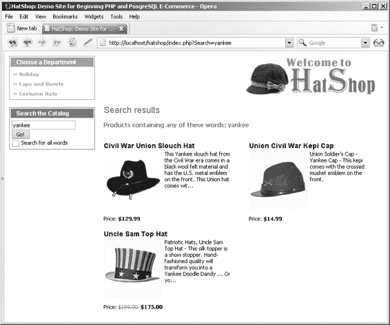

# 练习：创建组件化模板 `search_box`

## 1. 在 `presentation/templates` 文件夹中新建一个名为 `search_box.tpl` 的模板文件，并向其中添加以下代码：

```
{* search_box.tpl *}
{load_search_box assign="search_box"}
{* 搜索框开始 *}
<div class="left_box" id="search_box">
<p>搜索目录</p>
<form action={"index.php"|prepare_link:"http"}>
<input maxlength="100" id="Search" name="Search"
value="{$search_box->mSearchString}" size="23" />
<input type="submit" value="搜索!" /><br />
<input type="checkbox" id="AllWords" name="AllWords"
{if $search_box->mAllWords == "on" } checked="checked" {/if}/> 搜索所有单词
</form>
</div>
{* 搜索框结束 *}
```

## 2. 在 `presentation/smarty_plugins` 文件夹中新建一个名为 `function.load_search_box.php` 的 Smarty 函数插件文件，并包含以下代码：

```
<?php
// 插件文件中的插件函数必须命名为：smarty_type_name
function smarty_function_load_search_box($params, $smarty)
{
  // 创建 SearchBox 对象
  $search_box = new SearchBox();
  // 分配模板变量
  $smarty->assign($params['assign'], $search_box);
}

// 管理搜索框
class SearchBox
{
  // Smarty 模板的公共变量
  public $mSearchString = '';
  public $mAllWords = 'off';

  // 类构造函数
  public function __construct()
  {
    if (isset ($_GET['Search']))
      $this->mSearchString = $_GET['Search'];

    if (isset ($_GET['AllWords']))
      $this->mAllWords = $_GET['AllWords'];
  }
}
?>
```

## 3. 将 `search_box` 模板文件所需的以下样式添加到 `hatshop.css` 文件中：

```
#search_box
{
  border: 1px solid #0583b5;
}
#search_box p
{
  background: #0583b5;
}
form
{
  margin: 2px;
}
input
{
  font-family: tahoma, verdana, arial;
  font-size: 11px;
}
```

## 4. 修改 `index.tpl` 文件以加载新创建的模板文件：

```
...
{include file="departments_list.tpl"}
{include file="$categoriesCell"}
{include file="search_box.tpl"}
...
```

## 5. 在浏览器中加载你的项目，你会看到搜索框完美地放置在它该在的位置（参见图 5-1）。

## 工作原理：组件化模板 `search_box`

到目前为止，你应该已经熟悉了我们如何将函数插件与 Smarty 模板结合使用。在本例中，我们使用插件来维护执行搜索后搜索框的状态。当点击“搜索！”按钮重新加载页面时，我们希望保留文本框中输入的字符串，同时保持 `AllWords` 复选框的状态。

`load_search_box` 函数插件只是保存了 `Search` 和 `AllWords` 查询字符串参数的值，同时检查这些参数是否确实存在于查询字符串中。这些值随后在 `search_box.tpl` Smarty 模板中被用于恢复之前的状态。

请注意，我们本可以通过使用 `$smarty.get.Search` 和 `$smarty.get.AllWords` 读取 `Search` 和 `AllWords` 查询字符串参数的值来实现此功能，而无需使用插件。然而，使用插件能让你更好地控制整个流程，并且还能避免在提及的参数不存在于查询字符串中时生成警告。

## 显示搜索结果

在下一个练习中，你将创建用于显示搜索结果的组件化模板。

为了简化工作，你可以重用 `product_list` 组件化模板来显示实际的产品列表。这正是我们迄今为止用于主页、部门和类别产品列表的组件化模板。当然，如果你希望以其他格式显示搜索结果，则必须创建另一个用户控件。

你需要修改产品列表（`products_list.php`）的 `templates-logic` 文件，使其能够识别何时被调用以显示搜索结果，从而调用业务层的正确方法来获取产品列表。

在接下来的练习中，我们来创建 `search_result` 模板，并更新 `products_list` 组件化模板的 `templates-logic` 文件。

## 练习：创建 `search_results` 组件化模板

**1.** 在 `presentation/templates` 目录中创建一个名为 `search_results.tpl` 的新模板文件，并向其中添加以下内容：

```
{* search_results.tpl *}

<p class="title">搜索结果</p>

<br />

{include file="products_list.tpl"}
```

**2.** 修改 `presentation/smarty_plugins/function.load_products_list.php` 文件，在 `ProductList` 类的构造方法（`__construct`）末尾添加以下代码行：

```
// 从查询字符串中获取搜索详细信息
if (isset ($_GET['Search']))
    $this->mSearchString = $_GET['Search'];

// 从查询字符串中获取 AllWords 参数
if (isset ($_GET['AllWords']))
    $this->mAllWords = $_GET['AllWords'];
```

**3.** 在位于同一文件中的 `ProductsList` 类中，添加 `$mSearchResultsTitle`、`$mSearch`、`$mAllWords` 和 `$mSearchString` 成员：

```
class ProductsList
{
    // 可供 Smarty 模板读取的公共变量
    public $mProducts;
    public $mPageNo;
    public $mrHowManyPages;
    public $mNextLink;
    public $mPreviousLink;
    public $mSearchResultsTitle;
    public $mSearch = '';
    public $mAllWords = 'off';
    public $mSearchString;

    // 私有成员
    private $_mDepartmentId;
    private $_mCategoryId;
```

**4.** 将 `ProductsList` 类中的 `init` 方法修改如下：

# 第 5 章 搜索目录

## 工作原理：可搜索的产品目录

恭喜，你现在拥有一个可搜索的产品目录了！虽然编写了不少代码，但代码本身并不复杂，对吧？

因为你大量使用了现有的代码，并在已有的架构基础上添加了部分功能，所以整个过程没有出现意外。产品列表依然由你之前构建的 `products_list` 模板来显示，该模板现已更新，能够识别查询字符串中的搜索元素。在这种情况下，它会使用业务层的 `Search` 方法获取供访客查看的产品列表。

业务层的 `Search` 方法返回一个 `SearchResults` 对象，该对象除了包含返回的产品列表外，还包含用于搜索的词语列表以及被忽略的词语列表（即长度小于预定义字符数的词语）。这些详细信息会展示给访客。

## 总结

在本章中，你利用 PostgreSQL 的全文搜索功能实现了 HatShop 的搜索功能。该搜索机制与现有的网站结构以及第 4 章中构建的分页功能实现了很好的集成。本章学到的、最有趣的新知识点是关于如何使用 PostgreSQL 执行全文搜索。这也是业务层首次拥有独立功能，而不仅仅是简单地在数据层和表示层之间传递数据。

在第 6 章中，你将学习如何使用 PayPal 销售产品。

# 第 6 章 使用 PayPal 收款

让我们开始赚钱吧！你的电子商务网站需要一个向客户收款的方式。对于成熟企业而言，首选的解决方案是开设商户账户，但许多小企业会选择更易于实现的方案，这样他们就不必自己处理信用卡或支付信息。

许多公司和网站可以帮助那些没有资源处理信用卡和电汇交易的个人或小企业。这些公司可以用来作为在线商家与其客户之间的支付中介。许多此类支付处理公司相对较新，处理个人财务信息也非常敏感。此外，快速在互联网上搜索，就会发现几乎所有这类公司都既有满意的客户报告，也有不满意的客户报告。基于这些原因，我们不推荐任何特定的第三方公司。

相反，本章会列出目前提供这些服务的一些公司，然后通过 PayPal 演示它们提供的部分功能。你将学习如何在开发的前两个阶段将 PayPal 集成到 HatShop 中。在本章中，你将：

- 学习如何创建一个新的 PayPal 网站支付标准版账户。
- 学习如何在开发的第 1 阶段集成 PayPal，在此阶段你需要购物车和自定义结账机制。
- 学习如何在开发的第 2 阶段集成 PayPal，在此阶段你已拥有自己的购物车，因此你需要直接引导访客进入支付页面。

## 代码示例

```php
public function init()
{
    /* 如果正在搜索目录，则通过调用业务层的 Search 方法获取产品列表 */
    if (isset ($this->mSearchString))
    {
        // 获取搜索结果
        $search_results = Catalog::Search($this->mSearchString,
                                          $this->mAllWords,
                                          $this->mPageNo,
                                          $this->mrHowManyPages);

        // 获取产品列表
        $this->mProducts = $search_results['products'];

        // 构建产品列表的标题
        if (count($search_results['accepted_words']) > 0)
            $this->mSearchResultsTitle =
                '包含<font class="words">'
                . ($this->mAllWords == 'on' ? '所有' : '任意') . '</font>'
                . '这些词语的产品：<font class="words">'
                . implode(', ', $search_results['accepted_words']) .
                '</font><br />';

        if (count($search_results['ignored_words']) > 0)
            $this->mSearchResultsTitle .=
                '被忽略的词语：<font class="words">'
                . implode(', ', $search_results['ignored_words']) .
                '</font><br />';

        if (!(count($search_results['products']) > 0))
            $this->mSearchResultsTitle .=
                '您的搜索未产生任何结果。<br />';
    }

    /* 如果正在浏览分类，则通过调用业务层的 GetProductsInCategory 方法获取产品列表 */
    elseif (isset ($this->_mCategoryId))
        $this->mProducts = Catalog::GetProductsInCategory(
            $this->mCategoryId, $this->mPageNo, $this->mrHowManyPages);
    ...
}
```

**5.** 在 `presentation/templates/products_list.tpl` 文件的开头、`load_products_list` 代码行下方，添加以下代码行：

```smarty
{* products_list.tpl *}
{load_products_list assign="products_list"}
{if $products_list->mSearchResultsTitle != ""}
    <p class="description">{$products_list->mSearchResultsTitle}</p>
{/if}
```

**6.** 修改 `index.php` 文件，当执行搜索时加载 `search_results` 组件化模板，添加以下代码行：

```php
...
// 如果正在浏览部门，则加载部门详细信息
if (isset ($_GET['DepartmentID']))
{
    $pageContentsCell = 'department.tpl';
    $categoriesCell = 'categories_list.tpl';
}
// 如果正在搜索目录，则加载搜索结果页面
if (isset ($_GET['Search']))
    $pageContentsCell = 'search_results.tpl';

// 加载产品详情页面（如果正在访问产品）
if (isset ($_GET['ProductID']))
    $pageContentsCell = 'product.tpl';
```

**7.** 将以下样式添加到 `hatshop.css` 文件中：

```css
.words
{
    color: #ff0000;
}
```

**8.** 在你常用的浏览器中加载项目，并输入 `yankee`，以获得类似图 5-3 的输出结果。



**图 5-3.** HatShop 搜索结果页示例