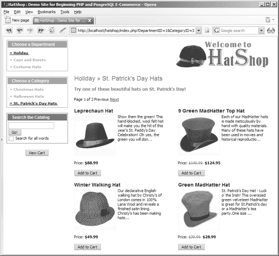

# 了解互联网支付服务提供商

## 关于互联网支付服务提供商

来看看这份互联网支付服务提供商的网站列表。这些公司类型多样，各有优势。有些提供商支持个人对个人转账，且付款需手动验证；另一些则能与你自己的网站实现复杂集成。

有些服务在全球范围内可用，而另一些仅限单一国家使用。

以下列表并不完整。你可以在谷歌上搜索“Internet Payment Service Providers”找到更多同类公司。

- **2Checkout:** http://www.2checkout.com
- **AnyPay:** http://www.anypay.com
- **CCNow:** http://www.ccnow.com
- **Electronic Transfer:** http://www.electronictransfer.com
- **Moneybookers:** http://www.moneybookers.com
- **MultiCards:** http://www.multicards.com
- **Pay By Web:** http://www.paybyweb.com
- **Paymate:** https://www.paymate.com.au
- **PayPal:** http://www.paypal.com
- **PaySystems:** http://www.paysystems.com
- **ProPay:** http://www.propay.com
- **QuickPayPro:** http://www.quickpaypro.com
- **WorldPay:** http://www.worldpay.com

除了广受欢迎之外，PayPal 提供的服务非常适合我们在前两个开发阶段使用。PayPal 在多个国家/地区可用——最新的列表请访问 http://www.paypal.com。

在第一个开发阶段（当前阶段）——你只有一个可搜索的产品目录——只需添加几行 HTML 代码，PayPal 就能让你实现带结账功能的购物车。在第二个开发阶段，你将实现自己的购物车，而 PayPal 的“单品购买”功能可以直接将访客引导至付款页面，无需经过中间购物车。

我们将在第 9 章使用 PayPal 的这个功能。

如需了解 PayPal 提供的功能概览，请将浏览器指向 http://www.paypal.com，并点击“Merchant Tools”链接。该页面还包含其他一些有用链接，可展示 PayPal 的主要功能。

## PayPal 入门

或许对其服务的最佳描述来自其网站：“PayPal 是一个基于账户的系统，任何拥有电子邮件地址的人都可以通过信用卡或银行账户安全地发送和接收在线付款。”

访客不是直接向商家付款，而是使用信用卡或银行账户向 PayPal 付款。然后，商家使用其 PayPal 账户从客户处收款。截至撰写本文时，创建新的 PayPal 账户无需任何费用，且对买家免费。接收付款时产生的费用详见 http://www.paypal.com/cgi-bin/webscr?cmd=_display-fees-outside。

> **注** 本章并非 PayPal 手册，而是使用 PayPal 的快速指南。关于所提供服务的任何复杂问题，请访问 PayPal (http://www.paypal.com) 或你决定使用的互联网支付服务提供商。你也可以购买能简化与这些系统交互的组件，或使用免费的组件，例如 ComponentOne 公司为 ASP.NET 提供的 ComponentOne PayPal eCommerce (http://www.componentone.com)。

### PayPal 链接与资源

当本章内容不足以满足需求时，请查看以下资源：

- **网站支付标准集成指南：** 包含此前分散在单独手册（如购物车手册和即时付款通知手册）中的信息。获取地址：https://www.paypal.com/en_US/pdf/PP_WebsitePaymentsStandard_IntegrationGuide.pdf。
- **PayPal 开发者网络：** PayPal 开发者的官方资源，可通过 https://www.paypal.com/pdn 访问。
- **PayPalDev：** 据该网站称，这是一个面向 PayPal 开发者的独立论坛。访问地址：http://www.paypaldev.org/。你还可以找到众多链接，指向各种 PayPal 资源。

在接下来的练习中，你将创建一个新的 PayPal 账户，然后将其与 HatShop 集成。（创建 PayPal 账户的步骤在前述的 PayPal 手册中也有更详细的描述。）

### 练习：创建 PayPal 账户

按照以下步骤创建你的 PayPal 账户：

1. 使用你常用的浏览器访问 http://www.paypal.com。
2. 点击“Sign Up”（注册）链接。
3. PayPal 支持三种账户类型：个人、高级和企业。要接收信用卡付款，你需要开设高级或企业账户。从组合框中选择你的国家，然后点击“Continue”（继续）。
4. 填写所有要求的信息，之后你将收到一封电子邮件，要求你重新访问 PayPal 网站以确认你输入的信息。

### 工作原理：PayPal 账户

PayPal 账户设置完成后，你提供的电子邮件地址将成为你的 PayPal ID。

PayPal 服务提供了大量功能——由于网站易于使用且许多功能不言自明，此处不再赘述。请记住，这些网站是为你的业务服务的，因此他们非常乐意为您解答任何疑问。

现在，让我们看看如何将新账户实际用于网站。

## 集成 PayPal 购物车与结账

在第一个开发阶段（当前阶段），你需要集成 PayPal 的购物车和结账功能。在第二个开发阶段，当你创建了自己的购物车后，只需依赖 PayPal 的结账机制即可。

要接收付款，你需要在网站用户界面部分添加两个重要元素：每个产品的“添加到购物车”按钮，以及页面某处的“查看购物车”按钮。

PayPal 让添加这些按钮变得轻而易举。

这些按钮的功能通过指向 PayPal 网站的安全链接实现。例如，以下表单表示一个名为“Black Puritan Hat”、售价 74.99 美元的产品的“添加到购物车”按钮：

```html
<form target="paypal" action="https://www.paypal.com/cgi-bin/webscr"
method="post">
<input type="hidden" name="cmd" value="_cart" />
<input type="hidden" name="business" value="youremail@example.com" />
<input type="hidden" name="item_name" value="Black Puritan Hat" />
<input type="hidden" name="amount" value="74.99" />
<input type="hidden" name="currency" value="USD" />
<input type="hidden" name="add" value="1" />
<input type="hidden" name="return" value="www.example.com" />
<input type="hidden" name="cancel_return" value="www.example.com" />
<input type="submit" name="submit" value="Add to Cart" />
</form>
```

这些字段是预定义的，其名称不言自明。最重要的是 `business` 字段，它必须是你注册 PayPal 账户时使用的电子邮件地址（即接收付款的邮箱）。更多详情请查阅 PayPal 的网站支付标准集成指南。

> **提示** 虽然我们不会在我们的网站上使用它们，但了解一下还是有好处的：PayPal 可以根据你提供的某些数据（产品名称、产品价格）生成按钮，并给出与前面示例类似的 HTML 代码块。点击首页底部的“Developers”链接，然后点击左侧菜单中的“PayPal Solutions”即可找到按钮生成器。


您需要确保此 HTML 代码被添加到每个产品中，这样每个产品都会有一个“添加到购物车”按钮。为此，您必须修改`products_list.tpl`文件。接着，您需要在`index.tpl`中添加一个“查看购物车”按钮，以便访客随时可以访问它。

“查看购物车”按钮可以使用类似的结构生成。另一种生成“添加到购物车”和“查看购物车”链接的方法是使用如下链接，而不是之前展示的表单：

`https://www.paypal.com/cgi-bin/webscr?cmd=_cart&business=your_email_address& item_name=Black Puritan Hat&amount=74.99&amount=74.99&currency=USD&add=1& return=www.example.com&cancel_return=www.example.com`

[www.it-ebooks.info](http://www.it-ebooks.info/)



`648XCH06.qxd` `10/31/06` `10:06 PM` Page 193

第 6 章 ■ 使用 PayPal 接收付款

**193**

■**警告** 是的，制造一个“添加到购物车”链接就是这么简单！这种简单性的缺点是它可能被用于对您不利的用途。在 PayPal 确认付款后，您可以将产品运送给客户。每次付款时，您都需要仔细检查产品价格是否对应正确的金额，因为任何人都很容易向购物车添加一个虚假产品，或添加一个价格被修改的现有产品。这可以通过伪造一个 PayPal“添加到购物车”链接并导航到它来实现。您可以在`http://www.alphabetware.com/pptamper.asp`阅读关于此问题的详细文章。

添加“添加到购物车”和“查看购物车”按钮后，网站将如图 6-1 所示。

**图 6-1.** *HatShop 带有* 添加到购物车 *和* 查看购物车 *按钮*

您将在下一个练习中实施 PayPal 集成。

[www.it-ebooks.info](http://www.it-ebooks.info/)

`648XCH06.qxd` `10/31/06` `10:06 PM` Page 194

**194**

第 6 章 ■ 使用 PayPal 接收付款

**练习：集成 PayPal 购物车与自定义结账**

**1.** 打开`index.tpl`，并在`<head>`元素内添加`OpenPayPalWindow` JavaScript 函数，如以下代码清单所示。此函数用于在访客点击“添加到购物车”按钮时打开 PayPal 购物车窗口。

```
<head>
<title>{#site_title#}</title>
<link href="hatshop.css" type="text/css" rel="stylesheet" />
{literal}
<script language="JavaScript" type="text/javascript">
</script>
{/literal}
</head>
```

■**注意** 您放置在 Smarty 模板中的任何 JavaScript 代码都应包含在`{literal}`和`{/literal}`元素之间，因为 JavaScript 代码使用了{和}字符，而这些是 Smarty 的默认分隔符。这样，Smarty 将不会解析您的 JavaScript 代码。

**2.** 现在，将“查看购物车”按钮添加到主页，放置在搜索框下方。修改`index.tpl`如下：

```
{include file="departments_list.tpl"}
{include file="$categoriesCell"}
{include file="search_box.tpl"}
<div class="left_box" id="view_cart">
<input type="button" name="view_cart" value="View Cart"
onclick="JavaScript:OpenPayPalWindow(
"https://www.paypal.com/cgi-bin/webscr?cmd=_cart
&business=youremail@example.com
&display=1&return=www.example.com
&cancel_return=www.example.com")" />
</div>
{include file="header.tpl"}
<div id="content">
{include file="$pageContentsCell"}
</div>
```

■**警告** 您必须在 HTML 源文件中将`OpenPayPalWindow`调用写在同一行。为了便于阅读，我们在代码片段中将其分成多行。

**3.** 将以下样式代码添加到`hatshop.css`：

```
#view_cart
{
text-align: center;
}
```

**4.** 在`presentation/templates/products_list.tpl`中，产品价格下方添加 PayPal“添加到购物车”按钮：

```
<br /><br />
<input type="button" name="add_to_cart" value="Add to Cart"
onclick="{$products_list->mProducts[k].paypal}" />
</p>
```


## 步骤 5

在`presentation/smarty_plugins/function.load_products_list.php`中的`init()`方法末尾，添加创建 PayPal 添加到购物车链接代码：

```
for ($i = 0; $i < count($this->mProducts); $i++)
{
  $this->mProducts[$i]['link'] =
    $url . $this->mProducts[$i]['product_id'];

  // 创建 PayPal 链接
  $this->mProducts[$i]['paypal'] =
    'JavaScript:OpenPayPalWindow("' .
    'https://www.paypal.com/cgi-bin/webscr?' .
    'cmd=_cart&business=youremail@example.com' .
    '&item_name=' . rawurlencode($this->mProducts[$i]['name']) .
    '&amount=' .
    (($this->mProducts[$i]['discounted_price'] == 0) ?
      $this->mProducts[$i]['price'] :
      $this->mProducts[$i]['discounted_price']) .
    '&currency=USD&add=1&return=www.example.com' .
    '&cancel_return=www.example.com")';
}
```

## 步骤 6

确保将`youremail@example.com`替换为你创建 PayPal 账户时提交的电子邮件地址，此替换适用于添加到购物车和查看购物车按钮！此外，将两个`www.example.com`实例替换为你电子商务商店的地址。或者，如果你不希望 PayPal 在客户完成或取消支付后重定向到你的网站，可以删除`return`和`cancel_return`变量。

> **Caution:** 如果你希望资金存入你的账户，必须使用正确的电子邮件地址！

## 步骤 7

在浏览器中加载`index.php`页面，并点击某个添加到购物车按钮。你应该会看到 PayPal 购物车，如图 6-2 所示。

**Figure 6-2.** *集成 PayPal 购物车*

尝试操作 PayPal 购物车，确保其正常工作。

---

**工作原理：PayPal 集成**

是的，就这么简单。现在，所有访客都成为了潜在客户！他们可以点击 PayPal 购物车的结账按钮，然后购买产品！

在构建 PayPal 调用时，我们使用 Smarty 的转义功能，以确保产品名称在包含不可移植字符（如`&`、空格等）时格式正确。有关`escape`方法的更多详情，请访问：`http://smarty.php.net/manual/en/language.modifier.escape.php`。

客户在网站上完成支付后，一封电子邮件通知会发送到 PayPal 注册的邮箱以及客户邮箱。你的 PayPal 账户将反映该笔支付，你可以在账户历史或历史交易日志中查看交易信息。

PayPal 确认支付后，你可以将产品发货给客户。

如果你决定在自己的网站上使用 PayPal，请务必了解其所有功能。例如，你可以让 PayPal 自动计算每笔订单的运费和税费。

---

## 使用 PayPal 单品购买功能

单品购买是 PayPal 的一项功能，允许你将访客直接引导至支付页面，而非 PayPal 购物车。在第 8 章中，你将创建自己的购物车，届时 PayPal 购物车将不再适用。

在第 9 章中，你将在购物车中实现“下单”按钮，将订单保存到数据库并跳转到 PayPal 支付页面。要调用 PayPal 支付页面（绕过 PayPal 购物车），你需要重定向到如下链接：

`https://www.paypal.com/xclick/business=youremail@example.com&item_name=Order 123 &item_number=123&amount=123&currency=USD&return=www.example.com &cancel_return=www.example.com`

请参阅 PayPal 网站支付标准集成指南，了解有关该服务的更多详细信息。


■**提示** 您将在开发的第三阶段（从第 12 章开始）创建自己完整的订单处理系统，届时将处理信用卡交易。

当您在第九章实现 PayPal 单次购买功能时，将使用如下代码片段来创建 PayPal 单次购买页面的 URL：

```php
// 计算购物车总金额

$this->mTotalAmount = ShoppingCart::GetTotalAmount();
```

[www.it-ebooks.info](http://www.it-ebooks.info/)

648XCH06.qxd 10/31/06 10:06 PM 第 198 页

**198**  
第 6 章 ■ 使用 PayPal 接收付款

```php
// 如果点击了“下单”按钮...

if(isset ($_POST['place_order']))
{
    // 创建订单并获取订单 ID

    $order_id = ShoppingCart::CreateOrder();

    // 此处将包含 PayPal 链接

    $redirect =
    'https://www.paypal.com/xclick/business=youremail@example.com' .
    '&item_name=HatShop 订单 ' . $order_id .
    '&item_number=' . $order_id .
    '&amount=' . $this->mTotalAmount .
    '&currency=USD&return=www.example.com' .
    '&cancel_return=www.example.com';

    // 重定向至支付页面

    header('Location: ' . $redirect);
    exit;
}
```

您将在第 9 章学习如何使用此功能。

## 本章小结

在本章中，您了解了如何将 PayPal 集成到电子商务网站中——这是许多小企业选择的简单支付解决方案，这样他们就不必自行处理信用卡或支付信息。

首先，我们列出了一些 PayPal 的替代方案，然后引导您创建新的 PayPal 账户。接着我们介绍了如何在开发的第一和第二阶段集成 PayPal，首先讨论了购物车和自定义结账机制，然后介绍了如何将访问者直接引导至支付页面。

下一章，我们将继续探讨 HatShop 的目录管理页面。

[www.it-ebooks.info](http://www.it-ebooks.info/)

648XCH07a.qxd 10/25/06 10:56 PM 第 199 页

## 第七章

