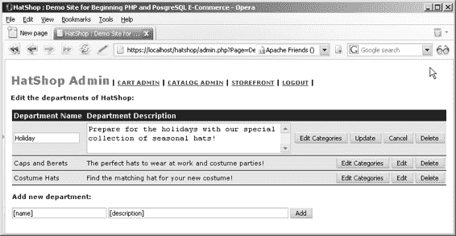
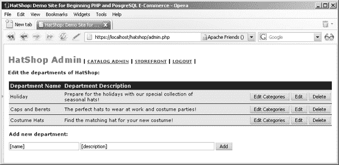
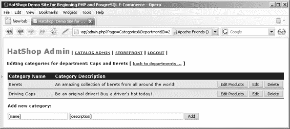

# 预览目录管理页面

虽然长长的目标列表乍看之下可能令人生畏，但实现起来却相当容易。我们已经在前面章节中介绍了大部分理论，但在本章中你仍将学到不少新内容。

创建目录管理页面的第一步是实现登录机制，该机制将通过一个如图 7-1 所示的简单登录页面来实现。

**图 7-1.** *HatShop 登录页面*

接下来，你需要通过创建以下内容来构建网站的管理部分：主页面（`admin.php`）、与之关联的 Smarty 模板（`admin.tpl`）、用于导航后续章节将开发的各个管理区的主菜单模板（`admin_menu.tpl`）、用于管理身份验证的组件化模板（`admin_login`），以及四个用于目录管理的组件化模板（`admin_departments`、`admin_categories`、`admin_products`和`admin_product`）。

登录后，管理员将看到部门列表（由从管理主页面 `admin.php` 加载的 Smarty 模板 `admin_departments` 生成），如图 7-2 所示。

你将为部门实现的功能，与后续为类别和产品实现的功能大致相同。具体来说，管理员可以：

- 点击**编辑**按钮修改部门的名称或描述。

- 点击**编辑类别**按钮编辑特定部门下的类别。

- 点击**删除**按钮从数据库中完全移除某个部门（仅当该部门下没有关联类别时有效）。

[www.it-ebooks.info](http://www.it-ebooks.info/)

648XCH07a.qxd 10/25/06 10:56 PM Page 201

**第七章 ■ 目录管理**

**201**

**图 7-2.** *HatShop 部门管理页面*

当点击**编辑**按钮时，表格中对应的行将进入编辑模式，其字段变为可编辑状态，如图 7-3 所示。同时，你可以看到原来**编辑**按钮的位置变成了**更新**和**取消**按钮。点击**更新**将把修改内容保存到数据库，而点击**取消**则退出编辑模式。

**图 7-3.** *编辑部门信息*

[www.it-ebooks.info](http://www.it-ebooks.info/)

648XCH07a.qxd 10/25/06 10:56 PM Page 202

**202**

**第七章 ■ 目录管理**

管理员可以通过在表格下方的文本框中输入新部门的名称和描述，然后点击**添加**按钮来添加新部门。

当管理员点击**编辑类别**按钮时，`admin.php` 页面会重新加载，但查询字符串中会多出一个参数：`DepartmentID`。该参数指示 `admin.php` 加载 `admin_categories` Smarty 模板，从而允许管理员编辑属于所选部门的类别（参见图 7-4）。

**图 7-4.** *HatShop 类别管理页面*

此页面的工作方式与部门编辑页面类似。你还会看到一个链接（返回到部门...），点击后可返回部门管理页面。

部门、类别和产品管理页面之间的导航逻辑是通过查询字符串参数实现的。如图 7-4 所示，当选择一个部门后，其 ID 会被附加到查询字符串中。

你在 `index.php` 页面中已经实现了类似的功能。在那里，你通过分析查询字符串参数来决定（在运行时）加载哪个组件化模板。

关于 `admin.php` 及其模板的更多细节，我们将在你实际构建它们时再进行讨论。

现在，让我们先从处理安全机制开始。