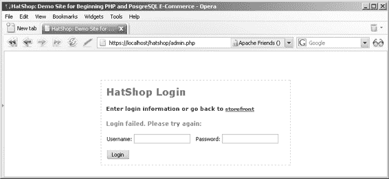

# 第 7 章 目录管理

## 练习：实现管理页面的骨架

### 1. 修改`presentation/templates/first_page_contents.tpl`文件，添加一个指向管理页面的链接：

Beginning PHP and PostgreSQL E-Commerce: From Novice to Professional!

<br /><br />

点击此处访问 **<a href="{"admin.php"|prepare_link:"https"}">管理页面</a>**。

### 2. 在`hatshop.css`中添加以下样式：

```css
.first_page_text a
{
  color: #0000ff;
  font-size: 12px;
  text-decoration: underline;
}

#admin_login_box
{
  border: dashed 1px #c9c9c9;
  display: block;
  margin: auto;
  padding: 10px;
  width: 368px;
}

.admin_title
{
  color: #228aaa;
  font-family: verdana, arial, tahoma;
  font-size: 20px;
  font-weight: bold;
  text-align: left;
}

.admin_page_text
{
  color: #000080;
  font-family: verdana, arial, tahoma;
  font-size: 11px;
  font-weight: bold;
  line-height: 12px;
}

.admin_page_text a
{
  color: #0000ff;
  text-decoration: underline;
}

.admin_error_text
{
  color: #ff0000;
  font-family: verdana, arial, tahoma;
  font-size: 12px;
  font-weight: bold;
}

.menu_text
{
  color: #000000;
  font-family: verdana, arial, tahoma;
  font-size: 11px;
  font-weight: bold;
}

.menu_text a
{
  color: #0000ff;
  text-decoration: underline;
}

table
{
  border-collapse: collapse;
  table-layout: auto;
  width: 100%;
}

th
{
  background: #00008b;
  color: #ffffff;
  font-family: verdana, arial, tahoma;
  font-size: 12px;
  font-weight: bold;
  margin: 1px;
  padding: 3px;
  text-align: left;
}

td
{
  background: #e6e6e6;
  border-bottom: solid 1px #000000;
  font-family: verdana, arial, tahoma;
  font-size: 11px;
  margin: 1px;
  padding: 3px;
}

select
{
  font-family: tahoma, verdana, arial;
  font-size: 11px;
}
```

### 3. 修改`include/app_top.php`，在其开头添加以下两行。调用`ob_start()`——参见[`www.php.net/ob_start`](http://www.php.net/ob_start)——开启输出缓冲，这能提升性能并确保使用`header`函数（参见下一步的`admin.php`）进行页面重定向时不会产生错误。

```php
<?php
// 开启输出缓冲
ob_start();

// 激活会话
session_start();
```

### 4. 在你的站点文档根目录下，创建一个名为`admin.php`的新文件，并写入以下代码：

```php
<?php
// 加载 Smarty 库和配置文件
require_once 'include/app_top.php';

// 强制通过 HTTPS 访问页面
if (USE_SSL != 'no' and getenv('HTTPS') != 'on')
{
  header ('Location: https://' . getenv('SERVER_NAME') .
          getenv('REQUEST_URI'));
  exit();
}

// 加载 Smarty 模板文件
$page = new Page();

// 定义页面菜单的模板文件
$pageMenuCell = 'blank.tpl';

// 定义页面内容的模板文件
$pageContentsCell = 'blank.tpl';

// 如果管理员未登录，将 admin_login 模板赋值给 $pageContentsCell
if (!(isset ($_SESSION['admin_logged'])) || $_SESSION['admin_logged'] != true)
  $pageContentsCell = 'admin_login.tpl';
else
{
  // 如果管理员已登录，加载管理页面菜单
  $pageMenuCell = 'admin_menu.tpl';

  // 如果正在注销……
  if (isset ($_GET['Page']) && ($_GET['Page'] == 'Logout'))
  {
    unset($_SESSION['admin_logged']);
    header('Location: admin.php');
    exit;
  }
}

// 分配要加载的模板文件
$page->assign('pageMenuCell', $pageMenuCell);
$page->assign('pageContentsCell', $pageContentsCell);

// 显示页面
$page->display('admin.tpl');

// 加载 app_bottom，关闭数据库连接
require_once 'include/app_bottom.php';
?>
```

### 5. 创建`presentation/templates/admin.tpl`模板文件（该文件由我们刚刚创建的`admin.php`加载），并添加以下代码：

```smarty
{* smarty *}
{config_load file="site.conf"}
<!DOCTYPE html PUBLIC "-//W3C//DTD XHTML 1.1//EN"
```

```html
<html>
<head>
<title>{#site_title#}</title>
<link href="hatshop.css" type="text/css" rel="stylesheet" />
</head>
<body>
<div>
<br />
{include file="$pageMenuCell"}
</div>
<div>
{include file="$pageContentsCell"}
</div>
</body>
</html>
```

### 6. 在`include/config.php`末尾添加管理员登录信息：

```php
// 管理员登录信息
define('ADMIN_USERNAME', 'hatshopadmin');
define('ADMIN_PASSWORD', 'hatshopadmin');
```

[www.it-ebooks.info](http://www.it-ebooks.info/)

648XCH07a.qxd 10/25/06 10:56 PM 第 212 页

**212** 第 7 章 ■ 目录管理

■**注意** 如前所述，在第 11 章中，你将学习哈希技术以及如何处理存储在数据库中的哈希密码。如果你现在想使用哈希，则需要在配置文件中存储密码的哈希值，而不是以明文形式存储密码（本例中的`hatshopadmin`）。登录时，将用户输入字符串的哈希值与配置文件中保存的哈希值进行比较。你可以通过将字符串传递给`sha1`函数来计算其哈希值（`sha1`函数使用 SHA-1 算法计算哈希值）。如果现在听起来太复杂，不必担心，第 11 章将更详细地展示这一过程。

### 7. 现在我们将创建`admin_login`组件化模板来管理登录过程。首先创建`presentation/templates/admin_login.tpl`文件，然后添加以下代码：

```markdown
# 8. 在 `presentation/smarty_plugins` 文件夹中创建一个新的 Smarty 函数插件文件，命名为 `function.load_admin_login.php`，内容如下：

```php
<?php
/* 当从模板加载 load_admin_login 函数插件时
   调用的 Smarty 插件函数 */

function smarty_function_load_admin_login($params, $smarty)
{
  // 创建 AdminLogin 对象
  $admin_login = new AdminLogin();

  // 分配模板变量
  $smarty->assign($params['assign'], $admin_login);
}

// 处理管理员身份验证的类
class AdminLogin
{
  // Smarty 模板中可用的公共变量
  public $mUsername;
  public $mLoginMessage = '';

  // 类构造函数
  public function __construct()
  {
    // 验证是否提供了正确的用户名和密码
    if (isset ($_POST['submit']))
    {
      if ($_POST['username'] == ADMIN_USERNAME
          && $_POST['password'] == ADMIN_PASSWORD)
      {
        $_SESSION['admin_logged'] = true;
        header('Location: admin.php');
        exit;
      }
      else
        $this->mLoginMessage = '登录失败，请重试：';
    }
  }
}
?>
```

# 9. 创建 `presentation/templates/admin_menu.tpl` 文件，并添加以下代码：

```smarty
{* admin_menu.tpl *}
<span class="admin_title">HatShop 管理</span>
<span class="menu_text"> |
  <a href="{"admin.php"|prepare_link:"https"}">目录管理</a> |
  <a href="{"index.php"|prepare_link:"http"}">商店前台</a> |
  <a href="{"admin.php?Page=Logout"|prepare_link:"https"}">退出登录</a> |
</span>
<br />
```

# 10. 在你喜欢的浏览器中加载 `index.php`，将在欢迎消息中看到管理页面链接。点击该链接，将显示一个 HTML 登录表单；图 7-8 显示了输入错误密码时你会看到的消息。

[www.it-ebooks.info](http://www.it-ebooks.info/)



648XCH07a.qxd 10/25/06 10:56 PM Page 214

**214** 第 7 章 ■ 目录管理

**图 7-8.** *登录页面*

输入正确的登录信息（`hatshopadmin/hatshopadmin`）后，您将被重定向到目录管理页面。目前，目录管理页面仅包含主菜单，但我们将立即对此进行更改。

## 工作原理：管理页面

到目前为止，您已经创建了 `admin.php` 文件，并在本章后续部分继续开发该文件，以允许用户管理目录数据；同时创建了 `admin_login` 组件化模板，其中包含管理员身份验证和授权功能。

所有有趣的工作从 `admin.php` 开始，该文件通过检查 `admin_logged` 会话变量是否为 `true` 来判断访问者是否已通过管理员身份验证。如果访问者未以管理员身份登录，则会加载 `admin_login` 组件化模板：

```
// 如果管理员未登录，则将 admin_login 模板赋值给 $pageContentsCell
if (!(isset ($_SESSION['admin_logged'])) || $_SESSION['admin_logged'] != true)
    $pageContentsCell = 'admin_login.tpl';
```

在 `AdminLogin` 助手类中，登录机制将当前身份验证状态存储在访问者会话的 `admin_logged` 变量中。在 `__construct` 函数中，我们测试提供的用户名和密码是否与 `config.php` 中存储的 `ADMIN_USERNAME` 和 `ADMIN_PASSWORD` 值匹配；如果匹配，则将 `admin_logged` 的值设置为 `true`，并重定向到 `admin.php`：

```
// 验证是否提供了正确的用户名和密码
if (isset ($_POST['submit']))
{
    if ($_POST['username'] == ADMIN_USERNAME
        && $_POST['password'] == ADMIN_PASSWORD)
    {
        $_SESSION['admin_logged'] = true;
        header('Location: admin.php');
        exit;
    }
    else
        $this->mLoginMessage = '登录失败，请重试：';
}
```

`admin_menu.tpl` 中的注销链接仅仅是在 `admin.php` 中取消设置 `admin_logged` 会话变量，并将管理员重定向到 `index.php`。这样一来，下次尝试访问管理页面时，管理员将被重定向到登录页面。

```
// 如果正在注销……
if (isset ($_GET['Page']) && ($_GET['Page'] == 'Logout'))
{
    unset($_SESSION['admin_logged']);
    header('Location: admin.php');
    exit;
}
```

## 管理部门

部门管理部分允许客户端添加、删除或更改部门信息。要实现此功能，您需要编写表示层、业务层和数据层的必要代码。

关于 *n* 层应用程序的一个基本事实（同样适用于本案例）是：业务层和数据层的最终目的是支持表示层。先在纸上绘制并确定网站的期望外观（即 UI 需要支持哪些功能），这能很好地指示数据库和业务层应包含的内容。

通过合理的设计工作，您可以确切知道每个层中应放置什么内容，因此编写代码的顺序并不重要。当设计明确确立后，一个程序员团队可以同时工作并并行实现三个层，这也是分层架构的优势之一。

然而，除了那些确实需要非常谨慎设计和规划的大型项目外，这在实际中很少发生。在我们的案例中，通常最佳方式是从底层（数据库和数据对象）开始，在创建 UI 之前先打好基础。

为此，首先需要分析 UI 需要哪些功能；否则，您将不知道在数据层和业务层中编写什么内容。
```