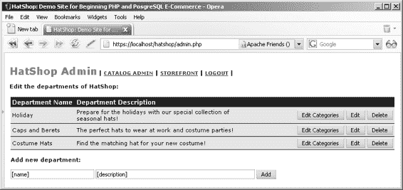

# 本章要点

在本章中，我们将始终从表示层开始。之所以可以这样做，是因为你现在对整个架构已经有了清晰的认识，并且预先知道如何实现其他两个层。这种认知十分必要，因为在表示层中，你会调用业务层的方法（虽然它尚未创建），而在业务层中，你又会调用数据层的方法（它同样尚未创建）。如果你对其他层的实现方式没有明确思路，那么从长远来看，从表示层入手将会变得更加棘手。



第七章 ■ 目录管理

由于你已经拥有一个可用的架构，因此为每一层按需编写组件将变得简单。当然，如果必须实现某些全新或更复杂的功能，我们可能会花些时间分析其全部影响，但在这里，你所要做的事情并不会比前面章节中的代码更复杂。对于本章中将要构建的所有组件化模板，你将运用相同的技巧。

## 实现表示层

再来看看 `admin_departments` 组件化模板在运行时的效果（见图 7-9）。

**图 7-9.** `admin_departments` 组件化模板运行时的效果

这个组件化模板会生成一个列表，其中填充了部门信息，并且还包含一个标签、两个文本框以及一个用于向列表中添加新部门的按钮。

当你点击某个部门的“编辑”按钮时，该部门的名称和描述将变为可编辑状态，同时“更新”和“取消”按钮会代替“编辑”按钮出现，如之前图 7-3 所示。

### 练习：实现 `admin_departments` 组件化模板

1.  在 `presentation/templates` 文件夹中创建一个名为 `admin_departments.tpl` 的新模板文件，并向其中添加以下代码：

    ```
    {* admin_departments.tpl *}

    {load_admin_departments assign="admin_departments"}

    <span class="admin_page_text">编辑 HatShop 的部门：</span>

    <br /><br />

    {if $admin_departments->mErrorMessage neq ""}
    <span class="admin_error_text">
    {$admin_departments->mErrorMessage}<br /><br />

    </span>
    {/if}

    <form method="post"
          action="{$admin_departments->mAdminDepartmentsTarget|prepare_link:"https"}">

    {if $admin_departments->mDepartmentsCount eq 0}
    <strong>您的数据库中没有部门！</strong><br />
    {else}
    <table>
    <tr>
      <th>部门名称</th>
      <th>部门描述</th>
      <th> </th>
    </tr>
    {section name=cDepartments loop=$admin_departments->mDepartments}
    {if $admin_departments->mEditItem ==
         $admin_departments->mDepartments[cDepartments].department_id}
    <tr>
      <td width="122">
        <input type="text" name="name"
               value="{$admin_departments->mDepartments[cDepartments].name}" />
      </td>
      <td>
        {strip}
        <textarea name="description" rows="3" cols="42">
          {$admin_departments->mDepartments[cDepartments].description}
        </textarea>
        {/strip}
      </td>
      <td align="right" width="280">
        <input type="submit"
               name="submit_edit_categ_{
                     $admin_departments->mDepartments[cDepartments].department_id}"
               value="编辑分类" />
        <input type="submit"
               name="submit_update_dep_{
                     $admin_departments->mDepartments[cDepartments].department_id}"
               value="更新" />
        <input type="submit" name="cancel" value="取消" />
        <input type="submit"
               name="submit_delete_dep_{
                     $admin_departments->mDepartments[cDepartments].department_id}"
               value="删除" />
      </td>
    </tr>
    {else}
    <tr>
      <td width="122">
        {$admin_departments->mDepartments[cDepartments].name}
      </td>
      <td>{$admin_departments->mDepartments[cDepartments].description}</td>
      <td align="right" width="280">
        <input type="submit"
    ```

```html
<pre><code>name="submit_edit_categ_{
$admin_departments->mDepartments[cDepartments].department_id}"
value="编辑类别" />

&lt;input type="submit"
name="submit_edit_dep_{
$admin_departments->mDepartments[cDepartments].department_id}"
value="编辑" />

&lt;input type="submit"
name="submit_delete_dep_{
$admin_departments->mDepartments[cDepartments].department_id}"
value="删除" />
</td>
</tr>
{/if}
{/section}
</table>
{/if}

<br />

&lt;span class="admin_page_text"&gt;添加新部门：&lt;/span&gt;
<br /><br />

&lt;input type="text" name="department_name" value="[name]" size="30" /&gt;
&lt;input type="text" name="department_description" value="[description]"
size="60" /&gt;

&lt;input type="submit" name="submit_add_dep_0" value="添加" /&gt;
</form>
</code></pre>

<ol start="2">
<li>在`presentation/smarty_plugins`文件夹中创建一个名为`function.load_admin_departments.php`的新插件文件，并添加以下内容：</li>
</ol>

```php
<?php

/* Smarty 插件函数，当从模板加载 load_admin_departments 函数插件时调用 */

function smarty_function_load_admin_departments($params, $smarty)

{

    // 创建 AdminDepartments 对象

    $admin_departments = new AdminDepartments();

    $admin_departments->init();

    // 分配模板变量

    $smarty->assign($params['assign'], $admin_departments);

}
```

[www.it-ebooks.info](http://www.it-ebooks.info/)

648XCH07a.qxd 10/25/06 10:56 PM Page 219

第 7 章 ■ 目录管理

**219**

```php
// 支持部门管理功能的类

class AdminDepartments

{

    // 可在 Smarty 模板中使用的公共变量

    public $mDepartmentsCount;

    public $mDepartments;

    public $mErrorMessage = '';

    public $mEditItem;

    public $mAdminDepartmentsTarget = 'admin.php?Page=Departments';

    // 私有成员

    public $mAction = '';

    public $mActionedDepartmentId;

    // 类构造函数

    public function __construct()

    {

        // 解析包含已发布变量的数组

        foreach ($_POST as $key => $value)

            // 如果某个提交按钮被点击……

            if (substr($key, 0, 6) == 'submit')

            {

                /* 从提交按钮名称中获取最后一个 '_' 下划线的位置，

                   例如 strtpos('submit_edit_dep_1', '_') 返回 16 */

                $last_underscore = strrpos($key, '_');

                /* 获取提交按钮的作用范围

                   （例如从 'submit_edit_dep_1' 中提取 'edit_dep'） */

                $this->mAction = substr($key, strlen('submit_'),

                    $last_underscore - strlen('submit_'));

                /* 获取提交按钮所针对的部门 ID

                   （提交按钮名称末尾的数字），

                   例如从 'submit_edit_dep_1' 中提取 '1' */

                $this->mActionedDepartmentId = substr($key, $last_underscore + 1);

                break;

            }

    }

    public function init()

    {

        // 如果要添加新部门……

        if ($this->mAction == 'add_dep')

        {

            $department_name = $_POST['department_name'];

            $department_description = $_POST['department_description'];

            if ($department_name == null)

                $this->mErrorMessage = '需提供部门名称';

            if ($this->mErrorMessage == null)

                Catalog::AddDepartment($department_name, $department_description);

        }

        // 如果要编辑现有部门……

        if ($this->mAction == 'edit_dep')

            $this->mEditItem = $this->mActionedDepartmentId;

        // 如果要更新部门信息……

        if ($this->mAction == 'update_dep')

        {

            $department_name = $_POST['name'];

            $department_description = $_POST['description'];

            if ($department_name == null)

                $this->mErrorMessage = '需提供部门名称';

            if ($this->mErrorMessage == null)

                Catalog::UpdateDepartment($this->mActionedDepartmentId, $department_name, $department_description);

        }

        // 如果要删除部门……

        if ($this->mAction == 'delete_dep')

        {

            $status = Catalog::DeleteDepartment($this->mActionedDepartmentId);

            if ($status < 0)

                $this->mErrorMessage = '部门不为空';

        }

        // 如果要编辑部门的类别……

        if ($this->mAction == 'edit_categ')

        {
```


```php
header('Location: admin.php?Page=Categories&DepartmentID=' .
    $this->mActionedDepartmentId);
exit;
```

// 加载部门列表

```php
$this->mDepartments = Catalog::GetDepartmentsWithDescriptions();
$this->mDepartmentsCount = count($this->mDepartments);
```

[www.it-ebooks.info](http://www.it-ebooks.info/)

648XCH07a.qxd 10/25/06 10:56 PM Page 220

**220**

第 7 章 ■ 目录管理
