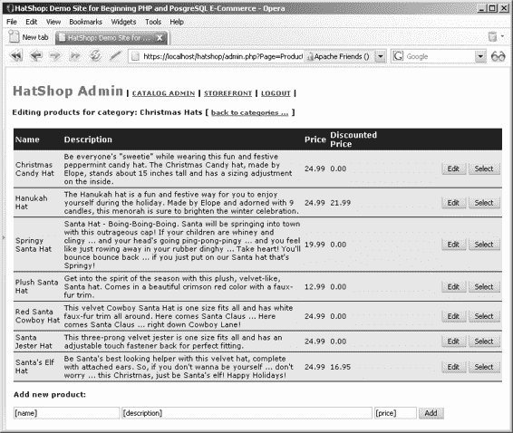
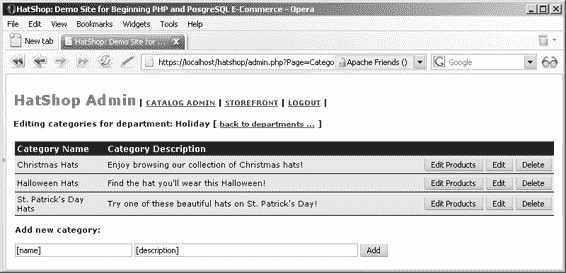

# 第 7 章 目录管理

## 223

## 练习：实现业务层

现在是实现新方法的时候了。将以下代码添加到`business/catalog.php`文件中的`Catalog`类：

```php
// Retrieves all departments with their descriptions
public static function GetDepartmentsWithDescriptions()
{
  // Build the SQL query
  $sql = 'SELECT * FROM catalog_get_departments();';
  // Prepare the statement with PDO-specific functionality
  $result = DatabaseHandler::Prepare($sql);
  return DatabaseHandler::GetAll($result);
}

// Updates department details
public static function UpdateDepartment($departmentId, $departmentName, $departmentDescription)
{
  // Build the SQL query
  $sql = 'SELECT catalog_update_department(:department_id, :department_name,
          :department_description);';
  // Build the parameters array
  $params = array (':department_id' => $departmentId,
                   ':department_name' => $departmentName,
                   ':department_description' => $departmentDescription);
  // Prepare the statement with PDO-specific functionality
  $result = DatabaseHandler::Prepare($sql);
  // Execute the query
  return DatabaseHandler::Execute($result, $params);
}

// Deletes a department
public static function DeleteDepartment($departmentId)
{
  // Build the SQL query
  $sql = 'SELECT catalog_delete_department(:department_id);';
  // Build the parameters array
  $params = array (':department_id' => $departmentId);
  // Prepare the statement with PDO-specific functionality
  $result = DatabaseHandler::Prepare($sql);
  // Execute the query and return the results
  return DatabaseHandler::GetOne($result, $params);
}
```

## 224

```php
// Add a department
public static function AddDepartment($departmentName, $departmentDescription)
{
  // Build the SQL query
  $sql = 'SELECT catalog_add_department(
          :department_name, :department_description);';
  // Build the parameters array
  $params = array (':department_name' => $departmentName,
                   ':department_description' => $departmentDescription);
  // Prepare the statement with PDO-specific functionality
  $result = DatabaseHandler::Prepare($sql);
  // Execute the query
  return DatabaseHandler::Execute($result, $params);
}
```

`AddDepartment`需要新部门的名称和描述，因为`department_id`值由数据库自动生成（`department`表中的`department_id`列是`SERIAL`列）。

## 实现数据层

你将在数据层添加四个方法，这些方法对应于你之前编写的四个业务层方法。让我们看看具体内容。

## 练习：向数据库添加数据层函数

1. 加载`pgAdmin III`，并连接到`hatshop`数据库。
2. 点击**工具** ➤ **查询工具**（或点击工具栏上的**SQL**按钮）。将出现一个新的查询窗口。
3. 使用查询工具执行以下代码，该代码在你的`hatshop`数据库中创建`catalog_get_departments`函数：

```sql
-- Create catalog_get_departments function
CREATE FUNCTION catalog_get_departments()
RETURNS SETOF department LANGUAGE plpgsql AS $$
DECLARE
  outDepartmentRow department;
BEGIN
  FOR outDepartmentRow IN
    SELECT department_id, name, description
    FROM department
    ORDER BY department_id
  LOOP
```

## 225

```sql
    RETURN NEXT outDepartmentRow;
  END LOOP;
END;
$$;
```

`catalog_get_departments`是这里要实现的最简单的函数。它返回部门的完整列表，包含其 ID、名称和描述。这与从店面填充部门列表时调用的`catalog_get_departments_list`函数几乎相似，但这个函数也返回描述，并且不需要为返回的数据创建类型，因为我们在创建`department`表时已经拥有了该类型。


#### 4. 使用查询工具执行此代码，将在你的 `hatshop` 数据库中创建 `catalog_update_department` 函数：

```sql
-- 创建 catalog_update_department 函数

CREATE FUNCTION catalog_update_department(
  INTEGER, VARCHAR(50), VARCHAR(1000))
RETURNS VOID LANGUAGE plpgsql AS $$
  DECLARE
    inDepartmentId ALIAS FOR $1;
    inName ALIAS FOR $2;
    inDescription ALIAS FOR $3;
  BEGIN
    UPDATE department
    SET name = inName, description = inDescription
    WHERE department_id = inDepartmentId;
  END;
$$;
```

`catalog_update_department` 函数使用 `UPDATE SQL` 语句更新现有部门的名称和描述。

#### 5. 使用查询工具执行此代码，将在你的 `hatshop` 数据库中创建 `catalog_delete_department` 函数：

```sql
-- 创建 catalog_delete_department 函数

CREATE FUNCTION catalog_delete_department(INTEGER)
RETURNS SMALLINT LANGUAGE plpgsql AS $$
  DECLARE
    inDepartmentId ALIAS FOR $1;
    categoryRowsCount INTEGER;
  BEGIN
    SELECT INTO categoryRowsCount
      count(*)
    FROM category
    WHERE department_id = inDepartmentId;
    IF categoryRowsCount = 0 THEN
      DELETE FROM department WHERE department_id = inDepartmentId;
      RETURN 1;
    END IF;
    RETURN -1;
  END;
$$;
```

`catalog_delete_department` 从数据库中删除一个现有部门，但仅当没有关联任何类别时才会执行删除操作。

#### 6. 使用查询工具执行此代码，将在你的 `hatshop` 数据库中创建 `catalog_add_department` 函数：

```sql
-- 创建 catalog_add_department 函数

CREATE FUNCTION catalog_add_department(VARCHAR(50), VARCHAR(1000))
RETURNS VOID LANGUAGE plpgsql AS $$
  DECLARE
    inName ALIAS FOR $1;
    inDescription ALIAS FOR $2;
  BEGIN
    INSERT INTO department (name, description)
    VALUES (inName, inDescription);
  END;
$$;
```

`catalog_add_department` 向数据库中插入一个新部门。

#### 7. 最后，在浏览器中加载 `admin.php` 页面，欣赏你的成果。仔细检查所有按钮。

### 管理类别与产品

由于管理类别和产品的页面基于与部门管理页面相同的步骤和概念，我们将快速列出你需要遵循的步骤。

正如你之前所见，在部门页面中点击 **编辑类别** 按钮后，你将看到该部门的类别列表。在类别页面中，点击 **编辑产品** 按钮会弹出所选类别的产品列表（见图 7-10）。



**图 7-10.** *浏览圣诞帽类别*

### 练习：创建管理员类别与产品页面

#### 1. 在 `presentation/templates` 文件夹中创建一个新的模板文件，命名为 `admin_categories.tpl`，并向其中添加以下代码：

```smarty
{* admin_categories.tpl *}
{load_admin_categories assign="admin_categories"}
<span class="admin_page_text">
正在编辑部门下的类别：{$admin_categories->mDepartmentName} [
{strip}
  <a href="{$admin_categories->mAdminDepartmentsLink|prepare_link:"https"}">
    返回部门管理页面 ...
  </a>
{/strip}
]
</span>
<br /><br />
{if $admin_categories->mErrorMessage neq ""}
  <span class="admin_error_text">
    {$admin_categories->mErrorMessage}<br /><br />
  </span>
{/if}
<form method="post"
      action="{$admin_categories->mAdminCategoriesTarget|prepare_link:"https"}">
  {if $admin_categories->mCategoriesCount eq 0}
    <strong>该部门下没有类别！</strong><br />
  {else}
    <table>
      <tr>
        <th>类别名称</th>
        <th>类别描述</th>
        <th> </th>
      </tr>
      {section name=cCategories loop=$admin_categories->mCategories}
        {if $admin_categories->mEditItem ==
             $admin_categories->mCategories[cCategories].category_id}
          <tr>
            <td width="122">
              <input type="text" name="name"


value="{$admin_categories->mCategories[cCategories].name}" />

</td>

<td>

{strip}
<textarea name="description" rows="3" cols="42">
{$admin_categories->mCategories[cCategories].description}
</textarea>
{/strip}

</td>

<td align="right" width="280">
<input type="submit"
name="submit_edit_products_{$admin_categories->mCategories[cCategories].category_id}"
value="编辑产品" />
<input type="submit"
name="submit_update_categ_{$admin_categories->mCategories[cCategories].category_id}"
value="更新" />
<input type="submit" name="cancel" value="取消" />
<input type="submit"
name="submit_delete_categ_{$admin_categories->mCategories[cCategories].category_id}"
value="删除" />
</td>

</tr>

{else}

<tr>
<td width="122">
{$admin_categories->mCategories[cCategories].name}
</td>
<td>{$admin_categories->mCategories[cCategories].description}</td>
<td align="right" width="280">
<input type="submit"
name="submit_edit_products_{$admin_categories->mCategories[cCategories].category_id}"
value="编辑产品" />
<input type="submit"
name="submit_edit_categ_{$admin_categories->mCategories[cCategories].category_id}"
value="编辑" />
<input type="submit"
name="submit_delete_categ_{$admin_categories->mCategories[cCategories].category_id}"
value="删除" />
</td>
</tr>

{/if}
{/section}

</table>
{/if}

<br />
<span class="admin_page_text">添加新分类：</span>
<br /><br />

<input type="text" name="category_name" value="[名称]" size="30" />
<input type="text" name="category_description" value="[描述]" size="60" />
<input type="submit" name="submit_add_categ_0" value="添加" />

</form>

**2.** 在 `presentation/smarty_plugins` 文件夹中创建一个名为 `function.load_admin_categories.php` 的新插件文件，并添加以下内容：

```php
<?php

/* 当从模板加载 load_admin_categories 函数插件时调用的 Smarty 插件函数 */

function smarty_function_load_admin_categories($params, $smarty)
{
    // 创建 AdminLogin 对象
    $admin_categories = new AdminCategories();

    $admin_categories->init();

    // 分配模板变量
    $smarty->assign($params['assign'], $admin_categories);
}

// 处理部门管理的类
class AdminCategories
{
    // Smarty 模板中可用的公共变量
    public $mCategoriesCount;
    public $mCategories;
    public $mEditItem = - 1;
    public $mErrorMessage = '';
    public $mDepartmentId;
    public $mDepartmentName;
    public $mAdminDepartmentsLink = 'admin.php?Page=Departments';
    public $mAdminCategoriesTarget = 'admin.php?Page=Categories';

    // 私有成员
    private $mAction = '';
    private $mActionedCategoryId;

    // 类的构造函数
    public function __construct()
    {
        if (isset ($_GET['DepartmentID']))
            $this->mDepartmentId = (int)$_GET['DepartmentID'];
        else
            trigger_error('未设置 DepartmentID');

        $department_details = Catalog::GetDepartmentDetails($this->mDepartmentId);
        $this->mDepartmentName = $department_details['name'];

        foreach ($_POST as $key => $value)

            // 如果某个提交按钮被点击 ...
            if (substr($key, 0, 6) == 'submit')
            {
                /* 从提交按钮名称中获取最后一个 '_' 下划线的位置
                   例如 strtpos('submit_edit_categ_1', '_') 的结果是 18 */
                $last_underscore = strrpos($key, '_');

                /* 获取提交按钮的作用域
                   （例如从 'submit_edit_categ_1' 中获取 'edit_categ'） */
                $this->mAction = substr($key, strlen('submit_'),
                    $last_underscore - strlen('submit_'));

                /* 获取提交按钮所指向的分类 ID
                   （即提交按钮名称末尾的数字）
                   例如从 'submit_edit_categ_1' 中获取 '1' */
                $this->mActionedCategoryId = (int)substr($key, $last_underscore + 1);
                break;
            }
    }

    public function init()
    {
        // 如果正在添加一个新分类 ...
        if ($this->mAction == 'add_categ')
        {
```


```php
$category_name = $_POST['category_name'];
$category_description = $_POST['category_description'];

if ($category_name == null) {
    $this->mErrorMessage = 'Category name is empty';
}

if ($this->mErrorMessage == null) {
    Catalog::AddCategory($this->mDepartmentId, $category_name, $category_description);
}

// If editing an existing category ...
if ($this->mAction == 'edit_categ') {
    $this->mEditItem = $this->mActionedCategoryId;
}

// If updating a category ...
if ($this->mAction == 'update_categ') {
    $category_name = $_POST['name'];
    $category_description = $_POST['description'];

    if ($category_name == null) {
        $this->mErrorMessage = 'Category name is empty';
    }

    if ($this->mErrorMessage == null) {
        Catalog::UpdateCategory($this->mActionedCategoryId, $category_name, $category_description);
    }
}

// If deleting a category ...
if ($this->mAction == 'delete_categ') {
    $status = Catalog::DeleteCategory($this->mActionedCategoryId);

    if ($status < 0) {
        $this->mErrorMessage = 'Category not empty';
    }
}

// If editing category's products ...
if ($this->mAction == 'edit_products') {
    header('Location: admin.php?Page=Products&DepartmentID=' .
        $this->mDepartmentId . '&CategoryID=' .
        $this->mActionedCategoryId);
    exit;
}

$this->mAdminCategoriesTarget .= '&DepartmentID=' . $this->mDepartmentId;

// Load the list of categories
$this->mCategories = Catalog::GetDepartmentCategories($this->mDepartmentId);
$this->mCategoriesCount = count($this->mCategories);
```

3. 在 `presentation/templates` 文件夹中创建一个名为 `admin_products.tpl` 的新模板文件，并向其中添加以下代码：

```smarty
{* admin_products.tpl *}
{load_admin_products assign="admin_products"}

<span class="admin_page_text">
  正在编辑分类的产品：{$admin_products->mCategoryName} [
  {strip}
  <a href="{$admin_products->mAdminCategoriesLink|prepare_link:"https"}"> 返回分类列表 ... </a>
  {/strip}
  ]
</span>

<br /><br />

{if $admin_products->mErrorMessage neq ""}
  <span class="admin_error_text">
    {$admin_products->mErrorMessage}<br /><br />
  </span>
{/if}

<form method="post"
      action="{$admin_products->mAdminProductsTarget|prepare_link:"https"}">

  {if $admin_products->mProductsCount eq 0}
    <strong>该分类中没有任何产品！</strong><br />
  {else}
    <table>
      <tr>
        <th>名称</th>
        <th>描述</th>
        <th>价格</th>
        <th>折扣价</th>
        <th> </th>
      </tr>

      {section name=cProducts loop=$admin_products->mProducts}
        {if $admin_products->mEditItem == $admin_products->mProducts[cProducts].product_id}
          <tr>
            <td>
              <input type="text" size="15" name="name"
                     value="{$admin_products->mProducts[cProducts].name}" />
            </td>
            <td>
              {strip}
              <textarea name="description" rows="3" cols="39">
                {$admin_products->mProducts[cProducts].description}
              </textarea>
              {/strip}
            </td>
            <td>
              <input type="text" name="price"
                     value="{$admin_products->mProducts[cProducts].price}" size="5" />
            </td>
            <td>
              <input type="text" name="discounted_price"
                     value="{$admin_products->mProducts[cProducts].discounted_price}"
                     size="5" />
            </td>
            <td align="right" width="180">
              <input type="submit"
                     name="submit_update_prod_{$admin_products->mProducts[cProducts].product_id}"
                     value="更新" />
              <input type="submit" name="cancel" value="取消" />
              <input type="submit"
                     name="submit_select_prod_{$admin_products->mProducts[cProducts].product_id}"
                     value="选择" />
            </td>
          </tr>
        {else}
          <tr>
            <td>{$admin_products->mProducts[cProducts].name}</td>
            <td>{$admin_products->mProducts[cProducts].description}</td>
            <td>{$admin_products->mProducts[cProducts].price}</td>
            <td>{$admin_products->mProducts[cProducts].discounted_price}</td>
            <td align="right" width="180">
              <input type="submit"
                     name="submit_edit_prod_{$admin_products->mProducts[cProducts].product_id}"
```


```html
<input type="submit" name="submit_select_prod_{$admin_products->mProducts[cProducts].product_id}" value="选择" />
</td>
</tr>
{/if}
{/section}
</table>
{/if}
<br />
<span class="admin_page_text">添加新产品：</span>
<br /><br />
<input type="text" name="product_name" value="[名称]" size="30" />
<input type="text" name="product_description" value="[描述]" size="75" />
<input type="text" name="product_price" value="[价格]" size="10" />
<input type="submit" name="submit_add_prod_0" value="添加" />
</form>

**4.** 在 `presentation/smarty_plugins` 文件夹中创建一个新的插件文件 `function.load_admin_products.php`，并向其中添加以下内容：

```php
<?php
/* Smarty 插件函数，当从模板加载 load_admin_products 函数插件时调用 */
function smarty_function_load_admin_products($params, $smarty)
{
  // 创建 AdminProducts 对象
  $admin_products = new AdminProducts();
  $admin_products->init();

  // 分配模板变量
  $smarty->assign($params['assign'], $admin_products);
}
```

// 处理特定类别下产品管理的类
class AdminProducts
{
  // 可在 Smarty 模板中使用的公共变量
  public $mProducts;
  public $mProductsCount;
  public $mEditItem;
  public $mErrorMessage = '';
  public $mDepartmentId;
  public $mCategoryId;
  public $mProductId;
  public $mCategoryName;
  public $mAdminCategoriesLink = 'admin.php?Page=Categories';
  public $mAdminProductsTarget = 'admin.php?Page=Products';

  // 私有属性
  private $mCatalog;
  private $mAction = '';
  private $mActionedProductId;

  // 类构造函数
  public function __construct()
  {
    if (isset ($_GET['DepartmentID']))
      $this->mDepartmentId = (int)$_GET['DepartmentID'];
    else
      trigger_error('DepartmentID 未设置');

    if (isset ($_GET['CategoryID']))
      $this->mCategoryId = (int)$_GET['CategoryID'];
    else
      trigger_error('CategoryID 未设置');

    $category_details = Catalog::GetCategoryDetails($this->mCategoryId);
    $this->mCategoryName = $category_details['name'];

    foreach ($_POST as $key => $value)
      // 如果某个提交按钮被点击...
      if (substr($key, 0, 6) == 'submit')
      {
        /* 从提交按钮名称中获取最后一个下划线'_'的位置
           例如 strrpos('submit_edit_prod_1', '_') 返回 17 */
        $last_underscore = strrpos($key, '_');

        /* 获取提交按钮的作用范围
           (例如从 'submit_edit_prod_1' 中获取 'edit_dep') */
        $this->mAction = substr($key, strlen('submit_'),
                                $last_underscore - strlen('submit_'));

        /* 获取提交按钮所针对的产品 ID
           (提交按钮名称末尾的数字)
           例如从 'submit_edit_prod_1' 中获取 '1' */
        $this->mActionedProductId = (int)substr($key, $last_underscore + 1);
        break;
      }
  }

  public function init()
  {
    // 如果添加新产品
    if ($this->mAction == 'add_prod')
    {
      $product_name = $_POST['product_name'];
      $product_description = $_POST['product_description'];
      $product_price = $_POST['product_price'];

      if ($product_name == null)
        $this->mErrorMessage = '产品名称为空';
      if ($product_description == null)
        $this->mErrorMessage = '产品描述为空';
      if ($product_price == null || !is_numeric($product_price))
        $this->mErrorMessage = '产品价格必须是数字！';
      if ($this->mErrorMessage == null)
        Catalog::AddProductToCategory($this->mCategoryId, $product_name,
                                      $product_description, $product_price,
                                      'generic_image.jpg',
                                      'generic_thumbnail.jpg');
    }

    // 如果编辑产品
    if ($this->mAction == 'edit_prod')
    {
      $this->mEditItem = $this->mActionedProductId;
    }

    // 如果查看产品详情
    if ($this->mAction == 'select_prod')
    {
      header('Location: admin.php?Page=ProductDetails&DepartmentID=' .
             $this->mDepartmentId . '&CategoryID=' . $this->mCategoryId .
             '&ProductID=' . $this->mActionedProductId);
    }
  }
}
```


```php
<?php
exit;
}

// 如果正在更新产品
if ($this->mAction == 'update_prod')
{
    $product_name = $_POST['name'];
    $product_description = $_POST['description'];
    $product_price = $_POST['price'];
    $product_discounted_price = $_POST['discounted_price'];

    if ($product_name == null)
        $this->mErrorMessage = '产品名称为空';

    if ($product_description == null)
        $this->mErrorMessage = '产品描述为空';

    if ($product_price == null || !is_numeric($product_price))
        $this->mErrorMessage = '产品价格必须是数字！';

    if ($product_discounted_price == null ||
        !is_numeric($product_discounted_price))
        $this->mErrorMessage = '产品折扣价必须是数字！';

    if ($this->mErrorMessage == null)
        Catalog::UpdateProduct($this->mActionedProductId, $product_name,
            $product_description, $product_price, $product_discounted_price);
}

$this->mAdminCategoriesLink .= '&DepartmentID=' . $this->mDepartmentId;
$this->mAdminProductsTarget .= '&DepartmentID=' . $this->mDepartmentId .
    '&CategoryID=' . $this->mCategoryId;
$this->mProducts = Catalog::GetCategoryProducts($this->mCategoryId);
$this->mProductsCount = count($this->mProducts);
}
}
?>
```

打开 `business/catalog.php`，为 `admin_categories` 和 `admin_products` 所需的业务层方法添加到 `Catalog` 类中：

```php
// 获取部门下的分类
public static function GetDepartmentCategories($departmentId)
{
    // 构建 SQL 查询
    $sql = 'SELECT * FROM catalog_get_department_categories(:department_id);';

    // 构建参数数组
    $params = array (':department_id' => $departmentId);

    // 使用 PDO 特定功能预处理语句
    $result = DatabaseHandler::Prepare($sql);

    // 执行查询并返回结果
    return DatabaseHandler::GetAll($result, $params);
}

// 添加分类
public static function AddCategory($departmentId, $categoryName, $categoryDescription)
{
    // 构建 SQL 查询
    $sql = 'SELECT catalog_add_category(:department_id, :category_name,
        :category_description);';

    // 构建参数数组
    $params = array (':department_id' => $departmentId,
        ':category_name' => $categoryName,
        ':category_description' => $categoryDescription);

    // 使用 PDO 特定功能预处理语句
    $result = DatabaseHandler::Prepare($sql);

    // 执行查询
    return DatabaseHandler::Execute($result, $params);
}

// 删除分类
public static function DeleteCategory($categoryId)
{
    // 构建 SQL 查询
    $sql = 'SELECT catalog_delete_category(:category_id);';

    // 构建参数数组
    $params = array (':category_id' => $categoryId);

    // 使用 PDO 特定功能预处理语句
    $result = DatabaseHandler::Prepare($sql);

    // 执行查询并返回结果
    return DatabaseHandler::GetOne($result, $params);
}

// 更新分类
public static function UpdateCategory($categoryId, $categoryName, $categoryDescription)
{
    // 构建 SQL 查询
    $sql = 'SELECT catalog_update_category(:category_id, :category_name,
        :category_description);';

    // 构建参数数组
    $params = array (':category_id' => $categoryId,
        ':category_name' => $categoryName,
        ':category_description' => $categoryDescription);

    // 使用 PDO 特定功能预处理语句
    $result = DatabaseHandler::Prepare($sql);

    // 执行查询
    return DatabaseHandler::Execute($result, $params);
}

// 获取分类下的产品
public static function GetCategoryProducts($categoryId)
{
    // 构建 SQL 查询
    $sql = 'SELECT * FROM catalog_get_category_products(:category_id);';

    // 构建参数数组
    $params = array (':category_id' => $categoryId);

    // 使用 PDO 特定功能预处理语句
    $result = DatabaseHandler::Prepare($sql);
```


```php
// 执行查询并返回结果
return DatabaseHandler::GetAll($result, $params);
}

// 创建产品并将其分配到一个类别
public static function AddProductToCategory($categoryId, $productName, $productDescription, $productPrice)
{
    // 构建 SQL 查询
    $sql = 'SELECT catalog_add_product_to_category(:category_id, :product_name,
            :product_description, :product_price);';
    // 构建参数数组
    $params = array (':category_id' => $categoryId,
                    ':product_name' => $productName,
                    ':product_description' => $productDescription,
                    ':product_price' => $productPrice);
    // 使用 PDO 特定功能准备语句
    $result = DatabaseHandler::Prepare($sql);
    // 执行查询
    return DatabaseHandler::Execute($result, $params);
}

// 更新产品
public static function UpdateProduct($productId, $productName, $productDescription, $productPrice,
                                      $productDiscountedPrice)
{
    // 构建 SQL 查询
    $sql = 'SELECT catalog_update_product(:product_id, :product_name,
            :product_description, :product_price,
            :product_discounted_price);';
    // 构建参数数组
    $params = array (':product_id' => $productId,
                    ':product_name' => $productName,
                    ':product_description' => $productDescription,
                    ':product_price' => $productPrice,
                    ':product_discounted_price' => $productDiscountedPrice);
    // 使用 PDO 特定功能准备语句
    $result = DatabaseHandler::Prepare($sql);
    // 执行查询
    return DatabaseHandler::Execute($result, $params);
}
```

6.  修改 `admin.php` 页面，以加载新添加的组件化模板：

```php
// 选择要加载的管理页面 ...
if ($admin_page == 'Departments')
    $pageContentsCell = 'admin_departments.tpl';
elseif ($admin_page == 'Categories')
    $pageContentsCell = 'admin_categories.tpl';
elseif ($admin_page == 'Products')
    $pageContentsCell = 'admin_products.tpl';
```

7.  加载 `pgAdmin III`，并连接到 `hatshop` 数据库。使用查询工具执行以下代码，这些代码将在你的 `hatshop` 数据库中创建数据层函数：

```sql
-- 创建部门-类别类型
CREATE TYPE department_category AS
(
    category_id INTEGER,
    name VARCHAR(50),
    description VARCHAR(1000)
);

-- 创建 catalog_get_department_categories 函数
CREATE FUNCTION catalog_get_department_categories(INTEGER) RETURNS SETOF department_category LANGUAGE plpgsql AS $$
DECLARE
    inDepartmentId ALIAS FOR $1;
    outDepartmentCategoryRow department_category;
BEGIN
    FOR outDepartmentCategoryRow IN
        SELECT category_id, name, description
        FROM category
        WHERE department_id = inDepartmentId
        ORDER BY category_id
    LOOP
        RETURN NEXT outDepartmentCategoryRow;
    END LOOP;
END;
$$;

-- 创建 catalog_add_category 函数
CREATE FUNCTION catalog_add_category(
    INTEGER, VARCHAR(50), VARCHAR(1000))
RETURNS VOID LANGUAGE plpgsql AS $$
DECLARE
    inDepartmentId ALIAS FOR $1;
    inName ALIAS FOR $2;
    inDescription ALIAS FOR $3;
BEGIN
    INSERT INTO category (department_id, name, description) VALUES (inDepartmentId, inName, inDescription);
END;
$$;

-- 创建 catalog_delete_category 函数
CREATE FUNCTION catalog_delete_category(INTEGER)
RETURNS SMALLINT LANGUAGE plpgsql AS $$
DECLARE
    inCategoryId ALIAS FOR $1;
    productCategoryRowsCount INTEGER;
BEGIN
    SELECT INTO productCategoryRowsCount
        count(*)
    FROM product p
    INNER JOIN product_category pc
        ON p.product_id = pc.product_id
    WHERE pc.category_id = inCategoryId;
    IF productCategoryRowsCount = 0 THEN
        DELETE FROM category WHERE category_id = inCategoryId;
        RETURN 1;
    END IF;
    RETURN -1;
END;
$$;

-- 创建 catalog_update_category 函数
CREATE FUNCTION catalog_update_category(
    INTEGER, VARCHAR(50), VARCHAR(1000))
RETURNS VOID LANGUAGE plpgsql AS $$
DECLARE
    inCategoryId ALIAS FOR $1;
    inName ALIAS FOR $2;
    inDescription ALIAS FOR $3;
BEGIN
    UPDATE category
    SET name = inName, description = inDescription
    WHERE category_id = inCategoryId;
END;
$$;

-- 创建类别-产品类型
CREATE TYPE category_product AS
(
    product_id INTEGER,
    name VARCHAR(50),
    description VARCHAR(1000),
    price NUMERIC(10, 2),
    discounted_price NUMERIC(10, 2)
);

-- 创建 catalog_get_category_products 函数
CREATE FUNCTION catalog_get_category_products(INTEGER)
RETURNS SETOF category_product LANGUAGE plpgsql AS $$
DECLARE
    inCategoryId ALIAS FOR $1;
    outCategoryProductRow category_product;
BEGIN
    FOR outCategoryProductRow IN
        SELECT p.product_id, p.name, p.description, p.price, p.discounted_price
        FROM product p
        INNER JOIN product_category pc
            ON p.product_id = pc.product_id
        WHERE pc.category_id = inCategoryId
        ORDER BY p.product_id
    LOOP
        RETURN NEXT outCategoryProductRow;
    END LOOP;
END;
$$;

-- 创建 catalog_add_product_to_category 函数
CREATE FUNCTION catalog_add_product_to_category(INTEGER, VARCHAR(50), VARCHAR(1000), NUMERIC(10, 2))
RETURNS VOID LANGUAGE plpgsql AS $$
DECLARE
    inCategoryId ALIAS FOR $1;
    inName ALIAS FOR $2;
    inDescription ALIAS FOR $3;
    inPrice ALIAS FOR $4;
    productLastInsertId INTEGER;
BEGIN
    INSERT INTO product (name, description, price, image, thumbnail, search_vector)
    VALUES (inName, inDescription, inPrice, 'generic.jpg',
            'generic.thumb.jpg',
            (setweight(to_tsvector(inName), 'A')
            || to_tsvector(inDescription)));
    SELECT INTO productLastInsertId currval('product_product_id_seq');
    INSERT INTO product_category (product_id, category_id)
    VALUES (productLastInsertId, inCategoryId);
END;
$$;

-- 创建 catalog_update_product 函数
CREATE FUNCTION catalog_update_product(INTEGER, VARCHAR(50), VARCHAR(1000), NUMERIC(10, 2), NUMERIC(10, 2))
RETURNS VOID LANGUAGE plpgsql AS $$
DECLARE
    inProductId ALIAS FOR $1;
    inName ALIAS FOR $2;
    inDescription ALIAS FOR $3;
    inPrice ALIAS FOR $4;
    inDiscountedPrice ALIAS FOR $5;
BEGIN
    UPDATE product
    SET name = inName, description = inDescription, price = inPrice, discounted_price = inDiscountedPrice,
        search_vector = (setweight(to_tsvector(inName), 'A')
                        || to_tsvector(inDescription))
    WHERE product_id = inProductId;
END;
$$;
```

8.  在浏览器中加载 `admin.php`，选择一个部门，然后点击其 **编辑类别** 按钮。类别组件化模板会加载，页面看起来类似于图 7-11。



**图 7-11.** *`admin_categories` 组件化模板*

### 工作原理：管理类别和产品

这次，我们选择快速向您展示如何添加新功能。这是因为管理类别和产品的代码遵循与管理部门的代码相同的模式。

请仔细查看您添加的新代码，确保在继续管理产品详细信息之前，您完全了解其工作原理。

### 管理产品详细信息

您之前构建的产品列表非常出色，但它缺少一些重要功能。您将要实现的最后一个组件化模板 `admin_product`，可以让您：

-   查看产品图片。
-   从类别中移除产品。
-   从数据库中彻底删除产品。
-   将当前产品分配到一个额外的类别。
-   将当前产品移动到另一个类别。
```


当涉及产品移除时，情况并非如此简单。你可以通过从`product_category`表中删除记录来将产品从某个类别中取消分配，或者直接从`product`表中彻底删除产品。由于在目录中是通过选择类别来访问产品的，因此必须确保不存在孤立产品（即不属于任何类别的产品），因为当前的管理界面无法访问它们。

那么，如果为产品添加一个“删除”按钮，它实际上会做什么？是从数据库中删除该产品吗？这种做法可行，但如果一个产品被分配到多个类别，而你只想将其从单个类别中移除，就会显得有些尴尬。另一方面，如果“删除”按钮从当前类别中移除产品，可能会产生孤立产品，因为这些产品存在于`product`表中，但不属于任何类别，因此无法访问。为了解决这个问题，你可以允许网站管理员查看完整的产品列表，而无需按部门和类别定位。

本章实现的简单方案正是如此。将有两个删除按钮：一个是“从类别中移除”按钮，用于将产品从单个类别中移除；另一个是“从目录中移除”按钮，通过删除`product`和`product_category`表中的相关条目，彻底将产品从目录中移除。如果产品属于多个类别，则只有“从类别中移除”按钮可用；如果产品仅属于单个类别，则只有“从目录中移除”按钮可用，因为仅从其唯一类别中移除会导致`product`表中产生孤立产品（即不属于任何类别的产品，因此无法通过当前界面访问）。

通过这个组件化模板，除了允许管理员移除产品外，你还将看到如何将当前选中的产品分配到其他类别，或者将其移动到另一个类别。

## 实现表示层

图 7-12 展示了 Black Basque Beret 产品的管理页面外观。

图 7-12. *管理产品详情*

你将在以下练习中实现`admin_product` Smarty 组件化模板。

### 练习：实现 admin_product

1. 创建`presentation/templates/admin_product.tpl`模板文件，并在其中添加以下内容：

```
{* admin_product.tpl *}
{load_admin_product assign="admin_product"}
<span class="admin_page_text">
正在编辑产品：ID #{$admin_product->mProductId} —
{$admin_product->mProductName} [
{strip}
<a href="{$admin_product->mAdminProductsLink|prepare_link:"https"}"> 返回产品列表...
</a>
{/strip}
]
</span>
<form enctype="multipart/form-data" method="post"
action="{$admin_product->mAdminProductTarget|prepare_link:"https"}">
<br />
<span class="admin_page_text">该产品属于以下类别：</span>
<span><strong>{$admin_product->mProductCategoriesString}</strong></span>
<br /><br />
<span class="admin_page_text">从此处移除该产品：</span>
{html_options name="TargetCategoryIdRemove"
options=$admin_product->mRemoveFromCategories}
<input type="submit" name="RemoveFromCategory" value="移除"
{if $admin_product->mRemoveFromCategoryButtonDisabled}
disabled="disabled" {/if}/>
<br /><br />
<span class="admin_page_text">设置该产品的显示选项：</span>
{html_options name="ProductDisplay"
options=$admin_product->mProductDisplayOptions
selected=$admin_product->mProductDisplay}
<input type="submit" name="SetProductDisplayOption" value="设置" />
<br /><br />
```


<span class="admin_page_text">将产品分配到此类别：</span>

`{html_options name="TargetCategoryIdAssign" options=$admin_product->mAssignOrMoveTo}`

`<input type="submit" name="Assign" value="Assign" />`

<br /><br />

<span class="admin_page_text">将产品移动到此类別：</span>

`{html_options name="TargetCategoryIdMove" options=$admin_product->mAssignOrMoveTo}`

`<input type="submit" name="Move" value="Move" />`

[www.it-ebooks.info](http://www.it-ebooks.info/)

648XCH07a.qxd 10/25/06 10:56 PM Page 247

第 7 章 ■ 目录管理

**247**

<br /><br />

`<input type="submit" name="RemoveFromCatalog" value="从目录中移除产品" {if !$admin_product->mRemoveFromCategoryButtonDisabled} disabled="disabled" {/if} />`

<br /><br />

<span class="admin_page_text">

图片名称：`{$admin_product->mProductImage}`

`<input name="ImageUpload" type="file" value="上传" />`

`<input type="submit" name="Upload" value="上传" />`<br />

`mProductImage}" border="0" alt="产品图片" />`

<br />

缩略图名称：`{$admin_product->mProductThumbnail}`

`<input name="ThumbnailUpload" type="file" value="上传" />`

`<input type="submit" name="Upload" value="上传" />`<br />

`mProductThumbnail}" border="0" alt="产品缩略图" />`

</span>

## 2. 打开 `business/catalog.php`，向 `Catalog` 类中添加 `admin_products` 所需的 `$mProductDisplayOptions` 成员，如下所示：

```php
<?php
// 用于读取产品目录信息的业务层类
class Catalog
{
    public static $mProductDisplayOptions = array ('默认', // 0
                                                   '仅在目录', // 1
                                                   '仅在部门', // 2
                                                   '两者都显示'); // 3

    // 检索所有部门
    public static function GetDepartments()
}
```

## 3. 创建 `presentation/smarty_plugins/function.load_admin_product.php` 文件，并在其中添加以下内容：

```php
<?php
// load_admin_product 函数的插件函数
function smarty_function_load_admin_product($params, $smarty)
{
    // 创建 AdminProduct 对象
    $admin_product = new AdminProduct();
    $admin_product->init();

    // 分配模板变量
    $smarty->assign($params['assign'], $admin_product);
}
```

[www.it-ebooks.info](http://www.it-ebooks.info/)

648XCH07a.qxd 10/25/06 10:56 PM Page 248

**248** 第 7 章 ■ 目录管理

```php
// 处理产品管理的类
class AdminProduct
{
    // 公有属性
    public $mProductName;
    public $mProductImage;
    public $mProductThumbnail;
    public $mProductDisplay;
    public $mProductCategoriesString;
    public $mRemoveFromCategories;
    public $mProductDisplayOptions;
    public $mProductId;
    public $mCategoryId;
    public $mDepartmentId;
    public $mRemoveFromCategoryButtonDisabled = false;
    public $mAdminProductsLink = 'admin.php?Page=Products';
    public $mAdminProductTarget = 'admin.php?Page=ProductDetails';

    // 私有属性
    private $mTargetCategoryId;

    // 类构造函数
    public function __construct()
    {
        // 查询字符串中需要有 DepartmentID
        if (!isset ($_GET['DepartmentID']))
            trigger_error('DepartmentID 未设置');
        else
            $this->mDepartmentId = (int)$_GET['DepartmentID'];

        // 查询字符串中需要有 CategoryID
        if (!isset ($_GET['CategoryID']))
            trigger_error('CategoryID 未设置');
        else
            $this->mCategoryId = (int)$_GET['CategoryID'];

        // 查询字符串中需要有 ProductID
        if (!isset ($_GET['ProductID']))
            trigger_error('ProductID 未设置');
        else
            $this->mProductId = (int)$_GET['ProductID'];

        $this->mProductDisplayOptions = Catalog::$mProductDisplayOptions;
    }
}
```

[www.it-ebooks.info](http://www.it-ebooks.info/)

648XCH07a.qxd 10/25/06 10:56 PM Page 249

第 7 章 ■ 目录管理

**249**

```php
public function init()
{
    // 如果正在上传产品图片……
    if (isset ($_POST['Upload']))
    {
        /* 检查是否拥有对 product_images 文件夹的写入权限 */
        if (!is_writeable(SITE_ROOT . '/product_images/'))
        {
            echo "无法写入 product_images 文件夹";
            exit;
        }

        // 如果错误代码为 0，则表示第一个文件上传成功
        if ($_FILES['ImageUpload']['error'] == 0)
        {
}
```


/* 使用 PHP 函数 `move_uploaded_file` 将文件从临时位置移动到 `product_images` 文件夹 */

```
move_uploaded_file($_FILES['ImageUpload']['tmp_name'],
SITE_ROOT . '/product_images/' .
$_FILES['ImageUpload']['name']);
```

```// 更新数据库中产品信息
Catalog::SetImage($this->mProductId,
$_FILES['ImageUpload']['name']);
```

```}
// 如果错误代码为 0，则表示第二个文件上传成功
if ($_FILES['ThumbnailUpload']['error'] == 0)
{
  // 将上传的文件移动到 product_images 文件夹
  move_uploaded_file($_FILES['ThumbnailUpload']['tmp_name'], SITE_ROOT . '/product_images/' .
  $_FILES['ThumbnailUpload']['name']);
  // 更新数据库中产品信息
  Catalog::SetThumbnail($this->mProductId,
  $_FILES['ThumbnailUpload']['name']);
}
```

```}
// 如果要从分类中移除产品……
if (isset ($_POST['RemoveFromCategory']))
{
  $target_category_id = $_POST['TargetCategoryIdRemove'];
  $still_exists = Catalog::RemoveProductFromCategory(
  $this->mProductId, $target_category_id);
  if ($still_exists == 0)
  {
    header('Location: admin.php?Page=Products&DepartmentID=' .
    $this->mDepartmentId . '&CategoryID=' . $this->mCategoryId);
    exit;
  }
}
```

```}
// 如果设置产品显示选项……
if (isset ($_POST['SetProductDisplayOption']))
{
  $product_display = $_POST['ProductDisplay'];
  Catalog::SetProductDisplayOption($this->mProductId, $product_display);
}
```

```}
// 如果要从产品目录中移除产品……
if (isset ($_POST['RemoveFromCatalog']))
{
  Catalog::DeleteProduct($this->mProductId);
  header('Location: admin.php?Page=Products&DepartmentID=' .
  $this->mDepartmentId . '&CategoryID=' . $this->mCategoryId);
  exit;
}
```

```}
// 如果将产品分配到另一个分类……
if (isset ($_POST['Assign']))
{
  $target_category_id = $_POST['TargetCategoryIdAssign'];
  Catalog::AssignProductToCategory($this->mProductId,
  $target_category_id);
}
```

```}
// 如果将产品移动到另一个分类……
if (isset ($_POST['Move']))
{
  $target_category_id = $_POST['TargetCategoryIdMove'];
  Catalog::MoveProductToCategory($this->mProductId,
  $this->mCategoryId, $target_category_id);
  header('Location: admin.php?Page=ProductDetails&DepartmentID=' .
  $this->mDepartmentId . '&CategoryID=' .
  $target_category_id . '&ProductID=' . $this->mProductId);
  exit;
}
```

```}
// 获取产品信息并展示给用户
$product_info = Catalog::GetProductInfo($this->mProductId);
$this->mProductName = $product_info['name'];
$this->mProductImage = $product_info['image'];
$this->mProductThumbnail = $product_info['thumbnail'];
$this->mProductDisplay = $product_info['display'];

$product_categories = Catalog::GetCategoriesForProduct($this->mProductId);
if (count($product_categories) == 1)
  $this->mRemoveFromCategoryButtonDisabled = true;

// 展示产品所属的分类
for ($i = 0; $i < count($product_categories); $i++)
  $temp1[$product_categories[$i]['category_id']] =
  $product_categories[$i]['name'];
$this->mRemoveFromCategories = $temp1;
$this->mProductCategoriesString = implode(', ', $temp1);

$all_categories = Catalog::GetCategories();
for ($i = 0; $i < count($all_categories); $i++)
  $temp2[$all_categories[$i]['category_id']] =
  $all_categories[$i]['name'];
$this->mAssignOrMoveTo = array_diff($temp2, $temp1);

$this->mAdminProductsLink .= '&DepartmentID=' . $this->mDepartmentId .
  '&CategoryID=' . $this->mCategoryId;
$this->mAdminProductTarget .= '&DepartmentID=' . $this->mDepartmentId .
  '&CategoryID=' . $this->mCategoryId .
  '&ProductID=' . $this->mProductId;
```

```}
```

4.  修改 `admin.php` 页面以加载 `admin_product` 组件化模板：

```// 选择要加载的管理页面……
if ($admin_page == 'Departments')
  $pageContentsCell = 'admin_departments.tpl';
elseif ($admin_page == 'Categories')
  $pageContentsCell = 'admin_categories.tpl';
```


`elseif ($admin_page == 'Products')`

`$pageContentsCell = 'admin_products.tpl';`

`648XCH07a.qxd 10/25/06 10:56 PM Page 252`

**252**

第 7 章 ■ 目录管理

`elseif ($admin_page == 'ProductDetails')`

`$pageContentsCell = 'admin_product.tpl';`

**工作原理：admin_product**

尽管你还不能执行该页面，但有必要查看一下新模板中包含的新元素。

`admin_product.tpl` 模板包含一个带有 `enctype="multipart/form-data"` 属性的表单。该属性用于上传产品图片，并与实现文件上传的 HTML 代码协同工作：

```
...
<input name="ImageUpload" type="file" value="Upload" />
<input type="submit" name="Upload" value="Upload" /><br />
...
```

在 `admin_product.tpl` 模板文件的末尾，你还会找到一段类似的代码，用于上传产品的缩略图：

```
...
<input name="ThumbnailUpload" type="file" value="Upload" />
<input type="submit" name="Upload" value="Upload" /><br />
...
```

点击这些上传按钮的响应逻辑在 `AdminProduct` 类（位于 `presentation/smarty_plugins/function.load_admin_product.php`）的 `init()` 方法中实现：

```
// 如果正在上传产品图片……
if (isset ($_POST['Upload']))
{
    /* 检查我们是否对 product_images 文件夹拥有写入权限 */
    if (!is_writeable(SITE_ROOT . '/product_images/'))
    {
        echo "无法写入 product_images 文件夹"; exit;
    }

    // 如果错误代码为 0，则第一个文件上传成功
    if ($_FILES['ImageUpload']['error'] == 0)
    {
        /* 使用 move_uploaded_file PHP 函数将文件
           从其临时位置移动到 product_images 文件夹 */
        move_uploaded_file($_FILES['ImageUpload']['tmp_name'],
                           SITE_ROOT . '/product_images/' .
                           $_FILES['ImageUpload']['name']);

        // 更新数据库中产品的信息
        Catalog::SetImage($this->mProductId,
                          $_FILES['ImageUpload']['name']);
    }

    // 如果错误代码为 0，则第二个文件上传成功
    if ($_FILES['ThumbnailUpload']['error'] == 0)
    {
        // 将上传的文件移动到 product_images 文件夹
        move_uploaded_file($_FILES['ThumbnailUpload']['tmp_name'],
                           SITE_ROOT . '/product_images/' .
                           $_FILES['ThumbnailUpload']['name']);

        // 更新数据库中产品的信息
        Catalog::SetThumbnail($this->mProductId,
                              $_FILES['ThumbnailUpload']['name']);
    }
}
```

超全局变量 `$_FILES` 是一个二维数组，用于存储关于你上传文件的信息。如果 `$_FILES['ImageUpload']['error']` 被设置为 0，则表示产品主图的上传已成功，并且需要进行处理。变量 `$_FILES['ImageUpload']['tmp_name']` 存储了上传文件在服务器上的临时文件名，而变量 `$_FILES['ImageUpload']['name']` 则存储了上传到服务器时指定的文件名。

> **注意：** 关于 `$_FILES` 超全局变量的完整描述可在 `http://www.php.net/manual/en/features.file-upload.php` 找到。

使用 PHP 的 `move_uploaded_file` 函数可将文件从临时位置移动到 `product_images` 文件夹：

```
/* 使用 move_uploaded_file PHP 函数将文件
   从其临时位置移动到 product_images 文件夹 */
move_uploaded_file($_FILES['ImageUpload']['tmp_name'],
                   SITE_ROOT . '/product_images/' .
                   $_FILES['ImageUpload']['name']);
```

上传产品图片后，文件名必须存储在数据库中（否则，文件上传将无效）：

```
// 更新数据库中产品的信息
Catalog::SetImage($this->mProductId,
                  $_FILES['ImageUpload']['name']);
```

如你所见，用 PHP 处理文件上传是相当简单的。

`648XCH07a.qxd 10/25/06 10:56 PM Page 254`

**254**

第 7 章 ■ 目录管理

**实现业务层**


