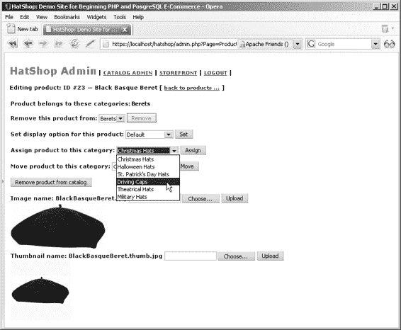

# 第七章：目录管理

`catalog_remove_product_from_category`函数检查产品存在于多少个类别中。如果产品存在于多个类别中，则仅从指定类别（通过 ID 作为参数接收）中移除该产品。如果产品仅与一个类别关联，则从数据库中完全删除。

5.  使用查询工具执行以下代码，它在`hatshop`数据库中创建`catalog_get_categories`函数：

```sql
-- Create catalog_get_categories function
CREATE FUNCTION catalog_get_categories()
RETURNS SETOF department_category LANGUAGE plpgsql AS $$
DECLARE
  outDepartmentCategoryRow department_category;
BEGIN
  FOR outDepartmentCategoryRow IN
    SELECT category_id, name, description
    FROM category
    ORDER BY category_id
  LOOP
    RETURN NEXT outDepartmentCategoryRow;
  END LOOP;
END;
$$;
```

`catalog_get_categories`简单地返回目录中的所有类别。

6.  使用查询工具执行以下代码，它在`hatshop`数据库中创建`product_info`类型和`catalog_get_product_info`函数：

```sql
-- Create product_info type
CREATE TYPE product_info AS
(
  name VARCHAR(50),
  image VARCHAR(150),
  thumbnail VARCHAR(150),
  display SMALLINT
);

-- Create catalog_get_product_info function
CREATE FUNCTION catalog_get_product_info(INTEGER)
RETURNS product_info LANGUAGE plpgsql AS $$
DECLARE
  inProductId ALIAS FOR $1;
  outProductInfoRow product_info;
BEGIN
  SELECT INTO outProductInfoRow
    name, image, thumbnail, display
  FROM product
  WHERE product_id = inProductId;
  RETURN outProductInfoRow;
END;
$$;
```

`catalog_get_product_info`函数检索由产品 ID（`$1`）标识的产品的名称、图片和缩略图。

7.  使用查询工具执行以下代码，它在`hatshop`数据库中创建`product_category_details`类型和`catalog_get_categories_for_product`函数：

```sql
-- Create product_category_details type
CREATE TYPE product_category_details AS
(
  category_id INTEGER,
  department_id INTEGER,
  name VARCHAR(50)
);

-- Create catalog_get_categories_for_product function
CREATE FUNCTION catalog_get_categories_for_product(INTEGER) RETURNS SETOF product_category_details LANGUAGE plpgsql AS $$
DECLARE
  inProductId ALIAS FOR $1;
  outProductCategoryDetailsRow product_category_details;
BEGIN
  FOR outProductCategoryDetailsRow IN
    SELECT c.category_id, c.department_id, c.name
    FROM category c
    JOIN product_category pc
      ON c.category_id = pc.category_id
    WHERE pc.product_id = inProductId
    ORDER BY category_id
  LOOP
    RETURN NEXT outProductCategoryDetailsRow;
  END LOOP;
END;
$$;
```

`catalog_get_categories_for_product`函数返回属于指定产品的类别列表。只返回它们的 ID 和名称，因为这是我们唯一关心的信息。

8.  使用查询工具执行以下代码，它在`hatshop`数据库中创建`catalog_set_product_display_option`函数：

```sql
-- Create catalog_set_product_display_option function
CREATE FUNCTION catalog_set_product_display_option(INTEGER, SMALLINT) RETURNS VOID LANGUAGE plpgsql AS $$
DECLARE
  inProductId ALIAS FOR $1;
  inDisplay ALIAS FOR $2;
BEGIN
  UPDATE product SET display = inDisplay WHERE product_id = inProductId; END;
$$;
```

9.  使用查询工具执行以下代码，它在`hatshop`数据库中创建`catalog_assign_product_to_category`函数：

```sql
-- Create catalog_assign_product_to_category function
CREATE FUNCTION catalog_assign_product_to_category(INTEGER, INTEGER) RETURNS VOID LANGUAGE plpgsql AS $$
DECLARE
  inProductId ALIAS FOR $1;
```


`inCategoryId` 是 `$2` 的别名；

`BEGIN`

`INSERT INTO product_category (product_id, category_id)`

`VALUES (inProductId, inCategoryId);`

`END;`

`$$;`

`catalog_assign_product_to_category` 函数通过向 `product_category` 表中添加 `(product_id, category_id)` 值对，将产品与类别关联起来。

**10.** 使用查询工具执行此代码，该代码将在您的 `hatshop` 数据库中创建 `catalog_assign_product_to_category` 函数：

```sql
-- 创建 catalog_move_product_to_category 函数
CREATE FUNCTION catalog_move_product_to_category(
INTEGER, INTEGER, INTEGER)
RETURNS VOID LANGUAGE plpgsql AS $$
DECLARE
  inProductId ALIAS FOR $1;
  inSourceCategoryId ALIAS FOR $2;
  inTargetCategoryId ALIAS FOR $3;
BEGIN
  UPDATE product_category
  SET category_id = inTargetCategoryId
  WHERE product_id = inProductId
    AND category_id = inSourceCategoryId;
END;
$$;
```

`catalog_move_product_to_category` 函数将产品从一个类别中移除，并放置到另一个类别中。

**11.** 使用查询工具执行此代码，该代码将在您的 `hatshop` 数据库中创建 `catalog_set_image` 和 `catalog_set_thumbnail` 函数：

```sql
-- 创建 catalog_set_image 函数
CREATE FUNCTION catalog_set_image(INTEGER, VARCHAR(150)) RETURNS VOID LANGUAGE plpgsql AS $$
DECLARE
  inProductId ALIAS FOR $1;
  inImage ALIAS FOR $2;
BEGIN
  UPDATE product SET image = inImage WHERE product_id = inProductId;
END;
$$;
```

[www.it-ebooks.info](http://www.it-ebooks.info/)



648XCH07a.qxd 10/25/06 10:56 PM 第 262 页

**262**

第 7 章 ■ 目录管理

```sql
-- 创建 catalog_set_thumbnail 函数
CREATE FUNCTION catalog_set_thumbnail(INTEGER, VARCHAR(150)) RETURNS VOID LANGUAGE plpgsql AS $$
DECLARE
  inProductId ALIAS FOR $1;
  inThumbnail ALIAS FOR $2;
BEGIN
  UPDATE product
  SET thumbnail = inThumbnail
  WHERE product_id = inProductId;
END;
$$;
```

在上传新图片时，我们需要这些函数来更改产品的图片或缩略图名称。

**12.** 加载您的产品详情页面，确保一切正常工作。您需要测试许多功能！图 7-13 展示了产品详情管理页面的实际操作。

**图 7-13.** *将产品分配到新类别*

[www.it-ebooks.info](http://www.it-ebooks.info/)

648XCH07a.qxd 10/25/06 10:56 PM 第 263 页

第 7 章 ■ 目录管理

**263**

## 小结

您在本章中编写了大量代码。您实现了一些组件化模板，以及它们的中层方法和数据层方法。您还学习了如何实现一个简单的身份验证方案，以便只有管理员才能访问目录管理页面。在本章的最后，您学习了如何使用 PHP 将文件从客户端上传到服务器。

在下一章中，您将通过实现自定义购物车进入开发的第二阶段。

[www.it-ebooks.info](http://www.it-ebooks.info/)

648XCH07a.qxd 10/25/06 10:56 PM 第 264 页

[www.it-ebooks.info](http://www.it-ebooks.info/)

648XCH08.qxd 10/31/06 10:07 PM 第 265 页

