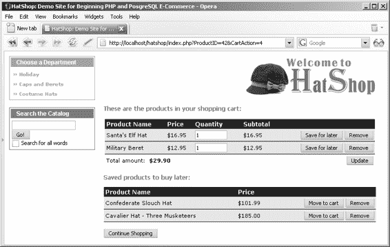
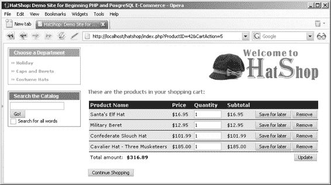
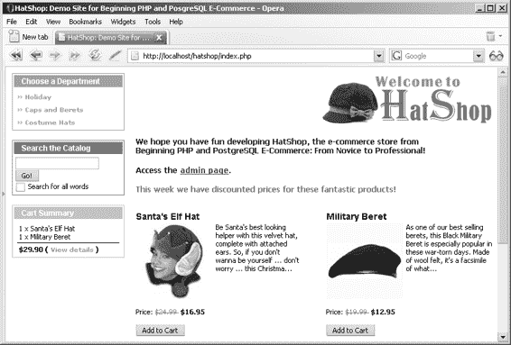

# 第 8 章

## 购物车

欢迎进入开发的第二阶段！在此阶段，您将开始改进已有的、功能完善的电子商务网站，并添加新功能。

那么，具体可以改进哪些方面呢？如果您快速浏览一下网络上的热门电子商务网站，不难找到答案。它们为用户提供个性化体验、产品推荐、记住客户偏好，并拥有许多其他功能，使网站令人难忘，并让用户不购买些东西就难以离开。

在开发的第一阶段，您大量依赖第三方支付处理器（PayPal）提供的集成购物车，因此没有在数据库中记录任何购物车或订单信息。目前，您的网站无法显示“最受欢迎”产品列表或任何关于已售产品的信息，因为在此阶段，您并未追踪售出的产品。这使得实施这些改进变得不可能。

显然，将订单信息保存在数据库中是您的首要任务。事实上，您接下来想要实现的大多数功能都依赖于已售产品的记录。为了实现这一功能，在本章中，您将实现一个自定义购物车，它将数据存储在本地 `hatshop` 数据库中。与您无法控制且难以保存到数据库中进行进一步处理和分析的 PayPal 购物车相比，这将为您提供更大的灵活性。使用自定义购物车时，当访客点击某个产品的“添加到购物车”按钮时，该产品将被添加到访客的购物车中。当访客点击“查看购物车”按钮时，将显示如图 8-1 所示的页面。

**267**

[www.it-ebooks.info](http://www.it-ebooks.info/)

648XCH08.qxd 10/31/06 10:07 PM 第 268 页

**268**

第 8 章 ■ 购物车

**图 8-1.** *HatShop 购物车*

我们的购物车将具备“稍后购买”功能，允许访客将购物车中的产品移到一个单独的列表中，以防他们只想购买部分商品（见图 8-2）。

**图 8-2.** *HatShop“稍后购买”功能*

[www.it-ebooks.info](http://www.it-ebooks.info/)

648XCH08.qxd 10/31/06 10:07 PM 第 269 页

第 8 章 ■ 购物车

**269**

除购物车页面外，在所有其他页面中，访客将能在屏幕左侧看到购物车摘要，如图 8-3 所示。

在本章结束时，您将拥有一个功能完整的购物车，但访客还无法对其中的商品下订单。您将在下一章中添加此功能，届时将实现一个自定义结账流程——“继续结账”按钮。当访客点击此按钮时，购物车中的产品将作为单独的订单保存到数据库中，访客将被重定向到一个付款页面。如果您在开发的第一阶段集成了 PayPal 购物车，从下一章开始，PayPal 将仅用于处理付款，您将不再依赖其购物车。

具体来说，在本章中，您将学习如何：

- 设计购物车
- 添加新的数据库表以存储购物车记录
- 创建与新表一起使用的数据层函数
- 实现业务层方法
- 实现“添加到购物车”和“查看购物车”按钮（如果您在 PayPal 章节中已经实现了它们，则使其与新购物车协同工作）
- 实现自定义购物车的表示层部分

**图 8-3.** *显示购物车摘要*

[www.it-ebooks.info](http://www.it-ebooks.info/)

648XCH08.qxd 10/31/06 10:07 PM 第 270 页

**270**

第 8 章 ■ 购物车

## 设计购物车

在开始编写购物车代码之前，让我们仔细看看您将要做什么。

首先，请注意，在此网站阶段，您不会有任何用户个性化功能。

