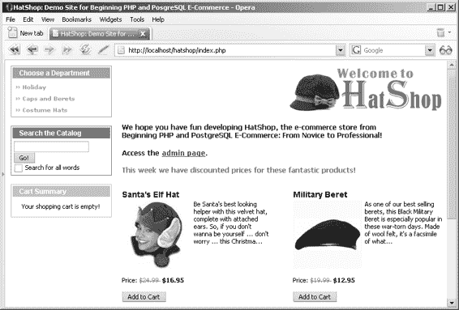

# 实现业务层

要实现业务层，你需要创建调用刚编写的数据对象层方法的常规方法，并添加一些管理业务逻辑的新方法。

## 练习：实现购物车业务逻辑

1. 首先，在你的 `include/config.php` 文件末尾添加以下两行。这些常量用于区分当前购物车中的商品和已保存以备后用的商品：

```php
// 购物车商品类型
define('GET_CART_PRODUCTS', 1);
define('GET_CART_SAVED_PRODUCTS', 2);
```

2. 在 `include/app_top.php` 中引用 `shopping_cart.php`：

```php
// 加载业务层
require_once BUSINESS_DIR . 'catalog.php';
require_once BUSINESS_DIR . 'shopping_cart.php';
```

3. 在 `business` 文件夹中创建一个名为 `shopping_cart.php` 的新文件。将以下代码添加到该文件中，然后我们将在“工作原理”部分对其进行说明：

```php
<?php
// 购物车的业务层类
class ShoppingCart
{
    // 存储访客的购物车 ID
    private static $_mCartId;

    // 私有构造函数，防止直接创建对象
    private function __construct()
    {
    }

    /* 此方法将由 GetCartId 调用，以确保在 $_mCartID 没有设置值时，我们在访客的会话中拥有购物车 ID */
    public static function SetCartId()
    {
        // 如果购物车 ID 尚未设置……
        if (self::$_mCartId == '')
        {
            // 如果访客的购物车 ID 在会话中，则从会话中获取
            if (isset ($_SESSION['cart_id']))
            {
                self::$_mCartId = $_SESSION['cart_id'];
            }
            // 如果没有，则检查购物车 ID 是否已保存为 cookie
            elseif (isset ($_COOKIE['cart_id']))
            {
                // 从 cookie 中保存购物车 ID
                self::$_mCartId = $_COOKIE['cart_id'];
                $_SESSION['cart_id'] = self::$_mCartId;
                // 重新生成 cookie，使其有效期 7 天（604800 秒）
                setcookie('cart_id', self::$_mCartId, time() + 604800);
            }
            else
            {
                /* 生成购物车 ID，并将其保存到 $_mCartId 类成员、会话和 cookie 中（在后续请求中，$_mCartId 将从会话中填充） */
                self::$_mCartId = md5(uniqid(rand(), true));
                // 将会话中的购物车 ID 存储
                $_SESSION['cart_id'] = self::$_mCartId;
                // cookie 将有效期为 7 天（604800 秒）
                setcookie('cart_id', self::$_mCartId, time() + 604800);
            }
        }
    }

    // 返回当前访客的购物车 ID
    public static function GetCartId()
    {
        // 确保当前访客有购物车 ID
        if (!isset (self::$_mCartId))
            self::SetCartId();
        return self::$_mCartId;
    }

    // 将商品添加到购物车
    public static function AddProduct($productId)
    {
        // 构建 SQL 查询
        $sql = 'SELECT shopping_cart_add_product(:cart_id, :product_id);';
        // 构建参数数组
        $params = array (':cart_id' => self::GetCartId(),
                          ':product_id' => $productId);
        // 使用 PDO 特定功能准备语句
        $result = DatabaseHandler::Prepare($sql);
        // 执行查询
        return DatabaseHandler::Execute($result, $params);
    }

    /* 使用新的商品数量更新购物车（$productId 和 $quantity 是包含商品 ID 及其相应数量的数组） */
    public static function Update($productId, $quantity)
    {
        // 构建 SQL 查询
        $sql = 'SELECT shopping_cart_update(:cart_id, :product_id, :quantity);';
        // 构建参数数组
        $params = array (':cart_id' => self::GetCartId(),
                          ':product_id' => '{' . implode(', ', $productId) . '}',
                          ':quantity' => '{' . implode(', ', $quantity) . '}');
        // 使用 PDO 特定功能准备语句
        $result = DatabaseHandler::Prepare($sql);
        // 执行查询
        return DatabaseHandler::Execute($result, $params);
    }

    // 从购物车中移除商品
}
```


```php
public static function RemoveProduct($productId)
{
    // 构建 SQL 查询
    $sql = 'SELECT shopping_cart_remove_product(:cart_id, :product_id);';

    // 构建参数数组
    $params = array (':cart_id' => self::GetCartId(),
                     ':product_id' => $productId);

    // 使用 PDO 特定功能准备语句
    $result = DatabaseHandler::Prepare($sql);

    // 执行查询
    return DatabaseHandler::Execute($result, $params);
}

// 保存产品到"稍后保存"列表
public static function SaveProductForLater($productId)
{
    // 构建 SQL 查询
    $sql = 'SELECT shopping_cart_save_product_for_later(:cart_id, :product_id);';

    // 构建参数数组
    $params = array (':cart_id' => self::GetCartId(),
                     ':product_id' => $productId);

    // 使用 PDO 特定功能准备语句
    $result = DatabaseHandler::Prepare($sql);

    // 执行查询
    return DatabaseHandler::Execute($result, $params);
}

// 将产品从"稍后保存"列表移回购物车
public static function MoveProductToCart($productId)
{
    // 构建 SQL 查询
    $sql = 'SELECT shopping_cart_move_product_to_cart(:cart_id, :product_id);';

    // 构建参数数组
    $params = array (':cart_id' => self::GetCartId(),
                     ':product_id' => $productId);

    // 使用 PDO 特定功能准备语句
    $result = DatabaseHandler::Prepare($sql);

    // 执行查询
    return DatabaseHandler::Execute($result, $params);
}
```

```
[www.it-ebooks.info](http://www.it-ebooks.info/)
648XCH08.qxd 10/31/06 10:07 PM Page 281
第八章 ■ 购物车
281
```

```php
// 获取购物车产品
public static function GetCartProducts($cartProductsType)
{
    $sql = '';

    // 如果检索的是"活跃"购物车产品……
    if ($cartProductsType == GET_CART_PRODUCTS)
    {
        // 构建 SQL 查询
        $sql = 'SELECT * FROM shopping_cart_get_products(:cart_id);';
    }
    // 如果检索的是稍后保存的产品……
    elseif ($cartProductsType == GET_CART_SAVED_PRODUCTS)
    {
        // 构建 SQL 查询
        $sql = 'SELECT * FROM shopping_cart_get_saved_products(:cart_id);';
    }
    else
        trigger_error($cartProductsType. ' 值未知', E_USER_ERROR);

    // 构建参数数组
    $params = array (':cart_id' => self::GetCartId());

    // 使用 PDO 特定功能准备语句
    $result = DatabaseHandler::Prepare($sql);

    // 执行查询并返回结果
    return DatabaseHandler::GetAll($result, $params);
}

/* 获取购物车产品总金额
   （不包括稍后保存的产品） */
public static function GetTotalAmount()
{
    // 构建 SQL 查询
    $sql = 'SELECT shopping_cart_get_total_amount(:cart_id);';

    // 构建参数数组
    $params = array (':cart_id' => self::GetCartId());

    // 使用 PDO 特定功能准备语句
    $result = DatabaseHandler::Prepare($sql);

    // 执行查询并返回结果
    return DatabaseHandler::GetOne($result, $params);
}
?>
```

```
[www.it-ebooks.info](http://www.it-ebooks.info/)
648XCH08.qxd 10/31/06 10:07 PM Page 282
282
第八章 ■ 购物车
```

## 工作原理：购物车的业务层部分

当访客添加产品或请求任何购物车操作时，如果该访客没有购物车 ID，则需要为其生成一个。这一点在`ShoppingCart`类的`SetCartId`方法中处理，以确保访客的购物车 ID 保存在`ShoppingCart`类的`$_mCartID`成员中。购物车 ID 被缓存在访客的会话和持久性 cookie 中。

该函数首先验证`$_mCartId`成员是否已设置，如果已设置，则无需从外部源读取它：

```php
public static function SetCartId()
{
    // 如果购物车 ID 尚未设置……
    if (self::$_mCartId == '')
    {
```

如果成员变量中没有该 ID，则下一个查找位置是访客的会话：

```php
        // 如果访客的购物车 ID 在会话中，则从那里获取
        if (isset ($_SESSION['cart_id']))
        {
            self::$_mCartId = $_SESSION['cart_id'];
        }
```

如果会话中也找不到该 ID，则检查它是否作为 cookie 保存。如果是，则将值保存到会话和`$_mCartId`成员，并重新生成 cookie 以重置其过期日期：

```php
        // 如果没有，检查购物车 ID 是否被保存为 cookie
        elseif (isset ($_COOKIE['cart_id']))
        {
            // 从 cookie 保存购物车 ID
            self::$_mCartId = $_COOKIE['cart_id'];
            $_SESSION['cart_id'] = self::$_mCartId;

            // 重新生成 cookie，有效期 7 天（604800 秒）
            setcookie('cart_id', self::$_mCartId, time() + 604800);
        }
```

最后，如果任何地方都找不到购物车 ID，则生成一个新的，并保存到会话、`$_mCartId`成员和持久性 cookie：

```php
        else
        {
            /* 生成购物车 id 并保存到 $_mCartId 类成员、
               会话和 cookie（在后续请求中，$_mCartId
               将从会话中填充） */
            self::$_mCartId = md5(uniqid(rand(), true));

            // 在会话中存储购物车 id
            $_SESSION['cart_id'] = self::$_mCartId;
```

```
[www.it-ebooks.info](http://www.it-ebooks.info/)
648XCH08.qxd 10/31/06 10:07 PM Page 283
第八章 ■ 购物车
283
```

```php
            // Cookie 有效期 7 天（604800 秒）
            setcookie('cart_id', self::$_mCartId, time() + 604800);
        }
    }
}
```

用于生成购物车 ID 的三个函数是：`md5`、`uniqid`和`rand`。调用`md5(uniqid(rand(),true))`会生成一个唯一、难以预测的 32 字节值，代表购物车 ID。

> **注意** 如果您有兴趣了解生成购物车 ID 的细节，请参考以下内容。`md5`函数使用 MD5 消息摘要算法计算其接收参数的哈希值；它总是返回一个 32 字符的字符串。`uniqid`函数基于当前时间的微秒数返回一个唯一标识符；其第一个参数是附加到其生成值之前的前缀，此处是`rand()`函数，它返回一个介于 0 和`RAND_MAX`之间的伪随机值（具体值依赖于平台）。如果`uniqid`的第二个参数为`true`，`uniqid`会在返回值末尾添加一个额外的组合 LCG（组合线性同余生成器）熵，这应使结果“更加唯一”。简而言之，`uniqid(rand(), true)`生成一个“非常唯一”的值，然后通过`md5`处理，确保其成为一个 32 字符长的随机字符序列。

`SetCartId`方法仅由`GetCartId`方法使用，后者返回购物车 ID。`GetCartID`首先检查`_mCartId`是否已设置，如果未设置，则在返回`$_mCartId`值之前调用`SetCartId`：

```php
// 返回当前访客的购物车 id
public static function GetCartId()
{
    // 确保当前访客有一个购物车 id
    if (!isset (self::$_mCartId))
        self::SetCartId();

    return self::$_mCartId;
}
```

我们再来看看`GetCartProducts`方法。该方法返回购物车中的产品。它接收`$cartProductsType`作为参数，该参数决定您是查找当前购物车产品还是稍后保存的产品。如果`$cartProductsType`等于`GET_CART_PRODUCTS`常量，则`GetCartProducts`返回购物车产品。如果`$cartProductsType`等于`GET_CART_SAVED_PRODUCTS`常量，则`GetCartProducts`返回稍后保存的产品。如果`$cartProductsType`既不是`GET_CART_PRODUCTS`也不是`GET_CART_SAVED_PRODUCTS`，该方法将引发错误。

您编写的所有其他业务层方法基本上都调用其关联的数据层函数来执行各种购物车任务。

```
[www.it-ebooks.info](http://www.it-ebooks.info/)
```



```
648XCH08.qxd 10/31/06 10:07 PM Page 284
284
第八章 ■ 购物车
```

## 实现表示层


