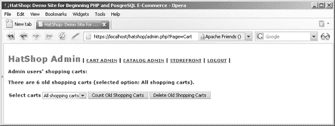
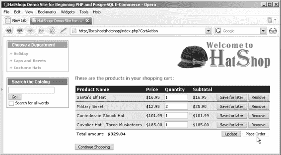
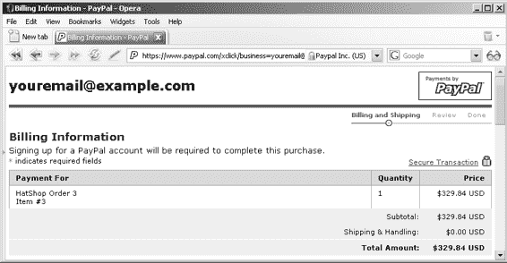

# 构建购物车用户界面

现在让我们构建购物车的用户界面（UI）部分。更新商店前端后，每个商品都会出现“添加到购物车”按钮，页面左侧的购物车摘要框中也会显示“查看购物车”链接。如果访客的购物车为空，则该链接不再显示，如图 8-4 所示。

**图 8-4.** *购物车为空时不显示“查看购物车”链接。*

如果你已按照第 6 章所述集成了 PayPal，那么你的网站上应该已经有了这些按钮，现在将更新它们的功能。

点击“查看购物车”时，购物车组件化模板（稍后将构建）会被加载到`index.tpl`中。你可以在前面的图 8-1 中看到这个组件化组件的实际效果。

加载购物车组件化模板的机制与之前在`index.php`中加载其他组件时使用的机制相同。当点击“添加到购物车”按钮时，`index.php`会重新加载，并在查询字符串中增加一个参数（`CartAction`）：`http://localhost/hatshop/index.php?CartAction=1&ProductID=10`

点击“查看购物车”时，添加到查询字符串的`CartAction`参数不携带任何值。

购物车将包含五种购物车操作，这些操作在配置文件（`include/config.php`）中使用以下自解释的常量描述：`ADD_PRODUCT`、`REMOVE_PRODUCT`、`UPDATE_PRODUCTS_QUANTITIES`、`SAVE_PRODUCT_FOR_LATER`和`MOVE_PRODUCT_TO_CART`。

## 回顾：实现购物车用户界面的主要步骤

在继续之前，让我们回顾一下实现购物车整个用户界面的主要步骤：

1.  修改“添加到购物车”按钮以使用自定义购物车。
2.  在`index.tpl`中添加“购物车摘要”框，替换原有的“查看购物车”按钮。
3.  修改`index.php`以识别`CartAction`查询字符串参数。
4.  实现`cart_details`组件化模板。

## 更新“添加到购物车”按钮

你需要修改`products_list.tpl`的代码，使每个展示的商品都包含一个“添加到购物车”按钮，其链接格式如之前所示（指向`index.php`的链接，并在查询字符串中附加`CartAction`参数）。

### 练习：将商品添加到新购物车

**1.** 在`include/config.php`末尾添加以下代码：

```php
// 购物车操作
define('ADD_PRODUCT', 1);
define('REMOVE_PRODUCT', 2);
define('UPDATE_PRODUCTS_QUANTITIES', 3);
define('SAVE_PRODUCT_FOR_LATER', 4);
define('MOVE_PRODUCT_TO_CART', 5);
```

**2.** 如果你实现了 PayPal 购物车，需要将“添加到购物车”按钮的链接改为指向 HatShop 网站而非 PayPal。打开`presentation/templates/products_list.tpl`，替换调用`OpenPayPalWindow()`函数的代码：

```html
<input type="button" name="add_to_cart" value="添加到购物车"
onclick="{$products_list->mProducts[k].paypal}" />
```

替换为以下代码：

```html
<input type="button" name="add_to_cart" value="添加到购物车"
onclick="javascript:window.location=
'{$products_list->mProducts[k].add_to_cart|prepare_link:"http"}';" />
```

**3.** 打开`presentation/smarty_plugins/function.load_products_list.php`；找到`ProductList`类中`init()`方法里构建 PayPal 链接的以下代码：

```php
// 创建 PayPal 链接
$this->mProducts[$i]['paypal'] =
  'JavaScript:OpenPayPalWindow("' .
  'https://www.paypal.com/cgi-bin/webscr?' .
  'cmd=_cart&business=youremail@example.com' .
  '&item_name=' . rawurlencode($this->mProducts[$i]['name']) .
  '&amount=' .
  (($this->mProducts[$i]['discounted_price'] == 0) ?
    $this->mProducts[$i]['price'] :
    $this->mProducts[$i]['discounted_price']) .
  '&currency=USD&add=1&return=www.example.com' .
  '&cancel_return=www.example.com")';
```

将其替换为以下可为我们的购物车构建“添加到购物车”链接的代码：

```php
// 创建添加到购物车链接
```


`$this->mProducts[$i]['add_to_cart'] = $this->mProducts[$i]['link'] . '&CartAction=' . ADD_PRODUCT;`

**4.** 接下来，在 `product.tpl` 中创建“加入购物车”链接。首先，在 `presentation/templates/product.tpl` 中的“继续购物”按钮前，添加以下高亮显示的代码：

```html
<br /><br />
<input type="button" name="add_to_cart" value="Add to Cart"
onclick="window.location=
'{$product->mAddToCartLink|prepare_link:"http"}';" />
<input type="button" value="Continue Shopping"
onclick="window.location='{$product->mPageLink|prepare_link:"http"}';" />
```

**5.** 打开 `presentation/smarty_plugins/function.load_product.php`，并在 `Product` 类中添加 `$mAddToCartLink` 成员：

```php
// Public variables to be used in Smarty template
public $mProduct;
public $mPageLink = 'index.php';
public $mAddToCartLink;
```

**6.** 在同一文件的 `Product` 类的 `init()` 方法末尾，添加以下代码。这将为“加入购物车”按钮创建链接：

```php
$this->mAddToCartLink = 'index.php?ProductID=' . $this->_mProductId .
'&CartAction=' . ADD_PRODUCT;
```

**工作原理：创建产品链接**

你创建的“加入购物车”按钮会链接到 `index.php`，并在原始查询字符串中增加一个 `CartAction` 参数。完成此修改后，执行页面以确保按钮已就位，不过在完成表示层之前还无法真正测试其功能。如果现在浏览到任意分类页面，并点击某个产品的“加入购物车”按钮，`index.php` 将重新加载，并在查询字符串的开头附加 `CartAction` 参数，例如：`http://localhost/hatshop/index.php?CartAction=1&ProductID=10`。

此时，此链接会将你带到产品详情页，因为你的网站还不知道如何解析 `CartAction` 查询字符串参数。`CartAction` 参数的值对应于你刚刚添加到 `include/config.php` 中的一个常量值。

---

**在主页面显示购物车摘要**

我们不使用 PayPal 的“查看购物车”按钮，而是希望像本章开头的截图那样，创建一个包含“查看详情”链接的购物车摘要组件。

现在，按照练习步骤来实现 `cart_summary` 组件化模板。

**练习：显示购物车摘要**

**1.** 首先移除“查看购物车”按钮。在 `presentation/templates/index.tpl` 中找到并删除以下代码（你也可以同时完全移除 `OpenPayPalWindow` 函数）：

```html
<div class="left_box" id="view_cart">
<input type="button" name="view_cart" value="View Cart"
onclick="JavaScript:OpenPayPalWindow("...")" />
</div>
```

**2.** 在同一文件里，添加对购物车摘要组件的引用：

```smarty
{include file="departments_list.tpl"}
{include file="$categoriesCell"}
{include file="search_box.tpl"}
{include file="$cartSummaryCell"}
```

**3.** 打开 `index.php`，并按以下代码片段的高亮部分进行更新。这样，`index.php` 就能识别 `CartAction` 查询字符串参数了。

```php
// Define the template file for the categories cell
$categoriesCell = 'blank.tpl';

// Define the template file for the cart summary cell
$cartSummaryCell = 'blank.tpl';

// Load department details if visiting a department
if (isset ($_GET['DepartmentID']))
{
$pageContentsCell = 'department.tpl';
$categoriesCell = 'categories_list.tpl';
}

// Load search result page if we're searching the catalog
if (isset ($_GET['Search']))
$pageContentsCell = 'search_results.tpl';

// Load product details page if visiting a product
if (isset ($_GET['ProductID']))
$pageContentsCell = 'product.tpl';

if (isset ($_GET['CartAction']))
{
$pageContentsCell = 'cart_details.tpl';
}
else
```


`$cartSummaryCell = 'cart_summary.tpl';`

`// 为购物车摘要单元格分配模板文件`
`$page->assign('cartSummaryCell', $cartSummaryCell);`

`// 为页面内容单元格分配模板文件`
`$page->assign('pageContentsCell', $pageContentsCell);`

1. 创建新文件`presentation/smarty_plugins/function.load_cart_summary.php`，并添加以下代码：

```php
<?php

// 插件文件中的插件函数必须命名为：smarty_type_name
function smarty_function_load_cart_summary($params, $smarty)
{
  // 创建 CartSummary 对象
  $cart_summary = new CartSummary();

  // 分配模板变量
  $smarty->assign($params['assign'], $cart_summary);
}

// 处理购物车摘要管理的类
class CartSummary
{
  // 在 Smarty 模板中使用的公共变量
  public $mTotalAmount;
  public $mItems;
  public $mEmptyCart;

  // 类构造函数
  public function __construct()
  {
    // 计算购物车的总金额
    $this->mTotalAmount = ShoppingCart::GetTotalAmount();

    // 获取购物车中的商品
    $this->mItems = ShoppingCart::GetCartProducts(GET_CART_PRODUCTS);

    if (empty($this->mItems))
      $this->mEmptyCart = true;
    else
      $this->mEmptyCart = false;
  }
}

?>
```

2. 在`presentation/templates`文件夹中创建新文件`cart_summary.tpl`，并写入以下代码：

```smarty
{* cart_summary.tpl *}
{load_cart_summary assign="cart_summary"}
{* 购物车摘要开始 *}
<div class="left_box" id="cart_summary_box">
  <p>购物车摘要</p>
  {if $cart_summary->mEmptyCart}
    <span class="cart_empty">您的购物车是空的！</span>
  {else}
    <ol class="cart_items_list">
    {section name=cCartSummary loop=$cart_summary->mItems}
      <li>
        {$cart_summary->mItems[cCartSummary].quantity} x
        {$cart_summary->mItems[cCartSummary].name}
      </li>
    {/section}
    </ol>
    <span class="cart_items_total">
      ${$cart_summary->mTotalAmount}
      ( <a href="{"index.php?CartAction"|prepare_link:"http"}">查看详情</a> )
    </span>
  {/if}
</div>
{* 购物车摘要结束 *}
```

3. 将以下样式添加到`hatshop.css`中：

```css
#cart_summary_box
{
  border: 1px solid #efba00;
}
#cart_summary_box p
{
  background: #efba00;
}
.cart_empty
{
  display: block;
  text-align: center;
  margin: 10px;
}
.cart_items_list
{
  border-bottom: 1px solid #000000;
  padding: 3px;
}
.cart_items_total
{
  display: block;
  font-weight: bold;
  margin-left: 8px;
}
```

**工作原理：显示购物车摘要**

重新加载 HatShop，现在您将在页面左侧看到购物车摘要框。此时，您还不能向购物车添加新产品，因为还需要创建购物车详情页面。在下一个练习中实现购物车详情页面后，您将能够全面测试购物车摘要组件。

**显示购物车详情**

目前，点击"添加到购物车"或"查看购物车"按钮会产生错误，因为您尚未编写`cart_details`组件化模板（用于显示访客的购物车详情）。要创建新的组件化模板，首先在`Templates`文件夹中创建一个名为`cart_details.tpl`的新模板。然后，创建`function.load_cart_details.php`文件，该文件将包含您的函数插件和`CartDetails`类，为`cart_details.tpl`模板提供支持。

**练习：创建`shopping_cart`模板**

1. 更新`index.php`，避免在访问购物车时保存`page_link`会话项（用于构建"继续购物"链接）：

```php
/* 如果不是访问商品页面，则将当前页面的链接保存到 page_link 会话变量中；
   该变量将用于创建商品详情页面的"继续购物"链接以及商品详情页面的链接 */
if (!isset ($_GET['ProductID']) && !isset ($_GET['CartAction']))
  $_SESSION['page_link'] = substr(getenv('REQUEST_URI'),
                                  strrpos(getenv('REQUEST_URI'), '/') + 1,
```


`strlen(getenv('REQUEST_URI')) - 1);`

2. 创建新文件 `presentation/smarty_plugins/function.load_cart_details.php`，并向其中添加以下代码：

```php
<?php
// Plugin functions inside plugin files must be named: smarty_type_name
function smarty_function_load_cart_details($params, $smarty)
{
  $cart_details = new CartDetails();
  $cart_details->init();

  // Assign template variable
  $smarty->assign($params['assign'], $cart_details);
}

// Class that deals with managing the shopping cart
class CartDetails
{
  // Public variables available in smarty template
  public $mCartProducts;
  public $mSavedCartProducts;
  public $mTotalAmount;
  public $mIsCartNowEmpty = 0; // Is the shopping cart empty?
  public $mIsCartLaterEmpty = 0; // Is the 'saved for later' list empty?
  public $mCartReferrer = 'index.php';
  public $mCartDetailsTarget;

  // Private attributes
  private $_mProductId;
  private $_mCartAction;

  // Class constructor
  public function __construct()
  {
    // Setting the "Continue shopping" button target
    if (isset ($_SESSION['page_link']))
      $this->mCartReferrer = $_SESSION['page_link'];

    if (isset ($_GET['CartAction']))
      $this->mCartAction = $_GET['CartAction'];
    else
      trigger_error('CartAction not set', E_USER_ERROR);

    // These cart operations require a valid product id
    if ($this->mCartAction == ADD_PRODUCT ||
        $this->mCartAction == REMOVE_PRODUCT ||
        $this->mCartAction == SAVE_PRODUCT_FOR_LATER ||
        $this->mCartAction == MOVE_PRODUCT_TO_CART)
      if (isset ($_GET['ProductID']))
        $this->mProductId = $_GET['ProductID'];
      else
        trigger_error('ProductID must be set for this type of request', E_USER_ERROR);

    $this->mCartDetailsTarget = 'index.php?CartAction=' .
                                UPDATE_PRODUCTS_QUANTITIES;
  }

  public function init()
  {
    switch ($this->mCartAction)
    {
      case ADD_PRODUCT:
        ShoppingCart::AddProduct($this->mProductId);
        header('Location: ' . $this->mCartReferrer);
        break;

      case REMOVE_PRODUCT:
        ShoppingCart::RemoveProduct($this->mProductId);
        break;

      case UPDATE_PRODUCTS_QUANTITIES:
        ShoppingCart::Update($_POST['productID'], $_POST['quantity']);
        break;

      case SAVE_PRODUCT_FOR_LATER:
        ShoppingCart::SaveProductForLater($this->mProductId);
        break;

      case MOVE_PRODUCT_TO_CART:
        ShoppingCart::MoveProductToCart($this->mProductId);
        break;

      default:
        // Do nothing
        break;
    }

    // Calculate the total amount for the shopping cart
    $this->mTotalAmount = ShoppingCart::GetTotalAmount();

    // Get shopping cart products
    $this->mCartProducts =
      ShoppingCart::GetCartProducts(GET_CART_PRODUCTS);

    // Gets the Saved for Later products
    $this->mSavedCartProducts =
      ShoppingCart::GetCartProducts(GET_CART_SAVED_PRODUCTS);

    // Check whether we have an empty shopping cart
    if (count($this->mCartProducts) == 0)
      $this->mIsCartNowEmpty = 1;

    // Check whether we have an empty Saved for Later list
    if (count($this->mSavedCartProducts) == 0)
      $this->mIsCartLaterEmpty = 1;

    // Build the links for cart actions
    for ($i = 0; $i < count($this->mCartProducts); $i++)
    {
      $this->mCartProducts[$i]['save'] = 'index.php?ProductID=' .
        $this->mCartProducts[$i]['product_id'] .
        '&CartAction=' . SAVE_PRODUCT_FOR_LATER;

      $this->mCartProducts[$i]['remove'] = 'index.php?ProductID=' .
        $this->mCartProducts[$i]['product_id'] .
        '&CartAction=' . REMOVE_PRODUCT;
    }

    for ($i = 0; $i < count($this->mSavedCartProducts); $i++)
    {
      $this->mSavedCartProducts[$i]['move'] = 'index.php?ProductID=' .
        $this->mSavedCartProducts[$i]['product_id'] .
        '&CartAction=' . MOVE_PRODUCT_TO_CART;

      $this->mSavedCartProducts[$i]['remove'] = 'index.php?ProductID=' .
        $this->mSavedCartProducts[$i]['product_id'] .
        '&CartAction=' . REMOVE_PRODUCT;
    }
  }
}
?>
```

3. 创建新文件 `presentation/templates/cart_details.tpl`，并向其中添加以下代码：


{* cart_details.tpl *}

`{load_cart_details assign="cart_details"}`

`{if ($cart_details->mIsCartNowEmpty == 1)}`

<span class="description">您的购物车是空的！</span>

<br /><br />

`{else}`

<span class="description">以下是您购物车中的商品：</span>

<br /><br />

<form method="post" action="`{$cart_details->mCartDetailsTarget|prepare_link:"http"}`">

<table>

<tr>

<th>商品名称</th>

<th>单价</th>

<th>数量</th>

<th>小计</th>

<th> </th>

</tr>

`{section name=cCart loop=$cart_details->mCartProducts}`

<tr>

<td>

<input name="productID[]" type="hidden" value="`{$cart_details->mCartProducts[cCart].product_id}`" />

`{$cart_details->mCartProducts[cCart].name}`

</td>

<td>$`{$cart_details->mCartProducts[cCart].price}`</td>

<td>

<input type="text" name="quantity[]" size="10" value="`{$cart_details->mCartProducts[cCart].quantity}`" />

</td>

<td>$`{$cart_details->mCartProducts[cCart].subtotal}`</td>

<td align="right">

<input type="button" name="saveForLater" value="稍后购买" onclick="window.location='`{$cart_details->mCartProducts[cCart].save|prepare_link}`';" />

<input type="button" name="remove" value="删除" onclick="window.location='`{$cart_details->mCartProducts[cCart].remove|prepare_link}`';" />

</td>

</tr>

`{/section}`

</table>

<table>

<tr>

<td class="cart_total">

<span>总计金额：</span>

<span class="price">$`{$cart_details->mTotalAmount}`</span>

</td>

<td class="cart_total" align="right">

<input type="submit" name="update" value="更新" />

</td>

</tr>

</table>

</form>

`{/if}`

`{if ($cart_details->mIsCartLaterEmpty == 0)}`

<br />

<span class="description">已保存以备稍后购买的商品：</span>

<br /><br />

<table>

<tr>

<th>商品名称</th>

<th>单价</th>

<th> </th>

</tr>

`{section name=cSavedCart loop=$cart_details->mSavedCartProducts}`

<tr>

<td>`{$cart_details->mSavedCartProducts[cSavedCart].name}`</td>

<td>$`{$cart_details->mSavedCartProducts[cSavedCart].price}`</td>

<td align="right">

<input type="button" name="moveToCart" value="移入购物车" onclick="window.location='`{$cart_details->mSavedCartProducts[cSavedCart].move|prepare_link}`';" />

<input type="button" name="remove" value="删除" onclick="window.location='`{$cart_details->mSavedCartProducts[cSavedCart].remove|prepare_link}`';" />

</td>

</tr>

`{/section}`

</table>

`{/if}`

<br />

<input type="button" name="continueShopping" value="继续购物" onclick="window.location='`{$cart_details->mCartReferrer}`';" />

**4.** 将以下样式添加到 `hatshop.css` 中：

```css
.cart_total
{
    background: #ffffff;
    border: none;
}
```

你刚刚完成了本章面向访客的代码部分，现在应该测试一下，确保一切按预期运行。通过向购物车添加商品、更改数量以及删除商品来进行测试。

**工作原理：购物车**

购物车可执行的操作由 `include/config.php` 中定义的以下常量定义：`ADD_PRODUCT`、`REMOVE_PRODUCT`、`UPDATE_PRODUCTS_QUANTITIES`、`SAVE_PRODUCT_FOR_LATER` 和 `MOVE_PRODUCT_TO_CART`。请注意，我们没有定义任何用于查看购物车的变量，因此如果 `CartAction` 没有取值或其值不等于任一操作变量，它将直接显示购物车内容。

除查看和更新购物车外，每个购物车操作都依赖于 `ProductID` 查询字符串参数（如果未设置则会引发错误）。如果满足相应条件，则会调用与访客操作对应的业务层方法。

**管理购物车**

现在你已经完成了购物车的编写，还有两件事需要注意，都与管理问题有关。


- 如何从目录中删除存在于购物车中的产品。
- 如何通过构建一个简单的购物车管理页面来统计或删除旧的购物车元素。这一点很重要，因为如果没有此功能，`shopping_cart` 表将持续增长，其中充满了旧的临时（且无用的）购物车。

## 删除存在于购物车中的产品

目录管理页面允许您完全从目录中删除产品。

在删除产品之前，您还应该删除其在访问者购物车中的出现记录。

按照以下步骤更新 `hatshop` 数据库中的 `catalog_delete_product` 函数：

**1.** 加载 pgAdmin III，并连接到 `hatshop` 数据库。

**2.** 点击“工具” ➤ “查询工具”（或点击工具栏上的 SQL 按钮）。此时应出现一个新的查询窗口。

**3.** 使用查询工具执行以下代码，该代码会更新 `hatshop` 数据库中的 `catalog_delete_product` 函数：

```sql
-- Updates catalog_delete_product function

CREATE OR REPLACE FUNCTION catalog_delete_product(INTEGER) RETURNS VOID LANGUAGE plpgsql AS $$

DECLARE

inProductId ALIAS FOR $1;

BEGIN

DELETE FROM product_category WHERE product_id = inProductId;
DELETE FROM shopping_cart WHERE product_id = inProductId;
DELETE FROM product WHERE product_id = inProductId;

END;

$$;
```

## 构建购物车管理页面

关于购物车的第二个问题是，目前没有删除 `shopping_cart` 表中旧记录的机制。在一个高活动量的网站上，`shopping_cart` 表可能会变得非常大。

在当前版本的代码中，购物车 ID 在客户端浏览器中存储七天。因此，您可以假设任何在过去十天内未被更新的购物车都是无效的，并且可以被安全地移除。

[www.it-ebooks.info](http://www.it-ebooks.info/)



648XCH08.qxd 10/31/06 10:07 PM Page 297

在以下练习中，您将快速实现一个简单的购物车管理页面，管理员可以在该页面上查看有多少旧的购物车条目，并且可以选择删除它们。图 8-5 展示了此页面。

**图 8-5.** *管理购物车*

您需要理解的最有趣的方面是用于删除所有在特定时间内未更新过的购物车的 SQL 逻辑。这并不像听起来那么简单——乍一看，您可能认为只需删除 `shopping_cart` 中 `added_on` 早于指定日期的所有记录即可。然而，此策略对于随时间修改的购物车（例如，访问者在过去三个月中每周向购物车添加商品）并不适用。如果对购物车的最后一次修改是最近的，则即使某些元素非常陈旧，也不应删除任何元素。换句话说，您应该要么删除购物车中的所有元素，要么一个都不删除。购物车的年龄由其最近修改或添加的产品的年龄决定。

话虽如此，请按照练习步骤实现新功能。

### 练习：创建购物车管理页面

**1.** 加载 pgAdmin III，并连接到 `hatshop` 数据库。

**2.** 将以下数据层函数添加到 `hatshop` 数据库：

```sql
-- Create shopping_cart_count_old_carts function

CREATE FUNCTION shopping_cart_count_old_carts(INTEGER)

RETURNS INTEGER LANGUAGE plpgsql AS $$

DECLARE

inDays ALIAS FOR $1;

outOldShoppingCartsCount INTEGER;

BEGIN

SELECT INTO outOldShoppingCartsCount

COUNT(cart_id)

FROM (SELECT cart_id

FROM shopping_cart

GROUP BY cart_id

HAVING ((NOW() - ('1'||' DAYS')::INTERVAL) >= MAX(added_on))) AS old_carts;

RETURN outOldShoppingCartsCount;

END;

$$;
```

```sql
-- Create shopping_cart_delete_old_carts function
```


```sql
CREATE FUNCTION shopping_cart_delete_old_carts(INTEGER) RETURNS VOID LANGUAGE plpgsql AS $$

DECLARE
  inDays ALIAS FOR $1;
BEGIN
  DELETE FROM shopping_cart
  WHERE cart_id IN
    (SELECT cart_id
     FROM shopping_cart
     GROUP BY cart_id
     HAVING ((NOW() - (inDays||' DAYS')::INTERVAL) >= MAX(added_on)));
END;
$$;
```

**3.** 在 `business/shopping_cart.php` 中添加以下业务层方法：

```php
// 统计旧购物车
public static function CountOldShoppingCarts($days)
{
  // 构建 SQL 查询
  $sql = 'SELECT shopping_cart_count_old_carts(:days);';
  // 构建参数数组
  $params = array (':days' => $days);
  // 使用 PDO 特定功能准备语句
  $result = DatabaseHandler::Prepare($sql);
  // 执行查询并返回结果
  return DatabaseHandler::GetOne($result, $params);
}

// 删除旧购物车
public static function DeleteOldShoppingCarts($days)
{
  // 构建 SQL 查询
  $sql = 'SELECT shopping_cart_delete_old_carts(:days);';
  // 构建参数数组
  $params = array (':days' => $days);
  // 使用 PDO 特定功能准备语句
  $result = DatabaseHandler::Prepare($sql);
  // 执行查询
  return DatabaseHandler::Execute($result, $params);
}
```

**4.** 创建一个名为 `presentation/smarty_plugins/function.load_admin_cart.php` 的新文件，并向其中添加以下代码：

```php
<?php
/* 当从模板加载 load_admin_cart 函数插件时调用的 Smarty 插件函数 */
function smarty_function_load_admin_cart($params, $smarty)
{
  // 创建 AdminCart 对象
  $admin_cart = new AdminCart();
  $admin_cart->init();
  // 分配模板变量
  $smarty->assign($params['assign'], $admin_cart);
}

// 支持购物车管理功能的类
class AdminCart
{
  // 在 Smarty 模板中可用的公共变量
  public $mMessage;
  public $mDaysOptions = array (0 => '所有购物车', 1 => '一天前',
                                10 => '十天前',
                                20 => '二十天前',
                                30 => '三十天前',
                                90 => '九十天前');
  public $mSelectedDaysNumber = 0;
  // 私有成员
  public $_mAction = '';

  // 类构造函数
  public function __construct()
  {
    foreach ($_POST as $key => $value)
      // 如果点击了提交按钮...
      if (substr($key, 0, 6) == 'submit')
      {
        // 获取提交按钮的范围
        $this->_mAction = substr($key, strlen('submit_'), strlen($key));
        // 获取选中的天数
        if (isset ($_POST['days']))
          $this->mSelectedDaysNumber = (int) $_POST['days'];
        else
          trigger_error('未设置天数');
      }
  }

  public function init()
  {
    // 如果统计购物车...
    if ($this->_mAction == 'count')
    {
      $count_old_carts =
        ShoppingCart::CountOldShoppingCarts($this->mSelectedDaysNumber);
      if ($count_old_carts == 0)
        $count_old_carts = '没有';
      $this->mMessage = '共有 ' . $count_old_carts .
        ' 个旧购物车（选中选项：' .
        $this->mDaysOptions[$this->mSelectedDaysNumber] .
        '）。';
    }
    // 如果删除购物车...
    if ($this->_mAction == 'delete')
    {
      $this->mDeletedCarts =
        ShoppingCart::DeleteOldShoppingCarts($this->mSelectedDaysNumber);
      $this->mMessage = '旧购物车已从数据库中移除（选中选项：' .
        $this->mDaysOptions[$this->mSelectedDaysNumber] .'）。';
    }
  }
}
?>
```

**5.** 在 `presentation/templates` 文件夹中创建一个名为 `admin_cart.tpl` 的新文件，并输入以下代码：

```smarty
{* admin_cart.tpl *}
{load_admin_cart assign='admin_cart'}
<span class="admin_page_text">管理用户的购物车：</span>
<br /><br />
{if $admin_cart->mMessage neq ""}
<span class="admin_page_text">{$admin_cart->mMessage}</span>
<br /><br />
{/if}
<form action="{"admin.php?Page=Cart"|prepare_link:"https"}" method="post">
<span class="admin_page_text">选择购物车</span>
```


```html
{html_options name="days" options=$admin_cart->mDaysOptions selected=$admin_cart->mSelectedDaysNumber}

<input type="submit" name="submit_count" value="统计旧购物车" />

<input type="submit" name="submit_delete" value="删除旧购物车" />

</form>

**6.** 修改 `presentation/templates/admin_menu.tpl`，将高亮显示的链接代码添加到购物车管理页面：

<span class="menu_text"> |

**<a href="{"admin.php?Page=Cart"|prepare_link:"https"}">购物车管理</a> |**

<a href="{"admin.php"|prepare_link:"https"}">目录管理</a> |

**7.** 在 `admin.php` 中添加加载 `admin_cart.tpl` 的高亮代码：
```
elseif ($admin_page == 'ProductDetails')
$pageContentsCell = 'admin_product.tpl';
**elseif ($admin_page == 'Cart')**
**$pageContentsCell = 'admin_cart.tpl';**
```

**工作原理：购物车管理页面**

购物车管理页面的核心工作由您添加到 `hatshop` 数据库中的两个函数完成：`shopping_cart_count_old_carts` 和 `shopping_cart_delete_old_carts`。这两个函数都接收一个天数参数，用于判断购物车是否过期，并使用相同的逻辑来计算应被移除的过期购物车元素。

购物车的“年龄”由最近添加或修改的商品项的年龄决定，并通过 `GROUP BY` SQL 子句进行计算。判断购物车是否应被视为过期的条件如下：
```
WHERE cart_id IN
(SELECT cart_id
FROM shopping_cart
GROUP BY cart_id
HAVING ((NOW() - (inDays||' DAYS')::INTERVAL) >= MAX(added_on)));
```

**总结**

在本章中，您学习了如何将购物车信息存储在数据库中，并在此过程中掌握了一些新知识。其中最有趣的可能是在客户端以 Cookie 形式存储购物车 ID 的方法，因为在此之前本书中尚未涉及类似操作。

[www.it-ebooks.info](http://www.it-ebooks.info/)

648XCH08.qxd 10/31/06 10:07 PM Page 302

**302** 第 8 章 ■ 购物车

在完成购物车的创建过程（从数据库到表示层）之后，我们还探讨了新的管理挑战。

下一章中，我们将通过自定义结账系统进一步完善自定义购物车提供的功能。您将为购物车添加一个“提交订单”按钮，以便将购物车信息作为独立订单保存到数据库中。

[www.it-ebooks.info](http://www.it-ebooks.info/)



648XCH09.qxd 11/17/06 3:39 PM Page 303

第 9 章

处理客户订单

**好消息**是您的购物车看起来不错且功能完备。**坏消息**是它并未允许访客实际提交订单，这使得购物车在生产系统环境中完全无用。本章将通过两个独立阶段解决这个问题。在第一部分中，您将实现订单提交机制的客户端部分。更准确地说，您将为购物车控件添加一个“提交订单”按钮，允许访客提交购物车中的商品。

在第二部分中，您将实现一个简单的订单管理页面，站点管理员可以在此查看和处理待处理订单。

网站每个部分的代码将按常规方式呈现：从数据库层开始，接着是业务层，最后是用户界面（UI）。

**实现订单提交系统**

整个订单提交系统都与前面提到的“提交订单”按钮相关。图 9-1 展示了在本章更新 `cart_details` 组件化模板后，该按钮的显示效果。

**图 9-1.** *带有“提交订单”按钮的购物车* **303**

[www.it-ebooks.info](http://www.it-ebooks.info/)



648XCH09.qxd 11/17/06 3:39 PM Page 304

**304**
```


