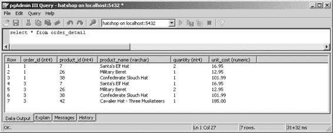
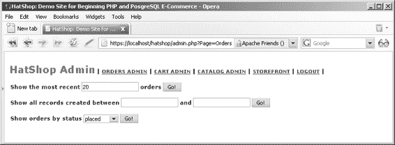
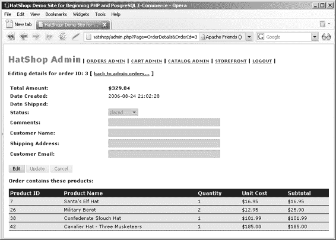
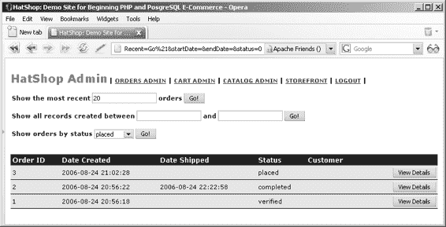

# 第 9 章 处理客户订单

那个按钮看起来相当普通，但老实说，它是本章的核心。尽管如此，按钮背后隐藏着许多逻辑，所以让我们讨论一下当客户点击该按钮时应该发生什么。请记住，在这个阶段，我们并不关心是谁下的订单，但我们确实希望将关于所订购产品的信息存储在数据库中。

基本上，当客户点击“提交订单”按钮时，需要发生两件事：

* 首先，订单必须存储在数据库中的某个位置。这意味着您必须将购物车中的产品保存到一个名为`HatShop Order ***nnn***`的订单中，并清空购物车。
* 其次，客户会被重定向到一个 PayPal 支付页面，客户在该页面上支付订单所需的金额。您可以在图 9-2 中看到 PayPal 支付页面。

**图 9-2.** *PayPal 支付页面*

> **注意** 对于第二个开发阶段，我们仍然不自行处理付款，而是使用第三方支付处理器。现在我们不再需要 PayPal 购物车，因为我们在上一章中实现了自己的购物车。相反，我们将使用 PayPal 的单品购买选项，该选项将访问者直接重定向到支付页面。

使用第三方支付处理器时出现的一个问题是，客户可能会在结账页面改变主意并取消订单。这可能导致订单已保存到数据库中（订单在页面重定向到支付页面之前已保存），但付款未完成。显然，我们需要一个付款确认系统，以及一个能够存储每个订单状态信息的数据库结构。

您将实现的确认系统很简单。每个支付处理器，包括 PayPal，都可以被指示在处理付款后发送确认消息。我们将允许站点管理员在管理页面中手动检查哪些订单已付款。这些订单被称为已验证订单。您将在本章后面看到如何在站点的订单管理部分管理它们。

> **注意** PayPal 及其竞争对手提供自动化系统，当付款完成或取消时通知您的网站。然而，本书不深入探讨这些支付系统的具体细节——您需要自行研究并学习所选公司的文档。PayPal 即时付款通知文档包含在订单管理集成指南中，可从`https://www.paypal.com/en_US/pdf/PP_OrderManagement_IntegrationGuide.pdf`下载。

现在您已经了解了如何处理那个“提交订单”按钮，接下来的主要问题是：哪些订单信息需要存储在数据库中，以及如何存储。正如您在前几章中所见，决定如何存储信息有助于您更好地理解整个系统的工作方式。

## 在数据库中存储订单

需要存储两种订单信息：

* 关于订单的通用详细信息，例如订单创建日期；产品是否已发货以及何时发货；订单是已验证、已完成还是已取消；以及其他一些细节。
* 属于该订单的产品及其数量。

在本章后面创建的订单管理页面中，您将能够查看和修改通用订单信息。

## 创建新的数据表

由于所存储信息的性质，您需要两个数据表：`orders`和`order_detail`。`orders`表存储关于整个订单的信息，而`order_detail`包含属于每个订单的产品。


## 第 9 章：处理客户订单

## `orders` 表和 `order_detail` 表

**提示：** 到目前为止，我们一直保持表名使用单数形式（`shopping_cart`、`department` 等）的命名规范。然而，此处我们对 `orders` 表做了例外处理，因为 `order` 同时也是 SQL 关键字。为方便本书撰写，我们更倾向于打破命名规范以避免编写 SQL 代码时产生混淆。一般来说，将 SQL 关键字用作对象名称并非良好实践。

这两个表通过 `order_id` 字段上的 `FOREIGN KEY` 约束实现了一对多关系。一对多关系是 `orders` 表与 `order_detail` 表之间常见的实现方式。`order_detail` 表包含属于同一订单的多条记录。你可以回顾第 4 章，其中对表关系进行了更详细的说明。

你将在以下练习中实现这两个表。

### 练习：向数据库添加 `orders` 和 `order_detail` 表

1. 加载 pgAdmin III，并连接到 `hatshop` 数据库。

2. 点击 **工具** ➤ **查询工具**（或点击工具栏上的 **SQL** 按钮）。此时应会出现一个新的查询窗口。

3. 使用查询工具执行以下代码，该代码将在你的 `hatshop` 数据库中创建 `orders` 表：

   ```sql
   -- 创建 orders 表
   CREATE TABLE orders
   (
       order_id SERIAL NOT NULL,
       total_amount NUMERIC(10,2) NOT NULL DEFAULT 0.00,
       created_on TIMESTAMP NOT NULL,
       shipped_on TIMESTAMP,
       status INTEGER NOT NULL DEFAULT 0,
       comments VARCHAR(255),
       customer_name VARCHAR(50),
       shipping_address VARCHAR(255),
       customer_email VARCHAR(50),
       CONSTRAINT pk_order_id PRIMARY KEY (order_id)
   );
   ```

4. 使用查询工具执行以下代码，该代码将在你的 `hatshop` 数据库中创建 `order_detail` 表：

   ```sql
   -- 创建 order_detail 表
   CREATE TABLE order_detail
   (
       order_id INTEGER NOT NULL,
       product_id INTEGER NOT NULL,
       product_name VARCHAR(50) NOT NULL,
       quantity INTEGER NOT NULL,
       unit_cost NUMERIC(10, 2) NOT NULL,
       CONSTRAINT pk_order_id_product_id PRIMARY KEY (order_id, product_id),
       CONSTRAINT fk_order_id FOREIGN KEY (order_id) REFERENCES orders (order_id)
       ON UPDATE RESTRICT ON DELETE RESTRICT
   );
   ```

## 工作原理：数据表

既然你已经创建了这两个表，让我们更仔细地看看它们的结构和关系。

### `orders` 表

`orders` 表包含两类信息：订单本身的数据（前六个字段）和创建该订单的客户数据（最后三个字段）。

另一种方案是将客户信息存储在一个名为 `customer` 的独立表中，并在 `orders` 表中仅存储 `customer_id` 值。不过，存储客户数据并非当前开发阶段的目标之一。在这个阶段，我们倾向于保持简单，因为谁下的订单并不重要，重要的是哪些产品已被售出。你将在第 11 章中处理创建独立的 `customer` 表。

像 PayPal 这样的第三方支付处理商会存储并管理完整的客户信息，因此无需在你的数据库中也存储这些信息。我们添加了 `customer_name`、`shipping_address` 和 `customer_email` 字段作为可选字段，如果管理员能够方便地掌握这些信息以便处理特定（或全部）订单，则可以自行填写。

字段名称本身已不言自明。`order_id` 是表的主键。`total_amount` 存储订单总金额。`created_on` 和 `shipped_on` 指定了订单创建和发货的时间（如果订单尚未发货，后者支持 NULL 值）。

`status` 字段包含一个整数，可具有以下值：

- **0：** 订单已提交。这是购物车中点击 **提交订单** 按钮后订单的初始状态。


• 1：订单已验证。管理员在确认付款后，将订单标记为`verified`。

• 2：订单已`completed`。管理员在产品发货后将订单标记为`completed`。同时，`shipped_on`字段也会被填充。

• 3：订单已`canceled`。通常，如果订单已下达（通过点击`Place Order`按钮），但付款未处理，或出现其他需要取消订单的情况，管理员会将订单标记为`canceled`。

> **注意** PayPal 可以通过`Instant Payment Notification`功能自动通知您的网站付款已完成。使用此功能可以使网站管理员的工作更轻松，因为他/她无需手动检查已收到付款的订单；但是在 HatShop 中我们不会使用此功能，因为它过于特定于 PayPal。请查阅您所选支付提供商的文档，了解他们为您准备了哪些特定功能。

[www.it-ebooks.info](http://www.it-ebooks.info/)



`648XCH09.qxd 11/17/06 3:39 PM Page 308`

**308**

## 第 9 章 ■ 处理客户订单

### order_detail 表

让我们看看`order_detail`表中包含哪些信息。请看图 9-3，了解一些典型的`order_detail`记录。

**图 9-3.** *`order_detail`表中的示例数据* `order_detail`中的每条记录都代表一个订购的产品，该产品属于由`order_id`指定的订单。

主键由`order_id`和`product_id`共同组成，因为在同一订单中，特定产品只能被订购一次。`quantity`字段包含订购数量，因此在同一订单中多次记录同一个`product_id`是没有意义的。

您可能会好奇，为什么`product_id`、`price`和产品名称会被记录在`order_detail`表中，特别是当您拥有产品 ID 时，可以从`product`表中获取所有产品详细信息，而无需重复存储任何信息。

我们选择在`order_detail`表中重复产品数据（产品名称和价格），以防止产品信息发生变化；产品可能会从数据库中删除，其名称和价格也可能改变，但这不应影响订单数据。

我们存储`product_id`，因为除了它是唯一以编程方式链接回原始产品信息（如果产品仍然存在）的方法之外，`product_id`还用于创建`order_detail`的主键。

`product_id`在这里非常有用，因为它在`order_detail`的组合主键中出现，既省去了添加另一个主键字段的必要，又确保同一订单中不会出现同一个产品多次。

### 实现数据层

在此阶段，您需要在`hatshop`数据库中添加两个额外的数据层函数。最重要的是`shopping_cart_create_order`，它从购物车中获取产品并据此创建订单。另一个函数是`shopping_cart_empty`，它在订单下达后清空访客的购物车。

[www.it-ebooks.info](http://www.it-ebooks.info/)

`648XCH09.qxd 11/17/06 3:39 PM Page 309`

**309**

在接下来的练习中，我们将实现这些函数，从`shopping_cart_empty`开始，因为它是在`shopping_cart_create_order`中调用的。

#### 练习：实现函数

1. 加载 `pgAdmin III`，并连接到 `hatshop` 数据库。

2. 点击 `Tools` ➤ `Query tool`（或点击工具栏上的 `SQL` 按钮）。将出现一个新的查询窗口。

3. 使用查询工具执行以下代码，该代码将在您的 `hatshop` 数据库中创建 `shopping_cart_empty` 函数：

```sql
-- 创建 shopping_cart_empty 函数

CREATE FUNCTION shopping_cart_empty(CHAR(32))

RETURNS VOID LANGUAGE plpgsql AS $$

DECLARE

inCartId ALIAS FOR $1;

BEGIN

DELETE FROM shopping_cart WHERE cart_id = inCartId;

END;

$$;
```


当客户下订单时，`shopping_cart_create_order` 会调用 `shopping_cart_empty` 从客户的购物车中删除产品。

**4.** 使用查询工具执行此代码，该代码在 `hatshop` 数据库中创建 `shopping_cart_create_order` 函数：

```sql
-- 创建 shopping_cart_create_order 函数

CREATE FUNCTION shopping_cart_create_order(CHAR(32))

RETURNS INTEGER LANGUAGE plpgsql AS $$

DECLARE

inCartId ALIAS FOR $1;

outOrderId INTEGER;

cartItem cart_product;

orderTotalAmount NUMERIC(10, 2);

BEGIN

-- 向 orders 表中插入一条新记录

INSERT INTO orders (created_on) VALUES (NOW());

-- 获取新订单 ID

SELECT INTO outOrderId

currval('orders_order_id_seq');

orderTotalAmount := 0;

-- 在 order_detail 表中插入订单详情

FOR cartItem IN

SELECT p.product_id, p.name,

COALESCE(NULLIF(p.discounted_price, 0), p.price) AS price, sc.quantity,

COALESCE(NULLIF(p.discounted_price, 0), p.price) * sc.quantity AS subtotal

FROM shopping_cart sc

INNER JOIN product p

ON sc.product_id = p.product_id

WHERE sc.cart_id = inCartId AND sc.buy_now

LOOP

INSERT INTO order_detail (order_id, product_id, product_name, quantity, unit_cost)

VALUES (outOrderId, cartItem.product_id, cartItem.name, cartItem.quantity, cartItem.price);

orderTotalAmount := orderTotalAmount + cartItem.subtotal; END LOOP;

-- 保存订单总金额

UPDATE orders

SET total_amount = orderTotalAmount

WHERE order_id = outOrderId;

-- 清空购物车

PERFORM shopping_cart_empty(inCartId);

-- 返回订单 ID

RETURN outOrderId;

END;

$$;
```

当客户决定购买购物车中的产品并点击“下订单”按钮时，会调用此函数。

`shopping_cart_create_order` 的作用是根据客户购物车中的产品创建新订单。这意味着要向 `orders` 表添加一条新记录，并向 `order_detail` 表添加多条记录（每个产品对应一条记录）。

**工作原理：实现函数**

`shopping_cart_create_order` 的第一步涉及在 `orders` 表中创建新记录。您需要在一开始就执行此操作，以查明为新订单生成了哪个 `order_id`。请记住，`order_id` 字段是一个 `INTEGER` 列，具有关联的序列（`orders_order_id_seq`），由数据库自动生成，因此您需要在向 `orders` 插入记录后检索其值：

```sql
-- 向 orders 表中插入一条新记录
INSERT INTO orders (created_on) VALUES (NOW());

-- 获取新订单 ID
SELECT INTO outOrderId
currval('orders_order_id_seq');
```

这是提取新生成的 ID 的基本机制。在 `INSERT` 语句之后，您将 `currval` 返回的值保存到一个变量中。您必须在插入新行后立即执行此操作，因为在下一次成功插入操作后，`currval` 返回的值会递增。`currval` 返回序列的当前值，该值等于最后插入的 `order_id`。

使用 `outOrderId` 变量，您通过从 `product` 和 `shopping_cart` 表中收集信息来添加 `order_detail` 记录。您从 `shopping_cart` 中获取产品列表及其数量，从 `product` 中获取它们的名称和价格，并将这些记录逐一保存到 `order_detail` 表中。

```sql
-- 在 order_detail 表中插入订单详情
FOR cartItem IN
SELECT p.product_id, p.name,
COALESCE(NULLIF(p.discounted_price, 0), p.price) AS price, sc.quantity,
COALESCE(NULLIF(p.discounted_price, 0), p.price) * sc.quantity AS subtotal
FROM shopping_cart sc
INNER JOIN product p
ON sc.product_id = p.product_id
WHERE sc.cart_id = inCartId AND sc.buy_now
LOOP
INSERT INTO order_detail (order_id, product_id, product_name, quantity, unit_cost)
```


`VALUES (outOrderId, cartItem.product_id, cartItem.name, cartItem.quantity, cartItem.price);`

`orderTotalAmount := orderTotalAmount + cartItem.subtotal;` `END LOOP;`

> **提示** 在关联 `product` 和 `shopping_cart` 表时，你可以从 `product` 表中获取 `product_id`，但也可以从 `shopping_cart` 表中获取；由于表连接是基于 `product_id` 列进行的，因此结果相同。

在保存商品时，该函数还会通过将每个商品的价格乘以其数量，再加到 `orderTotalAmount` 上，来计算订单总金额。此值随后会作为订单的 `total_amount` 进行保存：

```sql
-- 保存订单总金额
UPDATE orders
SET total_amount = orderTotalAmount
WHERE order_id = outOrderId;
```

最后，该函数通过调用 `shopping_cart_empty` 函数清空访客的购物车，并返回订单 ID：

```sql
-- 清空购物车
PERFORM shopping_cart_empty(inCartId);

-- 返回订单 ID
RETURN outOrderId;
```

[www.it-ebooks.info](http://www.it-ebooks.info/)

648XCH09.qxd 11/17/06 3:39 PM Page 312

**312**

## 第九章 ■ 处理客户订单

### 实现业务层

在这一步中，你只需要一个名为 `CreateOrder` 的方法，将其添加到 `business/shopping_cart.php` 文件中的 `ShoppingCart` 类里：

```php
// 创建新订单
public static function CreateOrder()
{
    // 构建 SQL 查询
    $sql = 'SELECT shopping_cart_create_order(:cart_id);';

    // 构建参数数组
    $params = array (':cart_id' => self::GetCartId());

    // 使用 PDO 特定功能准备语句
    $result = DatabaseHandler::Prepare($sql);

    // 执行查询并返回结果
    return DatabaseHandler::GetOne($result, $params);
}
```

该方法调用数据层的 `shopping_cart_create_order` 函数，并返回新创建订单的 `order_id`。

### 实现表示层

你终于到了将编写好的代码付诸实施的环节。用户界面包括“下订单”按钮及其背后的所有逻辑，这使得访客能够成为顾客。

在自定义结算流程中，这个按钮是访客端的唯一新增项。我们先把这个按钮放到 `cart_details` 模板文件中，然后实现其功能。

要实现所需功能，只需遵循几个简单的步骤。第一步是在购物车中添加“下订单”按钮。

#### 添加下订单按钮

修改 `presentation/templates/cart_details.tpl` 文件，在“更新”按钮之后添加一个新按钮，如下面的代码片段中高亮部分所示：

```html
<table>
    <tr>
        <td class="cart_total">
            <span>总金额：</span>
            <span class="price">${$cart_details->mTotalAmount}</span>
        </td>
        <td class="cart_total" align="right">
            <input type="submit" name="update" value="更新" />
            <input type="submit" name="place_order" value="下订单" />
        </td>
    </tr>
</table>
```

太棒了，现在你的购物车中已经有了一个“下订单”按钮！

[www.it-ebooks.info](http://www.it-ebooks.info/)

648XCH09.qxd 11/17/06 3:39 PM Page 313

**313**

### 实现下单功能

现在是时候实现“下订单”按钮的功能了。由于此功能取决于为你处理支付的公司，你可能需要根据支付处理公司的具体行为进行调整。如果你使用 PayPal，第 6 章“使用 PayPal 单件商品购买功能”部分已经介绍了将访客重定向到支付页面的代码。

在 `presentation/smarty_plugins/function.load_cart_details.php` 文件中，将以下高亮代码添加到 `CartDetails` 类的 `init()` 方法中：

```php
// 计算购物车的总金额
$this->mTotalAmount = ShoppingCart::GetTotalAmount();

// 如果点击了“下订单”按钮……
if(isset ($_POST['place_order']))
{
    // 创建订单并获取订单 ID
    $order_id = ShoppingCart::CreateOrder();

    // 这将包含 PayPal 的链接
    $redirect =
```


```php
// 重定向到支付页面
$redirect =
  'https://www.paypal.com/xclick/business=youremail@example.com' .
  '&item_name=帽子商店订单 ' . $order_id .
  '&item_number=' . $order_id .
  '&amount=' . $this->mTotalAmount .
  '&currency=USD&return=www.example.com' .
  '&cancel_return=www.example.com';

header('Location: ' . $redirect);
exit;
```

```php
// 获取购物车商品
$this->mCartProducts = ShoppingCart::GetCartProducts(GET_CART_PRODUCTS);
```

当然，如果你使用其他公司处理付款，你需要相应修改代码。

当访客点击`下单`按钮时，会触发两个重要操作。首先，通过调用`ShoppingCart`类的`CreateOrder`方法在数据库中创建订单。该函数调用`shopping_cart_create_order`数据库函数，用购物车中的商品创建新订单，并返回新订单的 ID：

```php
// 创建订单并获取订单 ID
$order_id = ShoppingCart::CreateOrder();
```

[www.it-ebooks.info](http://www.it-ebooks.info/)



其次，访客被重定向到支付页面，该页面请求支付名为"帽子商店订单 *nnn*"的商品，金额等于订单总金额。

现在你的`下单`按钮已经功能完备！通过向购物车添加商品并点击`下单`按钮进行测试。购物车应被清空，你将被转发到 PayPal 支付页面，如图 9-2 所示。

## 管理订单

你的访客刚刚下了一个订单。接下来怎么办？

在给访客提供支付商品选项后，你需要确保他们确实得到所支付的商品。帽子商店需要一个精心设计的订单管理页面，管理员可以快速查看待处理订单的状态。

> **注意：** 本章并非旨在帮助你创建完美的订单管理系统，而是提供简单实用的功能，助你走上正轨。

网站的订单管理部分将由两个组件化模板组成，分别命名为`admin_orders`和`admin_order_details`。

当管理员点击`订单管理`链接时，`admin.php`页面加载`admin_orders`组件化模板，该模板提供筛选订单的功能。首次加载时，会提供多种选择订单的方式，如图 9-4 所示。

**图 9-4.** 订单管理页面

点击任一`执行！`按钮后，匹配的订单会以表格形式显示（见图 9-5）。

[www.it-ebooks.info](http://www.it-ebooks.info/)





**图 9-5.** 在订单管理页面选择最近订单

当点击某个订单的`查看详情`按钮时，会跳转到可查看和更新订单信息的页面，如图 9-6 所示。

**图 9-6.** 管理订单详情

## 设置订单管理页面

在开始创建`admin_orders`和`admin_order_details`组件化模板之前，我们先修改`admin.php`以加载这些模板，同时修改`admin_menu.tpl`以显示`订单管理`链接。

### 练习：设置管理员订单功能

1. 修改`admin.php`，包含我们将稍后创建的`include/app_top.php`引用：

```php
// 加载业务层
require_once BUSINESS_DIR . 'catalog.php';
require_once BUSINESS_DIR . 'shopping_cart.php';
require_once BUSINESS_DIR . 'orders.php';
```

2. 在`admin.php`文件中，添加高亮代码以加载`admin_orders.tpl`和`admin_order_details.tpl`：

```php
elseif ($admin_page == '购物车')
    $pageContentsCell = 'admin_cart.tpl';
```


`elseif ($admin_page == 'Orders')`

`$pageContentsCell = 'admin_orders.tpl';`

`elseif ($admin_page == 'OrderDetails')`

`$pageContentsCell = 'admin_order_details.tpl';`

**3.** 修改 `presentation/templates/admin_menu.tpl`，将高亮的链接代码添加到购物车管理页面：

`<span class="menu_text"> |`

`<a href="{"admin.php?Page=Orders"|prepare_link:"https"}">订单管理</a>`

`|`

`<a href="{"admin.php?Page=Cart"|prepare_link:"https"}">购物车管理</a> |`

### 显示待处理订单

在接下来的页面中，你将实现 `admin_orders` 组件化模板及其配套的数据层和业务层功能。`admin_orders` 是一个组件化模板，允许管理员查看网站上已下的订单。

由于订单列表会变得非常长，因此选择一些合适的筛选选项非常重要。管理员将能够使用以下条件筛选订单：

- 显示最近的订单。
- 显示特定时间段内的订单。
- 显示具有指定状态值的订单。

好了，既然你已经明确了需求，就让我们开始编写代码吧。我们将从数据层开始。

### 实现数据层

在以下练习中，你将逐一创建数据层函数，并对每个函数进行简要说明。

#### 练习：实现函数

1. 加载 pgAdmin III，并连接到 `hatshop` 数据库。
2. 点击**工具** ➤ **查询工具**（或点击工具栏上的 **SQL** 按钮）。此时应出现一个新的查询窗口。
3. 使用查询工具执行以下代码，该代码将在你的 `hatshop` 数据库中创建 `order_short_details` 类型和 `orders_get_most_recent_orders` 函数：

```sql
-- 创建 order_short_details 类型
CREATE TYPE order_short_details AS
(
  order_id INTEGER,
  total_amount NUMERIC(10, 2),
  created_on TIMESTAMP,
  shipped_on TIMESTAMP,
  status INTEGER,
  customer_name VARCHAR(50)
);

-- 创建 orders_get_most_recent_orders 函数
CREATE FUNCTION orders_get_most_recent_orders(INTEGER)
RETURNS SETOF order_short_details LANGUAGE plpgsql AS $$
DECLARE
  inHowMany ALIAS FOR $1;
  outOrderShortDetailsRow order_short_details;
BEGIN
  FOR outOrderShortDetailsRow IN
    SELECT order_id, total_amount, created_on,
           shipped_on, status, customer_name
    FROM orders
    ORDER BY created_on DESC
    LIMIT inHowMany
  LOOP
    RETURN NEXT outOrderShortDetailsRow;
  END LOOP;
END;
$$;
```

`orders_get_most_recent_orders` 函数用于检索最近订单的列表。该方法中使用的 `SELECT` SQL 语句通过 `LIMIT` 子句将返回的行数限制为 `inHowMany` 行。`ORDER BY` 子句用于对结果进行排序。默认排序模式为升序，但通过添加 `DESC`，可设置为降序排序模式（因此最近的订单将列在最前面）。

4. 使用查询工具执行以下代码，该代码将在你的 `hatshop` 数据库中创建 `orders_get_orders_between_dates` 函数：

```sql
-- 创建 orders_get_orders_between_dates 函数
CREATE FUNCTION orders_get_orders_between_dates(TIMESTAMP, TIMESTAMP)
RETURNS SETOF order_short_details LANGUAGE plpgsql AS $$
DECLARE
  inStartDate ALIAS FOR $1;
  inEndDate ALIAS FOR $2;
  outOrderShortDetailsRow order_short_details;
BEGIN
  FOR outOrderShortDetailsRow IN
    SELECT order_id, total_amount, created_on,
           shipped_on, status, customer_name
    FROM orders
    WHERE created_on >= inStartDate AND created_on <= inEndDate
    ORDER BY created_on DESC
  LOOP
    RETURN NEXT outOrderShortDetailsRow;
  END LOOP;
END;
$$;
```

此函数返回当前日期位于作为参数提供的 `inStartDate` 和 `inEndDate` 之间的所有记录。结果按日期降序排序。


**5.** 使用查询工具执行以下代码，该代码在您的`hatshop`数据库中创建`orders_get_orders_by_status`函数：

```sql
-- Create orders_get_orders_by_status function

CREATE FUNCTION orders_get_orders_by_status(INTEGER)
RETURNS SETOF order_short_details LANGUAGE plpgsql AS $$
  DECLARE
    inStatus ALIAS FOR $1;
    outOrderShortDetailsRow order_short_details;
  BEGIN
    FOR outOrderShortDetailsRow IN
      SELECT order_id, total_amount, created_on,
             shipped_on, status, customer_name
      FROM orders
      WHERE status = inStatus
      ORDER BY created_on DESC
    LOOP
      RETURN NEXT outOrderShortDetailsRow;
    END LOOP;
  END;
$$;
```

此函数用于返回其状态值与`inStatus`参数指定值相匹配的订单。

**实现业务层**

业务层包含一个名为`Orders`的新类，该类的方法调用其数据层对应项。这个类非常直观，没有特别复杂的逻辑，因此我们只列出代码。创建`business/orders.php`文件，并向其中添加以下代码：

```php
<?php
// Business tier class for the orders
class Orders
{
  public static $mOrderStatusOptions = array ('placed',    // 0
                                              'verified',  // 1
                                              'completed', // 2
                                              'canceled'); // 3

  // Get the most recent $how_many orders
  public static function GetMostRecentOrders($how_many)
  {
    // Build the SQL query
    $sql = 'SELECT * FROM orders_get_most_recent_orders(:how_many);';

    // Build the parameters array
    $params = array (':how_many' => $how_many);

    // Prepare the statement with PDO-specific functionality
    $result = DatabaseHandler::Prepare($sql);

    // Execute the query and return the results
    return DatabaseHandler::GetAll($result, $params);
  }

  // Get orders between two dates
  public static function GetOrdersBetweenDates($startDate, $endDate)
  {
    // Build the SQL query
    $sql = 'SELECT * FROM orders_get_orders_between_dates(
               :start_date, :end_date);';

    // Build the parameters array
    $params = array (':start_date' => $startDate, ':end_date' => $endDate);

    // Prepare the statement with PDO-specific functionality
    $result = DatabaseHandler::Prepare($sql);

    // Execute the query and return the results
    return DatabaseHandler::GetAll($result, $params);
  }

  // Gets orders by status
  public static function GetOrdersByStatus($status)
  {
    // Build the SQL query
    $sql = 'SELECT * FROM orders_get_orders_by_status(:status);';

    // Build the parameters array
    $params = array (':status' => $status);

    // Prepare the statement with PDO-specific functionality
    $result = DatabaseHandler::Prepare($sql);

    // Execute the query and return the results
    return DatabaseHandler::GetAll($result, $params);
  }
}
?>
```

**实现表示层**

现在是时候实现`admin_orders`组件化模板了。按照下一个练习中的步骤来让魔法发生。

**练习：创建 admin_orders 组件化模板**

**1.** 在`presentation/templates`文件夹中创建一个名为`admin_orders.tpl`的新文件，其中包含以下代码：

```smarty
{* admin_orders.tpl *}
{load_admin_orders assign="admin_orders"}

{if $admin_orders->mErrorMessage neq ""}
  <span class="admin_error_text">{$admin_orders->mErrorMessage}</span>
  <br /><br />
{/if}

<form action="{"admin.php"|prepare_link:"https"}" method="get">
  <input name="Page" type="hidden" value="Orders" />
  <span class="admin_page_text">显示最近</span>
  <input name="recordCount" type="text" value="{$admin_orders->mRecordCount}" />
  <span class="admin_page_text">条订单</span>
  <input type="submit" name="submitMostRecent" value="执行！" />
  <br /><br />
  <span class="admin_page_text">显示创建时间位于</span>
  <input name="startDate" type="text" value="{$admin_orders->mStartDate}" />
  <span class="admin_page_text">和</span>
  <input name="endDate" type="text" value="{$admin_orders->mEndDate}" />
```


[www.it-ebooks.info](http://www.it-ebooks.info/)

648XCH09.qxd 11/17/06 3:39 PM 第 321 页

