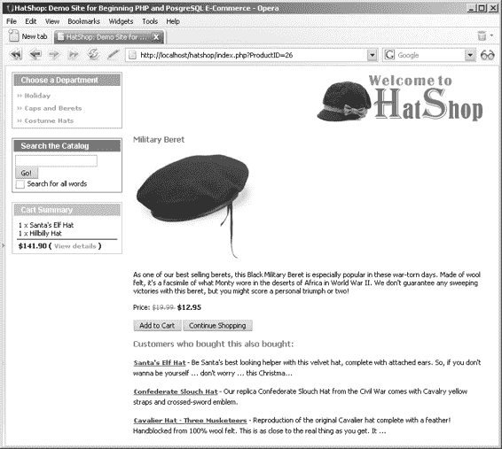
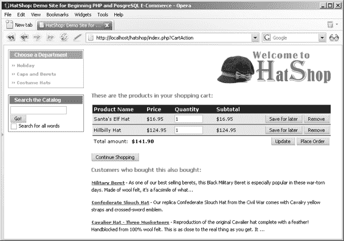

# 产品推荐系统

在本章中，你将在你的`HatShop`网店中实现一个简单但高效的产品推荐系统。根据你店铺的类型，有多种方式可以实现产品推荐系统。以下是几种常见的方法：

**向上销售**：向上销售被定义为一种策略，即向消费者提供基于其已请求购买商品的“升级”或额外附加品的机会。最著名的向上销售例子莫过于——在麦当劳点超值套餐时，顾客常会听到“您想将套餐升级为大份吗？”这句问询。这个看似无害的请求能大幅提高利润率。

**交叉销售**：交叉销售被定义为向顾客提供互补产品的做法。继续以麦当劳为例，当有人点汉堡时，你总会听到“您想加一份薯条吗？”这句话。由于人们普遍认为薯条与汉堡是绝配，而消费者正在点汉堡，那么这位消费者很可能会喜欢薯条——仅仅提及薯条就可能促成新的一单交易。

**首页推荐商品**：`HatShop`已允许网站管理员选择在主页面和部门页面上展示的推荐商品。

在本章中，你将实现一个同时包含向上销售和交叉销售策略的动态推荐系统。该系统的优势在于无需手动维护。由于目前`HatShop`已记录了哪些产品被售出，你将在本章中实现“购买此产品的顾客也购买了……”功能。

## 通过动态推荐提升销量

在`HatShop`中，你将在访客的购物车页面和产品详情页面中实现动态推荐系统。为你的商店添加新功能后，产品详情页面底部将显示产品推荐列表，如图 10-1 所示。

**335**

[www.it-ebooks.info](http://www.it-ebooks.info/)



648XCH10.qxd 11/19/06 1:59 PM Page 336

**336**

第 10 章 ■ 产品推荐

**图 10-1.** *实现了动态推荐系统的产品详情页面*

购物车页面也会增加类似的功能，如图 10-2 所示。

[www.it-ebooks.info](http://www.it-ebooks.info/)



648XCH10.qxd 11/19/06 1:59 PM Page 337

第 10 章 ■ 产品推荐

**337**

**图 10-2.** *实现了动态推荐系统的购物车详情页面*

## 实现数据层

在编写任何代码之前，你首先需要理解实现产品推荐所遵循的逻辑。这里我们重点介绍如何推荐与某个特定产品一同被订购的其他产品。随后，购物车页面的推荐功能将以类似方式运作，但会考虑更多产品。

因此，你需要找出那些购买了当前待推荐产品的顾客同时还购买了哪些其他产品（换句话说，就是确定“购买此产品的顾客也购买了……”的信息）。让我们逐步推导出实现产品推荐列表的 SQL 逻辑。

[www.it-ebooks.info](http://www.it-ebooks.info/)

648XCH10.qxd 11/19/06 1:59 PM Page 338

**338**

第 10 章 ■ 产品推荐

**提示** 由于 SQL 非常强大，实际上你可以通过多种方式实现相同的功能。此处我们仅介绍其中一种方案，但在实现实际数据库函数时，你也会看到其他可选方案。

要确定哪些其他产品与某个特定产品一同被订购，你需要将`order_detail`表的两个实例基于它们的`order_id`字段进行连接。如需快速复习表连接的相关知识，请参阅第 4 章中的“连接数据表”部分。


```sql
-- 连接单个表的多个实例，就像是连接包含相同数据的不同数据表一样。

-- 你通过 `order_id` 字段连接 `order_detail` 的两个实例（分别称为 `od1` 和 `od2`），同时在 `od1` 中过滤 `product_id` 值，以找到你正在查找的产品 ID。这样，在关系的 `od2` 一侧，你将获得与包含目标产品的订单中所有一同订购的产品。

-- 检索与 `product_id` 为 4 的产品一同订购的所有产品的 SQL 代码如下：

SELECT od2.product_id
FROM order_detail od1
JOIN order_detail od2
ON od1.order_id = od2.order_id
WHERE od1.product_id = 4;

-- 这段代码返回一个长长的产品列表，其中包含 `product_id` 为 4 的产品，如下所示：
product_id

-- 从这个结果列表入手，你需要找出与该产品最常一起购买的产品。该产品列表的第一个问题是它包含了 `product_id` 为 4 的产品。为了将其从列表中排除（因为显然你不能把它放进推荐列表里），你只需在 `WHERE` 子句中添加一个额外条件：

SELECT od2.product_id
FROM order_detail od1
JOIN order_detail od2
ON od1.order_id = od2.order_id
WHERE od1.product_id = 4 AND od2.product_id != 4;

-- 毫不意外，你得到了一个与之前类似的产品列表，只是不再包含 `product_id` 为 4 的产品：
product_id

-- 现在返回的产品列表短了很多，但它包含了在包含产品标识符 4 的订单中被多次订购的产品的多个条目。

-- 要获得最相关的推荐，你需要查看哪些产品在此列表中出现的频率更高。你可以通过按 `product_id` 对前一个查询的结果进行分组，并按每个产品在列表中的出现次数（该次数由以下代码片段中的 `rank` 计算列给出）降序排列来实现这一点：

SELECT od2.product_id, COUNT(od2.product_id) AS rank
FROM order_detail od1
JOIN order_detail od2
ON od1.order_id = od2.order_id
WHERE od1.product_id = 4 AND od2.product_id != 4
GROUP BY od2.product_id
ORDER BY rank DESC;

-- 该查询现在返回如下列表：
product_id rank
---------- ----
10 3
5 2
43 2
23 1
25 1
28 1
12 1
14 1

-- 如果你不需要返回 `rank`，可以通过直接在 `ORDER BY` 子句中使用 `COUNT` 聚合函数来重写此查询。你还可以使用 `LIMIT` 关键字来指定你感兴趣的记录数量。如果你想要列表中的前五个产品，以下查询可以实现：

SELECT od2.product_id
FROM order_detail od1
JOIN order_detail od2
ON od1.order_id = od2.order_id
WHERE od1.product_id = 4 AND od2.product_id != 4
GROUP BY od2.product_id
ORDER BY COUNT(od2.product_id) DESC
LIMIT 5;

-- 该查询的结果如下：
product_id

-- 由于这串数字对人类来说意义不大，你可能还想了解推荐产品的名称和描述。以下查询通过从 `product` 表中查询上一个查询返回的 ID（由于篇幅原因，未要求查询描述）来实现这一点：

SELECT product_id, name
FROM product
WHERE product_id IN
(
  SELECT od2.product_id
  FROM order_detail od1
  JOIN order_detail od2 ON od1.order_id = od2.order_id
  WHERE od1.product_id = 4 AND od2.product_id != 4
  GROUP BY od2.product_id
  ORDER BY COUNT(od2.product_id) DESC
  LIMIT 5
);
```


基于之前虚构结果中的数据，此查询返回如下内容：

```
product_id name
---------- -----------------------
10        Vinyl Policeman Cop Hat
43        Hussar Military Hat
5         Red Santa Cowboy Hat
23        Black Basque Beret
28        Moleskin Driver
```

或者，您可能只想使用过去`n`天内的订单数据来计算产品推荐。为此，您需要与包含`date_created`字段的`orders`表进行一次额外的联接。以下查询基于过去 30 天内下的订单计算产品推荐：

```
SELECT product_id, name
FROM product
WHERE product_id IN
(
  SELECT od2.product_id
  FROM order_detail od1
  JOIN order_detail od2
    ON od1.order_id = od2.order_id
  JOIN orders o
    ON od1.order_id = o.order_id
  WHERE od1.product_id = 7
    AND od2.product_id != 7
    AND (NOW() - o.created_on) < 30
  GROUP BY od2.product_id
  ORDER BY COUNT(od2.product_id) DESC
  LIMIT 5
);
```

我们不会在`HatShop`中使用这个技巧，但值得将其作为一种可能性牢记于心。

---

