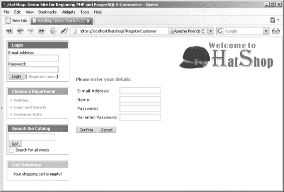
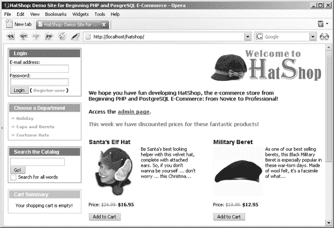
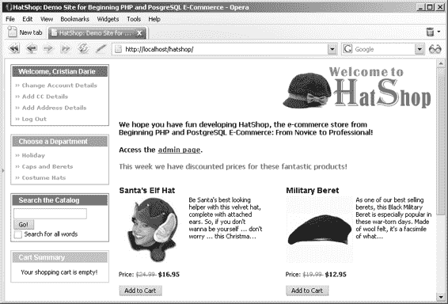
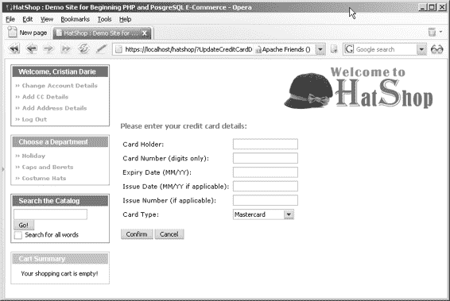

# 非对称加密

**非对称加密：** 使用不同的密钥来加密和解密数据。加密密钥通常被称为**公钥**，任何人都可以用它来加密信息。解密密钥被称为**私钥**，因为它只能用于解密使用公钥加密的数据。加密密钥（公钥）和解密密钥（私钥）在数学上是关联的，并且总是成对生成。公钥和私钥无法相互推导。如果你拥有一对公钥/私钥，你可以将公钥发送给需要为你加密信息的各方。只有你知道与该公钥关联的私钥，因此也只有你能解密信息。

尽管非对称加密更安全，但它也需要更多的处理能力。对称加密速度更快，但安全性可能较低，因为加密者和解密者都知道同一个密钥。使用对称加密时，加密者需要将密钥发送给解密者。在互联网通信中，当密钥发送给加密者时，往往无法确保该密钥对第三方保密。

非对称加密通过使用密钥对解决了这个问题。解密密钥永远无需公开，因此第三方破解加密要困难得多。然而，由于它需要更多的处理能力，实际的操作方法是使用非对称加密在互联网上交换一个对称密钥，然后使用该密钥进行对称加密，因为知道这个密钥没有暴露给第三方。

[www.it-ebooks.info](http://www.it-ebooks.info/)

648XCH11.qxd 11/17/06 3:37 PM 第 361 页

## 第 11 章 ■ 管理客户详细信息

**361**

在 HatShop 应用程序中，事情比互联网通信要简单得多。你只需要加密数据以存储在数据库中，并在需要时解密，因此你可以使用对称加密算法。

> **注意：** 然而，在幕后，也有一些非对称加密在进行，因为这是 HTTPS 通信实现的方法。

与哈希一样，对称和非对称加密都可以使用多种算法。PHP 的`mcrypt`库包含了最重要的对称算法的实现。PHP 中没有处理非对称加密的库，但如果你需要执行非对称加密，可以使用 PGP（Pretty Good Privacy，良好隐私密码法）系列软件（更多信息，请参见 http://www.pgp.com）和 GnuPG（http://www.gnupg.org）。

两种更常用的非对称算法是 DSA（数字签名算法）和 RSA（Rivest-Shamir-Adleman，以其发明者 Ronald Rivest、Adi Shamir 和 Leonard Adleman 的名字命名）。其中，DSA 只能用于“签名”数据以验证其真实性，而 RSA 则用途更广（尽管在生成数字签名时比 DSA 慢）。DSA 是美国政府当前用于数字认证的标准。DSA 和 RSA 这两种非对称算法都在 PGP 系列软件（PGP 和 GnuPG）中实现。

在`mcrypt`库中找到的一些流行的对称算法包括 DES（数据加密标准）、三重 DES（3DES）、RC2（Ron's Code 或 Rivest's Cipher，取决于你问谁，同样由 Ronald Rivest 发明）和 Rijndael（以其发明者 Joan Daemen 和 Vincent Rijmen 的名字命名）。

## DES 和 RIJNDAEL

DES 作为标准已有一段时间，尽管这种情况正在逐渐改变。它使用 64 位密钥，但实际上只使用了其中的 56 位（8 位是“奇偶校验”位），这在当今的计算机面前不足以防止被破解。

三重 DES 和 RC2 都是 DES 的变体。三重 DES 实际上使用三个密钥对数据执行三次独立的 DES 加密，减去校验位后总长度为 168 位。RC2 变体的密钥长度可达 128 位（使用 RC3、RC4 等也可以实现更长的密钥），因此根据密钥大小，它可以比 DES 更弱或更强。

Rijndael 是一种完全独立的加密方法，现已被接受为新的 AES（高级加密标准）标准（在选择 Rijndael 之前考虑了几种竞争的算法）。该标准旨在取代 DES，并逐渐成为最常用（和最安全）的对称加密算法。

与加密和解密数据相关的任务比哈希稍微复杂一些。`mcrypt`函数针对原始数据处理进行了优化，因此你需要进行一些数据转换工作。你还需要定义一个密钥和一个初始化向量（IV）来执行加密和解密。由于加密的特性，需要 IV：数据块通常是按顺序加密的，计算一个位序列的加密值会用到前一个位序列的一些数据。由于加密开始时没有这样的值，因此使用 IV 代替。对于 AES 加密（`Rijndael_128`），IV 和密钥必须为 32 字节长。

> **注意：** 在 http://en.wikipedia.org/wiki/Block_cipher_modes_of_operation，你可以了解更多关于各种加密模式的信息。

加密字符串的一般步骤如下：

1. 创建一个 32 字节的随机 IV。

2. 将 IV（你将其保存为十六进制字符串）转换为字节数组。

3. 通过提供字节数组格式的 IV，使用 AES 加密对字符串进行加密。

4. 将生成的加密数据从字节数组转换为十六进制字符串。

解密遵循类似的方案：

1. 将 IV（你将其保存为十六进制字符串）转换为字节数组（与加密的第一步相同）。

2. 将要解密的字符串转换为字节数组。

3. 通过提供字节数组格式的 IV，对上一步的二进制字符串进行解密。

在你的代码中，你将使用 AES，但`SymmetricCrypt`类中的代码可以修改以使用任何支持的加密算法。

## 练习：实现 SymmetricCrypt 类

在`business`目录中新建一个名为`symmetric_crypt.php`的文件，并在其中写入以下代码：

```php
<?php

class SymmetricCrypt
{
    // 加密/解密密钥
    private static $_msSecretKey = 'From Dusk Till Dawn';

    // 初始化向量
    private static $_msHexaIv = 'c7098adc8d6128b5d4b4f7b2fe7f7f05';

    // 使用 Rijndael 加密算法
    private static $_msCipherAlgorithm = MCRYPT_RIJNDAEL_128;

    /* 函数对接收到的纯文本字符串进行加密，并以十六进制格式返回结果 */
    public static function Encrypt($plainString)
    {
        // 将 SymmetricCrypt::_msHexaIv 打包成二进制字符串
        $binary_iv = pack('H*', self::$_msHexaIv);

        // 加密 $plainString
        $binary_encrypted_string = mcrypt_encrypt(
            self::$_msCipherAlgorithm,
            self::$_msSecretKey,
            $plainString,
            MCRYPT_MODE_CBC,
            $binary_iv);

        // 将 $binary_encrypted_string 转换为十六进制格式
        $hexa_encrypted_string = bin2hex($binary_encrypted_string);

        return $hexa_encrypted_string;
    }

    /* 函数对接收到的十六进制字符串进行解密，并以十六进制格式返回结果 */
    public static function Decrypt($encryptedString)
    {
        // 将 Symmetric::_msHexaIv 打包成二进制字符串
        $binary_iv = pack('H*', self::$_msHexaIv);

        // 将十六进制字符串转换为字节数组
        $binary_encrypted_string = pack('H*', $encryptedString);

        // 解密 $binary_encrypted_string
        $decrypted_string = mcrypt_decrypt(
            self::$_msCipherAlgorithm,
            self::$_msSecretKey,
            $binary_encrypted_string,
            MCRYPT_MODE_CBC,
            $binary_iv
        );
        return $decrypted_string;
    }
}
?>
```

[www.it-ebooks.info](http://www.it-ebooks.info/)

648XCH11.qxd 11/17/06 3:37 PM 第 362 页

## 第 11 章 ■ 管理客户详细信息

**362**

**2.** 在 `hatshop` 文件夹中添加一个名为 `test_encryption.php` 的测试文件，代码如下：

```php
<?php
if (isset ($_GET['my_string']))
{
    require_once 'include/config.php';

    require_once BUSINESS_DIR . 'symmetric_crypt.php';

    $string = $_GET['my_string'];
    echo '字符串是：<br />' . $string . '<br /><br />';
    $encrypted_string = SymmetricCrypt::Encrypt($string);
    echo '加密后的字符串：<br />' . $encrypted_string . '<br /><br />';
    $decrypted_string = SymmetricCrypt::Decrypt($encrypted_string);
    echo '解密后的字符串：<br />' . $decrypted_string;
}
?>

<br /><br />

<form action="test_encryption.php">
输入要加密的字符串：
<input type="text" name="my_string" /><br />
<input type="submit" value="加密" />
</form>
```

**3.** 在您常用的浏览器中加载新创建的 `test_encryption.php` 文件，并输入一个字符串进行加密/解密（参见图 11-2）。

> **注意** 如果 `mcrypt` 库未正确安装或配置，您将会收到关于调用 `mcrypt_encrypt()` 的致命错误。如果发生这种情况，请查看附录 A 中的安装说明。

**图 11-2.** *测试加密*

> **警告** 运行测试页面后您可能会注意到，解密后的字符串长度始终是 32 字节的倍数。如果原始字符串少于 32 字节，则会追加空字符，直到字符串长度变为 32 字节的倍数。需要注意这个细节，因为它意味着解密后的字符串值可能与加密前的值不完全一致。对于我们的 HatShop 项目，由于我们将加密 XML 数据且关注的值位于 XML 标签之间，因此无需担心字符串末尾有多余的空字符。

## 工作原理：业务层中的加密功能

`SymmetricCrypt` 类包含两个静态方法：`Encrypt()` 和 `Decrypt()`，用于加密和解密数据，以及一组以静态成员形式存储的加密配置参数：

```php
// 加密/解密密钥
private static $_msSecretKey = 'From Dusk Till Dawn';

// 初始化向量
private static $_msHexaIv = 'c7098adc8d6128b5d4b4f7b2fe7f7f05';

// 使用 Rijndael 加密算法
private static $_msCipherAlgorithm = MCRYPT_RIJNDAEL_128;
```

对于 AES 算法，密钥长度为 16 个字符（字节）。`mcrypt` 库允许使用更短的密钥，但这会降低加密安全性。对于 AES，IV 必须恰好为 16 字节，并以十六进制字符串形式保存（2x16=32 个字符）。这里的 `$_msSecretKey` 和 `$_msHexaIv` 变量均设置为临时值。根据您想要使用的密钥，它们可以轻松地设置为任何其他值。

`Encrypt()` 首先将 IV 从十六进制值转换为字节数组，因为这是 `mcrypt_encrypt()` 函数（执行实际加密的函数）所期望的格式：

```php
// 将 SymmetricCrypt::_msHexaIv 打包为二进制字符串
$binary_iv = pack('H*', self::$_msHexaIv);
```

该转换使用 PHP 的 `pack()` 函数完成（了解更多信息，请访问 `http://www.php.net/pack`）。

接着调用 `mcrypt_encrypt()`：

```php
// 加密 $plainString
$binary_encrypted_string = mcrypt_encrypt(
    self::$_msCipherAlgorithm,
    self::$_msSecretKey,
    $plainString,
    MCRYPT_MODE_CBC,
    $binary_iv
);
```

这是执行实际加密的调用。其参数含义明确，您可以在 `http://www.php.net/mcrypt` 找到关于 `mcrypt_encrypt()` 函数的更多详细信息。`MCRYPT_MODE_CBC` 指定了“密码分组链接（cipher block chaining）”加密方法；该方法使用了一种链接机制，其中每个数据块的加密都依赖于前几个块的加密结果，但第一个块除外，它使用 `IV` 代替。

最后，加密后的字符串会被转换为十六进制格式，这种格式更易于处理（例如，保存到数据库或配置文件中）：

```php
// 将 $binary_encrypted_string 转换为十六进制格式
$hexa_encrypted_string = bin2hex($binary_encrypted_string);
```

`Decrypt()` 方法与 `Encrypt()` 方法非常相似。首先，你需要将 `IV` 转换为二进制形式（这与你在 `Encrypt()` 方法中的第一步相同）。

由于 `Encrypt()` 方法将加密后的字符串返回为十六进制字符串，因此 `Decrypt()` 的输入参数也是一个十六进制字符串。你必须将此字符串转换为字节数组，这是 `mcrypt_decrypt` 所需的格式：

```php
// 将十六进制字符串转换为字节数组
$binary_encrypted_string = pack('H*', $encryptedString);

// 解密 $binary_encrypted_string
$decrypted_string = mcrypt_decrypt(
    self::$_msCipherAlgorithm,
    self::$_msSecretKey,
    $binary_encrypted_string,
    MCRYPT_MODE_CBC,
    $binary_iv);

return $decrypted_string;
```

此类的测试文件 `test_encryption.php` 只是简单地加密和解密数据，以验证一切正常工作。这个代码非常简单，因此我们在此不再赘述。

现在你已经有了 `SymmetricCrypt` 类的代码，创建安全相关类的最后一步是添加 `SecureCard` 类。

## 使用 SecureCard 类存储信用卡信息

在以下练习中，你将构建 `SecureCard` 类，它代表客户的信用卡。这个类将使用你在前两个练习中实现的功能，以确保其数据能够安全地存储在数据库中。

### 练习：实现 SecureCard 类

1.  在 `business` 文件夹中创建一个名为 `secure_card.php` 的新文件，并向其中添加以下代码：

```php
<?php
// 表示一张信用卡
class SecureCard
{
    // 包含信用卡详细信息的私有成员
    private $_mIsDecrypted = false;
    private $_mIsEncrypted = false;
    private $_mCardHolder;
    private $_mCardNumber;
    private $_mIssueDate;
    private $_mExpiryDate;
    private $_mIssueNumber;
    private $_mCardType;
    private $_mEncryptedData;
    private $_mXmlCardData;

    // 类构造函数
    public function __construct()
    {
        // 此处无操作
    }

    // 解密数据
    public function LoadEncryptedDataAndDecrypt($newEncryptedData)
    {
        $this->_mEncryptedData = $newEncryptedData;
        $this->DecryptData();
    }

    // 加密数据
    public function LoadPlainDataAndEncrypt($newCardHolder, $newCardNumber, $newIssueDate, $newExpiryDate,
        $newIssueNumber, $newCardType)
    {
        $this->_mCardHolder = $newCardHolder;
        $this->_mCardNumber = $newCardNumber;
        $this->_mIssueDate = $newIssueDate;
        $this->_mExpiryDate = $newExpiryDate;
        $this->_mIssueNumber = $newIssueNumber;
        $this->_mCardType = $newCardType;
        $this->EncryptData();
    }

    // 创建包含信用卡信息的 XML
    private function CreateXml()
    {
        // 将卡详情编码为 XML 文档
        $xml_card_data = &$this->_mXmlCardData;
        $xml_card_data = new DOMDocument();
        $document_root = $xml_card_data->createElement('CardDetails');
        $child = $xml_card_data->createElement('CardHolder');
        $child = $document_root->appendChild($child);
        $value = $xml_card_data->createTextNode($this->_mCardHolder);
        $value = $child->appendChild($value);

        $child = $xml_card_data->createElement('CardNumber');
        $child = $document_root->appendChild($child);
    }
}
```

```php
$value = $xml_card_data->createTextNode($this->_mCardNumber);
$value = $child->appendChild($value);

$child = $xml_card_data->createElement('IssueDate');
$child = $document_root->appendChild($child);

$value = $xml_card_data->createTextNode($this->_mIssueDate);
$value = $child->appendChild($value);

$child = $xml_card_data->createElement('ExpiryDate');
$child = $document_root->appendChild($child);

$value = $xml_card_data->createTextNode($this->_mExpiryDate);
$value = $child->appendChild($value);

$child = $xml_card_data->createElement('IssueNumber');
$child = $document_root->appendChild($child);

$value = $xml_card_data->createTextNode($this->_mIssueNumber);
$value = $child->appendChild($value);

$child = $xml_card_data->createElement('CardType');
$child = $document_root->appendChild($child);

$value = $xml_card_data->createTextNode($this->_mCardType);
$value = $child->appendChild($value);

$document_root = $xml_card_data->appendChild($document_root);
}

// 从 XML 信用卡数据中提取信息
private function ExtractXml($decryptedData)
{
    $xml = simplexml_load_string($decryptedData);
    $this->_mCardHolder = (string) $xml->CardHolder;
    $this->_mCardNumber = (string) $xml->CardNumber;
    $this->_mIssueDate = (string) $xml->IssueDate;
    $this->_mExpiryDate = (string) $xml->ExpiryDate;
    $this->_mIssueNumber = (string) $xml->IssueNumber;
    $this->_mCardType = (string) $xml->CardType;
}

// 加密 XML 信用卡数据
private function EncryptData()
{
    // 将数据放入 XML 文档
    $this->CreateXml();

    // 加密数据
    $this->_mEncryptedData = SymmetricCrypt::Encrypt($this->_mXmlCardData->saveXML());

    // 设置加密标志
    $this->_mIsEncrypted = true;
}

// 解密 XML 信用卡数据
private function DecryptData()
{
    // 解密数据
    $decrypted_data = SymmetricCrypt::Decrypt($this->_mEncryptedData);

    // 从 XML 中提取数据
    $this->ExtractXml($decrypted_data);

    // 设置解密标志
    $this->_mIsDecrypted = true;
}

public function __get($name)
{
    if ($name == 'EncryptedData')
    {
        if ($this->_mIsEncrypted)
            return $this->_mEncryptedData;
        else
            throw new Exception('数据未加密');
    }
    elseif ($name == 'CardNumberX')
    {
        if ($this->_mIsDecrypted)
            return 'XXXX-XXXX-XXXX-' . substr($this->_mCardNumber, strlen($this->_mCardNumber) - 4, 4);
        else
            throw new Exception('数据未解密');
    }
    elseif (in_array($name, array('CardHolder', 'CardNumber', 'IssueDate', 'ExpiryDate', 'IssueNumber', 'CardType')))
    {
        $name = '_m' . $name;
        if ($this->_mIsDecrypted)
            return $this->$name;
        else
            throw new Exception('数据未解密');
    }
    else
    {
        throw new Exception('未找到属性 ' . $name);
    }
}
?>
```

**2.** 在 `hatshop` 文件夹中创建一个名为 `test_card.php` 的新文件：

```php
<?php
require_once 'include/config.php';
require_once BUSINESS_DIR . 'symmetric_crypt.php';
require_once BUSINESS_DIR . 'secure_card.php';

$card_holder = 'Mihai Bucica';
$card_number = '1234567890123456';
$expiry_date = '01/09';
$issue_date = '01/01';
$issue_number = 100;
$card_type = 'Mastercard';

echo '<br />信用卡数据：<br />' .
    $card_holder . ', ' . $card_number . ', ' .
    $issue_date . ', ' . $expiry_date . ', ' .
    $issue_number . ', ' . $card_type . '<br />';

$credit_card = new SecureCard();

try
{
    $credit_card->LoadPlainDataAndEncrypt($card_holder, $card_number, $issue_date, $expiry_date, $issue_number, $card_type);
    $encrypted_data = $credit_card->EncryptedData;
}
catch(Exception $e)
{
    echo '<font color="red">异常：' . $e->getMessage() . '</font>';
    exit;
}

echo '<br />加密数据：<br />' . $encrypted_data . '<br />';

$our_card = new SecureCard();

try
{
    $our_card->LoadEncryptedDataAndDecrypt($encrypted_data);
    echo '<br/>解密后的数据:<br/>' .
        $our_card->CardHolder . ', ' . $our_card->CardNumber . ', ' .
        $our_card->IssueDate . ', ' . $our_card->ExpiryDate . ', ' .
        $our_card->IssueNumber . ', ' . $our_card->CardType;
}
catch(Exception $e)
{
    echo '<font color="red">异常：' . $e->getMessage() . '</font>';
    exit;
}
?>
```

`echo '<font color="red">异常: ' . $e->getMessage() . '</font>';`

`exit;`

`}`

`?>`

**3.** 在您喜欢的浏览器中加载 `test_card.php` 文件以查看结果（见图 11-3）。您可以根据需要修改该文件中的数据。

**图 11-3.** *加密和解密信用卡信息*

## 工作原理：SecureCard 类

与之前的示例相比，这里的代码稍多一些，但都非常简单。首先，私有成员变量用于以单个字符串、加密字符串和中间 XML 文档的形式保存卡片详细信息。您还会看到布尔标志位，用于指示数据是否已成功加密或解密：

```php
<?php

// 表示一张信用卡

class SecureCard
{
    // 包含信用卡详细信息的私有成员
    private $_mIsDecrypted = false;
    private $_mIsEncrypted = false;
    private $_mCardHolder;
    private $_mCardNumber;
    private $_mIssueDate;
    private $_mExpiryDate;
    private $_mIssueNumber;
    private $_mCardType;
    private $_mEncryptedData;
    private $_mXmlCardData;
```

接下来，您会看到两个重要的公有方法。公有成员是类公共接口的一部分，为外部客户端提供功能。`LoadEncryptedDataAndDecrypt` 接收一个加密字符串并执行解密；`LoadPlainDataAndEncrypt` 接收明文格式的信用卡数据并进行加密：

```php
    // 解密数据
    public function LoadEncryptedDataAndDecrypt($newEncryptedData)
    {
        $this->_mEncryptedData = $newEncryptedData;
        $this->DecryptData();
    }

    // 加密数据
    public function LoadPlainDataAndEncrypt($newCardHolder, $newCardNumber, $newIssueDate, $newExpiryDate,
                                             $newIssueNumber, $newCardType)
    {
        $this->_mCardHolder = $newCardHolder;
        $this->_mCardNumber = $newCardNumber;
        $this->_mIssueDate = $newIssueDate;
        $this->_mExpiryDate = $newExpiryDate;
        $this->_mIssueNumber = $newIssueNumber;
        $this->_mCardType = $newCardType;
        $this->EncryptData();
    }
```

主要工作由私有的 `EncryptData()` 和 `DecryptData()` 方法完成，稍后将介绍它们。首先，您有两个实用工具方法，用于以 XML 格式打包和解包数据（这使得在与加密格式交换数据时，更容易获取所需的部分）。

XML 是一种非常强大的基于标签的格式，您可以在其中存储各种信息。`SecureCard` 类将客户的信用卡数据存储在如下结构中：

```xml
<?xml version="1.0"?>
<CardDetails>
  <CardHolder>Mihai Bucica</CardHolder>
  <CardNumber>1234567890123456</CardNumber>
  <IssueDate>01/04</IssueDate>
  <ExpiryDate>01/07</ExpiryDate>
  <IssueNumber>100</IssueNumber>
  <CardType>Mastercard</CardType>
</CardDetails>
```

`DOMDocument` 类用于处理 XML 数据；该类知道如何创建、读取和操作 XML 文档，且无需开发人员付出太多努力。DOM（文档对象模型）是最重要且功能最丰富的树形模型 XML 解析 API（应用程序编程接口）。

> **提示** 万维网联盟负责管理 DOM 标准；其官方网站为 http://www.w3.org/DOM/。

借助全新的 PHP 5 DOM 扩展，在 PHP 中读取、创建、编辑、保存和搜索 XML 文档变得前所未有的简单。PHP 5 中的 DOM 扩展完全从头重写，以完全符合 DOM 规范。您可以在 `CreateXml()` 方法中看到此扩展的实际应用，该方法通过创建节点并设置其值，来生成具有上述结构的 XML 文档：

```php
    // 创建包含信用卡信息的 XML
    private function CreateXml()
    {
        // 将卡片详细信息编码为 XML 文档
        $xml_card_data = &$this->_mXmlCardData;
        $xml_card_data = new DOMDocument();
        $document_root = $xml_card_data->createElement('CardDetails');
        $child = $xml_card_data->createElement('CardHolder');
        $child = $document_root->appendChild($child);
        $value = $xml_card_data->createTextNode($this->_mCardHolder);
        $value = $child->appendChild($value);
        ...
        $document_root = $xml_card_data->appendChild($document_root);
    }
```

对于读取 XML 文档，您可以使用 `DOMDocument` 对象，但在 `ExtractXml()` 方法中，我们更倾向于使用 PHP 5 的一个新特性，称为 SimpleXML。虽然不如 `DOMDocument` 复杂和强大，但 SimpleXML 扩展通过将 XML 数据转换为可以简单迭代的数据结构，使得解析 XML 数据变得轻而易举：

```php
    // 从 XML 信用卡数据中提取信息
    private function ExtractXml($decryptedData)
    {
        $xml = simplexml_load_string($decryptedData);
        $this->_mCardHolder = (string) $xml->CardHolder;
        $this->_mCardNumber = (string) $xml->CardNumber;
        $this->_mIssueDate = (string) $xml->IssueDate;
        $this->_mExpiryDate = (string) $xml->ExpiryDate;
        $this->_mIssueNumber = (string) $xml->IssueNumber;
        $this->_mCardType = (string) $xml->CardType;
    }
```

`EncryptData()` 方法首先使用 `CreateXml()` 方法，将在 `SecureCard` 构造函数中提供的详细信息打包成 XML 格式：

```php
    // 加密 XML 信用卡数据
    private function EncryptData()
    {
        // 将数据放入 XML 文档
        $this->CreateXml();
```

接下来，生成的 XML 文档中包含的 XML 字符串被加密成单个字符串，并存储在 `_mEncryptedData` 成员中：

```php
        // 加密数据
        $this->_mEncryptedData =
            SymmetricCrypt::Encrypt($this->_mXmlCardData->saveXML());
```

最后，`_mIsEncrypted` 标志被设置为 `true`，以指示信用卡数据已被加密：

```php
        // 设置加密标志
        $this->_mIsEncrypted = true;
    }
```

`DecryptData()` 方法从加密形式中获取 XML 信用卡数据，对其进行解密，并使用 `ExtractXml()` 方法填充类属性：

```php
    // 解密 XML 信用卡数据
    private function DecryptData()
    {
        // 解密数据
        $decrypted_data = SymmetricCrypt::Decrypt($this->_mEncryptedData);

        // 从 XML 中提取数据
        $this->ExtractXml($decrypted_data);

        // 设置解密标志
        $this->_mIsDecrypted = true;
    }
```

接下来，我们为该类定义一些属性。从 PHP 5 开始，您可以定义一个公有的 `__get` 函数，当您尝试调用一个在类中未定义的方法或读取一个未定义的成员时，该函数会自动被调用。以这段代码片段为例：

```php
$card = new SecureCard();
$encrypted = $card->EncryptedData;
```

由于 `SecureCard` 类中没有名为 `EncryptedData` 的成员，因此会调用 `__get` 函数。在 `__get` 中，您可以检查访问的是哪个属性，并包含返回该属性值的代码。这种技术特别适用于定义类中需要即时计算其值的“虚拟”成员，作为使用 get 函数（如 `getEncryptedData()`）的替代方案。

在我们的例子中，`__get` 函数处理了八个“虚拟”成员。第一个是 `EncryptedData`，仅当 `_mIsEncrypted` 为 `true` 时才返回其值：

```php
    public function __get($name)
    {
        if ($name == 'EncryptedData')
        {
            if ($this->_mIsEncrypted)
                return $this->_mEncryptedData;
            else
                throw new Exception('数据未加密');
        }
    }
```

`CardNumberX` 需要返回一个版本的卡号，其中除了最后四位数字外，所有数字都被混淆（替换为 `X`）。这在向用户显示现有详细信息时非常有用，并且正成为标准做法，因为它能让客户知道他们存储的是哪张卡，而不会向窥探者暴露详细信息：

```php
elseif ($name == 'CardNumberX')
{
    if ($this->_mIsDecrypted)
        return 'XXXX-XXXX-XXXX-' .
            substr($this->_mCardNumber, strlen($this->_mCardNumber) - 4, 4);
    else
        throw new Exception('Data not decrypted');
}
```

最后六个属性（`CardHolder`、`CardNumber`、`IssueDate`、`ExpiryDate`、`IssueNumber` 和 `CardType`）在一个代码块中处理：

```php
elseif (in_array($name, array ('CardHolder', 'CardNumber', 'IssueDate',
    'ExpiryDate', 'IssueNumber', 'CardType')))
{
    $name = '_m' . $name;
    if ($this->_mIsDecrypted)
        return $this->$name;
    else
        throw new Exception('Data not decrypted');
}
else
{
    throw new Exception('Property ' . $name . ' not found');
}
```

请注意，在所有情况下，只有当 `_mIsDecrypted` 为 `true` 时，数据才可访问；否则，会抛出一个异常。

另外，请注意，数据在加密后不可访问——用于初始化 `SecureCard` 对象的数据仅以加密形式可访问。这与其说是技术问题，不如说是一种用例决策，因为此类仅用于加密和解密，而非持久化表示信用卡详细信息。在 `SecureCard` 实例用于加密卡详细信息后，我们随后不应再需要访问未加密的数据，而只需要加密后的字符串。

> **注意** 在继续讨论客户端代码之前，有必要解释并强调一个你可能已经注意到的、重要的设计考量。在任何时候，卡片的详细信息都未被验证。实际上，此类对于任何属性使用空字符串也能完美运行。这是为了让类尽可能保持通用。信用卡详细信息更有可能作为输入它们的用户界面的一部分进行验证，甚至根本不验证。这毫无危险——如果使用了无效的详细信息，那么信用卡交易只会失败，而我们处理该情况的方式与处理资金不足所需的逻辑非常相似（即，我们通知客户交易失败，并要求他们尝试另一张卡）。当然，也存在简单的数据格式问题（例如，日期通常是 `MM/YY`），但如前所述，这些问题可以在 `SecureCard` 类外部处理。

此类的测试页面（`test_cart.php`）仅允许你查看加密后的卡片外观。如你所见，会生成大量数据，这也是客户数据库中列尺寸较大的原因。你还可以看到加密和解密都完美运行，因此现在你可以继续学习本章的客户账户部分。

## 为 HatShop 添加客户账户功能

在实现客户账户功能的可视部分之前，让我们预览一下本章最后部分将要进行的工作。

首先，我们希望在站点前端有一个登录表单。我们还希望允许用户在站点上注册并编辑他们的个人资料。你将创建一个用于登录表单的组件化模板，并将其放置在部门列表的正上方，如图 11-4 所示。





**图 11-4.** *带登录框的 HatShop*

新用户注册页面如图 11-5 所示。



**图 11-5.** *HatShop 中的新用户注册页面*

用户登录网站后，部门列表上方会出现一个新的组件化模板，用于显示登录用户的姓名以及管理其账户的一系列链接（见图 11-6）。

**图 11-6.** *已登录用户的 HatShop 示例页面* 点击 `Add CC Details` 链接，将跳转至图 11-7 所示的页面。

[www.it-ebooks.info](http://www.it-ebooks.info/)



648XCH11.qxd 11/17/06 3:37 PM Page 379

**379**

**图 11-7.** *添加信用卡信息*

点击 `Add Address Details` 链接时，会显示类似的表单。若用户已存在信用卡和地址信息，`Welcome` 框中的 `Add...` 链接将变为 `Change...` 链接。

您将从编写支持 UI 的数据层代码开始实现新功能。

## 实现数据层

在接下来的练习中，您将创建支持客户账户功能的常规数据层函数，我们将逐一进行说明。

[www.it-ebooks.info](http://www.it-ebooks.info/)

648XCH11.qxd 11/17/06 3:37 PM Page 380

**380**

## 练习：创建数据库函数

1. 加载 `pgAdmin III`，并连接到 `hatshop` 数据库。

2. 点击 `Tools` ➤ `Query tool`（或点击工具栏中的 `SQL` 按钮）。此时应出现一个新的查询窗口。

3. 使用查询工具执行以下代码，以在 `hatshop` 数据库中创建 `customer_login` 类型和 `customer_get_login_info` 函数：

```sql
-- 创建 customer_login_info 类型

CREATE TYPE customer_login_info AS
(
customer_id INTEGER,
password VARCHAR(50)
);

-- 创建 customer_get_login_info 函数

CREATE FUNCTION customer_get_login_info(VARCHAR(100))
RETURNS customer_login_info LANGUAGE plpgsql AS $$
DECLARE
inEmail ALIAS FOR $1;
outCustomerLoginInfoRow customer_login_info;
BEGIN
SELECT INTO outCustomerLoginInfoRow
customer_id, password
FROM customer
WHERE email = inEmail;
RETURN outCustomerLoginInfoRow;
END;
$$;
```

当用户登录网站时，必须验证其密码。`customer_get_login_info` 函数会返回特定电子邮件地址对应的客户 ID 和密码哈希值。

4. 使用查询工具执行以下代码，以在 `hatshop` 数据库中创建 `customer_add` 函数：

```sql
-- 创建 customer_add 函数

CREATE FUNCTION customer_add(
VARCHAR(50), VARCHAR(100), VARCHAR(50))
RETURNS INTEGER LANGUAGE plpgsql AS $$
DECLARE
inName ALIAS FOR $1;
inEmail ALIAS FOR $2;
inPassword ALIAS FOR $3;
outCustomerId INTEGER;
BEGIN
INSERT INTO customer (name, email, password)
VALUES (inName, inEmail, inPassword);
SELECT INTO outCustomerId
currval('customer_customer_id_seq');
RETURN outCustomerId;
END;
$$;
```

当用户在网站上注册时，会调用 `customer_add` 函数。该方法会返回该用户的客户 ID，以便保存在会话中。

5. 使用查询工具执行以下代码，以在 `hatshop` 数据库中创建 `customer_get_customer` 函数：

```sql
-- 创建 customer_get_customer 函数

CREATE FUNCTION customer_get_customer(INTEGER)
RETURNS customer LANGUAGE plpgsql AS $$
DECLARE
inCustomerId ALIAS FOR $1;
outCustomerRow customer;
BEGIN
SELECT INTO outCustomerRow
customer_id, name, email, password, credit_card,
address_1, address_2, city, region, postal_code, country, shipping_region_id, day_phone, eve_phone, mob_phone
FROM customer
WHERE customer_id = inCustomerId;
RETURN outCustomerRow;
END;
$$;
```

`customer_get_customer` 函数会返回特定客户 ID 的完整客户详细信息。

6. 使用查询工具执行以下代码，以在 `hatshop` 数据库中创建 `customer_update_account` 函数：

```sql
-- 创建 customer_update_account 函数

CREATE FUNCTION customer_update_account(INTEGER, VARCHAR(50), VARCHAR(100), VARCHAR(50), VARCHAR(100), VARCHAR(100), VARCHAR(100))
RETURNS VOID LANGUAGE plpgsql AS $$
DECLARE
inCustomerId ALIAS FOR $1;
inName ALIAS FOR $2;
inEmail ALIAS FOR $3;
inPassword ALIAS FOR $4;
inDayPhone ALIAS FOR $5;
inEvePhone ALIAS FOR $6;
inMobPhone ALIAS FOR $7;
BEGIN
UPDATE customer
SET name = inName, email = inEmail,
password = inPassword, day_phone = inDayPhone,
eve_phone = inEvePhone, mob_phone = inMobPhone
WHERE customer_id = inCustomerId;
END;
$$;
```

`customer_update_account` 函数在数据库中更新客户的账户详情。

7. 使用查询工具执行以下代码，在 `hatshop` 数据库中创建 `customer_update_credit_card` 函数：

```sql
-- Create customer_update_credit_card function
CREATE FUNCTION customer_update_credit_card(INTEGER, TEXT) RETURNS VOID LANGUAGE plpgsql AS $$
DECLARE
inCustomerId ALIAS FOR $1;
inCreditCard ALIAS FOR $2;
BEGIN
UPDATE customer
SET credit_card = inCreditCard
WHERE customer_id = inCustomerId;
END;
$$;
```

`customer_update_credit_card` 函数在数据库中更新客户的信用卡信息。它只更新客户的 `credit_card` 列，该列包含客户完整信用卡详情 XML 文档的加密版本。

8. 使用查询工具执行以下代码，在 `hatshop` 数据库中创建 `customer_get_shipping_regions` 函数：

```sql
-- Create customer_get_shipping_regions function
CREATE FUNCTION customer_get_shipping_regions()
RETURNS SETOF shipping_region LANGUAGE plpgsql AS $$
DECLARE
outShippingRegion shipping_region;
BEGIN
FOR outShippingRegion IN
SELECT shipping_region_id, shipping_region
FROM shipping_region
LOOP
RETURN NEXT outShippingRegion;
END LOOP;
RETURN;
END;
$$;
```

`customer_get_shipping_regions` 函数返回数据库中的配送区域，用于客户地址详情页面。

9. 使用查询工具执行以下代码，在 `hatshop` 数据库中创建 `customer_update_address` 函数：

```sql
-- Create customer_update_address function
CREATE FUNCTION customer_update_address(INTEGER, VARCHAR(100), VARCHAR(100), VARCHAR(100),
VARCHAR(100), VARCHAR(100), VARCHAR(100), INTEGER)
RETURNS VOID LANGUAGE plpgsql AS $$
DECLARE
inCustomerId ALIAS FOR $1;
inAddress1 ALIAS FOR $2;
inAddress2 ALIAS FOR $3;
inCity ALIAS FOR $4;
inRegion ALIAS FOR $5;
inPostalCode ALIAS FOR $6;
inCountry ALIAS FOR $7;
inShippingRegionId ALIAS FOR $8;
BEGIN
UPDATE customer
SET address_1 = inAddress1, address_2 = inAddress2, city = inCity, region = inRegion, postal_code = inPostalCode,
country = inCountry, shipping_region_id = inShippingRegionId WHERE customer_id = inCustomerId;
END;
$$;
```

`customer_update_address`函数在数据库中更新客户的地址。

## 实现业务层

在`business`文件夹中，创建一个名为`customer.php`的新文件，该文件将包含`Customer`类。`Customer`类稍长一些，它主要访问数据层功能以响应来自表示层的请求。在`business/customer.php`文件中编写以下代码：

```php
<?php
// 管理客户账户功能的业务层类
class Customer
{
    // 检查会话中是否存在 customer_id
    public static function IsAuthenticated()
    {
        if (!(isset ($_SESSION['hatshop_customer_id'])))
            return 0;
        else
            return 1;
    }

    // 返回与邮箱 $email 对应的客户 id 和密码
    public static function GetLoginInfo($email)
    {
        // 构建 SQL 查询
        $sql = 'SELECT * FROM customer_get_login_info(:email);';
    }
}
```