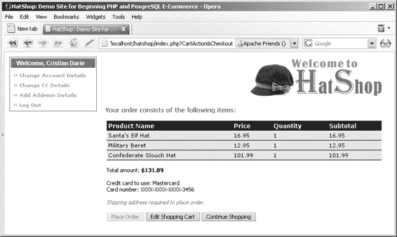
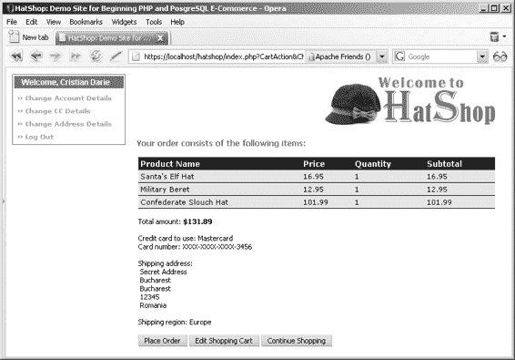
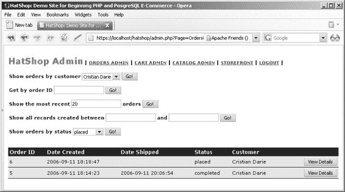
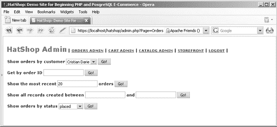
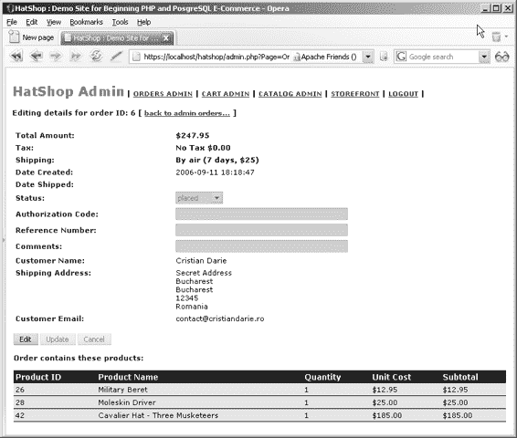
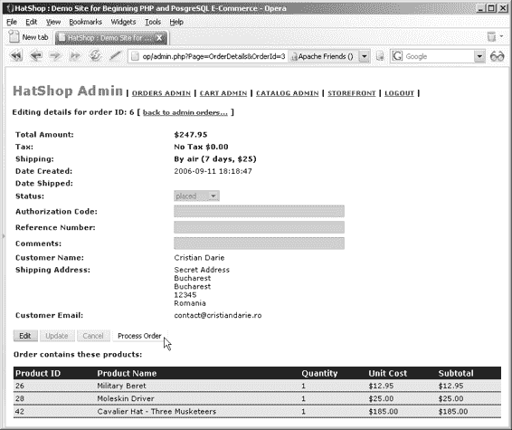
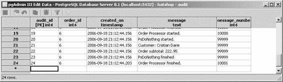

# 第 11 章：管理客户详细信息

```php
// 构建参数数组
$params = array(':email' => $email);

// 使用 PDO 特定功能准备语句
$result = DatabaseHandler::Prepare($sql);

// 执行查询并返回结果
return DatabaseHandler::GetRow($result, $params);
```

```php
public static function IsValid($email, $password)
{
    $customer = self::GetLoginInfo($email);
    if (empty($customer['customer_id']))
        return 2;
    $customer_id = $customer['customer_id'];
    $hashed_password = $customer['password'];
    if (PasswordHasher::Hash($password) != $hashed_password)
        return 1;
    else
    {
        $_SESSION['hatshop_customer_id'] = $customer_id;
        return 0;
    }
}
```

```php
public static function Logout()
{
    unset($_SESSION['hatshop_customer_id']);
}
```

```php
public static function GetCurrentCustomerId()
{
    if (self::IsAuthenticated())
        return $_SESSION['hatshop_customer_id'];
    else
        return 0;
}
```

```php
/* 添加新客户账户，若 $addAndLogin 为 true 则将其登录，并返回 customer_id */
public static function Add($name, $email, $password, $addAndLogin = true)
{
    $hashed_password = PasswordHasher::Hash($password);

    // 构建 SQL 查询
    $sql = 'SELECT customer_add(:name, :email, :password);';

    // 构建参数数组
    $params = array(':name' => $name, ':email' => $email,
                    ':password' => $hashed_password);

    // 使用 PDO 特定功能准备语句
    $result = DatabaseHandler::Prepare($sql);

    // 执行查询并获取 customer_id
    $customer_id = DatabaseHandler::GetOne($result, $params);
    if ($addAndLogin)
        $_SESSION['hatshop_customer_id'] = $customer_id;

    return $customer_id;
}
```

```php
public static function Get($customerId = null)
{
    if (is_null($customerId))
        $customerId = self::GetCurrentCustomerId();

    // 构建 SQL 查询
    $sql = 'SELECT * FROM customer_get_customer(:customer_id);';

    // 构建参数数组
    $params = array(':customer_id' => $customerId);

    // 使用 PDO 特定功能准备语句
    $result = DatabaseHandler::Prepare($sql);

    // 执行查询并返回结果
    return DatabaseHandler::GetRow($result, $params);
}
```

```php
public static function UpdateAccountDetails($name, $email, $password, $dayPhone, $evePhone, $mobPhone,
                                            $customerId = null)
{
    if (is_null($customerId))
        $customerId = self::GetCurrentCustomerId();

    $hashed_password = PasswordHasher::Hash($password);

    // 构建 SQL 查询
    $sql = 'SELECT customer_update_account(:customer_id, :name, :email,
            :password, :day_phone, :eve_phone, :mob_phone);';

    // 构建参数数组
    $params = array(':customer_id' => $customerId, ':name' => $name,
                    ':email' => $email, ':password' => $hashed_password,
                    ':day_phone' => $dayPhone, ':eve_phone' => $evePhone,
                    ':mob_phone' => $mobPhone);

    // 使用 PDO 特定功能准备语句
    $result = DatabaseHandler::Prepare($sql);

    // 执行查询
    return DatabaseHandler::Execute($result, $params);
}
```

```php
public static function DecryptCreditCard($encryptedCreditCard)
{
    $secure_card = new SecureCard();
    $secure_card->LoadEncryptedDataAndDecrypt($encryptedCreditCard);
    $credit_card = array();
    $credit_card['card_holder'] = $secure_card->CardHolder;
    $credit_card['card_number'] = $secure_card->CardNumber;
    $credit_card['issue_date'] = $secure_card->IssueDate;
    $credit_card['expiry_date'] = $secure_card->ExpiryDate;
    $credit_card['issue_number'] = $secure_card->IssueNumber;
    $credit_card['card_type'] = $secure_card->CardType;
    $credit_card['card_number_x'] = $secure_card->CardNumberX;
    return $credit_card;
}
```

```php
public static function GetPlainCreditCard()
{
    $customer_data = self::Get();
    if (!(empty($customer_data['credit_card'])))
        return self::DecryptCreditCard($customer_data['credit_card']);
    else
        return array('card_holder' => '', 'card_number' => '',
                     'issue_date' => '', 'expiry_date' => '',

    // 原文在此处结束。
```

```php
'issue_number' => '', 'card_type' => '',
'card_number_x' => '');
}

public static function UpdateCreditCardDetails($plainCreditCard, $customerId = null)
{
    if (is_null($customerId))
        $customerId = self::GetCurrentCustomerId();

    $secure_card = new SecureCard();
    $secure_card->LoadPlainDataAndEncrypt($plainCreditCard['card_holder'], $plainCreditCard['card_number'], $plainCreditCard['issue_date'], $plainCreditCard['expiry_date'], $plainCreditCard['issue_number'], $plainCreditCard['card_type']);
    $encrypted_card = $secure_card->EncryptedData;

    // 构建 SQL 查询语句
    $sql = 'SELECT customer_update_credit_card(
        :customer_id, :credit_card);';

    // 构建参数数组
    $params = array (':customer_id' => $customerId,
                      ':credit_card' => $encrypted_card);

    // 使用 PDO 特定功能准备语句
    $result = DatabaseHandler::Prepare($sql);

    // 执行查询
    return DatabaseHandler::Execute($result, $params);
}

public static function GetShippingRegions()
{
    // 构建 SQL 查询语句
    $sql = 'SELECT * FROM customer_get_shipping_regions();';

    // 使用 PDO 特定功能准备语句
    $result = DatabaseHandler::Prepare($sql);

    // 执行查询并返回结果
    return DatabaseHandler::GetAll($result);
}

public static function UpdateAddressDetails($address1, $address2, $city, $region, $postalCode, $country, $shippingRegionId, $customerId = null)
{
    if (is_null($customerId))
        $customerId = self::GetCurrentCustomerId();

    // 构建 SQL 查询语句
    $sql = 'SELECT customer_update_address(:customer_id, :address_1,
        :address_2, :city, :region, :postal_code, :country,
        :shipping_region_id);';

    // 构建参数数组
    $params = array (':customer_id' => $customerId,
                      ':address_1' => $address1, ':address_2' => $address2,
                      ':city' => $city, ':region' => $region,
                      ':postal_code' => $postalCode,
                      ':country' => $country,
                      ':shipping_region_id' => $shippingRegionId);

    // 使用 PDO 特定功能准备语句
    $result = DatabaseHandler::Prepare($sql);

    // 执行查询
    return DatabaseHandler::Execute($result, $params);
}
}
?>
```

## 实现表示层

HatShop 客户账户系统的表示层由以下组件化模板构成：

- `customer_login`：登录框。
- `customer_logged`：用户登录后，此组件化模板将取代 `customer_login` 组件化模板，显示当前登录用户，并提供账户管理和退出链接。
- `customer_details`：用于注册新用户或编辑现有用户的基本信息。
- `customer_address`：允许用户添加/编辑地址信息。
- `customer_credit_card`：允许用户添加/编辑信用卡信息。

现在请按照练习步骤来实现这些新的组件化模板。

### 练习：实现组件化模板

**1.** 在 `presentation/templates` 文件夹中创建一个名为 `customer_login.tpl` 的新模板文件，并添加以下代码：

```
{* customer_login.tpl *}

{load_customer_login assign="customer_login"}

<div class="left_box" id="login_box">

  <p>登录</p>

  <form method="post"

        action="{$customer_login->mCustomerLoginTarget|prepare_link:"https"}">

    {if $customer_login->mLoginMessage}

      <span class="error_text">

        {$customer_login->mLoginMessage}

      </span>

      <br />

    {/if}

    <span>电子邮件地址：</span><br />

    <input type="text" maxlength="50" name="email"

           size="25" value="{$customer_login->mEmail}" /><br />

    <span>密码：</span><br />

    <input type="password" maxlength="50"

           name="password" size="25" />

    <br />

    <input type="submit" name="Login" value="登录" />

    <strong>(

      {strip}

<a href="{$customer_login->mRegisterUser|prepare_link:"https"}"> 注册用户</a>
```

**2.** 在 `presentation/smarty_plugins` 文件夹中创建一个新的插件文件 `function.load_customer_login.php`，并添加以下内容：

```php
<?php

/* Smarty plugin function that gets called when the
   load_customer_login function plugin is loaded from a template */
function smarty_function_load_customer_login($params, $smarty)
{
    // Create CustomerLogin object
    $customer_login = new CustomerLogin();
    $customer_login->init();

    // Assign template variable
    $smarty->assign($params['assign'], $customer_login);
}

class CustomerLogin
{
    // Public stuff
```


```php
public $mLoginMessage;

public $mCustomerLoginTarget;

public $mRegisterUser;

public $mEmail = '';

// Private stuff

private $_mHaveData = 0;

// Class constructor

public function __construct()

{

    // Decide if we have submitted

    if (isset ($_POST['Login']))

        $this->_mHaveData = 1;

}

public function init()

{

    $url_base = substr(getenv('REQUEST_URI'),

        strrpos(getenv('REQUEST_URI'), '/') + 1,

        strlen(getenv('REQUEST_URI')) - 1);

    $url_parameter_prefix = (count($_GET) == 0 ? '?' : '&');

    $this->mCustomerLoginTarget = $url_base;

    if (strpos($url_base, 'RegisterCustomer', 0) === false)

        $this->mRegisterUser = $url_base . $url_parameter_prefix .

            'RegisterCustomer';

    else

        $this->mRegisterUser = $url_base;

    if ($this->_mHaveData)

    {

        // Get login status

        $login_status = Customer::IsValid($_POST['email'], $_POST['password']);

        switch ($login_status)

        {

            case 2:

                $this->mLoginMessage = 'Unrecognized Email.';

                $this->mEmail = $_POST['email'];

                break;

            case 1:

                $this->mLoginMessage = 'Unrecognized password.';

                $this->mEmail = $_POST['email'];

                break;

            case 0:

                // Valid login... build redirect link and redirect

                if (isset($_GET['Checkout']) && USE_SSL != 'no')

                {

                    $redirect_link = 'https://' . getenv('SERVER_NAME');

                }

                else

                {

                    $redirect_link = 'http://' . getenv('SERVER_NAME');

                    // If HTTP_SERVER_PORT is defined and different than default

                    if (defined('HTTP_SERVER_PORT') && HTTP_SERVER_PORT != '80')

                    {

                        // Append server port

                        $redirect_link .= ':' . HTTP_SERVER_PORT;

                    }

                }

                $redirect_link .= VIRTUAL_LOCATION . $this->mCustomerLoginTarget;

                header('Location:' . $redirect_link);

                exit;

        }

    }

}

}

?>
```

3. 在`presentation/templates`文件夹中创建一个新的模板文件`customer_logged.tpl`，并添加以下代码：

```smarty
{* customer_logged.tpl *}

{load_customer_logged assign="customer_logged"}

<div class="left_box" id="login_box">

  <p>欢迎, {$customer_logged->mCustomerName}</p>

  <ol>

    <li>

      <a href="{$customer_logged->mUpdateAccount|prepare_link:"https"}">

        » 更改账户详情

      </a>

    </li>

    <li>

      <a href="{$customer_logged->mUpdateCreditCard|prepare_link:"https"}">

        » {$customer_logged->mCreditCardAction} 信用卡详情

      </a>

    </li>

    <li>

      <a href="{$customer_logged->mUpdateAddress|prepare_link:"https"}">

        » {$customer_logged->mAddressAction} 地址详情

      </a>

    </li>

    <li>

      <a href="{$customer_logged->mLogout|prepare_link}">

        » 注销

      </a>

    </li>

  </ol>

</div>
```

4. 在`presentation/smarty_plugins`文件夹中创建一个新的插件文件`function.load_customer_logged.php`，并添加以下内容：

```php
<?php

/* Smarty plugin function that gets called when the

   load_customer_logged function plugin is loaded from a template */

function smarty_function_load_customer_logged($params, $smarty)

{

    // Create CustomerLogged object

    $customer_logged = new CustomerLogged();

    $customer_logged->init();

    // Assign template variable

    $smarty->assign($params['assign'], $customer_logged);

}

class CustomerLogged

{

    // Public attributes

    public $mCustomerName;

    public $mCreditCardAction = 'Add';

    public $mAddressAction = 'Add';

}
```

```markdown
# 客户详情处理

## 类属性与构造函数

```php
public $mUpdateAccount;
public $mUpdateCreditCard;
public $mUpdateAddress;
public $mLogout;

// 类构造函数
public function __construct()
{
}
```

## 初始化方法

```php
public function init()
{
    $url_base = substr(getenv('REQUEST_URI'), strrpos(getenv('REQUEST_URI'), '/') + 1, strlen(getenv('REQUEST_URI')) - 1);
    $url_parameter_prefix = (count($_GET) == 1 ? '?' : '&');
    if (isset($_GET['Logout']))
        $url_base = str_replace($url_parameter_prefix . 'Logout', '', $url_base);
    elseif (isset($_GET['UpdateAccountDetails']))
        $url_base = str_replace($url_parameter_prefix . 'UpdateAccountDetails', '', $url_base);
    elseif (isset($_GET['UpdateCreditCardDetails']))
        $url_base = str_replace($url_parameter_prefix . 'UpdateCreditCardDetails', '', $url_base);
    elseif (isset($_GET['UpdateAddressDetails']))
        $url_base = str_replace($url_parameter_prefix . 'UpdateAddressDetails', '', $url_base);

    if (strpos($url_base, '?', 0) === false)
        $url_parameter_prefix = '?';
    else
        $url_parameter_prefix = '&';

    if (isset($_GET['Logout']))
    {
        Customer::Logout();
        // 重定向
        if (isset($_GET['Checkout']) && USE_SSL != 'no')
        {
            $redirect_link = 'https://' . getenv('SERVER_NAME');
        }
        else
        {
            $redirect_link = 'http://' . getenv('SERVER_NAME');
            // 如果 `HTTP_SERVER_PORT` 已定义且不同于默认值
            if (defined('HTTP_SERVER_PORT') && HTTP_SERVER_PORT != '80')
            {
                // 追加服务器端口
                $redirect_link .= ':' . HTTP_SERVER_PORT;
            }
        }
        $redirect_link .= VIRTUAL_LOCATION . $url_base;
        header('Location:' . $redirect_link);
        exit;
    }

    $url_base .= $url_parameter_prefix;

    $this->mUpdateAccount = $url_base . 'UpdateAccountDetails';
    $this->mUpdateCreditCard = $url_base . 'UpdateCreditCardDetails';
    $this->mUpdateAddress = $url_base . 'UpdateAddressDetails';
    $this->mLogout = $url_base . 'Logout';

    $customer_data = Customer::Get();
    $this->mCustomerName = $customer_data['name'];

    if (!(empty($customer_data['credit_card'])))
        $this->mCreditCardAction = 'Change';

    if (!(empty($customer_data['address_1'])))
        $this->mAddressAction = 'Change';
}
```

## 创建模板文件

**5.** 在`presentation/templates`文件夹中创建一个新的模板文件，命名为`customer_details.tpl`，并添加以下代码：

```smarty
{* customer_details.tpl *}

{load_customer_details assign="customer_details"}

<form method="post"

      action="{$customer_details->mCustomerDetailsTarget|prepare_link:"https"}">

<span class="description">请输入您的详细信息：</span>

{if $customer_details->mEmailAlreadyTaken}

<br /><br />

<span class="error_text">

  该电子邮件地址已被其他用户使用。

</span>

{/if}

<br /><br />

<table class="form_table">

  <tr>

    <td>电子邮件地址：</td>

    <td>

      <input type="text" name="email"

             value="{$customer_details->mEmail}"

             {if $customer_details->mEditMode}readonly="readonly"{/if} />

    </td>

    <td>

      {if $customer_details->mEmailError}

        <span class="error_text">

          您必须输入电子邮件地址。

        </span>

      {/if}

    </td>

  </tr>

  <tr>

    <td>姓名：</td>

    <td>

      <input type="text" name="name"

             value="{$customer_details->mName}" />

    </td>

    <td>

      {if $customer_details->mNameError}

        <span class="error_text">您必须输入姓名。</span>

      {/if}

    </td>

  </tr>

  <tr>

    <td>密码：</td>

    <td><input type="password" name="password" /></td>

    <td>

      {if $customer_details->mPasswordError}

        <span class="error_text">您必须输入密码。</span>

      {/if}

    </td>

  </tr>

  <tr>

    <td>再次输入密码：</td>

    <td><input type="password" name="passwordConfirm" /></td>

    <td>

      {if $customer_details->mPasswordConfirmError}

        <span class="error_text">

          您必须重新输入密码。

        </span>

      {elseif $customer_details->mPasswordMatchError}

        <span class="error_text">

          您必须重新输入相同的密码。

        </span>

      {/if}

    </td>

  </tr>

  {if $customer_details->mEditMode}

  <tr>

    <td>日间电话：</td>

    <td>
```

```html
<input type="text" name="dayPhone" value="{$customer_details->mDayPhone}" />
</td>
</tr>
<tr>
<td>晚间电话：</td>
<td>
<input type="text" name="evePhone" value="{$customer_details->mEvePhone}" />
</td>
</tr>
<tr>
<td>移动电话：</td>
<td>
<input type="text" name="mobPhone" value="{$customer_details->mMobPhone}" />
</td>
</tr>
{/if}
</table>
<br />
<input type="submit" name="sended" value="确认" />
<input type="button" value="取消" onclick="window.location='{$customer_details->mReturnLink|prepare_link:$customer_details->mReturnLinkProtocol}';" />
</form>

**6.** 在`presentation/smarty_plugins`文件夹中创建一个名为`function.load_customer_details.php`的新插件文件，并添加以下内容：

```php
<?php

/* Smarty 插件函数，当从模板加载 load_customer_details 函数插件时被调用 */

function smarty_function_load_customer_details($params, $smarty)

{

  // 创建 CustomerDetails 对象

  $customer_details = new CustomerDetails();

  $customer_details->init();

  // 分配模板变量

  $smarty->assign($params['assign'], $customer_details);

}

class CustomerDetails

{

  // 公共属性

  public $mEditMode = 0;

  public $mCustomerDetailsTarget;

  public $mReturnLink;

  public $mReturnLinkProtocol = 'http';

  public $mEmail;

  public $mName;

  public $mPassword;

  public $mDayPhone = null;

  public $mEvePhone = null;

  public $mMobPhone = null;

  public $mNameError = 0;

  public $mEmailError = 0;

  public $mPasswordError = 0;

  public $mPasswordConfirmError = 0;

  public $mPasswordMatchError = 0;

  public $mEmailAlreadyTaken = 0;

  // 私有属性

  private $_mErrors = 0;

  private $_mHaveData = 0;

  // 类构造函数

  public function __construct()

  {

    // 检查是新建用户还是编辑现有客户详情

    if (Customer::IsAuthenticated())

      $this->mEditMode = 1;

    $url_base = substr(getenv('REQUEST_URI'),

                       strrpos(getenv('REQUEST_URI'), '/') + 1,

                       strlen(getenv('REQUEST_URI')) - 1);

    $url_parameter_prefix = (count($_GET) == 1 ? '?' : '&');

    $this->mCustomerDetailsTarget = $url_base;

    if ($this->mEditMode == 0)

      $this->mReturnLink = str_replace($url_parameter_prefix .

                                       'RegisterCustomer', '', $url_base);

    else

      $this->mReturnLink = str_replace($url_parameter_prefix .

                                       'UpdateAccountDetails', '', $url_base);

    if (isset($_GET['Checkout']) && USE_SSL != 'no')

      $this->mReturnLinkProtocol = 'https';

    // 检查是否有提交的数据

    if (isset ($_POST['sended']))

      $this->_mHaveData = 1;

    if ($this->_mHaveData == 1)

    {

      // 姓名不能为空

      if (empty ($_POST['name']))

      {

        $this->mNameError = 1;

        $this->_mErrors++;

      }

      else

        $this->mName = $_POST['name'];

      if ($this->mEditMode == 0 && empty ($_POST['email']))

      {

        $this->mEmailError = 1;

        $this->_mErrors++;

      }

      else

        $this->mEmail = $_POST['email'];

      // 密码不能为空

      if (empty ($_POST['password']))

      {

        $this->mPasswordError = 1;

        $this->_mErrors++;

      }

      else

        $this->mPassword = $_POST['password'];

      // 密码确认不能为空

      if (empty ($_POST['passwordConfirm']))

      {

        $this->mPasswordConfirmError = 1;

        $this->_mErrors++;

      }

      else

        $password_confirm = $_POST['passwordConfirm'];

      // 密码和密码确认应一致

      if (!isset ($password_confirm) ||

          $this->mPassword != $password_confirm)

      {

        $this->mPasswordMatchError = 1;

        $this->_mErrors++;

      }

      if ($this->mEditMode == 1)

      {

        if (!empty ($_POST['dayPhone']))

          $this->mDayPhone = $_POST['dayPhone'];

        if (!empty ($_POST['evePhone']))

          $this->mEvePhone = $_POST['evePhone'];

        if (!empty ($_POST['mobPhone']))

          $this->mMobPhone = $_POST['mobPhone'];

      }

    }

  }

  public function init()

  {

```

**399**

```
{

    // 如果已提交数据且数据无误

    if (($this->_mHaveData == 1) && ($this->_mErrors == 0))

    {
```

// 检查是否有客户使用提交的邮箱……

`$customer_read = Customer::GetLoginInfo($this->mEmail);`

/* ……如果存在这样的客户，且处于“新用户”模式，则提示邮箱已被占用 */

`if ((!(empty ($customer_read['customer_id']))) && ($this->mEditMode == 0))`

`{`

`    $this->mEmailAlreadyTaken = 1;`

`    return;`

`}`

// 添加新用户或更新现有用户信息

`if ($this->mEditMode == 0)`

`    Customer::Add($this->mName, $this->mEmail, $this->mPassword);`

`else`

`    Customer::UpdateAccountDetails($this->mName, $this->mEmail, $this->mPassword, $this->mDayPhone, $this->mEvePhone, $this->mMobPhone);`

// 页面重定向

`if (isset($_GET['Checkout']) && USE_SSL != 'no')`

`{`

`    $redirect_link = 'https://' . getenv('SERVER_NAME');`

`}`

`else`

`{`

`    $redirect_link = 'http://' . getenv('SERVER_NAME');`

`    // 如果定义了 HTTP_SERVER_PORT 且不同于默认值`

`    if (defined('HTTP_SERVER_PORT') && HTTP_SERVER_PORT != '80')`

`    {`

`        // 附加服务器端口`

`        $redirect_link .= ':' . HTTP_SERVER_PORT;`

`    }`

`}`

`$redirect_link .= VIRTUAL_LOCATION . $this->mReturnLink;`

`header('Location:' . $redirect_link);`

`exit;`

`}`

`if ($this->mEditMode == 1 && $this->_mHaveData == 0)`

`{`

`    // 正在编辑现有客户的详细信息`

`    $customer_data = Customer::Get();`

`    $this->mName = $customer_data['name'];`

`    $this->mEmail = $customer_data['email'];`

`    $this->mDayPhone = $customer_data['day_phone'];`

`    $this->mEvePhone = $customer_data['eve_phone'];`

`    $this->mMobPhone = $customer_data['mob_phone'];`

`}`

`}`

`?>`

```

**400**

第 11 章 ■ 管理客户详细信息

**7.** 在`presentation/templates`文件夹中创建一个名为`customer_address.tpl`的新模板文件，并添加以下代码：

```

{* customer_address.tpl *}

{load_customer_address assign="customer_address"}

<form method="post"

      action="{$customer_address->mCustomerAddressTarget|prepare_link:"https"}">

<span class="description">请输入您的地址详细信息：</span>

<br /><br />

<table class="form_table">

    <tr>

        <td>地址 1：</td>

        <td>

            <input type="text" name="address1"

                   value="{$customer_address->mAddress1}" />

        </td>

        <td>

            {if $customer_address->mAddress1Error}

                <span class="error_text">必须输入地址。</span>

            {/if}

        </td>

    </tr>

    <tr>

        <td>地址 2：</td>

        <td>

            <input type="text" name="address2"

                   value="{$customer_address->mAddress2}" />

        </td>

    </tr>

    <tr>

        <td>城镇/城市：</td>

        <td>

            <input type="text" name="city"

                   value="{$customer_address->mCity}" />

        </td>

        <td>

            {if $customer_address->mCityError}

                <span class="error_text">必须输入城市。</span>

            {/if}

        </td>

    </tr>

    <tr>

        <td>地区/州：</td>

        <td>

            <input type="text" name="region"

                   value="{$customer_address->mRegion}" />

        </td>

        <td>

            {if $customer_address->mRegionError}

                <span class="error_text">必须输入地区/州。</span>

            {/if}

        </td>

    </tr>

    <tr>

        <td>邮政编码：</td>

        <td>

            <input type="text" name="postalCode"

                   value="{$customer_address->mPostalCode}" />

        </td>

        <td>

            {if $customer_address->mPostalCodeError}

                <span class="error_text">必须输入邮政编码。</span>

            {/if}

        </td>

    </tr>

    <tr>

        <td>国家：</td>

        <td>

            <input type="text" name="country"

                   value="{$customer_address->mCountry}" />

        </td>

        <td>

            {if $customer_address->mCountryError}

                <span class="error_text">必须输入国家。</span>

            {/if}

        </td>

    </tr>

    <tr>

        <td>配送区域：</td>

        <td>

```html
<select name="shippingRegion">
    {html_options options=$customer_address->mShippingRegions selected=$customer_address->mShippingRegion}
</select>
</td>
<td>
    {if $customer_address->mShippingRegionError}
        <span class="error_text">必须选择配送区域。</span>
    {/if}
</td>
</tr>
</table>
<br />
```

```html
<input type="submit" name="sended" value="Confirm" />
<input type="button" value="Cancel" onclick="window.location='{$customer_address->mReturnLink|prepare_link:$customer_address->mReturnLinkProtocol}';" />
</form>
```

**8.** 创建一个新的插件文件`function.load_customer_address.php`，存放在`presentation/smarty_plugins`文件夹中，并在其中添加以下代码：

```php
<?php
/* Smarty plugin function that gets called when the
load_customer_address function plugin is loaded from a template */
function smarty_function_load_customer_address($params, $smarty)
{
  // Create CustomerAddress object
  $customer_address = new CustomerAddress();
  $customer_address->init();

  // Assign template variable
  $smarty->assign($params['assign'], $customer_address);
}

class CustomerAddress
{
  // Public attributes
  public $mCustomerAddressTarget;
  public $mReturnLink;
  public $mReturnLinkProtocol = 'http';
  public $mAddress1 = '';
  public $mAddress2 = '';
  public $mCity = '';
  public $mRegion = '';
  public $mPostalCode = '';
  public $mCountry = '';
  public $mShippingRegion = '';
  public $mShippingRegions = array ();
  public $mAddress1Error = 0;
  public $mCityError = 0;
  public $mRegionError = 0;
  public $mPostalCodeError = 0;
  public $mCountryError = 0;
  public $mShippingRegionError = 0;

  // Private attributes
  private $_mErrors = 0;
  private $_mHaveData = 0;

  // Class constructor
  public function __construct()
  {
    $url_base = substr(getenv('REQUEST_URI'),
      strrpos(getenv('REQUEST_URI'), '/') + 1,
      strlen(getenv('REQUEST_URI')) - 1);
    $url_parameter_prefix = (count($_GET) == 1 ? '?' : '&');

    // Set form action target
    $this->mCustomerAddressTarget = $url_base;

    // Set the return page
    $this->mReturnLink = str_replace($url_parameter_prefix .
      'UpdateAddressDetails', '', $url_base);

    if (isset($_GET['Checkout']) && USE_SSL != 'no')
      $this->mReturnLinkProtocol = 'https';

    if (isset ($_POST['sended']))
      $this->_mHaveData = 1;

    if ($this->_mHaveData == 1)
    {
      // Address 1 cannot be empty
      if (empty ($_POST['address1']))
      {
        $this->mAddress1Error = 1;
        $this->_mErrors++;
      }
      else
        $this->mAddress1 = $_POST['address1'];

      if (isset ($_POST['address2']))
        $this->mAddress2 = $_POST['address2'];

      if (empty ($_POST['city']))
      {
        $this->mCityError = 1;
        $this->_mErrors++;
      }
      else
        $this->mCity = $_POST['city'];

      if (empty ($_POST['region']))
      {
        $this->mRegionError = 1;
        $this->_mErrors++;
      }
      else
        $this->mRegion = $_POST['region'];

      if (empty ($_POST['postalCode']))
      {
        $this->mPostalCodeError = 1;
        $this->_mErrors++;
      }
      else
        $this->mPostalCode = $_POST['postalCode'];

      if (empty ($_POST['country']))
      {
        $this->mCountryError = 1;
        $this->_mErrors++;
      }
      else
        $this->mCountry = $_POST['country'];

      if ($_POST['shippingRegion'] == 1)
      {
        $this->mShippingRegionError = 1;
        $this->_mErrors++;
      }
      else
        $this->mShippingRegion = $_POST['shippingRegion'];
    }
  }

  public function init()
  {
    $shipping_regions = Customer::GetShippingRegions();
    foreach ($shipping_regions as $item)
      $this->mShippingRegions[$item['shipping_region_id']] =
        $item['shipping_region'];

    if ($this->_mHaveData == 0)
    {
```

# 格式化后的内容

```php
$customer_data = Customer::Get();

if (!(empty ($customer_data)))
{
    $this->mAddress1 = $customer_data['address_1'];
    $this->mAddress2 = $customer_data['address_2'];
    $this->mCity = $customer_data['city'];
    $this->mRegion = $customer_data['region'];
    $this->mPostalCode = $customer_data['postal_code'];
    $this->mCountry = $customer_data['country'];
    $this->mShippingRegion = $customer_data['shipping_region_id'];
}
elseif ($this->_mErrors == 0)
{
    Customer::UpdateAddressDetails($this->mAddress1, $this->mAddress2, $this->mCity, $this->mRegion, $this->mPostalCode, $this->mCountry, $this->mShippingRegion);
    if (isset($_GET['Checkout']) && USE_SSL != 'no')
    {
        $redirect_link = 'https://' . getenv('SERVER_NAME');
    }
    else
    {
        $redirect_link = 'http://' . getenv('SERVER_NAME');
    }

    // 如果定义了 HTTP_SERVER_PORT 且不同于默认值
    if (defined('HTTP_SERVER_PORT') && HTTP_SERVER_PORT != '80')
    {
        // 追加服务器端口
        $redirect_link .= ':' . HTTP_SERVER_PORT;
    }

    $redirect_link .= VIRTUAL_LOCATION . $this->mReturnLink;
    header('Location:' . $redirect_link);
    exit;
}
?>
```

[www.it-ebooks.info](http://www.it-ebooks.info/)

`648XCH11.qxd 11/17/06 3:37 PM Page 406`

**406** 第 11 章 ■ 管理客户详细信息

**9.** 在 `presentation/templates` 文件夹中创建一个名为 `customer_credit_card.tpl` 的新模板文件，并向其中添加以下代码：

```smarty
{* customer_credit_card.tpl *}

{load_customer_credit_card assign="customer_credit_card"}

<form method="post"
action="{$customer_credit_card->mCustomerCreditCardTarget|prepare_link:"https"}">
<span class="description">
请在此输入您的信用卡详细信息：
</span>
<br /><br />
<table class="form_table">
<tr>
<td>持卡人：</td>
<td>
<input type="text" name="cardHolder"
value="{$customer_credit_card->mPlainCreditCard.card_holder}" />
</td>
<td>
{if $customer_credit_card->mCardHolderError}
<span class="error_text">您必须输入持卡人姓名。</span>
{/if}
</td>
</tr>
<tr>
<td>卡号（仅数字）：</td>
<td>
<input type="text" name="cardNumber"
value="{$customer_credit_card->mPlainCreditCard.card_number}" />
</td>
<td>
{if $customer_credit_card->mCardNumberError}
<span class="error_text">您必须输入卡号。</span>
{/if}
</td>
</tr>
<tr>
<td>有效日期（MM/YY）：</td>
<td>
<input type="text" name="expDate"
value="{$customer_credit_card->mPlainCreditCard.expiry_date}" />
</td>
<td>
{if $customer_credit_card->mExpDateError}
<span class="error_text">您必须输入有效日期</span>
{/if}
</td>
</tr>
<tr>
<td>发卡日期（如适用，格式为 MM/YY）：</td>
<td>
<input type="text" name="issueDate"
value="{$customer_credit_card->mPlainCreditCard.issue_date}" />
</td>
</tr>
<tr>
<td>发卡编号（如适用）：</td>
<td>
<input type="text" name="issueNumber"
value="{$customer_credit_card->mPlainCreditCard.issue_number}" />
</td>
</tr>
<tr>
<td>卡类型：</td>
<td>
<select name="cardType">
{html_options options=$customer_credit_card->mCardTypes selected=$customer_credit_card->mPlainCreditCard.card_type}
</select>
</td>
<td>
{if $customer_credit_card->mCardTypesError}
<span class="error_text">您必须选择卡类型。</span>
{/if}
</td>
</tr>
</table>
<br />
<input type="submit" name="sended" value="确认" />
<input type="button" value="取消"
onclick="window.location='{$customer_credit_card->mReturnLink|prepare_link:$customer_credit_card->mReturnLinkProtocol}';" />
</form>
```

[www.it-ebooks.info](http://www.it-ebooks.info/)

`648XCH11.qxd 11/17/06 3:37 PM Page 407`

第 11 章 ■ 管理客户详细信息

**407**

**10.** 在 `presentation/smarty_plugins` 文件夹中创建一个名为 `function.load_customer_credit_card.php` 的新插件文件，并向其中添加以下内容：

```php
<?php
/* 当从模板加载 load_customer_credit_card 函数插件时调用的 Smarty 插件函数 */
function smarty_function_load_customer_credit_card($params, $smarty)
{
    // 创建 CustomerCreditCard 对象
    $customer_credit_card = new CustomerCreditCard();
```

[www.it-ebooks.info](http://www.it-ebooks.info/)

`648XCH11.qxd 11/17/06 3:37 PM Page 408`

**408** 第 11 章 ■ 管理客户详细信息


```php
$customer_credit_card->init();

// 分配模板变量

$smarty->assign($params['assign'], $customer_credit_card);

}

class CustomerCreditCard

{

    // 公共属性

    public $mCustomerCreditCardTarget;

    public $mReturnLink;

    public $mReturnLinkProtocol = 'http';

    public $mCardHolderError;

    public $mCardNumberError;

    public $mExpDateError;

    public $mCardTypesError;

    public $mPlainCreditCard;

    public $mCardTypes;

    // 私有属性

    private $_mErrors = 0;

    private $_mHaveData = 0;

    public function __construct()

    {

        $this->mPlainCreditCard = array('card_holder' => '',

            'card_number' => '', 'issue_date' => '', 'expiry_date' => '',

            'issue_number' => '', 'card_type' => '', 'card_number_x' => '');

        $url_base = substr(

            getenv('REQUEST_URI'),

            strrpos(getenv('REQUEST_URI'), '/') + 1,

            strlen(getenv('REQUEST_URI')) - 1

        );

        $url_parameter_prefix = (count($_GET) == 1 ? '?' : '&');

        // 设置表单操作目标

        $this->mCustomerCreditCardTarget = $url_base;

        // 设置返回页面

        $this->mReturnLink = str_replace(

            $url_parameter_prefix . 'UpdateCreditCardDetails',

            '',

            $url_base

        );

        if (isset($_GET['Checkout']) && USE_SSL != 'no') {

            $this->mReturnLinkProtocol = 'https';

        }

        if (!(empty ($_POST['sended']))) {

            $this->_mHaveData = 1;

        }

        $this->mCardTypes = array (

            'Mastercard' => 'Mastercard',

            'Visa' => 'Visa',

            'Switch' => 'Switch',

            'Solo' => 'Solo',

            'American Express' => 'American Express'

        );

        if ($this->_mHaveData == 1) {

            // 初始化/验证相关事项

            if (empty ($_POST['cardHolder'])) {

                $this->mCardHolderError = 1;

                $this->_mErrors++;

            } else {

                $this->mPlainCreditCard['card_holder'] = $_POST['cardHolder'];

            }

            if (empty ($_POST['cardNumber'])) {

                $this->mCardNumberError = 1;

                $this->_mErrors++;

            } else {

                $this->mPlainCreditCard['card_number'] = $_POST['cardNumber'];

            }

            if (empty ($_POST['expDate'])) {

                $this->mExpDateError = 1;

                $this->_mErrors++;

            } else {

                $this->mPlainCreditCard['expiry_date'] = $_POST['expDate'];

            }

            if (isset ($_POST['issueDate'])) {

                $this->mPlainCreditCard['issue_date'] = $_POST['issueDate'];

            }

            if (isset ($_POST['issueNumber'])) {

                $this->mPlainCreditCard['issue_number'] = $_POST['issueNumber'];

            }

            $this->mPlainCreditCard['card_type'] = $_POST['cardType'];

            if (empty ($this->mPlainCreditCard['card_type'])) {

                $this->mCardTypeError = 1;

                $this->_mErrors++;

            }

        }

    }

    public function init()

    {

        if ($this->_mHaveData == 0) {

            // 获取信用卡信息

            $this->mPlainCreditCard = Customer::GetPlainCreditCard();

        } elseif ($this->_mErrors == 0) {

            // 更新信用卡信息

            Customer::UpdateCreditCardDetails($this->mPlainCreditCard);

            if (isset($_GET['Checkout']) && USE_SSL != 'no') {

                $redirect_link = 'https://' . getenv('SERVER_NAME');

            } else {

                $redirect_link = 'http://' . getenv('SERVER_NAME');

                // 如果 HTTP_SERVER_PORT 已定义且不同于默认值

                if (defined('HTTP_SERVER_PORT') && HTTP_SERVER_PORT != '80') {

                    // 追加服务器端口

                    $redirect_link .= ':' . HTTP_SERVER_PORT;

                }

            }

            $redirect_link .= VIRTUAL_LOCATION . $this->mReturnLink;

            header('Location:' . $redirect_link);

            exit;

        }

    }

}
```

**11.** 更新`include/app_top.php`，添加对对称加密、安全卡和客户账户业务层类的引用（如高亮所示）：

```php
// 加载业务层

require_once BUSINESS_DIR . 'catalog.php';

require_once BUSINESS_DIR . 'shopping_cart.php';

require_once BUSINESS_DIR . 'orders.php';

require_once BUSINESS_DIR . 'password_hasher.php';

require_once BUSINESS_DIR . 'symmetric_crypt.php';

require_once BUSINESS_DIR . 'secure_card.php';

require_once BUSINESS_DIR . 'customer.php';
```

**12.** 更新`index.php`，添加新的界面元素：

```php
// 如果在搜索目录，则加载搜索结果页

if (isset ($_GET['Search'])) {
```


$pageContentsCell = 'search_results.tpl';

}

// 如果正在查看产品，则加载产品详情页

if (isset ($_GET['ProductID'])) {

    $pageContentsCell = 'product.tpl';

}

if (isset ($_GET['CartAction'])) {

    $pageContentsCell = 'cart_details.tpl';

} else {

    $cartSummaryCell = 'cart_summary.tpl';

}

// 客户账户功能

$customerLoginOrLogged = 'customer_login.tpl';

if (Customer::IsAuthenticated()) {

    $customerLoginOrLogged = 'customer_logged.tpl';

}

```php
if (isset($_GET['RegisterCustomer']) || isset($_GET['UpdateAccountDetails'])) {

    $pageContentsCell = 'customer_details.tpl';

} elseif (isset($_GET['UpdateAddressDetails'])) {

    $pageContentsCell = 'customer_address.tpl';

} elseif (isset($_GET['UpdateCreditCardDetails'])) {

    $pageContentsCell = 'customer_credit_card.tpl';

}

$page->assign('customerLoginOrLogged', $customerLoginOrLogged);

// 为购物车摘要单元格分配模板文件

$page->assign('cartSummaryCell', $cartSummaryCell);

// 为页面内容单元格分配模板文件

$page->assign('pageContentsCell', $pageContentsCell);

$page->assign('categoriesCell', $categoriesCell);

// 显示页面

$page->display('index.tpl');
```

[www.it-ebooks.info](http://www.it-ebooks.info/)

648XCH11.qxd 11/17/06 3:37 PM Page 412

**412** 第 11 章 ■ 管理客户详细信息

**13.** 更新`presentation/templates/index.tpl`文件，添加以下内容：

```
{include file="$customerLoginOrLogged"}

{include file="departments_list.tpl"}

{include file="$categoriesCell"}
```

**14.** 向`hatshop.css`添加以下样式：

```css
#login_box

{

  border: 1px solid #dc143c;

}

#login_box p

{

  background: #dc143c;

}

.error_text

{

  color: #ff0000;

  font-style: italic;

}

.form_table

{

  width: auto;

}

.form_table tr td

{

  background: #ffffff;

  border: none;

}
```

**15.** 现在可以加载网站，检查图 11-4 至图 11-7 所示的功能是否正常工作。

## 创建结账页面

现在可以添加结账页面了。该页面看起来与`cart_details`组件化模板类似，因为你需要显示已订购的商品，但同时也要显示其他信息，例如送货地址或信用卡类型。对于新客户，地址和信用卡信息可能尚未提供，因此在添加这些信息之前，你可以禁用下单按钮。

现在来看看你需要完成的工作（参见图 11-8）。

[www.it-ebooks.info](http://www.it-ebooks.info/)




648XCH11.qxd 11/17/06 3:37 PM Page 413

**413** 第 11 章 ■ 管理客户详细信息

**图 11-8.** *结账页面*

如果你未输入所有个人数据就尝试结账，“下订单”按钮将处于非激活状态，并且系统会通过错误消息通知你，如图 11-9 所示。

**图 11-9.** *信息不完整的客户无法下订单*

[www.it-ebooks.info](http://www.it-ebooks.info/)

648XCH11.qxd 11/17/06 3:37 PM Page 414

**414** 第 11 章 ■ 管理客户详细信息

此时，客户还可以使用之前实现的功能来更改信用卡或地址详细信息。

下面来实现你在图 11-9 中看到的`checkout_info`组件化模板。

### 练习：实现 checkout_info 组件化模板

**1.** 在`presentation/templates`文件夹中创建一个名为`checkout_info.tpl`的新文件，并向其中添加以下代码：

```smarty
{* cart_details.tpl *}

{load_checkout_info assign="checkout_info"}

<span class="description">

您的订单包含以下商品：

</span>

<br /><br />

<form method="post"

      action="{$checkout_info->mCheckoutInfoLink|prepare_link:"https"}">

<table>

  <tr>

    <th>商品名称</th>

    <th>单价</th>

    <th>数量</th>

    <th>小计</th>

  </tr>

  {section name=cCartItems loop=$checkout_info->mCartItems}

  <tr>

    <td>{$checkout_info->mCartItems[cCartItems].name}</td>

    <td>{$checkout_info->mCartItems[cCartItems].price}</td>

    <td>{$checkout_info->mCartItems[cCartItems].quantity}</td>

    <td>{$checkout_info->mCartItems[cCartItems].subtotal}</td>

  </tr>

  {/section}

</table>

<br />

<span>总计金额：</span>

<span class="price">${$checkout_info->mTotalAmountLabel}</span>

<br /><br />

{if $checkout_info->mNoCreditCard == 'yes'}

  <span class="error_text">未存储信用卡信息。</span>

{else}

  <span>{$checkout_info->mCreditCardNote}</span>

{/if}

<br /><br />

{if $checkout_info->mNoShippingAddress == 'yes'}
```


`<span class="error_text">`下单需要提供收货地址。`</span>`

{else}

<span>

[www.it-ebooks.info](http://www.it-ebooks.info/)

648XCH11.qxd 11/17/06 3:37 PM Page 415

第 1 1 章 ■ 管理客户详细信息

**415**

收货地址： <br />
`{$checkout_info->mCustomerData.address_1}`<br />
{if `$checkout_info->mCustomerData.address_2`}
`{$checkout_info->mCustomerData.address_2}`<br />
{/if}
`{$checkout_info->mCustomerData.city}`<br />
`{$checkout_info->mCustomerData.region}`<br />
`{$checkout_info->mCustomerData.postal_code}`<br />
`{$checkout_info->mCustomerData.country}`<br /><br /> 收货区域： `{$checkout_info->mShippingRegion}`

</span>

{/if}

<br /><br />

`<input type="submit" name="sended" value="Place Order" {$checkout_info->mOrderButtonVisible} />`
`<input type="button" value="Edit Shopping Cart" onclick="window.location='{$checkout_info->mEditCart|prepare_link:"http"}';" />`
`<input type="button" value="Continue Shopping" onclick="window.location='{$checkout_info->mContinueShopping|prepare_link:"http"}';" />`

</form>

**2.** 创建`presentation/smarty_plugins/function.load_checkout_info.php`文件，并填入以下代码：

```php
<?php

/* 当从模板中加载 load_checkout_info 函数插件时调用的 Smarty 插件函数 */

function smarty_function_load_checkout_info($params, $smarty)

{

    // 创建 CheckoutInfo 对象

    $checkout_info = new CheckoutInfo();

    $checkout_info->init();

    // 分配模板变量

    $smarty->assign($params['assign'], $checkout_info);

}

// 支持结账页面的类

class CheckoutInfo

{

    // 公共属性

    public $mCartItems;

    public $mTotalAmountLabel;

    public $mCreditCardNote;

    public $mEditCart = 'index.php?CartAction';

    public $mOrderButtonVisible;

    public $mNoShippingAddress = 'no';

    public $mNoCreditCard = 'no';

    public $mContinueShopping;

    public $mCheckoutInfoLink;

    public $mPlainCreditCard;

    public $mShippingRegion;

    // 私有属性

    private $_mPlaceOrder = 0;

    // 类构造函数

    public function __construct()

    {

        if (isset ($_POST['sended']))

            $this->_mPlaceOrder = 1;

    }

    public function init()

    {

        // 如果点击了“提交订单”按钮，则将订单保存到数据库

        if ($this->_mPlaceOrder == 1)

        {

            $order_id = ShoppingCart::CreateOrder();

            // 重定向到 index.php

            $redirect_link = 'http://' . getenv('SERVER_NAME');

            // 如果定义了 HTTP_SERVER_PORT 且不同于默认值

            if (defined('HTTP_SERVER_PORT') && HTTP_SERVER_PORT != '80')

            {

                // 附加服务器端口

                $redirect_link .= ':' . HTTP_SERVER_PORT;

            }

            $redirect_link .= VIRTUAL_LOCATION . 'index.php';

            header('Location:' . $redirect_link);

            exit;

        }

        $this->mCheckoutInfoLink = substr(getenv('REQUEST_URI'), strrpos(getenv('REQUEST_URI'), '/') + 1, strlen(getenv('REQUEST_URI')) - 1);

        // 设置成员变量以供 Smarty 模板使用

        $this->mCartItems = ShoppingCart::GetCartProducts(GET_CART_PRODUCTS);

        $this->mTotalAmountLabel = ShoppingCart::GetTotalAmount();

        $this->mContinueShopping = $_SESSION['page_link'];

        $this->mCustomerData = Customer::Get();

        // 仅当拥有完整的客户详细信息时，才允许提交订单

        if (empty ($this->mCustomerData['credit_card']))

        {

            $this->mOrderButtonVisible = 'disabled="disabled"';

            $this->mNoCreditCard = 'yes';

        }

        else

        {

            $this->mPlainCreditCard = Customer::DecryptCreditCard(

                $this->mCustomerData['credit_card']);

            $this->mCreditCardNote = '使用的信用卡： ' .

                $this->mPlainCreditCard['card_type'] .

                '<br />卡号： ' .

                $this->mPlainCreditCard['card_number_x'];

        }

        if (empty ($this->mCustomerData['address_1']))

        {

            $this->mOrderButtonVisible = 'disabled="disabled"';

            $this->mNoShippingAddress = 'yes';

        }

        else

        {

            $shipping_regions = Customer::GetShippingRegions();

            foreach ($shipping_regions as $item)
```


# 第 11 章 ■ 管理客户详细信息

## 9. 现在一切就绪，你可以看到效果了。登录你的网站，向购物车中添加一些商品，然后点击购物车页面上的结算按钮。你的页面看起来会像前面图 11-9 所示的样子。

## 工作原理：`checkout_info` 组件化模板

在 `CheckoutInfo` 类的 `init()` 方法中，首先检查客户是否点击了“下订单”按钮。如果是，则将订单保存到数据库，并将客户重定向到首页：

```php
// 如果点击了“下订单”按钮，则将订单保存到数据库
if ($this->_mPlaceOrder == 1)
{
  $order_id = ShoppingCart::CreateOrder();
  // 重定向到 index.php
  $redirect_link = 'http://' . getenv('SERVER_NAME');
  // 如果定义了 HTTP_SERVER_PORT 且不是默认端口
  if (defined('HTTP_SERVER_PORT') && HTTP_SERVER_PORT != '80')
  {
    // 追加服务器端口
    $redirect_link .= ':' . HTTP_SERVER_PORT;
  }
  $redirect_link .= VIRTUAL_LOCATION . 'index.php';
  header('Location:' . $redirect_link);
  exit;
}
```

然后需要设置一些供模板使用的变量：

```php
// 设置成员变量，用于 Smarty 模板
$this->mCartItems = ShoppingCart::GetCartProducts(GET_CART_PRODUCTS);
$this->mTotalAmountLabel = ShoppingCart::GetTotalAmount();
```

**3.** 在 `presentation/templates` 目录下创建 `checkout_not_logged.tpl` 文件，并添加以下代码：

```smarty
{* checkout_not_logged.tpl *}
<h3>
您必须登录才能结账 <br />
如果没有账户，请先注册 <br />
</h3>
```

**4.** 修改 `index.php` 以加载 `checkout_info` 组件化模板和 `checkout_not_logged` 模板，添加高亮代码：

```php
// 客户账户功能
$customerLoginOrLogged = 'customer_login.tpl';
if (Customer::IsAuthenticated())
  $customerLoginOrLogged = 'customer_logged.tpl';
$hide_boxes = false;
if (isset ($_GET['Checkout']))
{
  if (Customer::IsAuthenticated())
    $pageContentsCell = 'checkout_info.tpl';
  else
    $pageContentsCell = 'checkout_not_logged.tpl';
  $hide_boxes = true;
}
if (isset($_GET['RegisterCustomer']) || isset($_GET['UpdateAccountDetails']))
  $pageContentsCell = 'customer_details.tpl';
elseif (isset($_GET['UpdateAddressDetails']))
  $pageContentsCell = 'customer_address.tpl';
elseif (isset($_GET['UpdateCreditCardDetails']))
  $pageContentsCell = 'customer_credit_card.tpl';
$page->assign('hide_boxes', $hide_boxes);
$page->assign('customerLoginOrLogged', $customerLoginOrLogged);
```

**5.** 修改 `presentation/templates/index.tpl`，在显示结账页面时仅左侧显示登录或已登录框，添加高亮代码：

```smarty
{if !$hide_boxes}
{include file="departments_list.tpl"}
{include file="$categoriesCell"}
{include file="search_box.tpl"}
{include file="$cartSummaryCell"}
{/if}
{include file="header.tpl"}
```

**6.** 修改 `presentation/templates/cart_details.tpl` 文件，将用户重定向到 `checkout_info` 页面而非 PayPal。下单按钮变为结账按钮：

```smarty
...
<td class="cart_total" align="right">
  <input type="submit" name="update" value="更新" />
  <input type="button" name="Checkout" value="结账"
    {if $cart_details->mTotalAmount eq 0}disabled="disabled"{/if}
    onclick="window.location='{
    $cart_details->mCheckoutLink|prepare_link:"https"}';" />
</td>
...
```

**7.** 修改 `presentation/smarty_plugins/function.load_cart_details.php` 中 `CartDetails` 类的构造函数，添加结账功能（高亮部分）：

```php
...
public $mRecommendations;
public $mCheckoutActive = false;
public $mCheckoutLink;
// 私有属性
private $_mProductId;
...
// 类构造函数
public function __construct()
{
  $url_base = substr(getenv('REQUEST_URI'),
    strrpos(getenv('REQUEST_URI'), '/') + 1,
    strlen(getenv('REQUEST_URI')) - 1);
  $url_parameter_prefix = (empty ($_GET) ? '?' : '&');  
  $this->mCheckoutLink = $url_base . $url_parameter_prefix . 'Checkout';
  // 设置“继续购物”按钮的目标
  if (isset ($_SESSION['page_link']))
    $this->mCartReferrer = $_SESSION['page_link'];
```

**8.** 更新 `presentation/smarty_plugins/function.load_cart_details.php` 中 `CartDetails` 类的 `init()` 方法（高亮部分）：

```php
...
// 计算购物车总金额
$this->mTotalAmount = ShoppingCart::GetTotalAmount();
if ($this->mTotalAmount != 0 && Customer::IsAuthenticated())
  $this->mCheckoutActive = true;
// 获取购物车商品
$this->mCartProducts =
  ShoppingCart::GetCartProducts(GET_CART_PRODUCTS);
...
```


$this->mContinueShopping = $_SESSION['page_link'];

$this->mCustomerData = Customer::Get();

如果客户尚未输入信用卡信息或收货地址，则会显示一条提示，并且“下订单”按钮将被禁用。如果客户已存在信用卡信息，则将其解密，并准备显示信用卡类型和卡号后四位：

```php
// 仅在拥有完整的客户详细信息时才允许下订单

if (empty ($this->mCustomerData['credit_card']))

{

  $this->mOrderButtonVisible = 'disabled="disabled"';

  $this->mNoCreditCard = 'yes';

}

else

{

  $this->mPlainCreditCard = Customer::DecryptCreditCard(

    $this->mCustomerData['credit_card']);

  $this->mCreditCardNote = '要使用的信用卡：' .

    $this->mPlainCreditCard['card_type'] .

    '<br />卡号：' .

    $this->mPlainCreditCard['card_number_x'];

}

if (empty ($this->mCustomerData['address_1']))

{

  $this->mOrderButtonVisible = 'disabled="disabled"';

  $this->mNoShippingAddress = 'yes';

}
```

其余代码则比较直接。

## 强制使用 SSL 连接

在构建管理后台页面时，你也了解到使用 SSL 来保护服务器与客户端浏览器之间传输的数据是很好的做法。当时 SSL 是半可选的，因为管理页面可以限制为仅限本地访问。

然而，既然现在有客户向你发送极其敏感的数据，SSL 就不再是可选项了！根据你在第 7 章实现的配置，客户详情页面应该已经得到了保护。请记住，你可以使用 `config.php` 文件来设置站点关于 SSL 的行为。

你仍然需要*强制*敏感页面通过 SSL 访问。例如，如果有人试图访问 `http://localhost/hatshop/index.php?UpdateCreditCardDetails`，访问者应被自动重定向到 `https://localhost/hatshop/index.php?UpdateCreditCardDetails`。

显然，你并不需要站点的所有区域都使用 SSL 连接，也不应该在所有地方强制执行，因为这会降低性能。但是，你*确实*需要确保结算、客户登录、客户注册以及客户详情修改页面仅能通过 SSL 访问。

假设你的站点已正确配置了 SSL，你应该进行一些更新以确保这些页面无法通过 HTTP 访问。在 `index.php` 的开头添加以下代码：

```php
// 加载 Smarty 库和配置文件

require_once 'include/app_top.php';

// 页面是否通过 HTTPS 连接访问？

if (getenv('HTTPS') != 'on')

  $is_https = false;

else

  $is_https = true;

// 是否正在访问敏感页面？

if (isset($_GET['RegisterCustomer']) ||

    isset($_GET['UpdateAccountDetails']) ||

    isset($_GET['UpdateAddressDetails']) ||

    isset($_GET['UpdateCreditCardDetails']) ||

    isset($_GET['Checkout']) ||

    isset($_POST['Login']))

  $is_sensitive_page = true;

else

  $is_sensitive_page = false;

// 访问敏感页面时使用 HTTPS

if ($is_sensitive_page && $is_https == false && USE_SSL != 'no')

{

  header ('Location: https://' . getenv('SERVER_NAME') .

    getenv('REQUEST_URI'));

  exit;

}

// 非敏感页面不使用 HTTPS

if (!$is_sensitive_page && $is_https == true)

{

  $link = 'http://' . getenv('SERVER_NAME');

  // 如果定义了 HTTP_SERVER_PORT 且不是默认端口

  if (defined('HTTP_SERVER_PORT') && HTTP_SERVER_PORT != '80')

  {

    // 追加服务器端口

    $link .= ':' . HTTP_SERVER_PORT;

  }

  $link .= getenv('REQUEST_URI');

  header ('Location: ' . $link);

  exit;

}

/* 如果当前不在访问商品页面，则将当前页面的链接保存到 page_link 会话变量中；

   该变量将用于在商品详情页面创建“继续购物”链接以及指向商品详情页面的链接 */

if (!isset ($_GET['ProductID']) && !isset ($_GET['CartAction']))
```


现在，如果你已登录，尝试加载`http://localhost/hatshop/index.php?UpdateCreditCardDetails`将会被重定向到`https://localhost/hatshop/index.php?UpdateCreditCardDetails`。

## 总结

在本章中，你实现了一个客户账户系统，客户可以使用该系统存储其详细信息以供订单处理时使用。你了解了客户账户系统的多个方面，包括加密敏感数据以及为获取这些数据而保护网络连接。

首先，你了解了数据库中的新表`customer`，该表包含用于存储客户信息的字段。

接着，你创建了业务层的安全类，用于处理字符串的哈希和加密，以及一个安全的信用卡表示形式，使其能够轻松地在加密和解密格式之间交换信用卡详细信息。

之后，你利用这些类创建了登录、注册和客户详情编辑的网页。这需要更多的代码，但结果却简单易懂。

在下一章中，我们将研究如何创建订单处理管道的框架，从而能够进一步自动化供应流程。

---

## 第 12 章：存储客户订单

HatShop 电子商务应用正在逐步完善。你已经添加了客户账户管理功能，并且正在跟踪客户的地址和信用卡信息，这些信息都以安全的方式存储。然而，你目前并未使用这些信息——而是将责任委托给了 PayPal。

在本章中，你将进行必要的修改，以便客户能够下达与其用户配置文件关联的订单。这里的主要修改是，与订单关联的客户将通过`orders`表中的一条新信息来标识，其余大部分修改都将围绕使用这条信息进行。

# 本章内容

在本章中，你还将学习处理电子商务网站的另一个常见功能：税费和运费。实现这一功能有许多可选方案，但我们将只探讨一种简单的方法，为你后续的自主开发打下基础。

本章分为以下三个部分：

- 允许客户通过账户下单。
- 修改订单管理部分以集成新功能。
- 添加税费和运费。

在下一章中，你将开始实现一个更复杂的订单系统，而本章编写的代码将为这一系统提供支持。因此，你将进行一些在当前阶段看似不必要的修改，但这些修改将使你后续的工作更加轻松。

## 向客户账户添加订单

为了实现客户下单功能，你需要进行多项修改。你需要修改数据库和业务层以便处理客户订单，并在表示层提供新代码以开放该功能。

首先，我们将修改数据库，使其能够存储客户订单信息。你需要先修改`orders`表，然后修改`shopping_cart_create_order`函数。

当前`orders`表包含的信息不足以支持客户订单功能的实现。此外，你还需要在后续章节中进行一些修改，因此需要在`orders`表中添加新列。

**注意** 新的`orders`表与表中此前存储的数据不完全兼容，你需要删除所有现有数据。在进行这些更改之前，请务必备份数据库并保存当前数据。

具体而言，你将要对`orders`表进行以下更改：

- 清空所有现有数据。
- 删除`customer_name`、`shipping_address`和`customer_email`字段。
- 添加`customer_id`、`auth_code`和`reference`字段。其中`customer_id`字段引用`customer`表，用于指定下单的客户。另外两个字段与处理信用卡数据有关，将在第 14 章中讨论。

你还将修改`shopping_cart_create_order`函数，以反映`orders`表的更改。

请按照以下练习中的步骤修改你的`orders`表和`shopping_cart_create_order`函数。

### 练习：向客户账户添加订单

1. 加载 pgAdmin III，并连接到`hatshop`数据库。

2. 点击“工具” ➤ “查询工具”（或点击工具栏上的 SQL 按钮）。将出现一个新的查询窗口。

3. 请务必备份数据。然后使用查询工具执行以下代码，该代码将从`hatshop`数据库中删除`order_details`和`orders`表中存储的数据。

```sql
-- 从 order_detail 表中删除所有记录
DELETE FROM order_detail;

-- 从 orders 表中删除所有记录
DELETE FROM orders;
```

4. 从`orders`表中删除不再需要的`customer_name`、`shipping_address`和`customer_email`字段。这些数据现存储于`customer`表中。

```sql
-- 从 orders 表中删除 customer_name 字段
ALTER TABLE orders DROP COLUMN customer_name;

-- 从 orders 表中删除 shipping_address 字段
ALTER TABLE orders DROP COLUMN shipping_address;

-- 从 orders 表中删除 customer_email 字段
ALTER TABLE orders DROP COLUMN customer_email;
```

5. 添加新字段（`customer_id`、`auth_code`和`reference`），并添加一个约束条件，用于检查`customer_id`字段中的值是否引用了现有的客户。

```sql
-- 向 orders 表添加名为 customer_id 的新字段
ALTER TABLE orders ADD COLUMN customer_id INTEGER;

-- 向 orders 表添加名为 auth_code 的新字段
ALTER TABLE orders ADD COLUMN auth_code VARCHAR(50);

-- 向 orders 表添加名为 reference 的新字段
ALTER TABLE orders ADD COLUMN reference VARCHAR(50);

-- 向 orders 表添加新的外键约束
ALTER TABLE orders
ADD CONSTRAINT fk_customer_id FOREIGN KEY (customer_id) REFERENCES customer (customer_id)
ON UPDATE RESTRICT ON DELETE RESTRICT;
```

6. 删除旧的`shopping_cart_create_order`函数，并通过执行以下代码创建一个新的函数：

```sql
-- 删除 shopping_cart_create_order 函数
DROP FUNCTION shopping_cart_create_order(CHAR(32));

-- 创建 shopping_cart_create_order 函数
CREATE FUNCTION shopping_cart_create_order(CHAR(32), INTEGER) RETURNS INTEGER LANGUAGE plpgsql AS $$
DECLARE
  inCartId ALIAS FOR $1;
  inCustomerId ALIAS FOR $2;
  outOrderId INTEGER;
  cartItem cart_product;
  orderTotalAmount NUMERIC(10, 2);
BEGIN
  -- 向 orders 表插入新记录
  INSERT INTO orders (created_on, customer_id)
  VALUES (NOW(), inCustomerId);

  -- 获取新的订单 ID
  SELECT INTO outOrderId
  currval('orders_order_id_seq');

  orderTotalAmount := 0;

  -- 在 order_detail 表中插入订单详情
  FOR cartItem IN
    SELECT p.product_id, p.name,
           COALESCE(NULLIF(p.discounted_price, 0), p.price) AS price, sc.quantity,
           COALESCE(NULLIF(p.discounted_price, 0), p.price) * sc.quantity AS subtotal
    FROM shopping_cart sc
    INNER JOIN product p
    ON sc.product_id = p.product_id
    WHERE sc.cart_id = inCartId AND sc.buy_now
  LOOP
    INSERT INTO order_detail (order_id, product_id, product_name, quantity, unit_cost)
```


VALUES (`outOrderId`, `cartItem.product_id`, `cartItem.name`, `cartItem.quantity`, `cartItem.price`);

`orderTotalAmount := orderTotalAmount + cartItem.subtotal;`

END LOOP;

-- 保存订单总金额

UPDATE `orders`

SET `total_amount` = `orderTotalAmount`

WHERE `order_id` = `outOrderId`;

-- 清空购物车

PERFORM `shopping_cart_empty(inCartId)`;

-- 返回订单 ID

RETURN `outOrderId`;

END;

$$;

```

**7.** 按如下方式修改 `business/shopping_cart.php` 中 `ShoppingCart` 类的 `CreateOrder` 方法：

```php
// 创建新订单
public static function CreateOrder($customerId)
{
  // 构建 SQL 查询
  $sql = 'SELECT shopping_cart_create_order(:cart_id, :customer_id);';

  // 构建参数数组
  $params = array (':cart_id' => self::GetCartId(),
                   ':customer_id' => $customerId);

  // 使用 PDO 特定功能准备语句
  $result = DatabaseHandler::Prepare($sql);

  // 执行查询并返回结果
  return DatabaseHandler::GetOne($result, $params);
}
```

**8.** 按高亮部分修改 `presentation/smarty_plugins/function.load_checkout_info.php` 中的 `init()` 方法：

```php
public function init()
{
  // 如果“下订单”按钮被点击，则将订单保存到数据库
  if ($this->_mPlaceOrder == 1)
  {
    $order_id = ShoppingCart::CreateOrder(Customer::GetCurrentCustomerId());
    // 重定向到 index.php
    $redirect_link = 'http://' . getenv('SERVER_NAME');
  }
}
```

**9.** 使用新系统下一个或两个订单，以检查代码是否正常运行。为此，您需要登录，并提供足够的详细信息以通过结算页面的验证。

> **注意：** 在此阶段，订单管理页面已不再可用。我们还需要对其进行更新。

**工作原理：向 HatShop 添加客户订单**

本练习中添加的代码非常简单，几乎不需过多讨论。数据层和业务层中的订单处理函数现在将客户 ID 作为参数，该 ID 将被分配给订单。

在实现更多新订单代码后，您将能够向客户提供更多信息，例如向他们发送确认邮件。不过，就目前而言，我们只能做到这一步。

**管理客户订单**

下单后，您需要能够访问这些订单。这涉及对我们在第 9 章开发的管理订单功能中的数据库层和业务层进行各种修改，以提供新的数据结构和访问代码。虽然这些修改在下一章及以后至关重要，但现在，您将实现一个简单的（仅限管理员）测试表单来访问客户订单数据。

由于改动量较大，我们将分别针对数据层、业务层和表示层进行处理。

## 数据库修改

这里只需要进行几处修改。您将更新以下数据库函数：

- `orders_get_most_recent_orders`
- `orders_get_orders_between_dates`
- `orders_get_orders_by_status`
- `orders_get_order_info`

您将创建三个新函数：

- `orders_get_by_customer_id`
- `orders_get_order_short_details`
- `customer_get_customers_list`

此外，您还需要删除 `orders_update_order` 函数，该函数已不再需要。

## 练习：修改数据层

**1.** 加载 `pgAdmin III`，并连接到 `hatshop` 数据库。

**2.** 点击 **工具** ➤ **查询工具**（或点击工具栏上的 **SQL** 按钮）。此时应会弹出一个新的查询窗口。

**3.** 更新 `orders_get_most_recent_orders` 函数：

```sql
-- 更新 orders_get_most_recent_orders 函数
CREATE OR REPLACE FUNCTION orders_get_most_recent_orders(INTEGER) RETURNS SETOF order_short_details LANGUAGE plpgsql AS $$
DECLARE
inHowMany ALIAS FOR $1;
outOrderShortDetailsRow order_short_details;
BEGIN
FOR outOrderShortDetailsRow IN
SELECT o.order_id, o.total_amount, o.created_on,
o.shipped_on, o.status, c.name
FROM orders o
INNER JOIN customer c
ON o.customer_id = c.customer_id
ORDER BY o.created_on DESC
LIMIT inHowMany
LOOP
RETURN NEXT outOrderShortDetailsRow;
END LOOP;
END;
$$;
```

**4.** 更新 `orders_get_orders_between_dates` 函数：

```sql
-- 更新 orders_get_orders_between_dates 函数
CREATE OR REPLACE FUNCTION orders_get_orders_between_dates(TIMESTAMP, TIMESTAMP) RETURNS SETOF order_short_details LANGUAGE plpgsql AS $$
DECLARE
inStartDate ALIAS FOR $1;
inEndDate ALIAS FOR $2;
outOrderShortDetailsRow order_short_details;
BEGIN
FOR outOrderShortDetailsRow IN
SELECT o.order_id, o.total_amount, o.created_on,
o.shipped_on, o.status, c.name
FROM orders o
INNER JOIN customer c
ON o.customer_id = c.customer_id
WHERE o.created_on >= inStartDate AND o.created_on <= inEndDate ORDER BY o.created_on DESC
LOOP
RETURN NEXT outOrderShortDetailsRow;
END LOOP;
END;
$$;
```

**5.** 更新 `orders_get_orders_by_status` 函数：

```sql
-- 更新 orders_get_orders_by_status 函数
CREATE OR REPLACE FUNCTION orders_get_orders_by_status(INTEGER) RETURNS SETOF order_short_details LANGUAGE plpgsql AS $$
DECLARE
inStatus ALIAS FOR $1;
outOrderShortDetailsRow order_short_details;
BEGIN
FOR outOrderShortDetailsRow IN
SELECT o.order_id, o.total_amount, o.created_on,
o.shipped_on, o.status, c.name
FROM orders o
INNER JOIN customer c
ON o.customer_id = c.customer_id
WHERE o.status = inStatus
ORDER BY o.created_on DESC
LOOP


## 第 12 章：存储客户订单

[www.it-ebooks.info](http://www.it-ebooks.info/)

**648XCH12.qxd 11/17/06 3:44 PM 第 432 页**

```sql
RETURN NEXT outOrderShortDetailsRow;

END LOOP;

END;

$$;
```

**6.** 更新 `orders_get_order_info` 函数：

```sql
-- 更新 orders_get_order_info 函数

CREATE OR REPLACE FUNCTION orders_get_order_info(INTEGER) RETURNS orders LANGUAGE plpgsql AS $$

DECLARE

inOrderId ALIAS FOR $1;

outOrdersRow orders;

BEGIN

SELECT INTO outOrdersRow

order_id, total_amount, created_on, shipped_on, status, comments, customer_id, auth_code, reference

FROM orders

WHERE order_id = inOrderId;

RETURN outOrdersRow;

END;

$$;
```

**7.** 创建 `orders_get_orders_by_customer_id` 函数：

```sql
-- 创建 orders_get_by_customer_id 函数

CREATE FUNCTION orders_get_by_customer_id(INTEGER)

RETURNS SETOF order_short_details LANGUAGE plpgsql AS $$

DECLARE

inCustomerId ALIAS FOR $1;

outOrderShortDetailsRow order_short_details;

BEGIN

FOR outOrderShortDetailsRow IN

SELECT o.order_id, o.total_amount, o.created_on,

       o.shipped_on, o.status, c.name

FROM orders o

INNER JOIN customer c

  ON o.customer_id = c.customer_id

WHERE o.customer_id = inCustomerId

ORDER BY o.created_on DESC

LOOP

  RETURN NEXT outOrderShortDetailsRow;

END LOOP;

END;

$$;
```

**8.** 创建 `orders_get_order_short_details` 函数：

```sql
-- 创建 orders_get_order_short_details 函数

CREATE FUNCTION orders_get_order_short_details(INTEGER) RETURNS order_short_details LANGUAGE plpgsql AS $$

DECLARE

  inOrderId ALIAS FOR $1;

  outOrderShortDetailsRow order_short_details;

BEGIN

  SELECT INTO outOrderShortDetailsRow

    o.order_id, o.total_amount, o.created_on,

    o.shipped_on, o.status, c.name

  FROM orders o

  INNER JOIN customer c

    ON o.customer_id = c.customer_id

  WHERE o.order_id = inOrderId;

  RETURN outOrderShortDetailsRow;

END;

$$;
```

**9.** 创建 `customer_list` 类型和 `customer_get_customers_list` 函数：

```sql
-- 创建 customer_list 类型

CREATE TYPE customer_list AS

(

  customer_id INTEGER,

  name VARCHAR(50)

);

-- 创建 customer_get_customers_list 函数

CREATE FUNCTION customer_get_customers_list()

  RETURNS SETOF customer_list LANGUAGE plpgsql AS $$

DECLARE

  outCustomerListRow customer_list;

BEGIN

  FOR outCustomerListRow IN

    SELECT customer_id, name FROM customer ORDER BY name ASC

  LOOP

    RETURN NEXT outCustomerListRow;

  END LOOP;

END;

$$;
```

[www.it-ebooks.info](http://www.it-ebooks.info/)

**648XCH12.qxd 11/17/06 3:44 PM 第 433 页**

**10.** 删除旧的 `orders_update_order` 函数，并创建一个新的：

```sql
-- 删除 orders_update_order 函数

DROP FUNCTION orders_update_order(INTEGER, INTEGER, VARCHAR(255), VARCHAR(50), VARCHAR(255), VARCHAR(50));

-- 创建 orders_update_order 函数

CREATE FUNCTION orders_update_order(INTEGER, INTEGER, VARCHAR(255), VARCHAR(50), VARCHAR(50))

  RETURNS VOID LANGUAGE plpgsql AS $$

DECLARE

  inOrderId ALIAS FOR $1;

  inStatus ALIAS FOR $2;

  inComments ALIAS FOR $3;

  inAuthCode ALIAS FOR $4;

  inReference ALIAS FOR $5;

  currentStatus INTEGER;

BEGIN

  SELECT INTO currentStatus

    status

  FROM orders

  WHERE order_id = inOrderId;

  IF inStatus != currentStatus AND (inStatus = 0 OR inStatus = 1) THEN

    UPDATE orders SET shipped_on = NULL WHERE order_id = inOrderId;

  ELSEIF inStatus != currentStatus AND inStatus = 2 THEN

    UPDATE orders SET shipped_on = NOW() WHERE order_id = inOrderId;

  END IF;

  UPDATE orders

  SET status = inStatus, comments = inComments,

      auth_code = inAuthCode, reference = inReference

  WHERE order_id = inOrderId;

END;

$$;
```

[www.it-ebooks.info](http://www.it-ebooks.info/)

**648XCH12.qxd 11/17/06 3:44 PM 第 434 页**

### 业务层修改

我们还需要对业务层进行一些修改。我们需要修改 `Orders` 类中的 `UpdateOrder` 方法，并向同一个类添加三个新方法：

- `GetByCustomerId`
- `GetOrderShortDetails`
- `GetCustomersList`

这些新方法将为你在 `admin_orders.tpl` 表示层模板中所需的新管理功能提供支持。

### 练习：修改业务层

**1.** 在 `business/Orders.php` 的 `Orders` 类中添加一个名为 `GetByCustomerId` 的新方法：

```php
// 获取指定客户的所有订单

public static function GetByCustomerId($customerId)

{
```

## 第 12 章：存储客户订单

## 更新 `UpdateOrder` 方法

按如下方式修改 `Orders` 类的 `UpdateOrder` 方法：

```php
// 更新订单详情
public static function UpdateOrder($orderId, $status, $comments, $authCode, $reference)
{
    // 构建 SQL 查询
    $sql = 'SELECT orders_update_order(:order_id, :status, :comments,
            :auth_code, :reference);';

    // 构建参数数组
    $params = array (':order_id' => $orderId,
                     ':status' => $status,
                     ':comments' => $comments,
                     ':auth_code' => $authCode,
                     ':reference' => $reference);

    // 使用 PDO 特定功能准备语句
    $result = DatabaseHandler::Prepare($sql);

    // 执行查询
    return DatabaseHandler::Execute($result, $params);
}
```

## 添加 `GetCustomersList` 方法

在 `business/customer.php` 的 `Customer` 类中添加一个名为 `GetCustomersList` 的新方法：

```php
// 获取所有客户名称及其关联 ID
public static function GetCustomersList()
{
    // 构建 SQL 查询
    $sql = 'SELECT * FROM customer_get_customers_list();';

    // 使用 PDO 特定功能准备语句
    $result = DatabaseHandler::Prepare($sql);

    // 执行查询并返回结果
    return DatabaseHandler::GetAll($result);
}
```

## 表示层修改

现在需要更新表示层，以利用新的数据层和业务层功能。在此阶段，你不会对订单管理代码进行大规模更改，因为完成新的订单处理系统后，你还会对其进行修改。

图 12-1 显示了 `admin_orders` 模板。此页面为管理员提供了多种筛选当前订单的方式。




**图 12-1.** *orders_admin 模板的实际应用*

无论使用哪种筛选方式，你都会得到一个符合条件订单的列表。在图 12-2 中，你可以看到我刚刚下达的两个订单。

**图 12-2.** *订单管理页面*

`admin_order_details` 模板如图 12-3 所示。请注意税款和运费数据，这些数据将在本章稍后添加。



**图 12-3.** *管理订单详情*

### 练习：修改表示层

1. 将高亮显示的代码添加到 `presentation/templates/admin_orders.tpl` 中：

```smarty
<form action="{"admin.php"|prepare_link:"https"}" method="get">
<input name="Page" type="hidden" value="Orders" />
<span class="admin_page_text">按客户显示订单</span>
<select name="customer_id">
{section name=cCustomers loop=$admin_orders->mCustomers}
<option value="{$admin_orders->mCustomers[cCustomers].customer_id}"
{if $admin_orders->mCustomers[cCustomers].customer_id ==
$admin_orders->mCustomerId}selected="selected"{/if}>
{$admin_orders->mCustomers[cCustomers].name}
</option>
{/section}
</select>
<input type="submit" name="submitByCustomer" value="开始" />
<br /><br />
<span class="admin_page_text">按订单 ID 获取</span>
<input name="orderId" type="text"
value="{$admin_orders->mOrderId}" />
<input type="submit" name="submitByOrderId" value="开始" />
<br /><br />
<span class="admin_page_text">显示最近的订单</span>
```

2. 将高亮显示的成员添加到 `presentation/smarty_plugins/function.load_admin_orders.php` 文件的 `AdminOrders` 类中：

```php
public $mErrorMessage = '';
public $mCustomers;
public $mCustomerId;
public $mOrderId;
```

3. 将高亮显示的代码添加到 `presentation/smarty_plugins/function.load_admin_orders.php` 文件中 `AdminOrders` 类的 `init()` 方法中：

```php
// 如果“按状态筛选订单”过滤器正在生效……
if (isset ($_GET['submitOrdersByStatus']))
{
    $this->mSelectedStatus = $_GET['status'];
    $this->mOrders = Orders::GetOrdersByStatus($this->mSelectedStatus);
}
// 如果“按客户 ID 筛选订单”过滤器正在生效……
if (isset ($_GET['submitByCustomer']))
{
    if (empty ($_GET['customer_id']))
        $this->mErrorMessage = 'No customer has been selected';
    else
    {
        $this->mCustomerId = $_GET['customer_id'];
        $this->mOrders = Orders::GetByCustomerId($this->mCustomerId);
    }
}
// 如果“按订单 ID 获取订单”过滤器正在生效……
```

if (isset ($_GET['submitByOrderId']))

{

    if (empty ($_GET['orderId']))

        $this->mErrorMessage = 'You must enter an order ID.';

    else

    {

        $this->mOrderId = $_GET['orderId'];

        $this->mOrders = Orders::GetOrderShortDetails($this->mOrderId);

    }

}

$this->mCustomers = Customer::GetCustomersList();

```

**4.** 在 `presentation/smarty_plugins/function.load_admin_order_details.php` 文件的 `AdminOrderDetails` 类中添加一个新成员：

```php

public $mCustomerInfo;

```

**5.** 按高亮显示的方式修改 `AdminOrderDetails` 的 `init()` 函数中更新订单的那行代码：

```php

if (isset ($_GET['submitUpdate']))

{

    Orders::UpdateOrder($this->mOrderId, $_GET['status'], $_GET['comments'], $_GET['authCode'], $_GET['reference']);

}

```

**6.** 同样在 `AdminOrderDetails` 中，添加一行用于读取下单客户数据的代码：

```php

$this->mOrderInfo = Orders::GetOrderInfo($this->mOrderId);

$this->mOrderDetails = Orders::GetOrderDetails($this->mOrderId);

$this->mCustomerInfo = Customer::Get($this->mOrderInfo['customer_id']);

```

**7.** 按如下方式修改 `presentation/templates/admin_order_details.tpl`：

```smarty

<tr>

  <td class="admin_page_text">状态：</td>

  <td>

    <select name="status"

      {if ! $admin_order_details->mEditEnabled}

        disabled="disabled"

      {/if} >

      {html_options options=$admin_order_details->mOrderStatusOptions selected=$admin_order_details->mOrderInfo.status}

    </select>

  </td>

</tr>

<tr>

  <td class="admin_page_text">授权码：</td>

  <td>

    <input name="authCode" type="text" size="50"

      value="{$admin_order_details->mOrderInfo.auth_code}"

      {if ! $admin_order_details->mEditEnabled}

        disabled="disabled"

      {/if} />

  </td>

</tr>

<tr>

  <td class="admin_page_text">参考编号：</td>

  <td>

    <input name="reference" type="text" size="50"

      value="{$admin_order_details->mOrderInfo.reference}"

      {if ! $admin_order_details->mEditEnabled}

        disabled="disabled"

      {/if} />

  </td>

</tr>

<tr>

  <td class="admin_page_text">备注：</td>

  <td>

    <input name="comments" type="text" size="50"

      value="{$admin_order_details->mOrderInfo.comments}"

      {if ! $admin_order_details->mEditEnabled}

        disabled="disabled"

      {/if} />

  </td>

</tr>

<tr>

  <td class="admin_page_text">客户名称：</td>

  <td>

    {$admin_order_details->mCustomerInfo.name}

  </td>

</tr>

<tr>

  <td class="admin_page_text" valign="top">配送地址：</td>

  <td>

    {$admin_order_details->mCustomerInfo.address_1}<br />

    {if $admin_order_details->mCustomerInfo.address_2}

      {$admin_order_details->mCustomerInfo.address_2}<br />

    {/if}

    {$admin_order_details->mCustomerInfo.city}<br />

    {$admin_order_details->mCustomerInfo.region}<br />

    {$admin_order_details->mCustomerInfo.postal_code}<br />

    {$admin_order_details->mCustomerInfo.country}<br />

  </td>

</tr>

<tr>

  <td class="admin_page_text">客户邮箱：</td>

  <td>

    {$admin_order_details->mCustomerInfo.email}

  </td>

</tr>

</table>

**工作原理：表示层的变更**

这是一次漫长的练习，不是吗？然而，要充分利用这次练习，你还需要再进行几次练习来实现税费和运费功能。到那时，所有客户处理功能都将完成，剩下的就只是添加订单管道和信用卡支付处理支持了。

加载你的网站，确保你新添加的代码能正常工作，然后再继续添加税费和运费支持功能。

## 处理税费和运费

许多电子商务网站都具有的一个常见功能是增加税费和/或运费。显然，并非总是如此——例如，数字下载网站就无需收取运费，因为不涉及实体运输。然而，你很可能希望在订单中包含一种或另一种的附加费用。事实上，这可以非常简单，尽管并非总是如此。这实际上取决于你想把事情复杂化到什么程度。在本章中，我们将保持简单，为税费和运费提供基本但可扩展的功能。首先，让我们讨论一下相关问题。

### 税费问题

税收和电子商务网站这个主题有着复杂的历史。早期，你通常可以蒙混过关。税收执行不力，许多网站干脆完全忽略税收。对于国际订单尤其如此，客户通常可以避免支付大部分时间的税款——除非订单被海关官员拦截！然后，随着越来越多的人开始了解电子商务网站，像美国国税局这样的税收机构意识到他们正在损失大量资金——或者至少没有收到他们应得的所有税款。随后，全球各地的各种组织都试图涉足这一收入流，引发了一系列行动。人们提出了一系列解决方案；一些解决方案实施了，但结果好坏参半。现在，情况变得稍微稳定了一些。

在考虑税收时，需要理解的关键概念是“关联”（nexus）。*关联*是指“在征税管辖区内有足够的存在，足以证明征税的合理性。” 实际上，这意味着在进行国际运输时，在大多数情况下，如果你的公司在目的地国家没有重要的存在，你可能无需对发生的情况负责。在某个国家内部（或者，例如，在欧盟内部）进行国内运输时，你可能需要负责。相关立法尚不明朗，我们当然也没有审查世界上每个国家的法律，但这个一般规则往往成立。

其他关键问题可以总结如下：

-   税收取决于你的发货地点和收货地点。
-   适用国家/地区的规则。
-   你销售的产品类型很重要。

一些国家的情况比其他国家更简单。例如，在英国，你可以对适用的所有购买行为收取当前的增值税税率（某些类型的产品免税）。

### 税务与发货问题

豁免或按降低的税率征税），并对自己已尽力而为感到相对满意。如果你想更进一步，可以考虑设立离岸公司来运输你的商品（亚马逊这样做，你为什么不行呢？）。美国（以及其他国家）的税务系统要复杂得多。在美国境内，销售税不仅因州而异，而且常常在州内也有所不同。事实上，你唯一能确切知道该怎么做的时候，是将商品运送给与你企业位于同一税收区域的客户。在其他时候……老实说，我们的猜测和你的一样准。

许多州意识到了这个问题，并且可能在你读到本文时已经解决了相关问题，但这远非确定。最近的估计（来自`http://www.offshore-e-com.com/`）显示，电子商务交易造成的税收损失每年在 3 亿到 38 亿美元之间；这一误差范围可能告诉你，官员们和我们一样对此感到困惑。人们呼吁提供一个“税收计算器”，通过输入源和目标邮政编码来获取税率，但据我们所知，目前还没有这样的服务。

在本书中，你添加的税收方案尽可能简单。一个数据库表将包含可应用的各种税率的信息，而目前税率的选择取决于客户的发货区域。所有产品均被视为按同一税率征税。这确实还有很多不足之处，但至少税款会被计算和应用。你可以在以后将其替换为自己的系统。

### 发货问题

发货比税务问题简单一些，尽管同样可以搞得复杂。因为从一家通过电子商务前端进行交易的公司发出订单，与从一家邮购公司发出订单非常相似，相关实践已经相当成熟且相对容易理解。可能会有新的处理方式供你使用，但总体原则是众所周知的。

你可能在线上交易时代之前就与邮政服务机构有合作关系，在这种情况下，最好尽可能保持与“旧”方式相近的做法。然而，如果你刚刚起步或正在修订你的处理方式，那么你有很多选择可以考虑。

最简单的选择是完全不担心运费，这在没有成本的情况下是有意义的，例如数字下载的情况。或者，你可以简单地将运费包含在产品的成本中。再或者，你可以对所有订购的商品或目的地收取统一费用。然而，其中一些选择可能导致客户多付或少付，这并不理想。

另一个极端是，你需要考虑所有订购产品的重量和尺寸，并自行计算精确成本。这可以稍微简化，因为一些运输公司（包括`FedEx`等）提供了有用的 API 来帮助你。在某些情况下，你可以使用动态系统，根据多个因素（包括包裹重量和交货地点）来计算可用的发货选项（隔夜送达、三到四天等等）。然而，不同运输公司执行这些操作的具体方法可能差异很大，如果你需要，我们将由你来实施这样的解决方案。

在本书中，我们将再次采取简单的路线。对于数据库中的每个发货区域，你将提供多个发货选项供用户选择，每个选项都有相应的成本。这个成本直接加到订单成本上。这就是为什么在第 11 章中，你包含了一个`shipping_region`表——它的用途很快会变得显而易见。

---

`www.it-ebooks.info`

`648XCH12.qxd 11/17/06 3:44 PM Page 443`

# 第 12 章 ■ 存储客户订单

## 实现税费和运费

正如预期的那样，你需要对 `HatShop` 进行几项修改，以实现前面概述的税费和运费方案。你需要新增两个数据库表：`tax`（税费表）和 `shipping`（运费表），同时还需要对 `orders`（订单表）进行修改。你还需添加新的数据库函数，并对现有函数做一些调整。部分业务层类也需要修改以适应这些变化，而表示层则必须包含一种让用户选择配送方式的方法（税费方案将自动选择）。

那么，让我们开始吧。

## 数据库修改

在本节中，你将添加新表，并修改 `orders` 表和数据库函数。

### 练习：添加数据库结构

1. 加载 `pgAdmin III`，并连接到 `hatshop` 数据库。

2. 点击工具 ➤ 查询工具（或点击工具栏上的 SQL 按钮）。此时应出现一个新的查询窗口。

3. 使用查询工具执行以下代码，该代码将在你的 `hatshop` 数据库中添加 `shipping` 表：

```sql
-- 创建 shipping 表
CREATE TABLE shipping
(
    shipping_id SERIAL NOT NULL,
    shipping_type VARCHAR(100) NOT NULL,
    shipping_cost NUMERIC(10, 2) NOT NULL,
    shipping_region_id INTEGER NOT NULL,
    CONSTRAINT pk_shipping_id PRIMARY KEY (shipping_id),
    CONSTRAINT fk_shipping_region_id FOREIGN KEY (shipping_region_id)
        REFERENCES shipping_region (shipping_region_id)
        ON UPDATE RESTRICT ON DELETE RESTRICT
);
```

4. 使用查询工具执行以下代码，该代码将向你的 `hatshop` 数据库中的 `shipping` 表插入数据：

```sql
-- 向 shipping 表插入数据
INSERT INTO shipping (shipping_id, shipping_type, shipping_cost, shipping_region_id)
VALUES(1, '次日送达（$20）', 20.00, 2);

INSERT INTO shipping (shipping_id, shipping_type, shipping_cost, shipping_region_id)
VALUES(2, '3-4 天送达（$10）', 10.00, 2);

INSERT INTO shipping (shipping_id, shipping_type, shipping_cost, shipping_region_id)
VALUES(3, '7 天送达（$5）', 5.00, 2);

INSERT INTO shipping (shipping_id, shipping_type, shipping_cost, shipping_region_id)
VALUES(4, '空运（7 天，$25）', 25.00, 3);

INSERT INTO shipping (shipping_id, shipping_type, shipping_cost, shipping_region_id)
VALUES(5, '海运（28 天，$10）', 10.00, 3);

INSERT INTO shipping (shipping_id, shipping_type, shipping_cost, shipping_region_id)
VALUES(6, '空运（10 天，$35）', 35.00, 4);

INSERT INTO shipping (shipping_id, shipping_type, shipping_cost, shipping_region_id)
VALUES(7, '海运（28 天，$30）', 30.00, 4);
```

5. 使用查询工具执行以下代码，该代码将在你的`hatshop`数据库中添加`tax`表：

```sql
-- 创建 tax 表
CREATE TABLE tax
(
    tax_id SERIAL NOT NULL,
    tax_type VARCHAR(100) NOT NULL,
    tax_percentage NUMERIC(10, 2) NOT NULL,
    CONSTRAINT pk_tax_id PRIMARY KEY (tax_id)
);
```

6. 使用查询工具执行以下代码，该代码将向你的`hatshop`数据库中的`tax`表插入数据：

```sql
-- 向 tax 表插入数据
INSERT INTO tax (tax_id, tax_type, tax_percentage)
VALUES(1, '8.5% 的销售税', 8.50);

INSERT INTO tax (tax_id, tax_type, tax_percentage)
VALUES(2, '无税', 0.00);
```

7. 执行以下代码，该代码在你的`hatshop`数据库中的`orders`表中添加`shipping_id`列和一个新的约束：

```sql
-- 向 orders 表添加名为 shipping_id 的新字段
ALTER TABLE orders ADD COLUMN shipping_id INTEGER;

-- 向 orders 表添加新的外键约束
ALTER TABLE orders
ADD CONSTRAINT fk_shipping_id FOREIGN KEY (shipping_id) REFERENCES shipping (shipping_id)
ON UPDATE RESTRICT ON DELETE RESTRICT;
```

8. 使用查询工具执行以下代码，该代码在你的`hatshop`数据库中的`orders`表中添加`tax_id`列和一个新的约束：

```sql
-- 向 orders 表添加名为 tax_id 的新字段
ALTER TABLE orders ADD COLUMN tax_id INTEGER;

-- 向 orders 表添加新的外键约束
ALTER TABLE orders
ADD CONSTRAINT fk_tax_id FOREIGN KEY (tax_id)
REFERENCES tax (tax_id)
ON UPDATE RESTRICT ON DELETE RESTRICT;
```

9. 删除当前的`shopping_cart_create_order`函数，并创建一个考虑对`orders`表所做修改的新函数：

```sql
-- 删除 shopping_cart_create_order 函数
DROP FUNCTION shopping_cart_create_order(CHAR(32), INTEGER);

-- 创建 shopping_cart_create_order 函数
CREATE FUNCTION shopping_cart_create_order(CHAR(32), INTEGER, INTEGER, INTEGER)
RETURNS INTEGER LANGUAGE plpgsql AS $$
DECLARE
  inCartId ALIAS FOR $1;
  inCustomerId ALIAS FOR $2;
  inShippingId ALIAS FOR $3;
  inTaxId ALIAS FOR $4;
  outOrderId INTEGER;
  cartItem cart_product;
  orderTotalAmount NUMERIC(10, 2);
BEGIN
  -- 向 orders 表插入新记录
  INSERT INTO orders (created_on, customer_id, shipping_id, tax_id)
  VALUES (NOW(), inCustomerId, inShippingId, inTaxId);

  -- 获取新订单 ID
  SELECT INTO outOrderId
  currval('orders_order_id_seq');

  orderTotalAmount := 0;

  -- 在 order_detail 表中插入订单详情
  FOR cartItem IN
    SELECT p.product_id, p.name,
           COALESCE(NULLIF(p.discounted_price, 0), p.price) AS price,
           sc.quantity,
           COALESCE(NULLIF(p.discounted_price, 0), p.price) * sc.quantity AS subtotal
    FROM shopping_cart sc
    INNER JOIN product p
      ON sc.product_id = p.product_id
    WHERE sc.cart_id = inCartId AND sc.buy_now
  LOOP
    INSERT INTO order_detail (order_id, product_id, product_name, quantity, unit_cost)
    VALUES (outOrderId, cartItem.product_id, cartItem.name, cartItem.quantity, cartItem.price);

    orderTotalAmount := orderTotalAmount + cartItem.subtotal;
  END LOOP;

  -- 保存订单总金额
  UPDATE orders
  SET total_amount = orderTotalAmount
  WHERE order_id = outOrderId;

  -- 清空购物车
  PERFORM shopping_cart_empty(inCartId);

  -- 返回订单 ID
  RETURN outOrderId;
END;
$$;
```

10. 创建`order_info`类型，并通过删除旧版本并创建新版本来修改`orders_get_order_info`函数。我们不能简单替换它，因为返回数据类型不同。

```sql
-- 创建 order_info 类型
CREATE TYPE order_info AS
(
  order_id INTEGER,
  total_amount NUMERIC(10, 2),
  created_on TIMESTAMP,
  shipped_on TIMESTAMP,
  status VARCHAR(9),
  comments VARCHAR(255),
  customer_id INTEGER,
  auth_code VARCHAR(50),
  reference VARCHAR(50),
  shipping_id INTEGER,
  shipping_type VARCHAR(100),
  shipping_cost NUMERIC(10, 2),
  tax_id INTEGER,
  tax_type VARCHAR(100),
  tax_percentage NUMERIC(10, 2)
);

-- 删除 orders_get_order_info 函数
DROP FUNCTION orders_get_order_info(INTEGER);

-- 创建 orders_get_order_info 函数
CREATE FUNCTION orders_get_order_info(INTEGER)
RETURNS order_info LANGUAGE plpgsql AS $$
DECLARE
  inOrderId ALIAS FOR $1;
  outOrderInfoRow order_info;
BEGIN
  SELECT INTO outOrderInfoRow
    o.order_id, o.total_amount, o.created_on, o.shipped_on, o.status,
    o.comments, o.customer_id, o.auth_code, o.reference,
    o.shipping_id, s.shipping_type, s.shipping_cost,
    o.tax_id, t.tax_type, t.tax_percentage
  FROM orders o
  INNER JOIN tax t
```


## 11. 在您的 `hatshop` 数据库中添加 `orders_get_shipping_info` 函数

```sql
-- 创建 orders_get_shipping_info 函数
CREATE FUNCTION orders_get_shipping_info(INTEGER)
RETURNS SETOF shipping LANGUAGE plpgsql AS $$
DECLARE
  inShippingRegionId ALIAS FOR $1;
  outShippingRow shipping;
BEGIN
  FOR outShippingRow IN
    SELECT shipping_id, shipping_type, shipping_cost, shipping_region_id
    FROM shipping
    WHERE shipping_region_id = inShippingRegionId
  LOOP
    RETURN NEXT outShippingRow;
  END LOOP;
END;
$$;
```

## 业务层修改

要使用新的数据库表和存储过程，你需要对 `business/shopping_cart.php` 进行几处修改。你还必须修改 `ShoppingCart` 类中的 `CreateOrder`，以便为新订单配置税费和运费。

## 练习：修改业务层

**1.** 按如下方式修改 `business/shopping_cart.php` 中的 `CreateOrder` 方法：

```php
// 创建新订单
public static function CreateOrder($customerId, $shippingId, $taxId)
{
    // 构建 SQL 查询
    $sql = 'SELECT shopping_cart_create_order(:cart_id, :customer_id,
                                             :shipping_id, :tax_id);';
    // 构建参数数组
    $params = array (':cart_id' => self::GetCartId(),
                     ':customer_id' => $customerId,
                     ':shipping_id' => $shippingId,
                     ':tax_id' => $taxId);
    // 使用 PDO 特定功能预处理语句
    $result = DatabaseHandler::Prepare($sql);
    // 执行查询并返回结果
    return DatabaseHandler::GetOne($result, $params);
}
```

**2.** 在 `business/orders.php` 的 `Orders` 类中添加 `GetShippingInfo` 方法：

```php
// 根据给定的 $shippingRegionId 检索运费详情
public static function GetShippingInfo($shippingRegionId)
{
    // 构建 SQL 查询
    $sql = 'SELECT * FROM orders_get_shipping_info(:shipping_region_id);';
    // 构建参数数组
    $params = array (':shipping_region_id' => $shippingRegionId);
    // 使用 PDO 特定功能预处理语句
    $result = DatabaseHandler::Prepare($sql);
    // 执行查询并返回结果
    return DatabaseHandler::GetAll($result, $params);
}
```

## 表示层修改

最后，我们来看表示层。实际上，由于我们已做的更改，这里唯一需要修改的是结账页面与订单管理页面。

## 练习：修改表示层

**1.** 修改 `presentation/templates/checkout_info.tpl`：

```smarty
配送区域：{$checkout_info->mShippingRegion}
</span>
{/if}
<br /><br />
{if $checkout_info->mNoCreditCard != 'yes' && $checkout_info->mNoShippingAddress != 'yes'}
配送方式：
<select name="shipping">
{section name=cShippings loop=$checkout_info->mShippings}
<option value="{$checkout_info->mShippings[cShippings].shipping_id}">
{$checkout_info->mShippings[cShippings].shipping_type}
</option>
{/section}
</select>
<br /><br />
{/if}
<input type="submit" name="sended" value="提交订单"
       {$checkout_info->mOrderButtonVisible} />
<input type="button" value="编辑购物车"
```

**2.** 按如下方式在 `presentation/smarty_plugins/function.load_checkout_info.php` 的 `CheckoutInfo` 类中添加新成员：

```php
public $mPlainCreditCard;
public $mShippingRegion;
public $mShippings;
```

**3.** 修改 `function.load_checkout_info.php` 中 `CheckoutInfo` 类的 `init()` 方法：

```php
// 如果“提交订单”按钮被点击，则将订单保存到数据库
if ($this->_mPlaceOrder == 1)
{
    $this->mCustomerData = Customer::Get();
    $tax_id = '';
    switch ($this->mCustomerData ['shipping_region_id'])
    {
        case 2:
            $tax_id = 1;
            break;
        default:
            $tax_id = 2;
    }
    $order_id = ShoppingCart::CreateOrder(
        $this->mCustomerData['customer_id'],
        (int)$_POST['shipping'], $tax_id);
    // 重定向到 index.php
    $redirect_link = 'http://' . getenv('SERVER_NAME');
}
```

**4.** 在同一方法中，进行如下修改：

```php
foreach ($shipping_regions as $item)
    if ($item['shipping_region_id'] ==
        $this->mCustomerData['shipping_region_id'])
        $this->mShippingRegion = $item['shipping_region'];
}
if ($this->mNoCreditCard == 'no' && $this->mNoShippingAddress == 'no')
{
    $this->mShippings = Orders::GetShippingInfo(
        $this->mCustomerData['shipping_region_id']);
}
}
}
?>
```


### 5. 继续修改`AdminOrderDetails`类
在`presentation/smarty_plugins/function.load_admin_order_details.php`文件中添加两个成员：
- `public $mCustomerInfo;`
- `public $mTotalCost;`
- `public $mTaxCost = 0.0;`

### 6. 在`AdminOrderDetails`类的`init()`方法中添加以下代码：
```php
$this->mOrderDetails = Orders::GetOrderDetails($this->mOrderId);

$this->mCustomerInfo = Customer::Get($this->mOrderInfo['customer_id']);

$this->mTotalCost = $this->mOrderInfo['total_amount'];

if ($this->mOrderInfo['tax_percentage'] !== 0.0)

    $this->mTaxCost = round((float)$this->mTotalCost *

        (float)$this->mOrderInfo['tax_percentage'], 2) / 100.00;

$this->mTotalCost += $this->mOrderInfo['shipping_cost'];

$this->mTotalCost += $this->mTaxCost;

// Format the values

$this->mTotalCost = number_format($this->mTotalCost, 2, '.', '');

$this->mTaxCost = number_format($this->mTaxCost, 2, '.', '');

// Value which specifies whether to enable or disable edit mode

if (isset ($_GET['submitEdit']))
```

### 7. 修改`presentation/templates/admin_order_details.tpl`模板，突出显示以下内容：
```html
<form action="{"admin.php"|prepare_link:"https"}" method="get">

    <input type="hidden" name="Page" value="OrderDetails" />

    <input type="hidden" name="OrderId" 

           value="{$admin_order_details->mOrderInfo.order_id}" />

    <table class="edit">

        <tr>

            <td class="admin_page_text">Total Amount: </td>

            <td class="price">

                ${$admin_order_details->mTotalCost}

            </td>

        </tr>

        <tr>

            <td class="admin_page_text">Tax: </td>

            <td class="price">

                {$admin_order_details->mOrderInfo.tax_type} 

                ${$admin_order_details->mTaxCost}

            </td>

        </tr>

        <tr>

            <td class="admin_page_text">Shipping: </td>

            <td class="price">

                {$admin_order_details->mOrderInfo.shipping_type}

            </td>

        </tr>

        <tr>

            <td class="admin_page_text">Date Created: </td>

            <td>

                {$admin_order_details->mOrderInfo.created_on|date_format:"%Y-%m-%d %T"}

            </td>

        </tr>

    </table>

</form>
```

## 工作原理：处理税费与运费问题

请注意，这是本章最关键代码段之一。如果您决定添加自己的税费与运费系统，此处很可能是您需要进行修改的地方，因为所有选择都在此页面完成。数据库和业务层的修改则更为通用——但并非说改动不必要。

在测试新系统处理税费与运费功能之前，请先通过订单管理页面检查旧订单是否未受影响。旧订单检索的信息应保持不变，因为数据未发生更改。

下新订单时，最好选择位于美国/加拿大发货区域的客户（因该区域目前是唯一征收税费的区域）。请注意，在结账页面上必须选择配送选项。

下单后，在数据库中查看新订单。结果如图 12-3 所示。

在本章之前的内容中，您已经基本了解了税费与运费的计算方式，让我们来简要回顾一下。

首先，客户需要为其地址选择发货区域。如果未选择发货区域，客户将无法选择配送选项，从而无法下单。当客户下单时，所选发货区域会附在`orders`表的订单记录中。订单的税费要求也会附加上，但此过程无需用户输入，当前使用非常简单的算法完成选择（尽管修改起来并不困难）。

## 后续开发

从这里出发有多种发展方向。首先或许是为税费和配送选项添加管理系统。这里未实现此功能，部分原因是基于您已掌握的书籍经验来看这并不复杂，另一部分原因是此处呈现的技术更像是一种开发模板，而非完整的解决方案。税费与运费计算存在众多选项，此处仅讨论基础内容。

接入在线服务进行税费与运费计算是很有吸引力的选择；对于配送服务而言，这完全可行。实际上，FedEx 等运输公司提供的服务与本书后续将介绍的信用卡网关公司流程类似。访问这些服务所需的代码与信用卡处理代码将非常相似，当然，您需要根据具体细节进行调整。但遗憾的是，可能需要进行更重大的修改，例如为产品增加重量和尺寸信息——这完全取决于您销售的产品类型。以 HatShop 目录中的商品为例，许多产品比空气还轻，运费可能非常低廉。

## 本章小结

在本章中，您扩展了 HatShop 网站，使客户能够利用第 11 章引入的所有新数据和技术下单。本章中的大部分修改为本应书籍后续将使用的订单处理管道奠定了基础。您还实现了一种快速查看客户订单的方法，尽管这远非一个完整的管理工具——后续章节会进一步完善。

您还实现了一个简单的系统，用于向订单添加税费和运费。该系统远非通用解决方案，但它能工作且足够简单。更重要的是，你可以轻松在此基础上构建更复杂的算法和用户交互，以选择税费与配送选项并相应定价。

从下一章开始，您将通过开发专业的订单处理管道，进一步扩展客户订购系统。

## 第十三章

实现订单管道：第一部分

您的电子商务应用程序正逐步完善。已添加客户账户功能，并正在跟踪客户地址和信用卡信息——这些信息已安全存储。然而，目前您并未使用这些信息，而是将处理责任委托给 PayPal。

在本章及下一章中，您将构建自己的订单处理管道，处理信用卡授权、库存检查、配送、邮件通知等事务。我们将把信用卡处理的具体细节留到第 15 章讨论，但本章将展示此流程在整个架构中的位置。

对于电子商务网站而言，订单管道功能是一项极其有用的能力。订单管道功能让您能够跟踪订单在流程每个阶段的状态，并提供审计信息，以便后续参考或在订单处理出现问题时进行追溯。所有这些操作都无需依赖第三方会计系统，这也有助于降低成本。本章第一部分将讨论什么是订单管道，以及适用于 HatShop 应用的具体细节。

本章主体部分将构建订单管道系统，这还需要对当前工作方式进行少量修改，并对正在使用的数据库进行一些补充。然而，本章中的代码并不比您已经使用的代码复杂多少。真正的挑战在于系统的设计。

## 什么是订单管道？

任何商业交易，无论是在街边商店、互联网上还是其他任何场所，都需要完成多个相关任务才能被视为完结。

例如，你不能简单地从时装精品店拿走一件衣服（不付钱）就说你已经买下了它——付款是任何购买行为中不可或缺的一部分。此外，只有当执行的每个任务都成功完成时，交易才算成功。例如，如果客户的信用卡被拒绝，那么就无法从其卡中扣款，因此购买也无法完成。

交易中的任务序列通常被视为一个管道。在这个比喻中，订单从管道的一端进入，完成时从另一端出来。在此过程中，它们必须通过几个管道段，每个管道段负责一个特定任务或一组相关任务。如果任何一个管道段未能完成，订单就会“卡住”，可能需要外部干预才能继续在管道中前进，或者可能会被完全取消。

例如，图 13-1 所示的简单管道适用于实体店的交易。

**图 13-1.** *实体店的交易流程*

最后一个管道段可能是可选的，可能涉及诸如礼品包装等额外任务。支付阶段也可能采用多种操作方式之一，因为客户可以使用现金、信用卡、礼品券等方式付款。

当你考虑电子商务购买时，管道会变得更长，但实际上并不会更复杂。

## 设计订单管道

在 HatShop 电子商务应用中，管道将如图 13-2 所示。

**图 13-2.** *HatShop 订单管道*

这些管道段执行的任务如下：

- **客户通知：** 向客户发送一封电子邮件通知，说明订单处理已开始，并确认要发送的商品和收货地址。
- **信用卡授权：** 检查用于购买的信用卡，并预留订单总金额（但此阶段不进行实际扣款）。
- **库存检查：** 向供应商发送一封电子邮件，列出已订购的商品。当供应商确认有货时，处理继续。
- **支付：** 使用之前预留的资金完成信用卡交易。
- **发货：** 向供应商发送一封电子邮件，确认已收取订购商品的款项。当供应商确认货物已发出时，处理继续。
- **客户通知：** 发送一封电子邮件通知客户订单已发货，并感谢客户使用 HatShop 网站。

> **注意：** 在实现方面，正如你稍后将看到的，实际阶段比这更多，因为库存检查和发货阶段实际上由两个管道段组成——一个用于发送电子邮件，另一个用于等待确认。

随着订单流经该管道，条目会被添加到一个名为`audit`的新数据库表中。可以检查这些条目以了解订单发生了什么情况，并且在出现问题时，它们是识别问题的绝佳方式。`orders`表中的每个条目也会被标记一个状态，以标识它已到达管道的哪个点。

为了处理管道，你将创建代表每个阶段的类。这些类执行所需的处理，然后修改`orders`表中订单的状态以推动订单前进。你还需要一个协调类（或处理器），它可以在任何订单上被调用，并执行相应的管道阶段类。该处理器在订单下达时调用一次，在正常操作中还会再调用两次——一次用于库存确认，一次用于发货确认。

为了简化工作，你还需要定义一个所有管道阶段类都支持的公共接口。这使得订单处理器类能够以标准方式访问每个阶段。

你还将在订单处理器类中定义几个实用函数，并公开几个公共属性，这些属性将由管道阶段根据需求使用。例如，订单 ID 应可被所有管道阶段访问，因此为了减少代码重复，你将把这些信息放在订单处理器类中。

现在，让我们进入具体细节。你将在`business`文件夹中创建多个文件，其中包含所有新类，并将从 HatShop 中引用它们。你要创建的新文件如下：

- `OrderProcessor`：用于处理订单的主类。
- `IPipelineSection`：管道段的接口定义。
- `PsInitialNotification`、`PsCheckFunds`、`PsCheckStock`、`PsStockOk`、`PsTakePayment`、`PsShipGoods`、`PsShipOk`、`PsFinalNotification`：管道段类。我们将在第 14 章中创建这些类；这里我们将使用一个虚拟类（`PsDummy`）代替。

由订单处理器协调的订单在管道中的进度与之前展示的管道相关（见图 13-3）。

**图 13-3.** *管道处理流程*

此图表显示的过程分为三个部分：

- 客户下达订单。
- 供应商确认库存。
- 供应商确认发货。

第一阶段如下：

1. 当客户确认订单时，`presentation/smarty_plugins/function.load_checkout_info.php`在数据库中创建订单并调用`OrderProcessor`开始订单处理。
2. `OrderProcessor`检测到订单为新建状态，并调用`PsInitialNotification`。
3. `PsInitialNotification`向客户发送一封确认订单的电子邮件，并推进订单阶段。它还指示`OrderProcessor`继续处理。
4. `OrderProcessor`检测到新的订单状态，并调用`PsCheckFunds`。

## 订单处理管道实现

**5.** `PsCheckFunds`检查客户信用卡上是否有可用资金，如果资金可用，则存储完成交易所需的详细信息。若此步骤成功，订单阶段前进，并通知`OrderProcessor`继续处理。

**6.** `OrderProcessor`检测到新的订单状态并调用`PsCheckStock`。

**7.** `PsCheckStock`向供应商发送电子邮件，列出所订购的商品，指示供应商通过管理部分的`ORDERS ADMIN`进行确认，并推进订单状态。

**8.** `OrderProcessor`终止。

第二阶段如下：

**1.** 当供应商登录到订单管理页面确认库存可用时，`presentation/smarty_plugins/function.load_admin_order_details.php`调用`OrderProcessor`继续订单处理。

**2.** `OrderProcessor`检测到新的订单状态并调用`PsStockOk`。

**3.** `PsStockOk`推进订单状态并通知`OrderProcessor`继续处理。

**4.** `OrderProcessor`检测到新的订单状态并调用`PsTakePayment`。

**5.** `PsTakePayment`使用之前由`PsCheckFunds`存储的交易详细信息完成交易，然后推进订单状态，并通知`OrderProcessor`继续处理。

**6.** `OrderProcessor`检测到新的订单状态并调用`PsShipGoods`。

**7.** `PsShipGoods`向供应商发送电子邮件，确认所订购的商品，指示供应商将这些商品发货给客户，并推进订单状态。

**8.** `OrderProcessor`终止。

第三阶段如下：

**1.** 当供应商确认货物已发货时，`presentation/smarty_plugins/function.load_admin_order_details.php`调用`OrderProcessor`继续订单处理。

**2.** `OrderProcessor`检测到新的订单状态并调用`PsShipOk`。

**3.** `PsShipOk`将发货日期录入数据库，推进订单状态，并通知`OrderProcessor`继续处理。

**4.** `OrderProcessor`检测到新的订单状态并调用`PsFinalNotification`。

**5.** `PsFinalNotification`向客户发送电子邮件确认订单已发货，并推进订单阶段。

**6.** `OrderProcessor`终止。

如果在管道处理的任何环节出现问题（例如信用卡被拒绝），则会向管理员发送电子邮件。管理员随后拥有所有必要的信息来检查发生了什么，与相关客户联系，并在必要时取消或替换订单。

这一过程中的任何环节都不特别复杂；只是需要大量代码来实现这一切！

## 准备工作

在开始构建上述组件之前，您需要对`HatShop`数据库和 Web 应用程序进行一些修改。

在订单处理过程中，管道最重要的功能之一是维护最新的审计跟踪。该审计跟踪的实现涉及向名为`audit`的新数据库表中添加记录。我们将在以下练习中添加`audit`表。

要实现刚才描述的功能，您还需要向`hatshop`数据库中添加一个名为`orders_create_audit`的新函数。`orders_create_audit`函数向`audit`表中添加一条条目。

我们还将创建`OrderProcessor`类（负责将订单移过管道的类），该类包含大量代码。但是，您可以简单开始，并根据需要逐步构建附加功能。首先，您将创建一个具有以下功能的`OrderProcessor`类版本：

- 动态选择支持`IPipelineSection`接口的管道部分
- 添加基本的审计数据
- 提供对当前订单详细信息的访问
- 提供对当前订单客户的访问
- 提供对管理员邮件的访问
- 在出错时向管理员发送邮件

你将创建一个名为`PsDummy`的单一管道部分，它将使用其中的一些功能。

`PsDummy`在本书本章的代码中用于替代实际的管道部分类，你将在下一章中实现这些类。

[www.it-ebooks.info](http://www.it-ebooks.info/)

**实现订单处理功能的骨架**

**练习：实现订单处理功能的骨架**

1. 加载`pgAdmin III`，并连接到`hatshop`数据库。

2. 点击**工具** ➤ **查询工具**（或点击工具栏上的 SQL 按钮）。此时会打开一个新的查询窗口。

3. 使用查询工具执行以下代码，在`hatshop`数据库中创建审计表：

    ```sql

-- 创建审计表

```sql
CREATE TABLE audit
(
   audit_id SERIAL NOT NULL,
   order_id INTEGER NOT NULL,
   created_on TIMESTAMP NOT NULL,
   message TEXT NOT NULL,
   message_number INTEGER NOT NULL,
   CONSTRAINT pk_audit_id PRIMARY KEY (audit_id),
   CONSTRAINT fk_order_id FOREIGN KEY (order_id)
      REFERENCES orders (order_id)
      ON UPDATE RESTRICT ON DELETE RESTRICT
);
```

4. 使用查询工具执行以下代码，在`hatshop`数据库中创建`orders_create_audit`函数：

```sql
-- Create orders_create_audit function
CREATE FUNCTION orders_create_audit(INTEGER, TEXT, INTEGER) RETURNS VOID LANGUAGE plpgsql AS $$
DECLARE
     inOrderId ALIAS FOR $1;
     inMessage ALIAS FOR $2;
     inMessageNumber ALIAS FOR $3;
BEGIN
     INSERT INTO audit (order_id, created_on, message, message_number)
          VALUES (inOrderId, NOW(), inMessage, inMessageNumber);
END;
$$;
```

5. 转到业务层，将以下方法添加到`business/orders.php`中的`Orders`类：

```php
// Creates audit record
public static function CreateAudit($orderId, $message, $messageNumber)
{
    // Build the SQL query
    $sql = 'SELECT orders_create_audit(:order_id, :message,
              :message_number);';
    // Build the parameters array
    $params = array (':order_id' => $orderId,
                     ':message' => $message,
                     ':message_number' => $messageNumber);
    // Prepare the statement with PDO-specific functionality
    $result = DatabaseHandler::Prepare($sql);
    // Execute the query
    return DatabaseHandler::Execute($result, $params);
}
```

6. 在`business`目录中添加一个名为`order_processor.php`的新文件，内容如下：

```php
<?php
/* Main class, used to obtain order information,
   run pipeline sections, audit orders, etc. */
class OrderProcessor
{
    public $mOrderInfo;
    public $mOrderDetailsInfo;
    public $mCustomerInfo;
    public $mContinueNow;
    private $_mCurrentPipelineSection;
    private $_mOrderProcessStage;

    // Class constructor
    public function __construct($orderId)
    {
        // Get order
        $this->mOrderInfo = Orders::GetOrderInfo($orderId);
        if (empty ($this->mOrderInfo['shipping_id']))
            $this->mOrderInfo['shipping_id'] = -1;
        if (empty ($this->mOrderInfo['tax_id']))
            $this->mOrderInfo['tax_id'] = -1;
        // Get order details
        $this->mOrderDetailsInfo = Orders::GetOrderDetails($orderId);
        // Get customer associated with the processed order
        $this->mCustomerInfo = Customer::Get($this->mOrderInfo['customer_id']);
        $credit_card = new SecureCard();
        $credit_card->LoadEncryptedDataAndDecrypt(
            $this->mCustomerInfo['credit_card']);
        $this->mCustomerInfo['credit_card'] = $credit_card;
    }

    /* Process is called from
       presentation/smarty_plugins/function.load_checkout_info.php and
       presentation/smarty_plugins/function.load_admin_orders.php
       to process an order */
    public function Process()
    {
        // Configure processor
        $this->mContinueNow = true;
        // Log start of execution
        $this->CreateAudit('Order Processor started.', 10000);
        // Process pipeline section
        try
        {
            while ($this->mContinueNow)
            {
                $this->mContinueNow = false;
                $this->GetCurrentPipelineSection();
            }
        }
        catch(Exception $e)
        {
            $this->MailAdmin('订单处理出现错误。',
                '异常："' . $e->getMessage() . '" 位于 ' .
        }
    }
}
```


# 实现订单管道：第一部分

## 代码片段

```php
$e->getFile() . ' 第 ' . $e->getLine() . ' 行',

$this->_mOrderProcessStage);

$this->CreateAudit('订单处理出现错误。', 10002);

throw new Exception('发生错误，订单已中止。' .

    '详细信息已邮件发送给管理员。');

}

$this->CreateAudit('订单处理器已完成。', 10001);

}

// 添加审计消息

public function CreateAudit($message, $messageNumber)

{

    Orders::CreateAudit($this->mOrderInfo['order_id'], $message, $messageNumber);

}

// 构建邮件消息

public function MailAdmin($subject, $message, $sourceStage)

{

    $to = ADMIN_EMAIL;

    $headers = 'From: ' . ORDER_PROCESSOR_EMAIL . "\r\n";

    $body = '消息：' . $message . "\n" .

        '来源：' . $sourceStage . "\n" .

        '订单 ID：' . $this->mOrderInfo['order_id'];

    $result = mail($to, $subject, $body, $headers);

    if ($result === false)

    {

        throw new Exception ('向管理员发送此邮件失败：' .

            "\n" . $body);

    }

}

// 获取当前管道段

private function GetCurrentPipelineSection()

{

    $this->_mOrderProcessStage = 100;

    $this->_mCurrentPipelineSection = new PsDummy();

}

}

?>
```

## 7. 创建 `IPipelineSection` 接口

在一个名为 `business/i_pipeline_section.php` 的新文件中创建 `IPipelineSection` 接口，代码如下：

```php
<?php

interface IPipelineSection

{

    public function Process($processor);

}

?>
```

## 8. 添加 `PsDummy` 类

在 `business` 目录下添加一个名为 `ps_dummy.php` 的新文件，内容如下。`PsDummy` 类在本章中用于测试目的，代替你将在下一章实现的实际管道段。

```php
<?php

class PsDummy implements IPipelineSection

{

    public function Process($processor)

    {

        $processor->CreateAudit('PsDoNothing 已启动。', 99999);

        $processor->CreateAudit('客户：' .

            $processor->mCustomerInfo['name'], 99999);

        $processor->CreateAudit('订单小计：' .

            $processor->mOrderInfo['total_amount'], 99999);

        $processor->MailAdmin('测试。', '来自 PsDummy 的测试邮件。', 99999);

        $processor->CreateAudit('PsDoNothing 已完成', 99999);

    }

}

?>
```

## 9. 添加配置常量

将以下代码添加到 `include/config.php` 中，并使用你自己的电子邮件地址自定义数据：

```php
// 与订单处理相关的常量定义

define('ADMIN_EMAIL', 'Admin@example.com');

define('CUSTOMER_SERVICE_EMAIL', 'CustomerService@example.com');

define('ORDER_PROCESSOR_EMAIL', 'OrderProcessor@example.com');

define('SUPPLIER_EMAIL', 'Supplier@example.com');
```

> **注意**：`ADMIN_EMAIL` 和 `SUPPLIER_EMAIL` 的值将被实际用于发送邮件。换句话说，这些必须是你能验证的、真实存在的电子邮件地址。你可以保留 `CUSTOMER_SERVICE_EMAIL` 和 `ORDER_PROCESSOR_EMAIL` 不变，因为它们用于邮件的发件人字段，而不需要是有效的电子邮件地址。

## 10. 修改 `app_top.php`

将高亮行添加到位于 `include` 文件夹中的 `app_top.php` 文件：

```php
// 加载业务层

...

require_once BUSINESS_DIR . 'customer.php';

require_once BUSINESS_DIR . 'i_pipeline_section.php';

require_once BUSINESS_DIR . 'ps_dummy.php';

require_once BUSINESS_DIR . 'order_processor.php';
```

## 11. 修改模板文件

通过添加高亮行修改 `presentation/templates/admin_order_details.tpl`：

```smarty
<input type="submit" name="submitCancel" value="取消"

{if ! $admin_order_details->mEditEnabled}

disabled="disabled"

{/if} />

<input type="submit" name="submitProcessOrder" value="处理订单" />

<br /><br />

<span class="admin_page_text">订单包含以下产品：</span>

<br /><br />
```

## 12. 修改 Smarty 插件

按高亮所示修改 `presentation/smarty_plugins/function.load_admin_order_details.php`：

```php
// 初始化类成员

public function init()

{

if (isset ($_GET['submitUpdate']))

{

    Orders::UpdateOrder($this->mOrderId, $_GET['status'], $_GET['comments'], $_GET['authCode'], $_GET['reference']);

}

if (isset ($_GET['submitProcessOrder']))

{

    $processor = new OrderProcessor($this->mOrderId);

    $processor->Process();

}
```

[www.it-ebooks.info](http://www.it-ebooks.info/)



`648XCH13.qxd 11/17/06 3:46 PM Page 464`

**464**

第 13 章 ■ 实现订单管道：第一部分


```
`$this->mOrderInfo = Orders::GetOrderInfo($this->mOrderId);`
`$this->mOrderDetails = Orders::GetOrderDetails($this->mOrderId);`
`$this->mCustomerInfo = Customer::Get($this->mOrderInfo['customer_id']);`
`$this->mTotalCost = $this->mOrderInfo['total_amount'];`

**13.** 在浏览器中加载管理订单部分，选择一个订单以查看其详情。在订单详情页面中，点击“处理订单”按钮（见图 13-4）。

**图 13-4.** *点击 HatShop 订单管理中的“处理订单”按钮*

[www.it-ebooks.info](http://www.it-ebooks.info/)



`648XCH13.qxd 11/17/06 3:46 PM Page 465`

第 13 章 ■ 实现订单管道：第一部分 **465**

■**注意** 如果未正确配置 SMTP 服务器，代码尝试发送电子邮件时会报错。如果出现这种情况，请参考附录 A 中的安装和配置说明。

**14.** 检查收件箱，确认是否收到一封标题为“来自 PsDummy 的测试邮件”的新邮件。

**15.** 检查数据库中的审计表，查看新增的条目（见图 13-5）。

**图 13-5.** *来自 PsDummy 的审计表条目*

**工作原理：订单处理功能的框架**

`OrderProcessor` 以及各个管道阶段会添加条目，以指示成功或失败。随后可以检查这些条目，了解订单的处理情况，这在错误检查时是一项重要功能。

消息编号列很有意思，因为它允许你将特定消息与标识编号关联起来。你可以另外创建一个数据库表，将这些消息编号与描述对应起来，不过这并非必要，因为编号方案（本章后面会看到）本身就具有相当描述性。

此外，你还有消息列，它已经提供了人类可读的信息。

为了演示目的，我们将管理员和供应商的电子邮件地址设置为虚构的电子邮箱，该邮箱地址也应与用于生成测试订单的客户地址一致。这样做是为了确保在向外部发送邮件之前一切运行正常。

现在，让我们来看看 `OrderProcessor` 类。`OrderProcessor` 类的主体是 `Process()` 方法，目前该方法由 `function.load_admin_order_details.php` 调用，用于处理订单。

```php
public function Process()
{
    // 配置处理器
    $this->mContinueNow = true;
```

接下来，你使用 `CreateAudit()` 方法添加了一条审计条目，表示 `OrderProcessor` 已启动：

```php
// 记录执行开始
$this->CreateAudit('订单处理器已启动。', 10000);
```

[www.it-ebooks.info](http://www.it-ebooks.info/)

`648XCH13.qxd 11/17/06 3:46 PM Page 466`

**466**

第 13 章 ■ 实现订单管道：第一部分

■**注意** 10000 是为该审计条目存储的消息编号。我们稍后将详细讨论这些代码。

接下来进入订单处理本身。这里采用的模型是在处理管道某部分之前，先检查布尔值 `$mContinueNow` 字段。这样各部分可以指定：当前任务完成后是继续处理（将 `$mContinueNow` 设为 `true`），还是暂停处理（将 `$mContinueNow` 设为 `false`）。这是必要的，因为在管道的某些节点上，你需要等待外部输入（例如检查产品库存以及客户信用卡上的资金是否可用）。

要处理的管道段由私有方法 `GetCurrentPipelineSection` 选择，该方法最终返回一个与订单当前状态相对应的管道段类（你将在下一章中构建这些类）。然而目前，`GetCurrentPipelineSection` 负责设置处理阶段并返回 `PsDummy` 的实例。在下一章中，你将实现表示每个管道段的类，并返回其中一个类而不是 `PsDummy`。

```php
// Gets current pipeline section
private function GetCurrentPipelineSection()
{
    $this->_mOrderProcessStage = 100;
    $this->_mCurrentPipelineSection = new PsDummy();
}
```

回到 `Process()`，你会看到这个方法在一个 `try` 块中被调用：

```php
// Process pipeline section
try
{
    while ($this->mContinueNow)
    {
        $this->mContinueNow = false;
        $this->GetCurrentPipelineSection();
        $this->_mCurrentPipelineSection->Process($this);
    }
}
```

请注意，`$mContinueNow` 在 `while` 循环中被设置为 `false`——默认行为是在每个管道段之后停止。但是，当前管道段类的 `Process` 方法（它接收当前 `OrderProcessor` 实例作为参数，因此可以访问 `$mContinueNow` 成员）会在处理应继续到下一个管道段而无需等待用户交互的情况下，将 `$mContinueNow` 的值改回 `true`。

请注意，在上一个代码片段中，调用 `Process` 方法时并不知道 `$this->_mCurrentPipelineSection` 引用的是哪种类型的对象。每个管道段都由一个不同的类表示，但所有这些类都需要公开一个名为 `Process` 的方法。当需要这种行为的时，标准技术是创建一个接口，定义这组类所需的共同行为。

[www.it-ebooks.info](http://www.it-ebooks.info/)

所有订单管道段类都支持简单的 `IPipelineSection` 接口，定义如下：

```php
<?php
interface IPipelineSection
{
    public function Process($processor);
}
?>
```

**注意**：接口是一组方法签名，它作为实现该接口的类的契约。当一个类实现接口时，该类保证将实现该接口中定义的每个签名。接口不能像普通类那样实例化，因为它不包含任何方法实现，只包含签名。通过在所有订单管道段类中实现 `IPipelineSection`（你将在下一章中编写它们），你保证了它们都将导出一个名为 `Process` 的公有方法。这样，你就可以从 `OrderProcessor` 类安全地调用任何管道段类上的 `Process` 方法，而没有产生错误的风险。

所有管道段都使用 `Process` 方法来执行其工作。该方法需要一个 `OrderProcessor` 引用作为参数，因为管道段需要访问 `OrderProcessor` 类公开的公有字段和方法。

`OrderProcessor` 中 `Process` 方法的最后一部分涉及异常捕获。在这里，你捕获订单管道段类可能抛出的任何异常，并通过使用 `MailAdmin` 方法向管理员发送电子邮件、添加审核条目以及抛出一个可由使用 `OrderProcessor` 类的 PHP 页面捕获的新异常来响应它们：

```php
catch(Exception $e)
{
    $this->MailAdmin('Order Processing error occurred.',
        'Exception: "' . $e->getMessage() . '" on ' .
        $e->getFile() . ' line ' . $e->getLine(),
        $this->_mOrderProcessStage);
    $this->CreateAudit('Order Processing error occurred.', 10002);
    throw new Exception('Error occurred, order aborted. ' .
        'Details mailed to administrator.');
}
```

无论处理是否成功，你都会添加一条最终审核条目，说明处理已完成：

```php
$this->CreateAudit('Order Processor finished.', 10001);
```

# 格式优化后的文本

[www.it-ebooks.info](http://www.it-ebooks.info/)

`648XCH13.qxd` `11/17/06` `3:46 PM` `Page 468`

**468**

## 第 13 章 ■ 实现订单处理管道：第一部分

现在，让我们来看一下`AdminMail`方法，它仅需几个参数即可实现基本的邮件功能：

```php
// 构建邮件消息
public function MailAdmin($subject, $message, $sourceStage)
{
    $to = ADMIN_EMAIL;
    $headers = 'From: ' . ORDER_PROCESSOR_EMAIL . "\r\n";
    $body = 'Message: ' . $message . "\n" .
            'Source: ' . $sourceStage . "\n" .
            'Order ID: ' . $this->mOrderInfo['order_id'];
    $result = mail($to, $subject, $body, $headers);
    if ($result === false)
    {
        throw new Exception('Failed sending this mail to administrator:' .
                            "\n" . $body);
    }
}
```

`CreateAudit`方法同样简单，它调用了之前展示的业务层`CreateAudit`方法：

```php
// 添加审计消息
public function CreateAudit($message, $messageNumber)
{
    Orders::CreateAudit($this->mOrderInfo['order_id'], $message, $messageNumber);
}
```

至此，有必要审视一下我们为订单处理审计选择的消息编号方案。在所有情况下，审计消息编号均为五位数字。编号的第一位数字为 1 表示审计由`OrderProcessor`添加，为 2 则表示审计由管道段添加。接下来的两位数字用于标识添加审计的管道阶段（该数字直接映射到添加审计时订单的状态）。

最后两位数字用于唯一标识该范围内的具体消息。例如，到目前为止你看到的以下消息编号：

- `10000`：订单处理器已启动。
- `10001`：订单处理器已完成。
- `10002`：订单处理器发生错误。

稍后，你将看到大量以 2 开头的编号，这些编号会进入管道段并包含前文所述的必要信息来标识管道段。我们希望你会同意，这套方案提供了极大的灵活性，当然，你也可以使用任何你认为合适的编号。最后说明一点，以 00 和 01 结尾的编号用于订单处理器和管道阶段的启动及完成消息，而 02 及以上编号则用于其他消息。除为了保持组件间的一致性外，这种做法并无其他实质原因。

用于此框架处理器的`PsDummy`类执行一些基本功能来检查系统是否正常运行：

[www.it-ebooks.info](http://www.it-ebooks.info/)

`648XCH13.qxd` `11/17/06` `3:46 PM` `Page 469`

**469**

```php
<?php
class PsDummy implements IPipelineSection
{
    public function Process($processor)
    {
        $processor->CreateAudit('PsDoNothing started.', 99999);
        $processor->CreateAudit('Customer: ' .
                                $processor->mCustomerInfo['name'], 99999);
        $processor->CreateAudit('Order subtotal: ' .
                                $processor->mOrderInfo['total_amount'], 99999);
        $processor->MailAdmin('Test.', 'Test mail from PsDummy.', 99999);
        $processor->CreateAudit('PsDoNothing finished', 99999);
    }
}
?>
```

这里的代码使用了`OrderProcessor`的`CreateAudit`和`MailAdmin`方法来生成一些输出，以表明代码已正确执行。请注意，此处并未使用之前概述的编号方案，因为这不是一个真实的管道段！

这确实是一大段代码，但它使得客户端代码变得非常简单。

除了设置所有配置细节之外，几乎没有什么工作要做，因为`OrderProcessor`为你完成了大量工作。请注意，你最终得到的代码在很大程度上是早期设计决策的结果。这是一个绝佳的示例，展示了强大的设计如何直接引领你写出强大且稳健的代码。

### 为`OrderProcessor`添加更多功能

你需要为`OrderProcessor`类再添加一些零散的功能，但这似乎不值得再通过一节"练习"来完成。相反，我们将简要地过一遍代码。

我们需要关注以下内容：

- 更新订单状态

# 实现订单流水线：第一部分

## 更新订单状态

每个流水线环节都需要能够更改订单的状态，使其进入下一个流水线环节。此项功能并非简单地递增状态，而是保持灵活性，以防最终出现更复杂的分支式流水线。这需要在数据库中新增一个名为`orders_update_status`的函数，以及一个数据层方法`UpdateOrderStatus`，你需要将其添加到`Orders`类中（位于`business/orders.php`）。

首先，在你的`hatshop`数据库中创建`orders_update_status`函数：

```sql
-- 创建 orders_update_status 函数
CREATE FUNCTION orders_update_status(INTEGER, INTEGER)
RETURNS VOID LANGUAGE plpgsql AS $$
DECLARE
  inOrderId ALIAS FOR $1;
  inStatus ALIAS FOR $2;
BEGIN
  UPDATE orders SET status = inStatus WHERE order_id = inOrderId;
END;
$$;
```

然后，将`UpdateOrderStatus`方法添加到`business/order.php`文件中的`Orders`类：

```php
// 更新订单的流水线状态
public static function UpdateOrderStatus($orderId, $status)
{
  // 构建 SQL 查询
  $sql = 'SELECT orders_update_status(:order_id, :status);';
  // 构建参数数组
  $params = array (':order_id' => $orderId, ':status' => $status);
  // 使用 PDO 特定功能准备语句
  $result = DatabaseHandler::Prepare($sql);
  // 执行查询
  return DatabaseHandler::Execute($result, $params);
}
```

`OrderProcessor`类（位于`business/order_processor.php`）中调用业务数据层方法的方法同样名为`UpdateOrderStatus`：

```php
// 设置订单状态
public function UpdateOrderStatus($status)
{
  Orders::UpdateOrderStatus($this->mOrderInfo['order_id'], $status);
  $this->mOrderInfo['status'] = $status;
}
```

## 设置信用卡认证详细信息

在下一章中，当我们处理信用卡使用时，你将需要在`orders`表的`auth_code`和`reference`字段中设置数据。

为了支持该功能，首先在你的数据库中添加`orders_set_auth_code`函数：

```sql
-- 创建 orders_set_auth_code 函数
```

# 设置订单授权码和参考码

首先，创建 `orders_set_auth_code` 函数：

```sql
CREATE FUNCTION orders_set_auth_code(INTEGER, VARCHAR(50), VARCHAR(50))
RETURNS VOID LANGUAGE plpgsql AS $$
DECLARE
  inOrderId ALIAS FOR $1;
  inAuthCode ALIAS FOR $2;
  inReference ALIAS FOR $3;
BEGIN
  UPDATE orders
  SET auth_code = inAuthCode, reference = inReference
  WHERE order_id = inOrderId;
END;
$$;
```

然后，将 `SetOrderAuthCodeAndReference` 方法添加到 `business/order.php` 文件中的 `Orders` 类：

```php
// 设置订单的授权码
public static function SetOrderAuthCodeAndReference($orderId, $authCode, $reference)
{
  // 构建 SQL 查询
  $sql = 'SELECT orders_set_auth_code(:order_id, :auth_code, :reference);';
  // 构建参数数组
  $params = array (':order_id' => $orderId,
                   ':auth_code' => $authCode,
                   ':reference' => $reference);
  // 使用 PDO 特定功能准备语句
  $result = DatabaseHandler::Prepare($sql);
  // 执行查询
  return DatabaseHandler::Execute($result, $params);
}
```

在数据库中设置这些值的代码是 `SetOrderAuthCodeAndReference` 方法，你需要将其添加到 `business/order_processor.php` 文件中的 `OrderProcessor` 类：

```php
// 设置订单的授权码和参考码
public function SetAuthCodeAndReference($authCode, $reference)
{
  Orders::SetOrderAuthCodeAndReference($this->mOrderInfo['order_id'],
                                       $authCode, $reference);
  $this->mOrderInfo['auth_code'] = $authCode;
  $this->mOrderInfo['reference'] = $reference;
}
```

这段代码同样设置了 `$this->mOrderInfo` 数组中的对应元素，以防在 `OrderProcessor` 结束前需要用到这些值。在这种情况下，既然我们已经知道结果是什么，再从数据库中获取这些值就没有什么意义了。

# 设置订单发货日期

当订单发货时，你应在数据库中更新发货日期，该日期直接设为当前日期即可。将 `orders_set_date_shipped` 函数添加到你的 `hatshop` 数据库中：

```sql
-- 创建 orders_set_date_shipped 函数
CREATE FUNCTION orders_set_date_shipped(INTEGER)
RETURNS VOID LANGUAGE plpgsql AS $$
DECLARE
  inOrderId ALIAS FOR $1;
BEGIN
  UPDATE orders SET shipped_on = NOW() WHERE order_id = inOrderId;
END;
$$;
```

将新的数据层方法 `SetDateShipped` 添加到 `business/orders.php` 文件的 `Orders` 类中，如下所示：

```php
// 设置订单的发货日期
public static function SetDateShipped($orderId)
{
  // 构建 SQL 查询语句
  $sql = 'SELECT orders_set_date_shipped(:order_id);';
  // 构建参数数组
  $params = array (':order_id' => $orderId);
  // 使用 PDO 特定功能准备语句
  $result = DatabaseHandler::Prepare($sql);
  // 执行查询
  return DatabaseHandler::Execute($result, $params);
}
```

将以下方法添加到 `business/order_processor.php` 文件的 `OrderProcessor` 类中：

```php
// 设置订单的发货日期
public function SetDateShipped()
{
  Orders::SetDateShipped($this->mOrderInfo['order_id']);
  $this->mOrderInfo['shipped_on'] = date('Y-m-d');
}
```

# 向客户和供应商发送邮件

我们需要两个方法来处理向客户和供应商发送邮件。将 `MailCustomer` 和 `MailSupplier` 方法添加到 `business/order_processor.php` 文件中的 `OrderProcessor` 类：

```php
public function MailCustomer($subject, $body)
{
  $to = $this->mCustomerInfo['email'];
  $headers = 'From: ' . CUSTOMER_SERVICE_EMAIL . "\r\n";
  $result = mail($to, $subject, $body, $headers);
  if ($result === false)
  {
    throw new Exception ('无法向客户发送邮件。');
  }
}

public function MailSupplier($subject, $body)
{
  $to = SUPPLIER_EMAIL;
  $headers = 'From: ' . ORDER_PROCESSOR_EMAIL . "\r\n";
  $result = mail($to, $subject, $body, $headers);
  if ($result === false)
  {
    throw new Exception ('无法向供应商发送邮件。');
  }
}
```

# 检索订单详情和客户地址

你需要检索订单和客户地址的字符串表示形式。

为此，请将 `GetCustomerAddressAsString` 和 `GetOrderAsString` 方法添加到 `business/order_processor.php` 文件中的 `OrderProcessor` 类：

```php
public function GetCustomerAddressAsString()
{
  $new_line = "\n";
  $address_details = $this->mCustomerInfo['name'] . $new_line .
                     $this->mCustomerInfo['address_1'] . $new_line;
  if (!empty ($this->mOrderInfo['address_2']))
    $address_details .= $this->mCustomerInfo['address_2'] . $new_line;
  $address_details .= $this->mCustomerInfo['city'] . $new_line .
                      $this->mCustomerInfo['region'] . $new_line .
                      $this->mCustomerInfo['postal_code'] . $new_line .
                      $this->mCustomerInfo['country'];
  return $address_details;
}
```

# 第 13 章 ■ 实现订单管道：第一部分

```php
public function GetOrderAsString($withCustomerDetails = true)
{
    $total_cost = 0.00;
    $order_details = '';
    $new_line = "\n";

    if ($withCustomerDetails)
    {
        $order_details = '客户地址：' . $new_line .
                         $this->GetCustomerAddressAsString() .
                         $new_line . $new_line;
        $order_details .= '客户信用卡：' . $new_line .
                          $this->mCustomerInfo['credit_card']->CardNumberX .
                          $new_line . $new_line;
    }

    foreach ($this->mOrderDetailsInfo as $order_detail)
    {
        $order_details .= $order_detail['quantity'] . ' ' .
                          $order_detail['product_name'] . ' $' .
                          $order_detail['unit_cost'] . ' each, total cost $';
        $order_details .= number_format($order_detail['subtotal'],
                                        2, '.', '') . $new_line;
        $total_cost += $order_detail['subtotal'];
    }

    // 添加运费
    if ($this->mOrderInfo['shipping_id'] != -1)
    {
        $order_details .= '运费: ' . $this->mOrderInfo['shipping_type'] .
                          $new_line;
        $total_cost += $this->mOrderInfo['shipping_cost'];
    }

    // 添加税费
    if ($this->mOrderInfo['tax_id'] != -1 &&
        $this->mOrderInfo['tax_percentage'] != 0.00)
    {
        $tax_amount = round((float)$total_cost *
                            (float)$this->mOrderInfo['tax_percentage'], 2)
                      / 100.00;
        $order_details .= '税费: ' . $this->mOrderInfo['tax_type'] . ', $' .
                          number_format($tax_amount, 2, '.', '') .
                          $new_line;
        $total_cost += $tax_amount;
    }

    $order_details .= $new_line . '订单总费用: $' .
                      number_format($total_cost, 2, '.', '');
    return $order_details;
}
```

## 小结

你已经开始构建应用程序的骨干，并为其准备好处理订单管道功能的主要部分，这些功能将在下一章中实现。

具体而言，我们涵盖了

• 对 `HatShop` 应用程序的修改，以启用你自己的管道处理

• 你的订单管道的基本框架

• 用于审计数据和存储订单表中其他必需数据的数据库扩展

在下一章中，你将完全实现订单管道。

# 第 14 章 实现订单管道：第二部分

在上一章中，你完成了`OrderProcessor`类的基本功能，该类负责将订单在管道阶段间移动。你已使用一个虚拟管道部分进行了快速演示，但尚未实现上一章开头讨论的管道。

在本章中，你将添加所需的管道部分，以便能够从头到尾处理订单，尽管完整的信用卡交易功能将留到下一章实现。

我们还将通过修改本书前面添加的订单管理页面，来介绍订单的 Web 管理，使其适应新的订单处理系统。

## 实现管道部分

在上一章中，你完成了`OrderProcessor`类，只差一个重要部分——管道阶段选择。与其强制处理器使用`PsDummy`（你用来替代本章将构建的真实管道部分类的类），你实际上希望根据订单状态选择第 13 章中概述的其中一个管道阶段。

接下来，让我们依次浏览每个管道部分的代码，这将带你到达订单管道完成的状态，除了实际的信用卡授权（将在第 15 章实现）之外。你将实现以下八个新类：

• `PsInitialNotification`

• `PsCheckFunds`

• `PsCheckStock`

• `PsStockOk`

• `PsTakePayment`

• `PsShipGoods`

• `PsShipOk`

• `PsFinalNotification`

我们将在进行过程中讨论你创建的这些类。在继续之前，请记住，这些代码可在 Apress 网站（`http://www.apress.com`）的源代码/下载部分找到。

### PsInitialNotification

这是第一个管道阶段，负责向客户发送一封确认订单已下的电子邮件。在业务文件夹中创建一个名为`ps_initial_notification.php`的新文件，并开始向其中添加如下代码。这个类的开头很快就变得非常熟悉：

```php
<?php

class PsInitialNotification implements IPipelineSection
{
    private $_mProcessor;

    public function Process($processor)
    {
        // 设置处理器引用
        $this->_mProcessor = $processor;

        // 审计
        $processor->CreateAudit('PsInitialNotification started.', 20000);
    }
}
```

该类实现了`IPipelineSection`接口，然后有一个私有字段用于存储对调用`PsInitialNotification`的`OrderProcessor`的引用，最后是`Process`方法的实现。此方法首先存储对`OrderProcessor`的引用，某些管道部分会这样做，因为使用其暴露的方法（在`Process`方法或其他方法中）至关重要。我们还使用第 13 章介绍的编号方案添加了一条审计条目（开头的`2`表示它来自管道部分，接下来的`00`表示它是第一个管道部分，最后的`00`表示该管道部分的起始消息）。

`Process`方法的剩余部分发送通知邮件。这需要客户信息，你可以轻松获取这些信息。你还使用一个私有方法来构建邮件正文，稍后我们将会看到：

```php
// 向客户发送邮件
$processor->MailCustomer('HatShop 订单已收到。',
    $this->GetMailBody());
```

邮件发送后，你添加一条审计消息并更改订单状态，然后告诉订单处理器可以继续直接进入下一个管道部分：

```php
// 审计
$processor->CreateAudit('已向客户发送通知邮件。', 20002);

// 更新订单状态
$processor->UpdateOrderStatus(1);

// 继续处理
$processor->mContinueNow = true;
```

如果一切按计划进行，`Process`方法最后会添加一条审计条目：

```php
// 审计
```

$processor->CreateAudit('PsInitialNotification 已完成。', 20001);

`GetMailBody`方法用于构建发送给客户的邮件正文。文本使用客户和订单数据，但遵循普遍接受的电子商务邮件格式。

继续将此方法添加到`PsInitialNotification`类中：

```php
private function GetMailBody()
{
    $body = '感谢您的订单！' .
        '您订购的产品如下：';
    $body.= "\n\n";
    $body.= $this->_mProcessor->GetOrderAsString(false);
    $body.= "\n\n";
    $body.= '您的订单将运送至：';
    $body.= "\n\n";
    $body.= $this->_mProcessor->GetCustomerAddressAsString();
    $body.= "\n\n";
    $body.= '订单参考编号：';
    $body.= $this->_mProcessor->mOrderInfo['order_id'];
    $body.= "\n\n";
    $body.= '当此订单发货时，您将收到一封确认邮件。感谢您在 HatShop 购物！';
    return $body;
}
```

当此管道阶段完成后，处理过程直接进入`PsCheckFunds`。

## PsCheckFunds

此管道阶段负责确保客户信用卡上有所需资金。现在你将提供一个虚拟实现，并假设这些资金可用。你将在下一章处理信用卡交易时实现真正的功能。

在`business`文件夹中创建一个名为`ps_check_funds.php`的新文件，并添加以下代码。

`Process`方法的代码几乎以与`PsInitialNotification`相同的方式开始：

```php
<?php
class PsCheckFunds implements IPipelineSection
{
    public function Process($processor)
    {
        // 审计
        $processor->CreateAudit('PsCheckFunds started.', 20100);
    }
}
```

即使你没有实际执行检查，也要为事务设置授权码和参考码，以确保`OrderProcessor`中的代码正常工作：

```php
/* 检查客户资金，暂时假设资金充足
设置订单授权码和参考码 */
$processor->SetAuthCodeAndReference('DummyAuthCode', 'DummyReference');
```

最后，你还需要完成一些审计工作以及用于继续处理的代码：

```php
// 审计
$processor->CreateAudit('购买资金可用。', 20102);
// 更新订单状态
$processor->UpdateOrderStatus(2);
// 继续处理
$processor->mContinueNow = true;
// 审计
$processor->CreateAudit('PsCheckFunds 完成。', 20101);
}
}
?>
```

当此管道阶段结束后，处理流程将进入 `PsCheckStock`。

## PsCheckStock

此管道阶段负责发送一封电子邮件，通知供应商检查库存情况。在业务文件夹中新建一个名为 `ps_check_stock.php` 的文件，并添加以下代码：

```php
<?php
class PsCheckStock implements IPipelineSection
{
    private $_mProcessor;
    public function Process($processor)
    {
        // 设置处理器引用
        $this->_mProcessor = $processor;
        // 审计
        $processor->CreateAudit('PsCheckStock 开始。', 20200);
```

邮件发送方式与 `PsInitialNotification` 类似，通过一个私有方法构建邮件正文：

```php
        // 向供应商发送邮件
        $processor->MailSupplier('HatShop 库存检查。',
            $this->GetMailBody());
```

和之前一样，最后进行审计并更新状态，不过这次你不通知订单处理器立即继续处理：

```php
        // 审计
        $processor->CreateAudit('通知邮件已发送给供应商。', 20202);
        // 更新订单状态
        $processor->UpdateOrderStatus(3);
        // 审计
        $processor->CreateAudit('PsCheckStock 完成。', 20201);
    }
```

构建邮件正文的代码很简单：它只是列出订单中的商品，并通知供应商通过 HatShop 网站（使用订单管理页面，稍后你将对其进行修改）进行确认：

```php
    private function GetMailBody()
    {
        $body = '以下商品已被订购：';
        $body .= "\n\n";
        $body .= $this->_mProcessor->GetOrderAsString(false);
        $body .= "\n\n";
        $body .= '请检查库存情况，并通过 ' .
            'http://www.hatshop.com/admin.php 进行确认';
        $body .= "\n\n";
        $body .= '订单参考编号：';
        $body .= $this->_mProcessor->mOrderInfo['order_id'];
        return $body;
    }
}
?>
```

当此管道阶段结束后，处理流程将暂停。随后，当供应商确认库存可用时，处理流程将继续进入 `PsStockOk`。

## PsStockOk

此管道阶段仅用于确认供应商有库存商品，然后继续推进。其 `Process` 方法适用于那些库存已确认、需要进入下一个管道阶段的订单。在业务文件夹中新建一个名为 `ps_stock_ok.php` 的文件，并添加以下代码：

```php
<?php
class PsStockOk implements IPipelineSection
{
    public function Process($processor)
    {
        // 审计
        $processor->CreateAudit('PsStockOk 开始。', 20300);
        /* 此方法在供应商确认库存可用时被调用，因此除了审计之外，我们无需在此处执行任何操作 */
        $processor->CreateAudit('库存已由供应商确认。', 20302);
        // 更新订单状态
        $processor->UpdateOrderStatus(4);
        // 继续处理
        $processor->mContinueNow = true;
        // 审计
        $processor->CreateAudit('PsStockOk 完成。', 20301);
    }
}
?>
```

当此管道阶段结束后，处理流程将直接进入 `PsTakePayment`。

## PsTakePayment

此管道阶段负责完成由 `PsCheckFunds` 启动的事务。与前一阶段类似，你在此处仅提供一个虚拟实现。在业务文件夹中新建一个名为 `ps_take_payment.php` 的文件，并添加以下代码：

```php
<?php
class PsTakePayment implements IPipelineSection
{
    public function Process($processor)
    {
        // 审计
        $processor->CreateAudit('PsTakePayment 开始。', 20400);
        // 从客户处扣款，暂时假设成功
    }
}
?>
```

# 第 14 章：实现订单流水线：第二部分

```php
// 审计
$processor->CreateAudit('已从客户信用卡账户扣除资金。', 20402);

// 更新订单状态
$processor->UpdateOrderStatus(5);

// 继续处理
$processor->mContinueNow = true;

// 审计
$processor->CreateAudit('PsTakePayment 处理完成。', 20401);
```

当此流水线阶段完成后，处理将直接进入 `PsShipGoods`。

## PsShipGoods

此流水线部分与 `PsCheckStock` 非常相似，因为它会向供应商发送一封电子邮件，并暂停流水线，直到供应商确认货物已发出。不过，这次你需要客户信息，因为供应商需要知道订单的送货地址！请在 `business` 文件夹中新建一个名为 `ps_ship_goods.php` 的文件，并添加以下代码：

```php
<?php
class PsShipGoods implements IPipelineSection
{
    private $_mProcessor;

    public function Process($processor)
    {
        // 设置处理器引用
        $this->_mProcessor = $processor;

        // 审计
        $processor->CreateAudit('PsShipGoods 已启动。', 20500);

        // 向供应商发送邮件
        $processor->MailSupplier('HatShop 发货通知。',
            $this->GetMailBody());

        // 审计
        $processor->CreateAudit('已向供应商发送发货邮件。', 20502);

        // 更新订单状态
        $processor->UpdateOrderStatus(6);

        // 审计
        $processor->CreateAudit('PsShipGoods 处理完成。', 20501);
    }
```

与之前一样，一个名为 `GetMailBody` 的私有方法用于构建发送给供应商的邮件正文：

```php
    private function GetMailBody()
    {
        $body = '已收到以下商品的付款：';
        $body.= "\n\n";
        $body.= $this->_mProcessor->GetOrderAsString(false);
        $body.= "\n\n";
        $body.= '请发货至：';
        $body.= "\n\n";
        $body.= $this->_mProcessor->GetCustomerAddressAsString();
        $body.= "\n\n";
        $body.= '货物发出后，请通过以下链接确认：' .
            'http://www.hatshop.com/admin.php';
        $body.= "\n\n";
        $body.= '订单参考号：';
        $body.= $this->_mProcessor->mOrderInfo['order_id'];
        return $body;
    }
}
?>
```

当此流水线阶段完成后，处理将暂停。稍后，当供应商确认订单已发货后，处理将进入 `PsShipOk`。

## PsShipOk

此流水线部分与 `PsStockOk` 非常相似，但它要处理的事情稍多一些。由于你已经知道商品已发出，因此可以在订单表中添加一个发货日期值。从技术上讲，这并不是必需的，因为所有审计条目都带有日期。但是，这种做法的好处是你可以在一个数据库表中轻松访问所有信息。请在 `business` 文件夹中新建一个名为 `ps_ship_ok.php` 的文件，并添加以下代码：

```php
<?php
class PsShipOk implements IPipelineSection
{
    public function Process($processor)
    {
        // 审计
        $processor->CreateAudit('PsShipOk 已启动。', 20600);

        // 设置订单发货日期
        $processor->SetDateShipped();

        // 审计
        $processor->CreateAudit('订单已由供应商发出。', 20602);

        // 更新订单状态
        $processor->UpdateOrderStatus(7);

        // 继续处理
        $processor->mContinueNow = true;

        // 审计
        $processor->CreateAudit('PsShipOk 处理完成。', 20601);
    }
}
?>
```

当此流水线阶段完成后，处理将直接进入 `PsFinalNotification`。

## PsFinalNotification

这最后一个流水线部分与第一个非常相似，因为它会向客户发送一封电子邮件。不过，这次是在确认订单已发货。请在 `business` 文件夹中新建一个名为 `ps_final_notification.php` 的文件，并添加以下代码：

```php
<?php
class PsFinalNotification implements IPipelineSection
{
    private $_mProcessor;

    public function Process($processor)
    {
        // 设置处理器引用
        $this->_mProcessor = $processor;

        // 审计
        $processor->CreateAudit('PsFinalNotification 已启动。', 20700);
```

```php
// 向客户发送邮件
$processor->MailCustomer('帽子店订单已发货。', $this->GetMailBody());

// 审计
// 以下为示例链接，非代码
[www.it-ebooks.info](http://www.it-ebooks.info/)

648XCH14.qxd 11/17/06 3:47 PM Page 486

**486**