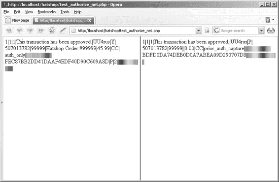
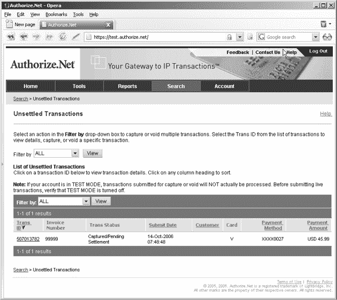

# 信用卡交易

你可能会发现，大多数提供此项服务的机构都提供类似的套餐。然而，需要关注的关键点包括：它们合作的银行（你的商户银行账户必须开设在其中一家）、它们处理的货币，当然还有成本。

在本章中，我们将研究两个易于打交道的机构——`DataCash` 和 `Authorize.net`。

表 15-1 列出了一些可用的网关服务。

**表 15-1. 网关服务**

| **美国** | **网址** | **英国** | **网址** |
| --- | --- | --- | --- |
| `Authorize.net` | `http://www.authorize.net/` | `Arcot` | `http://www.arcot.com/` |
| `First Data` | `http://www.firstdata.com/` | `WorldPay` | `http://www.worldpay.com/` |
| `Cardservice` | `http://cardservice.com/` | `DataCash` | `http://www.datacash.com/` |
| `ICVerify` | `http://www.icverify.com/` | | |

## DataCash 和 Authorize.net

在本章中，我们将演示如何通过两个在线服务来实现信用卡交易：`DataCash` 和 `Authorize.net`。

`DataCash` 是一家总部位于英国的信用卡网关机构。如果你想在最终应用中使用它，需要拥有一个英国商户银行账户。不过，目前你无需为此担心：获取一个相当有用的测试账户非常容易——你甚至不需要商户银行账户。

正如其官方网站 `http://www.authorize.net` 上所述，`Authorize.net`“提供互联网协议（`IP`）支付网关服务，使商户能够随时随地授权、结算和管理信用卡或电子支票交易。”换句话说，当有人购买你的帽子时，`Authorize.net` 也提供了你自行处理信用卡交易所需要的服务。

需要记住的重点是，本章介绍的技巧适用于所有信用卡网关。如果你换用不同的机构，具体细节可能会稍有变化，但大部分繁重的工作已经完成了。

稍后你将看到，`Authorize.net` 和 `DataCash` 都允许你使用所谓的“魔法”信用卡号（分别由 `Authorize.net` 和 `DataCash` 提供）执行测试交易，这些卡号会在不执行任何实际金融交易的情况下接受或拒绝交易。这对于开发来说非常棒，因为你不想用自己的信用卡进行测试！

> **注意** 本书作者与 `Authorize.net` 或 `DataCash` 没有任何关联。

## 理解信用卡交易

无论你使用哪个网关，信用卡交易的基本原则都是相同的。首先，你在电子商务网站上处理的交易类型被称为卡片不存在（`CNP`）交易，这意味着你面前没有实体信用卡，也无法验证客户签名。这不是问题；毕竟你很可能已经在线、通过电话、邮件等方式进行过一段时间`CNP`交易了。只是当你看到`CNP`这个缩写时需要注意一下。

各种网关还提供一些高级服务，包括持卡人地址验证、安全码检查、欺诈筛查等。这些都会为你的信用卡处理增加一层额外的复杂性，我们在此不详细讨论。相反，本章提供了一个起点，你可以根据需要在之上添加这些服务。是否选择这些可选附加服务，取决于你的系统处理的资金量，以及在实施这些服务的成本与如果发生本可被这些额外服务预防的问题时可能产生的潜在成本之间进行权衡。如果你对这些服务感兴趣，之前提到的“客户服务代表”会很乐意解释。

你可以执行几种类型的交易，包括：

- **授权：** 检查卡内是否有足够资金并执行扣款。
- **预授权：** 检查卡内资金，如果可用则进行分配，但不立即扣款。
- **完成：** 完成一项预授权交易，扣除已分配的资金。
- **退款：** 对已完成交易进行退款，或简单地向信用卡内充值。

同样，具体操作细节可能有所不同，但这些是基本类型。

在本章中，你将使用预授权/完成模式，这意味着你将在指示供应商发货之前才进行收款。这一点在你上一章创建的管道结构中已有所暗示。

## 使用 DataCash

现在我们已经涵盖了基础知识，让我们考虑如何在`HatShop`应用中使用`DataCash`系统让一切运转起来。首先要做的事情是按照以下步骤向`DataCash`申请一个测试账户：

1.  访问 `http://www.datacash.com/`。
2.  前往网站的 `Support – Integration Info`（支持 – 集成信息）部分。
3.  填写你的详细信息并提交。
4.  根据你收到的邮件，记下你的账户用户名和密码，以及访问`DataCash`报告系统所需的额外信息。

通常，下一步是下载`DataCash`的一个工具包以便于集成。然而，由于`DataCash`不提供`PHP`兼容的实现，你需要使用`XML` `API`来执行交易。基本上，这涉及使用 SSL 连接将`XML`请求发送到特定 URL，然后解析`XML`结果。如果你的计算机安装了`CURL`（客户端 URL 库函数）库并且`PHP`能识别它（参见附录 A），那么在`PHP`中这很容易实现。

在与`DataCash`通信时，你会进行大量的`XML`操作，因为你需要创建要发送给`DataCash`的`XML`文档，并从`XML`响应中提取数据。在接下来的几页中，我们将快速浏览你将执行的操作所需的`XML`以及可以预期的响应。

### 预授权请求

当你向`DataCash`发送预授权请求时，需要包含以下信息：

- `DataCash` 用户名（称为 `DataCash Client`）
- `DataCash` 密码
- 唯一的交易参考号（本节稍后解释）
- 要借记的金额
- 交易使用的货币（`USD`、`GBP` 等）
- 交易类型（预授权代码为 `pre`，完成代码为 `fulfil`）
- 信用卡号
- 信用卡有效期
- 信用卡发行日期（如果适用于所使用的信用卡类型）
- 信用卡发行编号（如果适用于所使用的信用卡类型）

唯一的交易参考号必须是一个 6 到 12 位数字之间的数字，你用它来唯一标识一笔交易与一个订单的关联。因为你不能使用短数字，所以不能直接使用到目前为止用来标识订单的订单 ID 值。但是，你可以将此订单 ID 作为创建参考号的起点，只需加上一个较大的数字，例如 `1,000,000`。你不能在未来的任何交易中重复使用这个参考号，因此可以确保一笔交易完成后不会再次执行，否则可能会导致向客户重复收费。不过，这也意味着如果信用卡被拒绝，你可能需要为客户创建一个全新的订单，但如果有必要，这应该不是问题。

XML 请求的格式如下，其中之前详述的值以粗体显示：

```xml
<?xml version="1.0" encoding="UTF-8"?>
<Request>
    <Authentication>
        <password>**DataCash 密码**</password>
        <client>**DataCash 客户端**</client>
    </Authentication>
    <Transaction>
        <TxnDetails>
            <merchantreference>**唯一参考号**</merchantreference>
            <amount currency='货币类型'>**现金金额**</amount>
        </TxnDetails>
        <CardTxn>
            <method>**pre**</method>
            <Card>
                <pan>信用卡号</pan>
                <expirydate>信用卡到期日</expirydate>
            </Card>
        </CardTxn>
    </Transaction>
</Request>
```

### 预授权请求的响应

预授权请求的响应包含以下信息：

-   一个状态码，用于指示发生了什么；如果交易成功，状态码为 `1`；如果发生其他情况，则为若干其他代码之一。有关 DataCash 服务器返回码的完整列表，请参阅 `https://testserver.datacash.com/software/returncodes.shtml`。
-   状态的原因，基本上是一个用英文解释状态的字符串。对于状态 `1`，该字符串为 `ACCEPTED`。
-   一个授权码和一个参考号，用于在履约请求阶段（接下来讨论）完成交易。
-   交易处理的时间。
-   交易模式，使用测试账户时为 `TEST`。
-   确认所使用的信用卡类型。
-   确认信用卡的发行国家。
-   银行使用的授权码（仅供参考）。

其对应的 XML 格式如下：

```xml
<?xml version="1.0" encoding="utf-8"?>
<Response>
    <status>状态码</status>
    <reason>原因</reason>
    <merchantreference>授权码</merchantreference>
    <datacash_reference>参考号</datacash_reference>
    <time>时间</time>
    <mode>TEST</mode>
    <CardTxn>
        <card_scheme>卡类型</card_scheme>
        <country>国家</country>
        <issuer>发卡行</issuer>
        <authcode>银行授权码</authcode>
    </CardTxn>
</Response>
```

## 履约请求

对于履约请求，您需要发送以下信息：

-   DataCash 用户名（DataCash 客户端）
-   DataCash 密码
-   交易类型（对于履约，代码为 `fulfil`）
-   之前收到的授权码
-   之前收到的参考号

可选地，您可以包含其他信息，例如确认要从信用卡中扣除的金额，尽管这并非必需。

其格式如下：

```xml
<?xml version="1.0" encoding="UTF-8"?>
<Request>
    <Authentication>
        <password>DataCash 密码</password>
        <client>DataCash 客户端</client>
    </Authentication>
    <Transaction>
        <HistoricTxn>
            <reference>参考号</reference>
            <authcode>授权码</authcode>
            <method>fulfil</method>
        </HistoricTxn>
    </Transaction>
</Request>
```

## 履约响应

履约请求的响应包含以下信息：

-   一个状态码，用于指示发生了什么；如果交易成功，状态码为 `1`；如果发生其他情况，则为若干其他代码之一。同样，有关代码的完整列表，请参阅 <https://testserver.datacash.com/software/returncodes.shtml>。
-   状态的原因，基本上是一个用英文解释状态的字符串。对于状态 `1`，该字符串为 `FULFILLED OK`。
-   两份供 DataCash 使用的参考代码副本。
-   交易处理的时间。
-   交易模式，使用测试账户时为 `TEST`。

其对应的 XML 格式如下：

```xml
<?xml version="1.0" encoding="utf-8"?>
<Response>
    <status>状态码</status>
    <reason>原因</reason>
    <merchantreference>参考代码</merchantreference>
    <datacash_reference>参考代码</datacash_reference>
    <time>时间</time>
    <mode>测试模式</mode>
</Response>
```

## 与 DataCash 交换 XML 数据

由于需要发送给 DataCash 的 XML 数据结构简单且标准，我们将在字符串中手动构建它，而不使用 PHP 5 提供的 XML 支持。不过，我们将利用 PHP 5 的 `SimpleXML` 扩展，它让读取简单的 XML 数据变得轻而易举。

尽管 `SimpleXML` 扩展不如 `DOMDocument` 复杂和强大，但它通过将 XML 数据转换为可直接迭代的数据结构，使得解析 XML 数据变得简单。你首次接触 `SimpleXML` 扩展是在第 11 章。

> **注意** 在与 DataCash 通信的代码中，我们使用了 CURL 库（<http://curl.haxx.se/>）。请阅读附录 A 获取完整的安装说明。在 Linux 下，安装过程可能更复杂，但如果你在 Windows 下运行 PHP，只需将 PHP 包中的 `libeay32.dll` 和 `ssleay32.dll` 复制到 Windows 安装目录的 `System32` 文件夹中，然后取消 `php.ini`（默认位于 Windows 安装文件夹）中以下行的注释（去掉前导分号），最后重启 Apache：`extension=php_curl.dll`。
>
> 有关 CURL 库的更多详情，请查看 <http://www.zend.com/pecl/tutorials/curl.php> 上的优秀教程。PHP 对 CURL 支持的官方文档位于 <http://www.php.net/curl>。

## 练习：与 DataCash 通信

1. 在 `business` 文件夹中创建一个名为 `datacash_request.php` 的新文件，并向其中添加以下代码：

```php
<?php

class DataCashRequest
{
    // DataCash 服务器 URL
    private $_mUrl;

    // 将保存当前要发送给 DataCash 的 XML 文档
    private $_mXml;

    // 构造函数，用 DataCash 的 URL 初始化类
    public function __construct($url)
    {
        // DataCash URL
        $this->_mUrl = $url;
    }

    /* 为向 DataCash 发送预授权请求编写 XML 结构 */
    public function MakeXmlPre($dataCashClient, $dataCashPassword, $merchantReference, $amount, $currency,
                              $method, $cardNumber, $expiryDate,
                              $startDate = '', $issueNumber = '')
    {
        $this->_mXml =
"<?xml version=\"1.0\" encoding=\"UTF-8\"\x3F>
<Request>
    <Authentication>
        <password>$dataCashPassword</password>
        <client>$dataCashClient</client>
    </Authentication>
    <Transaction>
        <TxnDetails>
            <merchantreference>$merchantReference</merchantreference>
            <amount currency=\"$currency\">$amount</amount>
        </TxnDetails>
        <CardTxn>
            <method>pre</method>
            <Card>
                <pan>$cardNumber</pan>
                <expirydate>$expiryDate</expirydate>
                <startdate>$startDate</startdate>
                <issuenumber>$issueNumber</issuenumber>
            </Card>
        </CardTxn>
    </Transaction>
</Request>";
    }

    // 为向 DataCash 发送履行请求编写 XML 结构
    public function MakeXmlFulfill($dataCashClient, $dataCashPassword, $method, $authCode, $reference)
    {
        $this->_mXml =
"<?xml version=\"1.0\" encoding=\"UTF-8\"\x3F>
<Request>
    <Authentication>
        <password>$dataCashPassword</password>
        <client>$dataCashClient</client>
    </Authentication>
    <Transaction>
        <HistoricTxn>
            <reference>$reference</reference>
            <authcode>$authCode</authcode>
            <method>$method</method>
        </HistoricTxn>
    </Transaction>
</Request>";
    }

    // 获取当前的 XML
    public function GetRequest()
    {
        return $this->_mXml;
    }

    // 使用 CURL 向 DataCash 发送 HTTP POST 请求
    public function GetResponse()
    {
        // 初始化 CURL 会话
        $ch = curl_init();

        // 准备进行 HTTP POST 请求
        curl_setopt($ch, CURLOPT_POST, 1);

        // 准备要 POST 的 XML 文档
        curl_setopt($ch, CURLOPT_POSTFIELDS, $this->_mXml);

        // 设置要 POST XML 结构的目标 URL
        // ...
    }
}
```

```php
curl_setopt($ch, CURLOPT_URL, $this->_mUrl);

/* 不在 SSL 握手中验证对等证书的通用名称 */
curl_setopt($ch, CURLOPT_SSL_VERIFYHOST, 0);

// 阻止 CURL 验证对等证书
curl_setopt($ch, CURLOPT_SSL_VERIFYPEER, 0);

/* 我们需要 CURL 直接返回传输结果，而不是打印它 */
curl_setopt($ch, CURLOPT_RETURNTRANSFER, 1);

// 执行一个 CURL 会话
$result = curl_exec($ch);

// 关闭一个 CURL 会话
curl_close($ch);

// 返回响应
return $result;
```

**2.** 在你的 `include/config.php` 文件末尾定义 DataCash URL 和登录数据：

```php
// datacash 的常量定义
define('DATACASH_URL', 'https://testserver.datacash.com/Transaction');
define('DATACASH_CLIENT', '你的账户客户编号');
define('DATACASH_PASSWORD', '你的账户密码');
```

**3.** 在你的项目根目录（`hatshop` 文件夹）中创建 `test_datacash.php` 文件，并在其中添加以下内容：

```php
<?php
session_start();

if (empty($_GET['step']))
{
    require_once 'include/config.php';
    require_once BUSINESS_DIR . 'datacash_request.php';

    $request = new DataCashRequest(DATACASH_URL);
    $request->MakeXmlPre(DATACASH_CLIENT, DATACASH_PASSWORD, 8880000 + rand(0, 10000), 49.99, 'GBP', 'pre', '3528000000000007', '11/08');

    $request_xml = $request->GetRequest();
    $_SESSION['pre_request'] = $request_xml;

    $response_xml = $request->GetResponse();
    $_SESSION['pre_response'] = $response_xml;

    $xml = simplexml_load_string($response_xml);
    $request->MakeXmlFulfill(DATACASH_CLIENT, DATACASH_PASSWORD, 'fulfill', $xml->merchantreference, $xml->datacash_reference);

    $response_xml = $request->GetResponse();
    $_SESSION['fulfill_response'] = $response_xml;
}
else
{
    header('Content-type: text/xml');

    switch ($_GET['step'])
    {
        case 1:
            print $_SESSION['pre_request'];
            break;

        case 2:
            print $_SESSION['pre_response'];
            break;

        case 3:
            print $_SESSION['fulfill_response'];
            break;
    }

    exit;
}
?>
<frameset cols="33%, 33%, 33%">
    <frame src="test_datacash.php?step=1">
    <frame src="test_datacash.php?step=2">
    <frame src="test_datacash.php?step=3">
</frameset>
```

**4.** 在浏览器中加载 `test_datacash.php` 文件以查看结果。如果你使用 Opera，输出应该如图 15-1 所示，因为 Opera 仅显示 XML 元素的内容。如果你使用其他网页浏览器，你将看到格式良好的 XML 文档。

**图 15-1.** *DataCash 交易结果*

**5.** 登录 `https://testserver.datacash.com/reporting2` 查看你的 DataCash 账户交易日志（请注意，此视图需要一段时间才能更新，因此你可能不会立即看到该交易）。该报告如图 15-2 所示。

**图 15-2.** *DataCash 交易报告详情*

### 工作原理：与 DataCash 通信的代码

`DataCashRequest` 类非常简单。首先，构造函数设置了发送请求的 HTTPS 地址：

```php
// 构造函数使用 DataCash 的 URL 初始化类
public function __construct($url)
{
    // Datacash URL
    $this->_mUrl = $url;
}
```

当你想发起预认证请求时，首先需要调用 `MakeXmlPre` 方法来创建此类型请求所需的 XML。有些 XML 元素是可选的（例如 `startdate` 或 `issuenumber`，如果你不提供自己的值，它们会使用默认值——可以查看 `MakeXmlPre` 方法的定义），但其他元素是必填的。

**注意** 如需查看每种请求类型中哪些元素是必填项、哪些是可选项，请查阅 DataCash 的 XML API FAQ 文档。

您需要能向 DataCash 系统发送的下一种请求是执行请求。此类请求的 XML 在 `MakeXmlFulfill` 方法中生成。

接下来是 `GetRequest` 方法，它返回由 `MakeXmlPre` 或 `MakeXmlFulfill` 构建的最后一个 XML 文档：

```php
// 获取当前 XML
public function GetRequest()
{
    return $this->_mXml;
}
```

最后，`GetResponse` 方法实际发送由调用 `MakeXmlPre` 或 `MakeXmlFulfill` 构建的最新 XML 请求文件，并返回响应 XML。我们来仔细研究一下这个方法。

`GetResponse` 首先初始化一个 CURL 会话，并设置 POST 方法以发送数据：

```php
// 使用 CURL 向 DataCash 发送 HTTP POST 请求
public function GetResponse()
{
    // 初始化 CURL 会话
    $ch = curl_init();

    // 准备 HTTP POST 请求
    curl_setopt($ch, CURLOPT_POST, 1);

    // 准备要 POST 的 XML 文档
    curl_setopt($ch, CURLOPT_POSTFIELDS, $this->_mXml);

    // 设置要 POST XML 结构的 URL
    curl_setopt($ch, CURLOPT_URL, $this->_mUrl);

    /* 不在 SSL 握手过程中验证对等证书的通用名称 */
    curl_setopt($ch, CURLOPT_SSL_VERIFYHOST, 0);

    // 阻止 CURL 验证对等证书
    curl_setopt($ch, CURLOPT_SSL_VERIFYPEER, 0);
```

为了将传输结果返回到 PHP 变量中，我们将 `CURLOPT_RETURNTRANSFER` 参数设置为 1，发送请求，然后关闭 CURL 会话：

```php
    /* 我们希望 CURL 直接返回传输结果而不是打印它 */
    curl_setopt($ch, CURLOPT_RETURNTRANSFER, 1);

    // 执行 CURL 会话
    $result = curl_exec($ch);

    // 关闭 CURL 会话
    curl_close($ch);

    // 返回响应
    return $result;
}
```

`test_datacash.php` 文件的工作原理如下。当您在浏览器中加载它时，脚本会执行预认证请求和执行请求，然后将预认证请求 XML、预认证响应 XML 和执行响应 XML 数据保存到会话中：

```
session_start();

if (empty ($_GET['step']))
{
    require_once 'include/config.php';
    require_once BUSINESS_DIR . 'datacash_request.php';

    $request = new DataCashRequest(DATACASH_URL);
    $request->MakeXmlPre(DATACASH_CLIENT, DATACASH_PASSWORD, 8880000 + rand(0, 10000), 49.99, 'GBP',
                         'pre', '3528000000000007', '11/08');
    $request_xml = $request->GetRequest();
    $_SESSION['pre_request'] = $request_xml;

    $response_xml = $request->GetResponse();
    $_SESSION['pre_response'] = $response_xml;

    $xml = simplexml_load_string($response_xml);
    $request->MakeXmlFulfill(DATACASH_CLIENT, DATACASH_PASSWORD,
                             'fulfill', $xml->merchantreference,
                             $xml->datacash_reference);
    $response_xml = $request->GetResponse();
    $_SESSION['fulfill_response'] = $response_xml;
}
```

`test_datacash.php` 页面还会被加载三次，因为您有三个需要填充数据的框架：

```
<frameset cols="33%, 33%, 33%">
    <frame src="test_datacash.php?step=1">
    <frame src="test_datacash.php?step=2">
    <frame src="test_datacash.php?step=3">
</frameset>
```

根据参数值，您决定显示之前保存在用户会话中的哪个 XML，具体如下：

```
else
{
    header('Content-type: text/xml');

    switch ($_GET['step'])
    {
        case 1:
            print $_SESSION['pre_request'];
            break;

        case 2:
            print $_SESSION['pre_response'];
            break;

        case 3:
            print $_SESSION['fulfill_response'];
            break;
    }

    exit;
}
```

## 将 DataCash 与 HatShop 集成

现在你已经创建了一个新的信用卡交易类，接下来需要将其功能集成到之前章节构建的订单处理管道中。为了将 `DataCash` 与 `HatShop` 完全集成，你需要更新现有的 `PsCheckFunds` 和 `PsTakePayments` 类。

你需要修改处理信用卡交易的管道段类。我们已通过 `OrderProcessor.SetOrderAuthCodeAndReference` 方法加入了用于存储和检索认证码及参考信息的基础设施。

## 练习：实现订单管道类

**1.** 首先修改 `business/ps_check_funds.php` 以配合 `DataCash` 使用：

```php
<?php

class PsCheckFunds implements IPipelineSection
{
  public function Process($processor)
  {
    // 审计
    $processor->CreateAudit('PsCheckFunds 已启动。', 20100);

    $order_total_cost = $processor->mOrderInfo['total_amount'];
    $order_total_cost += $processor->mOrderInfo['shipping_cost'];
    $order_total_cost +=
      round((float)$order_total_cost *
        (float)$processor->mOrderInfo['tax_percentage'], 2) / 100.00;

    $request = new DataCashRequest(DATACASH_URL);
    $request->MakeXmlPre(DATACASH_CLIENT, DATACASH_PASSWORD,
      $processor->mOrderInfo['order_id'] + 1000006,
      $order_total_cost, 'GBP', 'pre',
      $processor->mCustomerInfo['credit_card']->CardNumber,
      $processor->mCustomerInfo['credit_card']->ExpiryDate,
      $processor->mCustomerInfo['credit_card']->IssueDate,
      $processor->mCustomerInfo['credit_card']->IssueNumber);

    $responseXml = $request->GetResponse();
    $xml = simplexml_load_string($responseXml);

    if ($xml->status == 1)
    {
      $processor->SetAuthCodeAndReference(
        $xml->merchantreference, $xml->datacash_reference);

      // 审计
      $processor->CreateAudit('购买资金可用。', 20102);

      // 更新订单状态
      $processor->UpdateOrderStatus(2);

      // 继续处理
      $processor->mContinueNow = true;
    }
    else
    {
      // 审计
      $processor->CreateAudit('购买资金不可用。', 20103);
      throw new Exception('订单 ' .
        $processor->mOrderInfo['order_id'] . ' 信用卡资金检查失败。' . "\n\n" .
        '交换的数据：' . "\n" .
        $request->GetResponse() . "\n" . $responseXml);
    }

    // 审计
    $processor->CreateAudit('PsCheckFunds 已完成。', 20101);
  }
}
?>
```

**2.** 按如下方式修改 `business/ps_take_payment.php` 文件：

```php
<?php

class PsTakePayment implements IPipelineSection
{
  public function Process($processor)
  {
    // 审计
    $processor->CreateAudit('PsTakePayment 已启动。', 20400);

    $request = new DataCashRequest(DATACASH_URL);
    $request->MakeXmlFulFill(DATACASH_CLIENT, DATACASH_PASSWORD,
      'fulfill',
      $processor->mOrderInfo['auth_code'],
      $processor->mOrderInfo['reference']);

    $responseXml = $request->GetResponse();
    $xml = simplexml_load_string($responseXml);

    if ($xml->status == 1)
    {
      // 审计
      $processor->CreateAudit(
        '已从客户信用卡账户中扣除资金。', 20402);

      // 更新订单状态
      $processor->UpdateOrderStatus(5);

      // 继续处理
      $processor->mContinueNow = true;
    }
    else
    {
      // 审计
      $processor->CreateAudit('无法从信用卡中扣除资金。', 20403);
      throw new Exception('订单 ' .
        $processor->mOrderInfo['order_id'] . ' 信用卡扣款失败。' . "\n\n" .
        '交换的数据：' . "\n" .
        $request->GetResponse() . "\n" . $responseXml);
    }

    // 审计
    $processor->CreateAudit('PsTakePayment 已完成。', 20401);
  }
}
?>
```

**3.** 在 `include/app_top.php` 中添加对 `business/datacash_request.php` 文件的引用，如下方高亮所示：

```php
require_once BUSINESS_DIR . 'ps_ship_ok.php';
require_once BUSINESS_DIR . 'ps_final_notification.php';
require_once BUSINESS_DIR . 'datacash_request.php';
```

## 测试 DataCash 集成

现在一切就绪，用几个订单进行测试非常重要。只需确保使用"魔法"信用卡详细信息创建客户，即可轻松完成测试。正如本章前面提到的，`DataCash` 提供了这些用于测试目的的数字，以便从 `DataCash` 获取特定响应。表 15-2 展示了部分数字示例；完整列表可在 `DataCash` 网站上找到。

**表 15-2.** `DataCash` *信用卡测试号码* **卡类型** | **卡号** | **返回代码** | **描述** | **示例信息**

--- | --- | --- | --- | ---

`Switch` | | 授权通过，返回 | `AUTH CODE ??????` | 随机授权码。

| | | 拒绝，返回 | `DECLINED` | 交易被拒绝。

| | | 授权通过，返回 | `AUTH CODE ??????` | 随机授权码。

| | | 拒绝，返回 | `DECLINED` | 交易被拒绝。

| | | 授权通过，返回 | `AUTH CODE ??????` | 随机授权码。

`Visa` | | 拒绝，返回 | `DECLINED` | 交易被拒绝。

| | | 授权通过，返回 | `AUTH CODE ??????` | 随机授权码。

| | | 授权通过，返回 | `AUTH CODE ??????` | 随机授权码。

此时，您可以通过使用测试信用卡号码下订单、检查网站发送的电子邮件，以及了解网站在特定情况下的反应（例如如何记录错误、如何使用订单管理页面管理订单等），来试验您全新且功能完备的电子商务网站。

## 正式上线

现在，从测试账户切换到正式账户只需替换 `include/config.php` 中的 `DataCash` 登录信息即可。在您设置好商户银行账户后，您可以使用新详细信息创建一个新的 `DataCash` 账户，从而获得新的客户端和密码数据。您还需要更改发送数据的目标 `DataCash` 服务器 URL：

[www.it-ebooks.info](http://www.it-ebooks.info/)

`648XCH15.qxd 11/15/06 6:21 PM Page 524`

**524**

第 15 章 ■ 信用卡交易

因为它需要是生产服务器而不是测试服务器。除了从数据库中删除测试用户账户并将网站迁移到互联网位置（更多详细信息请参阅附录 B）之外，这就是您在向客户公开新完成的电子商务应用之前需要做的所有事情。

## 使用 Authorize.net

要使用 `Authorize.net`，您需要通过 `http://developer.authorize.net/testaccount/` 注册一个开发者测试账户。开发人员可以获取 `Authorize.net` 集成信息的主页是 `http://developer.authorize.net/`。

与 `Authorize.net` 通信的方式不同于与 `DataCash` 通信。无需发送和接收 XML 文件，而是发送由名称-值对组成的字符串，这些名称-值对通过 & 符号分隔。实际上，您使用的语法类似于附加到 URL 的查询字符串。

`Authorize.net` 以包含返回值（不含名称）的字符串形式返回交易结果，这些返回值由您在初始请求时指定的字符分隔。在我们的示例中，我们将使用管道符（`|`）。返回值按预定顺序排列，其含义由它们在返回字符串中的位置决定。

> **注意** `Authorize.net` API 的完整文档可以在高级集成方法 (AIM) 实施指南的“非面对面交易”部分找到，网址为 `http://www.authorize.net/support/AIM_guide.pdf`。更多文档可在文档库 `http://www.authorize.net/resources/documentlibrary/` 中找到。

默认交易类型为 `AUTH_CAPTURE`，即通过单个请求从信用卡中请求并扣除资金。对于 `HatShop`，我们将使用另外两种交易类型：`AUTH_ONLY`，用于检查是否有可用资金（这发生在 `PsCheckFunds` 管道阶段）；以及 `PRIOR_AUTH_CAPTURE`，用于扣除先前通过 `AUTH_ONLY` 检查过的金额（这发生在 `PsTakePayment` 管道阶段）。

要执行 `AUTH_ONLY` 交易，您首先需要创建一个类似如下的数组，其中包含必要的交易数据。

```php
// Auth
$transaction = array ('x_invoice_num' => '99999', // 发票号码
                     'x_amount' => '45.99',        // 金额
                     'x_card_num' => '4007000000027', // 信用卡号
                     'x_exp_date' => '1209',         // 有效期
                     'x_method' => 'CC',             // 支付方式
                     'x_type' => 'AUTH_ONLY');       // 交易类型
```

[www.it-ebooks.info](http://www.it-ebooks.info/)

648XCH15.qxd 11/15/06 6:21 PM Page 525

第 15 章 ■ 信用卡交易

**525**

对于`PRIOR_AUTH_CAPTURE`交易，您无需再次指定所有这些信息；只需传递在`AUTH_ONLY`请求响应中返回的交易 ID 即可。

```php
// 捕获
$transaction = array (
    'x_ref_trans_id' => $ref_trans_id, // 交易 ID
    'x_method' => 'CC',                // 支付方式
    'x_type' => 'PRIOR_AUTH_CAPTURE'); // 交易类型
```

我们将把这些数组转换为一个由键值对组成的字符串，并将其提交给`Authorize.net`服务器。响应以字符串形式返回，其值由可配置的字符分隔。在图 15-3 中，您可以看到`AUTH_ONLY`请求（窗口左侧）和`PRIOR_AUTH_CAPTURE`请求（窗口右侧）的示例响应。

在对`HatShop`进行任何修改之前，我们将编写一个使用此交易类型的简单测试。请按照练习中的步骤测试`Authorize.net`。

## 练习：测试 Authorize.net

**1.** 在`business`文件夹中创建一个名为`authorize_net_request.php`的新文件，并添加以下代码：

```php
<?php
class AuthorizeNetRequest
{
    // Authorize 服务器 URL
    private $_mUrl;
    
    // 将保存要发送到 Authorize.net 的当前请求
    private $_mRequest;
    
    // 构造函数使用 Authorize.net 的 URL 初始化类
    public function __construct($url)
    {
        // Authorize.net URL
        $this->_mUrl = $url;
    }
    
    public function SetRequest($request)
    {
        $this->_mRequest = '';
        $request_init = array (
            'x_login' => AUTHORIZE_NET_LOGIN_ID,
            'x_tran_key' => AUTHORIZE_NET_TRANSACTION_KEY,
            'x_version' => '3.1',
            'x_test_request' => AUTHORIZE_NET_TEST_REQUEST,
            'x_delim_data' => 'TRUE',
            'x_delim_char' => '|',
            'x_relay_response' => 'FALSE'
        );
        $request = array_merge($request_init, $request);
        foreach($request as $key => $value )
            $this->_mRequest .= $key . '=' . urlencode($value) . '&';
    }
    
    // 使用 CURL 向 Authorize.net 发送 HTTP POST 请求
    public function GetResponse()
    {
        // 初始化 CURL 会话
        $ch = curl_init();
        
        // 准备 HTTP POST 请求
        curl_setopt($ch, CURLOPT_POST, 1);
        
        // 准备要 POST 的请求
        curl_setopt($ch, CURLOPT_POSTFIELDS, rtrim($this->_mRequest, '& '));
        
        // 设置我们要 POST 数据的 URL
        curl_setopt($ch, CURLOPT_URL, $this->_mUrl);
        
        /* 不要在 SSL 握手中验证对等证书的通用名称 */
        curl_setopt($ch, CURLOPT_SSL_VERIFYHOST, 0);
        
        // 阻止 CURL 验证对等方的证书
        curl_setopt($ch, CURLOPT_SSL_VERIFYPEER, 0);
        
        /* 我们希望 CURL 直接返回传输结果，而不是打印它 */
        curl_setopt($ch, CURLOPT_RETURNTRANSFER, 1);
        
        // 执行 CURL 会话
        $result = curl_exec($ch);
        
        // 关闭 CURL 会话
        curl_close ($ch);
        
        // 返回响应
        return $result;
    }
}
?>
```

**2.** 在`include/config.php`文件末尾添加以下内容，并将常量数据修改为您的`Authorize.net`账户详细信息：

```php
// Authorize.net 的常量定义
define('AUTHORIZE_NET_URL', 'https://test.authorize.net/gateway/transact.dll');
define('AUTHORIZE_NET_LOGIN_ID', '[您的登录 ID]');
define('AUTHORIZE_NET_TRANSACTION_KEY', '[您的交易密钥]');
define('AUTHORIZE_NET_TEST_REQUEST', 'FALSE');
```

**3.** 在您的站点根目录中添加以下`test_authorize_net.php`测试文件：

```php
<?php
session_start();
if (empty ($_GET['step']))
{
    require_once 'include/config.php';
    require_once BUSINESS_DIR . 'authorize_net_request.php';
    $request = new AuthorizeNetRequest(AUTHORIZE_NET_URL);

    // 认证
    $transaction = array (
        'x_invoice_num' => '99999',   // 发票编号
        'x_amount' => '45.99',        // 金额
        'x_card_num' => '4007000000027', // 信用卡号
        'x_exp_date' => '1209',       // 到期日期
        'x_method' => 'CC',           // 支付方式
        'x_type' => 'AUTH_ONLY');     // 交易类型

    $request->SetRequest($transaction);
    $auth_only_response = $request->GetResponse();
    $_SESSION['auth_only_response'] = $auth_only_response;
    $auth_only_response = explode('|', $auth_only_response);

    // 读取交易 ID，后续收款时需要用到
    $ref_trans_id = $auth_only_response[6];

    // 收款
    $transaction = array (
        'x_ref_trans_id' => $ref_trans_id, // 交易 ID
        'x_method' => 'CC',                // 支付方式
        'x_type' => 'PRIOR_AUTH_CAPTURE'); // 交易类型

    $request->SetRequest($transaction);
    $prior_auth_capture_response = $request->GetResponse();
}
```

[www.it-ebooks.info](http://www.it-ebooks.info/)



**4.** 在您常用的浏览器中加载`test_authorize_net.php`页面，查看结果（如图 15-3 所示）。

**图 15-3.** *Authorize.net 交易结果*

[www.it-ebooks.info](http://www.it-ebooks.info/)



**5.** 登录 Authorize.net 的商户管理界面 (https://test.authorize.net/)，您可以在“搜索”选项卡下的“未结算交易”部分看到刚刚执行的交易。该报告如图 15-4 所示。

**图 15-4.** *Authorize.net 未结算交易*

## 工作原理：Authorize.net 交易

繁重的工作由`AuthorizeNetRequest`类完成，该类有两个重要方法：`SetRequest`用于设置交易详情，`GetResponse`用于向Authorize.net发送请求并接收响应。以下代码片段展示了它们的使用方法：

```php
// 认证

$transaction = array (
    'x_invoice_num' => '99999',   // 发票编号
    'x_amount' => '45.99',        // 金额
    'x_card_num' => '4007000000027', // 信用卡号
    'x_exp_date' => '1209',       // 到期日期
    'x_method' => 'CC',           // 支付方式
    'x_type' => 'AUTH_ONLY');     // 交易类型

$request->SetRequest($transaction);
$response = $request->GetResponse();
```

> **注意** 本交易中提到的信用卡数据是Authorize.net为测试目的提供的"魔法卡号"之一。请查阅AIM实施指南获取完整的此类信用卡号列表。

我们将包含交易详情的数组作为参数发送给`SetRequest`。接着，`SetRequest`会将此数组与另一个包含Authorize.net账户详情的数组合并：

```php
public function SetRequest($request)
{
    $this->_mRequest = '';

    $request_init = array (
        'x_login' => AUTHORIZE_NET_LOGIN_ID,
        'x_tran_key' => AUTHORIZE_NET_TRANSACTION_KEY,
        'x_version' => '3.1',
        'x_test_request' => AUTHORIZE_NET_TEST_REQUEST,
        'x_delim_data' => 'TRUE',
        'x_delim_char' => '|',
        'x_relay_response' => 'FALSE');

    $request = array_merge($request_init, $request);
```

数组数据被合并成一个可以发送给Authorize.net的“名称-值”字符串。这些值会通过`urlencode()`函数进行编码，以便包含在URL中：

```php
foreach($request as $key => $value )
    $this->_mRequest .= $key . '=' . urlencode($value) . '&';
}
```

`AuthorizeNetRequest`的`GetResponse()`方法使用`CURL`库执行实际的请求。

```php
// 使用 CURL 向 Authorize.net 发送 HTTP POST 请求

public function GetResponse()
{
    ...
    // 执行 CURL 会话
    $result = curl_exec($ch);

    // 关闭 CURL 会话
    curl_close ($ch);

    // 返回响应
    [www.it-ebooks.info](http://www.it-ebooks.info/)

    648XCH15.qxd 11/15/06 6:21 PM Page 531

    C H A P T E R 1 5 ■ C R E D I T C A R D T R A N S A C T I O N S

    **531**
    return $result;
}
}
?>
```

当执行`GetResponse()`函数进行`AUTH_ONLY`交易时，响应将包含一个交易ID。如果授权成功，我们可以使用此交易ID执行`PRIOR_AUTH_CAPTURE`交易，从而实际从客户账户中扣款。

如前所述，`Authorize.net`的响应以字符串形式返回，其中包含由可配置字符（本例中为管道符`|`）分隔的值。要从字符串中读取特定值，我们使用PHP的`explode()`函数（<http://www.php.net/manual/en/function.explode.php>）将字符串转换为数组：

```php
$auth_only_response = $request->GetResponse();
$_SESSION['auth_only_response'] = $auth_only_response;

**$auth_only_response = explode('|', $auth_only_response);**
```

此代码执行后，`$auth_only_response`将包含一个数组，其元素为原始字符串中由管道符分隔的值。我们关注该数组中的第七个元素，根据`Authorize.net`文档，这是交易ID。（有关`Authorize.net`响应的完整详细信息，请阅读<http://www.authorize.net/support/AIM_guide.pdf>中的网关响应API详情。）

```php
// 读取交易 ID，后续扣款时需要用到
$ref_trans_id = $auth_only_response[6];
```

> **注意**：`explode()`创建的`$auth_only_response`数组是基于零的，因此`$auth_only_response[6]`表示数组的第七个元素。

使用此交易ID扣款的代码非常简单。由于交易已授权，我们只需指定授权后收到的交易ID即可完成交易：

```php
// 扣款
**$transaction = array (
    'x_ref_trans_id' => $ref_trans_id, // 交易 ID
    'x_method' => 'CC',               // 支付方式
    'x_type' => 'PRIOR_AUTH_CAPTURE'  // 交易类型
);**
$request->SetRequest($transaction);
$prior_auth_capture_response = $request->GetResponse();
```

[www.it-ebooks.info](http://www.it-ebooks.info/)

648XCH15.qxd 11/15/06 6:21 PM Page 532

**532**  C H A P T E R 1 5 ■ C R E D I T C A R D T R A N S A C T I O N S

## 将Authorize.net与HatShop集成

与`DataCash`类似，您需要修改`PsCheckFunds`和`PsTakePayment`类以使用新的`Authorize.net`功能。

请记住，您可以使用Apress网站（<http://www.apress.com/>）源代码下载部分中的文件，而不是自行输入代码。

最终的修改涉及处理信用卡交易的管道部分类（`PsCheckFunds`和`PsTakePayment`）。我们已经通过`OrderProcessor::SetOrderAuthCodeAndReference`方法包含了用于存储和检索认证代码及引用信息的基础设施。

### 练习：实现订单管道类

**1.** 首先，修改`business/ps_check_funds.php`以与`Authorize.net`协作：

```php
<?php
class PsCheckFunds implements IPipelineSection
{
    public function Process($processor)
    {
        // 审计
        $processor->CreateAudit('PsCheckFunds started.', 20100);
        $order_total_cost = $processor->mOrderInfo['total_amount'];
        $order_total_cost += $processor->mOrderInfo['shipping_cost'];
        $order_total_cost +=
            round((float)$order_total_cost *
            (float)$this->mOrderInfo['tax_percentage'], 2) / 100.00;
        $exp_date = str_replace('/', '',
            $processor->mCustomerInfo['credit_card']->ExpiryDate);
        $transaction =
            array (
                'x_invoice_num' => $processor->mOrderInfo['order_id'],
                'x_amount' => $order_total_cost, // 要收取的金额
                'x_card_num' => $processor->mCustomerInfo['credit_card']->CardNumber,
                'x_exp_date' => $exp_date, // 有效期（MMYY）
                'x_method' => 'CC',
                'x_type' => 'AUTH_ONLY');

        // 处理交易
        $request = new AuthorizeNetRequest(AUTHORIZE_NET_URL);
        $request->SetRequest($transaction);
        $response = $request->GetResponse();
    }
}
```

[www.it-ebooks.info](http://www.it-ebooks.info/)

648XCH15.qxd 11/15/06 6:21 PM Page 533