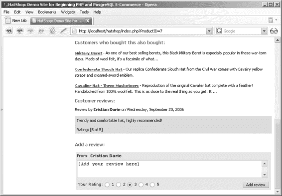

# 第 15 章 信用卡交易

533

```php
$response = explode('|', $response);

if ($response[0] == 1)
{
    $processor->SetAuthCodeAndReference($response[4], $response[6]);
    // 审计
    $processor->CreateAudit('购买资金可用。', 20102);
    // 更新订单状态
    $processor->UpdateOrderStatus(2);
    // 继续处理
    $processor->mContinueNow = true;
}
else
{
    // 审计
    $processor->CreateAudit('购买资金不可用。', 20103);
    throw new Exception('订单 ' . $processor->mOrderInfo['order_id'] . ' 的信用卡资金检查失败。' . "\n\n" .
        '交换的数据：' . "\n" .
        var_export($transaction, true) . "\n" .
        var_export($response, true));
}
// 审计
$processor->CreateAudit('PsCheckFunds 完成。', 20101);
```

**2.** 按如下所示修改 `business/ps_take_payment.php`：

```php
<?php
class PsTakePayment implements IPipelineSection
{
    public function Process($processor)
    {
        // 审计
        $processor->CreateAudit('PsTakePayment 开始。', 20400);
        $transaction =
            array ('x_ref_trans_id' => $processor->mOrderInfo['reference'],
                   'x_method' => 'CC',
                   'x_type' => 'PRIOR_AUTH_CAPTURE');
        // 处理交易
        $request = new AuthorizeNetRequest(AUTHORIZE_NET_URL);
        $request->SetRequest($transaction);
        $response = $request->GetResponse();
        $response = explode('|', $response);
        if ($response[0] == 1)
        {
            // 审计
            $processor->CreateAudit(
                '资金已从客户信用卡账户扣除。',
                20402);
            // 更新订单状态
            $processor->UpdateOrderStatus(5);
            // 继续处理
            $processor->mContinueNow = true;
            // 审计
            $processor->CreateAudit('PsTakePayment 完成。', 20401);
        }
        else
        {
            // 审计
            $processor->CreateAudit(
                '从客户信用卡扣款时出错。', 20403);
            throw new Exception('订单 ' .
                $processor->mOrderInfo['order_id'] . ' 的信用卡付款失败。' . "\n\n" .
                '交换的数据：' . "\n" .
                var_export($transaction, true) . "\n" .
                var_export($response, true));
        }
    }
}
?>
```

**3.** 在 `include/app_top.php` 文件中添加对 `business/authorize_net_request.php` 文件的引用，如下所示：

```php
require_once BUSINESS_DIR . 'ps_ship_ok.php';
require_once BUSINESS_DIR . 'ps_final_notification.php';
require_once BUSINESS_DIR . 'authorize_net_request.php';
```

## 测试 Authorize.net 集成

您现在要做的就是用您的新网站运行一些测试。从高级集成方法 (AIM) 实施指南中获取“魔法”Authorize.net 信用卡号列表，并使用它们进行交易实验。

## 总结

在本章中，您通过集成信用卡授权功能完成了电子商务应用程序。除了上架您自己的产品、与供应商建立联系、获取商户银行账户以及将其发布到网络上之外，您已经准备就绪了。好吧，这仍然是相当多的工作，但其中没有一项是特别困难的。最困难的工作现在已经完成了。

具体来说，在本章中，我们研究了网络上信用卡交易背后的理论，并查看了一个完整的实现——DataCash。我们创建了一个可用于访问 DataCash 的库，并将其集成到我们的应用程序中。我们还研究了 Authorize.net。

# 第 16 章：产品评论

至此，您已拥有一个功能完整的电子商务网站。但这并不妨碍您为其添加更多功能，使其对访客更加实用和友好。

通过在网站上添加产品评论系统，您可以提高访客回访率——他们可能会为已购商品撰写评论，或者查看他人对商品的评价。

评论系统还能帮助您了解客户偏好，从而改进商品推荐策略，甚至根据客户反馈调整网站或商品目录结构。

为了方便您和客户，我们将产品评论列表及添加新评论的表单整合到商品详情页中。添加新评论的表单仅对注册用户显示，因为我们决定不允许匿名评论（当然，您也可以根据需要轻松修改这一设置）。我们将按照常规流程实现这一新功能，从数据库层开始，最终完成用户界面。本章成果如图 16-1 所示。



**图 16-1.** *包含产品评论的商品详情页*

## 实现数据层

为了构建评论系统，您需要在`hatshop`数据库中创建`review`表以及两个数据层函数：`catalog_get_product_reviews`函数用于检索特定商品的评论，`catalog_create_product_review`方法用于向商品添加评论。

### 练习：为数据库添加客户评论支持

1. 启动 pgAdmin III，并连接到`hatshop`数据库。

2. 点击**工具 ➤ 查询工具**（或点击工具栏上的 SQL 按钮）。将出现一个新的查询窗口。

3. 使用查询工具执行以下代码，在`hatshop`数据库中创建`review`表：

```sql
-- 创建评论表
CREATE TABLE review
(
  review_id SERIAL NOT NULL,
  customer_id INTEGER NOT NULL,
  product_id INTEGER NOT NULL,
  review TEXT NOT NULL,
  rating SMALLINT NOT NULL,
  created_on TIMESTAMP NOT NULL,
  CONSTRAINT pk_review_id PRIMARY KEY (review_id),
  CONSTRAINT fk_customer_id FOREIGN KEY (customer_id)
    REFERENCES customer (customer_id)
    ON UPDATE RESTRICT ON DELETE RESTRICT,
  CONSTRAINT fk_product_id FOREIGN KEY (product_id)
    REFERENCES product (product_id)
    ON UPDATE RESTRICT ON DELETE RESTRICT
);
```

4. 执行以下代码，在`hatshop`数据库中创建`review_info`类型和`catalog_get_product_review`函数：

```sql
-- 创建 review_info 类型
CREATE TYPE review_info AS
(
  customer_name VARCHAR(50),
  review TEXT,
  rating SMALLINT,
  created_on TIMESTAMP
);

-- 创建 catalog_get_product_reviews 函数
CREATE FUNCTION catalog_get_product_reviews(INTEGER)
RETURNS SETOF review_info LANGUAGE plpgsql AS $$
DECLARE
  inProductId ALIAS FOR $1;
  outReviewInfoRow review_info;
BEGIN
  FOR outReviewInfoRow IN
    SELECT c.name, r.review, r.rating, r.created_on
    FROM review r
    INNER JOIN customer c
      ON c.customer_id = r.customer_id
    WHERE r.product_id = inProductId
    ORDER BY r.created_on DESC
  LOOP
    RETURN NEXT outReviewInfoRow;
  END LOOP;
END;
$$;
```

`catalog_get_product_review`函数会检索由`inProductId`参数标识的商品的评论。由于还需要评论者的姓名，因此我们对`customer`表进行了`INNER JOIN`操作。

5. 使用查询工具执行以下代码，在`hatshop`数据库中添加`catalog_create_product_review`函数：

```sql
-- 创建 catalog_create_product_review 函数
CREATE FUNCTION catalog_create_product_review(INTEGER, INTEGER, TEXT, SMALLINT)
RETURNS VOID LANGUAGE plpgsql AS $$
DECLARE
  inCustomerId ALIAS FOR $1;
  inProductId ALIAS FOR $2;
  inReview ALIAS FOR $3;
  inRating ALIAS FOR $4;
BEGIN
  INSERT INTO review (customer_id, product_id, review, rating, created_on)
  VALUES (inCustomerId, inProductId, inReview, inRating, NOW());
END;
$$;
```

当注册访客添加产品评论时，会调用`catalog_create_product_review`函数。

## 实现业务层

在`business/catalog.php`文件的`Catalog`类中添加相应的业务层方法：

```php
// Gets the reviews for a specific product
public static function GetProductReviews($productId)
{
    // Build the SQL query
    $sql = 'SELECT * FROM catalog_get_product_reviews(:product_id);';
    // Build the parameters array
    $params = array (':product_id' => $productId);
    // Prepare the statement with PDO-specific functionality
    $result = DatabaseHandler::Prepare($sql);
    // Execute the query and return the results
    return DatabaseHandler::GetAll($result, $params);
}

// Creates a product review
public static function CreateProductReview($customer_id, $productId, $review, $rating)
{
    // Build the SQL query
    $sql = 'SELECT catalog_create_product_review(:customer_id, :product_id, :review, :rating);';
    // Build the parameters array
    $params = array (
        ':customer_id' => $customer_id,
        ':product_id' => $productId,
        ':review' => $review,
        ':rating' => $rating
    );
    // Prepare the statement with PDO-specific functionality
    $result = DatabaseHandler::Prepare($sql);
    // Execute the query
    return DatabaseHandler::Execute($result, $params);
}
```

## 实现用户界面

现在来看一下到目前为止编写的代码的实际效果。用户界面由评论组件化模板构成，该模板将放置在产品详情页面上。请在以下练习中创建它。

### 练习：创建评论组件化模板

1. 创建文件`presentation/templates/reviews.tpl`，并将以下内容添加到其中：

```smarty
{* reviews.tpl *}
{load_reviews assign="reviews"}
{if $reviews->mTotalReviews != 0}
  <span class="description">Customer reviews:</span><br />
  <ul>
    {section name=cReviews loop=$reviews->mReviews}
      <li>
        Review by
        <strong>{$reviews->mReviews[cReviews].customer_name}</strong> on
        {$reviews->mReviews[cReviews].created_on|date_format:"%A, %B %e, %Y"}
        <br /><br />
        <span>
          {$reviews->mReviews[cReviews].review}
          <br /><br />
          Rating: [{$reviews->mReviews[cReviews].rating} of 5]
        </span>
        <br />
      </li>
    {/section}
  </ul>
{else}
  <span class="description">
    Be the first person to voice your opinion!<br /><br />
  </span>
{/if}
{if $reviews->mEnableAddProductReviewForm}
  {* add review form *}
  <span class="description"> Add a review:</span><br /><br />
  <form method="post"
        action="{$reviews->mAddProductReviewTarget|prepare_link:"http"}">
    <table class="add_review">
      <tr>
        <td>
          From: <strong>{$reviews->mReviewerName}</strong>
        </td>
      </tr>
      <tr>
        <td>
          <textarea name="review"
                    rows="3" cols="65">[Add your review here]</textarea>
        </td>
      </tr>
      <tr>
        <td>
          <table class="add_review">
            <tr>
              <td>
                Your Rating:
                <input type="radio" name="rating" value="1" /> 1
                <input type="radio" name="rating" value="2" /> 2
                <input type="radio" name="rating" value="3" checked="checked" /> 3
                <input type="radio" name="rating" value="4" /> 4
                <input type="radio" name="rating" value="5" /> 5
              </td>
              <td align="right">
                <input type="submit" name="AddProductReview" value="Add review" />
              </td>
            </tr>
          </table>
        </td>
      </tr>
    </table>
  </form>
{else}
  <span>
    <strong>You must log in to add a review.</strong>
  </span>
{/if}
```

2. 创建`presentation/smarty_plugins/function.load_reviews.php`文件，并在其中添加以下内容：

```php
<?php

// 插件文件中的插件函数必须命名为: smarty_type_name
function smarty_function_load_reviews($params, $smarty)
{
    // 创建评论对象
    $reviews = new Reviews();
    $reviews->init();

    // 分配模板变量
    $smarty->assign($params['assign'], $reviews);
}

// 处理产品评论的类
class Reviews
{
    public $mProductId;
    public $mReviews;
    public $mTotalReviews;
    public $mReviewerName;
    public $mEnableAddProductReviewForm = false;
    public $mAddProductReviewTarget = 'index.php';

    public function __construct()
    {
        if (isset ($_GET['ProductID']))
            $this->mProductId = (int)$_GET['ProductID'];
        else
            trigger_error('未设置产品 ID', E_USER_ERROR);

        $this->mAddProductReviewTarget .= '?ProductID=' . $this->mProductId;
    }

    public function init()
    {
        // 如果访客已登录...
        if (Customer::IsAuthenticated())
        {
            // 检查访客是否正在添加评论
            if (isset($_POST['AddProductReview']))
                Catalog::CreateProductReview(
                    Customer::GetCurrentCustomerId(),
                    $this->mProductId,
                    $_POST['review'],
                    $_POST['rating']
                );

            // 显示"添加评论"表单，因为访客已注册
            $this->mEnableAddProductReviewForm = true;

            // 获取访客（评论者）的姓名
            $customer_data = Customer::Get();
            $this->mReviewerName = $customer_data['name'];
        }

        // 获取该产品的评论
        $this->mReviews = Catalog::GetProductReviews($this->mProductId);

        // 获取评论数量
        $this->mTotalReviews = count($this->mReviews);
    }
}
?>
```

3. 打开`presentation/templates/product.tpl`，并在其末尾添加以下行：

```
<br /><br />
{include file="reviews.tpl"}
```

4. 在`hatshop.css`末尾添加以下样式：

```css
ul
{
    list-style-type: none;
    padding: 0px;
}

li span
{
    background: #ccddff;
    display: block;
    padding: 5px;
}

.add_review tr td
{
    background: #e6e6e6;
    border: none;
}
```

5. 在浏览器中加载`index.php`，点击某个产品查看其产品详情页面，并欣赏结果（请参考本章开头的图 16-1）。您必须登录才能添加新评论。

## 工作原理：评论组件化模板

评论组件化模板负责显示评论和添加新评论。`reviews.tpl`文件的第一部分判断当前产品是否有评论要显示。如果没有，则会显示一条简短消息，鼓励访客撰写第一条评论。

```
{if $reviews->mTotalReviews != 0}
<span class="description">客户评论：</span><br />
**[评论列表]**
{else}
<span class="description">
成为第一个发表意见的人！<br /><br />
</span>
{/if}
```

模板的第二部分显示用于添加评论的表单，或者显示一条邀请访客“登录”以添加评论的消息：

```
{if $reviews->mEnableAddProductReviewForm}
{* 添加评论表单 *}
<span class="description">添加一条评论：</span><br /><br />
**[添加评论表单]**
{else}
<span>
<strong>您必须登录才能添加评论。<strong/>
</span>
{/if}
```

函数插件中的代码相当简单，应该不会对您造成困扰。

## 总结

是的，就这么简单。尽管您可能希望为自己的解决方案添加某些改进（例如，允许访客编辑他们的评论，或禁止他们添加更多评论），但基础已经存在，并且按预期工作。

您现在已准备好进入本书的最后一章，在那里您将学习如何通过使用 XML Web Services 从 Amazon.com 向您的客户销售商品。