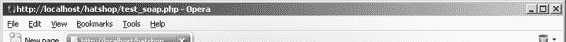
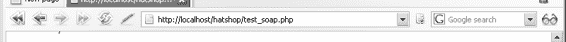
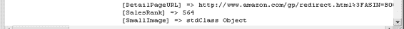

# ECS 4.0 文档章节

本材料将向您展示如何使用 REST 执行多种亚马逊操作。

## 使用 SOAP 访问亚马逊电子商务服务

通过 SOAP，您可以使用一个复杂的 API 来访问所需的 Amazon.com 功能。以下代码使用了亚马逊 API 中的 `AWSECommerceService`、`ItemSearch` 和 `ItemSearchRequest` 对象来执行搜索帽子的操作，这与您之前使用 REST 进行的搜索操作相同。

**提示：** 要使用 SOAP 访问亚马逊服务器，我们使用了 PHP SOAP 扩展。关于 PHP SOAP 功能的文档可以在 <http://www.php.net/soap/> 找到。请查阅附录 A，以确保您在 PHP 安装中启用了 SOAP 支持。

要测试使用 SOAP 访问 Web 服务，请在您的 `hatshop` 目录中创建一个名为 `test_soap.php` 的新文件，并在其中编写以下代码：

```php
<?php

try
{

    // 初始化 SOAP 客户端对象

    $client = new SoapClient(

        'http://webservices.amazon.com/AWSECommerceService/AWSECommerceService.wsdl');

    /* 别忘了在下一行中将字符串 '[Your Access Key ID]' 替换为您的订阅 ID */

    $request = array ('Service' => 'AWSECommerceService',

                     'AWSAccessKeyId' => '[Your Access Key ID]',

                     'Request' => array ('Operation' => 'ItemSearchRequest',

                                        'Keywords' => 'super+hats',

                                        'SearchIndex' => 'Apparel',

                                        'ResponseGroup' => array ('Request',

                                                                  'Medium')));

    $result = $client->ItemSearch($request);

    echo '<pre>';

    print_r($result);

    echo '</pre>';

}

catch (SoapFault $fault)

{

    trigger_error('SOAP Fault: (faultcode: ' . $fault->faultcode . ', ' .

                  'faultstring: ' . $fault->faultstring . ')', E_USER_ERROR);

}

?>
```

[www.it-ebooks.info](http://www.it-ebooks.info/)

整个 SOAP 请求代码被包含在一个 `try` 块中。如果 SOAP 请求失败，它会抛出一个 `SoapFault` 类型的异常，我们通过 `trigger_error()` 函数将其转换为一个错误。关于 SOAP 异常的更多信息，请阅读 <http://www.php.net/manual/en/function.is-soap-fault.php>。

SOAP 请求的结果是一个包含请求数据的对象。如果您在浏览器中加载 `test_soap.php`（别忘了在其中放入您的 Access Key ID），它应该会以一种不易于人类阅读的文本格式显示数据。

代码首先创建了一个指向亚马逊 SOAP Web 服务的 SOAP 客户端对象：

```php
// 初始化 SOAP 客户端对象
$client = new SoapClient(
    'http://webservices.amazon.com/AWSECommerceService/AWSECommerceService.wsdl');
```

所引用的 WSDL（Web 服务定义语言）文件描述了亚马逊 SOAP 服务器能够理解的所有函数及其参数类型。之前创建的亚马逊 SOAP 客户端对象知道所有这些函数，您现在可以像这样调用它们：

```php
$result = $client->ItemSearch($request);
```

或者，您也可以使用 `__soapCall` 函数（<http://www.php.net/manual/en/function.soap-soapclient-soapcall.php>）来进行完全相同的调用并隐式地获得相同的结果，如下所示：

```php
$result->__soapCall('ItemSearch', array ($request));
```

这个 Web 服务请求对 `"Apparel"` 商店中的 `"super+hats"` 关键词执行了一个 `ItemSearch` 操作。整个请求被放置在一个 `try-catch` 块中，该块会捕获任何潜在的异常并生成一个错误。关于包含 SOAP 错误细节的 `SoapFault` 异常类，请阅读 <http://www.php.net/manual/en/function.is-soap-fault.php>。加载 `test_soap.php` 将生成如图 17-6 所示的结果。

[www.it-ebooks.info](http://www.it-ebooks.info/)









### 图 17-6：SOAP 请求的结果 - 将亚马逊电商服务与帽子商店集成

目标是将亚马逊上一些与“超级帽子”相关的图书引入你的商店。你需要构建一个不含分类的特殊部门，用于展示图书信息（封面图片、标题、作者和价格）。每本书都会附带一个“从亚马逊购买”的链接，方便访客从 Amazon.com 购买。如果你申请了亚马逊联盟（Amazon Associates）ID 账号，还可以从中获得少量佣金。完成练习后，你将实现如图 17-1 所示的亚马逊集成功能。

以下链接通过 REST 方式对亚马逊图书进行“超级帽子”关键词搜索，并返回按销量排序的前 10 个商品数据：`http://webservices.amazon.com/onca/xml?Service=AWSECommerceService`

`&Operation=ItemSearch`

`&AWSAccessKeyId=[你的访问密钥 ID]`

`&Keywords=super+hat`

`&SearchIndex=Apparel`

`&ResponseGroup=Request%2CMedium%2CImages%2COffers&Sort=salesrank`

我们将从这些商品中，只挑选那些可购买且带有封面图片的商品展示在网站上。

### 实现业务层

在业务层中，你将添加访问 ECS 系统的代码。

#### 练习：向业务层添加 ECS 通信代码

1.  在你的 `include/config.php` 文件中添加以下代码：
    
    ```php
    // 亚马逊电商服务
    // define('AMAZON_METHOD', 'REST');
    define('AMAZON_METHOD', 'SOAP');
    define('AMAZON_WSDL',
      'http://webservices.amazon.com/AWSECommerceService/AWSECommerceService.wsdl');
    define('AMAZON_REST_BASE_URL',
      'http://webservices.amazon.com/onca/xml?Service=AWSECommerceService');
    
    // 设置亚马逊访问密钥 ID
    define('AMAZON_ACCESS_KEY_ID', ' *[你的访问密钥 ID]*');
    
    // 设置亚马逊联盟 ID
    define('AMAZON_ASSOCIATES_ID', ' *[你的亚马逊联盟 ID]*');
    
    // 设置亚马逊请求选项
    define('AMAZON_SEARCH_KEYWORDS', 'super hat');
    define('AMAZON_SEARCH_NODE', 'Apparel');
    define('AMAZON_RESPONSE_GROUPS', 'Request,Medium');
    ```

2.  在业务文件夹中创建一个名为 `amazon.php` 的新文件，并向其中添加以下代码。其中唯一的公开方法是 `GetProducts`，上层将调用该方法，而其他私有方法则用于内部使用，以支持 `GetProducts` 的功能。
    
    ```php
    <?php
    
    // 用于访问 ECS 的类
    class Amazon
    {
      public function Amazon()
      {
      }
    
      // 检索亚马逊商品并发送至表示层
      public function GetProducts()
      {
        // 使用 SOAP 获取数据
        if (AMAZON_METHOD == 'SOAP')
          $result = $this->GetDataWithSoap();
        // 使用 REST 获取数据
        else
          $result = $this->GetDataWithRest();
    
        // 初始化数组对象
        $results = array ();
    
        // 格式化结果
        $results = $this->DataFormat($result);
    
        // 返回结果
        return $results;
      }
    
      // 使用 REST 调用 ECS
      private function GetDataWithRest()
      {
        $params = array ('Operation' => 'ItemSearch',
                         'SubscriptionId' => AMAZON_ACCESS_KEY_ID,
                         'Keywords' => AMAZON_SEARCH_KEYWORDS,
                         'SearchIndex' => AMAZON_SEARCH_NODE,
                         'ResponseGroup' => AMAZON_RESPONSE_GROUPS,
                         'Sort' => 'salesrank');
    
        $query_string = '&';
        foreach ($params as $key => $value)
          $query_string .= $key . '=' . urlencode($value) . '&';
        $amazon_url = AMAZON_REST_BASE_URL . $query_string;
    
        // 使用 REST 获取 XML 响应
        $amazon_xml = file_get_contents($amazon_url);
    
        // 反序列化 XML 并返回
        return simplexml_load_string($amazon_xml);
      }
    
      // 使用 SOAP 调用 ECS
      private function GetDataWithSoap()
      {
        try
        {
          $client = new SoapClient(AMAZON_WSDL);
    
          /* 构建一个包含输入参数的数组，
             用于传递给远程过程 */
        }
    ```


```php
$request = array (
    'SubscriptionId' => AMAZON_ACCESS_KEY_ID,
    'Request' => array (
        'Operation' => 'ItemSearchRequest',
        'Keywords' => AMAZON_SEARCH_KEYWORDS,
        'SearchIndex' => AMAZON_SEARCH_NODE,
        'ResponseGroup' => AMAZON_RESPONSE_GROUPS,
        'Sort' => 'salesrank'
    )
);

// 调用方法
$result = $client->ItemSearch($request);
return $result;

} catch (SoapFault $fault) {
    trigger_error(
        'SOAP Fault: (faultcode: ' . $fault->faultcode . ', ' .
        'faultstring: ' . $fault->faultstring . ')',
        E_USER_ERROR
    );
}

/* 为没有图片的商品设置"无图片可用"占位图，
   并将结果保存为结构简单的数组，便于上层处理 */
private function DataFormat($result)
{
    /* 变量 k 是 $new_result 数组的索引，该数组将包含
       要在 HatShop 中展示的 Amazon 商品 */
    $k = 0;
    $new_result = array ();

    /* 解析所有从 ECS 检索到的商品，并将其保存到
       $new_result 数组中 */
    for ($i = 0; $i < count($result->Items->Item); $i++)
    {
        // 创建商品数据的临时副本
        $temp = $result->Items->Item[$i];

        /* 如果图片 URL 为空，则将商品图片设置为
           images/not_available.jpg */
        if (property_exists($temp, 'SmallImage') &&
            ((string) $temp->SmallImage->URL) != '')
            $new_result[$k]['image'] = (string) $temp->SmallImage->URL;
        else
            $new_result[$k]['image'] = 'images/not_available.jpg';

        // 将 asin、品牌、名称和价格保存到 $new_result 数组
        $new_result[$k]['asin'] = (string) $temp->ASIN;
        $new_result[$k]['brand'] = (string) $temp->ItemAttributes->Brand;
        $new_result[$k]['item_name'] = (string) $temp->ItemAttributes->Title;
        if (property_exists($temp->OfferSummary, 'LowestNewPrice'))
            $new_result[$k]['price'] =
                (string) $temp->OfferSummary->LowestNewPrice->FormattedPrice;
        elseif (property_exists($temp->ItemAttributes, 'ListPrice'))
            $new_result[$k]['price'] =
                (string) $temp->ItemAttributes->ListPrice->FormattedPrice;
        else
            $new_result[$k]['price'] = '';

        $k++;
    }

    return $new_result;
}
```

## 工作原理：与 ECS 通信

Amazon 业务层中唯一公开的方法是 `GetProducts()`，它负责检索数据。其功能非常清晰，通过调用多个辅助方法来完成任务。首先，它根据您在 `include/config.php` 中添加的配置设置，决定使用 SOAP 还是 REST。

您在 `include/config.php` 中定义的 `AMAZON_METHOD` 常量指示了将通过 REST 还是 SOAP 与 ECS 通信。该常量的值（应为 `REST` 或 `SOAP`）决定了将使用 `GetDataWithRest()` 还是 `GetDataWithSoap()` 来联系 Amazon。无论您选择哪种方法，结果应该相同：

```
// 检索 Amazon 商品，发送到表示层
public function GetProducts()
{
    // 使用 SOAP 获取数据
    if (AMAZON_METHOD == 'SOAP')
        $result = $this->GetDataWithSoap();
    // 使用 REST 获取数据
    else
        $result = $this->GetDataWithRest();

    // 初始化数组对象
    $results = array ();
    // 格式化结果
    $results = $this->DataFormat($result);
    // 返回结果
    return $results;
}
```

`GetDataWithSoap()` 和 `GetDataWithRest()` 将商品列表以对象形式返回。然后，我们使用 `DataFormat()` 方法解析该对象中的数据，并以关联数组的形式返回数据。

`DataFormat()` 方法还会为没有商品图片的 Amazon 商品设置"无图片可用"占位图。

现在让我们来看看 `GetAmazonDataWithRest()` 和 `GetAmazonDataWithSoap()` 这两个方法，它们负责与 ECS 进行实际通信。`GetAmazonDataWithRest()` 使用 REST 检索 Web 服务数据。它首先通过拼接要发送给 Amazon 的各个参数来构建所需的查询字符串：

```
// 使用 REST 调用 ECS
```


### 排版后内容

`private function GetDataWithRest()`

`{`

`$params = array ('Operation' => 'ItemSearch',`

`'SubscriptionId' => AMAZON_ACCESS_KEY_ID,`

`'Keywords' => AMAZON_SEARCH_KEYWORDS,`

`'SearchIndex' => AMAZON_SEARCH_NODE,`

`'ResponseGroup' => AMAZON_RESPONSE_GROUPS,`

`'Sort' => 'salesrank');`

`$query_string = '&';`

`foreach ($params as $key => $ value)`

`$query_string .= $key . '=' . urlencode($value) . '&';` 

完整的 Amazon URL 由基础 URL（你已保存为 `include/config.php` 中的常量）和刚刚构建的查询字符串组成：`$amazon_url = AMAZON_REST_BASE_URL . $query_string;`

使用 `file_get_contents()` 函数，你可以向 Amazon 发起一个简单的 HTTP GET 请求，就像在浏览器中输入地址一样：

```
// 使用 REST 获取 XML 响应
$amazon_xml = file_get_contents($amazon_url);
```

`$amazon_xml` 变量将包含一个字符串，其中是返回的 XML 数据。为了进一步处理，我们使用 `simplexml_load_string()` 函数来解析 XML 文本并返回一个代表 XML 文档的 `SimpleXMLElement` 对象。更多详情请参见 `http://www.php.net/manual/en/function.simplexml-load-string.php`。

```
// 反序列化 XML 并返回
return simplexml_load_string($amazon_xml);
}
```

`GetAmazonDataWithSoap()` 方法与 `GetAmazonDataWithRest()` 功能相似，但它是使用 SOAP 进行 `ItemSearch` 操作。该方法与 ECS 通信的逻辑与本章前面编写的页面相同。

[www.it-ebooks.info](http://www.it-ebooks.info/)

648XCH17a.qxd 11/22/06 5:42 AM Page 564

**564**

第 17 章 ■ 连接 Web 服务

## 实现表示层

让我们创建一个组件化模板来显示帽子，然后修改 `departments_list` 组件化模板以包含这个新部门。

## 练习：在 HatShop 中显示 Amazon.com 产品

**1.** 在项目的 `presentation/templates` 文件夹中添加一个新文件 `amazon_products_list.tpl`，并在其中添加以下代码：

```
{* amazon_products_list.tpl *}
{load_amazon_products_list assign="amazon_products_list"}
<p class="title">{$amazon_products_list->mDepartmentName}</p>
<br />
<p class="description">{$amazon_products_list->mDepartmentDescription}</p>

{section name=k loop=$amazon_products_list->mProducts}
{assign var=direction_p value="left"}
{if $smarty.section.k.index != 0 &&
($smarty.section.k.index + 1) % 2 == 0}
{assign var=direction_p value="right"}
{else}
<br />
{/if}
<p class="{$direction_p}">
<br />
mProducts[k].image}"
border="0" height="70" alt="Product image" class="product_image" />
<span class="small_title">
{$amazon_products_list->mProducts[k].item_name}
</span>
<span>
by {$amazon_products_list->mProducts[k].brand}
</span>
<br /><br />
{if $amazon_products_list->mProducts[k].price}
<span>Price:</span>
<span class="price">
{$amazon_products_list->mProducts[k].price}
</span>
{/if}
<br /><br />
<a class="small_link" target="_blank"
href="{$amazon_products_list->mProducts[k].link}"> Buy From Amazon
</a>
</p>
{/section}
```

[www.it-ebooks.info](http://www.it-ebooks.info/)

648XCH17a.qxd 11/22/06 5:42 AM Page 565

第 17 章 ■ 连接 Web 服务

**565**

**2.** 在 `presentation/smarty_plugins` 文件夹中创建一个新文件 `function.load_amazon_products_list.php`，并在其中添加以下代码：

```
<?php
// 插件文件中的插件函数必须命名为：smarty_type_name
function smarty_function_load_amazon_products_list($params, $smarty)
{
    // 创建 AmazonProductsList 对象
    $amazon_products_list = new AmazonProductsList();
    $amazon_products_list->init();
    // 分配模板变量
    $smarty->assign($params['assign'], $amazon_products_list);
}
// 处理 ECS 数据的类
class AmazonProductsList
{
    // Smarty 模板中可用的公共变量
    public $mProducts;
    public $mDepartmentName;
    public $mDepartmentDescription;
    // 构造函数
    public function __construct()
    {
        $this->mDepartmentName = AMAZON_DEPARTMENT_TITLE;
```


```php
$this->mDepartmentDescription = AMAZON_DEPARTMENT_DESCRIPTION;
}

public function init()
{
    $amazon = new Amazon();
    $this->mProducts = $amazon->GetProducts();

    for ($i = 0; $i < count($this->mProducts); $i++) {
        $this->mProducts[$i]['link'] =
            'http://www.amazon.com/exec/obidos/ASIN/' .
            $this->mProducts[$i]['asin'] .
            '/ref=nosim/' . AMAZON_ASSOCIATES_ID;
    }
}
?>
```

3. 在 `hatshop.css` 末尾添加以下样式：

```css
.small_title
{
    font-family: arial, tahoma, verdana;
    font-size: 12px;
    font-weight: bold;
}

a.small_link
{
    color: #0000ff;
    font-family: arial, tahoma, verdana;
    font-size: 11px;
    text-decoration: underline;
}

a.small_link:hover
{
    color: #0000ff;
    font-family: arial, tahoma, verdana;
    font-size: 11px;
}
```

4. 在您的 `include/config.php` 文件末尾添加以下两行配置：

```php
// Amazon.com department configuration options
define('AMAZON_DEPARTMENT_TITLE', 'Amazon Super Hats');
define('AMAZON_DEPARTMENT_DESCRIPTION', 'Browse these super hats that Amazon.com offers');
```

5. 修改 `presentation/templates/departments_list.tpl` 模板文件，以添加 Amazon Super Hats 部门。按如下所示添加高亮代码：

```smarty
{* Generate a link for a new department in the list *}
<a {$selected_d}
   href="{$departments_list->mDepartments[i].link|prepare_link:"http"}">
    » {$departments_list->mDepartments[i].name}
</a>
</li>
{/section}

{assign var=selected_d value=""}
{if $departments_list->mAmazonSelected}
    {assign var=selected_d value="class=\"selected\""}
{/if}
<li>
    <a {$selected_d}
       href="{$departments_list->mAmazonDepartmentLink|prepare_link:"http"}">
        » {$departments_list->mAmazonDepartmentName}
    </a>
</li>
</ol>
</div>
{* End departments list *}
```

6. 按此代码片段中的高亮所示更新 `presentation/smarty_plugins/function.load_departments_list.php`：

```php
// Manages the departments list
class DepartmentsList
{
    /* Public variables available in departments_list.tpl Smarty template */
    public $mDepartments;
    public $mSelectedDepartment;
    public $mAmazonSelected = false;
    public $mAmazonDepartmentName;
    public $mAmazonDepartmentLink;

    // Constructor reads query string parameter
    public function __construct()
    {
        /* If DepartmentID exists in the query string, we're visiting a department */
        if (isset($_GET['DepartmentID'])) {
            $this->mSelectedDepartment = (int)$_GET['DepartmentID'];
        } else {
            $this->mSelectedDepartment = -1;
        }

        // Set Amazon department name and build the link for department
        $this->mAmazonDepartmentName = AMAZON_DEPARTMENT_TITLE;
        $this->mAmazonDepartmentLink = 'index.php?DepartmentID=' . AMAZON_DEPARTMENT_TITLE;

        // Check if the Amazon department is selected
        if ((isset($_GET['DepartmentID'])) &&
            ((string) $_GET['DepartmentID'] == AMAZON_DEPARTMENT_TITLE)) {
            $this->mAmazonSelected = true;
        }
    }
    // ...
}
```

7. 更新 `include/app_top.php`，通过在文件末尾添加以下代码来引用新的业务层类：

```php
require_once BUSINESS_DIR . 'amazon.php';
```

8. 修改 `index.php` 文件以加载新创建的组件化模板：

```php
// Load department details if visiting a department
if (isset($_GET['DepartmentID'])) {
    if ((string) $_GET['DepartmentID'] == AMAZON_DEPARTMENT_TITLE) {
        $pageContentsCell = 'amazon_products_list.tpl';
    } else {
        $pageContentsCell = 'department.tpl';
        $categoriesCell = 'categories_list.tpl';
    }
}
```

9. 在浏览器中加载 `index.php`，然后点击您新创建的 Amazon Super Hats 部门。


