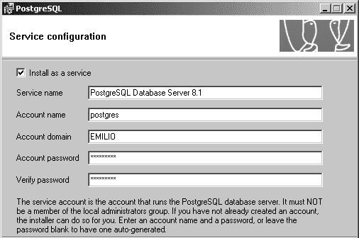

# 安装支持 SSL 的 Apache

以下步骤将在 80 端口安装 Apache，因此必须确保没有其他 Web 服务器（如 IIS）在该端口运行。

1. 从 `http://www.apachelounge.com/download/` 下载 `httpd-2.2.3-win32-x86-ssl.zip` 或更新版本。

2. 解压存档，按照 `Read Me First.txt` 中的步骤操作。Apache 将安装在 `C:\Apache2` 目录下，但此时 `https://localhost` 尚无法响应——还需执行以下步骤。

3. 将 `C:\Apache2\bin` 中的 `ssleay32.dll` 和 `libeay32.dll` 复制到 Windows 安装目录的 `System32` 文件夹中（通常完整路径为 `C:\Windows\System32`）。

4. 打开命令提示符窗口，通过类似 `cd C:\Apache2\bin` 的命令导航至 Apache 安装目录的 `C:\Apache2\bin` 文件夹。

5. 执行以下命令，可根据需要将 `hatshop.csr` 替换为其他名称（但请务必保留 `.csr` 扩展名）：

   ```
   openssl req -config C:\Apache2\conf\openssl.cnf -new -out hatshop.csr
   ```

6. 当提示输入"通用名称（即您的网站域名）"时，请提供 Web 服务器的准确域名（例如 `www.example.com`）。如果证书中的名称与 URL 不严格匹配，浏览器会向用户显示警告信息。

7. 执行以下命令：

   ```
   openssl rsa -in privkey.pem -out hatshop.key
   ```

8. 执行以下命令：

   ```
   openssl x509 -in hatshop.csr -out hatshop.crt -req -signkey hatshop.key -days 365
   ```

9. 在 Apache 文件夹中创建名为 `C:\Apache2\conf\ssl` 的目录，并将 `hatshop.key` 和 `hatshop.crt` 移动至该目录。

10. 打开 `C:\Apache2\conf\httpd.conf`，取消以下两行的注释：

    ```
    LoadModule ssl_module modules/mod_ssl.so
    Include conf/extra/httpd-ssl.conf
    ```

11. 打开 `C:\Apache2\conf\extra\httpd-ssl.conf`，找到 `SSLCertificateFile c:/Apache2/conf/server.crt` 并将其更改为 `SSLCertificateFile c:/Apache2/conf/ssl/hatshop.crt`。

12. 同样在 `httpd-ssl.conf` 中，找到 `SSLCertificateKeyFile c:/Apache2/conf/server.key` 并将其更改为 `SSLCertificateKeyFile c:/Apache2/conf/ssl/hatshop.key`。

13. 重启 Apache，并访问 `https://localhost`。您将看到一个简单的"It Works"页面。

## 安装 Apache（无 SSL）

如果您已安装支持 SSL 的 Apache，则无需执行以上步骤，可直接跳至下一节安装 PHP。

从 `http://httpd.apache.org/download.cgi` 下载 Apache HTTP Server 的最新 Win32 二进制版本（MSI 安装程序）。文件名称类似 `apache_2.x.y-win32-x86-no_ssl.msi`。运行该文件。

安装过程中，您可以选择 Apache Web 服务器的安装位置。默认位置为 `C:\Program Files\Apache Software Foundation\Apache2.2\`，但您可以选择更方便的路径（例如 `C:\Apache2`），这能让您在后续使用 Apache 时更轻松。

接受许可协议并阅读简介后，系统会要求您输入服务器信息（见图 A-1）。

**图 A-1.** 安装 Apache

如果不确定如何填写表单，只需在前两个字段中使用 `localhost`，并在最后一个字段中输入电子邮件地址。您之后可以通过编辑 `httpd.conf` 文件（默认位于 `C:\Program Files\Apache Software Foundation\ApacheX.Y\conf\httpd.conf`）来修改这些信息。

如果你已经有一个 Web 服务器（例如 IIS）在 80 端口上运行，你就需要将 Apache 安装到其他端口上。安装过程中，你会有一个选项，指定 Apache 应"仅为当前用户工作，在端口 8080 上，且手动启动"。如果选择该选项，你需要手动进入 Apache 的安装目录（默认是 `C:\Program Files\Apache Software Foundation\Apache2.2\bin`），并输入以下命令来启动 Apache 服务：

```
apache -k install
```

在其他屏幕中，你可以使用默认选项。

安装 Apache 服务后，你将能在"Apache 服务监视器"程序（可从任务栏访问）中看到它，该程序也允许你启动、停止或重启 Apache 服务。在对 `httpd.conf` 配置文件进行更改后，你需要重启（或停止后再启动）该服务。

确保 Apache2 服务已启动并运行后，测试其是否工作正常。如果你将其安装在 80 端口上，请访问 `http://localhost/`。如果安装在 8080 端口上，请访问 `http://localhost:8080/`。你应看到一个欢迎消息，对于 Apache 2.2，该消息显示为"It works!"。

## 安装 PHP 5

首先从 `http://www.php.net/downloads.php` 下载最新版本 PHP 的 Windows 二进制文件。不要使用 PHP 安装程序，因为它不包含 HatShop 所需的外部扩展。

> **注意**：该代码无法在 PHP 4 或更旧版本上运行！

下载完 Windows 二进制文件后，按照以下步骤安装 PHP：

1.  将压缩文件（文件名类似 `php-5.x.y-win32.zip`）解压到名为 `C:\PHP` 的文件夹中。你也可以为此文件夹选择其他名称或位置。

2.  将 `php5ts.dll` 从 `C:\PHP` 复制到 `C:\Windows\System32`（如果 `System32` 文件夹在其他位置，则复制到相应位置）。

3.  将 `php.ini-recommended` 从 `C:\PHP` 复制到你的 Windows 文件夹，并将其重命名为 `php.ini`。

4.  取消 `php.ini` 中以下行的注释，以启用 `mhash`、`mcrypt`、`curl`、`pdo` 和 `soap` 扩展。如果文件中没有这些行，直接添加即可。

    ```
    extension=php_mhash.dll
    extension=php_mcrypt.dll
    extension=php_curl.dll
    extension=php_pdo.dll
    extension=php_pdo_pgsql.dll
    extension=php_soap.dll
    ```

5.  同样在 `php.ini` 中找到以下行：

    ```
    extension_dir = "./"
    ```

    并将其改为：

    ```
    extension_dir = "C:\PHP\ext"
    ```

6.  将 `libmhash.dll`、`libeay32.dll`、`ssleay32.dll` 和 `libmcrypt.dll` 从你的 PHP 文件夹复制到 Windows 的 `System32` 文件夹。

7.  使用任意文本编辑器（甚至记事本）打开 Apache 配置文件进行编辑。该文件的默认位置是 Apache 安装目录下的 `conf\httpd.conf`。

8.  在 `httpd.conf` 中找到包含多个 `LoadModule` 条目的部分，并添加以下行（具体名称可能因你的 Apache 和 PHP 版本而异）：

    ```
    LoadModule php5_module c:/php/php5apache2_2.dll
    AddType application/x-httpd-php .php
    ```

    > **注意**：如果你的 PHP 文件夹中没有 `php5apach2_2.dll` 文件，可以从 `http://snaps.php.net/` 下载的包中获取。

9. 同样在 `httpd.conf` 中找到 `DirectoryIndex` 条目，并在行末添加 `index.php`，如下所示：

    ```
    DirectoryIndex index.html index.php
    ```

10. 保存对 `httpd.conf` 的更改，然后重启 Apache 2。如果在此阶段遇到任何错误，应检查你是否正确执行了前面的步骤。

11. 为测试 PHP 安装是否正常，请在 Apache 安装目录的 `htdocs` 文件夹中创建一个名为 `test.php` 的文件，其中包含对 PHP 的 `phpinfo()` 函数的调用：

    ```
    <?php
    phpinfo();
    ?>
    ```

12. 在 Web 浏览器中访问 `http://localhost/test.php`（如果你将 Apache 安装在 8080 端口上，则访问 `http://localhost:8080/test.php`），以测试安装是否一切顺利。你应看到一个与第 2 章图 2-7 类似的 PHP 信息页面。

[www.it-ebooks.info](http://www.it-ebooks.info/)



`648XAppA.qxd 11/19/06 1:45 PM Page 576`

**576**

附录 A ■ 安装 Apache、PHP 和 PostgreSQL

**安装 PostgreSQL**

要安装 PostgreSQL，请遵循以下简单步骤。我们已使用 PostgreSQL 8.1 对这些步骤进行了测试，但你应下载 PostgreSQL 的最新可用版本。

1. 访问 `http://www.postgresql.org/`，并从菜单中点击“Downloads”（下载）链接。

2. 在“Download Core Distribution”（下载核心发行版）对话框中，点击“Via FTP”。

3. 从列表中选择二进制目录。

4. 选择最新稳定版本的文件夹。

5. 选择 `win32`。

6. 下载安装程序文件，其名称类似于 `postgresql-*version*.zip`。之后可能会要求你选择一个镜像位置。请选择一个离你当前位置较近的镜像。

7. 解压下载的文件，并运行安装程序的可执行文件。

8. 在第一个设置界面中，选择你的语言，然后点击“Start”（开始）。

9. 在前几个设置界面中使用默认选项，但务必在“Service configuration”（服务配置）界面中设置账户密码（见图 A-2）。

**图 A-2.** *测试 PHP 安装*

10. 点击“Next”（下一步）后，确认在 Windows 中创建 `postgres` 用户账户。如果系统警告你的密码强度较弱，在本地机器上开发期间，当被询问是否用随机密码替换时，选择“否”（No）通常是安全的。

[www.it-ebooks.info](http://www.it-ebooks.info/)

`648XAppA.qxd 11/19/06 1:45 PM Page 577`

**577**

附录 A ■ 安装 Apache、PHP 和 PostgreSQL

11. 在下一个界面中，系统将要求你配置数据库集群。请根据你的特定需求选择设置。例如，如果你打算存储默认编码不支持的文本，选择默认编码为 UTF-8 可能是安全的。

12. 点击“Next”（下一步），确保已选中选定的过程语言 `PL/pgsql`，然后再次点击“Next”。

13. 在“Enable Contrib Modules”（启用贡献模块）界面中，选择 `TSearch2`（用于全文搜索），然后点击两次“Next”（下一步）以安装 PostgreSQL。

**准备你的 Unix 测试环境**

几乎所有 Linux 发行版都包含 Apache、PHP 和 PostgreSQL，但是这些程序的版本可能已经过时。在尝试下载任何内容之前，你应该首先检查是否能在系统、在线资源或 Linux 发行版的安装光盘中找到所需内容。我们对 Apache 和 PostgreSQL 的要求不高，因此你可以为它们进行二进制安装，但你必须从源代码编译 PHP，以启用所有必需的库。

**安装 Apache 2**

创建支持 SSL 的 Web 服务器最常见的方法是使用 Apache 和 OpenSSL。你的系统上可能已经安装了它们。

你应首先使用以下命令检查系统上是否已安装 OpenSSL RPM 包：

`rpm -qa | grep openssl`

如果没有 OpenSSL，请从 `http://www.rpmfind.net/` 等资源处获取以下 RPM 包并进行安装。请务必获取最新的可用版本。

- `openssl-*version*.rpm`

- `openssl-devel-*version*.rpm`

我们决定从源代码构建最新的 Apache Web 服务器（撰写本文时为版本 2.2.3）。首先，你应从 `http://httpd.apache.org/download.cgi` 下载最新的 Unix Apache 源代码，并使用类似以下命令解压：`tar -zxvf httpd-2.2.3.tar.gz`

现在你可以继续在系统上编译并安装 Apache Web 服务器。进入 Apache 源代码的根目录，并执行以下命令（执行 `make install` 时需要以 `root` 身份登录）：

```
./configure --prefix=/usr/local/apache2 --enable-so --enable-ssl --with-ssl --enable-auth-digest
make
make install
```

`648XAppA.qxd 11/19/06 1:45 PM Page 578`

**578**

附录 A ■ 安装 Apache、PHP 和 PostgreSQL

要启用 SSL，你需要在 Apache 中安装 SSL 证书。如果你使用提供 SSL 的主机托管服务商托管应用程序，可以在开发机器上使用自己生成的“假”SSL 证书进行所有测试。你可以通过将自己设为证书颁发机构来做到这一点。要生成自己的证书，应遵循网上一些优秀的教程，例如 `http://www.linux.com/howtos/SSL-Certificates-HOWTO/index.shtml` 上的教程（你也可以通过简单的网络搜索找到更多教程）。否则，如果你希望为生产环境安装 SSL 证书，则需要从证书颁发机构（如 VeriSign）获取“真正的”SSL 证书，如第 7 章所述。

在 `httpd.conf` 配置文件中进行所需的所有更改，然后使用以下命令启动 Apache 服务器：

`/usr/local/apache2/bin/apachectl start`

> **注意：** 如果遇到类似“module access_module is built in and can’t be loaded”（模块 access_module 已内置且无法加载）的错误，请尝试注释掉 `httpd.conf` 中与生成该错误的模块相对应的 `LoadModule` 行。更好的方法是尝试注释掉所有不需要的模块。

现在在浏览器中加载 `http://localhost/`，确保 Apache Web 服务器已启动并运行，然后浏览 `https://localhost/` 以测试是否也能通过 SSL 访问 Apache。

**安装 PostgreSQL 8**

请按照以下步骤在您的系统上安装 PostgreSQL：

1. 从 `http://www.postgresql.org/ftp/source/` 下载 PostgreSQL 源代码。就本安装指南而言，我们使用 `postgresql-8.1.5.tar.gz`，但你应下载最新的可用版本。

2. 使用如下命令解压存档：`tar -zxvf postgresql-8.1.5.tar.gz`

3. 切换到 `postgresql-8.1.5` 文件夹：`cd postgresql-8.1.5`

4. 执行以下命令，将 PostgreSQL 准备安装到 `/usr/local/pgsql`：`./configure --prefix=/usr/local/pgsql`

5. 确保以 `root` 身份登录（如有必要，使用 `su` 命令），然后执行：`make install`

6. 出于安全原因，PostgreSQL 不允许 `root` 启动服务器。执行以下命令以将所有文件的所有者更改为 `postgres`：`chown -R postgres:postgres /usr/local/pgsql`

7. 以 `postgres` 身份登录，或使用 `su` 命令，然后切换目录到 `/usr/local/pgsql`：`cd /usr/local/pgsql`

8. 使用此命令初始化数据库集群：`bin/initdb -D ./data`

# 9. 使用此命令启动 PostgreSQL：`bin/pg_ctl -D ./data -l data/logfile start`

10. 现在 PostgreSQL 已启动，你需要先创建一个数据库和另一个用户，然后才能继续。你应该为每个项目使用单独的数据库，以使事情更清晰、更易于理解。你还应该为每个数据库使用单独的用户。这可以使所有内容保持独立，并且“项目 A”将无法修改“项目 B”的任何数据。在 PostgreSQL 中创建新用户非常简单。只需使用以下命令，然后按照提示操作即可：`/usr/local/pgsql/bin/createuser`。新用户不应能够创建新数据库或创建新用户。创建数据库略有不同：`/usr/local/pgsql/bin/createdb --owner=用户名 数据库名`

## 安装 pgAdmin III

`pgAdmin III` 不像 Windows 版本那样随 Linux 版本的 PostgreSQL 一起提供。请记住，如果你使用较新版本，请将文件名替换为实际名称。以下是在 Linux 机器上安装 `pgAdmin III` 应遵循的步骤。

1.  从 `http://wxwidgets.org/downloads/#latest_stable` 下载 pgAdmin III 依赖项 wxWidgets 的源代码（目前与 pgAdmin III v1.4.3 对应的版本是 wxWidgets 2.6.3）。

2.  解压、编译并安装源代码：

```
tar –zvxf wxWidgets*
cd wxWidgets*
./configure --with-gtk --enable-gtk2 --enable-unicode --enable-mimetype=no make
make install
```

安装 wxWidgets contrib 模块。

```
cd contrib/
make
make install
```

3.  从 `http://www.postgresql.org/ftp/pgadmin3/release` 下载最新版本的 pgAdmin III 源代码。

4.  解压、编译并安装源代码：

```
tar -zvxf pgadmin3-1.4.3.tar.gz
cd pgadmin3-1.4.3
./configure
make all
make install
```

## 安装 PHP 5

每次你想在 Linux 上启用一个新的 PHP 库时，都需要重新编译 PHP 模块。因此，建议从一开始就进行一次“良好”的编译，包含所有需要的库。

访问 `http://www.php.net/downloads.php`，获取 PHP 5.x 的完整源代码存档，并将其内容解压到一个目录中。

在编译 PHP 并让 Apache 识别它（通过更新 Apache 的配置文件 `httpd.conf`）之前，你需要安装 PHP 下工作所需的额外模块。

让我们逐一处理它们。

### mhash

mhash 库为大量哈希算法提供了统一的接口。你在第 11 章中使用它对客户密码进行了哈希处理。请参考该章节以了解更多关于哈希的内容。

从 `http://mhash.sourceforge.net/` 下载 mhash，解压（使用 `tar -zxvf`），并通过执行以下命令进行安装：

```
./configure
./make
./make install
```

或者，如果你使用 Red Hat，你可以从 `http://www.ottolander.nl/opensource/mhash/libmhash.html` 下载 RPM 包并进行安装。我们安装了 `libmhash-0.8.18-2a.i386.rpm` 和 `libmhash-devel-0.8.18-2a.i386.rpm` 这两个 RPM 包。

### mcrypt

该库允许你使用广泛的加密功能。你将需要它来加密高度敏感的信息，例如第 11 章中讨论的信用卡详细信息。（更多细节请参考第 11 章。）

从 `http://mcrypt.sourceforge.net/` 下载 mcrypt，解压（使用 `tar -zxvf`），并通过执行以下命令进行安装：

```
./configure
./make
./make install
```

另外，你可以在 `http://www.ottolander.nl/opensource/mcrypt/mcrypt.html` 找到 Red Hat 的 RPM 包。我们安装了 `libmcrypt-2.5.7-1a.i386.rpm` 和 `libmcrypt-devel-2.5.7-1a.i386.rpm` 这两个 RPM 包。

或者，你也可以使用来自 `http://mcrypt.sourceforge.net` 的源代码。

### CURL（客户端 URL 库）函数

你将使用 libcurl，这是一个允许你使用多种不同协议连接并与多种不同类型服务器通信的库。在第 14 章中，你需要它通过 SSL 与支付网关进行通信。你可以从 `http://curl.haxx.se/download.html` 获取最新版本的 curl 库，也可以使用 `http://www.rpmfind.net` 为你的系统查找 RPM 包。

### libxml2

PHP 5 需要 libxml2 库版本 2.5.10 或更高。如果你的 Unix 或 Linux 系统没有足够新的版本，请从 `http://xmlsoft.org/` 获取最新的 `libxml2` 和 `libxml2-devel` RPM 包并进行安装。

你可以使用以下命令检查你的 libxml2 库：`rpm -qa | grep libxml2`。

## 编译并安装 PHP 5

要编译并安装 PHP 5，请遵循以下步骤：

1.  进入你解压 PHP 源代码的文件夹，并执行以下命令：

```
./configure --with-config-file-path=/etc
--with-pdo-pgsql=/usr/local/pgsql/bin/pg_config
--with-apxs2=/usr/local/apache2/bin/apsx2
--with-mcrypt --with-mhash
--with-openssl-dir --with-curl --with-zlib
--with-pdo --enable-soap
make
make install
```

2.  通过执行以下命令，将 `php.ini-recommended` 复制到 `/etc/php.ini`：`cp php.ini-recommended /etc/php.ini`。

3.  在 `httpd.conf` 中，找到包含许多 `LoadModule` 项的部分，并添加以下行（具体名称可能因你的 Apache 和 PHP 版本而异）：

```
LoadModule php5_module modules/libphp5.so
```

```
AddType application/x-httpd-php .php
```

4.  打开 Apache 配置文件（`httpd.conf`），找到 `DirectoryIndex` 条目，确保该行的末尾有 `index.php`：

```
DirectoryIndex index.html index.html.var index.php
```

5.  重启 Apache Web 服务器，一切应该就绪。为了确认 PHP 安装成功，请在 `htdocs` 文件夹（默认路径为 `/usr/local/apache2/htdocs/`）中创建一个名为 `test.php` 的文件，内容如下：

```
<?php
phpinfo();
?>
```

最后，在浏览器中访问 `http://localhost/test.php`，确认 PHP 已在 Apache 下正确安装。

[www.it-ebooks.info](http://www.it-ebooks.info/)

648XAppB.qxd 11/19/06 1:55 PM Page 583