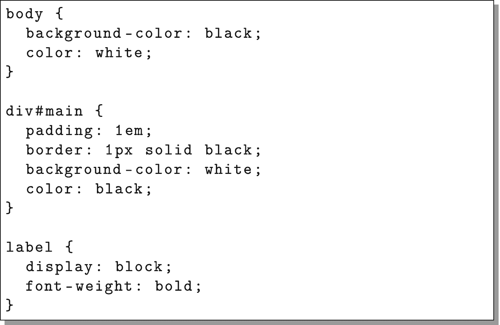
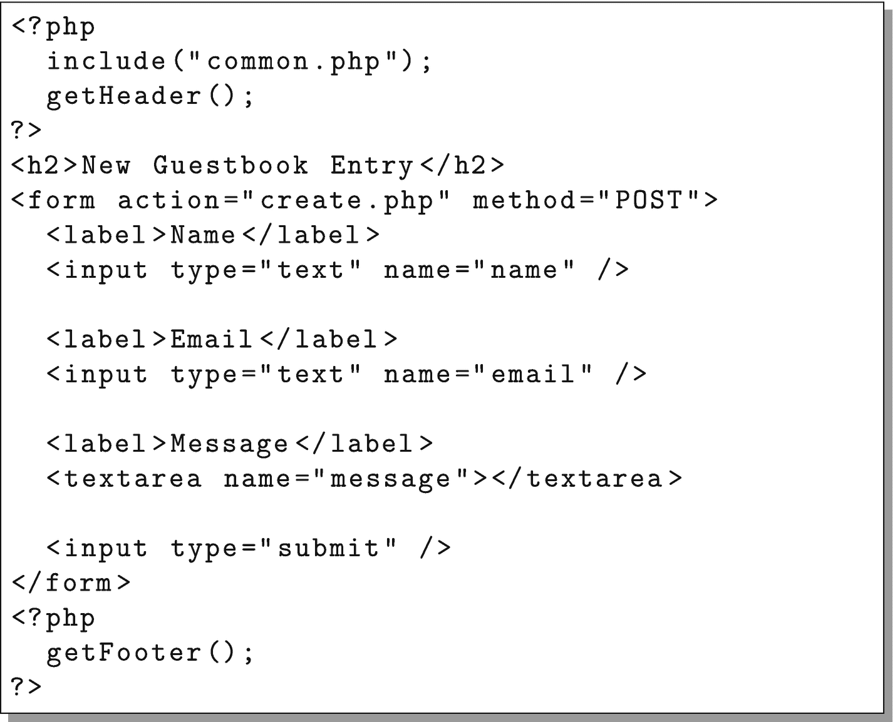
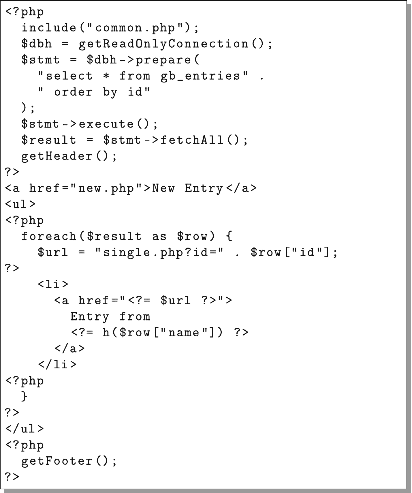
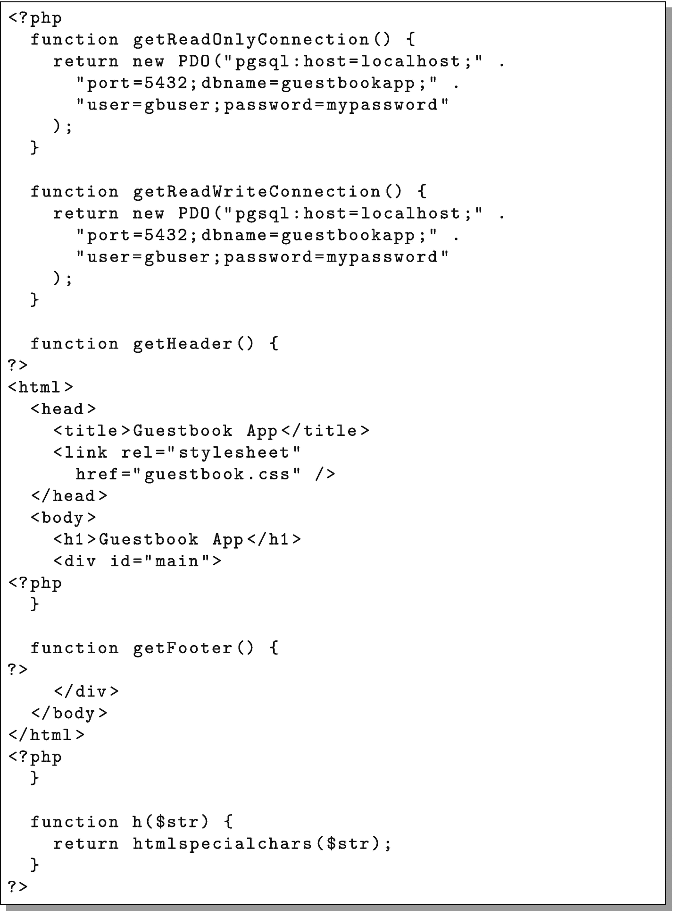

# 4.创建简单的 Web 应用程序

在本章中，我们将创建一个极其简单的 web 应用程序，用于后续章节中的演示。这里的目标是让一个完整的端到端应用程序启动并运行。

我们将要开发的应用程序将只是一个留言簿，这样任何人都可以在留言簿上留言。

## 4.1 设置数据库服务

任何好的 web 应用程序都有一个数据库。我选择的数据库一直是 PostgreSQL ( [`www.postgresql.org`](http://www.postgresql.org) )。有一种神话认为 PostgreSQL 很慢。这是有一定道理的——在上世纪 90 年代。

然而，从 PostgreSQL 7 开始，PostgreSQL 已经是一个顶级的表现者，并且它只是随着每个版本变得更好。此外，PostgreSQL 在复杂查询方面*一直*表现出色，今天依然如此。PostgreSQL 的目标是无限制编程。例如，在 PostgreSQL 文本列中，您可以在单行的一列中存储高达 4gb 的数据，并且仍然可以按它进行排序。在许多数据库中，您的大部分时间都花在使数据与数据库的首选架构相匹配上。我发现，使用 PostgreSQL，数据库通常已经为您自己的数据架构做好了准备。

虽然这不是一本关于 PostgreSQL 的书，但我们将讨论它的一些与节点集群相关的特性。

要安装 PostgreSQL，只需以 root 用户身份执行以下操作(本部分的所有操作都应以 root 用户身份执行):

```php
yum install -y postgresql-server

```

这将安装 PostgreSQL 所需的所有软件包。要设置初始数据库，请键入以下内容:

```php
postgresql-setup initdb

```

这将创建 PostgreSQL 运行所需的所有目录和文件。接下来，我们需要设置连接到 PostgreSQL 数据库的身份验证方法。PostgreSQL 将其数据和配置存储在目录`/var/lib/pgsql/data`中。控制数据库访问的文件是`pg_hba.conf`。

编辑该文件(键入`nano /var/lib/pgsql/data/pg_hba.conf`)以在顶部添加以下两行:

```php
local all all trust
host all all all md5

```

第一行表示信任所有来自本地的连接(即，不通过网络)。因此，我们在命令行上直接处理数据库时不需要密码。第二行表示任何人都可以使用适当的密码通过网络连接到数据库。这有点不安全(我们不希望任何人都能连接到我们的数据库)，除了默认情况下数据库只监听本地地址 127.0.0.1，所以现在无论如何你不能从外部连接到它。确保保存文件，然后退出编辑器。

请注意，即使我们有适当的限制(仅限本地连接、防火墙等)。)，许多人会认为前面的配置过于暴露，不符合他们的喜好。这里的措施是为了平衡安全性和易学性。要了解更多关于保护 PostgreSQL 的信息，您应该阅读关于`pg_hba.conf`文件的 [`www.postgresql.org`](http://www.postgresql.org) 上的文档。

现在是时候打开我们的数据库了。为此，请输入以下内容:

```php
systemctl enable postgresql
systemctl start postgresql

```

您的数据库系统现在已经启动并运行。您已经创建了数据库*系统*，但是没有创建数据库本身。然而，首先我们需要一个数据库用户。`createuser`命令创建一个新的数据库用户:

```php
createuser -U postgres -d -P gbuser

```

该命令以数据库管理员用户(`-U postgres`)的身份运行，创建一个名为`gbuser`的新用户，他可以创建数据库(`-d`)，并提示您为这个新的数据库用户(`-P`)设置一个密码。当它提示您时，将密码设置为您想要的任何值，并记下它，以便以后使用。我们将在本书中需要的地方使用密码`mypassword`,但是请注意，这将是一个在生产中实际使用的可怕密码。当使用命令行时，您不需要使用密码，因为我们已经将它设置为`trust`，但是当从您的应用程序连接时，您将需要它。

要以此用户身份创建数据库，请键入:

```php
createdb -U gbuser guestbookapp

```

这将创建一个新的数据库作为给定的数据库用户。现在，为了创建表，我们需要登录数据库。`psql`命令将为您提供一个到数据库的交互式 SQL 会话。要使用它，只需键入:

```php
psql -U gbuser guestbookapp

```

命令提示符会切换到类似于`guestbookapp=>`的状态，这表示您在数据库中。要随时退出，可以键入`\q`。像许多系统管理命令一样，当您运行 PostgreSQL 命令时，它并不真正关心您在文件系统中的位置。它与运行在自己目录中的数据库服务通信。

现在我们已经连接到数据库，我们将使用以下命令创建一个表:

```php
create table gb_entries(id serial primary key, name text, email text, message text, created_at timestamp,
has_img bool default false);

```

`id`字段是用类型`serial`创建的，这是 PostgreSQL 的自动编号机制。要查看您刚刚创建的表格，请键入`\d gb_entries`。完成后，进入`\q`退出数据库。

## 4.2 The 代码

在我们编写 PHP 代码之前，我们需要安装一些额外的 PHP 库，以便我们可以连接到我们的数据库。将它们安装在:

```php
yum install -y php74-php-pgsql php74-php-pdo
systemctl restart php74-php-fpm

```

我们的应用很简单:

*   一个保存配置信息和常用功能的文件

*   一个显示留言簿条目列表的文件

*   一个显示个人留言簿条目的文件

*   一个文件用于输入新的留言簿条目

*   CSS 样式表

这本书假设你知道一点 PHP 和 SQL，但即使你不知道，代码应该足够简单，无论你熟悉什么语言。因此，文件将在此呈现，不做过多评论。你会在本章末尾找到包含代码的数字。

图 [4-1](#Fig1) 显示了其他文件包含的常用功能。它有两个获取数据库连接的函数——一个用于获取只读连接，一个用于获取读/写连接。在这一点上，它们都返回相同的连接(并且它们确实都是读/写的)，但是随着我们进一步开发应用程序，我们将会看到如何通过分离只用于读的连接和用于读和写的连接来获得很多好处。这两个函数都简单地使用 PDO (PHP 数据对象)通过连接字符串获取到数据库的连接。请注意，这些连接字符串包含数据库的密码。确保将这些连接字符串的*和*上的密码更改为您之前为`gbuser`数据库用户输入的密码。

它还有`getHeader()`和`getFooter()`函数，所以我们不必写太多的 HTML。另外，`h()`被用作`htmlspecialchars()`的一个较短版本，这样我们可以有更安全的输出。

图 [4-2](#Fig2) 是列出数据库中所有条目的 PHP 脚本。这段代码只是创建一个数据库语句，执行它，并遍历结果。

图 [4-3](#Fig3) 显示了从数据库中获取单个条目。同样，只准备和执行一条 SQL 语句，结果显示在屏幕上。

图 [4-4](#Fig4) 简单地显示了一个将被用来创建一个新的留言簿条目的表单。该表单将其数据发布到图 [4-5](#Fig5) 中的程序中。该程序根据在中输入的值创建新记录。然后，在执行 SQL insert 语句后，它将用户重定向回清单屏幕。

最后，图 [4-6](#Fig6) 是一个静态 CSS 文件，为整个过程提供了少量的样式。正如在第 [1](01.html) 章中提到的，如果你不想自己输入所有这些文件，你可以从 GitHub 获得它们:

```php
https://github.com/johnnyb/cloud-example-application

```

要在服务器上直接使用 git，您需要以 root 用户的身份安装它:

```php
yum install -y git

```

输入所有程序后，将它们发送到新服务器上的`/var/www/html`文件夹中。然后，将你的浏览器导航到 [`http://MY.IP.ADDRESS.HERE/list.php`](http://my.ip.address.here/list.php) ，看看你的程序是否工作！如果没有，您可以通过以 root 用户身份登录并使用以下命令查看日志文件来检查 PHP-FPM 的错误日志:

```php
tail -200 /var/opt/remi/php74/log/php-fpm/error.log

```

这将给出 PHP 错误日志的最后 200 行。

发出以下命令可以访问另一个日志，它将为您提供有用的信息:

```php
tail -200 /var/opt/remi/php74/log/php-fpm/www-error.log

```

修复所有错误，然后重试。最可能的错误是程序中键入了错误的内容，或者连接字符串中列出的密码与您为 PostgreSQL 用户设置的密码不匹配。

查找错误消息的另一个地方是 web 服务器的错误日志。您可以使用以下命令查看该日志的结尾:

```php
tail -200 /etc/httpd/logs/error_log

```

如果需要，可以在附录 C 中找到其他故障排除步骤。如果一切顺利，您应该会看到一个屏幕，提示您创建一个新条目。点击这个链接会给你一个要填写的表格。填写完表格后，点击“提交”会将新的留言簿条目添加到列表中。然后，您可以单击单个条目来查看完整信息。如果您的应用程序不这样做，那么可能是输入了错误的内容。

### 应用的局限性

本书的目标是让你快速了解如何扩展你的应用程序。因此，其他重要的开发方面，如错误处理、日志记录、净化数据和安全加固，都没有涉及。目标是传达一个应用程序，它可以快速输入，易于完全理解，并且不需要很深的平台知识来跟随或修改。尽管如此，我们还是实现了一些基本的安全实践，比如使用`bindValue`对通过`$_GET`和`$_POST`发送的值进行适当的转义，并在将它们发送回用户时使用`htmlspecialchars()`对它们进行转义。

在 [`www.owasp.org`](http://www.owasp.org) 网站上可以找到关于安全编程的有用信息。



图 4-6

CSS 文件(`guestbook.css`)


图 4-5

创建留言簿条目(`create.php`)



图 4-4

新留言簿条目(`new.php`)


图 4-3

单个留言簿条目(`single.php`)



图 4-2

列出所有留言簿条目(`list.php`)



图 4-1

配置和常用功能(`common.php`)