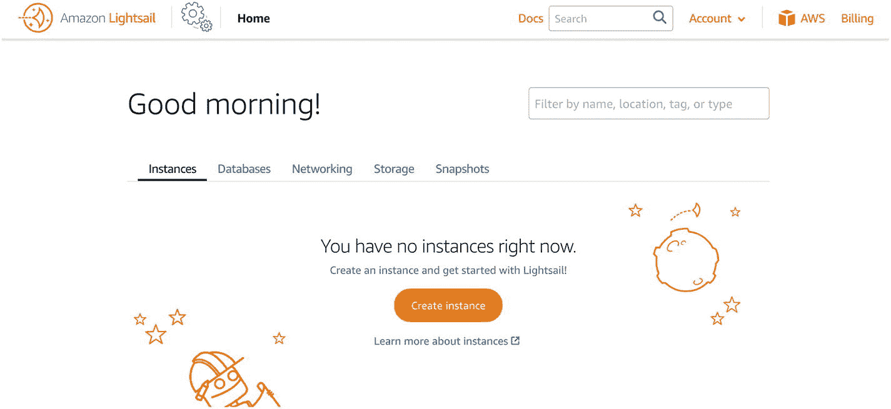
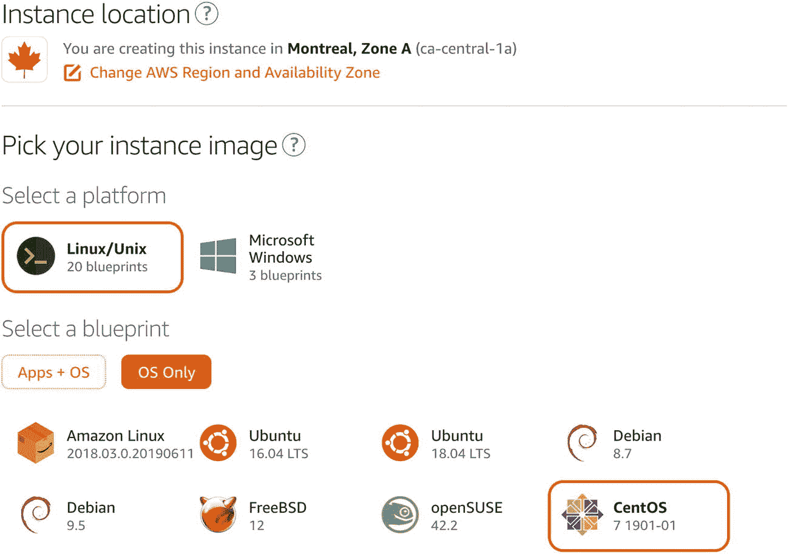
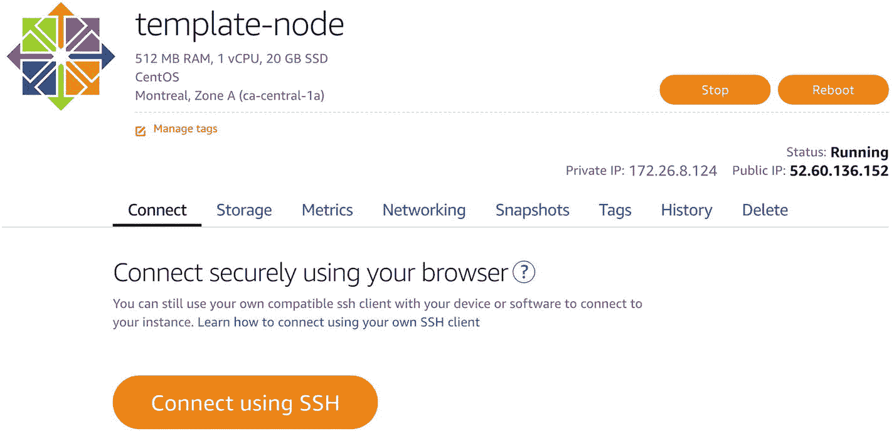
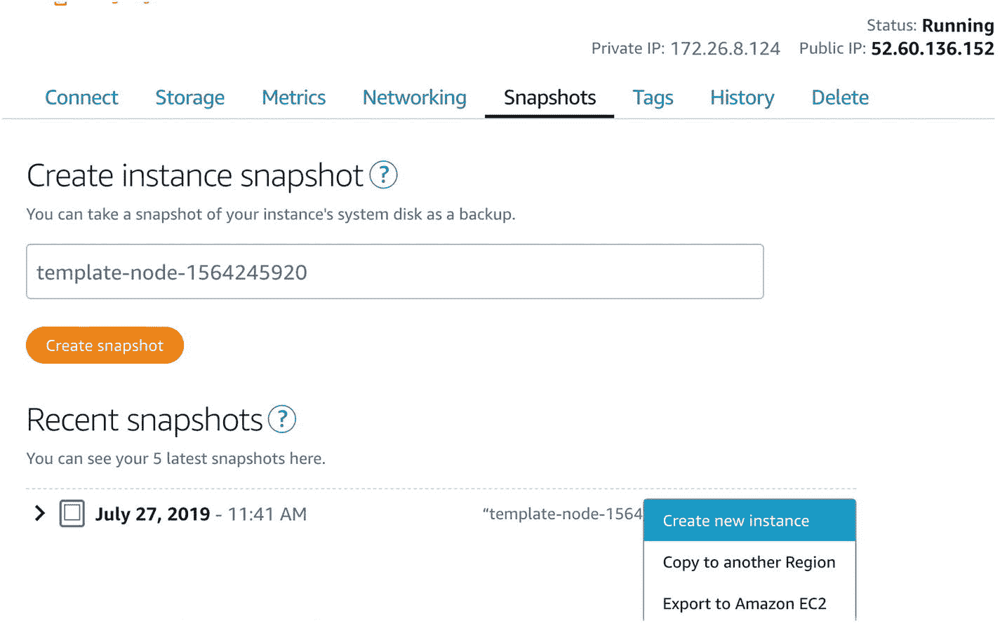
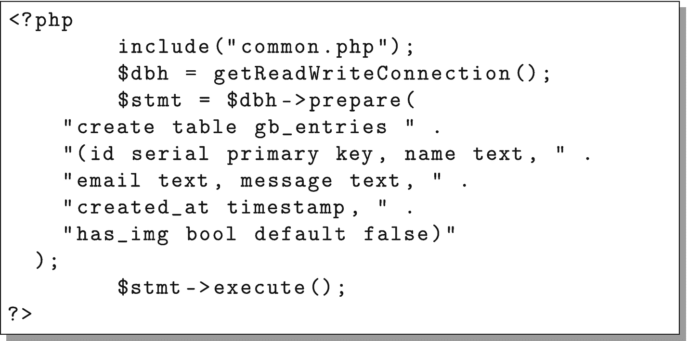
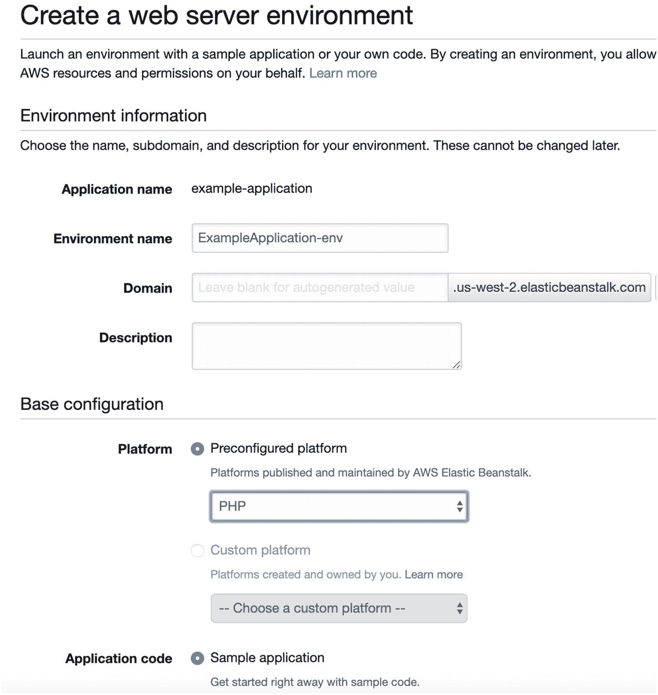

# 10.使用 AWS 托管

虽然这本书的大部分内容都集中在在 Linode 上托管你的应用，但是由于这么多的云托管都是基于 AWS 的，所以我认为值得看看 AWS 上的一些托管选项。

AWS 的一个问题就是它的大量选项。可用选项的数量实际上使管理变得相当困难。

举个例子，有一次我在一个团队中工作，需要访问日志。经过大量搜索，我们终于找到了允许访问日志文件的选项。然而，事实证明*查看*日志文件实际上是*不同于*检索*日志文件所需的*权限。因此，虽然我有权限查看日志文件，但我没有权限实际获取它们。他们最终放弃了细粒度的控制，让我做了管理员。这并不是说 AWS 没有这种能力，只是试图管理它所花费的时间和精力与您通过其他不太“自动化”的方式所节省的时间和精力一样多。拥有大量的选择，并试图成为每个人的一切，很容易让你淹没在没有人有时间和机会掌握的选项和设置中。

有这么多细粒度的控制，每一个都有自己的问题、怪癖和缺陷。AWS“支持”的不同平台和系统的数量非常大。然而，我发现在这种支持中经常有很大的漏洞，虽然可以解决，但这些解决方法有时让我希望我一开始就手工完成了。

## 10.1 使用亚马逊 Lightsail

亚马逊首次涉足云托管被称为 EC2——弹性计算云。像大多数 AWS 一样，这是一个非常灵活的云托管选项。然而，它存在许多 AWS 固有的问题——成功地设置和使用它确实很复杂。不仅设置复杂，而且*定价*复杂得离谱。他们不仅对计算机时间收费，而且对硬件 I/O 请求也收费。没错，他们跟踪*并向你开出*硬盘访问次数的账单。

为了更好地与 Linode 和 DigitalOcean 等更易用的服务竞争，AWS 推出了亚马逊 Lightsail。Lightsail 的功能集和定价结构与我们在 Linode 上看到的非常相似。可以从包含 CloudFront 和 S3 的同一个 AWS 管理控制台访问 Lightsail。只需搜索 Lightsail，仪表盘看起来应该类似于图 [10-1](#Fig1) 。

出于我们的目的，需要注意 Lightsail 和 Linode 之间的一些细微差异:

1.  默认情况下，Lightsail 实例通过公钥而不是密码连接，并将您连接到普通用户，而不是以 root 用户身份连接。

2.  Lightsail 的 CentOS 发行版的预装软件包与 Linode 略有不同。

    

    图 10-1

    亚马逊 Lightsail 的初始仪表板

3.  所有 Lightsail 实例都会自动添加到 Amazon 的私有网络中。其实你在盒子上，看到的*唯一的* IP 地址就是私网地址。您收到的外部 IP 地址会被路由到内部 IP 地址。

4.  Lightsail 实例的备份必须手动进行。

5.  Lightsail 有一个单独的数据库服务，如果您不想自己管理数据库服务器，可以使用它。

要启动并设置新实例，请单击“创建实例”按钮。这将把你带到一个类似于图 [10-2](#Fig2) 的屏幕。

在这里，您需要选择将托管您的节点的数据中心(实例位置)。这与 Linode 略有不同，因为 AWS 同时拥有数据中心和*可用区域*。在 AWS 中，数据中心被组织成多个可用性区域。这些区域可以轻松共享资源以实现负载平衡，但是每个可用性区域都有单独的电源线和外部互联网连接。本质上，它们就像在同一个数据中心一样，但是不同可用性区域中的服务器不太可能受到同一事件的影响(例如断电或互联网)。例如，您可以将主数据库放在一个可用性区域中，而将副本数据库放在另一个可用性区域中。然后，如果主服务器的可用性区域关闭，副本服务器(因为它位于不同的可用性区域)可以升级并充当主服务器。



图 10-2

创建 Lightsail 实例

我们想要选择的平台是“Linux/Unix”然后，选择“仅操作系统”(其他选项允许针对特定任务预配置服务器)。之后，选择“CentOS”

向下滚动，您可以忽略大多数其他问题，并选择您希望的节点大小。然后，为了识别您的实例，像我们之前做的那样称它为`template-node`。单击“创建实例”创建机器。

AWS 可能需要一段时间来创建您的计算机。当它出现时，你可以点击机器，你将得到一个类似于图 [10-3](#Fig3) 的仪表板。要登录，只需点击标有“使用 SSH 连接”的按钮这将打开一个终端窗口，您作为用户`centos`连接到该节点。

您可以使用这个`centos`用户来代替本书示例中的`fred`用户。或者，你可以在需要时创建`fred`。然而，您仍然需要使用这个盒子作为`root`来配置它。要以`root`的身份登录，只需发出以下命令:

```php
sudo su -

```



图 10-3

Lightsail 节点仪表板

现在您的会话将作为`root`用户。

Lightsail 节点附带的软件包与 Linode 节点略有不同。要让您的 Lightsail 节点类似于 Linode 系统的起始点，请发出以下命令:

```php
yum install -y nano
yum install -y firewalld
systemctl start firewalld
systemctl enable firewalld

```

从这一点来说，你可以按照第 [3](03.html) 章和第 [4](04.html) 章的节点设置说明进行操作。

在第 [5](05.html) 章中，从备份创建新实例的机制只是略有不同。在 Lightsail 中，使用“快照”功能创建备份。您只需转到节点的“Snapshots”选项卡，为快照命名，然后创建它。创建完成后，您可以从该快照创建一个新节点，如图 [10-4](#Fig4) 所示。负载平衡器可以从主屏幕的“网络”标签下的 Lightsail 中创建。



图 10-4

从快照创建节点

之后，关于创建云的其余信息不会改变，因为这都是关于节点本身发生了什么。

## 10.2 托管在弹性豆茎上

虽然本书的大部分内容都集中在基础设施即服务(IaaS)云上，但我确实想花至少一些时间来介绍平台即服务(PaaS)云。AWS 有一个名为“Elastic Beanstalk”的 PaaS 云，它运行各种不同的应用类型，PHP 就是其中之一。

PaaS 云消除了云计算的所有系统管理工作。然而，问题是大多数先进的云系统最终都需要一些系统管理。当您有奇怪的配置需求时，PaaS 系统并不是不可用，而是正确、可维护地配置您的 PaaS 系统，并与您的平台提供商同步的工作量最终会比您像使用 IaaS 云一样完全控制要多。在任何情况下，在这一节中，我们将回顾使用 Elastic Beanstalk 启动和运行我们的应用需要做些什么。

在 PaaS 系统中，我们无法控制机器。因此，我们不能将特定的机器指定为数据库服务器、作业服务器等等。相反，每个应用可以根据 PaaS 系统的需要在任意多的机器上扩展或缩小。这通常意味着 PaaS 系统将管理数据库。

对于 AWS 来说，这意味着使用他们的关系数据库服务—RDS。将应用连接到 RDS 非常简单。Elastic Beanstalk 将为所有连接信息设置环境变量，我们只需编写应用来读取它们。

为了做到这一点，我们只需改变`common.php`并替换`getReadOnlyConnection()`和`getReadWriteConnection()`功能。这两个功能应该如图 [10-5](#Fig5) 所示。


图 10-5

使用 RDS 访问数据库

这将根据 RDS 发送的环境变量组合成一个连接字符串。

第二，由于您不能直接访问数据库，我们需要一个 PHP 脚本来为我们创建数据库表。创建一个名为`createdb.php`的文件，其中包含以下代码。



图 10-6

使用 RDS 创建数据库

请注意，由于我们没有特定的服务器，这些更改是对我们个人计算机硬盘上的应用的本地副本进行的。一旦完成这些更改，您就可以开始了。

要从 Elastic Beanstalk (EB)开始，请返回 AWS 管理控制台并搜索“Elastic Beanstalk”在仪表板上，单击标题为“创建新应用”的按钮给它起个名字，然后点击“创建”

在 EB 上，应用可以划分为“环境”环境可以用于各种各样的事情，包括准备环境和生产环境，为不同的任务准备不同的服务器组，以及在应用的不同版本之间快速切换。出于我们的目的，我们将只有一个环境。因此，单击按钮创建一个新环境。它会问你创建什么类型的环境。我们想要一个“网络服务器环境”

下一个屏幕是配置屏幕，如图 [10-7](#Fig7) 所示。如果愿意，您可以命名您的环境，但是该屏幕上唯一重要的设置是选择一个“预配置的平台”显然，我们想要“PHP”默认情况下，它将加载一个示例应用。这就是我们现在想要的。单击“创建环境”完成该过程。



图 10-7

创造新环境

创建完成后，您将拥有一个类似图 [10-8](#Fig8) 的仪表板。在“概述”部分，它给出了应用、版本和平台的基本健康状况。在“最近事件”下，它列出了系统最近经历的所有操作。请注意*在 EB 中的一切*最终花费的时间比你想象的要长得多，但是“最近的事件”帮助你密切关注它，并在你等待的时候给你一些可看的东西。在左侧，我们将重点关注的三个区域是“仪表板”(我们现在所处的位置)、“配置”(应用的设置方式)和“日志”


图 10-8

EB 环境仪表板

因为我们从一个示例应用开始，所以您已经可以在您的 web 浏览器中加载这个示例应用了。在仪表板上，它有一个指向应用 URL 的链接。您可以单击它，它会将您带到示例应用。

在上传我们的应用之前，我们需要首先设置数据库。为此，请转到“配置”部分，然后转到“数据库”并单击“修改”这将允许您为您的应用创建一个 RDS 实例。将“引擎”设置为`postgres`，给它一个用户名和密码(一定要记下这些！)，然后单击“应用”当健康状态显示为复选标记时(可能需要 10-20 分钟)，您就可以上传您的应用了。

要上传您的应用，请将您的所有文件压缩到一个单独的 zip 存档文件中。然后，在仪表板上，单击“上传和部署”按钮从您的硬盘驱动器中选择 zip 文件，为该版本命名(具体名称并不重要)，然后单击“部署”健康状态将变为刷新微调器，它将部署您的应用。当微调器变回复选标记时，您的应用就部署好了！

然而，我们还没有完全完成。当你点击链接，它会给你一个“禁止”的信息。这是因为我们没有一个`index.php`文件(尽管如果您愿意，您可以添加一个)。然而，我们需要创建我们的数据库，所以我们需要首先导航到`createdb.php`文件来创建数据库(只需在浏览器的 URL 末尾添加`/createdb.php`并点击 enter)。这会给你带来一个空白页，这很好。

现在，如果您更改 URL 以转到`list.php`，一切都应该正常工作了！

现在，您可以对您的应用做许多事情来使其可伸缩。这些都可以从您环境的“配置”选项卡中获得。默认情况下，EB 创建单服务器环境。要将其升级到负载平衡的应用，只需进入“Capacity”部分，将“Environment Type”更改为“Load Balanced”这会给你很多选择，你可以玩。最简单(也是最重要)的是“最小”和“最大”数量的实例。将最小值设置为`2`,以确保它为您启动至少两台机器。单击“应用”，等待几分钟，您的应用现在负载平衡。

您可以进行的其他更改包括

*   在“实例”下，您可以更改每个单独实例的大小。

*   在“负载平衡器”下，您可以更改许多变量，包括平衡机制。

*   在“滚动更新和部署”下，您可以更改部署策略以消除更新期间的停机时间(“不可变”选项最适合生产，但是执行更新需要很长时间)。

*   在“软件”下，您可以设置环境变量和 web 服务器配置选项。

*   在“数据库”下，您可以更改数据库的大小。您还可以单击“Endpoint”链接，转到 RDS 管理控制台，使用其他数据库管理实用程序。

进行配置更改后，点击“应用”将使用给定的更改重新部署您的应用，这可能需要几分钟时间。如果您在运行应用时遇到任何问题，您可以转到“日志”部分，下载并查看最新的日志消息。