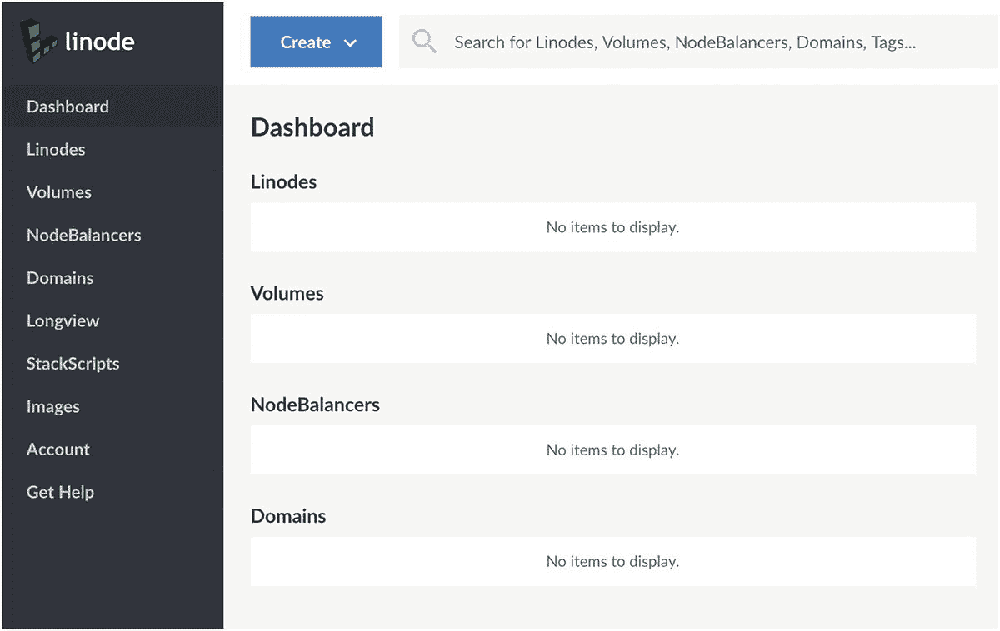
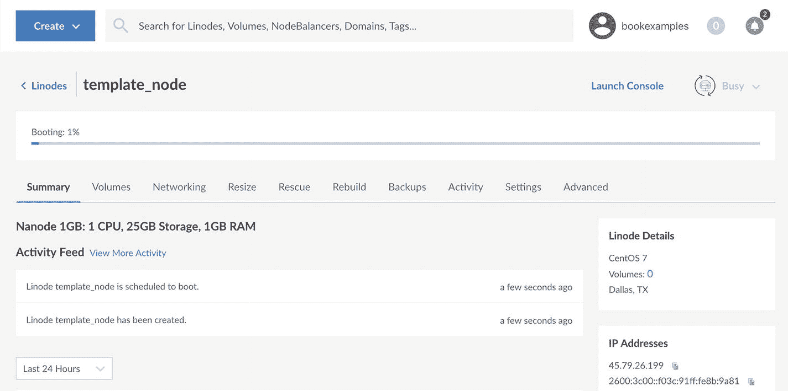
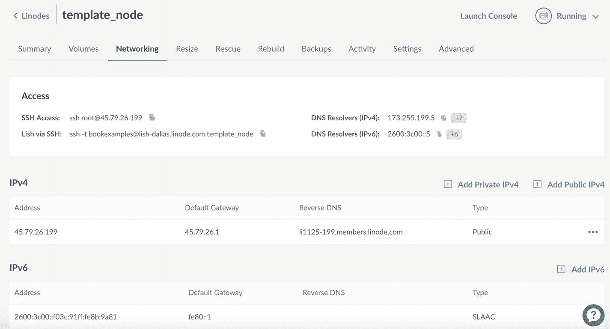
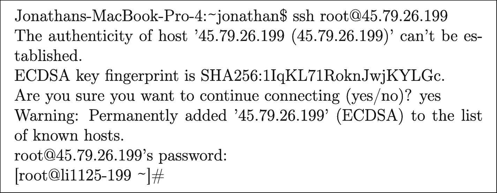
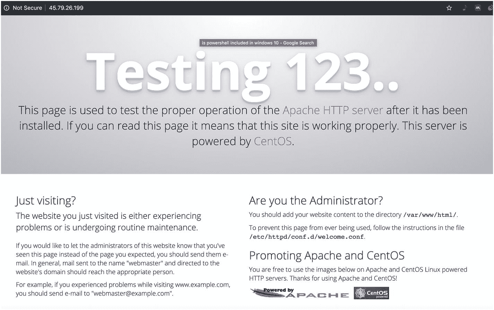
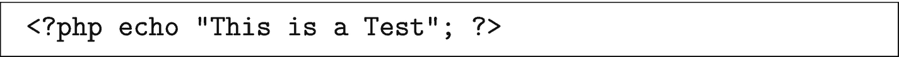
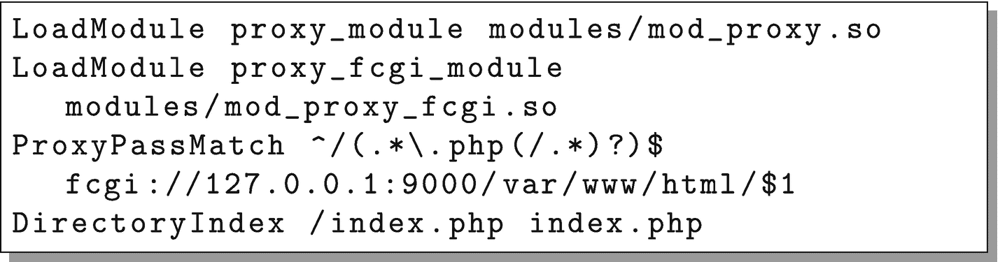
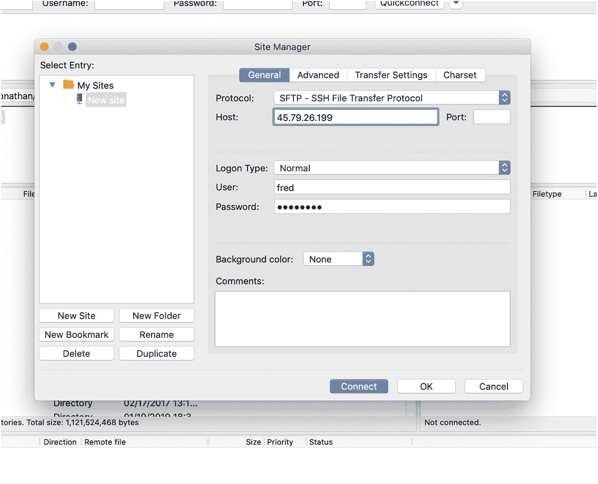
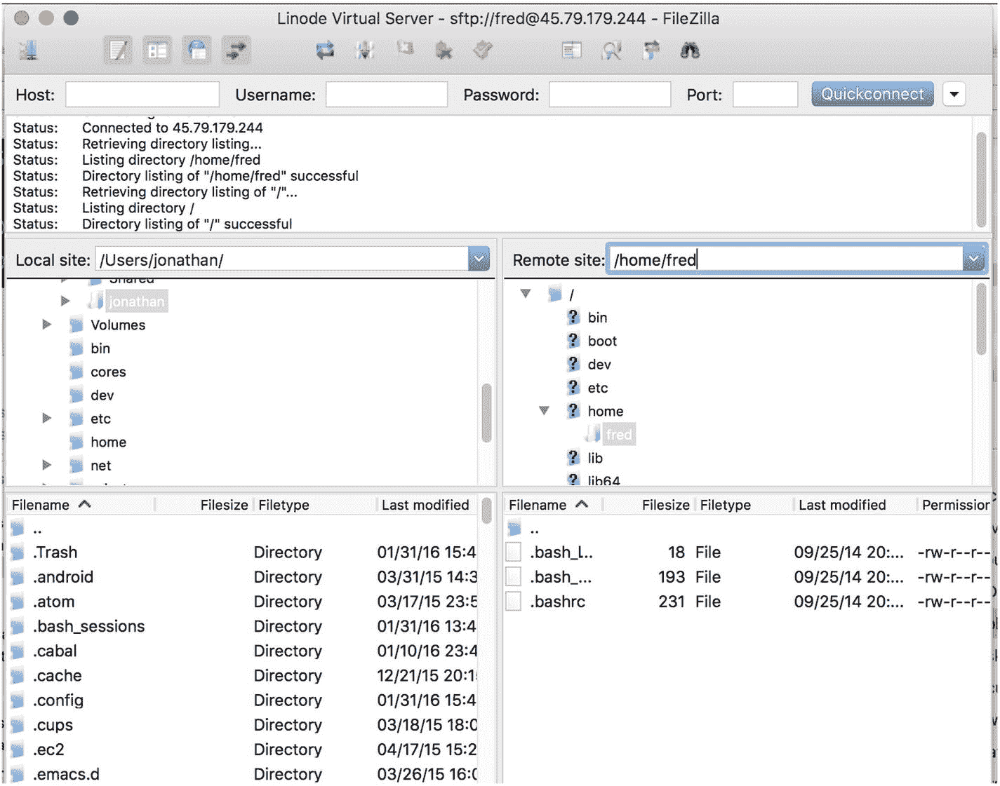

# 3. 设置云服务器

与大多数云提供商一样，在 Linode 上设置云服务器非常简单。本章将通过截图向您展示启动并运行的基本流程。

## 3.1 创建你的虚拟服务器

希望你作为一名 Web 开发人员或管理者，能够轻松注册 Linode 服务。它需要预先提供信用卡信息，但你会发现在本书中运行所有内容的成本可能比书本身还低，前提是你在使用完毕后关闭服务。

在继续之前，现在就去创建你的 Linode 账户吧。

注册并登录后，Linode 会带你到你的控制面板，它看起来应该像图 3-1 所示。



*图 3-1: Linode 控制面板*

你目前还没有设置任何东西，所以你的控制面板几乎是空的。要开始操作，请点击“创建”按钮。Linode 将它们的虚拟服务器称为“节点”或 “Linodes”，因此选择“Linode”来创建一台新机器。

然后，Linode 会询问你几个问题，以帮助你配置节点供使用。虽然有很多好的选择，但为了能够跟随本书操作，请使用此处给出的选项：

1. 在“选择发行版”下，选择“CentOS 7”。
2. 在“区域”下，选择哪个区域无关紧要，但为了让你的服务器能够相互通信，每次都必须选择同一个区域。本书将使用“达拉斯，德克萨斯州”设施。
3. 在“Linode 方案”下，最便宜且足以满足我们需求的方案是“Nanode 1GB”方案。在撰写本文时，此方案每小时运行成本不到 1 美分。
4. 在“Linode 标签”下，我们将这台机器命名为 `template_node`。
5. 你可以忽略“添加标签”部分。当你有很多机器时，标签有助于对机器进行分组。
6. 在“Root 密码”下，为此机器添加一个密码。请确保密码安全，因为有很多黑客会四处尝试各种 Root 账户的密码。每个月遭遇 50,000 次此类黑客攻击尝试并不罕见。
7. 暂时，你可以保留“可选附加组件”不做改动。我们将在本书后面处理备份和私有 IP 地址。

设置完所有这些后，点击“创建”按钮，Linode 将开始构建你的机器。Linode 会带你进入该机器的控制面板，其中会有一个进度条和一个“活动日志”（见图 3-2）。当进度条完成时，你就成为了云端一台新服务器的自豪拥有者！



*图 3-2: 你的新节点的控制面板*


### 选择服务器

Linode 根据（a）服务器将处理的工作负载类型和（b）服务器配备的内存大小对其服务器进行分类。工作负载类型包括：“Nanode”（超小型且超便宜的实例）、“标准型”（CPU/内存均衡）、“专用 CPU” 和 “高内存”（还有 “GPU”，但那类实例属于完全不同的云计算类型，不在此书讨论范围内）。

在每种工作负载下，服务器根据其配备的内存大小命名。一台“Linode 4GB”服务器，你猜对了，配备 4 GB 内存。它还会指定配备多少个虚拟 CPU 以及多少磁盘空间。通常，内存的增加速度比核心数更快，这是合理的，因为内存往往比 CPU 性能更成为更强的限制因素。它们各自的磁盘空间大小也不同，但我认为磁盘空间是次要考虑因素，因为第 8 章将介绍如何设置一个拥有无限可用磁盘空间的服务。

在选择生产服务器时，出于后续将更明确的原因，我通常为数据库选择相当大的规格（因为它们更难复制），而为 Web 服务器选择低端到中端规格（因为我可以通过增加更多服务器来轻松扩展容量）。

## 3.2 登录并查看

那么，你已经有了一台机器，但它在哪里，你如何访问它呢？

点击仪表盘上的“网络”选项卡。它看起来应该像图 3-3。在“访问”下方有一个名为“SSH 访问”的区域。这里包含了你需要输入到命令行中以进行登录的命令。使用你为节点创建的密码进行登录。



图 3-3

网络选项卡

### 命令行？那是什么？

命令行是访问计算机的老式方法。早在漂亮的图形界面出现之前，人们就通过输入命令来与计算机交互。对于许多事情，*尤其是*与系统管理相关的任务，命令行仍然是管理系统的最佳方式。

如果你没有任何使用命令行的经验，别担心！本书并不假定你在这方面有专业知识，并会逐步引导你完成每个步骤。如果你只是想弄清楚如何*进入*命令行，以下是每种主要操作系统的操作方法：

* **Windows 10**：Windows 实际上拥有*两种*命令行系统：较旧的“命令提示符”（`cmd.exe`）和较新的 PowerShell。只需点击 Windows 图标并输入 `PowerShell` 即可开始。至少需要 2018 年 4 月更新才能无需额外设置即可运行这里的命令。

* **MacOS X**：每台 Mac 都带有一个名为“终端”的应用程序。你可以通过 Spotlight 搜索找到它，或者前往“应用程序”，然后进入“实用工具”中找到它。我建议你将它添加到 Dock 栏，因为你可能会经常使用它。

* **Linux**：每个 Linux 发行版都安装有一个命令行程序，通常名为“终端”或“Bash 提示符”之类的。

当你第一次启动命令行时，它会显示一些文本，随后是一个闪烁的光标。现在你就可以开始输入命令了！

如果你不熟悉 Linux，`ssh` 是一个非常方便的工具，它允许远程、安全地连接到你的服务器命令行。也就是说，你可以 `ssh` 进入你的机器，其工作方式就像你登录到控制台一样。此外，连接是加密的，所以你无需担心有人窃听你或窃取你的密码。`ssh` 在每个主流操作系统上都是默认安装的，所以你应该已经安装了它。如果你使用的是旧版 Windows，你可能需要下载一个单独的 `ssh` 应用程序，例如 `PuTTY`，可以从 [`www.putty.org`](http://www.putty.org) 免费下载.

要登录你的机器，只需打开一个命令行，并输入“SSH 访问”下列出的命令。它应该类似于 `ssh root@MY.IP.ADDRESS.HERE`，其中 `MY.IP.ADDRESS.HERE` 是你的 Linode 的 IP 地址。由于 `ssh` 之前没有见过这台计算机，它很可能会警告你无法确认主机的真实性，并询问你是否要继续连接。只需回答 `yes`。它只会在第一次询问你，因为 `ssh` 会记住远程计算机。然后，在输入密码时，输入你在设置机器时设置的密码。图 3-4 显示了这大概会是什么样子。



图 3-4

从命令行登录

现在你已经成功登录到你的机器了！

最后一行被称为“命令提示符”。它提供了关于你当前会话状态的基本信息。`root` 是你的用户名。这是 Linux 上管理用户的名称。`li1125-199`（或者 `@` 符号后面的任何内容）是你的机器名称。最后，`~` 告诉你当前所在的目录（对于新程序员，“目录”是“文件夹”的旧称）。`~` 表示用户的“家”目录。

如果你不熟悉 Linux，有几个命令是值得了解的。


*   `pwd`：代表“print working directory”（打印工作目录）。此命令会显示你当前所在的工作目录。如果你在首次登录时执行此命令，它应该会显示`/root`。Linux 目录不以盘符开头，而是以斜杠（`/`）作为顶层目录。`/root` 是 root 用户的主目录。
*   `mkdir`：代表“make directory”（创建目录）。此命令会在当前目录下创建一个新目录。
*   `cd`：代表“change directory”（切换目录）。如果后面跟一个目录名称，它会切换到该目录。如果直接输入命令而不带任何参数，它会带你回到你的主目录。命令`cd /`会将你带到根目录（请注意，根目录指的是顶层目录，而非 root 用户的目录）。如果目录名称以斜杠开头，`cd`命令会将其视为从根目录开始的绝对路径。如果目录名称以波浪号（`~`）开头，`cd`命令会将其解释为相对于你的主目录的路径。否则，它会将该路径解释为相对于当前目录。
*   `ls`：代表“list”（列表），它会列出当前目录中的文件列表。要查看文件权限，请在命令后添加选项`-l`。要同时查看隐藏文件，请添加选项`-a`。因此，要*同时*查看隐藏文件和文件权限，请输入`ls -l -a`。
*   `nano`：Nano 是你易用的文本编辑器。如果你的工作职责包含运行机器，你还应该学习`vim`，因为它对你来说效率更高，但学习难度也更大。Nano 易于使用，足以满足入门需求。如果你想在当前目录下创建一个名为`test.txt`的文件，请输入`nano test.txt`并开始输入。组合键 `control-o` 可以保存（即输出）你的文件，`control-x` 可以退出。
*   `systemctl`：此命令负责在包括 CentOS 在内的某些 Linux 发行版上启动和停止系统服务。你将在本章稍后部分了解如何使用它。
*   `logout`：此命令退出当前用户会话。你也可以通过输入`exit`或按 `control-d` 来实现。

我鼓励你花些时间动手练习`mkdir`、`cd`、`ls`和`nano`这些命令。尝试创建一个新目录，进入该目录，并在其中创建一个新文件。然后，尝试注销，用`ssh`重新登录，找到你的文件并查看它。重复这个操作几次，直到你完全熟悉登录、注销、导航目录和编辑文件的过程。

当你熟练在主目录下创建文件和目录后，应该扩展范围，去查看其他目录。你还不要在那里编辑文件（主目录之外的文件可能对操作系统有重要意义），但四处看看是无害的。

要开始查看，请转到根目录（`cd /`）并查看（`ls`）。你会看到许多目录，其中大部分在 Linux 文件系统层次结构标准（参见 `www.pathname.com/fhs`）中都有说明。尽管文件系统层次结构标准是了解各目录用途的好资料，但它已不再被严格遵守，因此遇到一些偏差时不必惊讶。不过，简而言之，`/etc` 包含服务器配置信息，`/home` 包含除 root 之外的用户的主目录，`/usr` 包含已安装的程序，`/opt` 包含定制程序和其他服务器特定项目，`/var` 包含经常变化的信息（例如日志文件、缓存、队列等）。

## 3.3 更新你的系统

在系统启动并运行后，你应该做的第一件事就是用最新的升级包和安全包更新服务器。CentOS 使用 `yum` 来管理系统软件安装。`yum` 能够简单安全地处理软件包的下载、安装、升级、移除和验证。当你要求 `yum` 安装或更新一个软件包时，它能聪明地在远程服务器上找到该软件包，验证其真实性，查找并安装该软件包所依赖的任何其他软件，并跟踪所有已安装的软件包及其文件。`yum` 只能由 root 用户运行，但到目前为止，这是我们唯一可用的用户。

当你拥有新服务器时，应该做的第一件事是将其所有已安装的软件包更新到最新版本。幸运的是，使用 `yum` 这非常简单。只需运行以下命令：

```
yum -y update
```

这通常会下载*非常大量*的软件包——这完全没问题。CentOS 持续修复发行版中每个软件的错误和安全问题，因此这些更新可能会变得很大。然而，CentOS 也非常小心地确保其包含的修订版不包含任何不兼容的升级。因此，运行 `yum update` 可以使你保持最新状态，并且你不太可能因为运行它而意外破坏任何东西。


## 3.4 运行 Web 服务器

默认情况下，Linode 附带的 Linux 发行版只安装绝对必要的组件。这其实很棒，因为维护安全的主要方法之一就是只安装你确实需要的东西，从而最大限度地减少你暴露在外的潜在漏洞数量。然而，默认情况下 Web 服务器并未安装。

如果你在浏览器中输入 Web 服务器的 IP 地址，浏览器会回应无法连接到该计算机。这是因为 Web 服务器尚未运行。要安装 Web 服务器，我们将使用 CentOS 的 `yum` 包管理器。本书介绍的是 Apache Web 服务器，它在系统中被称为 `httpd`，当然也有其他可选项。

要安装 `httpd`，请运行：

```
yum -y install httpd
```

运行 `yum` 时，你位于哪个目录并不重要。无论你从哪里运行它，它都会将包安装到正确的目录。`yum` 会列出你想要安装的包，以及运行它所需的其他包。

现在你的 Web 服务器已安装，但它并未*运行*。要运行 Web 服务器，只需输入：

```
systemctl start httpd
```

这个命令同样不在意你当前位于哪个目录。

现在你的 Web 服务器正在运行，但你可能仍然无法连接到它。这是因为 CentOS 默认会运行一个防火墙。因此，我们需要在防火墙中打开一些端口，以允许从外部访问 Web 服务器。

为此，请执行以下命令：

```
firewall-cmd --add-service http
firewall-cmd --add-service http –permanent
firewall-cmd --add-service https
firewall-cmd --add-service https --permanent
```

这些命令会将 HTTP 和 HTTPS 都添加到远程用户可以连接的服务列表中。`firewall-cmd` 用于管理你的防火墙。添加一个服务（`--add-service`）允许访问该服务。不带 `--permanent` 标志运行会修改当前的防火墙。添加 `--permanent` 标志则告知防火墙在服务器重启后仍保留该规则。要同时启用当前规则并使其在服务器重启后仍然有效，你需要执行这两条命令。

你可以通过执行以下命令来查看允许的服务列表：

```
firewall-cmd --list-services
```

当这些命令执行完毕后，你只需在浏览器中访问你的服务器 IP 地址，就应该能看到一个如图 3-5 所示的测试页面。



图 3-5

Web 服务器的测试页面

这意味着你的 Web 服务器已按预期启动并运行——恭喜你！

然而，还有一个问题需要考虑。尽管服务器当前正在运行，但如果你重启机器，它启动时并不会自动运行。为了确保该服务也能在启动时运行，请执行以下命令：

```
systemctl enable httpd
```

为了测试，请前往你的节点控制面板，在页面右上角应该显示“运行中”。如果你点击它，会显示一个“重启”按钮。点击该按钮重启你的机器。在服务重启过程中，测试网页可能会在某时刻消失。但是，一旦重启的进度条完成，测试网页应该会再次可用。

重启会导致你登出，因为计算机关机了。不过，你可以立即重新登录，然后你会回到 root 用户的主目录。

## 3.5 搭建你自己的网页

如果网站没有内容，我们看到的测试页面会自动生成。要为网站创建内容，你只需将内容放到正确的位置即可。

进入 `/var` 目录（输入 `cd /var`）并查看一下（输入 `ls`）。你会看到其中一个目录是 `www`。这是 Web 服务器提供数据服务的默认目录（即网页目录）。进入 `www` 目录（输入 `cd www`）并查看一下（输入 `ls`）。`html` 目录就是你放置 HTML 和 PHP 文件的地方。进入该目录（输入 `cd html`）。为了确认你身处正确的位置，输入 `pwd`，它应该会告诉你当前位于 `/var/www/html`。

现在你已经在 `/var/www/html` 目录中，你需要创建供 Web 服务提供的页面。使用 `nano index.html` 命令创建 `index.html` 文件，并在其中输入一些内容（如果你不知道写什么，就输入 `hello there` 或类似的内容）。使用 control-o 保存文件，使用 control-x 退出编辑器。一旦你创建了文件，你就可以访问你的 IP 地址，该文件将作为默认页面显示。


## 3.6 安装 PHP 7

由于这是一本关于 Web *应用*开发的书籍，我们的目标不仅仅是制作网页。我们需要启用服务器端脚本功能。因此，我们需要安装我们正在开发的应用程序框架，以及使其能够在 Apache 下运行的插件。本书聚焦于 PHP 7。遗憾的是，CentOS 7 仅提供 PHP 5。因此，我们需要从另一个仓库加载 PHP 7。

两个常用的软件包仓库是 EPEL（企业版 Linux 的附加软件包）仓库和 Remi Collet 的仓库。为 `yum` 加载新仓库以便其查找是非常容易的。每个仓库都有一个 `yum` 可以加载的 URL，这样 `yum` 就可以在将来的安装命令中使用它。要启用这些仓库，只需输入以下命令（缩进行应与上一行放在同一行）：

```
yum install -y
https://dl.fedoraproject.org/pub/epel/epel-release-latest-7.noarch.rpm
yum install -y
https://rpms.remirepo.net/enterprise/remi-release-7.rpm
```

现在我们可以安装 PHP 7 了。为此，只需输入：

```
yum install -y php74
```

这将安装基础的 PHP 7 软件包及其依赖项，但不会安装其他额外内容。安装完成后，在 `/var/www/html` 目录下，运行命令 `nano test.php` 并输入以下脚本：



完成后，使用 `control-o` 保存文件，并使用 `control-x` 退出。现在，您可以直接使用命令行运行该文件。输入命令：

```
php74 test.php
```

它将运行您文件中的代码，并输出字符串 `This is a test`，与代码所示一致。

现在，打开您的网页浏览器，访问 `http://MY.IP.ADDRESS.HERE/test.php`。请注意，它并*没有*将其作为 PHP 脚本来运行。这是因为 Apache 和 PHP 尚未连接在一起。

我们现在需要将 PHP *连接* 到 Apache。这可以通过 FastCGI 进程管理器实现（FastCGI 是允许 PHP 和 Apache 进行通信的协议）。您可以使用以下命令安装它：

```
yum install -y php74-php-fpm
```

这是一个独立的进程，因此也需要启用并启动它。

```
systemctl enable php74-php-fpm
systemctl start php74-php-fpm
```

现在，我们必须配置 Apache，将 `.php` 文件连接到 PHP 7 解释器。使用 `nano` 创建一个名为 `/etc/httpd/conf.d/php.conf` 的文件，并输入以下文本（缩进行应与上一行放在*同一行*）。



图 3-6  
PHP 配置文件

这段代码告诉 Apache 将所有以 `.php` 结尾的文件的请求转发（称为代理）到我们之前安装的 FastCGI 服务。最后一行告诉 Apache 可以将 `index.php` 视为目录索引，这意味着如果某人省略了文件名，并且存在 `index.php` 文件，它可以提供该文件作为该目录的默认页面。

现在，为了使所有配置生效，请重启 Apache：

```
systemctl restart httpd
```

现在，您应该能够通过浏览器访问该文件，并且它应该通过 PHP 7 进行处理了。太好了！

虽然 PHP 已安装，但您只安装了基础包。要查看所有可安装的扩展，请运行命令 `yum search php74`。这将显示所有可用 PHP 包的列表，每个包都可以使用 `yum install -y` 安装。

## 3.7 关闭 SELinux

SELinux 是 Linux 的一项安全增强功能。虽然理论上 SELinux 可以大大降低服务器上的安全风险，但在实践中，它对于实际使用来说过于笨重。对于构建良好的网站，通常不需要 SELinux；而对于构建拙劣的网站，它的保护又不够。相反，它最终会带来巨大的系统管理难题，而收益甚微。如果您运行 SELinux，最可能的结果是您会花费数天时间试图弄清楚为什么某些功能无法工作，最后却发现 SELinux 无缘无故地阻止了某些基本操作。

要关闭 SELinux，请编辑文件 `/etc/selinux/config`，将写着 `SELINUX=enforcing` 的那一行改为 `SELINUX=permissive`。

重启您的机器。当它重新启动后，登录并执行命令 `getenforce`。它应该显示 `Permissive`。现在您就一切就绪了。

请注意，如果您不禁用 SELinux，本书中构建的应用程序将无法运行，因为 SELinux 会阻止应用程序连接到数据库。

## 3.8 为开发设置用户

到目前为止，我们一直使用 root 用户（即超级用户）。虽然很多操作都需要 root 用户，但出于安全原因，通常您应该尽可能少地使用 root 用户。由于 root 用户有权执行任何操作，因此作为 root 用户很容易破坏安全防护机制，从而损害系统或意外允许未经授权的实体访问您的系统。

因此，我们将创建一个非管理用户来执行大部分任务。该用户将被命名为 `fred`。要创建该用户，请输入以下命令：

```
useradd fred
```

这将把 Fred 设置为系统上的一个用户，为他创建一个主目录，并分配给他一个用户 ID 和组 ID。现在，我们需要为 Fred 设置一个密码，输入以下命令：

```
passwd fred
```

系统将提示您输入密码，并要求您重复输入以确保输入正确。我们希望 Fred 能够在 `/var/www/html` 目录中添加和修改文件，因此我们需要授予他对这些文件的所有权。我们使用 `chown` 命令来执行此操作：

```
chown -R fred /var/www/html
```

这告诉系统将 `/var/www/html` 目录及其下所有文件的所有者更改为 `fred`。现在，我们可以注销，或者打开一个新窗口，以 `fred` 的身份通过 `ssh` 重新登录到机器：

```
ssh fred@MY.IP.ADDRESS.HERE
```

这将使我们进入 Fred 的主目录。现在我们可以像之前一样 `cd` 进入 `/var/www/html` 并修改文件，因为这些文件现在归 Fred 所有。请注意，root 用户因为是超级用户，即使文件归 Fred 所有，也仍然可以修改这些文件。


## 3.9 将文件传输到服务器

如今，大多数人都不喜欢直接在服务器上编程。他们通常更倾向于在自己本机上编写程序，然后再传输到服务器上。为此，你需要一个支持 SFTP 协议的工具。SFTP 本质上就是基于 SSH 的 FTP。

最简单且能跨 Windows、Macintosh 和 Linux 平台使用的 SFTP 解决方案是 FileZilla（`www.filezilla-project.org`）。你可以使用普通版（免费）或专业版（付费）。使用 FileZilla 时，安装完成后，只需打开它，点击“文件”，然后点击“站点管理器”。接着点击“新站点”按钮。

按照图 3-7 所示填写此界面。在“主机”框中，输入你的 Linode 服务器的 IP 地址。在“协议”框中，选择 SFTP。将“登录类型”设置为“正常”，并将用户名设为 `fred`，密码设为你为 Fred 设置的密码。你还可以将站点名称改成容易记住的名字（我管我的叫“Linode 虚拟服务器”）。



**图 3-7** 设置 FileZilla 进行连接

完成后，点击“连接”按钮。

第一次连接时，可能会弹出一个对话框，提示“未知主机密钥”。这很正常——这与当初首次通过 `ssh` 连接时的情况类似。软件只是从未见过这台服务器而已。勾选“始终信任此主机”复选框，然后点击“确定”。连接成功后，界面将类似于图 3-8。



**图 3-8** FileZilla 已连接至你的 Linode 服务器

FileZilla 的操作界面分为两个窗格——左侧窗格是你的本地计算机，右侧窗格是远程计算机。它会显示每个窗格当前所查看的目录。你需要做的，就是将本地目录设置为你想要传输的文件所在位置，并将远程目录设置为你想要存放这些文件的位置（通常是 `/var/www/html`）。设置好这些目录后，下方两个窗格会列出实际的文件，你可以直接通过拖放来相互传输。

作为练习，在你的本地计算机上创建几个简单的 PHP 文件，将它们传输到服务器上，并验证你可以通过 web 浏览器看到这些文件。

### 编辑 `php.ini`


对于某些应用程序，你可能需要修改 `php.ini` 文件。我们安装的 PHP 7 版本将 `php.ini` 文件放在了 `/etc/opt/remi/php74/` 目录下。但是，只有 root 用户才能访问此文件。

如果你需要用 FileZilla 传输它，你需要使用 root 身份并输入 root 密码重新连接。你也可以通过 `ssh` 登录，直接用 `nano` 修改它。无论如何，修改此文件时务必小心。此外，修改文件后，请确保使用以下命令重启 PHP 进程：

```
systemctl restart php74-php-fpm
```

这设置起来看似工作量很大。虽然还有更快的入门方法，但这种方式有几个好处。首先，你现在比大多数人都更了解所有这些组件是如何连接在一起的。其次，你拥有一个运行着 PHP 7 的 Web 服务器，而不是某个十年前的旧版本。最后，你拥有了所需的一切，而没有多余的东西，这有助于你保持 Web 服务器的安全。

### 其他需要安装的工具


就我个人而言，我喜欢让我的节点装满足够的工具。我使用 Linux 的时间比很多读者的年龄都长，因此我对大量的工具都相当熟悉。幸运的是，它们都很容易安装（但必须以 root 身份登录才能安装）。

无论如何，以下是我经常使用的工具的安装命令：

```
yum install -y git
yum install -y screen
yum install -y telnet
yum install -y bind-utils
yum install -y traceroute
yum install -y nmap
yum install -y strace
yum install -y perl
```

本书并非这些命令的入门教程，但它们值得你去探索研究。

