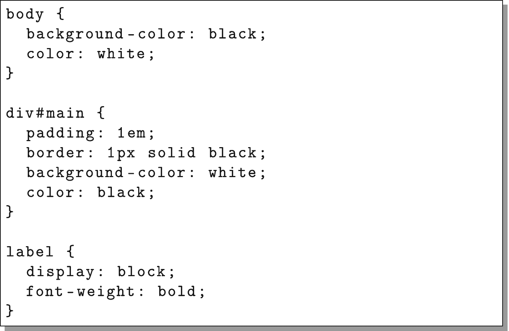
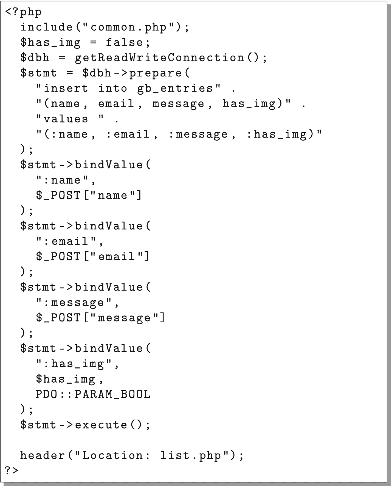
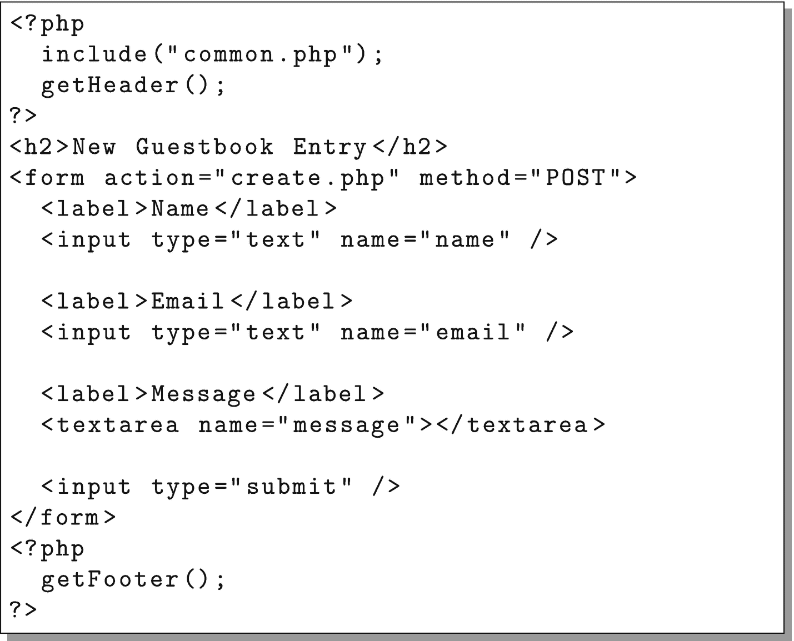
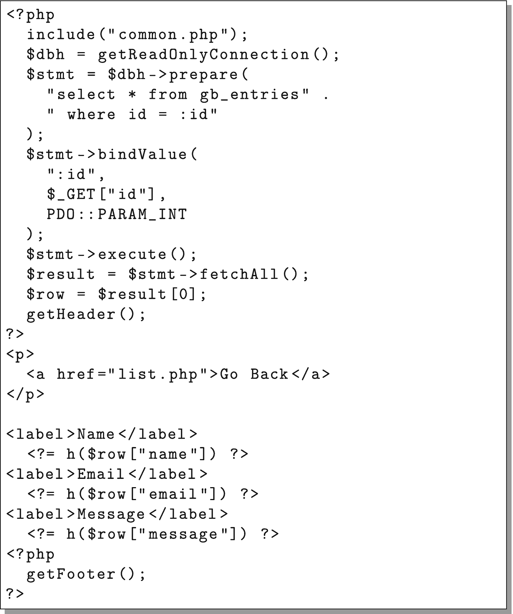
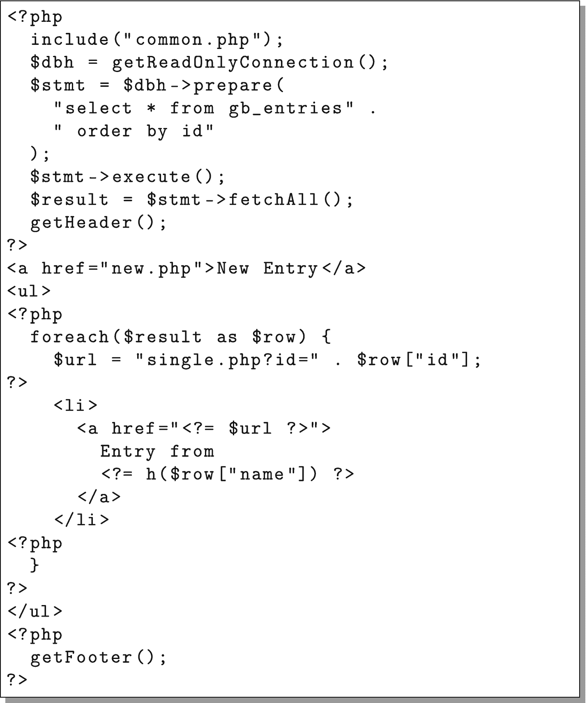
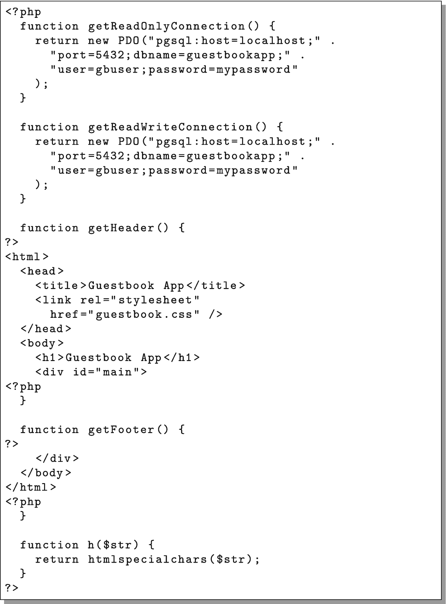

# 创建一个简单的 Web 应用程序

在本章中，我们将创建一个极其简单的 Web 应用程序，用于在后续章节中作为演示示例。目标是让一个完整的端到端应用程序能运行起来。

我们将要开发的应用程序只是一个留言簿，这样任何人都可以进来在留言簿上发布一条消息。


## 4.1 设置数据库服务

任何优秀的 Web 应用程序都有数据库。我一直选择 PostgreSQL（[`www.postgresql.org`](http://www.postgresql.org)）。有传言说 PostgreSQL 很慢。这在 20 世纪 90 年代有一定道理。

然而，从 PostgreSQL 7 开始，PostgreSQL 一直表现出色，并且每个新版本都变得更好。此外，PostgreSQL 在处理复杂查询方面一贯表现优异，至今仍然如此。PostgreSQL 致力于无限制编程。例如，在 PostgreSQL 的文本列中，你可以在单行单列中存储多达 4 GB 的数据——并且仍然可以对其进行排序。在许多数据库上，大部分时间都花在使数据匹配数据库的优选架构上。我发现，使用 PostgreSQL，数据库往往已经准备好适应你自己的数据架构。

虽然这不是一本关于 PostgreSQL 的书，但我们将讨论一些与节点集群相关的特性。

要安装 PostgreSQL，只需以 root 身份执行以下操作（本节所有操作均应以 root 用户身份执行）：

```bash
yum install -y postgresql-server
```

这将安装 PostgreSQL 所需的所有软件包。要设置初始数据库，请输入以下内容：

```bash
postgresql-setup initdb
```

这将创建 PostgreSQL 运行所需的所有目录和文件。接下来，我们需要设置连接到 PostgreSQL 数据库的身份验证方法。PostgreSQL 将其数据和配置都存储在目录`/var/lib/pgsql/data`中。控制数据库访问的文件是`pg_hba.conf`。

编辑该文件（输入`nano /var/lib/pgsql/data/pg_hba.conf`），并在文件顶部添加以下两行：

```
local all all trust
host all all all md5
```

第一行表示信任所有本地连接（即不通过网络）。因此，在命令行上直接处理数据库时，我们不需要密码。第二行表示任何人都可以使用适当的密码通过网络连接到数据库。这有点不安全（我们不希望任何人能够连接到我们的数据库），除非默认情况下数据库只监听本地地址`127.0.0.1`，所以目前你无法从外部连接。请确保保存文件然后退出编辑器。

请注意，即使采用了现有的限制措施（仅本地连接、防火墙等），许多人仍会认为上述配置过于暴露。这里的措施是为了平衡安全性和易学性。有关保护 PostgreSQL 安全的更多信息，你应该阅读[`www.postgresql.org`](http://www.postgresql.org)上关于`pg_hba.conf`文件的文档。

现在是时候启动我们的数据库了。为此，请输入以下内容：

```bash
systemctl enable postgresql
systemctl start postgresql
```

你的数据库系统现在已启动并运行。你已经创建了数据库*系统*，但尚未创建数据库本身。不过，首先我们需要一个数据库用户。`createuser`命令创建一个新的数据库用户：

```bash
createuser -U postgres -d -P gbuser
```

该命令以数据库管理员用户身份运行（`-U postgres`），并创建一个名为`gbuser`的新用户，该用户可以创建数据库（`-d`），并提示你为此新数据库用户设置密码（`-P`）。当提示时，将密码设置为你想要的任何内容，并记下来以便日后使用。在本书中需要用到的地方，我们将使用密码`mypassword`，但请注意，这在实际生产环境中是一个糟糕的密码。由于我们将命令行设置为`trust`，因此在命令行中使用时无需密码，但从应用程序连接时则需要密码。

要以该用户身份创建数据库，请键入：

```bash
createdb -U gbuser guestbookapp
```

这将为指定的数据库用户创建一个新数据库。现在，要创建表，我们需要登录到数据库。`psql`命令将为你提供一个与数据库交互的 SQL 会话。要使用它，只需键入：

```bash
psql -U gbuser guestbookapp
```

命令提示符将变为类似`guestbookapp=>`，表示你已进入数据库。要随时退出，可以键入`\q`。像许多系统管理命令一样，PostgreSQL 并不关心你在运行其命令时位于文件系统中的哪个位置。它正在与一个在其自有目录中运行的数据库服务进行通信。

现在我们已经连接到数据库，将使用以下命令创建一个表：

```sql
create table gb_entries(id serial primary key, name text, email text, message text, created_at timestamp,
has_img bool default false);
```

`id`字段的类型为`serial`，这是 PostgreSQL 的自动编号机制。要查看刚创建的表，请键入`\d gb_entries`。完成后，输入`\q`退出数据库。


## 4.2 PHP 代码

在编写 PHP 代码之前，我们需要安装一些额外的 PHP 库，以便能够连接到数据库。使用以下命令安装它们：

```
yum install -y php74-php-pgsql php74-php-pdo
systemctl restart php74-php-fpm
```

我们的应用程序将很简单：

*   一个文件用于保存配置信息和通用函数
*   一个文件用于显示留言簿条目列表
*   一个文件用于显示单条留言簿条目
*   一个文件用于录入新的留言簿条目
*   一个 CSS 样式表

本书假定你了解一点 PHP 和 SQL 知识，但即使不了解，无论你熟悉哪种语言，代码也应该足够清晰易懂。因此，此处直接给出文件内容，不做过多注释。你可以在本章末尾找到包含代码的图示。

图 4-1 展示了其他文件会包含的通用函数。它有两个用于获取数据库连接的函数——一个用于获取只读连接，另一个用于获取读写连接。目前，它们都返回相同的连接（实际上都是读写连接），但随着我们进一步开发应用程序，我们将看到分离仅用于读取的连接和用于读取与写入的连接可以带来很多好处。这两个函数都简单地使用 `PDO`（PHP 数据对象）通过连接字符串获取数据库连接。请注意，这些连接字符串包含数据库密码。请务必将*这两个*连接字符串中的密码都更改为你之前为 `gbuser` 数据库用户输入的密码。

它还包含 `getHeader()` 和 `getFooter()` 函数，这样我们就不必编写过多的 HTML 代码。此外，`h()` 作为 `htmlspecialchars()` 的简短版本被使用，以便我们可以获得更安全的输出。

图 4-2 是列出数据库中所有条目的 PHP 脚本。这段代码简单地创建了一个数据库语句，执行它，然后遍历结果。

图 4-3 展示了如何从数据库中获取单条条目。同样，这里有一条准备好的 SQL 语句被执行，然后将结果显示在屏幕上。

图 4-4 简单地展示了一个用于创建新留言簿条目的表单。该表单将其数据提交给 图 4-5 中的程序。该程序根据输入的值创建一条新记录。然后，在执行 `SQL` 插入语句后，它将用户重定向回列表页面。

最后，图 4-6 是一个静态 CSS 文件，为整个程序提供少量的样式。如 第 1 章 所述，如果你不想自己手动输入所有这些文件，可以从 GitHub 获取它们，地址如下：

```
https://github.com/johnnyb/cloud-example-application
```

要在服务器上直接使用 git，你需要以 root 用户身份安装它，命令如下：

```
yum install -y git
```

在输入完所有程序后，将它们上传到你新服务器的 `/var/www/html` 文件夹中。然后，在浏览器中导航到 `http://MY.IP.ADDRESS.HERE/list.php`，看看你的程序是否运行成功！如果失败，你可以通过以 root 用户身份登录并查看日志文件来检查 PHP-FPM 的错误日志，使用以下命令：

```
tail -200 /var/opt/remi/php74/log/php-fpm/error.log
```

这将显示 PHP 错误日志的最后 200 行。

另一个可以获取有用信息的日志可以通过执行以下命令查看：

```
tail -200 /var/opt/remi/php74/log/php-fpm/www-error.log
```

修复你遇到的任何错误，然后重试。最可能的错误是程序中有输入错误，或者连接字符串中列出的密码与你为 PostgreSQL 用户设置的密码不匹配。

另一个可以查找错误信息的地方是 Web 服务器的错误日志。你可以使用以下命令查看该日志的末尾部分：

```
tail -200 /etc/httpd/logs/error_log
```

如果需要，可以在附录 C 中找到其他故障排除步骤。如果一切顺利，你应该会看到一个提示你创建新条目的屏幕。点击链接会显示一个需要填写的表单。填写完表单后，点击“提交”按钮会将新的留言簿条目添加到列表中。然后，你可以点击单条条目查看完整信息。如果你的应用程序不是这样运行的，那么可能是某处输入有误。

### 应用程序的局限性

本书的目标是让你快速了解如何扩展应用程序。因此，开发中的其他重要方面，如错误处理、日志记录、数据清理和安全加固等，并未涉及。其目标是传达一个可以快速键入、易于完全理解，并且无需深厚平台知识即可遵循或修改的应用程序。尽管如此，我们还是实现了一些基本的安全实践，例如使用 `bindValue` 来正确转义通过 `$_GET` 和 `$_POST` 发送的值，以及使用 `htmlspecialchars()` 在将数据发送回用户时进行转义。

关于安全编程的良好信息可以在 `www.owasp.org` 网站上找到。



图 4-6  
CSS 文件 (`guestbook.css`)



图 4-5  
创建留言簿条目 (`create.php`)



图 4-4  
新留言簿条目 (`new.php`)



图 4-3  
单条留言簿条目 (`single.php`)



图 4-2  
列出所有留言簿条目 (`list.php`)



图 4-1  
配置和通用函数 (`common.php`)

