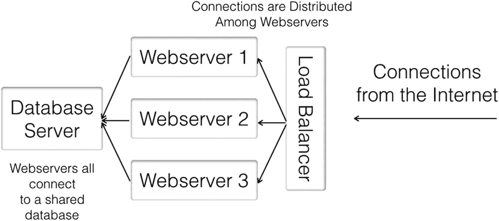
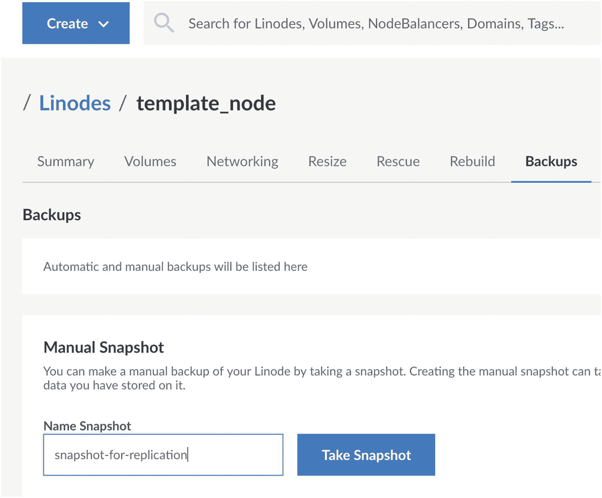
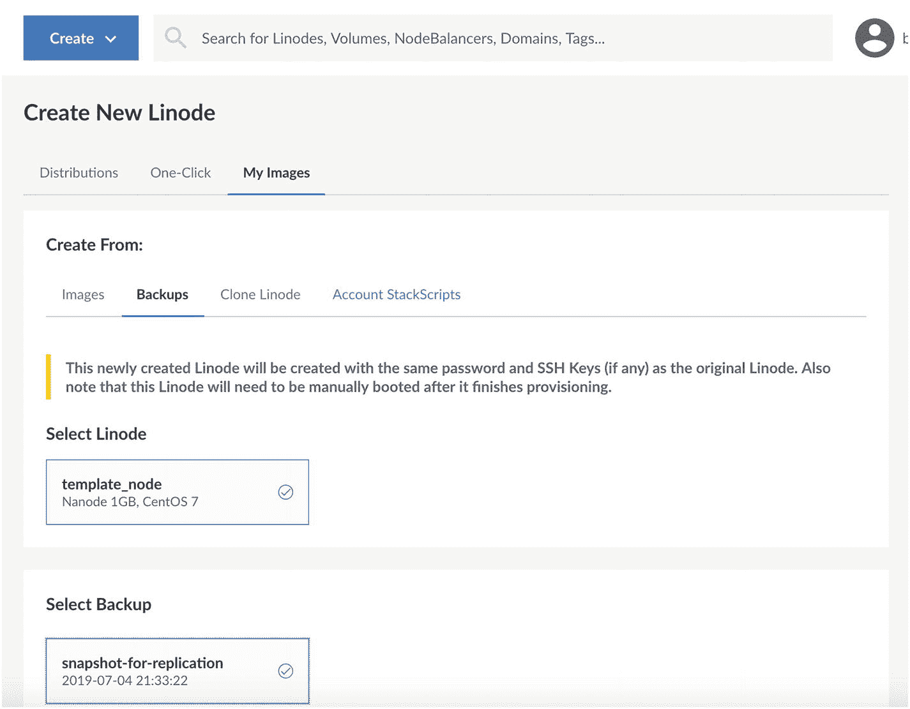
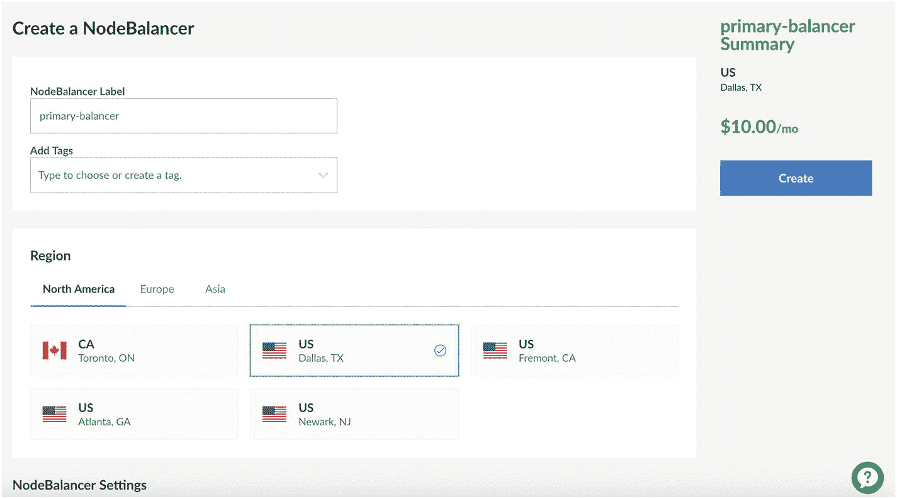
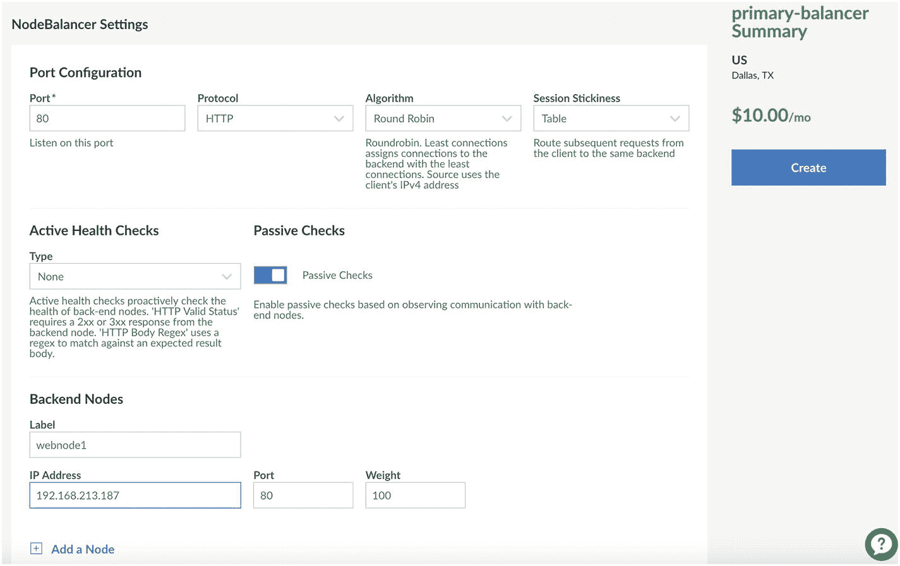
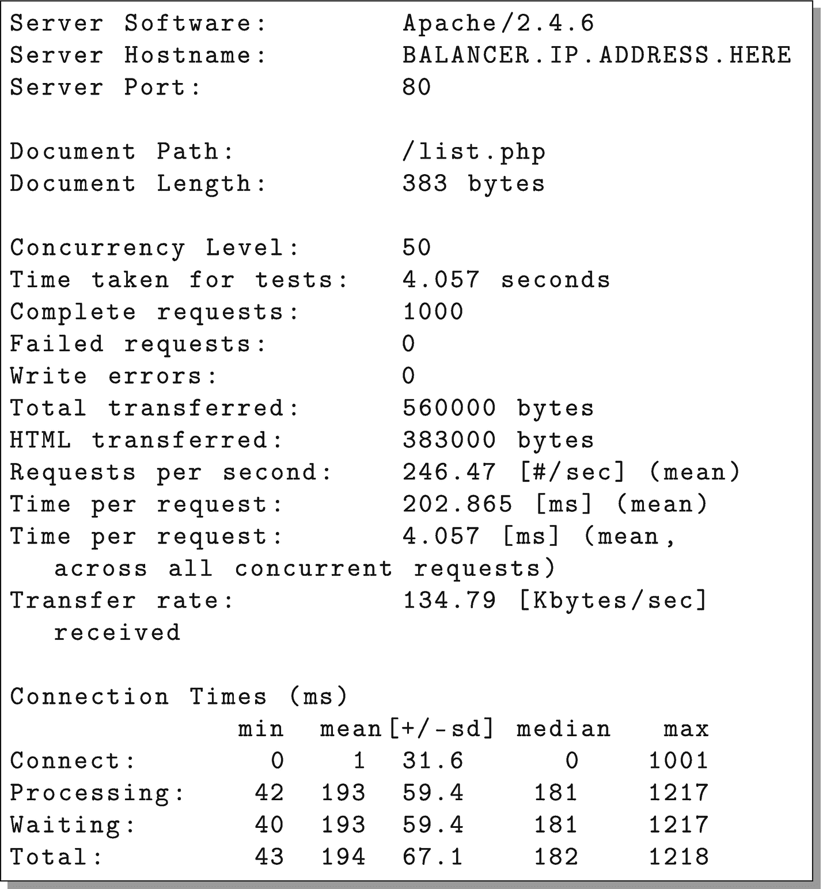
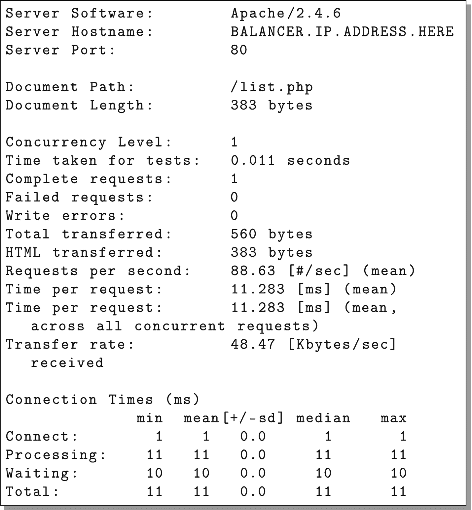

# 5. 设置基本云集群

至此，我们有了一个可以在单台服务器上运行的简单云应用程序。虽然我们可以通过简单的点击操作将其部署到我们自己构建的服务器上，但这并没有充分利用云的优势。云的目标之一是创建应用程序*集群*——一组协同工作以解决问题的服务器，其计算能力可以根据需要扩展或收缩。

## 5.1 一种简单的双层架构

在本章中，我们将探讨一种简单的双层架构。这种架构由以下部分组成：

- 一个数据库服务器

- 一组 Web 服务器

- 一个在 Web 服务器之间管理流量的负载均衡器



图 5-1：简单双层架构示意图

该架构的基本结构如图 5-1 所示。所有连接都汇聚至单个负载均衡器，其职责是将连接转发到若干 Web 服务器中的某一个。负载均衡器不仅负责转发连接，还会监控各个 Web 服务器的健康状态，一旦某台 Web 服务器停止响应，便会停止向其转发连接。随后，每台 Web 服务器共享同一个数据库服务器。

在开发云应用时，程序员不仅需要知道如何搭建集群，还需要懂得如何分析它。观察图 5-1 的示意图，你会看到所有 Web 服务器都依赖于单个数据库服务器。这使得数据库服务器成为集群的*限制因素*。几乎每个集群，无论设计得多好，都存在某些限制因素。目标是尽量减少这些因素对架构的影响。

由于这种应用架构受限于单个数据库节点，因此它最适合中小型部署，其中大部分处理工作是在 Web 服务器上完成，而非数据库上。示例应用因其简单性，在 Web 服务器上进行的处理其实非常少。尽管如此，本章仍将展示如何搭建服务器，以便在这种配置下部署该应用。

## 5.2 复制节点

图 5-1 描述的基本双层应用表明，我们需要若干个服务器节点。我们可以通过启动带有空白 CentOS 系统的新机器，并逐一配置每台机器来实现这一点。然而，既然我们已经花费时间将当前服务器配置成我们想要的工作方式，就应该充分利用这个配置好的成果。

Linode 提供了几种可完成此任务的服务，每种服务各有其优缺点。Linode 能够创建保存的镜像，这些镜像可直接用于创建新节点（你可以选择已保存的镜像，而不是选择操作系统）。Linode 还提供克隆服务，允许你在源机器和目标机器都处于关机状态时克隆现有机器（这不是一条硬性规定，但如果你尝试克隆正在运行的机器，可能会遇到一致性问题）。最后，你还可以从机器的备份中创建克隆。

我倾向于从备份中创建克隆，因为：(a) 你无论如何都应该定期备份服务器；(b) 你无需在创建新服务器期间关闭一台机器并使其闲置；(c) 这迫使你在学习克隆服务器的同时，熟悉备份系统（总有一天你需要从备份中恢复，所以在需要之前熟悉这个过程是件好事）。Linode 镜像服务*可以*用于此目的，但它在实际生产环境中存在过多限制。为了防止用户将镜像服务当作备份服务来使用，他们限制了镜像的大小和数量，而我的大多数机器通常都超过了 Linode 镜像所允许的最小尺寸。请注意，其他云服务（例如 DigitalOcean）也提供类似的服务，但附带不同的限制条件。

如果我们想启动一台与现有服务器完全相同的新服务器，那么我们需要做的就是备份当前服务器。我们首先要做的是在我们的服务器节点上启用备份功能。为此，只需登录到 Linode，在列表中点击你的节点，然后从节点控制面板中点击“备份”标签页。页面上会显示一个“为此 Linode 启用备份”按钮。这会增加少量的月度费用，但绝对是值得的。点击该按钮，你的机器将自动提供每周、每日以及临时的快照。此时屏幕应类似于图 5-2 所示。



图 5-2：Linode 备份管理界面

我们现在要做的是为我们的机器拍摄一个快照。为你的备份命名（我将其命名为 `snapshot-for-replication`），然后点击“拍摄快照”按钮。由于 Linode 服务器都采用固态硬盘，快照速度非常快，通常只需 5–10 分钟。

### 其他备份设置


因为备份确实会在一定程度上拖慢磁盘速度，所以 Linode 允许你指定备份窗口。你可以选择希望执行备份的一天中的具体时间，以及将被视为“每周备份”的周几。备份时间点应选在系统使用量最低的时候，而备份日期应选在任何主要批处理之前。例如，如果你在星期五进行批处理，将备份日期设置为星期四可以确保在主要处理发生之前有一个“之前”状态的快照。如果你不进行大规模批处理，那么选择哪一天作为每周备份日就无关紧要了。

备份开始后，我们可以进行下一步任务：创建一台新服务器。这台新服务器将成为我们的数据库服务器。

要创建机器，请像我们在第 3 章中那样，进入“创建”然后选择“Linode”。不过，这次在选择发行版时，需要在“镜像”标题下选择“我的镜像”，然后选择“备份”。这将显示所有拥有可用备份的节点列表。点击你的节点，然后它会显示可用的备份，其中就包括我们刚刚创建的备份。参见图 5-3 了解具体样式。

你可以创建任意大小的机器，但仅为了练习，你也可以使用它们的最小机型。这个节点需要与你的另一个节点位于同一数据中心（否则它们将无法进行私有、低成本和快速的相互通信），但 Linode 会自动将从备份创建的新节点放入同一数据中心。

至于 Linode 标签，我们将其命名为 `dbmaster`，以便知道此节点将用作主数据库。拥有大量没有名称（或名称不佳）的节点很快就会变得难以管理，因此请务必*始终*为你的节点起描述性的名称。



图 5-3：从备份启动新的 Linode 节点

现在点击“创建”来构建你的新节点。从备份创建时，你需要在该节点完全创建完成后自行启动它。在屏幕右上角，应该显示“离线”。点击它，然后选择“开机”来启动你的新机器。现在你可以使用为初始机器设置的用户名和密码 `ssh` 登录到这台新机器。实际上，它应该也运行着你之前创建好的应用程序。它是另一台机器的精确副本，仅网络设置已被修改。

###  恢复到更大的机器

如果你将备份恢复到更大的机器上，可能无法使用全部已购买的磁盘空间。由于分区是直接复制的，旧分区的大小将与它被复制时所在服务器上的大小相同，这可能小于你可用的空间。

要解决这个问题，首先关闭你的服务器。然后，在节点的控制面板上，点击“高级”选项卡。你可以选择添加另一个磁盘来使用剩余空间（这更难管理，所以我不推荐），或者调整主磁盘大小以使用所有空间。要调整磁盘大小，请在“磁盘”下找到主磁盘。它应该被命名为类似“CentOS 7 磁盘”的名称（不要选择标有“交换镜像”的磁盘）。点击主磁盘旁边的省略号（即 `...`），然后选择“调整大小”。接着，你可以将大小设置为它告诉你的最大值，然后点击“调整大小”按钮。

调整大小完成后，你可以重新启动机器，现在一切都就绪了。

## 5.3 设置你的私有网络

因为我们有两台机器，所以需要它们能够通信。它们*可以*通过公共 IP 地址通信，但这会导致几个问题。首先，如果你有一些不希望公开的服务（比如你的数据库），如果你只有一个公共 IP 地址，那么阻止公众访问这些服务会更加困难。此外，Linode 会对公共 IP 地址的流量收费，所以，如果你通过那个 IP 地址通信，Linode 会向你收取*内部*流量的费用。因此，拥有一个私有 IP 地址很重要，因为它可以让计算机通过一个快速、免费、更安全的内部网络相互通信。

为了解决这些问题，Linode 允许你为服务器设置一个内部网络。一个账户内的所有服务器如果都为之进行了设置，它们就可以共享一个内部网络。要将服务器添加到你的内部网络，你只需要进入节点的“网络”选项卡，然后点击“添加私有 IPv4”。系统会提供一些关于私有地址的额外信息，你只需点击“分配”即可继续。这将为计算机分配一个私有 IP 地址。因为所有的 Web 服务器都将与这台服务器通信，你需要记下生成的这个私有 IP 地址。从现在开始，我们将这个地址称为 `DB.MASTER.PRIVATE.IP`，所以请始终用你刚刚记下的服务器的私有 IP 地址来替换它。

请注意，在某些云平台（包括 Linode）上，私有 IP 地址并非完全私有。也就是说，同一数据中心内的其他云客户可能也在该网络上。因此，虽然它肯定比在公共网络上更安全，但云上的私有网络并不能保证只有我们自己的计算机才能连接。因此，在生产系统上，即使在内部网络中，你仍然需要采取预防措施以防止未经授权的访问。不过，Linode 确实会过滤发往每个节点的流量，所以你不必担心有人在内部网络上窥探数据流量。

你需要重启节点来完成这个过程。

启动完成后，你仍然可以通过 `http://NEW.NODE.PUBLIC.IP/list.php` 访问该应用，但你无法通过私有 IP 地址访问它，因为如前所述，它是私有的。

要查看服务器上的地址列表，请以 root 用户身份登录并执行命令：

```
ip addr show
```

这会打印出分配给该节点的所有 IP 地址。

### 私有 IP 地址


如果你不熟悉 IP 寻址，一些 IPv4 地址已被保留供内部网络使用。这些地址包括：

*   `192.168.X.X`

*   `172.16–31.X.X`

*   `10.X.X.X`

这些 IP 地址都不允许用于互联网上的公共通信。

因此，在设置你的内部网络时，Linode 会从这些地址池中选择 IP 地址来配置你的机器。

另一个广为人知的 IP 地址是 `127.0.0.1`，它被称为*回环*地址，是机器用来指代自身的 IP 地址（实际上，整个 `127.X.X.X` 范围都为此目的而保留，但通常只使用 `127.0.0.1`）。

## 5.4 处理来自其他服务器的数据库连接

这台机器现在拥有完整的应用和数据库副本。但是，它仍然被配置为一个单服务器系统。我们需要将其配置为服务器集群的主数据库。本节操作应以 root 用户身份执行，将展示实现此目标所需执行的步骤。

由于此机器是 `template_node` 的克隆，这意味着所有用户、程序和配置都已复制到此节点。因此，你可以使用之前设置的密码以 root 用户身份通过 `ssh` 登录到该机器。

要将其用作其他节点的数据库服务器，你需要启用数据库以监听来自这些节点的连接。默认情况下，PostgreSQL 仅监听 localhost 接口上的连接。我们*不希望* PostgreSQL 监听公共互联网上的连接。因此，我们希望配置 PostgreSQL，使其同时监听 localhost 及其*私有*IP 地址上的连接。

为此，以 root 用户身份，使用 `nano` 打开文件 `/var/lib/pgsql/data/postgresql.conf`，并修改写着 `listen_addresses` 的那一行。将该行修改为：

```
listen_addresses = 'localhost,DB.MASTER.PRIVATE.IP'
```

确保将 `DB.MASTER.PRIVATE.IP` 替换为你节点的*实际*私有 IP 地址。如果该行开头有注释标记（`#`），请务必将其删除；否则该命令将不会生效。使用 control-o 保存文件（如果提示，只需按回车键确认文件名）。然后，使用 control-x 退出。现在使用以下命令重启 PostgreSQL：

```
systemctl restart postgresql
```

此外，你需要打开防火墙，使其能够接受 PostgreSQL 的远程连接。你可以使用以下命令完成此操作：

```
firewall-cmd --add-service postgresql
firewall-cmd --add-service postgresql --permanent
```

通常，我会让 Web 服务器在数据库服务器上运行，以便我能够检查它。但是，如果你愿意，可以使用以下命令关闭 Web 服务器：

```
systemctl stop httpd
systemctl disable httpd
```

## 5.5 搭建网络服务器

现在我们已配置好数据库，接下来该设置我们自己的网络服务器了。

请注意，我们实际上并不会将 `template_node` 用作服务器。我喜欢保留一台小型机器，专门用作未来服务器的模板，尤其是网络节点。这样，我就能拥有一台小巧、保持更新、已备份且状态良好的机器。当需要创建新“镜像”时，只需创建一个命名备份即可使用。需要注意的是，这将会覆盖之前的快照镜像，不过就我的用途而言，这通常没什么问题。如果你需要保留旧版本，只需为你想维护的每种配置保留一个模板节点即可。

现在我们将配置 `template_node`，使其成为网络服务器模板。我们只需进行三项修改：

1.  在这台机器上关闭数据库。

2.  更改网络应用的代码，使其指向我们的新数据库。

3.  为机器启用一个私有 IP 地址，使其能够使用私有网络。

要完成第一项任务，我们只需以 root 身份登录 `template_node` 机器，并运行：

```
systemctl stop postgresql
systemctl disable postgresql
```

要完成第二项任务，我们只需修改 `common.php` 文件。我建议在本地机器上修改该文件，然后使用 SFTP 传输新文件。不过，你也可以直接在服务器上使用 `nano` 编辑器进行修改。你所要做的就是更改连接字符串。将当前写着 `host=localhost` 的地方改为 `host=DB.MASTER.PRIVATE.IP`，其中 `DB.MASTER.PRIVATE.IP` 是你 `dbmaster` 节点的私有 IP 地址。你需要进行两次修改——一次在 `getReadOnlyConnection()` 函数中，另一次在 `getReadWriteConnection()` 函数中。修改完成后，使用 SFTP 将代码重新加载到服务器上。

此时，代码将无法运行，因为它无法访问 `dbmaster` 机器。这是因为 PostgreSQL *只*在它的私有 IP 地址上监听，而 `template_node` 还没有可以用来通信的私有 IP 地址。因此，你需要为机器添加一个私有 IP 地址，这样它才能通过 `dbmaster` 的私有 IP 地址与之连接。

使用第 5.3 节中概述的流程为机器创建一个私有 IP 地址（之后别忘了重启！）。

完成这些步骤后，你的 `template_node` 机器应该能够连接到 `dbmaster` 了，所以测试一下。访问你 `template_node` 服务器的 IP 地址，看看它是否还能正常运作。如果可以，那么恭喜你，因为你刚刚实现了一个小型的两层系统！

现在，正如我前面所说，我们实际上并不会用 `template_node` 来实际处理请求。目标是利用它，以便我们能够轻松启动新的网络服务器节点，从而根据需要扩展容量。

因此，既然 `template_node` 已经完全配置好成为一个网络服务器，那么就拍摄一个新的备份快照。这一步至关重要。任何时候你对 `template_node` 进行了更改，都应该创建一个新的备份快照，这样你用它所创建的新节点就会包含你的新更改（尽管它完全不影响现有节点）。

现在我们将为集群创建三个（或者任意你想要的个数）网络服务器节点。

以下是每个新网络服务器节点的创建步骤：

1.  使用第 5.2 节的步骤创建一个新节点。确保 (a) 它与 `dbmaster` 创建在同一个数据中心，并且 (b) 将节点命名为 `webnode1`（或 2、3）。

2.  使用第 5.3 节的步骤为节点添加一个私有 IP 地址，使其能够通过私有网络连接到 `dbmaster`。

3.  机器启动完成后，通过查看节点的公有 IP 地址上的网络应用（例如：`http://WEB.NODE.PUBLIC.IP/list.php`），验证其功能是否完全正常。

完成这些操作后，你应该拥有三台机器：`webnode1`、`webnode2` 和 `webnode3`，每台机器都可以作为你网络应用的前端。现在，你只需将它们全部连接起来，这将在下一节中介绍。

## 5.6 设置负载均衡器

现在我们有了三台前端机器，全部连接到一个数据库。如何将它们连接在一起呢？一种方法是设置 DNS 轮询方案。其工作原理是为一个主机名在 DNS 中设置*多个* A 记录。然后浏览器自己会选择要连接哪个主机。这样做的问题在于，如果你的某台机器宕机了，无法将用户从那个 IP 地址引导开。Linode 现在实际上对这类故障转移提供了一些支持，但其用法超出了本书的范围。



图 5-4：创建节点负载均衡器

负载均衡器是一种更为交钥匙的解决方案。负载均衡器位于你的集群前端，为你接收连接，然后将这些连接转发给可以处理它们的可用服务器。此外，如果你的某台服务器发生故障，负载均衡器会检测到这一点并将流量转移到剩余服务器上。然后，当你的服务器恢复时，负载均衡器也会检测到并将流量转移回该服务器。

在 Linode 中设置负载均衡器很简单。Linode 将其负载均衡器称为“节点负载均衡器”。要设置一个节点负载均衡器，请点击“创建”，然后选择“节点负载均衡器”菜单项。这会把你带到如图 5-4 所示的界面。

和其他所有操作一样，你需要：

-   设置负载均衡器的名称（我们将使用“primary-balancer”）。

-   将负载均衡器放置在与你的节点相同的数据中心。

此外，你还需要添加一些额外的配置，如图 5-5 所示。请确保选择了以下选项：

-   “端口”应设置为“80”。

-   “协议”应设置为“HTTP”。

-   “算法”应设置为“轮询”。

-   “会话粘性”应设置为“无”。

-   “主动健康检查”应设置为“无”。

-   “被动健康检查”应开启。

之后，你需要向负载均衡器中添加至少一个节点（创建负载均衡器后可以添加更多）。在“标签”字段中输入节点的名称（我们以`webnode1`为例）。然后，在“IP 地址”字段中，从下拉菜单中选择你节点的 IP 地址。确保端口设置为“80”。

完成这些设置后，点击“创建”来创建负载均衡器。

一旦你的负载均衡器创建完成，你可以通过进入“配置”，然后点击“端口 80”，再点击底部的“添加节点”来添加其余节点。按你创建的节点数量添加。然后点击“保存”即可。

有时负载均衡器需要几分钟时间将节点添加到其列表中。要检查状态，请返回节点负载均衡器配置界面。每个服务器旁边都会有一个“状态”字段。当状态为“运行中”时，表示服务器已成功连接到负载均衡器。

如果你想为另一个端口设置负载均衡器，可以使用“添加另一个配置”按钮来完成。



图 5-5：节点负载均衡器附加设置

###  其他节点负载均衡器选项

节点负载均衡器有很多可用的选项。以下是一些重要选项的说明。

**端口**：这是节点负载均衡器需要转发的 TCP 端口。通常为 `80`（HTTP）或 `443`（HTTPS）。我们的示例将使用 `80` 端口。

**协议**：这是您希望服务器处理请求转发的方式。如果将协议设置为 TCP，那么负载均衡器唯一做的事情就是将连接转发给您。如果设置为 HTTP 或 HTTPS，那么服务器实际上会为您处理连接中的某些部分。本书将使用 HTTP。HTTPS 为安全站点提供了额外的增强，因为负载均衡器会为您处理 SSL 连接，从而显著减轻服务器的负载（您还需要将证书和密钥信息上传到负载均衡器进行处理）。使用 HTTPS 时，您可能希望负载均衡器上的端口与机器上的端口不同。对于 HTTPS，您应该将负载均衡器设置为连接到服务器上未加密的 `80` 端口。如果您希望由自己的机器（而不是负载均衡器）来处理 HTTPS，那么只需选择 TCP（而非 HTTPS）作为协议即可。由于获取和安装证书会带来额外的复杂性，本书中的示例将选择 `80` 端口和 HTTP 进行负载均衡。

**算法**：这是负载均衡器确定将请求转发到哪台服务器的方式。轮询是默认算法，并且应该工作良好。

**会话粘性**：此选项决定给定用户在建立初始连接后是否应继续连接到同一台 Web 服务器。只有当您的 Web 服务器上存储了会话信息时，此选项才重要。试想一下，如果您的 Web 服务器保存了重要的会话信息，但下一个请求却发到了另一台服务器！因此，此选项允许您配置是否以及如何将客户端与服务器匹配。我们的应用程序没有会话信息，因此应将其设置为“无”。如果您的应用程序使用本地会话信息（或本地缓存，正如我们将在 6.1 节中看到的那样），我会选择 HTTP Cookie 方法，因为它不会像“表”方法那样干扰您的负载测试。由于所有请求都来自同一个 IP 地址，“表”方法只会将您的整个负载测试定向到单个服务器，而不是分散开来，从而让您的负载均衡看起来毫无帮助。

**主动健康检查**：此选项允许您指定一个 URL，让负载均衡器访问该 URL 以检查 Web 服务器的状态。您可以配置负载均衡器仅检查 HTTP 状态，或者也检查响应正文中是否包含特定字符串。

**后端节点：权重**：此选项设置节点负载均衡器对该服务器的偏好。权重越高，该服务器获得的连接数越多。

**后端节点：模式**：此选项设置节点在负载均衡器中的模式。“接受”用于正常操作。“拒绝”本质上是关闭此节点，这意味着负载均衡器将不再向该节点发送任何请求。但是，如果您开启了会话粘性，您可能不希望直接从“接受”切换到“拒绝”。“排空”告诉负载均衡器仅接受那些在该节点上有会话的客户端的连接。“备份”表示仅当所有其他节点都宕机时才接受连接。

一旦您将所有 Web 节点添加到节点负载均衡器，您现在就可以通过访问节点负载均衡器本身的 IP 地址来查看您的集群，节点负载均衡器会将您的请求转发到集群中的某台机器。您可以通过单击主菜单中的“节点负载均衡器”来找到您的节点负载均衡器的 IP 地址。IP 地址将列在列表中您的负载均衡器旁边。它也会列在节点负载均衡器“摘要”屏幕的右侧。

## 5.7 测量可扩展性

我们开发的简单 Web 应用并未从本文介绍的架构中获得太多益处。该应用本质上只是几个数据库查询的简单外壳。因此，仅增加前端服务器无法解决应用受限于数据库的事实。将数据库与 Web 服务器分离会带来一定提升，因为这能让数据库服务器专注于仅处理数据库连接。然而，从核心来看，我们在该应用中做的一切都只是围绕数据库查询的薄薄一层封装。

但如何*衡量*应用的可扩展性呢？ApacheBench 是一种常见且简单的应用可扩展性测量工具。它在 Macintosh 和大多数 Linux 发行版中都是标配。在我们的场景中，可以直接从 `template_node` 服务器运行 ApacheBench 来测试集群中的其他节点。

要执行此操作，请以 `root` 或 `fred` 身份登录到 `template_node` 服务器。运行一个简单的 ApacheBench 会话，只需输入：

```
ab http://BALANCER.IP.ADDRESS.HERE/list.php
```

显然，请将 `BALANCER.IP.ADDRESS.HERE` 替换为负载均衡器的 IP 地址。

这将向负载均衡器发送单个请求，并记录处理该请求所花费的时间。输出结果将类似于图 5-6。

由于仅对单个请求进行了基准测试，其中包含的有用信息并不多。结果显示该请求耗时 9.674 毫秒，据此推算，预计服务器每秒可处理多达 103.37 次请求。

ApacheBench 还提供了多个选项，允许我们更全面地测试服务器。`-n` 选项指定请求总数（默认值为 1）。`-c` 选项指定并发连接数（即同时发起的连接数）。不使用 `-c` 时，ApacheBench 一次只会运行一个请求。但如果添加 `-c 50`，ApacheBench 将始终与 Web 服务器保持 50 个活跃请求。

因此，为了测试集群性能，我执行了以下命令：

```
ab -c 50 -n 1000 http://BALANCER.IP.ADDRESS.HERE/list.php
```

该命令总共发送 1000 个请求，并确保始终有 50 个请求同时处于活跃状态。结果如图 5-7 所示。

结果表明，在 50 个并发请求的情况下，每个请求的*平均*时间降至 5.136 毫秒，但*每个*请求的实际时间增至 256.822 毫秒。这并非大问题，因为平均每请求时间对容量规划最为重要。同时，数据显示在此速率下，服务器每秒可处理多达 194.69 次请求。



图 5-7

1000 个请求的 ApacheBench 结果



图 5-6

单个请求的 ApacheBench 输出示例

这听起来很棒，但将其与单机测试结果（只需将 IP 地址替换为你某台机器的 IP 即可）对比时，会发现两者结果接近。当并发请求数激增时，负载均衡器能承受稍高的压力，但总体而言两者结果基本相同。这是因为我们的应用几乎完全只是数据库的一个外壳。因此，这个数字反映了数据库服务器的最大容量。为了验证这一点，你可以临时将数据库服务器扩容为更大的实例。

要调整`dbmaster`服务器大小，请前往`dbmaster`的控制面板，点击“调整大小”（Resize）选项卡，并选择新的套餐（我选择了 Linode 4GB）。然后点击“立即调整此 Linode 大小”。经过几分钟停机后，你的 Linode 将完成扩容，且 IP 地址保持不变！扩容完成后，服务器会启动，你将拥有一个扩容后的服务器！

现在，你可以在此配置上运行 ApacheBench，并发现扩容数据库服务器相比之前配置会带来巨大优势。完成此实验后，我已将`dbmaster`恢复为 Nanode 1GB，以便后续章节能更清晰地展示架构优化的效果。

如果应用不如此重度依赖数据库，我们应已能在当前架构中看到扩展性提升。然而，即使存在数据库瓶颈，第 6 章将探讨架构改进方案，这些方案将带来显著提升的扩展能力。本章的目标仅是理解该架构的工作原理以及如何在 Linode 上进行设置。

同时，我们也应认识到：仅仅能为系统添加节点，并不意味着系统会自动具备可扩展性。