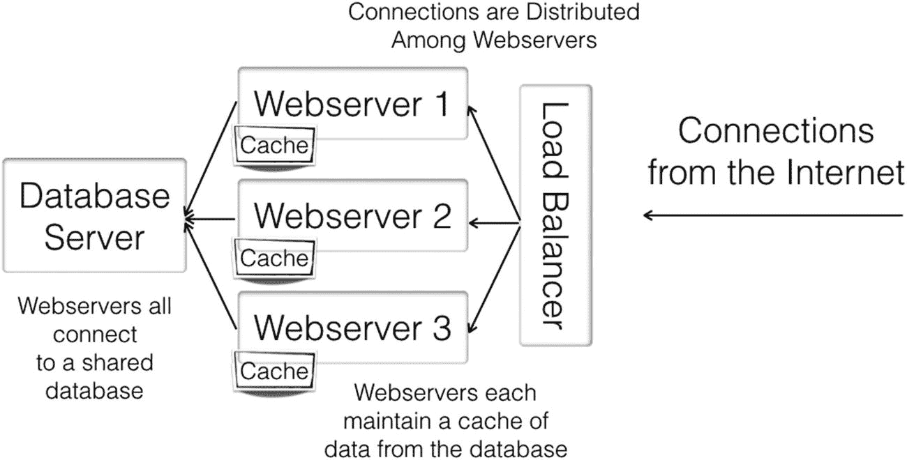
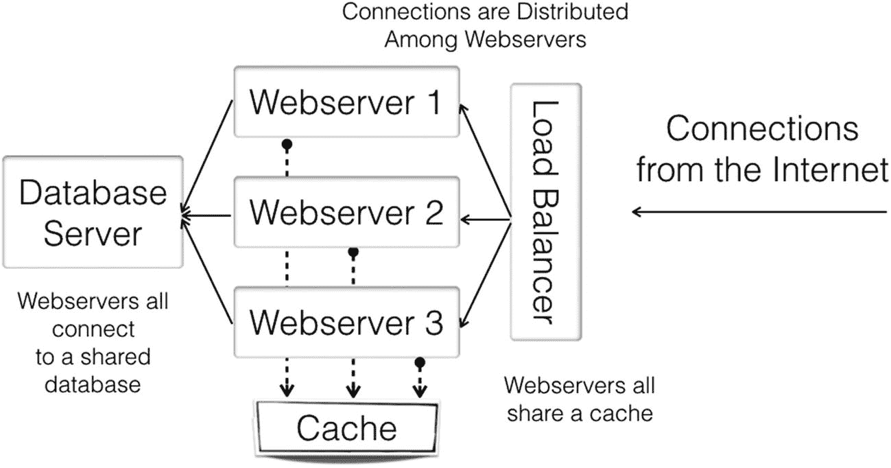
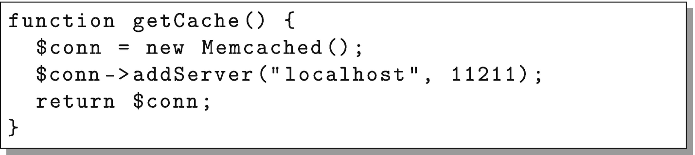
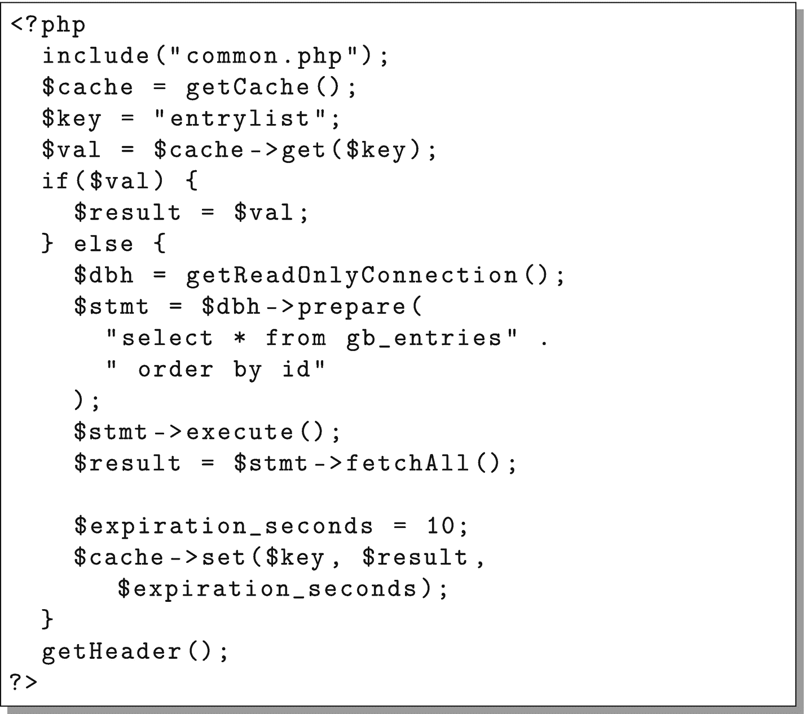
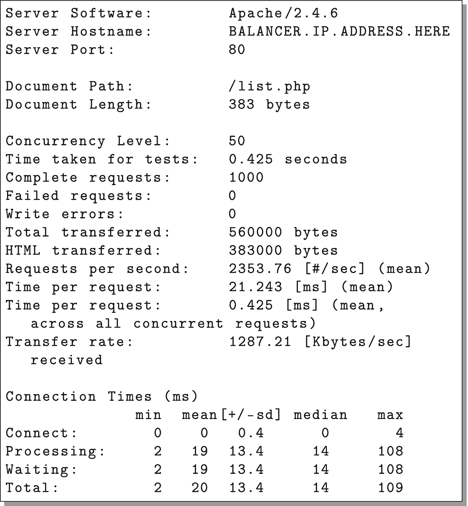

# 6. 通过缓存提升可扩展性

本章将介绍对前一章描述的基础双层架构进行的若干调整。

## 6.1 理解缓存架构

在当前的应用中，数据库是主要的瓶颈。这意味着增加更多的 Web 服务器并不会大幅提升云环境能够处理的负载。当你发现一个瓶颈时，最好花些时间思考如何避免这个瓶颈。

在我们的案例中，数据其实并不经常变化。即使它经常变化，从留言板获取精确到秒的数据也并非那么关键。如果有人需要等待几秒甚至几分钟才能看到最新的留言条目，这也不是世界末日。

当你拥有经常被访问、但可以容忍稍微（甚至很大程度）过期的内容时，就可以实施*缓存*来加速处理。缓存仅仅意味着拥有一个可以快速访问的临时结果存储。数据库之所以慢，是因为数据库主要关注*数据完整性*。你需要知道你的数据是安全的、存储在磁盘上、不会丢失，并且可以通过任意查询访问。而缓存则是短暂的——它们通常只存储在内存中。它们的目标是不惜一切代价实现快速数据检索。例如，许多缓存如果内存满了，就会直接开始丢弃数据。这没关系，因为如果缓存中不存在某个数据，我们可以去数据库重新获取。

简而言之，数据库关乎持久性和可靠性，而缓存则关乎尽可能快速地获取我想要的东西。缓存通常以简单的键/值对实现，并且通常带有一个过期时间。也就是说，缓存存储的每条数据都有一个指定的“键”。例如，由于所有留言条目只有一个列表，我们可以为此设置一个单一的缓存“键”。在应用中，这个键将被称为`entrylist`。然而，每条单独的留言条目可能都会有自己的缓存键（这样缓存就能知道它是唯一的），该键会包含该条目的数据库 ID。缓存键通常只是普通的字符串，并且在大多数缓存系统中，内容可以是任何东西。缓存不做任何特殊处理，它们只存储你在给定键下请求的任何内容，因此你必须小心，不要为两个不同的东西使用相同的键！

缓存的使用方式是：程序首先确定要为数据使用哪个键。目标是能够从 URL 参数中轻松推断出缓存键。程序首先检查缓存中是否有该缓存键对应的值。如果缓存包含该值，则使用该值。如果没有，程序则通过“正常”方式获取值（即通常从数据库获取值，并可能进行一些额外的计算或处理），然后将其连同过期时间一起保存到缓存。接着，无论该值是来自缓存还是“正常”方式，都会在应用中使用。一旦过期时间过去（或者缓存中值太多被填满），那么缓存的值就会在下次查询时消失，迫使程序通过“正常”方式获取一个全新的值。



**图 6-1** — 带本地缓存的两层架构

如你所见，这种缓存与正常访问的方法确保了在优先使用缓存机制的同时，非缓存机制同样可用，并且这个非缓存机制会填充缓存。

如前所述，数据库通常被认为是任何应用中的慢速部分，因为它必须非常小心地正确处理你的数据并永久保存。而另一方面，缓存被认为是短暂的。如果我们突然想清除缓存，这不会影响页面的运行，因为它会直接回到数据库再次获取值。

如果一个网站负载很高，并且持续请求相同的内容，即使只缓存几秒钟，也能极大提高速度并减少资源使用。我们之前对此集群进行了负载测试，发现列表页每秒能处理大约 250 个请求。如果我们将该页面的结果缓存 10 秒，那么在这段时间内就能减少 2500 次数据库请求！

图 6-1 展示了如何修改我们标准的两层架构以添加缓存层。在此架构中，每个 Web 服务器维护自己的结果缓存。这可能导致 Web 服务器之间出现微小不一致，因为它们可能在不同时间刷新了结果。但是，如果过期时间设置得不是太远，这些问题就很小。此外，如果出现问题，请记住在第 5.6 节我们讨论过负载均衡器的“粘滞性”。这会将特定用户绑定到特定服务器，意味着该用户将始终在同一台服务器上，因此也将始终使用同一台服务器的缓存。此外，这也使缓存更高效，因为每台服务器只需要为一部分用户缓存数据。



**图 6-2** — 带全局缓存的两层架构

缓存什么以及缓存多久，非常依赖于具体的应用。对于许多架构来说，有些部分可以缓存几分钟甚至几天，而其他部分则只能缓存几秒或根本无法缓存。缓存常常会导致意想不到的结果，因此在开发时，最好包含一个能够完全关闭缓存的功能，以便查看你的缓存是否是问题的根源。

如果在所有服务器之间保持缓存一致性很重要，另一种可考虑的架构是使用全局缓存，如图 6-2 所示。在这种架构中，不是每个 Web 服务器维护自己的缓存，而是存在一个所有服务器都访问的共享缓存。这会增加一点网络延迟，因为所有缓存调用都必须通过网络进行，但它增加了结果的一致性。

根据实现方式的不同，这种外部缓存也可能成为瓶颈。然而，有许多缓存服务器可以跨多台服务器进行扩展，并在这些服务器之间平衡请求。尽管如此，这也为整个系统增加了一层管理复杂性。

在几乎所有情况下，我发现设置和维护一个单一的外部缓存服务都很困难，而且几乎没有什么好处。对于大多数情况，将缓存放在每个 Web 服务器上能为你带来最大的可扩展效率，即使这会以牺牲一点一致性为代价，但如前所述，这一点可以通过使用负载均衡器的“粘滞性”来缓解。

## 6.2 在应用中实现缓存

我们将要实现的缓存架构如图 6-1 所示，这既是因为它更容易实现，也是因为从长远来看它更易于管理。我们的做法是，在`template_node`机器上执行配置变更，然后简单地关闭现有的`webnodeX`主机，并用从`template_node`复制的新主机替换它们。这比遍历每台服务器并逐一修改配置要容易得多（也更不容易出错）。

我们需要做的第一件事是安装缓存服务。我们将使用`memcached`作为缓存服务，因为它易于运行、访问和管理。要以 root 身份安装`memcached`并启动它，只需输入以下命令：

```
yum install -y memcached
systemctl enable memcached
systemctl start memcached
```

你还需要`memcached`的 PHP 扩展。这些扩展需要编译，因此我们需要安装一些额外的扩展（同样以 root 身份）。



图 6-3

Memcache 连接函数

```
yum install -y libmemcached
yum install -y php74-php-pecl-memcached
```

不要忘记`memcached`末尾的“d”，因为还有另一个名为`memcache`的扩展，它无法实现我们想要的功能。请注意，这也会在 PHP 中启用该扩展。它会为我们自动完成此操作，但如果你需要调整 PHP 端的配置，配置文件位于目录`/etc/opt/remi/php74/php.d`中。

现在，我们需要重启 PHP-FPM 进程以使用新的 PHP 扩展：

```
systemctl restart php74-php-fpm
```

接下来，我们需要修改我们的应用，以创建到本地`memcached`服务的连接。因此，请将图 6-3 中的代码添加到`common.php`中。代码中提到的数字`11211`是`memcached`默认监听的端口。

你的代码应该按照以下方式使用缓存：

1.  创建一个缓存键，用于在缓存中唯一标识该信息。

2.  检查该信息是否已存在于缓存中。如果存在，则直接使用。

3.  如果该信息尚不存在于缓存中，则通过较慢的方式（即执行数据库查询）获取信息。

    

    图 6-4

    重写`list.php`以使用缓存

4.  获取该信息后，使用该键将其存储在缓存中，并设置一个未来的过期时间（在本例中，我们将过期时间设置为从设定时起 10 秒）。

接下来，我们将更新`list.php`函数以使用缓存。图 6-4 展示了如何重写`list.php`来使用缓存。这只是脚本中将查询结果存储在`$result`中的顶部部分。实际的 HTML 输出代码保持不变。

## 6.3 重建集群镜像

现在，我们需要将此部署到我们的集群中。为此，我们首先需要为`template_node`制作另一个快照备份，然后对集群中的每个`webnodeX`服务器执行以下步骤：

1.  进入节点均衡器，从配置中移除该`webnodeX`服务器。

2.  关闭并删除该`webnodeX`服务器（可以在节点屏幕的“设置”选项卡中执行删除操作）。

3.  基于我们的`template_node`备份，在其位置创建一个新的`webnodeX`服务器（名称相同）。（务必添加一个私有 IP）。如有必要，请将其启动。

4. 将新的 `webnodeX` 服务器添加到节点均衡器配置中。

对于生产系统而言，这并不是进行代码或系统更新的最佳方式。我们将在第 12 章中介绍其他方法。这种方法只是简单地移除所有 `webnodeX` 服务器，并用新服务器替换它们。这是一个相当干净的机制，不过你需要缓慢执行此操作，以确保在重建服务器映像期间你的网站保持在线。

## 6.4 测试我们的缓存架构

一旦你的新云集群启动并运行，就可以测试新架构并查看我们是否获得了性能提升。

在此设置中，我对单个服务器和负载均衡的集群都运行了 ApacheBench。由于不再受数据库瓶颈的限制，单个服务器每秒能够处理超过 800 个请求！

此外，由于没有数据库瓶颈，性能几乎可以线性扩展。线性扩展意味着每增加一台服务器，你都能获得相同的性能提升。在这种情况下，单台服务器的性能是 800 请求/秒，两台服务器大约达到 1,500 请求/秒，而三台服务器时，我们能够持续处理超过 2,300 请求/秒！

请注意，如果你没有看到类似的性能提升，请检查你的均衡器配置，确保你没有在某个时候开启会话粘性，因为这会将你的 ApacheBench 会话限制在单个服务器上。此外，在“设置”选项卡中，也要确保“客户端连接限流”没有开启。

图 6-5 显示了在整个集群上运行 ApacheBench 的输出。

那么，我们学到的是：缓存不仅提高了应用的速度，还改善了应用的可扩展性。因为我们只需在缓存过期时访问数据库，所以数据库的速度现在相对不那么重要了。事实上，即使我们再次提高数据库的速度（就像我们在第 5 章末尾所做的那样），它对我们的整体效率影响也相对较小，仅仅是因为它很少被使用。

另一方面，如果你实际使用该应用，你会发现发布留言板条目后，它不会立即在网站上显示。事实上，如果你快速刷新页面，你可能会发现它出现后又消失，具体取决于你所在的服务器何时刷新其缓存。

这可以通过多种方式缓解。首先，你可以减少数据被缓存的时间。在此基准测试中，缓存 1 秒还是 10 秒差别很小。因此，仅将缓存过期行更改为以下内容（即将过期时间设置为 `1` 秒而不是 `10` 秒），将使应用快速刷新，而不会显著影响我们正在测试的这些大负载下的性能：

```
$expiration_seconds = 1;
```



图 6-5

已配置缓存的 ApacheBench 输出

更进一步，如果你将会话绑定到特定服务器，你实际上可以告诉服务器在特定事件发生时清除单个键甚至整个缓存。因此，在 `create.php` 的末尾，我们可以添加以下行来清除该服务器上的列表缓存：

```
$cache = getCache();
$cache->delete("entrylist");
```

或者，如果应用足够复杂，需要删除大量键，则代码可以简单地使用 `$cache->flush();` 来完全清除整个缓存。

总之，正如你所见，缓存架构可能会使你的应用稍微复杂且难以管理，但由于其通常能带来显著且戏剧性的性能和可扩展性提升，因此通常是值得的。

###  缓存调试技巧

缓存虽然好处巨大，但也带来了自身的一系列问题。为了更好地调试网页，最好始终准备一组参数，你可以将其传给应用程序以关闭缓存。例如，在我自己的许多应用程序中，在 URL 中传入 `no_cache=1` 就会关闭缓存。这通常是问题上报时我首先检查的地方。

以下是可能遇到缓存问题的一些迹象，以及相应的处理方法：

- **问题**：即使数据库中有新内容，你的应用程序仍输出旧内容。

  **诊断**：缓存中保留了过期的内容。

  **解决方案**：让内容更快过期，或者提供额外的缓存键信息，以便缓存知晓何时需要新数据。

- **问题**：你的应用程序根据参数输出了不恰当的数据。

  **诊断**：这通常发生在缓存键不够具体时。例如，如果内容以错误的语言输出，那可能意味着你需要将当前语言作为缓存键的一部分。

  **解决方案**：在缓存键中添加更多参数，确保真正用唯一键标识每一份独特内容；或者你也可以决定此内容过于特殊，不宜缓存。

- **问题**：同一页面每次刷新时输出不同内容。

  **诊断**：每台服务器上的缓存内容因访问时间不同而异。

  **解决方案**：有几种方法可以解决。你可以 (a) 减少过期时间，(b) 增加负载均衡器的“粘性”，确保同一个人始终访问同一台服务器（从而命中同一个缓存），(c) 使用全局（或同步）缓存代替本地缓存，以及 (d) 添加额外的缓存键参数，更好地协调用户从缓存中获取的数据。

- **问题**：缓存并没有像你想象的那样加速应用程序。

  **诊断**：要么从未命中缓存，要么没有缓存正确的内容。

  **解决方案**：由于出错的方式有很多，修复方法也很多。这通常发生在每个用户访问不同数据集时，导致没有任何数据能从缓存中取出。可以通过增大缓存容量和/或智能预加载可能被访问的数据到缓存中来修复。你可能还需要延长数据的过期时间。不过，问题也可能出在你需要对数据做大量后处理，这比实际查询耗时更久。