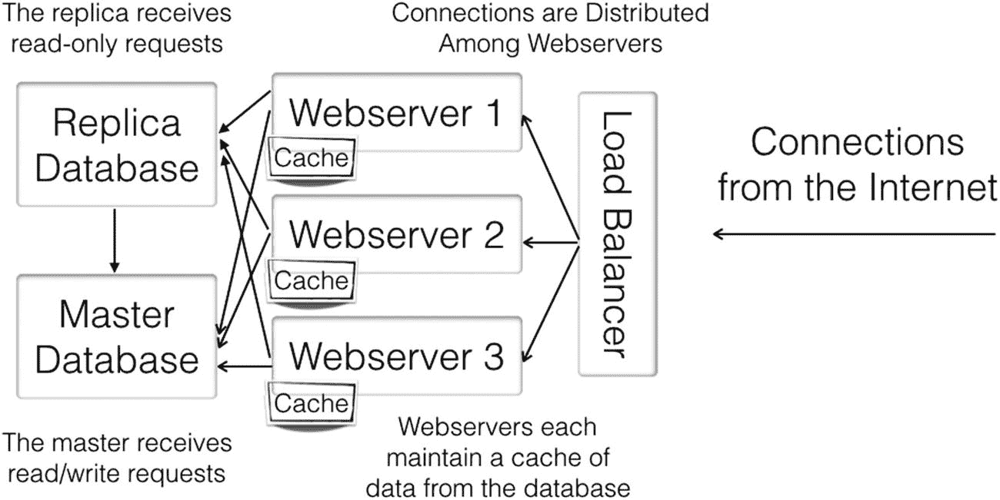
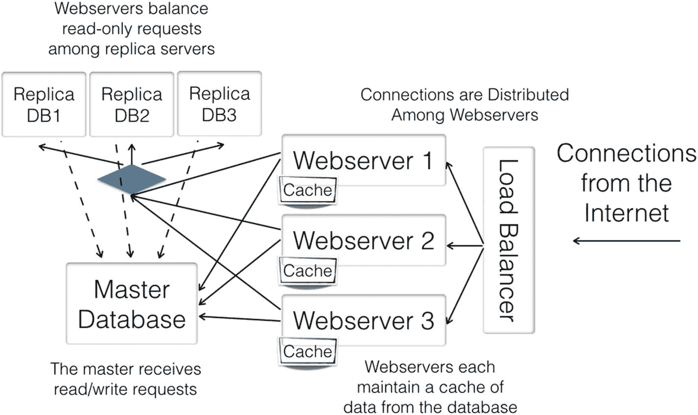
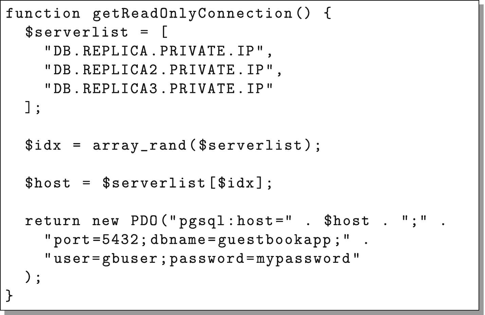
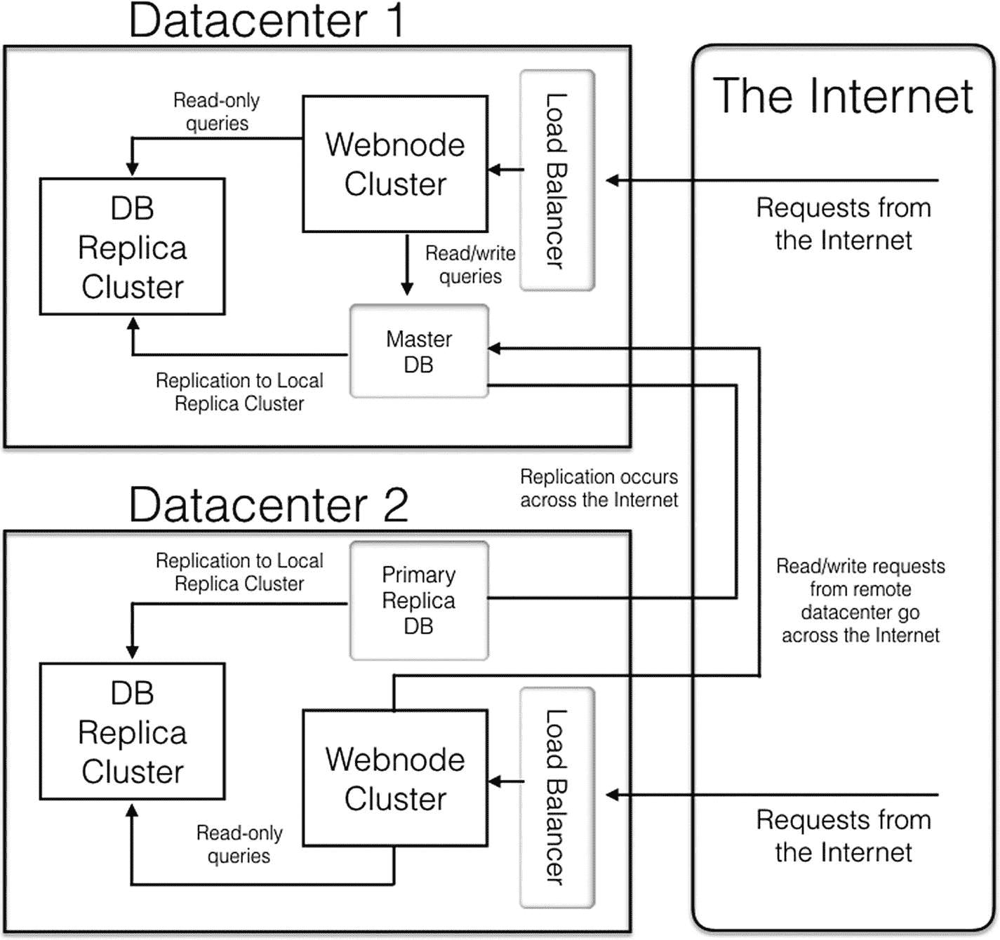

# 7. 数据库复制

有些内容根本无法缓存。临时查询、实时变化的数据、以及访问模式分布在大量不相关页面上的网站，都很难通过缓存来优化。对于此类工作负载，你可以部署更大的数据库服务器，但最终连这些服务器也会达到极限。

因此，许多应用架构都采用数据库复制，即使用多个数据库服务器来处理请求。

## 7.1 数据库复制的类型

根据需求不同，数据库复制有多种类型。基本的复制类型包括：

- **故障转移复制**：在这种配置中，复制服务器不承担负载，但它们确保如果主数据库服务器宕机，有一个包含最新数据的数据库可以立即接管。

- **主/副本复制**：在这种配置中，主数据库是唯一具有读写权限的数据库。副本服务器在主数据库记录数据时（或稍后）接收数据，但它们是主数据库的只读副本。所有更新都发往主数据库，但查询可以发送到主数据库或任何副本服务器。这也被称为“主/从复制”，其中副本数据库被视为“从数据库”。

- **多主复制**：在这种配置中，所有数据库都被视为同等的“主”数据库，可以在其中任何一个上执行写入操作。任何数据库上的写入操作随后会与集群中的其余部分同步。

本章将重点介绍主/副本复制，因为它最容易实现，实际遇到的问题最少，且性价比最高。多主复制很少使用，因为配置、维护和保持高效都很困难，并且很少有数据库支持。即使支持，多主复制也常常引入新的、难以解决的问题，例如数据冲突（即当两个不同服务器上提交了冲突的数据时）。因此，为了保持简洁，本书将聚焦于主/副本配置。

图 7-1 展示了一个典型主/副本架构的概念视图。

## 7.2 复制 PostgreSQL 数据库

PostgreSQL 的复制系统多年来在功能和易用性上都有了长足的进步。虽然使用起来并不困难，但还是需要一些解释才能理解。

PostgreSQL 内置的复制系统使用一种称为日志流的技术进行复制。为了保证数据一致性，PostgreSQL 会创建所谓的预写式日志（WAL）。基本上，PostgreSQL 会将即将执行的更改写入 WAL，然后再实际执行这些更改。这意味着，如果数据库服务器在更新过程中断电，它会有正在执行的操作记录，并且可以在重新启动后简单地完成该操作。



**图 7-1** 主/副本数据库架构图

有趣的是，这正是复制服务器也需要了解的信息。因此，为了实现数据库复制，PostgreSQL 只需将 WAL 文件传输到复制服务器，复制服务器同样会实施这些更改。这种复制方式称为 WAL 流。

要在我们的集群中实现这一点，我们需要配置主数据库以接收复制连接。以 `root` 用户身份登录 `dbmaster`，编辑文件 `/var/lib/pgsql/data/postgresql.conf`，并设置以下参数：

```
wal_level = hot_standby
wal_keep_segments = 32
max_wal_senders = 4
hot_standby = on
```

如果你使用的是更高版本的 PostgreSQL（9.4 或更高版本），还需要设置：

```
max_replication_slots = 4
```

但是，此设置会破坏我们本书所使用的 CentOS 7.2 自带的 PostgreSQL 版本。

这些配置更改实现了以下几项功能：

*   `wal_level` 调整 PostgreSQL 的“预写式日志”（即 WAL），使其保留足够的详细信息，以便发送副本服务器所需的所有数据。

*   `wal_keep_segments` 在 WAL 使用后保留足够数量的数据段，以便副本服务器如果落后了仍然可以获取数据。我们将其设置为 32，这是一个相当保守的设置。这允许新的副本服务器有充足的时间完全同步，并防止轻微的网络故障和速度减慢导致服务器失去同步。

*   `max_wal_senders` 应至少设置为副本服务器数量加二（如果决定安装更新的 PostgreSQL，可能需要将 `max_replication_slots` 设置为相同的值）。

*   `hot_standby = on` 允许副本服务器响应查询。

接下来，我们需要在 PostgreSQL 数据库中创建一个复制用户。输入 `psql -U postgres` 访问数据库，然后输入以下内容创建用于复制的用户 `replicator`（全部在一行内）：

```
CREATE ROLE replicator WITH REPLICATION
PASSWORD 'mypassword' LOGIN;
```

然后输入 `\q` 退出。

接下来，我们需要授予远程服务器打开到此服务器的复制连接的权限。将以下行添加到 `/var/lib/pgsql/data/pg_hba.conf` 文件中：

```
host replication replicator all md5
```

现在，我们需要重启数据库使新设置生效：

```
systemctl restart postgresql
```

我们的服务器现在已完全准备好开始接收复制请求。现在我们可以设置副本服务器了。

为了设置 PostgreSQL 副本服务器，我们首先需要做的是通过标准流程复制我们的模板节点，为其创建一个新的 Linode 节点来运行。在本练习中，将新节点命名为 `dbreplica`。你还需要为此机器添加一个私有 IP 地址并记下来（在本书的其余部分，我们将称其为 `DB.REPLICA.PRIVATE.IP`）。

现在，启动 `dbreplica` 并以 `root` 身份登录。

如果你已按照说明操作，此机器上应该没有运行 PostgreSQL。但如果正在运行，你可以使用 `systemctl stop postgresql` 将其关闭。PostgreSQL 关闭后，我们需要清理现有的 PostgreSQL 安装。使用以下命令执行此操作：

```
rm -rf /var/lib/pgsql/data/*
```

现在，我们需要从主系统请求一个初始二进制备份，作为复制的起点。这可以通过 `pg_basebackup` 命令完成。要生成此初始备份起点，首先像这样切换到 postgres 用户：

```
su - postgres
```

接下来，发出以下命令（全部在一行内）：

```
pg_basebackup -x -U replicator -h DB.MASTER.PRIVATE.IP
-D /var/lib/pgsql/data
```

它会要求你输入密码，然后它会从主数据库复制整个 PostgreSQL 实例，包括配置文件。接下来，此步骤完成后，你需要调整配置文件。我们在第 5 章中设置的 `postgresql.conf` 文件包含一个命令 `listen_addresses`，其中包含了服务器的私有 IP 地址。不幸的是，由于这是从主数据库复制的，它当前拥有主数据库的私有 IP 地址。要解决这个问题，只需打开 `/var/lib/pgsql/data/postgresql.conf` 并将 `listen_addresses` 配置更改为：

```
listen_addresses = 'localhost,DB.REPLICA.PRIVATE.IP'
```

成功完成此操作后，你需要告诉 PostgreSQL 该服务器将用作热备服务器。

这是通过在启动时让服务器进入“持续恢复模式”来完成的。为此，我们创建文件 `/var/lib/pgsql/data/recovery.conf`，内容如下（最后两行应在同一行输入）：

```
standby_mode = 'on'
primary_conninfo = 'host=DB.MASTER.PRIVATE.IP port=5432
user=replicator password=mypassword'
```

一切就绪后，你需要像这样退出并返回 root 用户：

```
exit
```

现在你再次成为 root 用户，我们需要重新启动 PostgreSQL 数据库，并确保它在重启时能自动启动：

```
systemctl start postgresql
systemctl enable postgresql
```

我们还需要确保防火墙中有一个开放端口以接收数据库连接：

```
firewall-cmd --add-service postgresql
firewall-cmd --add-service postgresql --permanent
```

至此，你的系统已作为副本服务器启动并运行！

要验证这一点，请运行以下命令，它将列出你所有正在运行的 PostgreSQL 进程：

```
ps afxw|grep postgres
```

列表中的进程之一应在输出中包含单词 `recovering` 或 `startup`。这意味着数据库已启动、处于活动状态，并从主服务器的 WAL 日志中获取数据。

你还可以检查日志文件，这些文件位于目录`/var/lib/pgsql/data/pg_log`。日志文件的末尾应显示类似“database system is ready to accept read only connections”和“streaming replication successfully connected to primary”的信息。

### 关于 PostgreSQL 复制的一些说明

PostgreSQL 的实现被称为“实例”，并且可以包含任意数量的数据库。如果你按照本书的说明操作，你的 PostgreSQL 实例只包含一个数据库（实际上是三个，因为 PostgreSQL 总是附带安装一对模板数据库，`template0` 和 `template1`）。使用 `createdb` 命令行程序或在运行 `psql` 时发出 `create database` 指令来创建一个新数据库是非常容易的。

无论如何，请记住，由于 PostgreSQL WAL 文件是一个系统级别的特性（即 WAL 文件由整个数据库实例共享），PostgreSQL 流复制会复制整个 PostgreSQL 实例，而不仅仅是单个数据库。

## 7.3 配置应用程序以利用主/副本复制

应用程序本身已构建为能够利用只读副本。如果你还记得，我们实际上有两个连接函数：`getReadWriteConnection()` 和 `getReadOnlyConnection()`。目前，它们都指向同一台服务器。要使用我们新的只读副本，我们只需更改 `getReadOnlyConnection()` 函数中的连接信息，它将把所有只读连接转移到副本服务器上。

我们只需要将 `getReadOnlyConnection()` 函数中的 `host` 参数更改为指向 `DB.REPLICA.PRIVATE.IP`。

完成此操作后，我们只需重新部署代码。和往常一样，我们可以通过部署到 `template_node` 然后从中重新创建 `webnode` 服务器，或者单独部署到每台服务器来实现。

## 7.4 添加更多 PostgreSQL 副本服务器

如果分离单个副本服务器未能提供你所需的性能提升，你实际上可以根据需要拥有任意数量的副本服务器。你可以通过复制模板节点并重复第 7.2 节中的步骤，或者直接复制副本服务器来实现这一点。

复制副本服务器并不像复制 Web 节点那样自动化，但它可以省去一些步骤。为此，你首先需要在当前的 `dbreplica` 节点上启用备份，然后从 `dbreplica` 的备份中创建新的副本实例。创建每个副本实例后，你需要通过 `ssh` 登录到新的副本服务器，并将 `/var/lib/pgsql/data/postgresql.conf` 中的 `listen_addresses` 值设置为其自身的私有 IP 地址，因为默认情况下它会设置为 `dbreplica` 的地址。完成此操作后，你需要使用 `systemctl restart postgresql` 重启 PostgreSQL。

创建了多个数据库副本后，你需要修改代码以利用这些数据库。如果我们能为副本数据库创建一个负载均衡器，然后将所有应用程序代码指向该负载均衡器，那将非常理想。遗憾的是，Linode 目前无法创建内部负载均衡器（即仅接受私有网络请求的负载均衡器），因此我们必须提供自己的负载分配机制。我们将在应用程序代码中通过随机选择服务器来模拟此功能。由于我们没有负载均衡器，我们必须在应用程序代码中硬编码服务器列表，并且添加新的副本服务器也需要修改应用程序代码并重新将代码推送至所有 Web 服务器。

为了理解应用程序代码将如何修改，假设我们现在有三个副本服务器，其私有 IP 地址分别为 `DB.REPLICA.PRIVATE.IP`、`DB.REPLICA2.PRIVATE.IP` 和 `DB.REPLICA3.PRIVATE.IP`。为了让我们的只读连接在这些服务器之间循环，我们将根据图 7-2 重写 `getReadOnlyConnection()` 函数。

一旦这段代码部署到我们的集群中，所有只读请求将像图 7-3 所示那样在多个副本服务器之间进行负载均衡。这意味着我们唯一的瓶颈将是读写数据库请求。大多数应用程序仍然以只读请求为主，因此读写请求存在瓶颈通常不会造成问题。



图 7-3

多副本数据库配置示意图



图 7-2

连接到一组副本服务器

## 7.5 跨数据中心复制

对于非常大的应用程序，有时你需要比单个数据中心所能提供的更好的地理覆盖范围。此外，超关键的应用程序可能需要多个数据中心带来的可靠性，这样即使一个数据中心发生故障，应用程序也能至少部分继续运行。

创建此类设置较为复杂，因此本书不会像介绍其他架构那样提供逐步方法。然而，以下是实现此功能所需执行的基本步骤：

1.  更改 `dbmaster`，将其 `listen_address` 设置为 `*`。由于它将接收来自其他数据中心的请求，因此它也必须监听公共 IP 地址。

2.  为 `dbmaster` 设置防火墙，以防止未经授权的第三方访问。

3.  使用 SSL 加密你的 PostgreSQL 连接（请参阅后面如何启用此功能）。

4.  在新数据中心部署一个“主副本”，该副本将是 `dbmaster` 的副本，但如果你需要，它也可以作为该网络上其他副本的主节点。这仍然是只读的，但它是一个可以流式传输到其他副本的副本。

5.  在新数据中心部署一份你的 Web 应用程序副本，该副本使用 `dbmaster` 的公共 IP 地址进行读写连接，并使用本地副本的私有 IP 地址列表进行只读连接。

流程结束时，你的集群架构应该类似于图 7-4。

随着你的部署变得越来越复杂，对自动化部署处理的需求也会增加。有关自动部署的更多信息，请参见第 12 章。



图 7-4

多站点架构示意图

如果你需要在本地设置中对数据库进行读写访问，配置将变得更加困难，因为你现在必须管理系统之间的同步方式以及它们之间的网络连接中断时的应对策略。在这种情况下，你通常会将本地（非共享）数据和全局（共享）数据分离到独立的数据库实例中。对于非共享数据，你需要在每个位置设置一个主数据库。对于共享数据，你需要按照类似图 7-4 的方式进行设置。

### 在 PostgreSQL 上启用加密

要在 PostgreSQL 上启用加密，你需要以 root 用户身份进入 `/var/lib/pgsql/data` 目录。然后，你需要编辑 `postgresql.conf` 并添加以下行：

```
ssl = on
```

接下来，你需要生成一个 SSL 密钥和自签名证书。在同一目录下，执行以下命令（全部在一行内）：

```
openssl req -nodes -new -x509 -keyout server.key -out server.crt
```

这将要求你填写一份简短的表格，该表格将被编码到你的证书中。然后，你需要设置生成文件的权限：

```
chown postgres:postgres server.key server.crt
chmod 600 server.key
```

此时如果你重启数据库，服务器将允许 SSL 连接，但不会要求使用 SSL。要强制使用 SSL 连接，你可以将 `pg_hba.conf` 中的任意或所有 `host` 行改为 `hostssl`。

完成所有更改后，你可以使用以下命令重启数据库：

```
systemctl restart postgresql
```

## 7.6 数据分片

数据库可扩展性的另一个选择是数据分片。数据库分片的概念相对简单——它意味着你以某种方式对数据进行分区，使得并非所有数据都依赖于同一个数据库系统。

例如，你可以这样分片：所有姓名以“A”和“B”开头的客户放在一个数据库中，所有姓名以“C”和“D”开头的客户放在另一个数据库中，以此类推。你可以根据自己偏好的任何方法对数据进行分区，只要系统能够轻松判断需要查询哪个数据库即可。其核心在于，数据本身被拆分到不同的数据库系统中，而不是由同一个数据库系统管理所有内容。

在这种系统中，通常要么由应用程序负责分片，要么存在一个中间层来处理将连接引导至相应数据库的工作。一些较新的工具已经开发出来，例如 `pg_shard`，它旨在作为一个数据库插件无缝运行。

无论如何，分片会带来一整套数据管理和数据完整性问题。数据库的要点之一便是确保数据的一致性。而分片本质上为了达到扩展性，移除了数据库所提供的许多保护机制。因此，务必清楚自己为何要分片以及如何分片，以将风险降至最低。

例如，如果你将客户数据分片到不同的数据库，你也应该将相关的记录一起分片，这样客户及其记录都由同一个数据库服务和管理。想象一下，如果你需要从备份中恢复记录，但某些相关记录却存在于另一个不同的数据库系统中！

分片工作量很大，需要大量规划，并且高度依赖于你的使用和工作负载的具体情况，因此很难泛泛而谈。尽管如此，如果你在寻找更多扩展数据库的方法，分片绝对是一个选项。分片还可以与其他方法协同工作，例如主-从复制或多主复制，但同样，这需要大量的额外关注、维护和管理才能使其良好运行。

如果你的登录组不共享任何数据，分片会更容易。例如，假设你构建了一个电子邮件营销系统。在此类系统中，不同客户很少共享数据。因此，将他们的记录完全分开存储毫无问题。

你甚至可以运行几个完全独立的云，每个云服务于一组不同的客户。来自客户 A、B、C、D 的登录请求会被分发到云 1，来自客户 E、F、G、H 的登录请求会被分发到云 2，以此类推。如果这些云都是完全独立管理的，这种设置还能在一定程度上缓解灾难，因为不太可能所有数据中心同时完全瘫痪。