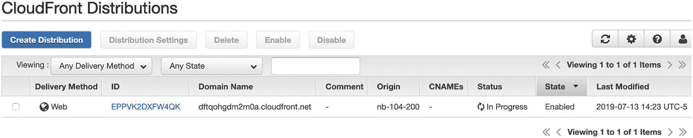
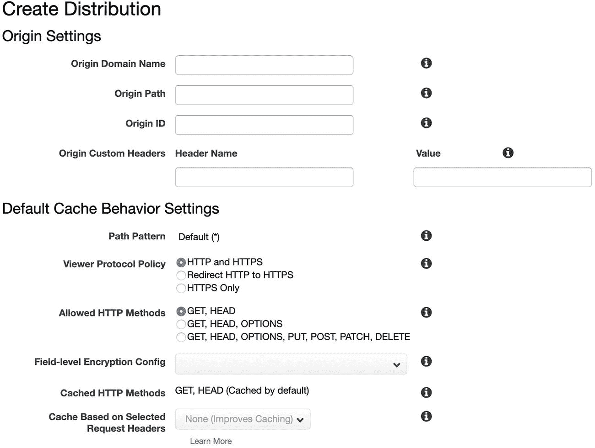
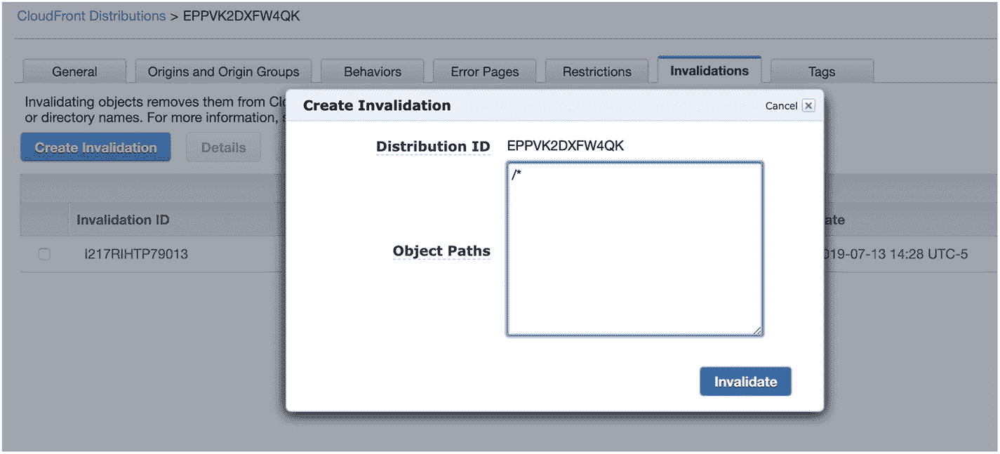

# 8. 使用内容分发网络

到目前为止，我们为云应用所做的扩展努力主要集中在动态内容的服务上（即从数据库查询中获取的内容）。然而，对于许多网站来说，动态内容实际上只是其系统中很小的一部分。事实上，在任何网站上，绝大多数的请求甚至都不是针对你的动态内容的，而是针对你的静态内容——你的图片、样式表和 JavaScript。因此，在寻找扩展云应用的方法时，切记不要忘了同时扩展你的静态资源。

你可以通过创建更多的前端 Web 服务器来扩展静态资源，因为通常这些服务器也负责提供静态资源。然而，这样做成本会更高（你需要保持更多服务器在线），也更难管理（节点更多意味着管理更复杂）。

扩展静态资源实际上比扩展动态资源要容易得多，因为你无需过多担心资源变更时会发生什么。因此，有专门为扩展静态资源而构建的服务。这种扩展静态资源交付的服务被称为“内容分发网络”（CDN）。

## 8.1 CDN 如何工作？

大多数 CDN 的工作方式是它们拥有一个全球分布的内容服务器网络。假设你有一个 10MB 的图片想要通过 CDN 来提供。通常，如果用户直接向你的服务器请求这张图片，那么你的服务器会将处理时间和带宽耗费在发送这 10MB 图片上。如果用户位于大洋彼岸，那还会带来额外的问题，因为你的服务器将浪费大量资源来管理一条缓慢且嘈杂的连接。

CDN 允许你将用户重定向到 CDN 上该图片的 URL。CDN 在第一次看到该 URL 时，通常对图片一无所知，但它有规则告诉它如何在你自己的服务上找到原始图片。从那时起，在 CDN 第一次抓取到图片之后，每次有其他用户请求该图片，CDN 都会负责将图片传递给用户，而完全不必经过你的服务器。

此外，大多数 CDN 的服务器分布在许多不同的物理位置。这些位置被称为“存在点”（Points of Presence，PoPs），那里的服务器通常被称为“边缘服务器”（因此 CDN 也常被称为“边缘缓存”）。通过在多个 PoP 使用边缘服务器，CDN 不仅可以通过大量服务器提供扩展能力，边缘服务器还能让 CDN 提供在地理位置上更靠近用户的服务器。如果用户可以从附近的服务器获取大量数据，而无需跨越大洋去检索，这将大大提升用户体验。

对于任何知名的 CDN 来说，它们实际上可以为提供静态资源提供无限的扩展能力——你无需担心会超出其网络负载。只要资源不发生变化，CDN 就能完美处理对该资源的任意数量的请求。

通常，CDN 的主要成本在于带宽。然而，许多 CDN 的带宽成本比云服务器要低。现在，使用 Linode，你得拥有一个流量极大的网站才能用尽你套餐内包含的带宽。不过，如果真的超出了，通过 CDN 提供的带宽费用会稍低一些。无论如何，即使你的服务器套餐包含了足够的带宽，CDN 带来的扩展性提升所带来的好处通常也值得付出那点微小的代价，因为你无需持续运行服务器来应对可能到来也可能不来的流量。你只需为实际使用的带宽付费。

## 8.2 搭建一个简单的 CDN

值得庆幸的是，大多数 CDN 都非常容易设置。本书中，我们将使用亚马逊的 CloudFront 作为 CDN，尽管还有许多其他选项（仅举几例，如 CloudFlare、StackPath、CDN77 和 Fastly）。CDN 的好处在于，由于它们提供的服务相当透明，因此可以轻松地为 CDN 混合搭配不同的服务提供商。

CloudFront 的工作方式非常简单：

1.  你将所有静态内容托管在你的主站点上。这是你内容的“官方”存储库。

2.  你在 CloudFront 上创建一个主机来提供你的内容（通常，该主机会有一个类似 `xyzabc.cloudfront.net` 的名称）。

3.  你告诉 CloudFront 服务器你的主站点的 URL。

4.  每次你从站点链接到静态内容时，你都使用 CloudFront URL 链接到它，而不是链接到你自己的服务器上的内容。例如，如果你的图片位于 `http://mysite.example.com/mydirectory/myimage.png`，那么当你链接到它时，你将使用 URL `http://xyzabc.cloudfront.net/mydirectory/myimage.png`。CloudFront 会根据你的配置知道如何找到 `myimage.png`，并将其缓存并提供给你的用户。

CloudFront 第一次收到图片请求时，它会前往你的站点获取它。然后，后续的任何请求将直接由靠近请求用户的 CloudFront 服务器提供服务。

让我们来看看如何使用 Amazon AWS 和 CloudFront 实际操作。你需要做的第一件事是在 `http://aws.amazon.com` 注册 AWS。我假设你可以独立完成注册过程，无需我指导。

AWS 提供了数量惊人的可用服务，因此其仪表板并非列出所有服务，而是让你进行搜索。在搜索栏中输入“CloudFront”，然后它就会允许你进入 CloudFront 仪表板。

由于你是第一次使用 CloudFront，它会显示一个写着“创建分配”的按钮。用 CloudFront 的术语来说，一个分配就是一个 CDN 复制器服务。

点击“创建分配”后，CloudFront 会询问你的交付方式，并提供“Web”或“RTMP”选项。RTMP 是用于流式传输大量视频内容的协议。但由于我们只是分发像图片和样式表这样的基本资源，我们将选择从基本的 Web 交付开始。

接着，Amazon 会要求你提供关于分配的详细信息，如图 8-1 所示。在下方实际上还有大量其他选项，但唯一必填字段是“源域名”，即你想要 CloudFront 从中获取资源的站点的 DNS 主机名。这不能是 IP 地址，必须是某种 DNS 主机名。如果你尚未为应用程序设置 DNS 主机名，你可以直接使用 Linode 自动生成的主机名之一。如果你进入 Linode 的 Node Balancer 界面并点击你的负载均衡器，它会为你提供一个（非常长，可能会分开两行显示的）内部生成的负载均衡器主机名（类似 `nb-BALANCER-PUBLIC-IP-ADDRESS.dallas.nodebalancer.linode.com`）。填写完“源域名”后，向下滚动到页面底部。



图 8-2：CloudFront 分配列表



图 8-1：创建 CloudFront 分配

在页面底部，有一个“创建分配”按钮。点击此按钮后，你将进入一个分配列表，其中会显示你新创建的分配，类似于图 8-2。此屏幕最重要的部分是“域名”，它显示了你如何访问新创建的分配（你可能需要调整字段大小才能看到完整的名称）。它还会提供一个状态，该状态从“进行中”变为“已部署”可能需要 5 分钟到 1 小时不等。一旦部署完成，你就拥有一个正在运行的 CDN 了！

## 8.3 使用你的 CDN

一旦状态变为“已部署”，此域名将完整镜像你的原始站点。但是，它只是你站点的静态版本。如果你的站点发生了变化，除非你告知 CloudFront，否则它不会更新其资源。

假设 CloudFront 给你的域名是 `xyzabc.cloudfront.net`。这意味着如果你访问 `http://xyzabc.cloudfront.net/list.php`，它会显示你的留言板列表。但是，如果你随后修改了留言板列表，这些更改将不会反映在你的 CDN 上——它把所有内容都视为静态资源。这就是为什么在大多数情况下，CDN 只提供静态资源——图片、样式表、JavaScript 等。

因此，我们不要通过 CDN 访问整个站点，而是修改应用程序，仅通过 CDN 提供我们的样式表。我们只需修改 `common.php` 中的一行代码。在 `getHeader()` 函数中，我们只需将 `<link>` 标签改为：

```
<link rel="stylesheet" type="text/css" href="http://xyzabc.cloudfront.net/style.css" />
```

请务必将 `xyzabc.cloudfront.net` 替换为你自己分配的域名！一旦在所有服务器上部署，你的样式表就将由 CDN 提供。



图 8-3：从 CDN 移除内容

这意味着你的服务器几乎再也不用提供样式表了。偶尔，CDN 可能会过期其某些缓存内容，但这由 CDN 自行决定。CDN 会自行优化存储多少数据、存储多长时间以及多久重新请求一次你的原始文件。对于更高级的应用程序，你可以配置 Apache 提供 `Expires:` HTTP 头或 `Cache-Control:` HTTP 头，以指定 CDN 应保留数据的最长时间。

然而，假设你部署了一个实际带有更新样式表的新版本应用程序。这意味着 CDN 正在为你提供的版本现在已经过时——它的缓存中可能仍然存有旧版本。这完全不是问题，这只意味着你需要手动告诉 CDN “作废”你的内容，以便它重新请求。

要在 CloudFront CDN 上作废内容，首先点击你的 CloudFront 分配的 ID。这将带你进入一个信息页面，描述分配上设置的所有选项。在靠右的位置，有一个名为“作废”的标签。点击此标签，然后点击“创建作废”。这将带你进入一个类似于图 8-3 的界面。在“对象路径”字段中，清空其中的任何内容，然后只输入 `/*` 来作废所有内容。虽然 CloudFront 允许你进行细粒度访问，以作废和移除 CDN 上的特定项目，但我发现，在大多数情况下，简单地作废所有内容更加简单和清晰。点击“作废”按钮即可生效。

作废操作可能需要几分钟才能传播到所有 CloudFront 的服务器，但不久后所有服务器都将提供你的新内容。当作废的“状态”变为“已完成”时，你就知道操作完成了。

## 8.4 使用 CDN 缓存整个网站

除了缓存 CSS、JavaScript 和图片等独立内容外，现代 CDN 实际上可以让你缓存整个网站，从而在互联网上实现即时扩展。虽然这对我们这样的网页 *应用* 不适用，但如果你拥有一个基础网站，这几乎可以零成本、无需额外配置，让你的网站能即时扩展以服务无限数量的用户。

我们来看看如何使用 CloudFront 实现这一点。为了让 CDN 直接提供你的网站服务，你需要将主站点的 DNS 指向 CDN 的服务器。

你可能会想，只需将网站的 A 记录设置为 CDN 即可。然而，CDN 通常不会提供其主机的 IP 地址。原因在于 CDN 拥有*多个* IP 地址（每个 PoP 一个），它们通常依赖 DNS 查询来决定将哪个 IP 地址分配给哪个客户端（即，它会提供一个地理位置上离客户端最近的 IP 地址）。这意味着我们不能简单地在 DNS 中指定 CDN 的 IP 地址来将网站指向它。

相反，CDN 通常通过 DNS CNAME 记录来处理这类事情。CNAME 即“规范名称”——它告诉浏览器在 DNS 查询中使用另一个名称，并将该名称的查询结果用于我们自己的 DNS 查找。如果你将 `www` 设置为指向你的 CloudFront 主机的 CNAME，那么 CloudFront 仍然可以使用自己的 DNS 机制为每个客户端分配正确的 IP 地址。

然而，这又带来了另一个问题。CDN 需要知道你可能是通过哪个主机名来访问它的。也就是说，如果你将 `www.example.com` 的 CNAME 指向 `abcxyz.cloudfront.com`，当 CloudFront 的某台机器收到对 `www.example.com` 的请求时，它需要知道应该提供与 `abcxyz.cloudfront.com` 相关联的缓存内容。

这可以通过 AWS 中的分配设置来完成。这些设置位于分配的“常规”选项卡下。点击“编辑”，找到名为“备用域名 (CNAMEs)”的字段。在这里，你可以输入任何已设置 CNAME 指向此分配的主机名（每行一个，或以逗号分隔）。

然而，这会产生一个问题，因为 CDN 需要从某个地方检索你的数据，而你已经将 DNS 指向了 CDN，而不是你自己的服务器！要解决这个问题，你只需设置一个供 CDN 拉取数据的内部 DNS 名称（可以命名为 `www2.example.com` 或 `www-internal.example.com`），然后将 `www` 的 DNS 设置为指向 CDN（注意，这里“内部”并不意味着只有我们自己可见，因为它和主站点一样完全暴露在公共互联网上，而是指它并非我们引导最终用户访问的目标地址）。

通过这样做，CDN 就可以让你的网站实现无限的访客增长。


### 处理裸域名

从技术上讲，你不能为根级域名创建 CNAME。你可以为 `www.example.com` 创建 CNAME，但不能为 `example.com`。虽然你的 DNS 服务器可能允许这样做，但这违反了规范，并且可能给不期望这种情况的客户端带来各种奇怪的问题。因此，你需要确保有一种机制，将你的裸域名（即 `example.com`）重定向到你的 CNAME 主机（即 `www.example.com`）。

为了解决这个问题，许多 DNS 提供商提供重定向服务，可以自动将所有对裸域名的请求重定向到 `www` 主机。如果你的 DNS 提供商不提供此服务，`wwwizer.com` 的热心人士提供了一个免费服务可以为你做到这一点。基本上，如果你将裸域名的 A 记录指向 `174.129.25.170`，它就会被自动重定向到带有 `www` 前缀的同一域名。

有关此服务的更多信息，请访问 `http://wwwizer.com/naked-domain-redirect`。

还要记住，与任何过于廉价的服务一样，你应该采取适当的预防措施。让他们重定向你的流量可以简化事情，但让一个与你没有合同关系的第三方来为你重定向流量也可能带来问题。