# 9. 使用 S3 实现无限磁盘空间

对于一个真正可扩展的网站，另一个经常需要的方面是无限制的磁盘存储。管理服务器的大规模存储确实是一项艰巨的任务。决定多少冗余、多少可访问性、每台服务器多少磁盘，以及如何管理磁盘以确保提前知道磁盘是否故障，都是一项艰巨的任务。即使是对于小规模网站，管理文件也可能很困难。

值得庆幸的是，使用文件存储服务可以让您将这些任务外包给第三方，其成本可能远低于您自己尝试去做。文件存储服务的黄金标准是亚马逊的`S3`服务。`S3`代表简单存储服务。这个缩写词在很大程度上是真实的——对于简单的情况，`S3`相当容易设置，但它也包含相当大的灵活性，可用于更复杂的任务。

`S3`以每 GB 非常低的成本为您提供无限的空间。它将随您扩展，并让您免于本地存储文件带来的所有文件管理麻烦。

还存在其他云存储服务，其中许多具有更好的定价结构。一些更常见的包括`Backblaze B2`、`DigitalOcean`的`Spaces`和`Rackspace`的`Cloud Files`。这里我们使用`S3`，因为它拥有最广泛的采用和集成。

## 9.1 开始使用 S3

`S3`是亚马逊`AWS`工具套件的一部分。因此，您可以使用在第[8]章中创建的相同登录名来访问`AWS`。

登录`AWS`后（URL 是[`http://aws.amazon.com`](http://aws.amazon.com)），您可以在“存储”标题下访问`S3`。当您点击`S3`时，您将看到一个类似于图 9-1 的屏幕。

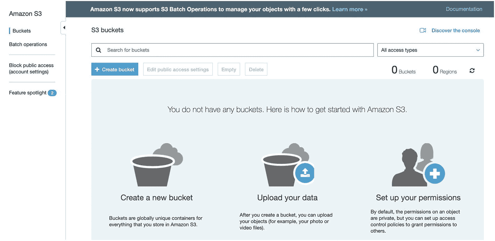

**图 9-1 `S3`初始屏幕**

此屏幕的主按钮是“创建存储桶”按钮。`S3`将其所有文件组织到所谓的“存储桶”中。存储桶有点像命名的硬盘驱动器。这是您存储所有文件的地方。存储桶名称必须是唯一的，不仅对您的帐户，而且实际上跨所有亚马逊。因此，您不应该依赖任何特定的亚马逊存储桶命名约定，这些约定假设您可以预测将来哪些名称可用。相反，最好让存储桶名称在您的应用程序中可配置，以便于管理。

当您点击“创建存储桶”时，它会要求您提供存储桶名称和区域。`AWS`除了`CloudFront`之外，几乎所有服务都按区域组织。就我们的目的而言，区域本身没有太大区别。但是，如果您有特定原因需要在特定的物理位置拥有存储桶，`AWS`允许您选择它的位置。点击“创建”按钮来创建您的存储桶。

成功创建存储桶后，您应该会看到您的存储桶列表（只有您的一个存储桶）。如果您点击您的存储桶，您可以浏览您空的存储桶。为了熟悉`S3`，只需从您的硬盘驱动器上传一个文件到存储桶。点击“上传”按钮，然后您可以将文件从您的计算机拖放到您的存储桶。点击“上传”开始上传。

## 9.2 S3 中的文件夹

如果您在`S3`控制台中查看，您会注意到您可以在存储桶中创建文件夹/目录。然而，在`S3`中，文件夹实际上并不是真实的。实际上，`S3`存储桶具有完全扁平的结构，只有文件名和文件（技术上，文件名被称为“键”，文件本身被称为“对象”）。但是，文件名可以包含斜杠字符。然后，`AWS`用户界面使用斜杠字符向您显示文件，就好像它们在文件夹中一样。当您在`S3`中“创建文件夹”时，它实际上是在创建文件夹名称的空文件，名称以斜杠结尾。简而言之，`S3`控制台让您看起来有文件夹和子文件夹，但实际上它只是一大堆文件，其中一些文件名中包含斜杠，`S3`控制台利用这些斜杠分隔成假文件夹，以便于浏览。

## 9.3 获取凭证

在我们连接`S3`帐户到服务器之前，我们需要创建一组安全凭证。为此，`AWS`使用一个称为`IAM`的系统，即“身份和访问管理”。`IAM`允许您创建具有受限权限的用户，这样如果您的安全密钥被泄露，它不会让攻击者完全控制您的环境。与其他服务一样，`IAM`可以在其服务列表下搜索`IAM`找到。当您第一次加载`IAM`屏幕时，它将类似于图 9-2。

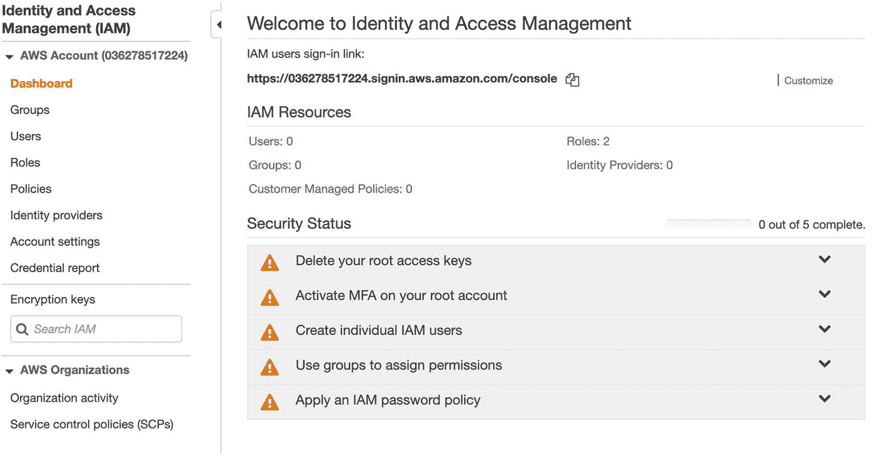

**图 9-2 `IAM`初始仪表板**

`IAM`主要使用“组”来管理权限，这些组本质上是权限的容器。因此，我们将从创建一个组开始。首先点击左侧面板上的“组”，这将显示一个空的组列表。然后点击“创建新组”。这将弹出一个屏幕，要求输入组的名称。我们将使用名称`guestbook-access`（名称不重要，我们稍后只需要引用该名称）。点击“下一步”继续。

接下来，您将向组附加策略。策略是复杂的权限组。值得庆幸的是，`AWS`有非常有用的预定义策略。对于我们的目的，我们只需要名为`AmazonS3FullAccess`的策略。您可以在筛选框中搜索它，找到后选择它。图 9-3 显示了这看起来的样子。

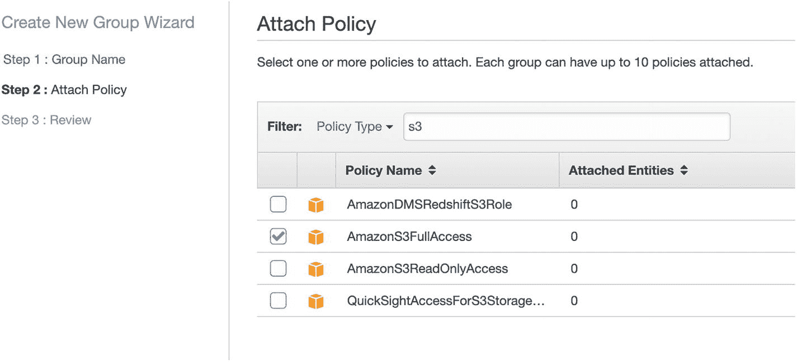

**图 9-3 附加策略**


### 图 9-3  
将策略附加到组  

最后，系统会要求你审核并确定组设置。点击“创建组”即可完成。  
现在你可以向组中添加用户。在屏幕左侧，点击“用户”链接。这将跳转到一个空的 IAM 用户列表。要开始操作，请点击“添加用户”按钮。  

在下一个屏幕中，系统会要求输入用户名和访问类型，如图 9-4 所示。我们将用户命名为 `application-user`，不过实际名称并不重要。在“访问类型”下，选择“编程访问”。这意味着创建的用户将无法登录，但只能使用 API。  

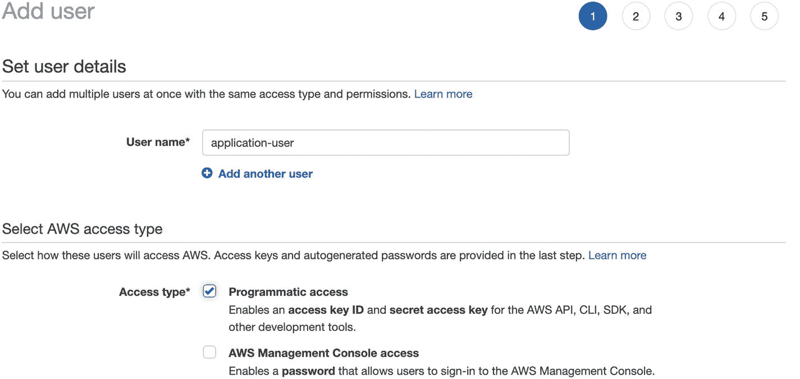  

### 图 9-4  
创建 IAM 用户  

在下一个屏幕中，系统会要求你将用户添加到组中。只需选择之前创建的组（我们将其命名为 `guestbook-access`）。  
接下来的屏幕允许你为此用户设置标签。我们不需要任何标签，因此可以继续跳过此屏幕。最后，系统会要求你审核信息。此时，你可以点击“创建用户”，系统将为你创建该用户。  

创建用户后，你现在可以下载其凭证。屏幕如图 9-5 所示。它列出了用户，然后是两个特殊字段：“访问密钥 ID”和“秘密访问密钥”。这两个字段本质上相当于该用户 API 的可重置用户名（“访问密钥 ID”）和密码（“秘密访问密钥”）。你可以下载凭证，也可以从屏幕上的字段中复制它们。  

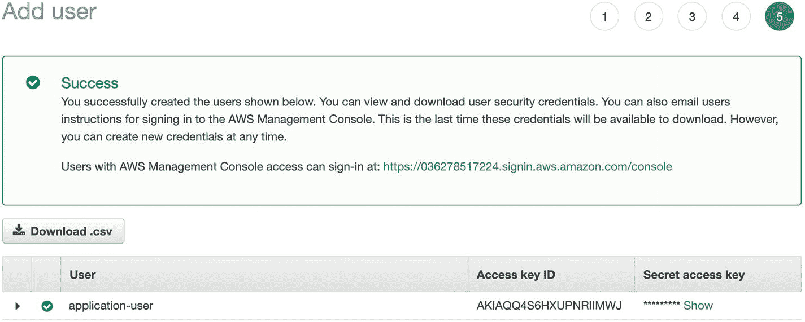  

### 图 9-5  
检索 IAM 凭证  

接下来，我们将实际的访问密钥 ID 称为 `MYACCESSKEYID`，将实际的秘密访问密钥称为 `MYSECRETACCESSKEY`。  
如果之后你丢失了这些凭证，将无法再次获取它们。但是，你可以返回用户记录并创建一套*新的*凭证。如果日后你的服务器安全受到威胁，你可以停用旧凭证并为同一用户颁发新凭证。  

## 9.4 通过命令行访问 S3  

AWS 提供了一个命令行工具，不仅可以访问 S3，还可以访问其广泛的弹性 API。要安装此工具，请在模板节点上以 root 身份执行以下命令：  

```
yum install -y awscli
```

AWS 命令行有两种主要方式指定你的访问密钥 ID 和秘密访问密钥。你可以通过环境变量或配置文件来实现。环境变量更灵活，因此我们将采用这种方式。  
如果你不熟悉命令行，环境变量是在命令行会话中设置的变量。不仅如此，你调用的命令也可以访问你的所有环境变量。此外，你设置的任何环境变量在退出登录后都会消失，因此每次登录时都需要重新设置（如果你希望它们在登录时自动设置，可以将设置这些变量的命令放入一个名为 `.bash_profile` 的文件中）。  

`aws` 命令用于凭证的环境变量是 `AWS_ACCESS_KEY_ID` 和 `AWS_SECRET_ACCESS_KEY`。  
要设置这些变量，请在终端中输入以下命令（将 `MYACCESSKEYID` 和 `MYSECRETACCESSKEY` 替换为你的实际密钥）：  

```
export AWS_ACCESS_KEY_ID=MYACCESSKEYID
export AWS_SECRET_ACCESS_KEY=MYSECRETACCESSKEY
```

现在你可以使用 `aws` 命令来操作你的 S3 存储桶。要获取存储桶列表，请执行以下命令：  

```
aws s3 ls s3://
```

它应该会列出你在 9.1 节中创建的存储桶。  

要列出该存储桶的内容，请执行以下命令（将 `BUCKET` 替换为你的存储桶的实际名称）：  

```
aws s3 ls s3://BUCKET/
```

要理解命令的工作方式：`aws` 是我们使用的主命令，`s3` 指定了要操作的子命令组，`ls` 就像 Linux 上的 `ls` 命令（用于列出内容），`s3://BUCKET/` 是我们要查看的位置。  

`aws` 命令还提供了其他用于操作文件的常用命令。除了 `ls`，我们可以使用 `cp` 将文件复制到存储桶中或从存储桶中复制出来。如果你有一个名为 `test.txt` 的文件，可以使用以下命令将其复制到你的存储桶中：  

```
aws s3 cp test.txt s3://BUCKET/
```

要将文件*从*存储桶*复制到*节点，只需交换 `s3://BUCKET/` 和 `test.txt` 的位置即可。  
此外，你还可以为文件创建临时访问 URL。这些 URL 是带签名的 URL。这意味着 AWS 知道该 URL 是由授权人士生成的，并且 AWS 将在指定时间内信任该 URL 作为访问该文件的有效方式。  
这允许你直接将用户引向 AWS 站点，以便他们检索所需数据，而无需先将数据传输到你的服务器，再由你发送。这节省了处理能力、带宽和响应时间。  

但是，要做到这一点，我们需要知道存储桶所在的区域。你在创建存储桶时指定了一个区域，但 AWS 并不总是显示该区域的“计算机化”版本，而你需要该版本用于命令行。执行以下命令来查找你的存储桶的区域（将 `BUCKET` 替换为你的存储桶名称）：  

```
aws s3api get-bucket-location --bucket BUCKET
```

这将返回一个 JSON 编码的值。键名为 `LocationConstraint`，值是存储桶所在的区域名称。区域的一些常见值包括 `us-east-1`、`us-east-2`、`ca-central-1`、`eu-west-2` 等。我们将用 `REGION` 来表示你的区域。  

要获取访问文件的 URL，请使用以下命令：  

```
aws s3 presign s3://BUCKET/FILE --region REGION
```

这将生成一个 URL，你可以复制并粘贴到浏览器中。瞧——文件就会显示出来！但是，这个 URL 仅在 3600 秒（1 小时）内有效。如果你希望 URL 的有效时间不同，可以使用 `--expires-in` 标志来指定。因此，如果你希望 URL 在 20 秒后过期，只需在命令中添加 `--expires-in 20` 即可。  

  

内联指定环境变量  
在开始编码之前，我想顺便介绍一下设置环境变量的另一种方法。  
你可以通过在与给定命令相同的行上，在命令之前指定要设置的环境变量，使其仅对一个应用程序有效。  

例如，如果我运行命令 `example-command`，并且想将环境变量 `MYVAR` 设置为 `myval`，我可以这样运行命令：  

```
MYVAR=myval example-command
```

这将设置环境变量，但仅适用于运行该命令。实际上，你可以在运行命令时设置任意多个环境变量，它们只需用空格分隔即可。例如，要设置两个值，我们可以这样做：  

```
MYVAR1=val1 MYVAR2=val2 example-command
```

这就是我们将在要创建的应用程序中设置凭证的方式。出于配置目的，最好将凭证（和其他配置信息）排除在代码之外，并通过服务器上的环境变量来设置它们。然而，这需要更深入、特定于服务器的配置细节，超出了本书的讨论范围。  

## 9.5 将应用程序连接到 S3  

现在我们已经知道如何从服务器与 S3 通信，接下来我们将连接留言板应用程序到 S3，以便用户上传带有消息的图片。这实际上相当简单。我们只需要...


1.  创建一些通用函数来获取 AWS 配置信息。
2.  允许表单包含图像字段。
3.  在创建留言条目时检查图像上传。
4.  将图像传输到 S3。
5.  在查看留言条目时为图像创建签名的 S3 URL。

第一步是在`common.php`中创建一些用于处理 AWS 凭据和配置的辅助函数。图 9-6 展示了这些函数。记得将`BUCKET`、`ACCESSKEY`和`SECRETKEY`替换为你自己的值。

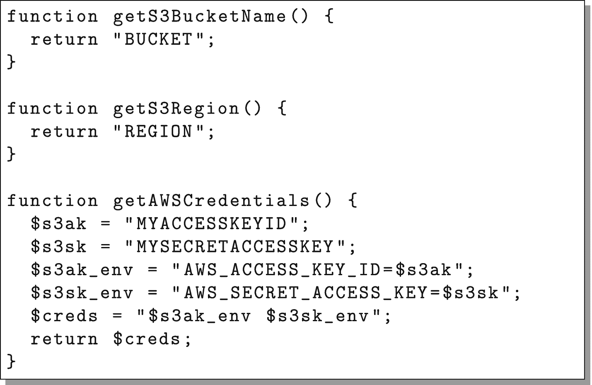

**图 9-6** 为 AWS 配置对`common.php`的补充

函数`getAWSCredentials()`将返回一个凭据字符串，该字符串可在命令字符串前设置环境变量。

下一步是在`new.php`的表单中添加图像字段。这分为两个部分。首先，我们必须修改`<form>`标签以允许文件上传。为此，请将属性`enctype="multipart/form-data"`添加到`<form>`标签中。没有它，文件输入标签将无法真正上传文件。

接下来，我们需要添加一个文件上传字段。在提交按钮之前，添加以下代码行：

```
Image (JPEG)
```

现在你的表单已配置为支持文件上传。接下来，我们将配置`create.php`以接受文件上传。

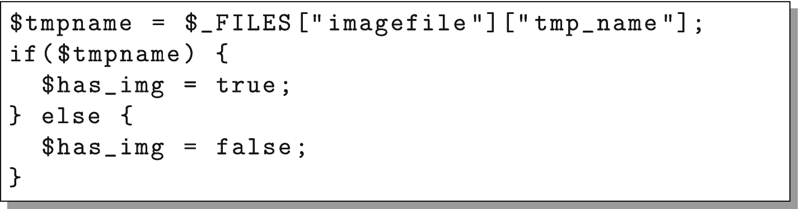

**图 9-7** 对`create.php`的修改以检测文件上传

我们需要修改两个部分。首先，将`$has_img = false;`这一行替换为图 9-7 中的代码。这段代码检测文件是否已上传，如果已上传，则确保数据库更新以反映这一点。其次，在`$stmt->execute();`这一行之后立即添加图 9-8 中的代码。这是实际将文件传输到 S3 的代码。

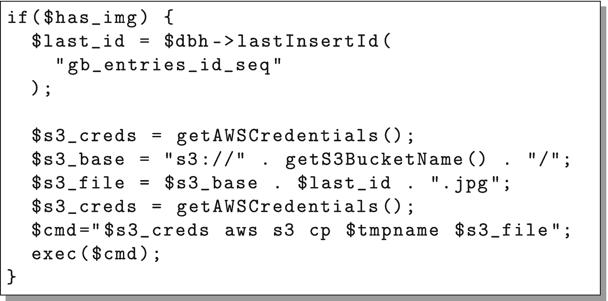

**图 9-8** 对`create.php`的修改以将文件传输到 S3

现在，我们只需要提供一种方法来查看图像，当你点击留言条目时。为此，我们需要修改`single.php`。只需在`getFooter()`这一行之前添加图 9-9 中的代码。

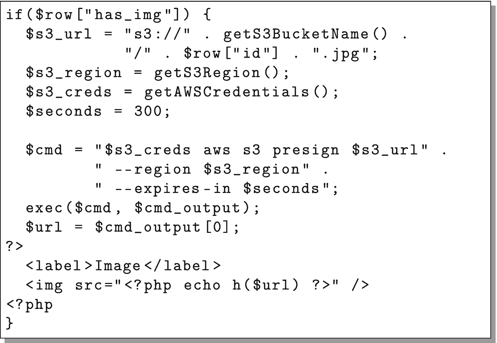

**图 9-9** 对`single.php`的修改以显示图像

这段代码将为上传请求一个签名的 URL，然后将其放入图像标签中以便查看。

请注意，对于实际应用，我们需要验证上传的文件确实是 JPEG 文件。否则，任何人都可以上传任意内容，黑客可以轻易地将系统滥用为免费文件共享站点，或用于其他恶意目的。此外，你可能还需要一个管理功能来验证上传的图像是否合适。否则，有人可能会轻易地将你的留言板变成色情共享站点。这些超出了我们简单示例应用的范围，但它们是值得记住的好点。

还要记住，你不仅要为存储空间付费，还要为进出 S3 的所有流量使用带宽付费。疏于警惕可能会导致高昂的成本。

现在，你需要在`template_node`上测试你的新代码，当它正常运行时，按照第 6.3 节所述，通过重新映像服务器将其部署到你的云集群中。

现在试试你的应用程序——它通过 Amazon S3 拥有了无限的文件存储空间！

请注意，还有一个用于 PHP 的 AWS 库，其中包含 S3 功能。在这里，我们使用了命令行，因为我们在前一节已经学习了该工具。AWS PHP 库的信息可在[`https://docs.aws.amazon.com/sdk-for-php/`](https://docs.aws.amazon.com/sdk-for-php/)中获取。

 **关于 S3 签名过期的说明**

在处理签名 URL 时，需要注意它们如何与缓存交互。在本例中，`single.php`没有被缓存，因此无需担心。然而，如果它被缓存了，重要的是要确保 URL 的过期时间远大于渲染后的代码可能在缓存中停留的时间。

例如，如果 URL 仅有效 30 秒，但缓存能持续一小时，那么，在最初的 30 秒结束后，在接下来的一小时里，用户将获得他们无法使用的 URL。在问题开始出现时（或者，最好是之前）请牢记这一点。

 **S3 文件权限**

除了签名 URL，还可以通过授予文件公共访问权限来允许访问 S3 文件。这可行，但这并不是共享文件的最佳方法。问题是，如果你只提供一个公开共享的 URL 供人们访问，那么这个 URL 可能会被四处传播，人们可以直接使用你的 S3 资源用于自己的目的，完全绕过你的 Web 应用程序。这意味着你最终可能会为别人的文件服务器买单。

即使你没有立即在应用程序中实施对文件访问的严格控制，强制所有人使用由你的应用程序控制的签名 URL 来访问 S3 对象（正如我们这里所示），意味着当你准备好实施访问控制时，一切都已就绪。至少，这可以防止在互联网上公开共享 S3 URL，而使用你的 AWS 账户资源进行大量文件下载。

如果你真的更喜欢使用此方法而非签名 URL，你可以通过首先在存储桶本身上启用公共访问，然后设置单个文件为所有人可读来管理。这也意味着你需要为新上传的文件设置权限。你可以在`aws s3 cp`命令中通过将以下标志添加到命令末尾来完成（URL 应与命令行的其余部分在同一行，等号后无空格）：

```
--grants read=uri=http://acs.amazonaws.com/groups/global/AllUsers
```

然而，这仅在存储桶本身已配置为允许公共访问时才有效。

10. 使用 AWS 托管


## 10.1 使用 Amazon Lightsail

虽然本书大部分内容都聚焦于在 Linode 上托管你的应用，但由于许多云托管服务都基于 AWS，我认为研究一下 AWS 上的一些托管选项是值得的。

AWS 的一个问题就在于其选项数量庞大。可用的选项数量之多，实际上使得管理变得相当困难。

举个例子，有一次我在一个团队里工作，需要访问日志。经过大量搜索，我们终于找到了授予日志文件访问权限的选项。然而，结果证明，*查看*日志文件的权限，与*检索*日志文件所需的权限竟然是*不同*的。因此，虽然我有*查看*日志文件的权限，但我实际上并没有获取它们的权限。最终，他们放弃了这种细粒度控制，直接让我成为了管理员。这并不是说 AWS 没有这种能力，只是尝试管理它所花费的时间和精力，可能和你通过其他不那么“自动化”的方式节省下来的差不多。拥有过多的选择并试图满足所有人的需求，很容易让你淹没在没人有时间也没机会去掌握的选项和设置中。

有太多细粒度的控制，每个都有各自的问题、特性和缺陷。AWS“支持”的不同平台和系统数量非常庞大。然而，我发现这些支持通常存在很大的漏洞。虽然这些问题可以解决，但那些变通方法有时让我希望一开始就全部手动完成。

亚马逊首次涉足云托管领域的服务称为 EC2——弹性计算云。与 AWS 的大部分服务一样，这是一个非常灵活的云托管选项。然而，它也存在许多 AWS 服务固有的问题：要成功设置和使用它确实非常复杂。不仅设置复杂，其*定价*也复杂得离谱。他们不仅按计算时间收费，还按硬件 I/O 请求收费。没错，他们会跟踪硬盘访问次数*并据此向你收费*。

为了更好地与 Linode 和 DigitalOcean 等更易于使用的服务竞争，AWS 推出了 Amazon Lightsail。Lightsail 的功能集和定价结构与我们在 Linode 上看到的非常相似。你可以从同一个包含 CloudFront 和 S3 的 AWS 管理控制台访问 Lightsail。只需搜索 Lightsail，其仪表盘界面应类似图 10-1。

就我们的目的而言，需要注意 Lightsail 和 Linode 之间有几个细微差别：

1.  Lightsail 实例默认通过公钥连接，而不是密码，并且会连接到一个普通用户，而不是以 `root` 身份连接。
2.  Lightsail 的 CentOS 发行版预装软件包与 Linode 的略有不同。

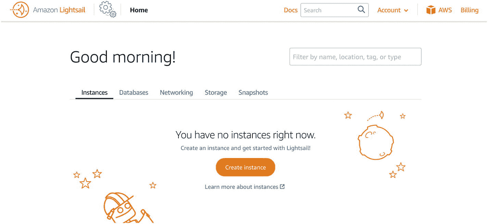

图 10-1 Amazon Lightsail 的初始仪表盘

3.  所有 Lightsail 实例都会自动添加到亚马逊的私有网络中。实际上，当你在实例上时，你看到的*唯一* IP 地址就是私有网络地址。你获得的外部 IP 会被路由到那个内部 IP 地址。
4.  Lightsail 实例的备份需要手动创建。
5.  Lightsail 有一个独立的数据库服务，如果你不想自己管理数据库服务器，可以使用该服务。

要启动并设置一个新实例，请单击“创建实例”按钮。这将带你进入一个类似图 10-2 的界面。

在这里，你需要选择托管节点的数据中心（实例位置）。这与 Linode 略有不同，因为 AWS 既有数据中心，又有*可用区*。在 AWS 中，数据中心被组织成多个可用区。这些区可以轻松地共享资源以实现负载均衡，但每个可用区都有独立的电力和外部互联网连接线路。本质上，它们表现得像是在同一个数据中心，但不同可用区中的服务器不太可能受到同一事件（例如断电或断网）的影响。因此，例如，你可以将主数据库放在一个可用区，副本数据库放在另一个可用区。这样，如果你的主数据库所在的可用区宕机了，副本（因为它位于不同的可用区）就可以被提升并充当主数据库。

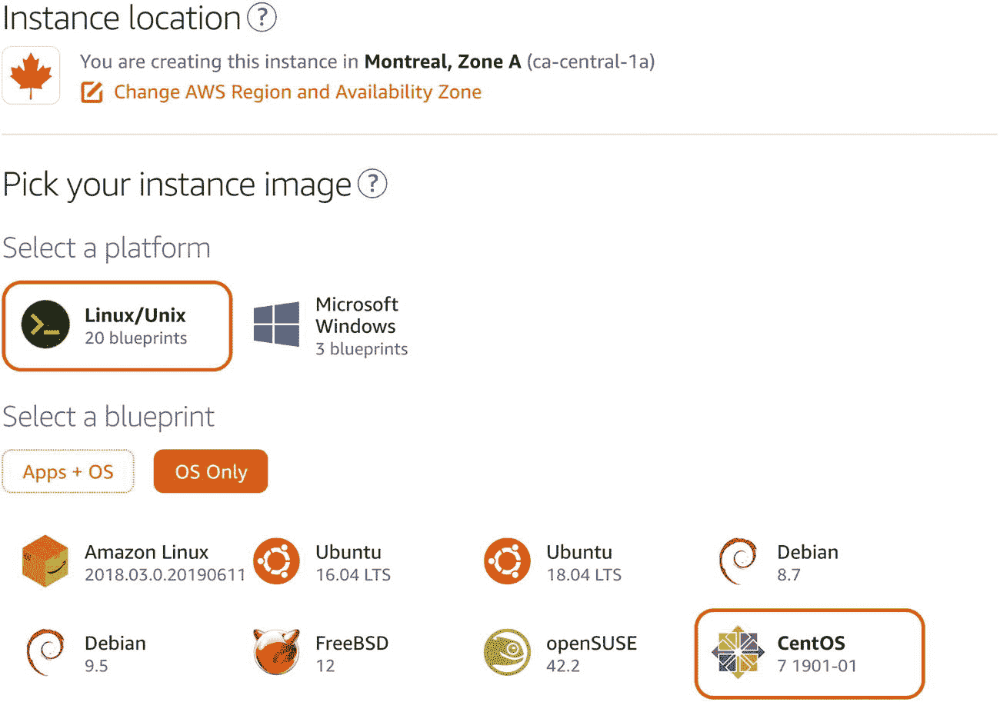

图 10-2 创建 Lightsail 实例

我们要选择的平台是“Linux/Unix”。然后，选择“仅操作系统”（其他选项允许使用针对特定任务的预配置服务器）。之后，选择“CentOS”。向下滚动，你可以忽略大多数其他问题，然后选择你想要的节点规格。然后，为了标识你的实例，像我们之前做的那样，将其命名为 `template-node`。单击“创建实例”来创建机器。

AWS 创建你的机器可能需要一些时间。创建完成后，你可以单击该机器，然后会看到一个类似图 10-3 的仪表盘。要登录，只需单击标有“使用 SSH 连接”的按钮。这将打开一个终端窗口，你将作为 `centos` 用户连接到该节点。

你可以使用这个 `centos` 用户来代替本书示例中的 `fred` 用户。或者，你也可以在需要时创建 `fred` 用户。不过，你仍然需要以 `root` 身份使用该实例来进行配置。要以 `root` 身份登录，只需执行以下命令：

```
sudo su -
```

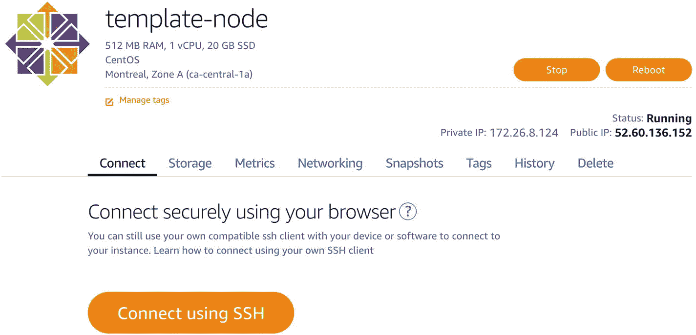

图 10-3 Lightsail 节点仪表盘

现在，你的会话将以 `root` 用户身份运行。

Lightsail 节点预装的软件包与 Linode 节点略有不同。要使你的 Lightsail 节点与 Linode 系统的起始点相似，请执行以下命令：

```
yum install -y nano
yum install -y firewalld
systemctl start firewalld
systemctl enable firewalld
```

从这一点开始，你可以基本按照第 3 章和第 4 章中的节点设置说明操作，步骤基本相同。

在第 5 章中，从备份创建新实例的机制略有不同。在 Lightsail 中，备份是使用“快照”功能创建的。你只需转到节点的“快照”选项卡，为你的快照命名，然后创建它。一旦创建完成，你就可以从该快照创建一个新节点，如图 10-4 所示。负载均衡器可以在主界面中的“网络”选项卡下从 Lightsail 创建。

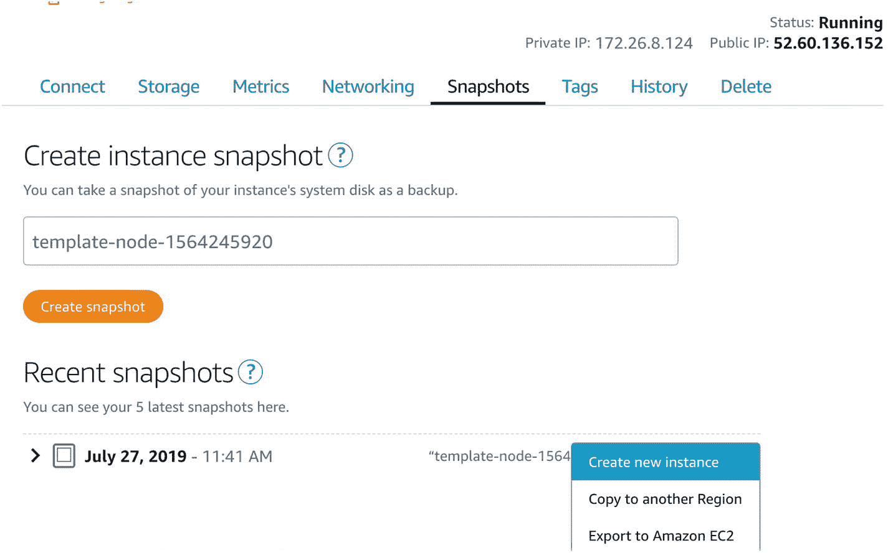

图 10-4 从快照创建节点

此后，关于如何创建云服务的其余信息没有变化，因为后续内容都围绕节点本身的操作展开。


## 10.2 在 Elastic Beanstalk 上托管

虽然本书大部分内容聚焦于基础设施即服务云，但我还是想花点时间介绍一种平台即服务云。AWS 有一种名为“Elastic Beanstalk”的 PaaS 云服务，它支持多种不同类型的应用程序，其中一种就是 PHP。

PaaS 云将云计算中的所有系统管理工作都剥离掉了。但问题是，大多数高级云系统最终仍然需要一定程度的系统管理。这并不是说当你有特殊配置需求时，PaaS 系统就无法使用，而是说，要正确、可维护地配置你的 PaaS 系统，并使其与平台提供商的操作保持同步，所花费的精力往往比你在 IaaS 云中完全掌控还要多。无论如何，在本节中，我们将介绍如何让我们的应用程序在 Elastic Beanstalk 上运行起来。

在 PaaS 系统中，我们无法控制机器。因此，我们不能指定某台机器作为数据库服务器、作业服务器等。相反，每个应用程序可以根据 PaaS 系统的意愿在任意数量的机器上进行伸缩。这通常意味着 PaaS 系统将管理数据库。

对于 AWS 来说，这意味着要使用他们的关系型数据库服务——RDS。将应用程序连接到 RDS 非常简单。Elastic Beanstalk 会为所有连接信息设置环境变量，我们只需编程让应用程序读取它们即可。

为此，我们只需修改 `common.php` 文件，替换 `getReadOnlyConnection()` 和 `getReadWriteConnection()` 函数。这两个函数应该如图 10-5 所示。

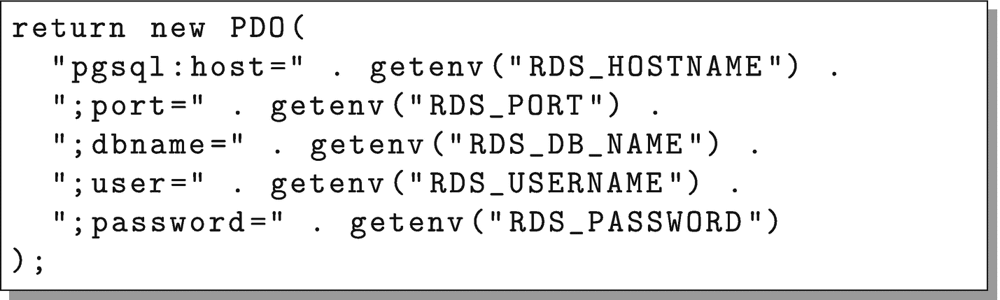

**图 10-5** 使用 RDS 访问数据库

这将根据 RDS 传入的环境变量构建一个连接字符串。

其次，由于你无法直接访问数据库，我们需要一个 PHP 脚本来为我们创建数据库表。创建一个名为 `createdb.php` 的文件，并在其中放入以下代码。

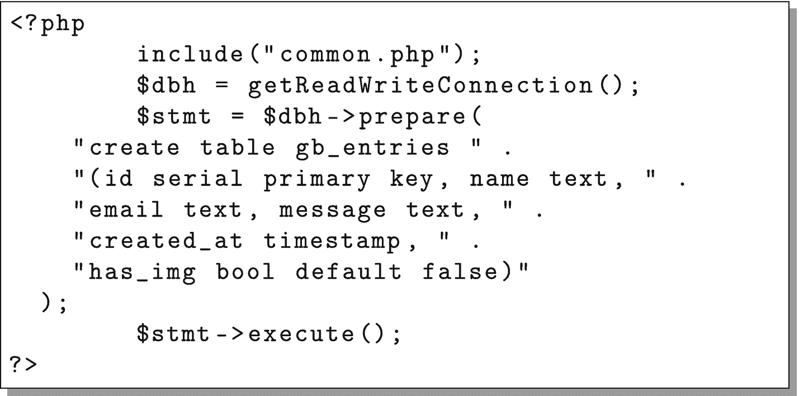

**图 10-6** 使用 RDS 创建数据库

请注意，由于我们没有特定的服务器，这些修改是在个人电脑硬盘上的本地应用程序副本中进行的。一旦修改完成，你就可以开始操作了。

要开始使用 Elastic Beanstalk，请返回 AWS 管理控制台并搜索“Elastic Beanstalk”。在仪表板上，点击标题为“Create New Application”的按钮。为其命名，然后点击“Create”。

在 EB 中，应用程序可以划分为“环境”。环境可用于各种用途，包括区分预发环境与生产环境、为不同任务划分不同的服务器组，以及在应用程序的不同版本之间快速切换。就我们而言，我们只需要一个环境。因此，点击按钮创建一个新环境。它会询问你要创建哪种类型的环境。我们需要一个“Web Server Environment”。

下一个屏幕是配置屏幕，如图 10-7 所示。你可以根据需要为环境命名，但该屏幕上唯一重要的设置是选择“Preconfigured Platform”。显然，我们选择“PHP”。默认情况下，它会加载一个示例应用程序。这正是我们目前需要的。点击“Create Environment”完成该过程。

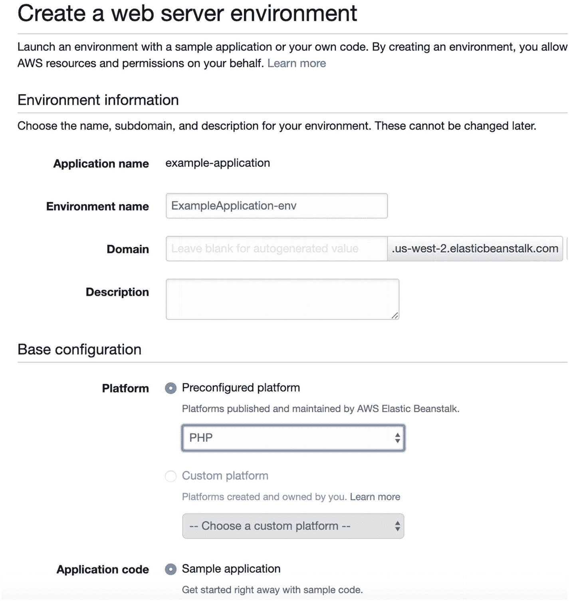

**图 10-7** 创建新环境

创建完成后，你将看到一个如图 10-8 所示的仪表板。在“Overview”部分，它显示了应用程序的基本运行状况、版本和平台。在“Recent Events”下，它列出了系统最近执行的所有操作。请注意，EB 中的*一切*操作最终花费的时间都可能比你想象的要长得多，但“Recent Events”能帮助你密切关注进度，并让你在等待时有所参照。在左侧，我们将关注三个区域：“Dashboard”（我们当前所在位置）、“Configuration”（应用程序的设置方式）和“Logs”。

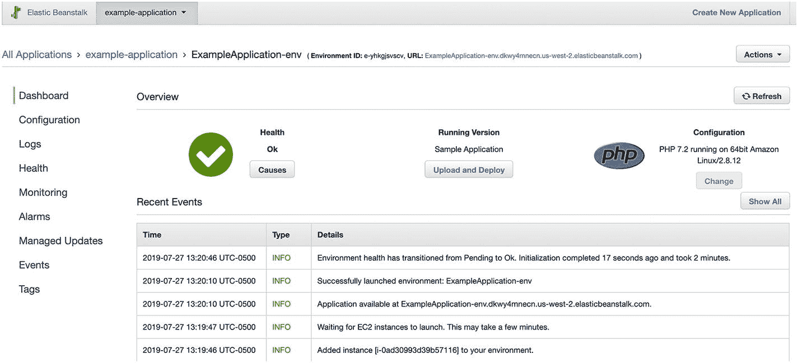

**图 10-8** EB 环境仪表板

由于我们是从示例应用程序开始的，你现在已经可以在网络浏览器中加载该示例应用程序了。在仪表板上，有一个指向你应用程序 URL 的链接。你可以点击它，它会带你进入示例应用程序。

在上传我们的应用程序之前，我们需要先设置数据库。为此，请进入“Configuration”部分，然后转到“Database”并点击“Modify”。这将允许你为应用程序创建一个 RDS 实例。将“Engine”设置为 `postgres`，输入用户名和密码（务必记下来！），然后点击“Apply”。当运行状态图标变为对勾时（这可能需要 10-20 分钟），你就可以上传应用程序了。

要上传你的应用程序，请将所有文件打包成一个 zip 归档文件。然后，在仪表板上，点击标有“Upload and Deploy”的按钮。从硬盘中选择 zip 文件，为版本命名（具体名称无关紧要），然后点击“Deploy”。运行状态图标将变为一个旋转的刷新图标，开始部署你的应用程序。当图标变回对勾时，你的应用程序就部署完成了！

但是，我们还没有完全结束。当你点击链接时，它会显示一条“Forbidden”消息。这是因为我们没有 `index.php` 文件（不过如果你愿意，可以添加一个）。然而，我们需要创建数据库，所以首先需要导航到 `createdb.php` 文件来创建数据库（只需在浏览器 URL 末尾添加 `/createdb.php` 并按回车键）。这应该会显示一个空白页面，这没问题。

现在，如果你将 URL 更改为访问 `list.php`，一切应该都能正常工作了！

现在，你可以对你的应用程序进行许多操作，使其具有可伸缩性。所有这些都可以从环境的“Configuration”选项卡中找到。默认情况下，EB 创建的环境是单服务器环境。要将其升级为负载均衡的应用程序，只需进入“Capacity”部分，将“Environment Type”更改为“Load Balanced”。这将为你提供许多可供选择的选项。最简单（也最重要）的是实例的“minimum”和“maximum”数量。将最小值设置为 `2`，以确保它至少为你启动两台机器。点击“Apply”，等待几分钟，你的应用程序现在就是负载均衡的了。

你可以进行的其他更改包括：

*   在“Instances”下，你可以更改每个单独实例的大小。
*   在“Load Balancer”下，你可以更改许多变量，包括负载均衡机制。
*   在“Rolling Updates and Deployments”下，你可以更改部署策略，以消除更新期间的停机时间（“Immutable”选项最适合生产环境，但执行更新需要很长时间）。
*   在“Software”下，你可以设置环境变量和网络服务器配置选项。
*   在“Database”下，你可以更改数据库的大小。你还可以点击“Endpoint”链接，进入 RDS 管理控制台，获取额外的数据库管理工具。


进行配置更改后，点击“应用”将使用指定的更改重新部署您的应用程序，这可能需要几分钟时间。如果您的运行中应用程序出现问题，可以前往“日志”部分，下载并查看最新的日志消息。

